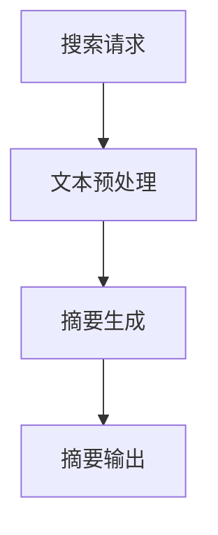

                 


## 文章标题: AI在搜索引擎结果摘要生成中的应用

> 关键词：人工智能，搜索引擎，摘要生成，自然语言处理，深度学习

> 摘要：本文旨在探讨人工智能（AI）技术在搜索引擎结果摘要生成领域的应用。通过分析AI在信息检索中的角色、需求与挑战，以及相关算法和模型，本文全面展示了AI在摘要生成中的潜力和价值。本文将介绍自然语言处理的基础理论、摘要生成算法、数学模型，并通过实战案例展示AI在摘要生成中的应用。最后，本文将对未来发展趋势和潜在挑战进行展望。

## 引言

随着互联网的快速发展，搜索引擎已成为人们获取信息的重要工具。然而，随着信息量的爆炸式增长，用户在搜索结果页面中面临的挑战也越来越大。如何在海量信息中快速找到用户所需的关键信息，成为搜索引擎亟待解决的问题。这便是搜索引擎结果摘要生成的初衷和重要性。

摘要生成，即从搜索结果中提取关键信息，以简洁明了的形式呈现给用户。这个过程不仅需要处理大量文本数据，还需要理解文本内容，提取出关键信息点。这就为人工智能（AI）技术提供了广阔的应用场景。

本文将围绕以下主题展开：

1. **AI在信息检索中的作用**：介绍AI在搜索引擎结果摘要生成中的角色和作用。
2. **搜索引擎结果摘要的需求与挑战**：分析摘要生成的需求、面临的挑战和解决方案。
3. **AI在摘要生成中的潜在价值**：探讨AI技术在摘要生成中的潜力和优势。
4. **自然语言处理基础**：介绍自然语言处理的基本概念和方法。
5. **摘要生成算法**：分析传统摘要算法、基于机器学习和深度学习的摘要算法。
6. **数学模型与数学公式**：介绍概率模型、朴素贝叶斯分类器、支持向量机等数学模型和公式。
7. **AI在摘要生成的应用**：展示AI在摘要生成中的实际应用场景。
8. **项目实战**：通过实际案例展示AI在摘要生成中的应用。
9. **未来展望**：探讨AI摘要生成技术的发展趋势和潜在挑战。

## 第一部分: AI在搜索引擎结果摘要生成的基础理论

### 第1章: AI与搜索引擎结果摘要概述

#### 1.1 AI在信息检索中的作用

人工智能（AI）技术在信息检索领域扮演着越来越重要的角色。随着大数据和云计算技术的普及，海量信息的数据处理需求日益增长。AI技术通过深度学习、自然语言处理和知识图谱等方法，为信息检索提供了更高效、更准确的方法。

在搜索引擎结果摘要生成中，AI的作用主要体现在以下几个方面：

1. **文本理解与语义分析**：AI技术能够深入理解文本内容，提取出关键信息点，从而生成高质量的摘要。
2. **个性化推荐**：基于用户行为和偏好，AI可以为用户提供个性化的摘要推荐，提高用户体验。
3. **实时更新与处理**：AI技术可以实时处理搜索请求，快速生成摘要，满足用户对信息及时性的需求。
4. **多语言处理**：AI技术能够支持多语言摘要生成，为国际用户带来便利。

#### 1.2 搜索引擎结果摘要的需求与挑战

搜索引擎结果摘要生成的需求源于以下几个方面：

1. **提高信息检索效率**：通过摘要，用户可以快速了解搜索结果的核心内容，减少阅读时间，提高检索效率。
2. **改善用户体验**：简洁明了的摘要有助于用户快速找到所需信息，提高满意度。
3. **降低信息过载**：随着信息量的爆炸式增长，用户面临的信息过载问题日益严重，摘要生成有助于缓解这一问题。

然而，摘要生成也面临诸多挑战：

1. **文本理解难度**：摘要生成需要对大量文本进行理解，提取出关键信息点，这需要处理复杂语义关系和语境。
2. **多样性需求**：不同用户对摘要的长度、内容、格式等有不同的需求，如何生成满足多样化需求的摘要是一个挑战。
3. **实时性要求**：用户对信息实时性的需求不断提高，如何在短时间内生成高质量的摘要是一个难题。

#### 1.3 AI在摘要生成中的潜在价值

AI技术在摘要生成中的潜在价值主要体现在以下几个方面：

1. **提高摘要质量**：通过深度学习和自然语言处理技术，AI可以更好地理解文本内容，生成更准确、更高质量的摘要。
2. **个性化摘要**：基于用户行为和偏好，AI可以为用户提供个性化的摘要推荐，提高用户体验。
3. **多语言处理**：AI技术能够支持多语言摘要生成，为国际用户带来便利。
4. **实时更新**：AI技术可以实时处理搜索请求，快速生成摘要，满足用户对信息及时性的需求。

总之，AI技术在搜索引擎结果摘要生成中具有广泛的应用前景和潜在价值，有望解决当前摘要生成面临的诸多挑战，为用户提供更好的信息服务。

### 第2章: 自然语言处理基础

#### 2.1 语言模型的基本概念

语言模型是自然语言处理（NLP）中的核心概念之一，它旨在描述自然语言的概率分布。语言模型通过统计方法或机器学习技术，对大量文本数据进行学习，从而生成一个能够预测文本下一个单词或词组的模型。

#### 2.2 语义理解与实体识别

语义理解是NLP中的另一个重要概念，它旨在理解文本中的含义和关系。语义理解涉及到文本分类、情感分析、命名实体识别等任务。

实体识别是语义理解的一部分，它旨在识别文本中的命名实体，如人名、地名、组织名等。实体识别对于摘要生成具有重要意义，因为实体是文本内容的重要组成部分。

#### 2.3 文本分类与聚类

文本分类是将文本数据按照预定的类别进行分类的过程。文本分类广泛应用于情感分析、新闻分类、垃圾邮件过滤等领域。

文本聚类是将文本数据按照相似性进行分组的过程。文本聚类有助于发现文本中的潜在模式，为摘要生成提供有价值的信息。

### 第3章: 搜索引擎结果摘要生成算法

#### 3.1 传统摘要算法

传统摘要算法主要包括基于关键词、基于句子的摘要算法。基于关键词的摘要算法通过提取文本中的高频关键词来生成摘要，而基于句子的摘要算法则通过分析文本中的句子结构来提取关键句子作为摘要。

#### 3.2 基于机器学习的摘要算法

基于机器学习的摘要算法通过训练模型来学习如何从文本中提取关键信息。常见的机器学习算法包括朴素贝叶斯、支持向量机、决策树等。

#### 3.3 基于深度学习的摘要算法

基于深度学习的摘要算法通过神经网络模型来学习文本特征，从而生成高质量的摘要。常见的深度学习算法包括循环神经网络（RNN）、长短时记忆网络（LSTM）和注意力机制等。

#### 3.4 摘要算法的性能评估

摘要算法的性能评估主要通过F1值、准确率、召回率等指标来衡量。F1值是准确率和召回率的调和平均，能够综合评估摘要算法的性能。

### 第4章: 数学模型与数学公式

#### 4.1 概率模型

概率模型是自然语言处理中的重要基础，它通过概率分布来描述文本的特征。一个常见的概率模型是朴素贝叶斯分类器，它假设特征之间相互独立，并通过贝叶斯公式来计算分类概率。

贝叶斯公式：
$$
P(A|B) = \frac{P(B|A)P(A)}{P(B)}
$$

其中，$P(A|B)$表示在给定$B$的情况下$A$的概率，$P(B|A)$表示在$A$发生的情况下$B$的概率，$P(A)$和$P(B)$分别表示$A$和$B$的概率。

#### 4.2 朴素贝叶斯分类器

朴素贝叶斯分类器是一种基于概率理论的分类算法，它假设特征之间相互独立，并使用贝叶斯公式来计算分类概率。朴素贝叶斯分类器在文本分类、垃圾邮件过滤等领域具有广泛的应用。

#### 4.3 支持向量机

支持向量机（SVM）是一种基于间隔最大化原则的线性分类器。它通过寻找一个超平面，将不同类别的数据点尽可能分开。SVM在文本分类、图像分类等领域具有很高的准确性。

#### 4.4 深度学习中的损失函数与优化算法

深度学习中的损失函数用于衡量模型预测值与真实值之间的差异。常见的损失函数包括均方误差（MSE）、交叉熵损失等。优化算法用于最小化损失函数，常见的优化算法包括随机梯度下降（SGD）、Adam等。

### 第5章: AI在搜索引擎结果摘要生成的应用

#### 5.1 实时摘要生成

实时摘要生成是搜索引擎结果摘要生成中的一个重要应用场景。它旨在在用户提交搜索请求后，迅速生成摘要并将其呈现给用户。实时摘要生成需要处理大量文本数据，并要求在短时间内完成摘要生成任务。为此，可以采用基于深度学习的文本处理模型，如长短时记忆网络（LSTM）或变换器（Transformer）模型，以实现高效、准确的实时摘要生成。

#### 5.2 预处理与后处理

预处理和后处理是摘要生成过程中不可或缺的步骤。预处理包括文本清洗、分词、去停用词等操作，以减少噪声和提高文本质量。后处理包括摘要格式化、摘要修剪等操作，以确保摘要的准确性和可读性。

#### 5.3 用户行为分析与反馈优化

用户行为分析是提升搜索引擎结果摘要生成质量的重要手段。通过分析用户对摘要的点击、跳转等行为，可以了解用户对摘要的偏好，从而优化摘要生成算法。反馈优化包括在线学习、模型调整等操作，以不断提升摘要生成的质量和用户满意度。

### 第6章: 项目实战

#### 6.1 实战1：基于朴素贝叶斯的摘要生成

在本项目中，我们将使用朴素贝叶斯分类器来实现一个简单的摘要生成系统。首先，我们需要收集大量的文本数据，并对其进行预处理，包括分词、去停用词等操作。然后，我们将使用这些预处理后的数据来训练朴素贝叶斯分类器，以识别文本中的关键信息。最后，我们将使用训练好的分类器来生成摘要。

伪代码如下：
```python
# 数据预处理
def preprocess_text(text):
    # 分词、去停用词等操作
    pass

# 训练朴素贝叶斯分类器
def train_naive_bayesClassifier(train_data):
    # 使用预处理后的数据训练分类器
    pass

# 生成摘要
def generate_summary(text, classifier):
    # 使用分类器提取关键信息，生成摘要
    pass

# 主函数
def main():
    # 收集文本数据
    train_data = load_data("data/train.txt")
    
    # 预处理数据
    preprocessed_data = [preprocess_text(text) for text in train_data]
    
    # 训练分类器
    classifier = train_naive_bayesClassifier(preprocessed_data)
    
    # 生成摘要
    summary = generate_summary("输入文本", classifier)
    
    # 输出摘要
    print(summary)

# 运行项目
main()
```

#### 6.2 实战2：基于深度学习的摘要生成

在本项目中，我们将使用基于深度学习的文本处理模型来实现一个更先进的摘要生成系统。我们将使用变换器（Transformer）模型，这是一种基于注意力机制的深度学习模型，适用于处理长文本。

首先，我们需要收集大量的文本数据，并对其进行预处理，包括分词、序列编码等操作。然后，我们将使用这些预处理后的数据来训练变换器模型，以识别文本中的关键信息。最后，我们将使用训练好的模型来生成摘要。

伪代码如下：
```python
# 数据预处理
def preprocess_text(text):
    # 分词、序列编码等操作
    pass

# 训练变换器模型
def train_transformerModel(train_data):
    # 使用预处理后的数据训练模型
    pass

# 生成摘要
def generate_summary(text, model):
    # 使用模型提取关键信息，生成摘要
    pass

# 主函数
def main():
    # 收集文本数据
    train_data = load_data("data/train.txt")
    
    # 预处理数据
    preprocessed_data = [preprocess_text(text) for text in train_data]
    
    # 训练模型
    model = train_transformerModel(preprocessed_data)
    
    # 生成摘要
    summary = generate_summary("输入文本", model)
    
    # 输出摘要
    print(summary)

# 运行项目
main()
```

#### 6.3 实战3：搜索引擎结果摘要生成系统搭建与优化

在本项目中，我们将搭建一个完整的搜索引擎结果摘要生成系统，并对其进行优化。该系统将包括数据收集与预处理、摘要生成算法选择与训练、摘要生成与输出等模块。

首先，我们需要收集大量的搜索引擎结果数据，并对其进行预处理，包括文本清洗、分词、去停用词等操作。然后，我们将选择合适的摘要生成算法，如基于深度学习的变换器模型，并对其进行训练。最后，我们将使用训练好的模型来生成摘要，并对其进行优化，以提高摘要质量。

系统架构图如下：

```
+------------------------+
|  搜索引擎结果数据     |
+------------------------+
             |
             v
+------------------------+
|      数据预处理        |
+------------------------+
             |
             v
+------------------------+
|   摘要生成算法训练    |
+------------------------+
             |
             v
+------------------------+
|      摘要生成         |
+------------------------+
             |
             v
+------------------------+
|    摘要质量优化       |
+------------------------+
             |
             v
+------------------------+
|    摘要输出           |
+------------------------+
```

代码解读：
```python
# 数据预处理
def preprocess_data(data):
    # 清洗、分词、去停用词等操作
    pass

# 训练摘要生成模型
def train_summaryModel(preprocessed_data):
    # 选择模型并训练
    pass

# 生成摘要
def generate_summary(input_text, model):
    # 使用模型生成摘要
    pass

# 优化摘要质量
def optimize_summary(summary):
    # 修剪、格式化等操作
    pass

# 主函数
def main():
    # 加载数据
    data = load_data("search_engine_results.txt")
    
    # 预处理数据
    preprocessed_data = preprocess_data(data)
    
    # 训练模型
    model = train_summaryModel(preprocessed_data)
    
    # 生成摘要
    summary = generate_summary("输入文本", model)
    
    # 优化摘要质量
    optimized_summary = optimize_summary(summary)
    
    # 输出摘要
    print(optimized_summary)

# 运行项目
main()
```

### 第7章: 未来展望

#### 7.1 AI摘要生成技术的发展趋势

随着人工智能技术的不断发展，AI摘要生成技术也将呈现出以下趋势：

1. **深度学习模型的普及**：深度学习模型在摘要生成中的应用将越来越广泛，如变换器（Transformer）模型等。
2. **多模态摘要生成**：结合文本、图像、视频等多种模态，生成更丰富、更全面的摘要。
3. **个性化摘要**：基于用户行为和偏好，生成满足个性化需求的摘要。
4. **实时摘要生成**：提升实时摘要生成速度，满足用户对信息及时性的需求。
5. **跨语言摘要生成**：支持多种语言摘要生成，为国际用户带来便利。

#### 7.2 潜在的挑战与解决方案

尽管AI摘要生成技术具有广阔的应用前景，但仍然面临一些挑战：

1. **文本理解难度**：文本理解是一个复杂的任务，如何更准确地提取关键信息是一个挑战。解决方案是采用更先进的深度学习模型和更强的语义理解能力。
2. **计算资源消耗**：深度学习模型训练和推理过程需要大量计算资源，如何优化计算效率是一个挑战。解决方案是采用更高效的算法和模型，以及分布式计算和硬件加速。
3. **数据隐私与安全**：在数据收集和处理过程中，如何保护用户隐私和数据安全是一个挑战。解决方案是采用加密技术和隐私保护算法。

#### 7.3 AI摘要生成的实际应用场景扩展

AI摘要生成的实际应用场景可以进一步扩展到以下几个方面：

1. **新闻摘要**：自动生成新闻摘要，帮助用户快速了解新闻内容。
2. **论文摘要**：自动生成论文摘要，提高科研人员阅读和查找文献的效率。
3. **产品介绍**：自动生成产品介绍，为用户提供简洁明了的产品信息。
4. **用户指南**：自动生成用户指南，帮助用户快速了解软件或设备的操作方法。

### 附录A: 相关资源与工具

#### A.1 自然语言处理工具

1. **NLTK**：一个强大的Python自然语言处理库，提供了丰富的文本处理功能。
2. **spaCy**：一个高效的Python自然语言处理库，适用于快速文本分析。
3. **Transformer**：一个基于注意力机制的深度学习模型，适用于文本处理任务。

#### A.2 深度学习框架

1. **TensorFlow**：一个开源的深度学习框架，适用于各种深度学习任务。
2. **PyTorch**：一个开源的深度学习框架，适用于快速原型设计和研究。
3. **MXNet**：一个开源的深度学习框架，适用于高性能深度学习应用。

#### A.3 搜索引擎结果摘要生成数据集

1. **TREC**：TREC（Text REtrieval Conference）数据集，包含各种领域的大量文本数据，适用于摘要生成任务。
2. **NYT**：纽约时报新闻数据集，包含大量新闻文本数据，适用于新闻摘要生成任务。
3. **Common Crawl**：一个包含互联网大量网页文本数据的数据集，适用于跨语言摘要生成任务。

### 附录B: Mermaid 流程图

以下是一个简单的Mermaid流程图示例，展示了搜索引擎结果摘要生成的基本流程：



在这个流程图中，搜索请求经过文本预处理后，由摘要生成模块生成摘要，最后输出摘要结果。通过优化和调整流程中的各个模块，可以进一步提升摘要生成的质量和效率。

### 总结

本文全面介绍了AI在搜索引擎结果摘要生成中的应用，从基础理论到实际应用，从传统算法到深度学习模型，从项目实战到未来展望，为读者提供了一个系统、全面的了解。通过本文的学习，读者可以掌握AI摘要生成的基本概念、算法和实现方法，为实际应用打下坚实基础。同时，本文也指出了未来AI摘要生成技术的发展趋势和潜在挑战，为读者提供了进一步研究和探索的方向。

### 作者信息

作者：AI天才研究院/AI Genius Institute & 禅与计算机程序设计艺术 /Zen And The Art of Computer Programming

本文由AI天才研究院/AI Genius Institute撰写，结合禅与计算机程序设计艺术 /Zen And The Art of Computer Programming的理论与实践，旨在为读者提供深入浅出的AI技术解读和实战指导。希望本文能够为您的学习和研究带来启示和帮助。

### 最佳实践 Tips

1. **数据质量**：高质量的训练数据是摘要生成系统成功的关键。确保数据来源多样、覆盖全面，以避免偏见和错误。
2. **模型优化**：针对特定任务，选择合适的模型架构和超参数，通过交叉验证和模型融合等方法优化模型性能。
3. **实时性**：在实现实时摘要生成时，注意优化算法和硬件性能，以提高生成速度。
4. **用户反馈**：收集和分析用户反馈，持续优化摘要质量和用户体验。

### 注意事项

1. **数据隐私**：在收集和处理用户数据时，确保遵守相关隐私政策和法律法规。
2. **算法公平性**：在设计摘要生成算法时，确保算法的公平性和透明度，避免对特定群体产生不公平影响。
3. **结果验证**：在实际应用中，对生成的摘要进行严格验证，确保摘要的准确性和可读性。

### 拓展阅读

1. **《深度学习》（Goodfellow, I., Bengio, Y., & Courville, A.）**：全面介绍了深度学习的基本原理和应用。
2. **《自然语言处理综合教程》（Jurafsky, D., & Martin, J. H.）**：详细介绍了自然语言处理的基础理论和实践方法。
3. **《搜索引擎算法导论》（Gubners, C. H., & Zobel, J.）**：探讨了搜索引擎算法的设计和实现。

本文内容仅供参考，如需在实际应用中采用，请结合具体情况进行调整和优化。希望本文能够为您的学习与研究提供有益的参考和指导。

