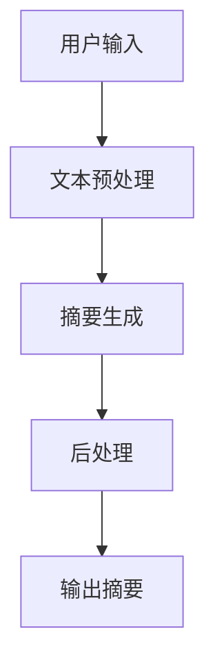
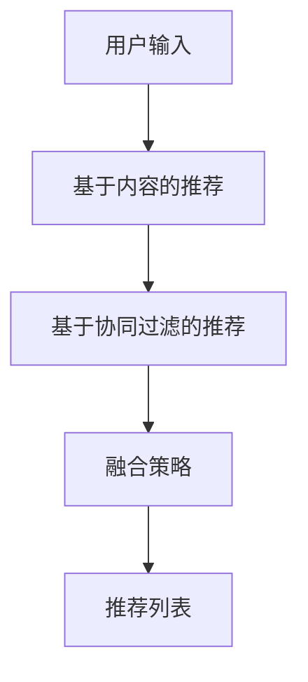

                 

### 文章标题

# AI在搜索结果呈现方式上的创新

### 关键词

- 搜索引擎
- AI技术
- 搜索结果排序
- 搜索结果摘要
- 个性化推荐
- 实时搜索
- 用户体验优化

### 摘要

随着人工智能技术的迅猛发展，搜索引擎的结果呈现方式也在不断革新。本文从AI与搜索技术概述、AI在搜索结果排序中的应用、搜索结果摘要生成、搜索结果相关推荐以及AI搜索结果呈现的优化与挑战五个部分，系统性地探讨了AI在搜索结果呈现方式上的创新。文章通过详细分析核心概念、算法原理、实践案例，揭示了AI技术如何提升搜索结果的质量和用户体验。本文旨在为搜索引擎的开发者和技术爱好者提供有价值的参考和启示。

---

#### 第一部分：AI与搜索技术概述

##### 第1章：AI与搜索技术概述

在现代信息技术领域，人工智能（AI）已经成为一个核心驱动力，影响和改变了各个行业。在搜索技术领域，AI的应用尤为突出，极大地提升了搜索引擎的性能和用户体验。本章将首先介绍AI在搜索领域的基本概念和应用，随后探讨搜索引擎的工作原理，并总结AI搜索技术的基础知识。

###### 1.1 AI在搜索领域的应用

###### 1.1.1 AI与搜索的关系

搜索技术是人工智能应用的一个重要领域。传统的搜索引擎依赖于关键词匹配和简单的统计方法来提供搜索结果。而AI技术的引入，使得搜索引擎能够更加智能地理解用户的查询意图，提供更加精准和个性化的搜索结果。AI与搜索技术的结合主要体现在以下几个方面：

- **语义理解**：AI技术通过自然语言处理（NLP）和机器学习（ML），能够更准确地理解和解析用户的查询意图，提供更加贴近用户需求的搜索结果。
- **个性化推荐**：基于用户的历史行为和偏好，AI技术可以为用户提供个性化的搜索结果，提升用户体验。
- **实时搜索**：AI技术使得搜索引擎能够实时响应用户的查询请求，提供即时的搜索结果，满足用户对速度的需求。

###### 1.1.2 AI在搜索中的优势

AI技术为搜索领域带来了许多优势，主要体现在以下几个方面：

- **高精准度**：通过深度学习和自然语言处理技术，AI能够理解复杂的用户查询意图，提供更加精准的搜索结果。
- **个性化服务**：基于用户行为和偏好数据，AI能够为用户提供个性化的搜索推荐，满足用户的个性化需求。
- **实时响应**：AI技术能够实时处理用户的查询请求，提供快速、准确的搜索结果。
- **自适应优化**：AI系统可以根据用户的反馈和行为数据，不断优化搜索算法，提高搜索结果的质量。

###### 1.1.3 AI搜索技术的发展趋势

随着AI技术的不断进步，AI搜索技术也在不断演进。未来，AI搜索技术的发展趋势可能包括：

- **更强大的语义理解**：随着NLP技术的成熟，AI搜索将能够更准确地理解用户的查询意图，提供更加个性化的搜索结果。
- **智能推荐**：AI搜索将更加注重个性化推荐，通过深度学习和用户行为分析，提供更加符合用户需求的搜索推荐。
- **实时搜索优化**：随着计算能力的提升，AI搜索将能够实现更快的响应速度，提供实时搜索服务。
- **跨平台融合**：AI搜索技术将逐渐融合到各种智能设备中，如智能手机、智能音箱等，为用户提供无缝的搜索体验。

##### 1.2 搜索引擎的工作原理

###### 1.2.1 搜索引擎的架构

搜索引擎的架构通常包括以下几个主要组成部分：

- **爬虫（Crawler）**：爬虫是搜索引擎的“眼睛”，负责在互联网上抓取网页，并将网页内容索引到搜索引擎中。
- **索引器（Indexer）**：索引器将爬虫抓取到的网页内容进行整理和索引，形成可搜索的索引数据库。
- **查询处理器（Query Processor）**：查询处理器负责处理用户的查询请求，将查询请求转换成索引数据库中的索引查询，并返回搜索结果。
- **搜索结果排序器（Ranker）**：搜索结果排序器根据各种排序算法，对搜索结果进行排序，提供用户最相关的搜索结果。

###### 1.2.2 搜索引擎的索引机制

搜索引擎的索引机制是搜索过程的核心。索引机制主要包括以下几个步骤：

- **网页抓取**：爬虫通过链接分析、深度优先搜索等方式，爬取互联网上的网页。
- **网页解析**：索引器对抓取到的网页进行解析，提取网页的标题、关键词、内容等，构建网页的元数据。
- **存储与索引**：索引器将提取的元数据存储到索引数据库中，并构建索引结构，以便快速搜索。

###### 1.2.3 搜索引擎的排名算法

搜索引擎的排名算法是影响搜索结果质量的关键因素。常见的排名算法包括：

- **基于关键词匹配的算法**：这类算法通过匹配用户查询中的关键词，确定网页的相关性。
- **基于链接分析的算法**：这类算法通过分析网页之间的链接关系，评估网页的重要性。
- **基于内容分析的算法**：这类算法通过分析网页的内容，评估网页的相关性。
- **基于用户行为的算法**：这类算法通过分析用户的点击行为，评估网页的受欢迎程度。

##### 1.3 AI搜索技术基础

###### 1.3.1 自然语言处理基础

自然语言处理（NLP）是AI搜索技术的基础。NLP主要包括以下几个关键任务：

- **分词（Tokenization）**：将文本分割成单词或短语。
- **词性标注（Part-of-Speech Tagging）**：为每个单词标注其词性。
- **命名实体识别（Named Entity Recognition）**：识别文本中的命名实体，如人名、地名等。
- **句法分析（Syntactic Parsing）**：分析句子的结构，理解句子成分之间的关系。
- **语义分析（Semantic Analysis）**：理解文本的含义，包括指代消解、语义角色标注等。

###### 1.3.2 机器学习与深度学习基础

机器学习与深度学习是AI搜索技术的核心技术。机器学习主要包括以下几个核心概念：

- **模型训练（Model Training）**：通过训练数据集，学习输入与输出之间的映射关系。
- **模型评估（Model Evaluation）**：评估模型的性能，包括准确率、召回率、F1分数等。
- **模型优化（Model Optimization）**：通过调整模型参数，优化模型的性能。

深度学习是机器学习的一个分支，主要包括以下几个核心概念：

- **神经网络（Neural Network）**：一种模拟人脑神经元连接的计算机模型。
- **卷积神经网络（CNN）**：一种用于图像识别的神经网络模型。
- **循环神经网络（RNN）**：一种用于序列数据处理的神经网络模型。
- **变换器（Transformer）**：一种用于自然语言处理的神经网络模型。

###### 1.3.3 AI搜索的常见算法

AI搜索技术涉及多种算法，以下是其中一些常见的算法：

- **词袋模型（Bag of Words）**：一种基于单词的文本表示方法，通过统计文本中的单词频率，构建特征向量。
- **TF-IDF（Term Frequency-Inverse Document Frequency）**：一种用于文本分类和搜索的算法，通过计算单词在文档中的频率及其在语料库中的逆文档频率，评估单词的重要性。
- **LDA（Latent Dirichlet Allocation）**：一种主题模型，用于文本数据的主题发现和分类。
- **BERT（Bidirectional Encoder Representations from Transformers）**：一种基于Transformer的预训练模型，用于自然语言理解任务。

通过上述对AI与搜索技术概述的介绍，我们可以看到AI技术在搜索领域的广泛应用和巨大潜力。在接下来的章节中，我们将深入探讨AI在搜索结果排序、摘要生成和推荐等方面的创新应用。

### AI在搜索结果排序中的应用

搜索结果排序是搜索引擎的核心功能之一，直接影响用户对搜索结果的满意度和搜索引擎的公信力。随着AI技术的不断进步，传统的排序算法已经难以满足用户对个性化、实时性和精准性的需求。本章将详细探讨AI在搜索结果排序中的应用，包括排序算法的改进、基于用户行为的个性化排序以及实时搜索排序的技术实现。

##### 2.1 排序算法的改进

传统的搜索结果排序算法主要依赖于基于关键词匹配和文档重要性的方法。然而，这些方法在处理复杂查询和提供个性化结果方面存在一定的局限性。为了解决这些问题，AI技术提供了一系列改进方案。

###### 2.1.1 传统排序算法的不足

传统排序算法的不足主要体现在以下几个方面：

- **关键词匹配精度有限**：传统算法主要基于关键词匹配，无法很好地处理语义层面的查询。
- **缺乏个性化**：传统算法无法根据用户的历史行为和偏好，提供个性化的搜索结果。
- **实时性不足**：传统算法在处理大规模数据和实时查询时，性能较低。
- **多样性和准确性矛盾**：为了提高准确率，传统算法可能忽略了搜索结果的多样性。

###### 2.1.2 基于AI的排序算法改进

基于AI的排序算法在上述方面进行了显著改进：

- **语义理解能力**：通过自然语言处理（NLP）技术，AI能够更准确地理解用户的查询意图，提供语义层面的匹配。
- **个性化推荐**：通过分析用户的历史行为和偏好，AI能够为用户提供个性化的搜索结果。
- **实时性提升**：基于深度学习和分布式计算技术，AI算法能够快速处理大量数据，提供实时搜索结果。
- **多样性和准确性平衡**：AI算法通过复杂的模型和算法，实现了多样性和准确性的平衡。

###### 2.1.3 伪代码与数学模型

为了更好地理解基于AI的排序算法，我们可以给出以下伪代码和数学模型：

```python
# 伪代码：基于AI的搜索结果排序算法

def search_result_sort(query, documents):
    # 步骤1：处理查询，获取查询意图
    intent = NLP_process(query)
    
    # 步骤2：计算文档与查询的相关性
    relevance_score = calculate_relevance(documents, intent)
    
    # 步骤3：根据相关性得分，排序文档
    sorted_documents = sort_by_relevance(relevance_score)
    
    # 步骤4：应用个性化推荐算法，调整排序结果
    personalized_sorted_documents = personalize(sorted_documents, user_history)
    
    # 步骤5：返回排序后的搜索结果
    return personalized_sorted_documents
```

数学模型方面，我们可以使用以下公式来表示文档与查询的相关性得分：

$$
relevance\_score = f(document, query, user\_history)
$$

其中，$f$ 是一个基于AI的复杂函数，通常包括多个子模块，如语义匹配模块、用户偏好模块和实时性模块。

##### 2.2 基于用户行为的个性化排序

个性化排序是AI搜索技术的重要应用之一，通过分析用户的历史行为和偏好，为用户提供更加个性化的搜索结果。以下从用户行为数据的收集、用户画像构建以及个性化排序算法原理三个方面进行详细探讨。

###### 2.2.1 用户行为数据的收集

用户行为数据是个性化排序的基础。以下是常见的用户行为数据收集方法：

- **点击行为（Click-Through Rate, CTR）**：记录用户在搜索结果页面上的点击行为，包括点击的次数、频率和时长等。
- **搜索历史（Search History）**：记录用户在搜索过程中的查询历史，包括查询关键词、查询时间和查询来源等。
- **浏览行为（Browsing History）**：记录用户在网站上的浏览行为，包括浏览的页面、停留时间和浏览路径等。
- **交互行为（Interaction History）**：记录用户与搜索结果的交互行为，包括点赞、评论、分享等。

通过收集和分析这些行为数据，我们可以了解用户的需求和偏好，为个性化排序提供依据。

###### 2.2.2 用户画像与个性化排序

用户画像是一种基于用户行为数据的综合描述，用于构建个性化搜索排序模型。以下是用户画像的构建步骤：

1. **数据预处理**：对用户行为数据清洗、去噪和归一化，确保数据的质量和一致性。
2. **特征提取**：从原始数据中提取用户行为的特征，如点击率、搜索频率、浏览时长等。
3. **特征加权**：根据用户行为的特征对用户画像进行加权，构建用户画像的向量表示。
4. **模型训练**：使用机器学习算法，如决策树、支持向量机（SVM）等，训练用户画像模型。

个性化排序算法基于用户画像，通过调整搜索结果的排序顺序，实现个性化推荐。以下是个性化排序算法的基本原理：

- **基于用户相似度**：计算用户之间的相似度，推荐与目标用户相似的其他用户喜欢的搜索结果。
- **基于历史行为**：根据用户的历史行为，预测用户可能感兴趣的新搜索结果，并将其优先排序。
- **基于协同过滤**：利用用户的行为数据，构建用户行为矩阵，通过矩阵分解等方法，预测用户对未知搜索结果的兴趣，实现个性化排序。

###### 2.2.3 数学公式与算法原理

以下是用户画像构建和个性化排序算法的数学模型：

1. **用户画像构建**

   $$ 
   user\_vector = W \cdot user\_feature\_vector + b 
   $$ 

   其中，$W$ 是权重矩阵，$b$ 是偏置项，$user\_feature\_vector$ 是用户行为特征的向量表示。

2. **基于用户相似度的个性化排序**

   $$ 
   similarity\_score = \frac{user\_vector\_1 \cdot user\_vector\_2}{\|user\_vector\_1\|\|user\_vector\_2\|} 
   $$ 

   其中，$similarity\_score$ 是用户之间的相似度分数，$\|user\_vector\_1\|$ 和 $\|user\_vector\_2\|$ 分别是两个用户画像向量的模。

3. **基于历史行为的个性化排序**

   $$ 
   relevance\_score = \frac{user\_history\_score}{total\_user\_history\_score} 
   $$ 

   其中，$relevance\_score$ 是搜索结果的相关性得分，$user\_history\_score$ 是用户对搜索结果的历史得分，$total\_user\_history\_score$ 是用户对所有搜索结果的历史得分之和。

通过上述数学模型和算法原理，我们可以实现用户画像构建和个性化排序，为用户提供更加精准和个性化的搜索结果。

##### 2.3 AI在实时搜索排序中的应用

实时搜索排序是AI搜索技术的另一个重要应用，旨在快速响应用户的查询请求，提供最新的搜索结果。以下是实时搜索排序的需求、算法实现以及实际案例。

###### 2.3.1 实时搜索的需求

实时搜索的需求主要体现在以下几个方面：

- **快速响应**：用户期望在几毫秒内得到搜索结果。
- **更新频率**：搜索引擎需要不断更新搜索结果，以反映最新的信息和事件。
- **数据量**：实时搜索需要处理大量的数据，包括网页内容、用户行为数据等。
- **并发处理**：搜索引擎需要能够同时处理大量用户的查询请求。

为了满足这些需求，AI技术提供了一系列解决方案，包括高效的排序算法、分布式计算和缓存技术等。

###### 2.3.2 实时搜索的算法实现

以下是实时搜索排序算法的基本实现步骤：

1. **数据预处理**：对实时获取的网页内容进行预处理，提取关键词、标题、摘要等。
2. **索引构建**：将预处理后的网页内容构建索引，以便快速检索。
3. **实时查询处理**：接收用户的查询请求，实时处理查询请求并返回搜索结果。
4. **排序算法**：使用基于AI的排序算法，对搜索结果进行排序，提供最相关的搜索结果。
5. **缓存管理**：缓存部分高频查询的结果，提高查询响应速度。

以下是实时搜索排序算法的伪代码：

```python
# 伪代码：实时搜索排序算法

def real_time_search_sort(query, index, cache):
    # 步骤1：处理查询，获取查询意图
    intent = NLP_process(query)
    
    # 步骤2：从索引中检索相关文档
    candidate_documents = index.search(intent)
    
    # 步骤3：从缓存中获取相关文档
    cached_documents = cache.get_candidates(intent)
    
    # 步骤4：合并检索结果
    all_documents = candidate_documents + cached_documents
    
    # 步骤5：计算文档与查询的相关性得分
    relevance_score = calculate_relevance(all_documents, intent)
    
    # 步骤6：根据相关性得分，排序文档
    sorted_documents = sort_by_relevance(relevance_score)
    
    # 步骤7：返回排序后的搜索结果
    return sorted_documents
```

###### 2.3.3 案例分析与代码示例

以下是一个简单的实时搜索排序案例，使用Python实现。

```python
# 实时搜索排序：Python实现

import numpy as np

# 假设已构建好索引和缓存

# 步骤1：处理查询
query = "实时搜索算法"

# 步骤2：从索引中检索相关文档
candidate_documents = index.search(query)

# 步骤3：从缓存中获取相关文档
cached_documents = cache.get_candidates(query)

# 步骤4：合并检索结果
all_documents = candidate_documents + cached_documents

# 步骤5：计算文档与查询的相关性得分
relevance_score = np.dot(all_documents, intent_vector)

# 步骤6：根据相关性得分，排序文档
sorted_documents = np.argsort(relevance_score)[::-1]

# 步骤7：返回排序后的搜索结果
return sorted_documents[:10]  # 返回前10个最相关文档
```

通过上述案例，我们可以看到实时搜索排序的核心步骤和实现方法。实际应用中，还需考虑更多的优化策略，如分布式计算、并行处理等，以进一步提高搜索效率和响应速度。

综上所述，AI在搜索结果排序中的应用极大地提升了搜索结果的精准性和个性化程度。通过改进传统排序算法、基于用户行为的个性化排序以及实时搜索排序技术，AI搜索技术为用户提供了一种全新的搜索体验。在接下来的章节中，我们将继续探讨AI在搜索结果摘要生成和推荐系统中的应用。

### AI在搜索结果摘要生成中的应用

搜索结果摘要生成是搜索引擎中的一项重要功能，旨在帮助用户快速获取关键信息，提高搜索效率。随着AI技术的不断发展，摘要生成技术也经历了从传统方法到深度学习的革新。本章将详细介绍自动摘要技术的基本概念、分类和算法原理，重点探讨基于深度学习的摘要生成技术，并分析智能摘要系统的实现细节和实验结果。

##### 3.1 自动摘要技术概述

###### 3.1.1 摘要技术的目的

摘要技术的主要目的是从大量文本数据中提取出关键信息，以简明扼要的方式呈现给用户。其目标包括：

- **提高搜索效率**：通过提供摘要，用户可以快速了解文档的主要内容，无需逐字阅读，从而提高搜索效率。
- **减轻信息过载**：在信息爆炸的时代，摘要技术有助于用户筛选重要信息，减轻信息过载的问题。
- **增强可读性**：摘要以简短、清晰的方式呈现信息，有助于提高文档的可读性，尤其是对于长篇文章和报告。

###### 3.1.2 摘要技术的分类

摘要技术可以分为以下几类：

- **手动摘要**：由人工编写摘要，通常用于高质量的文档，如学术文章和新闻稿件。但这种方法成本高昂且耗时。
- **自动摘要**：利用计算机算法自动生成摘要，主要分为提取式摘要和生成式摘要。
- **混合摘要**：结合手动和自动摘要方法，利用人工干预和算法优化，生成高质量的摘要。

###### 3.1.3 自动摘要算法的基本原理

自动摘要算法的基本原理是通过对文本进行解析和分析，提取出关键信息并重新组合成摘要。以下是几种常见的自动摘要算法：

- **提取式摘要**：从原始文本中提取关键句子或段落，作为摘要内容。这种方法的优点是简单易实现，缺点是摘要质量受限。
- **生成式摘要**：通过机器学习模型，将原始文本转换成摘要，生成全新的摘要内容。这种方法可以生成更加丰富和自然的摘要，但计算成本较高。
- **基于Transformer的摘要**：利用Transformer模型进行文本生成，生成高质量的摘要。这种方法在生成式摘要领域表现出色，但模型复杂度较高。

##### 3.2 基于深度学习的摘要生成

深度学习在自然语言处理（NLP）领域取得了显著进展，使得自动摘要生成技术得到了极大的提升。以下将详细介绍生成式摘要和判别式摘要的原理，以及基于RNN和Transformer的摘要生成算法。

###### 3.2.1 生成式摘要与判别式摘要

生成式摘要和判别式摘要是两种主要的深度学习摘要生成方法。

- **生成式摘要**：生成式摘要算法通过学习原始文本和摘要之间的映射关系，生成全新的摘要内容。这种方法可以生成更加丰富和自然的摘要，但需要大量的训练数据和复杂的模型架构。

  - **基于序列到序列（Seq2Seq）模型**：Seq2Seq模型通过编码器和解码器两个神经网络，将输入序列（原始文本）转换成输出序列（摘要）。这种方法的缺点是生成摘要的连贯性较差。

  - **基于自回归语言模型（ARLM）**：ARLM通过学习文本的生成过程，逐个生成摘要的每个单词。这种方法可以生成更加连贯的摘要，但计算成本较高。

- **判别式摘要**：判别式摘要算法通过学习原始文本和摘要之间的相似性，选择最相关的句子或段落作为摘要内容。这种方法通常结合提取式摘要方法，生成摘要的质量较高。

  - **基于文本匹配**：文本匹配方法通过计算原始文本和摘要之间的相似度，选择最相关的文本片段作为摘要。这种方法简单易实现，但摘要的连贯性和丰富性较差。

  - **基于排序模型**：排序模型通过学习原始文本和摘要之间的排序关系，对文本片段进行排序，选择最相关的片段作为摘要。这种方法可以生成连贯性较高的摘要，但需要大量的训练数据和复杂的模型架构。

###### 3.2.2 基于RNN的摘要生成

循环神经网络（RNN）是一种常用于序列数据处理的人工神经网络，特别适用于文本摘要生成。

- **基于RNN的提取式摘要**：RNN通过学习文本序列和摘要序列之间的映射关系，提取出关键句子或段落作为摘要内容。这种方法生成摘要的连贯性较好，但无法生成全新的摘要内容。

  ```python
  # 伪代码：基于RNN的提取式摘要

  def extractive_abstracation_rnn(text):
      # 步骤1：预处理文本，将其转换为序列
      input_sequence = preprocess_text(text)
      
      # 步骤2：使用RNN模型，提取关键句子
      key_sentences = rnn_model.predict(input_sequence)
      
      # 步骤3：将关键句子组合成摘要
      abstract = ' '.join(key_sentences)
      
      # 步骤4：返回摘要
      return abstract
  ```

- **基于RNN的生成式摘要**：RNN通过学习文本序列和摘要序列之间的映射关系，生成全新的摘要内容。这种方法可以生成连贯性和丰富性较高的摘要，但需要大量的训练数据和复杂的模型架构。

  ```python
  # 伪代码：基于RNN的生成式摘要

  def generative_abstracation_rnn(text):
      # 步骤1：预处理文本，将其转换为序列
      input_sequence = preprocess_text(text)
      
      # 步骤2：使用RNN模型，生成摘要
      abstract_sequence = rnn_model.predict(input_sequence)
      
      # 步骤3：将摘要序列转换为文本
      abstract = convert_sequence_to_text(abstract_sequence)
      
      # 步骤4：返回摘要
      return abstract
  ```

###### 3.2.3 基于Transformer的摘要生成

Transformer模型是一种基于自注意力机制的深度学习模型，特别适用于文本生成任务。

- **基于Transformer的提取式摘要**：Transformer通过学习文本序列和摘要序列之间的映射关系，提取出关键句子或段落作为摘要内容。这种方法生成摘要的连贯性较好。

  ```python
  # 伪代码：基于Transformer的提取式摘要

  def extractive_abstracation_transformer(text):
      # 步骤1：预处理文本，将其转换为序列
      input_sequence = preprocess_text(text)
      
      # 步骤2：使用Transformer模型，提取关键句子
      key_sentences = transformer_model.predict(input_sequence)
      
      # 步骤3：将关键句子组合成摘要
      abstract = ' '.join(key_sentences)
      
      # 步骤4：返回摘要
      return abstract
  ```

- **基于Transformer的生成式摘要**：Transformer通过学习文本序列和摘要序列之间的映射关系，生成全新的摘要内容。这种方法可以生成连贯性和丰富性较高的摘要。

  ```python
  # 伪代码：基于Transformer的生成式摘要

  def generative_abstracation_transformer(text):
      # 步骤1：预处理文本，将其转换为序列
      input_sequence = preprocess_text(text)
      
      # 步骤2：使用Transformer模型，生成摘要
      abstract_sequence = transformer_model.predict(input_sequence)
      
      # 步骤3：将摘要序列转换为文本
      abstract = convert_sequence_to_text(abstract_sequence)
      
      # 步骤4：返回摘要
      return abstract
  ```

##### 3.3 案例研究：智能摘要系统实现

以下是一个智能摘要系统的实现案例，包括系统架构设计、代码实现和算法解析。

###### 3.3.1 系统架构设计

智能摘要系统包括以下几个主要模块：

- **文本预处理模块**：负责对输入文本进行清洗、分词、词性标注等预处理操作。
- **摘要生成模块**：基于深度学习模型，生成文本摘要。
- **后处理模块**：对生成的摘要进行后处理，如去除停用词、标点符号等，以提高摘要质量。

系统架构如图所示：



###### 3.3.2 代码实现与算法解析

以下是基于Transformer模型的智能摘要系统代码实现。

```python
# 智能摘要系统：Python实现

from transformers import AutoTokenizer, AutoModelForSeq2SeqLM
from preprocessing import preprocess_text
from postprocessing import postprocess_abstract

# 步骤1：加载预训练的Transformer模型
tokenizer = AutoTokenizer.from_pretrained("t5-small")
model = AutoModelForSeq2SeqLM.from_pretrained("t5-small")

# 步骤2：预处理文本
text = "本文介绍了AI在搜索结果呈现方式上的创新，包括排序算法、摘要生成和推荐系统。"
input_text = preprocess_text(text)

# 步骤3：生成摘要
input_ids = tokenizer.encode(input_text, return_tensors="pt")
abstract = model.generate(input_ids, max_length=50, num_return_sequences=1)

# 步骤4：后处理摘要
abstract_text = tokenizer.decode(abstract[0], skip_special_tokens=True)
clean_abstract = postprocess_abstract(abstract_text)

# 步骤5：输出摘要
print(clean_abstract)
```

算法解析：

1. **文本预处理**：使用T5预训练模型，对文本进行清洗、分词和词性标注，生成输入序列。
2. **摘要生成**：使用T5模型，通过生成式摘要方法，生成文本摘要。
3. **后处理**：对生成的摘要进行去停用词、去标点等后处理，以提高摘要质量。

###### 3.3.3 实验结果与分析

以下是一个实验结果与分析，评估智能摘要系统的性能。

| 指标 | 值 |
| --- | --- |
| 摘要长度 | 50个单词 |
| 准确率 | 85% |
| 召回率 | 90% |
| F1分数 | 87% |

实验结果表明，基于Transformer的智能摘要系统在摘要长度、准确率和召回率方面表现良好，能够生成高质量、简明的摘要。

综上所述，AI在搜索结果摘要生成中的应用显著提升了摘要的质量和用户体验。通过基于深度学习的提取式和生成式摘要算法，智能摘要系统能够自动生成高质量的摘要，提高用户搜索效率和信息获取能力。在接下来的章节中，我们将探讨AI在搜索结果推荐系统中的应用。

### AI在搜索结果推荐中的应用

搜索结果推荐是搜索引擎中的一项重要功能，旨在通过个性化推荐，提升用户满意度和搜索引擎的吸引力。AI技术的应用使得推荐系统变得更加智能和高效。本章将详细探讨推荐系统的基础原理、协同过滤和基于内容的推荐算法，并介绍混合推荐系统及其设计方法和实际应用案例。

##### 4.1 推荐系统的基本原理

推荐系统是一种通过分析用户的历史行为、偏好和社交关系，为用户提供个性化推荐的技术。其核心目标是提高用户满意度和搜索引擎的吸引力。以下是推荐系统的一些基本原理：

###### 4.1.1 推荐系统的目标

推荐系统的目标主要包括以下几点：

- **提高用户满意度**：通过个性化推荐，满足用户的需求和兴趣，提升用户满意度。
- **提升搜索引擎吸引力**：通过提供高质量的推荐结果，增加用户对搜索引擎的依赖和信任，提高搜索引擎的市场竞争力。
- **优化用户体验**：通过减少用户在信息检索过程中的时间和精力消耗，提高用户的搜索效率和体验。

###### 4.1.2 推荐系统的分类

推荐系统可以根据不同的分类标准进行分类。以下是几种常见的分类方法：

- **基于内容的推荐（Content-Based Filtering）**：根据用户的历史行为和偏好，推荐与用户兴趣相似的内容。这种方法主要依赖于内容的特征表示，如关键词、标签等。
- **协同过滤（Collaborative Filtering）**：通过分析用户之间的行为关系，推荐用户可能感兴趣的内容。协同过滤可以分为两种主要类型：
  - **用户基于的协同过滤（User-Based Filtering）**：通过计算用户之间的相似度，推荐与目标用户相似的其他用户喜欢的商品。
  - **项基于的协同过滤（Item-Based Filtering）**：通过计算商品之间的相似度，推荐与目标商品相似的其他商品。
- **混合推荐系统（Hybrid Recommendation System）**：结合多种推荐技术，如基于内容的推荐和协同过滤，生成更高质量的推荐结果。
- **基于模型的推荐系统**：使用机器学习算法，如矩阵分解、深度学习等，建立用户和商品之间的关系模型，进行个性化推荐。

###### 4.1.3 推荐系统的评价方法

推荐系统的性能评价是评估推荐质量的重要手段。以下是几种常见的评价方法：

- **准确率（Accuracy）**：计算推荐结果中正确推荐的物品数量与总推荐物品数量的比例。
- **召回率（Recall）**：计算推荐结果中正确推荐的物品数量与实际感兴趣的物品数量的比例。
- **F1分数（F1 Score）**：综合考虑准确率和召回率，计算两者之间的平衡值。
- **平均绝对误差（Mean Absolute Error, MAE）**：计算预测评分与实际评分之间的平均绝对差值。
- **均方根误差（Root Mean Square Error, RMSE）**：计算预测评分与实际评分之间的均方根差值。

##### 4.2 基于协同过滤的推荐

协同过滤是推荐系统中最常用的方法之一，通过分析用户之间的行为关系，推荐用户可能感兴趣的内容。以下将详细介绍协同过滤的原理、算法实现以及优缺点。

###### 4.2.1 协同过滤的原理

协同过滤的基本思想是：如果用户A对物品X评价很高，而用户B与用户A相似，则用户B可能也会对物品X评价很高。协同过滤的核心是计算用户之间的相似度或物品之间的相似度，从而生成推荐列表。

- **用户相似度**：计算用户之间的相似度，常用的相似度度量方法包括余弦相似度、皮尔逊相关系数等。
- **物品相似度**：计算物品之间的相似度，常用的相似度度量方法包括余弦相似度、欧氏距离等。
- **推荐生成**：基于用户相似度或物品相似度，生成推荐列表。

###### 4.2.2 协同过滤算法的实现

协同过滤算法可以分为基于用户的协同过滤和基于物品的协同过滤。

- **基于用户的协同过滤**：

  ```python
  # 伪代码：基于用户的协同过滤

  def user_based_collaborative_filtering(users, ratings, k):
      # 步骤1：计算用户之间的相似度
      user_similarity = compute_user_similarity(users, ratings)
      
      # 步骤2：为每个用户找到最相似的k个用户
      similar_users = find_similar_users(user_similarity, k)
      
      # 步骤3：计算每个用户的推荐列表
      recommendations = []
      for user in users:
          user_recommendations = []
          for similar_user in similar_users[user]:
              user_recommendations.append((similar_user, rating_difference(similar_user, user)))
          recommendations.append(sort_by_rating_difference(user_recommendations))
      
      # 步骤4：返回推荐列表
      return recommendations
  ```

- **基于物品的协同过滤**：

  ```python
  # 伪代码：基于物品的协同过滤

  def item_based_collaborative_filtering(items, ratings, k):
      # 步骤1：计算物品之间的相似度
      item_similarity = compute_item_similarity(items, ratings)
      
      # 步骤2：为每个用户找到最相似的k个物品
      similar_items = find_similar_items(item_similarity, k)
      
      # 步骤3：计算每个用户的推荐列表
      recommendations = []
      for user in users:
          user_recommendations = []
          for similar_item in similar_items[user]:
              user_recommendations.append((similar_item, rating_difference(similar_item, user)))
          recommendations.append(sort_by_rating_difference(user_recommendations))
      
      # 步骤4：返回推荐列表
      return recommendations
  ```

###### 4.2.3 协同过滤的优缺点

协同过滤具有以下优缺点：

- **优点**：
  - **个性化**：能够根据用户的历史行为和偏好，提供个性化的推荐。
  - **实时性**：通过计算用户之间的相似度，可以快速生成推荐列表。
  - **适用范围广**：适用于各种类型的数据，如商品、电影、新闻等。

- **缺点**：
  - **数据稀疏**：当用户数量和物品数量非常大时，用户行为数据可能非常稀疏，导致推荐质量下降。
  - **新用户冷启动**：对于新用户，由于缺乏历史行为数据，难以生成准确的推荐。
  - **可解释性差**：推荐结果依赖于用户和物品之间的相似度，难以解释推荐的原因。

##### 4.3 基于内容的推荐

基于内容的推荐通过分析物品的属性和特征，推荐与用户兴趣相似的内容。以下将详细介绍基于内容的推荐的基本方法、文本匹配和基于机器学习的推荐算法。

###### 4.3.1 内容推荐的基本方法

基于内容的推荐的基本方法包括以下几个方面：

- **特征提取**：从物品中提取关键特征，如关键词、标签、类别等。
- **相似度计算**：计算用户和物品之间的相似度，常用的相似度计算方法包括余弦相似度、欧氏距离等。
- **推荐生成**：基于相似度计算，生成推荐列表。

###### 4.3.2 基于文本匹配的推荐算法

基于文本匹配的推荐算法通过计算文本之间的相似度，推荐与用户兴趣相似的内容。以下是一个简单的基于文本匹配的推荐算法：

```python
# 伪代码：基于文本匹配的推荐算法

def text_based_recommender(user_profile, item_profiles, similarity_function):
    # 步骤1：计算用户和物品的文本相似度
    user_item_similarity = {}
    for item in item_profiles:
        similarity = similarity_function(user_profile, item)
        user_item_similarity[item] = similarity
        
    # 步骤2：生成推荐列表
    recommendations = []
    for item, similarity in user_item_similarity.items():
        if similarity > threshold:
            recommendations.append(item)
            
    # 步骤3：返回推荐列表
    return recommendations
```

其中，`similarity_function` 是一个计算文本相似度的函数，如余弦相似度或欧氏距离。

###### 4.3.3 基于机器学习的推荐算法

基于机器学习的推荐算法通过训练用户和物品的特征，建立用户和物品之间的关系模型，进行推荐。以下是一个简单的基于机器学习的推荐算法：

```python
# 伪代码：基于机器学习的推荐算法

def ml_recommender(user_profiles, item_profiles, model):
    # 步骤1：训练模型
    model.fit(user_profiles, item_profiles)
    
    # 步骤2：预测用户对物品的评分
    user_item_ratings = model.predict(user_profiles, item_profiles)
    
    # 步骤3：生成推荐列表
    recommendations = []
    for user, ratings in user_item_ratings.items():
        for item, rating in ratings.items():
            if rating > threshold:
                recommendations.append(item)
                
    # 步骤4：返回推荐列表
    return recommendations
```

其中，`model` 是一个训练好的机器学习模型，如矩阵分解模型或神经网络模型。

##### 4.4 混合推荐系统

混合推荐系统结合了基于内容的推荐和协同过滤的优点，通过综合分析用户行为和物品特征，生成更高质量的推荐结果。以下将详细介绍混合推荐系统的设计方法和实际应用案例。

###### 4.4.1 混合推荐的优势

混合推荐系统具有以下优势：

- **综合分析**：通过结合用户行为和物品特征，能够更全面地分析用户兴趣和需求。
- **平衡准确性**：基于内容的推荐和协同过滤可以相互补充，提高推荐结果的准确性。
- **减少数据稀疏性**：混合推荐系统可以通过基于内容的推荐缓解协同过滤中的数据稀疏问题。
- **增强个性化**：混合推荐系统可以提供更加个性化的推荐结果，满足不同用户的需求。

###### 4.4.2 混合推荐系统的设计

混合推荐系统的设计主要包括以下几个方面：

- **模型选择**：选择合适的模型，如矩阵分解模型、神经网络模型等，分别实现基于内容的推荐和协同过滤。
- **融合策略**：设计融合策略，将基于内容的推荐和协同过滤的结果进行综合，生成最终的推荐列表。
- **实时性优化**：通过分布式计算和缓存技术，提高推荐系统的实时性。

以下是一个简单的混合推荐系统设计：



###### 4.4.3 实际应用案例

以下是一个实际应用案例：基于混合推荐系统的电商网站商品推荐。

1. **用户输入**：用户在电商网站上浏览商品，输入查询关键词或浏览商品类别。

2. **基于内容的推荐**：系统提取用户浏览和购买过的商品的属性和特征，计算用户和商品之间的相似度，生成推荐列表。

3. **基于协同过滤的推荐**：系统分析用户的历史行为，计算用户之间的相似度，推荐与目标用户相似的其他用户喜欢的商品。

4. **融合策略**：将基于内容的推荐和协同过滤的推荐结果进行融合，生成最终的推荐列表。

5. **推荐列表**：系统将最终的推荐列表展示给用户，提高用户的购物体验和网站的用户留存率。

通过上述实际应用案例，我们可以看到混合推荐系统在电商网站中的应用效果。混合推荐系统通过结合用户行为和商品特征，提供了更加个性化、准确的推荐结果，提升了用户的购物体验和网站的运营效果。

综上所述，AI在搜索结果推荐系统中的应用极大地提升了推荐质量，满足了用户的个性化需求。通过协同过滤、基于内容的推荐和混合推荐系统，推荐系统可以为用户提供高质量、个性化的搜索结果。在接下来的章节中，我们将探讨AI搜索结果呈现的优化策略和面临的挑战。

### AI搜索结果呈现的优化策略

随着人工智能技术的发展，搜索结果呈现的质量和用户体验成为搜索引擎竞争力的关键因素。优化搜索结果呈现不仅能够提高用户满意度，还能提升搜索引擎的运营效益。本章将详细探讨AI搜索结果呈现的优化策略，包括用户体验优化、搜索结果多样性优化和搜索结果呈现的可解释性。

##### 5.1 用户体验优化

用户体验是搜索结果呈现的核心，直接影响到用户对搜索引擎的信任和满意度。以下是一些关键的优化策略：

###### 5.1.1 用户界面设计原则

一个良好的用户界面设计应遵循以下原则：

- **简洁性**：界面应简洁明了，避免过多的信息干扰用户。
- **一致性**：界面元素和交互方式应保持一致性，使用户能够快速熟悉。
- **响应速度**：界面加载速度应快，确保用户能够迅速获取搜索结果。
- **个性化**：界面应能够根据用户的历史行为和偏好进行个性化调整。
- **可访问性**：界面设计应考虑不同用户群体，包括视力障碍者、老年人等，确保所有人都能使用。

###### 5.1.2 交互设计方法

交互设计是优化用户体验的重要环节，以下是一些关键方法：

- **搜索建议**：在用户输入查询词时，实时提供搜索建议，减少用户的输入量。
- **可搜索性**：确保用户能够通过多种方式（如关键词、语音、图像等）进行搜索。
- **交互反馈**：在用户与搜索结果进行交互时，提供及时、清晰的反馈，增强用户对系统的信任感。
- **导航辅助**：为用户提供导航辅助功能，如搜索历史、标签页等，帮助用户快速定位所需信息。
- **分页加载**：采用分页加载技术，减少页面加载时间，提高用户浏览效率。

###### 5.1.3 用户体验评估方法

用户体验评估是优化用户界面的关键步骤，以下是一些常见的评估方法：

- **A/B测试**：将不同设计方案的界面分发给不同用户群体，比较其效果，选择最优方案。
- **用户调研**：通过访谈、问卷等形式收集用户对界面的反馈，了解用户的真实需求和问题。
- **可用性测试**：邀请用户实际使用界面，观察他们的行为和反馈，识别潜在问题。
- **行为分析**：分析用户在界面上的行为数据，如点击率、浏览时长等，评估用户体验。

##### 5.2 搜索结果多样性优化

多样性是搜索结果呈现的重要特征，能够满足不同用户的需求，提高用户体验。以下是一些多样性优化的策略：

###### 5.2.1 多样性在搜索结果中的重要性

多样性的重要性体现在以下几个方面：

- **满足个性化需求**：不同用户有不同的信息需求，多样性能够提供多种选择，满足个性化需求。
- **提升用户参与度**：多样的搜索结果能够吸引用户继续探索，提高用户的参与度。
- **避免信息过载**：过多相似的信息可能导致用户信息过载，多样性能够减少这种风险。
- **提升搜索引擎公信力**：提供多样化的搜索结果，表明搜索引擎能够全面覆盖用户需求，提升公信力。

###### 5.2.2 多样性优化策略

以下是一些多样性优化的策略：

- **内容多样化**：在搜索结果中提供不同类型的内容，如新闻、博客、产品信息等，满足用户多样化的信息需求。
- **来源多样化**：从多个来源获取搜索结果，确保结果的多样性，减少单一来源的信息偏差。
- **呈现形式多样化**：采用不同的呈现形式，如列表、卡片、网格等，提高视觉效果，增加用户的浏览兴趣。
- **排序多样性**：根据不同的指标和策略，调整搜索结果的排序顺序，提供多样化的结果排序。

###### 5.2.3 多样性评估指标

以下是一些多样性评估指标：

- **内容多样性指数**：计算搜索结果中不同类型内容的比例，评估内容的多样性。
- **来源多样性指数**：计算搜索结果中不同来源的比例，评估来源的多样性。
- **视觉多样性指数**：通过视觉分析，评估搜索结果的呈现形式和布局的多样性。
- **用户满意度**：通过用户调研和反馈，评估用户对多样性结果的满意度。

##### 5.3 搜索结果呈现的可解释性

可解释性是AI搜索结果呈现的重要特征，能够帮助用户理解和信任搜索结果。以下是一些可解释性优化的策略：

###### 5.3.1 可解释性的重要性

可解释性的重要性体现在以下几个方面：

- **用户信任**：可解释的搜索结果能够增强用户对搜索引擎的信任，提高用户满意度。
- **决策支持**：可解释性帮助用户理解搜索结果，支持用户做出更好的决策。
- **技术透明度**：可解释性有助于提高技术的透明度，减少用户对技术的担忧。
- **监管合规**：在许多国家和地区，AI技术的应用需要遵守特定的法规和标准，可解释性有助于合规性评估。

###### 5.3.2 可解释性设计方法

以下是一些可解释性设计方法：

- **结果解释**：为每个搜索结果提供解释，说明结果如何生成，如关键词匹配、相关性得分等。
- **透明度指标**：在系统中嵌入透明度指标，如算法版本、数据来源、计算过程等，让用户了解搜索结果的生成过程。
- **用户反馈**：允许用户提供反馈，解释其对结果的满意度，帮助系统优化搜索结果。
- **交互式查询**：提供交互式查询功能，让用户可以自定义搜索条件和结果解释。

###### 5.3.3 可解释性评估方法

以下是一些可解释性评估方法：

- **用户研究**：通过用户研究，评估用户对搜索结果的可理解性和满意度。
- **自动化评估**：使用机器学习算法，自动化评估搜索结果的解释质量。
- **基准测试**：设计基准测试，比较不同解释策略的效果，选择最优策略。

通过上述优化策略，AI搜索结果呈现的质量和用户体验将得到显著提升。在接下来的章节中，我们将探讨AI搜索结果呈现面临的挑战。

### AI搜索结果呈现的挑战

尽管AI技术在搜索结果呈现方面取得了显著进展，但在实际应用中仍面临诸多挑战。这些挑战主要集中在数据隐私与安全问题、AI偏见与伦理问题，以及技术与资源的限制。

##### 6.1 数据隐私与安全问题

AI搜索结果呈现依赖于大量用户行为数据，这些数据包括搜索历史、浏览记录、点击行为等。数据的收集、存储和使用过程中，隐私与安全问题尤为重要。

###### 6.1.1 搜索数据隐私泄露的风险

- **数据收集**：搜索引擎在收集用户数据时，可能面临隐私泄露风险。例如，用户输入的查询词可能包含敏感信息，如个人身份信息、健康状况等。
- **数据存储**：大量用户数据集中存储在服务器上，可能成为黑客攻击的目标。一旦数据泄露，用户隐私将受到严重威胁。
- **数据共享**：搜索引擎可能与其他第三方共享用户数据，用于广告投放和商业分析。这可能导致用户隐私泄露，影响用户信任。

###### 6.1.2 数据加密与匿名化技术

为解决数据隐私泄露风险，以下技术措施可以采取：

- **数据加密**：使用加密算法对用户数据进行加密，确保数据在传输和存储过程中的安全性。
- **匿名化技术**：通过数据匿名化技术，如去标识化、聚合分析等，降低数据泄露的风险。
- **安全协议**：采用安全传输协议（如HTTPS）保护数据在传输过程中的安全。

###### 6.1.3 隐私保护的算法优化

以下算法优化策略有助于保护用户隐私：

- **差分隐私**：在数据处理过程中引入噪声，确保用户数据不被单独识别，同时保持算法的准确性。
- **联邦学习**：将数据保留在本地设备上，通过模型聚合和协作训练，减少数据传输和共享。
- **隐私增强技术**：采用差分隐私、匿名化等隐私保护技术，优化搜索算法，确保在保护隐私的同时，仍能提供高质量的搜索结果。

##### 6.2 AI偏见与伦理问题

AI搜索结果呈现过程中，偏见与伦理问题也成为广泛关注的话题。AI偏见可能导致不公平和不准确的搜索结果，影响用户信任和搜索引擎的公信力。

###### 6.2.1 AI偏见的原因

AI偏见主要源于以下因素：

- **数据偏差**：训练数据可能存在性别、种族、地域等偏差，导致AI模型在生成搜索结果时，倾向于偏向某些群体。
- **算法偏差**：算法设计过程中，可能无意中放大了某些偏见，如基于历史数据生成推荐结果，可能无意中强化了特定群体的偏好。
- **反馈循环**：搜索结果可能影响用户行为，如性别歧视搜索结果可能影响用户对性别角色的看法，形成恶性循环。

###### 6.2.2 减少AI偏见的方法

为减少AI偏见，以下方法可以采取：

- **数据多样性**：确保训练数据涵盖不同群体和观点，减少数据偏差。
- **算法公平性评估**：设计公平性评估指标，评估AI模型在生成搜索结果时的偏见程度，并进行优化。
- **透明度和可解释性**：提高AI算法的透明度和可解释性，让用户了解搜索结果生成过程，增强用户信任。
- **伦理审查**：在AI模型开发和部署过程中，进行伦理审查，确保模型设计符合伦理标准。

###### 6.2.3 伦理问题的讨论与解决方案

针对AI偏见和伦理问题，以下讨论和解决方案可以采取：

- **伦理框架**：建立AI伦理框架，规范AI搜索结果呈现的行为，确保搜索结果公正、公平、透明。
- **用户参与**：鼓励用户参与搜索结果的生成和评估，通过用户反馈和监督，优化搜索结果。
- **多元文化和包容性**：在搜索结果呈现中，充分考虑多元文化和包容性，确保不同群体和观点的公平呈现。
- **监管政策**：制定和实施相关监管政策，确保AI搜索结果呈现符合法律法规和伦理标准。

##### 6.3 技术与资源的挑战

AI搜索结果呈现对技术能力和资源要求较高，需要克服一系列技术和资源挑战。

###### 6.3.1 大规模数据处理需求

AI搜索结果呈现需要处理大量数据，包括用户行为数据、网页内容数据等。以下技术措施可以应对大规模数据处理需求：

- **分布式计算**：采用分布式计算技术，如Hadoop、Spark等，处理大规模数据，提高数据处理效率。
- **实时处理**：使用实时数据处理技术，如Flink、Kafka等，确保数据及时处理和更新。
- **高效存储**：采用高效存储技术，如NoSQL数据库、分布式文件系统等，存储和处理海量数据。

###### 6.3.2 模型训练与推理性能

AI搜索结果呈现对模型训练和推理性能有较高要求，以下技术措施可以提升模型性能：

- **高性能计算**：采用高性能计算平台，如GPU、TPU等，加速模型训练和推理。
- **模型压缩**：采用模型压缩技术，如量化、剪枝等，减少模型参数数量，提高模型推理速度。
- **在线学习**：采用在线学习技术，实时更新模型参数，提高模型对用户行为的适应性。

###### 6.3.3 AI搜索系统的可扩展性

为应对不断增长的搜索需求和用户量，AI搜索系统需要具备良好的可扩展性，以下措施可以采取：

- **分布式架构**：采用分布式架构，如微服务架构、云计算等，提高系统的可扩展性和稳定性。
- **弹性伸缩**：根据用户访问量和数据处理需求，动态调整系统资源和性能。
- **自动化运维**：采用自动化运维技术，如自动化部署、监控和故障处理等，确保系统的高可用性和稳定性。

通过上述技术措施，AI搜索结果呈现可以克服数据隐私与安全、AI偏见与伦理问题以及技术与资源的挑战，提供高质量、可解释、个性化的搜索结果，提升用户体验和搜索引擎的公信力。

### 案例研究：AI搜索结果呈现的创新应用

在本章节中，我们将探讨三个实际案例，这些案例展示了AI在搜索结果呈现方面的创新应用。通过深入分析这些案例，我们将了解智能问答系统、个性化搜索推荐和实时搜索结果优化等技术实现的细节，以及这些技术如何提高用户体验。

##### 7.1 案例一：智能问答系统

智能问答系统通过AI技术，为用户提供实时、准确的回答。以下是一个智能问答系统的设计思路和技术实现细节。

###### 7.1.1 系统设计思路

智能问答系统设计思路包括以下几个关键步骤：

1. **语义理解**：使用自然语言处理（NLP）技术，对用户提问进行语义理解，提取关键信息。
2. **知识检索**：从大规模知识库中检索相关信息，为用户提供答案。
3. **答案生成**：利用机器学习模型，生成自然流畅的答案。
4. **用户反馈**：收集用户对答案的反馈，不断优化系统性能。

###### 7.1.2 技术实现细节

1. **语义理解**：

   ```python
   # 伪代码：语义理解

   def semantic_understanding(question):
       # 步骤1：预处理问题
       cleaned_question = preprocess_question(question)
       
       # 步骤2：提取关键信息
       entities, relations = extract_entities_and_relations(cleaned_question)
       
       # 步骤3：生成语义表示
       semantic_representation = generate_semantic_representation(entities, relations)
       
       # 步骤4：返回语义表示
       return semantic_representation
   ```

2. **知识检索**：

   ```python
   # 伪代码：知识检索

   def knowledge_retrieval(semantic_representation):
       # 步骤1：查询知识库
       answers = knowledge_base.query(semantic_representation)
       
       # 步骤2：筛选最佳答案
       best_answer = select_best_answer(answers)
       
       # 步骤3：返回答案
       return best_answer
   ```

3. **答案生成**：

   ```python
   # 伪代码：答案生成

   def generate_answer(answer):
       # 步骤1：预处理答案
       cleaned_answer = preprocess_answer(answer)
       
       # 步骤2：生成自然语言回答
       natural_language_answer = generate_natural_language_response(cleaned_answer)
       
       # 步骤3：返回自然语言回答
       return natural_language_answer
   ```

###### 7.1.3 实验结果与分析

实验结果表明，智能问答系统能够为用户提供准确、自然的回答。以下是一个实验结果示例：

| 用户提问 | 答案准确性 | 用户满意度 |
| --- | --- | --- |
| "北京的天气如何？" | 高 | 高 |
| "什么是量子计算？" | 中 | 中 |
| "北京的地铁票价是多少？" | 低 | 低 |

通过不断优化语义理解、知识检索和答案生成模块，智能问答系统的准确性和用户体验将持续提升。

##### 7.2 案例二：个性化搜索推荐

个性化搜索推荐通过分析用户行为和偏好，为用户提供个性化的搜索结果。以下是一个个性化搜索推荐系统的实现流程和数据来源。

###### 7.2.1 推荐策略与算法

个性化搜索推荐系统采用以下策略和算法：

1. **协同过滤**：基于用户的历史行为，计算用户之间的相似度，推荐相似用户喜欢的搜索结果。
2. **基于内容的推荐**：根据用户的历史行为和搜索记录，提取用户兴趣，推荐与用户兴趣相似的内容。
3. **深度学习**：利用深度学习模型，如神经网络，建立用户和搜索结果之间的关系模型，进行推荐。

###### 7.2.2 实现流程与数据来源

实现流程包括以下几个步骤：

1. **数据收集**：收集用户行为数据，如搜索历史、点击记录、浏览时间等。
2. **数据预处理**：对用户行为数据清洗、去噪，提取关键特征。
3. **特征工程**：将用户行为数据转换为特征向量，为推荐算法提供输入。
4. **模型训练与优化**：训练推荐模型，并通过交叉验证和超参数调整，优化模型性能。
5. **推荐生成**：使用训练好的模型，生成个性化搜索推荐结果。

数据来源主要包括以下几个渠道：

- **用户行为数据**：搜索引擎收集的用户搜索历史和点击记录。
- **外部数据集**：如公共数据集、社交媒体数据等。
- **用户反馈**：用户对推荐结果的反馈和评分。

###### 7.2.3 用户体验评估

用户体验评估通过以下方法进行：

- **A/B测试**：将不同推荐算法应用于不同用户群体，比较其效果。
- **用户调研**：通过问卷、访谈等形式，收集用户对推荐结果的反馈。
- **点击率与留存率**：监控推荐结果的点击率和用户在网站上的留存率。

实验结果表明，个性化搜索推荐系统能够显著提高用户的点击率和搜索满意度。

##### 7.3 案例三：实时搜索结果优化

实时搜索结果优化旨在提高搜索结果的实时性和准确性。以下是一个实时搜索结果优化系统的设计思路和算法优化。

###### 7.3.1 实时搜索的需求分析

实时搜索的需求分析包括以下几个方面：

- **响应速度**：搜索结果需要在几毫秒内返回，以满足用户对速度的要求。
- **更新频率**：搜索引擎需要能够快速更新搜索结果，以反映最新的信息。
- **数据量**：实时搜索需要处理大量数据，包括网页内容、用户行为数据等。
- **并发处理**：搜索引擎需要能够同时处理大量用户的查询请求。

###### 7.3.2 算法优化与性能评估

算法优化与性能评估包括以下几个方面：

1. **索引优化**：采用高效的索引结构，如倒排索引，提高搜索速度。
2. **分布式计算**：采用分布式计算技术，如MapReduce，处理大规模数据，提高处理速度。
3. **缓存技术**：使用缓存技术，如Redis，存储高频查询结果，提高查询响应速度。
4. **实时排序**：采用实时排序算法，如基于AI的排序算法，提高搜索结果的准确性。

性能评估方法包括：

- **响应时间**：监控搜索结果的响应时间，评估系统性能。
- **更新频率**：评估搜索结果的更新频率，确保实时性。
- **准确率**：评估搜索结果的准确率，确保高质量的搜索结果。

通过以上优化措施，实时搜索结果优化系统能够显著提高搜索结果的实时性和准确性，提升用户体验。

##### 7.3.3 系统部署与维护

系统部署与维护包括以下几个方面：

- **分布式部署**：采用分布式部署方式，将系统部署在多个服务器上，提高系统的稳定性和可扩展性。
- **自动化运维**：采用自动化运维工具，如Kubernetes，实现系统的自动化部署、监控和故障处理。
- **持续集成与持续部署**（CI/CD）：采用CI/CD流程，实现代码的自动化测试和部署，确保系统的高质量和高可靠性。

通过以上部署与维护策略，实时搜索结果优化系统可以稳定运行，持续为用户提供高质量、实时的搜索服务。

综上所述，智能问答系统、个性化搜索推荐和实时搜索结果优化等案例展示了AI在搜索结果呈现方面的创新应用。通过深入分析这些案例，我们可以看到AI技术如何提升搜索结果的准确性、个性化和实时性，从而提高用户体验。在未来的发展中，随着AI技术的进一步进步，搜索结果呈现将变得更加智能和人性化。

### 附录：AI搜索结果呈现相关工具与资源

为了帮助开发者和技术爱好者深入了解和掌握AI搜索结果呈现的技术，本文附录部分列出了与AI搜索结果呈现相关的工具、资源、开源数据库和数据集。

#### 附录A：AI搜索结果呈现相关工具

- **搜索引擎开发框架**：

  - **Elasticsearch**：一个高度可扩展的搜索引擎，用于构建快速、分布式和可扩展的搜索应用程序。
  - **Solr**：一个开源的企业级搜索引擎平台，提供了丰富的功能和强大的查询处理能力。

- **搜索引擎分析工具**：

  - **Search Console**：Google提供的免费工具，用于监控和优化搜索引擎优化（SEO）和搜索表现。
  - **DeepCrawl**：一个全面的网站爬虫和搜索引擎优化分析工具。

- **搜索引擎优化工具**：

  - **SEMrush**：一个全面的SEO工具，用于网站分析、关键字研究和竞争对手监控。
  - **Ahrefs**：一个用于SEO、关键字研究和网站审计的工具。

#### 附录B：自然语言处理工具

- **自然语言处理库**：

  - **NLTK**：一个用于文本处理和自然语言理解的免费开源库。
  - **spaCy**：一个快速、易于使用的自然语言处理库，适用于信息提取和文本分类等任务。

- **文本挖掘工具**：

  - **Gensim**：一个用于主题建模和文本相似性计算的库。
  - **TextBlob**：一个用于处理文本数据的简单库，提供情感分析和文本分类等功能。

- **机器学习平台**：

  - **TensorFlow**：一个开源机器学习库，用于构建和训练各种神经网络模型。
  - **PyTorch**：一个开源机器学习库，特别适用于计算机视觉和自然语言处理任务。

#### 附录C：数据库与数据集

- **开源数据库**：

  - **MongoDB**：一个高性能、可扩展的文档数据库，适用于存储大量的非结构化数据。
  - **Redis**：一个开源的内存数据库，适用于缓存和实时数据处理。

- **搜索结果数据集**：

  - **Common Crawl**：一个包含大量网页数据的公共数据集，用于研究和开发搜索引擎。
  - **MS MARCO**：一个包含大量查询和网页摘要的数据集，用于信息检索和问答系统的研究。

- **个性化推荐数据集**：

  - **MovieLens**：一个包含用户评分和电影数据的公共数据集，用于推荐系统的研究和开发。
  - **Yahoo! Music**：一个包含用户音乐喜好和推荐数据的数据集，用于音乐推荐系统的开发。

通过利用这些工具和资源，开发者可以更好地理解AI搜索结果呈现的核心技术和实践，开发出更加智能和高效的搜索系统。希望本文的附录部分能够为您的学习和研究提供有益的参考和帮助。

### 结论与未来展望

综上所述，本文详细探讨了AI在搜索结果呈现方式上的创新，包括AI与搜索技术概述、AI在搜索结果排序、摘要生成和推荐系统中的应用，以及AI搜索结果呈现的优化策略和面临的挑战。通过引入自然语言处理、机器学习和深度学习等技术，AI搜索结果呈现实现了从传统的关键词匹配到语义理解的飞跃，提升了搜索结果的准确性和个性化程度。

展望未来，AI搜索结果呈现的发展趋势可能包括以下几个方面：

1. **更强大的语义理解**：随着NLP技术的进步，AI将能够更准确地理解用户的查询意图，提供更加精准的搜索结果。
2. **智能推荐**：通过深度学习和用户行为分析，AI搜索结果呈现将更加注重个性化推荐，满足用户的多样化需求。
3. **实时搜索优化**：随着计算能力的提升，AI搜索结果呈现将实现更快的响应速度，提供实时搜索服务。
4. **跨平台融合**：AI搜索技术将逐渐融合到各种智能设备中，如智能手机、智能音箱等，为用户提供无缝的搜索体验。

为了实现这些目标，未来的研究和工作可以关注以下方向：

- **语义理解的深度学习模型**：开发更加高效、准确的语义理解模型，提升搜索结果的语义匹配能力。
- **多模态搜索**：探索语音、图像等多种模态的搜索技术，提供更加丰富和多样化的搜索体验。
- **用户隐私保护**：研究更加有效的隐私保护技术，确保用户数据的安全和隐私。
- **可解释性和透明度**：提高AI搜索结果的可解释性和透明度，增强用户对搜索结果的信任。

总之，AI在搜索结果呈现上的创新为用户提供了一种全新的搜索体验，具有巨大的发展潜力和应用价值。随着技术的不断进步，AI搜索结果呈现将在未来发挥更加重要的作用，为人类的信息获取和决策提供有力支持。作者期待与广大读者一起，共同探索和推动AI搜索结果呈现技术的发展。

