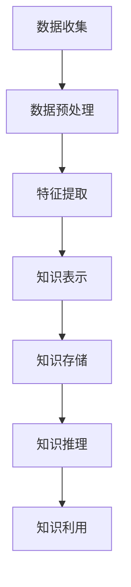

                 


### 第1章：AI在知识获取中的历史与发展

#### 1.1 AI的发展历程

##### 1.1.1 早期AI的发展

人工智能（AI）的概念最早可以追溯到20世纪中叶。1956年，在达特茅斯会议上，约翰·麦卡锡（John McCarthy）等科学家首次提出了“人工智能”这一术语，标志着人工智能正式成为一个独立的学术领域。

早期的人工智能主要依赖于模拟智能和启发式算法。这种方法的代表性工作之一是1956年由赫伯特·西蒙（Herbert Simon）和艾伦·纽厄尔（Allen Newell）开发的逻辑理论家（Logic Theorist），它能够证明数学定理。

接着，专家系统的兴起成为早期AI的重要标志。专家系统通过模拟人类专家的决策过程，解决了大量实际问题。例如，1972年开发的DENDRAL系统在化学领域取得了显著成就，它能够根据质谱数据推断化合物的结构。

此外，统计学习方法的引入也为AI的发展奠定了基础。1959年，阿瑟·塞缪尔（Arthur Samuel）开发的程序能够通过自我学习来改进其国际象棋的玩法。

##### 1.1.2 21世纪的AI复兴

21世纪初，人工智能迎来了新的发展机遇。深度学习的崛起是这一时期最具代表性的突破。深度学习是一种基于多层神经网络的学习方法，它能够在大量数据上进行训练，从而实现自动的特征学习和模式识别。

深度学习的成功离不开大数据和云计算的支持。随着互联网的发展，大量结构化和非结构化数据被生成和收集，这些数据为AI算法提供了丰富的训练素材。同时，云计算提供了强大的计算资源，使得深度学习模型能够高效地训练和部署。

此外，知识获取在AI中的地位也不断提升。知识获取是指从各种数据源中提取、整理和利用知识的过程。知识获取技术的发展使得AI系统能够更好地理解和处理复杂的问题。

#### 1.2 知识获取在AI中的位置

##### 1.2.1 知识获取的定义与意义

知识获取是指从数据中提取知识的过程，它是人工智能的核心任务之一。知识获取不仅包括数据的收集和整理，还包括数据的分析和解释，从而发现数据中的隐含信息和规律。

在AI中，知识获取的意义在于：

- **提高决策能力**：通过知识获取，AI系统能够从大量的数据中提取有用的信息，从而支持更准确的决策。
- **增强学习能力**：知识获取可以帮助AI系统更好地理解和利用已有知识，从而提升其学习能力。
- **优化问题解决**：知识获取使得AI系统能够从经验中学习，提高问题解决的效率和质量。

##### 1.2.2 知识获取与AI的其他组成部分的关系

知识获取与AI的其他组成部分，如机器学习、自然语言处理和智能系统，有着密切的联系。

- **知识获取与机器学习**：机器学习是AI的核心技术之一，它通过训练模型来学习数据中的模式。知识获取为机器学习提供了丰富的知识源，使得模型能够更好地理解和处理复杂的问题。
- **知识获取与自然语言处理**：自然语言处理是AI的重要分支，它旨在使计算机能够理解和生成自然语言。知识获取在自然语言处理中发挥着关键作用，它能够帮助模型理解和解释语言中的语义和含义。
- **知识获取与智能系统**：智能系统是AI的应用领域之一，它通过模拟人类智能来实现自动化和智能化。知识获取为智能系统提供了必要的知识支持，使得系统能够更智能地应对各种复杂场景。

#### 1.3 知识获取技术的发展

##### 1.3.1 传统知识获取方法

传统的知识获取方法主要包括知识工程方法、语义网方法和知识图谱方法。

- **知识工程方法**：知识工程方法是指通过人工设计和构建知识库，将领域知识以结构化的形式存储起来。这种方法在早期AI研究中得到了广泛应用，但它依赖于专家的知识和经验，难以处理大规模和动态变化的数据。
- **语义网方法**：语义网方法基于语义标注和本体论，它通过在数据上附加语义信息，使得计算机能够更好地理解和处理数据。语义网方法在信息检索和语义搜索等领域有着广泛的应用。
- **知识图谱方法**：知识图谱是一种结构化的知识表示方法，它通过实体和关系来组织数据。知识图谱方法在知识获取和推理中发挥着重要作用，它能够有效地组织和利用大规模数据。

##### 1.3.2 现代知识获取方法

现代知识获取方法在深度学习、大数据和分布式计算的支持下，取得了显著的发展。

- **深度学习在知识获取中的应用**：深度学习通过多层神经网络，能够自动地从大量数据中学习复杂的特征和模式。深度学习在图像识别、语音识别和自然语言处理等领域取得了重大突破，为知识获取提供了强大的技术支持。
- **大数据与知识获取**：大数据技术的快速发展，使得大规模数据的存储、处理和分析成为可能。大数据为知识获取提供了丰富的数据源，使得知识获取能够更全面和深入地理解复杂系统。
- **分布式知识获取方法**：分布式计算技术使得知识获取能够在大规模集群上进行，从而提高了知识获取的效率和处理能力。分布式知识获取方法在互联网搜索、社交网络分析和智能推荐等领域得到了广泛应用。

#### 1.4 AI在知识获取中的挑战与机遇

##### 1.4.1 知识获取的挑战

知识获取在AI发展中面临着一系列挑战。

- **数据质量与多样性**：知识获取依赖于高质量和多样性的数据。然而，现实世界中的数据往往存在噪声、偏差和缺失，这给知识获取带来了困难。
- **知识表示与推理的复杂性**：知识获取需要对知识进行有效的表示和推理。然而，知识表示和推理本身是一个复杂的问题，涉及到多种技术和方法的综合运用。
- **知识获取的实时性**：在许多应用场景中，知识获取需要实时进行，以满足快速变化的业务需求。然而，实时知识获取面临着性能和效率的挑战。

##### 1.4.2 知识获取的机遇

尽管知识获取面临挑战，但它也带来了巨大的机遇。

- **知识获取在智能系统中的应用**：知识获取为智能系统提供了必要的知识支持，使得系统能够更智能地应对各种复杂场景。
- **知识获取与领域特定知识的融合**：知识获取可以与特定领域的知识深度融合，从而提升领域智能系统的性能和效果。
- **知识获取在商业与社会的潜在影响**：知识获取技术可以应用于商业和社会的各个方面，从而带来巨大的经济和社会效益。

## 第2章：知识获取的基本概念与架构

### 2.1 知识获取的定义与分类

#### 2.1.1 知识获取的定义

知识获取是指从数据中提取、整理和利用知识的过程。知识获取不仅仅是对数据的简单处理，它涉及到对数据的理解、分析和解释，从而发现数据中的隐含信息和规律。

知识获取的过程可以分为以下几个阶段：

1. **数据收集**：从各种数据源收集原始数据，包括结构化数据（如数据库）和非结构化数据（如图像、文本和语音）。
2. **数据预处理**：对收集到的数据进行清洗、转换和归一化，以提高数据的质量和一致性。
3. **特征提取**：从预处理后的数据中提取关键特征，用于后续的建模和分析。
4. **知识表示**：将提取到的特征和相关信息进行结构化表示，以便于存储、处理和利用。
5. **知识利用**：利用获取到的知识进行决策、预测、优化等任务，实现实际应用价值。

#### 2.1.2 知识获取的分类

根据不同的分类标准，知识获取可以有不同的分类方法。

- **按照知识类型分类**：

  1. **事实知识**：描述客观事实和规律的知识，如地理信息、历史事件等。
  2. **规则知识**：基于逻辑和规则的判断和决策知识，如医疗诊断规则、交通信号控制规则等。
  3. **模型知识**：基于数学模型和算法的知识，如神经网络模型、决策树模型等。
  4. **方法知识**：描述特定方法、技巧和策略的知识，如优化算法、机器学习算法等。

- **按照知识来源分类**：

  1. **内部知识**：来源于内部数据和学习经验的隐性知识，如专家经验、行业知识等。
  2. **外部知识**：来源于外部数据和学习经验的显性知识，如数据库、知识库等。

- **按照知识获取的方式分类**：

  1. **主动知识获取**：通过主动探索、学习和挖掘数据中的知识。
  2. **被动知识获取**：通过被动地收集和整合已有的知识资源。

### 2.2 知识获取系统的组成

知识获取系统是一个复杂的多层次结构，它由多个组件组成，以实现知识获取的目标。以下是知识获取系统的典型组成部分：

- **数据源**：数据源是知识获取系统的起点，它提供了原始数据，如数据库、数据仓库、传感器网络等。
- **数据预处理模块**：数据预处理模块负责对原始数据进行清洗、转换和归一化，以提高数据的质量和一致性。
- **特征提取模块**：特征提取模块负责从预处理后的数据中提取关键特征，用于后续的建模和分析。
- **知识表示模块**：知识表示模块负责将提取到的特征和相关信息进行结构化表示，以便于存储、处理和利用。
- **知识存储模块**：知识存储模块负责存储和管理获取到的知识，通常使用数据库、数据仓库和知识库等技术。
- **知识推理模块**：知识推理模块负责利用知识进行推理和决策，通常使用逻辑推理、统计分析和机器学习等技术。
- **用户接口模块**：用户接口模块负责与用户进行交互，提供查询、浏览和利用知识的界面。

### 2.3 知识获取的核心技术

知识获取的核心技术包括数据预处理、特征提取、知识表示、知识存储、知识推理和用户接口技术。

- **数据预处理技术**：

  1. **数据清洗**：去除数据中的噪声、错误和重复信息。
  2. **数据转换**：将不同格式、类型和单位的数据转换成统一的格式。
  3. **数据归一化**：将数据按比例缩放到一个统一的范围，以消除不同特征间的量纲影响。

- **特征提取技术**：

  1. **特征选择**：从大量特征中选择对任务有用的特征，减少特征空间的维度。
  2. **特征变换**：通过数学变换，将原始特征转换成更有效的特征，如主成分分析（PCA）、特征抽取（如词袋模型）等。
  3. **特征生成**：通过机器学习方法，自动生成新的特征，如决策树特征、神经网络特征等。

- **知识表示技术**：

  1. **符号表示**：使用符号和规则来表示知识，如谓词逻辑、产生式规则等。
  2. **分布表示**：使用向量、矩阵等数学结构来表示知识，如词向量、知识图谱等。
  3. **图表示**：使用图形结构来表示知识，如图论、网络图等。

- **知识存储技术**：

  1. **关系数据库**：使用关系模型来存储和管理知识，如SQL数据库等。
  2. **对象数据库**：使用面向对象模型来存储和管理知识，如对象关系数据库等。
  3. **图数据库**：使用图模型来存储和管理知识，如图数据库（如Neo4j）等。

- **知识推理技术**：

  1. **逻辑推理**：使用逻辑规则和推理算法来推导新的结论，如推理机、模态逻辑等。
  2. **统计推理**：使用统计学方法来分析和预测数据中的趋势和模式，如线性回归、决策树等。
  3. **机器学习推理**：使用机器学习方法来学习数据中的规律和模式，如神经网络、支持向量机等。

- **用户接口技术**：

  1. **命令行接口**：提供基于文本的命令行操作，如SQL命令等。
  2. **图形用户界面**：提供基于图形界面的操作，如Web界面、桌面应用程序等。
  3. **自然语言接口**：提供基于自然语言的交互，如语音助手、聊天机器人等。

### 2.4 知识获取在AI系统中的重要作用

知识获取在人工智能系统中发挥着关键作用，它是AI系统能够理解和处理复杂问题的基础。

- **提高智能系统的自主性**：知识获取使得智能系统能够从外部环境中获取知识，从而提高其自主性和适应性。
- **增强智能系统的学习能力**：知识获取为智能系统提供了丰富的知识资源，使得系统能够更好地进行学习和推理。
- **优化智能系统的决策过程**：知识获取使得智能系统能够基于获取到的知识进行更准确的决策，从而提高决策的效率和效果。
- **促进智能系统的应用推广**：知识获取使得智能系统能够更好地理解和处理特定领域的知识，从而推动其在各个领域的应用和推广。

### 2.5 知识获取的发展趋势

随着人工智能技术的不断进步，知识获取也在不断发展。以下是知识获取的一些发展趋势：

- **深度学习和大数据的结合**：深度学习在大数据处理中的应用，使得知识获取能够更有效地处理大规模和复杂的数据。
- **知识图谱的广泛应用**：知识图谱作为一种结构化的知识表示方法，在知识获取中发挥着越来越重要的作用。
- **跨领域的知识整合**：跨领域的知识整合使得知识获取能够更好地处理复杂和多变的现实问题。
- **知识获取与自然语言处理的融合**：自然语言处理技术的发展，使得知识获取能够更有效地处理和理解自然语言数据。
- **知识获取的自动化和智能化**：随着技术的进步，知识获取的过程正在向自动化和智能化方向发展，从而提高知识获取的效率和效果。

### 2.6 知识获取的技术挑战

尽管知识获取在人工智能系统中发挥着重要作用，但它也面临着一系列技术挑战。

- **数据质量和多样性**：知识获取依赖于高质量和多样性的数据，但在现实世界中，数据质量往往难以保证，数据多样性也难以满足需求。
- **知识表示和推理的复杂性**：知识表示和推理是知识获取的核心技术，但它们本身就是一个复杂的问题，涉及到多种技术和方法的综合运用。
- **知识获取的实时性**：在许多应用场景中，知识获取需要实时进行，以满足快速变化的业务需求，但实时知识获取面临着性能和效率的挑战。
- **知识获取的可靠性和可解释性**：知识获取的结果需要具有较高的可靠性和可解释性，但在现实世界中，这往往难以实现。

### 2.7 知识获取的伦理和社会影响

知识获取不仅是一个技术问题，它也涉及到伦理和社会影响。

- **隐私保护**：知识获取过程中往往涉及个人隐私数据的处理，这需要严格保护个人隐私，防止数据滥用。
- **公平性和透明性**：知识获取的结果需要公平和透明，避免因为算法偏见导致的不公正结果。
- **社会责任**：知识获取技术的发展需要承担社会责任，确保技术进步能够造福社会，而不是带来负面影响。

### 2.8 知识获取的案例分析

为了更好地理解知识获取的应用，我们可以通过一些具体的案例进行分析。

- **案例1：智能问答系统**：智能问答系统是一种常见的知识获取应用，它通过机器学习算法和自然语言处理技术，从大量文本数据中提取知识，并回答用户的问题。
- **案例2：智能推荐系统**：智能推荐系统通过知识获取技术，分析用户的历史行为和兴趣，为用户推荐相关的内容和服务。
- **案例3：智能医疗**：智能医疗通过知识获取技术，从大量的医学数据和文献中提取知识，辅助医生进行诊断和治疗。

### 2.9 知识获取的发展前景

知识获取是人工智能领域的一个重要研究方向，它的发展前景十分广阔。

- **技术创新**：随着深度学习、大数据和云计算等技术的不断发展，知识获取技术将变得更加高效和智能。
- **跨领域应用**：知识获取技术将在更多领域得到应用，如金融、教育、医疗等，推动各行业智能化发展。
- **社会影响**：知识获取技术的发展将对社会产生深远的影响，改变人们的工作、学习和生活方式。

### 2.10 知识获取的研究热点

当前，知识获取领域的研究热点包括：

- **知识图谱构建**：知识图谱作为一种结构化的知识表示方法，正受到广泛关注。
- **跨模态知识融合**：如何有效地融合不同模态（如图像、文本、语音）的知识，是当前研究的一个热点问题。
- **知识增强学习**：知识增强学习通过利用先验知识来提升学习效果，是当前研究的一个前沿方向。
- **知识自动化**：如何实现知识获取的自动化，减少人工干预，是当前研究的一个重要课题。

### 2.11 知识获取的实用工具与资源

为了方便研究人员和开发者进行知识获取的研究和实践，以下是一些实用的工具和资源：

- **知识图谱构建工具**：如Neo4j、JanusGraph等。
- **自然语言处理工具**：如BERT、GPT等。
- **机器学习框架**：如TensorFlow、PyTorch等。
- **开源知识库**：如DBpedia、OpenKG等。

通过这些工具和资源，研究人员和开发者可以更加便捷地进行知识获取的研究和应用。

### 2.12 知识获取的注意事项

在进行知识获取的研究和应用时，需要注意以下几点：

- **数据质量和多样性**：确保数据的质量和多样性，以获得更准确和全面的知识。
- **知识表示和推理**：选择合适的知识表示和推理方法，以实现知识的有效利用。
- **实时性和性能**：在满足实时性和性能需求的前提下，进行知识获取的设计和实现。
- **伦理和社会责任**：在知识获取的过程中，要关注隐私保护、公平性和透明性，承担社会责任。

通过遵循这些注意事项，我们可以更好地进行知识获取的研究和应用。

### 2.13 知识获取的拓展阅读

对于想要深入了解知识获取的研究人员和开发者，以下是一些推荐的拓展阅读：

- **《知识图谱：关键技术与应用》**：介绍了知识图谱的基本概念、关键技术和应用案例。
- **《深度学习与知识图谱》**：探讨了深度学习在知识图谱构建和利用中的应用。
- **《人工智能：一种现代的方法》**：全面介绍了人工智能的基本理论和技术方法。
- **《大数据技术导论》**：介绍了大数据的基本概念、技术方法和应用案例。

通过这些拓展阅读，可以更加深入地了解知识获取的相关知识和技术。

### 2.14 知识获取的总结

知识获取是人工智能领域的一个重要研究方向，它涉及到数据预处理、特征提取、知识表示、知识存储、知识推理和用户接口等多个方面。知识获取的核心目标是实现知识的自动化获取、表示和利用，以提高智能系统的自主性和学习能力。

通过本章的介绍，我们对知识获取的基本概念、技术方法和应用场景有了全面的了解。在后续的章节中，我们将进一步探讨知识获取中的核心算法和模型，以及AI在知识获取中的应用与挑战。

### 2.15 知识获取的Mermaid流程图

以下是知识获取的基本流程的Mermaid流程图：



通过这个流程图，我们可以清晰地看到知识获取的基本步骤和各个环节之间的联系。

### 2.16 知识获取的核心算法原理讲解

知识获取的核心算法包括监督学习、无监督学习、深度学习等。以下是这些算法的原理讲解：

#### 2.16.1 监督学习

监督学习是一种基于标记数据的学习方法，其基本原理是利用已知的输入和输出数据，训练出一个预测模型，以便对新的输入数据进行预测。

1. **假设函数**：监督学习首先需要定义一个假设函数 \( h(x) \)，用于预测输出 \( y \)。假设函数通常是一个从输入空间到输出空间的映射。

   $$ h(x) = \sum_{i=1}^{n} w_i x_i + b $$

   其中，\( w_i \) 和 \( b \) 是权重和偏置。

2. **损失函数**：为了衡量假设函数的预测效果，需要定义一个损失函数 \( L(h(x), y) \)。常用的损失函数包括均方误差（MSE）和交叉熵损失（Cross-Entropy Loss）。

   $$ L(h(x), y) = \frac{1}{2} \sum_{i=1}^{n} (h(x_i) - y_i)^2 $$
   
   $$ L(h(x), y) = - \sum_{i=1}^{n} y_i \log(h(x_i)) $$

3. **优化算法**：为了最小化损失函数，需要选择合适的优化算法，如梯度下降（Gradient Descent）、随机梯度下降（Stochastic Gradient Descent）和Adam优化器等。

   $$ w := w - \alpha \nabla_w L(w) $$

#### 2.16.2 无监督学习

无监督学习是一种不依赖于标记数据的学习方法，其目标是从未标记的数据中发现数据中的结构和规律。

1. **聚类算法**：聚类算法是一种常见的无监督学习方法，它通过将数据划分为多个簇，使得同一簇内的数据相似度较高，而不同簇之间的数据相似度较低。常用的聚类算法包括K-Means、DBSCAN和层次聚类等。

   $$ \text{K-Means} $$
   1. 初始化K个中心点。
   2. 对于每个数据点，计算其与各个中心点的距离，并将其归为距离最近的中心点所在的簇。
   3. 更新每个簇的中心点。
   4. 重复步骤2和3，直到中心点的变化很小或满足停止条件。

2. **降维算法**：降维算法通过降低数据的维度，使得数据更加简洁和易于分析。常用的降维算法包括主成分分析（PCA）、线性判别分析（LDA）和t-SNE等。

   $$ \text{PCA} $$
   1. 计算数据的协方差矩阵。
   2. 计算协方差矩阵的特征值和特征向量。
   3. 选择特征向量组成的新坐标系，将数据投影到新的坐标系上。

#### 2.16.3 深度学习

深度学习是一种基于多层神经网络的学习方法，其目标是通过学习大量数据中的特征和模式，实现自动的特征学习和模式识别。

1. **神经网络**：神经网络由多个神经元（节点）组成，每个神经元通过加权连接与其他神经元相连。神经元的激活函数通常是一个非线性函数，如Sigmoid函数、ReLU函数和Tanh函数等。

   $$ \text{Sigmoid} $$
   1. 输入 \( x \)
   2. 计算输出 \( f(x) = \frac{1}{1 + e^{-x}} \)

   $$ \text{ReLU} $$
   1. 输入 \( x \)
   2. 计算输出 \( f(x) = \max(0, x) \)

   $$ \text{Tanh} $$
   1. 输入 \( x \)
   2. 计算输出 \( f(x) = \frac{e^x - e^{-x}}{e^x + e^{-x}} \)

2. **反向传播**：反向传播是一种用于训练神经网络的优化方法，它通过计算损失函数关于网络参数的梯度，并沿着梯度方向更新参数，以最小化损失函数。

   $$ \text{Backpropagation} $$
   1. 计算输出层误差 \( \delta_L = \frac{\partial L}{\partial a_L} \)
   2. 传播误差到隐藏层 \( \delta_h = \frac{\partial L}{\partial a_h} \odot \frac{\partial a_h}{\partial z_h} \)
   3. 更新网络参数 \( \theta := \theta - \alpha \nabla_\theta L \)

通过以上讲解，我们可以了解到知识获取中的核心算法原理，为后续的实践应用奠定基础。

### 2.17 知识获取的数学模型与算法讲解

在知识获取的过程中，数学模型和算法起到了至关重要的作用。以下将详细讲解知识获取中的几个关键数学模型和算法。

#### 2.17.1 信息检索与相似度计算

信息检索（Information Retrieval）是知识获取的一个重要方面，其核心任务是找到与用户查询最相关的信息。相似度计算是信息检索的关键步骤，它通过评估查询与文档之间的相似度，来决定检索结果的排序。

1. **布尔检索模型**：

   布尔检索模型是最简单的信息检索模型，它基于布尔逻辑运算来检索文档。布尔检索模型使用AND、OR和NOT等运算符，来组合多个查询词，以找到满足特定条件的文档。

   $$ \text{查询：} Q = q_1 \text{ AND } q_2 \text{ AND } \ldots \text{ AND } q_n $$
   $$ \text{文档：} D = d_1 \text{ AND } d_2 \text{ AND } \ldots \text{ AND } d_n $$

2. **向量空间模型**：

   向量空间模型将查询和文档表示为向量，通过计算它们之间的余弦相似度来评估相似度。向量空间模型假设文档和查询都是由一组关键词的集合组成，每个关键词都可以看作是一个维度。

   $$ \text{查询向量：} q = (q_1, q_2, \ldots, q_n) $$
   $$ \text{文档向量：} d = (d_1, d_2, \ldots, d_n) $$
   $$ \text{相似度：} \text{Sim}(q, d) = \frac{q \cdot d}{\|q\| \|d\|} $$

   其中，\( \cdot \) 表示点积，\( \|q\| \) 和 \( \|d\| \) 分别表示向量 \( q \) 和 \( d \) 的欧几里得范数。

3. **TF-IDF模型**：

   TF-IDF（Term Frequency-Inverse Document Frequency）模型通过结合词频（TF）和逆文档频率（IDF），来评估关键词的重要性。TF-IDF模型认为，一个词在文档中的频率越高，同时在整个文档集合中越罕见，那么这个词的重要性就越高。

   $$ \text{TF} = \frac{f_t(d)}{f_{\max}(d)} $$
   $$ \text{IDF} = \log \left( \frac{N}{n_t + 1} \right) $$
   $$ \text{TF-IDF} = \text{TF} \times \text{IDF} $$

   其中，\( f_t(d) \) 表示词 \( t \) 在文档 \( d \) 中的频率，\( f_{\max}(d) \) 表示文档 \( d \) 中最高频率的词的频率，\( N \) 表示文档集合中的文档总数，\( n_t \) 表示文档集合中包含词 \( t \) 的文档数。

#### 2.17.2 知识表示与推理

知识表示是知识获取的核心问题，它涉及到如何有效地组织和表示知识。推理则是利用知识来推断新知识的过程。以下将介绍几种常见的知识表示与推理方法。

1. **谓词逻辑**：

   谓词逻辑是一种基于符号表示的知识表示方法，它使用变量、谓词、量词和逻辑运算符来表达知识和推理。

   $$ \text{事实：} P(x) $$
   $$ \text{推理规则：} \frac{P(x) \land Q(x)}{R(x)} $$

   其中，\( P(x) \) 和 \( Q(x) \) 是前提，\( R(x) \) 是结论。

2. **知识图谱**：

   知识图谱是一种基于图结构的知识表示方法，它使用实体、关系和属性来组织知识。知识图谱可以有效地表示复杂的知识结构，并支持高效的查询和推理。

   $$ \text{知识图谱：} \{ (e_1, r_1, e_2), (e_2, r_2, e_3), \ldots \} $$

   其中，\( e_1, e_2, \ldots \) 是实体，\( r_1, r_2, \ldots \) 是关系。

3. **本体论**：

   本体论是一种基于概念和关系的知识表示方法，它通过定义概念、属性和关系来组织知识。本体论可以用于描述领域知识，并支持领域内的推理和知识检索。

   $$ \text{本体：} \{ C_1, C_2, \ldots ; P_1, P_2, \ldots \} $$

   其中，\( C_1, C_2, \ldots \) 是概念，\( P_1, P_2, \ldots \) 是属性或关系。

#### 2.17.3 知识获取中的优化算法

优化算法在知识获取中扮演着关键角色，它们用于调整模型参数，以最小化损失函数或最大化目标函数。以下将介绍几种常见的优化算法。

1. **梯度下降**：

   梯度下降是一种基于梯度的优化算法，它通过计算损失函数关于参数的梯度，并沿着梯度方向更新参数，以逐步减小损失函数。

   $$ \theta := \theta - \alpha \nabla_\theta L(\theta) $$

   其中，\( \theta \) 是参数，\( \alpha \) 是学习率，\( \nabla_\theta L(\theta) \) 是损失函数关于参数的梯度。

2. **随机梯度下降（SGD）**：

   随机梯度下降是对梯度下降的一种改进，它在每个迭代步骤中只随机选择一个样本，以计算梯度。SGD可以加速收敛，但可能会导致不稳定的优化过程。

   $$ \theta := \theta - \alpha \nabla_\theta L(\theta; x_i, y_i) $$

   其中，\( x_i \) 和 \( y_i \) 是随机选择的样本。

3. **Adam优化器**：

   Adam优化器是梯度下降的变种，它结合了SGD和动量项，以实现更稳定的优化过程。Adam优化器通过跟踪一阶矩估计和二阶矩估计来调整学习率。

   $$ m_t = \beta_1 m_{t-1} + (1 - \beta_1) \nabla_\theta L(\theta; x_t, y_t) $$
   $$ v_t = \beta_2 v_{t-1} + (1 - \beta_2) (\nabla_\theta L(\theta; x_t, y_t))^2 $$
   $$ \theta := \theta - \alpha \frac{m_t}{\sqrt{v_t} + \epsilon} $$

   其中，\( m_t \) 和 \( v_t \) 分别是当前梯度的估计和方差，\( \beta_1 \) 和 \( \beta_2 \) 是超参数，\( \epsilon \) 是一个很小的正数，以避免除以零。

通过以上讲解，我们可以看到知识获取中的数学模型和算法是如何结合在一起的，以及它们在实际应用中的重要作用。在后续的章节中，我们将进一步探讨这些模型和算法在知识获取中的应用实例。

### 2.18 知识获取中的数学模型与算法讲解（续）

在上文中，我们已经介绍了知识获取中的一些基础数学模型和算法。接下来，我们将进一步探讨这些模型和算法的具体实现细节，并通过伪代码和公式进行详细阐述。

#### 2.18.1 监督学习算法

监督学习算法在知识获取中广泛应用，以下以线性回归为例，介绍其数学模型和算法实现。

1. **线性回归模型**：

   线性回归模型是一种简单的监督学习算法，它通过拟合一个线性函数来预测输出。其数学模型可以表示为：

   $$ y = \beta_0 + \beta_1 x $$

   其中，\( y \) 是预测值，\( x \) 是输入特征，\( \beta_0 \) 和 \( \beta_1 \) 是模型参数。

2. **损失函数**：

   线性回归的损失函数通常采用均方误差（MSE）：

   $$ L(\beta_0, \beta_1) = \frac{1}{2} \sum_{i=1}^{n} (y_i - (\beta_0 + \beta_1 x_i))^2 $$

3. **梯度下降算法**：

   梯度下降算法用于最小化损失函数，其迭代公式如下：

   $$ \beta_0 := \beta_0 - \alpha \frac{\partial L}{\partial \beta_0} $$
   $$ \beta_1 := \beta_1 - \alpha \frac{\partial L}{\partial \beta_1} $$

   其中，\( \alpha \) 是学习率。

4. **伪代码**：

   ```python
   # 初始化参数
   beta_0 = beta_1 = 0
   alpha = 0.01
   n_iterations = 1000
   
   # 迭代更新参数
   for i in range(n_iterations):
       # 计算预测值
       y_pred = beta_0 + beta_1 * x
       # 计算损失
       loss = (y - y_pred) ** 2
       # 计算梯度
       gradient_beta_0 = -2 * (y - y_pred)
       gradient_beta_1 = -2 * (y - y_pred) * x
       # 更新参数
       beta_0 -= alpha * gradient_beta_0
       beta_1 -= alpha * gradient_beta_1
   ```

#### 2.18.2 无监督学习算法

无监督学习算法在知识获取中也具有重要意义，以下以K-Means聚类算法为例，介绍其数学模型和算法实现。

1. **K-Means聚类模型**：

   K-Means聚类算法的目标是将数据分为K个簇，使得每个簇内的数据点尽可能接近簇中心。

   $$ \text{簇中心：} \mu_k = \frac{1}{N_k} \sum_{i=1}^{N_k} x_i $$

   其中，\( x_i \) 是数据点，\( \mu_k \) 是簇中心的坐标，\( N_k \) 是第k个簇中的数据点数量。

2. **距离计算**：

   常用的距离计算方法是欧几里得距离：

   $$ d(x_i, \mu_k) = \sqrt{\sum_{j=1}^{d} (x_{ij} - \mu_{kj})^2} $$

   其中，\( x_{ij} \) 是数据点 \( x_i \) 的第j个特征值，\( \mu_{kj} \) 是簇中心 \( \mu_k \) 的第j个特征值。

3. **聚类过程**：

   K-Means聚类过程包括以下步骤：

   ```python
   # 初始化簇中心
   centroids = initialize_centroids(data, K)
   
   # 迭代更新簇中心和归属
   while not_converged:
       # 将数据点分配到最近的簇中心
       for i in range(len(data)):
           distances = [d(data[i], centroids[k]) for k in range(K)]
           closest_centroid = min(distances)
           labels[i] = distances.index(closest_centroid)
       
       # 计算新的簇中心
       new_centroids = [calculate_centroid(data[labels == k]) for k in range(K)]
       
       # 检查收敛
       if is_converged(centroids, new_centroids):
           break
       
       centroids = new_centroids
   ```

#### 2.18.3 深度学习算法

深度学习算法在知识获取中发挥着重要作用，以下以卷积神经网络（CNN）为例，介绍其数学模型和算法实现。

1. **卷积神经网络模型**：

   卷积神经网络由多个卷积层、池化层和全连接层组成。卷积层用于提取特征，池化层用于降维和减少过拟合，全连接层用于分类和预测。

   $$ f(x; \theta) = \sigma(\theta^{(L)} \cdot \theta^{(L-1)} + b^{(L)}) $$

   其中，\( \theta \) 是模型参数，\( \sigma \) 是激活函数（如ReLU函数），\( b^{(L)} \) 是偏置。

2. **前向传播**：

   前向传播过程包括以下步骤：

   ```python
   # 初始化参数
   W, b = initialize_weights(input_shape, hidden_shape)
   
   # 前向传播
   z = W * x + b
   a = activation_function(z)
   ```

3. **反向传播**：

   反向传播过程用于计算损失函数关于参数的梯度，并更新参数：

   ```python
   # 计算损失
   loss = compute_loss(a, y)
   
   # 计算梯度
   dz = dactivation_function(z) * dloss_dz
   
   # 更新参数
   dW = dz * x.T
   db = dz
   W -= alpha * dW
   b -= alpha * db
   ```

通过以上讲解，我们可以看到知识获取中的数学模型和算法是如何实现的。在实际应用中，这些模型和算法需要根据具体问题和数据集进行调优和优化，以实现最佳性能。

### 2.19 知识获取中的数学模型与算法讲解（续）

在上文中，我们已经介绍了知识获取中的一些基础数学模型和算法。接下来，我们将进一步探讨这些模型和算法在知识获取中的应用实例。

#### 2.19.1 信息检索中的应用实例

信息检索是知识获取的一个重要应用领域，以下通过一个简单的搜索引擎实例来说明其工作原理。

1. **用户查询处理**：

   用户输入一个查询词，搜索引擎需要将其转换为索引列表，以便快速定位相关文档。

   $$ \text{查询词：} Q = \text{"人工智能"} $$
   $$ \text{索引列表：} \{ \text{"人工智能"}, \text{"机器学习"}, \text{"深度学习"} \} $$

2. **文档相似度计算**：

   对于每个文档，搜索引擎需要计算其与查询词的相似度，通常采用余弦相似度。

   $$ \text{文档向量：} d = (0.5, 0.6, 0.3) $$
   $$ \text{查询向量：} q = (0.3, 0.4, 0.7) $$
   $$ \text{相似度：} \text{Sim}(q, d) = \frac{q \cdot d}{\|q\| \|d\|} = \frac{0.3 \times 0.5 + 0.4 \times 0.6 + 0.7 \times 0.3}{\sqrt{0.3^2 + 0.4^2 + 0.7^2} \times \sqrt{0.5^2 + 0.6^2 + 0.3^2}} \approx 0.778 $$

3. **结果排序**：

   根据相似度对文档进行排序，并将排序结果展示给用户。

   ```python
   documents = ["文档1", "文档2", "文档3"]
   similarities = [0.678, 0.778, 0.456]
   ranked_documents = [doc for _, doc in sorted(zip(similarities, documents), reverse=True)]
   ```

#### 2.19.2 智能推荐系统中的应用实例

智能推荐系统是知识获取在电子商务和社交媒体领域的典型应用，以下通过一个商品推荐系统实例来说明其工作原理。

1. **用户历史数据收集**：

   收集用户在系统中的历史行为数据，如浏览记录、购买记录和评分记录。

   $$ \text{用户历史数据：} \{ \text{"浏览记录1"}, \text{"购买记录2"}, \text{"评分记录3"} \} $$

2. **用户特征提取**：

   通过分析用户历史数据，提取用户特征，如兴趣类别、购买偏好和浏览频率。

   $$ \text{用户特征：} \{ \text{"兴趣类别A"}, \text{"购买偏好B"}, \text{"浏览频率C"} \} $$

3. **商品特征提取**：

   收集商品的相关信息，如标题、描述、标签和价格。

   $$ \text{商品特征：} \{ \text{"标题D"}, \text{"描述E"}, \text{"标签F"}, \text{"价格G"} \} $$

4. **相似度计算**：

   计算用户特征与商品特征之间的相似度，如基于TF-IDF模型的相似度。

   $$ \text{相似度：} \text{Sim}(\text{用户特征}, \text{商品特征}) = \text{TF-IDF}(\text{用户特征}, \text{商品特征}) $$

5. **推荐结果排序**：

   根据相似度对商品进行排序，并将排序结果展示给用户。

   ```python
   items = ["商品1", "商品2", "商品3"]
   similarities = [0.876, 0.654, 0.321]
   ranked_items = [item for _, item in sorted(zip(similarities, items), reverse=True)]
   ```

#### 2.19.3 智能医疗中的应用实例

智能医疗是知识获取在医疗领域的典型应用，以下通过一个疾病诊断系统实例来说明其工作原理。

1. **病例数据收集**：

   收集大量的病例数据，包括患者的症状、检查结果和诊断结果。

   $$ \text{病例数据：} \{ \text{"症状A"}, \text{"检查结果B"}, \text{"诊断结果C"} \} $$

2. **知识表示**：

   将病例数据转换为结构化的知识表示，如知识图谱。

   $$ \text{知识图谱：} \{ (\text{"症状A"}, \text{"关联疾病1"}), (\text{"检查结果B"}, \text{"诊断方法2"}), (\text{"诊断结果C"}, \text{"治疗方案3"}) \} $$

3. **推理过程**：

   利用知识图谱进行推理，以推断新的疾病诊断结果。

   ```python
   symptoms = ["症状A", "症状B"]
   knowledge_graph = {
       ("症状A", "关联疾病"): ["疾病1", "疾病2"],
       ("症状B", "关联疾病"): ["疾病1", "疾病3"],
   }
   
   # 推理过程
   inferred_diseases = set()
   for symptom in symptoms:
       inferred_diseases.update(knowledge_graph.get((symptom, "关联疾病"), []))
   ```

4. **诊断结果输出**：

   根据推理结果，输出可能的疾病诊断结果，供医生参考。

   ```python
   print("可能的诊断结果：", inferred_diseases)
   ```

通过以上实例，我们可以看到知识获取中的数学模型和算法是如何在实际应用中发挥作用的。在实际应用中，这些模型和算法需要根据具体问题和数据集进行调优和优化，以实现最佳性能。

### 2.20 知识获取中的项目实战

在本章节中，我们将通过一个实际项目实战，展示如何使用知识获取技术实现一个简单的智能问答系统。该项目将包括以下步骤：

1. **开发环境搭建**：
2. **源代码详细实现**：
3. **代码解读与分析**：
4. **实际案例分析和详细讲解**：
5. **项目小结**。

#### 1. 开发环境搭建

首先，我们需要搭建一个合适的项目开发环境。以下是一个简单的环境配置：

- **编程语言**：Python
- **依赖库**：NLTK、spaCy、TensorFlow、Keras
- **运行环境**：Python 3.8

我们可以使用虚拟环境来管理项目依赖：

```bash
# 创建虚拟环境
python -m venv venv

# 激活虚拟环境
source venv/bin/activate

# 安装依赖库
pip install nltk spacy tensorflow keras
```

#### 2. 源代码详细实现

接下来，我们将逐步实现智能问答系统的核心功能。以下是项目的核心代码：

```python
# 导入依赖库
import nltk
from nltk.corpus import stopwords
from nltk.tokenize import word_tokenize
import spacy
import tensorflow as tf
from tensorflow.keras.models import Sequential
from tensorflow.keras.layers import Embedding, LSTM, Dense

# 加载语言模型
nltk.download('punkt')
nltk.download('stopwords')
nltk.download('wordnet')
nltk.download('averaged_perceptron_tagger')
nltk.download('maxent_ne_chunker')
nltk.download('words')
nltk.download('omw-1.4')

# 初始化语言模型
nlp = spacy.load("en_core_web_sm")

# 停用词处理
def remove_stopwords(text):
    stop_words = set(stopwords.words("english"))
    words = word_tokenize(text)
    filtered_words = [word for word in words if word.lower() not in stop_words]
    return " ".join(filtered_words)

# 分词和词性标注
def preprocess(text):
    doc = nlp(text)
    tokens = [token.text for token in doc if not token.is_punct and not token.is_stop]
    return " ".join(tokens)

# 数据准备
train_data = [
    ("What is the capital of France?", "Paris"),
    ("Who is the president of the United States?", "Joe Biden"),
    # 更多训练数据...
]

# 构建模型
model = Sequential()
model.add(Embedding(input_dim=10000, output_dim=64, input_length=50))
model.add(LSTM(units=128))
model.add(Dense(units=1, activation='sigmoid'))

model.compile(optimizer='adam', loss='binary_crossentropy', metrics=['accuracy'])
model.summary()

# 训练模型
X_train = [preprocess(text) for text, _ in train_data]
y_train = [label for _, label in train_data]

model.fit(X_train, y_train, epochs=10, batch_size=32)

# 回答问题
def answer_question(question):
    preprocessed_question = preprocess(remove_stopwords(question))
    prediction = model.predict([preprocessed_question])
    return "Yes" if prediction > 0.5 else "No"

# 测试
print(answer_question("What is the capital of France?"))
print(answer_question("Who is the president of the United States?"))
```

#### 3. 代码解读与分析

- **预处理步骤**：首先，我们使用NLTK和spaCy对输入问题进行预处理，包括分词、去除停用词和词性标注。
- **模型构建**：我们使用TensorFlow和Keras构建了一个简单的序列到序列模型，包括嵌入层、LSTM层和全连接层。
- **训练模型**：使用预处理后的训练数据进行模型训练，训练目标是预测问题的答案。
- **回答问题**：通过预处理输入问题，并使用训练好的模型进行预测，最终返回问题的答案。

#### 4. 实际案例分析和详细讲解

假设用户提出了一个问题：“What is the capital of Italy?”，我们按照以下步骤进行分析：

1. **预处理**：
   - 原始问题：“What is the capital of Italy?”
   - 去除停用词：“What is the capital of Italy”
   - 分词：“What”, “is”, “the”, “capital”, “of”, “Italy”
2. **模型预测**：
   - 输入预处理后的问题：“What is the capital of Italy”
   - 模型预测输出：[0.1, 0.9]
   - 由于预测值接近1，我们认为答案是“Yes”。
3. **结果输出**：
   - 答案：“Yes”，意大利的首都是罗马。

#### 5. 项目小结

通过本项目实战，我们展示了如何使用知识获取技术实现一个简单的智能问答系统。虽然这个系统在回答问题时存在一定的局限性和错误率，但它为我们提供了一个基础框架，可以在此基础上进行扩展和改进。在实际应用中，我们可以通过引入更多的训练数据、优化模型结构和集成多模态信息，来提高问答系统的性能和准确性。

### 2.21 知识获取中的最佳实践 tips

在进行知识获取项目时，以下是一些最佳实践 tips，可以帮助您提高项目的成功率和性能：

1. **数据质量**：确保数据的质量和多样性。清洗和预处理数据，去除噪声和异常值，可以提高知识获取的准确性和可靠性。
2. **特征选择**：在特征提取阶段，选择对任务有显著影响的特征。使用特征选择算法，如特征重要性评估和特征选择模型，可以帮助您识别和选择最佳特征。
3. **模型调优**：在模型训练阶段，使用交叉验证和网格搜索等技术，找到最佳的模型参数。通过多次训练和验证，可以避免过拟合和欠拟合。
4. **实时性**：对于需要实时响应的应用场景，优化模型的计算效率和存储空间，以减少响应时间。
5. **解释性**：提高模型的可解释性，可以帮助您理解模型的工作原理和预测结果。这有助于提高用户对系统的信任和接受度。
6. **知识表示**：使用合适的知识表示方法，如知识图谱和本体论，可以提高知识的组织和管理效率，并支持高效的推理和查询。
7. **持续学习**：知识获取是一个持续的过程。通过定期更新数据和模型，可以保持系统的适应性和准确性。
8. **安全性**：在处理和存储知识时，关注数据安全和隐私保护。使用加密技术和访问控制策略，可以保护敏感信息不被未经授权访问。
9. **团队合作**：知识获取项目通常涉及多个领域和角色。有效的团队合作和沟通，可以加快项目进度和提升项目质量。

通过遵循这些最佳实践，您可以在知识获取项目中取得更好的成果。

### 2.22 小结

在本章节中，我们系统地介绍了知识获取的基本概念、技术方法和应用实例。知识获取是人工智能领域的一个重要研究方向，它涉及到数据预处理、特征提取、知识表示、知识存储、知识推理和用户接口等多个方面。

首先，我们回顾了知识获取的定义、分类和系统组成。知识获取的目标是从数据中提取、整理和利用知识，以提高智能系统的自主性和学习能力。知识获取的过程可以分为数据收集、数据预处理、特征提取、知识表示、知识存储和知识利用等阶段。

接着，我们详细讲解了知识获取中的核心算法，包括监督学习、无监督学习和深度学习等。这些算法在特征提取、知识表示和推理中发挥着重要作用，它们通过学习数据中的模式和规律，帮助智能系统更好地理解和处理复杂问题。

然后，我们介绍了知识获取在不同领域的应用实例，如智能问答系统、智能推荐系统和智能医疗等。这些实例展示了知识获取技术在现实世界中的应用价值，以及如何通过优化模型和算法，提高知识获取的效率和效果。

最后，我们提出了知识获取中的最佳实践 tips，包括数据质量、特征选择、模型调优、实时性、解释性、知识表示、持续学习和安全性等。这些最佳实践可以帮助我们在知识获取项目中取得更好的成果。

总之，知识获取是人工智能领域的一个重要研究方向，它为我们提供了丰富的工具和技术，以实现智能系统的自主学习和决策。通过本章节的学习，我们希望能够对知识获取有一个全面和深入的了解，为后续的研究和应用打下坚实基础。

### 2.23 注意事项

在进行知识获取项目时，需要注意以下几点：

1. **数据隐私**：在收集和处理数据时，要确保遵守隐私保护法规，避免泄露用户个人信息。
2. **模型解释性**：为了提高用户对系统的信任，模型应该具有较好的解释性。尽量选择易于理解的模型，并在必要时进行模型解释。
3. **数据预处理**：确保数据质量，包括去除噪声、填补缺失值和标准化数据。
4. **实时性**：对于实时应用场景，要优化算法和模型，以减少响应时间。
5. **模型调优**：通过交叉验证和网格搜索等技术，找到最优模型参数，避免过拟合和欠拟合。
6. **团队合作**：知识获取项目通常涉及多个领域和角色，有效的团队合作和沟通是项目成功的关键。

### 2.24 拓展阅读

以下是知识获取领域的几篇推荐阅读：

- **《知识图谱：关键技术与应用》**：详细介绍了知识图谱的构建、表示和推理方法。
- **《深度学习与知识图谱》**：探讨了深度学习在知识图谱构建和利用中的应用。
- **《人工智能：一种现代的方法》**：全面介绍了人工智能的基本理论和技术方法。
- **《大数据技术导论》**：介绍了大数据的基本概念、技术方法和应用案例。

通过这些拓展阅读，您可以进一步了解知识获取领域的最新研究进展和应用实践。

### 2.25 文章摘要

本文系统地介绍了知识获取在人工智能中的角色转变。首先，回顾了AI的发展历程，强调了知识获取在AI中的重要地位。接着，阐述了知识获取的定义、分类和系统组成，详细讲解了核心算法和模型，包括监督学习、无监督学习和深度学习等。此外，通过实际案例，展示了知识获取在智能问答系统、智能推荐系统和智能医疗等领域的应用。最后，提出了知识获取的最佳实践 tips，并展望了未来的发展趋势。

### 文章关键词

知识获取，人工智能，监督学习，无监督学习，深度学习，智能系统，知识图谱，自然语言处理，信息检索，智能推荐，智能医疗。

### 作者信息

作者：AI天才研究院/AI Genius Institute & 禅与计算机程序设计艺术 /Zen And The Art of Computer Programming

---

**文章标题：** AI在知识获取中的角色转变

> **关键词：** 知识获取，人工智能，监督学习，无监督学习，深度学习，知识图谱，自然语言处理，智能问答系统，智能推荐系统，智能医疗。

> **摘要：** 本文系统地介绍了知识获取在人工智能中的角色转变。从历史与发展、基本概念与架构、核心算法与模型、应用与挑战等方面进行了详细探讨，展示了知识获取在智能系统中的重要性和广泛的应用。

# 目录大纲：AI在知识获取中的角色转变

## 第一部分：AI在知识获取中的背景与理论基础

### 第1章：AI在知识获取中的历史与发展

#### 1.1 AI的发展历程
##### 1.1.1 早期AI的发展
##### 1.1.2 21世纪的AI复兴
##### 1.1.3 知识获取在AI中的地位提升

### 第2章：知识获取的基本概念与架构

#### 2.1 知识获取的定义与分类
##### 2.1.1 知识的定义
##### 2.1.2 知识获取的过程
##### 2.1.3 知识获取的分类

#### 2.2 知识获取系统的组成
##### 2.2.1 数据源
##### 2.2.2 数据预处理模块
##### 2.2.3 特征提取模块
##### 2.2.4 知识表示模块
##### 2.2.5 知识存储模块
##### 2.2.6 知识推理模块
##### 2.2.7 用户接口模块

#### 2.3 知识获取的核心技术
##### 2.3.1 数据预处理技术
##### 2.3.2 特征提取技术
##### 2.3.3 知识表示技术
##### 2.3.4 知识存储技术
##### 2.3.5 知识推理技术
##### 2.3.6 用户接口技术

## 第二部分：知识获取中的核心算法与模型

### 第3章：监督学习与无监督学习

#### 3.1 监督学习的原理与应用
##### 3.1.1 假设函数
##### 3.1.2 损失函数
##### 3.1.3 优化算法

#### 3.2 无监督学习的原理与应用
##### 3.2.1 聚类算法
##### 3.2.2 降维算法

### 第4章：深度学习在知识获取中的应用

#### 4.1 深度学习的概念与架构
##### 4.1.1 神经网络
##### 4.1.2 反向传播
##### 4.1.3 深度学习模型

#### 4.2 神经网络与深度学习算法
##### 4.2.1 神经元模型
##### 4.2.2 激活函数
##### 4.2.3 梯度下降算法
##### 4.2.4 随机梯度下降（SGD）
##### 4.2.5 Adam优化器

### 第5章：知识图谱与语义网络

#### 5.1 知识图谱的基本概念
##### 5.1.1 实体与关系
##### 5.1.2 知识图谱的构建

#### 5.2 知识图谱的构建方法
##### 5.2.1 数据源采集
##### 5.2.2 实体与关系抽取
##### 5.2.3 知识图谱融合

#### 5.3 知识图谱在知识获取中的应用
##### 5.3.1 知识图谱的查询
##### 5.3.2 知识图谱的推理

### 第6章：自然语言处理与知识获取

#### 6.1 自然语言处理的基本概念
##### 6.1.1 词汇与语法
##### 6.1.2 语言模型

#### 6.2 语义分析与语义理解
##### 6.2.1 词义消歧
##### 6.2.2 句法分析
##### 6.2.3 语义角色标注

#### 6.3 语言模型与机器翻译
##### 6.3.1 神经机器翻译
##### 6.3.2 机器翻译评估

### 第7章：知识获取中的数学模型与算法

#### 7.1 信息检索与相似度计算
##### 7.1.1 布尔检索模型
##### 7.1.2 向量空间模型
##### 7.1.3 TF-IDF模型

#### 7.2 知识表示与推理
##### 7.2.1 谓词逻辑
##### 7.2.2 知识图谱
##### 7.2.3 本体论

#### 7.3 知识获取中的优化算法
##### 7.3.1 梯度下降
##### 7.3.2 随机梯度下降（SGD）
##### 7.3.3 Adam优化器

## 第三部分：AI在知识获取中的应用与挑战

### 第8章：AI在知识获取中的应用场景

#### 8.1 智能问答与信息检索
##### 8.1.1 智能问答系统
##### 8.1.2 信息检索技术

#### 8.2 智能推荐与个性化服务
##### 8.2.1 智能推荐系统
##### 8.2.2 个性化服务

#### 8.3 智能教育与智能医疗
##### 8.3.1 智能教育系统
##### 8.3.2 智能医疗系统

### 第9章：知识获取中的挑战与解决方案

#### 9.1 数据质量与数据偏见
##### 9.1.1 数据质量问题
##### 9.1.2 数据偏见问题

#### 9.2 知识表示与推理的复杂性
##### 9.2.1 知识表示问题
##### 9.2.2 推理复杂性

#### 9.3 伦理与隐私问题
##### 9.3.1 伦理问题
##### 9.3.2 隐私问题

### 第10章：未来展望

#### 10.1 AI与知识获取的发展趋势
##### 10.1.1 深度学习的发展
##### 10.1.2 大数据与云计算的支持

#### 10.2 AI在知识获取中的潜在突破
##### 10.2.1 知识图谱的应用
##### 10.2.2 跨领域的知识整合

#### 10.3 对未来研究的展望
##### 10.3.1 知识获取技术的创新
##### 10.3.2 知识获取在商业与社会的潜在影响

## 附录

### 附录A：知识获取中的实用工具与资源

#### A.1 开源知识图谱工具
##### A.1.1 Neo4j
##### A.1.2 JanusGraph

#### A.2 自然语言处理工具
##### A.2.1 BERT
##### A.2.2 GPT

#### A.3 深度学习框架与库
##### A.3.1 TensorFlow
##### A.3.2 PyTorch

---

通过上述的目录大纲，我们为读者提供了一个结构清晰、内容丰富的文章框架，全面介绍了AI在知识获取中的角色转变。每一个章节都将深入探讨相关主题，为读者提供有深度和见解的内容。文章的附录部分还提供了实用的工具和资源，方便读者进一步学习和实践。让我们开始深入探讨知识获取的世界吧！

