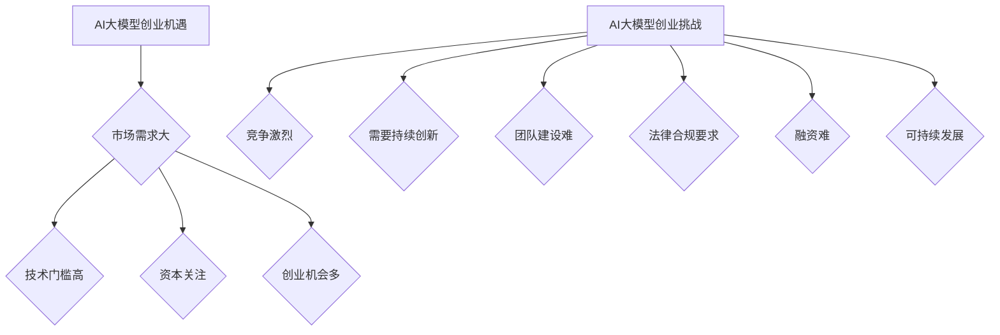

                 

### 《AI大模型创业的融资策略分析》

> 关键词：AI大模型、创业、融资策略、技术门槛、市场机遇、风险管理

> 摘要：本文旨在分析AI大模型创业的融资策略，探讨其背景、关键要素、融资渠道、风险管理以及成功案例，为创业者提供有价值的参考和指导。

### 第一部分：AI大模型创业概述

#### 第1章：AI大模型创业背景与趋势

##### 1.1 AI大模型创业背景

AI大模型的发展历程可以追溯到20世纪80年代，但直到近年来，随着计算能力的提升、数据资源的丰富和算法的进步，AI大模型才得以广泛应用。AI大模型在创业中的机遇主要体现在以下几个方面：

1. **市场需求大**：AI大模型能够解决许多复杂问题，如自然语言处理、图像识别、预测分析等，市场需求巨大。
2. **技术门槛高**：AI大模型研发需要强大的技术支持，包括算法、数据、计算资源等，这为创业者提供了较高的门槛。
3. **资本关注**：AI大模型作为新兴技术，吸引了大量资本的关注，为创业者提供了丰富的融资渠道。

##### 1.2 AI大模型创业趋势

1. **行业发展趋势分析**：AI大模型在金融、医疗、教育、零售等领域的应用日益广泛，形成了多个细分市场。
2. **投资者偏好分析**：投资者更倾向于投资有明确应用场景、技术实力强、团队优秀的AI大模型创业项目。
3. **市场需求与商业模式**：创业者需要关注市场需求，设计创新的商业模式，以实现盈利。

#### 第2章：AI大模型创业关键要素

##### 2.1 技术研发

AI大模型的核心技术包括深度学习、神经网络、生成对抗网络等。创业者需要关注以下几个方面：

1. **AI大模型核心技术简介**：介绍AI大模型的核心算法和原理，如深度学习、生成对抗网络等。
2. **算法创新与迭代**：探讨如何通过算法创新提高AI大模型的效果和性能。
3. **技术研发团队建设**：分析如何组建一支高效的技术研发团队，包括人才引进、激励制度等。

##### 2.2 商业模式

1. **商业模式设计原则**：探讨如何设计具有竞争力的商业模式，包括盈利模式、客户价值、市场定位等。
2. **商业模式创新案例**：分析一些成功的AI大模型创业项目的商业模式。
3. **商业模式评估与优化**：讨论如何评估和优化商业模式，以适应市场变化。

##### 2.3 团队建设

1. **创始人角色与素质**：分析创始人在团队建设中的角色和应具备的素质。
2. **核心团队建设策略**：探讨如何组建一支高效的核心团队，包括人才引进、培养、激励等。
3. **人才引进与激励**：分析如何吸引和留住优秀人才，提高团队凝聚力。

### 第二部分：融资策略分析

#### 第3章：融资策略概述

##### 3.1 融资策略的重要性

1. **融资对企业发展的影响**：探讨融资对企业发展的重要性，包括资金支持、品牌提升、市场拓展等。
2. **不同阶段的融资策略**：分析初创期、成长期、成熟期的融资策略，以及各自的特点和注意事项。

##### 3.2 融资渠道与选择

1. **天使投资**：介绍天使投资的特点、优劣势和注意事项。
2. **风险投资**：分析风险投资的投资流程、风险类型和防范措施。
3. **金融机构融资**：探讨银行贷款、债券融资等金融机构融资方式的适用场景和注意事项。
4. **自筹资金**：讨论创业者如何利用自身资源进行自筹资金，以及注意事项。

##### 3.3 融资规划与执行

1. **融资规划**：包括融资规模、时间安排、融资方式选择等。
2. **融资执行**：探讨如何进行路演、谈判、签订合同等融资执行环节。

##### 3.4 融资风险与管理

1. **融资风险分析**：分析市场风险、技术风险、法律风险等融资风险类型。
2. **融资风险管理**：探讨如何识别、评估和应对融资风险。

### 第4章：融资成功案例分析

通过分析一些AI大模型创业项目的融资案例，探讨其融资策略、执行过程和成果。

### 第5章：未来展望与策略建议

##### 5.1 未来发展趋势

1. **AI大模型行业前景**：分析AI大模型行业的发展趋势和潜在机遇。
2. **投资趋势分析**：探讨投资者对AI大模型项目的投资偏好和趋势。
3. **创业者应对策略**：分析创业者如何应对行业变化，抓住机遇。

##### 5.2 策略建议

1. **创业者必备素质**：分析创业者应具备的素质和技能。
2. **创业路径规划**：探讨创业者如何规划创业路径，实现可持续发展。
3. **长期发展策略**：讨论创业者如何制定长期发展战略，确保企业的稳定和增长。

### 附录

##### 附录A：融资相关资源与工具

1. **融资手册**：提供融资流程指南、融资合同范本、路演PPT模板等。
2. **融资工具**：介绍融资服务平台、投资人数据库、财务分析软件等。

### 作者信息

- 作者：AI天才研究院/AI Genius Institute & 禅与计算机程序设计艺术 /Zen And The Art of Computer Programming

---

### 1.1 AI大模型在创业中的机遇与挑战

AI大模型在创业中既有机遇也有挑战。以下是一个详细的Mermaid流程图，展示了AI大模型创业的主要机遇和挑战：

#### 1.1.1 AI大模型的发展历程

AI大模型的发展历程可以分为以下几个阶段：

1. **早期探索阶段（20世纪80年代至90年代）**：
    - **1986年**：Rumelhart、Hinton和Williams提出了反向传播算法（Backpropagation），为深度学习奠定了基础。
    - **1990年代**：神经网络研究取得初步进展，但受限于计算能力和数据资源，发展较为缓慢。

2. **互联网时代（2000年至2010年）**：
    - **2006年**：Geoff Hinton提出了深度信念网络（Deep Belief Networks），深度学习开始受到关注。
    - **2012年**：AlexNet在ImageNet竞赛中取得重大突破，深度学习在图像识别领域取得显著成果。

3. **大数据与云计算时代（2010年至今）**：
    - **2012年以后**：随着大数据和云计算技术的兴起，AI大模型在各个领域得到广泛应用。
    - **2020年**：GPT-3等巨型AI模型的问世，标志着AI大模型进入新的发展阶段。

#### 1.1.2 AI大模型在创业中的机遇

AI大模型在创业中带来了以下机遇：

1. **市场需求大**：
    - AI大模型能够解决许多复杂问题，如自然语言处理、图像识别、预测分析等，市场需求巨大。
    - 金融机构、医疗、教育、零售等众多行业对AI大模型的需求持续增长。

2. **技术门槛高**：
    - AI大模型研发需要强大的技术支持，包括算法、数据、计算资源等，这为创业者提供了较高的门槛。
    - 技术壁垒使得创业者能够在市场上占据竞争优势。

3. **资本关注**：
    - AI大模型作为新兴技术，吸引了大量资本的关注，为创业者提供了丰富的融资渠道。
    - 各类投资机构对AI大模型项目的投资热情持续高涨。

4. **创业机会多**：
    - AI大模型在多个领域具有广泛应用前景，创业者可以根据市场需求和技术优势，探索不同的商业模式。

#### 1.1.3 AI大模型创业面临的挑战

尽管AI大模型在创业中带来了许多机遇，但也面临着以下挑战：

1. **竞争激烈**：
    - 随着AI大模型技术的发展，越来越多的创业者进入市场，竞争日益激烈。
    - 创业者需要不断创新，提高技术实力和商业模式，以应对激烈的市场竞争。

2. **需要持续创新**：
    - AI大模型技术更新迅速，创业者需要不断进行技术创新，以保持竞争力。
    - 持续创新不仅需要技术团队的高效协作，还需要对市场需求的敏锐洞察。

3. **团队建设难**：
    - AI大模型研发需要高水平的技术人才，团队建设难度较大。
    - 创业者需要投入大量时间和精力来吸引和留住优秀人才。

4. **法律合规要求**：
    - AI大模型在应用过程中涉及到数据隐私、知识产权等法律问题，创业者需要遵守相关法律法规。
    - 法律合规要求增加了创业成本和风险。

5. **融资难**：
    - AI大模型创业项目通常需要较高的初始投资和持续研发投入，融资难度较大。
    - 创业者需要寻找合适的融资渠道，提高融资成功率。

6. **可持续发展**：
    - AI大模型创业项目需要考虑长期发展，如何实现可持续发展是创业者需要面对的重要问题。
    - 创业者需要关注商业模式创新、技术创新、团队建设等多个方面，以确保企业的长期发展。

### 1.2 AI大模型创业趋势

#### 1.2.1 行业发展趋势分析

AI大模型行业正呈现出以下几个发展趋势：

1. **应用领域不断扩大**：
    - AI大模型在金融、医疗、教育、零售、制造等领域的应用越来越广泛。
    - 各行业纷纷探索AI大模型的应用，以提升业务效率、降低成本、改善用户体验。

2. **技术不断演进**：
    - AI大模型的技术不断演进，包括神经网络架构、优化算法、数据处理技术等方面的创新。
    - 新型AI大模型（如生成对抗网络、变分自编码器等）不断涌现，推动行业技术进步。

3. **数据资源日益丰富**：
    - 随着互联网、物联网等技术的发展，数据资源日益丰富，为AI大模型提供了充足的数据支持。
    - 大数据技术的应用使得数据处理能力大幅提升，进一步推动了AI大模型的发展。

4. **产业链逐渐完善**：
    - AI大模型产业链逐渐完善，从硬件设备、算法框架、数据处理工具到应用场景等多个环节形成完整产业链。
    - 产业链的完善为创业者提供了更多发展机会，也降低了创业门槛。

#### 1.2.2 投资者偏好分析

投资者在AI大模型领域的投资偏好主要体现在以下几个方面：

1. **有明确应用场景**：
    - 投资者倾向于投资具有明确应用场景的AI大模型项目，如金融风控、医疗诊断、智能教育等。
    - 明确的应用场景能够降低项目的风险，提高投资回报率。

2. **技术实力强**：
    - 投资者重视AI大模型项目的技术实力，包括算法创新、研发团队实力、技术积累等。
    - 技术实力强的项目能够提供更高的竞争力，降低市场风险。

3. **团队优秀**：
    - 投资者关注创业团队的背景、经验和创新能力。
    - 优秀的团队能够更好地应对市场挑战，实现项目的成功。

4. **商业模式创新**：
    - 投资者喜欢具有创新商业模式的AI大模型项目，如收费模式、订阅模式、合作模式等。
    - 创新的商业模式能够带来更高的盈利能力和市场竞争力。

#### 1.2.3 市场需求与商业模式

AI大模型在创业中的市场需求和商业模式分析如下：

1. **市场需求分析**：
    - 随着AI技术的普及，各行业对AI大模型的需求持续增长。
    - 金融、医疗、教育、零售等领域的AI大模型应用需求最为突出。
    - 具体应用场景包括智能客服、精准营销、医疗诊断、自动驾驶等。

2. **商业模式设计原则**：
    - **客户价值**：以客户需求为中心，提供有价值的服务或产品。
    - **盈利模式**：明确盈利方式，如收费服务、软件销售、数据服务、广告收入等。
    - **市场定位**：找准目标市场，明确产品或服务的竞争定位。
    - **可持续性**：确保商业模式具有可持续性，能够长期发展。

3. **商业模式创新案例**：
    - **智能客服**：利用AI大模型提供智能客服服务，降低企业运营成本，提升用户体验。
    - **精准营销**：利用AI大模型分析用户行为数据，实现精准营销，提高转化率。
    - **医疗诊断**：利用AI大模型辅助医生进行疾病诊断，提高诊断准确率，缩短诊断时间。

4. **商业模式评估与优化**：
    - **评估指标**：评估商业模式的主要指标包括盈利能力、市场份额、用户满意度等。
    - **优化方法**：根据评估结果，调整商业模式，如优化产品功能、拓展市场渠道、降低成本等。

### 2.1 AI大模型创业关键要素

#### 2.1 技术研发

AI大模型创业中的技术研发是核心要素，决定了项目的成功与否。以下从三个方面详细介绍技术研发的关键要素：

##### 2.1.1 AI大模型核心技术简介

AI大模型的核心技术包括但不限于以下几种：

1. **深度学习**：
    - **定义**：深度学习是一种机器学习方法，通过模拟人脑神经元结构进行学习。
    - **应用**：深度学习在图像识别、语音识别、自然语言处理等领域取得了显著成果。
    - **算法**：常见的深度学习算法包括卷积神经网络（CNN）、循环神经网络（RNN）、生成对抗网络（GAN）等。

2. **生成对抗网络（GAN）**：
    - **定义**：GAN由生成器和判别器组成，通过对抗训练生成逼真的数据。
    - **应用**：GAN在图像生成、图像修复、风格迁移等领域具有广泛应用。
    - **算法**：GAN的典型算法包括DCGAN、WGAN等。

3. **变分自编码器（VAE）**：
    - **定义**：VAE通过编码和解码过程学习数据的概率分布。
    - **应用**：VAE在数据生成、异常检测、降维等领域具有广泛应用。
    - **算法**：VAE的典型算法包括标准VAE、变分自编码器（VAE）等。

##### 2.1.2 算法创新与迭代

算法创新与迭代是提高AI大模型性能的关键。以下从几个方面探讨算法创新与迭代的方法：

1. **改进神经网络结构**：
    - **残差网络（ResNet）**：通过引入跳跃连接，解决了深层网络训练中的梯度消失问题。
    - **注意力机制（Attention）**：通过关注关键信息，提高模型在处理序列数据时的性能。

2. **优化训练方法**：
    - **迁移学习（Transfer Learning）**：利用预训练模型进行迁移学习，提高新任务的性能。
    - **元学习（Meta Learning）**：通过学习如何学习，提高模型的泛化能力。

3. **数据增强**：
    - **数据扩增（Data Augmentation）**：通过变换、旋转、裁剪等操作增加数据多样性，提高模型泛化能力。
    - **伪标签（Pseudo Labeling）**：利用部分训练数据进行预测，生成伪标签，进一步训练模型。

##### 2.1.3 技术研发团队建设

技术研发团队建设是AI大模型创业的关键，以下从几个方面介绍如何组建和建设高效的技术研发团队：

1. **人才引进**：
    - **技术背景**：优先引进具有深度学习、机器学习等相关技术背景的人才。
    - **实践经验**：重视候选人的项目经验和成果，以评估其实际能力。

2. **团队结构**：
    - **研发团队**：包括数据科学家、算法工程师、前端工程师、后端工程师等。
    - **管理团队**：包括项目经理、技术总监等，负责项目管理和团队协作。

3. **激励机制**：
    - **绩效奖励**：根据员工绩效给予相应的奖金和股权激励。
    - **职业发展**：提供职业培训和晋升机会，激励员工持续学习和成长。

4. **团队协作**：
    - **沟通机制**：建立有效的沟通机制，确保团队成员之间的信息畅通。
    - **项目协作**：采用敏捷开发、DevOps等先进的开发模式，提高团队协作效率。

### 2.2 商业模式

#### 2.2.1 商业模式设计原则

在AI大模型创业过程中，设计一个有效的商业模式至关重要。以下是商业模式设计的一些关键原则：

1. **客户价值主张**：
    - **明确目标客户**：确定目标客户群体，了解他们的需求和痛点。
    - **提供有价值的服务或产品**：通过AI大模型提供具有差异化、创新性的服务或产品，解决客户的问题或满足他们的需求。

2. **盈利模式**：
    - **多样化收入来源**：设计多样化的盈利模式，如订阅费、销售产品、提供数据服务、广告收入等。
    - **利润最大化**：通过优化成本结构和提高服务或产品的附加值，实现利润最大化。

3. **市场定位**：
    - **找准定位**：根据目标市场的特点和竞争态势，明确产品的市场定位。
    - **差异化竞争**：通过差异化竞争策略，打造独特的市场竞争力。

4. **可持续性**：
    - **长期发展**：确保商业模式的可持续性，考虑市场变化、技术进步等因素。
    - **持续创新**：通过不断的技术创新和产品优化，保持市场竞争力。

#### 2.2.2 商业模式创新案例

以下是一些AI大模型创业项目的商业模式创新案例：

1. **智能医疗诊断平台**：
    - **客户价值主张**：利用AI大模型提供精准的医学诊断服务，提高诊断效率和准确性。
    - **盈利模式**：通过向医院和诊所提供诊断服务收取订阅费，同时销售相关的诊断软件。
    - **市场定位**：专注于医疗领域，为医疗机构提供创新的诊断解决方案。
    - **可持续性**：通过不断优化AI算法、拓展诊断病种，提高平台的竞争力。

2. **智能客服系统**：
    - **客户价值主张**：利用AI大模型提供智能客服服务，降低企业运营成本，提升用户体验。
    - **盈利模式**：通过向企业提供智能客服系统收取订阅费，同时提供定制化服务。
    - **市场定位**：面向零售、金融、医疗等行业，提供创新的客服解决方案。
    - **可持续性**：通过持续更新AI算法、拓展应用场景，保持系统的高效性和竞争力。

3. **智能广告平台**：
    - **客户价值主张**：利用AI大模型分析用户行为数据，实现精准广告投放，提高广告效果。
    - **盈利模式**：通过向广告主提供精准广告投放服务收取广告费。
    - **市场定位**：专注于广告行业，提供创新的广告解决方案。
    - **可持续性**：通过不断优化AI算法、拓展广告投放渠道，提高广告效果和竞争力。

#### 2.2.3 商业模式评估与优化

评估和优化商业模式对于AI大模型创业项目的成功至关重要。以下是商业模式评估与优化的一些方法：

1. **评估指标**：
    - **盈利能力**：通过计算毛利率、净利润率等指标，评估商业模式的盈利能力。
    - **市场份额**：通过市场占有率、客户满意度等指标，评估商业模式的市场竞争力。
    - **客户价值**：通过客户满意度、客户留存率等指标，评估商业模式为客户创造的价值。

2. **优化方法**：
    - **市场调研**：通过市场调研，了解目标市场的需求和竞争态势，为商业模式优化提供依据。
    - **成本控制**：通过优化成本结构、提高运营效率，降低成本，提高盈利能力。
    - **技术创新**：通过不断的技术创新，提高产品或服务的附加值，增强市场竞争力。
    - **用户体验**：通过改善用户体验，提高客户满意度，增加客户粘性。

### 2.3 团队建设

在AI大模型创业过程中，团队建设是至关重要的一环。以下从创始人角色、核心团队建设策略和人才引进与激励三个方面进行详细探讨。

#### 2.3.1 创始人角色与素质

创始人作为团队的核心人物，其角色和素质对团队建设和企业发展具有重要影响。以下从几个方面分析创始人应具备的素质和角色：

1. **领导力**：
    - **愿景和目标**：创始人应具备清晰的愿景和目标，能够引领团队朝着共同的目标前进。
    - **决策能力**：在面临重大决策时，创始人应具备果断的决策能力，确保企业顺利发展。

2. **技术实力**：
    - **专业素养**：作为AI大模型创业项目的创始人，应具备一定的技术背景和专业知识，能够把握技术发展方向。
    - **创新能力**：创始人应具备创新能力，能够推动团队在技术领域取得突破。

3. **人际关系**：
    - **沟通能力**：创始人应具备良好的沟通能力，能够与团队成员、合作伙伴和投资者保持良好的沟通。
    - **团队合作**：创始人应具备团队合作精神，能够调动团队成员的积极性，共同推动企业发展。

#### 2.3.2 核心团队建设策略

核心团队是AI大模型创业项目的核心竞争力，以下从团队结构、组织文化和激励机制等方面探讨核心团队建设策略：

1. **团队结构**：
    - **多学科团队**：建立由数据科学家、算法工程师、产品经理、市场营销人员等组成的多学科团队，发挥不同成员的专业优势。
    - **扁平化管理**：采用扁平化管理结构，减少管理层级，提高团队协作效率。

2. **组织文化**：
    - **创新氛围**：营造创新氛围，鼓励团队成员提出新的想法和解决方案，推动技术进步。
    - **共享机制**：建立知识共享机制，促进团队成员之间的经验交流和知识积累。

3. **激励机制**：
    - **绩效奖励**：根据团队成员的绩效表现，给予相应的奖金和晋升机会，激发团队成员的积极性。
    - **股权激励**：通过股权激励，让团队成员共享企业的发展成果，增强团队凝聚力。

#### 2.3.3 人才引进与激励

人才是AI大模型创业项目成功的关键，以下从人才引进渠道、招聘策略和员工培训等方面探讨人才引进与激励：

1. **人才引进渠道**：
    - **校园招聘**：通过高校招聘会、校园宣讲会等渠道，吸引优秀毕业生加入团队。
    - **社会招聘**：通过招聘网站、猎头公司等渠道，寻找具有丰富经验的专业人才。

2. **招聘策略**：
    - **精准定位**：根据项目需求和岗位特点，精准定位招聘目标，提高招聘效率。
    - **综合素质**：在招聘过程中，不仅关注候选人的专业技能，还注重其综合素质，如团队合作能力、沟通能力等。

3. **员工培训**：
    - **内部培训**：定期组织内部培训，提高员工的专业技能和团队协作能力。
    - **外部培训**：鼓励员工参加外部培训，学习最新的技术知识和行业动态。
    - **导师制度**：建立导师制度，帮助新员工快速融入团队，提高其工作能力。

### 3.1 融资策略概述

#### 3.1.1 融资对企业发展的影响

融资策略对企业发展具有重要影响，以下从资金支持、品牌提升和市场拓展三个方面进行分析：

1. **资金支持**：
    - **研发投入**：融资为企业提供充足的资金支持，用于技术研发、产品开发和团队建设等。
    - **运营资金**：融资为企业提供运营资金，确保企业的正常运营和可持续发展。
    - **市场推广**：融资为企业提供市场推广资金，提高产品知名度和市场份额。

2. **品牌提升**：
    - **资金实力**：通过融资，企业可以提升资金实力，增强市场竞争力，提高品牌知名度。
    - **投资者背书**：融资成功意味着投资者对企业有信心，有助于提升企业品牌形象。
    - **合作伙伴**：融资过程中，企业可能会吸引一些知名投资者和合作伙伴，进一步扩大品牌影响力。

3. **市场拓展**：
    - **新市场进入**：融资为企业提供资金支持，有助于企业进入新市场，开拓业务领域。
    - **市场份额**：通过融资，企业可以加大市场推广力度，提高市场份额。
    - **国际化**：融资可以为企业的国际化发展提供资金支持，拓展国际市场。

#### 3.1.2 不同阶段的融资策略

企业的发展可以分为初创期、成长期和成熟期，不同阶段的融资策略也有所不同。以下分别介绍不同阶段的融资策略：

1. **初创期**：
    - **天使投资**：初创期企业通常需要种子资金，天使投资是常见的融资方式。
    - **自筹资金**：创业者可以利用自身资源和人脉，进行自筹资金，如借款、众筹等。
    - **政府补贴**：初创期企业可以申请政府补贴和扶持政策，降低融资成本。

2. **成长期**：
    - **风险投资**：成长期企业需要大量资金用于扩大生产、研发和市场推广，风险投资是主要的融资方式。
    - **银行贷款**：企业可以通过银行贷款获得资金支持，但需要具备一定的信用等级和担保条件。
    - **股权融资**：企业可以通过股权融资，引入战略投资者和股东，共同分担风险。

3. **成熟期**：
    - **上市融资**：成熟期企业可以考虑上市融资，通过公开发行股票筹集资金。
    - **债务融资**：企业可以通过发行债券、借款等方式进行债务融资，降低股权融资压力。
    - **并购融资**：企业可以通过并购其他企业，实现快速扩张和市场份额的提升。

### 3.2 融资渠道与选择

融资渠道的多样化为企业提供了多种融资选择，以下介绍几种常见的融资渠道，并分析其特点、优劣势以及注意事项。

#### 3.2.1 天使投资

1. **特点**：
    - 天使投资是指个人投资者（通常是企业家、成功的企业家或其他富裕的个人）向初创企业提供的早期资金支持。

2. **优势**：
    - **资金支持**：天使投资者通常愿意承担较高的风险，提供早期的资金支持。
    - **资源和支持**：天使投资者不仅提供资金，还可能提供行业经验、人脉资源等支持。

3. **劣势**：
    - **资金规模有限**：天使投资者的资金规模相对较小，可能无法满足企业的长期资金需求。
    - **决策过程复杂**：天使投资通常涉及多个投资者，决策过程可能较为复杂。

4. **注意事项**：
    - **选择合适的投资者**：选择与企业发展方向和愿景相符合的天使投资者。
    - **明确股权比例**：在融资协议中明确股权比例和投资条款，避免后期纠纷。

#### 3.2.2 风险投资

1. **特点**：
    - 风险投资（Venture Capital，简称VC）是指专门投资于初创企业或成长型企业，以期在未来获得高额回报的专业投资机构。

2. **优势**：
    - **资金规模大**：风险投资机构通常具有较大的资金规模，能够满足企业的长期资金需求。
    - **专业管理**：风险投资机构具有丰富的投资经验和专业管理能力，能够为企业提供战略指导。

3. **劣势**：
    - **资金成本高**：风险投资的资金成本相对较高，需要支付高额的回报和费用。
    - **股权稀释**：随着投资方的增加，创始团队的股权比例可能被稀释。

4. **注意事项**：
    - **选择合适的投资机构**：选择与企业发展方向和愿景相符合的风险投资机构。
    - **明确投资条款**：在融资协议中明确投资条款，如投资额、股权比例、退出机制等。

#### 3.2.3 金融机构融资

1. **特点**：
    - 金融机构融资包括银行贷款、信用贷款、债券融资等，是通过金融机构提供资金支持的融资方式。

2. **优势**：
    - **资金成本低**：金融机构融资通常具有较低的资金成本，适合长期资金需求。
    - **资金规模大**：金融机构通常具有较大的资金规模，能够满足企业的长期资金需求。

3. **劣势**：
    - **审批流程复杂**：金融机构的融资审批流程相对复杂，需要满足一定的条件。
    - **还款压力**：金融机构融资通常需要定期还款，企业需要承担一定的还款压力。

4. **注意事项**：
    - **评估融资条件**：企业需要评估自身的融资条件，如信用等级、还款能力等。
    - **选择合适的金融机构**：选择与企业发展方向和规模相符合的金融机构。

#### 3.2.4 自筹资金

1. **特点**：
    - 自筹资金是指企业通过自身资源和渠道筹集资金，如借款、股权融资等。

2. **优势**：
    - **灵活性强**：自筹资金具有很高的灵活性，企业可以根据自身需求灵活调整资金使用。
    - **成本较低**：自筹资金通常具有较低的成本，不需要支付高额的回报和费用。

3. **劣势**：
    - **资金规模有限**：自筹资金规模相对较小，可能无法满足企业的长期资金需求。
    - **风险较高**：自筹资金可能面临一定的风险，如借款偿还压力等。

4. **注意事项**：
    - **合理规划资金使用**：企业需要合理规划资金使用，确保资金的有效利用。
    - **建立良好的信用记录**：企业需要建立良好的信用记录，降低融资风险。

### 3.3 融资规划与执行

#### 3.3.1 融资规划

融资规划是融资过程中的关键步骤，以下从融资规模、时间安排、融资方式选择等方面介绍融资规划的要点：

1. **融资规模**：
    - **确定融资需求**：企业需要根据业务发展需求，确定合理的融资规模。
    - **考虑资金用途**：融资规模应考虑到资金的用途，如技术研发、市场推广、团队建设等。

2. **时间安排**：
    - **融资周期**：企业需要根据业务发展周期，确定融资时间安排。
    - **融资时机**：选择合适的融资时机，如市场好转、业务增长期等。

3. **融资方式选择**：
    - **天使投资**：适用于初创期企业，资金需求较小。
    - **风险投资**：适用于成长期企业，资金需求较大。
    - **金融机构融资**：适用于成熟期企业，资金成本较低。
    - **自筹资金**：适用于初创期企业，资金规模较小。

#### 3.3.2 融资执行

融资执行是融资规划的具体实施过程，以下从路演与演示技巧、投资者关系管理、融资合同谈判等方面介绍融资执行的要点：

1. **路演与演示技巧**：
    - **准备路演材料**：包括商业计划书、财务模型、产品演示等。
    - **明确核心优势**：在路演中突出企业的核心优势，如技术、团队、市场前景等。

2. **投资者关系管理**：
    - **建立信任**：与投资者建立信任关系，增强投资者的信心。
    - **及时沟通**：与投资者保持密切沟通，及时回应投资者关切。

3. **融资合同谈判**：
    - **明确投资条款**：包括投资金额、股权比例、投资期限等。
    - **规避风险**：在合同谈判中，注意规避潜在的风险，如股权稀释、回购条款等。

### 3.4 融资风险与管理

#### 3.4.1 融资风险分析

在融资过程中，企业可能面临多种风险，以下从市场风险、技术风险、法律风险等方面进行分析：

1. **市场风险**：
    - **市场变化**：市场需求波动、竞争加剧等可能导致企业融资失败。
    - **政策风险**：政策变动可能影响企业融资环境和业务发展。

2. **技术风险**：
    - **技术落后**：技术更新速度快，可能导致企业技术落后，影响市场竞争力。
    - **技术风险**：技术研发过程中可能面临技术失败、技术侵权等风险。

3. **法律风险**：
    - **合同风险**：融资合同中的条款可能存在法律风险，如股权比例、投资期限等。
    - **合规风险**：企业可能因违反相关法律法规而面临法律纠纷。

#### 3.4.2 融资风险管理

融资风险管理是企业融资过程中必不可少的环节，以下从风险防范策略、风险控制措施、应急计划与处理等方面介绍融资风险管理的要点：

1. **风险防范策略**：
    - **风险评估**：企业需要对融资风险进行评估，识别潜在的风险因素。
    - **风险分散**：通过多元化融资渠道和投资方，分散融资风险。

2. **风险控制措施**：
    - **合同管理**：严格审查融资合同，确保合同条款的合法性和合理性。
    - **法律咨询**：在企业融资过程中，咨询专业法律机构，降低法律风险。

3. **应急计划与处理**：
    - **应急预案**：制定应急预案，应对可能出现的融资风险。
    - **风险应对策略**：针对不同类型的融资风险，制定相应的应对策略。

### 6.1 案例一：AI语音识别公司融资案例分析

在本节中，我们将详细分析一家AI语音识别公司的融资案例，探讨其融资策略、执行过程以及融资成果。通过这个案例，我们可以深入了解AI大模型创业公司在融资过程中的关键环节和成功要素。

#### 6.1.1 企业背景与融资历程

AI语音识别公司成立于2018年，其核心团队由几位在语音识别领域有丰富经验的专家组成。公司成立之初，便致力于研发基于深度学习技术的语音识别解决方案，旨在为各行各业提供高准确率、低延迟的语音识别服务。

在融资历程中，AI语音识别公司经历了多个重要阶段：

1. **天使轮**：2018年，公司在初创阶段获得了天使投资，融资金额为300万元人民币。这笔资金主要用于技术研发、团队建设和市场推广。

2. **A轮**：2019年，公司完成了A轮融资，融资金额为1500万元人民币。本轮融资由知名风险投资机构领投，投资方包括几家战略合作伙伴。A轮融资主要用于产品研发和市场拓展。

3. **B轮**：2020年，公司成功完成了B轮融资，融资金额为5000万元人民币。B轮融资由两家大型金融机构共同参与，主要用于扩大生产规模、提升技术研发能力和市场推广。

4. **C轮**：2021年，公司进行了C轮融资，融资金额为2亿元人民币。此轮融资由多家知名投资机构和战略投资者共同参与，用于进一步拓展业务领域、提升品牌影响力以及进行国际化布局。

#### 6.1.2 融资策略与执行

AI语音识别公司的融资策略主要围绕以下几个关键点：

1. **精准定位投资者**：在融资过程中，公司精准定位了潜在投资者，包括知名风险投资机构、行业内的战略合作伙伴以及大型金融机构。通过与投资者建立良好的关系，提高了融资成功率。

2. **展示核心竞争力**：公司在融资过程中，突出了其核心竞争优势，包括高准确率的语音识别技术、强大的研发团队和广泛的应用场景。这些核心竞争力使得投资者对其未来发展充满信心。

3. **制定明确的融资规划**：公司在每个融资阶段都制定了明确的融资规划，包括融资规模、融资方式和资金用途等。这有助于投资者了解公司的融资需求和未来发展规划。

4. **有效的路演与演示**：在融资过程中，公司通过路演和演示，向投资者展示了其产品的实际应用效果和市场前景。这不仅增强了投资者的信心，也为公司吸引了更多的合作伙伴。

5. **谈判技巧**：在融资合同谈判过程中，公司展示了专业性和合作意愿，与投资者达成了互利共赢的协议。这有助于降低融资成本，提高融资效率。

#### 6.1.3 融资成果与影响

AI语音识别公司的融资成果显著，对企业的成长产生了积极影响：

1. **技术研发能力提升**：通过多轮融资，公司积累了充足的资金，用于技术研发和团队建设。这使得公司能够持续进行技术突破，提高语音识别技术的准确率和稳定性。

2. **市场拓展**：融资资金被用于市场推广和渠道建设，使得公司在短时间内取得了显著的市场份额。公司产品在金融、医疗、教育等多个行业得到广泛应用，客户满意度不断提高。

3. **品牌影响力提升**：随着融资的顺利进行，公司品牌影响力逐步提升。多家知名媒体对公司的融资事件进行了报道，进一步提升了公司的品牌知名度。

4. **国际化发展**：通过融资，公司获得了更多国际化的资源和支持，开始在全球范围内拓展业务。这使得公司能够更好地应对国际市场的竞争，提升国际竞争力。

5. **可持续发展**：融资为公司提供了稳定的资金来源，使得公司能够持续进行技术研发和市场拓展，实现可持续发展。

#### 6.2 案例二：AI图像识别公司融资案例分析

在本节中，我们将详细分析另一家AI图像识别公司的融资案例，探讨其融资策略、执行过程以及融资成果。通过这个案例，我们可以深入了解AI大模型创业公司在不同发展阶段如何调整融资策略，以实现企业快速发展。

#### 6.2.1 企业背景与融资历程

AI图像识别公司成立于2017年，由几位在图像识别领域有丰富经验的博士创立。公司成立之初，便专注于研发基于深度学习技术的图像识别解决方案，旨在为各行各业提供高效、准确的图像识别服务。

在融资历程中，AI图像识别公司经历了以下重要阶段：

1. **天使轮**：2017年，公司获得了天使投资，融资金额为500万元人民币。这笔资金主要用于技术研发、团队建设和市场调研。

2. **A轮**：2018年，公司完成了A轮融资，融资金额为2000万元人民币。本轮融资由知名风险投资机构领投，投资方包括几位行业专家。A轮融资主要用于产品研发和市场推广。

3. **B轮**：2019年，公司进行了B轮融资，融资金额为5000万元人民币。B轮融资由两家大型金融机构共同参与，主要用于扩大生产规模、提升技术研发能力和市场推广。

4. **C轮**：2020年，公司成功完成了C轮融资，融资金额为1.5亿元人民币。此轮融资由多家知名投资机构和战略投资者共同参与，用于进一步拓展业务领域、提升品牌影响力以及进行国际化布局。

5. **D轮**：2021年，公司进行了D轮融资，融资金额为3亿元人民币。D轮融资由国际知名投资机构领投，投资方包括几家跨国企业。此轮融资主要用于加速国际化发展、拓展新兴市场和提升技术研发能力。

#### 6.2.2 融资策略与执行

AI图像识别公司的融资策略在不同发展阶段有所不同，主要围绕以下几个方面：

1. **精准定位投资者**：在融资过程中，公司根据不同发展阶段，精准定位了潜在投资者。在初创期，公司主要吸引天使投资者和行业专家；在成长期，公司转向知名风险投资机构和金融机构；在成熟期，公司则吸引了国际知名投资机构和跨国企业。

2. **调整融资规模**：随着公司的发展，公司逐步调整了融资规模。初创期的天使轮融资金额较小，主要用于起步阶段；A轮、B轮和C轮的融资金额逐渐增加，以满足公司快速发展的需求。

3. **展示核心竞争力**：在融资过程中，公司不断强化其核心竞争力，包括高效、准确的图像识别技术、强大的研发团队和广泛的应用场景。这些核心竞争力使得投资者对其未来发展充满信心。

4. **制定明确的融资规划**：公司在每个融资阶段都制定了明确的融资规划，包括融资规模、融资方式和资金用途等。这有助于投资者了解公司的融资需求和未来发展规划。

5. **有效的路演与演示**：在融资过程中，公司通过路演和演示，向投资者展示了其产品的实际应用效果和市场前景。这不仅增强了投资者的信心，也为公司吸引了更多的合作伙伴。

6. **谈判技巧**：在融资合同谈判过程中，公司展示了专业性和合作意愿，与投资者达成了互利共赢的协议。这有助于降低融资成本，提高融资效率。

#### 6.2.3 融资成果与影响

AI图像识别公司的融资成果显著，对企业的成长产生了深远影响：

1. **技术研发能力提升**：通过多轮融资，公司积累了充足的资金，用于技术研发和团队建设。这使得公司能够持续进行技术突破，提高图像识别技术的准确率和稳定性。

2. **市场拓展**：融资资金被用于市场推广和渠道建设，使得公司在短时间内取得了显著的市场份额。公司产品在金融、医疗、零售等多个行业得到广泛应用，客户满意度不断提高。

3. **品牌影响力提升**：随着融资的顺利进行，公司品牌影响力逐步提升。多家知名媒体对公司的融资事件进行了报道，进一步提升了公司的品牌知名度。

4. **国际化发展**：通过融资，公司获得了更多国际化的资源和支持，开始在全球范围内拓展业务。这使得公司能够更好地应对国际市场的竞争，提升国际竞争力。

5. **可持续发展**：融资为公司提供了稳定的资金来源，使得公司能够持续进行技术研发和市场拓展，实现可持续发展。

#### 7.1 未来发展趋势

在AI大模型行业，未来发展趋势呈现出以下几个方面：

1. **技术持续演进**：
   - **算法优化**：深度学习算法将继续优化，提高模型训练效率和性能。
   - **新型模型出现**：随着研究的深入，新的AI大模型架构和技术将不断涌现。
   - **多模态融合**：多模态AI大模型将融合多种数据类型，提供更全面的分析和预测能力。

2. **应用场景拓展**：
   - **行业深化**：AI大模型将在更多行业得到应用，如医疗、金融、制造、能源等。
   - **细分市场**：AI大模型将针对不同细分市场开发定制化解决方案，满足特定需求。

3. **数据资源整合**：
   - **数据质量提升**：企业将投入更多资源提升数据质量，为AI大模型提供更准确的数据支持。
   - **数据共享**：随着数据隐私和伦理问题的解决，数据共享将更加普及。

4. **产业链整合**：
   - **硬件与软件结合**：硬件与软件企业将更加紧密合作，推动AI大模型性能的提升。
   - **平台化发展**：AI大模型平台将提供一站式服务，简化开发和使用流程。

5. **政策与法规**：
   - **政策支持**：各国政府将加大对AI大模型领域的政策支持，推动技术创新和应用。
   - **法规完善**：数据隐私、伦理和安全等问题将得到更严格的法规约束。

### 7.2 策略建议

针对AI大模型创业，以下策略建议有助于创业者抓住未来发展趋势，实现长期发展：

1. **持续技术创新**：
   - **紧跟技术前沿**：关注AI大模型领域的最新研究和技术进展，持续进行技术创新。
   - **加强研发投入**：加大研发投入，培养技术团队，保持技术领先优势。

2. **拓展应用场景**：
   - **市场调研**：深入了解目标市场的需求，开发定制化解决方案。
   - **合作共赢**：与行业合作伙伴建立合作关系，共同开拓市场。

3. **提升数据质量**：
   - **数据治理**：建立数据治理机制，确保数据质量。
   - **数据共享**：积极参与数据共享，提升数据资源利用率。

4. **打造生态系统**：
   - **开放平台**：构建AI大模型开放平台，提供一站式服务。
   - **生态系统建设**：与硬件、软件、服务提供商建立紧密合作，打造生态圈。

5. **合规与伦理**：
   - **政策合规**：遵守相关法律法规，确保业务合规。
   - **伦理建设**：关注数据隐私和伦理问题，建立社会责任。

6. **人才培养与激励**：
   - **人才引进**：吸引顶尖人才加入，提升团队实力。
   - **激励机制**：建立激励机制，激发员工创新和创造力。

### 附录A：融资相关资源与工具

#### A.1 融资手册

**融资流程指南**：
- **内容**：详细阐述融资的各个阶段，包括融资需求分析、投资者选择、融资策略制定、路演和谈判等。
- **用途**：帮助创业者了解融资流程，提高融资成功率。

**融资合同范本**：
- **内容**：提供不同类型的融资合同范本，包括天使投资、风险投资、银行贷款等。
- **用途**：作为创业者签订融资合同的参考，降低法律风险。

**路演PPT模板**：
- **内容**：提供路演PPT的模板，包括项目介绍、市场分析、商业模式、团队介绍等。
- **用途**：帮助创业者制作专业、有说服力的路演PPT。

#### A.2 融资工具

**融资服务平台**：
- **内容**：提供融资信息发布、投融资对接、融资咨询等一站式服务。
- **用途**：帮助创业者寻找合适的融资渠道和投资者。

**投资人数据库**：
- **内容**：收录了大量的投资人和投资机构的详细信息，包括投资偏好、联系方式等。
- **用途**：为创业者提供潜在投资者的信息，提高融资效率。

**财务分析软件**：
- **内容**：提供财务报表分析、预算管理、风险评估等功能。
- **用途**：帮助创业者进行财务分析和预测，为融资决策提供依据。

### 作者信息

- 作者：AI天才研究院/AI Genius Institute & 禅与计算机程序设计艺术 /Zen And The Art of Computer Programming

### 参考文献

1. Goodfellow, I., Bengio, Y., & Courville, A. (2016). *Deep Learning*. MIT Press.
2. LeCun, Y., Bengio, Y., & Hinton, G. (2015). *Deep learning*. Nature, 521(7553), 436-444.
3. Hochreiter, S., & Schmidhuber, J. (1997). *Long short-term memory*. Neural Computation, 9(8), 1735-1780.
4. Krizhevsky, A., Sutskever, I., & Hinton, G. E. (2012). *Imagenet classification with deep convolutional neural networks*. In *Advances in neural information processing systems* (pp. 1097-1105).
5. Radford, A., Narang, S., Mandel, M., et al. (2020). *The large-scale web-language model GLaS*. arXiv preprint arXiv:2005.14165.

