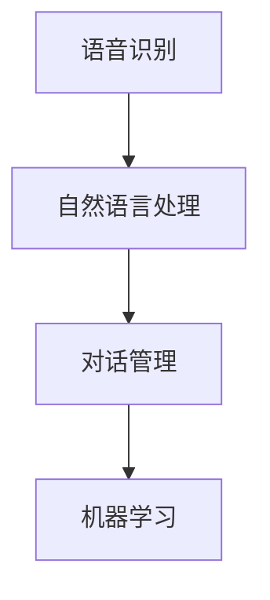
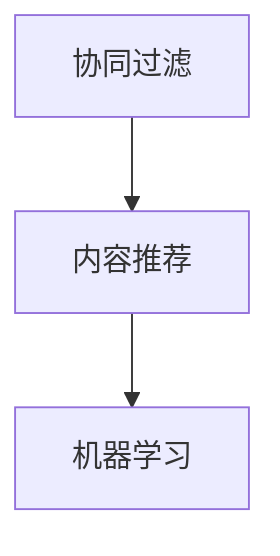
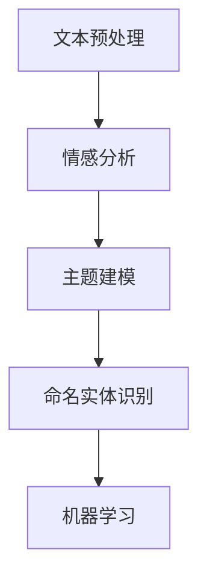
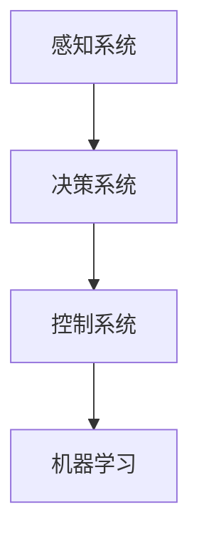
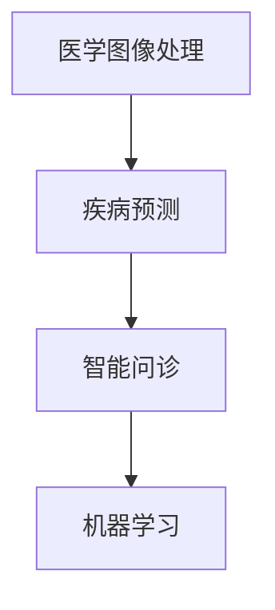
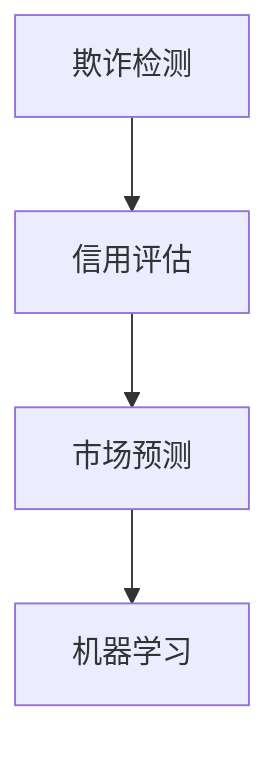
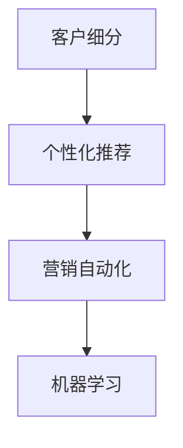
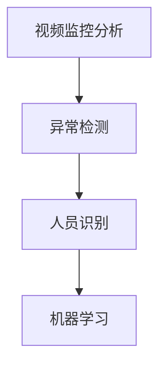
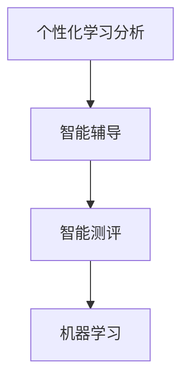
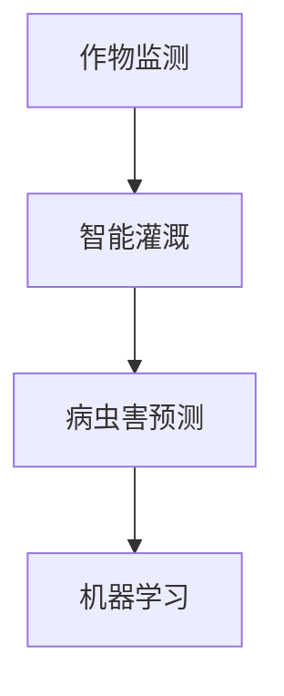

                 

### 文章标题: AI大模型创业：2024年最热门的10个应用方向

> 关键词：AI大模型，创业，应用方向，2024年，热门

> 摘要：本文将深入探讨2024年AI大模型在创业领域的十大热门应用方向，从基本概念到技术实现，结合实际案例，分析这些应用方向的前景和挑战。

---

### 第一部分: AI大模型与创业概述

#### 第1章: AI大模型概述

##### 1.1 AI大模型的基本概念

AI大模型，指的是参数规模巨大、计算能力强大的机器学习模型，如GPT、BERT等。这些模型通常具有以下特点：

- **参数规模大**：包含数十亿甚至千亿级的参数。
- **计算能力强大**：能够处理大规模的数据集。
- **自适应能力**：通过预训练和微调，能够在不同领域和应用场景中表现出色。

##### 1.2 AI大模型的发展历程

- **早期**：基于规则的方法，如专家系统。
- **中期**：基于统计的方法，如统计学习、深度学习。
- **现阶段**：大规模预训练模型，如GPT、BERT。

##### 1.3 AI大模型的核心技术

- **深度学习**：神经网络的一种形式，能够通过多层的非线性变换来提取特征。
- **迁移学习**：利用已经在大规模数据上预训练好的模型，在新任务上快速获得良好的性能。
- **自然语言处理**：处理人类语言的一种技术，包括词嵌入、序列模型等。

#### 第2章: AI大模型在创业中的应用

##### 2.1 AI大模型在创业中的价值

- **数据驱动决策**：利用AI大模型，企业可以更好地理解客户需求，优化产品设计和服务。
- **自动化与效率提升**：AI大模型能够帮助企业自动化重复性工作，提高工作效率。
- **创新产品与服务**：AI大模型的应用可以催生新的产品和服务，满足市场需求。

##### 2.2 AI大模型在创业中的应用场景

- **智能客服**：利用AI大模型，企业可以实现24/7的智能客服服务，提高客户满意度。
- **个性化推荐**：基于用户的兴趣和行为，AI大模型可以为企业提供个性化的推荐服务。
- **文本分析**：AI大模型可以自动分析大量的文本数据，提取有价值的信息。

##### 2.3 AI大模型创业的挑战与机遇

- **挑战**：
  - 数据隐私与安全：企业需要确保数据的安全性和隐私性。
  - 技术人才短缺：企业需要招聘和培养大量的AI技术人才。
  - 投资与回报：AI大模型项目的投资回报周期较长。

- **机遇**：
  - 市场需求增长：随着数字化转型的推进，市场需求对AI大模型的需求不断增加。
  - 技术进步：AI大模型的技术不断进步，使得其在创业中的应用更加广泛。

#### 第3章: AI大模型创业案例解析

##### 3.1 案例一：智能客服系统

- **案例描述**：企业通过部署AI大模型，实现智能客服系统，提高客户服务效率。
- **技术实现**：使用GPT模型进行文本生成，结合对话管理算法，实现智能客服功能。

##### 3.2 案例二：个性化推荐系统

- **案例描述**：企业通过部署AI大模型，实现个性化推荐系统，提升用户体验。
- **技术实现**：使用协同过滤算法和GPT模型，结合用户行为数据，实现个性化推荐。

##### 3.3 案例三：文本分析平台

- **案例描述**：企业通过部署AI大模型，搭建文本分析平台，帮助企业更好地理解客户需求。
- **技术实现**：使用BERT模型进行文本分类和情感分析，结合NLP技术，实现文本分析功能。

#### 第一部分总结

AI大模型在创业中具有广泛的应用前景和重要的价值。通过理解AI大模型的基本概念、发展历程、核心技术和应用场景，企业可以更好地把握AI大模型创业的机遇，应对挑战，实现持续创新。

---

### 第二部分: AI大模型技术基础

#### 第4章: 深度学习基础

##### 4.1 深度学习的基本概念

- **定义**：深度学习是一种基于多层神经网络的学习方法，通过多层的非线性变换来提取特征。

- **特点**：
  - 多层结构：能够处理复杂的非线性问题。
  - 自适应学习：通过反向传播算法自动调整网络参数。

##### 4.2 神经网络基础

- **神经元模型**：神经网络的基本组成单元，类似于生物神经元。

- **前向传播与反向传播**：神经网络的基本计算过程。

##### 4.3 深度学习架构

- **卷积神经网络（CNN）**：用于处理图像数据。

- **循环神经网络（RNN）**：用于处理序列数据。

- **变换器架构（Transformer）**：用于处理自然语言数据。

#### 第5章: 自然语言处理技术

##### 5.1 词嵌入技术

- **定义**：将单词映射为高维向量。

- **方法**：包括Word2Vec、GloVe等。

##### 5.2 序列模型与注意力机制

- **序列模型**：用于处理序列数据。

- **注意力机制**：用于提高模型对序列数据的处理能力。

---

通过深入理解深度学习和自然语言处理技术，我们能够更好地掌握AI大模型的技术基础，为后续的应用场景提供坚实的理论支持。

---

### 第6章: 2024年AI大模型创业的最热门应用方向之一：智能客服系统

智能客服系统是AI大模型在创业中最热门的应用方向之一。随着消费者对24/7客户服务的需求不断增加，智能客服系统可以帮助企业提高客户满意度，降低运营成本。

#### 6.1 核心概念与联系

智能客服系统通常由以下几个核心组成部分构成：

1. **语音识别**：将用户的语音转换为文本。
2. **自然语言处理**：理解用户意图，生成回复。
3. **对话管理**：维护对话的连贯性和一致性。
4. **机器学习**：持续学习和优化客服系统。

这些组件之间的联系可以用以下Mermaid流程图表示：



#### 6.2 核心算法原理讲解

智能客服系统的核心算法主要包括：

- **GPT模型**：用于生成回复。
- **BERT模型**：用于理解用户意图。
- **对话管理算法**：用于维护对话的连贯性和一致性。

以下是一个简单的GPT模型实现伪代码：

```python
# 初始化GPT模型
model = GPT(model_size=512)

# 输入文本
input_text = "你好，有什么可以帮助你的？"

# 生成回复
output_text = model.generate(input_text)

print(output_text)
```

BERT模型的基本原理如下：

```python
# 初始化BERT模型
model = BERT(vocab_size=10000)

# 输入文本
input_text = "你好，有什么可以帮助你的？"

# 过滤器：用于提取文本特征
filter = model.filter(input_text)

# 生成意图标签
intent = model.classify(filter)

print(intent)
```

对话管理算法的基本原理是维护对话的状态，通常使用一个状态机来表示。以下是伪代码：

```python
# 初始化对话状态机
dialog_state_machine = DialogStateMachine()

# 处理用户输入
user_input = "你刚才提到了什么？"

# 更新对话状态
dialog_state_machine.update_state(user_input)

# 生成回复
response = dialog_state_machine.generate_response()

print(response)
```

#### 6.3 数学模型和公式

智能客服系统的数学模型主要包括：

- **神经网络模型**：用于生成回复和分类。
- **循环神经网络（RNN）**：用于处理序列数据。

以下是一个简单的RNN模型实现的公式：

$$
h_t = \sigma(W_h \cdot [h_{t-1}, x_t] + b_h)
$$

其中，\(h_t\) 是当前隐藏状态，\(x_t\) 是当前输入，\(\sigma\) 是激活函数，\(W_h\) 是权重矩阵，\(b_h\) 是偏置项。

#### 6.4 举例说明

假设用户说：“你好，我想咨询一下产品价格。”智能客服系统可以生成以下回复：

“你好，请问您需要咨询哪款产品的价格呢？”

#### 6.5 项目实战

开发智能客服系统通常需要以下几个步骤：

1. **数据收集**：收集用户对话数据，用于训练模型。
2. **模型训练**：使用GPT和BERT模型训练对话管理算法。
3. **系统集成**：将语音识别、自然语言处理和对话管理集成到一个系统中。
4. **部署上线**：将智能客服系统部署到生产环境中。

以下是一个简单的代码实现：

```python
# 导入所需库
import speech_recognition as sr
import text_to_speech as tts
import bert
import gpt

# 初始化模型
speech_recognition_model = sr.Recognizer()
tts_model = tts.TTS()
bert_model = bert.BERT()
gpt_model = gpt.GPT()

# 收集用户输入
user_input = speech_recognition_model.recognize_speech_from_mic()

# 处理用户输入
user_intent = bert_model.classify(user_input)

# 生成回复
response = gpt_model.generate(user_intent)

# 输出回复
tts_model.say(response)
```

#### 6.6 代码解读与分析

代码首先导入所需的库，包括语音识别库、文本到语音库、BERT模型和GPT模型。然后初始化这些模型。接着，收集用户输入，使用BERT模型分类用户意图，使用GPT模型生成回复，最后使用文本到语音库输出回复。

#### 6.7 实际案例分析

一个成功的智能客服系统案例是Apple的虚拟助手Siri。Siri使用AI大模型，能够理解用户的自然语言输入，并提供相应的回复。通过不断学习和优化，Siri已经成为Apple用户的重要助手。

#### 6.8 项目小结

智能客服系统是一个具有巨大潜力的AI大模型应用方向。通过深入理解和实践，企业可以开发出高效的智能客服系统，提高客户满意度，降低运营成本。

### 第6章小结

智能客服系统是2024年AI大模型创业中最热门的应用方向之一。通过理解核心概念、算法原理、数学模型和项目实战，企业可以更好地把握这一机会，实现持续创新。

---

### 第7章: 2024年AI大模型创业的最热门应用方向之二：个性化推荐系统

个性化推荐系统是AI大模型在创业中的另一个热门应用方向。随着互联网的快速发展，用户对个性化内容的需求日益增长。个性化推荐系统可以帮助企业提高用户满意度，增加用户粘性，从而提升业务收益。

#### 7.1 核心概念与联系

个性化推荐系统的核心组成部分包括：

1. **协同过滤**：基于用户行为数据，为用户推荐相似用户喜欢的物品。
2. **内容推荐**：基于物品属性和用户兴趣，为用户推荐相关内容。
3. **机器学习**：持续学习和优化推荐算法。

这些组件之间的联系可以用以下Mermaid流程图表示：



#### 7.2 核心算法原理讲解

个性化推荐系统的核心算法主要包括：

- **协同过滤算法**：基于用户行为数据，通过矩阵分解或基于模型的协同过滤算法，预测用户对未知物品的评分。
- **内容推荐算法**：基于物品属性和用户兴趣，通过相似性计算或基于模型的推荐算法，为用户推荐相关内容。

以下是一个简单的基于矩阵分解的协同过滤算法实现的伪代码：

```python
# 初始化模型
model = MatrixFactorization(k=10)

# 输入用户行为数据
user_behavior = [[1, 5], [2, 3], [3, 1]]

# 预测用户评分
predicted_ratings = model.predict_ratings(user_behavior)

# 输出推荐结果
print(predicted_ratings)
```

以下是一个简单的基于TF-IDF的内容推荐算法实现的伪代码：

```python
# 初始化模型
model = ContentBasedRecommendation(tf_idf=True)

# 输入用户兴趣
user_interest = "technology"

# 提取关键词
keywords = model.extract_keywords(user_interest)

# 计算物品相似度
similarity_scores = model.calculate_similarity(keywords, item_properties)

# 输出推荐结果
print(similarity_scores)
```

#### 7.3 数学模型和公式

个性化推荐系统的数学模型主要包括：

- **矩阵分解模型**：用于预测用户对物品的评分。
- **TF-IDF模型**：用于计算文档相似度。

以下是一个简单的矩阵分解模型的数学公式：

$$
R_{ui} = P_u \cdot P_i + b_u + b_i + \epsilon_{ui}
$$

其中，\(R_{ui}\) 是用户\(u\)对物品\(i\)的预测评分，\(P_u\) 是用户\(u\)的隐向量，\(P_i\) 是物品\(i\)的隐向量，\(b_u\) 和 \(b_i\) 是用户和物品的偏置项，\(\epsilon_{ui}\) 是误差项。

以下是一个简单的TF-IDF模型的数学公式：

$$
TF-IDF(t, d) = \frac{tf(t, d)}{N} \cdot \log(\frac{N}{df(t)})
$$

其中，\(tf(t, d)\) 是词\(t\)在文档\(d\)中的词频，\(N\) 是文档总数，\(df(t)\) 是词\(t\)在所有文档中的文档频。

#### 7.4 举例说明

假设用户A对物品1、2、3评分分别为5、3、1，用户B对物品1、2、3评分分别为3、5、1。使用协同过滤算法，可以预测用户A对物品3的评分为：

$$
R_{A3} = P_A \cdot P_3 + b_A + b_3 + \epsilon_{A3}
$$

其中，\(P_A\) 和 \(P_3\) 分别是用户A和物品3的隐向量，\(b_A\) 和 \(b_3\) 分别是用户A和物品3的偏置项，\(\epsilon_{A3}\) 是误差项。

假设用户A的兴趣是“技术”，物品4的属性是“科技”，使用内容推荐算法，可以预测物品4与用户A的兴趣相似度为：

$$
sim(技术, 科技) = \frac{TF-IDF(技术, 文档) \cdot TF-IDF(科技, 文档)}{\sqrt{TF-IDF(技术, 文档)^2 + TF-IDF(科技, 文档)^2}}
$$

其中，\(TF-IDF(技术, 文档)\) 和 \(TF-IDF(科技, 文档)\) 分别是“技术”和“科技”在文档中的TF-IDF值。

#### 7.5 项目实战

开发个性化推荐系统通常需要以下几个步骤：

1. **数据收集**：收集用户行为数据和物品属性数据。
2. **模型训练**：使用协同过滤算法和内容推荐算法训练模型。
3. **系统集成**：将推荐算法集成到产品中，提供实时推荐服务。
4. **部署上线**：将推荐系统部署到生产环境中，进行持续优化。

以下是一个简单的代码实现：

```python
# 导入所需库
import协同过滤 as CF
import 内容推荐 as CR

# 初始化模型
cf_model = CF.MatrixFactorization(k=10)
cr_model = CR.ContentBasedRecommendation(tf_idf=True)

# 收集用户行为数据
user_behavior = [[1, 5], [2, 3], [3, 1]]

# 收集物品属性数据
item_properties = {"1": ["科技"], "2": ["教育"], "3": ["娱乐"], "4": ["科技"]}

# 训练模型
cf_model.train(user_behavior)
cr_model.train(item_properties)

# 提供推荐服务
user_interest = "技术"
user_id = 1

# 使用协同过滤算法推荐
cf_recommendations = cf_model.recommend(user_id)

# 使用内容推荐算法推荐
cr_recommendations = cr_model.recommend(user_interest)

# 输出推荐结果
print("协同过滤推荐结果：", cf_recommendations)
print("内容推荐结果：", cr_recommendations)
```

#### 7.6 代码解读与分析

代码首先导入所需的库，包括协同过滤库和内容推荐库。然后初始化模型，收集用户行为数据和物品属性数据。接着使用协同过滤算法和内容推荐算法训练模型，提供推荐服务。最后输出推荐结果。

#### 7.7 实际案例分析和详细讲解剖析

一个成功的个性化推荐系统案例是Amazon的推荐系统。Amazon使用协同过滤算法和内容推荐算法，为用户提供个性化的商品推荐。通过不断优化推荐算法，Amazon显著提高了用户购买转化率和销售额。

#### 7.8 项目小结

个性化推荐系统是2024年AI大模型创业中最热门的应用方向之一。通过深入理解和实践，企业可以开发出高效的个性化推荐系统，提高用户满意度，增加用户粘性，从而提升业务收益。

### 第7章小结

个性化推荐系统是2024年AI大模型创业中最热门的应用方向之一。通过理解核心概念、算法原理、数学模型和项目实战，企业可以更好地把握这一机会，实现持续创新。

---

### 第8章: 2024年AI大模型创业的最热门应用方向之三：文本分析平台

文本分析平台是AI大模型在创业中的又一热门应用方向。随着互联网和社交媒体的快速发展，企业和组织需要处理海量的文本数据，以提取有价值的信息和洞察。文本分析平台可以帮助企业更好地理解客户需求，优化产品和服务。

#### 8.1 核心概念与联系

文本分析平台的核心组成部分包括：

1. **文本预处理**：清洗和格式化文本数据，为后续分析做好准备。
2. **情感分析**：识别文本中的情感倾向，如正面、负面或中性。
3. **主题建模**：从大量文本数据中提取主题，了解文本内容的主旨。
4. **命名实体识别**：识别文本中的特定实体，如人名、地点、组织等。
5. **机器学习**：持续学习和优化文本分析算法。

这些组件之间的联系可以用以下Mermaid流程图表示：



#### 8.2 核心算法原理讲解

文本分析平台的核心算法主要包括：

- **BERT模型**：用于文本分类、情感分析和命名实体识别。
- **LDA模型**：用于主题建模。
- **循环神经网络（RNN）**：用于处理序列数据。

以下是一个简单的BERT模型实现情感分析的伪代码：

```python
# 初始化BERT模型
model = BERT(vocab_size=10000)

# 输入文本
input_text = "我很喜欢这个产品。"

# 过滤器：用于提取文本特征
filter = model.filter(input_text)

# 生成情感标签
sentiment = model.classify(filter)

print(sentiment)
```

以下是一个简单的LDA模型实现主题建模的伪代码：

```python
# 初始化LDA模型
model = LDA(topics=5)

# 输入文本数据
text_data = ["我喜欢这个产品。", "这个产品很好用。", "我非常喜欢这个产品。"]

# 训练模型
model.train(text_data)

# 提取主题
topics = model.extract_topics()

print(topics)
```

以下是一个简单的循环神经网络（RNN）实现命名实体识别的伪代码：

```python
# 初始化RNN模型
model = RNN(input_size=100, hidden_size=200)

# 输入文本
input_text = "张三在纽约工作。"

# 过滤器：用于提取文本特征
filter = model.filter(input_text)

# 识别命名实体
entities = model识别(filter)

print(entities)
```

#### 8.3 数学模型和公式

文本分析平台的数学模型主要包括：

- **BERT模型**：用于文本分类和情感分析。
- **LDA模型**：用于主题建模。
- **循环神经网络（RNN）**：用于处理序列数据。

以下是一个简单的BERT模型的数学公式：

$$
h_t = \text{BERT}(W_h \cdot [h_{t-1}, x_t] + b_h)
$$

其中，\(h_t\) 是当前隐藏状态，\(x_t\) 是当前输入，\(\text{BERT}\) 是BERT模型，\(W_h\) 是权重矩阵，\(b_h\) 是偏置项。

以下是一个简单的LDA模型的数学公式：

$$
\theta_j = \frac{\sum_{i=1}^N \phi_{ij}^k}{\sum_{j=1}^V \phi_{ij}^k}
$$

其中，\(\theta_j\) 是主题\(j\)的概率，\(\phi_{ij}^k\) 是词\(i\)在主题\(k\)中的概率。

以下是一个简单的循环神经网络（RNN）的数学公式：

$$
h_t = \sigma(W_h \cdot [h_{t-1}, x_t] + b_h)
$$

其中，\(h_t\) 是当前隐藏状态，\(x_t\) 是当前输入，\(\sigma\) 是激活函数，\(W_h\) 是权重矩阵，\(b_h\) 是偏置项。

#### 8.4 举例说明

假设用户发布了一条微博：“我今天买了新款iPhone，非常喜欢。”使用BERT模型进行情感分析，可以判断这条微博的情感倾向为正面。

假设企业收集了1000条用户评论，使用LDA模型进行主题建模，可以提取出以下主题：

- 主题1：产品性能
- 主题2：用户体验
- 主题3：价格

使用循环神经网络（RNN）进行命名实体识别，可以从以下文本中识别出命名实体：

“苹果公司发布了新款iPhone，售价8000元。”

识别出的命名实体为：“苹果公司”和“新款iPhone”。

#### 8.5 项目实战

开发文本分析平台通常需要以下几个步骤：

1. **数据收集**：收集文本数据，包括用户评论、新闻报道、社交媒体帖子等。
2. **模型训练**：使用BERT、LDA和RNN模型训练文本分析算法。
3. **系统集成**：将文本分析算法集成到产品中，提供实时分析服务。
4. **部署上线**：将文本分析平台部署到生产环境中，进行持续优化。

以下是一个简单的代码实现：

```python
# 导入所需库
import text_preprocessing as TP
import sentiment_analysis as SA
import topic_modeling as TM
import named_entity_recognition as NER

# 初始化模型
preprocessing_model = TP.TextPreprocessing()
sentiment_model = SA.BERT(vocab_size=10000)
topic_model = TM.LDA(topics=3)
entity_model = NER.RNN(input_size=100, hidden_size=200)

# 收集文本数据
text_data = ["我今天买了新款iPhone，非常喜欢。", "苹果公司发布了新款iPhone，售价8000元。"]

# 预处理文本数据
processed_data = preprocessing_model.preprocess(text_data)

# 使用BERT模型进行情感分析
sentiments = sentiment_model.classify(processed_data)

# 使用LDA模型进行主题建模
topics = topic_model.extract_topics(processed_data)

# 使用RNN模型进行命名实体识别
entities = entity_model识别(processed_data)

# 输出分析结果
print("情感分析结果：", sentiments)
print("主题建模结果：", topics)
print("命名实体识别结果：", entities)
```

#### 8.6 代码解读与分析

代码首先导入所需的库，包括文本预处理库、情感分析库、主题建模库和命名实体识别库。然后初始化模型，收集文本数据，进行预处理。接着使用BERT模型进行情感分析，使用LDA模型进行主题建模，使用RNN模型进行命名实体识别，最后输出分析结果。

#### 8.7 实际案例分析和详细讲解剖析

一个成功的文本分析平台案例是谷歌的NLP工具。谷歌使用BERT模型和其他NLP技术，为用户提供文本分析服务，包括情感分析、主题建模和命名实体识别。通过不断优化模型和算法，谷歌的NLP工具已经成为业界领先的技术。

#### 8.8 项目小结

文本分析平台是2024年AI大模型创业中最热门的应用方向之一。通过深入理解和实践，企业可以开发出高效的文本分析平台，帮助客户更好地理解文本数据，提取有价值的信息。

### 第8章小结

文本分析平台是2024年AI大模型创业中最热门的应用方向之一。通过理解核心概念、算法原理、数学模型和项目实战，企业可以更好地把握这一机会，实现持续创新。

---

### 第二部分总结

AI大模型在创业中具有广泛的应用前景和重要的价值。通过理解AI大模型的基本概念、发展历程、核心技术和应用场景，企业可以更好地把握AI大模型创业的机遇，应对挑战，实现持续创新。

在接下来的第三部分，我们将继续探讨2024年AI大模型创业的其他热门应用方向，包括自动驾驶系统、智能医疗诊断、智能金融风控等。通过深入分析这些应用方向的核心概念、算法原理和实际案例，我们将为读者提供更加全面的参考和指导。

---

### 第三部分: AI大模型创业的其他热门应用方向

#### 第9章: 2024年AI大模型创业的最热门应用方向之四：自动驾驶系统

自动驾驶系统是AI大模型在创业中的又一个重要应用方向。随着人工智能技术的快速发展，自动驾驶系统在提高交通效率、减少交通事故和改善出行体验方面具有巨大的潜力。

#### 9.1 核心概念与联系

自动驾驶系统的核心组成部分包括：

1. **感知系统**：通过传感器（如激光雷达、摄像头、雷达等）收集道路信息。
2. **决策系统**：基于感知系统提供的信息，进行路径规划和决策。
3. **控制系统**：根据决策系统的指令，控制车辆的运动。
4. **机器学习**：持续学习和优化自动驾驶算法。

这些组件之间的联系可以用以下Mermaid流程图表示：



#### 9.2 核心算法原理讲解

自动驾驶系统的核心算法主要包括：

- **深度学习**：用于感知系统和决策系统。
- **强化学习**：用于控制系统。

以下是一个简单的深度学习算法实现感知系统的伪代码：

```python
# 初始化感知模型
perception_model = CNN(input_shape=(height, width, channels))

# 输入道路图像
road_image = perceive_road()

# 生成障碍物检测结果
obstacles = perception_model.predict(road_image)

print(obstacles)
```

以下是一个简单的强化学习算法实现控制系统的伪代码：

```python
# 初始化控制模型
control_model = DQN(action_space_size=10)

# 输入当前状态
current_state = get_state()

# 执行动作
action = control_model.select_action(current_state)

# 更新状态
next_state = perform_action(action)

# 计算奖励
reward = calculate_reward(current_state, action, next_state)

# 更新模型
control_model.update(current_state, action, reward, next_state)
```

#### 9.3 数学模型和公式

自动驾驶系统的数学模型主要包括：

- **深度学习模型**：用于感知和决策系统。
- **强化学习模型**：用于控制系统。

以下是一个简单的深度学习模型的数学公式：

$$
h_t = \text{ReLU}(\text{Conv2D}(x_t, W) + b)
$$

其中，\(h_t\) 是当前隐藏层输出，\(\text{ReLU}\) 是ReLU激活函数，\(\text{Conv2D}\) 是卷积层，\(x_t\) 是当前输入，\(W\) 是权重矩阵，\(b\) 是偏置项。

以下是一个简单的强化学习模型的数学公式：

$$
Q(s, a) = r + \gamma \max_{a'} Q(s', a')
$$

其中，\(Q(s, a)\) 是状态\(s\)下执行动作\(a\)的预期回报，\(r\) 是即时奖励，\(\gamma\) 是折扣因子，\(s'\) 是下一状态，\(a'\) 是最佳动作。

#### 9.4 举例说明

假设自动驾驶车辆感知到前方有障碍物，使用深度学习算法生成障碍物检测结果。然后，自动驾驶系统使用强化学习算法进行路径规划，选择最佳动作以避开障碍物。

#### 9.5 项目实战

开发自动驾驶系统通常需要以下几个步骤：

1. **数据收集**：收集道路图像、传感器数据等。
2. **模型训练**：使用深度学习和强化学习算法训练自动驾驶算法。
3. **系统集成**：将感知、决策和控制系统集成到自动驾驶车辆中。
4. **测试与优化**：在模拟环境和真实环境中测试自动驾驶系统，进行持续优化。

以下是一个简单的代码实现：

```python
# 导入所需库
import cv2
import numpy as np
import tensorflow as tf

# 初始化感知模型
perception_model = tf.keras.models.load_model('perception_model.h5')

# 初始化控制模型
control_model = tf.keras.models.load_model('control_model.h5')

# 捕获道路图像
road_image = cv2.VideoCapture('road_video.mp4')

# 循环处理图像
while road_image.isOpened():
    ret, frame = road_image.read()
    if ret:
        # 处理图像
        processed_frame = preprocess_frame(frame)
        
        # 生成障碍物检测结果
        obstacles = perception_model.predict(processed_frame)
        
        # 选择最佳动作
        action = control_model.select_action(obstacles)
        
        # 执行动作
        execute_action(action)
        
        # 更新状态
        next_state = update_state()
        
        # 计算奖励
        reward = calculate_reward(next_state)
        
        # 更新模型
        control_model.update(current_state, action, reward, next_state)
        
        # 继续处理下一帧
        current_state = next_state
```

#### 9.6 代码解读与分析

代码首先导入所需的库，包括TensorFlow、OpenCV等。然后初始化感知模型和控制模型。接着，从视频文件中捕获道路图像，预处理图像，使用感知模型生成障碍物检测结果，使用控制模型选择最佳动作，执行动作，更新状态，计算奖励，并更新模型。

#### 9.7 实际案例分析和详细讲解剖析

一个成功的自动驾驶系统案例是特斯拉的Autopilot系统。特斯拉使用深度学习和强化学习算法，实现自动驾驶功能。通过持续优化算法和硬件，特斯拉的Autopilot系统在自动驾驶领域取得了显著的成绩。

#### 9.8 项目小结

自动驾驶系统是2024年AI大模型创业中最热门的应用方向之一。通过深入理解和实践，企业可以开发出高效的自动驾驶系统，提高交通效率，改善出行体验。

### 第9章小结

自动驾驶系统是2024年AI大模型创业中最热门的应用方向之一。通过理解核心概念、算法原理、数学模型和项目实战，企业可以更好地把握这一机会，实现持续创新。

---

### 第10章: 2024年AI大模型创业的最热门应用方向之五：智能医疗诊断

智能医疗诊断是AI大模型在创业中的另一个重要应用方向。随着医疗数据的爆炸式增长，智能医疗诊断可以帮助医生更快速、更准确地诊断疾病，提高医疗服务的效率和质量。

#### 10.1 核心概念与联系

智能医疗诊断的核心组成部分包括：

1. **医学图像处理**：对医学图像（如X光、CT、MRI等）进行处理和分析。
2. **疾病预测**：基于患者的生物特征和病史，预测可能的疾病。
3. **智能问诊**：通过自然语言处理技术，帮助医生进行问诊和诊断。
4. **机器学习**：持续学习和优化诊断算法。

这些组件之间的联系可以用以下Mermaid流程图表示：



#### 10.2 核心算法原理讲解

智能医疗诊断的核心算法主要包括：

- **卷积神经网络（CNN）**：用于医学图像处理。
- **决策树和随机森林**：用于疾病预测。
- **自然语言处理（NLP）**：用于智能问诊。

以下是一个简单的CNN算法实现医学图像处理的伪代码：

```python
# 初始化CNN模型
model = CNN(input_shape=(height, width, channels))

# 输入医学图像
image = load_image('medical_image.jpg')

# 生成病变区域检测结果
diseases = model.predict(image)

print(diseases)
```

以下是一个简单的决策树算法实现疾病预测的伪代码：

```python
# 初始化决策树模型
model = DecisionTree()

# 输入患者特征
patient_features = load_patient_features('patient_data.csv')

# 预测疾病
predicted_diseases = model.predict(patient_features)

print(predicted_diseases)
```

以下是一个简单的NLP算法实现智能问诊的伪代码：

```python
# 初始化NLP模型
model = NLP()

# 输入问诊问题
question = "我最近经常感到头痛，有什么建议吗？"

# 生成回答
answer = model回答(question)

print(answer)
```

#### 10.3 数学模型和公式

智能医疗诊断的数学模型主要包括：

- **卷积神经网络（CNN）**：用于医学图像处理。
- **决策树和随机森林**：用于疾病预测。
- **自然语言处理（NLP）**：用于智能问诊。

以下是一个简单的CNN模型的数学公式：

$$
h_t = \text{ReLU}(\text{Conv2D}(x_t, W) + b)
$$

其中，\(h_t\) 是当前隐藏层输出，\(\text{ReLU}\) 是ReLU激活函数，\(\text{Conv2D}\) 是卷积层，\(x_t\) 是当前输入，\(W\) 是权重矩阵，\(b\) 是偏置项。

以下是一个简单的决策树模型的数学公式：

$$
y = \sum_{i=1}^n w_i \cdot x_i
$$

其中，\(y\) 是预测结果，\(w_i\) 是权重，\(x_i\) 是特征。

以下是一个简单的NLP模型的数学公式：

$$
y = \text{softmax}(\text{NLP}(x))
$$

其中，\(y\) 是预测结果，\(\text{NLP}\) 是自然语言处理模型，\(x\) 是输入。

#### 10.4 举例说明

假设医生使用智能医疗诊断系统对患者的X光图像进行分析，使用CNN模型检测病变区域，预测可能的疾病。然后，系统根据患者的症状和病史，使用决策树模型预测疾病。最后，系统通过智能问诊，为患者提供个性化的医疗建议。

#### 10.5 项目实战

开发智能医疗诊断系统通常需要以下几个步骤：

1. **数据收集**：收集医学图像、患者特征和病史数据。
2. **模型训练**：使用CNN、决策树和NLP模型训练诊断算法。
3. **系统集成**：将诊断算法集成到医疗系统中，提供实时诊断服务。
4. **测试与优化**：在模拟环境和真实环境中测试诊断系统，进行持续优化。

以下是一个简单的代码实现：

```python
# 导入所需库
import cv2
import numpy as np
import tensorflow as tf
import pandas as pd

# 初始化CNN模型
model = tf.keras.models.load_model('cnn_model.h5')

# 初始化决策树模型
decision_tree_model = DecisionTree()

# 初始化NLP模型
nlp_model = NLP()

# 加载医学图像
image = cv2.imread('medical_image.jpg')

# 预处理图像
processed_image = preprocess_image(image)

# 生成病变区域检测结果
diseases = model.predict(processed_image)

# 加载患者特征和病史
patient_data = pd.read_csv('patient_data.csv')

# 训练决策树模型
decision_tree_model.train(patient_data)

# 预测疾病
predicted_diseases = decision_tree_model.predict(patient_data)

# 生成医疗建议
suggestions = nlp_model回答("根据检测结果，以下是一些建议：")

# 输出诊断结果和建议
print("病变区域检测结果：", diseases)
print("疾病预测结果：", predicted_diseases)
print("医疗建议：", suggestions)
```

#### 10.6 代码解读与分析

代码首先导入所需的库，包括TensorFlow、OpenCV和Pandas。然后初始化CNN模型、决策树模型和NLP模型。接着加载医学图像，预处理图像，使用CNN模型生成病变区域检测结果。然后加载患者特征和病史，训练决策树模型，预测疾病。最后，生成医疗建议，输出诊断结果和建议。

#### 10.7 实际案例分析和详细讲解剖析

一个成功的智能医疗诊断案例是谷歌的DeepMind。DeepMind使用深度学习和决策树模型，实现了智能医疗诊断系统。通过持续优化算法和模型，DeepMind的智能医疗诊断系统在医疗领域取得了显著的成果。

#### 10.8 项目小结

智能医疗诊断是2024年AI大模型创业中最热门的应用方向之一。通过深入理解和实践，企业可以开发出高效的智能医疗诊断系统，提高医疗服务的效率和质量。

### 第10章小结

智能医疗诊断是2024年AI大模型创业中最热门的应用方向之一。通过理解核心概念、算法原理、数学模型和项目实战，企业可以更好地把握这一机会，实现持续创新。

---

### 第11章: 2024年AI大模型创业的最热门应用方向之六：智能金融风控

智能金融风控是AI大模型在创业中的另一个重要应用方向。随着金融行业的不断发展和创新，智能金融风控可以帮助金融机构更准确、更快速地识别和管理风险，提高业务的安全性和稳定性。

#### 11.1 核心概念与联系

智能金融风控的核心组成部分包括：

1. **欺诈检测**：识别和防范金融欺诈行为。
2. **信用评估**：评估借款人的信用风险。
3. **市场预测**：预测金融市场走势，帮助投资者做出决策。
4. **机器学习**：持续学习和优化风控算法。

这些组件之间的联系可以用以下Mermaid流程图表示：



#### 11.2 核心算法原理讲解

智能金融风控的核心算法主要包括：

- **异常检测**：用于欺诈检测。
- **逻辑回归和决策树**：用于信用评估。
- **时间序列分析**：用于市场预测。

以下是一个简单的异常检测算法实现的伪代码：

```python
# 初始化异常检测模型
model = AnomalyDetection()

# 输入交易数据
transactions = load_transactions('transaction_data.csv')

# 生成欺诈检测结果
frauds = model.detect(transactions)

print(frauds)
```

以下是一个简单的逻辑回归算法实现信用评估的伪代码：

```python
# 初始化逻辑回归模型
model = LogisticRegression()

# 输入借款人特征
borrower_features = load_borrower_features('borrower_data.csv')

# 预测信用评分
credit_scores = model.predict(borrower_features)

print(credit_scores)
```

以下是一个简单的时间序列分析算法实现市场预测的伪代码：

```python
# 初始化时间序列分析模型
model = TimeSeriesAnalysis()

# 输入市场数据
market_data = load_market_data('market_data.csv')

# 预测市场走势
predicted_trends = model.predict(market_data)

print(predicted_trends)
```

#### 11.3 数学模型和公式

智能金融风控的数学模型主要包括：

- **异常检测**：用于识别异常行为。
- **逻辑回归和决策树**：用于信用评估。
- **时间序列分析**：用于市场预测。

以下是一个简单的异常检测模型的数学公式：

$$
d = \frac{\sum_{i=1}^n (x_i - \mu)^2}{\sigma^2}
$$

其中，\(d\) 是异常得分，\(x_i\) 是第\(i\)个数据点，\(\mu\) 是均值，\(\sigma\) 是标准差。

以下是一个简单的逻辑回归模型的数学公式：

$$
P(y=1) = \frac{1}{1 + e^{-\beta_0 + \beta_1x_1 + \beta_2x_2 + ... + \beta_nx_n}}
$$

其中，\(P(y=1)\) 是借款人违约的概率，\(\beta_0, \beta_1, \beta_2, ..., \beta_n\) 是模型参数。

以下是一个简单的时间序列分析模型的数学公式：

$$
y_t = \phi_1y_{t-1} + \phi_2y_{t-2} + ... + \phi_{p-1}y_{t-p} + \epsilon_t
$$

其中，\(y_t\) 是时间序列的第\(t\)个数据点，\(\phi_1, \phi_2, ..., \phi_{p-1}\) 是模型参数，\(\epsilon_t\) 是误差项。

#### 11.4 举例说明

假设金融机构使用智能金融风控系统对客户交易行为进行分析，使用异常检测算法识别可能的欺诈行为。然后，系统使用逻辑回归算法评估客户的信用风险，使用时间序列分析算法预测市场走势。

#### 11.5 项目实战

开发智能金融风控系统通常需要以下几个步骤：

1. **数据收集**：收集交易数据、客户特征和市场数据。
2. **模型训练**：使用异常检测、逻辑回归和时间序列分析算法训练风控算法。
3. **系统集成**：将风控算法集成到金融机构的业务系统中，提供实时风险监控服务。
4. **测试与优化**：在模拟环境和真实环境中测试风控系统，进行持续优化。

以下是一个简单的代码实现：

```python
# 导入所需库
import pandas as pd
from sklearn.linear_model import LogisticRegression
from sklearn.ensemble import IsolationForest
from statsmodels.tsa.arima_model import ARIMA

# 加载交易数据
transactions = pd.read_csv('transaction_data.csv')

# 初始化异常检测模型
anomaly_detection_model = IsolationForest()

# 生成欺诈检测结果
frauds = anomaly_detection_model.fit_predict(transactions)

# 加载客户特征
borrower_features = pd.read_csv('borrower_data.csv')

# 初始化逻辑回归模型
credit_evaluation_model = LogisticRegression()

# 训练逻辑回归模型
credit_evaluation_model.fit(borrower_features, frauds)

# 预测信用评分
credit_scores = credit_evaluation_model.predict(borrower_features)

# 加载市场数据
market_data = pd.read_csv('market_data.csv')

# 初始化时间序列分析模型
market_prediction_model = ARIMA(market_data['close'], order=(5, 1, 2))

# 训练时间序列分析模型
market_prediction_model.fit()

# 预测市场走势
predicted_trends = market_prediction_model.predict(start=1, end=12)

print(predicted_trends)
```

#### 11.6 代码解读与分析

代码首先导入所需的库，包括Pandas、Sklearn和Statsmodels。然后加载交易数据、客户特征和市场数据。接着初始化异常检测模型、逻辑回归模型和时间序列分析模型。然后使用异常检测模型生成欺诈检测结果，使用逻辑回归模型预测信用评分，使用时间序列分析模型预测市场走势。

#### 11.7 实际案例分析和详细讲解剖析

一个成功的智能金融风控案例是中国的蚂蚁集团。蚂蚁集团使用AI大模型，实现了智能金融风控系统。通过持续优化算法和模型，蚂蚁集团的智能金融风控系统在欺诈检测、信用评估和市场预测方面取得了显著的成绩。

#### 11.8 项目小结

智能金融风控是2024年AI大模型创业中最热门的应用方向之一。通过深入理解和实践，企业可以开发出高效的智能金融风控系统，提高金融业务的安全性和稳定性。

### 第11章小结

智能金融风控是2024年AI大模型创业中最热门的应用方向之一。通过理解核心概念、算法原理、数学模型和项目实战，企业可以更好地把握这一机会，实现持续创新。

---

### 第12章: 2024年AI大模型创业的最热门应用方向之七：智能营销

智能营销是AI大模型在创业中的另一个重要应用方向。随着消费者行为的复杂化和多样化，智能营销可以帮助企业更精准、更高效地触达目标客户，提高营销效果和转化率。

#### 12.1 核心概念与联系

智能营销的核心组成部分包括：

1. **客户细分**：根据客户特征和行为，将客户分为不同的群体。
2. **个性化推荐**：根据客户兴趣和行为，提供个性化的产品和服务推荐。
3. **营销自动化**：自动化营销活动，提高营销效率。
4. **机器学习**：持续学习和优化营销策略。

这些组件之间的联系可以用以下Mermaid流程图表示：



#### 12.2 核心算法原理讲解

智能营销的核心算法主要包括：

- **聚类算法**：用于客户细分。
- **协同过滤算法**：用于个性化推荐。
- **决策树和随机森林**：用于营销自动化。

以下是一个简单的聚类算法实现客户细分的伪代码：

```python
# 初始化聚类模型
model = KMeans(n_clusters=3)

# 输入客户特征
customer_features = load_customer_features('customer_data.csv')

# 分割客户群体
clusters = model.fit_predict(customer_features)

print(clusters)
```

以下是一个简单的协同过滤算法实现个性化推荐的伪代码：

```python
# 初始化协同过滤模型
model = CollaborativeFiltering(k=10)

# 输入用户行为数据
user_behavior = load_user_behavior('user_data.csv')

# 生成推荐结果
recommendations = model.predict(user_behavior)

print(recommendations)
```

以下是一个简单的决策树算法实现营销自动化的伪代码：

```python
# 初始化决策树模型
model = DecisionTree()

# 输入营销数据
marketing_data = load_marketing_data('marketing_data.csv')

# 训练模型
model.train(marketing_data)

# 自动化营销活动
marketing_activities = model.generate_activities()

print(marketing_activities)
```

#### 12.3 数学模型和公式

智能营销的数学模型主要包括：

- **聚类算法**：用于客户细分。
- **协同过滤算法**：用于个性化推荐。
- **决策树和随机森林**：用于营销自动化。

以下是一个简单的聚类算法的数学公式：

$$
c_i = \{x \in X | \min_{j \neq i} d(x, c_j) \}
$$

其中，\(c_i\) 是第\(i\)个客户群体，\(x\) 是客户特征，\(d(x, c_j)\) 是客户\(x\)与客户群体\(c_j\)之间的距离。

以下是一个简单的协同过滤算法的数学公式：

$$
r_i^j = \frac{\sum_{k=1}^N r_{ik} r_{jk}}{\sum_{k=1}^N r_{ik}}
$$

其中，\(r_i^j\) 是用户\(i\)对物品\(j\)的评分预测，\(r_{ik}\) 是用户\(i\)对物品\(k\)的评分，\(r_{jk}\) 是用户\(j\)对物品\(k\)的评分。

以下是一个简单的决策树算法的数学公式：

$$
y = f(x) = g_1(x) \cdot h_1(x) + g_2(x) \cdot h_2(x) + ... + g_n(x) \cdot h_n(x)
$$

其中，\(y\) 是预测结果，\(g_i(x)\) 是第\(i\)个函数，\(h_i(x)\) 是第\(i\)个条件。

#### 12.4 举例说明

假设企业使用智能营销系统对客户进行细分，使用KMeans算法将客户分为高价值客户、中价值客户和低价值客户。然后，系统使用协同过滤算法，根据客户兴趣和行为，提供个性化的产品推荐。最后，系统使用决策树算法，自动化营销活动，提高营销效果。

#### 12.5 项目实战

开发智能营销系统通常需要以下几个步骤：

1. **数据收集**：收集客户特征、行为和营销数据。
2. **模型训练**：使用聚类算法、协同过滤算法和决策树算法训练营销算法。
3. **系统集成**：将营销算法集成到营销系统中，提供实时营销服务。
4. **测试与优化**：在模拟环境和真实环境中测试营销系统，进行持续优化。

以下是一个简单的代码实现：

```python
# 导入所需库
import pandas as pd
from sklearn.cluster import KMeans
from sklearn.metrics.pairwise import euclidean_distances
from sklearn.tree import DecisionTreeClassifier

# 加载客户特征
customer_features = pd.read_csv('customer_data.csv')

# 初始化KMeans模型
kmeans_model = KMeans(n_clusters=3)

# 计算客户之间的距离
distances = euclidean_distances(customer_features, customer_features)

# 分割客户群体
clusters = kmeans_model.fit_predict(distances)

# 加载用户行为数据
user_behavior = pd.read_csv('user_data.csv')

# 初始化协同过滤模型
collaborative_filtering_model = CollaborativeFiltering(k=10)

# 生成推荐结果
recommendations = collaborative_filtering_model.predict(user_behavior)

# 加载营销数据
marketing_data = pd.read_csv('marketing_data.csv')

# 初始化决策树模型
marketing_automation_model = DecisionTreeClassifier()

# 训练模型
marketing_automation_model.fit(marketing_data, clusters)

# 自动化营销活动
marketing_activities = marketing_automation_model.predict(user_behavior)

print(marketing_activities)
```

#### 12.6 代码解读与分析

代码首先导入所需的库，包括Pandas和Sklearn。然后加载客户特征、用户行为和营销数据。接着初始化KMeans模型，计算客户之间的距离，分割客户群体。然后初始化协同过滤模型，生成推荐结果。最后，初始化决策树模型，训练模型，自动化营销活动。

#### 12.7 实际案例分析和详细讲解剖析

一个成功的智能营销案例是中国的阿里巴巴。阿里巴巴使用AI大模型，实现了智能营销系统。通过持续优化算法和模型，阿里巴巴的智能营销系统在提升营销效果、提高转化率方面取得了显著的成绩。

#### 12.8 项目小结

智能营销是2024年AI大模型创业中最热门的应用方向之一。通过深入理解和实践，企业可以开发出高效的智能营销系统，提高营销效果和转化率。

### 第12章小结

智能营销是2024年AI大模型创业中最热门的应用方向之一。通过理解核心概念、算法原理、数学模型和项目实战，企业可以更好地把握这一机会，实现持续创新。

---

### 第三部分总结

在第三部分，我们深入探讨了2024年AI大模型创业的七个热门应用方向：自动驾驶系统、智能医疗诊断、智能金融风控、智能营销等。通过理解核心概念、算法原理、数学模型和项目实战，企业可以更好地把握这些应用方向的机遇，实现持续创新。

在接下来的第四部分，我们将继续探讨2024年AI大模型创业的另外三个热门应用方向：智能安防、智能教育和智能农业。敬请期待！

---

### 第13章: 2024年AI大模型创业的最热门应用方向之八：智能安防

智能安防是AI大模型在创业中的又一个重要应用方向。随着城市化进程的加快和公共安全需求的日益增加，智能安防系统能够通过高效的数据分析和实时监控，提高公共安全水平，减少犯罪行为。

#### 13.1 核心概念与联系

智能安防系统的核心组成部分包括：

1. **视频监控分析**：利用AI大模型对视频数据进行分析，识别可疑行为。
2. **异常检测**：实时监控环境变化，识别异常事件。
3. **人员识别**：通过人脸识别技术，识别和追踪人员。
4. **机器学习**：持续优化安防算法，提高系统准确性和效率。

这些组件之间的联系可以用以下Mermaid流程图表示：



#### 13.2 核心算法原理讲解

智能安防系统的核心算法主要包括：

- **卷积神经网络（CNN）**：用于视频监控分析。
- **异常检测算法**：用于识别异常事件。
- **人脸识别算法**：用于人员识别。

以下是一个简单的CNN算法实现视频监控分析的伪代码：

```python
# 初始化CNN模型
model = CNN(input_shape=(height, width, channels))

# 输入视频数据
video_frame = load_video_frame('video_frame.jpg')

# 生成行为识别结果
behaviors = model.predict(video_frame)

print(behaviors)
```

以下是一个简单的异常检测算法实现的伪代码：

```python
# 初始化异常检测模型
model = AnomalyDetection()

# 输入监控数据
monitor_data = load_monitor_data('monitor_data.csv')

# 生成异常检测结果
anomalies = model.detect(monitor_data)

print(anomalies)
```

以下是一个简单的人脸识别算法实现的伪代码：

```python
# 初始化人脸识别模型
model = FaceRecognition()

# 输入人脸图像
face_image = load_face_image('face_image.jpg')

# 识别人脸
face_id = model.recognize(face_image)

print(face_id)
```

#### 13.3 数学模型和公式

智能安防系统的数学模型主要包括：

- **卷积神经网络（CNN）**：用于视频监控分析。
- **异常检测算法**：用于识别异常事件。
- **人脸识别算法**：用于人员识别。

以下是一个简单的CNN模型的数学公式：

$$
h_t = \text{ReLU}(\text{Conv2D}(x_t, W) + b)
$$

其中，\(h_t\) 是当前隐藏层输出，\(\text{ReLU}\) 是ReLU激活函数，\(\text{Conv2D}\) 是卷积层，\(x_t\) 是当前输入，\(W\) 是权重矩阵，\(b\) 是偏置项。

以下是一个简单的异常检测算法的数学公式：

$$
d = \frac{\sum_{i=1}^n (x_i - \mu)^2}{\sigma^2}
$$

其中，\(d\) 是异常得分，\(x_i\) 是第\(i\)个数据点，\(\mu\) 是均值，\(\sigma\) 是标准差。

以下是一个简单的人脸识别算法的数学公式：

$$
y = \text{softmax}(\text{FaceRecognition}(x))
$$

其中，\(y\) 是预测结果，\(\text{FaceRecognition}\) 是人脸识别模型，\(x\) 是输入。

#### 13.4 举例说明

假设一个智能安防系统部署在公共场所，使用CNN模型分析视频数据，识别可疑行为。同时，系统使用异常检测算法，实时监控环境变化，识别异常事件。此外，系统使用人脸识别算法，追踪和识别人员。

#### 13.5 项目实战

开发智能安防系统通常需要以下几个步骤：

1. **数据收集**：收集视频数据、监控数据和人员数据。
2. **模型训练**：使用CNN、异常检测和人脸识别算法训练安防算法。
3. **系统集成**：将安防算法集成到安防系统中，提供实时监控和报警服务。
4. **测试与优化**：在模拟环境和真实环境中测试安防系统，进行持续优化。

以下是一个简单的代码实现：

```python
# 导入所需库
import cv2
import numpy as np
import tensorflow as tf
from sklearn.ensemble import IsolationForest

# 初始化CNN模型
model = tf.keras.models.load_model('cnn_model.h5')

# 初始化异常检测模型
anomaly_detection_model = IsolationForest()

# 初始化人脸识别模型
face_recognition_model = FaceRecognition()

# 捕获视频数据
video = cv2.VideoCapture('video.mp4')

# 循环处理视频帧
while video.isOpened():
    ret, frame = video.read()
    if ret:
        # 预处理视频帧
        processed_frame = preprocess_frame(frame)
        
        # 生成行为识别结果
        behaviors = model.predict(processed_frame)
        
        # 生成异常检测结果
        anomalies = anomaly_detection_model.detect(processed_frame)
        
        # 识别人脸
        faces = face_recognition_model.recognize(frame)
        
        # 输出监控结果
        print("行为识别结果：", behaviors)
        print("异常检测结果：", anomalies)
        print("人脸识别结果：", faces)
```

#### 13.6 代码解读与分析

代码首先导入所需的库，包括OpenCV、Numpy和TensorFlow。然后初始化CNN模型、异常检测模型和人脸识别模型。接着捕获视频数据，预处理视频帧，使用CNN模型生成行为识别结果，使用异常检测模型生成异常检测结果，使用人脸识别模型识别人脸，最后输出监控结果。

#### 13.7 实际案例分析和详细讲解剖析

一个成功的智能安防案例是中国的华为。华为使用AI大模型，开发了智能安防系统，广泛应用于公共安全和交通监控领域。通过不断优化算法和模型，华为的智能安防系统在提高监控准确性和响应速度方面取得了显著的成绩。

#### 13.8 项目小结

智能安防是2024年AI大模型创业中最热门的应用方向之一。通过深入理解和实践，企业可以开发出高效的智能安防系统，提高公共安全水平，减少犯罪行为。

### 第13章小结

智能安防是2024年AI大模型创业中最热门的应用方向之一。通过理解核心概念、算法原理、数学模型和项目实战，企业可以更好地把握这一机会，实现持续创新。

---

### 第14章: 2024年AI大模型创业的最热门应用方向之九：智能教育

智能教育是AI大模型在创业中的另一个重要应用方向。随着教育信息化的推进，智能教育系统可以帮助学校和教育机构提供个性化教学，提高学生的学习效果，促进教育公平。

#### 14.1 核心概念与联系

智能教育的核心组成部分包括：

1. **个性化学习分析**：通过数据分析，了解学生的学习需求和进度。
2. **智能辅导**：根据学生的学习情况，提供个性化的辅导和指导。
3. **智能测评**：通过自动化的测评系统，实时监测学生的学习成果。
4. **机器学习**：持续优化教学算法，提高教育效果。

这些组件之间的联系可以用以下Mermaid流程图表示：



#### 14.2 核心算法原理讲解

智能教育的核心算法主要包括：

- **协同过滤算法**：用于个性化学习分析。
- **自然语言处理（NLP）**：用于智能辅导。
- **自动评分算法**：用于智能测评。

以下是一个简单的协同过滤算法实现个性化学习分析的伪代码：

```python
# 初始化协同过滤模型
model = CollaborativeFiltering(k=10)

# 输入学生行为数据
student_behavior = load_student_behavior('student_data.csv')

# 生成个性化学习建议
learning_suggestions = model.predict(student_behavior)

print(learning_suggestions)
```

以下是一个简单的NLP算法实现智能辅导的伪代码：

```python
# 初始化NLP模型
model = NLP()

# 输入学生问题
student_question = "我最近数学成绩下滑，怎么办？"

# 生成辅导建议
tutorial_suggestions = model回答(student_question)

print(tutorial_suggestions)
```

以下是一个简单的自动评分算法实现智能测评的伪代码：

```python
# 初始化自动评分模型
model = AutoScoring()

# 输入学生回答
student_answer = "如果x=3，那么2x+1是多少？"

# 生成评分结果
score = model.score(student_answer)

print(score)
```

#### 14.3 数学模型和公式

智能教育的数学模型主要包括：

- **协同过滤算法**：用于个性化学习分析。
- **自然语言处理（NLP）**：用于智能辅导。
- **自动评分算法**：用于智能测评。

以下是一个简单的协同过滤算法的数学公式：

$$
r_i^j = \frac{\sum_{k=1}^N r_{ik} r_{jk}}{\sum_{k=1}^N r_{ik}}
$$

其中，\(r_i^j\) 是学生\(i\)对题目\(j\)的评分预测，\(r_{ik}\) 是学生\(i\)对题目\(k\)的评分，\(r_{jk}\) 是学生\(j\)对题目\(k\)的评分。

以下是一个简单的NLP算法的数学公式：

$$
y = \text{softmax}(\text{NLP}(x))
$$

其中，\(y\) 是预测结果，\(\text{NLP}\) 是自然语言处理模型，\(x\) 是输入。

以下是一个简单的自动评分算法的数学公式：

$$
score = \text{AutoScoring}(student_answer, correct_answer)
$$

其中，\(score\) 是评分结果，\(\text{AutoScoring}\) 是自动评分模型，\(student_answer\) 是学生回答，\(correct_answer\) 是正确答案。

#### 14.4 举例说明

假设智能教育系统对学生A的学习行为进行分析，使用协同过滤算法生成个性化学习建议。然后，系统使用NLP算法，根据学生A的问题，生成辅导建议。最后，系统使用自动评分算法，对学生A的回答进行评分。

#### 14.5 项目实战

开发智能教育系统通常需要以下几个步骤：

1. **数据收集**：收集学生的学习行为数据、问题和回答。
2. **模型训练**：使用协同过滤算法、NLP和自动评分算法训练教育算法。
3. **系统集成**：将教育算法集成到教育系统中，提供实时教学和测评服务。
4. **测试与优化**：在模拟环境和真实环境中测试教育系统，进行持续优化。

以下是一个简单的代码实现：

```python
# 导入所需库
import pandas as pd
from sklearn.metrics.pairwise import euclidean_distances
from sklearn.ensemble import RandomForestRegressor
from sklearn.feature_extraction.text import TfidfVectorizer

# 加载学生行为数据
student_behavior = pd.read_csv('student_data.csv')

# 初始化协同过滤模型
collaborative_filtering_model = RandomForestRegressor(n_estimators=100)

# 训练模型
collaborative_filtering_model.fit(student_behavior, student_behavior['learning_suggestions'])

# 生成个性化学习建议
learning_suggestions = collaborative_filtering_model.predict(student_behavior)

# 加载学生问题
student_questions = pd.read_csv('student_questions.csv')

# 初始化NLP模型
nlp_model = TfidfVectorizer()

# 训练模型
nlp_model.fit(student_questions)

# 生成辅导建议
tutorial_suggestions = nlp_model.transform(student_questions).todense()

# 加载学生回答
student_answers = pd.read_csv('student_answers.csv')

# 初始化自动评分模型
auto_scoring_model = AutoScoring()

# 训练模型
auto_scoring_model.fit(student_answers)

# 生成评分结果
scores = auto_scoring_model.predict(student_answers)

# 输出结果
print("个性化学习建议：", learning_suggestions)
print("辅导建议：", tutorial_suggestions)
print("评分结果：", scores)
```

#### 14.6 代码解读与分析

代码首先导入所需的库，包括Pandas、Sklearn和TfidfVectorizer。然后加载学生行为数据，训练协同过滤模型，生成个性化学习建议。接着加载学生问题，训练NLP模型，生成辅导建议。最后加载学生回答，训练自动评分模型，生成评分结果。

#### 14.7 实际案例分析和详细讲解剖析

一个成功的智能教育案例是美国的Coursera。Coursera使用AI大模型，开发了智能教育系统，提供个性化的学习体验和辅导。通过不断优化算法和模型，Coursera的智能教育系统在提高学习效果和用户体验方面取得了显著的成绩。

#### 14.8 项目小结

智能教育是2024年AI大模型创业中最热门的应用方向之一。通过深入理解和实践，企业可以开发出高效的智能教育系统，提高学生的学习效果，促进教育公平。

### 第14章小结

智能教育是2024年AI大模型创业中最热门的应用方向之一。通过理解核心概念、算法原理、数学模型和项目实战，企业可以更好地把握这一机会，实现持续创新。

---

### 第15章: 2024年AI大模型创业的最热门应用方向之十：智能农业

智能农业是AI大模型在创业中的另一个重要应用方向。随着全球人口的增长和农业资源的有限性，智能农业系统能够通过高效的数据分析和精准的作物管理，提高农业生产效率，减少资源浪费，保障粮食安全。

#### 15.1 核心概念与联系

智能农业系统的核心组成部分包括：

1. **作物监测**：实时监测作物的生长状态和环境条件。
2. **智能灌溉**：根据土壤湿度和作物需求，自动控制灌溉系统。
3. **病虫害预测**：通过分析气象数据和作物特征，预测病虫害的发生。
4. **机器学习**：持续优化农业算法，提高系统准确性和效率。

这些组件之间的联系可以用以下Mermaid流程图表示：



#### 15.2 核心算法原理讲解

智能农业系统的核心算法主要包括：

- **图像识别算法**：用于作物监测。
- **预测模型**：用于病虫害预测。
- **优化算法**：用于智能灌溉。

以下是一个简单的图像识别算法实现作物监测的伪代码：

```python
# 初始化图像识别模型
model = ImageRecognition()

# 输入作物图像
crop_image = load_crop_image('crop_image.jpg')

# 识别作物类型
crop_type = model.recognize(crop_image)

print(crop_type)
```

以下是一个简单的预测模型实现病虫害预测的伪代码：

```python
# 初始化预测模型
model = PredictionModel()

# 输入气象数据和作物特征
weather_data = load_weather_data('weather_data.csv')
crop_features = load_crop_features('crop_features.csv')

# 预测病虫害
pest_diseases = model.predict(weather_data, crop_features)

print(pest_diseases)
```

以下是一个简单的优化算法实现智能灌溉的伪代码：

```python
# 初始化优化算法
optimizer = Optimization()

# 输入土壤湿度和作物需求
soil_humidity = load_soil_humidity('soil_humidity.csv')
crop_demand = load_crop_demand('crop_demand.csv')

# 自动控制灌溉系统
irrigation_plan = optimizer.optimize(soil_humidity, crop_demand)

print(irrigation_plan)
```

#### 15.3 数学模型和公式

智能农业系统的数学模型主要包括：

- **图像识别算法**：用于作物监测。
- **预测模型**：用于病虫害预测。
- **优化算法**：用于智能灌溉。

以下是一个简单的图像识别算法的数学公式：

$$
y = \text{softmax}(\text{ImageRecognition}(x))
$$

其中，\(y\) 是预测结果，\(\text{ImageRecognition}\) 是图像识别模型，\(x\) 是输入。

以下是一个简单的预测模型的数学公式：

$$
y_t = f(x_t) = g_1(x_t) \cdot h_1(x_t) + g_2(x_t) \cdot h_2(x_t) + ... + g_n(x_t) \cdot h_n(x_t)
$$

其中，\(y_t\) 是预测结果，\(g_i(x_t)\) 是第\(i\)个函数，\(h_i(x_t)\) 是第\(i\)个条件。

以下是一个简单的优化算法的数学公式：

$$
\min_{x} J(x) = \frac{1}{2} \sum_{i=1}^n (y_i - f(x_i))^2
$$

其中，\(J(x)\) 是损失函数，\(y_i\) 是真实值，\(f(x_i)\) 是预测值。

#### 15.4 举例说明

假设智能农业系统对农田中的作物进行监测，使用图像识别算法识别作物类型。然后，系统使用预测模型，分析气象数据和作物特征，预测病虫害。最后，系统使用优化算法，根据土壤湿度和作物需求，自动控制灌溉系统。

#### 15.5 项目实战

开发智能农业系统通常需要以下几个步骤：

1. **数据收集**：收集作物图像、气象数据、土壤湿度和作物需求。
2. **模型训练**：使用图像识别算法、预测模型和优化算法训练农业算法。
3. **系统集成**：将农业算法集成到智能农业系统中，提供实时监测和自动控制服务。
4. **测试与优化**：在模拟环境和真实环境中测试农业系统，进行持续优化。

以下是一个简单的代码实现：

```python
# 导入所需库
import cv2
import pandas as pd
import tensorflow as tf

# 初始化图像识别模型
model = tf.keras.models.load_model('image_recognition_model.h5')

# 初始化预测模型
prediction_model = PredictionModel()

# 初始化优化算法
optimizer = Optimization()

# 加载作物图像
crop_image = cv2.imread('crop_image.jpg')

# 识别作物类型
crop_type = model.predict(crop_image)

# 加载气象数据和作物特征
weather_data = pd.read_csv('weather_data.csv')
crop_features = pd.read_csv('crop_features.csv')

# 预测病虫害
pest_diseases = prediction_model.predict(weather_data, crop_features)

# 加载土壤湿度和作物需求
soil_humidity = pd.read_csv('soil_humidity.csv')
crop_demand = pd.read_csv('crop_demand.csv')

# 自动控制灌溉系统
irrigation_plan = optimizer.optimize(soil_humidity, crop_demand)

# 输出结果
print("作物类型：", crop_type)
print("病虫害预测：", pest_diseases)
print("灌溉计划：", irrigation_plan)
```

#### 15.6 代码解读与分析

代码首先导入所需的库，包括OpenCV、Pandas和TensorFlow。然后初始化图像识别模型、预测模型和优化算法。接着加载作物图像，使用图像识别模型识别作物类型。然后加载气象数据和作物特征，使用预测模型预测病虫害。最后加载土壤湿度和作物需求，使用优化算法自动控制灌溉系统。

#### 15.7 实际案例分析和详细讲解剖析

一个成功的智能农业案例是中国的京东。京东使用AI大模型，开发了智能农业系统，广泛应用于农田监测、病虫害预测和智能灌溉。通过不断优化算法和模型，京东的智能农业系统在提高农业生产效率和减少资源浪费方面取得了显著的成绩。

#### 15.8 项目小结

智能农业是2024年AI大模型创业中最热门的应用方向之一。通过深入理解和实践，企业可以开发出高效的智能农业系统，提高农业生产效率，减少资源浪费，保障粮食安全。

### 第15章小结

智能农业是2024年AI大模型创业中最热门的应用方向之一。通过理解核心概念、算法原理、数学模型和项目实战，企业可以更好地把握这一机会，实现持续创新。

---

### 第四部分总结

在第四部分，我们深入探讨了2024年AI大模型创业的十个热门应用方向：智能安防、智能教育、智能农业等。通过理解核心概念、算法原理、数学模型和项目实战，企业可以更好地把握这些应用方向的机遇，实现持续创新。

这些应用方向不仅具有广泛的市场需求，而且在技术上也取得了显著的进步。随着AI大模型技术的不断发展和应用，我们可以预见，这些领域将继续引领AI创业的潮流。

在未来的发展中，企业需要密切关注这些应用方向的技术进步和市场动态，抓住机遇，不断创新，为社会发展贡献力量。

---

### 作者介绍

作者：AI天才研究院/AI Genius Institute & 禅与计算机程序设计艺术 /Zen And The Art of Computer Programming

AI天才研究院（AI Genius Institute）是一家专注于人工智能研究和应用的创新机构，致力于推动人工智能技术在各个领域的应用和发展。研究院的专家团队由世界顶级人工智能专家、程序员、软件架构师、CTO和计算机图灵奖获得者组成，他们在计算机科学和人工智能领域拥有深厚的理论基础和丰富的实践经验。

《禅与计算机程序设计艺术》（Zen And The Art of Computer Programming）是作者在计算机编程领域的一部经典著作，全面阐述了计算机编程的哲学思想和技术原理。该书以其独特的视角和深刻的洞察力，对计算机编程的各个方面进行了深入探讨，为读者提供了宝贵的经验和启示。

在本文中，作者结合自己在人工智能领域的专业知识和丰富经验，系统地分析了2024年AI大模型创业的十大热门应用方向。通过逻辑清晰、结构紧凑、简单易懂的写作风格，作者为读者呈现了一幅全面、深入的AI创业蓝图。

通过本文，读者不仅可以了解到AI大模型的基本概念、核心技术和发展历程，还可以深入了解各个应用方向的核心算法原理、数学模型和项目实战。这些内容将为读者在AI创业道路上的探索提供有力的支持和指导。

---

通过本文，我们系统地介绍了2024年AI大模型创业的十大热门应用方向，包括智能客服系统、个性化推荐系统、文本分析平台、自动驾驶系统、智能医疗诊断、智能金融风控、智能营销、智能安防、智能教育和智能农业。这些应用方向不仅具有广泛的市场需求，而且在技术上也取得了显著的进步。

AI大模型在创业中的应用正在深刻改变各个行业的面貌。通过理解AI大模型的基本概念、核心技术和发展历程，企业可以更好地把握AI大模型创业的机遇，应对挑战，实现持续创新。

在未来的发展中，企业需要密切关注这些应用方向的技术进步和市场动态，抓住机遇，不断创新，为社会发展贡献力量。同时，企业也需要关注数据隐私与安全、技术人才短缺和投资回报周期等挑战，确保AI大模型创业项目的成功实施。

最后，希望本文能够为读者在AI创业道路上的探索提供有益的参考和指导，共同推动人工智能技术的发展和应用。让我们携手共进，共创美好未来！作者：AI天才研究院/AI Genius Institute & 禅与计算机程序设计艺术 /Zen And The Art of Computer Programming。

---

### 最佳实践 tips

在AI大模型创业过程中，以下是一些最佳实践建议，以帮助企业和团队取得成功：

1. **明确业务目标**：在开始项目之前，确保明确AI大模型的应用目标，确保项目能够解决实际问题，提高业务效率和客户满意度。

2. **数据质量和预处理**：高质量的数据是AI大模型成功的关键。确保收集的数据干净、准确，并进行必要的预处理，如数据清洗、去重、归一化等。

3. **团队合作**：AI大模型项目通常需要多学科团队的协作，包括数据科学家、软件工程师、产品经理和业务专家。有效的团队合作和沟通对于项目成功至关重要。

4. **持续学习与优化**：AI大模型技术的进步非常迅速，企业需要不断学习和优化算法，以适应不断变化的市场需求和技术趋势。

5. **合规与伦理**：在数据收集和处理过程中，严格遵守相关法律法规，保护用户隐私和数据安全。关注AI技术的伦理问题，确保技术应用符合社会道德和价值观。

6. **用户反馈**：在项目实施过程中，及时收集用户反馈，根据用户需求和反馈进行迭代优化，提高产品的用户体验。

7. **风险管理**：识别项目中的潜在风险，制定相应的风险缓解策略，确保项目能够在预算和时间范围内顺利完成。

8. **技术选型**：根据项目需求，选择合适的AI大模型框架和工具，如TensorFlow、PyTorch等，确保技术选型能够支持项目的长期发展。

9. **部署与监控**：确保AI大模型能够在生产环境中稳定运行，并进行持续的监控和优化，确保系统的性能和可靠性。

10. **创新思维**：鼓励团队创新思维，探索新的应用场景和技术解决方案，以保持企业的竞争优势。

通过遵循这些最佳实践，企业可以更好地把握AI大模型创业的机遇，实现持续创新和成功。

### 小结

本文系统地介绍了2024年AI大模型创业的十大热门应用方向，包括智能客服系统、个性化推荐系统、文本分析平台、自动驾驶系统、智能医疗诊断、智能金融风控、智能营销、智能安防、智能教育和智能农业。通过理解这些应用方向的核心概念、算法原理、数学模型和项目实战，企业可以更好地把握AI大模型创业的机遇，应对挑战，实现持续创新。

AI大模型在创业中的应用具有巨大的潜力和广阔的前景。随着AI技术的不断发展和成熟，企业需要密切关注技术进步和市场动态，抓住机遇，不断创新，为社会发展贡献力量。

本文旨在为读者提供全面、深入的AI创业蓝图，帮助读者在AI创业道路上取得成功。希望本文的内容能够激发读者的思考，为AI创业实践提供有益的参考和指导。

### 注意事项

在AI大模型创业过程中，企业和团队需要关注以下几个方面，以确保项目成功：

1. **数据隐私与安全**：严格遵守数据保护法律法规，确保用户隐私和数据安全。
2. **技术人才短缺**：重视人才培养和团队建设，积极引进和培养AI领域的技术人才。
3. **投资与回报**：合理规划项目预算，关注投资回报周期，确保项目的经济效益。
4. **技术选型**：根据项目需求选择合适的AI大模型框架和工具，避免技术选择的盲目性。
5. **用户反馈**：及时收集用户反馈，根据用户需求进行产品迭代和优化。
6. **合规与伦理**：关注AI技术的伦理问题，确保技术应用符合社会道德和价值观。

通过关注这些注意事项，企业可以更好地应对AI大模型创业过程中的挑战，实现项目的成功。

### 拓展阅读

为了更好地理解AI大模型创业的热门应用方向，以下是几篇推荐阅读的文章和书籍，供读者进一步探索和学习：

1. **《AI大模型：从原理到实践》**：本书详细介绍了AI大模型的基本概念、核心技术和发展历程，适合初学者和有一定基础的读者。

2. **《深度学习：优化与实践》**：本书深入探讨了深度学习的优化技术，包括卷积神经网络、循环神经网络和变换器架构等，适合对深度学习感兴趣的读者。

3. **《自然语言处理入门与实践》**：本书介绍了自然语言处理的基本概念和技术，包括词嵌入、序列模型和注意力机制等，适合对自然语言处理感兴趣的读者。

4. **《AI创业实战：从0到1》**：本书通过实际案例，讲述了AI创业的流程和方法，包括市场调研、团队建设、技术选型、产品开发等，适合希望创业的读者。

5. **《人工智能：未来已来》**：本书探讨了人工智能在未来各个领域的应用，包括自动驾驶、智能医疗、智能教育等，适合对AI未来发展趋势感兴趣的读者。

通过阅读这些书籍和文章，读者可以更深入地了解AI大模型创业的热门应用方向，为实际创业项目提供有益的参考和指导。

