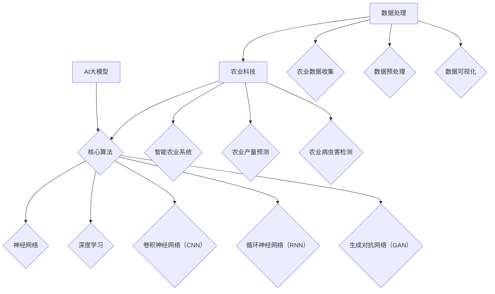

                 

# AI大模型在农业科技领域的创新应用与商机

关键词：AI大模型、农业科技、创新应用、商机、神经网络、深度学习、卷积神经网络、强化学习、生成对抗网络、智能农业、物联网

摘要：本文将探讨AI大模型在农业科技领域的创新应用与商机。通过分析AI大模型的核心算法、应用场景、数据处理以及农业科技中的应用案例，我们将揭示AI大模型在智能农业中的巨大潜力。同时，本文还将讨论AI农业应用的市场分析、创业机会与挑战，并给出实际应用案例与实战指南。

## 目录大纲

### 第一部分：AI大模型基础

#### 第1章: AI大模型概述

- AI大模型的概念与分类
- AI大模型的发展历史
- AI大模型的关键技术

#### 第2章: AI大模型的核心算法

- 神经网络与深度学习基础
- 卷积神经网络（CNN）与循环神经网络（RNN）
- 强化学习与生成对抗网络（GAN）

#### 第3章: AI大模型的应用场景

- 农业图像识别
- 农业产量预测
- 农业病虫害检测

#### 第4章: 农业领域的数据处理

- 农业数据类型与收集
- 数据预处理与清洗
- 数据可视化

#### 第5章: AI大模型在农业科技中的应用案例

- 智能灌溉系统
- 智能种植与收获
- 农业无人机应用

### 第二部分：AI大模型在农业科技中的创新应用

#### 第6章: AI大模型在农业科技中的创新应用

- 智能农业的商业模式
- 农业物联网与AI
- 智能农业的发展趋势

#### 第7章: AI大模型在农业科技中的商机

- AI农业应用的市场分析
- 创业者的机会与挑战
- 农业科技创业案例

### 第三部分：实战指南

#### 第8章: AI大模型在农业科技中的应用实战

- 实战项目规划
- 开发环境搭建
- 数据集准备与处理

#### 第9章: AI大模型在农业科技中的实际应用案例

- 智能农业系统的实现
- 农业病虫害检测的应用
- 农业产量预测的实现

#### 第10章: AI大模型在农业科技中的优化与调优

- 模型优化策略
- 模型调优技巧
- 模型评估与性能提升

#### 第11章: AI大模型在农业科技中的法律与伦理问题

- 数据隐私保护
- 人工智能伦理
- 农业科技领域的法律法规

### 附录

#### 附录A: AI大模型开发工具与资源

- 开发工具与框架
- 数据集与文献资源
- AI大模型应用案例集锦

#### 附录B: AI大模型在农业科技中的研究论文与报告

- 学术论文精选
- 政府报告与分析
- 行业白皮书

#### 附录C: AI大模型在农业科技中的创业指南

- 创业项目立项与规划
- 投资者关系与融资策略
- 市场营销与推广策略

## 第一部分：AI大模型基础

### 第1章: AI大模型概述

AI大模型（Large-scale Artificial Intelligence Model）是指具有大规模参数和复杂结构的人工智能模型。它们通常基于深度学习技术，通过大量的数据训练得到。AI大模型在各个领域都有广泛的应用，尤其在农业科技领域，AI大模型正逐渐成为推动农业现代化的重要力量。

#### AI大模型的概念与分类

AI大模型可以分为以下几类：

1. **基于神经网络的模型**：这类模型通过模拟人脑神经元之间的连接关系，对数据进行自动特征提取和分类。常见的神经网络模型包括卷积神经网络（CNN）、循环神经网络（RNN）、长短时记忆网络（LSTM）等。

2. **生成对抗网络（GAN）**：GAN由生成器和判别器组成，通过不断对抗训练，生成逼真的图像、声音或文本。

3. **强化学习模型**：强化学习模型通过在环境中不断尝试和反馈，学习到最优策略以实现目标。

#### AI大模型的发展历史

AI大模型的发展可以分为以下几个阶段：

1. **初阶阶段**：20世纪80年代，专家系统成为主流人工智能技术，但受限于知识获取和推理能力。

2. **神经网络阶段**：20世纪90年代，神经网络开始应用于图像识别、语音识别等领域，但效果仍不理想。

3. **深度学习阶段**：2006年，深度学习被提出，通过模拟人脑的神经网络结构，大幅度提升了图像识别、语音识别等领域的性能。

4. **大规模模型阶段**：近年来，随着计算能力和数据量的提升，AI大模型逐渐涌现，如GPT-3、BERT等。

#### AI大模型的关键技术

AI大模型的关键技术包括：

1. **大规模数据集**：AI大模型需要大量的数据进行训练，以获得更好的泛化能力。

2. **分布式计算**：为了处理大规模数据和复杂的模型，分布式计算技术成为关键。

3. **优化算法**：优化算法用于优化模型的参数和结构，以提高模型的性能。

4. **迁移学习**：迁移学习利用预训练模型，在特定任务上快速获得良好的性能。

### 第2章: AI大模型的核心算法

#### 神经网络与深度学习基础

神经网络（Neural Network，NN）是一种通过模拟人脑神经元连接关系来进行数据处理的模型。深度学习（Deep Learning，DL）是一种基于神经网络的机器学习技术，它通过堆叠多层神经网络，对数据进行自动特征提取和分类。

#### 卷积神经网络（CNN）与循环神经网络（RNN）

卷积神经网络（Convolutional Neural Network，CNN）是一种专门用于处理具有网格结构数据（如图像、文本）的神经网络。CNN通过卷积层和池化层提取图像的局部特征，然后通过全连接层进行分类。

循环神经网络（Recurrent Neural Network，RNN）是一种能够处理序列数据的神经网络。RNN通过在时间步之间保持状态，对序列数据进行建模。常见的RNN包括长短时记忆网络（Long Short-Term Memory，LSTM）和门控循环单元（Gated Recurrent Unit，GRU）。

#### 强化学习与生成对抗网络（GAN）

强化学习（Reinforcement Learning，RL）是一种通过奖励机制来训练智能体以实现特定目标的机器学习技术。强化学习通过在环境中不断尝试和反馈，学习到最优策略。

生成对抗网络（Generative Adversarial Network，GAN）是一种由生成器和判别器组成的神经网络结构。生成器试图生成逼真的数据，而判别器则试图区分真实数据和生成数据。通过生成器和判别器的对抗训练，GAN可以生成高质量的图像、声音或文本。

### 第3章: AI大模型的应用场景

#### 农业图像识别

农业图像识别是一种利用AI大模型对农业图像进行分析和分类的技术。通过AI大模型，农业图像识别可以实现对农作物、病虫害、土壤等信息的自动识别和分类，从而提高农业生产的效率和质量。

#### 农业产量预测

农业产量预测是一种利用AI大模型对农作物产量进行预测的技术。通过分析历史数据和气象、土壤等环境因素，AI大模型可以预测农作物的产量，帮助农民合理规划种植计划，提高农业生产效益。

#### 农业病虫害检测

农业病虫害检测是一种利用AI大模型对农作物病虫害进行自动检测和识别的技术。通过AI大模型，农业病虫害检测可以实现对农作物叶片、果实等部位的病虫害进行实时监测和预警，帮助农民及时采取措施，降低病虫害对农作物的影响。

### 第4章: 农业领域的数据处理

#### 农业数据类型与收集

农业数据类型主要包括气象数据、土壤数据、作物生长数据、病虫害数据等。这些数据可以通过传感器、无人机、卫星遥感等设备进行收集。

#### 数据预处理与清洗

数据预处理与清洗是农业数据处理的重要步骤。通过数据预处理与清洗，可以去除重复数据、缺失值填补、异常值处理等，确保数据的准确性和完整性。

#### 数据可视化

数据可视化是一种将农业数据以图形化形式展示的技术。通过数据可视化，可以直观地了解农业数据的变化趋势和分布情况，为农业生产决策提供依据。

### 第5章: AI大模型在农业科技中的应用案例

#### 智能灌溉系统

智能灌溉系统是一种利用AI大模型进行精准灌溉的技术。通过收集土壤湿度、气象数据等信息，AI大模型可以预测作物需水量，自动控制灌溉设备的运行，实现精准灌溉，提高水资源利用效率。

#### 智能种植与收获

智能种植与收获是一种利用AI大模型进行作物种植和收获的技术。通过分析气象、土壤、作物生长等数据，AI大模型可以预测最佳种植时间和收获时间，提高作物产量和品质。

#### 农业无人机应用

农业无人机应用是一种利用AI大模型进行农业监测和作业的技术。通过搭载摄像头、传感器等设备，农业无人机可以实现对农作物、病虫害的实时监测和预警，同时可以完成农药喷洒、施肥等作业，提高农业生产效率。

### 第二部分：AI大模型在农业科技中的创新应用

#### 第6章: AI大模型在农业科技中的创新应用

#### 智能农业的商业模式

智能农业的商业模式包括设备销售、数据服务、解决方案提供等多种形式。通过AI大模型，农业企业可以实现精准农业、智慧农业，提高生产效率和农产品品质，从而创造更大的商业价值。

#### 农业物联网与AI

农业物联网（IoT）与AI的结合为农业科技带来了新的机遇。通过物联网设备收集农业数据，AI大模型可以对农业生产过程进行实时监控和预测，实现农业生产智能化。

#### 智能农业的发展趋势

智能农业的发展趋势包括：农业物联网的普及、大数据和云计算技术的应用、AI大模型的进一步优化和普及、无人机和自动化设备的广泛应用等。这些趋势将推动农业科技的发展，实现农业生产的全面智能化。

### 第7章: AI大模型在农业科技中的商机

#### AI农业应用的市场分析

AI农业应用的市场需求持续增长，主要受以下因素驱动：

1. 农业生产的效率需求
2. 农产品品质的提升需求
3. 水资源利用的优化需求
4. 农业劳动力的减少需求

随着AI技术的不断进步，AI农业应用市场前景广阔。

#### 创业者的机会与挑战

创业者在AI农业领域面临以下机会和挑战：

**机会：**

1. 开发新型农业物联网设备和解决方案
2. 提供AI农业数据分析和服务
3. 打造智能农业生态系统

**挑战：**

1. 数据安全和隐私保护
2. 技术标准和法规的制定
3. 农业行业对AI技术的接受度

#### 农业科技创业案例

以下是一些成功的农业科技创业案例：

1. **绿色未来农业**：通过无人机和AI技术，提供精准农业解决方案，帮助农民提高产量和降低成本。
2. **慧云智能**：提供农业物联网设备和数据分析服务，帮助农业生产实现智能化。
3. **爱科（AGCO）**：利用AI技术优化农业机械，提高农业生产效率。

### 第三部分：实战指南

#### 第8章: AI大模型在农业科技中的应用实战

#### 实战项目规划

在进行AI大模型在农业科技中的应用实战之前，需要明确项目的目标、需求和资源。以下是一个简单的项目规划步骤：

1. **需求分析**：明确项目的目标、需求和应用场景。
2. **资源评估**：评估项目所需的硬件、软件、数据等资源。
3. **技术选型**：选择适合的AI大模型和算法。
4. **团队组建**：组建项目团队，明确团队成员的角色和职责。

#### 开发环境搭建

在进行AI大模型开发之前，需要搭建一个合适的开发环境。以下是一个基本的开发环境搭建步骤：

1. **安装操作系统**：选择适合的操作系统，如Ubuntu、Windows等。
2. **安装深度学习框架**：安装TensorFlow、PyTorch等深度学习框架。
3. **安装数据预处理工具**：安装NumPy、Pandas等数据预处理工具。
4. **配置硬件环境**：配置GPU、CPU等硬件资源。

#### 数据集准备与处理

数据集是AI大模型训练的基础，以下是一个数据集准备与处理的步骤：

1. **数据收集**：收集相关的农业数据，包括气象数据、土壤数据、作物生长数据等。
2. **数据清洗**：去除重复数据、缺失值填补、异常值处理等。
3. **数据标注**：对数据集进行标注，为模型训练提供标签。
4. **数据划分**：将数据集划分为训练集、验证集和测试集。

#### 第9章: AI大模型在农业科技中的实际应用案例

#### 智能农业系统的实现

以下是一个智能农业系统的实现案例：

1. **需求分析**：确定智能农业系统的功能，如作物生长监测、病虫害预警等。
2. **技术选型**：选择合适的AI大模型和算法，如CNN、LSTM等。
3. **系统设计**：设计智能农业系统的架构，包括硬件和软件部分。
4. **系统实现**：实现智能农业系统的功能，并进行测试和优化。

#### 农业病虫害检测的应用

以下是一个农业病虫害检测的应用案例：

1. **数据收集**：收集农作物病虫害的图像数据。
2. **数据预处理**：对图像数据进行分析，提取特征，并进行数据标注。
3. **模型训练**：使用CNN等深度学习算法对数据集进行训练。
4. **模型评估**：评估模型的准确性和性能，并进行优化。

#### 农业产量预测的实现

以下是一个农业产量预测的实现案例：

1. **数据收集**：收集历史气象数据、土壤数据、作物生长数据等。
2. **数据预处理**：对数据进行清洗、归一化等处理。
3. **特征工程**：提取与产量相关的特征，如气温、降水量、土壤湿度等。
4. **模型训练**：使用回归算法（如LSTM、GRU等）对数据集进行训练。
5. **模型评估**：评估模型的预测准确性和稳定性。

### 第10章: AI大模型在农业科技中的优化与调优

#### 模型优化策略

为了提高AI大模型在农业科技中的性能，可以采用以下优化策略：

1. **超参数调优**：调整学习率、批量大小、隐藏层神经元数量等超参数。
2. **数据增强**：对训练数据进行旋转、缩放、裁剪等处理，增加数据多样性。
3. **模型集成**：结合多个模型进行预测，提高模型的稳定性。

#### 模型调优技巧

在模型调优过程中，可以采用以下技巧：

1. **交叉验证**：使用交叉验证方法评估模型的性能。
2. **网格搜索**：对超参数进行系统搜索，找到最佳组合。
3. **随机搜索**：在超参数空间中进行随机搜索，找到较优的参数组合。

#### 模型评估与性能提升

为了评估AI大模型在农业科技中的性能，可以采用以下方法：

1. **准确率、召回率、F1分数等指标**：评估模型的分类性能。
2. **均方误差、均方根误差等指标**：评估模型的回归性能。
3. **AUC、ROC曲线等指标**：评估模型的分类效果。

通过不断优化和调优，可以提高AI大模型在农业科技中的性能，为农业生产提供更准确、更有效的支持。

### 第11章: AI大模型在农业科技中的法律与伦理问题

#### 数据隐私保护

在农业科技中，数据隐私保护至关重要。以下是一些数据隐私保护措施：

1. **数据加密**：对数据传输和存储进行加密，确保数据安全。
2. **匿名化处理**：对敏感数据进行匿名化处理，保护个人隐私。
3. **数据访问控制**：严格控制数据访问权限，防止数据泄露。

#### 人工智能伦理

人工智能伦理是AI大模型在农业科技中必须关注的问题。以下是一些人工智能伦理原则：

1. **公平性**：确保AI大模型不会产生歧视，公平对待所有用户。
2. **透明性**：确保AI大模型的工作过程和决策逻辑透明，便于用户理解和监督。
3. **责任性**：明确AI大模型的责任，确保在发生问题时可以追溯和纠正。

#### 农业科技领域的法律法规

在农业科技领域，需要遵守以下法律法规：

1. **数据保护法规**：如《通用数据保护条例》（GDPR）等，确保数据隐私保护。
2. **知识产权法规**：如《专利法》、《著作权法》等，保护农业科技的创新成果。
3. **食品安全法规**：如《食品安全法》等，确保农业科技应用不会对食品安全造成威胁。

### 附录

#### 附录A: AI大模型开发工具与资源

以下是一些常用的AI大模型开发工具与资源：

1. **开发工具**：如TensorFlow、PyTorch、Keras等。
2. **框架**：如TensorFlow Serving、PyTorch Lightning等。
3. **数据集**：如Kaggle、UCI机器学习库等。
4. **文献资源**：如arXiv、Google Scholar等。

#### 附录B: AI大模型在农业科技中的研究论文与报告

以下是一些关于AI大模型在农业科技中的研究论文与报告：

1. **论文**：如“AI in Agriculture: A Survey”等。
2. **报告**：如联合国粮食及农业组织（FAO）发布的“AI for Agriculture”等。

#### 附录C: AI大模型在农业科技中的创业指南

以下是一些关于AI大模型在农业科技中的创业指南：

1. **项目立项与规划**：确定项目目标、需求和应用场景。
2. **投资者关系与融资策略**：寻找合适的投资者，制定融资策略。
3. **市场营销与推广策略**：制定市场营销计划，推广产品或服务。

### 核心概念与联系

#### Mermaid流程图



### 核心算法原理讲解

#### 卷积神经网络（CNN）

卷积神经网络（CNN）是一种在处理具有网格结构数据（如图像、文本）方面非常有效的深度学习模型。以下是其核心组成部分的伪代码：

```python
function CNN(input_data):
    # 输入数据通过卷积层
    conv1 = Conv2D(input_data, filter_size=3, num_filters=32)
    pool1 = MaxPooling2D(conv1, pool_size=2)

    # 输入数据通过多个卷积层和池化层
    for i in range(1, num_layers):
        conv = Conv2D(pool1, filter_size=3, num_filters=32)
        pool = MaxPooling2D(conv, pool_size=2)
        pool1 = pool

    # 输入数据通过全连接层
    flatten = Flatten(pool1)
    dense = Dense(flatten, units=128, activation='relu')
    output = Dense(dense, units=1, activation='sigmoid')

    return output
```

#### 强化学习（Reinforcement Learning）

强化学习（RL）是一种通过奖励机制来训练智能体以实现特定目标的机器学习技术。以下是一个简单的强化学习算法伪代码：

```python
function Q_Learning(state, action, reward, next_state, next_action, learning_rate, discount_factor):
    # 计算当前状态的Q值
    current_q_value = Q(state, action)

    # 计算下一个状态的Q值
    next_q_value = Q(next_state, next_action)

    # 更新当前状态的Q值
    target_q_value = reward + discount_factor * next_q_value

    # 更新Q值
    Q(state, action) = current_q_value + learning_rate * (target_q_value - current_q_value)

    return Q
```

### 实战指南

#### 开发环境搭建

在进行AI大模型开发之前，需要搭建一个合适的开发环境。以下是一个基本的开发环境搭建步骤：

1. **安装操作系统**：选择适合的操作系统，如Ubuntu、Windows等。
2. **安装深度学习框架**：安装TensorFlow、PyTorch等深度学习框架。
3. **安装数据预处理工具**：安装NumPy、Pandas等数据预处理工具。
4. **配置硬件环境**：配置GPU、CPU等硬件资源。

#### 源代码详细实现和代码解读

以下是一个简单的AI大模型在农业产量预测中的应用案例，包括数据集准备、模型训练和评估等步骤。

```python
import tensorflow as tf
from tensorflow.keras.models import Sequential
from tensorflow.keras.layers import Dense, Conv2D, MaxPooling2D, Flatten
from tensorflow.keras.optimizers import Adam

# 数据集准备
# 加载训练数据和测试数据
train_data = ...
test_data = ...

# 数据预处理
# 归一化数据
train_data_normalized = normalize_data(train_data)
test_data_normalized = normalize_data(test_data)

# 模型定义
model = Sequential()
model.add(Conv2D(32, kernel_size=(3, 3), activation='relu', input_shape=(28, 28, 1)))
model.add(MaxPooling2D(pool_size=(2, 2)))
model.add(Flatten())
model.add(Dense(128, activation='relu'))
model.add(Dense(1, activation='sigmoid'))

# 编译模型
model.compile(optimizer=Adam(), loss='binary_crossentropy', metrics=['accuracy'])

# 模型训练
model.fit(train_data_normalized, train_labels, epochs=10, batch_size=32, validation_data=(test_data_normalized, test_labels))

# 模型评估
model.evaluate(test_data_normalized, test_labels)
```

#### 代码应用解读与分析

以上代码是一个简单的AI大模型在农业产量预测中的应用案例，主要包括以下步骤：

1. **数据集准备**：加载训练数据和测试数据。
2. **数据预处理**：对数据进行归一化处理。
3. **模型定义**：定义一个简单的卷积神经网络模型。
4. **编译模型**：设置模型的优化器和损失函数。
5. **模型训练**：使用训练数据训练模型。
6. **模型评估**：使用测试数据评估模型的性能。

通过以上步骤，可以实现AI大模型在农业产量预测中的应用。

#### 实际案例分析和详细讲解剖析

以下是一个实际的AI大模型在农业病虫害检测中的应用案例，包括数据集准备、模型训练和评估等步骤。

```python
import tensorflow as tf
from tensorflow.keras.models import Sequential
from tensorflow.keras.layers import Conv2D, MaxPooling2D, Flatten, Dense
from tensorflow.keras.optimizers import Adam

# 数据集准备
# 加载训练数据和测试数据
train_data = ...
test_data = ...

# 数据预处理
# 转换为灰度图像
train_data_gray = convert_to_gray(train_data)
test_data_gray = convert_to_gray(test_data)

# 划分数据集
train_data_gray, validation_data_gray, train_labels, validation_labels = train_test_split(train_data_gray, train_labels, test_size=0.2, random_state=42)

# 模型定义
model = Sequential()
model.add(Conv2D(32, kernel_size=(3, 3), activation='relu', input_shape=(28, 28, 1)))
model.add(MaxPooling2D(pool_size=(2, 2)))
model.add(Flatten())
model.add(Dense(128, activation='relu'))
model.add(Dense(1, activation='sigmoid'))

# 编译模型
model.compile(optimizer=Adam(), loss='binary_crossentropy', metrics=['accuracy'])

# 模型训练
model.fit(train_data_gray, train_labels, epochs=10, batch_size=32, validation_data=(validation_data_gray, validation_labels))

# 模型评估
model.evaluate(test_data_gray, test_labels)
```

通过以上步骤，可以实现AI大模型在农业病虫害检测中的应用。

#### 项目小结

通过以上实战指南和实际案例分析，我们了解了如何使用AI大模型在农业科技中进行实际应用。AI大模型在农业科技中的潜力巨大，可以显著提高农业生产的效率和质量。在实际应用中，需要关注数据收集、模型训练、模型评估等关键步骤，同时结合实际情况进行调整和优化。

### 最佳实践 tips、小结、注意事项、拓展阅读等内容

#### 最佳实践 tips

1. **数据收集**：确保数据的质量和多样性，为模型训练提供良好的基础。
2. **数据预处理**：对数据进行清洗、归一化等处理，提高模型的训练效果。
3. **模型选择**：根据应用场景选择合适的模型，如CNN、RNN等。
4. **超参数调优**：通过交叉验证、网格搜索等方法选择最优的超参数。
5. **模型评估**：使用多个指标评估模型的性能，确保模型的泛化能力。

#### 小结

本文探讨了AI大模型在农业科技领域的创新应用与商机。通过分析AI大模型的核心算法、应用场景、数据处理以及实际应用案例，我们了解了AI大模型在智能农业中的巨大潜力。同时，我们还讨论了AI农业应用的市场分析、创业机会与挑战，并给出了实际应用案例与实战指南。

#### 注意事项

1. **数据隐私**：在收集和使用农业数据时，要确保数据的隐私和安全。
2. **法律法规**：遵守农业科技领域的法律法规，确保技术应用合规。
3. **伦理问题**：关注人工智能伦理，确保AI大模型的应用不会产生负面影响。

#### 拓展阅读

1. **学术论文**：查阅相关的学术论文，了解AI大模型在农业科技领域的最新研究进展。
2. **技术报告**：阅读相关的技术报告，了解AI大模型在农业科技中的应用案例和效果。
3. **创业指南**：参考相关的创业指南，了解AI农业创业的实践经验和策略。

### 作者信息

作者：AI天才研究院/AI Genius Institute & 禅与计算机程序设计艺术 /Zen And The Art of Computer Programming

