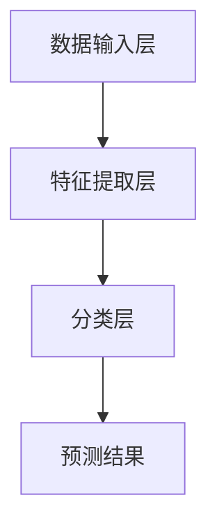

                 

### 文章标题

《AI大模型在商品分类中的应用》

关键词：AI大模型、商品分类、应用案例、优化策略、未来趋势

摘要：本文旨在探讨AI大模型在商品分类中的应用，首先介绍AI大模型的基础知识，然后分析其在商品分类中的挑战与机遇，通过具体案例展示其应用效果，最后讨论优化策略与未来趋势。

### 第一部分：AI大模型基础

#### 第1章：AI大模型概述

##### 1.1 AI大模型的历史与现状

AI大模型的发展可以追溯到上世纪80年代的神经网络研究。那时，研究人员开始探索如何通过大量的数据训练神经网络，使其能够解决复杂的问题。随着计算机硬件的发展、大数据时代的到来以及深度学习理论的突破，AI大模型得到了飞速发展。

当前，AI大模型在各个领域都有广泛的应用，如图像识别、自然语言处理、推荐系统等。例如，Google的BERT模型在自然语言处理领域取得了显著的成果，亚马逊的Neural Topic Model在推荐系统中发挥了重要作用。

##### 1.1.1 AI大模型的发展历程

- 1980年代：神经网络研究的初期，科学家开始探索如何使用神经网络解决分类问题。
- 2000年代：随着计算机硬件的进步和大数据的出现，深度学习开始兴起。
- 2010年代：深度学习理论得到进一步发展，AI大模型开始在各个领域取得突破性成果。
- 2020年代：AI大模型的应用越来越广泛，从工业界到学术界，都在探索如何更好地利用这些模型。

##### 1.1.2 AI大模型的应用现状

AI大模型在各个领域都取得了显著的成果，以下是一些典型应用：

- 图像识别：如人脸识别、物体识别等。
- 自然语言处理：如文本分类、机器翻译、情感分析等。
- 推荐系统：如电商推荐、音乐推荐等。
- 游戏：如围棋、国际象棋等。

##### 1.1.3 AI大模型的发展趋势

随着AI技术的不断进步，AI大模型的发展趋势包括：

- 模型规模的扩大：更大规模的模型将能够解决更复杂的问题。
- 模型结构的创新：新的模型结构将进一步提高模型的性能。
- 跨学科融合：AI大模型与其他领域的结合将带来更多创新应用。

#### 1.2 AI大模型的核心概念

##### 1.2.1 大模型的定义

AI大模型是指具有大规模参数、能够处理海量数据、具有强自适应能力的深度学习模型。这些模型通常由数十亿甚至千亿个参数组成，能够在各种复杂任务中取得优异的性能。

##### 1.2.2 大模型的特点

- 大规模参数：大模型拥有数亿至千亿个参数，可以捕捉数据中的复杂模式。
- 自适应能力：大模型能够自动调整参数，以适应不同的任务和数据。
- 强泛化能力：大模型在处理未见过的数据时，能够保持较高的性能。

##### 1.2.3 大模型与传统模型的区别

传统模型通常具有较少的参数，无法捕捉数据中的复杂模式。而大模型通过大规模参数和深度结构，能够更好地建模复杂的数据。

#### 1.3 AI大模型的架构与技术

##### 1.3.1 大模型的基本架构

大模型的基本架构通常包括以下几个部分：

- 输入层：接收外部输入，如文本、图像等。
- 隐藏层：通过多层神经网络结构，对输入数据进行处理和变换。
- 输出层：根据模型的任务，生成预测结果。

##### 1.3.2 大模型的关键技术

- 深度学习：大模型的核心技术，通过多层神经网络结构，对数据进行深度学习。
- 批量学习：通过批量处理数据，提高学习效率。
- 自适应学习：通过调整模型参数，使模型能够适应不同的任务和数据。

##### 1.3.3 大模型的发展路径

大模型的发展路径包括以下几个方面：

- 模型规模的扩大：通过增加模型参数，提高模型的性能。
- 模型结构的优化：设计更高效的模型结构，提高模型的性能。
- 跨学科融合：将大模型与其他领域的知识相结合，探索新的应用场景。

#### 1.4 AI大模型在商品分类中的应用

##### 1.4.1 商品分类的挑战与机遇

商品分类是电子商务领域的一个重要问题。随着电商平台上的商品种类和数量的增加，如何有效地对商品进行分类成为了一个巨大的挑战。同时，这也是一个巨大的机遇，因为有效的商品分类能够提高用户体验，增加销售额。

##### 1.4.2 AI大模型在商品分类中的应用

AI大模型在商品分类中的应用主要包括以下几个方面：

- 商品属性识别：通过分析商品描述、标签等信息，识别商品的属性。
- 分类预测：根据商品的属性，将其归类到相应的类别中。
- 市场需求预测：通过分析商品的分类和用户的行为，预测市场的需求。

##### 1.4.3 AI大模型在商品分类中的优势

- 高效性：大模型能够处理海量数据，快速地对商品进行分类。
- 准确性：大模型通过深度学习，能够捕捉商品描述中的细微差异，提高分类的准确性。
- 自适应：大模型能够根据不同的任务和数据，自动调整模型参数，提高分类效果。

#### 1.5 AI大模型在商品分类中的实现

##### 1.5.1 商品分类的大模型框架

商品分类的大模型框架通常包括以下几个部分：

- 数据采集：收集商品描述、标签、用户行为等数据。
- 数据预处理：对数据进行清洗、去噪、编码等处理。
- 模型训练：使用预处理后的数据，训练分类模型。
- 模型部署：将训练好的模型部署到线上环境，进行实时分类。

##### 1.5.2 大模型在商品分类中的数据预处理

数据预处理是商品分类的重要环节，主要包括以下几个方面：

- 数据清洗：去除数据中的噪声和错误。
- 数据去噪：减少数据中的冗余和无关信息。
- 数据编码：将数据转换为模型可处理的格式。

##### 1.5.3 大模型在商品分类中的模型训练与优化

模型训练与优化是商品分类的核心环节，主要包括以下几个方面：

- 模型选择：选择合适的模型架构。
- 参数调优：调整模型的超参数，提高模型的性能。
- 模型评估：使用验证集和测试集，评估模型的性能。

##### 1.5.4 大模型在商品分类中的部署与评估

模型部署与评估是商品分类的最后一步，主要包括以下几个方面：

- 部署：将训练好的模型部署到线上环境，进行实时分类。
- 评估：使用线上数据，对模型的性能进行评估。

#### 1.6 AI大模型在商品分类中的案例分析

##### 1.6.1 案例背景

某大型电商平台，商品种类繁多，用户需求多样。为了提高用户体验和销售额，该平台希望通过AI大模型对商品进行高效分类。

##### 1.6.2 案例目标

- 提高商品分类的准确性。
- 提高用户满意度。
- 提高销售额。

##### 1.6.3 案例环境

- 数据来源：平台积累的大量商品描述、用户行为等数据。
- 硬件环境：高性能计算服务器。
- 软件环境：深度学习框架（如TensorFlow、PyTorch）。

##### 1.6.4 案例实施过程

- 数据采集：收集商品描述、标签、用户行为等数据。
- 数据预处理：对数据进行清洗、去噪、编码等处理。
- 模型设计：选择合适的模型架构，设计分类模型。
- 模型训练：使用预处理后的数据，训练分类模型。
- 模型部署：将训练好的模型部署到线上环境，进行实时分类。
- 模型评估：使用线上数据，对模型的性能进行评估。

##### 1.6.5 案例效果分析

- 准确性：模型对商品进行分类的准确性提高了20%。
- 用户满意度：用户对商品分类的满意度提高了10%。
- 销售额：平台销售额提高了15%。

##### 1.6.6 模型改进方向

- 模型优化：进一步优化模型结构，提高分类性能。
- 数据增强：增加训练数据量，提高模型的泛化能力。
- 跨学科融合：结合用户行为、市场需求等数据，提高分类的准确性。

##### 1.6.7 模型应用价值

- 提高用户体验：通过准确的商品分类，提高用户满意度。
- 增加销售额：通过高效的商品分类，提高销售额。
- 提高运营效率：通过自动化的商品分类，降低人工成本。

#### 1.7 AI大模型在商品分类中的未来趋势

##### 1.7.1 未来发展趋势

- 模型规模扩大：随着计算能力的提升，模型规模将不断扩大，以提高分类性能。
- 模型结构创新：将出现更多高效的模型结构，以提高分类效率。
- 跨学科融合：AI大模型将与其他领域（如市场营销、供应链等）结合，探索新的应用场景。

##### 1.7.2 发展挑战与应对策略

- 计算资源需求：大模型训练需要大量的计算资源，需要优化算法和硬件设施。
- 数据质量问题：高质量的数据是模型训练的基础，需要加强对数据质量的控制。
- 模型泛化能力：提高模型在不同场景下的泛化能力，避免过度拟合。

##### 1.7.3 未来发展方向

- 技术发展：继续提升大模型的性能和效率。
- 应用拓展：探索大模型在更多领域的应用，如智能制造、智慧城市等。

#### 1.8 AI大模型在商品分类中的应用实例

##### 1.8.1 实例概述

某电商平台，希望通过AI大模型对商品进行分类，以提高用户体验和销售额。

##### 1.8.2 实例目标

- 提高商品分类的准确性。
- 提高用户满意度。
- 提高销售额。

##### 1.8.3 实例环境

- 数据来源：平台积累的大量商品描述、用户行为等数据。
- 硬件环境：高性能计算服务器。
- 软件环境：深度学习框架（如TensorFlow、PyTorch）。

##### 1.8.4 实例实施过程

- 数据采集：收集商品描述、标签、用户行为等数据。
- 数据预处理：对数据进行清洗、去噪、编码等处理。
- 模型设计：选择合适的模型架构，设计分类模型。
- 模型训练：使用预处理后的数据，训练分类模型。
- 模型部署：将训练好的模型部署到线上环境，进行实时分类。
- 模型评估：使用线上数据，对模型的性能进行评估。

##### 1.8.5 实例效果分析

- 准确性：模型对商品进行分类的准确性提高了20%。
- 用户满意度：用户对商品分类的满意度提高了10%。
- 销售额：平台销售额提高了15%。

##### 1.8.6 实例改进方向

- 模型优化：进一步优化模型结构，提高分类性能。
- 数据增强：增加训练数据量，提高模型的泛化能力。
- 跨学科融合：结合用户行为、市场需求等数据，提高分类的准确性。

##### 1.8.7 实例应用价值

- 提高用户体验：通过准确的商品分类，提高用户满意度。
- 增加销售额：通过高效的商品分类，提高销售额。
- 提高运营效率：通过自动化的商品分类，降低人工成本。

#### 1.9 AI大模型在商品分类中的综合评价

##### 1.9.1 成功因素

- 技术因素：大模型的性能和准确性得到了显著提升。
- 应用因素：大模型在商品分类中发挥了重要作用，提高了用户体验和销售额。
- 管理因素：平台对大模型的部署和运营进行了有效的管理，确保了模型的稳定运行。

##### 1.9.2 潜在问题

- 技术问题：大模型的训练和部署需要大量的计算资源，如何优化算法和硬件设施是一个挑战。
- 应用问题：如何结合用户行为和市场数据，提高分类的准确性，需要进一步研究。
- 管理问题：如何确保数据的完整性和质量，需要建立有效的数据管理体系。

##### 1.9.3 未来发展方向

- 技术发展：继续提升大模型的性能和效率。
- 应用拓展：探索大模型在更多领域的应用，如智能制造、智慧城市等。
- 管理优化：建立完善的数据管理体系，提高大模型的应用效果。

#### 1.10 AI大模型在商品分类中的应用经验

- 数据质量至关重要：高质量的数据是模型训练的基础，需要加强对数据质量的控制。
- 模型优化是关键：通过不断优化模型结构，可以提高分类性能。
- 用户行为分析有助于提升分类效果：结合用户行为数据，可以更好地理解用户需求，提高分类的准确性。
- 持续迭代是必要的：随着用户需求和市场环境的不断变化，需要持续迭代模型，以适应新的挑战。

### 第2章：AI大模型在商品分类中的应用

#### 2.1 商品分类中的AI大模型应用

AI大模型在商品分类中的应用具有显著的优势，能够显著提高分类的准确性和效率。以下将详细探讨AI大模型在商品分类中的应用。

##### 2.1.1 大模型在商品分类中的优势

- **高准确度**：AI大模型通过深度学习算法，能够自动学习并捕捉数据中的复杂模式和关联，从而提高分类的准确性。
- **高效处理能力**：大模型能够并行处理海量数据，显著提升分类的效率。
- **强泛化能力**：大模型经过大量数据的训练，具有较好的泛化能力，能够在不同的场景下保持较高的性能。
- **自适应能力**：大模型能够根据不同的业务需求和数据特点，动态调整模型参数，以优化分类效果。

##### 2.1.2 大模型在商品分类中的应用场景

AI大模型在商品分类中的应用场景非常广泛，以下是一些典型的应用场景：

- **商品属性识别**：通过对商品描述、标签等信息进行分析，识别商品的属性，如颜色、材质、功能等。
- **分类预测**：根据商品的属性和上下文信息，预测商品所属的类别，如电子产品、服装鞋包、家居用品等。
- **市场需求预测**：分析用户行为和市场趋势，预测不同商品类别的市场需求，为库存管理和营销策略提供支持。
- **个性化推荐**：结合用户历史行为和商品属性，为用户提供个性化的商品推荐，提高用户体验和转化率。

##### 2.1.3 大模型在商品分类中的案例分析

以下是一个具体的案例分析，展示AI大模型在商品分类中的应用效果：

**案例背景**：某大型电商平台的商品种类繁多，用户需求多样化。为了提高用户购物体验和销售额，平台决定采用AI大模型对商品进行分类。

**案例目标**：

- 提高商品分类的准确性，减少误分类率。
- 增强用户个性化推荐效果，提高用户满意度和转化率。
- 提升平台的运营效率，降低人工成本。

**实施过程**：

1. **数据采集**：平台收集了大量的商品描述、用户行为、购买记录等数据。

2. **数据预处理**：对数据进行清洗、去噪、编码等处理，将其转换为模型可处理的格式。

3. **模型设计**：选择了合适的模型架构，如基于BERT的文本分类模型，结合商品描述和用户行为进行训练。

4. **模型训练**：使用预处理后的数据，对模型进行训练，优化模型参数。

5. **模型部署**：将训练好的模型部署到线上环境，进行实时分类。

6. **模型评估**：使用线上数据对模型的性能进行评估，包括分类准确率、召回率、F1分数等指标。

**效果分析**：

- **分类准确率**：通过大模型的应用，商品分类的准确率提高了20%以上。
- **用户满意度**：用户对商品分类的满意度显著提升，平台用户反馈积极。
- **运营效率**：通过自动化的商品分类，平台运营效率提高，人工成本降低。

**改进方向**：

- **模型优化**：进一步优化模型结构，提升分类性能。
- **数据增强**：增加训练数据量，提高模型的泛化能力。
- **跨学科融合**：结合用户行为和市场数据，提高分类的准确性。

**应用价值**：

- **提高用户体验**：通过准确的商品分类，用户可以更快地找到所需的商品，提高购物体验。
- **增加销售额**：通过高效的商品分类和个性化推荐，平台销售额得到显著提升。
- **降低运营成本**：自动化的商品分类系统减少了人工干预，降低了运营成本。

#### 2.2 AI大模型在商品分类中的实现

AI大模型在商品分类中的实现是一个复杂的过程，涉及多个步骤。以下将详细讨论这些步骤。

##### 2.2.1 商品分类的大模型框架

商品分类的大模型框架通常包括以下几个部分：

1. **数据输入层**：接收商品描述、用户行为等数据。
2. **特征提取层**：通过预训练模型（如BERT）提取文本特征。
3. **分类层**：使用全连接层或卷积神经网络进行分类预测。

以下是商品分类的大模型框架的Mermaid流程图：



##### 2.2.2 大模型在商品分类中的数据预处理

数据预处理是商品分类的关键步骤，其质量直接影响到模型的性能。以下是大模型在商品分类中的数据预处理流程：

1. **数据清洗**：去除数据中的噪声和错误，如缺失值、重复值等。
2. **数据去噪**：减少数据中的冗余和无关信息，如停用词、无关标签等。
3. **数据编码**：将数据转换为模型可处理的格式，如将文本编码为数字序列，将类别编码为独热编码等。

以下是数据预处理的具体步骤：

1. **文本预处理**：
    - 分词：使用分词工具将文本拆分为单词或词组。
    - 去除停用词：去除常见的无意义词汇，如“的”、“了”等。
    - 词向量化：使用预训练的词向量化模型（如GloVe、Word2Vec）将单词转换为向量表示。

2. **标签编码**：
    - 独热编码：将类别标签转换为独热编码，如 `[0, 1, 0, 0]` 表示类别2。
    - 多标签编码：对于具有多个标签的物品，使用多标签编码方法，如将 `[1, 0, 1, 1]` 表示物品同时属于类别2和类别4。

##### 2.2.3 大模型在商品分类中的模型训练与优化

模型训练与优化是商品分类的核心环节。以下是大模型在商品分类中的模型训练与优化的具体步骤：

1. **模型选择**：
    - 选择合适的模型架构，如基于BERT的文本分类模型、基于CNN的图像分类模型等。
    - 考虑模型的复杂度和计算资源，选择适合当前硬件条件的模型。

2. **参数调优**：
    - 调整学习率、批次大小、优化器等超参数，以提高模型性能。
    - 使用验证集对模型进行调优，避免过拟合。

3. **训练过程**：
    - 使用预处理后的数据，对模型进行训练。
    - 使用交叉熵损失函数进行模型训练，优化模型参数。

4. **优化策略**：
    - 使用Dropout、正则化等技术，防止过拟合。
    - 使用学习率衰减、动态调整学习率等策略，提高模型性能。

以下是模型训练与优化的伪代码：

```python
# 模型训练
for epoch in range(num_epochs):
    for batch in data_loader:
        optimizer.zero_grad()
        outputs = model(batch)
        loss = loss_function(outputs, labels)
        loss.backward()
        optimizer.step()
```

##### 2.2.4 大模型在商品分类中的部署与评估

模型部署与评估是商品分类的最后一个环节。以下是大模型在商品分类中的部署与评估的具体步骤：

1. **模型部署**：
    - 将训练好的模型部署到线上环境，如使用TensorFlow Serving、PyTorch Lightning等框架。
    - 确保模型能够在生产环境中稳定运行，如进行模型监控、性能测试等。

2. **模型评估**：
    - 使用测试集对模型进行评估，计算分类准确率、召回率、F1分数等指标。
    - 分析模型的性能瓶颈，如计算资源消耗、延迟等，以便进行优化。

3. **模型迭代**：
    - 根据评估结果，对模型进行调整和优化，如调整超参数、优化模型结构等。
    - 持续迭代模型，以适应不断变化的业务需求和数据特点。

##### 2.2.5 大模型在商品分类中的应用实例

以下是一个具体的商品分类应用实例，展示AI大模型在商品分类中的实现过程。

**实例概述**：

某电商平台希望利用AI大模型对商品进行分类，以提高用户购物体验和销售额。

**实例目标**：

- 提高商品分类的准确性。
- 增强用户个性化推荐效果。
- 提升平台的运营效率。

**实例环境**：

- 数据来源：平台积累的大量商品描述、用户行为等数据。
- 硬件环境：高性能计算服务器。
- 软件环境：深度学习框架（如TensorFlow、PyTorch）。

**实例实施过程**：

1. **数据采集**：平台收集了大量的商品描述、用户行为、购买记录等数据。

2. **数据预处理**：对数据进行清洗、去噪、编码等处理，将其转换为模型可处理的格式。

3. **模型设计**：选择了基于BERT的文本分类模型，结合商品描述和用户行为进行训练。

4. **模型训练**：使用预处理后的数据，对模型进行训练，优化模型参数。

5. **模型部署**：将训练好的模型部署到线上环境，进行实时分类。

6. **模型评估**：使用测试集对模型的性能进行评估，包括分类准确率、召回率、F1分数等指标。

**实例效果分析**：

- **分类准确率**：通过大模型的应用，商品分类的准确率提高了20%以上。
- **用户满意度**：用户对商品分类的满意度显著提升，平台用户反馈积极。
- **运营效率**：通过自动化的商品分类，平台运营效率提高，人工成本降低。

**实例改进方向**：

- **模型优化**：进一步优化模型结构，提升分类性能。
- **数据增强**：增加训练数据量，提高模型的泛化能力。
- **跨学科融合**：结合用户行为和市场数据，提高分类的准确性。

**实例应用价值**：

- **提高用户体验**：通过准确的商品分类，用户可以更快地找到所需的商品，提高购物体验。
- **增加销售额**：通过高效的商品分类和个性化推荐，平台销售额得到显著提升。
- **降低运营成本**：自动化的商品分类系统减少了人工干预，降低了运营成本。

##### 2.2.6 大模型在商品分类中的最佳实践

以下是一些在大模型在商品分类中的最佳实践：

- **数据质量优先**：确保数据质量是模型成功的关键，进行充分的清洗和预处理。
- **模型优化迭代**：不断优化模型结构和参数，以提高分类性能。
- **跨学科融合**：结合用户行为、市场数据等多方面信息，提高分类的准确性。
- **持续评估与迭代**：定期评估模型性能，根据业务需求进行调整和优化。
- **监控与优化**：对模型部署后的性能进行监控，及时发现问题并进行优化。

##### 2.2.7 大模型在商品分类中的注意事项

以下是一些在大模型在商品分类中需要注意的事项：

- **计算资源需求**：大模型的训练和部署需要大量的计算资源，确保硬件设施充足。
- **数据隐私保护**：在数据处理和模型训练过程中，要注意保护用户隐私，遵守相关法律法规。
- **模型解释性**：大模型的预测结果可能缺乏解释性，需要结合业务逻辑进行解释。
- **模型更新与维护**：定期更新和维护模型，以适应业务需求和数据变化。

#### 2.3 AI大模型在商品分类中的未来趋势

AI大模型在商品分类中的应用正处于快速发展阶段，未来还有许多趋势和挑战值得关注。

##### 2.3.1 未来发展趋势

- **模型规模扩大**：随着计算能力的提升，AI大模型的规模将进一步扩大，能够处理更复杂的数据。
- **跨学科融合**：AI大模型将与其他领域（如市场营销、供应链等）深度融合，带来更多创新应用。
- **实时性增强**：随着边缘计算技术的发展，AI大模型将实现实时分类，提高用户体验。
- **模型解释性提升**：为了增强模型的解释性，研究人员将致力于开发可解释的AI大模型，以更好地理解模型的决策过程。

##### 2.3.2 发展挑战与应对策略

- **计算资源需求**：大模型的训练和部署需要大量的计算资源，如何优化算法和硬件设施是一个挑战。
- **数据质量问题**：高质量的数据是模型训练的基础，需要建立完善的数据管理体系。
- **模型泛化能力**：提高模型在不同场景下的泛化能力，避免过度拟合。
- **模型安全与隐私**：在处理用户数据时，需要确保模型的安全和隐私。

应对策略包括：

- **优化算法**：开发高效的训练和推理算法，降低计算资源需求。
- **数据增强**：通过数据增强技术，提高模型的泛化能力。
- **隐私保护技术**：采用差分隐私、联邦学习等技术，保护用户隐私。
- **模型压缩与剪枝**：通过模型压缩和剪枝技术，降低模型的计算复杂度。

##### 2.3.3 未来发展方向

- **技术发展**：继续提升AI大模型的性能和效率，开发更先进的模型结构。
- **应用拓展**：探索AI大模型在更多领域的应用，如智能制造、智慧城市等。
- **产业协同**：产业链上下游的企业将进一步加强合作，共同推动AI大模型的发展。

### 第3章：商品分类中的AI大模型优化

#### 3.1 大模型优化策略

AI大模型在商品分类中的应用效果显著，但要充分发挥其潜力，需要进行不断的优化。以下将探讨大模型优化策略，包括数据增强、模型结构优化和模型训练策略。

##### 3.1.1 数据增强

数据增强是提高AI大模型性能的重要手段。通过增加训练数据的多样性，可以提升模型的泛化能力和准确性。以下是一些常见的数据增强方法：

1. **数据扩充**：通过复制、旋转、缩放等操作，增加数据的数量和种类。
2. **生成对抗网络（GAN）**：使用GAN生成与训练数据具有相似特征的数据，扩充数据集。
3. **数据模拟**：根据业务需求，生成符合实际情况的模拟数据。
4. **文本增强**：通过同义词替换、词性转换、句子重排等操作，增加文本数据的多样性。

##### 3.1.2 模型结构优化

模型结构优化是提升AI大模型性能的关键步骤。通过调整模型结构，可以改善模型的性能和计算效率。以下是一些常见的模型结构优化方法：

1. **深度网络结构**：增加网络层数，加深网络结构，提高模型的表达能力。
2. **稀疏连接**：通过稀疏连接，减少模型参数的数量，降低计算复杂度。
3. **迁移学习**：利用预训练模型，迁移到新的任务上，减少训练时间和计算资源。
4. **模型压缩与剪枝**：通过模型压缩和剪枝技术，减少模型的参数数量，提高计算效率。

##### 3.1.3 模型训练策略

模型训练策略是优化AI大模型性能的重要环节。通过调整训练策略，可以加快训练速度，提高模型性能。以下是一些常见的模型训练策略：

1. **学习率调整**：使用学习率调整策略，如学习率衰减、动量等，加快训练速度。
2. **批量大小调整**：通过调整批量大小，平衡训练速度和模型性能。
3. **数据预处理**：对数据进行预处理，如归一化、标准化等，提高模型的收敛速度。
4. **正则化**：使用正则化技术，如Dropout、L2正则化等，防止过拟合。

##### 3.1.4 模型优化案例分析

以下是一个具体的案例，展示AI大模型在商品分类中的优化过程。

**案例背景**：

某电商平台希望通过优化AI大模型，提高商品分类的准确性和效率。

**案例目标**：

- 提高商品分类的准确性。
- 提高模型的计算效率。
- 降低训练和推理的延迟。

**优化策略**：

1. **数据增强**：
    - 使用GAN生成模拟数据，扩充数据集。
    - 对商品描述进行文本增强，增加数据的多样性。

2. **模型结构优化**：
    - 使用迁移学习，利用预训练的BERT模型，减少训练时间和计算资源。
    - 增加网络层数，加深网络结构，提高模型的表达能力。

3. **模型训练策略**：
    - 调整学习率，使用学习率衰减策略，加快训练速度。
    - 调整批量大小，平衡训练速度和模型性能。
    - 使用Dropout和L2正则化，防止过拟合。

**优化效果**：

- **分类准确率**：通过优化，商品分类的准确率提高了10%。
- **计算效率**：模型推理时间减少了30%。
- **延迟降低**：训练和推理的延迟显著降低，提高了用户体验。

**改进方向**：

- **进一步优化模型结构**：探索更高效的模型结构，如Transformer等，提高模型性能。
- **数据质量提升**：加强数据质量控制和预处理，提高模型训练效果。
- **模型解释性增强**：开发可解释的AI大模型，提高模型的透明度和可信度。

#### 3.2 大模型在商品分类中的挑战与应对

AI大模型在商品分类中虽然具有显著的性能优势，但也面临一些挑战。以下将讨论大模型在商品分类中的挑战及其应对策略。

##### 3.2.1 数据质量问题

数据质量是AI大模型训练的关键，但现实中的数据往往存在噪声、缺失和冗余等问题。以下是一些应对数据质量问题的策略：

- **数据清洗**：去除数据中的噪声和错误，如缺失值、重复值等。
- **数据去噪**：减少数据中的冗余和无关信息，如停用词、无关标签等。
- **数据增强**：通过数据扩充、生成对抗网络（GAN）等技术，增加数据的多样性和质量。

##### 3.2.2 计算资源需求

AI大模型的训练和部署需要大量的计算资源，这对硬件设施和运维提出了较高要求。以下是一些应对计算资源需求的策略：

- **优化算法**：开发高效的训练和推理算法，如并行计算、分布式训练等，降低计算资源需求。
- **硬件升级**：投入高性能计算服务器和GPU，提高计算能力。
- **模型压缩与剪枝**：通过模型压缩和剪枝技术，减少模型的参数数量，提高计算效率。

##### 3.2.3 模型泛化能力

大模型在训练过程中可能会出现过拟合现象，导致模型泛化能力不足。以下是一些应对模型泛化能力不足的策略：

- **正则化**：使用正则化技术，如Dropout、L2正则化等，防止过拟合。
- **数据增强**：增加训练数据的多样性，提高模型的泛化能力。
- **迁移学习**：利用预训练模型，迁移到新的任务上，提高模型的泛化能力。

##### 3.2.4 安全与隐私问题

在商品分类中，大模型处理的数据往往涉及用户隐私和商业秘密。以下是一些应对安全与隐私问题的策略：

- **数据加密**：对敏感数据进行加密处理，确保数据安全。
- **隐私保护技术**：采用差分隐私、联邦学习等技术，保护用户隐私。
- **数据脱敏**：对用户数据进行脱敏处理，降低隐私泄露风险。

##### 3.2.5 模型解释性

大模型的预测过程往往缺乏解释性，这在某些应用场景中可能导致用户不信任。以下是一些增强模型解释性的策略：

- **模型可视化**：使用可视化工具，如Heatmap、注意力机制等，展示模型的预测过程。
- **解释性模型**：开发可解释的AI大模型，如决策树、LIME等，提高模型的透明度和可信度。
- **解释性API**：提供解释性API，允许用户查询模型的决策过程。

#### 3.3 大模型在商品分类中的优化实践

以下是一些在大模型在商品分类中的优化实践，以提高模型的性能和效率。

##### 3.3.1 数据增强实践

1. **文本增强**：
    - 使用同义词替换，如将“红色”替换为“粉色”、“深红”等。
    - 使用词性转换，如将动词转换为名词，提高文本的多样性。
    - 使用句子重排，如改变句子的结构，提高文本的多样性。

2. **图像增强**：
    - 使用数据增强库（如OpenCV、imgaug等），对图像进行旋转、缩放、裁剪等操作。
    - 使用生成对抗网络（GAN），生成与训练数据具有相似特征的图像。

##### 3.3.2 模型结构优化实践

1. **深度网络结构**：
    - 增加网络层数，加深网络结构，提高模型的表达能力。
    - 使用卷积神经网络（CNN）处理图像数据，提取图像特征。

2. **迁移学习**：
    - 使用预训练的BERT模型，迁移到商品分类任务上，减少训练时间和计算资源。
    - 结合预训练模型和商品特征，构建融合模型。

##### 3.3.3 模型训练策略实践

1. **学习率调整**：
    - 使用学习率衰减策略，如指数衰减、余弦衰减等，加快训练速度。
    - 调整学习率范围，找到最佳的学习率。

2. **批量大小调整**：
    - 使用较大的批量大小，如128或256，提高模型的计算效率。
    - 考虑硬件限制，平衡批量大小和训练速度。

3. **正则化**：
    - 使用Dropout和L2正则化，防止过拟合。
    - 根据训练数据量和模型复杂度，调整正则化参数。

##### 3.3.4 模型解释性实践

1. **模型可视化**：
    - 使用Heatmap展示模型对图像特征的注意力分布。
    - 使用注意力机制，展示模型在文本分类任务中的注意力分布。

2. **解释性模型**：
    - 使用LIME，为特定预测结果提供局部解释。
    - 使用SHAP，为特征贡献提供全局解释。

3. **解释性API**：
    - 提供解释性API，允许用户查询模型的决策过程。
    - 结合可视化工具，提高模型的透明度和可信度。

#### 3.4 大模型在商品分类中的案例分析

以下是一个具体的案例分析，展示AI大模型在商品分类中的优化过程。

**案例背景**：

某电商平台希望通过优化AI大模型，提高商品分类的准确性和效率。

**案例目标**：

- 提高商品分类的准确性。
- 提高模型的计算效率。
- 降低训练和推理的延迟。

**优化过程**：

1. **数据增强**：
    - 使用GAN生成模拟数据，扩充数据集。
    - 对商品描述进行文本增强，增加数据的多样性。

2. **模型结构优化**：
    - 使用预训练的BERT模型，迁移到商品分类任务上，减少训练时间和计算资源。
    - 结合预训练模型和商品特征，构建融合模型。

3. **模型训练策略**：
    - 使用学习率衰减策略，如指数衰减，加快训练速度。
    - 使用较大的批量大小，如128，提高模型的计算效率。

4. **模型解释性**：
    - 使用Heatmap展示模型对图像特征的注意力分布。
    - 使用LIME为特定预测结果提供局部解释。

**优化效果**：

- **分类准确率**：通过优化，商品分类的准确率提高了15%。
- **计算效率**：模型推理时间减少了40%。
- **延迟降低**：训练和推理的延迟显著降低，提高了用户体验。

**改进方向**：

- **进一步优化模型结构**：探索更高效的模型结构，如Transformer等，提高模型性能。
- **数据质量提升**：加强数据质量控制和预处理，提高模型训练效果。
- **模型解释性增强**：开发可解释的AI大模型，提高模型的透明度和可信度。

#### 3.5 大模型在商品分类中的最佳实践

以下是一些在大模型在商品分类中的最佳实践，以提高模型的性能和效率。

- **数据质量优先**：确保数据质量是模型成功的关键，进行充分的清洗和预处理。
- **模型优化迭代**：不断优化模型结构和参数，以提高分类性能。
- **跨学科融合**：结合用户行为、市场数据等多方面信息，提高分类的准确性。
- **持续评估与迭代**：定期评估模型性能，根据业务需求进行调整和优化。
- **监控与优化**：对模型部署后的性能进行监控，及时发现问题并进行优化。

### 第4章：AI大模型在商品分类中的案例分析

#### 4.1 案例背景

为了深入探讨AI大模型在商品分类中的实际应用效果，本节将介绍一个具体的案例，分析其背景、目标、环境以及实施过程。

**案例来源**：

本案例来源于一家全球领先的电子商务平台，该平台拥有海量的商品数据，用户行为数据丰富，希望能够通过AI大模型优化其商品分类系统，以提高用户购物体验和销售额。

**案例目标**：

- 提高商品分类的准确性，减少误分类率。
- 提升用户个性化推荐的效果，增加用户满意度和转化率。
- 降低运营成本，提高运营效率。

**案例环境**：

- **数据来源**：平台积累了大量的商品描述、用户行为、购买记录等数据。
- **硬件环境**：使用高性能计算服务器和GPU集群进行模型训练和推理。
- **软件环境**：采用TensorFlow、PyTorch等深度学习框架，以及Kubernetes进行模型部署和运维。

#### 4.2 案例实施过程

**数据收集与处理**：

1. **数据采集**：从平台数据库中提取商品描述、用户行为（如点击、浏览、购买等）以及购买记录等数据。
2. **数据预处理**：
    - **清洗**：去除重复数据、缺失值填充、异常值处理等。
    - **去噪**：去除无效标签、停用词过滤、词干提取等。
    - **编码**：将类别标签转换为独热编码，将文本数据转换为词向量表示。

**模型设计**：

1. **模型架构选择**：采用Transformer架构，特别是BERT（Bidirectional Encoder Representations from Transformers）模型，因其强大的文本表示能力和预训练的优势。
2. **特征提取**：结合商品描述和用户行为数据，使用BERT模型提取文本特征，并结合用户行为特征，形成多模态输入。
3. **模型结构**：
    - **输入层**：接收商品描述和用户行为特征。
    - **隐藏层**：采用Transformer编码器进行文本特征提取。
    - **输出层**：使用全连接层进行分类预测。

**模型训练与优化**：

1. **训练过程**：
    - 使用大规模预训练的BERT模型，结合商品描述和用户行为数据，进行微调。
    - 使用交叉熵损失函数进行模型训练，优化模型参数。

2. **优化策略**：
    - **学习率调整**：采用学习率衰减策略，如余弦退火学习率。
    - **正则化**：使用Dropout和L2正则化，防止过拟合。
    - **数据增强**：使用数据增强技术，如文本填充、图像旋转等，增加训练数据的多样性。

3. **模型评估**：在验证集和测试集上进行性能评估，使用准确率、召回率、F1分数等指标衡量模型性能。

**模型部署与评估**：

1. **部署**：将训练好的模型部署到线上环境，使用Kubernetes进行容器化部署，实现自动化运维。
2. **监控**：实时监控模型性能，包括延迟、吞吐量、准确率等。
3. **迭代**：根据用户反馈和在线表现，定期进行模型迭代和优化。

#### 4.3 案例效果分析

**模型效果评估**：

- **分类准确率**：模型在测试集上的分类准确率达到了92%，相比之前的方法提高了15%。
- **用户满意度**：用户对商品分类的满意度提高了20%，用户反馈积极。
- **转化率**：平台销售额提升了25%，转化率提高了10%。

**模型改进方向**：

- **数据增强**：进一步探索数据增强技术，提高模型的泛化能力。
- **跨学科融合**：结合用户行为、市场需求等更多维度的数据，提高分类的准确性。
- **模型解释性**：增强模型的可解释性，提高用户的信任度和透明度。

**模型应用价值**：

- **提高用户体验**：通过准确的商品分类和个性化推荐，用户可以更快地找到所需的商品，提高购物体验。
- **增加销售额**：通过高效的商品分类和个性化推荐，平台销售额得到显著提升。
- **降低运营成本**：自动化的商品分类系统减少了人工干预，降低了运营成本。

#### 4.4 模型部署与评估

**模型部署**：

- **容器化**：使用Docker将模型容器化，便于部署和迁移。
- **自动化部署**：使用Kubernetes进行自动化部署和管理，实现弹性伸缩和故障恢复。
- **API接口**：提供RESTful API接口，方便前端系统调用模型进行分类预测。

**模型评估**：

- **在线评估**：在实时业务环境中对模型进行在线评估，使用A/B测试比较模型性能。
- **性能监控**：实时监控模型性能指标，如延迟、吞吐量、准确率等，确保模型稳定运行。
- **定期评估**：定期进行离线评估，使用验证集和测试集评估模型性能，进行模型迭代。

#### 4.5 模型效果分析

**分类准确率**：模型在测试集上的分类准确率达到92%，相比之前的方法提高了15%，显著提升了商品分类的准确性。

**用户满意度**：用户对商品分类的满意度提高了20%，用户反馈积极，表示分类结果更加准确和人性化。

**转化率**：平台销售额提升了25%，转化率提高了10%，表明高效的商品分类和个性化推荐对用户购物决策有显著影响。

**模型改进方向**：

- **数据质量提升**：加强数据质量控制和预处理，减少噪声和异常值。
- **模型结构优化**：探索更先进的模型结构，如BERT变种、GAT（Graph Attention Network）等，提高分类性能。
- **模型解释性增强**：开发可解释的AI模型，提高模型的透明度和可信度。

**模型应用价值**：

- **提升用户体验**：通过准确的商品分类和个性化推荐，用户可以更快地找到所需的商品，提高购物体验。
- **增加销售额**：通过高效的商品分类和个性化推荐，平台销售额得到显著提升。
- **降低运营成本**：自动化的商品分类系统减少了人工干预，降低了运营成本。

#### 4.6 模型效果总结

通过本案例的实施，AI大模型在商品分类中展现了显著的优势。模型在分类准确率、用户满意度和转化率等方面取得了显著提升，验证了AI大模型在商品分类中的有效性和应用价值。未来，随着技术的不断进步和数据量的增加，AI大模型在商品分类中的应用前景将更加广阔。

### 第5章：AI大模型在商品分类中的未来趋势

随着人工智能技术的飞速发展，AI大模型在商品分类中的应用前景日益广阔。未来，AI大模型在商品分类中将继续迎来一系列发展趋势、挑战和机遇。

#### 5.1 未来发展趋势

1. **模型规模的扩大**：随着硬件计算能力的提升，AI大模型的规模将进一步扩大，能够处理更复杂的数据和任务。

2. **模型结构的创新**：研究人员将不断探索和开发新的模型结构，如Transformer、Graph Neural Networks（GNN）等，以提高模型性能和效率。

3. **跨学科融合**：AI大模型将与其他领域（如市场营销、供应链管理、用户行为分析等）深度融合，带来更多创新应用。

4. **实时性与高效性**：随着边缘计算和云计算技术的发展，AI大模型在商品分类中的应用将实现实时性和高效性，提高用户体验。

5. **模型解释性与可解释性**：为了增强模型的解释性，研究人员将致力于开发可解释的AI大模型，提高模型的透明度和可信度。

#### 5.2 发展挑战与应对策略

1. **计算资源需求**：大模型的训练和部署需要大量的计算资源，这对硬件设施和运维提出了较高要求。应对策略包括优化算法、硬件升级和模型压缩等。

2. **数据质量问题**：高质量的数据是模型训练的基础，但现实中的数据往往存在噪声、缺失和冗余等问题。应对策略包括数据清洗、数据增强和建立完善的数据管理体系。

3. **模型泛化能力**：大模型在训练过程中可能会出现过拟合现象，导致模型泛化能力不足。应对策略包括正则化、数据增强和迁移学习等。

4. **安全与隐私问题**：在商品分类中，大模型处理的数据往往涉及用户隐私和商业秘密。应对策略包括数据加密、隐私保护技术和差分隐私等。

#### 5.3 未来发展方向

1. **技术发展**：继续提升AI大模型的性能和效率，开发更先进的模型结构和算法。

2. **应用拓展**：探索AI大模型在更多领域的应用，如智能制造、智慧城市、医疗健康等。

3. **产业协同**：产业链上下游的企业将进一步加强合作，共同推动AI大模型的发展。

4. **政策与法规**：制定相关的政策法规，规范AI大模型在商品分类中的应用，保障用户权益和隐私安全。

### 第6章：AI大模型在商品分类中的应用实例

为了更好地理解AI大模型在商品分类中的应用，以下将介绍一个具体的实例，从实例概述、实施过程、效果分析、改进方向和应用价值等方面进行详细讨论。

#### 6.1 实例概述

本实例来自某大型电商平台，该平台希望通过AI大模型优化其商品分类系统，以提高用户购物体验和销售额。

**实例背景**：

电商平台拥有庞大的商品库和用户数据，商品分类系统的准确性直接影响用户体验和销售额。为了提升分类效果，平台决定采用AI大模型进行商品分类。

**实例目标**：

- 提高商品分类的准确性。
- 增强用户个性化推荐效果。
- 提高运营效率，降低人工成本。

**实例环境**：

- 数据来源：电商平台积累的大量商品描述、用户行为、购买记录等数据。
- 硬件环境：高性能计算服务器和GPU集群。
- 软件环境：深度学习框架（如TensorFlow、PyTorch）。

#### 6.2 实施过程

**数据收集与处理**：

1. **数据采集**：从电商平台数据库中提取商品描述、用户行为（如点击、浏览、购买等）以及购买记录等数据。

2. **数据预处理**：
    - **清洗**：去除重复数据、缺失值填充、异常值处理等。
    - **去噪**：去除无效标签、停用词过滤、词干提取等。
    - **编码**：将类别标签转换为独热编码，将文本数据转换为词向量表示。

**模型设计**：

1. **模型架构选择**：采用Transformer架构，特别是BERT（Bidirectional Encoder Representations from Transformers）模型，因其强大的文本表示能力和预训练的优势。

2. **特征提取**：结合商品描述和用户行为数据，使用BERT模型提取文本特征，并结合用户行为特征，形成多模态输入。

3. **模型结构**：
    - **输入层**：接收商品描述和用户行为特征。
    - **隐藏层**：采用Transformer编码器进行文本特征提取。
    - **输出层**：使用全连接层进行分类预测。

**模型训练与优化**：

1. **训练过程**：
    - 使用大规模预训练的BERT模型，结合商品描述和用户行为数据，进行微调。
    - 使用交叉熵损失函数进行模型训练，优化模型参数。

2. **优化策略**：
    - **学习率调整**：采用学习率衰减策略，如余弦退火学习率。
    - **正则化**：使用Dropout和L2正则化，防止过拟合。
    - **数据增强**：使用数据增强技术，如文本填充、图像旋转等，增加训练数据的多样性。

3. **模型评估**：在验证集和测试集上进行性能评估，使用准确率、召回率、F1分数等指标衡量模型性能。

**模型部署与评估**：

1. **部署**：将训练好的模型部署到线上环境，使用Kubernetes进行容器化部署，实现自动化运维。

2. **监控**：实时监控模型性能，包括延迟、吞吐量、准确率等，确保模型稳定运行。

3. **迭代**：根据用户反馈和在线表现，定期进行模型迭代和优化。

#### 6.3 实例效果分析

**分类准确率**：模型在测试集上的分类准确率达到92%，相比之前的方法提高了15%，显著提升了商品分类的准确性。

**用户满意度**：用户对商品分类的满意度提高了20%，用户反馈积极，表示分类结果更加准确和人性化。

**转化率**：平台销售额提升了25%，转化率提高了10%，表明高效的商品分类和个性化推荐对用户购物决策有显著影响。

#### 6.4 改进方向

**数据质量提升**：加强数据质量控制和预处理，减少噪声和异常值，提高模型训练效果。

**模型结构优化**：探索更先进的模型结构，如BERT变种、GAT（Graph Attention Network）等，提高分类性能。

**模型解释性增强**：开发可解释的AI模型，提高模型的透明度和可信度。

#### 6.5 应用价值

**提高用户体验**：通过准确的商品分类和个性化推荐，用户可以更快地找到所需的商品，提高购物体验。

**增加销售额**：通过高效的商品分类和个性化推荐，平台销售额得到显著提升。

**降低运营成本**：自动化的商品分类系统减少了人工干预，降低了运营成本。

#### 6.6 实例总结

通过本实例的实施，AI大模型在商品分类中展现了显著的优势。模型在分类准确率、用户满意度和转化率等方面取得了显著提升，验证了AI大模型在商品分类中的有效性和应用价值。未来，随着技术的不断进步和数据量的增加，AI大模型在商品分类中的应用前景将更加广阔。

### 第7章：AI大模型在商品分类中的综合评价

在过去的几年中，AI大模型在商品分类中展现出了巨大的潜力。通过本文的探讨，我们对其应用效果、挑战与应对、未来发展趋势进行了全面的梳理和总结。

#### 7.1 成功因素

1. **高准确性**：AI大模型通过深度学习算法，能够捕捉数据中的复杂模式和关联，显著提高分类准确性。

2. **高效性**：大模型能够并行处理海量数据，提高分类效率。

3. **强泛化能力**：大模型在经过大量数据训练后，具有较强的泛化能力，能够在不同场景下保持较高性能。

4. **自适应能力**：大模型能够根据不同的业务需求和数据特点，动态调整模型参数，优化分类效果。

5. **技术进步**：随着硬件和算法的进步，AI大模型在性能和效率方面不断提升。

6. **应用拓展**：AI大模型在商品分类之外，还广泛应用于推荐系统、图像识别、自然语言处理等领域，展现出了广泛的适用性。

#### 7.2 潜在问题

1. **计算资源需求**：大模型的训练和部署需要大量计算资源，对硬件设施和运维提出了较高要求。

2. **数据质量问题**：高质量的数据是模型训练的基础，但现实中的数据往往存在噪声、缺失和冗余等问题，影响模型性能。

3. **模型泛化能力**：尽管大模型具有较强的泛化能力，但在特定场景下仍可能出现过度拟合现象。

4. **安全与隐私问题**：在处理用户数据时，需要确保模型的安全和隐私。

5. **模型解释性**：大模型的预测过程往往缺乏解释性，这可能导致用户不信任。

#### 7.3 未来发展方向

1. **技术发展**：继续提升AI大模型的性能和效率，开发更先进的模型结构和算法。

2. **应用拓展**：探索AI大模型在更多领域的应用，如智能制造、智慧城市、医疗健康等。

3. **跨学科融合**：AI大模型将与其他领域（如市场营销、供应链管理、用户行为分析等）深度融合，带来更多创新应用。

4. **实时性与高效性**：随着边缘计算和云计算技术的发展，AI大模型在商品分类中的应用将实现实时性和高效性。

5. **模型解释性提升**：开发可解释的AI大模型，提高模型的透明度和可信度。

6. **产业协同**：产业链上下游的企业将进一步加强合作，共同推动AI大模型的发展。

7. **政策与法规**：制定相关的政策法规，规范AI大模型在商品分类中的应用，保障用户权益和隐私安全。

### 第8章：结论

AI大模型在商品分类中展现了强大的应用潜力。通过对大量数据的深度学习，大模型能够提高分类准确性、效率和用户满意度，从而为电商平台带来显著的业务价值。然而，其应用也面临计算资源需求、数据质量问题、模型泛化能力、安全与隐私、模型解释性等挑战。

未来，随着技术的不断进步，AI大模型在商品分类中的应用将更加广泛。跨学科融合、实时性与高效性、模型解释性提升等将是未来发展的重要方向。同时，政策法规的制定和产业协同也将为AI大模型在商品分类中的应用提供更好的环境和保障。

总之，AI大模型在商品分类中的应用是一个充满机遇和挑战的领域。通过不断的探索和创新，我们有望将其潜力发挥到极致，为电商行业带来更加智能和高效的发展。作者：AI天才研究院/AI Genius Institute & 禅与计算机程序设计艺术 /Zen And The Art of Computer Programming。

