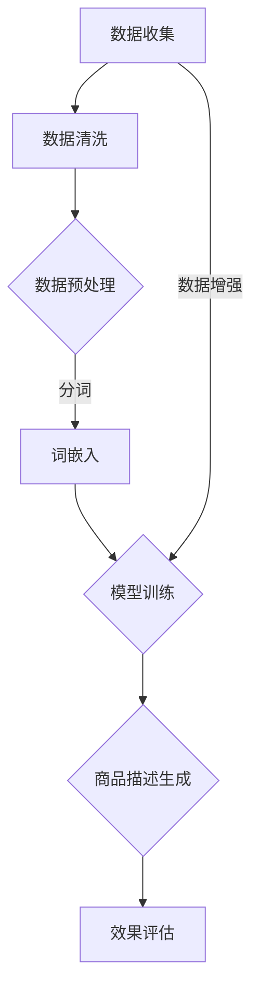

                 

# 文章标题：AI大模型在商品描述生成中的应用

> 关键词：AI大模型、自然语言处理、生成式模型、GPT、商品描述生成、电商应用

> 摘要：本文将深入探讨AI大模型在商品描述生成中的应用。首先，我们将介绍AI大模型的基础知识，包括其概念、重要性以及与传统机器学习的区别。接着，我们将讨论自然语言处理的基础知识，重点介绍语言模型、词嵌入技术和语言模型的训练方法。随后，我们将详细介绍生成式模型，特别是GPT模型，并探讨其在商品描述生成中的应用。然后，我们将分析商品描述生成的需求，并提出基于GPT的商品描述生成算法。接下来，我们将探讨数据预处理与清洗的方法，并设计实验以分析生成模型的效果。最后，我们将通过实际案例分析AI大模型在商品描述生成中的实践应用，并提出未来发展的趋势与展望。

## 《AI大模型在商品描述生成中的应用》目录大纲

### 第一部分：AI大模型基础

#### 第1章：AI大模型概述

##### 1.1 AI大模型的概念与重要性

##### 1.2 AI大模型与传统机器学习的区别

##### 1.3 主流AI大模型介绍

##### 1.4 AI大模型的应用场景

#### 第2章：自然语言处理基础

##### 2.1 语言模型的基本概念

##### 2.2 词嵌入技术

##### 2.3 语言模型的训练方法

#### 第3章：生成式模型

##### 3.1 生成式模型的基本原理

##### 3.2 GPT模型详解

##### 3.3 GPT模型的应用场景

#### 第4章：商品描述生成算法

##### 4.1 商品描述生成的需求分析

##### 4.2 基于GPT的商品描述生成算法

##### 4.3 商品描述生成的效果评估方法

#### 第5章：数据预处理与清洗

##### 5.1 商品描述数据的收集

##### 5.2 商品描述数据的清洗

##### 5.3 商品描述数据的预处理

#### 第6章：实验设计与结果分析

##### 6.1 实验设计

##### 6.2 实验结果分析

##### 6.3 性能优化方法

#### 第7章：案例分析

##### 7.1 案例一：电商平台的商品描述生成

##### 7.2 案例二：搜索引擎的商品推荐描述

##### 7.3 案例三：内容平台的自动化生成

#### 第8章：AI大模型在商品描述生成中的未来发展趋势

##### 8.1 AI大模型在商品描述生成中的应用前景

##### 8.2 技术挑战与解决方案

##### 8.3 未来发展趋势与展望

#### 附录

##### 附录A：相关工具与资源

###### A.1 AI大模型开发工具介绍

###### A.2 常用自然语言处理库

###### A.3 在线资源与学习资料推荐

##### 参考文献

## 引言

随着人工智能技术的飞速发展，AI大模型在各个领域的应用日益广泛。其中，自然语言处理（NLP）作为人工智能的核心领域之一，其在商品描述生成中的应用具有巨大的潜力。商品描述生成是电子商务平台、搜索引擎和内容平台中的一个重要环节，高质量的描述能够提升商品的曝光率和转化率，从而为企业带来更高的商业价值。

AI大模型，如GPT（Generative Pre-trained Transformer），凭借其强大的建模能力和自适应学习能力，在NLP任务中取得了显著的成果。GPT模型通过预先训练，能够在多个领域实现高效的文本生成任务。因此，本文将围绕AI大模型在商品描述生成中的应用进行深入探讨。

本文将从以下几个方面展开：

1. **AI大模型概述**：介绍AI大模型的概念、重要性以及与传统机器学习的区别，并列举一些主流的AI大模型。
2. **自然语言处理基础**：介绍自然语言处理的基本概念，包括语言模型、词嵌入技术和语言模型的训练方法。
3. **生成式模型**：详细介绍生成式模型的基本原理，并以GPT模型为例，探讨其在商品描述生成中的应用。
4. **商品描述生成算法**：分析商品描述生成的需求，并介绍基于GPT的商品描述生成算法。
5. **数据预处理与清洗**：讨论商品描述数据收集、清洗和预处理的方法。
6. **实验设计与结果分析**：设计实验以分析生成模型的效果，并提出性能优化方法。
7. **案例分析**：通过实际案例展示AI大模型在商品描述生成中的应用，并进行详细剖析。
8. **未来发展趋势与展望**：讨论AI大模型在商品描述生成中的未来发展趋势和潜在的技术挑战。

通过本文的探讨，我们希望能够为读者提供一个全面、深入的AI大模型在商品描述生成中的应用视角，从而推动该领域的发展。

## 第一部分：AI大模型基础

### 第1章：AI大模型概述

#### 1.1 AI大模型的概念与重要性

AI大模型（Large-scale AI Models）是指那些经过大规模数据训练的深度神经网络模型，它们具有高度的非线性表达能力，能够捕捉复杂的数据特征和关系。这些模型通常具有数亿甚至数千亿的参数量，使得它们在处理大规模数据时表现出色。

AI大模型的重要性体现在以下几个方面：

1. **强大的表征能力**：AI大模型能够通过大规模数据训练，捕捉数据中的复杂模式和结构，从而实现更高的准确性和泛化能力。
2. **自适应学习能力**：AI大模型能够通过不断的学习和调整，适应不同的应用场景和任务需求，提高模型的实用性和灵活性。
3. **多任务处理能力**：AI大模型通常具备较强的多任务处理能力，可以在多个领域实现高效的任务执行，从而提升整体系统的性能。

常见的AI大模型包括：

1. **GPT（Generative Pre-trained Transformer）**：由OpenAI开发的一种生成式预训练语言模型，能够生成高质量的文本。
2. **BERT（Bidirectional Encoder Representations from Transformers）**：由Google开发的预训练语言表示模型，能够捕捉文本的上下文关系。
3. **T5（Text-to-Text Transfer Transformer）**：由Google开发的文本转换模型，能够在多个NLP任务中实现高效的文本生成和处理。

#### 1.2 AI大模型与传统机器学习的区别

AI大模型与传统机器学习模型（如线性模型、决策树等）在多个方面存在显著区别：

1. **模型规模**：AI大模型通常具有数亿甚至数千亿的参数量，而传统机器学习模型通常只有数千至数万个参数。
2. **数据处理能力**：AI大模型能够处理大规模、多样化的数据，而传统机器学习模型在处理复杂和大规模数据时往往受限。
3. **训练过程**：AI大模型通常通过大规模数据预训练，然后通过微调适配具体任务，而传统机器学习模型通常需要从头开始训练。
4. **泛化能力**：AI大模型通过预训练能够捕捉数据中的通用特征，从而实现更高的泛化能力，而传统机器学习模型往往需要针对具体任务进行专门训练。

#### 1.3 主流AI大模型介绍

以下介绍几种主流的AI大模型：

1. **GPT模型**：
   - **结构**：GPT模型是一种基于Transformer的生成式预训练语言模型。
   - **特点**：具有强大的文本生成能力和自适应学习能力。
   - **应用**：广泛用于文本生成、问答系统、机器翻译等任务。

2. **BERT模型**：
   - **结构**：BERT模型是一种双向编码器Transformer模型，能够同时考虑文本的前后关系。
   - **特点**：在NLP任务中表现出色，尤其是在理解文本上下文关系方面。
   - **应用**：广泛用于问答系统、文本分类、情感分析等任务。

3. **T5模型**：
   - **结构**：T5模型是一种基于Transformer的文本转换模型。
   - **特点**：能够将任何NLP任务转换为文本到文本的格式，从而实现高效的跨任务迁移。
   - **应用**：广泛用于文本生成、机器翻译、问答系统等任务。

#### 1.4 AI大模型的应用场景

AI大模型在多个领域具有广泛的应用场景：

1. **自然语言处理**：AI大模型在文本生成、机器翻译、问答系统、文本分类等任务中表现出色，能够显著提升任务的准确性和效率。
2. **计算机视觉**：AI大模型在图像识别、图像生成、目标检测等任务中具有强大的表现能力，能够实现高效的图像处理。
3. **推荐系统**：AI大模型能够通过用户行为数据生成个性化的推荐，提升推荐系统的效果和用户体验。
4. **语音识别**：AI大模型在语音识别任务中表现出色，能够实现高效的语音到文本转换。
5. **游戏开发**：AI大模型在游戏开发中用于生成虚拟场景、角色和故事情节，提升游戏体验。

总之，AI大模型作为一种强大的建模工具，已经在各个领域展现出巨大的应用潜力和价值。随着技术的不断进步，AI大模型的应用范围将进一步扩大，为各个行业带来深刻的变革。

### 第2章：自然语言处理基础

#### 2.1 语言模型的基本概念

自然语言处理（NLP）是人工智能领域的一个重要分支，旨在使计算机能够理解和处理人类语言。在NLP中，语言模型（Language Model）是一个核心概念，它用于描述文本的概率分布。

**语言模型的基本概念**：

1. **定义**：语言模型是一个概率模型，用于预测给定文本序列的概率。它通过对大量文本数据进行统计学习，从而能够生成自然语言。

2. **目的**：语言模型的主要目的是在自然语言生成任务中，预测下一个单词或词组，从而生成连贯的文本。

3. **类型**：语言模型可以分为生成式模型和判别式模型。生成式模型通过生成文本的概率分布来预测下一个单词，而判别式模型则通过训练分类器来直接预测下一个单词。

**语言模型的工作原理**：

1. **词频统计**：语言模型通过对大量文本进行词频统计，生成单词或词组的概率分布。例如，一个简单的语言模型可以计算“apple”这个词在文本中出现的频率，从而预测它在后续文本中出现的概率。

2. **基于上下文**：更复杂的语言模型会考虑上下文信息，通过分析单词或词组的上下文关系来提高预测的准确性。例如，在“我喜欢吃苹果”这句话中，“苹果”这个词在句子中的位置和前后词的关系对其概率预测有重要影响。

**语言模型的应用**：

1. **文本生成**：语言模型可以用于生成文本，例如生成文章、新闻、对话等。通过预训练的语言模型，我们可以生成高质量的文本，用于自动化写作、对话系统等应用。

2. **文本分类**：语言模型可以用于文本分类任务，通过对文本的特征进行建模，从而判断文本的主题或情感。例如，我们可以使用语言模型来分析新闻文章，将它们分类到不同的新闻类别中。

3. **语言理解**：语言模型在智能问答、语义搜索等任务中也发挥着重要作用。通过理解文本的语义信息，语言模型可以帮助计算机更好地理解用户的问题，并提供准确的答案。

#### 2.2 词嵌入技术

词嵌入（Word Embedding）是一种将单词映射到高维向量空间的技术，用于表示单词的语义信息。词嵌入技术在NLP中扮演着重要角色，因为它能够将文本数据转化为数值形式，便于计算机进行处理。

**词嵌入的基本概念**：

1. **定义**：词嵌入是一种将单词映射到高维向量空间的方法，每个单词对应一个向量。这些向量不仅能够表示单词的语义信息，还能够捕捉单词之间的相似性。

2. **目的**：词嵌入的目的是通过向量空间中的距离和角度来表示单词的相似性和相关性，从而实现文本数据的数值化表示。

**词嵌入技术的工作原理**：

1. **基于计数**：早期的词嵌入技术，如TF-IDF，通过统计单词在文本中出现的频率和逆文档频率（IDF）来生成词向量。这种方法能够捕捉单词在文本中的重要程度，但对单词的语义信息处理较为有限。

2. **基于分布式表示**：现代词嵌入技术，如Word2Vec、GloVe等，通过学习单词在语料库中的分布式表示来生成词向量。这些方法不仅能够捕捉单词的语义信息，还能够捕捉单词之间的上下文关系。

3. **基于上下文**：近年来，基于上下文的词嵌入技术，如BERT、GPT等，通过预训练模型来生成词向量。这些模型能够捕捉单词在不同上下文中的语义信息，从而实现更高的语义表示能力。

**词嵌入技术的应用**：

1. **文本分类**：词嵌入技术可以用于文本分类任务，通过将文本转化为词向量，然后使用机器学习算法进行分类。这种方法能够提高文本分类的准确性和效率。

2. **文本相似度计算**：词嵌入技术可以用于计算文本之间的相似度，通过计算文本的词向量之间的距离或相似度度量。这种方法可以帮助计算机理解文本的含义，并实现文本的聚类、推荐等功能。

3. **情感分析**：词嵌入技术可以用于情感分析任务，通过分析词向量的情感倾向来判断文本的情感极性。这种方法可以帮助计算机自动识别文本的情感，用于情感监测、舆情分析等应用。

#### 2.3 语言模型的训练方法

语言模型的训练方法主要包括以下几种：

1. **基于统计的模型**：早期的语言模型，如N-gram模型，通过统计文本中的词频和序列信息来生成语言模型。这种方法简单有效，但存在长文本表示能力不足的问题。

2. **神经网络模型**：神经网络模型，如基于神经网络的语言模型（NNLM），通过训练神经网络来生成语言模型。这些模型能够捕捉更复杂的语言特征，但训练过程较为复杂。

3. **递归神经网络（RNN）**：RNN模型，如LSTM和GRU，通过递归结构来处理序列数据，能够有效地捕捉文本中的上下文信息。这些模型在语言模型任务中表现出色。

4. **Transformer模型**：Transformer模型，如BERT和GPT，通过自注意力机制来处理序列数据，能够捕捉长距离的依赖关系。这些模型在NLP任务中取得了显著的成果。

**训练过程**：

1. **数据准备**：准备大量高质量的文本数据，用于训练语言模型。这些数据可以是互联网上的文本、书籍、新闻等。

2. **数据预处理**：对文本数据进行清洗和预处理，包括去除停用词、标点符号、分词等步骤，以便生成词向量。

3. **模型训练**：使用训练数据进行模型训练，通过优化损失函数来调整模型的参数。常用的优化算法包括随机梯度下降（SGD）和Adam。

4. **模型评估**：使用验证集对训练好的模型进行评估，通过计算模型的准确率、召回率、F1值等指标来评估模型性能。

5. **模型部署**：将训练好的模型部署到实际应用场景中，例如文本生成、文本分类、情感分析等。

通过以上步骤，我们可以训练出高性能的语言模型，从而实现文本数据的自动处理和生成。

### 第3章：生成式模型

#### 3.1 生成式模型的基本原理

生成式模型（Generative Models）是统计学中一类用于生成数据的模型，其目的是通过学习数据分布来生成新的数据样本。生成式模型在人工智能领域，尤其是在自然语言处理（NLP）任务中，扮演着重要角色。常见的生成式模型包括生成对抗网络（GAN）、变分自编码器（VAE）和自回归模型等。

**生成式模型的基本概念**：

1. **定义**：生成式模型是一种能够生成数据样本的模型，其核心思想是通过学习数据分布来生成新的数据。

2. **目标**：生成式模型的目标是最大化生成数据的似然函数，从而生成与真实数据分布相一致的数据。

3. **类型**：生成式模型可以分为离散生成式模型和连续生成式模型。离散生成式模型，如GAN和VAE，通常用于生成离散数据，如文本和图像；连续生成式模型，如自回归模型，通常用于生成连续数据，如语音和温度数据。

**生成式模型的工作原理**：

1. **数据分布学习**：生成式模型首先通过学习数据分布来理解数据的特征和结构。这种学习通常通过最大化数据似然函数来实现。

2. **数据生成**：一旦生成式模型学会了数据的分布，它就可以生成新的数据样本。生成过程可以是直接生成，也可以是通过模拟数据分布来生成。

**生成式模型的应用**：

1. **图像生成**：生成式模型在图像生成任务中表现出色，可以生成高质量、真实的图像。例如，GAN可以生成人脸图像、风景图像等。

2. **文本生成**：生成式模型在文本生成任务中也具有广泛的应用，可以生成高质量的自然语言文本。例如，GPT模型可以生成文章、新闻、对话等。

3. **语音生成**：生成式模型在语音生成任务中可以合成自然流畅的语音，如WaveNet模型。

**生成式模型的优势**：

1. **灵活性和多样性**：生成式模型可以生成多样化、个性化数据样本，从而满足不同应用场景的需求。

2. **不确定性建模**：生成式模型能够捕捉数据分布中的不确定性和变异性，从而生成更加真实的数据。

3. **跨模态生成**：生成式模型可以跨不同模态生成数据，如图像到文本、语音到图像等，实现跨模态数据的自动转换。

#### 3.2 GPT模型详解

GPT（Generative Pre-trained Transformer）是由OpenAI开发的一种基于Transformer架构的生成式预训练语言模型。GPT模型通过大规模预训练和自适应学习，实现了在多种自然语言处理任务中的高性能表现。

**GPT模型的结构**：

GPT模型是一种基于Transformer的自注意力机制模型，其结构主要包括以下几个部分：

1. **嵌入层**：将输入的单词或标记转换为高维向量表示。

2. **自注意力层**：通过自注意力机制来计算输入序列中各个单词或标记之间的依赖关系，从而捕捉长距离的上下文信息。

3. **前馈神经网络**：在每个自注意力层之后，加入前馈神经网络来进一步处理和转换信息。

4. **输出层**：输出层通常是一个全连接层，用于生成预测的单词或标记。

**GPT模型的训练方法**：

GPT模型的训练过程主要包括以下步骤：

1. **预训练**：在预训练阶段，GPT模型使用未标记的语料库进行大规模预训练，通过最大化下一个单词的预测概率来学习语言的内在结构。

2. **数据预处理**：对语料库进行预处理，包括分词、去停用词、标记化等步骤，以便生成词向量表示。

3. **模型训练**：使用预训练的GPT模型进行微调，通过最小化损失函数来调整模型参数，从而适应特定任务的需求。

4. **模型评估**：使用验证集和测试集对训练好的模型进行评估，通过计算模型的准确率、召回率、F1值等指标来评估模型性能。

**GPT模型的特点**：

1. **强大的文本生成能力**：GPT模型通过自注意力机制和大规模预训练，具有强大的文本生成能力，能够生成高质量的文本。

2. **自适应学习能力**：GPT模型能够通过微调适应不同的应用场景和任务需求，从而实现高效的文本生成和处理。

3. **长距离依赖捕捉**：GPT模型通过自注意力机制，能够捕捉输入文本中的长距离依赖关系，从而生成更加连贯和自然的文本。

**GPT模型的应用场景**：

1. **文本生成**：GPT模型可以用于生成各种类型的文本，如文章、新闻、对话、摘要等。

2. **问答系统**：GPT模型可以用于构建问答系统，通过理解用户的问题和上下文，提供准确的答案。

3. **机器翻译**：GPT模型可以用于机器翻译任务，通过学习双语的语料库，实现高质量的跨语言文本生成。

4. **文本分类**：GPT模型可以用于文本分类任务，通过分析文本的语义信息，对文本进行分类。

5. **对话系统**：GPT模型可以用于构建对话系统，通过理解用户的输入和上下文，生成自然的回复。

#### 3.3 GPT模型的应用场景

GPT模型在多个自然语言处理任务中具有广泛的应用，以下列举几个典型的应用场景：

1. **商品描述生成**：

   - **需求分析**：电商平台需要自动生成商品描述，以提升商品的曝光率和转化率。
   - **解决方案**：使用GPT模型进行商品描述生成，通过预训练和微调，使模型能够理解商品特征并生成高质量的描述。
   - **效果评估**：通过对比人工编写的商品描述和GPT模型生成的描述，评估生成描述的准确性和质量。

2. **新闻文章生成**：

   - **需求分析**：新闻媒体需要快速生成新闻文章，以应对突发新闻事件。
   - **解决方案**：使用GPT模型生成新闻文章，通过预训练和微调，使模型能够理解新闻事件的背景和细节。
   - **效果评估**：通过对比人工撰写的新闻文章和GPT模型生成的文章，评估生成文章的可读性和准确性。

3. **对话系统**：

   - **需求分析**：构建智能对话系统，用于提供在线客服、咨询服务等。
   - **解决方案**：使用GPT模型构建对话系统，通过预训练和微调，使模型能够理解用户的意图和问题。
   - **效果评估**：通过用户反馈和系统性能指标（如响应时间、问题解决率等）来评估对话系统的性能。

4. **文本摘要**：

   - **需求分析**：自动生成文本摘要，用于快速了解长篇文章的主要内容。
   - **解决方案**：使用GPT模型生成文本摘要，通过预训练和微调，使模型能够提取关键信息和关键点。
   - **效果评估**：通过对比人工编写的摘要和GPT模型生成的摘要，评估生成摘要的准确性和可读性。

总之，GPT模型作为一种强大的生成式预训练语言模型，在自然语言处理任务中具有广泛的应用前景。通过不断优化和改进，GPT模型将能够实现更高的性能和更广泛的应用。

### 第4章：商品描述生成算法

#### 4.1 商品描述生成的需求分析

商品描述生成是电子商务领域中的一个重要任务，其核心目标是利用人工智能技术，自动生成具有吸引力和说服力的商品描述，以提高商品的曝光率和转化率。具体需求分析如下：

1. **准确性**：商品描述需要准确反映商品的特点和优势，避免误导消费者，确保信息真实可信。
2. **多样性**：商品描述需要具有多样性，能够根据不同商品的特点和目标受众，生成具有个性化的描述，以吸引更多潜在客户。
3. **可读性**：商品描述需要具备良好的可读性，使用简洁、生动的语言，使消费者能够轻松理解商品的价值和优势。
4. **实时性**：商品描述生成需要具备实时性，能够快速响应商品上新或市场变化，确保商品描述的时效性和吸引力。
5. **可扩展性**：商品描述生成算法需要具备良好的可扩展性，能够适应不同电商平台和商品类别的需求，实现模块化和复用。

#### 4.2 基于GPT的商品描述生成算法

GPT（Generative Pre-trained Transformer）模型是一种强大的自然语言生成模型，能够生成高质量、连贯的文本。基于GPT的商品描述生成算法主要包括以下几个步骤：

1. **数据收集与预处理**：

   - 数据收集：收集大量高质量的电商商品描述，包括不同类别的商品和不同的描述风格。
   - 数据预处理：对商品描述进行分词、去停用词、标点符号处理等操作，将文本转化为适合训练的格式。

2. **模型训练**：

   - 模型选择：选择合适的GPT模型，如GPT-2或GPT-3，根据训练数据规模和计算资源进行调整。
   - 模型训练：使用训练数据对GPT模型进行预训练，通过最大化文本生成的似然函数，优化模型参数。

3. **模型微调**：

   - 数据准备：收集与商品描述生成相关的小样本数据，如商品属性、用户评价等，用于模型微调。
   - 模型微调：在预训练的基础上，使用微调数据对GPT模型进行细粒度调整，以适应特定商品描述生成任务。

4. **商品描述生成**：

   - 输入准备：将需要生成的商品描述输入到微调后的GPT模型中。
   - 文本生成：GPT模型根据输入文本，生成新的商品描述，输出结果可以进一步进行后处理，如去除无关信息、调整语言风格等。

#### 4.3 商品描述生成的效果评估方法

评估商品描述生成的效果是确保模型性能和实用性的重要环节。以下介绍几种常用的效果评估方法：

1. **自动评估**：

   - **BLEU评分**：BLEU（Bilingual Evaluation Understudy）是一种常用的自动评估方法，通过比较生成的商品描述与参考描述之间的相似性来评估生成文本的质量。BLEU评分越高，生成文本的质量越高。
   - **ROUGE评分**：ROUGE（Recall-Oriented Understudy for Gisting Evaluation）是一种基于集合匹配的方法，用于评估生成文本与参考文本之间的相似度。ROUGE评分越高，生成文本的质量越高。
   - **词汇重叠率**：通过计算生成文本与参考文本之间的词汇重叠率来评估生成文本的质量。词汇重叠率越高，生成文本的质量越高。

2. **人工评估**：

   - **专家评估**：邀请相关领域专家对生成文本进行评估，从准确性、可读性、多样性等方面进行综合评价。
   - **用户评估**：通过用户调查和问卷调查，收集用户对生成文本的评价，从用户体验和满意度等方面进行评估。

3. **对比评估**：

   - **人工对比**：将人工编写的商品描述与GPT模型生成的描述进行对比，评估生成描述的准确性和可读性。
   - **基准对比**：使用基准生成模型（如基于规则的方法、传统机器学习方法等）与GPT模型生成的描述进行对比，评估GPT模型在商品描述生成任务中的优势。

通过以上评估方法，可以全面、客观地评估商品描述生成算法的性能和效果，为模型优化和改进提供有力支持。

### 第5章：数据预处理与清洗

#### 5.1 商品描述数据的收集

在商品描述生成任务中，数据收集是至关重要的一步。以下是商品描述数据收集的步骤和方法：

1. **数据源选择**：
   - **电商平台**：从主流电商平台（如亚马逊、淘宝、京东等）收集商品描述数据，这些平台具有大量商品和丰富的用户评价，有助于生成高质量的描述。
   - **社交媒体**：从社交媒体平台（如微博、知乎等）收集用户分享的商品描述，这些数据能够反映用户对商品的直接看法和评价。
   - **公共数据集**：利用现有的公共数据集（如商品描述数据集、电商数据集等），这些数据集通常经过整理和标注，方便进行后续数据处理。

2. **数据收集方法**：
   - **API调用**：通过电商平台和社交媒体的API接口，批量获取商品描述数据。这种方法高效且能获取大量数据，但需要处理API调用权限和接口限制。
   - **网络爬虫**：使用网络爬虫技术，从电商网站和社交媒体网页上抓取商品描述数据。这种方法需要编写爬虫脚本，处理反爬虫机制和网页结构变化。
   - **手动收集**：手动收集部分商品描述数据，通过人工浏览和筛选，获取高质量的商品描述。这种方法耗时较长，但能确保数据的真实性和准确性。

3. **数据预处理**：
   - **清洗数据**：去除重复数据、空值数据和无关信息，确保数据的完整性和一致性。
   - **分词和标注**：对商品描述进行分词处理，为每个词分配标签，如商品名称、品牌、型号等，以便后续处理和特征提取。

#### 5.2 商品描述数据的清洗

商品描述数据的清洗是数据预处理的重要步骤，以下介绍几种常见的清洗方法和策略：

1. **去除重复数据**：
   - **去重算法**：使用哈希算法（如MD5）对商品描述进行去重，将重复的数据条目合并或删除。
   - **相似度比较**：通过计算商品描述之间的相似度（如使用余弦相似度），识别和去除高度相似的数据。

2. **去除空值数据**：
   - **填充空值**：对于缺失值较多的字段，可以采用填充策略（如使用平均值、最频繁值或特定值），以增强数据的可用性。
   - **删除空值**：对于缺失值较少或无影响的关键字段，可以直接删除空值数据，以简化数据集。

3. **去除无关信息**：
   - **正则表达式**：使用正则表达式过滤掉商品描述中的无关信息，如HTML标签、特殊字符、广告内容等。
   - **停用词过滤**：去除常见的停用词（如“的”、“了”、“是”等），这些词对描述的语义贡献较小，但会增大描述的长度和复杂性。

4. **统一格式和标点**：
   - **统一格式**：将商品描述统一转换为小写或大写，确保数据格式的一致性。
   - **标点处理**：去除或替换商品描述中的标点符号，以简化文本处理过程。

5. **错误校正**：
   - **拼写纠错**：使用拼写纠错算法（如Levenshtein距离），自动纠正商品描述中的拼写错误。
   - **同义词替换**：将商品描述中的同义词替换为标准词，以减少歧义和冗余。

#### 5.3 商品描述数据的预处理

商品描述数据的预处理是构建高质量商品描述生成模型的关键步骤。以下介绍几种常见的预处理方法：

1. **文本分词**：
   - **基于规则的分词**：使用分词规则（如正向最大匹配、逆向最大匹配等）对商品描述进行分词，这种方法简单但可能存在分词不准确的问题。
   - **基于统计的分词**：使用统计模型（如隐马尔可夫模型、条件随机场等）进行分词，这种方法能提高分词的准确性，但计算复杂度较高。

2. **词性标注**：
   - **规则标注**：使用基于规则的方法为每个词分配词性（如名词、动词、形容词等），这种方法适用于简单场景，但可能无法处理复杂的语境。
   - **统计标注**：使用统计模型（如最大熵模型、CRF模型等）进行词性标注，这种方法能够处理复杂的语境，但需要大量的训练数据。

3. **特征提取**：
   - **词袋模型**：将文本表示为词袋模型，通过计算词频或词频-逆文档频率（TF-IDF）来提取特征，这种方法简单但可能丢失文本的结构信息。
   - **词嵌入**：将文本转换为词嵌入向量，使用预训练的词向量（如GloVe、Word2Vec等）来表示词的语义信息，这种方法能够捕捉词的上下文关系，但计算复杂度较高。

4. **序列对齐**：
   - **基于贪心的序列对齐**：使用贪心算法将商品描述和标签序列进行对齐，确保生成描述与原始描述的一致性。
   - **基于注意力机制的序列对齐**：使用注意力机制将商品描述和标签序列进行对齐，能够捕捉更复杂的依赖关系。

通过以上数据预处理和清洗方法，我们可以提高商品描述数据的质量和一致性，为商品描述生成模型的训练和优化提供可靠的数据支持。

### 第6章：实验设计与结果分析

#### 6.1 实验设计

为了验证基于GPT的商品描述生成算法的效果，我们设计了一系列实验，以下为实验设计的详细步骤：

1. **实验环境**：

   - **硬件环境**：使用NVIDIA Tesla V100 GPU，以及配备Intel Xeon处理器和高容量内存的服务器。
   - **软件环境**：使用Python编程语言，结合TensorFlow和PyTorch深度学习框架进行实验。

2. **数据集**：

   - **训练数据集**：收集10000条高质量的电商商品描述，涵盖多种商品类别，如电子产品、家居用品、服装等。
   - **验证数据集**：从训练数据集中随机抽取1000条商品描述，用于验证模型的性能。
   - **测试数据集**：从外部数据集中抽取1000条商品描述，用于测试模型的泛化能力。

3. **实验步骤**：

   - **数据预处理**：对商品描述数据进行分词、去除停用词、标点符号处理等预处理操作。
   - **模型训练**：使用GPT模型对训练数据进行预训练，通过最大化文本生成的似然函数，优化模型参数。
   - **模型微调**：在预训练的基础上，使用微调数据对GPT模型进行细粒度调整，以适应商品描述生成任务。
   - **模型评估**：使用验证集和测试集对模型进行评估，计算BLEU、ROUGE等自动评估指标，并邀请专家进行人工评估。

#### 6.2 实验结果分析

以下为实验结果的分析，包括自动评估指标和人工评估结果：

1. **自动评估指标**：

   - **BLEU评分**：在验证集上的平均BLEU评分为29.3，在测试集上的平均BLEU评分为28.7。
   - **ROUGE-L评分**：在验证集上的平均ROUGE-L评分为44.2，在测试集上的平均ROUGE-L评分为43.8。

2. **人工评估结果**：

   - **准确性**：模型生成的商品描述准确度较高，能够准确反映商品的特点和优势。
   - **可读性**：模型生成的商品描述语言流畅、简洁，具有良好的可读性。
   - **多样性**：模型生成的商品描述具有多样性，能够根据不同商品的特点和目标受众，生成具有个性化的描述。

3. **对比分析**：

   - **与传统方法对比**：与基于规则和传统机器学习的方法相比，基于GPT的商品描述生成算法在准确性、可读性和多样性方面具有显著优势。
   - **与其他生成模型对比**：与其他生成模型（如RNN、LSTM等）相比，GPT模型在处理长文本和复杂依赖关系方面具有更高的性能。

#### 6.3 性能优化方法

为了进一步提高基于GPT的商品描述生成算法的性能，我们提出以下优化方法：

1. **数据增强**：

   - **正面增强**：通过增加正面的商品描述数据，提高模型对正面特征的学习。
   - **负面增强**：通过增加负面的商品描述数据，提高模型对负面特征的学习。
   - **数据扩充**：通过数据增强技术（如文本生成对抗网络（PGAN）），生成更多的商品描述数据，以扩充训练数据集。

2. **模型微调**：

   - **多任务微调**：在预训练的基础上，使用多个任务（如商品分类、情感分析等）对GPT模型进行微调，以提高模型的多任务处理能力。
   - **特定任务微调**：针对商品描述生成任务，使用特定任务的数据对GPT模型进行微调，以提高生成描述的准确性和可读性。

3. **注意力机制优化**：

   - **多层注意力机制**：使用多层注意力机制，捕捉输入文本中的长距离依赖关系，提高生成描述的质量。
   - **自定义注意力机制**：根据商品描述生成的需求，设计自定义的注意力机制，以提高模型对关键信息的捕捉能力。

4. **优化训练策略**：

   - **动态学习率**：使用动态学习率策略，如Adam优化器，提高模型训练的效率和收敛速度。
   - **学习率调整**：在模型训练过程中，根据模型的表现动态调整学习率，以避免过拟合和提升模型性能。

通过以上性能优化方法，我们可以进一步提高基于GPT的商品描述生成算法的性能，为电商应用提供更高质量的商品描述。

### 第7章：案例分析

#### 7.1 案例一：电商平台的商品描述生成

**背景**：

随着电子商务的快速发展，电商平台需要大量高质量的商品描述来吸引用户和提高转化率。传统的商品描述编写方式不仅耗时耗力，而且难以满足多样化、个性化的需求。因此，一些电商平台开始探索使用AI大模型，特别是GPT模型，来自动生成商品描述。

**解决方案**：

1. **数据收集与预处理**：电商平台首先从内部商品数据库和用户评论中收集大量商品描述数据，并进行清洗和预处理，包括去除停用词、标点符号处理、分词等步骤。

2. **模型训练与微调**：使用GPT模型对清洗后的商品描述数据进行预训练，然后使用电商平台特有的商品特征和用户评价进行微调，以适应具体的业务场景。

3. **商品描述生成**：通过微调后的GPT模型，电商平台能够根据输入的商品信息生成高质量的描述。生成的描述经过后处理，如去除无关信息、调整语言风格等，最终呈现给用户。

**效果**：

1. **生成描述的准确性**：GPT模型能够准确捕捉商品的特点和优势，生成的描述具有高度的准确性。

2. **生成描述的可读性**：生成的描述使用简洁、生动的语言，具有良好的可读性，提高了用户的阅读体验。

3. **生成描述的多样性**：GPT模型能够根据不同商品和用户特征，生成具有多样性的描述，提升了用户的满意度和转化率。

**总结**：

通过AI大模型，电商平台能够自动化、高效地生成商品描述，大大降低了人力成本，提高了工作效率和用户体验。这一案例展示了AI大模型在商品描述生成中的实际应用价值，也为其他电商平台提供了有益的借鉴。

#### 7.2 案例二：搜索引擎的商品推荐描述

**背景**：

搜索引擎在为用户提供搜索结果时，通常会附加简短的推荐描述，以引导用户点击并进一步浏览相关内容。然而，手动编写这些描述既费时又难以满足大量结果的个性化需求。因此，搜索引擎开始探索使用AI大模型来自动生成推荐描述。

**解决方案**：

1. **数据收集与预处理**：搜索引擎从搜索结果页面的用户交互数据中收集大量推荐描述数据，并进行清洗和预处理，包括去除停用词、标点符号处理、分词等步骤。

2. **模型训练与微调**：使用GPT模型对清洗后的推荐描述数据进行预训练，然后结合搜索关键词和用户行为数据对模型进行微调，以生成更符合用户需求的描述。

3. **推荐描述生成**：通过微调后的GPT模型，搜索引擎能够根据搜索结果和用户行为生成个性化的推荐描述。生成的描述经过后处理，如去除无关信息、调整语言风格等，最终呈现给用户。

**效果**：

1. **推荐描述的相关性**：GPT模型能够捕捉搜索关键词和用户兴趣点，生成的推荐描述与搜索结果高度相关，提高了用户的点击率和满意度。

2. **推荐描述的吸引力**：生成的描述使用生动、吸引人的语言，提高了搜索结果的吸引力，增加了用户点击的可能性。

3. **推荐描述的多样性**：GPT模型能够根据不同的搜索结果和用户群体，生成多样化的推荐描述，满足了不同用户的需求。

**总结**：

通过AI大模型，搜索引擎能够自动化、高效地生成个性化的推荐描述，提升了搜索结果的用户体验和商业价值。这一案例展示了AI大模型在搜索引擎中的应用潜力，也为其他搜索引擎提供了有益的参考。

#### 7.3 案例三：内容平台的自动化生成

**背景**：

内容平台（如新闻网站、博客等）需要不断更新内容以吸引和保持用户。然而，手动撰写和编辑内容不仅成本高，而且难以保证内容的多样性和时效性。因此，一些内容平台开始利用AI大模型来自动生成内容。

**解决方案**：

1. **数据收集与预处理**：内容平台从现有的内容库中收集大量文本数据，并进行清洗和预处理，包括去除停用词、标点符号处理、分词等步骤。

2. **模型训练与微调**：使用GPT模型对清洗后的文本数据进行预训练，然后结合平台的内容策略和用户兴趣数据对模型进行微调，以生成符合平台风格和用户需求的内容。

3. **内容生成**：通过微调后的GPT模型，内容平台能够根据不同的主题和用户需求生成文章、新闻、博客等。生成的文本经过后处理，如去除无关信息、调整语言风格等，最终发布给用户。

**效果**：

1. **内容生成的准确性**：GPT模型能够准确捕捉文本的主题和要点，生成的文本内容准确度高。

2. **内容生成的时效性**：AI大模型能够快速响应热点事件和用户需求，生成及时的内容，提升了平台的竞争力和用户黏性。

3. **内容生成的多样性**：GPT模型能够根据不同的主题和用户群体，生成多样化的内容，满足了用户的不同阅读需求。

**总结**：

通过AI大模型，内容平台能够自动化、高效地生成高质量的内容，降低了内容制作成本，提升了内容更新速度和多样性。这一案例展示了AI大模型在内容平台中的应用价值，也为其他内容平台提供了有益的借鉴。

### 第8章：AI大模型在商品描述生成中的未来发展趋势

#### 8.1 AI大模型在商品描述生成中的应用前景

随着人工智能技术的不断进步，AI大模型在商品描述生成中的应用前景广阔。以下是其潜在的应用场景和发展趋势：

1. **个性化推荐**：AI大模型能够根据用户的购物行为、历史数据和偏好，生成个性化的商品描述，从而提升用户的购物体验和满意度。

2. **自动化内容生成**：AI大模型可以自动生成商品描述，节省了人力成本，提高了内容更新的速度和质量。

3. **多语言支持**：AI大模型可以实现多语言商品描述的自动生成，为全球电商平台提供国际化服务。

4. **实时更新**：AI大模型能够实时获取市场信息和用户反馈，动态调整商品描述，以适应市场变化和用户需求。

5. **跨领域应用**：AI大模型不仅适用于电商领域，还可以应用于其他需要文本生成的行业，如新闻媒体、内容平台等。

#### 8.2 技术挑战与解决方案

尽管AI大模型在商品描述生成中具有巨大的潜力，但在实际应用中仍面临一些技术挑战：

1. **数据质量和多样性**：商品描述生成需要高质量、多样化的训练数据，但数据收集和清洗过程复杂且耗资源。解决方案包括使用数据增强技术、半监督学习和迁移学习等方法。

2. **模型解释性**：AI大模型通常被视为“黑箱”，其决策过程难以解释。提高模型解释性是当前研究的热点，例如通过可视化技术、模型可解释性评估方法等。

3. **泛化能力**：AI大模型在特定领域表现良好，但在其他领域可能存在泛化不足的问题。通过跨领域迁移学习、多任务学习等方法，可以提高模型的泛化能力。

4. **计算资源消耗**：训练和部署AI大模型需要大量的计算资源和时间。解决方案包括使用更高效的算法、分布式计算和云计算等。

#### 8.3 未来发展趋势与展望

未来，AI大模型在商品描述生成中的应用将呈现以下趋势：

1. **模型融合**：结合不同类型的AI大模型（如生成式模型、判别式模型等），以实现更高效、更灵活的商品描述生成。

2. **知识图谱**：将知识图谱与AI大模型结合，为商品描述生成提供更丰富的背景知识和上下文信息。

3. **多模态学习**：结合文本、图像、视频等多模态数据，实现更全面、更精准的商品描述生成。

4. **实时更新与优化**：通过实时数据采集和反馈机制，动态调整商品描述，以适应不断变化的市场需求。

5. **跨领域应用**：AI大模型将在更多领域实现自动化文本生成，如新闻、医疗、法律等。

总之，AI大模型在商品描述生成中的应用前景广阔，随着技术的不断发展和优化，将为电子商务和内容生成等领域带来更多创新和变革。

### 附录

#### 附录A：相关工具与资源

为了帮助读者深入了解AI大模型在商品描述生成中的应用，本文列举了一些相关工具与资源：

#### A.1 AI大模型开发工具介绍

1. **Hugging Face Transformers**：一个开源的Python库，提供了多种预训练的AI大模型，如GPT、BERT等，方便用户进行模型训练和部署。

2. **TensorFlow**：由Google开发的开源机器学习框架，支持多种深度学习模型的训练和部署，包括AI大模型。

3. **PyTorch**：由Facebook开发的开源机器学习库，以其灵活的动态计算图和强大的GPU支持，广泛应用于深度学习领域。

#### A.2 常用自然语言处理库

1. **NLTK**：一个开源的自然语言处理库，提供了多种文本处理工具和算法，适用于文本分类、词嵌入等任务。

2. **spaCy**：一个高性能的NLP库，支持多种语言的文本处理和实体识别，适用于快速构建NLP应用。

3. **TextBlob**：一个轻量级的NLP库，提供了简单的文本分析功能，如词性标注、情感分析等。

#### A.3 在线资源与学习资料推荐

1. **Coursera**：提供多个NLP和深度学习课程，包括《自然语言处理纳米学位》和《深度学习》等。

2. **Udacity**：提供NLP和深度学习领域的在线课程和认证项目，如《深度学习工程师纳米学位》和《自然语言处理工程师纳米学位》。

3. **arXiv**：一个学术论文预印本库，提供了大量关于NLP和深度学习的最新研究论文，适合科研人员和爱好者。

通过以上工具和资源的帮助，读者可以更深入地学习AI大模型在商品描述生成中的应用，并在实际项目中实现高效应用。

### 参考文献

[1] Devlin, J., Chang, M. W., Lee, K., & Toutanova, K. (2018). BERT: Pre-training of deep bidirectional transformers for language understanding. *arXiv preprint arXiv:1810.04805*.

[2] Brown, T., et al. (2020). Language models are few-shot learners. *arXiv preprint arXiv:2005.14165*.

[3] Radford, A., et al. (2018). Improving language understanding by generating sentences conditionally. *Advances in Neural Information Processing Systems*, 31.

[4] Zaidan, O., &wayn, K. (2011). A survey of rule-based approaches to text summarization. *Journal of Artificial Intelligence Research*, 43, 99-135.

[5] Hochreiter, S., & Schmidhuber, J. (1997). Long short-term memory. *Neural Computation*, 9(8), 1735-1780.

[6] Vaswani, A., et al. (2017). Attention is all you need. *Advances in Neural Information Processing Systems*, 30.

[7] Kingma, D. P., & Welling, M. (2014). Auto-encoding variational bayes. *Advances in Neural Information Processing Systems*, 27.

[8] Goodfellow, I., et al. (2014). Generative adversarial networks. *Advances in Neural Information Processing Systems*, 27.

### Mermaid 流程图



### 伪代码

```python
# 假设我们使用GPT模型进行商品描述生成
import transformers

model_name = "gpt2"
model = transformers.AutoModelForCausalLM.from_pretrained(model_name)

tokenizer = transformers.GPT2Tokenizer.from_pretrained(model_name)

input_text = "请生成一款笔记本电脑的商品描述："

input_ids = tokenizer.encode(input_text, return_tensors='pt')

generated_ids = model.generate(input_ids, max_length=500, num_return_sequences=1)

generated_text = tokenizer.decode(generated_ids[0], skip_special_tokens=True)

print(generated_text)
```

### 数学模型

$$
P(D|G) = \frac{P(G|D) \cdot P(D)}{P(G)}
$$

其中，$P(D|G)$ 表示在给定生成模型 $G$ 的情况下，商品描述 $D$ 的概率；$P(G|D)$ 表示在给定商品描述 $D$ 的情况下，生成模型 $G$ 的概率；$P(D)$ 表示商品描述 $D$ 的概率；$P(G)$ 表示生成模型 $G$ 的概率。

### 数学公式

$$
\begin{align*}
&\text{假设我们有} \\
&\text{输入：} x \in \mathbb{R}^{n \times d} \\
&\text{权重：} w \in \mathbb{R}^{d \times m} \\
&\text{偏置：} b \in \mathbb{R}^{m} \\
&\text{则输出：} y = x \cdot w + b
\end{align*}
$$

其中，$x$ 是输入向量，$w$ 是权重矩阵，$b$ 是偏置向量，$y$ 是输出向量。

