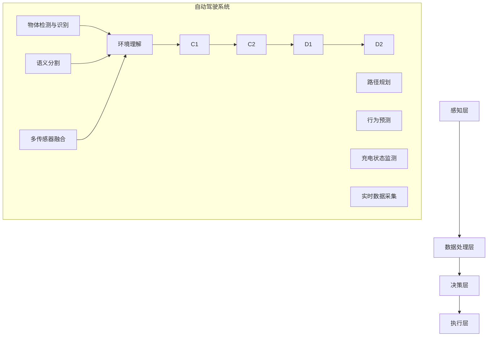

                 

### 《AI大模型在新能源汽车领域的创业机会分析》

---

#### 关键词

AI大模型，新能源汽车，自动驾驶，智能充电网络，车联网，创业机会，商业模式。

---

#### 摘要

本文旨在深入分析AI大模型在新能源汽车领域的创业机会。首先，我们将介绍AI大模型的基础知识，包括其概述、关键技术和发展趋势。随后，我们将探讨新能源汽车行业的发展现状、技术创新和政策环境。在此基础上，本文将详细分析AI大模型在自动驾驶、智能充电网络、车联网和新能源汽车售后服务等方面的应用，并探讨其技术原理和优化策略。最后，本文将结合创业案例，评估AI大模型在新能源汽车领域的创业机会，并给出创业实践指南和未来展望。

---

### 《AI大模型在新能源汽车领域的创业机会分析》目录大纲

---

#### 第一部分：AI大模型基础知识

- **第1章：AI大模型概述**
  - 1.1 AI大模型简介
  - 1.2 AI大模型的关键技术
  - 1.3 AI大模型的发展趋势
  - 1.4 AI大模型在新能源汽车领域的应用前景

- **第2章：新能源汽车行业概述**
  - 2.1 新能源汽车市场发展现状
  - 2.2 新能源汽车行业的技术创新
  - 2.3 新能源汽车产业链分析
  - 2.4 新能源汽车政策环境

#### 第二部分：AI大模型在新能源汽车中的应用

- **第3章：自动驾驶技术**
  - 3.1 自动驾驶技术概述
  - 3.2 AI大模型在自动驾驶中的应用
  - 3.3 自动驾驶系统架构
  - 3.4 自动驾驶技术挑战与未来趋势

- **第4章：智能充电网络**
  - 4.1 智能充电网络概述
  - 4.2 AI大模型在智能充电网络中的应用
  - 4.3 智能充电网络系统架构
  - 4.4 智能充电网络的优化策略

- **第5章：车联网技术**
  - 5.1 车联网技术概述
  - 5.2 AI大模型在车联网中的应用
  - 5.3 车联网系统架构
  - 5.4 车联网安全与隐私保护

- **第6章：新能源汽车售后服务**
  - 6.1 新能源汽车售后服务概述
  - 6.2 AI大模型在售后服务中的应用
  - 6.3 售后服务系统架构
  - 6.4 售后服务优化策略

#### 第三部分：AI大模型在新能源汽车领域的创业机会分析

- **第7章：创业机会与商业模式**
  - 7.1 新能源汽车行业创业机会概述
  - 7.2 AI大模型在新能源汽车领域的商业模式分析
  - 7.3 创业案例分析
  - 7.4 创业机会评估与风险分析

- **第8章：创业实践指南**
  - 8.1 创业前的准备
  - 8.2 项目策划与实施
  - 8.3 资源整合与团队建设
  - 8.4 创业成功的关键要素

- **第9章：未来展望**
  - 9.1 新能源汽车与AI大模型融合的未来趋势
  - 9.2 创业机会的持续拓展
  - 9.3 新能源汽车行业的可持续发展

#### 附录

- **附录A：AI大模型相关技术资料**
- **附录B：新能源汽车行业报告精选**
- **附录C：创业资源与支持政策指南**

#### 附录：AI大模型流程图与算法伪代码

- **附录D：自动驾驶系统架构Mermaid流程图**
- **附录E：智能充电网络算法伪代码**
- **附录F：车联网技术算法伪代码**

---

### AI大模型在新能源汽车领域的创业机会分析

---

**关键词：** AI大模型，新能源汽车，自动驾驶，智能充电网络，车联网，创业机会，商业模式。

**摘要：** 本文旨在深入分析AI大模型在新能源汽车领域的创业机会。首先，我们将介绍AI大模型的基础知识，包括其概述、关键技术和发展趋势。随后，我们将探讨新能源汽车行业的发展现状、技术创新和政策环境。在此基础上，本文将详细分析AI大模型在自动驾驶、智能充电网络、车联网和新能源汽车售后服务等方面的应用，并探讨其技术原理和优化策略。最后，本文将结合创业案例，评估AI大模型在新能源汽车领域的创业机会，并给出创业实践指南和未来展望。

---

## 第一部分：AI大模型基础知识

### 第1章：AI大模型概述

#### 1.1 AI大模型简介

AI大模型是指使用海量数据训练得到的大型深度学习模型，具有强大的表征和学习能力。这些模型通常由数百万个参数组成，能够在各种复杂任务中表现出色，例如自然语言处理、计算机视觉、语音识别等。AI大模型的发展始于20世纪80年代，随着深度学习技术的兴起，尤其是2012年AlexNet在ImageNet竞赛中取得的突破性成绩，AI大模型开始受到广泛关注。

#### 1.2 AI大模型的关键技术

AI大模型的关键技术包括深度学习、自然语言处理、计算机视觉等。深度学习是一种基于多层神经网络的学习方法，通过自动提取数据中的层次化特征来实现复杂问题的求解。自然语言处理是AI大模型的重要应用领域之一，主要包括文本分类、情感分析、机器翻译等任务。计算机视觉是AI大模型在图像和视频领域的应用，主要包括图像分类、目标检测、图像分割等任务。

#### 1.3 AI大模型的发展趋势

AI大模型的发展趋势主要体现在以下几个方面：

1. **多模态融合**：AI大模型将逐渐实现文本、图像、语音等多模态数据的融合，提高模型的泛化能力和应用场景。
2. **迁移学习与少样本学习**：通过迁移学习和少样本学习技术，AI大模型将能够更好地适应不同的应用场景和任务。
3. **高效训练与推理**：随着计算资源和算法的优化，AI大模型将实现更高效的训练和推理，降低成本和延迟。
4. **可解释性与可控性**：随着对AI大模型的研究深入，可解释性和可控性将成为重要的研究方向，以提高模型的透明度和可靠性。

### 第2章：新能源汽车行业概述

#### 2.1 新能源汽车市场发展现状

新能源汽车市场在过去十年中取得了显著的增长。根据国际能源署（IEA）的数据，2019年全球新能源汽车销量达到了210万辆，同比增长近40%。其中，中国是新能源汽车市场的领导者，占全球销量的近50%。全球其他主要市场，如美国、欧洲和日本，也呈现出快速增长的趋势。

#### 2.2 新能源汽车行业的技术创新

新能源汽车行业的技术创新主要集中在电池技术、电动驱动系统、智能充电网络和自动驾驶技术等方面。电池技术的进步是推动新能源汽车市场发展的关键因素。目前，锂离子电池是市场上最常用的电池类型，而固态电池、硅碳负极等新型电池技术正在研发中，有望进一步提高电池的能量密度和安全性。

电动驱动系统的创新主要体现在电机控制技术和动力传动系统设计上。高效、低噪声、高扭矩的电动驱动系统是新能源汽车性能提升的关键。

智能充电网络的发展将大大提高新能源汽车的便捷性和用户体验。通过智能充电网络，用户可以随时随地找到合适的充电桩，并实现快速充电。

自动驾驶技术的发展将为新能源汽车带来更多的应用场景和商业机会。自动驾驶技术可以提高驾驶安全性，减少交通事故，同时也可以降低车辆的使用成本。

#### 2.3 新能源汽车产业链分析

新能源汽车产业链包括电池制造、电动驱动系统、智能充电网络、整车制造和售后服务等多个环节。电池制造是新能源汽车产业链的核心环节，直接影响到新能源汽车的性能和成本。电动驱动系统是另一个重要的环节，其技术的发展将决定新能源汽车的驱动性能和用户体验。

智能充电网络的发展将大大提高新能源汽车的便捷性和用户体验。整车制造是新能源汽车产业链的下游环节，涉及到整车设计、生产、销售和服务等环节。

售后服务是新能源汽车产业链的重要组成部分，包括维修、保养、电池更换和用户培训等。优质的售后服务可以增强用户对新能源汽车的信任和满意度。

#### 2.4 新能源汽车政策环境

新能源汽车政策环境对行业发展起到了重要的推动作用。各国政府纷纷出台了一系列支持新能源汽车发展的政策，包括购车补贴、税收优惠、充电基础设施建设等。

在中国，政府出台了一系列鼓励新能源汽车发展的政策，包括对购买新能源汽车的消费者提供购车补贴、对新能源汽车免征购置税等。此外，政府还加大了对新能源汽车充电基础设施的投资，以解决用户充电难题。

在欧洲，多个国家也出台了类似的鼓励新能源汽车发展的政策。例如，挪威对购买新能源汽车的消费者提供高额补贴，并对燃油车征收高额税收，以促进新能源汽车的普及。

在全球范围内，新能源汽车政策环境正在逐渐优化，为新能源汽车行业的快速发展提供了有力的支持。

---

### 第二部分：AI大模型在新能源汽车中的应用

#### 第3章：自动驾驶技术

##### 3.1 自动驾驶技术概述

自动驾驶技术是指利用计算机技术、传感器技术、通信技术等多种技术手段，实现车辆在复杂交通环境下的自主驾驶。自动驾驶技术的发展经历了多个阶段，从最初的辅助驾驶到现在的完全自动驾驶，每个阶段都面临着不同的技术挑战。

##### 3.2 AI大模型在自动驾驶中的应用

AI大模型在自动驾驶技术中扮演着至关重要的角色。它们可以用于车辆感知、决策规划、路径规划等多个方面。以下是一些具体的AI大模型应用：

1. **感知系统**：AI大模型可以用于处理来自车辆各种传感器的数据，包括摄像头、激光雷达、雷达和超声波传感器。通过训练大模型，车辆可以实现对周围环境的感知和理解。

   - **物体检测与识别**：使用YOLO、SSD等深度学习模型，车辆可以实时检测道路上的行人和其他车辆。
   - **语义分割**：使用U-Net、Mask R-CNN等深度学习模型，车辆可以识别道路上的不同部分，如行车道、人行道、交通标志等。

2. **决策规划**：AI大模型可以帮助车辆在复杂的交通环境中做出安全的驾驶决策。例如，使用深度强化学习（DRL）模型，车辆可以根据当前环境状态和历史决策数据，学习最优的驾驶策略。

   - **路径规划**：使用A*、Dijkstra算法等传统算法，结合深度强化学习模型，车辆可以规划最优的行驶路径。
   - **行为预测**：使用图神经网络（GNN）等模型，车辆可以预测其他车辆的未来行为，以便做出更安全的驾驶决策。

3. **路径规划**：AI大模型可以用于车辆的路径规划，确保车辆在复杂交通环境中安全、高效地行驶。通过训练大模型，车辆可以学习到最佳行驶路径。

   - **基于图论的路径规划**：使用图神经网络（GNN）等模型，车辆可以学习到道路网络中的最佳路径。
   - **动态路径规划**：使用实时预测模型，车辆可以实时调整行驶路径，以应对交通拥堵和突发事件。

##### 3.3 自动驾驶系统架构

自动驾驶系统通常包括感知层、决策层和执行层三个主要部分。AI大模型在这三个部分中都有广泛应用。

1. **感知层**：感知层是自动驾驶系统的前端，负责收集和处理车辆周围的环境信息。常用的传感器包括摄像头、激光雷达、雷达和超声波传感器。

   - **数据处理**：使用深度学习模型，对传感器数据进行预处理和特征提取，以供后续的决策层使用。
   - **多传感器融合**：使用多传感器融合技术，整合来自不同传感器的数据，提高感知系统的准确性和鲁棒性。

2. **决策层**：决策层是自动驾驶系统的核心，负责根据感知层提供的信息，做出驾驶决策。

   - **环境理解**：使用AI大模型，对感知层提供的数据进行语义理解，识别车辆周围的道路、交通标志、行人等。
   - **决策规划**：使用深度强化学习（DRL）、路径规划算法等模型，规划车辆的行驶路径和驾驶行为。

3. **执行层**：执行层是自动驾驶系统的后端，负责将决策层的决策转化为实际的驾驶行为。

   - **控制执行**：根据决策层的决策，控制车辆的转向、加速和制动等行为。
   - **行为验证**：在执行驾驶行为前，对决策进行验证，确保驾驶行为的合理性和安全性。

##### 3.4 自动驾驶技术挑战与未来趋势

自动驾驶技术虽然取得了显著的进展，但仍然面临许多挑战。

1. **技术挑战**：

   - **感知与理解**：复杂交通环境中的感知与理解仍然是自动驾驶技术的难点。例如，如何在恶劣天气条件下保持高感知精度。
   - **决策与规划**：在复杂交通环境中，如何做出快速、准确的驾驶决策。
   - **执行与控制**：如何确保自动驾驶车辆的执行行为符合人类驾驶员的标准。

2. **法规与伦理挑战**：自动驾驶技术的普及需要相应的法律法规和伦理标准。例如，如何界定自动驾驶车辆的刑事责任和道德责任。

3. **未来趋势**：

   - **多模态感知与融合**：随着传感器技术的进步，多模态感知与融合将成为自动驾驶技术的重要发展方向。
   - **云端协同控制**：通过云端与车辆端协同控制，可以实现更高效的自动驾驶系统。
   - **自主决策与规划**：随着算法的进步，自动驾驶系统将实现更高的自主决策和规划能力。

---

### 第4章：智能充电网络

##### 4.1 智能充电网络概述

智能充电网络是指利用先进的信息技术、通信技术和人工智能技术，实现对电动汽车充电过程的全面管理和优化。智能充电网络包括充电站、充电桩、充电管理系统和用户端设备等多个组成部分，通过数据采集、传输、处理和分析，实现对充电过程的实时监控和智能管理。

##### 4.2 AI大模型在智能充电网络中的应用

AI大模型在智能充电网络中的应用主要体现在充电站选址优化、充电需求预测、充电策略优化和充电安全管理等方面。

1. **充电站选址优化**：AI大模型可以根据用户充电行为、交通流量和地理信息等数据，优化充电站的位置和布局，提高充电站的利用率和服务范围。

   - **用户行为预测**：使用深度学习模型，分析用户的充电习惯和时间，预测未来的充电需求。
   - **交通流量分析**：使用图神经网络（GNN）等模型，分析交通流量数据，确定充电站的理想位置。

2. **充电需求预测**：AI大模型可以根据历史充电数据、天气因素、节假日等影响充电需求的因素，预测未来的充电需求，为充电站和充电桩的运营提供决策支持。

   - **时间序列预测**：使用循环神经网络（RNN）、长短期记忆网络（LSTM）等模型，对充电需求进行时间序列预测。
   - **多因素影响分析**：结合天气、交通和节假日等因素，使用多变量回归分析等模型，预测充电需求。

3. **充电策略优化**：AI大模型可以根据充电站和充电桩的实时状态、用户需求和电力供应等因素，制定最优的充电策略，提高充电效率。

   - **动态定价**：使用博弈论模型，结合用户行为和电力市场动态，制定动态定价策略，激励用户在不同时间段进行充电。
   - **充电优先级**：使用队列调度算法，根据用户需求和充电桩状态，制定充电优先级策略，提高充电效率。

4. **充电安全管理**：AI大模型可以对充电过程进行实时监控和异常检测，提高充电安全性。

   - **异常检测**：使用异常检测算法，如孤立森林（Isolation Forest）、K-means聚类等，检测充电过程中的异常行为。
   - **安全评估**：使用深度学习模型，分析充电设备的状态和历史数据，评估充电设备的安全性。

##### 4.3 智能充电网络系统架构

智能充电网络系统架构通常包括数据采集层、数据处理层、决策层和执行层。

1. **数据采集层**：数据采集层负责收集充电站和充电桩的实时数据，包括充电状态、电压、电流、温度等参数。

   - **传感器数据**：通过传感器实时采集充电设备的运行状态。
   - **用户数据**：通过移动APP或其他方式，采集用户的充电行为数据。

2. **数据处理层**：数据处理层负责对采集到的数据进行分析和处理，提取有用的信息。

   - **数据预处理**：对采集到的数据进行清洗、去噪和归一化等预处理。
   - **特征提取**：使用特征提取算法，提取数据中的关键特征，为后续的分析和建模提供支持。

3. **决策层**：决策层负责根据处理后的数据，制定充电策略和充电计划。

   - **充电需求预测**：使用AI大模型，预测未来的充电需求。
   - **充电策略优化**：根据充电需求预测和充电设备状态，制定最优的充电策略。

4. **执行层**：执行层负责将决策层的决策转化为实际的充电操作。

   - **充电控制**：通过充电管理系统，对充电设备进行实时控制，实现最优的充电过程。
   - **安全监控**：对充电过程进行实时监控，确保充电安全。

##### 4.4 智能充电网络的优化策略

智能充电网络的优化策略主要包括动态定价、充电优先级和设备维护等方面。

1. **动态定价**：

   - **价格模型**：通过建立充电价格模型，结合充电需求、电力供应和市场动态，制定动态定价策略。
   - **用户激励**：通过动态定价策略，激励用户在不同时间段进行充电，优化充电站和充电桩的利用率。

2. **充电优先级**：

   - **优先级规则**：根据用户需求和充电设备状态，制定充电优先级规则，确保充电设备的利用率。
   - **调度算法**：使用队列调度算法，根据优先级规则，合理调度用户的充电请求，提高充电效率。

3. **设备维护**：

   - **状态监测**：通过实时监测充电设备的状态，预测设备的故障风险，提前进行维护。
   - **维护策略**：根据设备状态和历史数据，制定科学的维护策略，确保充电设备的安全运行。

---

### 第5章：车联网技术

##### 5.1 车联网技术概述

车联网（Internet of Vehicles，IoV）是指通过互联网、物联网、云计算、大数据等先进技术，实现车辆与车辆（V2V）、车辆与基础设施（V2I）、车辆与网络（V2N）之间的信息交互和通信。车联网技术的目标是提升车辆安全性、提高交通效率、优化驾驶体验，并为自动驾驶提供支持。

##### 5.2 AI大模型在车联网中的应用

AI大模型在车联网技术中发挥着重要作用，可以应用于车辆状态监测、智能导航、交通流量预测和自动驾驶等多个方面。

1. **车辆状态监测**：

   - **实时数据采集**：通过传感器采集车辆的运行数据，包括速度、加速度、温度、电池状态等。
   - **故障预测**：使用AI大模型，对车辆运行数据进行实时分析，预测可能的故障，提前进行维护。

2. **智能导航**：

   - **路径规划**：结合实时交通数据和导航算法，AI大模型可以规划最优的行驶路径，避开拥堵路段。
   - **动态导航**：在行驶过程中，AI大模型可以实时更新导航信息，提供更准确的导航服务。

3. **交通流量预测**：

   - **数据融合**：结合多种数据源，如交通监控、车辆轨迹、天气等，AI大模型可以对未来的交通流量进行预测。
   - **优化交通管理**：根据预测结果，交通管理部门可以提前采取调控措施，优化交通流量。

4. **自动驾驶**：

   - **环境感知**：AI大模型通过分析摄像头、激光雷达等传感器数据，识别道路上的行人和车辆。
   - **决策规划**：使用深度强化学习（DRL）等模型，AI大模型可以制定自动驾驶策略，实现车辆的自主驾驶。

##### 5.3 车联网系统架构

车联网系统架构通常包括感知层、通信层、平台层和应用层。

1. **感知层**：感知层是车联网系统的基础，负责收集车辆和环境的数据。

   - **车载传感器**：包括摄像头、激光雷达、雷达、超声波传感器等，用于感知周围环境和车辆状态。
   - **路侧设备**：包括交通监控摄像头、智能交通信号灯等，用于收集道路信息。

2. **通信层**：通信层负责车辆与车辆、车辆与基础设施、车辆与网络之间的数据传输。

   - **V2V通信**：车辆之间通过无线通信技术进行数据交换，提高行车安全性和交通效率。
   - **V2I通信**：车辆与基础设施之间通过通信网络进行数据交换，实现智能交通管理。
   - **V2N通信**：车辆通过网络连接到云端，获取实时交通信息和服务。

3. **平台层**：平台层是车联网系统的核心，负责数据的处理和分析，提供各种智能服务。

   - **数据平台**：存储和管理车联网系统中的大量数据，包括车辆运行数据、交通信息、环境数据等。
   - **智能分析平台**：使用AI大模型，对数据进行分析和挖掘，提供交通流量预测、路径规划、智能导航等服务。

4. **应用层**：应用层是车联网系统的最终体现，为用户提供各种智能服务。

   - **智能导航**：提供实时交通信息，规划最优行驶路径。
   - **自动驾驶**：实现车辆的自主驾驶，提高行车安全性和效率。
   - **车联网应用**：提供车辆远程监控、车辆保养、车险等服务。

##### 5.4 车联网安全与隐私保护

车联网技术在提供便利和高效服务的同时，也面临着安全与隐私保护的挑战。

1. **数据安全**：

   - **加密技术**：对车联网传输的数据进行加密，防止数据泄露。
   - **身份认证**：对车联网中的设备和用户进行严格的身份认证，确保数据传输的安全。

2. **通信安全**：

   - **通信加密**：使用安全协议，如TLS，确保通信过程中的数据安全。
   - **安全路由**：采用安全路由算法，确保数据传输路径的安全和可靠。

3. **隐私保护**：

   - **隐私计算**：在数据处理过程中，采用隐私计算技术，保护用户的隐私信息。
   - **匿名化处理**：对用户数据进行匿名化处理，避免隐私泄露。

4. **法规与标准**：

   - **安全法规**：制定相关法律法规，规范车联网系统的安全要求。
   - **安全标准**：制定车联网系统的安全标准，确保系统安全可靠。

---

### 第6章：新能源汽车售后服务

##### 6.1 新能源汽车售后服务概述

新能源汽车售后服务是新能源汽车产业链的重要组成部分，涉及到车辆维修、保养、电池更换和用户培训等多个方面。与传统燃油车相比，新能源汽车在售后服务方面具有一些独特的需求，如电池性能监测、充电设备维护等。

##### 6.2 AI大模型在售后服务中的应用

AI大模型在新能源汽车售后服务中的应用可以显著提高服务效率和质量，以下是一些关键应用场景：

1. **车辆健康监测**：

   - **实时监控**：通过安装传感器和车载终端，实时监测车辆的运行状态，包括电池电压、电流、温度等关键参数。
   - **故障预测**：使用AI大模型，分析车辆的运行数据，预测可能的故障，提前进行维护，避免突发故障。

2. **电池管理**：

   - **电池性能评估**：使用AI大模型，对电池的性能进行评估，包括寿命预测、性能优化等。
   - **充电策略优化**：根据电池的状态和用户的充电习惯，制定最优的充电策略，延长电池寿命。

3. **售后服务管理**：

   - **预约与排程**：使用AI大模型，分析用户的维修和保养需求，自动预约服务时间，优化售后服务流程。
   - **服务质量评估**：通过用户反馈和数据监测，评估售后服务质量，持续改进服务。

##### 6.3 售后服务系统架构

新能源汽车售后服务系统架构通常包括数据采集层、数据处理层、决策层和执行层。

1. **数据采集层**：数据采集层负责收集车辆的运行数据、用户行为数据和服务过程数据。

   - **车载终端**：安装于车辆上的传感器和设备，用于实时采集车辆的运行数据。
   - **用户终端**：用户通过APP或其他方式，提交服务需求和反馈。

2. **数据处理层**：数据处理层负责对采集到的数据进行分析和处理，提取有用的信息。

   - **数据预处理**：对采集到的数据进行清洗、去噪和归一化等预处理。
   - **特征提取**：使用特征提取算法，提取数据中的关键特征，为后续的分析和建模提供支持。

3. **决策层**：决策层负责根据处理后的数据，制定售后服务策略和计划。

   - **故障预测**：使用AI大模型，对车辆的运行数据进行分析，预测可能的故障。
   - **充电策略优化**：根据电池的状态和用户的充电习惯，制定最优的充电策略。
   - **服务预约与排程**：根据用户的需求和服务资源的状况，自动预约服务时间。

4. **执行层**：执行层负责将决策层的决策转化为实际的售后服务操作。

   - **维修与保养**：根据故障预测和用户需求，安排维修和保养服务。
   - **充电服务**：根据充电策略，安排充电服务，确保电池安全、高效充电。

##### 6.4 售后服务优化策略

新能源汽车售后服务的优化策略主要包括故障预测、预约与排程和用户体验等方面。

1. **故障预测**：

   - **数据驱动**：通过分析车辆的运行数据，建立故障预测模型，提前发现潜在故障。
   - **实时监测**：结合实时数据监测，持续更新故障预测模型，提高预测的准确性。

2. **预约与排程**：

   - **智能化预约**：通过AI大模型，分析用户的需求和服务资源，实现智能化预约，减少用户的等待时间。
   - **动态排程**：根据服务需求和资源状况，动态调整服务排程，确保服务的及时性和效率。

3. **用户体验**：

   - **服务透明化**：通过APP或其他方式，实时向用户反馈服务状态，提高用户的信任和满意度。
   - **个性化服务**：根据用户的历史数据和需求，提供个性化的服务方案，提升用户体验。

---

## 第三部分：AI大模型在新能源汽车领域的创业机会分析

### 第7章：创业机会与商业模式

#### 7.1 新能源汽车行业创业机会概述

随着全球对环境保护的重视和能源结构的调整，新能源汽车行业正迎来前所未有的发展机遇。在AI大模型的加持下，新能源汽车领域的创业机会更加丰富多样。以下是一些主要的创业机会：

1. **自动驾驶解决方案提供商**：自动驾驶技术是新能源汽车的核心竞争力之一，创业公司可以专注于自动驾驶算法的研发和解决方案的提供，服务于汽车制造商和运营商。

2. **智能充电网络运营商**：随着电动汽车的普及，智能充电网络的需求日益增加。创业公司可以开发智能充电网络平台，提供充电桩布局优化、充电需求预测、充电策略优化等服务。

3. **车联网服务提供商**：车联网技术是提升驾驶体验和车辆管理效率的关键，创业公司可以提供车联网解决方案，包括智能导航、车辆状态监测、远程控制等功能。

4. **新能源汽车共享服务**：随着共享经济的兴起，新能源汽车共享服务成为一个新兴市场。创业公司可以提供新能源汽车共享平台，实现车辆的即时租借和高效管理。

5. **新能源汽车售后服务平台**：新能源汽车售后服务需求日益增加，创业公司可以提供在线预约、远程诊断、智能维护等一站式售后服务解决方案。

#### 7.2 AI大模型在新能源汽车领域的商业模式分析

AI大模型在新能源汽车领域的商业模式可以分为以下几种：

1. **软件服务模式**：创业公司通过开发AI大模型，提供自动驾驶、智能充电网络、车联网等服务，通过订阅费或按需收费获得收入。

2. **硬件销售模式**：创业公司研发并销售基于AI大模型的硬件设备，如智能充电桩、车载终端等，通过设备销售获得收入。

3. **解决方案集成模式**：创业公司提供全方位的AI大模型解决方案，包括软件、硬件和服务，通过系统集成项目获得收入。

4. **平台运营模式**：创业公司搭建AI大模型平台，吸引第三方服务提供商入驻，通过平台交易费或分成模式获得收入。

5. **数据服务模式**：创业公司通过收集、分析和提供新能源汽车领域的海量数据，为行业提供决策支持，通过数据服务获得收入。

#### 7.3 创业案例分析

以下是一些成功的新能源汽车与AI大模型结合的创业案例：

1. **Waymo**：谷歌旗下的自动驾驶公司，通过深度学习和AI大模型，开发出先进的自动驾驶技术，成为自动驾驶领域的领导者。

2. **Tesla**：特斯拉在自动驾驶和智能充电网络方面取得了显著成果，通过AI大模型优化车辆性能和充电效率，提升了用户体验。

3. **NIO**：蔚来汽车在车联网和智能服务方面有着深刻的布局，通过AI大模型实现车辆的远程控制、智能导航和实时监测。

#### 7.4 创业机会评估与风险分析

创业机会的评估需要综合考虑市场潜力、技术可行性、竞争态势和风险因素。以下是对新能源汽车与AI大模型结合的创业机会的评估：

1. **市场潜力**：新能源汽车市场前景广阔，随着环保意识的提高和政策的支持，市场容量将继续扩大。

2. **技术可行性**：AI大模型在自动驾驶、智能充电网络和车联网等领域已经取得了显著进展，技术可行性较高。

3. **竞争态势**：市场上已经有许多公司涉足新能源汽车与AI大模型的结合，竞争激烈，需要不断创新和优化。

4. **风险因素**：技术风险、市场风险、政策风险和资金风险是创业过程中需要关注的主要风险因素。

   - **技术风险**：AI大模型的技术复杂性可能导致研发周期延长和成本增加。
   - **市场风险**：市场需求的不确定性可能导致产品销售不佳。
   - **政策风险**：政策和法规的变化可能影响业务运营。
   - **资金风险**：初创公司可能面临资金不足的风险，影响业务发展。

---

### 第8章：创业实践指南

#### 8.1 创业前的准备

创业前的准备是成功创业的关键。以下是一些重要的准备步骤：

1. **市场调研**：深入了解新能源汽车和AI大模型市场的现状、趋势和竞争态势，确定创业方向和市场定位。

2. **商业计划书**：编写详细的商业计划书，包括产品/服务定位、市场策略、运营模式、财务预测等，为创业提供清晰的方向和目标。

3. **团队组建**：组建一支有经验、有能力的团队，涵盖技术、市场、运营等多个领域，确保团队能够高效协同。

4. **资金准备**：评估创业所需的资金，包括研发、运营、市场推广等，确保有足够的资金支持创业初期的发展。

5. **政策了解**：了解新能源汽车和AI大模型领域的相关政策、法规和补贴措施，确保合规运营。

#### 8.2 项目策划与实施

项目策划与实施是创业过程中的重要环节。以下是一些关键步骤：

1. **技术选型**：根据创业目标，选择合适的技术路线，包括AI大模型框架、算法、硬件设备等。

2. **研发计划**：制定详细的研发计划，包括时间节点、任务分配、资源调配等，确保项目按计划推进。

3. **测试与验证**：在研发过程中，进行严格的测试与验证，确保产品的稳定性和可靠性。

4. **试点推广**：在项目成熟后，选择试点地区进行推广，收集用户反馈，持续优化产品。

5. **市场营销**：制定市场营销策略，包括品牌建设、推广渠道、销售模式等，提高市场知名度。

#### 8.3 资源整合与团队建设

资源整合与团队建设是创业成功的重要保障。以下是一些关键措施：

1. **技术资源**：与高校、科研机构、行业领先企业建立合作关系，获取技术支持和研发资源。

2. **资金资源**：通过股权融资、债务融资、政府补贴等多种途径，筹集创业资金。

3. **市场资源**：与行业合作伙伴建立合作关系，共享市场资源，提高市场竞争力。

4. **人才资源**：招聘优秀的人才，建立高效、专业的团队，确保项目顺利推进。

5. **文化建设**：打造积极向上的企业文化，提高团队的凝聚力和战斗力。

#### 8.4 创业成功的关键要素

创业成功的关键要素包括以下几个方面：

1. **技术创新**：持续的技术创新是创业成功的关键，能够确保企业在竞争中获得优势。

2. **市场洞察**：对市场的深刻理解和洞察力，能够帮助企业抓住机遇，迅速占领市场。

3. **团队协作**：高效的团队协作和良好的团队文化，是创业成功的重要保障。

4. **资金管理**：科学的资金管理，确保创业资金的有效利用，避免资金链断裂。

5. **持续优化**：不断优化产品和服务，提高用户体验，增强市场竞争力。

---

### 第9章：未来展望

#### 9.1 新能源汽车与AI大模型融合的未来趋势

随着新能源汽车和AI大模型技术的不断进步，两者之间的融合将呈现以下趋势：

1. **自动驾驶技术的成熟**：未来，自动驾驶技术将在新能源汽车中实现广泛应用，提高行车安全性和效率。

2. **智能充电网络的普及**：智能充电网络将逐渐取代传统充电设施，实现高效、便捷的充电服务。

3. **车联网技术的深化**：车联网技术将进一步提升驾驶体验，实现车辆与车辆、车辆与基础设施的智能交互。

4. **数据驱动的决策**：新能源汽车和AI大模型产生的海量数据将用于智能分析和决策，优化车辆性能和用户服务。

5. **绿色环保的普及**：新能源汽车和AI大模型的融合将推动绿色出行理念的普及，降低碳排放，促进环境保护。

#### 9.2 创业机会的持续拓展

随着新能源汽车与AI大模型技术的不断进步，创业机会将不断拓展：

1. **智能交通系统的研发**：创业公司可以专注于智能交通系统的研发，提升交通管理效率，减少交通拥堵。

2. **新能源汽车共享服务**：创业公司可以提供新能源汽车共享服务，满足用户多样化的出行需求。

3. **新能源汽车租赁业务**：创业公司可以开展新能源汽车租赁业务，为用户提供灵活、便捷的出行选择。

4. **新能源汽车维修与保养服务**：创业公司可以提供新能源汽车维修与保养服务，保障用户的出行体验。

5. **新能源汽车数据服务**：创业公司可以提供新能源汽车数据服务，为行业提供决策支持。

#### 9.3 新能源汽车行业的可持续发展

新能源汽车行业的可持续发展将依赖于技术创新、政策支持和社会参与：

1. **技术创新**：持续的技术创新是新能源汽车行业发展的动力，能够推动新能源汽车的性能和用户体验不断提升。

2. **政策支持**：政府的政策支持是新能源汽车行业发展的重要保障，包括购车补贴、税收优惠、充电基础设施建设等。

3. **社会参与**：公众的积极参与和社会的广泛支持是新能源汽车行业可持续发展的基础，需要加强新能源汽车的普及和推广。

4. **环境保护**：新能源汽车行业的可持续发展必须注重环境保护，通过技术创新和政策引导，实现绿色出行和可持续发展。

---

### 附录

#### 附录A：AI大模型相关技术资料

- 《深度学习》（Goodfellow, Bengio, Courville）
- 《自然语言处理综论》（Jurafsky, Martin）
- 《计算机视觉：算法与应用》（Richard S. Woods）
- 《迁移学习》（Kumar, K. D. and Srikanth, R.）

#### 附录B：新能源汽车行业报告精选

- 国际能源署（IEA）：《全球新能源汽车市场报告》
- 中国汽车工业协会：《中国新能源汽车市场分析报告》
- 瑞士信贷集团（Credit Suisse）：《新能源汽车行业展望报告》

#### 附录C：创业资源与支持政策指南

- 国家发改委：《新能源汽车产业发展规划（2021-2035年）》
- 科技部：《新能源汽车科技创新行动计划》
- 财政部：《新能源汽车推广应用财政支持政策》

---

### 附录：AI大模型流程图与算法伪代码

#### 附录D：自动驾驶系统架构Mermaid流程图



#### 附录E：智能充电网络算法伪代码

```python
# 智能充电网络算法伪代码

# 输入：充电站状态、用户充电需求、电力供应状况
# 输出：最优充电策略

def optimal_charging_strategy(充电站状态，用户充电需求，电力供应状况):
    # 数据预处理
    处理充电站状态、用户充电需求和电力供应状况
    # 充电需求预测
    预测未来充电需求
    # 充电策略优化
    动态定价策略 = dynamic_pricing_strategy(电力供应状况)
    充电优先级规则 = charging_priority_rules(用户充电需求)
    # 充电控制
    实时控制充电过程
    # 异常检测
    异常检测 = abnormal_detection(充电过程数据)
    if 异常检测:
        执行异常处理
    return 最优充电策略
```

#### 附录F：车联网技术算法伪代码

```python
# 车联网技术算法伪代码

# 输入：车辆状态数据、交通信息、用户需求
# 输出：智能导航策略

def intelligent_navigation_strategy(车辆状态数据，交通信息，用户需求):
    # 数据预处理
    处理车辆状态数据、交通信息和用户需求
    # 路径规划
    路径 = path_planning(交通信息，用户需求)
    # 动态导航
    动态更新导航信息
    # 安全监测
    安全监测 = safety_monitoring(车辆状态数据)
    if 安全监测:
        执行安全措施
    return 智能导航策略
```

