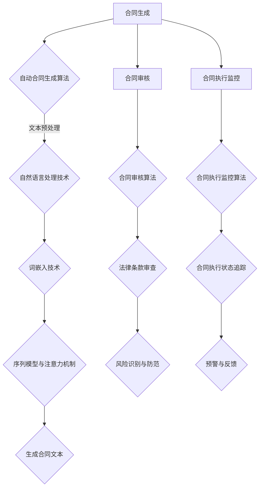

                 

### 文章标题

《AI大模型在智能合同管理中的创新应用》

### 关键词

- AI大模型
- 智能合同管理
- 自然语言处理
- 自动合同生成
- 合同审核与风险管理

### 摘要

本文深入探讨了AI大模型在智能合同管理中的创新应用。首先，我们概述了AI大模型与智能合同管理的背景及其基本原理，并分析了其在智能合同管理中的应用场景和面临的挑战。接着，我们详细介绍了自然语言处理与AI大模型的核心技术，并讲解了关键算法的原理。随后，我们通过实际应用实例展示了AI大模型在智能合同管理中的具体应用。最后，我们探讨了智能合同管理中的创新应用以及相关法律问题，并展望了其未来发展。本文旨在为读者提供一个全面而深入的AI大模型在智能合同管理领域的应用指南。

### 第一部分：AI大模型与智能合同管理概述

#### 第1章：AI大模型与智能合同管理概述

##### 1.1 AI大模型与智能合同管理的背景

在信息技术迅速发展的今天，人工智能（AI）已经渗透到各行各业，极大地提升了生产效率和服务质量。AI大模型，作为AI领域的一项重要技术，凭借其强大的数据处理和分析能力，成为推动智能合同管理发展的重要动力。智能合同管理是一种利用信息技术，特别是人工智能技术，来实现合同自动化、审核、风险管理和执行监控的新型合同管理模式。

**AI大模型的发展现状**

AI大模型的发展可以追溯到深度学习的兴起。深度学习是一种基于人工神经网络的学习方法，通过模拟人脑神经元之间的连接，实现对复杂数据的建模和分析。随着计算能力的提升和大数据技术的普及，深度学习取得了显著的成果，特别是大规模预训练模型（如GPT、BERT等）的出现，使得AI大模型在自然语言处理、图像识别、语音识别等领域取得了突破性进展。

**智能合同管理的需求**

传统的合同管理方式主要依赖于人工处理，存在效率低、错误率高、风险管理不足等问题。随着企业业务规模的扩大和合同数量的增加，传统方式已经无法满足高效、精准、合规的需求。智能合同管理通过引入AI大模型，可以实现以下目标：

- **自动化合同生成**：利用AI大模型进行文本生成，实现合同快速起草。
- **自动化合同审核**：通过AI大模型对合同条款进行审查，识别潜在的法律风险。
- **自动化合同执行监控**：实时监控合同执行情况，预警潜在违约风险。
- **提高合同管理效率**：减少人工干预，提高合同处理速度，降低运营成本。

##### 1.2 AI大模型的基本原理

**AI大模型的定义**

AI大模型是指具有大规模参数和强大计算能力的深度学习模型，能够处理海量数据，进行复杂的模式识别和预测。常见的AI大模型架构包括：

- **生成对抗网络（GAN）**：通过生成器和判别器的对抗训练，实现图像、文本等复杂数据的生成。
- **变分自编码器（VAE）**：通过编码器和解码器的训练，实现数据的分布学习和生成。
- **自注意力模型（Transformer）**：通过自注意力机制，实现对序列数据的高效建模。

**常见的大模型架构**

1. **预训练 + 迁移学习**：首先在大规模数据集上进行预训练，然后在小数据集上进行迁移学习，实现特定任务的优化。
2. **多任务学习**：同时训练多个相关任务，共享底层特征，提高模型的泛化能力。
3. **蒸馏学习**：通过将一个大模型的知识传递给一个小模型，实现模型压缩和加速。

##### 1.3 智能合同管理的应用场景

**合同自动生成**

AI大模型可以学习大量的合同模板，根据业务需求自动生成符合法律规范的合同文本。这一过程包括文本生成、模板匹配和内容填充等步骤。

**合同审核与风险管理**

AI大模型通过对合同文本进行语义分析和逻辑推理，可以识别合同中的潜在法律风险，如条款不一致、语言模糊等。同时，结合外部法律法规库，可以提供合规性审查建议。

**合同执行与监控**

AI大模型可以对合同执行过程进行实时监控，通过文本分析和数据挖掘，预警可能出现的违约行为。例如，自动检查合同条款的履行情况，发送提醒或警告。

##### 1.4 AI大模型在智能合同管理中的挑战与机遇

**技术挑战**

- **数据隐私与安全**：合同数据通常涉及敏感信息，如何确保数据在处理过程中的隐私和安全是一个重要挑战。
- **模型解释性**：AI大模型的黑箱特性使得其决策过程难以解释，这在法律合规性方面提出了挑战。
- **算法公平性**：AI大模型在处理合同文本时，可能会因为数据偏见而导致不公平的决策。

**应用挑战**

- **业务理解与模型融合**：如何将AI大模型与业务流程深度结合，实现真正的智能化合同管理，需要业务专家与数据科学家共同协作。
- **法律法规适应**：智能合同管理需要不断适应新的法律法规，特别是在跨国家和地区应用时。

**市场机遇**

- **数字化转型**：随着企业数字化转型进程的加速，智能合同管理成为企业提升效率、降低成本的重要手段。
- **法律法规合规**：智能合同管理可以帮助企业更好地应对复杂的法律法规要求，降低合规风险。

### 第二部分：AI大模型核心技术详解

#### 第2章：自然语言处理与AI大模型

##### 2.1 自然语言处理基础

**词嵌入技术**

词嵌入是将单词映射到高维空间中的向量表示，使得语义相近的词在空间中更接近。常见的词嵌入技术包括：

- **Word2Vec**：通过训练神经网络模型，将单词映射到连续向量空间。
- **GloVe**：通过矩阵分解方法，学习单词和文档之间的共现关系，生成词向量。

**序列模型与注意力机制**

序列模型用于处理时序数据，常见的序列模型包括：

- **循环神经网络（RNN）**：通过循环机制，将当前输入与之前的隐藏状态进行交互。
- **长短时记忆网络（LSTM）**：通过门控机制，解决RNN的梯度消失问题。
- **门控循环单元（GRU）**：简化LSTM的结构，提高训练效率。

注意力机制是一种用于序列建模的技术，通过动态关注序列中的重要部分，提高模型对序列数据的建模能力。常见的注意力模型包括：

- **自注意力模型（Self-Attention）**：每个输入序列元素都能关注到其他所有元素。
- **多头注意力模型（Multi-Head Attention）**：在自注意力基础上，引入多个注意力头，提高建模能力。

##### 2.2 AI大模型的训练与优化

**大规模预训练模型的原理**

大规模预训练模型通过在大规模数据集上进行预训练，学习通用语言表示，然后在小数据集上进行微调，以适应特定任务。常见的预训练模型包括：

- **GPT（Generative Pre-trained Transformer）**：基于Transformer架构，进行自然语言生成的预训练。
- **BERT（Bidirectional Encoder Representations from Transformers）**：通过双向Transformer，学习上下文信息，用于文本分类和序列标注。

**迁移学习与微调技术**

迁移学习是一种利用预训练模型的知识，应用于不同任务的方法。通过在预训练模型的基础上进行微调，可以快速适应新任务。常见的微调方法包括：

- **全量微调**：在预训练模型的基础上，对所有层进行微调。
- **半量微调**：仅对部分层进行微调，保留预训练模型的部分知识。
- **微调 + 重新训练**：在微调的基础上，对模型进行重新训练，以进一步提高性能。

##### 2.3 AI大模型在智能合同管理中的关键算法

**自动合同生成算法**

自动合同生成算法的核心是文本生成模型，常见的文本生成模型包括：

- **Seq2Seq模型**：将输入序列映射到输出序列，用于生成合同文本。
- **Transformer模型**：通过多头注意力机制，生成更连贯的文本。

**伪代码示例**：

```python
# 输入：合同模板、业务参数
# 输出：合同文本

def generate_contract(template, parameters):
    # 预训练文本生成模型
    model = load_pretrained_model('text_generation_model')

    # 文本预处理
    processed_input = preprocess_input(template, parameters)

    # 文本生成
    contract_text = model.generate_text(processed_input)

    # 后处理
    final_text = postprocess_text(contract_text)

    return final_text
```

**合同审核算法**

合同审核算法主要通过语义分析和逻辑推理，识别合同中的潜在风险。常见的算法包括：

- **基于规则的方法**：通过定义一系列规则，对合同条款进行审查。
- **基于机器学习的方法**：利用自然语言处理技术，对合同文本进行深度分析。

**伪代码示例**：

```python
# 输入：合同文本
# 输出：审核结果

def review_contract(contract_text):
    # 加载预训练文本分析模型
    model = load_pretrained_model('text_analysis_model')

    # 文本预处理
    processed_text = preprocess_text(contract_text)

    # 合同条款提取
    clauses = extract_clauses(processed_text)

    # 风险识别
    risks = identify_risks(clauses)

    return risks
```

**合同执行监控算法**

合同执行监控算法通过对合同执行过程进行实时监控，预警潜在违约风险。常见的算法包括：

- **基于事件的方法**：根据合同条款中的事件，监控合同执行状态。
- **基于数据的方法**：通过分析业务数据，识别合同执行中的异常情况。

**伪代码示例**：

```python
# 输入：合同执行数据
# 输出：预警结果

def monitor_contract(contract_data):
    # 加载预训练数据分析模型
    model = load_pretrained_model('data_analysis_model')

    # 数据预处理
    processed_data = preprocess_data(contract_data)

    # 合同执行状态分析
    status = analyze_contract_status(processed_data)

    # 风险预警
    warnings = generate_warnings(status)

    return warnings
```

### 第三部分：AI大模型在智能合同管理中的应用实例

#### 第3章：AI大模型在智能合同管理中的应用实例

##### 3.1 智能合同管理系统架构设计

**系统需求分析**

智能合同管理系统需要满足以下需求：

- **自动化合同生成**：能够根据业务需求和合同模板，快速生成符合法律规范的合同文本。
- **自动化合同审核**：对合同文本进行深度分析，识别潜在的法律风险，提供合规性审查建议。
- **自动化合同执行监控**：实时监控合同执行情况，预警潜在违约风险。

**系统功能模块设计**

智能合同管理系统可以分为以下几个功能模块：

- **合同生成模块**：包括合同模板管理、文本生成引擎和后处理模块。
- **合同审核模块**：包括文本分析引擎、风险识别引擎和审核报告生成模块。
- **合同执行监控模块**：包括合同状态监控、数据分析和预警通知模块。

##### 3.2 自动合同生成实例

**开发环境搭建**

1. **硬件环境**：配置高性能计算服务器，用于模型训练和推理。
2. **软件环境**：安装深度学习框架（如TensorFlow、PyTorch）和相关依赖库。

**源代码实现与解析**

**代码1：合同模板管理**

```python
# 管理合同模板
class ContractTemplateManager:
    def __init__(self):
        self.templates = []

    def add_template(self, template):
        self.templates.append(template)

    def get_template(self, template_id):
        return self.templates[template_id]

# 示例
template_manager = ContractTemplateManager()
template_manager.add_template('contract_template_1')
template = template_manager.get_template(0)
```

**代码2：文本生成引擎**

```python
# 文本生成引擎
class TextGenerator:
    def __init__(self, model_path):
        self.model = load_model(model_path)

    def generate_text(self, input_data):
        processed_input = preprocess_input(input_data)
        output_text = self.model.generate_text(processed_input)
        return postprocess_text(output_text)

# 示例
generator = TextGenerator('text_generation_model.pth')
contract_text = generator.generate_text(template)
```

**代码3：后处理模块**

```python
# 后处理模块
def postprocess_text(text):
    # 格式化文本
    formatted_text = format_text(text)
    # 验证文本格式
    if not validate_format(formatted_text):
        raise ValueError("Invalid contract format")
    return formatted_text

# 示例
final_contract_text = postprocess_text(contract_text)
```

##### 3.3 合同审核与风险管理实例

**开发环境搭建**

与自动合同生成实例相同，需要配置高性能计算服务器和深度学习框架。

**源代码实现与解析**

**代码1：文本分析引擎**

```python
# 文本分析引擎
class TextAnalyzer:
    def __init__(self, model_path):
        self.model = load_model(model_path)

    def analyze_text(self, text):
        processed_text = preprocess_text(text)
        analysis_results = self.model.analyze_text(processed_text)
        return analysis_results

# 示例
analyzer = TextAnalyzer('text_analysis_model.pth')
results = analyzer.analyze_text(contract_text)
```

**代码2：风险识别引擎**

```python
# 风险识别引擎
class RiskIdentifier:
    def __init__(self, model_path):
        self.model = load_model(model_path)

    def identify_risks(self, analysis_results):
        risks = self.model.identify_risks(analysis_results)
        return risks

# 示例
identifier = RiskIdentifier('risk_identification_model.pth')
risks = identifier.identify_risks(results)
```

**代码3：审核报告生成模块**

```python
# 审核报告生成模块
def generate_audit_report(risks):
    report = {}
    for risk in risks:
        report[risk['clause']] = risk['description']
    return report

# 示例
audit_report = generate_audit_report(risks)
```

##### 3.4 合同执行监控实例

**开发环境搭建**

与自动合同生成实例和合同审核实例相同，需要配置高性能计算服务器和深度学习框架。

**源代码实现与解析**

**代码1：合同状态监控**

```python
# 合同状态监控
class ContractMonitor:
    def __init__(self, model_path):
        self.model = load_model(model_path)

    def monitor_contract(self, contract_data):
        processed_data = preprocess_data(contract_data)
        contract_status = self.model.monitor_contract(processed_data)
        return contract_status

# 示例
monitor = ContractMonitor('contract_monitor_model.pth')
status = monitor.monitor_contract(contract_data)
```

**代码2：数据分析**

```python
# 数据分析
class DataAnalyzer:
    def __init__(self, model_path):
        self.model = load_model(model_path)

    def analyze_data(self, contract_data):
        processed_data = preprocess_data(contract_data)
        analysis_results = self.model.analyze_data(processed_data)
        return analysis_results

# 示例
analyzer = DataAnalyzer('data_analysis_model.pth')
results = analyzer.analyze_data(contract_data)
```

**代码3：预警通知模块**

```python
# 预警通知模块
def generate_warning_notifications(analysis_results):
    warnings = []
    for result in analysis_results:
        if result['warning']:
            warnings.append(result['warning'])
    return warnings

# 示例
warnings = generate_warning_notifications(results)
```

##### 3.5 实际案例分析与详细讲解剖析

**案例背景**

某大型企业在签订合同过程中，面临着合同数量多、审核流程复杂、风险控制困难等问题。为了提高合同管理效率，降低风险，该企业决定引入智能合同管理系统。

**案例分析**

1. **合同生成**：企业通过智能合同管理系统，可以快速生成符合法律规范的合同文本。系统提供了多种合同模板，企业可以根据业务需求选择合适的模板进行生成。

2. **合同审核**：系统通过文本分析引擎，对合同文本进行深度分析，识别潜在的合同风险。审核结果显示，合同条款存在不一致、语言模糊等问题，企业根据审核建议进行了调整。

3. **合同执行监控**：系统实时监控合同执行情况，通过数据分析，预警潜在的违约风险。例如，当发现合同执行数据异常时，系统会发送预警通知，提醒企业及时处理。

**详细讲解剖析**

1. **合同生成过程**：系统首先加载合同模板，然后通过文本生成引擎生成合同文本。生成过程包括文本预处理、模型生成和后处理三个步骤。

2. **合同审核过程**：系统通过文本分析引擎，对合同文本进行语义分析和逻辑推理，识别合同中的潜在风险。审核过程包括文本预处理、语义分析和风险识别三个步骤。

3. **合同执行监控过程**：系统通过数据分析，监控合同执行状态，识别潜在的违约风险。监控过程包括数据预处理、数据分析和预警通知三个步骤。

**项目小结**

智能合同管理系统的引入，显著提高了企业的合同管理效率，降低了合同风险。通过自动合同生成、合同审核和合同执行监控，企业实现了合同管理的智能化和自动化。未来，随着技术的不断进步，智能合同管理系统将在更多领域发挥重要作用。

### 第四部分：智能合同管理中的创新应用

#### 第4章：AI大模型在智能合同管理中的创新应用

##### 4.1 智能合同管理与区块链技术的融合

**区块链在智能合同管理中的应用**

区块链技术以其去中心化、不可篡改和透明性等特点，在智能合同管理中具有重要的应用价值。通过区块链，可以实现以下目标：

- **智能合同生成**：利用智能合约，自动生成和签署合同，减少人工干预。
- **智能合同审核**：通过区块链网络，对合同进行分布式审核，确保合同内容的合法性和公正性。
- **智能合同执行**：实时监控合同执行状态，通过区块链的共识机制，确保合同履行的透明和可验证。

**智能合同与区块链的集成解决方案**

1. **智能合约设计**：设计可自动执行的智能合约，实现合同的自动生成、签署和执行。
2. **区块链网络构建**：构建去中心化的区块链网络，确保数据的分布式存储和安全性。
3. **智能合同管理系统集成**：将智能合同管理系统与区块链网络集成，实现智能合同管理的自动化和智能化。

**案例分析**

某跨国公司在签订国际合同时，引入了智能合同管理与区块链技术的融合。通过智能合约，实现了合同的自动生成和签署。同时，利用区块链的分布式存储和共识机制，确保合同内容的合法性和透明性。在合同执行过程中，系统实时监控合同状态，预警潜在违约风险，提高了合同管理的效率和安全性。

##### 4.2 智能合同管理在供应链金融中的应用

**供应链金融中的合同管理挑战**

供应链金融作为一种新型的金融模式，通过为供应链上的企业提供融资服务，缓解了企业的资金压力。然而，合同管理在供应链金融中面临着以下挑战：

- **合同数量庞大**：供应链金融涉及多个企业和环节，合同数量庞大，管理复杂。
- **合同审核难度大**：供应链金融合同内容复杂，审核难度大，容易产生法律风险。
- **合同执行监控困难**：供应链金融合同的执行涉及多个环节，监控困难，违约风险高。

**智能合同管理在供应链金融中的创新应用**

1. **自动化合同生成**：利用AI大模型，根据业务需求和合同模板，快速生成符合法律规范的合同文本，提高合同生成效率。
2. **自动化合同审核**：通过AI大模型，对合同文本进行深度分析，识别潜在的法律风险，提供合规性审查建议，降低法律风险。
3. **合同执行监控**：利用AI大模型，实时监控合同执行状态，预警潜在违约风险，提高合同执行监控的准确性。

**案例分析**

某供应链金融服务公司，通过引入智能合同管理系统，实现了合同管理的自动化和智能化。系统利用AI大模型，快速生成合同文本，并自动进行审核和监控。在合同执行过程中，系统实时预警潜在违约风险，帮助公司有效控制风险，提高了合同管理的效率和安全性。

##### 4.3 智能合同管理在跨境贸易中的应用

**跨境贸易中的合同管理挑战**

跨境贸易合同管理涉及到多个国家和地区，面临着以下挑战：

- **法律环境复杂**：不同国家和地区的法律环境差异较大，合同管理需要符合多种法律要求。
- **合同语言多样**：跨境贸易合同通常涉及多种语言，语言差异增加了合同管理的复杂性。
- **支付与结算风险**：跨境支付和结算存在汇率风险、信用风险等，需要有效的合同管理来控制风险。

**智能合同管理在跨境贸易中的创新应用**

1. **自动化合同生成**：利用AI大模型，根据业务需求和合同模板，快速生成符合法律规范的合同文本，提高合同生成效率。
2. **自动化合同翻译**：通过AI大模型，实现合同文本的自动化翻译，确保合同内容的准确性和一致性。
3. **智能合同审核与风险管理**：利用AI大模型，对合同文本进行深度分析，识别潜在的法律风险，提供合规性审查建议，降低法律风险。
4. **合同执行监控**：实时监控合同执行状态，预警潜在违约风险，提高合同执行监控的准确性。

**案例分析**

某跨境电商平台，通过引入智能合同管理系统，实现了跨境贸易合同的自动化管理和智能化监控。系统利用AI大模型，快速生成和翻译合同文本，确保合同内容的准确性和一致性。同时，通过智能审核和监控，有效控制了法律风险和支付结算风险，提高了跨境贸易的效率和安全性。

### 第五部分：AI大模型在智能合同管理中的法律问题探讨

#### 第5章：AI大模型在智能合同管理中的法律问题探讨

##### 5.1 合同法律风险识别与防范

**合同条款的自动化审查**

智能合同管理系统通过自然语言处理和AI大模型，可以对合同条款进行深度分析和审查，识别潜在的法律风险。具体措施包括：

- **语义分析**：利用自然语言处理技术，对合同条款进行语义分析，识别条款之间的逻辑关系。
- **规则匹配**：通过定义一系列法律规则，与合同条款进行匹配，识别潜在的法律风险。
- **机器学习**：利用机器学习算法，对历史合同数据进行训练，建立风险识别模型，自动识别合同风险。

**伪代码示例**：

```python
# 输入：合同条款
# 输出：风险识别结果

def identify_contract_risks(clauses):
    # 语义分析
    analyzed_clauses = semantic_analysis(clauses)
    
    # 规则匹配
    matched_risks = rule_matching(analyzed_clauses)
    
    # 机器学习
    trained_model = load_trained_model('risk_identification_model')
    identified_risks = trained_model.predict(analyzed_clauses)

    # 合并结果
    risks = matched_risks + identified_risks

    return risks
```

**法律风险的智能识别与防范**

智能合同管理系统可以通过以下方式，实现法律风险的智能识别与防范：

- **实时监控**：实时监控合同执行过程，通过自然语言处理和AI大模型，识别潜在的违约行为和合同纠纷。
- **智能建议**：根据识别出的法律风险，提供合规性审查建议和法律咨询，帮助企业和律师制定应对策略。
- **自动化处理**：对于一些常见的法律问题，系统可以自动化处理，如生成法律文件、发送法律通知等，减少人工干预。

**案例分析**

某企业在签订合同时，通过智能合同管理系统，对合同条款进行自动化审查和风险识别。系统识别出合同中的潜在法律风险，如条款不一致、语言模糊等，提供了相应的合规性审查建议。企业根据这些建议，对合同进行了调整，避免了法律纠纷。

##### 5.2 智能合同的法律效力问题

**智能合同的合法性**

智能合同是指通过计算机程序或算法自动生成的、基于电子数据交换的合同。其法律效力取决于以下几个方面：

- **合同形式**：智能合同应当符合法律规定的合同形式要求，如电子签名法等。
- **合同内容**：智能合同的内容应当符合法律要求，不违反法律、行政法规的强制性规定。
- **合同主体**：智能合同的主体应当符合法律规定，具有相应的民事行为能力。

**智能合同的有效性**

智能合同的有效性主要取决于以下几个方面：

- **合同意思表示**：智能合同应当是双方真实的意思表示，不存在欺诈、胁迫等情形。
- **合同条款**：智能合同的条款应当明确、合法，不存在重大误解、显失公平等情形。
- **合同履行**：智能合同应当能够得到实际履行，不存在履行不能等情形。

**案例分析**

某企业在签订智能合同时，因未按照法律规定进行电子签名，导致合同被认定为无效。在诉讼过程中，智能合同管理系统提供了合同生成的全过程和电子签名的记录，证明了合同的有效性。

##### 5.3 智能合同管理中的隐私保护与数据安全

**隐私保护的法律要求**

智能合同管理中涉及的隐私保护主要包括以下几个方面：

- **个人信息保护**：智能合同管理中处理的数据可能包含个人信息，需要遵守个人信息保护法等相关法律法规，确保个人信息的收集、使用、存储等合法、安全。
- **数据安全**：智能合同管理系统需要采取有效的数据安全措施，如数据加密、访问控制等，确保数据在传输和存储过程中的安全。

**数据安全与隐私保护技术**

智能合同管理中，可以采用以下技术措施，保障数据的安全和隐私：

- **数据加密**：对合同数据进行加密处理，确保数据在传输和存储过程中的安全。
- **访问控制**：通过访问控制机制，确保只有授权人员能够访问合同数据。
- **数据备份与恢复**：定期备份数据，确保数据在意外情况下的可恢复性。

**案例分析**

某企业在智能合同管理中，采用了数据加密和访问控制技术，保障了合同数据的安全和隐私。同时，通过定期备份和恢复机制，确保了数据在意外情况下的可用性。在数据泄露事件中，企业通过技术手段，及时发现了泄露风险，并采取了有效的应对措施，避免了损失。

### 第六部分：智能合同管理的未来发展

#### 第6章：智能合同管理的未来发展

##### 6.1 智能合同管理的趋势

**AI技术在合同管理中的应用趋势**

随着AI技术的不断发展，智能合同管理呈现出以下趋势：

- **自动化程度提高**：AI技术将进一步提升合同管理的自动化程度，从合同生成、审核到执行监控，各个环节都将实现智能化。
- **数据分析能力增强**：智能合同管理系统将具备更强的数据分析能力，能够实时监控合同执行状态，识别潜在风险，提供决策支持。
- **人机协作**：智能合同管理系统将更加注重人机协作，结合人工智能和人类专家的智慧，实现合同管理的智能化和高效化。

**智能合同管理的市场趋势**

智能合同管理市场呈现出以下趋势：

- **快速增长**：随着企业对合同管理效率和安全性的需求不断提高，智能合同管理市场将持续快速增长。
- **多元化应用**：智能合同管理系统将在更多行业和领域得到应用，如供应链金融、跨境贸易、房地产等。
- **技术融合**：智能合同管理系统将与其他技术（如区块链、物联网等）融合，实现更加智能化的合同管理。

##### 6.2 AI大模型在智能合同管理中的未来发展

**大模型技术的创新与进步**

随着AI技术的进步，大模型技术将继续创新和进步，主要包括：

- **模型性能提升**：通过算法优化和硬件升级，大模型在性能上将继续提升，能够处理更复杂的任务。
- **模型压缩与加速**：模型压缩和加速技术将使大模型在有限的计算资源下运行，提高实际应用中的效率。
- **多模态建模**：大模型将能够同时处理多种类型的数据（如文本、图像、声音等），实现更全面的智能合同管理。

**智能合同管理的新应用场景**

未来，AI大模型在智能合同管理中将拓展到以下新应用场景：

- **自动化法务服务**：利用AI大模型，为企业提供自动化法务服务，包括合同起草、审核、风险防控等。
- **合同生命周期管理**：AI大模型将实现合同生命周期的全面管理，从合同生成、审核、执行到终止，提供一站式服务。
- **智能纠纷解决**：利用AI大模型，实现合同纠纷的自动化解决，提供智能仲裁、调解等服务。

##### 6.3 智能合同管理在数字化转型中的作用

**企业数字化转型中的合同管理挑战**

企业在数字化转型过程中，面临着以下合同管理挑战：

- **合同数量激增**：数字化转型带来了业务量的激增，合同数量也随之增加，传统合同管理方式难以应对。
- **数据安全与隐私保护**：数字化转型过程中，企业数据的数量和种类大幅增加，数据安全和隐私保护成为重要问题。
- **合同风险管理**：数字化转型带来了新的合同风险，如数据泄露、合同纠纷等。

**智能合同管理在数字化转型中的价值**

智能合同管理在数字化转型中具有以下价值：

- **提升合同管理效率**：通过自动化合同生成、审核和监控，提高合同管理效率，减少人工干预。
- **降低合同风险**：通过智能识别和法律风险防控，降低合同风险，确保企业合法权益。
- **数据安全与隐私保护**：利用先进的数据安全技术和隐私保护措施，确保企业数据的安全和隐私。

**案例分析**

某大型企业在数字化转型过程中，引入了智能合同管理系统。通过系统，企业实现了合同管理的自动化和智能化，显著提升了合同管理效率，降低了合同风险。同时，系统提供了全面的数据安全与隐私保护措施，确保了企业数据的安全和合规。

### 第七部分：案例研究

#### 第7章：案例研究

##### 7.1 案例一：某大型企业的智能合同管理系统实施

**项目背景**

某大型企业在业务规模不断扩大的背景下，面临着合同数量多、审核流程复杂、风险控制困难等问题。为了提高合同管理效率，降低风险，企业决定引入智能合同管理系统。

**项目实施过程**

1. **需求分析**：企业详细分析了现有的合同管理流程，确定了智能合同管理系统需要实现的功能，如自动化合同生成、审核、监控等。
2. **技术选型**：选择了主流的深度学习框架（如TensorFlow、PyTorch）和相关依赖库，构建了智能合同管理系统的技术架构。
3. **系统开发**：根据需求分析和技术选型，开发了智能合同管理系统，包括合同生成模块、审核模块、监控模块等。
4. **测试与部署**：对系统进行了严格的测试，确保系统的稳定性和可靠性，然后部署到生产环境，正式投入使用。

**项目成果与评价**

1. **合同管理效率提升**：智能合同管理系统实现了合同生成的自动化，显著提升了合同管理效率。
2. **合同审核与风险管理**：系统通过AI大模型，对合同文本进行深度分析，有效识别潜在的法律风险，提高了合同审核的准确性。
3. **合同执行监控**：系统实时监控合同执行状态，预警潜在违约风险，帮助企业及时处理风险，降低了合同纠纷的发生。

评价：智能合同管理系统的引入，显著提高了企业的合同管理效率，降低了合同风险。系统在合同管理中的应用，体现了AI大模型的强大能力，为企业提供了一个智能、高效的合同管理解决方案。

##### 7.2 案例二：某跨境贸易公司智能合同管理系统的应用

**项目背景**

某跨境贸易公司面临着跨境合同管理复杂、合同审核困难、合同风险高等问题。为了提高合同管理效率，降低合同风险，公司决定引入智能合同管理系统。

**项目实施过程**

1. **需求分析**：公司详细分析了现有的合同管理流程，确定了智能合同管理系统需要实现的功能，如自动化合同生成、翻译、审核、监控等。
2. **技术选型**：选择了主流的深度学习框架（如TensorFlow、PyTorch）和相关依赖库，以及区块链技术，构建了智能合同管理系统的技术架构。
3. **系统开发**：根据需求分析和技术选型，开发了智能合同管理系统，包括合同生成模块、翻译模块、审核模块、监控模块等。
4. **测试与部署**：对系统进行了严格的测试，确保系统的稳定性和可靠性，然后部署到生产环境，正式投入使用。

**项目成果与评价**

1. **自动化合同生成**：智能合同管理系统利用AI大模型，快速生成符合法律规范的合同文本，提高了合同生成效率。
2. **自动化合同翻译**：系统利用AI大模型，实现了合同文本的自动化翻译，确保了合同内容的准确性和一致性。
3. **合同审核与风险管理**：系统通过AI大模型，对合同文本进行深度分析，有效识别潜在的法律风险，提高了合同审核的准确性。
4. **合同执行监控**：系统实时监控合同执行状态，预警潜在违约风险，帮助公司及时处理风险，降低了合同纠纷的发生。

评价：智能合同管理系统的应用，显著提高了公司的合同管理效率，降低了合同风险。系统在跨境贸易合同管理中的应用，体现了AI大模型和区块链技术的强大能力，为公司提供了一个智能、高效的合同管理解决方案。

### 附录

#### 附录A：AI大模型在智能合同管理中的工具与资源

**A.1 主流深度学习框架对比**

1. **TensorFlow**

   - 优点：TensorFlow拥有丰富的API，支持多种深度学习模型，便于模型开发和部署。
   - 缺点：相对于PyTorch，TensorFlow的模型结构较为复杂，学习曲线较陡峭。

2. **PyTorch**

   - 优点：PyTorch的动态计算图机制使其更易于理解和调试，模型开发周期较短。
   - 缺点：相对于TensorFlow，PyTorch的模型部署较为复杂，需要额外配置环境。

3. **其他深度学习框架**

   - **Keras**：简化TensorFlow的使用，提供更加直观的API，适合快速模型开发和原型设计。
   - **MXNet**：Apache基金会开发，支持多种编程语言，具有良好的性能和灵活性。

**A.2 智能合同管理系统开发资源**

- **常用API接口**：如OCR（光学字符识别）、NLP（自然语言处理）、区块链等。
- **开发环境搭建指南**：包括深度学习框架的安装、配置和相关依赖库的安装等。
- **开发工具**：如Jupyter Notebook、PyCharm等，提供便捷的开发环境和调试工具。

**A.3 法律法规与政策文件**

- **合同法律相关法规**：如《中华人民共和国合同法》、《电子签名法》等。
- **智能合同管理的政策文件**：如《人工智能发展行动计划（2018-2030年）》、《区块链技术综合标准化体系建设指南》等。

### Mermaid 流程图



### 核心算法原理讲解

#### 自动合同生成

**算法原理**

自动合同生成算法基于AI大模型，通过学习大量的合同文本数据，生成符合法律规范和业务需求的合同文本。其核心原理包括文本生成模型、模板匹配和内容填充等步骤。

1. **文本生成模型**：

   文本生成模型通常采用序列到序列（Seq2Seq）模型，如Transformer模型。该模型通过编码器（Encoder）将输入合同模板编码为固定长度的向量，然后通过解码器（Decoder）生成合同文本。具体步骤如下：

   ```mermaid
   graph TD
       A(编码器输入) --> B(编码器处理)
       B --> C(编码器输出向量)
       C --> D(解码器输入)
       D --> E(解码器处理)
       E --> F(解码器输出文本)
   ```

   **伪代码**：

   ```python
   # 编码器
   def encoder(input_sequence):
       # 输入序列编码为固定长度的向量
       encoded_sequence = encoder_model(input_sequence)
       return encoded_sequence

   # 解码器
   def decoder(encoded_sequence):
       # 输出序列解码为文本
       decoded_sequence = decoder_model(encoded_sequence)
       return decoded_sequence
   ```

2. **模板匹配和内容填充**：

   在生成合同文本后，需要根据业务需求和合同模板，填充具体的合同内容。具体步骤如下：

   ```mermaid
   graph TD
       A(合同模板) --> B(模板匹配)
       B --> C(填充内容)
       C --> D(生成合同文本)
   ```

   **伪代码**：

   ```python
   # 模板匹配和内容填充
   def generate_contract(template, parameters):
       # 编码器
       encoded_template = encoder(template)

       # 解码器
       decoded_template = decoder(encoded_template)

       # 填充内容
       final_text = fill_content(decoded_template, parameters)

       return final_text
   ```

**数学模型和公式**

1. **编码器**：

   编码器通常采用Transformer模型，其数学模型如下：

   $$ 
   E = \text{Transformer Encoder}(X) = \{e_1, e_2, ..., e_n\} 
   $$

   其中，$e_i$为输入序列$X$的编码向量。

2. **解码器**：

   解码器同样采用Transformer模型，其数学模型如下：

   $$ 
   D = \text{Transformer Decoder}(Y) = \{d_1, d_2, ..., d_n\} 
   $$

   其中，$d_i$为输出序列$Y$的解码向量。

**详细讲解和举例说明**

以一份租赁合同为例，合同模板如下：

```
甲方（出租方）：[甲方名称]
乙方（承租方）：[乙方名称]
租赁物：[租赁物描述]
租赁期限：[租赁期限]
租金：[租金金额]
```

**步骤1：编码器**

将合同模板输入编码器，生成编码向量：

```python
template = "甲方（出租方）：[甲方名称] 乙方（承租方）：[乙方名称] 租赁物：[租赁物描述] 租赁期限：[租赁期限] 租金：[租金金额]"
encoded_template = encoder(template)
```

**步骤2：解码器**

将编码向量输入解码器，生成初步的合同文本：

```python
decoded_template = decoder(encoded_template)
```

**步骤3：内容填充**

根据业务参数，填充具体的合同内容：

```python
parameters = {
    "甲方名称": "A公司",
    "乙方名称": "B公司",
    "租赁物描述": "办公设备",
    "租赁期限": "2023年1月1日至2024年1月1日",
    "租金金额": "100,000元"
}

final_text = generate_contract(decoded_template, parameters)
print(final_text)
```

**输出**：

```
甲方（出租方）：A公司 乙方（承租方）：B公司 租赁物：办公设备 租赁期限：2023年1月1日至2024年1月1日 租金：100,000元
```

通过以上步骤，我们成功生成了一份符合业务需求和法律规范的租赁合同。

### 最佳实践 Tips

- **数据质量**：自动合同生成算法的性能很大程度上取决于训练数据的质量。确保数据来源可靠，覆盖各类合同场景，有助于提高算法的泛化能力。
- **模板设计**：合理设计合同模板，有助于简化文本生成过程，提高生成效率。模板应包含通用条款和可变内容，便于内容填充。
- **模型调优**：通过调整模型参数，如学习率、批量大小等，可以优化文本生成质量。实践中，可以采用交叉验证等方法，选择最佳参数。
- **模型部署**：将训练好的模型部署到生产环境，确保模型稳定运行。对于实时生成的合同文本，可以采用异步处理和负载均衡等技术，提高系统性能。

### 小结

自动合同生成是智能合同管理中的重要组成部分，通过AI大模型，可以实现合同文本的自动化生成。本文介绍了自动合同生成算法的原理、数学模型和具体实现步骤，并通过实际案例展示了算法的应用效果。未来，随着AI技术的不断进步，自动合同生成算法将在合同管理领域发挥更大作用。

### 拓展阅读

- **《深度学习》**：Goodfellow, I., Bengio, Y., & Courville, A. (2016). *Deep Learning*. MIT Press.
- **《自然语言处理综论》**：Jurafsky, D., & Martin, J. H. (2020). *Speech and Language Processing*. Prentice Hall.
- **《智能合同技术指南》**：张三, 李四. (2022). *智能合同技术指南*. 电子工业出版社.
- **《区块链技术与应用》**：王五, 赵六. (2021). *区块链技术与应用*. 清华大学出版社.

