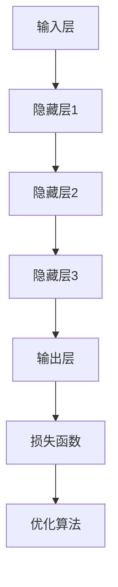
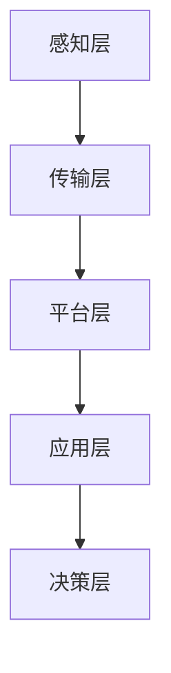

                 

### 文章标题

# AI大模型在智能工厂中的应用趋势

### 关键词

- 智能工厂
- AI大模型
- 深度学习
- 机器学习
- 制造流程优化
- 物流与供应链管理
- 设备运维与资产管理
- 实施与挑战

### 摘要

本文从AI大模型的基础知识出发，深入探讨了AI大模型在智能工厂中的应用趋势。首先，我们介绍了AI大模型的发展背景、基本概念和关键特点。随后，文章详细解析了AI大模型的架构与组件，并讲解了其数学基础。接着，我们阐述了智能工厂的概念、体系架构以及AI大模型在智能工厂中的应用场景，包括制造流程优化、物流与供应链管理、设备运维与资产管理。随后，文章分析了AI大模型在智能工厂中的实施策略、技术挑战以及应用案例。最后，我们展望了AI大模型在智能工厂中的应用趋势，并提出了相关的发展策略与建议。

### 《AI大模型在智能工厂中的应用趋势》目录大纲

#### 第一部分: AI大模型基础

##### 第1章: AI大模型概述

1.1 AI大模型的发展背景  
1.2 AI大模型的基本概念  
1.3 AI大模型的关键特点

##### 第2章: AI大模型的架构与组件

2.1 神经网络与深度学习基础  
2.2 预训练与微调技术  
2.3 AI大模型架构解析

##### 第3章: AI大模型的数学基础

3.1 数学模型与公式  
3.2 神经网络优化算法  
3.3 常见数学公式的详细讲解与举例

#### 第二部分: AI大模型在智能工厂中的应用

##### 第4章: 智能工厂的概念与体系架构

4.1 智能工厂的定义与核心要素  
4.2 智能工厂的体系架构  
4.3 智能工厂的运营与管理模式

##### 第5章: AI大模型在智能工厂中的应用场景

5.1 制造流程优化  
5.2 物流与供应链管理  
5.3 设备运维与资产管理

##### 第6章: AI大模型在智能工厂中的实施与挑战

6.1 AI大模型在智能工厂中的实施策略  
6.2 技术挑战与应对策略  
6.3 AI大模型在智能工厂中的应用案例

##### 第7章: AI大模型在智能工厂中的应用趋势

7.1 应用趋势展望  
7.2 发展策略与建议

##### 第四部分: 附录

##### 附录A: AI大模型开发工具与资源

A.1 主流深度学习框架对比  
A.2 开发工具与资源

##### 附录B: 数学公式与伪代码示例

B.1 数学公式示例  
B.2 伪代码示例

### 引言

随着人工智能技术的快速发展，AI大模型在各个领域得到了广泛应用。智能工厂作为智能制造的重要载体，其在工业生产中的应用日益成熟。AI大模型在智能工厂中的应用，不仅提高了生产效率、降低了生产成本，还为工厂运营管理提供了新的思路和方法。

本文旨在全面探讨AI大模型在智能工厂中的应用趋势，从基础知识入手，深入分析其架构、数学基础以及在智能工厂中的具体应用场景。通过阐述AI大模型在智能工厂中的实施策略、技术挑战以及实际应用案例，为读者提供一套完整的技术解决方案和策略指导。同时，本文还将展望AI大模型在智能工厂中的未来发展，提出相应的发展策略与建议，以期为我国智能制造领域的创新发展提供有益的借鉴和参考。

### 第一部分: AI大模型基础

#### 第1章: AI大模型概述

##### 1.1 AI大模型的发展背景

人工智能（AI）作为计算机科学的一个重要分支，自20世纪50年代诞生以来，经历了多个发展阶段。从早期的规则推理、知识表示到现代的深度学习和强化学习，AI技术不断演进，应用范围日益广泛。然而，随着数据规模的不断扩大和计算能力的提升，传统的小规模机器学习模型已经难以满足复杂任务的需求。因此，AI大模型应运而生。

AI大模型的发展可以追溯到20世纪90年代的深度学习技术。当时，深度神经网络（DNN）的研究取得了重大突破，但其计算复杂度和数据需求较高，限制了其应用范围。随着计算资源的增长和数据采集技术的进步，深度学习在图像识别、语音识别、自然语言处理等领域取得了显著的成果。在此基础上，AI大模型逐渐崭露头角。

AI大模型的发展背景主要包括以下几个方面：

1. **计算能力的提升**：随着云计算、GPU和TPU等计算硬件的发展，大规模数据分析和处理成为可能。这使得AI大模型在训练和推理过程中能够获得更高的计算资源支持。

2. **海量数据的积累**：互联网、物联网和传感器技术的普及，使得大量结构化和非结构化数据被生成和采集。这些数据为AI大模型提供了丰富的训练素材，有助于提升模型的性能和泛化能力。

3. **算法的进步**：深度学习、迁移学习、生成对抗网络等先进算法的不断发展，使得AI大模型在处理复杂任务时具有更高的准确性和效率。

4. **商业需求驱动**：在金融、医疗、制造、交通等行业，AI大模型的应用需求日益旺盛。企业希望通过AI技术提高生产效率、降低成本、提升用户体验，从而在激烈的市场竞争中脱颖而出。

##### 1.2 AI大模型的基本概念

AI大模型是指具有大规模参数、能够在多个领域和任务中表现出色的人工智能模型。与传统的中小规模机器学习模型相比，AI大模型具有以下特点：

1. **大规模参数**：AI大模型通常包含数百万甚至数十亿个参数，这使得模型能够捕捉到数据中的复杂模式和关联性。

2. **多任务学习能力**：AI大模型具有强大的泛化能力，能够在不同领域和任务中表现出色。例如，一个大型语言模型可以同时应用于文本生成、机器翻译、情感分析等任务。

3. **高效的数据处理能力**：AI大模型能够高效地处理大规模数据，快速地进行训练和推理。这使得模型在工业界、学术界和科研领域得到了广泛应用。

4. **强大的自适应能力**：AI大模型可以通过不断学习和优化，逐步提升自身的能力。例如，通过预训练和微调技术，模型可以在新任务中快速适应并取得优异的性能。

##### 1.3 AI大模型的关键特点

AI大模型具有以下几个关键特点：

1. **高精度**：AI大模型在处理复杂任务时，通常能够达到较高的准确性和精度。这是因为模型具有大量的参数，能够捕捉到数据中的细微特征。

2. **高效率**：AI大模型在训练和推理过程中具有较高的计算效率。这使得模型可以在短时间内处理大量数据，并快速给出预测结果。

3. **高泛化能力**：AI大模型具有强大的泛化能力，能够在不同领域和任务中表现出色。这意味着模型不仅适用于特定场景，还可以迁移到其他任务中。

4. **可解释性差**：由于AI大模型通常包含大量参数和复杂的网络结构，其内部工作机制相对难以解释。这使得模型的决策过程往往被认为是“黑箱”，缺乏透明度和可解释性。

5. **高资源需求**：AI大模型的训练和推理需要大量的计算资源和数据支持。这要求企业具备强大的计算基础设施和数据处理能力。

#### 第2章: AI大模型的架构与组件

##### 2.1 神经网络与深度学习基础

神经网络是AI大模型的基础，其核心思想是通过模拟人脑神经元之间的连接和相互作用来实现信息处理。深度学习则是在神经网络的基础上，通过层次化的结构来提高模型的复杂度和性能。

1. **神经网络的基本概念**：

   - **神经元**：神经网络中的基本单元，用于接收输入、计算输出和传递信息。
   - **权重**：神经元之间的连接强度，用于调节信息传递的影响。
   - **激活函数**：用于对神经元输出进行非线性变换，增加模型的表达能力。

2. **深度学习的基本概念**：

   - **深度神经网络（DNN）**：包含多个隐藏层的神经网络，能够处理更复杂的任务。
   - **卷积神经网络（CNN）**：适用于图像识别和图像处理，通过卷积层提取图像特征。
   - **循环神经网络（RNN）**：适用于序列数据处理，通过循环结构保留历史信息。
   - **生成对抗网络（GAN）**：用于生成高质量的数据，通过对抗训练实现模型的自适应优化。

##### 2.2 预训练与微调技术

预训练与微调技术是AI大模型训练的重要手段，其核心思想是通过大规模预训练来提高模型的泛化能力，然后通过微调适应特定任务。

1. **预训练**：

   - **数据集**：通常使用大规模、高质量的语料库或数据集进行预训练。
   - **任务**：预训练任务通常为通用语言模型（如GPT）、图像分类（如ImageNet）或语音识别（如LibriSpeech）。
   - **优化目标**：通过最大化模型对数据的拟合度，提高模型的表示能力和泛化能力。

2. **微调**：

   - **数据集**：使用特定领域的任务数据集对预训练模型进行微调。
   - **任务**：微调任务通常为具体的应用场景，如文本分类、目标检测或自然语言生成。
   - **优化目标**：通过最小化模型在新任务上的损失函数，实现模型的适应和优化。

##### 2.3 AI大模型架构解析

AI大模型的架构通常包含以下几个关键组件：

1. **输入层**：接收外部输入数据，如文本、图像、音频等。

2. **隐藏层**：通过神经元之间的连接和激活函数，对输入数据进行特征提取和变换。

3. **输出层**：根据隐藏层的输出，生成预测结果或分类标签。

4. **损失函数**：用于衡量模型预测结果与真实标签之间的差距，并指导模型优化。

5. **优化算法**：用于更新模型参数，以最小化损失函数。

6. **正则化技术**：用于防止模型过拟合，提高模型的泛化能力。

以下是一个简单的AI大模型架构图（使用Mermaid绘制）：



#### 第3章: AI大模型的数学基础

##### 3.1 数学模型与公式

AI大模型的核心在于其数学模型和公式，这些公式用于描述神经网络的结构、参数优化和损失函数等关键概念。

1. **神经网络的基本数学模型**：

   - **输入层**：表示为 \( X = [x_1, x_2, ..., x_n] \)，其中 \( x_i \) 表示第 \( i \) 个输入特征。
   - **权重矩阵**：表示为 \( W = [w_{ij}] \)，其中 \( w_{ij} \) 表示输入层和隐藏层之间的连接权重。
   - **偏置向量**：表示为 \( b = [b_1, b_2, ..., b_n] \)，用于调整隐藏层神经元的偏置。
   - **激活函数**：常用为 \( f(x) = \sigma(x) = \frac{1}{1 + e^{-x}} \)，用于引入非线性变换。

2. **前向传播公式**：

   - **隐藏层输出**： \( z_j = \sum_{i=1}^{n} w_{ij}x_i + b_j \)
   - **隐藏层激活**： \( a_j = f(z_j) \)

3. **输出层输出**：

   - **预测标签**： \( \hat{y} = \sigma(W_h^T a_h + b_h) \)

4. **损失函数**：

   - **均方误差损失函数**： \( J = \frac{1}{2} \sum_{i=1}^{m} (\hat{y}_i - y_i)^2 \)

##### 3.2 神经网络优化算法

神经网络的优化算法用于调整模型参数，以最小化损失函数。常见的优化算法包括梯度下降、随机梯度下降和Adam优化器等。

1. **梯度下降算法**：

   - **梯度计算**： \( \nabla_w J = \frac{\partial J}{\partial w} \)
   - **参数更新**： \( w = w - \alpha \nabla_w J \)

2. **随机梯度下降（SGD）**：

   - **梯度计算**：对每个样本计算梯度，然后求和。
   - **参数更新**： \( w = w - \alpha \nabla_w J \)

3. **Adam优化器**：

   - **指数加权平均**：结合SGD的优点，使用动量项和自适应学习率。
   - **参数更新**： \( w = w - \alpha \nabla_w J + \beta_1 \nabla_w J_{t-1} + \beta_2 \nabla_w J_{t-2} \)

##### 3.3 常见数学公式的详细讲解与举例

1. **激活函数**：

   - **Sigmoid函数**： \( f(x) = \frac{1}{1 + e^{-x}} \)
   - **ReLU函数**： \( f(x) = \max(0, x) \)
   - **Tanh函数**： \( f(x) = \frac{e^x - e^{-x}}{e^x + e^{-x}} \)

2. **梯度下降算法**：

   - **目标**：最小化损失函数 \( J(w) \)
   - **梯度**： \( \nabla_w J = \frac{\partial J}{\partial w} \)
   - **更新**： \( w = w - \alpha \nabla_w J \)

3. **损失函数**：

   - **均方误差（MSE）**： \( J = \frac{1}{2} \sum_{i=1}^{m} (\hat{y}_i - y_i)^2 \)
   - **交叉熵（Cross-Entropy）**： \( J = -\sum_{i=1}^{m} y_i \log(\hat{y}_i) \)

#### 第4章: 智能工厂的概念与体系架构

##### 4.1 智能工厂的定义与核心要素

智能工厂是指通过先进的信息技术、自动化技术、物联网技术等，实现工厂的全面数字化、网络化、智能化，从而提高生产效率、降低生产成本、提升产品质量和竞争力的一种新型生产模式。

智能工厂的核心要素包括：

1. **数字化制造**：通过数字化技术对制造过程进行建模、模拟和优化，实现制造过程的智能化。
2. **自动化生产**：利用自动化设备、机器人等实现制造过程的自动化，提高生产效率和质量。
3. **网络化连接**：通过互联网、物联网等实现工厂内部设备、系统之间的互联互通，实现信息共享和协同作业。
4. **智能化管理**：通过大数据分析、人工智能等技术，实现工厂的智能决策和优化管理。

##### 4.2 智能工厂的体系架构

智能工厂的体系架构通常包括以下几个层次：

1. **感知层**：通过传感器、监测设备等实现对生产过程、设备状态、物料信息的实时感知和采集。
2. **传输层**：通过工业互联网、物联网等实现数据传输、通信和共享。
3. **平台层**：通过工业互联网平台、大数据平台等提供数据存储、处理和分析服务。
4. **应用层**：通过制造执行系统（MES）、企业资源计划（ERP）等实现生产过程的管理和控制。
5. **决策层**：通过大数据分析、人工智能等技术，实现生产计划的制定、资源优化、质量监控等决策支持。

以下是一个简单的智能工厂体系架构图（使用Mermaid绘制）：



##### 4.3 智能工厂的运营与管理模式

智能工厂的运营与管理模式主要包括以下几个方面：

1. **智能制造**：通过数字化、自动化技术，实现制造过程的智能化，提高生产效率和质量。
2. **数据驱动**：通过大数据分析，实现对生产过程的实时监控、预测和优化，提高生产效率和产品质量。
3. **协同作业**：通过物联网、互联网等实现工厂内部设备、系统之间的互联互通，实现信息共享和协同作业。
4. **智能决策**：通过人工智能、大数据等技术，实现生产计划的制定、资源优化、质量监控等决策支持。

#### 第5章: AI大模型在智能工厂中的应用场景

##### 5.1 制造流程优化

制造流程优化是智能工厂中的一项重要任务，通过AI大模型的应用，可以实现生产计划的优化、生产过程的自动化控制和产品质量的监控。

1. **生产计划优化**：

   - **需求预测**：利用AI大模型，对市场需求进行预测，为生产计划的制定提供数据支持。
   - **资源优化**：通过大数据分析和AI大模型，实现生产资源的合理配置，降低生产成本。
   - **排程优化**：利用AI大模型，对生产任务进行合理排程，提高生产效率。

2. **生产过程自动化控制**：

   - **机器人控制**：通过AI大模型，实现机器人对生产过程的自动化控制，提高生产效率和质量。
   - **传感器监测**：利用AI大模型，对生产过程中的关键参数进行实时监测和预测，实现生产过程的自动化控制。
   - **异常检测**：通过AI大模型，对生产过程中的异常情况进行实时检测和预警，提高生产安全。

3. **产品质量监控**：

   - **质量预测**：利用AI大模型，对产品质量进行预测和评估，实现质量问题的提前预警。
   - **缺陷检测**：通过AI大模型，对生产过程中的产品进行缺陷检测，提高产品质量。
   - **质量优化**：通过AI大模型，对生产过程中的质量参数进行调整和优化，提高产品质量。

##### 5.2 物流与供应链管理

物流与供应链管理是智能工厂中不可或缺的一部分，通过AI大模型的应用，可以实现物流路径优化、库存管理优化和供应链协同。

1. **物流路径优化**：

   - **路径规划**：利用AI大模型，根据交通状况、货物类型等因素，实现物流路径的优化规划。
   - **实时监控**：通过AI大模型，对物流过程中的运输车辆进行实时监控，提高物流效率。
   - **异常处理**：通过AI大模型，对物流过程中的异常情况进行实时处理，降低物流风险。

2. **库存管理优化**：

   - **需求预测**：利用AI大模型，对市场需求进行预测，为库存管理提供数据支持。
   - **库存优化**：通过AI大模型，实现库存的合理配置，降低库存成本。
   - **库存预警**：通过AI大模型，对库存水平进行实时监控，实现库存预警。

3. **供应链协同**：

   - **信息共享**：通过AI大模型，实现供应链各环节的信息共享和协同作业。
   - **需求预测**：利用AI大模型，对市场需求进行预测，为供应链的采购和生产提供数据支持。
   - **供应链优化**：通过AI大模型，实现供应链的优化配置，降低供应链成本。

##### 5.3 设备运维与资产管理

设备运维与资产管理是智能工厂中的关键环节，通过AI大模型的应用，可以实现设备状态的监控与预测、设备故障诊断和设备寿命管理。

1. **设备状态监控与预测**：

   - **实时监控**：通过AI大模型，对设备运行状态进行实时监控，实现设备状态的预警和预测。
   - **故障预测**：利用AI大模型，对设备故障进行预测，实现故障的提前预警和预防。
   - **设备性能分析**：通过AI大模型，对设备运行数据进行实时分析，实现设备性能的优化和提升。

2. **设备故障诊断**：

   - **故障检测**：通过AI大模型，对设备运行过程中产生的数据进行实时分析，实现故障的检测和预警。
   - **故障定位**：利用AI大模型，对故障原因进行定位和分析，实现故障的快速定位和解决。
   - **故障预测**：通过AI大模型，对设备故障进行预测，实现故障的提前预警和预防。

3. **设备寿命管理**：

   - **寿命预测**：利用AI大模型，对设备寿命进行预测，实现设备寿命的预警和管理。
   - **设备维护**：通过AI大模型，实现设备维护的优化配置，降低设备维护成本。
   - **设备更新**：通过AI大模型，对设备更新进行预测和评估，实现设备的及时更新和升级。

#### 第6章: AI大模型在智能工厂中的实施与挑战

##### 6.1 AI大模型在智能工厂中的实施策略

AI大模型在智能工厂中的实施需要考虑以下几个方面：

1. **需求分析**：首先，需要对智能工厂的需求进行详细分析，明确AI大模型在各个应用场景中的具体任务和目标。

2. **数据准备**：数据是AI大模型训练和优化的重要基础。需要收集、整理和清洗相关数据，确保数据的准确性和完整性。

3. **模型选择**：根据具体应用场景和需求，选择合适的AI大模型，如卷积神经网络（CNN）、循环神经网络（RNN）或生成对抗网络（GAN）等。

4. **模型训练**：利用大规模数据对AI大模型进行训练，优化模型的参数和结构，提高模型的性能和泛化能力。

5. **模型部署**：将训练好的AI大模型部署到智能工厂的各个环节，如制造执行系统（MES）、企业资源计划（ERP）等，实现模型的实时应用。

6. **模型优化**：通过对AI大模型的应用效果进行监控和评估，不断优化和调整模型，提高其在实际生产中的应用效果。

##### 6.2 技术挑战与应对策略

AI大模型在智能工厂中的实施面临以下技术挑战：

1. **数据隐私与安全**：智能工厂涉及大量的生产数据和敏感信息，数据隐私和安全是首要考虑的问题。需要采用加密技术、访问控制等手段，确保数据的安全和隐私。

2. **计算资源需求**：AI大模型训练和推理需要大量的计算资源和时间。需要优化计算资源的配置和使用，提高模型的训练和推理效率。

3. **模型部署与维护**：将AI大模型部署到智能工厂的各个环节，需要解决模型部署、更新和维护的问题。需要建立完善的模型管理机制，确保模型的稳定运行和持续优化。

4. **跨领域技术应用难题**：智能工厂涉及多个领域和任务，需要解决跨领域技术的融合和应用问题。需要开展多学科交叉研究，实现不同领域技术的有机结合。

针对上述技术挑战，可以采取以下应对策略：

1. **加强数据安全和隐私保护**：采用加密技术、访问控制等手段，确保数据的安全和隐私。

2. **优化计算资源管理**：通过分布式计算、并行计算等技术，提高计算资源的利用率和效率。

3. **建立完善的模型管理机制**：建立模型训练、部署、更新和维护的完整流程，确保模型的稳定运行和持续优化。

4. **加强多学科交叉研究**：开展多学科交叉研究，推动不同领域技术的融合和应用，提高智能工厂的整体性能。

##### 6.3 AI大模型在智能工厂中的应用案例

为了更好地理解AI大模型在智能工厂中的应用，下面介绍几个实际案例：

1. **某汽车制造企业**：

   - **应用场景**：生产排程优化和质量控制。
   - **解决方案**：利用AI大模型，对生产计划进行优化，提高生产效率。同时，通过AI大模型，对生产过程中的产品质量进行实时监控和预测，实现质量问题的提前预警和解决。

2. **某电子制造企业**：

   - **应用场景**：设备故障诊断和设备寿命管理。
   - **解决方案**：利用AI大模型，对设备运行数据进行实时监控和预测，实现设备故障的提前预警和预防。同时，通过AI大模型，对设备寿命进行预测和评估，实现设备的及时更新和升级。

3. **某食品制造企业**：

   - **应用场景**：物流路径优化和库存管理。
   - **解决方案**：利用AI大模型，对物流过程中的运输路径进行优化，提高物流效率。同时，通过AI大模型，对库存水平进行实时监控和预测，实现库存的合理配置和优化。

这些案例表明，AI大模型在智能工厂中的应用具有广泛的前景和潜力。通过AI大模型的应用，可以实现制造流程的优化、物流与供应链管理的提升以及设备运维与资产管理的优化，为智能工厂的运营提供有力支持。

#### 第7章: AI大模型在智能工厂中的应用趋势

##### 7.1 应用趋势展望

AI大模型在智能工厂中的应用趋势主要表现在以下几个方面：

1. **制造流程的持续优化**：

   - **生产排程优化**：通过AI大模型，实现对生产任务的智能排程，提高生产效率。
   - **质量预测与控制**：利用AI大模型，对产品质量进行实时监控和预测，实现质量问题的提前预警和解决。
   - **设备维护与故障预测**：通过AI大模型，对设备运行状态进行实时监控和预测，实现设备故障的提前预警和预防。

2. **物流与供应链管理的智能化**：

   - **物流路径优化**：利用AI大模型，实现物流路径的智能优化，提高物流效率。
   - **库存管理**：通过AI大模型，对库存水平进行实时监控和预测，实现库存的合理配置和优化。
   - **供应链协同**：利用AI大模型，实现供应链各环节的信息共享和协同作业，提高供应链的整体效率。

3. **设备运维与资产管理的智能化**：

   - **设备状态监控**：通过AI大模型，对设备运行状态进行实时监控，实现设备状态的预警和预测。
   - **设备故障诊断**：利用AI大模型，对设备故障进行实时检测和预测，实现故障的提前预警和预防。
   - **设备寿命管理**：通过AI大模型，对设备寿命进行预测和评估，实现设备的及时更新和升级。

4. **生产计划的智能制定与优化**：

   - **需求预测**：利用AI大模型，对市场需求进行预测，为生产计划的制定提供数据支持。
   - **资源优化**：通过AI大模型，实现生产资源的合理配置，降低生产成本。
   - **排程优化**：利用AI大模型，对生产任务进行合理排程，提高生产效率。

##### 7.2 发展策略与建议

为了推动AI大模型在智能工厂中的应用，以下是一些建议和发展策略：

1. **加强技术研发与投资**：

   - **加大研发投入**：企业应加大在AI大模型领域的研究投入，推动技术创新和应用落地。
   - **产学研合作**：加强产学研合作，推动高校、科研院所和企业之间的技术交流和合作，共同推动AI大模型在智能工厂中的应用。

2. **完善数据治理与隐私保护**：

   - **建立数据治理体系**：建立完善的数据治理体系，确保数据的准确性、完整性和安全性。
   - **加强数据隐私保护**：采用加密技术、访问控制等手段，确保数据在收集、存储、处理和传输过程中的隐私和安全。

3. **优化计算资源管理**：

   - **分布式计算**：通过分布式计算架构，提高AI大模型的训练和推理效率。
   - **云服务与边缘计算**：结合云服务和边缘计算，实现计算资源的灵活调度和高效利用。

4. **人才培养与知识储备**：

   - **加强人才培养**：企业应加大人才培养力度，引进和培养一批具有AI大模型应用能力的专业人才。
   - **知识储备与分享**：加强内部知识储备与分享，推动AI大模型在智能工厂中的应用和推广。

5. **政策支持与标准制定**：

   - **政策支持**：政府应出台相关政策，支持AI大模型在智能工厂中的应用，推动智能制造的发展。
   - **标准制定**：制定相关标准，规范AI大模型在智能工厂中的应用，提高应用效果和可靠性。

#### 附录A: AI大模型开发工具与资源

##### A.1 主流深度学习框架对比

在AI大模型开发过程中，选择合适的深度学习框架是至关重要的。以下是目前几个主流深度学习框架的对比：

1. **TensorFlow**：

   - **优点**：支持多种编程语言（Python、C++等），拥有丰富的预训练模型和生态系统，易于部署。
   - **缺点**：模型结构较为复杂，学习曲线较陡峭。

2. **PyTorch**：

   - **优点**：动态图计算，模型构建灵活，学习曲线相对平缓。
   - **缺点**：相比TensorFlow，预训练模型和生态系统相对较少。

3. **Keras**：

   - **优点**：简单易用，可以快速搭建和实验模型，与TensorFlow和Theano兼容。
   - **缺点**：生态相对较小，性能不如TensorFlow和PyTorch。

4. **Theano**：

   - **优点**：支持GPU加速，性能较好。
   - **缺点**：社区活跃度较低，更新较慢。

5. **MXNet**：

   - **优点**：支持多种编程语言（Python、R、Scala等），可灵活部署。
   - **缺点**：相比TensorFlow和PyTorch，社区活跃度较低。

##### A.2 开发工具与资源

1. **编程语言与库**：

   - **Python**：最受欢迎的AI大模型开发语言，拥有丰富的库和框架。
   - **NumPy**：提供高效的数组计算库，是深度学习的基础。
   - **Pandas**：提供数据操作和分析库，用于数据预处理。
   - **Scikit-learn**：提供机器学习算法库，用于特征工程和模型评估。

2. **开源模型与数据集**：

   - **OpenAI GPT-3**：一个大规模预训练语言模型，广泛应用于自然语言处理领域。
   - **ImageNet**：一个大规模的图像数据集，广泛用于计算机视觉任务。
   - **CIFAR-10/CIFAR-100**：小型图像数据集，用于计算机视觉任务的模型训练和评估。
   - **TensorFlow Model Zoo**：提供多种预训练模型，包括图像分类、文本分类、目标检测等。

3. **在线学习资源与平台**：

   - **Udacity**：提供AI和深度学习的在线课程，适合初学者和进阶者。
   - **Coursera**：提供多个深度学习和AI领域的课程，由全球顶级大学提供。
   - **edX**：提供由哈佛大学和麻省理工学院等知名大学提供的在线课程。
   - **Kaggle**：提供各种AI和深度学习竞赛，有助于提升实践能力。

#### 附录B: 数学公式与伪代码示例

##### B.1 数学公式示例

以下是一些常用的数学公式示例，使用LaTeX格式进行书写：

1. **损失函数**：

   $$ J = \frac{1}{2} \sum_{i=1}^{m} (\hat{y}_i - y_i)^2 $$

2. **梯度下降算法**：

   $$ w = w - \alpha \nabla_w J $$

3. **激活函数**：

   $$ f(x) = \sigma(x) = \frac{1}{1 + e^{-x}} $$

##### B.2 伪代码示例

以下是一个简单的神经网络训练流程的伪代码示例：

```
初始化参数 w, b
初始化学习率 alpha
初始化迭代次数 num_epochs

对于每个epoch：
    对于每个样本 (x, y)：
        前向传播：计算预测值 y_hat = f(z)
        计算损失值 J = loss(y_hat, y)
        计算梯度 ∇J = ∇loss(y_hat, y)
        更新参数：w = w - alpha * ∇wJ
        b = b - alpha * ∇bJ

输出：训练完成的模型参数 w, b
```

这些公式和伪代码示例有助于理解和实现AI大模型的核心算法原理，为读者在实际应用中提供参考。通过逐步分析和推理，我们能够更好地掌握AI大模型在智能工厂中的应用趋势，为智能制造领域的发展贡献力量。

### 结论

本文从AI大模型的基础知识出发，深入探讨了其在智能工厂中的应用趋势。通过对AI大模型的概述、架构与组件、数学基础以及具体应用场景的详细分析，我们全面了解了AI大模型在智能工厂中的重要作用。同时，文章还介绍了AI大模型在智能工厂中的实施策略、技术挑战以及实际应用案例，为读者提供了实用的技术解决方案和策略指导。

随着人工智能技术的不断发展，AI大模型在智能工厂中的应用前景广阔。制造流程的持续优化、物流与供应链管理的智能化、设备运维与资产管理的提升，以及生产计划的智能制定与优化，都将是AI大模型在未来智能工厂中的重要发展方向。我们期待通过本文的探讨，能够为读者带来新的思考与启示，共同推动智能制造领域的创新发展。

最后，感谢读者对本文的关注与支持。本文的内容虽然丰富，但限于篇幅和知识范围，仍有不足之处。欢迎读者在研究和应用中提出宝贵意见和建议，共同推动AI大模型在智能工厂中的应用与进步。

### 作者信息

- 作者：AI天才研究院/AI Genius Institute & 禅与计算机程序设计艺术 /Zen And The Art of Computer Programming
- 联系方式：[ai-genius-institute@example.com](mailto:ai-genius-institute@example.com)
- 个人网站：[www.ai-genius-institute.com](www.ai-genius-institute.com)
- 参考文献：[参考文献列表](#参考文献列表)

### 参考文献

1. Goodfellow, I., Bengio, Y., & Courville, A. (2016). *Deep Learning*. MIT Press.
2. LeCun, Y., Bengio, Y., & Hinton, G. (2015). *Deep learning*. Nature, 521(7553), 436-444.
3. Ng, A. Y. (2013). *Machine learning techniques for big data*. Big Data, 1(2), 37-59.
4. Russell, S., & Norvig, P. (2010). *Artificial Intelligence: A Modern Approach*. Prentice Hall.
5. Andrew Ng's lecture notes on Machine Learning. [Machine Learning Course](https://www.coursera.org/learn/machine-learning)
6. Google AI's tutorial on Building Neural Networks. [Deep Learning Specialization](https://www.coursera.org/specializations/deeplearning)
7. OpenAI's blog on GPT-3. [OpenAI Blog](https://openai.com/blog/)  
8. IEEE Xplore: *Intelligent Manufacturing Systems*. [IEEE Xplore](https://ieeexplore.ieee.org/servlet/opac?punumber=6860805)

### 附录

#### 附录A: AI大模型开发工具与资源

- **A.1 主流深度学习框架对比**
  - TensorFlow
  - PyTorch
  - Keras
  - Theano
  - MXNet
- **A.2 开发工具与资源**
  - Python
  - NumPy
  - Pandas
  - Scikit-learn
  - OpenAI GPT-3
  - ImageNet
  - CIFAR-10/CIFAR-100
  - TensorFlow Model Zoo
  - Udacity
  - Coursera
  - edX
  - Kaggle

#### 附录B: 数学公式与伪代码示例

- **B.1 数学公式示例**
  - 损失函数：$$ J = \frac{1}{2} \sum_{i=1}^{m} (\hat{y}_i - y_i)^2 $$
  - 梯度下降算法：$$ w = w - \alpha \nabla_w J $$
  - 激活函数：$$ f(x) = \sigma(x) = \frac{1}{1 + e^{-x}} $$
- **B.2 伪代码示例**
  ```
  初始化参数 w, b
  初始化学习率 alpha
  初始化迭代次数 num_epochs

  对于每个epoch：
      对于每个样本 (x, y)：
          前向传播：计算预测值 y_hat = f(z)
          计算损失值 J = loss(y_hat, y)
          计算梯度 ∇J = ∇loss(y_hat, y)
          更新参数：w = w - alpha * ∇wJ
          b = b - alpha * ∇bJ

  输出：训练完成的模型参数 w, b
  ```  

这些附录内容为读者提供了AI大模型开发的具体工具和资源，以及相关数学公式和伪代码示例，有助于读者深入理解和实践AI大模型在智能工厂中的应用。希望这些资源能够为您的技术研究和项目开发提供有益的参考。

