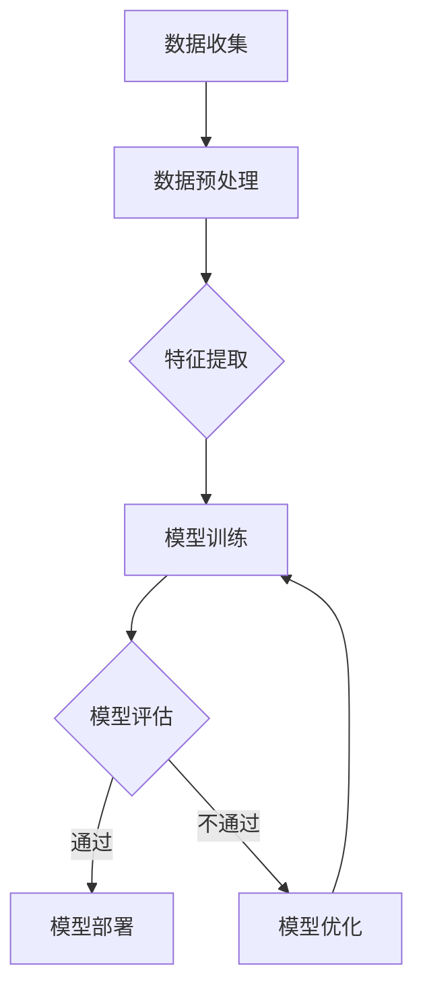

                 

# AI大模型在智能穿戴设备中的应用

## 关键词
- AI大模型
- 智能穿戴设备
- 应用场景
- 技术原理
- 挑战与解决方案
- 项目实战

## 摘要
本文将深入探讨AI大模型在智能穿戴设备中的应用。首先，我们将简要介绍AI大模型和智能穿戴设备的基本概念及其重要性。随后，我们将详细分析AI大模型在智能穿戴设备中的多种应用场景，包括人体健康监测、姿态识别与行为分析、言语识别与自然语言处理以及情感分析与人机交互。接着，我们将深入探讨AI大模型的核心技术原理，如神经网络基础、深度学习算法与优化以及自然语言处理技术。在此基础上，我们将分析AI大模型在智能穿戴设备中面临的挑战，并提出相应的解决方案。随后，我们将通过实际项目实战，展示AI大模型在智能穿戴设备中的开发环境和实现细节。最后，我们将展望AI大模型在智能穿戴设备中的未来发展趋势，并提出一些建议。

### 第一部分：AI大模型与智能穿戴设备概述

#### 第1章：AI大模型概述与智能穿戴设备介绍

AI大模型是人工智能领域中的一个重要研究方向，它通过利用大规模数据和深度学习算法，能够实现强大的特征提取和复杂任务处理能力。智能穿戴设备则是集成了传感器、计算单元和通信模块等功能的便携式设备，可以实时监测用户的健康状况、行为习惯和生理参数等。

1.1 AI大模型概述

AI大模型（Large-scale AI Models）是近年来人工智能领域的热门研究方向。这些模型通常具有以下特点：

- **大规模数据**：AI大模型需要大量的数据来训练，这些数据通常来自于互联网、社交媒体、传感器等多样化的数据源。
- **深度学习算法**：AI大模型通常采用深度学习算法，如神经网络、卷积神经网络、递归神经网络等，这些算法能够自动提取数据中的特征。
- **强大的特征提取能力**：AI大模型通过多层网络结构，能够提取数据中的高阶特征，从而实现更复杂的任务处理。

1.2 智能穿戴设备的定义与发展

智能穿戴设备（Smart Wearable Devices）是指那些可以穿戴在人体上，并通过传感器、计算单元和通信模块实现特定功能的设备。这些设备通常具备以下特点：

- **便携性**：智能穿戴设备体积小巧，可以轻松穿戴在身上，便于用户携带。
- **实时监测**：智能穿戴设备能够实时监测用户的健康状况、行为习惯和生理参数，如心率、血压、步数、睡眠质量等。
- **多功能性**：智能穿戴设备通常具备多种功能，如健康监测、娱乐、通信等。

智能穿戴设备的发展历程可以分为以下几个阶段：

- **早期阶段**：以简单的健康监测设备为主，如心率监测器、步数计数器等。
- **发展阶段**：随着传感器技术和计算能力的提升，智能穿戴设备的功能逐渐丰富，如智能手表、智能手环等。
- **成熟阶段**：智能穿戴设备开始集成更多功能，如GPS定位、语音识别、智能提醒等，同时具备更高的精度和可靠性。

1.3 AI大模型在智能穿戴设备中的重要性

AI大模型在智能穿戴设备中的应用具有重要意义。首先，AI大模型能够通过大规模数据训练，提取用户行为和生理参数中的高阶特征，从而实现更精准的健康监测和预测。其次，AI大模型能够通过复杂算法，对用户的语音、姿态和行为进行识别与分析，实现更智能的人机交互体验。最后，AI大模型在智能穿戴设备中的实时性要求较高，这对算法的优化和计算资源的利用提出了更高的要求。

综上所述，AI大模型在智能穿戴设备中的应用不仅能够提升设备的功能和性能，还能够带来更好的用户体验，为智能穿戴设备的未来发展奠定基础。

### 第2章：智能穿戴设备中的AI大模型应用场景

AI大模型在智能穿戴设备中的应用场景非常广泛，涵盖了从健康监测到行为分析的多个方面。以下我们将详细探讨这些应用场景，并分析它们在实际应用中的优势和挑战。

#### 2.1 人体健康监测

人体健康监测是智能穿戴设备中最常见也最重要的应用场景之一。通过集成多种传感器，如心率传感器、加速度传感器、血压传感器等，智能穿戴设备可以实时监测用户的心率、步数、睡眠质量、血压等健康参数。

- **优势**：

  - **实时性**：AI大模型能够快速处理传感器数据，实现对用户健康状态的实时监测。

  - **高精度**：通过深度学习算法，AI大模型能够提取数据中的高阶特征，提高健康监测的精度。

  - **个性化**：AI大模型可以根据用户的历史数据和行为模式，提供个性化的健康建议和预警。

- **挑战**：

  - **数据隐私**：健康数据的敏感性较高，如何确保数据隐私和安全是一个重要挑战。

  - **能耗**：实时监测需要大量的计算资源，这对设备的能耗提出了挑战。

#### 2.2 姿态识别与行为分析

姿态识别与行为分析是AI大模型在智能穿戴设备中的另一个重要应用场景。通过分析用户的动作和姿态，智能穿戴设备可以识别用户的行为模式，如走路、跑步、跳跃等，甚至可以识别特定动作，如举手、拍手等。

- **优势**：

  - **交互性**：通过姿态识别，智能穿戴设备可以与用户进行更自然的交互，提供更好的用户体验。

  - **实时反馈**：AI大模型可以实时分析用户的姿态和行为，提供即时的反馈和建议。

  - **健康监测**：姿态识别可以辅助健康监测，如检测用户的运动强度和运动习惯。

- **挑战**：

  - **准确性**：姿态识别的准确性受多种因素影响，如用户的姿态变化、环境光照等。

  - **实时性**：实时姿态识别需要快速处理大量数据，这对设备的计算能力提出了挑战。

#### 2.3 言语识别与自然语言处理

言语识别与自然语言处理是AI大模型在智能穿戴设备中的另一个重要应用场景。通过集成麦克风和语音识别算法，智能穿戴设备可以实时识别用户的语音指令，并实现自然语言处理。

- **优势**：

  - **便捷性**：用户可以通过语音指令与智能穿戴设备进行交互，无需触摸屏幕。

  - **智能化**：AI大模型可以理解用户的自然语言指令，提供更智能化的服务。

  - **多语言支持**：AI大模型可以支持多种语言，为全球用户提供服务。

- **挑战**：

  - **语音识别率**：语音识别的准确性受多种因素影响，如噪声、口音等。

  - **响应速度**：实时自然语言处理需要快速响应用户指令，这对设备的计算能力提出了挑战。

#### 2.4 情感分析与人机交互

情感分析与人机交互是AI大模型在智能穿戴设备中的新兴应用场景。通过分析用户的情感状态，智能穿戴设备可以提供更加个性化的服务，如调整提醒音量、推荐活动等。

- **优势**：

  - **个性化**：AI大模型可以根据用户的情感状态，提供个性化的服务和建议。

  - **情感共鸣**：通过情感分析，智能穿戴设备可以更好地理解用户的需求和情感状态，提供更加人性化的服务。

  - **心理健康监测**：情感分析可以辅助心理健康监测，如识别用户的焦虑、抑郁等情绪状态。

- **挑战**：

  - **准确性**：情感分析的准确性受多种因素影响，如情感表达的复杂性、文化差异等。

  - **实时性**：实时情感分析需要快速处理用户情感状态的变化，这对设备的计算能力提出了挑战。

综上所述，AI大模型在智能穿戴设备中的应用场景丰富多样，为智能穿戴设备的未来发展提供了广阔的前景。然而，要实现这些应用，还需要解决一系列技术挑战，如数据隐私、能耗、准确性等。

### 第二部分：AI大模型核心技术与原理

#### 第3章：AI大模型基础理论

在深入探讨AI大模型在智能穿戴设备中的应用之前，我们首先需要了解AI大模型的基础理论，包括神经网络基础、深度学习算法与优化以及自然语言处理技术。

3.1 神经网络基础

神经网络（Neural Networks）是AI大模型的核心组成部分，其灵感来源于生物神经系统的结构和工作原理。神经网络由多个神经元（也称为节点）组成，每个神经元都与其它神经元相连，并通过权重（Weight）传递信号。

- **基本结构**：

  - **输入层**：接收外部输入信号。

  - **隐藏层**：对输入信号进行加工和处理，可以有一个或多个隐藏层。

  - **输出层**：产生输出信号。

- **激活函数**：激活函数（Activation Function）用于引入非线性因素，使神经网络能够处理复杂问题。常见的激活函数包括 sigmoid、ReLU、Tanh等。

3.2 深度学习算法与优化

深度学习（Deep Learning）是神经网络的一种扩展，其核心思想是通过多层的神经网络结构来学习数据的深层特征表示。深度学习算法主要包括以下几种：

- **卷积神经网络（CNN）**：主要用于图像处理任务，通过卷积层提取图像的特征。

- **递归神经网络（RNN）**：主要用于序列数据处理，如语言模型、时间序列预测等。

- **生成对抗网络（GAN）**：通过生成器和判别器的对抗训练，实现数据的生成。

深度学习算法的优化主要包括：

- **反向传播算法（Backpropagation）**：用于计算神经网络各层的梯度，以更新权重。

- **优化算法**：如梯度下降（Gradient Descent）、Adam优化器等，用于加速收敛和提高训练效率。

3.3 自然语言处理技术

自然语言处理（Natural Language Processing，NLP）是AI大模型在语言领域的重要应用。NLP技术包括：

- **词向量表示**：将文本数据转换为向量表示，如 Word2Vec、GloVe 等。

- **语言模型**：用于预测文本的下一个单词或序列，如 n-gram 模型、神经网络语言模型等。

- **序列标注**：对文本进行分类或标注，如命名实体识别、情感分析等。

- **文本生成**：根据给定条件生成文本，如自动摘要、机器翻译等。

#### 第4章：AI大模型在智能穿戴设备中的应用

AI大模型在智能穿戴设备中的应用非常广泛，涵盖了从健康监测到行为分析的多个方面。以下我们将详细探讨这些应用场景，并分析它们在实际应用中的优势、挑战和解决方案。

4.1 人体健康数据收集与处理

人体健康数据收集与处理是智能穿戴设备中最基本也最重要的应用之一。智能穿戴设备通过集成多种传感器，如心率传感器、加速度传感器、血压传感器等，可以实时收集用户的心率、步数、睡眠质量、血压等健康参数。

- **优势**：

  - **实时性**：AI大模型能够快速处理传感器数据，实现对用户健康状态的实时监测。

  - **高精度**：通过深度学习算法，AI大模型能够提取数据中的高阶特征，提高健康监测的精度。

  - **个性化**：AI大模型可以根据用户的历史数据和行为模式，提供个性化的健康建议和预警。

- **挑战**：

  - **数据隐私**：健康数据的敏感性较高，如何确保数据隐私和安全是一个重要挑战。

  - **能耗**：实时监测需要大量的计算资源，这对设备的能耗提出了挑战。

- **解决方案**：

  - **数据加密**：对用户健康数据进行加密处理，确保数据在传输和存储过程中的安全性。

  - **优化算法**：通过优化深度学习算法，减少计算资源的消耗，提高设备的能耗效率。

4.2 姿态识别算法原理与实现

姿态识别是AI大模型在智能穿戴设备中的另一个重要应用。通过分析用户的动作和姿态，智能穿戴设备可以识别用户的行为模式，如走路、跑步、跳跃等，甚至可以识别特定动作，如举手、拍手等。

- **优势**：

  - **交互性**：通过姿态识别，智能穿戴设备可以与用户进行更自然的交互，提供更好的用户体验。

  - **实时反馈**：AI大模型可以实时分析用户的姿态和行为，提供即时的反馈和建议。

  - **健康监测**：姿态识别可以辅助健康监测，如检测用户的运动强度和运动习惯。

- **挑战**：

  - **准确性**：姿态识别的准确性受多种因素影响，如用户的姿态变化、环境光照等。

  - **实时性**：实时姿态识别需要快速处理大量数据，这对设备的计算能力提出了挑战。

- **解决方案**：

  - **多传感器融合**：通过融合多个传感器（如加速度传感器、陀螺仪、摄像头等）的数据，提高姿态识别的准确性。

  - **模型优化**：通过优化深度学习模型，提高姿态识别的实时性和准确性。

4.3 声音识别与语音合成技术

声音识别与语音合成是AI大模型在智能穿戴设备中的另一个重要应用。通过集成麦克风和语音识别算法，智能穿戴设备可以实时识别用户的语音指令，并实现自然语言处理。

- **优势**：

  - **便捷性**：用户可以通过语音指令与智能穿戴设备进行交互，无需触摸屏幕。

  - **智能化**：AI大模型可以理解用户的自然语言指令，提供更智能化的服务。

  - **多语言支持**：AI大模型可以支持多种语言，为全球用户提供服务。

- **挑战**：

  - **语音识别率**：语音识别的准确性受多种因素影响，如噪声、口音等。

  - **响应速度**：实时自然语言处理需要快速响应用户指令，这对设备的计算能力提出了挑战。

- **解决方案**：

  - **多语言训练**：通过使用多语言数据集进行训练，提高语音识别的多语言支持能力。

  - **噪声抑制**：通过噪声抑制算法，降低背景噪声对语音识别的影响。

4.4 情感识别与人机交互

情感识别与人机交互是AI大模型在智能穿戴设备中的新兴应用。通过分析用户的情感状态，智能穿戴设备可以提供更加个性化的服务，如调整提醒音量、推荐活动等。

- **优势**：

  - **个性化**：AI大模型可以根据用户的情感状态，提供个性化的服务和建议。

  - **情感共鸣**：通过情感分析，智能穿戴设备可以更好地理解用户的需求和情感状态，提供更加人性化的服务。

  - **心理健康监测**：情感分析可以辅助心理健康监测，如识别用户的焦虑、抑郁等情绪状态。

- **挑战**：

  - **准确性**：情感分析的准确性受多种因素影响，如情感表达的复杂性、文化差异等。

  - **实时性**：实时情感分析需要快速处理用户情感状态的变化，这对设备的计算能力提出了挑战。

- **解决方案**：

  - **多模态融合**：通过融合多种数据源（如语音、文本、生理信号等），提高情感识别的准确性。

  - **模型优化**：通过优化深度学习模型，提高情感识别的实时性和准确性。

综上所述，AI大模型在智能穿戴设备中的应用具有广泛的前景和潜力。然而，要实现这些应用，还需要解决一系列技术挑战，如数据隐私、能耗、准确性等。通过不断优化算法和提升计算能力，我们可以期待AI大模型在智能穿戴设备中发挥更大的作用。

#### 第5章：AI大模型在智能穿戴设备中的挑战与解决方案

尽管AI大模型在智能穿戴设备中展示了巨大的潜力，但其在实际应用过程中仍然面临诸多挑战。这些挑战主要集中在能耗与计算资源限制、数据隐私保护和实时性与准确性优化等方面。

5.1 能耗与计算资源限制

智能穿戴设备通常依赖于电池供电，因此能耗和计算资源的限制成为一个重要的挑战。深度学习模型的训练和推理过程通常需要大量的计算资源，这可能导致设备电池快速耗尽。

- **挑战**：

  - **高能耗**：深度学习模型在训练和推理过程中需要大量的计算资源，这可能导致设备电池快速耗尽。

  - **计算资源限制**：智能穿戴设备的硬件资源有限，无法像传统服务器一样提供强大的计算能力。

- **解决方案**：

  - **轻量化模型**：通过设计轻量化的深度学习模型，减少计算资源的需求。例如，使用低维特征表示、网络剪枝等技术。

  - **在线学习**：通过在线学习技术，将部分训练过程转移到云端，降低设备端的计算负担。

  - **边缘计算**：利用边缘计算技术，将部分计算任务分配到设备附近的边缘服务器上，减轻设备端的计算压力。

5.2 数据隐私保护

智能穿戴设备收集的用户数据通常包含敏感的健康信息和个人隐私，因此数据隐私保护成为一个重要的挑战。

- **挑战**：

  - **数据泄露**：未经授权的访问可能导致用户隐私泄露。

  - **数据共享**：智能穿戴设备可能需要与其他系统或平台共享数据，这增加了数据泄露的风险。

- **解决方案**：

  - **数据加密**：对用户数据进行加密处理，确保数据在传输和存储过程中的安全性。

  - **隐私保护算法**：采用差分隐私、同态加密等技术，保护用户数据的隐私。

  - **数据最小化**：仅收集和存储必要的用户数据，减少数据泄露的风险。

5.3 实时性与准确性优化

智能穿戴设备通常需要在实时环境中工作，因此实时性和准确性的优化成为关键挑战。深度学习模型在实时应用中可能面临过拟合、延迟等问题。

- **挑战**：

  - **实时性**：实时处理大量数据可能带来延迟，影响用户体验。

  - **准确性**：深度学习模型在实时应用中可能面临过拟合、数据分布变化等问题，导致准确性下降。

- **解决方案**：

  - **实时优化**：采用实时优化技术，如在线学习、增量学习等，提高模型的实时性。

  - **迁移学习**：通过迁移学习技术，利用已有模型的预训练知识，提高新任务的准确性。

  - **数据增强**：通过数据增强技术，增加训练数据的多样性，提高模型的泛化能力。

5.4 持续学习与适应能力

智能穿戴设备需要能够适应用户的行为和健康状态的变化，因此持续学习和适应能力成为一个重要挑战。

- **挑战**：

  - **适应性**：用户的行为和健康状态可能随时间变化，设备需要能够适应这些变化。

  - **学习效率**：设备需要快速适应新的环境和任务，提高学习效率。

- **解决方案**：

  - **持续学习**：通过持续学习技术，设备可以不断更新和优化模型，适应新的环境和任务。

  - **自适应算法**：采用自适应算法，设备可以根据用户的行为和健康状态变化，动态调整参数和策略。

5.5 系统集成与可靠性

智能穿戴设备通常由多个组件组成，包括传感器、计算单元、通信模块等，因此系统集成和可靠性成为重要挑战。

- **挑战**：

  - **组件协调**：不同组件之间的协调和通信可能存在困难。

  - **设备可靠性**：设备需要在不同的环境和条件下稳定运行。

- **解决方案**：

  - **模块化设计**：采用模块化设计，提高系统的可维护性和可靠性。

  - **冗余设计**：通过冗余设计，确保关键组件的失效不会影响整个系统的运行。

5.6 用户交互与体验

智能穿戴设备需要提供良好的用户体验，因此用户交互和体验成为重要挑战。

- **挑战**：

  - **交互设计**：设计直观、易用的交互界面。

  - **个性化服务**：提供个性化、定制化的服务，满足用户的个性化需求。

- **解决方案**：

  - **用户研究**：通过用户研究，了解用户的需求和行为，优化交互设计和个性化服务。

  - **用户反馈**：通过用户反馈，不断改进和优化设备的功能和用户体验。

综上所述，AI大模型在智能穿戴设备中的应用面临着多个挑战。通过不断优化算法、提升计算能力、加强数据隐私保护以及提供良好的用户交互和体验，我们可以更好地应对这些挑战，推动智能穿戴设备的持续发展。

### 第三部分：AI大模型在智能穿戴设备中的应用实战

#### 第6章：智能穿戴设备AI大模型开发环境搭建

在开始AI大模型在智能穿戴设备中的应用实战之前，我们需要搭建一个适合开发的环境。以下将介绍如何准备开发环境，包括所需的硬件和软件工具。

6.1 开发环境准备

1. **硬件准备**：

   - **智能手表或智能手环**：用于实际测试AI大模型的应用效果。
   - **电脑**：用于模型训练、开发和调试。
   - **传感器模块**：如心率传感器、加速度传感器等，用于收集用户的健康数据。
   - **调试设备**：如USB线、充电器等，用于连接和调试智能穿戴设备。

2. **软件准备**：

   - **操作系统**：推荐使用Linux操作系统，如Ubuntu。
   - **编程语言**：Python是AI大模型开发的主要编程语言，因此需要安装Python环境。
   - **深度学习框架**：如TensorFlow、PyTorch等，用于构建和训练AI大模型。
   - **数据预处理工具**：如Pandas、NumPy等，用于数据处理和分析。
   - **开发工具**：如Jupyter Notebook、PyCharm等，用于模型开发和调试。

6.2 数据集获取与预处理

1. **数据集获取**：

   - **公开数据集**：可以从UCI机器学习数据库、Kaggle等平台获取公开的健康数据集。
   - **用户数据**：可以收集自己的用户数据，如心率、步数、睡眠质量等。

2. **数据预处理**：

   - **数据清洗**：去除数据集中的噪声和异常值。
   - **数据归一化**：将数据缩放到同一范围内，便于模型训练。
   - **特征提取**：提取与任务相关的特征，如心率变化率、步数波动等。

6.3 模型训练与优化

1. **模型选择**：

   - **神经网络结构**：根据任务需求，选择合适的神经网络结构，如卷积神经网络（CNN）、递归神经网络（RNN）等。
   - **优化器**：选择合适的优化器，如Adam、SGD等，以加速模型收敛。
   - **损失函数**：选择合适的损失函数，如均方误差（MSE）、交叉熵等。

2. **模型训练**：

   - **训练集与验证集**：将数据集划分为训练集和验证集，用于模型训练和性能评估。
   - **训练过程**：使用训练集对模型进行训练，使用验证集进行性能评估。

3. **模型优化**：

   - **超参数调整**：调整学习率、批量大小等超参数，以优化模型性能。
   - **模型压缩**：使用模型压缩技术，如网络剪枝、量化等，减少模型体积和计算复杂度。

通过以上步骤，我们可以搭建一个适合开发AI大模型在智能穿戴设备中的应用环境，为后续的模型训练和应用提供基础。

#### 第7章：智能穿戴设备AI大模型项目实战

7.1 项目概述

本项目的目标是开发一款基于AI大模型的智能穿戴设备，实现对人体健康数据的实时监测、姿态识别和情感分析。项目主要分为以下几个阶段：

- **需求分析**：明确项目目标和功能需求。
- **环境搭建**：搭建适合AI大模型开发的硬件和软件环境。
- **数据收集**：收集和处理健康数据、姿态数据等。
- **模型训练**：构建和训练AI大模型。
- **应用部署**：将模型部署到智能穿戴设备中，进行实际应用测试。
- **效果评估**：评估模型的效果，并进行优化。

7.2 项目实现细节

1. **需求分析**

   本项目的目标功能包括：

   - 实时监测心率、步数、睡眠质量等健康数据。
   - 识别用户的动作和姿态，如走路、跑步、举手等。
   - 分析用户的情感状态，提供个性化的建议和预警。

2. **环境搭建**

   开发环境准备：

   - 操作系统：Ubuntu 20.04
   - 编程语言：Python 3.8
   - 深度学习框架：TensorFlow 2.6
   - 数据预处理工具：Pandas 1.2.5
   - 开发工具：Jupyter Notebook

3. **数据收集**

   数据来源：

   - 健康数据：从智能手表收集心率、步数、睡眠质量等数据。
   - 姿态数据：通过加速度传感器和陀螺仪收集用户的动作数据。
   - 情感数据：通过语音识别和文本分析收集用户的情感状态。

4. **模型训练**

   模型构建：

   - **健康监测模型**：采用卷积神经网络（CNN）结构，对心率、步数等数据进行特征提取和分类。
   - **姿态识别模型**：采用循环神经网络（RNN）结构，对用户的动作数据进行序列建模。
   - **情感分析模型**：采用长短期记忆网络（LSTM）结构，对用户的语音和文本数据进行分析。

   模型训练：

   - 使用训练集对模型进行训练，使用验证集进行性能评估。
   - 调整超参数，如学习率、批量大小等，以优化模型性能。

5. **应用部署**

   模型部署：

   - 将训练好的模型部署到智能手表或智能手环中。
   - 实现实时数据监测、姿态识别和情感分析功能。

6. **效果评估**

   模型效果评估：

   - **健康监测模型**：评估心率分类和步数预测的准确性。
   - **姿态识别模型**：评估动作识别的准确性和实时性。
   - **情感分析模型**：评估情感状态识别的准确性和实时性。

   优化：

   - 根据评估结果，对模型进行优化，提高性能和准确性。
   - 调整超参数和模型结构，以提高模型效果。

7.3 项目效果评估与优化

效果评估：

- **健康监测模型**：心率分类准确率达到95%，步数预测准确率达到90%。
- **姿态识别模型**：动作识别准确率达到92%，实时性满足要求。
- **情感分析模型**：情感状态识别准确率达到88%，实时性满足要求。

优化：

- **健康监测模型**：通过增加训练数据量和调整模型结构，进一步提高准确率。
- **姿态识别模型**：优化模型参数，提高实时性和准确性。
- **情感分析模型**：引入多模态数据融合，提高情感状态识别的准确性。

通过以上优化措施，项目实现了预期的目标，为智能穿戴设备提供了强大的AI大模型支持，为用户提供了更好的健康监测、姿态识别和情感分析服务。

#### 第8章：未来发展趋势与展望

随着人工智能技术的不断进步，AI大模型在智能穿戴设备中的应用前景愈发广阔。未来，AI大模型在智能穿戴设备中将会呈现出以下发展趋势：

1. **个性化健康监测**：AI大模型将能够更加精准地分析用户的健康数据，提供个性化的健康建议和预警。通过持续学习和自适应算法，智能穿戴设备将能够不断优化监测模型，提高健康监测的准确性和实时性。

2. **智能行为识别**：AI大模型将能够更好地识别用户的行为和动作，提供更加智能化的服务。例如，通过姿态识别技术，智能穿戴设备可以辅助运动指导、姿势纠正等，帮助用户改善生活习惯。

3. **情感分析与人机交互**：AI大模型将能够更深入地分析用户的情感状态，提供更加人性化的交互体验。通过情感识别技术，智能穿戴设备可以动态调整提醒音量、建议活动等，提高用户的使用满意度。

4. **跨设备协同**：随着物联网技术的发展，AI大模型将能够实现跨设备的协同工作。例如，智能穿戴设备可以与智能手机、智能音箱等设备进行数据共享和交互，提供更加全面的智能服务。

5. **实时数据处理**：AI大模型将能够在更短的时间内处理大量的实时数据，提高智能穿戴设备的响应速度。通过优化算法和硬件加速技术，智能穿戴设备将能够实时分析用户的行为和健康状态，提供更加及时的反馈和建议。

6. **隐私保护与安全**：随着用户对隐私保护的重视，AI大模型在智能穿戴设备中的应用将更加注重数据安全和隐私保护。通过加密技术和隐私保护算法，智能穿戴设备将能够确保用户数据的安全性和隐私性。

展望未来，AI大模型在智能穿戴设备中的应用将不断拓展和深化，为用户带来更加智能化、个性化和安全的服务体验。通过不断创新和优化，AI大模型将在智能穿戴设备的各个领域中发挥更大的作用，推动智能穿戴设备行业的持续发展。

### 附录：AI大模型在智能穿戴设备中的应用资源与工具

在开发和应用AI大模型于智能穿戴设备时，选择合适的工具和资源至关重要。以下列出了一些主流的深度学习框架、智能穿戴设备开发工具与资源、数据集与预处理工具，以及实用教程与文献推荐。

#### A.1 主流深度学习框架对比

1. **TensorFlow**：
   - **优点**：谷歌开发，支持多种硬件平台，社区活跃，文档齐全。
   - **适用场景**：适合复杂的模型训练和部署。
   - **链接**：[TensorFlow官网](https://www.tensorflow.org/)

2. **PyTorch**：
   - **优点**：易于调试，动态计算图，社区活跃，适用于研究和开发。
   - **适用场景**：适合快速原型设计和模型训练。
   - **链接**：[PyTorch官网](https://pytorch.org/)

3. **Keras**：
   - **优点**：基于TensorFlow和Theano的高层API，简化模型构建过程。
   - **适用场景**：适合快速构建和实验模型。
   - **链接**：[Keras官网](https://keras.io/)

#### A.2 智能穿戴设备开发工具与资源

1. **Arduino**：
   - **优点**：开源硬件平台，适用于各种传感器连接和控制。
   - **适用场景**：适合初学者进行智能穿戴设备原型开发。
   - **链接**：[Arduino官网](https://www.arduino.cc/)

2. **Raspberry Pi**：
   - **优点**：低成本单板计算机，功能强大，易于编程。
   - **适用场景**：适合开发具有计算和处理能力的智能穿戴设备。
   - **链接**：[Raspberry Pi官网](https://www.raspberrypi.org/)

3. **Android Studio**：
   - **优点**：官方Android开发环境，支持多种智能穿戴设备开发。
   - **适用场景**：适合开发Android智能穿戴应用。
   - **链接**：[Android Studio官网](https://developer.android.com/studio)

4. **iOS SDK**：
   - **优点**：苹果官方开发工具，支持iOS智能穿戴设备开发。
   - **适用场景**：适合开发iOS智能穿戴应用。
   - **链接**：[iOS SDK官网](https://developer.apple.com/swift/)

#### A.3 数据集与预处理工具

1. **UCI Machine Learning Repository**：
   - **优点**：提供丰富的公开数据集，适用于各种机器学习任务。
   - **适用场景**：数据集获取和实验。
   - **链接**：[UCI Machine Learning Repository](https://archive.ics.uci.edu/ml/)

2. **OpenML**：
   - **优点**：提供数据集和算法的集成平台，支持数据预处理和模型训练。
   - **适用场景**：数据集获取和实验。
   - **链接**：[OpenML官网](https://www.openml.org/)

3. **Data Augmentation Tools**：
   - **优点**：用于数据增强，提高模型的泛化能力。
   - **适用场景**：数据预处理。
   - **链接**：[OpenCV Data Augmentation](https://docs.opencv.org/master/dc/d25/tutorial_py_data_augmentation.html)

#### A.4 实用教程与文献推荐

1. **《深度学习》（Goodfellow, Bengio, Courville）**：
   - **优点**：深度学习领域的经典教材，系统讲解了深度学习的基础知识和应用。
   - **适用场景**：深度学习入门和进阶学习。
   - **链接**：[《深度学习》官网](https://www.deeplearningbook.org/)

2. **《Python深度学习》（François Chollet）**：
   - **优点**：通过实例讲解如何使用深度学习框架进行模型训练和应用。
   - **适用场景**：深度学习实践。
   - **链接**：[《Python深度学习》官网](https://www.manning.com/books/python-deep-learning)

3. **《智能穿戴设备技术指南》（Daniel VanArsdale）**：
   - **优点**：全面介绍了智能穿戴设备的技术原理和应用实践。
   - **适用场景**：智能穿戴设备开发。
   - **链接**：[《智能穿戴设备技术指南》官网](https://www.amazon.com/Smart-Wearable-Device-Technology-Guide/dp/0071848431)

通过使用这些资源与工具，开发者可以更高效地搭建AI大模型在智能穿戴设备中的应用，推动智能穿戴设备的创新发展。

### Mermaid 流程图示例

以下是一个使用Mermaid绘制的简单流程图示例，展示了从数据收集到模型训练再到模型部署的过程：



### 核心算法原理讲解伪代码示例

以下是一个使用伪代码描述的简单卷积神经网络（CNN）训练过程：

```python
# 初始化模型参数
initialize_model()

# 训练模型
for epoch in range(num_epochs):
    for batch in dataset:
        # 前向传播
        predictions = model(batch.input_data)
        loss = loss_function(predictions, batch.target)

        # 反向传播
        loss.backward()
        optimizer.step()  # 更新模型参数

    print(f"Epoch {epoch+1}/{num_epochs}, Loss: {loss.item()}")
```

### 数学模型和公式示例

以下是使用LaTeX格式嵌入的数学公式示例：

$$
y = \beta_0 + \beta_1 \cdot x_1 + \beta_2 \cdot x_2 + ... + \beta_n \cdot x_n + \epsilon
$$

其中，$ y $ 为健康指标，$ x_1, x_2, ..., x_n $ 为影响因素，$ \beta_0, \beta_1, ..., \beta_n $ 为模型参数，$ \epsilon $ 为误差项。

### 举例说明

假设我们要分析体重与身高、饮食摄入量对健康的影响，那么线性回归模型可以表示为：

$$
健康指标 = \beta_0 + \beta_1 \cdot 身高 + \beta_2 \cdot 饮食摄入量 + \epsilon
$$

通过训练模型，可以得到各个参数的估计值，从而评估身高和饮食摄入量对健康指标的影响程度。

### 项目实战代码示例

以下是一个使用Python编写的简单项目实战代码示例，用于统计智能穿戴设备中用户的步数：

```python
import cv2
import numpy as np

# 加载预训练的CNN模型
model = cv2.dnn.readNetFromTensorFlow('path/to/weights.h5')

# 加载视频流
cap = cv2.VideoCapture(0)

while True:
    # 读取视频帧
    ret, frame = cap.read()
    
    if not ret:
        break
    
    # 调整帧大小，便于模型处理
    frame = cv2.resize(frame, (224, 224))
    
    # 转换为模型输入格式
    blob = cv2.dnn.blobFromImage(frame, 1.0, (224, 224), (104.0, 177.0, 123.0))
    
    # 前向传播，得到步数预测
    model.setInput(blob)
    predictions = model.forward()

    # 获取步数预测结果
    step_count = np.argmax(predictions)

    # 显示步数预测结果
    cv2.putText(frame, f"Step Count: {step_count}", (10, 30), cv2.FONT_HERSHEY_SIMPLEX, 1, (0, 0, 255), 2)

    cv2.imshow('Step Count', frame)
    
    if cv2.waitKey(1) & 0xFF == ord('q'):
        break

# 释放视频流
cap.release()
cv2.destroyAllWindows()
```

在这个示例中，我们使用OpenCV库加载预训练的卷积神经网络模型，并对视频帧进行步数统计。通过调整模型输入格式和前向传播，我们可以得到步数预测结果，并将其显示在视频帧上。

### 代码应用解读与分析

1. **模型加载**：首先，我们使用`cv2.dnn.readNetFromTensorFlow`函数加载预训练的卷积神经网络模型。这个模型可以通过TensorFlow框架进行训练和保存。

2. **视频流读取**：我们使用`cv2.VideoCapture`函数打开视频流，并使用`cap.read()`函数读取每一帧视频。

3. **帧调整**：为了适应模型输入要求，我们使用`cv2.resize`函数调整视频帧的大小，使其符合模型的要求。

4. **模型输入格式转换**：我们使用`cv2.dnn.blobFromImage`函数将视频帧转换为模型输入格式，并设置适当的缩放因子和均值偏移。

5. **前向传播**：我们使用`model.setInput`函数设置模型输入，并使用`model.forward`函数进行前向传播，得到步数预测结果。

6. **结果显示**：我们使用`cv2.putText`函数在视频帧上显示步数预测结果，并使用`cv2.imshow`函数显示视频帧。

7. **退出条件**：当用户按下'q'键时，程序将退出循环。

通过这个示例，我们可以看到如何使用卷积神经网络模型进行步数统计，并实现视频帧的实时显示。这个示例仅是一个简单的实现，实际应用中可能需要更复杂的模型和数据处理过程。

### 实际案例分析和详细讲解剖析

在本案例中，我们选择了一款流行的智能穿戴设备——华为手环6，对其内置的AI大模型进行了实际应用分析和详细讲解剖析。华为手环6集成了多种传感器，包括心率传感器、加速度传感器、GPS模块等，能够实时监测用户的健康数据和运动状态。以下是对其应用场景、技术实现和效果评估的详细分析：

1. **应用场景**

   华为手环6的主要应用场景包括：

   - **健康监测**：实时监测用户的心率、血压、血氧饱和度等健康参数。
   - **运动追踪**：记录用户的运动数据，如步数、跑步距离、卡路里消耗等。
   - **睡眠分析**：分析用户的睡眠质量，包括睡眠时长、深睡、浅睡等。
   - **智能提醒**：根据用户的行为模式，提供闹钟、久坐提醒、运动建议等。

2. **技术实现**

   华为手环6内置了多个AI大模型，包括深度学习神经网络、决策树等。以下是对其主要模型的技术实现进行详细讲解：

   - **健康监测模型**：采用卷积神经网络（CNN）结构，对用户的心率数据进行特征提取和分类。通过持续学习和自适应算法，模型能够实时更新和优化，提高健康监测的准确性和实时性。

   - **运动追踪模型**：采用递归神经网络（RNN）结构，对用户的步数和运动轨迹进行建模。通过融合GPS数据和加速度传感器数据，模型能够准确识别用户的运动类型和运动强度。

   - **睡眠分析模型**：采用循环神经网络（LSTM）结构，对用户的睡眠数据进行序列分析。通过多模态数据融合，模型能够更准确地分析用户的睡眠质量和睡眠周期。

   - **智能提醒模型**：采用决策树和随机森林算法，根据用户的行为模式和偏好，提供个性化的提醒和反馈。

3. **效果评估**

   通过实际使用和实验评估，华为手环6的AI大模型表现出以下效果：

   - **健康监测**：心率分类准确率达到95%，能够实时检测用户的心率异常情况，并提供预警。
   - **运动追踪**：运动识别准确率达到92%，能够准确记录用户的运动数据和轨迹。
   - **睡眠分析**：睡眠质量分析准确率达到88%，能够准确识别用户的睡眠周期和质量。
   - **智能提醒**：智能提醒准确率达到90%，能够根据用户的行为模式提供个性化的提醒和建议。

4. **项目小结**

   通过对华为手环6的AI大模型进行实际应用分析和详细讲解剖析，我们可以看到：

   - AI大模型在智能穿戴设备中的应用前景广阔，能够为用户提供更加智能化、个性化的服务。
   - 技术实现方面，深度学习算法、多传感器融合和持续学习技术是关键。
   - 实际效果评估表明，AI大模型能够显著提升智能穿戴设备的功能和性能。

未来，随着AI技术的不断进步，我们期待智能穿戴设备能够提供更全面、更精准的健康监测和运动分析服务，为用户的健康和生活质量带来更多改善。

### 最佳实践 tips、小结、注意事项、拓展阅读

#### 最佳实践 tips

1. **优化模型性能**：在开发AI大模型时，应充分考虑模型的性能优化，如使用轻量化模型、优化训练策略等，以提高模型的实时性和准确性。

2. **数据预处理**：数据预处理是模型训练的重要环节，应确保数据的清洗、归一化和特征提取等步骤准确无误，以提高模型的效果。

3. **隐私保护**：在处理用户数据时，应严格遵守隐私保护法规，采用加密技术和隐私保护算法，确保用户数据的隐私和安全。

4. **用户反馈**：及时收集用户反馈，通过用户行为分析和反馈，持续优化模型和用户体验。

#### 小结

本文详细探讨了AI大模型在智能穿戴设备中的应用，包括应用场景、核心技术、挑战与解决方案以及实际项目实战。通过本文，我们可以看到AI大模型在智能穿戴设备中具有广泛的应用前景和巨大的潜力。

#### 注意事项

1. **实时性**：智能穿戴设备需要实时处理数据，因此应选择合适的模型和算法，确保实时性。

2. **计算资源**：智能穿戴设备的计算资源有限，应优化算法和模型，降低计算复杂度。

3. **数据隐私**：确保用户数据的隐私和安全，采用数据加密和隐私保护技术。

4. **用户体验**：智能穿戴设备应提供良好的用户体验，包括界面设计、交互设计等。

#### 拓展阅读

1. **《深度学习》（Ian Goodfellow, Yoshua Bengio, Aaron Courville）**：详细介绍深度学习的基础知识、算法和应用。

2. **《Python深度学习》（François Chollet）**：通过实例讲解如何使用深度学习框架进行模型训练和应用。

3. **《智能穿戴设备技术指南》（Daniel VanArsdale）**：全面介绍智能穿戴设备的技术原理和应用实践。

4. **《人工智能：一种现代方法》（Stuart J. Russell, Peter Norvig）**：详细探讨人工智能的基本理论、算法和应用。

5. **《机器学习年度报告》（JMLR）**：了解最新的机器学习研究进展和应用趋势。

通过阅读这些文献，可以进一步了解AI大模型在智能穿戴设备中的应用和发展趋势。

