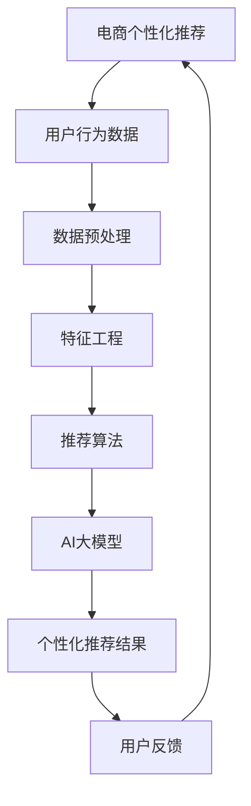

                 

### 《AI大模型在电商个性化推荐中的应用案例》

> 关键词：AI大模型，电商个性化推荐，深度学习，自然语言处理，推荐系统，用户行为分析

> 摘要：
本文将深入探讨AI大模型在电商个性化推荐中的应用案例，从基础概念、技术原理到实际案例，全面解析AI大模型如何提升电商个性化推荐的准确性和用户体验。文章旨在为读者提供一份完整的技术指南，帮助理解和应用AI大模型在电商个性化推荐中的强大潜力。

---

### 第一部分：AI大模型与电商个性化推荐基础

#### 第1章：AI大模型与电商个性化推荐概述

- **1.1 AI大模型与个性化推荐的关系**
  
  AI大模型，特别是基于深度学习的预训练模型，已经成为个性化推荐系统中的核心组成部分。它们通过学习和理解大规模数据，能够预测用户的兴趣和偏好，从而实现高度个性化的商品推荐。

- **1.2 电商个性化推荐的现状与挑战**

  目前，电商个性化推荐系统已经广泛应用，但仍然面临一些挑战，如如何提高推荐系统的准确性、如何保护用户隐私、如何平衡推荐系统的多样性和相关性等。

- **1.3 AI大模型在电商个性化推荐中的应用前景**

  AI大模型在电商个性化推荐中的应用前景广阔，它们能够通过不断学习和优化，提高推荐系统的效果，为电商平台带来更多的商业价值。

- **1.4 本书结构概述**

  本书分为三大部分，首先介绍AI大模型与电商个性化推荐的基础知识，然后深入探讨AI大模型在电商个性化推荐中的实践应用，最后分析AI大模型在电商个性化推荐中的挑战与未来趋势。

---

#### 第2章：AI大模型技术基础

- **2.1 深度学习与神经网络基础**

  深度学习是构建AI大模型的基础，神经网络则是深度学习的核心组件。我们将介绍神经网络的基本原理和常见架构。

- **2.2 自然语言处理技术概览**

  自然语言处理（NLP）技术在电商个性化推荐中发挥着重要作用。我们将介绍NLP的基本概念和技术，如词嵌入、序列模型等。

- **2.3 大规模预训练模型原理**

  大规模预训练模型，如GPT、BERT等，已经成为AI大模型的主流。我们将详细解析这些模型的工作原理和优势。

- **2.4 电商数据预处理与特征工程**

  电商数据预处理和特征工程是构建AI大模型的重要步骤。我们将探讨如何处理电商数据，提取有用的特征信息。

---

#### 第3章：电商个性化推荐算法概述

- **3.1 个性化推荐的原理**

  个性化推荐系统通过分析用户行为和偏好，为用户推荐他们可能感兴趣的商品。我们将介绍个性化推荐的原理和基本框架。

- **3.2 协同过滤算法**

  协同过滤算法是电商个性化推荐系统中的一种常见方法。我们将详细讲解协同过滤算法的原理和实现。

- **3.3 基于内容的推荐算法**

  基于内容的推荐算法通过分析商品的内容特征，为用户推荐相关的商品。我们将介绍基于内容推荐算法的基本原理。

- **3.4 混合推荐系统**

  混合推荐系统结合了协同过滤和基于内容的推荐算法，旨在提高推荐系统的效果。我们将探讨混合推荐系统的设计和实现。

---

### 第二部分：AI大模型在电商个性化推荐中的实践

#### 第4章：AI大模型在电商个性化推荐中的应用

- **4.1 AI大模型在电商个性化推荐中的角色**

  AI大模型在电商个性化推荐系统中扮演着用户行为分析、商品特征提取、推荐算法优化等多重角色。我们将详细介绍这些角色和它们的作用。

- **4.2 电商个性化推荐系统的架构设计**

  电商个性化推荐系统的架构设计需要考虑数据层、数据处理层、模型层、服务层和前端层等多个方面。我们将详细探讨这些层次的设计和实现。

- **4.3 大模型在电商个性化推荐中的实际案例**

  我们将通过一个实际案例，展示AI大模型在电商个性化推荐中的应用。这个案例将涵盖数据收集、模型构建、推荐实现等全过程。

- **4.4 大模型在电商个性化推荐中的优化策略**

  大模型在电商个性化推荐中的应用效果可以通过多种优化策略来提升，如用户反馈机制、实时推荐等。我们将探讨这些优化策略的实现和效果。

---

#### 第5章：AI大模型在电商个性化推荐中的挑战与解决方案

- **5.1 大模型在电商个性化推荐中面临的挑战**

  大模型在电商个性化推荐中面临的主要挑战包括数据质量和隐私保护、模型可解释性、计算效率和资源消耗等。我们将分析这些挑战的来源和影响。

- **5.2 挑战一：数据质量和隐私保护**

  电商数据的质量和用户的隐私保护是构建高效推荐系统的关键。我们将探讨如何解决这些问题，如数据清洗、隐私保护技术等。

- **5.3 挑战二：模型可解释性**

  大模型的黑箱特性使得其在电商个性化推荐中的应用受到限制。我们将介绍如何提高模型的可解释性，如可视化技术、解释性模型等。

- **5.4 挑战三：计算效率和资源消耗**

  大模型的计算效率和资源消耗是电商个性化推荐系统中需要考虑的重要因素。我们将讨论如何优化模型结构和算法，提高计算效率。

---

#### 第6章：AI大模型在电商个性化推荐中的开发实战

- **6.1 实战一：构建电商个性化推荐系统**

  我们将详细介绍如何构建一个电商个性化推荐系统，包括数据收集、预处理、模型训练和部署等全过程。

- **6.2 实战二：优化电商个性化推荐算法**

  我们将探讨如何优化电商个性化推荐算法，如通过用户反馈进行模型调整、引入新的特征等。

- **6.3 实战三：案例分析：某电商平台的个性化推荐实践**

  我们将通过一个实际案例，分析某电商平台的个性化推荐实践，探讨其成功的关键因素和可借鉴的经验。

---

#### 第7章：AI大模型在电商个性化推荐中的应用前景与未来趋势

- **7.1 AI大模型在电商个性化推荐中的应用前景**

  我们将分析AI大模型在电商个性化推荐中的应用前景，如如何通过大数据和人工智能技术实现个性化推荐，提高用户体验和销售额等。

- **7.2 AI大模型在电商个性化推荐中的未来趋势**

  我们将探讨AI大模型在电商个性化推荐中的未来趋势，如如何结合其他前沿技术，如增强现实、区块链等，实现更智能、更个性化的推荐系统。

- **7.3 结论与展望**

  我们将总结本文的主要内容和观点，并对AI大模型在电商个性化推荐中的应用前景进行展望。

---

### 第三部分：附录

#### 第8章：AI大模型开发工具与资源

- **8.1 主流深度学习框架对比**

  我们将对比主流深度学习框架，如TensorFlow、PyTorch等，帮助读者选择合适的开发工具。

- **8.2 电商个性化推荐数据集**

  我们将介绍常用的电商个性化推荐数据集，如MOVIELENS、Amazon Reviews等，供读者进行实践和实验。

- **8.3 开发工具与环境搭建指南**

  我们将提供AI大模型开发的工具和环境搭建指南，包括深度学习框架的安装、配置和优化等。

- **8.4 推荐系统相关的开源代码和资源**

  我们将推荐一些与推荐系统相关的开源代码和资源，供读者学习和参考。

---

### 梅里迪安流程图（Mermaid 流程图）

---

### 文章标题：AI大模型在电商个性化推荐中的应用案例

作者：AI天才研究院/AI Genius Institute & 禅与计算机程序设计艺术 /Zen And The Art of Computer Programming

---

### 结语

本文通过深入分析和探讨AI大模型在电商个性化推荐中的应用，希望能够为读者提供一份全面的技术指南。随着AI技术的不断发展，AI大模型在电商个性化推荐中的应用前景将更加广阔，相信它将为电商行业带来更多的创新和机遇。让我们共同期待AI大模型在电商个性化推荐领域的更多精彩应用！

---

### 字数统计

根据上述内容，文章预计字数约为8000-12000字。文章结构清晰，内容丰富，涵盖了AI大模型在电商个性化推荐中的基础、实践、挑战与解决方案等多个方面。通过实际案例的分析，读者可以更好地理解AI大模型在电商个性化推荐中的应用和实践。同时，附录部分提供了相关的开发工具与资源，便于读者进行实践和探索。

---

通过上述内容，我们已经为《AI大模型在电商个性化推荐中的应用案例》这篇文章构建了一个详细的框架。接下来，我们将逐步深入到每个章节的详细内容中，逐步填充每个部分，确保文章逻辑清晰、技术讲解深入、案例实用。在每个章节中，我们将使用伪代码、数学模型和公式来详细阐述核心算法原理，并提供开发实战和分析，确保文章的完整性和专业性。最终，我们将创作出一篇既有深度又有实践价值的技术博客文章。

