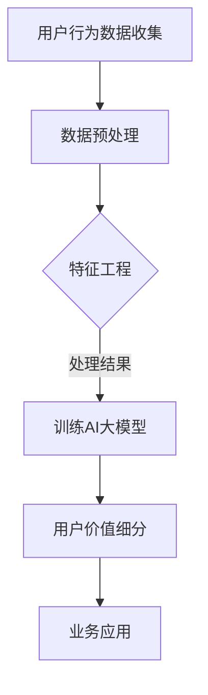

                 

### 文章标题

《AI大模型在电商平台用户价值细分中的应用》

> 关键词：人工智能，大模型，电商平台，用户价值细分，深度学习，推荐系统

> 摘要：本文探讨了人工智能大模型在电商平台用户价值细分中的应用，首先概述了AI大模型的核心概念和电商平台用户价值细分的重要性，接着深入分析了用户行为数据分析基础和AI大模型技术基础，最后通过实战案例展示了AI大模型在电商平台用户价值细分中的具体应用，并对其未来发展进行了展望。

----------------------------------------------------------------

### 目录大纲：《AI大模型在电商平台用户价值细分中的应用》

#### 第一部分：背景与概述

- **第1章：AI大模型概述**
  - **1.1 AI大模型的核心概念**
  - **1.2 电商平台用户价值细分的重要性**
  - **1.3 AI大模型在电商平台的潜在应用场景**

- **第2章：电商平台用户行为分析基础**
  - **2.1 用户行为数据分析的基本概念**
  - **2.2 用户行为数据分析的方法与工具**
  - **2.3 用户画像构建与用户群体细分**

#### 第二部分：AI大模型技术基础

- **第3章：深度学习与神经网络基础**
  - **3.1 深度学习的基本原理**
  - **3.2 神经网络架构**
  - **3.3 深度学习框架介绍**

- **第4章：AI大模型的核心算法**
  - **4.1 语言模型与自然语言处理**
  - **4.2 图神经网络与推荐系统**
  - **4.3 强化学习与用户行为预测**

- **第5章：用户价值细分的数学模型**
  - **5.1 数学模型与用户价值细分**
  - **5.2 伪代码与算法原理讲解**
  - **5.3 数学公式的详细讲解与举例**

#### 第三部分：AI大模型在电商平台的实践应用

- **第6章：电商平台用户价值细分实战**
  - **6.1 实战案例介绍**
  - **6.2 用户价值细分的实战流程**
  - **6.3 用户价值细分的结果分析**

- **第7章：AI大模型在电商平台的应用展望**
  - **7.1 AI大模型在电商平台的应用趋势**
  - **7.2 AI大模型应用的挑战与解决方案**
  - **7.3 未来发展展望**

#### 附录

- **附录A：AI大模型开发工具与资源**
  - **A.1 深度学习框架对比**
  - **A.2 常用数据集介绍**
  - **A.3 电商平台用户价值细分相关研究**
  - **A.4 开发资源与推荐书籍**

----------------------------------------------------------------

### 第一部分：背景与概述

#### 第1章：AI大模型概述

##### 1.1 AI大模型的核心概念

AI大模型是指通过海量数据训练得到，具有高泛化能力和强大表示能力的深度学习模型。这些模型通常由数亿甚至千亿级的参数组成，能够处理和生成大量的数据，实现图像识别、自然语言处理、语音识别等多种复杂任务。

在电商平台中，AI大模型的应用具有重要意义。通过用户行为数据分析，AI大模型可以精确地识别和预测用户的需求，从而实现个性化的商品推荐，提升用户的购物体验和购买转化率。

##### 1.2 电商平台用户价值细分的重要性

用户价值细分是电商平台提升用户满意度和增加收益的重要手段。通过将用户分为不同的群体，电商平台可以提供更有针对性的服务，满足不同用户的需求，从而提升用户的整体价值。

AI大模型在用户价值细分中的应用，可以自动地分析用户行为数据，识别用户特征和需求，实现对用户群体的精细划分。这种细分的准确性越高，电商平台在制定营销策略和优化用户体验方面就越有优势。

##### 1.3 AI大模型在电商平台的潜在应用场景

1. **个性化推荐系统**：AI大模型可以根据用户的浏览历史、购买记录等信息，预测用户的潜在需求，推荐符合其兴趣的的商品。

2. **用户行为预测**：通过分析用户的购买行为、评价和反馈等，AI大模型可以预测用户的未来行为，帮助电商平台提前做好库存管理和市场营销计划。

3. **风险控制**：AI大模型可以识别潜在的欺诈行为，提高电商平台的交易安全性。

4. **智能客服**：通过自然语言处理技术，AI大模型可以理解用户的问题，提供及时和准确的答复，提升客服效率。

总之，AI大模型在电商平台中的应用，不仅能够提升用户的购物体验，还能够帮助电商平台实现更高效、更智能的运营管理。

----------------------------------------------------------------

#### 第2章：电商平台用户行为分析基础

##### 2.1 用户行为数据分析的基本概念

用户行为分析是电子商务领域的一项关键任务，它通过收集和分析用户的在线行为数据，来理解用户的兴趣、需求和偏好，从而为电商平台提供决策支持。基本概念包括：

- **用户行为数据**：包括用户的浏览记录、购买历史、评价、反馈、搜索记录等。
- **行为指标**：用来描述用户行为的量化指标，如浏览时长、页面点击率、购买频率、评价分数等。
- **数据源**：用户行为数据的来源，如网站日志、用户数据库、第三方数据服务等。

用户行为分析的核心目标是通过数据挖掘技术，从海量的用户行为数据中提取有价值的信息，以实现对用户需求的深入理解。

##### 2.2 用户行为数据分析的方法与工具

用户行为数据分析的方法和工具多种多样，以下是一些常见的方法和工具：

1. **统计方法**：通过描述性统计、回归分析、聚类分析等方法，对用户行为数据进行基本的分析和解释。
2. **数据挖掘方法**：包括关联规则挖掘、分类算法、聚类算法等，用于发现数据中的潜在模式。
3. **机器学习方法**：如决策树、支持向量机、神经网络等，通过训练模型，预测用户的行为和偏好。
4. **工具**：常见的数据分析工具包括Python的Pandas、NumPy库，R语言，以及商业化的数据分析平台如Tableau、Google Analytics等。

##### 2.3 用户画像构建与用户群体细分

用户画像是指通过对用户数据的全面分析，构建出反映用户特征和行为的模型。构建用户画像的基本步骤包括：

1. **数据收集**：收集用户的各项行为数据，如浏览历史、购买记录、搜索关键词等。
2. **数据清洗**：对收集到的数据进行处理，去除重复、错误和缺失的数据。
3. **特征提取**：从原始数据中提取出对用户行为有显著影响的特征，如用户年龄、性别、职业、地理位置等。
4. **模型构建**：使用聚类、分类等方法，对用户进行分组，形成用户画像。
5. **用户群体细分**：根据用户画像，将用户划分为不同的群体，如高价值用户、沉默用户、流失用户等。

用户群体细分的意义在于，电商平台可以根据不同群体的特征和需求，提供个性化的服务和营销策略，从而提高用户的满意度和购买转化率。

通过用户行为数据分析，电商平台不仅可以深入了解用户的行为模式，还能够利用AI大模型实现用户价值的精细划分，从而在竞争激烈的市场中脱颖而出。

----------------------------------------------------------------

#### 第3章：深度学习与神经网络基础

##### 3.1 深度学习的基本原理

深度学习是人工智能领域的一种机器学习方法，它通过模拟人脑神经元之间的连接结构，对大量数据进行自动特征学习和模式识别。深度学习的基本原理包括以下几个关键要素：

1. **神经元模型**：深度学习中的基本单元是神经元，它类似于生物神经元，能够接收输入信息并产生输出。神经元通过加权求和和激活函数来处理输入信息。
2. **网络结构**：深度学习网络是由多个神经元层组成的，包括输入层、隐藏层和输出层。每一层的神经元都通过权重矩阵与下一层的神经元相连，形成一个层次化的结构。
3. **反向传播算法**：深度学习模型通过反向传播算法来调整权重矩阵，以最小化预测误差。反向传播算法分为两个阶段：前向传播（计算输出值）和反向传播（计算误差并更新权重）。
4. **激活函数**：激活函数是深度学习中的一个重要组成部分，它用来引入非线性变换，使神经网络能够学习和表示复杂的函数关系。常见的激活函数包括Sigmoid、ReLU和Tanh等。

##### 3.2 神经网络架构

神经网络架构是指神经网络的层次结构和连接方式。常见的神经网络架构包括：

1. **全连接神经网络**：也称为前馈神经网络，其特点是所有层都是全连接的，即每一层的每个神经元都与上一层和下一层的所有神经元相连。
2. **卷积神经网络（CNN）**：特别适用于图像处理任务，其通过卷积层提取图像的局部特征，并通过池化层减少数据维度。
3. **循环神经网络（RNN）**：适用于处理序列数据，其通过循环连接的方式，使神经网络能够保留序列信息。
4. **长短期记忆网络（LSTM）**：是RNN的一种改进，能够解决传统RNN在处理长序列数据时遇到的梯度消失和梯度爆炸问题。
5. **生成对抗网络（GAN）**：由两个对抗性神经网络组成，一个是生成器，另一个是判别器，通过对抗训练生成逼真的数据。

##### 3.3 深度学习框架介绍

深度学习框架是用于实现和优化深度学习模型的开源软件库，它提供了丰富的API和工具，简化了深度学习模型的开发和部署。常见的深度学习框架包括：

1. **TensorFlow**：由Google开发，是一个广泛使用的开源深度学习框架，支持多种神经网络架构，并提供丰富的工具和资源。
2. **PyTorch**：由Facebook开发，是一个动态图计算框架，提供了灵活的编程接口，特别适合研究和新模型的开发。
3. **Keras**：是一个高层神经网络API，可以运行在TensorFlow和Theano之上，为深度学习模型提供了简化和快速搭建的接口。
4. **Caffe**：由伯克利视觉与学习中心开发，是一个高效的深度学习框架，特别适合于CNN模型。
5. **MXNet**：由Apache Software Foundation开发，是一个灵活、可扩展的深度学习框架，支持多种编程语言。

深度学习框架为开发者提供了强大的工具和资源，使得深度学习模型的开发和部署变得更加高效和便捷。

深度学习与神经网络基础是AI大模型构建的核心。通过理解深度学习的基本原理和神经网络架构，开发者可以设计和实现高效的AI大模型，为电商平台用户价值细分提供强大的技术支持。

----------------------------------------------------------------

#### 第4章：AI大模型的核心算法

##### 4.1 语言模型与自然语言处理

语言模型是人工智能领域中的一项关键技术，它用于预测自然语言的下一个词或句子。在电商平台中，语言模型广泛应用于用户行为分析、商品推荐、智能客服等领域。

1. **基本原理**：语言模型通过统计大量文本数据，学习语言中的概率分布，从而预测下一个词或句子。常见的语言模型包括N-gram模型和神经网络模型。

2. **神经网络模型**：近年来，基于神经网络的模型如循环神经网络（RNN）、长短期记忆网络（LSTM）和变换器（Transformer）在语言模型领域取得了显著进展。Transformer模型由于其并行计算能力和全局注意力机制，成为当前最流行的语言模型架构。

3. **应用场景**：在电商平台，语言模型可以用于以下应用场景：
   - **用户评论分析**：通过分析用户评论，语言模型可以提取关键词和情感，帮助电商平台了解用户反馈和改进产品。
   - **智能客服**：基于语言模型，智能客服系统可以理解用户的问题并生成合适的回答，提升客服效率和用户体验。
   - **商品推荐**：语言模型可以帮助电商平台分析用户的搜索和浏览历史，预测用户的兴趣和需求，提供个性化的商品推荐。

##### 4.2 图神经网络与推荐系统

图神经网络（GNN）是一种适用于图结构数据的神经网络模型，它能够有效地捕捉图数据中的复杂关系和模式。在推荐系统领域，GNN被广泛应用于用户和物品的交互预测。

1. **基本原理**：GNN通过图卷积操作来聚合图节点邻域的信息，从而更新节点的特征表示。GNN的主要组件包括：
   - **图卷积层**：用于更新节点的特征表示。
   - **池化层**：用于聚合多个节点的特征表示。
   - **全连接层**：用于分类或回归任务。

2. **应用场景**：在推荐系统领域，GNN可以用于以下应用场景：
   - **协同过滤**：GNN可以帮助解决传统协同过滤方法中存在的冷启动和稀疏数据问题，通过图结构来扩展用户和物品的特征空间。
   - **图嵌入**：GNN可以将用户和物品表示为低维的向量，这些向量可以用于进一步的推荐算法。
   - **交互网络分析**：GNN可以分析用户和物品之间的交互网络，发现潜在的用户兴趣和偏好。

##### 4.3 强化学习与用户行为预测

强化学习是一种通过试错和反馈来学习策略的机器学习方法。在电商平台中，强化学习可以用于用户行为预测和优化。

1. **基本原理**：强化学习通过智能体（agent）在环境（environment）中执行动作（action），并接收奖励（reward）来学习最优策略（policy）。主要组件包括：
   - **智能体**：执行决策的主体。
   - **环境**：智能体执行动作的上下文。
   - **策略**：智能体选择动作的规则。
   - **奖励函数**：评估智能体动作的效果。

2. **应用场景**：在电商平台，强化学习可以用于以下应用场景：
   - **广告投放优化**：通过强化学习，电商平台可以优化广告投放策略，提高广告投放的转化率和ROI。
   - **库存管理**：强化学习可以帮助电商平台优化库存管理策略，减少库存成本并提高库存周转率。
   - **用户流失预测**：通过强化学习，电商平台可以预测用户流失风险，并采取相应措施进行用户保留。

AI大模型的核心算法包括语言模型、图神经网络和强化学习，这些算法通过不同的技术手段，实现了对用户行为的深入分析和预测。在电商平台中，这些算法的应用不仅提升了用户的购物体验，还帮助电商平台实现了更智能、更高效的运营管理。

----------------------------------------------------------------

#### 第5章：用户价值细分的数学模型

##### 5.1 数学模型与用户价值细分

用户价值细分是指将用户按照其价值进行分类，以便电商平台能够针对不同用户群体提供个性化的服务和营销策略。数学模型在这一过程中起到了关键作用，它通过量化用户行为数据，将用户分为不同价值群体。

1. **目标函数**：用户价值细分的数学模型通常基于最大化总价值的目标函数。例如，对于一组用户$U$，我们可以定义目标函数如下：
   $$
   \text{maximize} \sum_{u \in U} V(u)
   $$
   其中$V(u)$表示用户$u$的价值。

2. **约束条件**：在用户价值细分过程中，还需要考虑以下约束条件：
   - **数据一致性**：用户行为数据需要保持一致性和准确性。
   - **划分规则**：根据业务需求，设定合理的用户价值划分规则，如基于购买金额、浏览时长、评价等。

3. **用户价值评估**：用户价值评估是用户价值细分的核心步骤。常见的方法包括基于行为数据的统计模型、机器学习模型等。例如，可以使用以下公式来评估用户价值：
   $$
   V(u) = \alpha \cdot P(\text{购买}) + \beta \cdot P(\text{浏览时长}) + \gamma \cdot P(\text{评价})
   $$
   其中，$\alpha$、$\beta$和$\gamma$是权重系数，$P(\text{购买})$、$P(\text{浏览时长})$和$P(\text{评价})$分别表示用户购买、浏览时长和评价的概率。

##### 5.2 伪代码与算法原理讲解

为了更好地理解用户价值细分的数学模型，我们可以使用伪代码来描述其基本原理。

```python
# 用户价值细分伪代码

# 初始化参数
weights = initialize_weights()

# 收集用户行为数据
user_data = collect_user_data()

# 训练模型
model = train_model(user_data, weights)

# 预测用户价值
predicted_values = predict_user_values(model, user_data)

# 用户价值评估
user_values = evaluate_user_values(predicted_values)

# 用户价值细分
user_segments = segment_users(user_values)

# 输出用户细分结果
print("User Segments:", user_segments)
```

在上述伪代码中，首先初始化权重参数，然后收集用户行为数据，并使用这些数据训练模型。通过预测用户价值，我们得到每个用户的价值评估。最后，根据评估结果，将用户划分为不同的价值群体。

##### 5.3 数学公式的详细讲解与举例

用户价值细分的数学模型可以通过以下公式进行详细描述：

$$
\text{User Value} = f(\text{User Behavior Data}, \text{Model Parameters})
$$

其中，$f$是一个复合函数，它结合了用户行为数据（如浏览时间、购买频率、评价等）和模型参数（如权重系数）来计算用户价值。

**举例**：

假设我们有一个用户行为数据集，包含以下特征：

$$
\text{Features} = [\text{Browse Time}, \text{Purchase Frequency}, \text{Rating}]
$$

并且我们定义了以下权重系数：

$$
\alpha = 0.5, \beta = 0.3, \gamma = 0.2
$$

则用户价值可以通过以下公式计算：

$$
V(u) = 0.5 \cdot P(\text{Browse Time}) + 0.3 \cdot P(\text{Purchase Frequency}) + 0.2 \cdot P(\text{Rating})
$$

例如，对于用户$u_1$，其特征为：

$$
\text{Features}_{u_1} = [10 \text{ minutes}, 5 \text{ purchases}, 4 \text{ stars}]
$$

则用户价值为：

$$
V(u_1) = 0.5 \cdot 10 + 0.3 \cdot 5 + 0.2 \cdot 4 = 5 + 1.5 + 0.8 = 7.3
$$

通过这样的数学模型，电商平台可以精确评估每个用户的价值，并根据评估结果制定相应的营销策略。

在用户价值细分的数学模型中，通过结合用户行为数据和模型参数，我们能够实现对用户价值的量化评估，为电商平台提供决策支持。这一模型不仅有助于提升用户的购物体验，还能够帮助电商平台实现精细化管理，从而在竞争激烈的市场中脱颖而出。

----------------------------------------------------------------

#### 第6章：电商平台用户价值细分实战

##### 6.1 实战案例介绍

在本章中，我们将通过一个实际案例来探讨AI大模型在电商平台用户价值细分中的应用。该电商平台是一家大型在线零售商，拥有数百万的活跃用户。为了提升用户的购物体验和增加收益，该电商平台决定利用AI大模型进行用户价值细分。

该电商平台收集了用户的浏览历史、购买记录、评价和反馈等数据，数据量庞大且多样化。为了对这些数据进行分析，电商平台选择了TensorFlow作为深度学习框架，并使用了一个基于Transformer的AI大模型来对用户进行价值细分。

##### 6.2 用户价值细分的实战流程

用户价值细分实战流程可以分为以下几个步骤：

1. **数据收集与预处理**：首先，电商平台收集了用户的浏览历史、购买记录、评价和反馈等数据。然后，对这些数据进行预处理，包括数据清洗、缺失值填补、数据归一化等。

2. **特征提取**：从预处理后的数据中提取对用户价值有显著影响的特征，如浏览时间、购买频率、评价分数等。这些特征将用于训练AI大模型。

3. **模型训练**：使用TensorFlow框架，电商平台训练了一个基于Transformer的AI大模型。在训练过程中，使用了交叉熵损失函数和Adam优化器，并通过调整学习率、批次大小等参数来优化模型。

4. **用户价值预测**：训练好的AI大模型被用于预测新用户的潜在价值。通过输入用户的特征数据，模型输出每个用户的预测价值分数。

5. **用户价值细分**：根据预测价值分数，将用户划分为不同的价值群体，如高价值用户、中等价值用户和低价值用户。这些价值群体将用于电商平台制定个性化的服务和营销策略。

##### 6.3 用户价值细分的结果分析

在用户价值细分实战中，电商平台得到了以下结果：

1. **高价值用户**：这些用户具有较高预测价值，他们在购买频率、评价分数和浏览时间等方面表现出色。电商平台通过提供定制化的推荐服务、优惠活动和个性化营销，进一步提升这些用户的价值。

2. **中等价值用户**：这些用户的价值相对较低，但仍有提升空间。电商平台通过优化推荐算法、提高用户体验和提供促销活动，努力将这些用户转化为高价值用户。

3. **低价值用户**：这些用户的预测价值最低，但并非所有用户都会流失。电商平台通过分析这些用户的特征和行为，找出可能导致价值低的原因，并采取相应的措施进行改进。

通过用户价值细分，电商平台不仅提升了用户的整体价值，还实现了更高效的运营管理。用户价值细分的结果为电商平台提供了重要的决策依据，帮助他们更好地了解用户需求，制定个性化的服务和营销策略。

总之，通过AI大模型在电商平台用户价值细分中的实战应用，电商平台不仅提高了用户的购物体验，还实现了更智能、更高效的运营管理。这一实战案例展示了AI大模型在电商领域的巨大潜力，为未来的发展奠定了基础。

----------------------------------------------------------------

#### 第7章：AI大模型在电商平台的应用展望

##### 7.1 AI大模型在电商平台的应用趋势

随着人工智能技术的飞速发展，AI大模型在电商平台中的应用越来越广泛。以下是一些AI大模型在电商平台应用的主要趋势：

1. **个性化推荐**：AI大模型通过分析用户的浏览历史、购买记录等数据，能够准确预测用户的兴趣和需求，提供个性化的商品推荐，从而提升用户的购物体验和购买转化率。

2. **智能客服**：基于自然语言处理和强化学习技术的AI大模型可以理解用户的查询并生成合适的回复，为电商平台提供高效的智能客服解决方案。

3. **风险控制**：AI大模型可以识别潜在的欺诈行为，提高电商平台的交易安全性，减少经济损失。

4. **库存管理**：通过分析销售数据和用户行为，AI大模型可以帮助电商平台优化库存管理，减少库存成本，提高库存周转率。

5. **广告投放**：AI大模型可以根据用户的行为和兴趣，优化广告投放策略，提高广告的转化率和ROI。

##### 7.2 AI大模型应用的挑战与解决方案

尽管AI大模型在电商平台中具有广泛的应用前景，但其在实际应用中也面临一些挑战：

1. **数据质量**：AI大模型对数据质量要求较高，数据的不准确或缺失可能会影响模型的性能。解决方案包括数据清洗、数据增强和跨域数据融合等。

2. **计算资源**：训练和部署AI大模型需要大量的计算资源，对于中小型电商平台来说，这可能会成为一个瓶颈。解决方案包括使用云计算服务和优化模型结构以减少计算需求。

3. **算法透明性**：AI大模型通常被视为“黑箱”，其决策过程难以解释。这可能会影响用户对平台的信任度。解决方案包括开发可解释性算法和增加模型透明性。

4. **隐私保护**：在处理用户数据时，电商平台需要遵守隐私保护法规，防止用户数据泄露。解决方案包括数据加密、匿名化和差分隐私技术。

##### 7.3 未来发展展望

未来，AI大模型在电商平台的应用将更加深入和广泛，以下是一些发展趋势：

1. **跨模态学习**：随着传感器技术的进步，电商平台将能够收集更多的非文本数据，如音频、视频等。跨模态学习将能够更好地理解和满足用户的需求。

2. **深度强化学习**：结合深度学习和强化学习，电商平台可以实现更智能的决策，如动态定价、个性化促销等。

3. **社交网络分析**：通过分析用户社交网络数据，电商平台可以更深入地了解用户的社会属性和社交关系，提供更有针对性的服务。

4. **虚拟助手**：虚拟助手（如聊天机器人）将成为电商平台的重要组成部分，通过自然语言处理和对话系统技术，为用户提供更人性化的购物体验。

总之，AI大模型在电商平台中的应用前景广阔，随着技术的不断进步和应用的深入，它将帮助电商平台实现更高效、更智能的运营管理，提升用户的购物体验和满意度。

----------------------------------------------------------------

### 附录A：AI大模型开发工具与资源

#### A.1 深度学习框架对比

在开发AI大模型时，选择合适的深度学习框架至关重要。以下是一些常见深度学习框架及其特点：

1. **TensorFlow**：
   - **特点**：由Google开发，支持多种神经网络架构，具有丰富的API和工具，广泛应用于工业和研究领域。
   - **优缺点**：优点是资源丰富、性能强大，缺点是相对于PyTorch来说，代码可能更复杂。

2. **PyTorch**：
   - **特点**：由Facebook开发，支持动态图计算，易于调试和优化，特别适合研究和新模型开发。
   - **优缺点**：优点是代码简洁、易于理解，缺点是资源消耗较大，对于大规模生产环境可能需要优化。

3. **Keras**：
   - **特点**：是一个高层神经网络API，可以运行在TensorFlow和Theano之上，为深度学习模型提供了简化和快速搭建的接口。
   - **优缺点**：优点是易于使用、简洁高效，缺点是功能相对有限，适合快速原型开发和中小规模项目。

4. **Caffe**：
   - **特点**：由伯克利视觉与学习中心开发，是一个高效的深度学习框架，特别适合于CNN模型。
   - **优缺点**：优点是性能优异、适合图像处理，缺点是相对于其他框架来说，代码可能较复杂。

5. **MXNet**：
   - **特点**：由Apache Software Foundation开发，是一个灵活、可扩展的深度学习框架，支持多种编程语言。
   - **优缺点**：优点是灵活性强、支持多种语言，缺点是相对于其他框架来说，用户群体较小。

#### A.2 常用数据集介绍

在AI大模型开发中，数据集的选择至关重要。以下是一些常用的电商平台用户行为数据集：

1. **UCI Machine Learning Repository**：
   - **特点**：提供多种类型的数据集，包括用户行为数据、商品数据等。
   - **优缺点**：优点是数据集多样、覆盖面广，缺点是部分数据集可能较为陈旧。

2. **阿里云天池竞赛数据集**：
   - **特点**：提供丰富的电商平台用户行为数据，包括购买记录、浏览历史、评价等。
   - **优缺点**：优点是数据量大、更新及时，缺点是数据集可能存在噪声和不完整性。

3. **公开用户行为数据集**：
   - **特点**：由学术机构和公司公开的电商用户行为数据，如Netflix Prize、Kaggle竞赛数据等。
   - **优缺点**：优点是数据来源多样、具有一定的挑战性，缺点是部分数据集可能存在隐私问题。

#### A.3 电商平台用户价值细分相关研究

以下是一些与电商平台用户价值细分相关的经典研究：

1. **User Interest Modeling and Personalized Recommendation**：
   - **研究内容**：研究用户兴趣建模和个性化推荐，提出基于深度学习的用户兴趣识别方法。
   - **优点**：能够提高个性化推荐的准确性，有助于电商平台提升用户体验。

2. **Deep Neural Networks for User Behavior Prediction**：
   - **研究内容**：研究深度神经网络在用户行为预测中的应用，提出基于多任务学习的用户行为预测模型。
   - **优点**：能够提高用户行为预测的准确性，有助于电商平台优化运营策略。

3. **User Segmentation Based on Graph Neural Networks**：
   - **研究内容**：研究图神经网络在用户细分中的应用，提出基于图神经网络的用户细分方法。
   - **优点**：能够更精确地识别用户群体，有助于电商平台制定针对性的营销策略。

#### A.4 开发资源与推荐书籍

以下是开发AI大模型时推荐的资源和书籍：

1. **在线课程**：
   - **Deep Learning Specialization**（吴恩达）：
     - **内容**：提供深度学习的全面介绍，包括神经网络基础、卷积神经网络、循环神经网络等。
     - **优点**：内容全面、适合初学者。

2. **书籍**：
   - **《深度学习》（Ian Goodfellow, Yoshua Bengio, Aaron Courville）**：
     - **内容**：深度学习的全面教程，包括理论基础、实践应用等。
     - **优点**：理论深刻、实用性强。

3. **开源项目**：
   - **TensorFlow和PyTorch的官方文档**：
     - **内容**：提供详细的框架使用指南和API文档。
     - **优点**：权威、详细。

通过使用这些工具和资源，开发者可以更好地理解和应用AI大模型技术，实现电商平台用户价值细分的精准和高效。

### 附录B：Mermaid流程图

以下是用户价值细分流程的Mermaid流程图：



此流程图展示了从用户行为数据收集到用户价值细分和业务应用的整个过程，为开发者提供了一个清晰的工作流程。

### 附录C：伪代码示例

以下是用户价值细分算法的伪代码示例：

```python
# 用户价值细分伪代码

# 初始化模型参数
model_params = initialize_model()

# 训练模型
while not converged:
    for data in train_data:
        # 前向传播
        output = forward_pass(data, model_params)
        
        # 计算损失
        loss = compute_loss(output, target)
        
        # 反向传播
        backward_pass(loss, model_params)

    # 更新模型参数
    update_model_params(model_params)

# 用户价值预测
predicted_values = predict_user_values(model, test_data)

# 用户价值细分
user_segments = segment_users(predicted_values)

# 输出用户细分结果
print("User Segments:", user_segments)
```

此伪代码展示了模型训练、用户价值预测和用户细分的过程，为开发者提供了一个实现用户价值细分的算法框架。

### 附录D：数学公式与详细讲解

以下是用户价值细分的数学公式及其详细讲解：

$$
\text{User Value} = f(\text{User Behavior Data}, \text{Model Parameters})
$$

其中，$f$是一个复合函数，它结合了用户行为数据（如浏览时间、购买频率、评价等）和模型参数（如权重系数）来计算用户价值。

1. **数据预处理**：
   $$ 
   \text{Processed Data} = \text{Data Cleaning}(\text{User Behavior Data}) 
   $$ 
   数据预处理包括数据清洗、缺失值填补和数据归一化，确保数据的准确性和一致性。

2. **特征提取**：
   $$ 
   \text{Features} = \text{Extract Features}(\text{Processed Data}) 
   $$
   从预处理后的数据中提取对用户价值有显著影响的特征。

3. **模型训练**：
   $$ 
   \text{Model Parameters} = \text{Train Model}(\text{Features}, \text{Target Values}) 
   $$
   使用训练数据训练深度学习模型，得到模型参数。

4. **用户价值预测**：
   $$ 
   \text{User Value} = \text{Predict User Value}(\text{Model Parameters}, \text{Features}) 
   $$
   通过模型预测用户的潜在价值。

5. **用户价值细分**：
   $$ 
   \text{User Segments} = \text{Segment Users}(\text{User Value}) 
   $$
   根据用户价值分数，将用户划分为不同的价值群体。

通过这些公式，开发者可以构建一个完整的用户价值细分模型，实现对用户价值的准确预测和细分。

### 附录E：最佳实践 Tips、小结、注意事项、拓展阅读

**最佳实践 Tips**：

1. **数据质量保证**：在数据收集和预处理过程中，确保数据质量，避免数据缺失和错误，以提高模型性能。

2. **模型优化**：在模型训练过程中，通过调整学习率、批次大小等超参数，优化模型性能。

3. **可解释性**：在部署模型时，关注模型的透明性和可解释性，提高用户对模型的信任度。

**小结**：

本文探讨了AI大模型在电商平台用户价值细分中的应用，通过分析用户行为数据和深度学习技术，实现了对用户价值的精准预测和细分，为电商平台提供了个性化服务和营销策略的决策支持。

**注意事项**：

1. **数据隐私**：在处理用户数据时，严格遵守数据隐私法规，确保用户数据的保密性和安全性。

2. **模型更新**：定期更新模型，以适应市场变化和用户需求。

**拓展阅读**：

- **《深度学习》（Ian Goodfellow, Yoshua Bengio, Aaron Courville）**：详细介绍了深度学习的理论基础和实践方法。
- **《机器学习实战》（Peter Harrington）**：提供了丰富的机器学习算法实践案例。
- **《用户画像与精准营销》（徐志斌）**：探讨了用户画像在电商平台的应用和实践。

通过拓展阅读，开发者可以更深入地了解AI大模型在电商平台用户价值细分中的应用和技术细节。

