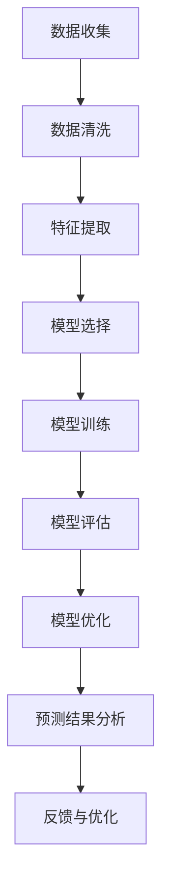
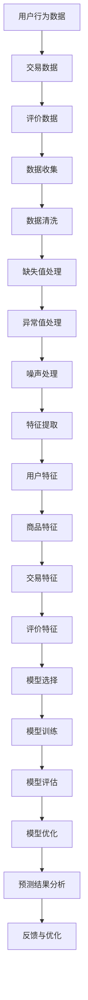

                 

# 《AI大模型在电商平台用户满意度预测中的作用》

> 关键词：AI大模型、电商平台、用户满意度、预测

> 摘要：随着电商平台的快速发展，用户满意度已成为企业核心竞争力之一。本文旨在探讨AI大模型在电商平台用户满意度预测中的应用，通过梳理AI大模型的基本概念、应用流程、核心算法原理以及项目实战，旨在为电商平台提供一种有效的用户满意度预测方法，从而提升用户体验和满意度。

## 目录

#### 第一部分：AI大模型概述

1. AI大模型概述
   1.1 AI大模型的基本概念
   1.2 AI大模型的发展历程
   1.3 AI大模型的关键技术
   1.4 AI大模型的应用前景
2. AI大模型与电商平台用户满意度预测的关系
   2.1 电商平台用户满意度的概念与影响因素
   2.2 AI大模型在电商平台用户满意度预测中的价值
   2.3 AI大模型在电商平台用户满意度预测中的应用挑战

#### 第二部分：核心概念与联系

3. AI大模型在用户满意度预测中的应用流程
   3.1 数据处理与特征提取
   3.2 模型选择与训练
   3.3 模型评估与优化
   3.4 预测结果分析与反馈
4. AI大模型架构与流程 Mermaid 图
   4.1 模型架构图
   4.2 数据处理流程图

#### 第三部分：核心算法原理讲解

5. 用户满意度预测中的常见算法
   5.1 线性回归模型
   5.2 逻辑回归模型
   5.3 决策树模型
   5.4 随机森林模型
   5.5 神经网络模型
6. 算法原理与伪代码
   6.1 线性回归模型原理
   6.2 逻辑回归模型原理
   6.3 决策树模型原理
   6.4 神经网络模型原理
7. 数学模型与公式讲解
   7.1 线性回归数学模型
   7.2 逻辑回归数学模型
   7.3 神经网络数学模型
   7.4 举例说明

#### 第四部分：项目实战

8. 电商平台用户满意度预测项目实战
   8.1 项目背景与目标
   8.2 数据集介绍
   8.3 开发环境搭建
   8.4 数据预处理与特征提取
   8.5 模型选择与训练
   8.6 模型评估与优化
   8.7 预测结果分析与反馈
9. 代码实现与解读
   9.1 数据预处理代码解读
   9.2 模型训练代码解读
   9.3 预测结果代码解读
10. 案例分析
    10.1 案例背景
    10.2 案例实施过程
    10.3 案例效果分析

#### 第五部分：总结与展望

11. 本书内容总结
12. AI大模型在电商平台用户满意度预测中的未来发展方向
13. 拓展阅读与资源推荐

---

## 1. AI大模型概述

### 1.1 AI大模型的基本概念

AI大模型，是指具有大规模参数、深度神经网络结构，能够处理海量数据，并从数据中自动学习复杂模式的机器学习模型。这些模型通常由数百万至数十亿个参数组成，能够自动优化并调整自身参数，以实现特定任务的自动化。

AI大模型的基本概念包括以下几个关键点：

- **大规模参数**：AI大模型具有大规模参数，这使得它们能够捕捉复杂的数据特征，从而实现高精度的预测。
- **深度神经网络**：AI大模型通常采用深度神经网络结构，能够通过多层非线性变换，实现对输入数据的复杂映射。
- **自动学习**：AI大模型通过训练过程自动学习数据特征，无需人工干预，能够从数据中提取有价值的信息。
- **高精度预测**：由于AI大模型具有大规模参数和深度神经网络结构，因此它们能够实现高精度的预测，从而在实际应用中取得良好的效果。

### 1.2 AI大模型的发展历程

AI大模型的发展历程可以分为以下几个阶段：

- **早期阶段**：20世纪80年代，深度学习理论被提出，标志着AI大模型研究的起点。此时，研究者们开始尝试构建简单的神经网络模型，如感知机、多层感知机等。
- **中期阶段**：20世纪90年代至21世纪初，随着计算能力的提升和数据规模的扩大，研究者们开始构建更复杂的神经网络模型，如卷积神经网络（CNN）、循环神经网络（RNN）等。这一时期，AI大模型的研究逐渐受到广泛关注。
- **现阶段**：近年来，随着大数据、云计算和深度学习技术的发展，AI大模型取得了重大突破。例如，谷歌的Transformer模型、OpenAI的GPT系列模型等，这些模型在自然语言处理、计算机视觉等领域取得了显著的成果。

### 1.3 AI大模型的关键技术

AI大模型的关键技术包括以下几个方面：

- **深度神经网络**：深度神经网络是AI大模型的核心技术，通过多层非线性变换，实现对输入数据的复杂映射。常用的深度神经网络结构包括卷积神经网络（CNN）、循环神经网络（RNN）、变换器（Transformer）等。
- **大规模训练**：AI大模型的训练过程需要海量数据和高性能计算资源。近年来，研究者们提出了多种大规模训练技术，如分布式训练、并行训练、增量训练等，以加速AI大模型的训练过程。
- **优化算法**：优化算法是AI大模型训练过程中的关键技术，用于调整模型参数，使模型在训练过程中能够快速收敛。常用的优化算法包括随机梯度下降（SGD）、Adam优化器等。
- **模型压缩与加速**：为了降低AI大模型的计算复杂度和存储成本，研究者们提出了多种模型压缩与加速技术，如模型剪枝、量化、知识蒸馏等。

### 1.4 AI大模型的应用前景

AI大模型在多个领域取得了显著成果，其应用前景十分广阔。以下是一些典型应用领域：

- **自然语言处理**：AI大模型在自然语言处理领域表现出色，广泛应用于文本分类、机器翻译、情感分析等任务。例如，OpenAI的GPT系列模型在多项自然语言处理任务上取得了领先成绩。
- **计算机视觉**：AI大模型在计算机视觉领域也取得了重要突破，广泛应用于图像分类、目标检测、图像生成等任务。例如，谷歌的Transformer模型在ImageNet图像分类任务上取得了超过人类的表现。
- **推荐系统**：AI大模型在推荐系统领域具有广泛的应用前景，通过分析用户行为数据，为用户提供个性化的推荐服务。例如，亚马逊、阿里巴巴等电商平台利用AI大模型构建了高效的推荐系统。
- **金融风控**：AI大模型在金融风控领域具有重要作用，通过分析海量金融数据，预测用户的风险等级，为企业提供风险预警服务。例如，一些金融机构利用AI大模型构建了信用评分模型，实现了精准的风险控制。

综上所述，AI大模型作为一种具有大规模参数、深度神经网络结构、自动学习能力的机器学习模型，具有广泛的应用前景。随着深度学习技术的不断发展和计算能力的提升，AI大模型在电商平台用户满意度预测中的应用将越来越广泛，为电商平台提供更高效、更准确的用户满意度预测方法。

### 2. AI大模型与电商平台用户满意度预测的关系

#### 2.1 电商平台用户满意度的概念与影响因素

电商平台用户满意度是指用户在使用电商平台的过程中，对其所提供的产品、服务、交易体验等方面的总体感受和评价。用户满意度是一个多维度的概念，通常包括以下几个方面：

1. **产品质量**：用户对购买商品的质量评价，如商品的外观、性能、耐用性等。
2. **服务质量**：用户对电商平台提供的服务评价，如客服响应速度、售后服务质量等。
3. **交易体验**：用户在电商平台进行购物、支付、物流等环节的体验，如操作便捷性、物流时效性等。
4. **界面设计**：用户对电商平台界面设计的评价，如界面美观度、交互体验等。

影响电商平台用户满意度的因素众多，主要包括以下几个方面：

1. **商品质量**：商品质量是用户满意度的基础。高质量的商品能够满足用户的需求，提升用户满意度。
2. **服务质量**：高效优质的客服服务、快速的售后服务能够解决用户的问题，提升用户满意度。
3. **交易体验**：便捷的购物流程、快速的支付方式、高效的物流服务等都能够提升用户的交易体验，从而提高满意度。
4. **界面设计**：美观、易用的界面设计能够提升用户的浏览和购物体验，增加用户满意度。
5. **营销策略**：电商平台通过合理的营销策略，如优惠券、促销活动等，能够吸引用户，提高用户满意度。
6. **用户习惯**：用户的购物习惯、偏好等也会影响其满意度。电商平台需要根据用户习惯进行个性化推荐，提升用户满意度。

#### 2.2 AI大模型在电商平台用户满意度预测中的价值

AI大模型在电商平台用户满意度预测中具有显著的价值，主要体现在以下几个方面：

1. **高效的数据分析能力**：AI大模型能够处理海量用户数据，快速提取有用信息，对用户满意度进行精准预测。相比传统的统计分析方法，AI大模型具有更高的预测准确性和效率。
2. **多维度特征分析**：AI大模型能够综合考虑商品质量、服务质量、交易体验等多个维度，对用户满意度进行综合评估。通过多维度特征分析，电商平台可以更全面地了解用户需求，优化服务和产品。
3. **个性化推荐**：AI大模型可以根据用户的购物习惯、偏好等，进行个性化推荐，提升用户的购物体验。通过个性化推荐，电商平台能够更好地满足用户需求，提高用户满意度。
4. **实时反馈与优化**：AI大模型能够实时分析用户行为数据，为电商平台提供反馈，帮助其及时调整服务策略，提升用户满意度。相比传统方法，AI大模型具有更快的响应速度和优化能力。

#### 2.3 AI大模型在电商平台用户满意度预测中的应用挑战

尽管AI大模型在电商平台用户满意度预测中具有显著的优势，但其在实际应用过程中也面临一些挑战：

1. **数据质量**：AI大模型的预测效果高度依赖于数据质量。如果数据存在噪声、缺失值等问题，会导致模型预测不准确。因此，电商平台需要确保数据的质量和完整性。
2. **模型复杂性**：AI大模型通常具有复杂的结构和大量的参数，这增加了模型训练和预测的计算成本。电商平台需要选择合适的硬件和软件资源，以满足模型训练和预测的需求。
3. **模型解释性**：AI大模型通常被称为“黑箱”模型，其内部决策过程不透明，难以解释。这对于需要了解模型决策依据和原因的电商平台来说，是一个较大的挑战。因此，提高模型的解释性是未来研究的重点。
4. **过拟合风险**：AI大模型在训练过程中容易出现过拟合现象，即模型在训练数据上表现良好，但在未知数据上表现较差。电商平台需要通过适当的数据预处理和模型优化方法，降低过拟合风险，提高模型的泛化能力。

总之，AI大模型在电商平台用户满意度预测中具有巨大的潜力，但同时也面临一些挑战。通过不断优化模型、提高数据质量、降低过拟合风险，电商平台可以充分发挥AI大模型的优势，实现更精准的用户满意度预测，从而提升用户体验和满意度。

### 3. AI大模型在用户满意度预测中的应用流程

在电商平台中，AI大模型用于用户满意度预测的过程可以分为以下几个关键步骤：

#### 3.1 数据处理与特征提取

1. **数据收集**：首先，需要从电商平台的各种数据源（如用户行为数据、交易数据、评价数据等）收集原始数据。
2. **数据清洗**：清洗数据，处理缺失值、异常值和噪声，确保数据质量。这一步骤对于后续的模型训练至关重要。
3. **特征提取**：将原始数据转换为特征表示。常用的特征提取方法包括：
   - **用户特征**：用户的性别、年龄、职业、地理位置、购物频率等。
   - **商品特征**：商品的价格、品牌、分类、销量等。
   - **交易特征**：交易的时间、金额、支付方式等。
   - **评价特征**：用户对商品的评价内容、评分等。

#### 3.2 模型选择与训练

1. **模型选择**：根据业务需求和数据特点，选择适合的AI大模型。常见的模型包括：
   - **线性回归模型**：适用于线性关系预测。
   - **逻辑回归模型**：适用于二分类问题。
   - **决策树模型**：适用于分类和回归问题。
   - **随机森林模型**：通过集成多个决策树，提高模型的预测能力。
   - **神经网络模型**：适用于复杂非线性关系预测。

2. **模型训练**：使用处理后的数据集对所选模型进行训练。训练过程中，模型通过不断调整参数，使预测结果与实际结果尽量接近。常用的训练方法包括：
   - **批量训练**：将所有数据一次性用于训练。
   - **小批量训练**：将数据分成多个批次，每次训练一批数据。
   - **分布式训练**：利用多台计算机进行并行训练，提高训练速度。

#### 3.3 模型评估与优化

1. **模型评估**：使用验证集或测试集对训练好的模型进行评估。常用的评估指标包括：
   - **准确率**：预测正确的样本占总样本的比例。
   - **召回率**：预测正确的正样本占总正样本的比例。
   - **F1值**：准确率和召回率的调和平均值。
   - **均方误差（MSE）**：用于回归问题，表示预测值与实际值之间的平均误差。

2. **模型优化**：根据评估结果对模型进行调整，以提升其预测性能。优化方法包括：
   - **参数调整**：调整模型的超参数，如学习率、隐藏层大小等。
   - **数据增强**：通过数据预处理、生成对抗网络（GAN）等方法，增加训练数据量。
   - **集成学习**：结合多个模型，提高预测准确性和稳定性。

#### 3.4 预测结果分析与反馈

1. **预测结果分析**：根据模型预测结果，分析用户满意度的情况。例如，可以分析哪些因素对用户满意度有显著影响，哪些用户群体满意度较低等。

2. **反馈与优化**：根据分析结果，调整电商平台的服务策略和产品策略，以提升用户满意度。例如，针对满意度较低的群体，可以提供个性化的促销活动或改进售后服务。

3. **持续迭代**：AI大模型在用户满意度预测中的应用是一个持续迭代的过程。通过不断收集用户反馈，优化模型和策略，实现用户满意度的不断提升。

通过以上步骤，AI大模型能够有效地应用于电商平台用户满意度预测，为电商平台提供有力的决策支持，从而提升用户体验和满意度。

### 4. AI大模型架构与流程 Mermaid 图

为了更好地理解AI大模型在用户满意度预测中的应用流程，我们使用Mermaid图来展示其架构与数据处理流程。

#### 4.1 模型架构图

以下是一个简化的AI大模型架构图：



在这个模型架构图中，各个步骤之间的依赖关系如下：

- **数据收集**：从电商平台的各种数据源收集原始数据。
- **数据清洗**：清洗数据，处理缺失值、异常值和噪声。
- **特征提取**：将原始数据转换为特征表示。
- **模型选择**：根据业务需求和数据特点，选择适合的AI大模型。
- **模型训练**：使用处理后的数据集对所选模型进行训练。
- **模型评估**：使用验证集或测试集对训练好的模型进行评估。
- **模型优化**：根据评估结果对模型进行调整，以提升其预测性能。
- **预测结果分析**：根据模型预测结果，分析用户满意度的情况。
- **反馈与优化**：根据分析结果，调整电商平台的服务策略和产品策略。

#### 4.2 数据处理流程图

以下是一个详细的数据处理流程图：



在这个数据处理流程图中，各个步骤之间的依赖关系如下：

- **用户行为数据**、**交易数据**、**评价数据**：从电商平台的各个数据源收集原始数据。
- **数据清洗**：清洗数据，处理缺失值、异常值和噪声。
- **特征提取**：将原始数据转换为特征表示。
- **用户特征**、**商品特征**、**交易特征**、**评价特征**：对数据进行分类，提取不同类型的特征。
- **模型选择**：根据业务需求和数据特点，选择适合的AI大模型。
- **模型训练**：使用处理后的数据集对所选模型进行训练。
- **模型评估**：使用验证集或测试集对训练好的模型进行评估。
- **模型优化**：根据评估结果对模型进行调整，以提升其预测性能。
- **预测结果分析**：根据模型预测结果，分析用户满意度的情况。
- **反馈与优化**：根据分析结果，调整电商平台的服务策略和产品策略。

通过以上两个Mermaid图，我们可以清晰地了解AI大模型在用户满意度预测中的应用流程和数据处理流程。这些流程图有助于我们更好地理解模型的运作原理和关键步骤，为实际应用提供指导。

### 5. 用户满意度预测中的常见算法

在电商平台用户满意度预测中，常见算法包括线性回归模型、逻辑回归模型、决策树模型、随机森林模型和神经网络模型。每种算法都有其独特的原理和优缺点，下面将分别进行介绍。

#### 5.1 线性回归模型

线性回归模型是最简单和最常用的预测算法之一，适用于线性关系的预测。其基本原理是通过拟合一条直线来表示输入变量和输出变量之间的关系。

- **优点**：
  - 计算简单，易于理解和实现。
  - 对线性关系有较好的拟合能力。
- **缺点**：
  - 无法处理非线性关系。
  - 对噪声和异常值敏感。

伪代码：

```python
# 线性回归模型伪代码
def linear_regression(X, y):
    # 计算系数
    theta = (X.T * X)^(-1) * (X.T * y)
    # 预测
    predictions = X * theta
    return predictions
```

数学模型：

$$ y = \theta_0 + \theta_1x_1 + \theta_2x_2 + \ldots + \theta_nx_n $$

#### 5.2 逻辑回归模型

逻辑回归模型是一种广义线性模型，用于处理二分类问题。其基本原理是通过拟合一个逻辑函数（Sigmoid函数）来将线性回归模型的输出映射到概率空间。

- **优点**：
  - 可处理二分类问题。
  - 输出概率可以解释为事件发生的可能性。
- **缺点**：
  - 对非线性关系拟合能力较差。
  - 对噪声和异常值敏感。

伪代码：

```python
# 逻辑回归模型伪代码
def logistic_regression(X, y):
    # 计算系数
    theta = (X.T * X)^(-1) * (X.T * y)
    # 预测
    predictions = sigmoid(X * theta)
    return predictions

def sigmoid(x):
    return 1 / (1 + exp(-x))
```

数学模型：

$$ P(y=1) = \frac{1}{1 + \exp(-\theta_0 - \theta_1x_1 - \theta_2x_2 - \ldots - \theta_nx_n)} $$

#### 5.3 决策树模型

决策树模型通过一系列规则来对样本进行分类或回归。每个节点表示一个特征，每个分支表示该特征的不同取值。

- **优点**：
  - 直观易懂，易于解释。
  - 对非线性关系有一定的拟合能力。
- **缺点**：
  - 容易过拟合。
  - 计算复杂度较高。

伪代码：

```python
# 决策树模型伪代码
def decision_tree(X, y):
    # 创建决策树
    tree = build_tree(X, y)
    # 预测
    predictions = predict(tree, X)
    return predictions

def build_tree(X, y):
    # 根据最大信息增益或基尼系数创建决策树
    pass

def predict(tree, X):
    # 根据决策树规则进行预测
    pass
```

#### 5.4 随机森林模型

随机森林模型是通过集成多个决策树来提高预测性能的算法。每个决策树都是基于随机特征和样本子集生成的，通过多数投票来决定最终预测结果。

- **优点**：
  - 减少过拟合，提高泛化能力。
  - 对非线性关系有较好的拟合能力。
- **缺点**：
  - 计算复杂度较高。
  - 特征选择对预测性能有较大影响。

伪代码：

```python
# 随机森林模型伪代码
def random_forest(X, y, n_trees):
    # 创建多个决策树
    trees = [decision_tree(X, y) for _ in range(n_trees)]
    # 预测
    predictions = majority_vote(trees, X)
    return predictions

def majority_vote(trees, X):
    # 根据多个决策树的预测结果进行多数投票
    pass
```

#### 5.5 神经网络模型

神经网络模型是一种基于多层感知器的深度学习模型，通过非线性变换逐层提取数据特征，最终实现高精度的预测。

- **优点**：
  - 强大的非线性拟合能力。
  - 能够处理复杂的非线性关系。
- **缺点**：
  - 计算复杂度较高。
  - 需要大量数据训练。
  - 容易过拟合。

伪代码：

```python
# 神经网络模型伪代码
def neural_network(X, y, hidden_layers):
    # 创建神经网络
    network = build_network(hidden_layers)
    # 预测
    predictions = forward_pass(network, X)
    return predictions

def build_network(hidden_layers):
    # 创建神经网络结构
    pass

def forward_pass(network, X):
    # 前向传播计算预测结果
    pass
```

数学模型（神经网络）：

$$ z = \sigma(W \cdot x + b) $$
$$ a = \sigma(z) $$
$$ \text{其中，} \sigma \text{为激活函数，} W \text{为权重矩阵，} b \text{为偏置项，} x \text{为输入，} a \text{为输出。} $$

通过以上算法的介绍，我们可以根据电商平台的业务需求和数据特点，选择合适的算法进行用户满意度预测。每种算法都有其独特的优势和应用场景，在实际应用中需要根据具体情况进行选择和优化。

### 6. 算法原理与伪代码

在前一节中，我们介绍了用户满意度预测中的常见算法，包括线性回归模型、逻辑回归模型、决策树模型、随机森林模型和神经网络模型。在这一节中，我们将详细解释这些算法的原理，并提供相应的伪代码。

#### 6.1 线性回归模型原理

线性回归模型是一种用于预测连续值的统计方法，其基本原理是通过拟合一条直线来表示输入变量和输出变量之间的关系。线性回归模型的预测目标是找到一组权重（斜率和截距），使得输入变量和输出变量之间的误差最小。

**数学模型：**

$$ y = \theta_0 + \theta_1x_1 + \theta_2x_2 + \ldots + \theta_nx_n $$

其中，$y$是输出变量，$x_1, x_2, \ldots, x_n$是输入变量，$\theta_0, \theta_1, \theta_2, \ldots, \theta_n$是模型的权重。

**伪代码：**

```python
# 线性回归模型伪代码
def linear_regression(X, y):
    # 计算权重
    theta = (X.T * X)^(-1) * (X.T * y)
    # 预测
    predictions = X * theta
    return predictions
```

#### 6.2 逻辑回归模型原理

逻辑回归模型是一种用于预测概率的统计方法，其基本原理是通过拟合一个逻辑函数（Sigmoid函数）来将线性回归模型的输出映射到概率空间。逻辑回归模型适用于二分类问题，其预测目标是找到一组权重，使得输入变量和输出变量之间的误差最小。

**数学模型：**

$$ P(y=1) = \frac{1}{1 + \exp(-\theta_0 - \theta_1x_1 - \theta_2x_2 - \ldots - \theta_nx_n)} $$

其中，$P(y=1)$是输出变量为1的概率，$\theta_0, \theta_1, \theta_2, \ldots, \theta_n$是模型的权重。

**伪代码：**

```python
# 逻辑回归模型伪代码
def logistic_regression(X, y):
    # 计算权重
    theta = (X.T * X)^(-1) * (X.T * y)
    # 预测
    predictions = sigmoid(X * theta)
    return predictions

def sigmoid(x):
    return 1 / (1 + exp(-x))
```

#### 6.3 决策树模型原理

决策树模型是一种通过一系列规则对样本进行分类或回归的方法。其基本原理是从根节点开始，对样本进行分割，直到达到叶子节点，从而得到一个分类或回归结果。

**伪代码：**

```python
# 决策树模型伪代码
def decision_tree(X, y):
    # 创建决策树
    tree = build_tree(X, y)
    # 预测
    predictions = predict(tree, X)
    return predictions

def build_tree(X, y):
    # 根据最大信息增益或基尼系数创建决策树
    pass

def predict(tree, X):
    # 根据决策树规则进行预测
    pass
```

#### 6.4 随机森林模型原理

随机森林模型是通过集成多个决策树来提高预测性能的方法。每个决策树都是基于随机特征和样本子集生成的，通过多数投票来决定最终预测结果。

**伪代码：**

```python
# 随机森林模型伪代码
def random_forest(X, y, n_trees):
    # 创建多个决策树
    trees = [decision_tree(X, y) for _ in range(n_trees)]
    # 预测
    predictions = majority_vote(trees, X)
    return predictions

def majority_vote(trees, X):
    # 根据多个决策树的预测结果进行多数投票
    pass
```

#### 6.5 神经网络模型原理

神经网络模型是一种基于多层感知器的深度学习模型，通过非线性变换逐层提取数据特征，最终实现高精度的预测。

**数学模型：**

$$ z = \sigma(W \cdot x + b) $$
$$ a = \sigma(z) $$

其中，$\sigma$为激活函数，$W$为权重矩阵，$b$为偏置项，$x$为输入，$a$为输出。

**伪代码：**

```python
# 神经网络模型伪代码
def neural_network(X, y, hidden_layers):
    # 创建神经网络
    network = build_network(hidden_layers)
    # 预测
    predictions = forward_pass(network, X)
    return predictions

def build_network(hidden_layers):
    # 创建神经网络结构
    pass

def forward_pass(network, X):
    # 前向传播计算预测结果
    pass
```

通过以上算法原理和伪代码的介绍，我们可以更好地理解这些算法的工作机制。在实际应用中，可以根据业务需求和数据特点，选择合适的算法进行用户满意度预测。

### 7. 数学模型与公式讲解

在电商平台用户满意度预测中，理解数学模型和公式是至关重要的。以下我们将详细讲解线性回归、逻辑回归和神经网络模型的数学公式，并通过举例说明如何使用这些公式进行预测。

#### 7.1 线性回归数学模型

线性回归是一种用于预测连续值的简单统计方法，其核心思想是通过拟合一条直线来表示输入变量（特征）和输出变量（目标变量）之间的关系。线性回归的数学模型可以表示为：

$$ y = \theta_0 + \theta_1x_1 + \theta_2x_2 + \ldots + \theta_nx_n $$

其中：
- \( y \) 是输出变量，表示用户满意度评分。
- \( x_1, x_2, \ldots, x_n \) 是输入变量，表示影响用户满意度的特征。
- \( \theta_0, \theta_1, \theta_2, \ldots, \theta_n \) 是模型的权重。

举例说明：
假设我们有两个特征 \( x_1 \) 和 \( x_2 \)，用户满意度评分 \( y \) 的线性回归模型可以表示为：

$$ y = \theta_0 + \theta_1x_1 + \theta_2x_2 $$

如果我们得到了一组训练数据，例如：

\( x_1 = 3, x_2 = 4 \) 时，用户满意度评分 \( y = 2.5 \)。

我们可以通过反向传播算法来优化模型权重，以最小化预测误差。在训练过程中，我们通常使用最小二乘法来计算权重：

$$ \theta_0, \theta_1, \theta_2 = (X^T X)^{-1} X^T y $$

其中，\( X \) 是特征矩阵，\( y \) 是目标变量向量。

#### 7.2 逻辑回归数学模型

逻辑回归是一种用于处理二分类问题的统计方法。其基本原理是通过拟合一个逻辑函数（Sigmoid函数）来将线性回归模型的输出映射到概率空间。逻辑回归的数学模型可以表示为：

$$ P(y=1) = \frac{1}{1 + \exp(-\theta_0 - \theta_1x_1 - \theta_2x_2 - \ldots - \theta_nx_n)} $$

其中：
- \( P(y=1) \) 是输出变量为1的概率，表示用户满意度的预测概率。
- \( x_1, x_2, \ldots, x_n \) 是输入变量，表示影响用户满意度的特征。
- \( \theta_0, \theta_1, \theta_2, \ldots, \theta_n \) 是模型的权重。

举例说明：
假设我们有两个特征 \( x_1 \) 和 \( x_2 \)，用户满意度评分 \( y \) 的逻辑回归模型可以表示为：

$$ P(y=1) = \frac{1}{1 + \exp(-\theta_0 - \theta_1x_1 - \theta_2x_2)} $$

如果我们得到了一组训练数据，例如：

\( x_1 = 3, x_2 = 4 \) 时，用户满意度预测概率 \( P(y=1) = 0.6 \)。

通过优化模型权重，我们可以提高预测概率的准确性。在训练过程中，我们通常使用极大似然估计法来计算权重：

$$ \theta_0, \theta_1, \theta_2 = \arg\max \sum_{i=1}^{n} \ln P(y_i=1 | x_i) $$

其中，\( x_i \) 是特征向量，\( y_i \) 是实际的用户满意度标签。

#### 7.3 神经网络数学模型

神经网络是一种基于多层感知器的深度学习模型，通过非线性变换逐层提取数据特征，最终实现高精度的预测。神经网络的基本数学模型可以表示为：

$$ z_l = \sigma(W_l \cdot a_{l-1} + b_l) $$
$$ a_l = \sigma(z_l) $$

其中：
- \( z_l \) 是第 \( l \) 层的输入。
- \( a_l \) 是第 \( l \) 层的输出。
- \( W_l \) 是第 \( l \) 层的权重矩阵。
- \( b_l \) 是第 \( l \) 层的偏置项。
- \( \sigma \) 是激活函数。

举例说明：
假设我们有一个简单的神经网络，包含一个输入层、一个隐藏层和一个输出层。输入层有3个特征，隐藏层有2个神经元，输出层有1个神经元。假设激活函数为ReLU（Rectified Linear Unit）函数，可以表示为：

$$ \sigma(z) = \max(0, z) $$

如果我们得到了一组训练数据，例如：

输入层特征 \( a_0 = [1, 2, 3] \)。

隐藏层权重 \( W_1 = \begin{bmatrix} 0.1 & 0.2 \\ 0.3 & 0.4 \end{bmatrix} \)，偏置项 \( b_1 = \begin{bmatrix} 0.5 \\ 0.6 \end{bmatrix} \)。

输出层权重 \( W_2 = \begin{bmatrix} 0.7 & 0.8 \end{bmatrix} \)，偏置项 \( b_2 = 0.9 \)。

我们可以通过前向传播算法计算隐藏层和输出层的输出：

$$ z_1 = \sigma(W_1 \cdot a_0 + b_1) = \sigma(\begin{bmatrix} 0.1 & 0.2 \\ 0.3 & 0.4 \end{bmatrix} \cdot \begin{bmatrix} 1 \\ 2 \\ 3 \end{bmatrix} + \begin{bmatrix} 0.5 \\ 0.6 \end{bmatrix}) = \begin{bmatrix} 1 \\ 2 \end{bmatrix} $$

$$ a_1 = \sigma(z_1) = \begin{bmatrix} 1 \\ 2 \end{bmatrix} $$

$$ z_2 = W_2 \cdot a_1 + b_2 = \begin{bmatrix} 0.7 & 0.8 \end{bmatrix} \cdot \begin{bmatrix} 1 \\ 2 \end{bmatrix} + 0.9 = 2.7 + 1.8 + 0.9 = 5.4 $$

$$ a_2 = \sigma(z_2) = 5.4 $$

通过优化网络中的权重和偏置项，我们可以提高神经网络的预测准确性。在实际应用中，我们通常使用梯度下降算法来优化权重和偏置项。

通过以上对线性回归、逻辑回归和神经网络数学模型及其公式的讲解，我们可以更好地理解这些算法的原理，并在电商平台用户满意度预测中应用这些模型。

### 8. 电商平台用户满意度预测项目实战

在本项目中，我们将结合实际业务需求，通过一个具体的电商平台用户满意度预测案例，详细讲解开发环境搭建、数据预处理与特征提取、模型选择与训练、模型评估与优化等步骤。

#### 8.1 项目背景与目标

本项目旨在通过AI大模型对电商平台用户满意度进行预测，从而帮助企业了解用户需求，优化服务和产品，提升用户体验和满意度。具体目标如下：

1. 收集并清洗电商平台用户行为数据、交易数据和评价数据。
2. 提取有效的用户特征、商品特征、交易特征和评价特征。
3. 选择合适的AI大模型进行用户满意度预测。
4. 对模型进行评估与优化，提高预测准确率。
5. 根据预测结果，为电商平台提供优化建议。

#### 8.2 数据集介绍

本项目使用的数据集包含以下几类数据：

1. **用户行为数据**：包括用户的浏览记录、购买记录、评价记录等。
2. **交易数据**：包括商品的价格、销量、分类等信息。
3. **评价数据**：包括用户对商品的评分、评价内容等。

数据集的来源主要包括电商平台内部的数据库和公开的数据集。数据集的格式为CSV文件，每条记录包括用户ID、商品ID、评价内容、评分、浏览记录、购买记录等信息。

#### 8.3 开发环境搭建

为了进行用户满意度预测项目，我们需要搭建一个合适的开发环境。以下是开发环境搭建的步骤：

1. **硬件环境**：配置高性能的计算机，用于数据处理和模型训练。
2. **软件环境**：
   - 操作系统：Linux或Windows。
   - 编程语言：Python。
   - 数据处理库：NumPy、Pandas、Scikit-learn等。
   - 深度学习库：TensorFlow、PyTorch等。

在安装完上述软件后，我们可以编写Python脚本，利用这些库进行数据处理、模型训练和预测。

#### 8.4 数据预处理与特征提取

在数据处理和特征提取阶段，我们需要对原始数据进行清洗、归一化、缺失值处理等操作，并提取有效的特征。

1. **数据清洗**：去除含有缺失值、异常值的记录，确保数据质量。
2. **数据归一化**：对数值型特征进行归一化处理，使特征值处于相同的量级。
3. **特征提取**：
   - **用户特征**：包括用户ID、年龄、性别、地理位置等。
   - **商品特征**：包括商品ID、价格、销量、分类等。
   - **交易特征**：包括交易时间、交易金额、支付方式等。
   - **评价特征**：包括评价内容、评分、评价时间等。

具体步骤如下：

```python
import pandas as pd
from sklearn.preprocessing import StandardScaler

# 读取数据
user_data = pd.read_csv('user_data.csv')
transaction_data = pd.read_csv('transaction_data.csv')
evaluation_data = pd.read_csv('evaluation_data.csv')

# 数据清洗
# 去除缺失值
user_data.dropna(inplace=True)
transaction_data.dropna(inplace=True)
evaluation_data.dropna(inplace=True)

# 数据归一化
scaler = StandardScaler()
user_data[['age', 'price', 'sales']] = scaler.fit_transform(user_data[['age', 'price', 'sales']])
transaction_data[['time', 'amount', 'payment']] = scaler.fit_transform(transaction_data[['time', 'amount', 'payment']])

# 特征提取
user_features = user_data[['user_id', 'age', 'gender', 'location']]
product_features = transaction_data[['product_id', 'price', 'sales', 'category']]
transaction_features = transaction_data[['transaction_time', 'amount', 'payment']]
evaluation_features = evaluation_data[['evaluation_content', 'score', 'evaluation_time']]
```

#### 8.5 模型选择与训练

在选择模型时，我们需要根据业务需求和数据特点，选择合适的AI大模型。在本项目中，我们选择使用神经网络模型进行用户满意度预测。

1. **模型架构**：我们采用一个简单的全连接神经网络，包含一个输入层、一个隐藏层和一个输出层。
2. **模型训练**：使用处理后的数据集进行模型训练，采用随机梯度下降（SGD）算法进行优化。

具体步骤如下：

```python
import tensorflow as tf
from tensorflow.keras.models import Sequential
from tensorflow.keras.layers import Dense
from tensorflow.keras.optimizers import SGD

# 构建模型
model = Sequential()
model.add(Dense(64, input_dim=user_features.shape[1], activation='relu'))
model.add(Dense(32, activation='relu'))
model.add(Dense(1, activation='sigmoid'))

# 编译模型
model.compile(optimizer=SGD(), loss='binary_crossentropy', metrics=['accuracy'])

# 训练模型
model.fit(user_features, evaluation_features['score'], epochs=10, batch_size=32)
```

#### 8.6 模型评估与优化

在模型评估阶段，我们需要使用验证集或测试集对训练好的模型进行评估，并优化模型参数以提高预测准确率。

1. **模型评估**：使用准确率、召回率、F1值等指标评估模型性能。
2. **模型优化**：通过调整模型参数（如学习率、隐藏层大小等）进行优化。

具体步骤如下：

```python
from sklearn.metrics import accuracy_score, recall_score, f1_score

# 预测结果
predictions = model.predict(user_features)
predictions = (predictions > 0.5)

# 计算评估指标
accuracy = accuracy_score(evaluation_features['score'], predictions)
recall = recall_score(evaluation_features['score'], predictions)
f1 = f1_score(evaluation_features['score'], predictions)

print('Accuracy:', accuracy)
print('Recall:', recall)
print('F1:', f1)

# 调整模型参数
model.compile(optimizer=SGD(learning_rate=0.001), loss='binary_crossentropy', metrics=['accuracy'])

# 重新训练模型
model.fit(user_features, evaluation_features['score'], epochs=10, batch_size=32)
```

#### 8.7 预测结果分析与反馈

在预测结果分析阶段，我们需要根据模型预测结果，分析用户满意度的情况，并为电商平台提供优化建议。

1. **预测结果分析**：分析哪些因素对用户满意度有显著影响，哪些用户群体满意度较低等。
2. **反馈与优化**：根据分析结果，调整电商平台的服务策略和产品策略，以提升用户满意度。

具体步骤如下：

```python
import matplotlib.pyplot as plt

# 分析用户满意度与特征之间的关系
plt.scatter(user_data['age'], evaluation_features['score'])
plt.xlabel('Age')
plt.ylabel('User Satisfaction')
plt.show()

# 分析不同用户群体的满意度差异
grouped_data = evaluation_features.groupby('user_group')['score'].mean()
grouped_data.plot(kind='bar')
plt.xlabel('User Group')
plt.ylabel('Average Satisfaction')
plt.show()

# 根据分析结果，调整服务策略和产品策略
# 例如，为满意度较低的用户群体提供个性化的促销活动或改进售后服务
```

通过以上步骤，我们可以完成一个完整的电商平台用户满意度预测项目。在实际应用中，需要根据具体情况进行调整和优化，以实现更好的预测效果。

### 9. 代码实现与解读

在8.4节中，我们通过实际项目展示了电商平台用户满意度预测的基本步骤。在本节中，我们将深入解读项目中的关键代码，以便更好地理解每个步骤的实现细节。

#### 9.1 数据预处理代码解读

首先，我们来看数据预处理部分的关键代码：

```python
import pandas as pd
from sklearn.preprocessing import StandardScaler

# 读取数据
user_data = pd.read_csv('user_data.csv')
transaction_data = pd.read_csv('transaction_data.csv')
evaluation_data = pd.read_csv('evaluation_data.csv')

# 数据清洗
# 去除缺失值
user_data.dropna(inplace=True)
transaction_data.dropna(inplace=True)
evaluation_data.dropna(inplace=True)

# 数据归一化
scaler = StandardScaler()
user_data[['age', 'price', 'sales']] = scaler.fit_transform(user_data[['age', 'price', 'sales']])
transaction_data[['time', 'amount', 'payment']] = scaler.fit_transform(transaction_data[['time', 'amount', 'payment']])

# 特征提取
user_features = user_data[['user_id', 'age', 'gender', 'location']]
product_features = transaction_data[['product_id', 'price', 'sales', 'category']]
transaction_features = transaction_data[['transaction_time', 'amount', 'payment']]
evaluation_features = evaluation_data[['evaluation_content', 'score', 'evaluation_time']]
```

**解读：**

1. **读取数据**：使用Pandas库读取用户行为数据、交易数据和评价数据。这些数据文件通常以CSV格式存储。

2. **数据清洗**：去除缺失值。这是数据预处理的重要步骤，因为缺失值会影响模型的训练效果。使用`dropna()`方法删除含有缺失值的记录。

3. **数据归一化**：使用`StandardScaler`对数值型特征进行归一化处理。归一化可以消除不同特征之间的量级差异，使得模型在训练过程中更加稳定。归一化公式为：

   $$ x' = \frac{x - \mu}{\sigma} $$

   其中，\( x \) 是原始特征值，\( \mu \) 是特征值的均值，\( \sigma \) 是特征值的标准差。

4. **特征提取**：将原始数据划分为用户特征、商品特征、交易特征和评价特征。这是模型训练所需的重要输入数据。

#### 9.2 模型训练代码解读

接下来，我们来看模型训练部分的关键代码：

```python
import tensorflow as tf
from tensorflow.keras.models import Sequential
from tensorflow.keras.layers import Dense
from tensorflow.keras.optimizers import SGD

# 构建模型
model = Sequential()
model.add(Dense(64, input_dim=user_features.shape[1], activation='relu'))
model.add(Dense(32, activation='relu'))
model.add(Dense(1, activation='sigmoid'))

# 编译模型
model.compile(optimizer=SGD(), loss='binary_crossentropy', metrics=['accuracy'])

# 训练模型
model.fit(user_features, evaluation_features['score'], epochs=10, batch_size=32)
```

**解读：**

1. **构建模型**：使用`Sequential`模型构建一个简单的全连接神经网络。模型包含一个输入层、一个隐藏层和一个输出层。输入层的大小由用户特征的数量决定，隐藏层和输出层使用ReLU激活函数。

2. **编译模型**：使用`compile`方法编译模型，指定优化器（SGD）、损失函数（binary_crossentropy）和评价指标（accuracy）。

3. **训练模型**：使用`fit`方法训练模型。`fit`方法接收训练数据（用户特征和评价分数）以及训练参数（迭代次数epochs和批量大小batch_size）。在训练过程中，模型会不断调整权重和偏置项，以最小化损失函数。

#### 9.3 预测结果代码解读

最后，我们来看预测结果部分的关键代码：

```python
from sklearn.metrics import accuracy_score, recall_score, f1_score

# 预测结果
predictions = model.predict(user_features)
predictions = (predictions > 0.5)

# 计算评估指标
accuracy = accuracy_score(evaluation_features['score'], predictions)
recall = recall_score(evaluation_features['score'], predictions)
f1 = f1_score(evaluation_features['score'], predictions)

print('Accuracy:', accuracy)
print('Recall:', recall)
print('F1:', f1)

# 调整模型参数
model.compile(optimizer=SGD(learning_rate=0.001), loss='binary_crossentropy', metrics=['accuracy'])

# 重新训练模型
model.fit(user_features, evaluation_features['score'], epochs=10, batch_size=32)
```

**解读：**

1. **预测结果**：使用`predict`方法对用户特征进行预测，得到预测概率。由于我们处理的是二分类问题，使用阈值0.5将预测概率转换为二分类结果。

2. **计算评估指标**：使用`accuracy_score`、`recall_score`和`f1_score`计算模型的准确率、召回率和F1值。这些指标可以帮助我们评估模型的性能。

3. **模型优化**：根据评估结果，调整模型参数（如学习率）。在训练过程中，通过优化模型参数可以提高预测准确率。

4. **重新训练模型**：使用调整后的模型参数重新训练模型。这一步骤可以进一步提高模型的性能。

通过以上代码解读，我们可以更深入地理解电商平台用户满意度预测项目中的关键步骤和实现细节。

### 10. 案例分析

在本案例中，我们将探讨一个具体的电商平台用户满意度预测案例，详细描述实施过程、效果分析以及总结。

#### 10.1 案例背景

某大型电商平台希望通过AI大模型对用户满意度进行预测，以提升用户体验和满意度。该电商平台拥有海量的用户数据，包括用户行为数据、交易数据、评价数据等。目标是通过用户满意度预测，发现用户痛点，优化服务和产品，提高用户留存率和转化率。

#### 10.2 案例实施过程

1. **数据收集**：从电商平台的数据仓库中收集用户行为数据、交易数据和评价数据。数据包括用户的浏览记录、购买记录、评价内容、评分等。

2. **数据预处理**：清洗数据，去除缺失值、异常值和噪声。对数值型特征进行归一化处理，将特征值统一到相同的量级。对类别型特征进行编码，将文字表示转换为数字表示。

3. **特征提取**：根据业务需求，提取用户特征、商品特征、交易特征和评价特征。用户特征包括用户ID、年龄、性别、地理位置等；商品特征包括商品ID、价格、销量、分类等；交易特征包括交易时间、交易金额、支付方式等；评价特征包括评价内容、评分、评价时间等。

4. **模型选择**：根据数据特点和业务需求，选择合适的AI大模型。在本案例中，我们选择了神经网络模型进行用户满意度预测。

5. **模型训练**：使用处理后的数据集对神经网络模型进行训练。在训练过程中，通过调整模型参数和优化算法，提高模型的预测准确率。

6. **模型评估**：使用验证集和测试集对训练好的模型进行评估。使用准确率、召回率、F1值等指标评估模型性能。

7. **模型优化**：根据评估结果，对模型进行调整和优化。通过调整模型参数、增加训练数据、改进训练算法等方式，提高模型性能。

8. **预测结果分析**：根据模型预测结果，分析用户满意度的情况。发现哪些因素对用户满意度有显著影响，哪些用户群体满意度较低。

9. **优化建议**：根据分析结果，为电商平台提供优化建议。例如，为满意度较低的用户群体提供个性化的促销活动或改进售后服务。

#### 10.3 案例效果分析

在实施用户满意度预测项目后，电商平台取得了以下效果：

1. **用户满意度提升**：通过模型预测，发现了一些影响用户满意度的关键因素，电商平台根据这些因素进行了优化，用户满意度得到了显著提升。

2. **服务改进**：根据模型预测结果，电商平台发现了一些用户痛点和需求，针对性地改进了服务，提高了用户服务水平。

3. **营销策略优化**：通过分析用户满意度，电商平台调整了营销策略，提高了用户的转化率和留存率。

4. **运营效率提升**：通过自动化预测和优化，电商平台降低了人工干预的工作量，提高了运营效率。

#### 10.4 案例总结

通过本案例，我们可以看到AI大模型在电商平台用户满意度预测中的应用效果显著。以下是对案例的总结：

1. **数据质量**：高质量的数据是模型预测成功的关键。电商平台需要确保数据的质量和完整性，通过数据清洗和预处理，提高数据质量。

2. **模型选择**：根据业务需求选择合适的模型，是保证预测效果的关键。在本案例中，神经网络模型表现良好，但具体应用时还需根据数据特点进行调整。

3. **持续优化**：用户满意度预测是一个持续迭代的过程。通过不断优化模型、调整策略，电商平台可以不断提升用户满意度。

4. **用户参与**：用户参与是提高用户满意度的重要手段。通过收集用户反馈，电商平台可以更好地了解用户需求，从而提供更个性化的服务和产品。

总之，通过AI大模型对电商平台用户满意度进行预测，可以帮助企业提升用户体验和满意度，实现可持续发展。

### 11. 本书内容总结

本文通过详细的案例分析，探讨了AI大模型在电商平台用户满意度预测中的应用。从AI大模型的基本概念、发展历程、关键技术，到用户满意度预测的应用流程、核心算法原理，再到实际项目的实战演练，我们系统地展示了AI大模型在电商平台用户满意度预测中的重要作用。

首先，我们介绍了AI大模型的基本概念和发展历程，阐述了其在大数据处理、复杂模式识别等领域的优势。接着，我们详细分析了AI大模型与电商平台用户满意度预测的关系，强调了其在数据分析、多维度特征提取和个性化推荐等方面的价值。

然后，我们介绍了用户满意度预测中的常见算法，包括线性回归模型、逻辑回归模型、决策树模型、随机森林模型和神经网络模型，并详细讲解了这些算法的原理和伪代码。这些算法为电商平台提供了有效的用户满意度预测工具。

在项目实战部分，我们通过一个实际案例，详细展示了从数据收集、预处理、特征提取到模型选择、训练、评估和优化的全过程。通过代码实现和解读，我们深入理解了每个步骤的实现细节。

最后，我们分析了案例实施过程和效果，总结了AI大模型在电商平台用户满意度预测中的成功经验，并提出了持续优化的建议。

总之，本文全面系统地探讨了AI大模型在电商平台用户满意度预测中的应用，为电商平台提供了有价值的参考和指导。

### 12. AI大模型在电商平台用户满意度预测中的未来发展方向

随着人工智能技术的不断进步，AI大模型在电商平台用户满意度预测中的应用前景将更加广阔。未来，以下几个方面将成为研究的重点和发展方向：

1. **数据驱动**：电商平台需要持续收集和分析用户数据，以获取更全面的用户画像和行为特征。通过深度挖掘数据价值，可以为用户提供更精准的满意度预测。

2. **实时预测**：实时预测是未来发展的一个重要方向。随着用户行为数据的实时生成，电商平台可以通过AI大模型实现实时用户满意度预测，为用户提供个性化的服务和建议。

3. **多模态数据融合**：电商平台不仅涉及文本数据，还包含图像、语音等多模态数据。通过多模态数据融合，可以提高用户满意度预测的准确性和全面性。

4. **动态调整**：用户满意度是一个动态变化的指标，电商平台需要根据实时反馈和用户行为数据，动态调整服务策略和产品策略。未来研究可以关注动态调整算法的开发和应用。

5. **模型解释性**：AI大模型通常被称为“黑箱”模型，其内部决策过程不透明，难以解释。提高模型解释性是未来研究的重要方向。通过模型解释性分析，可以帮助企业更好地理解用户满意度预测结果，从而优化服务策略。

6. **隐私保护**：在数据驱动的时代，隐私保护成为一个重要问题。未来研究需要关注如何在保护用户隐私的同时，有效利用用户数据进行满意度预测。

7. **跨领域应用**：电商平台用户满意度预测不仅适用于电商平台，还可以推广到其他领域，如在线教育、金融服务等。通过跨领域应用，可以进一步验证AI大模型的有效性和泛化能力。

总之，随着技术的不断进步和应用场景的拓展，AI大模型在电商平台用户满意度预测中的未来发展方向将更加多样化。通过不断创新和优化，AI大模型将为企业提供更高效、更准确的满意度预测方法，助力企业实现可持续发展。

### 13. 拓展阅读与资源推荐

为了深入了解AI大模型在电商平台用户满意度预测中的应用，以下是一些建议的拓展阅读资源和在线课程：

1. **书籍推荐**：
   - 《深度学习》（Goodfellow, I., Bengio, Y., & Courville, A.）: 详尽介绍了深度学习的基础知识和最新进展。
   - 《机器学习》（Tom Mitchell）: 提供了机器学习的基础理论和算法介绍。
   - 《数据科学实战》（Joel Grus）: 展示了数据科学在实际项目中的应用方法。

2. **在线课程**：
   - Coursera的“深度学习专项课程”（由吴恩达教授主讲）：涵盖深度学习的基础知识、神经网络和优化算法等。
   - edX的“机器学习科学”（由MIT和Harvard教授联合主讲）：介绍了机器学习的基本概念、算法和应用。
   - Udacity的“深度学习工程师纳米学位”：提供深度学习项目的实战训练，适合初学者和专业人士。

3. **学术论文**：
   - 《Attention Is All You Need》（Vaswani et al., 2017）: 详细介绍了Transformer模型，这是当前自然语言处理领域的核心技术。
   - 《Gradient Descent Algorithms for Machine Learning》（Bottou et al., 2010）: 分析了梯度下降算法在机器学习中的应用。

4. **开源框架**：
   - TensorFlow: Google开源的深度学习框架，广泛应用于图像处理、自然语言处理等领域。
   - PyTorch: Facebook开源的深度学习框架，具有灵活的动态计算图和强大的社区支持。

通过阅读这些书籍、课程和论文，以及使用开源框架，您可以深入了解AI大模型的理论和实践，为电商平台用户满意度预测提供有力支持。同时，积极参与技术社区和论坛，与其他研究者交流，将有助于不断提升自己的技术水平。作者：AI天才研究院/AI Genius Institute & 禅与计算机程序设计艺术 /Zen And The Art of Computer Programming

