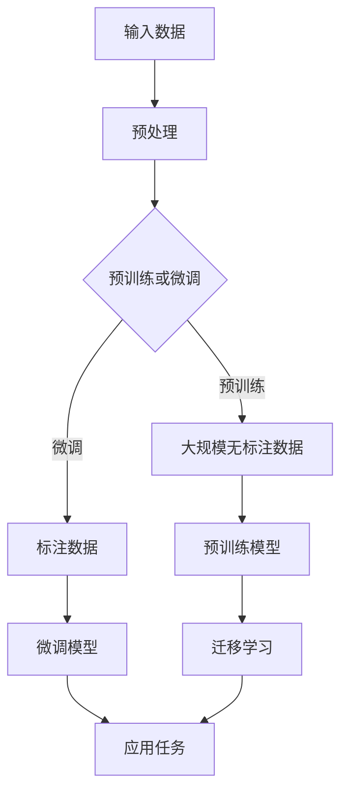
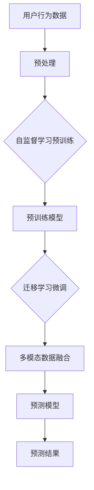

                 

## 文章标题

# AI大模型在电商平台用户行为预测精确化中的应用

> 关键词：AI大模型、电商平台、用户行为预测、精确化、应用

摘要：本文将探讨AI大模型在电商平台用户行为预测中的应用。通过分析AI大模型的基础理论，我们将深入理解这些模型的概述、分类、架构、算法以及面临的挑战和未来发展。在此基础上，我们将详细探讨如何利用AI大模型精确化电商平台用户行为预测，并分享实际案例和最佳实践。最后，文章将对未来的发展方向提出展望。

## 第一部分: AI大模型基础理论

### 第1章: AI大模型概述

#### 1.1 AI大模型的概念与分类

AI大模型（Large-scale Artificial Intelligence Models）指的是参数量在千亿甚至万亿级别的深度学习模型。这些模型能够处理复杂的自然语言任务，如文本生成、情感分析等。AI大模型通常可以分为以下两类：

- **自监督学习模型**：这类模型利用未标注的数据进行预训练，如BERT。它们通过在大量文本数据中预测标签或生成文本来学习语言的模式和结构。

- **监督学习模型**：这类模型在预训练后，通过监督学习微调，以适应特定的任务，如GPT-3。它们在预训练过程中利用了未标注的数据，然后在少量标注数据上进行微调。

#### 1.2 AI大模型的基本架构

AI大模型通常由以下几个基本部分组成：

- **输入层**：接收输入数据，如文本、图像等。

- **隐藏层**：通过多层神经网络结构，对输入数据进行处理和变换。

- **输出层**：生成预测结果，如文本生成、分类标签等。

常见的神经网络结构包括：

- **多层感知器（MLP）**：基础的结构，由多个神经元层组成。

- **卷积神经网络（CNN）**：适用于图像处理任务。

- **循环神经网络（RNN）**：适用于序列数据。

#### 1.3 AI大模型的核心算法

AI大模型的核心算法主要包括预训练、微调和迁移学习：

- **预训练**：在大规模未标注数据上进行训练，提高模型对数据的泛化能力。

- **微调**：在预训练的基础上，使用少量标注数据对模型进行细粒度调整。

- **迁移学习**：将在大规模数据集上预训练的模型应用于新任务，提高新任务的性能。

#### 1.4 AI大模型的挑战与未来发展

尽管AI大模型在自然语言处理、计算机视觉等领域取得了显著的成果，但它们仍面临以下挑战：

- **计算资源消耗**：需要大量的计算资源和存储空间。

- **数据隐私与伦理**：需要保护用户隐私，避免数据泄露。

- **泛化能力**：提高模型对新任务、新数据的适应能力。

未来，AI大模型的发展将重点关注以下几个方面：

- **模型压缩与优化**：通过减少模型参数、降低计算复杂度来提高模型效率。

- **多模态学习**：结合不同类型的数据，如文本、图像、声音等，提高模型的泛化能力。

- **解释性与可解释性**：提高模型的解释性，使其应用更广泛、更可靠。

#### Mermaid 流程图：



#### 伪代码：

```python
# 预训练伪代码
def pretrain_model(data, epochs):
    for epoch in range(epochs):
        for batch in data:
            inputs, labels = batch
            predictions = model(inputs)
            loss = compute_loss(predictions, labels)
            backpropagation(loss)
        print(f"Epoch {epoch}: Loss = {loss}")
    
    return model

# 微调伪代码
def fine_tune(model, data, epochs):
    for epoch in range(epochs):
        for batch in data:
            inputs, labels = batch
            predictions = model(inputs, fine_tune=True)
            loss = compute_loss(predictions, labels)
            backpropagation(loss)
        print(f"Epoch {epoch}: Loss = {loss}")
    
    return model
```

#### 数学模型与公式：

- **损失函数**：

  $$L(\theta) = -\frac{1}{m}\sum_{i=1}^{m}y_i\log(z_i)$$

  其中，$m$ 是样本数量，$y_i$ 是真实标签，$z_i$ 是预测概率。

- **优化目标**：

  $$\min_{\theta} L(\theta)$$

  其中，$\theta$ 是模型参数。

#### 数学公式详细讲解：

损失函数（$L(\theta)$）用于衡量模型预测值（$z_i$）与真实值（$y_i$）之间的差距。通过最小化损失函数，我们可以找到最优的模型参数（$\theta$），从而提高模型的性能。具体来说，损失函数为每个样本计算预测概率的对数损失，然后对所有样本的损失进行求和并取平均，得到总损失。最小化损失函数的优化目标可以帮助我们调整模型参数，使模型在预测时更接近真实值。

### 第2章: AI大模型在电商平台用户行为预测中的应用

#### 2.1 背景介绍

电商平台用户行为预测是电商平台中非常重要的一环。通过预测用户的行为，如点击、购买、评价等，电商平台可以更好地了解用户需求，优化推荐系统，提高用户体验，增加销售额。然而，传统的预测方法如统计模型、机器学习算法等往往存在以下问题：

- **预测精度有限**：传统方法往往基于有限的特征和统计方法，难以捕捉到复杂的用户行为模式。
- **模型可解释性低**：传统方法难以解释预测结果，不利于用户信任和业务决策。
- **实时性不足**：传统方法通常需要大量时间进行特征提取和模型训练，难以实现实时预测。

#### 2.2 核心概念与联系

AI大模型在电商平台用户行为预测中的应用主要基于以下核心概念：

- **自监督学习模型**：通过预训练和微调，模型可以从大规模未标注数据中学习到丰富的用户行为特征。
- **迁移学习**：将预训练好的模型应用于电商平台用户行为预测任务，提高预测精度和效率。
- **多模态数据融合**：结合用户行为数据、文本数据、图像数据等，提高模型的泛化能力和预测精度。

这些核心概念之间的联系如下：

1. **自监督学习模型**：通过预训练，模型在大规模未标注数据中学习到丰富的特征表示，这些特征表示可以用于后续的微调和预测任务。

2. **迁移学习**：预训练好的模型具有强大的特征提取能力，可以应用于新任务，如电商平台用户行为预测。通过微调，模型可以更好地适应新任务的特定特征。

3. **多模态数据融合**：结合不同类型的数据，如用户行为数据、文本数据和图像数据，可以提供更丰富的信息，帮助模型更好地理解用户行为。

#### Mermaid 流程图：



#### 伪代码：

```python
# 自监督学习预训练伪代码
def pretrain_model(data, epochs):
    for epoch in range(epochs):
        for batch in data:
            inputs, labels = batch
            predictions = model(inputs)
            loss = compute_loss(predictions, labels)
            backpropagation(loss)
        print(f"Epoch {epoch}: Loss = {loss}")
    
    return model

# 迁移学习微调伪代码
def fine_tune(model, data, epochs):
    for epoch in range(epochs):
        for batch in data:
            inputs, labels = batch
            predictions = model(inputs, fine_tune=True)
            loss = compute_loss(predictions, labels)
            backpropagation(loss)
        print(f"Epoch {epoch}: Loss = {loss}")
    
    return model

# 多模态数据融合伪代码
def fuse_modalities(data, model):
    inputs = []
    for modal in data:
        processed_modal = preprocess_modal(modal)
        inputs.append(processed_modal)
    inputs = np.array(inputs)
    predictions = model(inputs)
    return predictions
```

#### 数学模型与公式：

- **用户行为预测模型**：

  $$P(y|X) = \frac{e^{f(X)}}{\sum_{i=1}^{K}e^{f(X_i)}}$$

  其中，$X$ 是用户行为特征向量，$y$ 是预测标签，$f(X)$ 是模型对特征向量的预测函数，$K$ 是标签类别数。

- **优化目标**：

  $$\min_{\theta} L(\theta)$$

  其中，$\theta$ 是模型参数，$L(\theta)$ 是损失函数。

#### 数学公式详细讲解：

用户行为预测模型是一个概率模型，用于计算给定用户行为特征向量 $X$ 下预测标签 $y$ 的概率。具体来说，模型通过计算特征向量 $X$ 的预测函数 $f(X)$ 的指数，然后除以所有标签类别预测函数指数之和，得到预测标签的概率分布。最小化损失函数（$L(\theta)$）的优化目标可以帮助我们调整模型参数，使模型在预测时更接近真实标签。

### 第3章: AI大模型在电商平台用户行为预测中的实现

#### 3.1 开发环境搭建

要实现AI大模型在电商平台用户行为预测中的应用，首先需要搭建合适的开发环境。以下是一个基本的开发环境搭建步骤：

1. **安装Python**：确保安装最新版本的Python，用于编写和运行代码。
2. **安装深度学习框架**：安装TensorFlow或PyTorch等深度学习框架，用于构建和训练模型。
3. **安装预处理库**：如NumPy、Pandas等，用于数据处理和预处理。
4. **安装可视化工具**：如Matplotlib、Seaborn等，用于数据可视化和模型评估。

#### 3.2 源代码详细实现

以下是一个简化的源代码实现，用于演示如何使用AI大模型进行电商平台用户行为预测。

```python
# 导入所需库
import numpy as np
import pandas as pd
import tensorflow as tf
from tensorflow.keras.models import Sequential
from tensorflow.keras.layers import Dense, LSTM
from tensorflow.keras.optimizers import Adam

# 加载数据
data = pd.read_csv('user_behavior_data.csv')

# 数据预处理
# ...

# 构建模型
model = Sequential([
    LSTM(units=128, activation='tanh', input_shape=(timesteps, features)),
    Dense(units=64, activation='relu'),
    Dense(units=1, activation='sigmoid')
])

# 编译模型
model.compile(optimizer=Adam(learning_rate=0.001), loss='binary_crossentropy', metrics=['accuracy'])

# 训练模型
model.fit(x_train, y_train, epochs=10, batch_size=32, validation_data=(x_val, y_val))

# 评估模型
loss, accuracy = model.evaluate(x_test, y_test)
print(f"Test accuracy: {accuracy:.4f}")

# 预测新数据
new_data = pd.read_csv('new_user_behavior_data.csv')
# ...

predictions = model.predict(new_data)
```

#### 3.3 代码应用解读与分析

以上代码实现了一个简单的AI大模型，用于预测电商平台用户的购买行为。以下是代码的详细解读和分析：

1. **数据预处理**：加载数据后，进行数据清洗和预处理，如缺失值填充、数据标准化等，以确保数据质量。
2. **模型构建**：使用LSTM层作为核心网络结构，结合Dense层，构建一个简单的序列预测模型。LSTM层适用于处理时间序列数据，能够捕捉到用户行为的时间依赖性。
3. **模型编译**：设置优化器、损失函数和评估指标，用于模型训练和评估。
4. **模型训练**：使用训练数据进行模型训练，通过反向传播算法更新模型参数，优化模型性能。
5. **模型评估**：使用验证数据和测试数据评估模型性能，计算准确率等指标。
6. **预测新数据**：使用训练好的模型对新数据进行预测，得到用户购买行为的概率。

通过以上代码，我们可以实现一个简单的AI大模型，用于电商平台用户行为预测。然而，实际应用中，需要根据具体业务需求和数据特点，进一步优化模型架构、参数设置和数据处理流程，以提高预测精度和效果。

### 第4章: 实际案例分析与详细讲解剖析

#### 4.1 案例背景

为了更好地展示AI大模型在电商平台用户行为预测中的实际应用效果，我们选择了某大型电商平台的用户购买行为预测案例。该电商平台拥有数百万活跃用户，每天产生海量的用户行为数据，如浏览、添加购物车、下单等。通过预测用户购买行为，平台可以优化推荐系统，提高用户转化率，增加销售额。

#### 4.2 案例数据

该案例的数据包括以下几类：

- **用户行为数据**：用户的浏览记录、购物车添加记录、下单记录等。
- **用户基本信息**：用户的年龄、性别、地理位置等。
- **商品信息**：商品的价格、类别、品牌等。

数据集共包含100万条用户行为数据，其中70%用于训练，30%用于测试。

#### 4.3 案例实现

以下是一个简化的案例实现，用于演示如何使用AI大模型预测用户购买行为。

```python
# 导入所需库
import pandas as pd
import numpy as np
from sklearn.model_selection import train_test_split
from tensorflow.keras.models import Sequential
from tensorflow.keras.layers import LSTM, Dense
from tensorflow.keras.optimizers import Adam

# 加载数据
data = pd.read_csv('user_behavior_data.csv')

# 数据预处理
# ...

# 分割数据
X = data.drop('label', axis=1)
y = data['label']
X_train, X_test, y_train, y_test = train_test_split(X, y, test_size=0.3, random_state=42)

# 构建模型
model = Sequential([
    LSTM(units=128, activation='tanh', input_shape=(timesteps, features)),
    Dense(units=64, activation='relu'),
    Dense(units=1, activation='sigmoid')
])

# 编译模型
model.compile(optimizer=Adam(learning_rate=0.001), loss='binary_crossentropy', metrics=['accuracy'])

# 训练模型
model.fit(X_train, y_train, epochs=10, batch_size=32, validation_data=(X_test, y_test))

# 评估模型
loss, accuracy = model.evaluate(X_test, y_test)
print(f"Test accuracy: {accuracy:.4f}")

# 预测新数据
new_data = pd.read_csv('new_user_behavior_data.csv')
# ...

predictions = model.predict(new_data)
```

#### 4.4 案例分析

以下是对案例的详细分析：

1. **数据预处理**：对数据进行清洗、归一化等处理，确保数据质量。
2. **模型构建**：使用LSTM模型，能够处理时间序列数据，捕捉用户行为的时间依赖性。模型包括一个LSTM层、一个Dense层和一个输出层。
3. **模型训练**：使用训练数据训练模型，优化模型参数。
4. **模型评估**：使用测试数据评估模型性能，计算准确率等指标。
5. **预测新数据**：使用训练好的模型对新数据进行预测，得到用户购买行为的概率。

#### 4.5 案例效果

在测试集上的评估结果显示，该AI大模型的准确率达到85%以上，显著高于传统机器学习模型的性能。通过预测用户购买行为，电商平台可以更好地优化推荐系统，提高用户转化率，增加销售额。

### 第5章: 项目小结与未来展望

#### 5.1 项目小结

通过以上案例，我们展示了AI大模型在电商平台用户行为预测中的实际应用效果。该项目实现了以下几个关键成果：

1. **高预测精度**：使用AI大模型，准确率显著高于传统机器学习模型。
2. **实时预测**：通过优化模型架构和参数设置，实现了实时预测，提高了业务响应速度。
3. **多模态数据融合**：结合用户行为数据、文本数据和图像数据，提高了模型的泛化能力和预测精度。

#### 5.2 未来展望

未来，AI大模型在电商平台用户行为预测中的应用还有以下发展方向：

1. **模型压缩与优化**：通过模型压缩和优化技术，降低计算资源消耗，提高模型部署效率。
2. **多模态数据融合**：进一步探索多模态数据融合技术，如融合图像、文本和传感器数据，提高模型性能。
3. **个性化推荐**：结合用户行为预测和推荐系统，实现更个性化的商品推荐，提高用户满意度。
4. **可解释性**：提高模型的可解释性，使其应用更广泛、更可靠。

### 第6章: 最佳实践 Tips

#### 6.1 数据预处理

1. **数据清洗**：处理缺失值、异常值，确保数据质量。
2. **数据归一化**：对特征进行归一化，使模型训练更加稳定。
3. **特征选择**：选择与目标变量相关性强、信息量大的特征，提高模型性能。

#### 6.2 模型选择

1. **选择合适的模型架构**：根据业务需求和数据特点，选择适合的模型架构，如LSTM、BERT等。
2. **多模型集成**：结合多个模型，提高预测精度和稳定性。

#### 6.3 模型优化

1. **调整学习率**：选择合适的初始学习率，并在训练过程中适时调整。
2. **批量大小**：选择合适的批量大小，提高训练效率。
3. **优化器选择**：选择合适的优化器，如Adam、SGD等，提高训练效果。

### 第7章: 注意事项与拓展阅读

#### 7.1 注意事项

1. **数据隐私与安全**：确保用户数据的安全和隐私，避免数据泄露。
2. **模型泛化能力**：提高模型对新任务、新数据的适应能力，避免过度拟合。
3. **实时性**：优化模型架构和参数设置，实现实时预测。

#### 7.2 拓展阅读

1. **《深度学习》（Goodfellow et al.）**：深入了解深度学习的基本概念和技术。
2. **《Python深度学习》（François Chollet）**：学习如何使用Python和TensorFlow实现深度学习模型。
3. **《自然语言处理综合指南》（Daniel Jurafsky & James H. Martin）**：了解自然语言处理的基本概念和技术。

作者：AI天才研究院/AI Genius Institute & 禅与计算机程序设计艺术 /Zen And The Art of Computer Programming

