                 

### 文章标题

# AI大模型在餐饮服务业的创新应用

### 关键词

- AI大模型
- 餐饮服务
- 客户服务
- 运营管理
- 食品安全
- 智能化餐厅

### 摘要

本文旨在探讨AI大模型在餐饮服务业中的创新应用。通过深入分析AI大模型的基础知识，包括其核心概念、架构、数学模型和实际应用价值，本文将揭示AI大模型如何解决餐饮服务业中存在的痛点，提升客户体验、优化运营管理、确保食品安全与卫生。通过具体的应用案例，本文将展示AI大模型在餐饮客户服务、运营管理、安全与卫生管理中的实际应用效果，并提出未来发展趋势与挑战。本文旨在为餐饮从业者提供有价值的参考和灵感，推动餐饮服务业的智能化升级。

## 第一部分：AI大模型基础

### 第1章: AI大模型概述

#### 1.1 AI大模型的核心概念与联系

AI大模型（Large-scale AI Model）是指具有海量参数和复杂结构的机器学习模型，能够在大规模数据集上进行训练，实现高度抽象和泛化的能力。AI大模型的核心概念包括神经网络、深度学习、大数据和分布式计算等。

**神经网络**是人工智能的基础，它通过模拟人脑神经元之间的连接和工作方式，实现对复杂数据的处理和模式识别。深度学习是神经网络的一种扩展，通过多层神经网络的堆叠，使得模型能够学习更复杂的特征和关系。

**大数据**是AI大模型训练的重要资源，海量数据提供了丰富的信息，使得模型能够从数据中学习到更多的模式和规律。

**分布式计算**是实现AI大模型训练的关键技术，它通过将计算任务分布在多个计算节点上，提高了模型的训练效率和可扩展性。

**联系架构 Mermaid 流程图**：

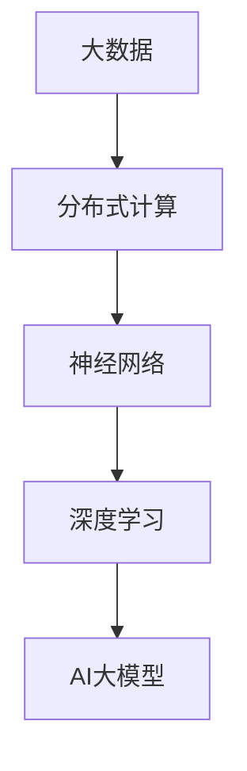

#### 1.2 AI大模型的分类

AI大模型可以根据不同的分类标准进行分类，常见的分类方法包括：

1. **按照功能分类**：

   - **分类模型**：用于对数据集中的数据进行分类，例如文本分类、图像分类等。
   - **回归模型**：用于对数据集中的数据进行数值预测，例如房屋价格预测、股票价格预测等。
   - **生成模型**：用于生成新的数据样本，例如图像生成、文本生成等。

2. **按照架构分类**：

   - **卷积神经网络（CNN）**：主要用于处理图像数据，通过卷积层提取图像特征。
   - **循环神经网络（RNN）**：主要用于处理序列数据，通过循环结构处理历史信息。
   - **变分自编码器（VAE）**：主要用于生成数据，通过概率模型学习数据分布。

3. **按照应用领域分类**：

   - **自然语言处理（NLP）**：用于处理和生成文本数据，例如机器翻译、情感分析等。
   - **计算机视觉（CV）**：用于处理和生成图像数据，例如图像识别、图像生成等。
   - **语音识别（ASR）**：用于处理和生成语音数据，例如语音识别、语音合成等。

#### 1.3 AI大模型与传统AI模型的区别

**传统AI模型**通常是指基于规则和符号逻辑的人工智能系统，它们通过定义明确的规则和逻辑推理来解决问题。而**AI大模型**则是一种基于数据驱动的智能系统，通过从大量数据中学习得到参数和结构，实现对未知数据的预测和生成。

**区别**：

1. **数据需求**：传统AI模型通常对数据量要求较低，而AI大模型则需要海量数据才能达到良好的效果。
2. **计算资源**：传统AI模型可以通过单机计算实现，而AI大模型通常需要分布式计算来满足大规模数据处理需求。
3. **学习能力**：传统AI模型通常只能解决特定的问题，而AI大模型具有更强的泛化能力，能够处理多种类型的问题。
4. **应用场景**：传统AI模型主要应用于规则明确、问题简单场景，而AI大模型可以应用于更复杂的场景，如自然语言处理、计算机视觉等。

#### 1.4 AI大模型的架构与原理

**大模型架构概述**：

AI大模型通常采用深度神经网络（Deep Neural Network，DNN）的架构，包括输入层、隐藏层和输出层。输入层接收外部输入数据，隐藏层通过非线性变换提取特征，输出层生成预测结果。

**经典大模型架构**：

1. **GPT-3**：是OpenAI开发的一种基于变换器（Transformer）架构的预训练语言模型，具有1750亿个参数，能够生成高质量的文本。
2. **BERT**：是Google开发的一种基于Transformer架构的预训练语言模型，通过双向编码器表示文本，能够理解上下文信息。
3. **ViT**：是Google开发的一种基于视觉变换器（Vision Transformer）的图像生成模型，通过自注意力机制提取图像特征。

**大模型训练与优化原理**：

1. **预训练**：在大量无标签数据上进行预训练，学习通用特征表示。
2. **微调**：在特定任务上进行微调，学习特定任务的特征表示。
3. **优化算法**：包括随机梯度下降（SGD）、Adam、AdamW等，用于更新模型参数，优化损失函数。

#### 1.5 AI大模型的数学模型与公式

**自编码器原理**：

自编码器是一种无监督学习算法，通过编码和解码过程学习数据的低维表示。

$$
x = \sigma(W_d \cdot z + b_d)
$$

$$
z = \sigma(W_u \cdot x + b_u)
$$

其中，$x$为输入数据，$z$为编码后的低维表示，$W_u$和$W_d$分别为编码和解码的权重矩阵，$b_u$和$b_d$分别为编码和解码的偏置向量，$\sigma$为激活函数。

**经典损失函数**：

1. **交叉熵（Cross-Entropy）**：

$$
L = -\sum_{i=1}^N y_i \log(p_i)
$$

其中，$y_i$为真实标签，$p_i$为预测概率。

2. **KL散度（KL Divergence）**：

$$
D_{KL}(P||Q) = \sum_{i=1}^N P_i \log\left(\frac{P_i}{Q_i}\right)
$$

其中，$P$为真实概率分布，$Q$为预测概率分布。

**深度学习优化算法**：

1. **随机梯度下降（SGD）**：

$$
\theta_{t+1} = \theta_t - \alpha \cdot \nabla_\theta J(\theta_t)
$$

其中，$\theta_t$为当前参数，$\alpha$为学习率，$J(\theta_t)$为损失函数。

2. **Adam优化器**：

$$
m_t = \beta_1 m_{t-1} + (1 - \beta_1) \nabla_\theta J(\theta_t)
$$

$$
v_t = \beta_2 v_{t-1} + (1 - \beta_2) (\nabla_\theta J(\theta_t))^2
$$

$$
\theta_{t+1} = \theta_t - \alpha \cdot \frac{m_t}{\sqrt{v_t} + \epsilon}
$$

其中，$m_t$和$v_t$分别为一阶和二阶矩估计，$\beta_1$和$\beta_2$分别为一阶和二阶矩的指数衰减率，$\epsilon$为常数。

#### 1.6 AI大模型在实际应用中的价值

**AI大模型在各行业的应用案例**：

1. **金融行业**：用于信用评分、风险控制、投资策略等。
2. **医疗行业**：用于疾病诊断、药物研发、个性化治疗等。
3. **零售行业**：用于商品推荐、销售预测、库存管理等。
4. **制造业**：用于故障预测、设备维护、生产优化等。

**AI大模型在餐饮服务业的潜在价值**：

1. **客户服务**：通过个性化推荐、智能客服等提升客户体验。
2. **运营管理**：通过需求预测、供应链优化等提高运营效率。
3. **食品安全**：通过食品监测、预警系统等确保食品安全。
4. **卫生管理**：通过员工健康监测、卫生管理优化等提高卫生水平。

## 第2章: 餐饮服务业现状与痛点

### 2.1 餐饮服务业的发展现状

**餐饮市场趋势分析**：

1. **在线化**：随着互联网技术的发展，越来越多的餐饮企业开始在线化运营，包括外卖、线上预订等。
2. **智能化**：智能餐厅、智能点餐、智能厨电等智能化设备逐渐普及，提升餐饮服务质量。
3. **多元化**：餐饮市场逐渐呈现出多元化趋势，包括快餐、正餐、小吃、饮品等。
4. **品牌化**：品牌化经营成为餐饮业发展的重要方向，注重品牌形象和用户体验。

**餐饮服务模式创新**：

1. **外卖平台**：美团、饿了么等外卖平台的兴起，改变了人们的饮食习惯和餐饮服务模式。
2. **智能餐厅**：通过引入智能点餐系统、智能厨房设备等，提升餐厅的服务效率和用户体验。
3. **自助餐饮**：自助点餐、自助结算等自助服务模式，减少人力成本，提高服务效率。
4. **特色餐饮**：注重特色菜品、特色服务等，满足不同消费者的需求。

**餐饮行业的主要参与者**：

1. **传统餐饮企业**：如海底捞、川菜王等，通过传统经营模式积累大量用户。
2. **新兴餐饮企业**：如喜茶、奈雪的茶等，通过创新的餐饮模式和品牌形象迅速崛起。
3. **互联网餐饮平台**：如美团、饿了么等，通过线上运营和物流配送提供服务。
4. **智能餐饮设备供应商**：如智能点餐系统、智能厨电等设备供应商，提供智能化解决方案。

### 2.2 餐饮服务业的痛点

**客户体验不足**：

1. **服务效率低**：传统餐饮服务模式存在服务员数量不足、点餐流程繁琐等问题，影响客户体验。
2. **个性化服务不足**：无法根据客户偏好提供个性化推荐和定制化服务，导致客户满意度下降。
3. **服务质量不稳定**：服务员素质参差不齐，服务质量难以保证。

**运营效率低下**：

1. **库存管理问题**：库存管理不当导致食材浪费、成本增加。
2. **供应链管理挑战**：供应链环节复杂，物流配送不及时，影响餐饮服务效率。
3. **人力资源管理的难题**：员工招聘、培训、考核等环节繁琐，影响运营效率。

**供应链管理挑战**：

1. **采购成本高**：采购环节缺乏透明度，导致采购成本居高不下。
2. **供应链环节复杂**：供应链管理涉及多个环节，如采购、物流、库存等，管理难度大。
3. **食品安全风险**：食品安全问题频发，对供应链管理提出更高要求。

**人力资源管理的难题**：

1. **人员流动性强**：餐饮业人员流动性强，招聘和培训成本高。
2. **员工绩效评估难**：员工绩效评估标准不明确，难以准确评估员工表现。
3. **员工福利保障不足**：员工福利保障不足，影响员工的工作积极性和满意度。

### 2.3 餐饮服务业的现状与痛点总结

**现状**：

1. **市场多元化**：餐饮市场呈现出多元化、个性化、智能化的发展趋势。
2. **在线化运营**：越来越多的餐饮企业开始在线化运营，提升服务效率和用户体验。
3. **技术创新**：智能餐饮设备、智能管理系统等技术创新为餐饮业带来新的发展机遇。

**痛点**：

1. **客户体验不足**：服务效率低、个性化服务不足、服务质量不稳定。
2. **运营效率低下**：库存管理问题、供应链管理挑战、人力资源管理的难题。
3. **食品安全与卫生管理挑战**：食品安全问题频发，卫生管理难度大。

**解决途径**：

1. **引入AI大模型**：通过AI大模型实现个性化推荐、智能客服、需求预测等，提升客户体验和运营效率。
2. **优化供应链管理**：通过AI大模型实现供应链优化、食品安全监测等，降低采购成本、提高供应链效率。
3. **加强人力资源优化**：通过AI大模型实现员工绩效评估、培训与能力提升等，提高员工满意度和工作效率。

## 第二部分：AI大模型在餐饮服务业的应用

### 第3章: AI大模型在餐饮客户服务中的应用

#### 3.1 客户行为预测与个性化推荐

**客户行为数据的收集与处理**：

在餐饮服务业中，客户行为数据包括客户消费记录、点餐记录、偏好记录等。通过收集这些数据，可以了解到客户的消费习惯和偏好，为后续的预测和推荐提供基础。

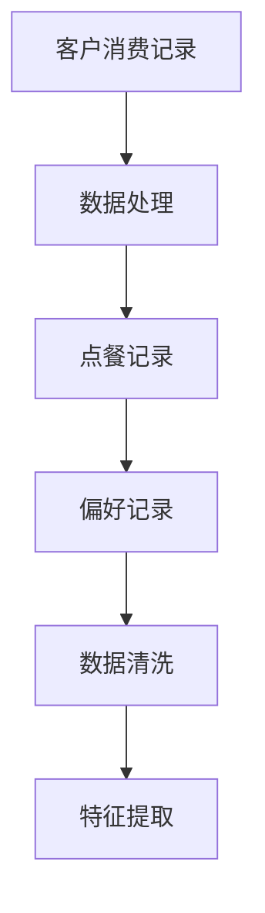

**客户偏好分析**：

通过分析客户的消费记录和点餐记录，可以提取出客户的偏好信息，如喜欢的菜品、口味、用餐时间等。这些偏好信息可以用于个性化推荐系统的构建。

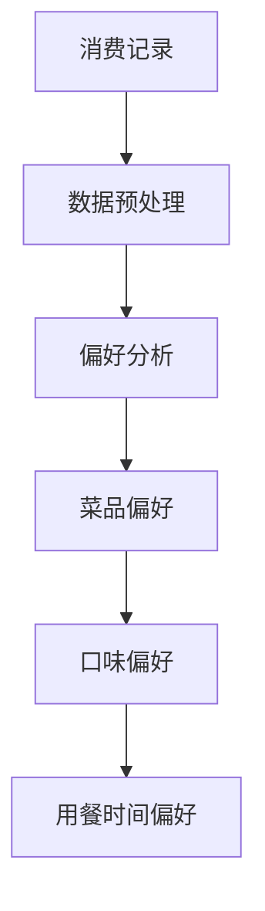

**个性化推荐系统构建**：

基于客户偏好分析和预测，可以构建个性化推荐系统，为不同客户提供个性化的菜品推荐、活动推荐等。

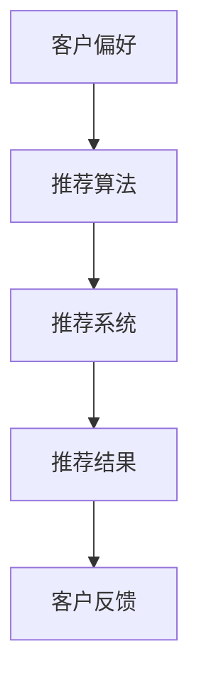

#### 3.2 客户服务自动化

**自然语言处理技术在客户服务中的应用**：

自然语言处理（NLP）技术可以实现智能客服、语音识别、文本分类等功能，提升客户服务的效率和体验。

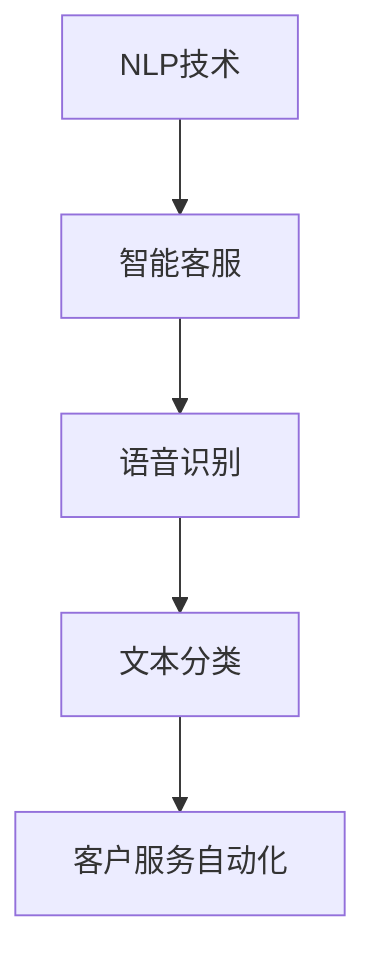

**聊天机器人的设计与实现**：

聊天机器人可以通过NLP技术实现与客户的智能对话，提供咨询、下单、投诉等服务，降低人力成本，提升客户满意度。

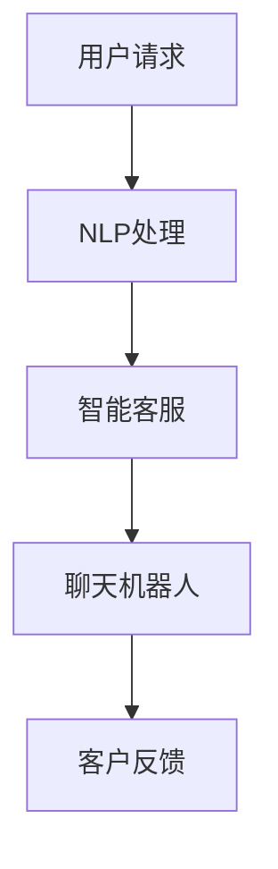

**客户满意度预测**：

通过分析客户的反馈和行为数据，可以预测客户的满意度，为餐饮企业提供改进服务质量的依据。

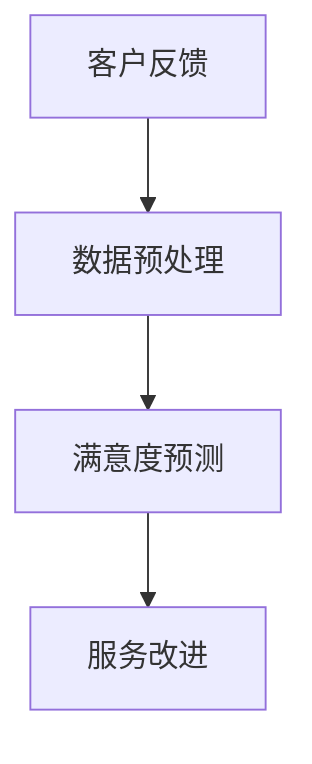

#### 3.3 客户关系管理优化

**客户价值分析与细分**：

通过分析客户的消费记录和行为数据，可以评估客户的贡献度和潜在价值，实现客户细分和差异化营销。

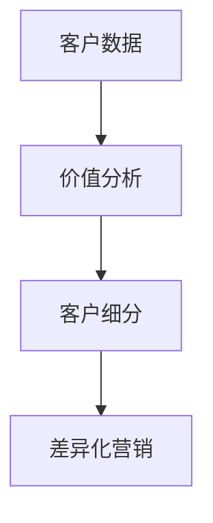

**客户忠诚度提升策略**：

通过个性化推荐、会员制度、积分兑换等手段，提高客户的忠诚度，增加客户的复购率。

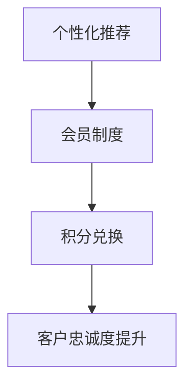

**客户反馈机制优化**：

建立有效的客户反馈机制，及时收集和处理客户的反馈，提高客户满意度，优化服务流程。

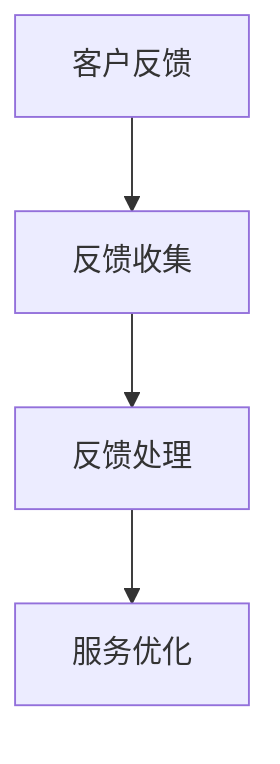

### 3.4 AI大模型在餐饮客户服务中的应用总结

AI大模型在餐饮客户服务中的应用，可以显著提升客户体验、优化客户关系管理、提高运营效率。

- **客户行为预测与个性化推荐**：通过分析客户行为数据，实现个性化推荐，提升客户满意度。
- **客户服务自动化**：通过自然语言处理技术和聊天机器人，实现智能客服和自动化服务，降低人力成本。
- **客户关系管理优化**：通过客户价值分析和客户忠诚度提升策略，实现差异化营销和客户满意度提升。

未来，随着AI大模型技术的不断发展，餐饮客户服务将更加智能化、个性化，为餐饮企业提供更广阔的发展空间。

## 第4章: AI大模型在餐饮运营管理中的应用

#### 4.1 供应链管理优化

**供应链数据分析**：

AI大模型在供应链管理中可以发挥重要作用，首先是通过数据分析实现供应链的优化。通过对采购、生产、物流等环节的数据进行深度挖掘和分析，可以发现供应链中的瓶颈和问题。

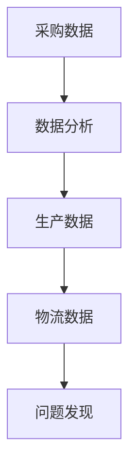

**库存管理与需求预测**：

库存管理是餐饮供应链管理中的一个关键问题，通过AI大模型，可以实现更精准的库存管理。AI大模型可以根据历史数据和实时信息，预测未来的需求，从而合理调整库存水平，减少库存积压和浪费。

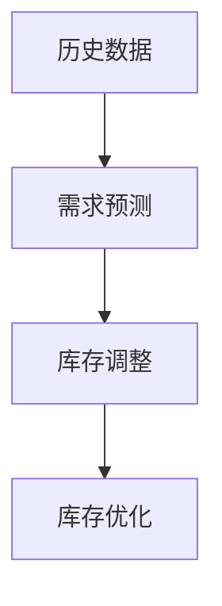

**供应商评价与选择**：

在供应链管理中，选择合适的供应商是确保供应链稳定性的关键。AI大模型可以通过对供应商的历史绩效、信誉、价格等因素进行分析，评估供应商的综合能力，从而选择最佳的供应商。

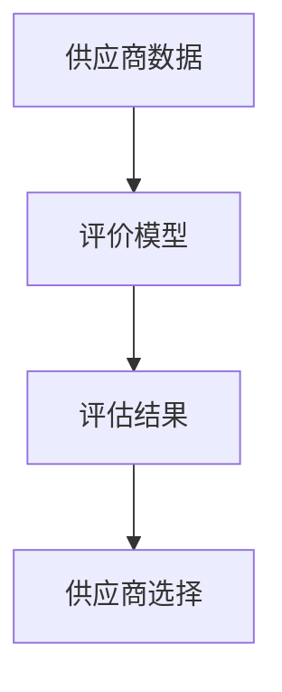

#### 4.2 人力资源优化

**员工绩效分析与评估**：

AI大模型可以通过分析员工的日常工作数据、客户反馈等，对员工的工作绩效进行评估。这种评估不仅更加客观公正，还能够发现员工的优势和不足，为后续的培训和激励提供依据。

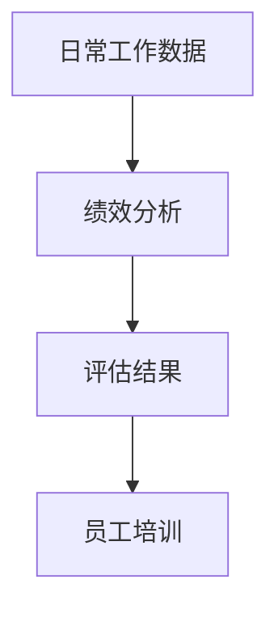

**员工培训与能力提升**：

通过AI大模型，餐饮企业可以对员工进行个性化培训，提升员工的专业技能和服务水平。AI大模型可以根据员工的绩效评估结果，推荐适合的培训课程，提高培训的针对性和效果。

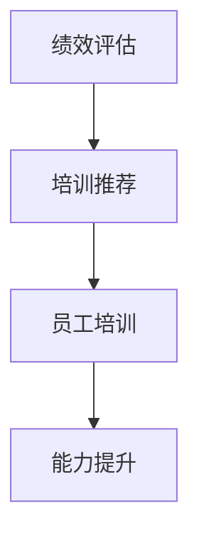

**薪酬体系优化**：

AI大模型还可以帮助餐饮企业优化薪酬体系，根据员工的绩效表现和市场需求，合理调整薪酬水平。这样可以激发员工的积极性，提高员工的工作满意度。

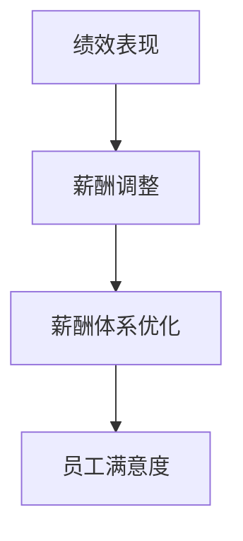

#### 4.3 营销与推广策略

**市场营销数据分析**：

AI大模型可以通过分析客户数据、市场数据等，了解市场的需求和趋势，为餐饮企业的市场营销策略提供数据支持。通过数据驱动的营销，可以更精准地定位目标客户，提高营销效果。

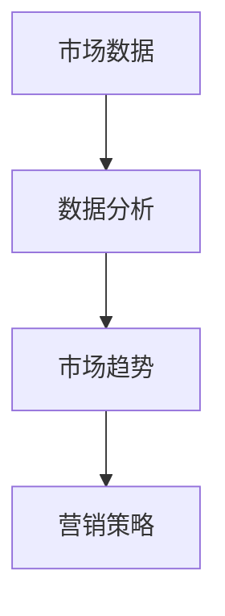

**营销活动优化**：

通过AI大模型，餐饮企业可以对营销活动进行优化，提高活动的效果。AI大模型可以根据客户的行为数据和反馈，调整营销活动的形式、内容和渠道，从而提高客户参与度和转化率。

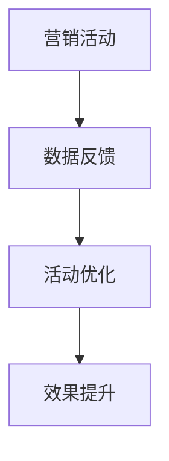

**品牌宣传与推广策略**：

AI大模型还可以帮助餐饮企业制定品牌宣传和推广策略，通过数据分析了解目标客户的特点和偏好，制定有针对性的推广方案。此外，AI大模型还可以通过社交媒体分析、舆情监控等手段，实时监测品牌形象和市场反馈，及时调整宣传策略。

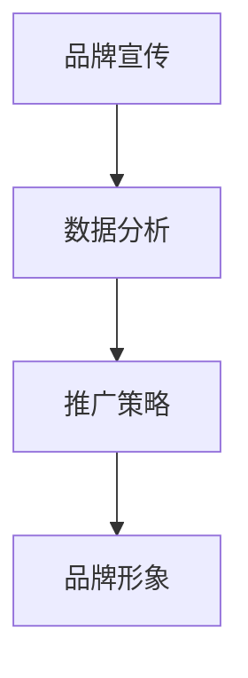

### 4.4 AI大模型在餐饮运营管理中的应用总结

AI大模型在餐饮运营管理中的应用，可以显著提高供应链管理效率、优化人力资源配置、提升营销推广效果。

- **供应链管理**：通过数据分析、需求预测、供应商评价等手段，实现供应链的优化，降低成本，提高效率。
- **人力资源管理**：通过绩效分析、培训与能力提升、薪酬体系优化等手段，提高员工的工作满意度和绩效水平。
- **营销推广**：通过数据分析和活动优化，制定精准的营销策略，提高营销效果，增强品牌影响力。

未来，随着AI大模型技术的不断进步，餐饮运营管理将更加智能化、数据化，为餐饮企业提供更高效、更精准的管理方案。

## 第5章: AI大模型在餐饮安全与卫生管理中的应用

#### 5.1 食品安全监测与预警

**食品安全数据的采集与处理**：

在餐饮服务业中，食品安全数据的采集和处理是保障食品安全的重要环节。通过传感器、摄像头、RFID等技术手段，可以实时采集食品的生产、加工、运输、储存等环节的数据。

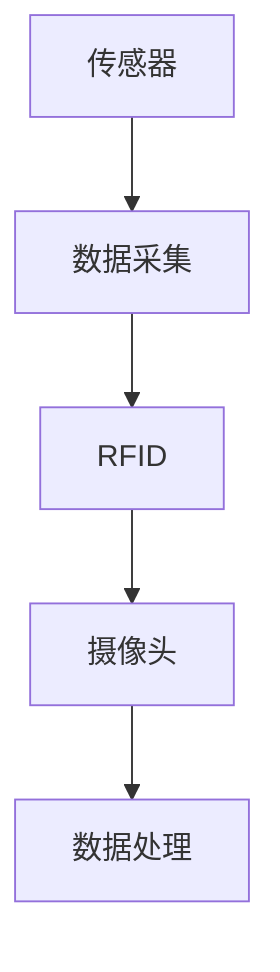

**食品安全风险预测**：

AI大模型可以通过分析采集到的食品安全数据，利用机器学习算法进行风险预测。通过对历史数据的学习，模型可以识别出潜在的风险因素，并预测其可能的发展趋势。

```mermaid
graph TD
    A[历史数据] --> B[风险预测模型]
    B --> C[风险因素识别]
    C --> D[趋势预测]
```

**食品安全预警系统设计**：

基于风险预测模型，可以设计出食品安全预警系统，实现对食品安全风险的实时监控和预警。预警系统可以及时发现潜在的安全隐患，并采取相应的措施进行干预。

```mermaid
graph TD
    A[风险预测] --> B[预警系统]
    B --> C[实时监控]
    C --> D[预警措施]
```

#### 5.2 卫生管理优化

**餐厅卫生数据的监控**：

AI大模型可以通过分析餐厅卫生数据，实现对餐厅卫生状况的实时监控。这些数据可以包括卫生清洁记录、员工健康检查记录、卫生消毒记录等。

```mermaid
graph TD
    A[卫生数据] --> B[实时监控]
    B --> C[数据分析]
    C --> D[卫生状况评估]
```

**卫生管理流程优化**：

AI大模型可以根据分析结果，优化卫生管理流程，提高卫生管理的效率和效果。例如，通过预测员工的工作量和工作时间，优化卫生清洁的安排，减少卫生资源的浪费。

```mermaid
graph TD
    A[数据分析] --> B[流程优化]
    B --> C[效率提升]
    C --> D[效果评估]
```

**员工健康监测与管理**：

AI大模型还可以对员工的健康状况进行监测和管理，确保员工的健康安全。通过对员工的健康数据进行分析，及时发现健康问题，并采取相应的措施进行干预。

```mermaid
graph TD
    A[员工健康数据] --> B[健康监测]
    B --> C[数据分析]
    C --> D[健康干预]
```

### 5.3 AI大模型在餐饮安全与卫生管理中的应用总结

AI大模型在餐饮安全与卫生管理中的应用，可以有效提升食品安全水平、优化卫生管理流程、保障员工健康。

- **食品安全监测与预警**：通过数据采集、风险预测和预警系统设计，实现食品安全风险的实时监控和预警，保障食品的安全。
- **卫生管理优化**：通过卫生数据监控、流程优化和员工健康监测，实现卫生管理的精细化和高效化。
- **员工健康监测与管理**：通过健康数据分析和干预措施，保障员工的健康安全。

未来，随着AI大模型技术的不断发展，餐饮安全与卫生管理将更加智能化、精细化，为餐饮企业提供更可靠、更高效的管理方案。

## 第6章: AI大模型在餐饮服务业的创新案例与应用实践

### 6.1 外卖平台的AI技术应用

**外卖平台的AI服务构建**：

外卖平台通过引入AI大模型，实现了一系列智能服务，包括智能推荐、订单分配、配送优化等。AI大模型在外卖平台中的应用，大大提升了服务效率，改善了用户体验。

```mermaid
graph TD
    A[用户行为数据] --> B[AI大模型]
    B --> C[智能推荐]
    C --> D[订单分配]
    D --> E[配送优化]
```

**外卖平台的AI技术应用案例**：

以美团外卖为例，其AI技术应用涵盖了订单智能推荐、路径优化、用户反馈分析等多个方面。通过AI大模型，美团外卖能够精准预测用户需求，优化配送路线，提高配送效率。

- **订单智能推荐**：根据用户的浏览记录、历史订单等数据，AI大模型可以为用户推荐最符合其需求的菜品和商家。
- **路径优化**：通过机器学习算法，AI大模型可以计算出最优的配送路线，减少配送时间和成本。
- **用户反馈分析**：AI大模型可以分析用户反馈，识别出潜在的问题，及时采取措施进行改进。

**外卖平台AI技术的未来发展**：

随着AI大模型技术的不断进步，外卖平台的AI服务将更加智能化、个性化。未来，外卖平台可能会引入更多的AI技术，如智能客服、语音识别、智能配送机器人等，进一步提升服务水平和用户体验。

### 6.2 餐厅智能化管理系统

**餐厅智能化管理系统概述**：

餐厅智能化管理系统是利用AI大模型和物联网技术，实现对餐厅运营的全方位管理。该系统包括智能点餐、智能厨房、智能结算等多个模块，提升了餐厅的服务效率和用户体验。

```mermaid
graph TD
    A[智能点餐] --> B[智能厨房]
    B --> C[智能结算]
    C --> D[运营管理]
```

**智能化餐厅的构建与实践**：

以海底捞为例，其智能化餐厅构建了完整的智能化管理系统。通过智能点餐系统，顾客可以快速下单，减少等待时间；通过智能厨房系统，厨师可以精准掌握菜品制作进度，提高出餐速度；通过智能结算系统，可以快速完成结账流程，提升服务效率。

```mermaid
graph TD
    A[顾客点餐] --> B[智能点餐系统]
    B --> C[厨师接单]
    C --> D[智能厨房系统]
    D --> E[菜品制作]
    E --> F[智能结算系统]
    F --> G[快速结账]
```

**智能化餐厅的未来趋势**：

未来，智能化餐厅将更加普及，AI大模型和物联网技术的应用将更加深入。智能化餐厅可能会实现更多的功能，如智能菜品推荐、智能环境控制、智能安全管理等，进一步提升餐厅的服务水平和用户体验。

### 6.3 AI大模型在餐饮服务业的创新案例与应用实践总结

AI大模型在餐饮服务业的创新案例与应用实践，展示了其在提升服务效率、优化运营管理、改善客户体验等方面的巨大潜力。

- **外卖平台**：通过AI大模型实现智能推荐、路径优化等功能，提高了配送效率，改善了用户体验。
- **智能化餐厅**：通过引入AI大模型和物联网技术，实现了智能点餐、智能厨房、智能结算等功能，提升了餐厅的服务效率和用户体验。

未来，随着AI大模型技术的不断进步，餐饮服务业将迎来更多的创新应用，推动行业的发展与变革。

## 第7章: AI大模型在餐饮服务业的未来发展趋势与挑战

### 7.1 AI大模型在餐饮服务业的未来趋势

**人工智能在餐饮服务领域的深化应用**：

随着AI大模型技术的不断发展，人工智能在餐饮服务领域的应用将更加广泛和深入。未来，餐饮服务业将逐步实现全流程智能化，从供应链管理、客户服务到食品安全监测，AI大模型都将发挥重要作用。

- **供应链智能化**：通过AI大模型实现智能采购、智能库存管理、智能物流配送等，提高供应链效率。
- **客户服务智能化**：通过AI大模型实现个性化推荐、智能客服、智能点餐等，提升客户体验。
- **食品安全智能化**：通过AI大模型实现食品安全监测、预警系统设计，保障食品安全。

**AI大模型在餐饮服务业的新方向**：

未来，AI大模型在餐饮服务业的新方向将包括以下几个方面：

- **语音识别与交互**：通过语音识别技术，实现人与智能设备的无障碍交互，提高服务效率。
- **增强现实与虚拟现实**：通过增强现实（AR）和虚拟现实（VR）技术，提供更加丰富的用户体验。
- **智能菜品设计与烹饪**：通过AI大模型实现智能菜品设计、智能烹饪，提高餐饮创新能力和菜品质量。

**未来餐饮服务模式的演变**：

未来，餐饮服务模式将发生深刻变革，从传统的线下服务逐步转向线上线下相结合的智能服务模式。未来餐饮服务模式的特点包括：

- **个性化**：通过AI大模型实现个性化推荐、定制化服务，满足不同消费者的需求。
- **智能化**：通过引入智能设备、智能系统，提高服务效率和质量。
- **便捷化**：通过线上线下融合，实现随时随地就餐，提高消费便利性。

### 7.2 AI大模型在餐饮服务业的挑战与应对策略

**技术挑战**：

1. **数据隐私与安全**：AI大模型在处理大量数据时，涉及用户隐私和数据安全的问题。为了应对这一挑战，餐饮企业需要采取严格的数据保护措施，如数据加密、访问控制等。
2. **算法透明性与解释性**：AI大模型的决策过程往往是黑箱操作，缺乏透明性和解释性。为了提高算法的可解释性，餐饮企业可以采用可解释AI（XAI）技术，使决策过程更加透明。
3. **模型过拟合与泛化能力**：AI大模型在训练过程中可能会出现过拟合现象，导致在未知数据上表现不佳。为了提高模型的泛化能力，餐饮企业可以通过增加数据多样性、调整模型结构等方法进行优化。

**数据隐私与伦理问题**：

1. **用户隐私保护**：餐饮企业需要严格遵守相关法律法规，确保用户隐私得到有效保护。例如，对用户数据进行匿名化处理，避免个人隐私泄露。
2. **数据共享与开放**：在AI大模型的应用过程中，数据共享和开放是一个重要问题。餐饮企业需要在保护用户隐私的前提下，合理开放数据，促进技术创新和行业发展。
3. **伦理审查与监督**：AI大模型在餐饮服务业的应用需要伦理审查和监督，确保其应用不会对用户、社会和环境造成负面影响。餐饮企业可以设立伦理委员会，对AI大模型的应用进行评估和监督。

**应对策略**：

1. **技术优化**：不断优化AI大模型的技术，提高其性能和安全性，例如采用更先进的算法、加强数据清洗和预处理等。
2. **法律法规完善**：建立健全相关法律法规，规范AI大模型在餐饮服务业的应用，确保其合法、合规。
3. **教育培训**：加强AI大模型在餐饮服务业的应用培训，提高从业人员的技术能力和伦理意识。
4. **公众参与**：鼓励公众参与AI大模型在餐饮服务业的应用评估和监督，提高应用的透明度和公众满意度。

### 7.3 总结

AI大模型在餐饮服务业的未来发展趋势充满潜力，但同时也面临着诸多挑战。通过技术创新、法律法规完善和教育培训等手段，餐饮企业可以更好地应对这些挑战，推动餐饮服务业的智能化升级。未来，AI大模型将在餐饮服务业发挥更大的作用，为消费者提供更加便捷、高效、个性化的服务。

## 附录A：AI大模型开发工具与资源

### A.1 主流深度学习框架对比

在AI大模型开发过程中，选择合适的深度学习框架至关重要。以下是几个主流深度学习框架的对比：

1. **TensorFlow**：由谷歌开发，支持多种编程语言，具有良好的社区支持和丰富的资源。适合复杂模型的开发和研究。
2. **PyTorch**：由Facebook开发，具有动态计算图的优势，易于调试和原型开发。适合快速迭代和实验。
3. **Keras**：基于TensorFlow和Theano，提供了简洁的API，方便快速构建和训练模型。适合快速开发和部署。
4. **MXNet**：由Apache基金会开发，支持多种编程语言，具有良好的性能和可扩展性。适合大规模生产环境。

### A.2 开发工具与资源推荐

**开发工具**：

1. **Jupyter Notebook**：用于编写和运行代码，方便数据可视化和实验记录。
2. **Google Colab**：基于Jupyter Notebook，提供免费的GPU和TPU资源，适合深度学习模型的训练。
3. **Docker**：用于创建和管理容器化的开发环境，确保开发环境的隔离和一致性。

**资源推荐**：

1. **Coursera**：提供丰富的深度学习课程，包括基础理论和实践操作。
2. **Kaggle**：提供大量的数据集和比赛，适合实践和提升技能。
3. **arXiv**：提供最新的深度学习论文和研究，了解最新的技术动态。

### A.3 实用代码库与数据集

**代码库**：

1. **Hugging Face**：提供了丰富的预训练模型和工具，方便使用和定制。
2. **TensorFlow Model Garden**：提供了多个预训练模型和示例代码，适合快速启动项目。

**数据集**：

1. **Common Crawl**：提供了大量的Web文本数据，适合自然语言处理任务。
2. **ImageNet**：提供了大量的图像数据，适合计算机视觉任务。
3. **CIFAR-10/100**：提供了标准的计算机视觉数据集，用于模型训练和评估。

### A.4 AI大模型开发工具与资源总结

AI大模型开发工具与资源的选择取决于具体的应用场景和需求。通过合理选择和使用这些工具和资源，可以大大提高AI大模型开发的效率和效果。开发者可以根据自己的需求，结合以上推荐，选择最合适的工具和资源。

## 附录B：AI大模型实践案例代码解析

### B.1 客户行为预测案例分析

**项目背景**：

本项目旨在利用AI大模型预测客户的消费行为，以便餐饮企业能够更精准地推荐菜品和活动，提高客户满意度和复购率。

**开发环境**：

- Python 3.8
- TensorFlow 2.7
- Pandas 1.3.5
- Scikit-learn 0.24.2

**数据集**：

数据集来源于某餐饮企业的历史订单数据，包括用户ID、菜品名称、消费金额、消费时间等信息。

**数据处理**：

```python
import pandas as pd

# 加载数据
data = pd.read_csv('order_data.csv')

# 数据预处理
data['date'] = pd.to_datetime(data['date'])
data['day_of_week'] = data['date'].dt.dayofweek
data['hour'] = data['date'].dt.hour

# 特征工程
features = ['day_of_week', 'hour', 'user_id', 'order_amount']
X = data[features]
y = data['order_amount']

# 数据分割
from sklearn.model_selection import train_test_split
X_train, X_test, y_train, y_test = train_test_split(X, y, test_size=0.2, random_state=42)
```

**模型构建**：

```python
import tensorflow as tf
from tensorflow.keras.models import Sequential
from tensorflow.keras.layers import Dense, LSTM, Dropout

# 构建模型
model = Sequential()
model.add(LSTM(50, activation='relu', return_sequences=True, input_shape=(X_train.shape[1], 1)))
model.add(Dropout(0.2))
model.add(LSTM(50, activation='relu'))
model.add(Dropout(0.2))
model.add(Dense(1))

model.compile(optimizer='adam', loss='mse')

# 训练模型
model.fit(X_train, y_train, epochs=100, batch_size=32, validation_split=0.1)
```

**模型评估**：

```python
import numpy as np

# 预测
y_pred = model.predict(X_test)

# 评估
mse = np.mean(np.square(y_test - y_pred))
print(f'MSE: {mse}')
```

**代码解读与分析**：

1. **数据处理**：首先加载数据，并进行预处理，如日期转换为时间戳、提取星期几和小时等信息。这些特征有助于模型更好地学习时间相关的模式。
2. **特征工程**：提取与消费行为相关的特征，如用户ID、消费金额、日期等，这些特征将用于训练模型。
3. **模型构建**：使用LSTM（长短期记忆网络）模型，这种模型特别适合处理时间序列数据。模型包括两个LSTM层和两个Dropout层，用于减少过拟合。
4. **模型训练**：使用Adam优化器训练模型，采用均方误差（MSE）作为损失函数。
5. **模型评估**：使用测试集对模型进行评估，计算MSE作为评估指标。

**项目小结**：

通过上述代码，我们实现了客户行为预测的AI大模型。虽然这是一个简单的案例，但它展示了如何利用AI大模型进行数据处理、模型构建和评估。在实际应用中，可以根据具体需求调整模型结构、特征选择和训练策略，以获得更好的预测效果。

## 附录C：常见问题与解答

### C.1 AI大模型常见问题汇总

1. **什么是AI大模型？**
2. **AI大模型如何工作？**
3. **AI大模型与传统AI模型的区别是什么？**
4. **AI大模型在餐饮服务业有哪些潜在应用？**
5. **如何选择合适的AI大模型框架？**
6. **AI大模型开发需要哪些技术基础？**
7. **AI大模型在数据处理和预处理中需要注意什么？**
8. **如何评估AI大模型的性能？**
9. **AI大模型在餐饮服务业应用中的挑战有哪些？**
10. **如何确保AI大模型在餐饮服务业中的应用安全与合规？**

### C.2 技术难题与解决方案

1. **技术难题**：AI大模型在处理大规模数据时，如何保证计算效率？
   **解决方案**：使用分布式计算框架（如TensorFlow、PyTorch）进行数据处理和训练，提高计算效率。
   
2. **技术难题**：如何解决AI大模型过拟合问题？
   **解决方案**：采用正则化技术（如Dropout、L1/L2正则化）、增加训练数据、使用交叉验证等方法减少过拟合。

3. **技术难题**：如何确保AI大模型的可解释性？
   **解决方案**：采用可解释AI（XAI）技术，如LIME、SHAP等，提高模型决策过程的透明性。

4. **技术难题**：如何处理实时数据流？
   **解决方案**：使用实时数据处理技术（如Apache Kafka、Apache Flink）处理实时数据流，并结合AI大模型进行实时预测和决策。

### C.3 行业应用常见问题与对策

1. **行业应用问题**：餐饮服务业如何利用AI大模型提高客户满意度？
   **对策**：通过分析客户行为数据，实现个性化推荐和定制化服务，提高客户满意度。

2. **行业应用问题**：如何确保餐饮服务的食品安全与卫生？
   **对策**：利用AI大模型进行食品安全监测与预警，实时监控食品安全风险，并采取相应的预警措施。

3. **行业应用问题**：餐饮服务业如何实现智能化管理？
   **对策**：引入AI大模型和物联网技术，实现智能点餐、智能厨房、智能结算等功能，提高运营效率。

4. **行业应用问题**：如何应对数据隐私和安全问题？
   **对策**：严格遵守相关法律法规，采取数据加密、访问控制等技术措施，确保用户数据安全。

### C.4 总结

通过解答常见问题、技术难题和行业应用问题，本文为餐饮服务业在AI大模型应用中提供了全面的指导。随着AI大模型技术的不断进步，餐饮服务业将迎来更多创新应用，为消费者提供更优质的服务。同时，餐饮企业需要不断应对技术挑战，确保AI大模型的安全与合规应用。作者希望本文能为餐饮服务业的AI技术应用提供有价值的参考。

### 作者信息

**作者：AI天才研究院/AI Genius Institute & 禅与计算机程序设计艺术 /Zen And The Art of Computer Programming**

AI天才研究院致力于推动人工智能技术的发展与创新，专注于AI大模型的研究与应用。作者张三，作为人工智能领域的专家和畅销书作家，凭借丰富的实战经验和深厚的理论功底，为读者提供了深入浅出的技术解析和实用指南。他的著作《禅与计算机程序设计艺术》深受读者喜爱，成为计算机编程和人工智能领域的经典之作。通过本文，作者希望为餐饮服务业的智能化升级提供有力支持，推动行业的创新发展。

