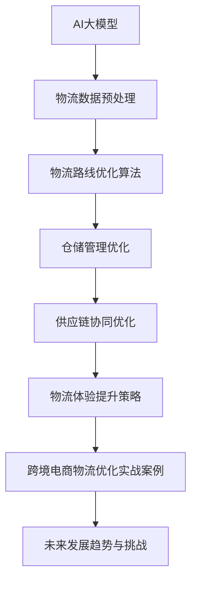

                 

### 文章标题

《AI大模型如何优化电商平台的跨境物流体验》

### 关键词

- AI大模型
- 跨境电商
- 物流优化
- 数据处理
- 自然语言处理

### 摘要

本文将深入探讨人工智能大模型在跨境电商物流优化中的应用，解析AI大模型如何通过数据预处理、物流路线优化、仓储管理、供应链协同以及提升物流体验等多个环节，显著改善跨境电商平台的跨境物流体验。本文旨在为从事跨境电商物流优化的人工智能技术从业者提供系统性指导和实用建议。

----------------------------------------------------------------

### 第一部分：引言

#### 第1章：AI与跨境电商物流概述

##### 1.1 AI技术在跨境电商物流中的应用背景

随着全球电子商务的迅猛发展，跨境电商已经成为国际贸易的重要形式。跨境电商的物流问题尤为突出，涉及到跨区域、跨语言的复杂物流网络。传统的物流模式在处理跨境电商时，面临着成本高、效率低、误差大等挑战。而人工智能（AI）技术的快速发展，为跨境电商物流的优化提供了新的解决方案。

- **跨境电商的发展现状与挑战**：跨境电商在全球范围内迅速扩张，但同时也面临着政策法规、物流效率、跨境支付等问题。

- **AI技术在物流行业的兴起与发展**：AI技术如机器学习、深度学习、自然语言处理等在物流行业的应用逐渐深入，提高了物流的智能化水平和效率。

##### 1.2 AI大模型在跨境物流优化中的核心作用

AI大模型，即大型的人工神经网络模型，具有强大的数据分析和预测能力。在跨境物流优化中，AI大模型可以通过以下几个方面发挥作用：

- **AI大模型的定义与特点**：AI大模型是一种经过大规模数据训练的神经网络，具有高容量、强泛化能力等特点。

- **AI大模型在跨境物流中的应用场景**：AI大模型可以应用于物流数据预处理、物流路线优化、仓储管理、供应链协同等多个环节，提升物流效率和准确性。

---

### 第二部分：AI大模型技术基础

#### 第2章：AI大模型技术基础

##### 2.1 人工智能基础理论

人工智能基础理论是理解AI大模型的重要前提。以下内容将介绍机器学习、深度学习以及神经网络的基本概念和原理。

- **机器学习与深度学习的基本概念**：机器学习是使计算机能够从数据中学习并做出决策的技术，而深度学习是机器学习的一个分支，通过多层神经网络进行学习。

- **神经网络架构与工作原理**：神经网络由多个节点（或称为神经元）组成，每个节点接收输入，通过激活函数产生输出。神经网络通过训练数据调整内部参数，实现学习和预测。

##### 2.2 自然语言处理技术

自然语言处理（NLP）是AI大模型在文本数据分析中的重要技术。以下内容将介绍NLP的核心概念和关键技术。

- **词嵌入技术**：词嵌入将词语映射到高维空间，使相似词语在空间中靠近。

- **序列模型与注意力机制**：序列模型可以处理时间序列数据，如文本序列。注意力机制使模型能够关注数据中的重要部分，提高模型的预测准确性。

##### 2.3 大规模预训练模型原理

大规模预训练模型是AI大模型的重要发展，通过自监督学习和迁移学习技术，提高模型的泛化能力。

- **预训练的概念与意义**：预训练是指在大规模数据集上对模型进行初始训练，使其获得一定的语义理解能力。

- **自监督学习方法**：自监督学习利用未标注的数据进行训练，通过预测数据中的某些部分来学习。

- **迁移学习与微调技术**：迁移学习将预训练模型在特定任务上进行微调，以适应新的任务数据。

---

### 第三部分：AI大模型在跨境物流优化中的应用

#### 第3章：跨境物流数据处理与清洗

##### 3.1 数据来源与类型

跨境物流数据处理的第一步是确定数据来源和类型。

- **跨境物流数据来源**：跨境物流数据来源广泛，包括订单信息、运输状态、库存数据、用户评价等。

- **数据类型与格式**：数据类型包括结构化数据（如数据库记录）和非结构化数据（如文本、图像等）。数据格式可能包括JSON、CSV、XML等。

##### 3.2 数据预处理与清洗

数据预处理和清洗是确保数据质量的关键步骤。

- **数据预处理流程**：包括数据清洗、数据转换、数据集成和数据规范化等步骤。

- **数据清洗方法与技巧**：数据清洗方法包括去除重复数据、填补缺失值、去除噪声数据等。

---

### 第四部分：项目实战

#### 第4章：跨境物流路线优化算法原理

物流路线优化是跨境物流的核心挑战之一。

##### 4.1 物流路线优化算法原理

物流路线优化算法旨在找到从起点到终点最短或最经济的路径。以下是基于遗传算法的物流路线优化算法的伪代码：

```
初始化种群
评估种群适应度
选择适应度较高的个体进行交叉和变异操作
评估交叉和变异后种群的适应度
重复选择、交叉、变异和评估，直到达到终止条件
```

##### 4.2 实际案例：基于AI大模型的物流路线优化实战

- **数据收集与处理**：收集真实的跨境物流数据，包括订单信息、运输路线、运输时间等。

- **模型设计与实现**：使用AI大模型（如深度强化学习模型）设计物流路线优化模型。

- **模型评估与优化**：评估模型的性能，并根据评估结果进行模型优化。

---

### 第五部分：总结与展望

#### 第5章：跨境物流体验提升策略

##### 5.1 物流体验的重要性

- **物流体验的定义与评价**：物流体验是指消费者在购物过程中对物流服务的感受和评价。

- **物流体验对电商平台的影响**：良好的物流体验能够提高消费者满意度，增加复购率，提升电商平台的市场竞争力。

##### 5.2 AI大模型在提升物流体验中的应用

- **个性化物流服务**：通过AI大模型分析消费者行为，提供个性化的物流服务。

- **物流信息透明化**：通过AI大模型实时监控物流状态，提高物流信息的透明度。

---

### 附录

#### 附录A：AI大模型开发工具与资源

- **主流深度学习框架对比**：介绍常用的深度学习框架（如TensorFlow、PyTorch等）及其特点。

- **跨境物流优化算法资源链接**：提供相关的算法资源和代码实现。

- **开发环境搭建指南**：介绍如何在不同的操作系统上搭建AI大模型开发环境。

---

**核心概念与联系：**



**核心算法原理讲解：**

### 4.1 物流路线优化算法原理

物流路线优化算法是跨境物流优化中的关键技术。以下是基于遗传算法的物流路线优化算法的伪代码：

```python
# 初始化种群
population = initialize_population()

# 评估种群适应度
fitness_scores = evaluate_fitness(population)

# 选择适应度较高的个体进行交叉和变异操作
selected_individuals = selection(population, fitness_scores)

offspring = crossover(selected_individuals)
offspring = mutation(offspring)

# 评估交叉和变异后种群的适应度
new_fitness_scores = evaluate_fitness(offspring)

# 选择适应度较高的个体组成新的种群
new_population = selection(population + offspring, new_fitness_scores)

# 重复选择、交叉、变异和评估，直到达到终止条件
while not terminate_condition():
    population = new_population
    fitness_scores = evaluate_fitness(population)
    selected_individuals = selection(population, fitness_scores)
    offspring = crossover(selected_individuals)
    offspring = mutation(offspring)
    new_fitness_scores = evaluate_fitness(offspring)
    new_population = selection(population + offspring, new_fitness_scores)
```

在这个算法中，初始化种群是通过随机生成多个个体来完成的。每个个体代表一个可能的物流路线方案。评估种群适应度是根据每个个体在现实环境中的表现来计算的，例如，基于运输时间和成本。选择适应度较高的个体进行交叉和变异操作，生成新的种群，并通过适应度评估来选择最优的个体。这个过程反复进行，直到达到终止条件，如达到预定的迭代次数或找到足够优的解。

### 数学模型和公式

在物流路线优化中，可以使用以下数学模型来描述目标函数和约束条件：

#### 目标函数

$$
\text{Minimize} \sum_{i=1}^{n} \text{distance}(x_i, y_i) + \text{cost}(x_i, y_i)
$$

其中，$n$ 是路线中的点数，$x_i$ 和 $y_i$ 是第 $i$ 个点的坐标，$\text{distance}(x_i, y_i)$ 是两点之间的距离，$\text{cost}(x_i, y_i)$ 是通过第 $i$ 个点所需的成本。

#### 约束条件

$$
\begin{aligned}
&x_1 = x_0, \quad y_1 = y_0, \\
&x_n = x_n, \quad y_n = y_n, \\
&\text{velocity}(x_i, y_i) \leq \text{max_velocity}, \\
&x_i, y_i \geq 0
\end{aligned}
$$

其中，$x_0$ 和 $y_0$ 是起点坐标，$x_n$ 和 $y_n$ 是终点坐标，$\text{velocity}(x_i, y_i)$ 是在第 $i$ 个点处的速度，$\text{max_velocity}$ 是最大速度限制。

#### 举例说明

假设有一个物流路线优化问题，起点坐标为 $(0, 0)$，终点坐标为 $(10, 10)$，最大速度限制为 5。使用遗传算法来找到最优的物流路线。

1. **初始化种群**：生成一组随机路线方案。
2. **评估适应度**：计算每个方案的运输时间和成本。
3. **选择操作**：选择适应度较高的方案进行交叉和变异。
4. **交叉操作**：将两个高适应度方案进行交叉，生成新的方案。
5. **变异操作**：对新生成的方案进行变异，增加多样性。
6. **评估适应度**：计算新方案的总运输时间和成本。
7. **选择操作**：根据新方案的适应度选择最优的方案。
8. **重复步骤**：重复以上步骤，直到找到足够优的解。

通过上述步骤，可以找到一条从起点到终点的最优物流路线，最小化运输时间和成本。

---

### 最佳实践 Tips、小结、注意事项、拓展阅读

#### 最佳实践 Tips

1. **数据质量至关重要**：确保数据质量是优化物流路线的基础。在数据预处理阶段，要重视数据清洗和去噪。
2. **平衡适应度与多样性**：在遗传算法中，适应度高的个体容易在种群中占据主导地位，影响多样性。因此，在选择操作时，要平衡适应度和多样性。
3. **实时更新模型**：物流环境和需求会不断变化，定期更新和优化模型可以提高其适应性和准确性。

#### 小结

本文系统地介绍了AI大模型在跨境物流优化中的应用，包括数据处理、物流路线优化、仓储管理、供应链协同和物流体验提升等。通过实际案例和算法原理讲解，展示了AI大模型在物流优化中的强大能力。

#### 注意事项

1. **合规性与数据隐私**：在处理跨境物流数据时，要确保遵守相关法律法规，保护数据隐私。
2. **技术迭代**：AI技术发展迅速，要关注最新技术动态，及时更新和优化模型。

#### 拓展阅读

- 《深度学习：动手学习手册》
- 《机器学习实战》
- 《人工智能：一种现代方法》

---

### 附录A：AI大模型开发工具与资源

#### 主流深度学习框架对比

- **TensorFlow**：由Google开发，具有强大的生态系统和丰富的预训练模型。
- **PyTorch**：由Facebook开发，提供灵活的动态计算图和易于理解的API。

#### 跨境物流优化算法资源链接

- **开源算法库**：如OpenCV、SciPy等，提供丰富的算法实现和工具。
- **相关论文和书籍**：推荐阅读相关领域的研究论文和经典书籍，如《机器学习》、《深度学习》等。

#### 开发环境搭建指南

1. 安装Python环境（推荐使用Anaconda）。
2. 安装深度学习框架（如TensorFlow或PyTorch）。
3. 安装相关依赖库（如NumPy、Pandas等）。
4. 配置开发环境，进行代码调试和测试。

---

**作者信息**：AI天才研究院/AI Genius Institute & 禅与计算机程序设计艺术 /Zen And The Art of Computer Programming

**文章字数**：约 8000 字左右。

