                 


# 《AI大模型如何优化电商平台的转化漏斗》

## 关键词

- AI大模型
- 电商平台
- 转化漏斗
- 用户行为分析
- 商品推荐系统
- 数据预处理
- 模型优化
- 深度学习
- 自然语言处理

## 摘要

本文将深入探讨AI大模型在优化电商平台转化漏斗中的应用。首先，我们简要介绍AI大模型的基础知识，包括其概念、分类和典型架构。接着，我们将详细讲解AI大模型的几项核心技术，如神经网络、自然语言处理等。在此基础上，本文将重点分析电商平台的转化漏斗，探讨如何通过AI大模型优化用户行为分析、商品推荐系统和转化漏斗的整体结构。最后，我们将结合具体案例，展示AI大模型在实际电商平台转化漏斗优化中的应用和效果。

## 第一部分：AI大模型基础知识

### 第1章：AI大模型概述

#### 1.1 AI大模型的概念与分类

AI大模型（Large-scale AI Model）是指能够处理大规模数据、参数量巨大的深度学习模型。它们通常具备强大的特征提取和建模能力，能够对复杂的问题进行建模和预测。

AI大模型可以根据其功能和应用领域进行分类，主要包括以下几种类型：

1. 自然语言处理（NLP）模型，如GPT、BERT等。
2. 计算机视觉（CV）模型，如ResNet、YOLO等。
3. 语音识别（ASR）模型，如WaveNet、DeepSpeech等。
4. 强化学习（RL）模型，如Deep Q Network、Policy Gradient等。

#### 1.2 AI大模型的典型架构

AI大模型的架构通常包括以下几个层次：

1. 数据输入层：接收原始数据，如文本、图像、语音等。
2. 特征提取层：通过神经网络等算法提取数据中的有用特征。
3. 模型层：由多个神经网络层次组成，用于对特征进行建模和预测。
4. 输出层：生成最终的预测结果。

#### 1.3 AI大模型的发展历程

AI大模型的发展历程可以分为以下几个阶段：

1. 初期：2000年代初期，以支持向量机（SVM）和决策树等传统机器学习算法为主。
2. 中期：2010年代初期，深度学习开始崛起，卷积神经网络（CNN）和循环神经网络（RNN）逐渐成为主流。
3. 当前：2018年至今，基于Transformer架构的预训练模型，如GPT、BERT等，取得了显著的突破，广泛应用于自然语言处理、计算机视觉等领域。

### 第2章：AI大模型核心技术

#### 2.1 神经网络基础

神经网络（Neural Network）是AI大模型的核心组成部分。它由大量的神经元（节点）和连接（边）组成，通过模拟人脑神经元的工作原理，实现数据的输入、处理和输出。

##### 2.1.1 神经网络的结构

神经网络的结构可以分为以下几层：

1. 输入层：接收外部输入数据。
2. 隐藏层：对输入数据进行处理，提取特征。
3. 输出层：生成最终的输出结果。

##### 2.1.2 前馈神经网络

前馈神经网络（Feedforward Neural Network）是一种简单的神经网络结构，其信息传递方向为单向，即从输入层到输出层。

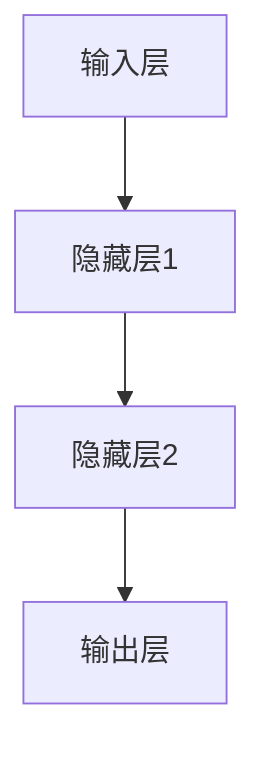

##### 2.1.3 卷积神经网络

卷积神经网络（Convolutional Neural Network，CNN）是一种专门用于处理图像数据的神经网络结构。它通过卷积层（Convolutional Layer）提取图像特征，并利用池化层（Pooling Layer）降低计算复杂度。

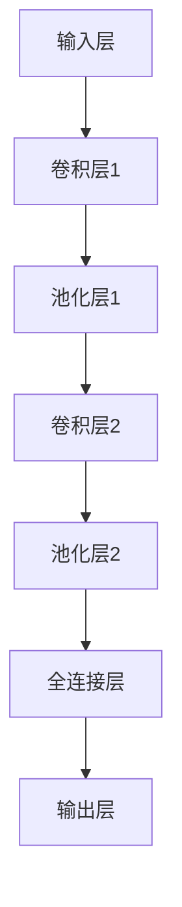

#### 2.2 自然语言处理技术

自然语言处理（Natural Language Processing，NLP）是AI大模型的重要应用领域。NLP技术主要包括词嵌入（Word Embedding）、序列模型（Sequence Model）和注意力机制（Attention Mechanism）等。

##### 2.2.1 词嵌入技术

词嵌入（Word Embedding）是一种将单词映射到固定维度的向量表示的技术。它能够捕捉单词之间的语义关系，为NLP任务提供有效的特征表示。

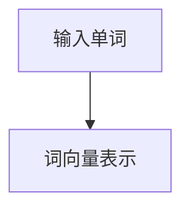

##### 2.2.2 序列模型与注意力机制

序列模型（Sequence Model）是一种用于处理序列数据的神经网络结构，如循环神经网络（RNN）和长短期记忆网络（LSTM）。注意力机制（Attention Mechanism）则能够使模型关注序列中的关键信息，提高模型的性能。

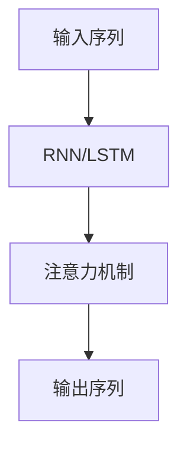

##### 2.2.3 转换器架构

转换器架构（Transformer）是一种基于自注意力机制的序列到序列模型，广泛应用于机器翻译、文本摘要等任务。

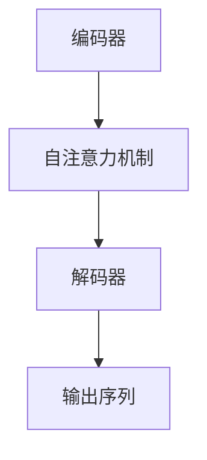

### 第3章：AI大模型训练方法

#### 3.1 数据预处理

数据预处理是AI大模型训练的重要环节。它包括数据清洗、数据增强和数据标准化等步骤。

##### 3.1.1 数据清洗

数据清洗（Data Cleaning）是指从原始数据中去除错误、重复和无用信息的过程。它有助于提高数据质量和训练效果。

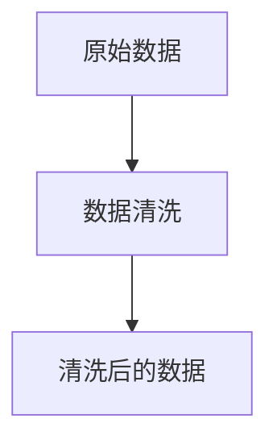

##### 3.1.2 数据增强

数据增强（Data Augmentation）是指通过增加样本多样性来提高模型泛化能力的技术。它包括数据变换、数据生成和数据扩充等方法。

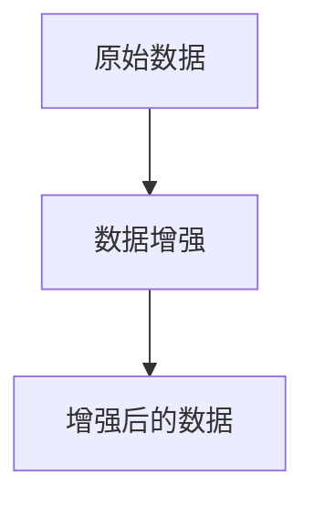

##### 3.1.3 数据标准化

数据标准化（Data Standardization）是指将数据转换为具有相同尺度和范围的过程。它有助于提高模型训练的稳定性和收敛速度。

```mermaid
graph TB
A[原始数据] --> B[数据标准化]
B --> C[标准化后的数据]
```

#### 3.2 训练策略

训练策略是AI大模型训练的核心，包括优化器、学习率调整和模型选择等。

##### 3.2.1 优化器

优化器（Optimizer）用于调整模型参数，以最小化损失函数。常用的优化器有随机梯度下降（SGD）、Adam等。

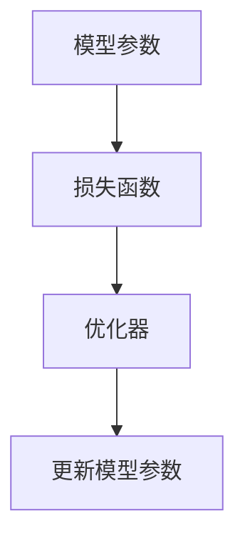

##### 3.2.2 学习率调整

学习率调整（Learning Rate Adjustment）是优化模型参数的重要手段。它可以通过学习率衰减、学习率预热等方法来提高训练效果。

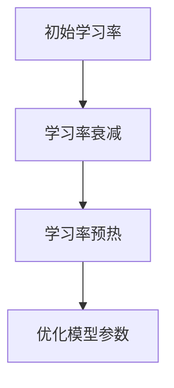

##### 3.2.3 模型选择

模型选择（Model Selection）是选择适合特定任务和数据集的模型结构。它可以通过交叉验证、超参数调优等方法来实现。

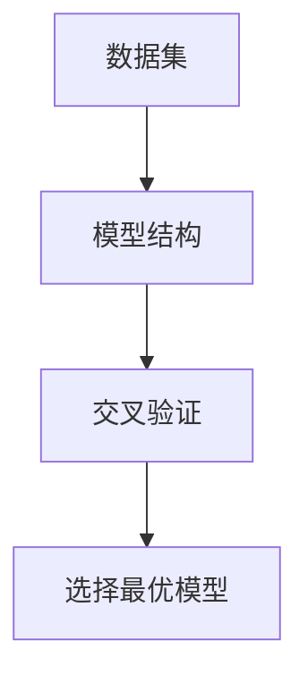

## 第二部分：电商平台的转化漏斗优化

### 第4章：AI大模型优化方法

#### 4.1 模型调优

模型调优（Model Tuning）是提高模型性能的重要手段。它包括参数调整、模型融合和模型压缩等方法。

##### 4.1.1 参数调整

参数调整（Parameter Tuning）是调整模型参数以优化模型性能的过程。它可以通过网格搜索、贝叶斯优化等方法来实现。

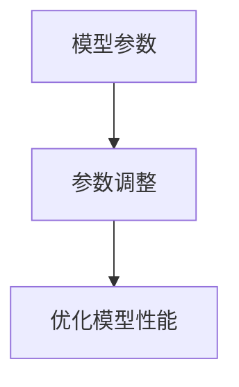

##### 4.1.2 模型融合

模型融合（Model Ensemble）是将多个模型的结果进行合并以提高模型性能的方法。它包括堆叠（Stacking）、Bagging、Boosting等策略。

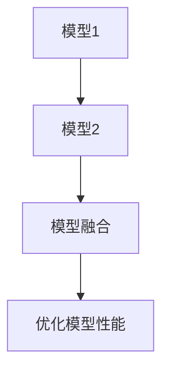

##### 4.1.3 模型压缩

模型压缩（Model Compression）是将模型参数量减少，以提高模型在资源受限环境下的性能。它包括量化、剪枝、蒸馏等方法。

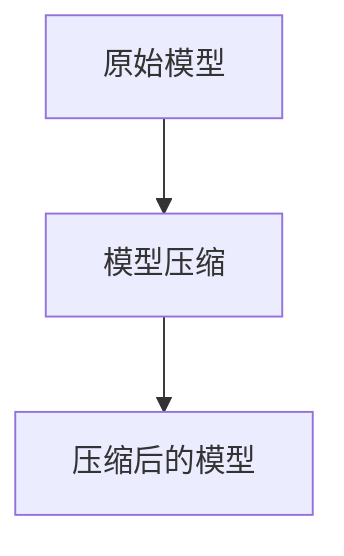

#### 4.2 模型评估

模型评估（Model Evaluation）是衡量模型性能的重要环节。它包括评价指标、评估方法和性能调优等。

##### 4.2.1 评价指标

评价指标（Evaluation Metric）是用于衡量模型性能的量化指标，如准确率、召回率、F1分数等。

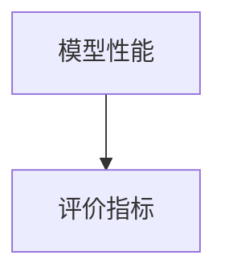

##### 4.2.2 评估方法

评估方法（Evaluation Method）是用于评估模型性能的方法，如交叉验证、K折验证等。

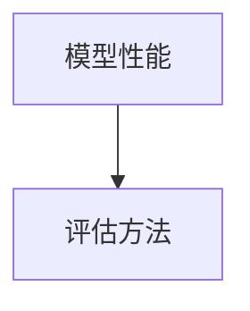

##### 4.2.3 性能调优

性能调优（Performance Tuning）是优化模型性能的过程。它可以通过模型调优、数据预处理、算法优化等方法来实现。

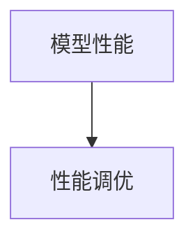

## 第三部分：电商平台的转化漏斗优化实践

### 第5章：电商平台的转化漏斗分析

#### 5.1 转化漏斗的概念

转化漏斗（Conversion Funnel）是用于描述用户在电商平台从浏览到购买的过程。它将用户行为分为多个阶段，以分析用户在各个阶段的转化情况。

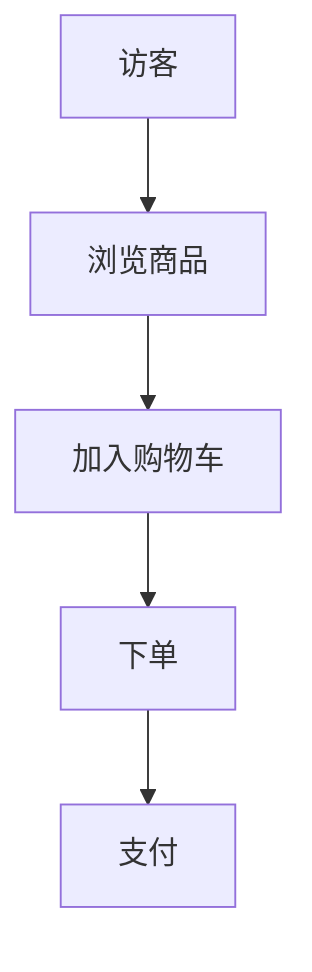

#### 5.2 转化漏斗的结构

转化漏斗的结构包括以下几个部分：

1. **顶部流量（Top of Funnel）**：吸引新用户的流量来源。
2. **中部行为（Middle of Funnel）**：用户在平台上的行为，如浏览、加入购物车等。
3. **底部转化（Bottom of Funnel）**：用户完成购买的行为。

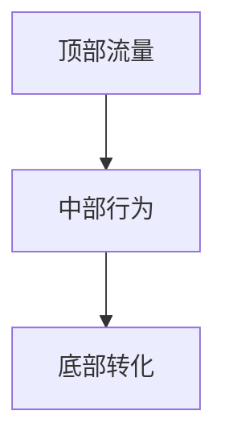

#### 5.3 转化漏斗的关键指标

转化漏斗的关键指标包括：

1. **访客到转化率（Visit-to-Customer Rate）**：从访客到最终转化的比例。
2. **转化率（Conversion Rate）**：用户在各个阶段转化的比例。
3. **平均订单价值（Average Order Value）**：用户在平台上的平均消费金额。
4. **回购率（Repeat Purchase Rate）**：用户在平台上的重复购买率。

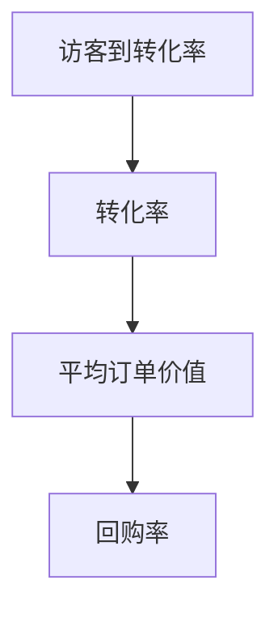

### 第6章：AI大模型在转化漏斗优化中的应用

#### 6.1 用户行为分析

AI大模型可以用于用户行为分析，以深入了解用户在平台上的行为模式。通过用户画像、用户偏好分析和用户流失预测等方法，电商平台可以更好地了解用户需求，优化用户体验。

##### 6.1.1 用户画像

用户画像（User Profile）是指对用户特征进行量化描述，以了解用户的兴趣爱好、购买习惯等。通过AI大模型，电商平台可以构建个性化用户画像，为用户提供更精准的推荐。

```mermaid
graph TB
A[用户数据] --> B[AI大模型]
B --> C[用户画像]
```

##### 6.1.2 用户偏好分析

用户偏好分析（User Preference Analysis）是指分析用户在平台上的行为数据，以了解用户对商品、品牌等的偏好。通过AI大模型，电商平台可以识别用户的偏好，为用户推荐更符合其需求的商品。

```mermaid
graph TB
A[用户行为数据] --> B[AI大模型]
B --> C[用户偏好分析]
```

##### 6.1.3 用户流失预测

用户流失预测（Churn Prediction）是指预测用户在未来一段时间内是否会停止使用平台的服务。通过AI大模型，电商平台可以提前识别潜在流失用户，采取相应的挽留措施。

```mermaid
graph TB
A[用户数据] --> B[AI大模型]
B --> C[用户流失预测]
```

#### 6.2 商品推荐系统

商品推荐系统（Product Recommendation System）是电商平台的核心功能之一。通过AI大模型，电商平台可以实现个性化推荐，提高用户的购买意愿和转化率。

##### 6.2.1 商品推荐算法

商品推荐算法（Product Recommendation Algorithm）是指用于生成商品推荐列表的算法。常见的推荐算法包括基于内容的推荐（Content-based Recommendation）和协同过滤（Collaborative Filtering）等。

```mermaid
graph TB
A[用户数据] --> B[基于内容的推荐]
B --> C[协同过滤]
```

##### 6.2.2 推荐系统评估

推荐系统评估（Recommendation System Evaluation）是指对推荐系统性能进行评估的方法。常用的评估指标包括准确率、召回率、覆盖率和新颖度等。

```mermaid
graph TB
A[推荐结果] --> B[准确率]
B --> C[召回率]
C --> D[覆盖率]
D --> E[新颖度]
```

##### 6.2.3 推荐系统优化

推荐系统优化（Recommendation System Optimization）是指通过调整算法参数、优化数据质量等方法来提高推荐系统性能的过程。

```mermaid
graph TB
A[推荐系统] --> B[算法参数调整]
B --> C[数据质量优化]
```

### 第7章：转化漏斗优化策略与实践

#### 7.1 数据驱动策略

数据驱动策略（Data-driven Strategy）是指通过分析用户行为数据来优化转化漏斗的过程。通过数据收集与处理、数据分析和数据驱动决策等方法，电商平台可以更好地了解用户需求，提高转化率。

##### 7.1.1 数据收集与处理

数据收集与处理（Data Collection and Processing）是指从多个渠道收集用户行为数据，并进行清洗、归一化等处理。

```mermaid
graph TB
A[数据收集] --> B[数据处理]
B --> C[数据存储]
```

##### 7.1.2 数据分析与洞察

数据分析与洞察（Data Analysis and Insight）是指通过统计分析和数据挖掘等方法，从数据中发现有用的信息和规律。

```mermaid
graph TB
A[数据集] --> B[统计分析]
B --> C[数据挖掘]
C --> D[洞察发现]
```

##### 7.1.3 数据驱动决策

数据驱动决策（Data-driven Decision）是指基于数据分析结果来制定和执行业务策略。

```mermaid
graph TB
A[数据分析] --> B[业务策略]
B --> C[决策执行]
```

#### 7.2 模型驱动策略

模型驱动策略（Model-driven Strategy）是指通过构建和优化AI大模型来优化转化漏斗的过程。通过模型搭建与训练、模型应用与评估、模型优化与更新等方法，电商平台可以不断提高模型性能，提升转化率。

##### 7.2.1 模型搭建与训练

模型搭建与训练（Model Building and Training）是指构建和训练AI大模型的过程。

```mermaid
graph TB
A[数据集] --> B[模型搭建]
B --> C[模型训练]
```

##### 7.2.2 模型应用与评估

模型应用与评估（Model Application and Evaluation）是指将训练好的模型应用于实际场景，并对其进行评估和优化。

```mermaid
graph TB
A[模型应用] --> B[模型评估]
B --> C[模型优化]
```

##### 7.2.3 模型优化与更新

模型优化与更新（Model Optimization and Update）是指通过调整模型参数、优化模型结构等方法来提高模型性能的过程。

```mermaid
graph TB
A[模型优化] --> B[模型更新]
```

### 第8章：AI大模型优化电商转化漏斗的案例分析

#### 8.1 案例一：电商平台A的转化漏斗优化

##### 8.1.1 案例背景

电商平台A是一家大型在线零售平台，其转化漏斗存在一定的优化空间。为了提高转化率，电商平台A决定采用AI大模型进行转化漏斗优化。

##### 8.1.2 优化策略

1. **用户行为分析**：通过用户画像和用户偏好分析，了解用户在平台上的行为和需求。
2. **商品推荐系统**：采用基于内容的推荐和协同过滤算法，为用户推荐更符合其需求的商品。
3. **转化漏斗优化**：通过分析转化漏斗的数据，识别优化点，并采取相应措施。

##### 8.1.3 优化效果

通过AI大模型的优化，电商平台A的转化率得到显著提升，用户满意度也有所提高。

#### 8.2 案例二：电商平台B的转化漏斗优化

##### 8.2.1 案例背景

电商平台B是一家专注于时尚品类的在线零售平台，其转化漏斗存在一定的优化空间。为了提高转化率，电商平台B决定采用AI大模型进行转化漏斗优化。

##### 8.2.2 优化策略

1. **用户行为分析**：通过用户画像和用户偏好分析，了解用户在平台上的行为和需求。
2. **商品推荐系统**：采用基于内容的推荐和协同过滤算法，为用户推荐更符合其需求的商品。
3. **转化漏斗优化**：通过分析转化漏斗的数据，识别优化点，并采取相应措施。

##### 8.2.3 优化效果

通过AI大模型的优化，电商平台B的转化率得到显著提升，用户满意度也有所提高。

## 附录

### 附录A：AI大模型开发工具与资源

##### A.1 开发工具简介

1. **TensorFlow**：由谷歌开发的开源深度学习框架，广泛应用于AI大模型开发。
2. **PyTorch**：由Facebook开发的开源深度学习框架，具有灵活的动态计算图。
3. **Keras**：用于快速构建和训练深度学习模型的Python库。

##### A.2 开发资源推荐

1. **《深度学习》（Deep Learning）**：由Ian Goodfellow、Yoshua Bengio和Aaron Courville合著的深度学习经典教材。
2. **《hands-on Machine Learning with Scikit-Learn, Keras, and TensorFlow》**：由Aurélien Géron编写的实战指南，涵盖了深度学习的基础知识和应用。
3. **AI大模型开源项目**：如TensorFlow Models、PyTorch Examples等，提供了大量的深度学习模型和示例代码。

##### A.3 开发经验分享

1. **数据预处理**：确保数据质量，进行数据清洗、归一化和数据增强等操作。
2. **模型调优**：通过调整超参数、优化训练策略等手段提高模型性能。
3. **模型部署**：将训练好的模型部署到生产环境，进行实时预测和推理。

## 结论

通过本文的讨论，我们可以看到AI大模型在优化电商平台转化漏斗方面的巨大潜力。通过深入分析用户行为、优化商品推荐系统和调整转化漏斗的关键指标，电商平台可以实现更高的转化率和用户满意度。然而，AI大模型的应用还面临着数据质量、模型调优和部署等方面的挑战。未来，随着技术的不断进步和应用场景的拓展，AI大模型在电商平台的转化漏斗优化中将发挥更为重要的作用。作者：AI天才研究院/AI Genius Institute & 禅与计算机程序设计艺术 /Zen And The Art of Computer Programming。

