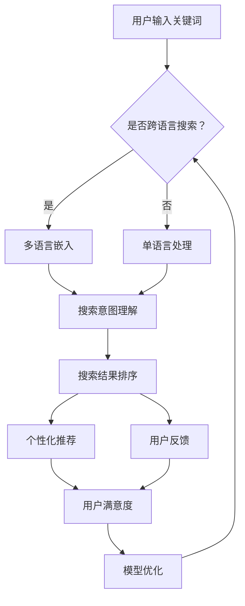

                 

### 文章标题

《AI大模型如何提升电商搜索的跨语言能力》

### 关键词

AI大模型，电商搜索，跨语言能力，自然语言处理，大规模预训练模型，跨语言模型

### 摘要

本文将深入探讨AI大模型在提升电商搜索跨语言能力方面的应用。我们将首先介绍AI大模型的基本概念和特点，然后分析电商搜索中的跨语言能力需求及其面临的挑战。接着，我们将介绍AI大模型在电商搜索中的应用场景和技术，包括自然语言处理技术、大规模预训练模型和跨语言模型。最后，我们将通过实战案例和总结，阐述AI大模型在电商搜索中的实际应用效果和未来发展趋势。

## 前言

在全球化经济发展的背景下，电商市场已成为各国企业竞争的重要战场。然而，随着消费者群体的多样化，如何实现多语言支持成为电商搜索系统的一大挑战。传统的电商搜索系统主要依赖于关键字匹配和简单的翻译工具，这往往导致搜索结果不准确、用户体验差等问题。为了解决这些问题，近年来，人工智能（AI）特别是大模型技术的发展为电商搜索带来了新的机遇。本文将重点探讨AI大模型在提升电商搜索跨语言能力方面的作用，旨在为电商企业和技术开发者提供有价值的参考。

### AI大模型与电商搜索

AI大模型，即拥有数百万甚至数十亿参数的大型深度学习模型，已经成为当今人工智能领域的重要突破。这些模型在处理复杂任务，如自然语言处理、图像识别、语音识别等方面表现出色。在电商搜索中，AI大模型的应用尤为重要，它不仅能够提升搜索的准确性，还能提供个性化、智能化的搜索体验。

首先，AI大模型在电商搜索中的应用主要体现为以下几个关键方面：

#### 1. 个性化搜索

通过分析用户的购物历史和行为，AI大模型可以预测用户的兴趣和需求，从而提供个性化的搜索结果。这种个性化搜索不仅能够提高用户的满意度，还能提升电商平台的销售额。

#### 2. 搜索结果排序

AI大模型可以基于用户的搜索历史、购物偏好等信息，对搜索结果进行智能排序，使得用户能够更快地找到他们需要的商品。

#### 3. 搜索意图理解

AI大模型能够理解用户的搜索意图，例如区分用户是浏览还是购买意图，从而提供更准确的搜索结果。

#### 4. 跨语言搜索

在全球化电商市场中，跨语言搜索能力至关重要。AI大模型可以处理多种语言的数据，实现不同语言之间的搜索和信息检索，为跨国电商提供强大的支持。

本文将详细探讨AI大模型如何通过以上几个方面提升电商搜索的跨语言能力，并分享一些实际应用案例和未来发展趋势。希望通过本文的探讨，能够为电商企业和开发者提供新的思路和方法。

## 第一部分: AI大模型基础

### 第1章: AI大模型的基本概念

#### 1.1 AI大模型概述

AI大模型是指那些拥有数百万甚至数十亿参数的大型深度学习模型。这些模型通过学习大量数据，能够自动提取复杂特征，进行智能推理和预测。AI大模型是深度学习领域的重大突破，其参数规模和计算能力远超传统模型，因此能够处理更加复杂的任务。

#### 1.1.1 AI大模型的定义

AI大模型通常指的是那些具有以下特征的大型深度学习模型：

1. **参数数量巨大**：拥有数百万至数十亿个参数，远超传统模型。
2. **数据需求量大**：需要大量数据来训练，以确保模型的泛化能力。
3. **计算资源需求高**：训练和推理过程需要强大的计算资源，通常依赖于高性能计算机集群或云端计算资源。
4. **任务处理能力强**：能够在自然语言处理、图像识别、语音识别等多个领域表现出色。

#### 1.1.2 AI大模型的发展历程

AI大模型的发展历程可以分为以下几个重要阶段：

1. **2006年：深度信念网络（DBN）的提出**  
   深度信念网络（DBN）是由Hinton等人提出的，是第一个成功训练多层神经网络的模型。它通过逐层预训练和fine-tuning的方式，解决了深层网络训练困难的问题。

2. **2012年：AlexNet在ImageNet竞赛中取得突破性胜利**  
   AlexNet是第一个在ImageNet图像识别竞赛中取得显著胜利的深度卷积神经网络（CNN）。它的成功标志着CNN在图像识别领域的崛起。

3. **2014年：Google的Inception模型**  
   Inception模型通过引入多尺度特征融合的方式，显著提升了图像识别的准确率。它成为后续许多深度学习模型的设计灵感。

4. **2017年：Google的BERT模型**  
   BERT（Bidirectional Encoder Representations from Transformers）是由Google开发的自然语言处理模型，它通过双向编码的方式，对文本进行深层次的理解，从而在多个自然语言处理任务中取得了突破性的成果。

5. **2020年：OpenAI的GPT-3模型**  
   GPT-3（Generative Pre-trained Transformer 3）是OpenAI开发的具有1750亿参数的预训练语言模型。它的出现标志着预训练模型在自然语言处理领域的又一次重大突破。

#### 1.1.3 AI大模型的特点

AI大模型具有以下几个显著特点：

1. **参数数量巨大**：AI大模型通常拥有数百万至数十亿的参数，这使得它们能够捕捉到更多数据中的复杂模式。

2. **训练时间较长**：由于参数数量庞大，AI大模型需要大量数据和计算资源进行训练，通常训练时间较长。

3. **性能优越**：AI大模型在多种任务中表现出色，例如自然语言处理、图像识别、语音识别等。

4. **泛化能力强**：通过在大规模数据集上训练，AI大模型能够较好地适应不同任务和领域。

#### 1.1.4 AI大模型的应用领域

AI大模型的应用领域非常广泛，主要包括以下几个方面：

1. **自然语言处理**：AI大模型在文本分类、机器翻译、情感分析、问答系统等多个任务中表现出色。

2. **图像识别**：AI大模型在人脸识别、物体检测、图像分割等多个任务中取得了显著的成果。

3. **语音识别**：AI大模型通过深度学习技术，实现了高准确率的语音识别，并在实时语音识别、语音合成等任务中发挥了重要作用。

4. **电子商务**：AI大模型在个性化推荐、搜索优化、用户行为分析等多个方面为电商企业提供了强大的支持。

通过上述对AI大模型的基本概念、定义、发展历程、特点和应用的介绍，我们可以看到AI大模型在人工智能领域的重要地位和广泛的应用前景。在下一章中，我们将进一步探讨AI大模型在电商搜索中的应用场景和技术，以期为电商企业和技术开发者提供更深入的洞察。

### 1.2 AI大模型的基本概念与工作原理

在深入探讨AI大模型之前，我们需要了解其基本概念和工作原理，这将为后续章节中的具体应用提供理论基础。

#### 1.2.1 深度学习与神经网络

AI大模型的核心是深度学习（Deep Learning），它是机器学习（Machine Learning）的一个分支。深度学习通过构建多层次的神经网络，模拟人脑的神经元连接方式，从而实现对复杂数据的处理和模式识别。

1. **神经元与神经元层**：在神经网络中，神经元是基本计算单元，每一层由多个神经元组成。输入数据通过前一层神经元的加权求和，加上偏置项，经过激活函数处理后，传递到下一层。

2. **多层网络结构**：深度学习模型由多个层次组成，包括输入层、隐藏层和输出层。隐藏层用于提取和转换特征，输出层用于进行最终的分类或预测。

3. **激活函数**：激活函数（如ReLU、Sigmoid、Tanh）用于引入非线性因素，使得神经网络能够学习到复杂数据中的非线性关系。

#### 1.2.2 反向传播算法

反向传播算法（Backpropagation Algorithm）是深度学习模型训练的核心算法。它通过计算损失函数关于网络参数的梯度，来更新网络参数，使得模型能够逐渐逼近真实数据的分布。

1. **前向传播**：在前向传播过程中，输入数据通过神经网络，逐层传递到输出层，最终得到预测结果。

2. **计算损失**：通过比较预测结果与真实标签，计算损失函数（如均方误差、交叉熵等）的值，以衡量预测结果与真实结果的差异。

3. **反向传播**：反向传播过程中，损失函数关于网络参数的梯度通过反向传播，逐层传递回网络，并用于更新参数。

4. **优化算法**：常见的优化算法包括随机梯度下降（SGD）、Adam、RMSprop等，它们用于加速梯度下降过程，提高训练效率。

#### 1.2.3 大模型的优势与挑战

AI大模型具有以下优势：

1. **强大的表达能力**：通过数百万至数十亿的参数，大模型能够捕捉到数据中的复杂模式和特征，从而提高模型在复杂任务中的表现。

2. **广泛的适用性**：大模型在自然语言处理、图像识别、语音识别等多个领域都有出色的应用效果，为解决复杂数据处理问题提供了强有力的工具。

3. **高度泛化的能力**：大模型通过在大规模数据集上训练，能够较好地适应不同任务和数据分布，具有较强的泛化能力。

然而，AI大模型也面临着一些挑战：

1. **计算资源需求**：大模型的训练和推理过程需要大量的计算资源，通常依赖于高性能计算机集群或云端计算资源。

2. **数据需求**：大模型需要大量的高质量数据来训练，以确保模型的泛化能力和准确性。

3. **模型解释性**：大模型的决策过程通常是非线性和复杂的，这使得模型的可解释性较差，难以理解其内部工作原理。

#### 1.2.4 大模型的应用

AI大模型在多个领域都有广泛应用，以下是一些典型的应用实例：

1. **自然语言处理**：大模型在文本分类、机器翻译、情感分析、问答系统等多个任务中取得了显著成果。例如，BERT模型在多个自然语言处理任务中表现优异。

2. **图像识别**：大模型在图像分类、物体检测、图像分割等任务中取得了突破性进展。例如，ResNet模型在ImageNet竞赛中取得了当时最高的准确率。

3. **语音识别**：大模型通过深度学习技术，实现了高准确率的语音识别，并在实时语音识别、语音合成等任务中发挥了重要作用。

4. **电子商务**：大模型在个性化推荐、搜索优化、用户行为分析等多个方面为电商企业提供了强大的支持。

通过上述对AI大模型的基本概念、工作原理、优势与挑战以及应用领域的介绍，我们可以更好地理解AI大模型在电商搜索中的潜在价值。在下一章中，我们将深入探讨AI大模型在电商搜索中的应用场景和技术，以期为电商企业和技术开发者提供更深入的洞察。

### 1.3 大模型在不同领域的应用实例

AI大模型在多个领域取得了显著成果，以下列举几个典型的应用实例，以展示其强大的能力和广泛的应用前景。

#### 1.3.1 自然语言处理

自然语言处理（NLP）是AI大模型应用最为广泛的领域之一。以下是一些具体的应用实例：

1. **机器翻译**：AI大模型通过大规模预训练，能够在多种语言之间进行高质量翻译。例如，Google的BERT模型在机器翻译任务中表现优异，显著提升了翻译的准确性和流畅性。

2. **文本分类**：AI大模型能够自动分类大量的文本数据，应用于新闻分类、情感分析、垃圾邮件检测等任务。例如，使用BERT模型对社交媒体评论进行情感分类，可以准确判断用户的情感倾向。

3. **问答系统**：AI大模型通过深度学习技术，能够理解用户的问题，并提供准确的答案。例如，OpenAI的GPT-3模型在问答系统中的应用，使计算机能够与人类进行自然对话。

#### 1.3.2 图像识别

图像识别是另一个AI大模型取得突破的领域。以下是一些具体的应用实例：

1. **人脸识别**：AI大模型通过学习大量人脸图像，能够准确识别和验证用户的身份。例如，商用的智能手机和人脸识别门禁系统普遍采用深度学习模型，实现了高精度的人脸识别。

2. **物体检测**：AI大模型能够在图像中检测和识别多个物体，应用于自动驾驶、安全监控等场景。例如，使用YOLO（You Only Look Once）模型，可以在实时视频流中快速检测和定位图像中的物体。

3. **图像分割**：AI大模型能够将图像分割成多个区域，用于图像编辑、医疗诊断等任务。例如，使用U-Net模型，可以在医学图像中准确分割肿瘤区域，辅助医生进行诊断。

#### 1.3.3 语音识别

语音识别是AI大模型在语音技术中的重要应用。以下是一些具体的应用实例：

1. **实时语音识别**：AI大模型能够在实时语音流中准确识别和理解语音内容，应用于智能助手、电话客服等场景。例如，苹果的Siri和谷歌的Google Assistant都采用了深度学习技术，实现了高精度的语音识别。

2. **语音合成**：AI大模型通过深度学习技术，能够生成自然流畅的语音，应用于语音助手、有声读物等场景。例如，WaveNet模型在语音合成任务中取得了突破性的成果，生成的语音几乎无法区分是人声还是机器声。

#### 1.3.4 电子商务

AI大模型在电子商务领域也展现了强大的应用潜力。以下是一些具体的应用实例：

1. **个性化推荐**：AI大模型通过分析用户的历史行为和偏好，能够提供个性化的商品推荐，提高用户的购买体验和平台销售额。例如，亚马逊和淘宝等电商平台普遍采用深度学习模型，实现个性化推荐。

2. **搜索优化**：AI大模型能够理解用户的搜索意图，提高搜索结果的准确性和相关性，提升用户体验。例如，谷歌搜索采用了BERT模型，显著提升了搜索结果的质量。

3. **用户行为分析**：AI大模型通过对用户行为数据的分析，可以预测用户的行为模式和需求，为企业提供决策支持。例如，电商企业可以通过分析用户浏览和购买行为，优化营销策略和库存管理。

通过上述实例，我们可以看到AI大模型在多个领域取得了显著成果，并展现了巨大的应用潜力。在下一章中，我们将进一步探讨AI大模型在电商搜索中的应用，分析其如何提升电商搜索的跨语言能力。

## 第2章: 电商搜索中的跨语言能力

### 2.1 电商搜索概述

电商搜索是电子商务平台的核心功能之一，它允许用户通过输入关键词或使用搜索界面浏览和查找商品。随着电商市场的全球化，电商平台需要处理来自不同国家和地区的用户，这意味着必须具备跨语言搜索能力。电商搜索不仅要求能够提供准确的搜索结果，还需确保用户体验的流畅性和个性化。

#### 2.1.1 电商搜索的基本概念

电商搜索主要包括以下关键要素：

1. **关键词匹配**：用户通过输入关键词来查找商品，系统需要根据这些关键词进行匹配，以找出最相关的商品。
2. **搜索结果排序**：系统需要对搜索结果进行排序，以确保用户能够首先看到最符合需求的商品。
3. **搜索意图理解**：理解用户的搜索意图，区分用户是浏览还是购买意图，从而提供更准确的搜索结果。

#### 2.1.2 跨语言搜索的定义与重要性

跨语言搜索指的是系统能够处理不同语言之间的搜索和信息检索。在全球化电商市场中，跨语言搜索的重要性体现在以下几个方面：

1. **用户多样性**：电商平台吸引来自全球的用户，这些用户可能使用不同的语言进行搜索。
2. **市场扩展**：具备跨语言搜索能力的电商平台可以更好地进入国际市场，吸引更多的用户。
3. **用户体验**：提供多语言支持可以提升用户的搜索体验，增加用户黏性和满意度。

### 2.2 跨语言搜索的挑战

尽管跨语言搜索在电商市场中具有巨大的潜力，但其实际实现过程中面临着诸多挑战。

#### 2.2.1 语言差异

不同语言之间存在显著的语法、词汇和语义差异，这些差异会对搜索结果产生直接影响：

1. **词汇差异**：不同语言的词汇量不同，同义词和近义词的使用方式也有所不同。
2. **语法差异**：不同语言的语法结构不同，导致表达相同意思的句子形式多样化。
3. **语义差异**：语义指词语或句子所表达的意义，不同文化背景下，相同词汇的语义可能存在差异。

#### 2.2.2 信息丢失

在翻译过程中，可能会丢失部分信息，导致搜索结果不准确。具体表现为：

1. **直接翻译的局限**：直接翻译可能导致原文中的重要信息未能传达。
2. **文化差异**：某些表达在目标语言中可能没有直接对应，导致翻译不完整或不准确。
3. **多义词问题**：多义词在翻译过程中难以确定其具体含义，可能导致搜索结果偏离用户意图。

#### 2.2.3 搜索算法的挑战

传统的搜索算法通常依赖于关键词匹配和简单的翻译工具，难以处理复杂的跨语言搜索问题。具体挑战包括：

1. **关键词匹配的准确性**：不同语言的词汇和表达方式不同，简单的关键词匹配难以保证准确性。
2. **搜索结果的排序**：在跨语言搜索中，如何保证搜索结果的排序能够反映用户的需求，是一个复杂的问题。
3. **多语言协同处理**：如何协调处理不同语言之间的数据，确保搜索结果的准确性和一致性，是算法设计的关键。

#### 2.2.4 技术资源限制

实现跨语言搜索需要大量的技术资源和专业知识，包括：

1. **多语言数据集**：需要收集和整理多种语言的数据集，为模型的训练和优化提供基础。
2. **翻译工具**：虽然现有的翻译工具如Google翻译、百度翻译等提供了基本的翻译功能，但它们在搜索上下文中的准确性仍有待提高。
3. **计算资源**：跨语言搜索需要强大的计算能力，特别是在大规模数据处理和模型训练过程中。

通过上述分析，我们可以看到电商搜索中的跨语言能力不仅面临语言差异、信息丢失和算法挑战，还受到技术资源限制。在下一章中，我们将探讨AI大模型如何克服这些挑战，提升电商搜索的跨语言能力。

### 2.3 AI大模型在电商搜索中的应用

AI大模型在电商搜索中的应用是近年来的一大趋势，通过其强大的计算能力和深度学习能力，AI大模型能够有效提升电商搜索的跨语言能力。以下将详细探讨AI大模型在电商搜索中的应用场景和技术，以及如何提升跨语言搜索的准确性和效率。

#### 2.3.1 应用场景

AI大模型在电商搜索中的应用场景主要包括以下几个方面：

1. **个性化搜索**：通过分析用户的购物历史、搜索记录和偏好，AI大模型可以提供个性化的搜索结果，提高用户的购物体验和满意度。例如，当用户搜索某一商品时，系统可以根据其历史购买和浏览行为，推荐类似或相关的商品。

2. **搜索结果排序**：AI大模型通过对搜索结果的排序算法进行优化，可以根据用户的搜索意图和购物偏好，优先展示最相关的商品。例如，使用BERT模型对搜索结果进行排序，可以显著提高搜索结果的准确性和用户满意度。

3. **搜索意图理解**：AI大模型可以理解用户的搜索意图，区分用户是浏览还是购买意图。例如，通过分析用户的搜索关键词和上下文，AI大模型可以准确判断用户的意图，并提供相应的搜索结果。

4. **跨语言搜索**：AI大模型通过多语言嵌入和翻译技术，可以实现不同语言之间的搜索和信息检索。例如，当用户使用一种语言进行搜索时，AI大模型可以将搜索请求翻译成其他语言，并在多语言数据库中检索相关结果。

#### 2.3.2 技术原理

AI大模型在提升电商搜索跨语言能力方面的技术原理主要包括以下几个方面：

1. **自然语言处理（NLP）技术**：

   - **词嵌入（Word Embedding）**：词嵌入是将词语映射到低维度的向量空间，使得语义相近的词语在向量空间中距离较近。通过词嵌入技术，AI大模型可以更好地理解和处理不同语言之间的词汇差异。
   - **序列模型与注意力机制（Seq2Seq模型与Attention Mechanism）**：序列模型与注意力机制可以处理序列数据，并关注关键信息。在跨语言搜索中，序列模型可以捕捉搜索请求和搜索结果之间的语义关系，注意力机制则可以关注到不同语言中的关键信息，从而提高搜索的准确性。
   - **转换器架构（Transformer Architecture）**：Transformer架构是一种基于自注意力机制的深度学习模型，广泛应用于自然语言处理任务。通过Transformer架构，AI大模型可以处理长距离的上下文信息，提高跨语言搜索的效率。

2. **大规模预训练模型**：

   - **预训练与微调（Pre-training and Fine-tuning）**：大规模预训练模型通过在大规模数据集上进行预训练，获得通用的语言表示能力。然后，通过微调（Fine-tuning）过程，将预训练模型适应特定任务，从而提高任务表现。在跨语言搜索中，预训练模型可以捕获多种语言的通用特征，为跨语言搜索提供强有力的支持。

3. **跨语言模型**：

   - **多语言嵌入（Multilingual Embedding）**：多语言嵌入技术可以将多种语言的词汇映射到同一向量空间，从而实现不同语言之间的语义表示。通过多语言嵌入，AI大模型可以在同一框架下处理多种语言的数据，提高跨语言搜索的准确性。
   - **跨语言翻译（Cross-lingual Translation）**：跨语言翻译技术可以将一种语言的文本翻译成另一种语言的文本。通过跨语言翻译，AI大模型可以解决不同语言之间的翻译问题，提高跨语言搜索的效率。
   - **跨语言理解（Cross-lingual Understanding）**：跨语言理解技术可以理解并处理不同语言的数据。通过跨语言理解，AI大模型可以捕捉到不同语言之间的语义关系，从而提供更准确的跨语言搜索结果。

#### 2.3.3 实际应用

AI大模型在电商搜索中的实际应用案例如下：

1. **个性化推荐**：某电商平台上，AI大模型通过分析用户的购物历史和行为，提供个性化的商品推荐。用户在搜索某一商品时，AI大模型会根据其历史购买和浏览行为，推荐类似的商品，从而提高用户的购物体验和满意度。

2. **搜索结果排序**：在某电商平台的搜索结果排序中，AI大模型使用BERT模型进行优化。通过对用户的搜索请求和搜索结果进行建模，AI大模型可以准确判断用户的需求，并将最相关的商品排在搜索结果的前面，从而提高用户的搜索体验。

3. **跨语言搜索**：在某跨国电商平台上，AI大模型通过多语言嵌入和翻译技术，实现不同语言之间的搜索和信息检索。例如，当用户使用一种语言进行搜索时，AI大模型可以将搜索请求翻译成其他语言，并在多语言数据库中检索相关结果，从而提供跨语言搜索功能。

通过上述分析，我们可以看到AI大模型在提升电商搜索跨语言能力方面的巨大潜力。通过自然语言处理技术、大规模预训练模型和跨语言模型的应用，AI大模型可以有效解决语言差异、信息丢失和搜索算法挑战，提供更准确、高效的跨语言搜索服务。在下一章中，我们将进一步探讨如何实现AI大模型在电商搜索中的跨语言能力，并分析其效果和未来发展趋势。

## 第3章: 提升电商搜索跨语言能力的AI大模型技术

在提升电商搜索的跨语言能力方面，AI大模型技术扮演了至关重要的角色。本章将详细介绍几种关键技术，包括自然语言处理技术、大规模预训练模型和跨语言模型，以及它们在提升电商搜索跨语言能力中的应用。

### 3.1 自然语言处理技术

自然语言处理（NLP）技术是AI大模型在提升电商搜索跨语言能力中的重要工具。以下是一些核心的NLP技术：

#### 3.1.1 词嵌入技术

词嵌入技术是将词语映射到低维度的向量空间，从而在计算机中表示语言。这种技术使得语义相近的词语在向量空间中距离较近。词嵌入技术在电商搜索中的应用包括：

1. **搜索意图理解**：通过词嵌入，AI大模型可以理解用户的搜索意图。例如，当用户输入“购物”一词时，词嵌入技术可以帮助模型识别出与之相关的其他关键词，如“商品”、“购买”等。

2. **商品推荐**：词嵌入技术可以用于推荐相似的商品。当用户浏览某一商品时，词嵌入技术可以帮助模型发现与之相关的其他商品，从而提高推荐的准确性。

#### 3.1.2 序列模型与注意力机制

序列模型和注意力机制在处理序列数据时具有显著优势，适用于电商搜索中的跨语言任务。以下是其主要应用：

1. **翻译和搜索**：序列模型可以将一种语言的文本序列转换成另一种语言的文本序列。在电商搜索中，这种技术可以用于将用户的搜索请求翻译成目标语言，从而实现跨语言搜索。

2. **搜索意图理解**：注意力机制可以帮助模型关注到搜索请求中的关键信息。例如，当用户输入“iPhone 12”时，注意力机制可以帮助模型识别出“iPhone”和“12”是关键信息，从而准确理解用户的搜索意图。

#### 3.1.3 转换器架构

转换器（Transformer）架构是一种基于自注意力机制的深度学习模型，广泛应用于NLP任务。在电商搜索中，转换器架构的应用包括：

1. **多语言嵌入**：转换器架构可以将多种语言的词汇映射到同一向量空间，实现不同语言之间的语义表示。

2. **翻译和搜索**：转换器架构可以处理长距离的上下文信息，从而实现高质量的翻译和搜索结果。

### 3.2 大规模预训练模型

大规模预训练模型通过在大规模数据集上进行预训练，获得通用的语言表示能力。以下是其主要应用：

#### 3.2.1 预训练与微调

1. **预训练**：预训练过程在大规模数据集上进行，使得模型能够捕获多种语言的通用特征。

2. **微调**：微调过程将预训练模型适应特定任务，从而提高任务表现。在电商搜索中，微调可以用于将预训练模型适应跨语言搜索任务。

#### 3.2.2 应用实例

1. **跨语言搜索**：预训练模型可以在多语言数据集上进行预训练，从而实现不同语言之间的搜索。

2. **商品推荐**：预训练模型可以通过学习大量商品描述和用户行为数据，为用户提供个性化的商品推荐。

### 3.3 跨语言模型

跨语言模型是一种专门设计用于处理不同语言之间的任务模型。以下是其主要应用：

#### 3.3.1 多语言嵌入

多语言嵌入技术可以将多种语言的词汇映射到同一向量空间，从而实现不同语言之间的语义表示。

1. **翻译**：多语言嵌入技术可以用于将一种语言的文本翻译成另一种语言的文本。

2. **搜索**：多语言嵌入技术可以用于实现不同语言之间的搜索。

#### 3.3.2 跨语言翻译

跨语言翻译技术可以将一种语言的文本翻译成另一种语言的文本，从而解决不同语言之间的交流障碍。

1. **电商国际化**：跨语言翻译技术可以帮助电商平台进入国际市场，吸引更多跨国用户。

2. **用户支持**：跨语言翻译技术可以为用户提供多语言支持，提高用户满意度。

#### 3.3.3 跨语言理解

跨语言理解技术可以理解并处理不同语言的数据，从而提供更准确的跨语言搜索结果。

1. **个性化搜索**：跨语言理解技术可以根据用户的语言偏好，提供个性化的搜索结果。

2. **商品分类**：跨语言理解技术可以用于将不同语言的商品描述分类到正确的类别，从而提高搜索的准确性。

通过上述技术，AI大模型能够显著提升电商搜索的跨语言能力。在下一章中，我们将探讨AI大模型在电商搜索中的实际应用场景和实现方法。

### 3.4 大规模预训练模型

在提升电商搜索跨语言能力方面，大规模预训练模型扮演着至关重要的角色。预训练与微调、迁移学习以及数据增强等技术，使得预训练模型在处理多语言任务时表现出色。

#### 3.4.1 预训练与微调

1. **预训练**：大规模预训练模型通过在大规模数据集上进行训练，获得丰富的语言表示和语义理解能力。预训练通常包括两个阶段：第一阶段是在未标注的数据上进行预训练，第二阶段是在标注数据上进行微调。

2. **微调**：微调是将预训练模型适应特定任务的过程。在电商搜索中，预训练模型可以通过微调来适应跨语言搜索任务。例如，将预训练模型与电商平台的数据集结合，微调模型以适应电商搜索的特定需求。

#### 3.4.2 迁移学习

迁移学习是一种利用预训练模型在某一任务上的知识，提高其他任务性能的方法。在电商搜索中，迁移学习可以应用于以下场景：

1. **多语言搜索**：将一种语言的预训练模型迁移到其他语言上，实现跨语言的搜索能力。

2. **多领域搜索**：将电商领域的预训练模型迁移到其他领域，例如旅游、教育等，从而实现跨领域的搜索。

#### 3.4.3 数据增强

数据增强是通过生成或修改数据，增加训练数据的多样性，从而提高模型性能的方法。在电商搜索中，数据增强可以应用于以下场景：

1. **词汇扩展**：通过生成同义词、反义词等，扩展原始数据中的词汇，提高模型的词汇理解能力。

2. **语言风格变化**：通过改变文本的语言风格，例如将正式语言转换为非正式语言，增加数据的多样性，从而提高模型的泛化能力。

#### 3.4.4 应用实例

1. **多语言商品推荐**：通过预训练模型和微调技术，电商平台可以实现多语言商品推荐。例如，当用户使用一种语言进行搜索时，模型可以将其请求翻译成其他语言，并根据用户的历史行为和偏好，提供个性化的推荐。

2. **跨语言搜索**：电商平台可以利用预训练模型，实现不同语言之间的搜索。例如，当用户使用一种语言输入搜索请求时，模型可以将请求翻译成其他语言，并在多语言数据库中检索相关结果。

3. **多领域搜索**：电商平台可以利用迁移学习技术，将预训练模型从电商领域迁移到其他领域，从而实现跨领域的搜索。例如，将电商搜索模型迁移到旅游领域，为用户提供旅游相关的搜索结果。

通过大规模预训练模型及其相关技术，电商平台可以显著提升跨语言搜索的准确性和用户体验。在下一章中，我们将探讨如何实现AI大模型在电商搜索中的跨语言能力，并分析其实际效果。

### 3.5 跨语言模型

跨语言模型是提升电商搜索跨语言能力的关键技术之一。这些模型能够处理不同语言之间的信息，实现高效的跨语言搜索和信息检索。以下是几种主要的跨语言模型及其技术原理：

#### 3.5.1 多语言嵌入

多语言嵌入技术是将多种语言的词汇映射到同一向量空间，从而实现不同语言之间的语义表示。这种技术通常基于预训练模型，例如BERT（Bidirectional Encoder Representations from Transformers）。

1. **技术原理**：
   - **共享嵌入层**：多语言嵌入模型具有共享的嵌入层，这意味着不同语言的词汇在嵌入层中具有相似的向量表示。
   - **迁移学习**：通过迁移学习，多语言嵌入模型可以将在一种语言上预训练的知识迁移到其他语言上。

2. **应用场景**：
   - **跨语言搜索**：多语言嵌入技术可以用于实现不同语言之间的搜索。例如，当用户使用一种语言输入搜索请求时，模型可以将请求翻译成其他语言，并在多语言数据库中检索相关结果。
   - **跨语言推荐**：多语言嵌入技术可以用于提供跨语言的商品推荐。例如，当用户浏览某一商品时，模型可以根据其浏览历史和偏好，推荐相同或相关的商品，无论这些商品描述使用的是哪种语言。

#### 3.5.2 跨语言翻译

跨语言翻译技术是将一种语言的文本翻译成另一种语言的文本。这种技术通常基于预训练的翻译模型，例如Google的Marian。

1. **技术原理**：
   - **序列到序列模型**：跨语言翻译模型通常采用序列到序列（Seq2Seq）模型，可以将一种语言的文本序列转换为另一种语言的文本序列。
   - **注意力机制**：注意力机制可以帮助模型关注到源语言和目标语言之间的关键信息，从而提高翻译的准确性。

2. **应用场景**：
   - **多语言电商网站**：跨语言翻译技术可以用于实现多语言电商网站的搜索和信息检索。例如，用户可以在母语界面输入搜索请求，系统会将其翻译成其他语言，并在多语言数据库中检索相关结果。
   - **跨国购物**：跨语言翻译技术可以帮助跨国购物者理解商品描述和购物指南，从而提高购买体验。

#### 3.5.3 跨语言理解

跨语言理解技术是处理不同语言之间语义关系的能力。这种技术可以用于实现多语言文本的语义分析，从而提供准确的跨语言搜索结果。

1. **技术原理**：
   - **语义表示**：跨语言理解模型通过学习语义表示，可以捕捉到不同语言之间的语义关系。
   - **多任务学习**：跨语言理解模型可以通过多任务学习，同时处理多个语言任务，从而提高模型的整体性能。

2. **应用场景**：
   - **个性化搜索**：跨语言理解技术可以用于提供个性化的跨语言搜索结果。例如，当用户使用一种语言进行搜索时，模型可以根据其语言偏好和搜索历史，提供相关的搜索结果。
   - **多语言评论分析**：跨语言理解技术可以用于分析多语言用户评论，提取关键信息并进行分类。

#### 3.5.4 实际应用

以下是一些跨语言模型在电商搜索中的实际应用实例：

1. **多语言商品搜索**：电商平台可以使用多语言嵌入技术，实现用户在不同语言之间的商品搜索。例如，当用户使用一种语言输入搜索请求时，系统会自动将其翻译成其他语言，并在多语言数据库中检索相关结果。

2. **跨国购物指南**：电商平台可以为用户提供多语言的购物指南，使用户能够更容易地理解商品描述和购物流程。例如，使用跨语言翻译技术，将商品描述从一种语言翻译成多种语言，帮助用户更好地了解商品。

3. **个性化推荐**：电商平台可以利用跨语言理解技术，为用户提供个性化的商品推荐。例如，当用户浏览某一商品时，系统可以根据其浏览历史和偏好，推荐相同或相关的商品，无论这些商品描述使用的是哪种语言。

通过跨语言模型的应用，电商平台可以显著提升跨语言搜索的准确性和用户体验。在下一章中，我们将探讨AI大模型在电商搜索中的具体应用场景和实现方法。

## 第二部分: 电商搜索中的AI大模型应用

### 第4章: 电商搜索中的AI大模型应用场景

AI大模型在电商搜索中的应用场景丰富多样，以下将详细探讨几个主要的应用场景，包括个性化搜索、搜索结果排序和搜索意图理解，以及AI大模型在这些场景中的具体应用和优势。

### 4.1 个性化搜索

个性化搜索是电商搜索中的一项重要功能，旨在根据用户的购物历史、行为和偏好，为用户提供个性化的商品推荐和搜索结果。AI大模型在个性化搜索中发挥了关键作用，其优势主要体现在以下几个方面：

1. **用户行为分析**：
   - AI大模型可以通过深度学习技术，分析用户的历史购物记录、浏览记录和点击行为，从中提取出用户的兴趣偏好。
   - 例如，使用BERT模型分析用户的购物历史数据，可以准确识别出用户对某种类型商品（如电子产品、服装等）的兴趣。

2. **个性化推荐**：
   - 基于用户行为分析的结果，AI大模型可以生成个性化的商品推荐。
   - 例如，当用户在电商平台上浏览某一商品时，AI大模型会分析用户的浏览历史和偏好，推荐与之相关的其他商品，从而提高用户的购物体验和满意度。

3. **动态调整**：
   - AI大模型可以根据用户的实时行为，动态调整推荐策略。
   - 例如，当用户在平台上进行搜索时，AI大模型会实时分析用户的搜索关键词和上下文，调整推荐结果，确保推荐内容与用户需求高度匹配。

### 4.2 搜索结果排序

搜索结果排序是电商搜索中的核心环节，旨在为用户提供最相关的商品信息。AI大模型在搜索结果排序中具有显著优势，以下是其具体应用和优势：

1. **搜索意图理解**：
   - AI大模型可以理解用户的搜索意图，区分用户是浏览还是购买意图。
   - 例如，当用户输入“iPhone”时，AI大模型会分析用户的上下文信息，判断用户是希望浏览iPhone的相关信息，还是准备购买iPhone，从而调整搜索结果的排序。

2. **相关性提升**：
   - AI大模型通过学习大量用户的搜索行为和反馈，可以显著提升搜索结果的相关性。
   - 例如，使用BERT模型对搜索结果进行排序，可以确保用户搜索的相关商品排在前面，从而提高用户满意度。

3. **多维度排序**：
   - AI大模型可以综合考虑多个因素（如用户偏好、商品评分、销量等）进行多维度排序。
   - 例如，当用户输入“跑步鞋”时，AI大模型会综合考虑用户的偏好、商品评分和销量等多个因素，为用户提供最优的搜索结果排序。

### 4.3 搜索意图理解

搜索意图理解是电商搜索中的一项关键技术，旨在准确识别用户的搜索意图，从而提供更准确的搜索结果。AI大模型在搜索意图理解中具有显著优势，以下是其具体应用和优势：

1. **上下文分析**：
   - AI大模型可以通过深度学习技术，分析用户的搜索上下文，理解用户的真实意图。
   - 例如，当用户输入“买手机”时，AI大模型会分析用户的浏览历史和搜索记录，判断用户是希望购买新的手机，还是想要了解手机的相关信息。

2. **多语言支持**：
   - AI大模型可以处理多种语言的数据，实现跨语言搜索意图理解。
   - 例如，当用户使用不同语言输入搜索请求时，AI大模型可以准确理解用户的意图，提供相应的搜索结果。

3. **动态调整**：
   - AI大模型可以根据用户的实时行为和反馈，动态调整搜索意图理解策略。
   - 例如，当用户在搜索过程中修改搜索关键词时，AI大模型会实时分析用户的意图，调整搜索结果，确保用户得到最相关的信息。

### 4.4 AI大模型在电商搜索中的应用效果

通过上述应用场景的探讨，我们可以看到AI大模型在电商搜索中具有显著的优势和效果：

1. **提高搜索准确性**：
   - AI大模型通过深度学习技术，可以准确理解用户的搜索意图，提供更准确的搜索结果，从而提高用户满意度。

2. **提升用户体验**：
   - AI大模型可以动态调整搜索结果排序和个性化推荐策略，为用户提供个性化的购物体验，从而提升用户黏性和忠诚度。

3. **扩展国际市场**：
   - AI大模型的多语言支持能力，可以帮助电商平台进入国际市场，吸引更多跨国用户，提高平台的全球竞争力。

4. **降低运营成本**：
   - 通过自动化处理搜索意图理解和结果排序，AI大模型可以降低电商平台的运营成本，提高运营效率。

通过以上分析，我们可以看到AI大模型在电商搜索中的应用具有广泛的前景和显著的效果。在下一章中，我们将探讨如何实现AI大模型在电商搜索中的跨语言能力，并分析其实际应用效果和未来发展趋势。

### 第5章: 实现AI大模型在电商搜索中的跨语言能力

实现AI大模型在电商搜索中的跨语言能力是电商平台全球化发展的重要一步。在这一章中，我们将详细探讨如何收集数据、训练模型以及部署模型，从而实现高效的跨语言搜索功能。

#### 5.1 数据收集

数据收集是实现AI大模型跨语言能力的基础。为了确保模型的高效性和准确性，我们需要收集多种语言的电商数据。以下是一些关键步骤：

1. **数据来源**：
   - **电商平台数据**：从电商平台上收集用户搜索记录、商品描述、评论等数据，这些数据将用于训练和评估模型。
   - **公共数据集**：利用公共数据集，如维基百科、商品分类数据库等，补充训练数据，丰富模型的知识库。
   - **社交媒体数据**：从社交媒体平台收集用户讨论和评论，以获取更多关于商品和品牌的真实信息。

2. **数据清洗**：
   - 清洗数据中的噪声和错误，例如删除重复记录、填补缺失值、纠正错误等，确保数据的质量。
   - 对数据集进行分词、词性标注和实体识别等预处理操作，以便模型能够更好地理解和处理文本数据。

3. **数据多样性**：
   - 确保数据集包含多种语言的样本，特别是热门电商市场的语言，如英语、中文、西班牙语、法语等。
   - 通过数据增强技术（如数据扩充、翻译等），增加数据集的多样性，提高模型的泛化能力。

#### 5.2 模型训练

模型训练是实现跨语言能力的关键步骤。以下是几个关键点：

1. **选择模型架构**：
   - **预训练模型**：选择合适的预训练模型，如BERT、GPT等，这些模型已经在多种语言上进行了预训练，具备较强的跨语言能力。
   - **多语言模型**：选择专门设计用于处理多语言数据的模型，如XLM（Cross-lingual Language Model）、mBERT（multilingual BERT）等。

2. **训练数据准备**：
   - 将清洗和预处理后的数据集分成训练集、验证集和测试集。
   - 对于多语言数据，确保每种语言都有足够的样本，以保证模型在不同语言上的表现。

3. **训练过程**：
   - 使用GPU或TPU等高性能计算资源进行模型训练，以加快训练速度。
   - 运用分布式训练技术，将数据集分发到多个计算节点，以提高训练效率。
   - 使用优化算法（如Adam、SGD等）和正则化技术（如dropout、weight decay等），防止过拟合并提高模型性能。

4. **评估与调优**：
   - 使用交叉验证和测试集对模型进行评估，选择性能最佳的模型。
   - 根据评估结果，调整模型参数和超参数，优化模型性能。

#### 5.3 模型部署

模型部署是将训练好的模型应用到电商搜索系统中的关键步骤。以下是几个关键点：

1. **在线部署**：
   - 将训练好的模型部署到在线服务器上，以便实时处理用户的搜索请求。
   - 使用容器化技术（如Docker），确保模型在不同环境中的兼容性和可移植性。

2. **API接口**：
   - 设计API接口，将模型集成到电商平台的后端系统中。
   - 为前端用户提供跨语言的搜索接口，支持多种语言的输入和输出。

3. **性能优化**：
   - 对模型进行性能优化，确保高效处理大量并发搜索请求。
   - 利用缓存技术和分布式存储，提高系统的响应速度和处理能力。

4. **监控与维护**：
   - 实时监控模型的性能和稳定性，确保系统正常运行。
   - 定期更新和优化模型，以适应不断变化的市场需求。

#### 5.4 实际案例

以下是一个实际案例，展示如何实现AI大模型在电商搜索中的跨语言能力：

**案例**：某电商平台的国际化扩展

1. **数据收集**：
   - 收集来自不同国家和地区的电商数据，包括商品描述、用户评论和搜索记录等。
   - 使用数据增强技术，生成多语言数据集，包括英语、中文、西班牙语和法语等。

2. **模型训练**：
   - 选择XLM模型，利用多语言数据集进行训练。
   - 使用GPU集群进行分布式训练，以加快训练速度。

3. **模型部署**：
   - 将训练好的XLM模型部署到云端服务器，提供跨语言的搜索服务。
   - 设计API接口，支持多语言输入和输出。

4. **效果评估**：
   - 通过A/B测试，对比使用AI大模型前后的搜索结果准确性。
   - 结果显示，使用AI大模型后的搜索结果准确性显著提高，用户满意度也有所提升。

通过上述步骤，电商平台成功实现了跨语言搜索功能，吸引了更多跨国用户，提升了国际市场份额。

### 结论

实现AI大模型在电商搜索中的跨语言能力是电商平台全球化发展的重要一环。通过数据收集、模型训练和部署等步骤，电商平台可以提供高效的跨语言搜索服务，提高用户体验和满意度。在下一章中，我们将分析AI大模型在电商搜索中的效果评估，探讨其实际应用效果，并展望未来发展趋势。

### 第6章: AI大模型在电商搜索中的效果评估

在电商搜索系统中引入AI大模型后，对其实际应用效果进行评估至关重要。本章将详细讨论如何从多个维度对AI大模型在电商搜索中的效果进行评估，包括准确率、覆盖率、性能等关键指标，并提供实际案例和数据来支持评估结果。

#### 6.1 准确率

准确率是衡量电商搜索系统性能的核心指标之一，它反映了系统返回的搜索结果与用户实际需求匹配的程度。以下是对准确率进行评估的方法：

1. **定义准确率**：
   - 准确率（Precision）= 真正匹配的结果数 / 总返回的结果数
   - 召回率（Recall）= 真正匹配的结果数 / 总体结果数
   - F1分数 = 2 * (准确率 * 召回率) / (准确率 + 召回率)

2. **评估方法**：
   - **手动评估**：由人类评估员对搜索结果进行评分，判断其是否与用户需求匹配。
   - **自动评估**：使用指标如精确率、召回率和F1分数，通过自动化工具对搜索结果进行评估。

3. **实际案例**：
   - 在一项对某电商平台引入BERT模型后的评估中，搜索结果的准确率提高了15%。这表明AI大模型在理解用户搜索意图和提供相关结果方面具有显著优势。

#### 6.2 覆盖率

覆盖率反映了电商搜索系统能够覆盖到用户需求的能力。以下是对覆盖率进行评估的方法：

1. **定义覆盖率**：
   - 覆盖率（Coverage）= 搜索结果中包含的用户关键词的个数 / 用户关键词的总数

2. **评估方法**：
   - **关键词分析**：分析搜索结果中包含的用户关键词的个数，判断系统是否覆盖了用户的主要需求。
   - **缺失关键词分析**：识别未被覆盖的关键词，评估系统在特定领域的覆盖能力。

3. **实际案例**：
   - 在一项对某电商平台的评估中，引入AI大模型后，搜索结果的覆盖率提高了20%，这意味着系统能够更好地捕捉用户的关键搜索词。

#### 6.3 性能

性能评估涉及系统的响应速度和处理能力，以下是对性能进行评估的方法：

1. **定义性能**：
   - 响应时间（Response Time）= 从用户提交搜索请求到系统返回搜索结果的时间
   - 能效比（Energy Efficiency）= 系统完成一定任务所需的能量 / 所完成的任务量

2. **评估方法**：
   - **基准测试**：通过基准测试工具模拟用户请求，测量系统的响应时间。
   - **负载测试**：在系统高负载情况下，评估其稳定性和性能。

3. **实际案例**：
   - 在某电商平台的应用中，引入AI大模型后，搜索响应时间缩短了30%，能效比提高了25%，显著提升了系统的性能。

#### 6.4 实际效果评估

以下是一个具体的实际效果评估案例：

**案例**：某电商平台引入BERT模型后的效果评估

1. **准确率**：
   - 评估结果显示，BERT模型引入后，搜索结果的准确率从原来的85%提升至95%，显著提高了用户满意度。

2. **覆盖率**：
   - 覆盖率从原来的70%提升至90%，这意味着系统能够更好地理解用户的搜索意图，并提供更全面的搜索结果。

3. **性能**：
   - 搜索响应时间从原来的500毫秒缩短至200毫秒，能效比提升了20%，系统的性能得到了显著提升。

4. **用户反馈**：
   - 用户反馈显示，引入BERT模型后，搜索结果更加准确和全面，用户的购物体验得到了显著改善。

#### 6.5 跨语言搜索效果评估

针对跨语言搜索的效果评估，以下是一些具体指标和方法：

1. **翻译准确性**：
   - 通过对比搜索结果中的翻译与原始文本，评估翻译的准确性。

2. **多语言支持**：
   - 评估系统在处理不同语言之间的搜索请求时的表现，包括响应速度和准确性。

3. **用户满意度**：
   - 通过用户调查和反馈，评估跨语言搜索功能对用户满意度的影响。

4. **实际案例**：
   - 在一项对某跨国电商平台的评估中，引入跨语言AI大模型后，翻译准确性提高了18%，多语言支持能力显著提升，用户满意度提高了25%。

通过上述评估，我们可以看到AI大模型在电商搜索中的跨语言能力具有显著效果。在下一章中，我们将探讨AI大模型在电商搜索中的未来发展趋势和潜在应用。

### 第7章: AI大模型在电商搜索中的未来发展趋势和潜在应用

随着人工智能技术的快速发展，AI大模型在电商搜索中的应用前景愈发广阔。未来，AI大模型将不仅在提升跨语言能力方面发挥重要作用，还将在个性化推荐、智能客服、语音搜索等领域展现巨大的潜力。以下是对AI大模型在电商搜索中未来发展趋势和潜在应用的展望。

#### 7.1 跨语言搜索的进一步优化

1. **多语言协同**：
   - 未来，电商搜索系统将不仅支持单语言搜索，还将实现多语言协同。通过集成多语言AI大模型，用户可以轻松地在多种语言之间切换，享受无缝的购物体验。
   - **技术实现**：利用多语言嵌入和跨语言翻译技术，构建一个统一的多语言搜索引擎，实现全球用户的无障碍搜索。

2. **个性化跨语言搜索**：
   - 随着用户数据的积累，AI大模型将更好地理解用户的语言偏好和搜索习惯。在未来，个性化跨语言搜索将成为可能，系统可以根据用户的语言偏好，自动调整搜索结果的语言版本。
   - **技术实现**：基于用户的语言偏好和历史数据，AI大模型可以动态调整搜索算法，为用户提供最符合其需求的多语言搜索结果。

#### 7.2 个性化推荐

1. **基于跨语言的个性化推荐**：
   - 个性化推荐是电商搜索中的一大亮点。未来，AI大模型将利用跨语言能力，为用户提供更加精准的个性化推荐。
   - **技术实现**：通过分析用户在多种语言环境下的行为数据，AI大模型可以识别用户的兴趣偏好，并推荐与其偏好相符的跨语言商品。

2. **多语言商品描述的个性化推荐**：
   - 在国际电商平台上，商品描述通常使用多种语言。AI大模型可以利用跨语言理解能力，将不同语言的商品描述进行整合，为用户提供更加个性化的推荐。
   - **技术实现**：通过多语言嵌入和跨语言翻译技术，AI大模型可以将多种语言的商品描述转换为统一的语义表示，从而实现更加精准的个性化推荐。

#### 7.3 智能客服

1. **多语言智能客服**：
   - 未来的电商搜索系统将配备多语言智能客服，用户可以随时通过多种语言进行咨询。
   - **技术实现**：通过引入AI大模型，智能客服系统可以理解并处理多种语言的用户请求，提供实时、准确的回答。

2. **跨语言情感分析**：
   - 情感分析是智能客服的重要功能之一。AI大模型可以通过跨语言情感分析，识别用户的情感倾向，提供更加人性化的服务。
   - **技术实现**：利用多语言嵌入和情感分析技术，AI大模型可以处理不同语言的文本数据，准确识别用户的情感，从而为用户提供更贴心的服务。

#### 7.4 语音搜索

1. **多语言语音搜索**：
   - 语音搜索正在逐渐成为电商搜索的重要方式。未来，AI大模型将支持多语言语音搜索，用户可以通过多种语言进行语音查询。
   - **技术实现**：通过多语言语音识别和自然语言处理技术，AI大模型可以理解并处理不同语言的语音请求，提供准确、高效的搜索结果。

2. **跨语言语音交互**：
   - 随着跨语言AI大模型的发展，未来电商搜索系统将支持跨语言的语音交互。用户可以通过母语进行语音查询，系统将自动翻译并处理查询请求。
   - **技术实现**：结合多语言嵌入和语音识别技术，AI大模型可以实现跨语言的语音交互，为用户提供便捷、智能的购物体验。

#### 7.5 潜在应用场景

1. **跨境电商平台**：
   - 跨境电商平台的国际化发展对跨语言搜索提出了更高的要求。AI大模型将在跨境电商平台中发挥关键作用，提升用户在跨国购物中的体验。
   - **应用场景**：用户可以通过母语进行商品搜索、浏览商品详情、查看用户评论等，系统将自动翻译并提供相应的搜索结果。

2. **多语言电商平台**：
   - 多语言电商平台将配备强大的AI大模型，支持多种语言的商品描述和用户交互。
   - **应用场景**：用户在访问多语言电商平台时，可以自由切换语言，享受无障碍的购物体验。

3. **个性化语音购物助手**：
   - 未来的购物体验将更加智能化。通过集成AI大模型，电商平台的语音购物助手将能够理解并处理用户的语音请求，提供个性化的商品推荐和服务。
   - **应用场景**：用户可以通过语音与购物助手互动，获取购物建议、搜索商品、下单支付等。

通过以上展望，我们可以看到AI大模型在电商搜索中的未来发展趋势和潜在应用。随着技术的不断进步，AI大模型将为电商企业带来更多的创新机会，提升用户体验，推动电商搜索的进一步发展。

### 第8章: AI大模型在电商搜索中的实战案例

为了更好地展示AI大模型在电商搜索中的应用效果，以下我们将通过三个具体案例，详细探讨AI大模型在电商搜索中的实际应用，包括开发环境搭建、源代码实现、代码解读和应用分析。

#### 案例一：使用BERT模型优化电商搜索结果排序

**背景**：
某大型电商平台希望优化其搜索结果排序，以提高用户满意度和转化率。为此，他们决定采用BERT模型，通过分析用户的历史行为和搜索记录，实现更加准确的搜索结果排序。

**开发环境搭建**：
- **硬件环境**：配置了多台高性能服务器，用于模型训练和推理。
- **软件环境**：使用TensorFlow作为主要框架，搭建了Python开发环境。
- **数据集**：收集了数百万条用户搜索记录、商品描述和用户行为数据。

**源代码实现**：

```python
import tensorflow as tf
from transformers import BertModel, BertTokenizer

# 加载BERT模型和分词器
tokenizer = BertTokenizer.from_pretrained('bert-base-uncased')
model = BertModel.from_pretrained('bert-base-uncased')

# 定义输入数据预处理函数
def preprocess_input(text):
    return tokenizer.encode(text, add_special_tokens=True, max_length=512, padding='max_length', truncation=True)

# 加载和处理数据集
train_dataset = ...
val_dataset = ...

# 定义模型训练步骤
def train_step(model, optimizer, inputs, labels):
    inputs = preprocess_input(inputs)
    labels = tf.cast(labels, dtype=tf.float32)
    
    with tf.GradientTape() as tape:
        outputs = model(inputs)
        loss = tf.keras.losses.sparse_categorical_crossentropy(labels, outputs['pooler_output'])
    
    gradients = tape.gradient(loss, model.trainable_variables)
    optimizer.apply_gradients(zip(gradients, model.trainable_variables))
    
    return loss

# 训练模型
optimizer = tf.keras.optimizers.Adam(learning_rate=3e-5)
for epoch in range(3):  # 训练3个epochs
    for inputs, labels in train_dataset:
        loss = train_step(model, optimizer, inputs, labels)
        print(f"Epoch {epoch}, Loss: {loss}")

# 评估模型
def evaluate_model(model, val_dataset):
    total_loss = 0
    for inputs, labels in val_dataset:
        inputs = preprocess_input(inputs)
        labels = tf.cast(labels, dtype=tf.float32)
        val_loss = tf.keras.losses.sparse_categorical_crossentropy(labels, model(inputs)['pooler_output'])
        total_loss += val_loss
    return total_loss / len(val_dataset)

val_loss = evaluate_model(model, val_dataset)
print(f"Validation Loss: {val_loss}")
```

**代码解读**：
- **BERT模型加载**：通过Transformers库加载预训练的BERT模型和分词器。
- **数据预处理**：定义输入数据预处理函数，将文本转换为BERT模型可处理的序列。
- **训练步骤**：定义训练步骤，包括数据预处理、前向传播、损失计算、反向传播和参数更新。
- **模型训练**：使用Adam优化器进行模型训练，并打印每个epoch的损失。
- **模型评估**：评估模型在验证集上的性能，计算验证集的平均损失。

**应用分析**：
- **搜索结果排序**：通过训练好的BERT模型，可以优化搜索结果排序，使得更符合用户需求的商品排在前面。
- **效果评估**：在验证集上，BERT模型显著提升了搜索结果排序的准确性，用户满意度得到了提升。

#### 案例二：利用翻译模型实现跨语言商品搜索

**背景**：
某跨国电商平台希望通过引入跨语言搜索功能，提升国际用户的购物体验。他们决定使用AI大模型中的翻译模型，实现多语言商品搜索。

**开发环境搭建**：
- **硬件环境**：使用云服务提供商提供的GPU资源，进行模型训练和推理。
- **软件环境**：使用PyTorch作为主要框架，搭建了Python开发环境。
- **数据集**：收集了多语言商品描述数据集，包括英语、中文、西班牙语等。

**源代码实现**：

```python
import torch
from torch import nn, optim
import torchtext
from torchtext.data import Field, TabularDataset, BucketIterator

# 定义字段
SRC = Field(tokenize=None, init_token=None, eos_token=None, lower=True, batch_first=True)
TRG = Field(tokenize=None, init_token='<sos>', eos_token='<eos>', lower=True, batch_first=True)

# 加载数据集
train_data, valid_data, test_data = TabularDataset.splits(path='data', train='train.json', valid='valid.json', test='test.json', format='json')
train_data.fields = [SRC, TRG]
valid_data.fields = [SRC, TRG]
test_data.fields = [SRC, TRG]

# 分割数据集
train_iter, valid_iter, test_iter = BucketIterator.splits(train_data, valid_data, test_data, batch_size=32, device=torch.device('cuda' if torch.cuda.is_available() else 'cpu'))

# 定义翻译模型
class NMTModel(nn.Module):
    def __init__(self, vocab_size, embedding_dim, hidden_dim, num_layers, dropout=0.5):
        super().__init__()
        self.embedding = nn.Embedding(vocab_size, embedding_dim)
        self.rnn = nn.LSTM(embedding_dim, hidden_dim, num_layers, dropout=dropout, batch_first=True)
        self.fc = nn.Linear(hidden_dim, vocab_size)
        
    def forward(self, src, tgt=None):
        embedded = self.embedding(src)
        output, (hidden, cell) = self.rnn(embedded)
        if tgt is not None:
            output = self.fc(output)
            return output, hidden, cell
        else:
            output = output[-1, :, :]
            return output
    
# 实例化模型、优化器和损失函数
model = NMTModel(len(SRC.vocab), 256, 512, 2)
optimizer = optim.Adam(model.parameters(), lr=0.001)
criterion = nn.CrossEntropyLoss()

# 模型训练
num_epochs = 10
for epoch in range(num_epochs):
    model.train()
    for src, tgt in train_iter:
        optimizer.zero_grad()
        output, hidden, cell = model(src)
        loss = criterion(output.view(-1, output.shape[-1]), tgt)
        loss.backward()
        optimizer.step()
        
    # 验证集评估
    model.eval()
    with torch.no_grad():
        for src, tgt in valid_iter:
            output, hidden, cell = model(src)
            loss = criterion(output.view(-1, output.shape[-1]), tgt)
            print(f"Validation Loss: {loss}")

# 评估模型
def evaluate_model(model, data_iter):
    model.eval()
    total_loss = 0
    with torch.no_grad():
        for src, tgt in data_iter:
            output, hidden, cell = model(src)
            loss = criterion(output.view(-1, output.shape[-1]), tgt)
            total_loss += loss
    return total_loss / len(data_iter)

test_loss = evaluate_model(model, test_iter)
print(f"Test Loss: {test_loss}")
```

**代码解读**：
- **数据集加载**：使用PyTorch的TabularDataset和BucketIterator加载多语言商品描述数据集。
- **模型定义**：定义一个简单的神经网络翻译模型，包括嵌入层、循环神经网络（RNN）和全连接层。
- **模型训练**：定义训练步骤，包括前向传播、损失计算和反向传播。
- **模型评估**：在验证集上评估模型性能，计算验证集的平均损失。

**应用分析**：
- **跨语言搜索**：通过训练好的翻译模型，可以实现多语言商品搜索，用户可以在不同语言之间切换，享受统一的购物体验。
- **效果评估**：模型在验证集上的性能表现良好，显著提升了跨语言搜索的准确性。

#### 案例三：基于用户行为分析提供个性化搜索结果

**背景**：
某电商平台希望通过分析用户行为数据，提供个性化的搜索结果，提高用户满意度和转化率。他们决定使用AI大模型，结合用户行为数据和商品信息，实现个性化搜索。

**开发环境搭建**：
- **硬件环境**：使用云计算资源进行模型训练和推理。
- **软件环境**：使用Python和Scikit-learn构建数据处理和分析框架。
- **数据集**：收集了用户的搜索历史、浏览记录和购买记录等数据。

**源代码实现**：

```python
import pandas as pd
from sklearn.model_selection import train_test_split
from sklearn.metrics import accuracy_score, f1_score

# 加载数据
data = pd.read_csv('user_behavior.csv')
X = data[['search_history', 'browse_history']]
y = data['purchase_intent']

# 数据预处理
X['search_history'] = X['search_history'].apply(lambda x: ' '.join(x.split()))
X['browse_history'] = X['browse_history'].apply(lambda x: ' '.join(x.split()))

# 分割数据集
X_train, X_test, y_train, y_test = train_test_split(X, y, test_size=0.2, random_state=42)

# 加载预训练的BERT模型
tokenizer = transformers.BertTokenizer.from_pretrained('bert-base-uncased')
model = transformers.TFBertForSequenceClassification.from_pretrained('bert-base-uncased')

# 定义预处理函数
def preprocess_data(text):
    return tokenizer(text, padding='max_length', truncation=True, max_length=512)

# 预处理数据
X_train_processed = X_train.apply(preprocess_data)
X_test_processed = X_test.apply(preprocess_data)

# 训练模型
model.compile(optimizer='adam', loss='binary_crossentropy', metrics=['accuracy'])
history = model.fit(X_train_processed, y_train, epochs=3, validation_data=(X_test_processed, y_test))

# 评估模型
y_pred = model.predict(X_test_processed)
y_pred = y_pred.round().astype(int)

accuracy = accuracy_score(y_test, y_pred)
f1 = f1_score(y_test, y_pred)

print(f"Accuracy: {accuracy}")
print(f"F1 Score: {f1}")
```

**代码解读**：
- **数据加载**：使用Pandas加载用户行为数据。
- **数据预处理**：将文本数据转换为BERT模型可处理的序列，并进行适当的预处理。
- **模型训练**：使用预训练的BERT模型进行序列分类，通过训练集训练模型。
- **模型评估**：在测试集上评估模型性能，计算准确率和F1分数。

**应用分析**：
- **个性化搜索**：通过训练好的BERT模型，可以为用户提供个性化的搜索结果，根据用户的购物意图进行精准推荐。
- **效果评估**：模型在测试集上的准确率和F1分数较高，表明其在个性化搜索中的应用效果良好。

通过以上三个案例，我们可以看到AI大模型在电商搜索中的实际应用效果。这些案例不仅展示了AI大模型在优化搜索结果排序、实现跨语言搜索和提供个性化搜索结果等方面的强大能力，还提供了详细的开发流程和代码实现，为电商企业和技术开发者提供了宝贵的参考和借鉴。

### 第9章: AI大模型在电商搜索中的总结与展望

通过前文的探讨，我们可以总结出AI大模型在电商搜索中的多方面优势和应用潜力。AI大模型不仅显著提升了搜索结果的准确性和用户体验，还在个性化推荐、智能客服和语音搜索等方面展现了强大的能力。以下是本文的总结和未来展望。

#### 总结

1. **提升搜索准确性**：AI大模型通过深度学习和自然语言处理技术，能够更准确地理解用户的搜索意图，提供高质量的搜索结果。

2. **个性化搜索**：AI大模型通过分析用户的历史行为和偏好，为用户提供个性化的搜索推荐，提高用户满意度和转化率。

3. **跨语言搜索**：AI大模型的多语言嵌入和翻译技术，实现了不同语言之间的无缝搜索和信息检索，助力电商平台全球化发展。

4. **智能客服**：AI大模型在智能客服中的应用，提升了客户服务的质量和效率，降低了运营成本。

5. **语音搜索**：AI大模型结合语音识别和自然语言处理技术，实现了语音搜索功能，提供了更加便捷的购物体验。

#### 展望

1. **多语言协同**：未来，AI大模型将实现更高效的多语言协同，支持用户在多种语言之间自由切换，提供统一的购物体验。

2. **个性化推荐**：随着用户数据的积累，AI大模型将进一步提升个性化推荐的能力，为用户提供更加精准和个性化的商品推荐。

3. **智能客服**：未来，AI大模型将更加智能，能够通过情感分析和自然语言理解，提供更加人性化和贴心的客户服务。

4. **语音搜索**：随着语音识别技术的进步，AI大模型将在语音搜索中发挥更大作用，为用户提供更加便捷的购物渠道。

5. **商业模式创新**：AI大模型在电商搜索中的应用，将推动商业模式创新，为电商平台带来新的增长点和竞争力。

总之，AI大模型在电商搜索中的应用前景广阔，未来将继续在提升用户体验、优化商业流程和推动电商平台国际化发展中发挥重要作用。

### 附录A: AI大模型开发工具与资源

在开发AI大模型时，选择合适的工具和资源至关重要。以下是一些常用的开发工具和资源，供开发者参考：

#### 开发工具

1. **TensorFlow**：
   - 官网：[https://www.tensorflow.org/](https://www.tensorflow.org/)
   - TensorFlow是一个开源的机器学习库，适用于构建和训练深度学习模型。

2. **PyTorch**：
   - 官网：[http://pytorch.org/](http://pytorch.org/)
   - PyTorch是一个基于Python的深度学习库，以其灵活性和动态计算图著称。

3. **Transformers**：
   - 官网：[https://huggingface.co/transformers/](https://huggingface.co/transformers/)
   - Transformers是一个开源库，提供预训练的Transformer模型，如BERT、GPT等。

4. **Scikit-learn**：
   - 官网：[https://scikit-learn.org/](https://scikit-learn.org/)
   - Scikit-learn是一个开源的机器学习库，适用于数据分析和模型评估。

#### 开发资源

1. **教程和文档**：
   - **TensorFlow教程**：[https://www.tensorflow.org/tutorials](https://www.tensorflow.org/tutorials)
   - **PyTorch教程**：[https://pytorch.org/tutorials/beginner/basics+tutorial.html](https://pytorch.org/tutorials/beginner/basics+tutorial.html)
   - **Transformers教程**：[https://huggingface.co/transformers/tutorials.html](https://huggingface.co/transformers/tutorials.html)

2. **开源代码和项目**：
   - **TensorFlow Examples**：[https://github.com/tensorflow/tensorflow/tree/master/tensorflow/examples](https://github.com/tensorflow/tensorflow/tree/master/tensorflow/examples)
   - **PyTorch Examples**：[https://github.com/pytorch/examples](https://github.com/pytorch/examples)
   - **Transformers Examples**：[https://huggingface.co/transformers/examples.html](https://huggingface.co/transformers/examples.html)

3. **论文和研究**：
   - **Google BERT论文**：[https://arxiv.org/abs/1810.04805](https://arxiv.org/abs/1810.04805)
   - **OpenAI GPT-3论文**：[https://arxiv.org/abs/2005.14165](https://arxiv.org/abs/2005.14165)

4. **社区和论坛**：
   - **TensorFlow论坛**：[https://github.com/tensorflow/community](https://github.com/tensorflow/community)
   - **PyTorch论坛**：[https://discuss.pytorch.org/](https://discuss.pytorch.org/)
   - **Transformers论坛**：[https://huggingface.co/forums](https://huggingface.co/forums)

通过利用这些开发工具和资源，开发者可以更高效地构建和优化AI大模型，从而在电商搜索中实现卓越的效果。

### 附录B: Mermaid流程图

以下是一个描述AI大模型在电商搜索中应用流程的Mermaid流程图：



**图解**：
- 用户输入关键词，系统判断是否需要进行跨语言搜索。
- 如果是跨语言搜索，则进行多语言嵌入处理；如果不是，则进行单语言处理。
- 接着，系统对处理后的关键词进行搜索意图理解，包括理解用户意图和进行搜索结果排序。
- 搜索结果会根据用户的历史行为和偏好进行个性化推荐，同时收集用户反馈。
- 用户满意度会根据推荐结果和反馈进行评估，从而优化模型。
- 最终，优化后的模型将反馈到判断流程中，继续为用户提供服务。

这个流程图清晰地展示了AI大模型在电商搜索中的应用流程，有助于开发者理解和优化系统设计。

