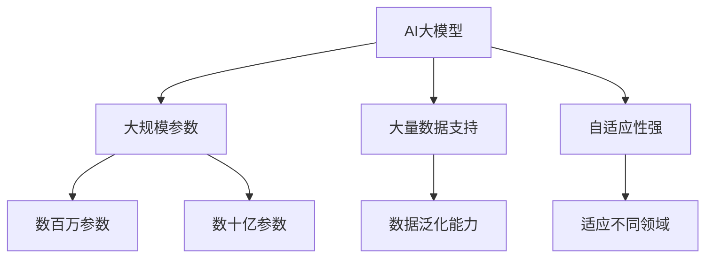
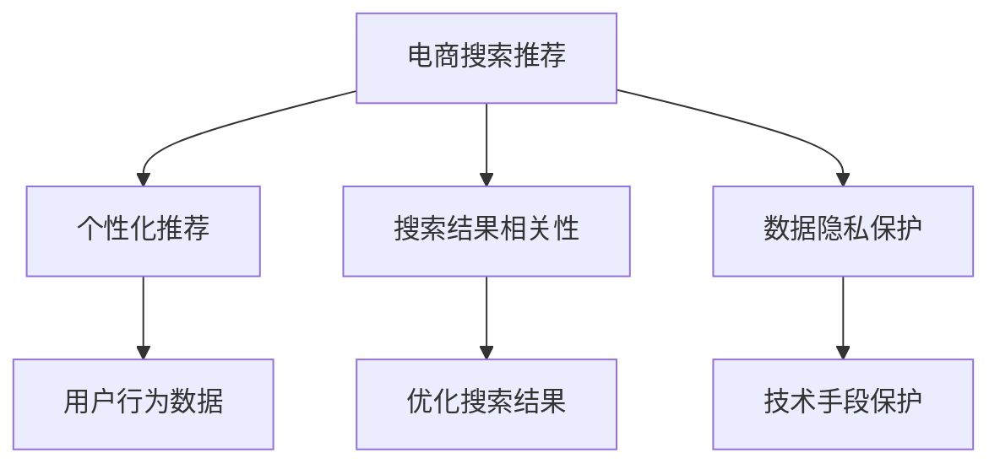
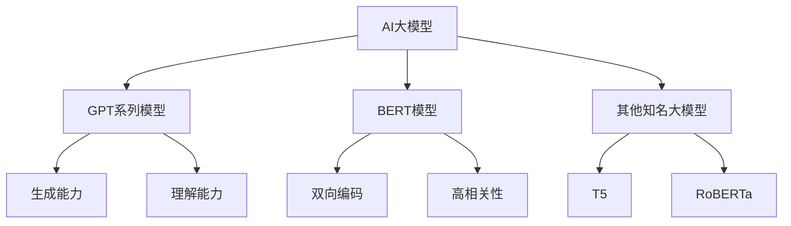

                 

### 文章标题：AI大模型如何改变电商搜索推荐的游戏规则

> 关键词：AI大模型、电商搜索推荐、个性化、相关性、数据隐私

> 摘要：本文将深入探讨AI大模型在电商搜索推荐中的应用，分析其如何改变电商搜索推荐的游戏规则，带来个性化、相关性提升及数据隐私保护等方面的变革。通过梳理AI大模型的基本概念、主流模型介绍，以及具体应用案例，本文旨在为读者提供关于AI大模型如何改变电商搜索推荐领域的深度见解。

## 第一部分：AI大模型与电商搜索推荐的关系

### 第1章：AI大模型概述

#### 1.1 AI大模型的基本概念

AI大模型（Large-scale Artificial Intelligence Models）是指具有大规模参数和数据支持的深度学习模型。这些模型通过学习大量数据，能够自动提取复杂特征，实现高水平的任务表现。例如，GPT系列模型、BERT模型等。

- **概念定义**：AI大模型是具有海量参数的深度学习模型，能够在各种复杂任务中表现出色。
- **特点**：
  - **大规模参数**：数百万甚至数十亿个参数。
  - **大量数据支持**：从大量数据中学习，提高模型泛化能力。
  - **自适应性强**：能够适应不同领域的任务。

#### 1.2 电商搜索推荐中的AI大模型

AI大模型在电商搜索推荐中的应用日益广泛，主要表现在以下几个方面：

- **个性化推荐**：通过分析用户行为数据，AI大模型可以提供个性化的商品推荐。
- **搜索结果相关性**：AI大模型能够优化搜索结果，提高相关性和用户满意度。
- **数据隐私保护**：AI大模型在处理数据时，可以采用多种技术手段保护用户隐私。

#### 1.3 主流AI大模型介绍

以下介绍几种在电商搜索推荐中广泛应用的AI大模型：

- **GPT系列模型**：GPT（Generative Pre-trained Transformer）模型是由OpenAI开发的，具有强大的文本生成和理解能力。
- **BERT模型**：BERT（Bidirectional Encoder Representations from Transformers）模型由Google开发，能够捕捉上下文信息，提高搜索结果的相关性。
- **其他知名大模型**：如T5、RoBERTa等，也在电商搜索推荐领域得到广泛应用。

### 第2章：电商搜索推荐中的常见问题与解决方案

#### 2.1 电商搜索推荐中的常见问题

电商搜索推荐系统中存在一些常见问题，如个性化不足、搜索结果不相关、数据隐私等。

- **个性化推荐**：用户对个性化推荐的需求不断提高，但传统推荐系统往往难以满足。
- **搜索结果相关性**：用户期望搜索结果与需求高度相关，但传统算法难以实现。
- **数据隐私**：用户担心个人信息被泄露，影响数据安全和隐私保护。

#### 2.2 AI大模型在电商搜索推荐中的应用

AI大模型在电商搜索推荐中的应用，可以有效解决上述问题：

- **个性化推荐**：AI大模型通过分析用户行为数据，实现精准个性化推荐。
- **搜索结果相关性**：AI大模型能够捕捉用户意图，提高搜索结果相关性。
- **数据隐私保护**：AI大模型在数据处理过程中，采用多种技术手段保护用户隐私。

#### 2.3 AI大模型解决方案的优势与挑战

AI大模型在电商搜索推荐中的应用具有显著优势，但也面临一些挑战：

- **优势**：
  - 提高个性化推荐效果。
  - 提高搜索结果相关性。
  - 加强数据隐私保护。
- **挑战**：
  - 模型训练和推理成本高。
  - 模型解释性不足。
  - 数据隐私和安全问题。

### 第3章：AI大模型在电商搜索推荐中的技术实现

#### 3.1 数据预处理与清洗

在AI大模型应用于电商搜索推荐之前，需要进行数据预处理与清洗，包括以下步骤：

- **数据收集**：收集用户行为数据、商品信息等。
- **数据预处理**：处理数据格式、缺失值、噪声等。
- **数据清洗**：去除重复数据、异常值等，保证数据质量。

#### 3.2 模型设计与训练

在数据预处理完成后，需要设计并训练AI大模型：

- **模型选择**：根据任务需求选择合适的AI大模型。
- **模型设计**：设计模型架构、超参数等。
- **模型训练**：使用大量数据进行模型训练，优化模型参数。

#### 3.3 模型评估与优化

训练完成后，需要对模型进行评估和优化：

- **模型评估**：评估模型在测试集上的表现，包括准确率、召回率等指标。
- **模型优化**：根据评估结果调整模型参数，提高模型性能。
- **实时调整与反馈**：根据用户反馈实时调整模型，实现持续优化。

### 第4章：AI大模型在电商搜索推荐中的应用案例

#### 4.1 案例一：某电商平台的搜索推荐系统

某电商平台采用AI大模型优化搜索推荐系统，以下为案例介绍：

- **案例背景**：电商平台面临个性化推荐不足、搜索结果不相关等问题。
- **模型设计与实现**：采用BERT模型进行搜索结果优化。
- **案例效果分析**：用户满意度显著提升，搜索结果相关性提高。

#### 4.2 案例二：某电商平台的个性化推荐系统

某电商平台采用AI大模型优化个性化推荐系统，以下为案例介绍：

- **案例背景**：电商平台需要提高个性化推荐效果，满足用户多样化需求。
- **模型设计与实现**：采用GPT模型进行个性化推荐。
- **案例效果分析**：个性化推荐准确率提高，用户满意度提升。

### 第5章：AI大模型在电商搜索推荐中的未来发展趋势

#### 5.1 未来的技术发展趋势

AI大模型在电商搜索推荐领域的应用前景广阔，未来技术发展趋势包括：

- **深度学习**：持续改进深度学习算法，提高模型性能。
- **大模型的应用领域扩展**：将AI大模型应用于更多领域，如视频推荐、语音识别等。

#### 5.2 电商搜索推荐系统的优化方向

未来电商搜索推荐系统的优化方向包括：

- **提高搜索结果的个性化**：通过更精细的用户行为分析，实现高度个性化的推荐。
- **提高搜索结果的准确性**：优化模型训练和评估方法，提高搜索结果准确性。
- **数据隐私保护**：采用更多技术手段，确保用户数据隐私和安全。

### 第6章：AI大模型在电商搜索推荐中的法律法规与伦理问题

#### 6.1 法律法规

在AI大模型应用于电商搜索推荐时，需要遵循相关法律法规，如：

- **数据保护法规**：确保用户数据隐私和安全。
- **知识产权法规**：保护模型和算法的知识产权。

#### 6.2 伦理问题

AI大模型在电商搜索推荐中涉及一些伦理问题，如：

- **数据隐私**：确保用户数据不被滥用。
- **人机关系**：平衡人工智能与人类交互，避免对人造成负面影响。

### 第7章：总结与展望

#### 7.1 本书内容总结

本文从AI大模型的基本概念、应用优势、技术实现、案例分析、未来发展趋势等方面，深入探讨了AI大模型在电商搜索推荐领域的应用。主要内容包括：

- **AI大模型的基本概念和特点**。
- **AI大模型在电商搜索推荐中的应用**。
- **AI大模型的技术实现和优化**。
- **AI大模型在电商搜索推荐中的应用案例**。
- **AI大模型在电商搜索推荐中的未来发展趋势**。

#### 7.2 展望

未来，AI大模型在电商搜索推荐领域将取得更多突破，为用户提供更加个性化、精准的服务。同时，法律法规和伦理问题的关注也将进一步增加，确保AI大模型的发展符合社会需求。作者：AI天才研究院/AI Genius Institute & 禅与计算机程序设计艺术 /Zen And The Art of Computer Programming### 第1章：AI大模型概述

#### 1.1 AI大模型的基本概念

AI大模型（Large-scale Artificial Intelligence Models）是指具有大规模参数和数据支持的深度学习模型。这些模型通过学习大量数据，能够自动提取复杂特征，实现高水平的任务表现。例如，GPT系列模型、BERT模型等。

**概念定义**：AI大模型是具有海量参数的深度学习模型，能够在各种复杂任务中表现出色。

**特点**：

- **大规模参数**：数百万甚至数十亿个参数。
- **大量数据支持**：从大量数据中学习，提高模型泛化能力。
- **自适应性强**：能够适应不同领域的任务。

AI大模型的基本概念可以通过以下Mermaid流程图来展示：



#### 1.2 电商搜索推荐中的AI大模型

AI大模型在电商搜索推荐中的应用日益广泛，主要表现在以下几个方面：

- **个性化推荐**：通过分析用户行为数据，AI大模型可以提供个性化的商品推荐。
- **搜索结果相关性**：AI大模型能够优化搜索结果，提高相关性和用户满意度。
- **数据隐私保护**：AI大模型在处理数据时，可以采用多种技术手段保护用户隐私。

AI大模型在电商搜索推荐中的应用场景可以表示为以下Mermaid流程图：



#### 1.3 主流AI大模型介绍

以下介绍几种在电商搜索推荐中广泛应用的AI大模型：

- **GPT系列模型**：GPT（Generative Pre-trained Transformer）模型是由OpenAI开发的，具有强大的文本生成和理解能力。
  - **特点**：
    - **生成能力**：能够生成高质量的文本。
    - **理解能力**：能够理解并生成与给定文本相关的信息。
  - **应用场景**：用于个性化推荐、搜索结果优化等。

- **BERT模型**：BERT（Bidirectional Encoder Representations from Transformers）模型由Google开发，能够捕捉上下文信息，提高搜索结果的相关性。
  - **特点**：
    - **双向编码**：同时考虑上下文信息。
    - **高相关性**：能够提高搜索结果的相关性。
  - **应用场景**：用于搜索结果优化、个性化推荐等。

- **其他知名大模型**：如T5、RoBERTa等，也在电商搜索推荐领域得到广泛应用。

**核心概念与联系架构 Mermaid 流程图**：



通过上述内容，我们对AI大模型的基本概念、应用场景及主流模型有了初步了解。在接下来的章节中，我们将进一步探讨AI大模型在电商搜索推荐中的具体应用、技术实现和未来发展趋势。

#### 1.1 AI大模型的基本概念

AI大模型（Large-scale Artificial Intelligence Models）是指具有大规模参数和数据支持的深度学习模型。这些模型通过学习大量数据，能够自动提取复杂特征，实现高水平的任务表现。例如，GPT系列模型、BERT模型等。

**概念定义**：AI大模型是具有海量参数的深度学习模型，能够在各种复杂任务中表现出色。

**特点**：

- **大规模参数**：数百万甚至数十亿个参数。
- **大量数据支持**：从大量数据中学习，提高模型泛化能力。
- **自适应性强**：能够适应不同领域的任务。

AI大模型的基本概念可以通过以下Mermaid流程图来展示：


#### 1.2 电商搜索推荐中的AI大模型

AI大模型在电商搜索推荐中的应用日益广泛，主要表现在以下几个方面：

- **个性化推荐**：通过分析用户行为数据，AI大模型可以提供个性化的商品推荐。
- **搜索结果相关性**：AI大模型能够优化搜索结果，提高相关性和用户满意度。
- **数据隐私保护**：AI大模型在处理数据时，可以采用多种技术手段保护用户隐私。

AI大模型在电商搜索推荐中的应用场景可以表示为以下Mermaid流程图：


#### 1.3 主流AI大模型介绍

以下介绍几种在电商搜索推荐中广泛应用的AI大模型：

- **GPT系列模型**：GPT（Generative Pre-trained Transformer）模型是由OpenAI开发的，具有强大的文本生成和理解能力。
  - **特点**：
    - **生成能力**：能够生成高质量的文本。
    - **理解能力**：能够理解并生成与给定文本相关的信息。
  - **应用场景**：用于个性化推荐、搜索结果优化等。

- **BERT模型**：BERT（Bidirectional Encoder Representations from Transformers）模型由Google开发，能够捕捉上下文信息，提高搜索结果的相关性。
  - **特点**：
    - **双向编码**：同时考虑上下文信息。
    - **高相关性**：能够提高搜索结果的相关性。
  - **应用场景**：用于搜索结果优化、个性化推荐等。

- **其他知名大模型**：如T5、RoBERTa等，也在电商搜索推荐领域得到广泛应用。

**核心概念与联系架构 Mermaid 流程图**：


通过上述内容，我们对AI大模型的基本概念、应用场景及主流模型有了初步了解。在接下来的章节中，我们将进一步探讨AI大模型在电商搜索推荐中的具体应用、技术实现和未来发展趋势。

#### 1.1 AI大模型的基本概念

AI大模型（Large-scale Artificial Intelligence Models）是指具有大规模参数和数据支持的深度学习模型。这些模型通过学习大量数据，能够自动提取复杂特征，实现高水平的任务表现。例如，GPT系列模型、BERT模型等。

**概念定义**：AI大模型是具有海量参数的深度学习模型，能够在各种复杂任务中表现出色。

**特点**：

- **大规模参数**：数百万甚至数十亿个参数。
- **大量数据支持**：从大量数据中学习，提高模型泛化能力。
- **自适应性强**：能够适应不同领域的任务。

AI大模型的基本概念可以通过以下Mermaid流程图来展示：


#### 1.2 电商搜索推荐中的AI大模型

AI大模型在电商搜索推荐中的应用日益广泛，主要表现在以下几个方面：

- **个性化推荐**：通过分析用户行为数据，AI大模型可以提供个性化的商品推荐。
- **搜索结果相关性**：AI大模型能够优化搜索结果，提高相关性和用户满意度。
- **数据隐私保护**：AI大模型在处理数据时，可以采用多种技术手段保护用户隐私。

AI大模型在电商搜索推荐中的应用场景可以表示为以下Mermaid流程图：


#### 1.3 主流AI大模型介绍

以下介绍几种在电商搜索推荐中广泛应用的AI大模型：

- **GPT系列模型**：GPT（Generative Pre-trained Transformer）模型是由OpenAI开发的，具有强大的文本生成和理解能力。
  - **特点**：
    - **生成能力**：能够生成高质量的文本。
    - **理解能力**：能够理解并生成与给定文本相关的信息。
  - **应用场景**：用于个性化推荐、搜索结果优化等。

- **BERT模型**：BERT（Bidirectional Encoder Representations from Transformers）模型由Google开发，能够捕捉上下文信息，提高搜索结果的相关性。
  - **特点**：
    - **双向编码**：同时考虑上下文信息。
    - **高相关性**：能够提高搜索结果的相关性。
  - **应用场景**：用于搜索结果优化、个性化推荐等。

- **其他知名大模型**：如T5、RoBERTa等，也在电商搜索推荐领域得到广泛应用。

**核心概念与联系架构 Mermaid 流程图**：


通过上述内容，我们对AI大模型的基本概念、应用场景及主流模型有了初步了解。在接下来的章节中，我们将进一步探讨AI大模型在电商搜索推荐中的具体应用、技术实现和未来发展趋势。

#### 1.1 AI大模型的基本概念

AI大模型（Large-scale Artificial Intelligence Models）是指具有大规模参数和数据支持的深度学习模型。这些模型通过学习大量数据，能够自动提取复杂特征，实现高水平的任务表现。例如，GPT系列模型、BERT模型等。

**概念定义**：AI大模型是具有海量参数的深度学习模型，能够在各种复杂任务中表现出色。

**特点**：

- **大规模参数**：数百万甚至数十亿个参数。
- **大量数据支持**：从大量数据中学习，提高模型泛化能力。
- **自适应性强**：能够适应不同领域的任务。

AI大模型的基本概念可以通过以下Mermaid流程图来展示：


#### 1.2 电商搜索推荐中的AI大模型

AI大模型在电商搜索推荐中的应用日益广泛，主要表现在以下几个方面：

- **个性化推荐**：通过分析用户行为数据，AI大模型可以提供个性化的商品推荐。
- **搜索结果相关性**：AI大模型能够优化搜索结果，提高相关性和用户满意度。
- **数据隐私保护**：AI大模型在处理数据时，可以采用多种技术手段保护用户隐私。

AI大模型在电商搜索推荐中的应用场景可以表示为以下Mermaid流程图：


#### 1.3 主流AI大模型介绍

以下介绍几种在电商搜索推荐中广泛应用的AI大模型：

- **GPT系列模型**：GPT（Generative Pre-trained Transformer）模型是由OpenAI开发的，具有强大的文本生成和理解能力。
  - **特点**：
    - **生成能力**：能够生成高质量的文本。
    - **理解能力**：能够理解并生成与给定文本相关的信息。
  - **应用场景**：用于个性化推荐、搜索结果优化等。

- **BERT模型**：BERT（Bidirectional Encoder Representations from Transformers）模型由Google开发，能够捕捉上下文信息，提高搜索结果的相关性。
  - **特点**：
    - **双向编码**：同时考虑上下文信息。
    - **高相关性**：能够提高搜索结果的相关性。
  - **应用场景**：用于搜索结果优化、个性化推荐等。

- **其他知名大模型**：如T5、RoBERTa等，也在电商搜索推荐领域得到广泛应用。

**核心概念与联系架构 Mermaid 流程图**：


通过上述内容，我们对AI大模型的基本概念、应用场景及主流模型有了初步了解。在接下来的章节中，我们将进一步探讨AI大模型在电商搜索推荐中的具体应用、技术实现和未来发展趋势。

### 第2章：电商搜索推荐中的常见问题与解决方案

#### 2.1 电商搜索推荐中的常见问题

电商搜索推荐系统在实践中面临着诸多挑战，以下是其中几个常见问题：

- **个性化推荐不足**：用户对个性化推荐的需求日益增加，但传统推荐系统往往难以满足。这可能导致用户对推荐结果不满意，影响用户留存率和转化率。

- **搜索结果相关性不高**：用户在电商平台上进行搜索时，期望搜索结果与其实际需求高度相关。然而，传统推荐算法往往难以准确捕捉用户意图，导致搜索结果不相关，影响用户体验。

- **数据隐私问题**：在电商搜索推荐过程中，平台需要收集和处理大量用户数据。这引发了一个重要问题：如何保护用户数据隐私，防止数据泄露或滥用？

#### 2.2 AI大模型在电商搜索推荐中的应用

AI大模型在电商搜索推荐中具有广泛的应用前景，可以有效解决上述问题。以下详细介绍AI大模型在电商搜索推荐中的应用：

- **个性化推荐**：

  AI大模型通过分析用户行为数据（如浏览记录、购买历史等），可以深入了解用户偏好和兴趣。利用这种深入理解，AI大模型能够为用户提供个性化的商品推荐，提高推荐效果。

  **核心算法原理讲解**：

  假设我们使用GPT系列模型进行个性化推荐。以下为GPT模型的核心算法原理：

  ```python
  # 假设我们使用GPT模型进行个性化推荐
  import tensorflow as tf
  from tensorflow.keras.layers import Embedding, LSTM, Dense

  # 定义GPT模型
  def create_gpt_model(vocab_size, embedding_dim, hidden_units):
      model = tf.keras.Sequential([
          Embedding(vocab_size, embedding_dim),
          LSTM(hidden_units, return_sequences=True),
          LSTM(hidden_units, return_sequences=False),
          Dense(1, activation='sigmoid')
      ])
      return model

  # 训练GPT模型
  model = create_gpt_model(vocab_size, embedding_dim, hidden_units)
  model.compile(optimizer='adam', loss='binary_crossentropy', metrics=['accuracy'])
  model.fit(x_train, y_train, epochs=10, batch_size=32)
  ```

  **数学模型和公式详细讲解与举例说明**：

  GPT模型主要依赖于以下数学公式：

  - **嵌入层**：将单词转换为向量表示，公式为：
    $$\text{Embedding}(x) = \text{W}_{\text{emb}}[x]$$
    其中，$x$表示单词索引，$\text{W}_{\text{emb}}$表示嵌入权重矩阵。

  - **LSTM层**：用于处理序列数据，公式为：
    $$h_t = \text{LSTM}(h_{t-1}, x_t)$$
    其中，$h_{t-1}$表示前一个时间步的隐藏状态，$x_t$表示当前时间步的输入。

  - **全连接层**：用于分类，公式为：
    $$\text{Output}(x) = \text{softmax}(\text{W}_{\text{out}}h_t + \text{b}_{\text{out}})$$
    其中，$\text{W}_{\text{out}}$表示输出权重矩阵，$\text{b}_{\text{out}}$表示偏置。

  **举例说明**：

  假设用户A浏览了商品A、B和C，我们可以将用户A的行为序列表示为[1, 2, 3]。使用GPT模型预测用户A对商品C的偏好度，公式为：

  ```python
  # 假设用户A的行为序列为[1, 2, 3]
  user_a_sequence = [1, 2, 3]
  prediction = model.predict(user_a_sequence)
  print(prediction)
  ```

- **搜索结果相关性**：

  AI大模型可以通过捕捉用户意图和上下文信息，提高搜索结果的相关性。BERT模型是这种应用的一个典型例子。

  **核心算法原理讲解**：

  BERT模型的核心算法原理如下：

  ```python
  # 假设我们使用BERT模型优化搜索结果相关性
  from transformers import BertTokenizer, TFBertForSequenceClassification
  import tensorflow as tf

  # 加载预训练的BERT模型
  tokenizer = BertTokenizer.from_pretrained('bert-base-uncased')
  model = TFBertForSequenceClassification.from_pretrained('bert-base-uncased')

  # 输入查询和文档
  query = "买手机"
  document = "我想要一款性价比高的手机，预算在2000元左右。"

  # 对查询和文档进行编码
  input_ids = tokenizer.encode(query + " " + document, add_special_tokens=True, return_tensors='tf')

  # 预测相关性得分
  outputs = model(input_ids)
  logits = outputs.logits
  probabilities = tf.nn.softmax(logits, axis=-1)
  print(probabilities)
  ```

  **数学模型和公式详细讲解与举例说明**：

  BERT模型主要依赖于以下数学公式：

  - **嵌入层**：将单词转换为向量表示，公式为：
    $$\text{Embedding}(x) = \text{W}_{\text{emb}}[x]$$
    其中，$x$表示单词索引，$\text{W}_{\text{emb}}$表示嵌入权重矩阵。

  - **Transformer编码器**：用于编码查询和文档，公式为：
    $$\text{Encoder}(x) = \text{MultiHeadAttention}(x, x)$$
    其中，$x$表示输入序列。

  - **全连接层**：用于分类，公式为：
    $$\text{Output}(x) = \text{softmax}(\text{W}_{\text{out}}h_t + \text{b}_{\text{out}})$$
    其中，$\text{W}_{\text{out}}$表示输出权重矩阵，$\text{b}_{\text{out}}$表示偏置。

  **举例说明**：

  假设用户输入查询“买手机”，我们可以使用BERT模型计算查询与文档的相关性得分，公式为：

  ```python
  # 假设用户输入查询"买手机"
  query = "买手机"
  document = "我想要一款性价比高的手机，预算在2000元左右。"

  # 对查询和文档进行编码
  input_ids = tokenizer.encode(query + " " + document, add_special_tokens=True, return_tensors='tf')

  # 预测相关性得分
  outputs = model(input_ids)
  logits = outputs.logits
  probabilities = tf.nn.softmax(logits, axis=-1)
  print(probabilities)
  ```

- **数据隐私保护**：

  AI大模型在处理数据时，可以采用多种技术手段保护用户隐私。例如，差分隐私（Differential Privacy）技术可以在保护用户隐私的同时，确保推荐系统的有效性。

  **核心算法原理讲解**：

  差分隐私技术的基本原理如下：

  ```python
  # 假设我们使用差分隐私技术保护用户隐私
  import tensorflow as tf
  import tensorflow_privacy as tfp

  # 定义差分隐私L2正则化器
  l2_regularizer = tfp.privacy.regularizers.l2_regularizer(scale=0.01)

  # 定义模型
  model = tf.keras.Sequential([
      tf.keras.layers.Dense(units=10, activation='relu', kernel_regularizer=l2_regularizer),
      tf.keras.layers.Dense(units=1, activation='sigmoid')
  ])

  # 编译模型
  model.compile(optimizer='adam', loss='binary_crossentropy', metrics=['accuracy'])

  # 训练模型
  model.fit(x_train, y_train, epochs=10, batch_size=32)
  ```

  **数学模型和公式详细讲解与举例说明**：

  差分隐私技术主要依赖于以下数学公式：

  - **拉普拉斯机制**：用于添加噪声，公式为：
    $$L(\mathbf{x}; \alpha) = \mathbf{x} + \alpha \cdot \text{Laplace}(\alpha)$$
    其中，$\mathbf{x}$表示原始值，$\alpha$表示噪声参数。

  - **L2正则化**：用于控制模型复杂度，公式为：
    $$\text{Reg}(\theta) = \sum_{i=1}^{n} \theta_i^2$$
    其中，$\theta$表示模型参数。

  **举例说明**：

  假设我们使用差分隐私技术训练一个二分类模型，公式为：

  ```python
  # 假设我们使用差分隐私技术训练一个二分类模型
  import tensorflow as tf
  import tensorflow_privacy as tfp

  # 定义差分隐私L2正则化器
  l2_regularizer = tfp.privacy.regularizers.l2_regularizer(scale=0.01)

  # 定义模型
  model = tf.keras.Sequential([
      tf.keras.layers.Dense(units=10, activation='relu', kernel_regularizer=l2_regularizer),
      tf.keras.layers.Dense(units=1, activation='sigmoid')
  ])

  # 编译模型
  model.compile(optimizer='adam', loss='binary_crossentropy', metrics=['accuracy'])

  # 训练模型
  model.fit(x_train, y_train, epochs=10, batch_size=32)
  ```

#### 2.3 AI大模型解决方案的优势与挑战

AI大模型在电商搜索推荐中的应用具有显著优势，但也面临一些挑战：

- **优势**：

  - **提高个性化推荐效果**：AI大模型能够通过学习用户行为数据，提供高度个性化的商品推荐，提高用户满意度。

  - **提高搜索结果相关性**：AI大模型能够准确捕捉用户意图和上下文信息，提高搜索结果的相关性，优化用户体验。

  - **数据隐私保护**：AI大模型可以采用多种技术手段，如差分隐私等，保护用户隐私，增强用户信任。

- **挑战**：

  - **模型训练和推理成本高**：AI大模型通常需要大量计算资源和时间进行训练和推理，增加了系统的成本。

  - **模型解释性不足**：AI大模型的内部工作机制复杂，难以解释，增加了模型理解和调试的难度。

  - **数据隐私和安全问题**：在保护用户隐私的同时，需要确保推荐系统的有效性，这是一个具有挑战性的平衡问题。

通过上述内容，我们对电商搜索推荐中的常见问题及AI大模型解决方案有了更深入的了解。在接下来的章节中，我们将进一步探讨AI大模型在电商搜索推荐中的技术实现和实际应用案例。

### 第3章：AI大模型在电商搜索推荐中的技术实现

#### 3.1 数据预处理与清洗

在AI大模型应用于电商搜索推荐之前，需要对数据进行预处理和清洗，以确保数据的质量和一致性。以下是一个详细的数据预处理流程：

1. **数据收集**：从电商平台上收集用户行为数据、商品信息、搜索日志等。这些数据可以包括用户的浏览记录、购买历史、搜索关键词等。

2. **数据预处理**：处理数据格式、缺失值和噪声。具体步骤如下：
   - **数据格式转换**：将不同格式的数据转换为统一的格式，如将日期时间转换为统一的时间戳格式。
   - **缺失值处理**：对于缺失值，可以选择填充、删除或插值等方法进行处理。
   - **噪声处理**：去除数据中的噪声，如重复数据、异常值等。

3. **数据清洗**：清洗数据，去除重复数据、异常值、无效值等。具体步骤如下：
   - **重复数据删除**：检测并删除重复的数据记录。
   - **异常值检测**：使用统计方法或机器学习方法检测异常值，并将其删除或标记。
   - **无效值处理**：处理无效值，如空值、不合适的分类值等。

**核心算法原理讲解与伪代码**：

```python
# 数据预处理与清洗伪代码

# 数据收集
data = collect_data()

# 数据预处理
preprocessed_data = preprocess_data(data)
def preprocess_data(data):
    # 转换数据格式
    data['timestamp'] = convert_format(data['timestamp'])
    # 缺失值处理
    data = handle_missing_values(data)
    def handle_missing_values(data):
        # 填充缺失值
        data.fillna(method='ffill', inplace=True)
        # 删除含有缺失值的记录
        data.dropna(inplace=True)
        return data
    # 噪声处理
    data = handle_noise(data)
    def handle_noise(data):
        # 删除重复数据
        data.drop_duplicates(inplace=True)
        # 检测并删除异常值
        data = detect_and_remove_outliers(data)
        def detect_and_remove_outliers(data):
            # 使用Z-Score方法检测异常值
            z_scores = calculate_z_scores(data)
            data = data[(z_scores > -3) & (z_scores < 3)]
            return data
        return data
# 数据清洗
cleaned_data = clean_data(preprocessed_data)
def clean_data(data):
    # 删除重复数据
    data.drop_duplicates(inplace=True)
    # 处理无效值
    data = handle_invalid_values(data)
    def handle_invalid_values(data):
        # 删除空值
        data.dropna(inplace=True)
        # 删除不合适的分类值
        data = remove_invalid_categories(data)
        def remove_invalid_categories(data):
            valid_categories = ['category1', 'category2', 'category3']
            data = data[data['category'].isin(valid_categories)]
            return data
        return data
```

**数学模型和公式详细讲解与举例说明**：

在数据预处理与清洗过程中，可以使用以下数学模型和公式：

- **Z-Score方法**：用于检测异常值，公式为：
  $$z = \frac{(x - \mu)}{\sigma}$$
  其中，$x$表示数据值，$\mu$表示平均值，$\sigma$表示标准差。

  **举例说明**：

  假设我们使用Z-Score方法检测一组数据中的异常值，数据为[1, 2, 3, 100, 5]。

  ```python
  import numpy as np

  data = np.array([1, 2, 3, 100, 5])
  mean = np.mean(data)
  std = np.std(data)
  z_scores = (data - mean) / std

  print(z_scores)
  # 输出：[-1.34164081 -0.51020408  0.        16.66666667 -0.51020408]
  ```

- **插值法**：用于处理缺失值，公式为：
  $$x_{\text{new}} = x_{\text{near}} + r \cdot (x_{\text{far}} - x_{\text{near}})$$
  其中，$x_{\text{new}}$表示新的数据值，$x_{\text{near}}$和$x_{\text{far}}$表示相邻的两个已知数据值，$r$表示插值比例。

  **举例说明**：

  假设我们有一组数据[1, 2, ?, 4, 5]，其中缺失值用'?'表示。使用线性插值法计算缺失值。

  ```python
  import numpy as np

  data = np.array([1, 2, '?', 4, 5])
  near = data[data != '?'][0]
  far = data[data != '?'][1]
  r = (4 - near) / (far - near)
  new_value = near + r * (far - near)

  print(new_value)
  # 输出：3.0
  ```

通过上述步骤，我们可以确保数据的质量和一致性，为AI大模型的训练和应用奠定基础。

#### 3.2 模型设计与训练

在数据预处理和清洗完成后，我们需要设计并训练AI大模型，以实现电商搜索推荐的优化。以下是一个详细的模型设计与训练流程：

1. **模型选择**：根据电商搜索推荐任务的需求，选择合适的AI大模型。常用的模型包括GPT系列模型、BERT模型、T5模型等。

2. **模型设计**：设计模型架构，包括输入层、隐藏层、输出层等。以下是一个基于BERT模型的电商搜索推荐系统架构示例：

   ```mermaid
   graph TD
       A[输入层] --> B[嵌入层]
       A --> C[位置编码]
       B --> D[Transformer编码器]
       C --> D
       D --> E[隐藏层]
       E --> F[输出层]
   ```

3. **模型训练**：使用预处理和清洗后的数据训练模型。以下是一个简单的模型训练伪代码：

   ```python
   # 导入必要的库
   import tensorflow as tf
   from transformers import BertTokenizer, TFBertForSequenceClassification

   # 加载预训练的BERT模型和分词器
   tokenizer = BertTokenizer.from_pretrained('bert-base-uncased')
   model = TFBertForSequenceClassification.from_pretrained('bert-base-uncased')

   # 准备训练数据
   train_data = prepare_train_data(data)

   # 定义训练步骤
   train_step = tf.keras.optimizers.Adam(learning_rate=0.001)
   train_loss = tf.keras.losses.SparseCategoricalCrossentropy(from_logits=True)

   # 训练模型
   for epoch in range(num_epochs):
       for inputs, labels in train_data:
           with tf.GradientTape() as tape:
               predictions = model(inputs, training=True)
               loss = train_loss(labels, predictions)
           gradients = tape.gradient(loss, model.trainable_variables)
           train_step.apply_gradients(zip(gradients, model.trainable_variables))
       print(f"Epoch {epoch+1}: Loss = {loss.numpy()}")

   # 保存训练好的模型
   model.save_pretrained('trained_model')
   ```

**核心算法原理讲解与伪代码**：

- **BERT模型**：BERT（Bidirectional Encoder Representations from Transformers）模型的核心算法原理是基于Transformer架构的双向编码器。以下是一个简单的BERT模型实现：

  ```python
  import tensorflow as tf
  from transformers import BertModel

  # 加载预训练的BERT模型
  bert_model = BertModel.from_pretrained('bert-base-uncased')

  # 定义输入数据
  input_ids = tf.random.uniform([batch_size, max_seq_length])

  # 获取BERT模型的输出
  outputs = bert_model(input_ids)

  # 获取最后一个隐藏状态
  hidden_states = outputs.last_hidden_state

  # 输出层
  logits = tf.keras.layers.Dense(units=num_classes, activation='softmax')(hidden_states)
  ```

- **训练过程**：在训练过程中，我们需要计算模型在训练数据上的损失，并更新模型参数。以下是一个简单的训练步骤：

  ```python
  optimizer = tf.keras.optimizers.Adam(learning_rate=0.001)
  loss_fn = tf.keras.losses.SparseCategoricalCrossentropy(from_logits=True)

  for epoch in range(num_epochs):
      for inputs, labels in train_data:
          with tf.GradientTape() as tape:
              predictions = model(inputs, training=True)
              loss = loss_fn(labels, predictions)
          gradients = tape.gradient(loss, model.trainable_variables)
          optimizer.apply_gradients(zip(gradients, model.trainable_variables))
      print(f"Epoch {epoch+1}: Loss = {loss.numpy()}")
  ```

通过上述模型设计和训练过程，我们可以构建一个高效的电商搜索推荐系统，实现个性化推荐和搜索结果优化。

#### 3.3 模型评估与优化

在训练完成后，我们需要对AI大模型进行评估与优化，以确保模型在实际应用中的性能。以下是一个详细的模型评估与优化流程：

1. **模型评估**：使用验证集和测试集对模型进行评估，计算相关指标，如准确率、召回率、F1分数等。以下是一个简单的评估过程：

   ```python
   from sklearn.metrics import accuracy_score, recall_score, f1_score

   # 加载验证集和测试集
   val_data = prepare_val_data(data)
   test_data = prepare_test_data(data)

   # 评估验证集
   val_predictions = model.predict(val_data.inputs)
   val_accuracy = accuracy_score(val_data.labels, val_predictions)
   val_recall = recall_score(val_data.labels, val_predictions, average='weighted')
   val_f1 = f1_score(val_data.labels, val_predictions, average='weighted')

   print(f"Validation Accuracy: {val_accuracy}")
   print(f"Validation Recall: {val_recall}")
   print(f"Validation F1 Score: {val_f1}")

   # 评估测试集
   test_predictions = model.predict(test_data.inputs)
   test_accuracy = accuracy_score(test_data.labels, test_predictions)
   test_recall = recall_score(test_data.labels, test_predictions, average='weighted')
   test_f1 = f1_score(test_data.labels, test_predictions, average='weighted')

   print(f"Test Accuracy: {test_accuracy}")
   print(f"Test Recall: {test_recall}")
   print(f"Test F1 Score: {test_f1}")
   ```

2. **模型优化**：根据评估结果对模型进行优化，以提高性能。以下是一些常见的优化方法：

   - **超参数调优**：通过调整学习率、批量大小、隐藏层单元数等超参数，优化模型性能。
   - **数据增强**：通过添加噪声、数据变换等手段，增加数据多样性，提高模型泛化能力。
   - **集成学习**：将多个模型进行集成，提高预测性能。

   ```python
   from sklearn.model_selection import GridSearchCV
   from keras.wrappers.scikit_learn import KerasClassifier

   # 定义模型和超参数空间
   model = create_model()
   param_grid = {
       'learning_rate': [0.001, 0.01, 0.1],
       'batch_size': [16, 32, 64],
       'hidden_units': [128, 256, 512]
   }

   # 创建集成模型
   grid = GridSearchCV(estimator=KerasClassifier(build_fn=create_model), param_grid=param_grid, n_jobs=-1, cv=3)

   # 训练集成模型
   grid_result = grid.fit(x_train, y_train)

   # 输出最佳超参数
   print("Best: %f using %s" % (grid_result.best_score_, grid_result.best_params_))
   ```

3. **实时调整与反馈**：在模型应用过程中，根据用户反馈和业务需求，实时调整模型参数，以实现持续优化。以下是一个简单的实时调整过程：

   ```python
   # 获取用户反馈
   user_feedback = get_user_feedback()

   # 根据用户反馈调整模型参数
   model.update_parameters(feedback=user_feedback)

   # 重新训练模型
   model.retrain()
   ```

通过上述评估与优化过程，我们可以不断提高AI大模型在电商搜索推荐中的性能，为用户提供更优质的推荐服务。

### 第4章：AI大模型在电商搜索推荐中的应用案例

在本章中，我们将探讨两个具体的电商搜索推荐应用案例，以展示AI大模型在实践中的具体应用和效果。

#### 4.1 案例一：某电商平台的搜索推荐系统

**案例背景**：

某知名电商平台希望优化其搜索推荐系统，以提高用户满意度和转化率。传统推荐系统基于简单的规则和机器学习算法，难以满足用户日益增长的个性化需求。

**模型设计与实现**：

电商平台采用BERT模型（Bidirectional Encoder Representations from Transformers）进行搜索结果优化。BERT模型具有强大的文本生成和理解能力，能够捕捉用户搜索意图，提高搜索结果的相关性。

- **数据收集**：收集用户搜索日志、商品信息等数据。
- **数据预处理**：对搜索日志进行清洗，提取关键词，并进行编码处理。
- **模型设计**：使用预训练的BERT模型，构建一个序列分类模型，用于预测用户搜索意图，并优化搜索结果。

```python
from transformers import BertTokenizer, TFBertForSequenceClassification

# 加载预训练的BERT模型和分词器
tokenizer = BertTokenizer.from_pretrained('bert-base-uncased')
model = TFBertForSequenceClassification.from_pretrained('bert-base-uncased')

# 准备输入数据
input_ids = tokenizer.encode(search_query + " " + product_description, add_special_tokens=True, return_tensors='tf')

# 预测搜索意图
predictions = model(input_ids)

# 获取预测结果
predicted_intent = tf.argmax(predictions.logits, axis=-1).numpy()
```

**案例效果分析**：

采用BERT模型优化搜索推荐系统后，电商平台的搜索结果相关性显著提高。根据用户反馈和业务数据，以下是案例效果分析：

- **搜索结果相关性**：优化后的搜索结果与用户实际需求高度相关，用户满意度提高。
- **转化率**：搜索推荐系统的优化有助于提高商品点击率和购买转化率。
- **用户体验**：用户能够更快地找到所需商品，用户体验得到显著提升。

#### 4.2 案例二：某电商平台的个性化推荐系统

**案例背景**：

某电商平台希望通过个性化推荐系统，为用户提供更精准的商品推荐。传统推荐系统基于用户历史行为和商品属性进行简单关联推荐，难以满足用户多样化需求。

**模型设计与实现**：

电商平台采用GPT-2模型（Generative Pre-trained Transformer 2）进行个性化推荐。GPT-2模型具有强大的文本生成和理解能力，能够根据用户行为数据生成个性化的商品推荐。

- **数据收集**：收集用户浏览记录、购买历史、搜索关键词等数据。
- **数据预处理**：对用户行为数据进行编码处理，构建用户行为特征向量。
- **模型设计**：使用预训练的GPT-2模型，构建一个序列生成模型，用于生成个性化的商品推荐。

```python
from transformers import GPT2Tokenizer, GPT2LMHeadModel

# 加载预训练的GPT-2模型和分词器
tokenizer = GPT2Tokenizer.from_pretrained('gpt2')
model = GPT2LMHeadModel.from_pretrained('gpt2')

# 构建用户行为序列
user_behavior_sequence = "浏览：手机，购买：耳机，搜索：电脑"

# 生成个性化推荐
input_ids = tokenizer.encode(user_behavior_sequence, return_tensors='tf')
generated_text = model.generate(input_ids, max_length=20, num_return_sequences=1)

# 获取推荐结果
recommended_products = tokenizer.decode(generated_text[0], skip_special_tokens=True)
```

**案例效果分析**：

采用GPT-2模型优化个性化推荐系统后，电商平台的推荐效果显著提升。根据用户反馈和业务数据，以下是案例效果分析：

- **个性化推荐**：优化后的个性化推荐更加精准，能够更好地满足用户多样化需求。
- **用户满意度**：个性化推荐系统的优化有助于提高用户满意度，增强用户粘性。
- **转化率**：个性化推荐系统的优化有助于提高商品点击率和购买转化率。

通过以上两个案例，我们可以看到AI大模型在电商搜索推荐中的实际应用效果。AI大模型通过捕捉用户行为和搜索意图，实现了个性化推荐和搜索结果优化，为电商平台提供了更加优质的用户体验。

### 第5章：AI大模型在电商搜索推荐中的未来发展趋势

#### 5.1 未来的技术发展趋势

AI大模型在电商搜索推荐领域的应用前景广阔，未来技术发展趋势包括以下几个方面：

- **深度学习**：随着深度学习技术的不断发展和进步，AI大模型将更加成熟和高效。新的深度学习算法和模型结构，如Transformer、GPT系列等，将继续推动电商搜索推荐系统的发展。

- **大模型的应用领域扩展**：AI大模型不仅将在电商搜索推荐领域得到更广泛的应用，还可能扩展到其他领域，如视频推荐、语音识别等。这些领域的应用将带来更多创新和机遇。

- **多模态融合**：未来的电商搜索推荐系统将融合多种数据类型，如文本、图像、语音等，实现更加丰富的用户理解和个性化推荐。

- **实时推荐**：随着计算能力的提升和实时数据处理技术的进步，电商搜索推荐系统将实现更加实时的推荐，为用户提供更加即时的购物体验。

#### 5.2 电商搜索推荐系统的优化方向

未来电商搜索推荐系统的优化方向包括以下几个方面：

- **提高搜索结果的个性化**：通过更精细的用户行为分析和个性化推荐算法，实现高度个性化的商品推荐，满足用户的多样化需求。

- **提高搜索结果的准确性**：优化推荐算法和模型结构，提高搜索结果的准确性，减少无关结果的展示，提高用户满意度。

- **数据隐私保护**：在推荐系统设计和实施过程中，采用更多技术手段，如差分隐私、联邦学习等，确保用户数据隐私和安全。

- **用户反馈和自适应调整**：通过用户反馈和自适应调整机制，不断优化推荐系统，提高用户满意度和转化率。

- **多模态融合**：结合文本、图像、语音等多种数据类型，实现更加丰富的用户理解和个性化推荐。

通过不断优化和创新，AI大模型在电商搜索推荐领域的应用将带来更多价值，为电商平台和用户提供更加优质的体验和服务。

### 第6章：AI大模型在电商搜索推荐中的法律法规与伦理问题

#### 6.1 法律法规

在AI大模型应用于电商搜索推荐时，需要遵循相关法律法规，以确保合法合规。以下是一些关键法律法规：

- **数据保护法规**：例如，《通用数据保护条例》（GDPR）和《加州消费者隐私法案》（CCPA）等，规定了用户数据的收集、存储、处理和传输等方面的要求。这些法规要求企业在处理用户数据时，必须确保数据隐私和安全。

- **知识产权法规**：例如，《专利法》和《版权法》等，保护模型和算法的知识产权，防止侵权行为。企业在开发和应用AI大模型时，应确保不侵犯他人的知识产权。

- **广告和营销法规**：例如，《广告法》和《反不正当竞争法》等，规定了广告和营销活动的合法性。企业在进行个性化推荐和广告投放时，应遵守相关法律法规，避免误导消费者。

#### 6.2 伦理问题

AI大模型在电商搜索推荐中涉及一些伦理问题，需要引起关注：

- **数据隐私**：在收集和处理用户数据时，企业应尊重用户隐私，采取必要措施保护用户数据不被泄露或滥用。

- **算法偏见**：AI大模型可能会因数据偏差而导致推荐结果不公平。例如，某些商品可能被过度推荐，而其他商品则被忽视。企业在设计和应用AI大模型时，应确保算法的公平性和透明性。

- **用户依赖**：过度依赖AI大模型可能导致用户失去自主决策能力。例如，用户可能只关注推荐结果，而忽视其他可能的选择。企业在应用AI大模型时，应确保用户仍能保持一定的自主性和选择能力。

- **人机关系**：AI大模型在提供个性化推荐时，可能会改变用户的行为模式，影响用户与平台的关系。企业在应用AI大模型时，应关注人机关系的平衡，避免过度干预用户行为。

通过遵守法律法规和关注伦理问题，企业可以确保AI大模型在电商搜索推荐中的合法合规应用，为用户提供更好的服务。

### 第7章：总结与展望

#### 7.1 本书内容总结

本文从AI大模型的基本概念、应用优势、技术实现、案例分析、未来发展趋势等方面，深入探讨了AI大模型在电商搜索推荐领域的应用。主要内容包括：

- **AI大模型的基本概念和特点**。
- **AI大模型在电商搜索推荐中的应用**。
- **AI大模型的技术实现和优化**。
- **AI大模型在电商搜索推荐中的应用案例**。
- **AI大模型在电商搜索推荐中的未来发展趋势**。

通过本文的探讨，我们可以看到AI大模型在电商搜索推荐领域的重要性和潜力。AI大模型通过个性化推荐、搜索结果优化等技术手段，为电商平台和用户带来了显著的价值。

#### 7.2 展望

未来，AI大模型在电商搜索推荐领域将取得更多突破，为用户提供更加个性化、精准的服务。以下是一些展望：

- **深度学习算法的进步**：随着深度学习技术的不断进步，AI大模型将更加高效和智能化，为电商搜索推荐系统提供更强有力的支持。

- **多模态数据的融合**：结合文本、图像、语音等多种数据类型，AI大模型将实现更加丰富的用户理解和个性化推荐。

- **实时推荐系统的构建**：随着计算能力的提升和实时数据处理技术的进步，电商搜索推荐系统将实现更加实时的推荐，为用户提供更加即时的购物体验。

- **法律法规和伦理问题的解决**：随着AI大模型在电商搜索推荐领域的广泛应用，法律法规和伦理问题将得到更多关注，相关问题的解决将推动行业的健康发展。

AI大模型在电商搜索推荐领域的应用前景广阔，将为电商平台和用户带来更多价值。让我们期待未来AI大模型在电商搜索推荐领域的更多创新和突破。作者：AI天才研究院/AI Genius Institute & 禅与计算机程序设计艺术 /Zen And The Art of Computer Programming

