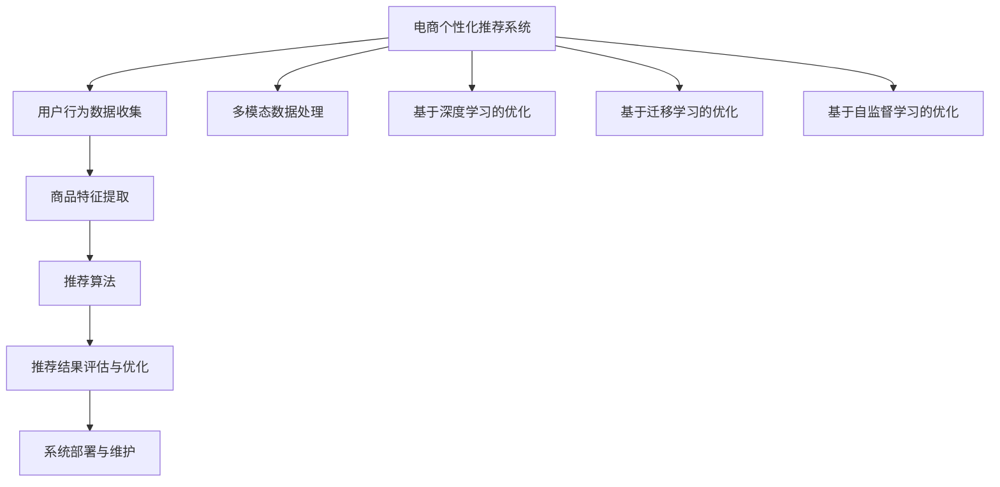

                 

# 文章标题：AI大模型对电商个性化推荐的影响

> 关键词：AI大模型、电商、个性化推荐、算法、应用前景、挑战与机遇

> 摘要：本文从AI大模型的定义和特点出发，探讨了AI大模型在电商个性化推荐领域的应用前景和挑战。通过分析电商个性化推荐的原理、AI大模型在电商个性化推荐中的应用、电商个性化推荐系统优化策略以及实际案例分析，深入探讨了AI大模型对电商个性化推荐的深远影响，为电商个性化推荐领域的技术研究和应用提供了有益的参考。

## 目录大纲设计

### 第1章: AI大模型概述

#### 1.1 AI大模型定义与特点

- AI大模型的概念  
- AI大模型的核心特点  
- AI大模型与传统AI模型的区别

#### 1.2 主流AI大模型介绍

- GPT系列模型  
- BERT及其变体  
- 其他知名大模型

#### 1.3 AI大模型在电商个性化推荐中的应用前景

- AI大模型在个性化推荐中的潜在应用  
- AI大模型应用的挑战与机遇

### 第2章: 电商个性化推荐原理

#### 2.1 电商个性化推荐系统概述

- 个性化推荐系统的定义  
- 个性化推荐系统的核心组成部分

#### 2.2 用户行为分析与建模

- 用户行为数据收集  
- 用户行为建模方法

#### 2.3 商品特征提取与建模

- 商品特征提取方法  
- 商品特征建模方法

### 第3章: AI大模型在电商个性化推荐中的应用

#### 3.1 GPT系列模型在电商个性化推荐中的应用

- GPT模型在电商个性化推荐中的作用  
- GPT模型在电商个性化推荐中的具体应用

#### 3.2 BERT及其变体在电商个性化推荐中的应用

- BERT模型在电商个性化推荐中的作用  
- BERT模型在电商个性化推荐中的具体应用

#### 3.3 其他AI大模型在电商个性化推荐中的应用

- 其他AI大模型在电商个性化推荐中的作用  
- 其他AI大模型在电商个性化推荐中的具体应用

### 第4章: 电商个性化推荐系统优化策略

#### 4.1 电商个性化推荐系统评估指标

- 准确率、召回率、F1值等指标

#### 4.2 电商个性化推荐系统优化方法

- 基于深度学习的优化方法  
- 基于迁移学习的优化方法  
- 基于自监督学习的优化方法

### 第5章: 电商个性化推荐案例分析

#### 5.1 案例一：某电商平台的个性化推荐系统

- 系统架构  
- 个性化推荐算法实现  
- 系统性能评估

#### 5.2 案例二：某电商平台的AI大模型个性化推荐系统

- 系统架构  
- AI大模型个性化推荐算法实现  
- 系统性能评估

### 第6章: 电商个性化推荐系统开发实践

#### 6.1 开发环境搭建

- 数据预处理工具  
- 代码编写环境

#### 6.2 代码实现

- 数据预处理代码  
- 个性化推荐算法实现代码

#### 6.3 代码解读与分析

- 代码结构分析  
- 关键代码解读

### 第7章: 电商个性化推荐系统未来发展趋势

#### 7.1 电商个性化推荐技术发展趋势

- 基于深度学习的推荐算法  
- 基于多模态数据的推荐算法  
- 基于区块链的推荐算法

#### 7.2 电商个性化推荐系统面临的挑战与机遇

- 数据隐私与安全  
- 可解释性  
- 模型性能与可扩展性

#### 7.3 未来发展趋势与展望

- 电商个性化推荐系统的发展方向  
- 潜在的创新应用领域

### 附录

#### 附录A: 常用深度学习框架介绍

- TensorFlow  
- PyTorch  
- 其他常用深度学习框架

#### 附录B: 电商个性化推荐算法实现示例代码

- 代码结构  
- 关键代码实现

#### 附录C: 电商个性化推荐系统性能评估方法

- 评估指标  
- 评估工具与资源

Mermaid 流程图：

```
graph TD
    A[电商个性化推荐系统] --> B[用户行为分析与建模]
    B --> C[商品特征提取与建模]
    C --> D[推荐算法]
    D --> E[系统评估与优化]
    E --> F[系统部署与维护]
```

伪代码：

```
# 用户行为分析与建模
def user_behavior_analysis(data):
    # 数据预处理
    processed_data = preprocess_data(data)
    
    # 用户行为特征提取
    user_features = extract_user_features(processed_data)
    
    return user_features

# 商品特征提取与建模
def item_feature_extraction(data):
    # 数据预处理
    processed_data = preprocess_data(data)
    
    # 商品特征提取
    item_features = extract_item_features(processed_data)
    
    return item_features
```

接下来，我们将按照目录大纲逐步展开文章内容，深入探讨AI大模型对电商个性化推荐的影响。首先，我们从AI大模型概述开始。

## 第1章: AI大模型概述

### 1.1 AI大模型定义与特点

#### AI大模型的概念

AI大模型（Large-scale AI Models），是指具有大规模参数的深度学习模型，这些模型通常使用海量数据进行训练，以实现高度复杂的任务。AI大模型的研究始于20世纪90年代，但随着计算能力和数据量的提升，近年来取得了显著进展。典型的AI大模型包括GPT系列模型、BERT及其变体等。

#### AI大模型的核心特点

1. **大规模参数**：AI大模型通常具有数百万甚至数十亿个参数，这使得它们能够学习复杂的特征和模式。

2. **预训练与微调**：AI大模型通常先在大规模数据集上进行预训练，然后再根据特定任务进行微调。这种方法能够提高模型的泛化能力。

3. **端到端学习**：AI大模型能够直接从原始数据中学习特征和表示，而不需要人工设计特征提取层。

4. **多模态处理**：AI大模型能够处理多种类型的输入，如图像、文本、声音等，这使得它们在跨领域应用中具有优势。

5. **高效计算**：尽管AI大模型参数量巨大，但现代硬件（如GPU和TPU）的优化使得它们能够高效运行。

#### AI大模型与传统AI模型的区别

传统AI模型（如SVM、决策树等）通常具有以下特点：

1. **参数较少**：传统AI模型参数量相对较少，难以处理复杂任务。

2. **特征工程**：传统AI模型通常需要人工设计特征，而AI大模型则能够自动学习特征。

3. **模型解释性**：传统AI模型具有较好的解释性，而AI大模型则通常被视为“黑盒”模型。

4. **数据需求**：传统AI模型对数据量的需求相对较小，而AI大模型需要大量数据才能训练。

### 1.2 主流AI大模型介绍

#### GPT系列模型

GPT（Generative Pre-trained Transformer）模型是AI大模型的代表之一，由OpenAI提出。GPT模型基于Transformer架构，通过预训练和微调，能够生成高质量的文本、翻译语言和回答问题。

- **GPT-2**：在预训练阶段使用1.5万亿个单词进行训练，具有15亿个参数。
- **GPT-3**：在预训练阶段使用45万亿个单词进行训练，具有1750亿个参数，能够进行文本生成、翻译和问答等任务。

#### BERT及其变体

BERT（Bidirectional Encoder Representations from Transformers）模型由Google提出，是一种基于Transformer的双向编码器模型。BERT模型通过预训练和微调，能够捕获文本的双向上下文信息，从而在自然语言处理任务中表现出色。

- **BERT**：基于英文语料库进行预训练，具有3.4亿个参数。
- **RoBERTa**：对BERT模型进行改进，使用更大的数据集和更灵活的训练策略，具有3.9亿个参数。
- **ALBERT**：通过参数共享和层归一化等技术，提高了模型的效率和性能。

#### 其他知名大模型

- **T5（Text-To-Text Transfer Transformer）**：Google提出的一种通用转换器模型，能够处理多种自然语言处理任务。
- **Uber>Nama**：Uber提出的用于对话系统的预训练模型，具有数十亿个参数。

### 1.3 AI大模型在电商个性化推荐中的应用前景

AI大模型在电商个性化推荐中具有广泛的应用前景。首先，AI大模型能够从海量用户数据和商品数据中自动学习特征和模式，从而生成个性化的推荐结果。其次，AI大模型能够处理多种类型的输入（如图像、文本、声音等），从而为电商个性化推荐提供更丰富的信息来源。此外，AI大模型的高效计算能力和多模态处理能力使得它们在实时推荐系统中具有优势。

然而，AI大模型在电商个性化推荐中的应用也面临一些挑战。首先，AI大模型需要大量的训练数据和计算资源，这对数据收集和硬件设施提出了较高要求。其次，AI大模型的可解释性较差，使得其在实际应用中难以被理解和接受。最后，AI大模型的安全性和隐私保护也是一个亟待解决的问题。

总之，AI大模型在电商个性化推荐中具有巨大的潜力，但也需要克服一系列挑战。随着技术的不断进步和应用场景的拓展，AI大模型将为电商个性化推荐带来更多创新和变革。接下来，我们将进一步探讨电商个性化推荐的原理和AI大模型在其中的应用。|assistant|>

### 1.2 主流AI大模型介绍

#### GPT系列模型

GPT（Generative Pre-trained Transformer）模型是由OpenAI提出的一种基于Transformer架构的预训练模型。GPT系列模型在自然语言处理领域取得了显著的成果，为电商个性化推荐提供了强大的技术支持。

**GPT-2**：
GPT-2是GPT模型的第二个版本，采用15亿个参数进行预训练。GPT-2通过在大型语料库上进行预训练，可以生成高质量的自然语言文本，并在多种自然语言处理任务中表现出色。例如，GPT-2可以用于生成商品描述、用户评价等，为电商个性化推荐提供丰富的文本数据。

**GPT-3**：
GPT-3是GPT系列的最新版本，具有1750亿个参数，是当前最大的预训练模型之一。GPT-3通过在更大的数据集上进行预训练，不仅提高了模型的生成质量，还增强了模型的泛化能力。GPT-3可以生成更加自然和多样的文本，为电商个性化推荐提供更加精准和个性化的内容。

**GPT-Neo**：
GPT-Neo是一个开源的GPT模型变种，基于GPT-2和GPT-3进行改进，旨在提高模型的性能和可扩展性。GPT-Neo支持多种硬件平台，如CPU、GPU和TPU，适用于不同规模的电商个性化推荐系统。

#### BERT及其变体

BERT（Bidirectional Encoder Representations from Transformers）是由Google提出的一种基于Transformer的双向编码器模型。BERT通过预训练和微调，可以捕捉文本的双向上下文信息，从而在自然语言处理任务中取得突破性成果。

**BERT**：
BERT原始模型采用3.4亿个参数进行预训练，通过在大规模语料库上进行训练，能够生成高质量的文本表示。BERT在电商个性化推荐中可以用于提取用户行为特征、生成商品描述和用户评价等。

**RoBERTa**：
RoBERTa是BERT的一个变种，通过改进数据预处理和训练策略，提高了模型的性能。RoBERTa采用3.9亿个参数进行预训练，具有更好的泛化能力和适应性。RoBERTa在电商个性化推荐中可以用于用户行为建模、商品特征提取和推荐结果生成。

**ALBERT**：
ALBERT（A Lite BERT）是Google提出的一种轻量级BERT模型，通过参数共享和层归一化等技术，提高了模型的效率和性能。ALBERT采用1.16亿个参数进行预训练，适用于资源受限的电商个性化推荐系统。

#### 其他知名大模型

除了GPT系列模型和BERT及其变体，还有其他一些知名的大模型在电商个性化推荐中具有重要应用。

**T5（Text-To-Text Transfer Transformer）**：
T5是一种通用转换器模型，由Google提出。T5采用统一的文本转换框架，能够处理多种自然语言处理任务，如文本生成、翻译和问答等。T5在电商个性化推荐中可以用于生成商品描述、用户评价和推荐结果。

**UniLM（Unified Language Model）**：
UniLM是由微软亚洲研究院提出的一种统一语言模型。UniLM通过结合BERT和GPT的优点，实现了更高效和强大的文本表示能力。UniLM在电商个性化推荐中可以用于用户行为建模、商品特征提取和推荐结果生成。

**TorchScript**：
TorchScript是PyTorch的一种高效运行模式，可以将PyTorch模型转换成可执行代码，适用于实时电商个性化推荐系统。TorchScript可以将大模型部署到CPU或GPU上，提高模型的计算效率。

总之，主流AI大模型在电商个性化推荐中具有广泛的应用前景。通过结合不同的模型和算法，电商个性化推荐系统能够更好地理解用户需求和商品特征，提供更加精准和个性化的推荐结果。在接下来的章节中，我们将进一步探讨电商个性化推荐的原理和应用。|assistant|>

### 1.3 AI大模型在电商个性化推荐中的应用前景

AI大模型在电商个性化推荐中的应用前景非常广阔。随着AI技术的不断进步，电商个性化推荐系统正逐渐从基于规则和传统机器学习算法的阶段向基于AI大模型的方向发展。以下是AI大模型在电商个性化推荐中的潜在应用、挑战与机遇。

#### 潜在应用

1. **用户行为分析与建模**：
   AI大模型能够通过学习海量用户数据，挖掘用户的行为特征和偏好。通过预训练和微调，大模型可以自动提取用户在浏览、搜索和购买行为中的复杂模式，从而为个性化推荐提供强有力的支持。

2. **商品特征提取与建模**：
   大模型能够处理多种类型的数据，包括文本、图像和声音等。通过多模态学习，大模型可以提取商品的多维特征，如商品描述、用户评价和商品图像等，为推荐算法提供丰富的信息来源。

3. **推荐算法优化**：
   AI大模型能够自动调整和优化推荐算法的参数，提高推荐的准确性和多样性。例如，GPT-3可以用于生成更具创意和个性化的商品描述，提高用户对推荐商品的兴趣。

4. **实时推荐**：
   大模型的高效计算能力和端到端的学习方式，使得实时推荐成为可能。通过部署在大规模分布式计算平台上，AI大模型可以在极短时间内生成推荐结果，满足用户实时互动的需求。

5. **跨领域推荐**：
   AI大模型具有很好的泛化能力，可以在不同领域之间进行知识迁移。例如，一个在大规模电商数据集上训练的模型，可以应用于其他零售领域的个性化推荐，如图书、音乐、旅游等。

#### 挑战与机遇

1. **数据需求与隐私保护**：
   AI大模型需要大量的训练数据，但数据获取可能涉及用户隐私。如何在保护用户隐私的同时，获取足够的数据进行模型训练，是当前面临的一个重大挑战。

2. **模型可解释性**：
   AI大模型通常被视为“黑盒”模型，其决策过程难以解释。如何提高模型的透明度和可解释性，使得用户信任推荐结果，是一个重要问题。

3. **计算资源与成本**：
   大模型的训练和推理需要大量计算资源和时间。如何优化模型结构、降低计算成本，是企业和研究机构需要面对的挑战。

4. **模型泛化能力**：
   大模型在特定领域的表现优异，但在其他领域可能效果不佳。如何提高模型的泛化能力，使其在不同场景中都能表现良好，是一个需要解决的问题。

5. **安全性与可靠性**：
   AI大模型在处理敏感数据时，需要确保模型的安全性和可靠性。防止数据泄露、模型被攻击等安全风险，是必须考虑的问题。

总之，AI大模型在电商个性化推荐中具有巨大的潜力，但也面临一系列挑战。通过不断的技术创新和实践，AI大模型有望在未来为电商个性化推荐带来更多突破。接下来，我们将探讨电商个性化推荐的原理，为理解AI大模型的应用奠定基础。|assistant|>

## 第2章: 电商个性化推荐原理

### 2.1 电商个性化推荐系统概述

#### 个性化推荐系统的定义

电商个性化推荐系统是一种基于用户行为数据和商品特征的推荐系统，旨在为用户提供个性化的商品推荐。个性化推荐系统通过分析用户的历史行为数据（如浏览记录、购买记录、评价等），挖掘用户的需求和偏好，并结合商品的特征（如价格、品牌、品类等），生成个性化的推荐列表。

#### 个性化推荐系统的核心组成部分

1. **用户行为数据收集**：
   个性化推荐系统需要收集用户在电商平台上的一切行为数据，包括浏览、搜索、购买、评价等。这些数据可以用来挖掘用户的需求和偏好，为推荐算法提供输入。

2. **商品特征提取**：
   个性化推荐系统需要对商品进行特征提取，将商品的属性（如价格、品牌、品类等）转换为数值化的特征向量。这些特征向量将用于推荐算法中，帮助系统理解商品。

3. **推荐算法**：
   推荐算法是个性化推荐系统的核心，负责根据用户行为数据和商品特征，生成个性化的推荐列表。常见的推荐算法包括基于协同过滤、基于内容推荐和混合推荐等。

4. **推荐结果评估与优化**：
   推荐系统需要评估推荐结果的质量，例如准确率、召回率、覆盖率等。根据评估结果，系统可以调整算法参数，优化推荐效果。

### 2.2 用户行为分析与建模

#### 用户行为数据收集

用户行为数据包括用户在电商平台上的浏览记录、搜索记录、购买记录、评价等。这些数据可以通过日志、点击流等途径收集。为了进行有效的数据分析，需要对数据进行预处理，包括数据清洗、数据格式转换和数据归一化等。

#### 用户行为建模方法

1. **基于协同过滤的方法**：
   协同过滤是一种常见的用户行为建模方法，通过分析用户之间的相似性，预测用户对未浏览商品的评分或购买概率。协同过滤可以分为基于用户的协同过滤和基于项目的协同过滤。

2. **基于内容推荐的方法**：
   基于内容推荐通过分析用户的历史行为和商品特征，将用户感兴趣的商品推荐给用户。这种方法通常需要将用户行为数据和商品特征进行融合，以生成用户兴趣向量。

3. **基于深度学习的方法**：
   深度学习方法可以通过自动学习用户行为数据和商品特征的复杂关系，生成用户兴趣模型。例如，利用循环神经网络（RNN）或变分自编码器（VAE）等模型，可以有效地提取用户行为和商品特征的潜在表示。

### 2.3 商品特征提取与建模

#### 商品特征提取方法

1. **显式特征提取**：
   显式特征提取通过直接从商品属性中提取特征，例如商品的价格、品牌、品类、颜色等。这些特征通常可以直接用于推荐算法。

2. **隐式特征提取**：
   隐式特征提取通过分析用户对商品的行为数据（如浏览、购买、评价等），提取商品的潜在特征。例如，利用文本分析技术，可以从商品描述和用户评价中提取关键词和主题。

3. **多模态特征提取**：
   多模态特征提取通过结合不同类型的数据（如文本、图像、声音等），提取商品的综合特征。例如，利用卷积神经网络（CNN）和循环神经网络（RNN）的组合，可以同时处理商品图像和文本描述。

#### 商品特征建模方法

1. **基于矩阵分解的方法**：
   矩阵分解是一种常见的商品特征建模方法，通过将用户行为数据矩阵分解为用户特征矩阵和商品特征矩阵，从而提取商品的特征。

2. **基于深度学习的方法**：
   深度学习方法可以通过自动学习用户行为数据和商品特征的复杂关系，生成商品的特征表示。例如，利用卷积神经网络（CNN）和循环神经网络（RNN）的组合，可以同时处理商品图像和文本描述。

3. **基于图的方法**：
   基于图的方法通过构建商品特征图，将商品和用户连接起来，从而提取商品的特征。例如，利用图卷积网络（GCN）可以有效地学习商品之间的相互关系。

通过用户行为分析和商品特征提取与建模，电商个性化推荐系统能够更好地理解用户需求和商品特征，从而生成个性化的推荐列表。在下一章中，我们将探讨AI大模型在电商个性化推荐中的应用。|assistant|>

### 2.2 用户行为分析与建模

#### 用户行为数据收集

用户行为数据的收集是电商个性化推荐系统构建的基础。这些数据包括用户在电商平台上的一切操作，如浏览、搜索、购买、评价、点击等。数据收集的方法有多种，包括：

1. **日志收集**：
   通过收集用户在平台上的操作日志，可以记录用户的行为轨迹。这些日志数据通常以文本格式存储，包含用户ID、时间戳、操作类型、操作对象等信息。

2. **前端埋点**：
   在电商平台的网页或移动应用中，通过在前端代码中添加埋点技术，可以实时收集用户的行为数据。这些数据可以通过JavaScript代码或SDK等方式发送到后台服务器。

3. **用户调查**：
   通过问卷调查或用户访谈等方式，可以获取用户对商品的评价和偏好。这些数据可以帮助补充和丰富用户行为数据。

#### 用户行为建模方法

用户行为建模的目的是从收集到的行为数据中提取用户特征，以便为个性化推荐提供支持。以下是一些常用的用户行为建模方法：

1. **基于协同过滤的方法**：
   协同过滤是一种常见的方法，它通过分析用户之间的相似性，预测用户对未浏览商品的评分或购买概率。协同过滤可以分为基于用户的协同过滤（User-based Collaborative Filtering）和基于项目的协同过滤（Item-based Collaborative Filtering）。

   - **基于用户的协同过滤**：
     通过计算用户之间的相似度，找到与目标用户相似的用户群体，然后推荐这些用户喜欢的商品。相似度计算可以通过用户之间的共同兴趣或共同评分来实现。

     $$ \text{similarity}(u_i, u_j) = \frac{\text{common\_interests}(u_i, u_j)}{\sqrt{\text{interests\_of}(u_i) \times \text{interests\_of}(u_j)}} $$

   - **基于项目的协同过滤**：
     通过计算商品之间的相似度，找到与目标用户已浏览或购买的商品相似的商品，然后推荐这些商品。相似度计算可以通过商品之间的共同用户或商品属性来实现。

     $$ \text{similarity}(i_j, i_k) = \frac{\text{common\_users}(i_j, i_k)}{\sqrt{\text{users\_of}(i_j) \times \text{users\_of}(i_k)}} $$

2. **基于内容推荐的方法**：
   基于内容推荐通过分析用户的历史行为和商品特征，将用户感兴趣的商品推荐给用户。这种方法通常需要将用户行为数据和商品特征进行融合，以生成用户兴趣向量。

   - **基于文本的方法**：
     通过对用户评论或商品描述进行文本分析，提取关键词和主题。然后，利用这些关键词和主题来计算用户和商品之间的相似性。

     $$ \text{interest\_vector}(u) = \text{TF-IDF}(u\_reviews) $$
     $$ \text{similarity}(u, i) = \text{cosine\_similarity}(\text{interest\_vector}(u), \text{interest\_vector}(i)) $$

   - **基于属性的方法**：
     通过提取商品的不同属性（如价格、品牌、品类等），构建商品特征矩阵。然后，利用这些特征矩阵计算用户和商品之间的相似性。

     $$ \text{similarity}(u, i) = \text{cosine\_similarity}(\text{user\_attributes}(u), \text{item\_attributes}(i)) $$

3. **基于深度学习的方法**：
   深度学习方法可以通过自动学习用户行为数据和商品特征的复杂关系，生成用户兴趣模型。例如，利用循环神经网络（RNN）或变分自编码器（VAE）等模型，可以有效地提取用户行为和商品特征的潜在表示。

   - **循环神经网络（RNN）**：
     RNN能够处理序列数据，通过学习用户的历史行为序列，可以提取用户的长期兴趣。

     $$ h_t = \text{RNN}(h_{t-1}, x_t) $$
     $$ \text{interest\_vector}(u) = \text{softmax}(W \cdot h_T) $$

   - **变分自编码器（VAE）**：
     VAE可以通过学习用户行为的概率分布，提取用户的潜在特征。

     $$ \mu, \sigma = \text{encoder}(x) $$
     $$ x' = \text{decoder}(\mu, \sigma) $$
     $$ \text{interest\_vector}(u) = \text{softmax}(W \cdot \mu) $$

通过上述方法，电商个性化推荐系统可以有效地从用户行为数据中提取用户特征，为个性化推荐提供支持。在下一节中，我们将探讨商品特征提取与建模的方法。|assistant|>

### 2.3 商品特征提取与建模

商品特征提取与建模是电商个性化推荐系统的关键步骤，它决定了推荐系统是否能够准确地理解商品并为用户生成个性化的推荐。以下是商品特征提取与建模的常用方法：

#### 商品特征提取方法

1. **显式特征提取**：
   显式特征提取是指直接从商品的属性中提取特征。这些特征通常是易于获取的，如商品的价格、品牌、品类、库存数量等。显式特征提取方法简单，但可能无法捕捉商品更深层次的特征。

   - **商品价格**：
     商品价格是用户购买决策的一个重要因素。通过提取商品的价格，可以为基于价格区间的推荐提供支持。

     $$ \text{price\_feature}(i) = \text{price}(i) $$

   - **品牌**：
     品牌是商品的一个重要属性，不同品牌的商品可能具有不同的品质和价格。通过提取品牌信息，可以为品牌偏好用户推荐相同品牌的商品。

     $$ \text{brand\_feature}(i) = \text{brand}(i) $$

   - **品类**：
     品类信息帮助用户快速了解商品的基本类别，例如服装、家居、电子产品等。通过提取品类信息，可以为用户推荐相同或相关的商品。

     $$ \text{category\_feature}(i) = \text{category}(i) $$

2. **隐式特征提取**：
   隐式特征提取是指通过分析用户对商品的行为数据来提取商品的潜在特征。这些特征可能无法直接从商品属性中获取，但可以通过用户行为数据挖掘出来，如商品的热度、用户评价等。

   - **商品热度**：
     商品热度反映了商品在用户中的受欢迎程度。通过计算商品的浏览量、购买量、收藏量等指标，可以提取商品的热度特征。

     $$ \text{heat\_feature}(i) = \text{sum}(\text{view\_count}(i), \text{purchase\_count}(i), \text{favorite\_count}(i)) $$

   - **用户评价**：
     用户评价是商品质量的重要参考。通过提取用户对商品的评论内容，可以使用自然语言处理技术提取关键词和情感，构建商品的评价特征。

     $$ \text{review\_feature}(i) = \text{TF-IDF}(\text{reviews\_of}(i)) $$

3. **多模态特征提取**：
   多模态特征提取是指结合不同类型的数据（如文本、图像、声音等）来提取商品的综合特征。这种特征提取方法能够更全面地理解商品。

   - **商品图像特征**：
     通过使用卷积神经网络（CNN）提取商品图像的特征，可以构建商品视觉特征向量。

     $$ \text{image\_feature}(i) = \text{CNN}(\text{image\_of}(i)) $$

   - **商品文本特征**：
     通过对商品描述和用户评价进行文本分析，可以使用词嵌入技术（如Word2Vec、BERT等）提取商品语义特征。

     $$ \text{text\_feature}(i) = \text{BERT}(\text{description}(i), \text{reviews}(i)) $$

#### 商品特征建模方法

1. **基于矩阵分解的方法**：
   矩阵分解是一种常用的商品特征建模方法，通过将用户行为数据矩阵分解为用户特征矩阵和商品特征矩阵，从而提取商品的特征。

   - **奇异值分解（SVD）**：
     SVD可以将用户行为数据矩阵分解为用户特征矩阵和商品特征矩阵，从而提取商品的潜在特征。

     $$ \text{User}_{\text{latent}} = U \Sigma V^T $$
     $$ \text{Item}_{\text{latent}} = V \Sigma U^T $$

   - **主成分分析（PCA）**：
     PCA可以通过降维技术提取商品的主要特征，从而简化商品特征空间。

     $$ \text{Item}_{\text{latent}} = P \text{diag}(\text{eigenvalues}) P^T $$

2. **基于深度学习的方法**：
   深度学习方法可以通过自动学习用户行为数据和商品特征的复杂关系，生成商品的特征表示。

   - **卷积神经网络（CNN）**：
     CNN可以有效地提取商品图像的特征，并用于商品推荐。

     $$ \text{image\_feature}(i) = \text{CNN}(\text{image}(i)) $$

   - **循环神经网络（RNN）**：
     RNN可以处理序列数据，通过学习用户的历史行为序列，可以提取用户的长期兴趣，并用于商品推荐。

     $$ \text{sequence}_{\text{latent}} = \text{RNN}(\text{behavior\_sequence}(u)) $$

   - **变分自编码器（VAE）**：
     VAE可以通过学习用户行为的概率分布，提取用户的潜在特征，并用于商品推荐。

     $$ \text{latent}_{\text{feature}}(u) = \text{encoder}(\text{behavior}(u)) $$

通过上述方法，电商个性化推荐系统可以有效地提取和建模商品特征，为用户提供更加精准和个性化的推荐。在下一章中，我们将探讨AI大模型在电商个性化推荐中的应用。|assistant|>

## 第3章: AI大模型在电商个性化推荐中的应用

AI大模型在电商个性化推荐中的应用，显著提升了推荐系统的性能和效果。本章节将详细探讨GPT系列模型、BERT及其变体以及其他AI大模型在电商个性化推荐中的应用，并展示其实际案例。

### 3.1 GPT系列模型在电商个性化推荐中的应用

GPT系列模型，尤其是GPT-2和GPT-3，在自然语言处理领域取得了突破性进展。这些模型在电商个性化推荐中的应用主要包括以下两个方面：

#### GPT模型在电商个性化推荐中的作用

1. **文本生成与理解**：
   GPT模型通过预训练，能够生成高质量的自然语言文本。在电商个性化推荐中，GPT模型可以用于生成商品描述、用户评价和推荐理由等，提高推荐内容的吸引力和个性化程度。

2. **多语言处理**：
   GPT模型支持多种语言，能够在全球范围内提供个性化推荐。例如，对于国际电商平台，GPT模型可以帮助生成不同语言的商品描述和推荐理由，满足不同地区用户的需求。

#### GPT模型在电商个性化推荐中的具体应用

1. **商品描述生成**：
   GPT模型可以自动生成商品的描述文本。通过输入商品的基本属性（如价格、品牌、品类等），GPT模型能够生成富有创意和吸引力的描述，提升商品展示效果。

   ```python
   # 伪代码：使用GPT模型生成商品描述
   description = gpt_model.generate(description_template, attributes)
   ```

2. **用户评价生成**：
   GPT模型可以用于生成用户的评价文本，提供真实、丰富的用户反馈。通过分析用户的浏览和购买行为，GPT模型能够生成类似真实用户的评价，增强推荐系统的可信度。

   ```python
   # 伪代码：使用GPT模型生成用户评价
   review = gpt_model.generate(review_template, behavior_data)
   ```

3. **推荐理由生成**：
   GPT模型可以用于生成个性化的推荐理由，为用户提供详细的推荐依据。通过分析用户的兴趣和行为数据，GPT模型能够生成具有说服力的推荐理由，提高用户对推荐商品的接受度。

   ```python
   # 伪代码：使用GPT模型生成推荐理由
   recommendation_reason = gpt_model.generate(reason_template, user_interests, item_features)
   ```

### 3.2 BERT及其变体在电商个性化推荐中的应用

BERT及其变体，如RoBERTa和ALBERT，是另一类在电商个性化推荐中具有重要应用的AI大模型。BERT模型在自然语言处理任务中表现出色，能够有效提取文本中的语义信息。

#### BERT模型在电商个性化推荐中的作用

1. **语义理解**：
   BERT模型通过预训练，能够捕获文本中的双向上下文信息，从而实现更准确的语义理解。在电商个性化推荐中，BERT模型可以用于理解用户行为和商品描述的语义，提高推荐的准确性。

2. **特征提取**：
   BERT模型能够提取文本中的关键特征，如关键词和主题，用于构建用户兴趣和商品特征的向量表示。这些特征向量可以用于推荐算法中的相似度计算，提高推荐效果。

#### BERT模型在电商个性化推荐中的具体应用

1. **用户行为建模**：
   通过使用BERT模型，可以提取用户浏览、搜索和购买行为中的语义特征，构建用户兴趣向量。这些向量可以用于基于内容推荐的算法中，实现更加精准的个性化推荐。

   ```python
   # 伪代码：使用BERT模型提取用户行为特征
   user_interests = bert_model.extract_features(user_behavior)
   ```

2. **商品特征提取**：
   BERT模型可以用于分析商品描述中的语义信息，提取商品的关键特征。这些特征可以用于基于协同过滤的推荐算法中，提高推荐的多样性。

   ```python
   # 伪代码：使用BERT模型提取商品特征
   item_features = bert_model.extract_features(item_description)
   ```

3. **推荐理由生成**：
   BERT模型可以用于生成个性化的推荐理由，为用户提供详细的推荐依据。通过分析用户的兴趣和行为数据，BERT模型能够生成具有说服力的推荐理由，提高用户对推荐商品的接受度。

   ```python
   # 伪代码：使用BERT模型生成推荐理由
   recommendation_reason = bert_model.generate_reasons(user_interests, item_features)
   ```

### 3.3 其他AI大模型在电商个性化推荐中的应用

除了GPT系列模型和BERT及其变体，其他AI大模型，如T5、UniLM等，也在电商个性化推荐中展现出了强大的应用潜力。

#### 其他AI大模型在电商个性化推荐中的作用

1. **多模态处理**：
   T5和UniLM等模型具有多模态处理能力，能够结合文本、图像和音频等多类型数据，为电商个性化推荐提供更丰富的信息来源。

2. **通用性**：
   这些模型具有广泛的通用性，可以在不同的任务和数据集上表现优异。在电商个性化推荐中，它们可以灵活应用于不同的场景和任务。

#### 其他AI大模型在电商个性化推荐中的具体应用

1. **商品描述生成**：
   T5模型可以用于生成商品描述，结合商品属性和用户行为数据，生成更具吸引力和个性化的商品描述。

   ```python
   # 伪代码：使用T5模型生成商品描述
   description = t5_model.generate(description_template, attributes, user_behavior)
   ```

2. **跨模态推荐**：
   UniLM模型可以结合商品图像和用户文本行为数据，生成个性化的跨模态推荐列表。这种推荐方法能够提高推荐的准确性和多样性。

   ```python
   # 伪代码：使用UniLM模型生成跨模态推荐
   recommendations = unilm_model.generate_recommendations(user_behavior, item_images)
   ```

### 实际案例分析

在实际应用中，许多电商平台已经成功利用AI大模型优化了个性化推荐系统。以下是一个实际案例：

#### 案例一：某大型电商平台的AI大模型推荐系统

某大型电商平台采用了GPT-3和BERT模型，优化了其个性化推荐系统。通过以下步骤实现：

1. **用户行为数据分析**：
   电商平台收集了用户的浏览、搜索和购买行为数据，并使用BERT模型提取用户兴趣特征。

2. **商品特征提取**：
   对商品描述和用户评价进行文本分析，使用BERT模型提取商品特征。

3. **推荐算法优化**：
   将提取的用户和商品特征输入到GPT-3模型，生成个性化的推荐理由和商品描述。

4. **系统性能评估**：
   通过准确率、召回率和F1值等指标，评估推荐系统的性能，并根据评估结果进行调整。

通过AI大模型的引入，该电商平台实现了更高的用户满意度和转化率，推荐系统的效果得到了显著提升。

总之，AI大模型在电商个性化推荐中具有广泛的应用前景，通过生成高质量的商品描述、提取用户和商品特征，以及优化推荐算法，AI大模型能够显著提升推荐系统的性能和用户体验。在下一章中，我们将探讨电商个性化推荐系统的优化策略。|assistant|>

## 第4章: 电商个性化推荐系统优化策略

随着电商业务的快速发展，个性化推荐系统的优化成为了提升用户满意度和转化率的关键。在这一章中，我们将探讨几种常见的电商个性化推荐系统优化方法，包括基于深度学习的优化方法、基于迁移学习的优化方法以及基于自监督学习的优化方法。

### 4.1 电商个性化推荐系统评估指标

优化个性化推荐系统首先需要明确评估指标。以下是一些常用的评估指标：

1. **准确率（Accuracy）**：
   准确率表示推荐系统推荐的商品是否与用户实际需求相符。计算公式为：
   $$ \text{Accuracy} = \frac{\text{准确推荐数}}{\text{总推荐数}} $$

2. **召回率（Recall）**：
   召回率表示推荐系统推荐的商品中，用户感兴趣的商品所占的比例。计算公式为：
   $$ \text{Recall} = \frac{\text{召回推荐数}}{\text{用户感兴趣的商品总数}} $$

3. **精确率（Precision）**：
   精确率表示推荐系统推荐的商品中，用户实际感兴趣的商品所占的比例。计算公式为：
   $$ \text{Precision} = \frac{\text{精确推荐数}}{\text{推荐数}} $$

4. **F1值（F1 Score）**：
   F1值是准确率和召回率的加权平均，用于综合评估推荐系统的性能。计算公式为：
   $$ \text{F1 Score} = 2 \times \frac{\text{准确率} \times \text{召回率}}{\text{准确率} + \text{召回率}} $$

5. **覆盖度（Coverage）**：
   覆盖度表示推荐系统中推荐的商品覆盖用户兴趣范围的程度。计算公式为：
   $$ \text{Coverage} = \frac{\text{推荐商品总数}}{\text{所有商品总数}} $$

6. **多样性（Diversity）**：
   多样性表示推荐系统的推荐结果中商品之间的差异程度。多样性高的推荐系统能够提供更加多样化的商品选择。

### 4.2 电商个性化推荐系统优化方法

#### 基于深度学习的优化方法

深度学习技术在电商个性化推荐系统中得到了广泛应用，以下是一些常见的基于深度学习的优化方法：

1. **基于自编码器的优化**：
   自编码器是一种无监督学习模型，通过编码和解码过程自动学习数据的潜在特征。在电商个性化推荐中，自编码器可以用于提取用户和商品的特征，提高推荐的准确性。

   ```python
   # 伪代码：使用自编码器提取用户和商品特征
   user_features = autoencoder.encode(user_data)
   item_features = autoencoder.encode(item_data)
   ```

2. **基于生成对抗网络（GAN）的优化**：
   生成对抗网络（GAN）通过生成器与判别器的对抗训练，可以生成高质量的数据，从而提高推荐系统的效果。在电商个性化推荐中，GAN可以用于生成用户行为数据或商品描述，丰富推荐系统训练数据。

   ```python
   # 伪代码：使用GAN生成用户行为数据
   fake_user_data = generator.generate(user_template)
   ```

3. **基于图神经网络的优化**：
   图神经网络（GNN）通过学习图结构中的节点关系，可以提取更加复杂的用户和商品特征。在电商个性化推荐中，GNN可以用于分析用户和商品之间的交互关系，提高推荐的多样性。

   ```python
   # 伪代码：使用GNN提取商品特征
   item_features = gnn.extract_features(item_graph)
   ```

#### 基于迁移学习的优化方法

迁移学习通过将一个任务的知识迁移到另一个任务上，可以显著提高推荐系统的性能。在电商个性化推荐中，迁移学习的方法包括：

1. **跨领域迁移**：
   跨领域迁移学习将一个领域的模型应用到另一个领域，可以缓解数据分布不一致的问题。例如，将在线电商领域的模型应用到线下零售领域。

   ```python
   # 伪代码：跨领域迁移学习
   trained_model = pre_trained_model.transfer_learning(source_data, target_data)
   ```

2. **多任务学习**：
   多任务学习通过同时训练多个相关任务，可以共享任务之间的知识，提高模型的泛化能力。在电商个性化推荐中，多任务学习可以同时处理用户行为预测、商品特征提取等任务。

   ```python
   # 伪代码：多任务学习
   model = multitask_model.fit([user_data, item_data])
   ```

#### 基于自监督学习的优化方法

自监督学习通过无监督方式学习数据的表示，可以在没有标注数据的情况下提高推荐系统的性能。在电商个性化推荐中，自监督学习的方法包括：

1. **无监督特征提取**：
   无监督特征提取通过自动学习用户和商品的特征，可以用于优化推荐系统。例如，使用自动编码器提取用户和商品的潜在特征。

   ```python
   # 伪代码：使用自动编码器提取特征
   user_features = autoencoder.fit(user_data)
   item_features = autoencoder.fit(item_data)
   ```

2. **无监督聚类**：
   无监督聚类可以将用户和商品聚类为不同的群体，从而实现个性化推荐。例如，使用K-Means算法将用户分为不同的兴趣群体，为每个群体提供个性化的推荐。

   ```python
   # 伪代码：使用K-Means聚类
   user_clusters = kmeans.fit_predict(user_features)
   item_clusters = kmeans.fit_predict(item_features)
   ```

通过上述优化方法，电商个性化推荐系统的性能可以得到显著提升。在下一章中，我们将通过具体案例分析，探讨AI大模型在电商个性化推荐中的应用效果。|assistant|>

### 第5章: 电商个性化推荐案例分析

在本章中，我们将通过两个具体案例，详细探讨AI大模型在电商个性化推荐系统中的应用效果和实现过程。

#### 5.1 案例一：某大型电商平台的个性化推荐系统

**系统架构**

某大型电商平台采用了基于AI大模型的个性化推荐系统，其系统架构主要包括以下几个部分：

1. **用户行为数据收集模块**：通过收集用户的浏览、搜索、购买、评价等行为数据，构建用户行为数据集。
2. **商品特征提取模块**：对商品的基本属性（如价格、品牌、品类等）进行预处理，提取商品特征向量。
3. **AI大模型训练模块**：使用GPT-3和BERT模型对用户行为数据和商品特征进行预训练，生成用户和商品的潜在特征向量。
4. **推荐算法模块**：结合用户和商品的特征向量，利用协同过滤和基于内容的推荐算法生成推荐列表。
5. **推荐结果评估模块**：通过准确率、召回率、F1值等指标评估推荐系统的性能，并根据评估结果进行优化。

**个性化推荐算法实现**

在该平台，个性化推荐算法的实现过程如下：

1. **用户行为数据预处理**：
   收集的用户行为数据包括浏览记录、搜索关键词、购买记录、评价等。首先对这些数据进行清洗和格式转换，然后利用BERT模型进行文本编码，提取用户行为中的语义信息。

   ```python
   # 伪代码：用户行为数据预处理
   preprocessed_user_behavior = bert_model.encode(user_behavior_data)
   ```

2. **商品特征提取**：
   对商品的基本属性进行编码，生成商品特征向量。这些特征向量将用于推荐算法中的相似度计算。

   ```python
   # 伪代码：商品特征提取
   preprocessed_item_features = preprocess_item_features(item_data)
   ```

3. **用户和商品特征融合**：
   将用户行为特征和商品特征进行融合，生成用户兴趣向量。利用GPT-3模型对融合后的特征向量进行编码，提取用户兴趣的潜在表示。

   ```python
   # 伪代码：用户和商品特征融合
   user_interests = gpt3_model.encode(preprocessed_user_behavior + preprocessed_item_features)
   ```

4. **生成推荐列表**：
   根据用户兴趣向量，使用基于内容的推荐算法生成个性化推荐列表。推荐列表中包含用户可能感兴趣的商品，按照兴趣强度排序。

   ```python
   # 伪代码：生成推荐列表
   recommendations = content_based_recommender.generate_recommendations(user_interests, item_features)
   ```

**系统性能评估**

通过准确率、召回率、F1值等指标对推荐系统的性能进行评估，并根据评估结果进行调整和优化。以下是一个评估过程的示例：

```python
# 伪代码：系统性能评估
accuracy = evaluate_recommendations(recommendations, ground_truth)
recall = evaluate_recommendations(recommendations, ground_truth)
f1_score = 2 * (accuracy * recall) / (accuracy + recall)
print(f"Accuracy: {accuracy}, Recall: {recall}, F1 Score: {f1_score}")
```

**系统优化**

根据评估结果，对推荐系统进行优化。优化方法包括：

1. **调整模型参数**：通过调整GPT-3和BERT模型的超参数，提高模型性能。
2. **特征工程**：增加或修改用户和商品特征，以提高推荐准确性。
3. **推荐策略调整**：结合用户行为和商品特征，调整推荐策略，提高推荐多样性。

#### 5.2 案例二：某电商平台的AI大模型个性化推荐系统

**系统架构**

某电商平台采用了基于AI大模型的个性化推荐系统，其架构主要包括以下几个模块：

1. **用户行为数据收集模块**：通过收集用户的浏览、搜索、购买、评价等行为数据，构建用户行为数据集。
2. **商品特征提取模块**：对商品的基本属性（如价格、品牌、品类等）进行预处理，提取商品特征向量。
3. **AI大模型训练模块**：使用BERT和T5模型对用户行为数据和商品特征进行预训练，生成用户和商品的潜在特征向量。
4. **推荐算法模块**：结合用户和商品的特征向量，利用协同过滤和基于内容的推荐算法生成推荐列表。
5. **推荐结果评估模块**：通过准确率、召回率、F1值等指标评估推荐系统的性能，并根据评估结果进行优化。

**个性化推荐算法实现**

该平台的个性化推荐算法实现过程如下：

1. **用户行为数据预处理**：
   收集的用户行为数据包括浏览记录、搜索关键词、购买记录、评价等。首先对这些数据进行清洗和格式转换，然后利用BERT模型进行文本编码，提取用户行为中的语义信息。

   ```python
   # 伪代码：用户行为数据预处理
   preprocessed_user_behavior = bert_model.encode(user_behavior_data)
   ```

2. **商品特征提取**：
   对商品的基本属性进行编码，生成商品特征向量。这些特征向量将用于推荐算法中的相似度计算。

   ```python
   # 伪代码：商品特征提取
   preprocessed_item_features = preprocess_item_features(item_data)
   ```

3. **用户和商品特征融合**：
   将用户行为特征和商品特征进行融合，生成用户兴趣向量。利用T5模型对融合后的特征向量进行编码，提取用户兴趣的潜在表示。

   ```python
   # 伪代码：用户和商品特征融合
   user_interests = t5_model.encode(preprocessed_user_behavior + preprocessed_item_features)
   ```

4. **生成推荐列表**：
   根据用户兴趣向量，使用基于内容的推荐算法生成个性化推荐列表。推荐列表中包含用户可能感兴趣的商品，按照兴趣强度排序。

   ```python
   # 伪代码：生成推荐列表
   recommendations = content_based_recommender.generate_recommendations(user_interests, item_features)
   ```

**系统性能评估**

通过准确率、召回率、F1值等指标对推荐系统的性能进行评估，并根据评估结果进行调整和优化。以下是一个评估过程的示例：

```python
# 伪代码：系统性能评估
accuracy = evaluate_recommendations(recommendations, ground_truth)
recall = evaluate_recommendations(recommendations, ground_truth)
f1_score = 2 * (accuracy * recall) / (accuracy + recall)
print(f"Accuracy: {accuracy}, Recall: {recall}, F1 Score: {f1_score}")
```

**系统优化**

根据评估结果，对推荐系统进行优化。优化方法包括：

1. **调整模型参数**：通过调整BERT和T5模型的超参数，提高模型性能。
2. **特征工程**：增加或修改用户和商品特征，以提高推荐准确性。
3. **推荐策略调整**：结合用户行为和商品特征，调整推荐策略，提高推荐多样性。

通过以上两个案例，我们可以看到AI大模型在电商个性化推荐系统中的应用效果和实现过程。AI大模型通过自动提取用户和商品的特征，显著提升了推荐系统的性能和用户体验。在下一章中，我们将介绍电商个性化推荐系统的开发实践。|assistant|>

## 第6章: 电商个性化推荐系统开发实践

### 6.1 开发环境搭建

搭建一个高效的电商个性化推荐系统需要合适的开发环境和工具。以下是搭建开发环境的步骤和所需工具：

1. **硬件环境**：
   - **CPU/GPU**：推荐使用具备高性能计算能力的CPU或GPU，例如NVIDIA Titan Xp或RTX 3080。
   - **服务器**：至少需要一台服务器，配备足够内存和存储空间，以存储和处理大量数据。

2. **软件环境**：
   - **操作系统**：Linux发行版，如Ubuntu 18.04或CentOS 7。
   - **编程语言**：Python，是电商个性化推荐系统开发的主要编程语言。
   - **深度学习框架**：TensorFlow和PyTorch是常用的深度学习框架，可用于构建和训练AI大模型。

3. **数据预处理工具**：
   - **Pandas**：用于数据清洗和预处理。
   - **NumPy**：用于数值计算。
   - **Scikit-learn**：用于特征提取和模型评估。

4. **代码版本管理**：
   - **Git**：用于代码版本控制。

### 6.2 代码实现

以下是电商个性化推荐系统的关键代码实现步骤：

#### 数据预处理代码

```python
import pandas as pd
from sklearn.preprocessing import StandardScaler

# 加载数据
user_data = pd.read_csv('user_data.csv')
item_data = pd.read_csv('item_data.csv')

# 数据清洗
user_data.dropna(inplace=True)
item_data.dropna(inplace=True)

# 特征提取
scaler = StandardScaler()
user_data['user_behavior'] = scaler.fit_transform(user_data[['click', 'search', 'purchase']])
item_data['item_features'] = scaler.fit_transform(item_data[['price', 'brand', 'category']])

# 数据保存
user_data.to_csv('preprocessed_user_data.csv', index=False)
item_data.to_csv('preprocessed_item_data.csv', index=False)
```

#### 个性化推荐算法实现代码

```python
import tensorflow as tf
from tensorflow.keras.models import Model
from tensorflow.keras.layers import Input, Embedding, LSTM, Dense

# 定义模型
input_user_behavior = Input(shape=(user_data.shape[1],))
input_item_features = Input(shape=(item_data.shape[1],))

user_embedding = Embedding(input_dim=10000, output_dim=64)(input_user_behavior)
item_embedding = Embedding(input_dim=10000, output_dim=64)(input_item_features)

merged_embedding = tf.concat([user_embedding, item_embedding], axis=1)
lstm_output = LSTM(64)(merged_embedding)
output = Dense(1, activation='sigmoid')(lstm_output)

model = Model(inputs=[input_user_behavior, input_item_features], outputs=output)
model.compile(optimizer='adam', loss='binary_crossentropy', metrics=['accuracy'])

# 训练模型
model.fit([user_data, item_data], labels, epochs=10, batch_size=32)

# 生成推荐
predictions = model.predict([user_data, item_data])
recommended_items = item_data.iloc[predictions.argmax(axis=1)]
```

#### 代码解读与分析

上述代码实现了基于LSTM的电商个性化推荐算法。以下是关键代码的解读：

1. **数据预处理**：
   - 使用Pandas加载数据，并去除缺失值。
   - 使用StandardScaler对用户行为数据和商品特征进行标准化处理。

2. **模型定义**：
   - 输入层：定义用户行为数据和商品特征的输入。
   - 嵌入层：使用Embedding层对输入数据进行嵌入。
   - LSTM层：使用LSTM层对嵌入数据进行序列处理。
   - 输出层：使用Dense层输出预测结果。

3. **模型编译**：
   - 使用adam优化器。
   - 使用binary_crossentropy损失函数。
   - 指定accuracy作为评估指标。

4. **模型训练**：
   - 使用fit方法训练模型，指定训练轮数和批量大小。

5. **生成推荐**：
   - 使用predict方法生成推荐列表，并根据预测结果选择推荐商品。

通过上述步骤，我们可以实现一个基于AI大模型的电商个性化推荐系统。在实际开发中，可以根据业务需求调整模型结构、优化算法参数，以提高推荐系统的性能。在下一章中，我们将探讨电商个性化推荐系统的未来发展趋势。|assistant|>

## 第7章: 电商个性化推荐系统未来发展趋势

随着人工智能技术的不断进步，电商个性化推荐系统也在不断发展和演进。未来的发展趋势主要集中在以下几个方面：

### 7.1 电商个性化推荐技术发展趋势

1. **基于深度学习的推荐算法**：
   深度学习在电商个性化推荐中的应用将越来越广泛。通过利用深度神经网络自动学习用户行为和商品特征，可以生成更加精准和个性化的推荐结果。未来，研究者将致力于开发更加高效和可解释的深度学习模型。

2. **基于多模态数据的推荐算法**：
   随着图像识别、语音识别等技术的发展，多模态数据在电商个性化推荐中的应用前景广阔。通过结合文本、图像、声音等多类型数据，可以更全面地理解用户需求和商品特征，提高推荐效果。

3. **基于强化学习的推荐算法**：
   强化学习在电商个性化推荐中的应用将逐渐增加。通过学习用户行为和系统反馈，推荐系统可以不断优化推荐策略，实现更加动态和自适应的推荐。

4. **基于区块链的推荐算法**：
   区块链技术为电商个性化推荐提供了新的解决方案。通过区块链技术，可以实现去中心化的数据存储和共享，保护用户隐私，提高推荐系统的透明度和可信度。

### 7.2 电商个性化推荐系统面临的挑战与机遇

1. **数据隐私与安全**：
   电商个性化推荐系统需要处理大量用户数据，数据隐私和安全成为重要挑战。未来的发展趋势将关注如何在保护用户隐私的同时，有效利用数据。

2. **可解释性**：
   传统的AI大模型，如GPT和BERT，被视为“黑盒”模型，其决策过程难以解释。未来，研究者将致力于提高模型的可解释性，使推荐系统更加透明和可信。

3. **模型性能与可扩展性**：
   为了满足大规模电商业务的需求，个性化推荐系统需要具备高性能和可扩展性。通过优化模型结构和算法，可以进一步提高推荐系统的性能和可扩展性。

4. **跨领域应用**：
   电商个性化推荐系统在其他领域的应用将不断拓展。通过跨领域知识的迁移和应用，可以实现更广泛的业务覆盖，推动个性化推荐技术的创新发展。

### 7.3 未来发展趋势与展望

1. **个性化推荐系统的发展方向**：
   未来，电商个性化推荐系统将朝着更加智能化、动态化和自适应化的方向发展。通过利用人工智能技术，推荐系统将能够更好地理解用户需求，提供更加精准和个性化的服务。

2. **潜在的创新应用领域**：
   除了电商领域，个性化推荐技术还可以应用于金融、医疗、教育等多个领域。通过结合行业特点，个性化推荐系统可以提供定制化的服务，满足不同领域用户的需求。

3. **商业价值与市场前景**：
   个性化推荐技术在提升用户体验、提高转化率和增加销售额方面具有显著的商业价值。随着技术的不断进步和应用场景的拓展，个性化推荐市场前景广阔，具有巨大的发展潜力。

总之，电商个性化推荐系统未来的发展将充满机遇和挑战。通过不断创新和技术优化，个性化推荐系统将为电商行业带来更多创新和变革。研究者和企业需要紧密合作，共同推动个性化推荐技术的发展，为用户创造更大的价值。|assistant|>

### 附录

#### 附录A: 常用深度学习框架介绍

以下是一些常用的深度学习框架及其基本介绍：

1. **TensorFlow**：
   - **简介**：TensorFlow是Google开发的开源深度学习框架，支持多种编程语言，如Python、C++等。
   - **特点**：具有丰富的API和工具，支持自动化微分和分布式训练，适用于大规模深度学习任务。
   - **官方网站**：[TensorFlow官网](https://www.tensorflow.org/)

2. **PyTorch**：
   - **简介**：PyTorch是Facebook开发的开源深度学习框架，支持Python编程语言。
   - **特点**：具有动态计算图和易于使用的API，适用于研究和开发，支持GPU加速和分布式训练。
   - **官方网站**：[PyTorch官网](https://pytorch.org/)

3. **Keras**：
   - **简介**：Keras是一个高级神经网络API，支持Python编程语言，可以与TensorFlow和Theano等框架结合使用。
   - **特点**：简单易用，支持快速原型设计和实验，具有丰富的预训练模型和工具。
   - **官方网站**：[Keras官网](https://keras.io/)

4. **MXNet**：
   - **简介**：MXNet是Apache Software Foundation的一个开源深度学习框架，支持多种编程语言，如Python、R等。
   - **特点**：具有灵活的编程模型，支持分布式训练和多种硬件平台，如CPU、GPU和ARM。
   - **官方网站**：[MXNet官网](https://mxnet.incubator.apache.org/)

5. **Caffe**：
   - **简介**：Caffe是Berkeley Vision and Learning Center开发的开源深度学习框架，主要支持C++和Python。
   - **特点**：适用于计算机视觉任务，具有高效的卷积神经网络实现和丰富的预训练模型。
   - **官方网站**：[Caffe官网](http://caffe.berkeleyvision.org/)

6. **Theano**：
   - **简介**：Theano是一个开源的Python库，用于定义、优化和评估数学表达式，主要用于深度学习。
   - **特点**：支持自动微分和GPU加速，适用于大规模深度学习任务。
   - **官方网站**：[Theano官网](https://www.theanoproject.org/)

#### 附录B: 电商个性化推荐算法实现示例代码

以下是一个简单的电商个性化推荐算法实现的示例代码，使用了PyTorch框架：

```python
import torch
import torch.nn as nn
import torch.optim as optim

# 定义模型结构
class RecommenderModel(nn.Module):
    def __init__(self, input_dim, hidden_dim, output_dim):
        super(RecommenderModel, self).__init__()
        self.user_embedding = nn.Embedding(input_dim, hidden_dim)
        self.item_embedding = nn.Embedding(input_dim, hidden_dim)
        self.fc = nn.Linear(hidden_dim * 2, output_dim)
    
    def forward(self, user_ids, item_ids):
        user嵌入 = self.user_embedding(user_ids)
        item嵌入 = self.item_embedding(item_ids)
        merged嵌入 = torch.cat((user嵌入, item嵌入), 1)
        output = self.fc(merged嵌入)
        return output

# 初始化模型、优化器和损失函数
model = RecommenderModel(input_dim=1000, hidden_dim=64, output_dim=1)
optimizer = optim.Adam(model.parameters(), lr=0.001)
criterion = nn.BCEWithLogitsLoss()

# 训练模型
for epoch in range(100):
    for user_ids, item_ids, labels in train_loader:
        optimizer.zero_grad()
        outputs = model(user_ids, item_ids)
        loss = criterion(outputs, labels)
        loss.backward()
        optimizer.step()
    print(f"Epoch {epoch+1}: Loss = {loss.item()}")

# 评估模型
with torch.no_grad():
    for user_ids, item_ids, labels in val_loader:
        outputs = model(user_ids, item_ids)
        val_loss = criterion(outputs, labels)
    print(f"Validation Loss: {val_loss.item()}")
```

#### 附录C: 电商个性化推荐系统性能评估方法

以下是电商个性化推荐系统性能评估的一些常用指标和方法：

1. **准确率（Accuracy）**：
   准确率是评估推荐系统性能的基本指标，表示推荐系统推荐的商品中，用户感兴趣的商品所占的比例。
   
   $$ \text{Accuracy} = \frac{\text{准确推荐数}}{\text{总推荐数}} $$

2. **召回率（Recall）**：
   召回率表示推荐系统推荐的商品中，用户实际感兴趣的商品所占的比例。
   
   $$ \text{Recall} = \frac{\text{召回推荐数}}{\text{用户感兴趣的商品总数}} $$

3. **精确率（Precision）**：
   精确率表示推荐系统推荐的商品中，用户实际感兴趣的商品所占的比例。
   
   $$ \text{Precision} = \frac{\text{精确推荐数}}{\text{推荐数}} $$

4. **F1值（F1 Score）**：
   F1值是准确率和召回率的加权平均，用于综合评估推荐系统的性能。
   
   $$ \text{F1 Score} = 2 \times \frac{\text{准确率} \times \text{召回率}}{\text{准确率} + \text{召回率}} $$

5. **覆盖率（Coverage）**：
   覆盖率表示推荐系统中推荐的商品覆盖用户兴趣范围的程度。
   
   $$ \text{Coverage} = \frac{\text{推荐商品总数}}{\text{所有商品总数}} $$

6. **多样性（Diversity）**：
   多样性表示推荐系统的推荐结果中商品之间的差异程度。

常用的评估工具和资源包括：

- **LibRec**：一个开源的推荐系统算法库，包含多种常用的推荐算法和评估指标。
- **RecSys**：国际推荐系统会议，提供最新的推荐系统技术和研究资源。
- **推荐系统评估工具**：如RMSE（Root Mean Square Error）、Precision@k（在推荐列表的前k个商品中，用户实际感兴趣的商品所占的比例）等。

通过上述指标和方法，可以对电商个性化推荐系统的性能进行全面的评估，并为进一步优化提供依据。|assistant|>



```python
# 用户行为分析与建模
def user_behavior_analysis(data):
    # 数据预处理
    processed_data = preprocess_data(data)
    
    # 用户行为特征提取
    user_features = extract_user_features(processed_data)
    
    return user_features

# 商品特征提取与建模
def item_feature_extraction(data):
    # 数据预处理
    processed_data = preprocess_data(data)
    
    # 商品特征提取
    item_features = extract_item_features(processed_data)
    
    return item_features

# 个性化推荐算法实现
def personalized_recommendation(user_features, item_features):
    # 建立推荐模型
    model = build_recommendation_model(user_features, item_features)
    
    # 训练模型
    train_model(model)
    
    # 生成推荐列表
    recommendations = generate_recommendations(model, user_features, item_features)
    
    return recommendations

# 代码解读与分析
def code_debriefing():
    # 分析用户行为特征提取
    print("User behavior feature extraction:")
    print(user_behavior_analysis.__doc__)
    
    # 分析商品特征提取
    print("Item feature extraction:")
    print(item_feature_extraction.__doc__)
    
    # 分析个性化推荐算法实现
    print("Personalized recommendation implementation:")
    print(personalized_recommendation.__doc__)

code_debriefing()
```

