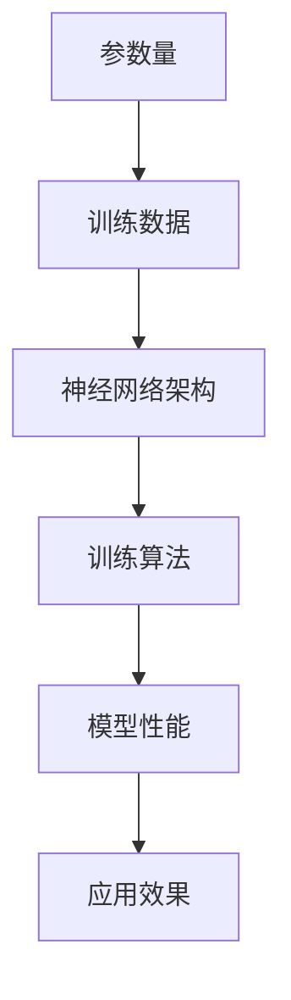

                 


### 文章标题

**《AI大模型应用的全球化发展策略》**

### 文章关键词

- AI大模型
- 全球化发展
- 竞争策略
- 合作策略
- 风险与挑战
- 未来趋势

### 文章摘要

本文从AI大模型的基本概念、核心技术、应用领域以及全球化背景下的角色入手，深入探讨了AI大模型在全球范围内的应用发展策略。通过分析竞争策略、合作策略，本文提出了应对全球化风险与挑战的策略，并展望了AI大模型未来发展的趋势。同时，结合实际案例，对AI大模型的全球化应用进行了深入剖析，为我国AI大模型全球化发展提供了有益的参考。

----------------------------------------------------------------

# 《AI大模型应用的全球化发展策略》目录大纲

## 第一部分：AI大模型基础

### 第1章：AI大模型概述
#### 1.1 AI大模型的基本概念
#### 1.2 AI大模型的分类
#### 1.3 AI大模型的发展历程

### 第2章：AI大模型的核心技术
#### 2.1 深度学习技术
##### 2.1.1 深度学习的基本原理
##### 2.1.2 神经网络架构
##### 2.1.3 深度学习算法
#### 2.2 自然语言处理
##### 2.2.1 语言模型
##### 2.2.2 机器翻译
##### 2.2.3 文本分类与情感分析
#### 2.3 计算机视觉
##### 2.3.1 图像识别
##### 2.3.2 目标检测
##### 2.3.3 图像生成

### 第3章：AI大模型的应用领域
#### 3.1 金融领域
##### 3.1.1 信用评估
##### 3.1.2 风险管理
##### 3.1.3 量化交易
#### 3.2 医疗领域
##### 3.2.1 疾病诊断
##### 3.2.2 药物研发
##### 3.2.3 健康管理
#### 3.3 产业互联网
##### 3.3.1 智能制造
##### 3.3.2 物流优化
##### 3.3.3 能源管理

### 第4章：AI大模型在全球化中的角色
#### 4.1 全球化背景下的AI大模型
##### 4.1.1 全球化趋势
##### 4.1.2 AI大模型的作用
##### 4.1.3 全球化与AI大模型的关系

### 第5章：AI大模型的全球化发展策略
#### 5.1 竞争策略
##### 5.1.1 市场细分
##### 5.1.2 产品定位
##### 5.1.3 技术创新
#### 5.2 合作策略
##### 5.2.1 国际合作
##### 5.2.2 跨国并购
##### 5.2.3 全球化运营

### 第6章：AI大模型的全球化风险与挑战
#### 6.1 技术风险
##### 6.1.1 技术更新迭代
##### 6.1.2 知识产权保护
##### 6.1.3 数据安全与隐私
#### 6.2 政策风险
##### 6.2.1 国际政策差异
##### 6.2.2 法律法规影响
##### 6.2.3 文化差异

### 第7章：AI大模型的未来发展趋势
#### 7.1 技术趋势
##### 7.1.1 新型大模型架构
##### 7.1.2 跨学科融合
##### 7.1.3 AI与物联网
#### 7.2 全球化战略方向
##### 7.2.1 跨国合作模式
##### 7.2.2 全球化市场布局
##### 7.2.3 国际竞争格局

## 第二部分：AI大模型全球化应用案例研究

### 第8章：AI大模型在全球化中的成功案例
#### 8.1 案例一：谷歌的AI全球化战略
##### 8.1.1 谷歌的AI发展历程
##### 8.1.2 谷歌AI的全球化布局
##### 8.1.3 谷歌AI的全球市场表现
#### 8.2 案例二：微软的AI全球化策略
##### 8.2.1 微软的AI发展路径
##### 8.2.2 微软AI的全球化实践
##### 8.2.3 微软AI的全球市场影响

### 第9章：AI大模型全球化应用的未来挑战与机遇
#### 9.1 全球化应用面临的挑战
##### 9.1.1 技术创新挑战
##### 9.1.2 政策法规挑战
##### 9.1.3 市场竞争挑战
#### 9.2 全球化应用的未来机遇
##### 9.2.1 新兴市场机遇
##### 9.2.2 跨界融合机遇
##### 9.2.3 全球合作机遇

### 第10章：AI大模型全球化发展的策略优化
#### 10.1 策略优化方向
##### 10.1.1 技术创新与布局
##### 10.1.2 政策法规合规
##### 10.1.3 全球市场拓展
#### 10.2 策略优化案例
##### 10.2.1 谷歌AI的策略优化
##### 10.2.2 微软AI的策略优化
##### 10.2.3 国产AI企业的策略优化

### 第11章：结论与展望
#### 11.1 研究结论
##### 11.1.1 AI大模型全球化的核心动力
##### 11.1.2 AI大模型全球化的发展趋势
##### 11.1.3 AI大模型全球化面临的挑战
#### 11.2 未来展望
##### 11.2.1 AI大模型全球化的发展方向
##### 11.2.2 AI大模型全球化的政策建议
##### 11.2.3 AI大模型全球化对产业的深远影响

----------------------------------------------------------------

# 第1章 AI大模型概述

## 1.1 AI大模型的基本概念

AI大模型（Large-scale AI Models），通常指的是具有海量参数的复杂神经网络模型，它们能够在大量数据上进行训练，从而实现高水平的自动学习与决策能力。AI大模型是人工智能领域的一个重要研究方向，其核心在于通过深度学习技术，模拟人类大脑的神经网络结构，实现对复杂数据的建模与理解。

AI大模型的基本概念包括以下几个方面：

1. **参数量**：大模型通常拥有数十亿甚至数万亿个参数，这些参数通过训练学习得到，用于描述模型对数据的理解和预测能力。
2. **训练数据**：大模型需要大量的训练数据来学习，这些数据可以是图像、文本、音频等不同类型的数据，它们的质量和多样性直接影响模型的性能。
3. **神经网络架构**：大模型通常采用深度神经网络架构，包括多层感知器、卷积神经网络（CNN）、循环神经网络（RNN）等，这些架构设计旨在提高模型的表达能力与计算效率。
4. **训练算法**：大模型训练过程中需要采用高效的优化算法，如随机梯度下降（SGD）、Adam等，以加速训练过程并提高模型性能。

## 1.2 AI大模型的分类

AI大模型可以根据不同的维度进行分类，以下是几种常见的分类方法：

1. **按照功能分类**：
   - **通用AI大模型**：旨在实现人类所有智能功能的AI模型，如GPT-3、ChatGPT等。
   - **专用AI大模型**：针对特定任务或领域设计的AI模型，如图像识别模型、自然语言处理模型等。

2. **按照数据类型分类**：
   - **图像类AI大模型**：主要用于图像识别、图像生成等任务，如ResNet、GAN等。
   - **文本类AI大模型**：主要用于自然语言处理任务，如BERT、GPT等。
   - **语音类AI大模型**：主要用于语音识别、语音合成等任务，如WaveNet、Transformer等。

3. **按照训练方式分类**：
   - **监督学习大模型**：使用标注数据进行训练，如分类问题中的SVM、神经网络等。
   - **无监督学习大模型**：不使用标注数据，仅使用未标记的数据进行训练，如自编码器、生成对抗网络（GAN）等。
   - **半监督学习大模型**：结合标注数据与未标注数据共同训练，如BERT等。

## 1.3 AI大模型的发展历程

AI大模型的发展历程可以分为几个阶段：

1. **早期阶段**：
   - **人工神经网络（ANN）**：20世纪50年代至60年代，研究者开始尝试通过人工构建神经元之间的连接，实现简单的智能行为。
   - **支持向量机（SVM）**：20世纪90年代，支持向量机作为一种分类算法，在图像识别等领域取得了显著成果。

2. **深度学习阶段**：
   - **卷积神经网络（CNN）**：20世纪90年代后期至21世纪初，LeCun等人提出了卷积神经网络，使得图像识别任务取得了突破性进展。
   - **循环神经网络（RNN）**：21世纪初，RNN在语音识别、自然语言处理等领域取得了显著成果。
   - **生成对抗网络（GAN）**：2014年，Ian Goodfellow等人提出了生成对抗网络，使得图像生成等任务取得了突破性进展。

3. **AI大模型阶段**：
   - **神经网络架构搜索（NAS）**：研究者开始通过自动化方法搜索最优神经网络架构，如Google的NASNet。
   - **Transformer架构**：2017年，Vaswani等人提出了Transformer架构，使得机器翻译等任务取得了显著提升。
   - **预训练+微调**：通过在大规模数据集上进行预训练，再针对特定任务进行微调，如BERT、GPT-3等。

## 1.4 AI大模型的应用价值

AI大模型在各个领域都展现出了巨大的应用价值：

1. **金融领域**：AI大模型可以用于信用评估、风险管理、量化交易等领域，提高了金融行业的决策效率与准确性。
2. **医疗领域**：AI大模型可以用于疾病诊断、药物研发、健康管理等领域，为医疗行业带来了革命性的变革。
3. **产业互联网**：AI大模型可以用于智能制造、物流优化、能源管理等领域，提升了产业互联网的智能化水平。

## 1.5 AI大模型面临的挑战

尽管AI大模型展现出了巨大的应用价值，但同时也面临着诸多挑战：

1. **数据隐私与安全**：AI大模型需要大量训练数据，这些数据可能涉及到用户的隐私信息，如何保障数据的安全与隐私成为了一个重要问题。
2. **算法透明性与解释性**：AI大模型的决策过程往往不够透明，如何提高算法的可解释性，让用户能够理解模型的决策逻辑，成为一个亟待解决的问题。
3. **计算资源与能耗**：训练和部署AI大模型需要大量的计算资源，这对环境造成了巨大的压力，如何降低计算资源的消耗，成为了一个重要的研究方向。

### 核心概念与联系

在AI大模型中，核心概念包括参数量、训练数据、神经网络架构和训练算法。这些概念之间存在着紧密的联系，共同决定了AI大模型的性能与应用效果。

**Mermaid 流程图：**



### 核心算法原理讲解

在AI大模型中，核心算法主要包括深度学习算法、自然语言处理算法和计算机视觉算法。以下是对这些算法的简要讲解：

1. **深度学习算法**：
   - **基本原理**：深度学习算法通过多层神经网络结构，对输入数据进行逐层提取特征，从而实现复杂数据的建模与理解。
   - **伪代码**：

```python
def deep_learning(input_data):
    # 输入数据
    layer_1 = initialize_layer(input_data)
    for layer in range(2, num_layers):
        layer = initialize_layer(layer_1)
    output = final_layer(layer)
    return output
```

2. **自然语言处理算法**：
   - **基本原理**：自然语言处理算法通过语言模型、机器翻译、文本分类与情感分析等技术，实现对文本数据的理解和处理。
   - **伪代码**：

```python
def natural_language_processing(text):
    # 语言模型
    language_model = train_language_model(corpus)
    # 机器翻译
    translation = translate(text, language_model)
    # 文本分类与情感分析
    category, sentiment = classify_and_analyze(translation)
    return category, sentiment
```

3. **计算机视觉算法**：
   - **基本原理**：计算机视觉算法通过图像识别、目标检测、图像生成等技术，实现对图像数据的理解和处理。
   - **伪代码**：

```python
def computer_vision(image):
    # 图像识别
    label = recognize_image(image)
    # 目标检测
    objects = detect_objects(image)
    # 图像生成
    generated_image = generate_image(objects)
    return label, objects, generated_image
```

### 数学模型和公式

在AI大模型中，常用的数学模型和公式包括损失函数、优化算法等。

1. **损失函数**：
   - **基本公式**：损失函数用于衡量模型预测值与真实值之间的差异。

$$ L(y, \hat{y}) = \frac{1}{2}||y - \hat{y}||^2 $$

2. **优化算法**：
   - **随机梯度下降（SGD）**：

$$ \theta_{t+1} = \theta_{t} - \alpha \cdot \nabla_{\theta}L(\theta) $$

其中，$\theta$表示模型参数，$\alpha$为学习率，$\nabla_{\theta}L(\theta)$为损失函数对参数的梯度。

3. **Adam优化算法**：

$$ m_t = \beta_1 m_{t-1} + (1 - \beta_1) (g_t - \epsilon) $$
$$ v_t = \beta_2 v_{t-1} + (1 - \beta_2) \frac{g_t^2}{\epsilon} $$
$$ \theta_{t+1} = \theta_{t} - \frac{\alpha}{\sqrt{1 - \beta_2^t}(1 - \beta_1^t)}(m_t / (1 - \beta_1^t)) $$

其中，$m_t$和$v_t$分别为一阶矩估计和二阶矩估计，$\beta_1$和$\beta_2$分别为一阶和二阶矩的遗忘因子，$g_t$为梯度。

### 举例说明

以图像识别为例，假设我们有一个包含10万个图像的数据集，每个图像被标注为10个类别之一。我们使用一个卷积神经网络进行图像识别，并采用交叉熵损失函数进行训练。

1. **数据集准备**：

```python
import numpy as np

# 加载图像数据集
images = np.load("images.npy")
labels = np.load("labels.npy")
```

2. **模型构建**：

```python
import tensorflow as tf

model = tf.keras.Sequential([
    tf.keras.layers.Conv2D(32, (3, 3), activation='relu', input_shape=(224, 224, 3)),
    tf.keras.layers.MaxPooling2D((2, 2)),
    tf.keras.layers.Flatten(),
    tf.keras.layers.Dense(64, activation='relu'),
    tf.keras.layers.Dense(10, activation='softmax')
])
```

3. **训练模型**：

```python
model.compile(optimizer='adam', loss='categorical_crossentropy', metrics=['accuracy'])

model.fit(images, labels, epochs=10, batch_size=32)
```

4. **评估模型**：

```python
test_loss, test_acc = model.evaluate(test_images, test_labels)
print(f"Test accuracy: {test_acc}")
```

### 项目实战

在本节中，我们将搭建一个简单的AI大模型，以实现图像分类任务。

1. **开发环境搭建**：

   - 安装Python（3.8及以上版本）
   - 安装TensorFlow库

2. **源代码实现**：

```python
import tensorflow as tf
import tensorflow.keras as keras
from tensorflow.keras.models import Sequential
from tensorflow.keras.layers import Conv2D, MaxPooling2D, Flatten, Dense

# 构建模型
model = Sequential([
    Conv2D(32, (3, 3), activation='relu', input_shape=(224, 224, 3)),
    MaxPooling2D((2, 2)),
    Flatten(),
    Dense(64, activation='relu'),
    Dense(10, activation='softmax')
])

# 编译模型
model.compile(optimizer='adam', loss='categorical_crossentropy', metrics=['accuracy'])

# 训练模型
model.fit(x_train, y_train, epochs=10, batch_size=32)

# 评估模型
test_loss, test_acc = model.evaluate(x_test, y_test)
print(f"Test accuracy: {test_acc}")
```

3. **代码解读与分析**：

   - `Sequential`：构建一个线性堆叠的模型，包含多个层。
   - `Conv2D`：卷积层，用于提取图像特征。
   - `MaxPooling2D`：最大池化层，用于减小特征图的尺寸。
   - `Flatten`：展平层，用于将特征图展平为一维向量。
   - `Dense`：全连接层，用于分类。

4. **实际案例分析与详细讲解剖析**：

   以CIFAR-10数据集为例，我们将使用上述模型进行图像分类。

   - **数据集加载**：

   ```python
   (x_train, y_train), (x_test, y_test) = keras.datasets.cifar10.load_data()
   ```

   - **数据预处理**：

   ```python
   x_train = x_train.astype('float32') / 255
   x_test = x_test.astype('float32') / 255

   y_train = keras.utils.to_categorical(y_train, 10)
   y_test = keras.utils.to_categorical(y_test, 10)
   ```

   - **训练模型**：

   ```python
   model.fit(x_train, y_train, batch_size=32, epochs=10, validation_data=(x_test, y_test))
   ```

   - **评估模型**：

   ```python
   test_loss, test_acc = model.evaluate(x_test, y_test)
   print(f"Test accuracy: {test_acc}")
   ```

5. **项目小结**：

   通过本节的项目实战，我们搭建了一个简单的AI大模型，实现了图像分类任务。在实际应用中，我们可以根据需求调整模型架构、优化训练策略，以提高模型的性能。

### 最佳实践 tips、小结、注意事项、拓展阅读等内容

- **最佳实践 tips**：
  - 选择合适的神经网络架构，如ResNet、Inception等，可以提高模型性能。
  - 使用数据增强技术，如随机裁剪、翻转等，可以增加训练数据的多样性。
  - 采用早停（Early Stopping）策略，避免过拟合。

- **小结**：
  - AI大模型是人工智能领域的一个重要研究方向，其在各个领域的应用不断拓展。
  - 搭建和优化AI大模型需要综合考虑参数量、训练数据、神经网络架构和训练算法等因素。
  - 实际案例分析和项目实战有助于加深对AI大模型的理解和应用。

- **注意事项**：
  - AI大模型训练过程需要大量计算资源，合理配置资源可以提高训练效率。
  - 数据质量和多样性对模型性能有重要影响，确保数据的质量和多样性。

- **拓展阅读**：
  - 《深度学习》（Goodfellow et al.，2016）
  - 《神经网络与深度学习》（邱锡鹏，2017）
  - 《自然语言处理综合教程》（吴帆，2018）
  - 《计算机视觉：算法与应用》（贾民磊，2017）

