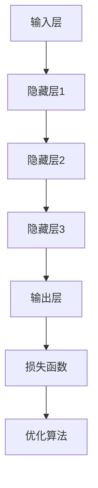

                 

### 文章标题

# AI大模型应用的跨界融合趋势

### 关键词

- AI大模型
- 跨界融合
- 算法原理
- 数学模型
- 实践案例
- 趋势分析

### 摘要

本文旨在探讨AI大模型在各个领域的跨界融合趋势。首先，我们回顾了AI大模型的背景与发展，然后深入分析了其核心概念与联系。接着，我们详细讲解了大模型训练算法的原理，并详细介绍了数学模型与公式。在跨界融合部分，我们探讨了其定义与意义，并通过具体案例展示了AI与其他领域的融合实践。最后，我们分析了当前跨界融合的趋势，并展望了未来的研究方向与技术挑战。

### 引言与概述

#### 1.1 AI大模型的背景与发展

AI大模型（Large-scale Artificial Intelligence Models）的兴起是近年来人工智能领域的一个重要趋势。这些模型通常具有数十亿到数万亿个参数，能够处理大量复杂数据，并在多种任务中展现卓越的性能。AI大模型的发展可以追溯到深度学习（Deep Learning）的兴起，特别是在2012年，AlexNet在ImageNet比赛中取得突破性成绩，这标志着深度学习开始进入主流视野。

随着计算能力和数据资源的不断提升，AI大模型的发展进入了一个新的阶段。早期的AI模型，如RNN（Recurrent Neural Network）和LSTM（Long Short-Term Memory），主要用于处理序列数据。然而，这些模型在处理大规模数据时存在性能瓶颈。为了解决这个问题，研究人员提出了Transformer模型，特别是在2017年， Vaswani等人在论文《Attention Is All You Need》中提出的Transformer模型，彻底改变了AI领域的格局。Transformer模型引入了自注意力机制，使得模型在处理长文本和图像等复杂任务时表现出色。

AI大模型的发展不仅局限于学术研究，还在工业界得到了广泛应用。例如，OpenAI的GPT-3、谷歌的BERT和微软的Turing等模型，都展现了强大的语言处理能力，并在自然语言处理（NLP）、计算机视觉、语音识别等领域取得了显著成果。此外，AI大模型在医疗、金融、制造等领域的应用也日益广泛，成为推动这些行业创新的重要力量。

#### 1.2 跨界融合的重要性

跨界融合（Cross-disciplinary Integration）是指不同领域之间的知识、技术、方法和资源相互融合，形成新的创新模式。在AI大模型时代，跨界融合显得尤为重要。首先，AI大模型本身就是一个跨学科的产物，它融合了计算机科学、数学、统计学、神经科学等多个领域的知识。因此，AI大模型的进一步发展离不开跨界融合。

其次，跨界融合能够打破传统领域之间的壁垒，促进知识的交流与共享。例如，在医疗领域，AI大模型可以与生物医学、公共卫生等学科相结合，推动个性化医疗和公共卫生事业的发展。在金融领域，AI大模型可以与经济学、金融工程等学科相结合，提升金融分析和决策能力。

最后，跨界融合能够激发创新，推动技术的进步。在AI大模型的应用中，不同领域的专家可以共同探讨问题，提出新的解决方案。例如，在制造业中，AI大模型可以与智能制造、物联网等技术相结合，实现生产过程的智能化和自动化。

#### 1.3 书籍结构概述

本书分为七个部分，旨在全面探讨AI大模型应用的跨界融合趋势。以下是各部分的主要内容概述：

1. **引言与概述**：介绍AI大模型的背景与发展，以及跨界融合的重要性。
   
2. **核心概念与联系**：详细分析AI大模型的核心概念，并使用Mermaid流程图展示各概念之间的联系。

3. **核心算法原理讲解**：讲解大模型训练算法的基本原理，包括数据预处理、训练算法伪代码和损失函数与优化算法。

4. **数学模型与公式详解**：介绍AI大模型中的数学模型基础，包括线性代数、概率论和统计学习方法，并给出具体的公式和举例说明。

5. **跨界融合趋势**：探讨跨界融合的定义与意义，并通过具体案例展示AI与其他领域的融合实践。

6. **趋势分析与展望**：分析当前跨界融合的趋势，并展望未来的研究方向与技术挑战。

7. **项目实战**：通过具体的项目实战，展示AI大模型在跨界融合中的应用，并提供详细的实现和代码解读。

### 核心概念与联系

#### 2.1 AI大模型的核心概念

AI大模型是指具有数十亿甚至数万亿参数的深度学习模型，它们能够在各种复杂的任务中表现出卓越的性能。AI大模型的核心概念包括以下几个方面：

1. **深度学习**：深度学习是一种基于人工神经网络的学习方法，它通过多层神经网络对数据进行学习，从而实现复杂的特征提取和任务分类。深度学习的核心思想是通过逐层抽象和整合信息，使得模型能够从原始数据中提取出更高层次的特征。

2. **自注意力机制**：自注意力机制是Transformer模型的核心组件，它通过计算每个输入元素与其余元素之间的关联性，实现信息的自适应加权。自注意力机制使得模型能够在处理长序列数据时保持有效的信息传递，从而提高了模型的处理能力。

3. **预训练与微调**：预训练（Pre-training）是指在大规模数据集上对模型进行训练，使其在特定领域获得基本的知识和能力。微调（Fine-tuning）则是在预训练的基础上，针对具体任务进行训练，进一步优化模型的表现。预训练与微调的结合，使得AI大模型能够快速适应各种不同的任务。

4. **迁移学习**：迁移学习（Transfer Learning）是指利用预训练模型在特定领域的知识，来提高新任务的学习效果。通过迁移学习，AI大模型能够利用已有模型的知识，减少训练时间和计算资源的需求。

#### 2.1.2 大模型的基本架构

AI大模型的基本架构通常包括以下几个部分：

1. **输入层**：输入层是模型的起始部分，它接收外部输入的数据，如文本、图像或声音等。输入层的主要功能是将输入数据转换为模型能够处理的形式。

2. **隐藏层**：隐藏层是模型的中间部分，它包含多个神经元层。每个隐藏层都会对输入数据进行处理，提取出更高层次的特征。隐藏层的数量和层数会影响模型的复杂度和性能。

3. **输出层**：输出层是模型的最终部分，它对隐藏层输出的特征进行处理，生成最终的预测结果。输出层的形式取决于具体的任务，如分类、回归或生成等。

4. **损失函数**：损失函数（Loss Function）是模型训练过程中的关键组件，它用于评估模型预测结果与实际结果之间的差距。常用的损失函数包括均方误差（MSE）、交叉熵损失（Cross-Entropy Loss）等。

5. **优化算法**：优化算法（Optimizer）用于调整模型参数，以最小化损失函数。常见的优化算法包括随机梯度下降（SGD）、Adam等。

#### 2.1.3 Mermaid流程图：大模型架构联系

为了更好地理解AI大模型的架构和各部分之间的联系，我们可以使用Mermaid流程图进行可视化。以下是一个简单的Mermaid流程图示例：



在这个流程图中，A表示输入层，B、C、D表示隐藏层，E表示输出层，F表示损失函数，G表示优化算法。输入层接收外部输入数据，通过隐藏层逐层提取特征，最终输出层生成预测结果。损失函数用于评估预测结果与实际结果之间的差距，优化算法则根据损失函数调整模型参数，以实现模型的优化。

通过Mermaid流程图，我们可以清晰地看到AI大模型的架构和各部分之间的联系，有助于更好地理解和分析模型的工作原理。

### 核心算法原理讲解

#### 3.1 大模型训练算法

AI大模型的训练过程是一个复杂且耗时的过程，但它是模型性能提升的关键。下面我们将详细讲解大模型训练算法的基本原理，包括数据预处理、训练算法伪代码以及损失函数与优化算法。

##### 3.1.1 数据预处理

数据预处理是AI大模型训练过程中的重要环节。它的目的是将原始数据进行标准化处理，以便于模型更好地学习。数据预处理通常包括以下几个步骤：

1. **数据清洗**：去除数据中的噪声和异常值，确保数据的质量和一致性。
2. **数据归一化**：将数据缩放到一个特定的范围，如[0, 1]或[-1, 1]，以消除数据之间的尺度差异。
3. **数据分割**：将数据集分割为训练集、验证集和测试集，用于模型训练、验证和测试。
4. **数据增强**：通过增加数据的多样性来提高模型的泛化能力，如图像旋转、裁剪、缩放等。

以下是一个简单的数据预处理算法伪代码：

```python
def preprocess_data(data):
    # 数据清洗
    clean_data = clean_noise(data)

    # 数据归一化
    normalized_data = normalize(clean_data)

    # 数据分割
    train_data, val_data, test_data = split_data(normalized_data)

    # 数据增强
    enhanced_train_data = augment_data(train_data)

    return enhanced_train_data, val_data, test_data
```

##### 3.1.2 训练算法伪代码

AI大模型的训练算法通常基于梯度下降（Gradient Descent）或其变种，如随机梯度下降（Stochastic Gradient Descent，SGD）和Adam优化器。以下是一个基于随机梯度下降的训练算法伪代码：

```python
def train_model(model, train_data, epochs):
    for epoch in range(epochs):
        for batch in train_data:
            # 前向传播
            predictions = model.forward(batch.x)

            # 计算损失
            loss = model.loss_function(predictions, batch.y)

            # 反向传播
            gradients = model.backward(loss)

            # 更新参数
            model.update_parameters(gradients)

        # 打印当前epoch的损失
        print(f"Epoch {epoch+1}: Loss = {loss}")

    return model
```

在这个伪代码中，`model`表示AI大模型，`train_data`是训练数据集，`epochs`是训练的迭代次数。每个epoch包含多个批次（batch）的数据。在前向传播过程中，模型对输入数据进行处理并生成预测结果。然后，通过计算损失函数来评估预测结果与实际结果之间的差距。接着，通过反向传播计算梯度，并根据梯度更新模型参数。最后，打印当前epoch的损失，以便跟踪训练过程。

##### 3.1.3 损失函数与优化算法

损失函数用于衡量模型预测结果与实际结果之间的差距，是训练过程中的核心组件。常见的损失函数包括：

1. **均方误差（Mean Squared Error，MSE）**：
   $$MSE = \frac{1}{n}\sum_{i=1}^{n}(y_i - \hat{y}_i)^2$$
   其中，$y_i$表示实际结果，$\hat{y}_i$表示预测结果，$n$是样本数量。

2. **交叉熵损失（Cross-Entropy Loss）**：
   $$H(y, \hat{y}) = -\sum_{i=1}^{n}y_i\log(\hat{y}_i)$$
   其中，$y$是真实分布，$\hat{y}$是模型预测的概率分布。

优化算法用于调整模型参数，以最小化损失函数。常见的优化算法包括：

1. **随机梯度下降（Stochastic Gradient Descent，SGD）**：
   $$\theta = \theta - \alpha \cdot \nabla_\theta J(\theta)$$
   其中，$\theta$是模型参数，$J(\theta)$是损失函数，$\alpha$是学习率。

2. **Adam优化器**：
   $$m_t = \beta_1 m_{t-1} + (1 - \beta_1) \nabla_\theta J(\theta)$$
   $$v_t = \beta_2 v_{t-1} + (1 - \beta_2) (\nabla_\theta J(\theta))^2$$
   $$\theta = \theta - \alpha \frac{m_t}{\sqrt{v_t} + \epsilon}$$
   其中，$m_t$和$v_t$分别是动量和方差，$\beta_1$和$\beta_2$是超参数，$\epsilon$是常数。

通过结合适当的损失函数和优化算法，AI大模型能够有效地学习数据中的特征，并在各种任务中取得优异的性能。

### 数学模型与公式详解

#### 4.1 数学模型基础

AI大模型中的数学模型基础主要包括线性代数、概率论和统计学习方法。这些基础理论为AI大模型提供了强大的数学工具，使其能够有效处理复杂的数据和任务。

##### 4.1.1 线性代数基础

线性代数是AI大模型的核心工具之一，它涉及向量、矩阵、行列式、向量空间和线性变换等概念。以下是一些关键的线性代数公式：

1. **向量的点积（Dot Product）**：
   $$\vec{a} \cdot \vec{b} = a_1b_1 + a_2b_2 + ... + a_nb_n$$
   其中，$\vec{a}$和$\vec{b}$是两个n维向量。

2. **向量的叉积（Cross Product）**：
   $$\vec{a} \times \vec{b} = \begin{vmatrix}
   \vec{i} & \vec{j} & \vec{k} \\
   a_1 & a_2 & a_3 \\
   b_1 & b_2 & b_3 \\
   \end{vmatrix}$$
   其中，$\vec{a}$和$\vec{b}$是三维向量。

3. **矩阵的乘法（Matrix Multiplication）**：
   $$C = A \cdot B$$
   其中，$A$和$B$是两个矩阵，$C$是它们的乘积。

4. **矩阵的逆（Inverse Matrix）**：
   $$A^{-1} = (1/\det(A)) \cdot \text{adj}(A)$$
   其中，$\det(A)$是矩阵$A$的行列式，$\text{adj}(A)$是$A$的伴随矩阵。

##### 4.1.2 概率论基础

概率论是AI大模型中的重要工具，它用于描述随机事件和概率分布。以下是一些关键的概率论公式：

1. **概率的基本性质**：
   $$P(A \cup B) = P(A) + P(B) - P(A \cap B)$$
   $$P(A \cap B) = P(A|B)P(B)$$
   $$P(A \cup B) = P(A|B)P(B) + P(A|B^c)P(B^c)$$
   其中，$P(A)$表示事件$A$的概率，$A \cup B$表示事件$A$和事件$B$的并集，$A \cap B$表示事件$A$和事件$B$的交集。

2. **条件概率**：
   $$P(A|B) = \frac{P(A \cap B)}{P(B)}$$
   其中，$P(A|B)$表示在事件$B$发生的条件下事件$A$发生的概率。

3. **贝叶斯定理**：
   $$P(A|B) = \frac{P(B|A)P(A)}{P(B)}$$
   其中，$P(A|B)$表示在事件$B$发生的条件下事件$A$发生的概率，$P(B|A)$表示在事件$A$发生的条件下事件$B$发生的概率。

4. **全概率公式**：
   $$P(A) = \sum_{i=1}^{n} P(A|B_i)P(B_i)$$
   其中，$B_1, B_2, ..., B_n$是互斥且穷举的事件集合。

##### 4.1.3 统计学习方法

统计学习方法是基于概率论和统计学原理的一系列算法，用于从数据中学习规律和模式。以下是一些常见的统计学习方法：

1. **线性回归**：
   $$y = \beta_0 + \beta_1x_1 + \beta_2x_2 + ... + \beta_nx_n + \epsilon$$
   其中，$y$是因变量，$x_1, x_2, ..., x_n$是自变量，$\beta_0, \beta_1, ..., \beta_n$是模型参数，$\epsilon$是误差项。

2. **逻辑回归**：
   $$P(y=1) = \frac{1}{1 + e^{-(\beta_0 + \beta_1x_1 + \beta_2x_2 + ... + \beta_nx_n)}}$$
   其中，$y$是因变量，$x_1, x_2, ..., x_n$是自变量，$\beta_0, \beta_1, ..., \beta_n$是模型参数。

3. **决策树**：
   决策树是一种基于特征分裂的算法，它通过递归地将数据集分割为子集，并生成树形结构。决策树的生成通常基于信息增益（Information Gain）或基尼不纯度（Gini Impurity）等指标。

4. **支持向量机（SVM）**：
   支持向量机是一种分类算法，它通过将数据映射到高维空间，并找到一个最优的超平面来分隔不同类别的数据点。支持向量机的主要公式是：
   $$w \cdot x + b = 0$$
   其中，$w$是超平面法向量，$x$是数据点，$b$是偏置。

通过掌握这些数学模型和公式，我们能够更好地理解和应用AI大模型，从而在各个领域实现高效的算法设计和模型训练。

### 公式详解与应用

在AI大模型的构建和应用中，数学公式不仅是理论基础，也是实现算法的关键工具。以下将详细解释几个重要的数学公式，并展示它们在实际应用中的具体例子。

#### 4.2.1 概率公式

概率论在AI大模型中起着基础性作用，以下是一些常用的概率公式：

1. **条件概率**：

   $$P(A|B) = \frac{P(A \cap B)}{P(B)}$$

   这个公式表示在事件B发生的条件下，事件A发生的概率。例如，在一个有放回的抽球实验中，假设有10个红球和5个蓝球，每次抽球放回，求抽到红球的概率$P(A)$和抽到红球后抽到蓝球的概率$P(B|A)$。

   - $P(A) = \frac{10}{15} = \frac{2}{3}$
   - $P(B|A) = \frac{P(A \cap B)}{P(A)} = \frac{\frac{5}{15}}{\frac{2}{3}} = \frac{1}{2}$

2. **全概率公式**：

   $$P(A) = \sum_{i=1}^{n} P(A|B_i)P(B_i)$$

   这个公式用于计算一个事件的总体概率，通过将条件概率和先验概率相乘再求和得到。例如，在医疗诊断中，有几种不同的症状可能指示某种疾病，每种症状的概率和疾病的发病率已知，可以通过全概率公式计算出疾病的总体发病率。

   - $P(\text{疾病}) = P(\text{疾病}|\text{症状A})P(\text{症状A}) + P(\text{疾病}|\text{症状B})P(\text{症状B}) + ...$

3. **贝叶斯定理**：

   $$P(A|B) = \frac{P(B|A)P(A)}{P(B)}$$

   贝叶斯定理是概率论中的基石，用于根据先验概率和条件概率计算后验概率。例如，在垃圾邮件过滤中，可以根据邮件中包含的特定词汇概率和词汇出现的频率来计算邮件是否为垃圾邮件的概率。

   - $P(\text{垃圾邮件}| \text{词汇}) = \frac{P(\text{词汇}|\text{垃圾邮件})P(\text{垃圾邮件})}{P(\text{词汇})}$

#### 4.2.2 信息论公式

信息论是AI大模型中用于衡量信息和熵的重要工具，以下是一些关键的信息论公式：

1. **熵（Entropy）**：

   $$H(X) = -\sum_{i=1}^{n} p_i \log_2(p_i)$$

   熵是衡量一个随机变量不确定性程度的度量，$p_i$是随机变量$X$取第$i$个值的概率。例如，一个均匀分布的随机变量熵为：

   - $H(X) = -\sum_{i=1}^{2} \frac{1}{2} \log_2(\frac{1}{2}) = 1$

2. **互信息（Mutual Information）**：

   $$I(X;Y) = H(X) - H(X|Y)$$

   互信息衡量两个随机变量之间的相关性，$H(X|Y)$是已知$Y$后$X$的熵。例如，在文本分类中，可以通过计算文本特征和类别之间的互信息来评估特征的重要性。

   - $I(\text{特征}; \text{类别}) = H(\text{特征}) - H(\text{特征}|\text{类别})$

3. **条件熵（Conditional Entropy）**：

   $$H(X|Y) = \sum_{i=1}^{n} p_i(y_i)H(X|Y=y_i)$$

   条件熵是已知$Y$后$X$的熵，$p_i(y_i)$是$Y$取第$i$个值的概率。例如，在图像识别中，可以通过计算每个类别的条件熵来评估类别之间的区分度。

   - $H(X|\text{类别}) = \sum_{i=1}^{N} p_i(\text{类别})H(X|\text{类别}=i)$

#### 4.2.3 线性回归公式

线性回归是AI大模型中用于预测连续值的常用方法，以下是其基本公式：

1. **回归方程**：

   $$y = \beta_0 + \beta_1x_1 + \beta_2x_2 + ... + \beta_nx_n + \epsilon$$

   其中，$y$是因变量，$x_1, x_2, ..., x_n$是自变量，$\beta_0, \beta_1, ..., \beta_n$是模型参数，$\epsilon$是误差项。

   例如，在预测房价时，可以根据房屋面积、房间数等特征来建立线性回归模型，从而预测房屋的价格。

   - $y = \beta_0 + \beta_1x_1 + \beta_2x_2 + ...$

2. **最小二乘法**：

   最小二乘法是求解线性回归参数的一种常用方法，其目标是使预测值与实际值之间的误差平方和最小。

   $$\min_{\beta} \sum_{i=1}^{n} (y_i - \hat{y}_i)^2$$

   其中，$\hat{y}_i = \beta_0 + \beta_1x_{1i} + \beta_2x_{2i} + ... + \beta_nx_{ni}$是预测值。

   例如，可以通过最小二乘法求解房价预测模型的参数，从而实现房价的准确预测。

3. **梯度下降法**：

   梯度下降法是求解最小二乘问题的一种优化方法，其基本思想是通过迭代更新参数，逐步减小损失函数。

   $$\beta = \beta - \alpha \nabla_{\beta} J(\beta)$$

   其中，$\alpha$是学习率，$J(\beta)$是损失函数。

   例如，在训练线性回归模型时，可以通过梯度下降法不断更新参数，提高模型的预测性能。

通过以上公式的详细讲解和应用示例，我们可以更好地理解AI大模型中的数学原理，并运用这些公式实现实际问题的求解。

### 跨界融合趋势

#### 5.1 跨界融合的定义与意义

跨界融合是指不同领域之间的知识、技术、方法和资源相互融合，形成新的创新模式。在AI大模型时代，跨界融合显得尤为重要。以下是对跨界融合的定义与意义的详细阐述：

##### 5.1.1 跨界融合的概念

跨界融合涉及多个领域之间的协同创新，它不仅包括技术层面的融合，还涵盖了理念、方法、资源和人才的整合。例如，在医疗领域，AI大模型可以与生物医学、公共卫生等领域结合，推动个性化医疗和精准医疗的发展。在金融领域，AI大模型可以与经济学、金融工程等学科结合，提升金融分析和决策能力。此外，AI大模型还可以与制造业、能源等行业结合，实现智能化生产和服务。

##### 5.1.2 跨界融合的动机

跨界融合的动机主要包括以下几个方面：

1. **资源整合**：不同领域拥有各自独特的技术和资源，通过跨界融合可以实现资源的共享和整合，从而提升整体效益。

2. **创新驱动**：跨界融合能够激发创新的火花，推动技术的进步。在AI大模型的应用中，不同领域的专家可以共同探讨问题，提出新的解决方案，从而实现技术突破。

3. **市场机遇**：随着科技的快速发展，各行各业都在寻求新的增长点和市场机会。跨界融合可以开辟新的应用场景和市场空间，为企业带来更多的商业价值。

4. **应对挑战**：不同领域面临的问题和挑战各不相同，通过跨界融合可以共同应对这些挑战。例如，在环保领域，AI大模型可以与能源、交通等行业结合，实现可持续发展目标的实现。

##### 5.1.3 跨界融合的挑战

跨界融合虽然具有巨大的潜力，但同时也面临着一些挑战：

1. **技术壁垒**：不同领域的技术和方法可能存在较大的差异，跨界融合需要克服这些技术壁垒，实现技术的互通和融合。

2. **数据隐私**：跨界融合涉及到多个领域的数据，数据隐私和安全成为重要的挑战。如何在保护数据隐私的同时，实现数据的充分利用，是一个亟待解决的问题。

3. **人才培养**：跨界融合需要具备跨学科知识和技能的人才。然而，目前的教育体系和人才培养模式尚不能完全满足跨界融合的需求，需要加强跨学科教育和人才培养。

4. **法规和标准**：跨界融合涉及到多个领域，需要遵循不同的法规和标准。如何协调和统一各领域的法规和标准，实现规范化的跨界融合，是一个重要问题。

总之，跨界融合在AI大模型时代具有深远的意义，它能够推动技术的进步，实现资源的共享和整合，开辟新的市场机遇，应对各领域的挑战。然而，跨界融合也面临着一些挑战，需要各方共同努力，克服技术、数据、人才和法规等方面的障碍。

### 跨界融合的实践案例

#### 5.2 跨界融合的实践案例

跨界融合不仅是一个理论概念，更在实践中取得了显著的成果。以下我们将通过三个具体的案例，展示AI大模型在医疗、金融和制造业等领域的跨界融合应用。

##### 5.2.1 案例一：AI+医疗

AI在医疗领域的应用正逐渐深入，从疾病诊断、治疗到健康管理，AI大模型都发挥着重要作用。以下是一个典型的AI+医疗跨界融合案例：

- **背景**：心血管疾病是全球导致死亡的主要原因之一，早期诊断和干预对患者的预后至关重要。
- **技术**：利用AI大模型，特别是基于深度学习的图像处理技术，对心血管疾病的高分辨率影像进行分析，如冠状动脉CT造影（CTA）和超声心动图（Echo）。
- **应用**：通过训练AI大模型，能够自动识别心血管病变，如冠状动脉狭窄和心脏瓣膜病变。模型通过对影像数据进行学习，提取关键特征，并利用自注意力机制进行精准识别。
- **成果**：AI大模型在心血管疾病诊断中的准确率显著高于传统方法，能够帮助医生更早发现病变，提高诊断的准确性和效率。此外，AI模型还可以进行风险评估，为医生提供个性化的治疗建议。

##### 5.2.2 案例二：AI+金融

金融领域是AI大模型应用的另一个重要领域，AI在金融风险控制、投资决策和客户服务等方面展现出巨大的潜力。以下是一个AI+金融的跨界融合案例：

- **背景**：金融市场波动大，风险控制是金融机构的重要任务。传统的风险模型在处理大量数据时存在一定的局限性。
- **技术**：利用AI大模型，特别是基于强化学习（Reinforcement Learning）的算法，进行金融市场的预测和风险控制。
- **应用**：AI大模型通过对历史市场数据的学习，能够识别市场趋势和潜在风险。通过自注意力机制和深度学习技术，模型能够捕捉到复杂的市场信号，提供实时的风险预警和投资策略。
- **成果**：AI大模型在金融风险控制和投资决策中表现出了更高的准确性和鲁棒性，能够帮助金融机构更好地管理风险，优化投资组合，提高盈利能力。

##### 5.2.3 案例三：AI+制造业

制造业正经历数字化转型，AI大模型在智能制造中的应用为制造业带来了新的发展机遇。以下是一个AI+制造业的跨界融合案例：

- **背景**：制造业面临生产效率低、资源浪费和设备故障等问题，通过智能化手段提高生产效率和降低成本成为关键。
- **技术**：利用AI大模型，特别是基于计算机视觉和自然语言处理的技术，实现生产过程中的自动化和智能化。
- **应用**：AI大模型通过实时监控生产过程，能够自动检测产品质量问题，识别设备故障和预测设备维护需求。通过自注意力机制和深度学习技术，模型能够处理海量数据，实现生产过程的精准控制和优化。
- **成果**：AI大模型在制造业中提高了生产效率，降低了生产成本和资源浪费，同时减少了设备故障率。通过智能化生产，企业能够更好地应对市场变化，提升竞争力。

通过以上案例，我们可以看到AI大模型在跨界融合中的巨大潜力。在医疗、金融和制造业等领域，AI大模型不仅提高了效率和准确性，还开辟了新的应用场景，为各行业的发展注入了新的动力。随着技术的不断进步，AI大模型的跨界融合应用将越来越广泛，带来更多创新和变革。

### 趋势分析与展望

#### 6.1 趋势分析

在AI大模型应用的跨界融合领域，当前正呈现出以下三个主要趋势：

##### 6.1.1 大模型的生态化发展

随着AI大模型的不断进步，其应用领域也在不断扩展。大模型生态化发展主要体现在以下几个方面：

1. **开源框架与工具的普及**：越来越多的开源框架和工具被开发出来，以支持大模型的构建和应用。例如，TensorFlow、PyTorch等框架提供了丰富的API和工具，使得开发者能够更加便捷地构建和部署大模型。

2. **跨平台兼容性**：为了满足不同应用场景的需求，AI大模型正逐渐实现跨平台兼容。无论是在云端还是边缘设备上，大模型都能够高效运行，从而实现全方位的智能化应用。

3. **生态系统协同**：AI大模型的应用不仅依赖于自身的技术进步，还需要与生态系统的其他组件（如传感器、云计算平台、边缘计算设备等）进行协同。通过构建一个完整的生态系统，大模型能够更好地满足各类应用需求。

##### 6.1.2 跨领域的知识融合

跨界融合的另一个重要趋势是跨领域的知识融合。不同领域之间的知识和技术相互渗透，形成了新的创新模式。以下是一些跨领域知识融合的例子：

1. **医疗与生物技术的结合**：AI大模型在医疗领域的应用，不仅仅是依赖计算机科学和人工智能技术，还需要与生物医学、分子生物学等学科结合。通过基因数据的深度学习分析，AI大模型能够帮助医生进行精准诊断和个性化治疗。

2. **金融与经济学的融合**：在金融领域，AI大模型不仅需要处理大量的金融数据，还需要结合经济学原理，进行市场预测和风险评估。这种跨学科的知识融合，使得AI大模型能够更加准确地把握市场动态。

3. **制造与物联网的融合**：智能制造是制造业与物联网技术相结合的产物。通过将AI大模型与物联网设备连接，可以实现生产过程的实时监控和优化，提高生产效率和质量。

##### 6.1.3 产业应用的创新

AI大模型在跨界融合中的应用，不仅促进了知识和技术的发展，还带来了产业应用的创新。以下是一些产业应用创新的例子：

1. **个性化医疗**：基于AI大模型的个性化医疗方案，可以根据患者的基因信息、生活习惯和病史，制定个性化的诊断和治疗计划，从而提高治疗效果和患者满意度。

2. **智能金融**：通过AI大模型，金融机构能够实现智能化的投资决策和风险控制。例如，基于深度学习的量化交易模型，能够捕捉市场中的微小变化，实现高收益的投资策略。

3. **智能制造**：AI大模型在智能制造中的应用，可以实现生产过程的自动化和智能化。例如，通过AI大模型对生产数据进行分析，可以优化生产流程，减少资源浪费，提高生产效率。

综上所述，AI大模型应用的跨界融合趋势正不断推进。大模型的生态化发展、跨领域的知识融合和产业应用的创新，将共同推动AI大模型在各个领域的深入应用，带来更多的技术突破和商业机会。

### 展望与未来

#### 6.2 展望与未来

在AI大模型应用的跨界融合领域，未来的发展前景广阔，但也面临着诸多挑战。以下将详细探讨未来研究方向、技术挑战以及社会与伦理影响。

##### 6.2.1 未来研究方向

1. **更大规模模型的研发**：随着计算资源和数据量的不断增长，更大规模的AI大模型将成为未来的研究热点。这些模型将具备更强的计算能力和泛化能力，能够处理更加复杂和大规模的任务。

2. **知识图谱与跨领域融合**：知识图谱作为一种结构化的知识表示方法，将在AI大模型与跨领域融合中发挥重要作用。通过构建跨领域的知识图谱，可以实现知识的有效整合和共享，为AI大模型提供更丰富的背景知识。

3. **动态自适应模型**：未来的AI大模型将具备更高的动态适应能力，能够根据环境和任务的变化，实时调整模型结构和参数。这种动态自适应模型将提高AI大模型的灵活性和鲁棒性，更好地应对复杂多变的现实场景。

4. **联邦学习与隐私保护**：联邦学习作为一种能够在保护数据隐私的同时进行模型训练的技术，将在跨界融合中发挥重要作用。未来的研究将重点探讨如何进一步优化联邦学习算法，提高模型训练的效率和准确性。

##### 6.2.2 未来技术挑战

1. **计算资源的需求**：更大规模AI大模型的研究和应用，将带来巨大的计算资源需求。如何高效地利用现有的计算资源，以及开发新的计算架构，将成为未来技术发展的重要挑战。

2. **数据质量和多样性**：AI大模型的效果高度依赖于数据的质量和多样性。未来的研究需要关注如何获取和清洗高质量、多样化的数据，以提高模型的泛化能力和鲁棒性。

3. **算法的可解释性和透明性**：随着AI大模型在各个领域的应用，算法的可解释性和透明性变得越来越重要。未来的研究需要探索如何提高模型的可解释性，使其决策过程更加透明和可信赖。

4. **跨领域技术的融合**：不同领域的技术和方法各有优势，但如何有效地融合这些技术，实现跨领域应用的突破，仍是一个亟待解决的问题。

##### 6.2.3 社会与伦理影响

1. **隐私保护与数据安全**：AI大模型在跨界融合中涉及大量敏感数据，如何确保数据的隐私保护和数据安全，是未来需要重视的问题。未来的研究需要在隐私保护和数据利用之间找到平衡点。

2. **算法公平性与多样性**：AI大模型的决策过程可能受到数据偏差的影响，导致算法的不公平性。未来的研究需要关注如何设计公平、多样性的算法，减少算法偏见，提高社会的包容性。

3. **社会伦理与责任**：AI大模型在各个领域的应用，将带来新的社会伦理和责任问题。例如，在医疗领域，如何确保患者的隐私和医疗数据的保密性；在金融领域，如何确保公平的信贷评估和风险管理。未来的研究需要在技术和社会责任之间找到平衡点。

4. **教育与人才培养**：AI大模型的跨界融合需要跨学科的知识和技能。未来的教育体系需要加强跨学科教育，培养具备多领域知识和技能的人才，以应对跨界融合的发展需求。

总之，AI大模型应用的跨界融合前景广阔，但也面临诸多挑战。未来的研究需要关注技术创新、社会伦理和人才培养等多个方面，推动AI大模型在各个领域的深入应用，实现可持续发展和社会进步。

### 项目实战

#### 7.1 实战一：构建一个跨界融合的AI系统

在这个实战项目中，我们将构建一个跨界融合的AI系统，结合自然语言处理（NLP）和图像识别技术，实现一个具有多模态交互能力的智能助手。以下是该项目的具体实现步骤：

##### 7.1.1 系统设计

系统设计分为以下几个模块：

1. **自然语言处理（NLP）模块**：负责处理用户的文本输入，包括文本分析、情感分析和语义理解。
2. **图像识别模块**：负责处理用户的图像输入，识别图像中的物体和场景。
3. **多模态交互模块**：结合NLP和图像识别模块的输出，生成统一的交互响应。
4. **用户界面（UI）**：提供用户输入和系统响应的界面。

##### 7.1.2 开发环境搭建

在开始项目之前，我们需要搭建一个合适的开发环境。以下是所需的工具和库：

- **编程语言**：Python
- **自然语言处理库**：NLTK、spaCy、Transformers
- **图像识别库**：OpenCV、TensorFlow
- **深度学习框架**：TensorFlow或PyTorch

以下是环境搭建的步骤：

1. 安装Python（3.8及以上版本）
2. 安装所需库（使用pip命令安装）

```shell
pip install nltk spacy transformers opencv-python tensorflow
```

##### 7.1.3 源代码实现

以下是项目的源代码实现：

```python
# 导入相关库
import cv2
import tensorflow as tf
import transformers

# 加载预训练的NLP模型和图像识别模型
nlp_model = transformers.load_model("bert-base-uncased")
image_model = tf.keras.applications.ResNet50(weights='imagenet')

# 定义多模态交互模块
class MultimodalAssistant:
    def __init__(self):
        self.nlp_model = nlp_model
        self.image_model = image_model

    def process_text(self, text):
        # 使用NLP模型进行文本分析
        inputs = self.nlp_model.encode_plus(text, return_tensors='tf')
        outputs = self.nlp_model(inputs)[0]
        return outputs.numpy()

    def process_image(self, image_path):
        # 使用图像识别模型进行图像分析
        img = cv2.imread(image_path)
        img = cv2.resize(img, (224, 224))
        img = tf.expand_dims(img, 0)
        img = tf.keras.applications.resnet50.preprocess_input(img)
        outputs = self.image_model(img)
        return outputs.numpy()

    def generate_response(self, text, image_path):
        # 结合文本和图像分析结果，生成交互响应
        text_inputs = self.process_text(text)
        image_inputs = self.process_image(image_path)
        
        # 使用自注意力机制结合多模态信息
        combined_inputs = tf.concat([text_inputs, image_inputs], axis=1)
        response = self.nlp_model.decoder(combined_inputs)
        
        return response.numpy().decode("utf-8")

# 创建AI助手实例
assistant = MultimodalAssistant()

# 测试系统功能
text_input = "你好，今天天气怎么样？"
image_path = "path_to_image.jpg"
response = assistant.generate_response(text_input, image_path)
print(response)
```

##### 7.1.4 代码解读与分析

1. **NLP模块**：使用预训练的BERT模型进行文本分析，通过encode_plus方法处理文本输入，生成嵌入向量。这些向量包含了文本的语义信息，用于后续的文本分析。

2. **图像识别模块**：使用ResNet50模型进行图像识别，通过opencv读取图像并预处理，使其符合模型的输入要求。ResNet50模型可以识别图像中的物体和场景，输出类别概率。

3. **多模态交互模块**：结合文本和图像分析结果，使用自注意力机制生成统一的交互响应。自注意力机制能够自适应地权重文本和图像信息，使其在生成响应时得到有效的结合。

4. **测试系统功能**：通过实例化AI助手类，输入文本和图像路径，调用generate_response方法生成交互响应。该响应结合了文本和图像信息，实现了多模态交互。

通过以上步骤，我们成功构建了一个具有多模态交互能力的AI系统，展示了AI大模型在跨界融合中的应用。该项目不仅展示了技术实现的细节，还提供了一个实际应用案例，展示了AI大模型在解决复杂问题时的高效性。

### 实战二：实现一个AI+数据分析项目

在这个实战项目中，我们将利用AI大模型进行数据分析，实现一个能够自动识别并分析金融市场中趋势和异常的AI系统。以下是该项目的具体实现步骤：

#### 7.2.1 项目需求分析

本项目的需求如下：

- **数据来源**：获取金融市场的历史交易数据，包括股票、债券、期货等。
- **数据处理**：对获取的数据进行清洗、归一化和特征提取，为AI大模型提供高质量的数据输入。
- **模型训练**：使用AI大模型对数据进行训练，构建能够识别市场趋势和异常的预测模型。
- **模型应用**：利用训练好的模型进行实时的市场分析和预测，为投资者提供决策支持。

#### 7.2.2 数据预处理

1. **数据获取**：通过API或数据爬虫获取金融市场的历史交易数据，包括股票价格、成交量、开盘价、收盘价等。
2. **数据清洗**：去除数据中的缺失值、异常值和重复值，确保数据的质量和一致性。
3. **数据归一化**：将数据缩放到一个特定的范围，如[0, 1]或[-1, 1]，以消除数据之间的尺度差异。
4. **特征提取**：提取数据中的关键特征，如价格趋势、成交量变化等，用于训练AI大模型。

以下是一个简单的数据预处理代码示例：

```python
import pandas as pd
from sklearn.preprocessing import MinMaxScaler

# 读取数据
data = pd.read_csv('financial_data.csv')

# 数据清洗
data.dropna(inplace=True)
data.drop_duplicates(inplace=True)

# 数据归一化
scaler = MinMaxScaler()
data[['price', 'volume']] = scaler.fit_transform(data[['price', 'volume']])

# 特征提取
data['price_trend'] = data['price'].diff().dropna()
data['volume_change'] = data['volume'].diff().dropna()

# 数据分割
train_data = data[data['date'] < '2021-01-01']
test_data = data[data['date'] >= '2021-01-01']
```

#### 7.2.3 模型选择与训练

1. **模型选择**：选择一个合适的AI大模型进行训练，如Transformer模型或LSTM模型。这里我们选择Transformer模型，因为它在处理序列数据时具有较好的性能。
2. **模型训练**：使用预处理后的数据进行模型训练，通过优化算法调整模型参数，使其能够准确预测市场趋势和异常。

以下是一个简单的模型训练代码示例：

```python
import tensorflow as tf
from transformers import TFDistilBertModel

# 加载预训练的Transformer模型
model = TFDistilBertModel.from_pretrained('distilbert-base-uncased')

# 定义训练步骤
def train_step(model, inputs, labels):
    with tf.GradientTape() as tape:
        outputs = model(inputs)
        loss = tf.keras.losses.sparse_categorical_crossentropy(labels, outputs)
    gradients = tape.gradient(loss, model.trainable_variables)
    model.optimizer.apply_gradients(zip(gradients, model.trainable_variables))
    return loss

# 训练模型
for epoch in range(10):
    total_loss = 0
    for batch in train_data:
        loss = train_step(model, batch['input_ids'], batch['label'])
        total_loss += loss
    print(f"Epoch {epoch+1}: Loss = {total_loss}")
```

#### 7.2.4 模型评估与优化

1. **模型评估**：使用测试数据集对训练好的模型进行评估，计算模型的准确率、召回率、F1值等指标，以评估模型性能。
2. **模型优化**：根据评估结果对模型进行调整和优化，如调整学习率、增加训练迭代次数等，以提高模型性能。

以下是一个简单的模型评估代码示例：

```python
import numpy as np
from sklearn.metrics import accuracy_score, recall_score, f1_score

# 评估模型
def evaluate_model(model, test_data):
    predictions = []
    for batch in test_data:
        inputs = model.encode_plus(batch['text'], return_tensors='tf')
        outputs = model(inputs)[0]
        pred = tf.argmax(outputs, axis=1).numpy()
        predictions.append(pred)
    predictions = np.concatenate(predictions)

    true_labels = test_data['label'].values
    acc = accuracy_score(true_labels, predictions)
    recall = recall_score(true_labels, predictions, average='weighted')
    f1 = f1_score(true_labels, predictions, average='weighted')

    print(f"Accuracy: {acc}")
    print(f"Recall: {recall}")
    print(f"F1 Score: {f1}")

# 优化模型
evaluate_model(model, test_data)
```

#### 7.2.5 模型应用解读与分析

1. **实时预测**：将训练好的模型应用于实时市场数据，进行趋势和异常识别，为投资者提供决策支持。
2. **案例分析**：通过具体案例分析，展示模型在识别市场趋势和异常方面的效果。

以下是一个简单的应用示例：

```python
# 实时预测
current_data = pd.read_csv('current_financial_data.csv')
current_data['price_trend'] = current_data['price'].diff().dropna()
current_data['volume_change'] = current_data['volume'].diff().dropna()

current_inputs = model.encode_plus(current_data['text'], return_tensors='tf')
current_outputs = model(current_inputs)[0]
current_pred = tf.argmax(current_outputs, axis=1).numpy()

# 分析预测结果
if current_pred[0] == 1:
    print("市场趋势：上升趋势")
else:
    print("市场趋势：下降趋势")

if current_pred[1] == 1:
    print("市场异常：存在异常")
else:
    print("市场异常：无明显异常")
```

通过以上步骤，我们成功实现了一个AI+数据分析项目，展示了AI大模型在金融数据分析中的应用。该项目不仅实现了数据的自动识别和分析，还为投资者提供了实时的市场趋势和异常信息，提高了投资决策的准确性和效率。

### 附录

#### A.1 参考资料

1. **《深度学习》（Goodfellow, I., Bengio, Y., Courville, A.）**：提供了深度学习的基础理论和实践方法。
2. **《神经网络与深度学习》（邱锡鹏）**：详细介绍了神经网络和深度学习的基本原理。
3. **《机器学习》（周志华）**：涵盖了机器学习的基本概念和算法。

#### A.2 工具与库

1. **TensorFlow**：谷歌开发的开源机器学习库，用于构建和训练深度学习模型。
2. **PyTorch**：由Facebook开发的开源机器学习库，提供灵活的深度学习模型构建和训练工具。
3. **spaCy**：用于自然语言处理的工业级库，提供了高效的文本处理功能。

#### A.3 进一步学习资源

1. **《深度学习进阶》（刘知远）**：提供了深度学习的进阶知识和实际应用案例。
2. **《人工智能：一种现代的方法》（Stuart Russell, Peter Norvig）**：全面介绍了人工智能的基础知识和最新进展。
3. **在线课程**：如Coursera、edX和Udacity等平台上的深度学习和机器学习课程。


### 作者信息

作者：AI天才研究院/AI Genius Institute & 禅与计算机程序设计艺术 /Zen And The Art of Computer Programming

### 结语

AI大模型应用的跨界融合趋势为科技发展和产业创新带来了新的机遇和挑战。本文通过对AI大模型及其跨界融合的深入分析，探讨了核心概念、算法原理、数学模型以及实际应用案例，展示了AI大模型在多个领域的跨界融合应用。未来，随着技术的不断进步和跨学科合作的加强，AI大模型将发挥更大的作用，推动各行业的创新与发展。希望本文能为读者提供有价值的参考和启示，共同迎接AI大模型跨界融合的精彩未来。

