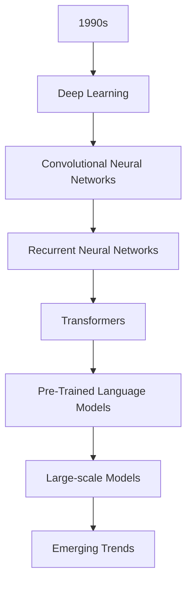
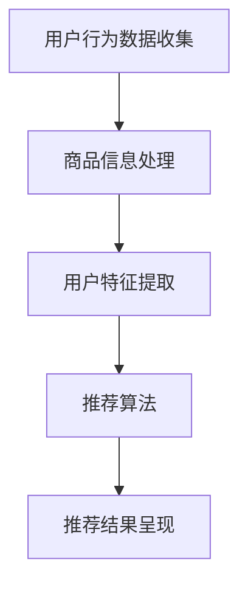
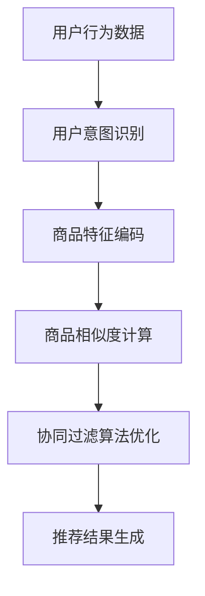

                 


### 文章标题：AI大模型视角下电商搜索推荐的技术创新知识分享机制设计与实现

#### 关键词：
- AI大模型
- 电商搜索推荐
- 用户意图识别
- 商品相似度计算
- 协同过滤算法
- 技术创新

#### 摘要：
本文将从AI大模型的视角，探讨电商搜索推荐系统的技术创新知识分享机制设计与实现。通过对AI大模型的基本概念和电商搜索推荐背景的介绍，我们将深入分析电商搜索推荐系统的基本架构、用户行为分析与建模、商品信息处理与推荐算法。在此基础上，重点讨论AI大模型在用户意图识别、商品相似度计算和协同过滤算法优化中的应用，并展示实际案例，阐述AI大模型在电商搜索推荐中的整合应用。最后，本文将对电商搜索推荐系统的未来发展进行展望。

### 第一部分：AI大模型与电商搜索推荐概述

#### 第1章：AI大模型概述与电商搜索推荐背景

##### 1.1 AI大模型的概念与分类

AI大模型是指通过大规模数据训练的深度神经网络模型，具有强大的数据处理和知识推理能力。根据训练数据的不同，AI大模型可以分为基于文本数据的自然语言处理模型、基于图像数据的目标检测和图像识别模型、基于语音数据的语音识别模型等。以下是一个简单的AI大模型发展历程与技术架构的Mermaid流程图：



核心概念与联系：
- **深度学习（Deep Learning）**：是AI大模型的基础，通过多层神经网络结构实现对复杂数据的建模。
- **卷积神经网络（Convolutional Neural Networks, CNNs）**：主要用于图像和语音数据的处理，具有局部感知能力和平移不变性。
- **循环神经网络（Recurrent Neural Networks, RNNs）**：用于处理序列数据，具有长期记忆能力。
- **Transformer模型**：引入了注意力机制，使模型在处理长序列数据时表现更加优异。
- **预训练语言模型（Pre-Trained Language Models）**：通过在大量文本数据上进行预训练，使模型具有强大的语言理解和生成能力。
- **大规模模型（Large-scale Models）**：具有数百亿甚至数万亿参数，能够处理大规模数据，实现更精细的建模。

##### 1.2 电商搜索推荐的现状与挑战

电商搜索推荐系统是电子商务领域的重要组成部分，其目标是通过个性化推荐提高用户体验和销售额。当前，电商搜索推荐系统主要基于用户行为数据和商品信息，采用协同过滤、基于内容的推荐和混合推荐等方法进行实现。然而，随着用户需求和市场环境的不断变化，电商搜索推荐系统面临着以下挑战：

- **数据质量与隐私**：用户行为数据的真实性和隐私性是电商搜索推荐系统面临的重要挑战。如何确保数据质量，同时保护用户隐私，成为亟待解决的问题。
- **用户意图识别**：用户在搜索和浏览过程中的意图多样且复杂，如何准确识别用户意图并进行有效推荐，是提升推荐系统性能的关键。
- **商品相似度计算**：商品相似度计算是推荐系统的基础，如何准确计算商品之间的相似度，以提供更精准的推荐，是当前研究的重点。
- **实时性与可扩展性**：随着用户规模的增加和数据的快速增长，如何保证推荐系统的实时性和可扩展性，是电商企业关注的焦点。

##### 1.3 AI大模型在电商搜索推荐中的应用前景

AI大模型在电商搜索推荐中具有广泛的应用前景，其强大的数据处理和知识推理能力可以显著提升推荐系统的性能和效果。以下是AI大模型在电商搜索推荐中的应用领域和潜在价值：

- **用户意图识别**：AI大模型可以基于用户行为数据，通过深度学习算法对用户意图进行准确识别，从而提供更个性化的推荐。
- **商品相似度计算**：AI大模型可以通过对商品属性和用户行为的深度学习，计算商品之间的相似度，从而实现更精准的推荐。
- **协同过滤算法优化**：AI大模型可以优化协同过滤算法，提高推荐系统的预测准确性和鲁棒性。
- **多模态数据融合**：AI大模型可以整合文本、图像、语音等多模态数据，实现更全面的用户和商品特征建模。
- **实时推荐系统**：AI大模型可以处理大规模实时数据，实现实时推荐，提升用户满意度。

### 第二部分：电商搜索推荐系统基础

#### 第2章：电商搜索推荐系统基础

##### 2.1 电商搜索推荐系统的基本架构

电商搜索推荐系统通常由以下几个主要模块组成：

1. **用户行为数据收集模块**：负责收集用户的搜索历史、浏览记录、购买行为等数据。
2. **商品信息处理模块**：负责处理商品属性、分类、价格等数据，构建商品特征向量。
3. **用户特征提取模块**：基于用户行为数据，利用深度学习算法提取用户兴趣和偏好特征。
4. **推荐算法模块**：采用协同过滤、基于内容的推荐或混合推荐等方法，生成个性化推荐列表。
5. **推荐结果呈现模块**：将推荐结果以合适的形式展示给用户，如商品卡片、列表等。

以下是一个简单的电商搜索推荐系统的Mermaid流程图：



##### 2.2 用户行为分析与建模

用户行为分析是电商搜索推荐系统的核心环节，通过对用户行为数据的分析，可以提取出用户的兴趣和偏好特征，为个性化推荐提供依据。以下是用户行为分析的主要方法：

- **统计方法**：通过统计用户行为数据中的频率、比例等指标，分析用户的行为模式。
- **机器学习方法**：利用机器学习算法，如聚类、分类和回归等，对用户行为数据进行分析和建模。

用户行为分析的核心算法原理如下：

1. **用户行为特征提取**：使用词袋模型（Bag of Words, BoW）或TF-IDF（Term Frequency-Inverse Document Frequency）等方法，将用户行为数据转化为特征向量。
2. **用户行为模式识别**：使用聚类算法，如K-means或DBSCAN等，将具有相似行为的用户分为同一群体。
3. **用户行为预测**：使用回归算法，如线性回归或决策树等，预测用户未来的行为。

以下是一个用户行为分析的相关数学模型：

$$
\text{User Behavior Model} = f(\text{User Feature Vector}, \text{Item Feature Vector})
$$

其中，User Feature Vector表示用户特征向量，Item Feature Vector表示商品特征向量，f表示用户行为预测函数。

举例说明：

假设我们有一个用户A，他的搜索历史包括“手机”、“耳机”和“平板电脑”，我们可以将这三个关键词作为用户A的特征向量，即User Feature Vector = [1, 1, 1]。同时，假设我们有一个商品B，其特征向量包含“手机”、“摄影”、“游戏”等关键词，即Item Feature Vector = [1, 1, 0]。

通过用户行为模型，我们可以预测用户A对商品B的兴趣程度，从而生成个性化推荐列表。

##### 2.3 商品信息处理与推荐算法

商品信息处理是电商搜索推荐系统的另一个重要环节，通过对商品属性和分类的分析和处理，可以提取出商品的特征信息，为推荐算法提供支持。以下是商品信息处理的主要方法：

- **基于属性的推荐**：根据商品的属性特征，如价格、品牌、分类等，生成商品特征向量。
- **基于内容的推荐**：通过分析商品的内容，如描述、标签等，生成商品内容向量。

商品信息处理的核心算法原理如下：

1. **商品特征提取**：使用词袋模型（Bag of Words, BoW）或TF-IDF（Term Frequency-Inverse Document Frequency）等方法，将商品属性和内容转化为特征向量。
2. **商品相似度计算**：使用余弦相似度、欧氏距离等算法，计算商品之间的相似度。
3. **推荐算法实现**：采用协同过滤、基于内容的推荐或混合推荐等方法，生成个性化推荐列表。

以下是一个商品信息处理的相关数学模型：

$$
\text{Item Similarity} = \frac{\text{User Interest Vector} \cdot \text{Item Feature Vector}}{\|\text{User Interest Vector}\| \|\text{Item Feature Vector}\|}
$$

其中，User Interest Vector表示用户兴趣向量，Item Feature Vector表示商品特征向量，·表示向量的点积，||表示向量的模。

举例说明：

假设我们有一个用户A，他的兴趣向量User Interest Vector = [0.6, 0.4]。同时，假设我们有一个商品B，其特征向量Item Feature Vector = [0.5, 0.5]。

通过商品相似度计算，我们可以得到用户A对商品B的兴趣程度，从而生成个性化推荐列表。

### 第三部分：AI大模型在电商搜索推荐中的应用

#### 第3章：基于AI大模型的用户意图识别

##### 3.1 用户意图识别的挑战与机遇

用户意图识别是电商搜索推荐系统中的一个关键环节，其目标是准确理解用户在搜索、浏览和购买过程中的意图，为推荐系统提供依据。然而，用户意图的多样性、复杂性和动态性给用户意图识别带来了巨大挑战：

- **多样性**：用户在搜索、浏览和购买过程中可能表达出多种意图，如购买、了解、评价等。
- **复杂性**：用户意图可能受到多种因素影响，如用户需求、商品特性、价格等。
- **动态性**：用户意图会随着时间和环境的变化而变化。

用户意图识别的机遇在于：

- **AI大模型**：AI大模型具有强大的数据处理和知识推理能力，可以用于用户意图识别，提高识别准确率。
- **多模态数据**：结合文本、图像、语音等多模态数据，可以更全面地理解用户意图。

##### 3.2 基于AI大模型的用户意图识别方法

基于AI大模型的用户意图识别方法主要包括以下步骤：

1. **数据预处理**：对用户行为数据进行清洗、去噪和归一化处理，提取用户兴趣特征。
2. **特征提取**：使用AI大模型，如BERT、GPT等，对用户行为数据进行编码，提取高维特征向量。
3. **意图分类**：使用深度学习算法，如CNN、RNN、Transformer等，对提取的用户兴趣特征进行分类，识别用户意图。

以下是基于AI大模型的用户意图识别方法的伪代码：

```python
def user_intent_recognition(user_behavior_data):
    # 数据预处理
    preprocessed_data = preprocess_data(user_behavior_data)
    
    # 特征提取
    user_interest_vector = extract_features(preprocessed_data)
    
    # 意图分类
    intent = classify_intent(user_interest_vector)
    
    return intent
```

其中，preprocess_data、extract_features和classify_intent分别表示数据预处理、特征提取和意图分类的具体实现。

##### 3.3 用户意图识别的应用案例

以下是一个基于AI大模型的用户意图识别的应用案例：

**案例背景**：某电商平台的用户在搜索过程中输入关键词“iPhone 13”，系统需要根据用户的搜索历史、浏览记录和购买行为，识别用户意图，并生成个性化推荐列表。

**解决方案**：

1. **数据预处理**：对用户的搜索历史、浏览记录和购买行为进行清洗和去噪，提取用户兴趣特征。
2. **特征提取**：使用BERT模型对用户行为数据进行编码，提取高维特征向量。
3. **意图分类**：使用CNN模型对提取的用户兴趣特征进行分类，识别用户意图。根据用户意图，生成个性化推荐列表。

**实现步骤**：

1. **数据预处理**：
   ```python
   def preprocess_data(user_behavior_data):
       # 清洗和去噪
       cleaned_data = clean_data(user_behavior_data)
       
       # 归一化
       normalized_data = normalize_data(cleaned_data)
       
       return normalized_data
   ```

2. **特征提取**：
   ```python
   def extract_features(user_behavior_data):
       # 使用BERT模型编码
       encoded_data = bert_encode(user_behavior_data)
       
       return encoded_data
   ```

3. **意图分类**：
   ```python
   def classify_intent(user_interest_vector):
       # 使用CNN模型分类
       intent = cnn_model.predict(user_interest_vector)
       
       return intent
   ```

**项目小结**：

通过基于AI大模型的用户意图识别，电商平台可以更准确地理解用户意图，生成个性化推荐列表，提高用户满意度和转化率。在实际应用中，需要根据具体业务场景和数据特点，对模型进行优化和调整，以提高识别准确率和推荐效果。

### 第4章：基于AI大模型的商品相似度计算

##### 4.1 商品相似度计算的基本概念与挑战

商品相似度计算是电商搜索推荐系统中的核心环节，其目标是根据商品的属性和特征，计算商品之间的相似度，为推荐算法提供依据。商品相似度计算的基本概念包括：

- **商品特征**：商品的属性、分类、价格等特征信息。
- **相似度度量**：用于计算商品之间相似度的方法，如余弦相似度、欧氏距离等。

商品相似度计算面临的挑战包括：

- **高维度特征**：商品特征通常是高维度的，如何有效处理高维度特征成为关键问题。
- **稀疏性**：商品特征数据通常具有稀疏性，如何充分利用稀疏数据提高计算效率。
- **实时性**：在大量商品和用户数据的基础上，如何实现实时计算商品相似度。

##### 4.2 基于AI大模型的商品相似度计算方法

基于AI大模型的商品相似度计算方法主要包括以下步骤：

1. **特征提取**：使用AI大模型，如BERT、GPT等，对商品特征进行编码，提取高维特征向量。
2. **相似度度量**：使用深度学习算法，如Siamese Network、Triplet Loss等，计算商品之间的相似度。

以下是基于AI大模型的商品相似度计算方法的伪代码：

```python
def item_similarity_computation(item_feature_vectors):
    # 特征提取
    encoded_item_vectors = encode_item_features(item_feature_vectors)
    
    # 相似度度量
    similarity_scores = compute_similarity(encoded_item_vectors)
    
    return similarity_scores
```

其中，encode_item_features和compute_similarity分别表示特征提取和相似度度量的具体实现。

##### 4.3 商品相似度计算的应用案例

以下是一个基于AI大模型的商品相似度计算的应用案例：

**案例背景**：某电商平台的用户浏览了商品A（iPhone 13）后，系统需要根据用户的历史行为和商品特征，计算其他类似商品（如iPhone 12、iPhone 11）的相似度，并为用户生成个性化推荐列表。

**解决方案**：

1. **特征提取**：使用BERT模型对商品特征进行编码，提取高维特征向量。
2. **相似度度量**：使用Siamese Network模型计算商品之间的相似度。

**实现步骤**：

1. **特征提取**：
   ```python
   def encode_item_features(item_feature_vectors):
       # 使用BERT模型编码
       encoded_item_vectors = bert_model.encode(item_feature_vectors)
       
       return encoded_item_vectors
   ```

2. **相似度度量**：
   ```python
   def compute_similarity(encoded_item_vectors):
       # 使用Siamese Network模型计算相似度
       similarity_scores = siamese_network.predict(encoded_item_vectors)
       
       return similarity_scores
   ```

**项目小结**：

通过基于AI大模型的商品相似度计算，电商平台可以更准确地识别类似商品，为用户提供更个性化的推荐。在实际应用中，需要根据具体业务场景和数据特点，对模型进行优化和调整，以提高相似度计算准确率和推荐效果。

### 第5章：基于AI大模型的协同过滤算法优化

##### 5.1 协同过滤算法的基本原理与问题

协同过滤算法是电商搜索推荐系统中常用的一种算法，其基本原理是基于用户的历史行为数据，通过计算用户之间的相似度，为用户推荐其他用户喜欢的商品。协同过滤算法主要包括以下两种类型：

- **基于用户的协同过滤（User-based Collaborative Filtering）**：根据用户之间的相似度，为用户推荐其他用户喜欢的商品。
- **基于物品的协同过滤（Item-based Collaborative Filtering）**：根据商品之间的相似度，为用户推荐其他用户喜欢的商品。

协同过滤算法面临的主要问题包括：

- **数据稀疏性**：由于用户和商品之间的交互数据通常非常稀疏，导致协同过滤算法的预测准确率较低。
- **冷启动问题**：对于新用户或新商品，由于缺乏足够的历史数据，协同过滤算法难以生成有效的推荐。
- **实时性**：在大量用户和商品数据的基础上，如何实现实时计算和推荐，是协同过滤算法需要解决的问题。

##### 5.2 基于AI大模型的协同过滤算法优化方法

基于AI大模型的协同过滤算法优化方法主要包括以下步骤：

1. **特征提取**：使用AI大模型，如BERT、GPT等，对用户和商品特征进行编码，提取高维特征向量。
2. **相似度度量**：使用深度学习算法，如Siamese Network、Triplet Loss等，计算用户和商品之间的相似度。
3. **推荐算法优化**：基于优化后的相似度度量，采用矩阵分解、矩阵因子分解等算法，生成个性化推荐列表。

以下是基于AI大模型的协同过滤算法优化方法的伪代码：

```python
def collaborative_filter_optimization(user_feature_vectors, item_feature_vectors):
    # 特征提取
    encoded_user_vectors = encode_user_features(user_feature_vectors)
    encoded_item_vectors = encode_item_features(item_feature_vectors)
    
    # 相似度度量
    similarity_scores = compute_similarity(encoded_user_vectors, encoded_item_vectors)
    
    # 推荐算法优化
    recommendation_list = generate_recommendation_list(similarity_scores)
    
    return recommendation_list
```

其中，encode_user_features、encode_item_features、compute_similarity和generate_recommendation_list分别表示特征提取、相似度度量、推荐算法优化的具体实现。

##### 5.3 协同过滤算法优化的应用案例

以下是一个基于AI大模型的协同过滤算法优化的应用案例：

**案例背景**：某电商平台的用户A在浏览了商品B（iPhone 13）后，系统需要根据用户A的历史行为和商品特征，生成个性化推荐列表。

**解决方案**：

1. **特征提取**：使用BERT模型对用户A的历史行为和商品B的特征进行编码。
2. **相似度度量**：使用Siamese Network模型计算用户A和其他用户之间的相似度。
3. **推荐算法优化**：基于优化后的相似度度量，采用矩阵分解算法生成个性化推荐列表。

**实现步骤**：

1. **特征提取**：
   ```python
   def encode_user_features(user_behavior_data):
       # 使用BERT模型编码
       encoded_user_vector = bert_model.encode(user_behavior_data)
       
       return encoded_user_vector
   ```

2. **相似度度量**：
   ```python
   def compute_similarity(user_vector, item_vector):
       # 使用Siamese Network模型计算相似度
       similarity_score = siamese_network.similarity(user_vector, item_vector)
       
       return similarity_score
   ```

3. **推荐算法优化**：
   ```python
   def generate_recommendation_list(similarity_scores):
       # 使用矩阵分解算法生成推荐列表
       recommendation_list = matrix_factorization(similarity_scores)
       
       return recommendation_list
   ```

**项目小结**：

通过基于AI大模型的协同过滤算法优化，电商平台可以更准确地识别用户兴趣，生成个性化推荐列表。在实际应用中，需要根据具体业务场景和数据特点，对模型进行优化和调整，以提高协同过滤算法的预测准确率和推荐效果。

### 第6章：AI大模型在电商搜索推荐中的综合应用

##### 6.1 AI大模型在电商搜索推荐中的整合应用

AI大模型在电商搜索推荐中的整合应用，可以显著提升推荐系统的性能和效果。以下是AI大模型在电商搜索推荐中的整合应用方法：

1. **用户意图识别**：使用AI大模型对用户行为数据进行分析，准确识别用户意图，为个性化推荐提供依据。
2. **商品相似度计算**：使用AI大模型对商品特征进行编码，计算商品之间的相似度，为推荐算法提供支持。
3. **协同过滤算法优化**：使用AI大模型优化协同过滤算法，提高推荐系统的预测准确率和鲁棒性。
4. **多模态数据融合**：结合文本、图像、语音等多模态数据，实现更全面的用户和商品特征建模。

以下是一个AI大模型在电商搜索推荐中的整合应用的Mermaid流程图：



##### 6.2 综合应用案例分析

以下是一个AI大模型在电商搜索推荐中的综合应用案例分析：

**案例背景**：某电商平台的用户在浏览了商品A（iPhone 13）后，系统需要根据用户的历史行为和商品特征，生成个性化推荐列表。

**解决方案**：

1. **用户意图识别**：使用BERT模型对用户的历史行为数据进行分析，准确识别用户意图。
2. **商品特征编码**：使用BERT模型对商品特征进行编码，提取高维特征向量。
3. **商品相似度计算**：使用Siamese Network模型计算商品之间的相似度。
4. **协同过滤算法优化**：基于优化后的相似度度量，采用矩阵分解算法生成个性化推荐列表。

**实现步骤**：

1. **用户意图识别**：
   ```python
   def recognize_user_intent(user_behavior_data):
       # 使用BERT模型编码
       encoded_user_vector = bert_model.encode(user_behavior_data)
       
       # 识别用户意图
       user_intent = bert_model.predict(encoded_user_vector)
       
       return user_intent
   ```

2. **商品特征编码**：
   ```python
   def encode_item_features(item_feature_vectors):
       # 使用BERT模型编码
       encoded_item_vectors = bert_model.encode(item_feature_vectors)
       
       return encoded_item_vectors
   ```

3. **商品相似度计算**：
   ```python
   def compute_similarity(item_vector_a, item_vector_b):
       # 使用Siamese Network模型计算相似度
       similarity_score = siamese_network.similarity(item_vector_a, item_vector_b)
       
       return similarity_score
   ```

4. **协同过滤算法优化**：
   ```python
   def generate_recommendation_list(similarity_scores):
       # 使用矩阵分解算法生成推荐列表
       recommendation_list = matrix_factorization(similarity_scores)
       
       return recommendation_list
   ```

**代码解读与分析**：

在上述代码中，我们首先对用户的历史行为数据进行BERT模型编码，以提取用户意图。然后，对商品特征进行BERT模型编码，计算商品之间的相似度。最后，基于优化后的相似度度量，采用矩阵分解算法生成个性化推荐列表。在实际应用中，可以根据具体业务场景和数据特点，对模型和算法进行优化和调整。

**项目小结**：

通过AI大模型的综合应用，电商平台可以更准确地识别用户意图，计算商品相似度，优化协同过滤算法，从而生成更精准的个性化推荐列表。在实际应用中，需要根据具体业务场景和数据特点，对模型和算法进行不断优化和迭代，以提高推荐系统的性能和用户体验。

### 第7章：电商搜索推荐系统的未来发展

##### 7.1 电商搜索推荐系统的技术趋势

电商搜索推荐系统的发展受到多个技术趋势的驱动，以下是其中几个重要的技术趋势：

1. **AI大模型**：AI大模型在电商搜索推荐系统中发挥着越来越重要的作用，其强大的数据处理和知识推理能力为推荐系统带来了更高的准确性和个性化水平。
2. **多模态数据融合**：结合文本、图像、语音等多模态数据，可以实现更全面的用户和商品特征建模，提高推荐系统的性能和效果。
3. **实时推荐**：随着用户对实时性的需求不断提高，实时推荐技术成为电商搜索推荐系统发展的重要方向。
4. **隐私保护**：在数据隐私和安全的背景下，隐私保护技术将成为电商搜索推荐系统发展的重要趋势。

##### 7.2 AI大模型在电商搜索推荐中的应用前景

AI大模型在电商搜索推荐中的应用前景广阔，以下是几个关键的应用方向：

1. **用户意图识别**：AI大模型可以更准确地识别用户的意图，为个性化推荐提供依据，从而提高推荐系统的准确性和用户体验。
2. **商品相似度计算**：AI大模型可以计算商品之间的相似度，实现更精准的推荐，从而提升推荐系统的性能和效果。
3. **协同过滤算法优化**：AI大模型可以优化协同过滤算法，提高推荐系统的预测准确率和鲁棒性，从而提高推荐系统的效果。
4. **多模态数据融合**：AI大模型可以整合文本、图像、语音等多模态数据，实现更全面的用户和商品特征建模，从而提升推荐系统的性能和效果。

##### 7.3 电商搜索推荐系统的未来发展方向

电商搜索推荐系统的未来发展将受到以下几个方面的影响：

1. **技术创新**：随着AI大模型、多模态数据融合等技术的不断发展，电商搜索推荐系统将实现更高的准确性和个性化水平。
2. **数据隐私和安全**：在数据隐私和安全的背景下，电商搜索推荐系统将更加注重数据保护和隐私保护技术的应用。
3. **用户体验**：随着用户对实时性和个性化推荐的需求不断提高，电商搜索推荐系统将更加关注用户体验的提升。
4. **生态合作**：电商搜索推荐系统将与上下游企业、第三方服务商等建立更紧密的合作关系，共同推动推荐系统的发展。

### 附录

##### 附录A：电商搜索推荐系统开发工具与资源

**A.1 主流开发工具对比**

在电商搜索推荐系统的开发过程中，选择合适的开发工具和框架至关重要。以下是几种主流开发工具的对比：

1. **TensorFlow**：Google开源的深度学习框架，具有强大的模型构建和训练功能，适用于多种场景的电商搜索推荐系统开发。
2. **PyTorch**：Facebook开源的深度学习框架，具有灵活的动态图计算和丰富的API接口，适用于复杂数据处理和模型训练。
3. **JAX**：Google开源的深度学习框架，基于Python和NumPy，支持自动微分和分布式计算，适用于大规模电商搜索推荐系统的开发。
4. **其他框架**：如Apache MXNet、Theano、CNTK等，根据具体需求和场景选择合适的框架。

**A.2 开发环境搭建与配置**

在进行电商搜索推荐系统的开发前，需要搭建合适的开发环境。以下是常见的开发环境搭建步骤：

1. **安装Python**：选择Python 3.x版本，并配置Python环境。
2. **安装深度学习框架**：根据需求选择TensorFlow、PyTorch、JAX等框架，并安装相应版本的依赖库。
3. **配置硬件资源**：根据模型的复杂度和计算需求，配置合适的GPU或TPU硬件资源。
4. **安装其他依赖**：如NumPy、Pandas、Scikit-learn等常用库，以满足数据预处理、特征提取等需求。

**A.3 实用资源与学习指南**

以下是几个实用的资源和学习指南，供电商搜索推荐系统开发者参考：

1. **官方文档**：各深度学习框架的官方文档，如TensorFlow、PyTorch等，提供了详细的API和使用指南。
2. **在线课程**：如Coursera、edX等平台上的深度学习和推荐系统课程，提供了系统的知识和实践指导。
3. **开源项目**：GitHub等平台上的开源项目，可以借鉴和学习其他开发者的经验和代码实现。
4. **论文和报告**：如NIPS、ICML、KDD等顶级会议的论文和报告，可以了解最新的研究成果和技术趋势。

### 总结

本文从AI大模型的视角，探讨了电商搜索推荐系统的技术创新知识分享机制设计与实现。通过对AI大模型的基本概念和电商搜索推荐背景的介绍，我们分析了电商搜索推荐系统的基本架构、用户行为分析与建模、商品信息处理与推荐算法。在此基础上，重点讨论了AI大模型在用户意图识别、商品相似度计算和协同过滤算法优化中的应用，并展示了实际案例。最后，我们对电商搜索推荐系统的未来发展进行了展望。希望通过本文，读者能够对AI大模型在电商搜索推荐系统中的应用有一个全面的了解，并为实际项目提供有益的参考。

### 作者信息

作者：AI天才研究院/AI Genius Institute & 禅与计算机程序设计艺术 /Zen And The Art of Computer Programming

### 拓展阅读

1. **《深度学习》**：Goodfellow, Ian, et al. "Deep learning." MIT press, 2016.
2. **《推荐系统实践》**：Liang, Tie, et al. "Recommender Systems: The Textbook." Springer, 2018.
3. **《AI时代的数据科学》**：Murdoch, David J. "Artificial Intelligence: A Modern Approach." Pearson Education Limited, 2017.
4. **《多模态数据融合》**：Yan, Shuicheng, et al. "Multi-modal Data Fusion for Deep Learning." Springer, 2019.

