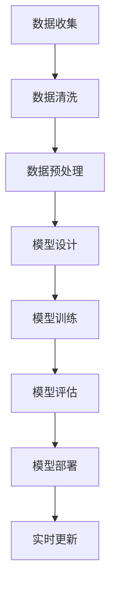
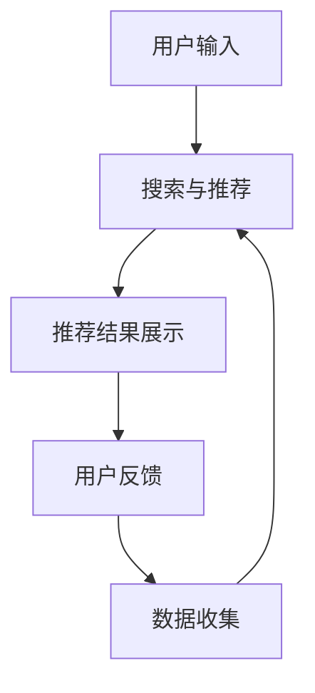

                 


### 引言

在数字时代，电子商务已成为全球商业活动的重要驱动力。随着用户数量的激增和电商平台的多样化，如何提升用户体验和销售额成为电商企业关注的焦点。其中，搜索推荐系统在电商运营中扮演着至关重要的角色。通过精准的搜索推荐，电商企业不仅能够满足用户个性化需求，还能有效提高销售额和用户留存率。

然而，传统的搜索推荐系统在面对海量数据、复杂用户行为和多样化商品信息时，往往显得力不从心。随着人工智能技术的迅猛发展，特别是大规模预训练模型（Large-scale Pre-trained Models）的出现，AI大模型为电商搜索推荐系统的技术革新提供了新的可能。本文将围绕AI大模型视角下电商搜索推荐的技术创新、知识库管理流程优化及其实践应用进行深入探讨。

本文首先概述了AI大模型和电商搜索推荐系统的基本概念，探讨了二者结合的背景和潜在应用。接着，本文详细介绍了AI大模型的技术基础，包括深度学习、自然语言处理和大规模预训练模型等。随后，文章分析了电商搜索推荐系统的核心算法，如协同过滤算法、基于内容的推荐算法和图神经网络推荐算法。在案例分析部分，本文以真实场景为例，展示了AI大模型与电商搜索推荐系统结合的实际效果。

接下来，本文重点讨论了知识库管理流程优化，包括知识库构建与更新策略、知识库质量评估等。此外，文章还详细分析了电商搜索推荐系统流程优化的目标与方法，并通过实际案例展示了流程优化实施与效果评估。在实践应用部分，本文探讨了AI大模型在电商搜索推荐中的具体应用场景，提供了详细的实践应用案例分析。

最后，本文总结了AI大模型在电商搜索推荐系统中的未来发展方向，包括创新应用、知识库管理流程优化与系统性能提升等。通过本文的探讨，希望为电商企业及相关领域的研究人员提供有价值的参考，助力其在AI大模型时代的数字化转型。

### 文章标题：《AI大模型视角下电商搜索推荐的技术创新知识库管理流程优化与应用实践》

#### 关键词：

- AI大模型
- 电商搜索推荐
- 知识库管理
- 技术创新
- 流程优化
- 实践应用

#### 摘要：

本文从AI大模型的角度出发，探讨了其在电商搜索推荐领域的应用及其对知识库管理流程的优化。文章首先介绍了AI大模型的基本概念和电商搜索推荐系统的现状与发展趋势，随后深入解析了深度学习、自然语言处理等AI大模型相关技术。接着，文章分析了电商搜索推荐系统的核心算法，包括协同过滤、基于内容推荐和图神经网络推荐。通过案例分析，本文展示了AI大模型与电商搜索推荐系统的结合效果。随后，文章详细探讨了知识库管理流程优化，包括知识库构建与更新策略及质量评估。在电商搜索推荐系统流程优化部分，本文提出了优化目标和具体方法，并通过实际案例展示了优化效果。最后，文章展望了AI大模型在电商搜索推荐领域的未来发展方向，为相关研究和实践提供了参考。

### 第一部分：AI大模型与电商搜索推荐基础

#### 第1章：AI大模型概述与电商搜索推荐背景

在当今数字化商业环境中，AI大模型已经成为推动企业创新和业务增长的重要技术手段。AI大模型，又称大型预训练模型，是基于海量数据通过深度学习技术训练出的复杂模型。这些模型具有强大的特征提取和知识表示能力，可以应用于自然语言处理、计算机视觉、语音识别等多个领域。随着AI大模型技术的发展，其在电商搜索推荐系统中的应用前景愈发广阔。

1.1 AI大模型的基本概念

AI大模型通常是指那些经过大规模数据集训练的神经网络模型，这些模型具备处理海量信息的能力，能够自动学习和理解数据中的模式和规律。AI大模型的发展经历了多个阶段，从早期的统计模型到深度学习模型，再到当前的大规模预训练模型。大规模预训练模型通过在海量数据上进行预训练，可以提取出高度抽象和通用的特征表示，从而在多个任务上表现出色。

AI大模型的核心技术包括深度学习、神经网络和大规模预训练。深度学习是一种基于多层神经网络的结构，通过逐层提取特征，实现对复杂数据的建模和预测。神经网络则是构成深度学习模型的基本单元，每个神经元都通过权重和偏置与其它神经元相连，形成复杂的网络结构。大规模预训练是指通过大规模数据集对神经网络模型进行训练，使其具备强大的特征提取和知识表示能力。

1.2 电商搜索推荐系统的现状与发展趋势

电商搜索推荐系统是电商平台的核心功能之一，通过向用户提供个性化的商品推荐，提高用户的购物体验和平台的销售额。传统的电商搜索推荐系统主要采用协同过滤、基于内容和基于算法等算法，但面对日益复杂的用户行为和海量的商品信息，这些方法往往无法满足需求。

当前，电商搜索推荐系统正朝着智能化和个性化方向不断发展。AI大模型的应用，使得电商搜索推荐系统可以更好地理解和预测用户需求，提供更精准的推荐结果。随着AI大模型技术的进步，电商搜索推荐系统在用户体验、推荐效果和系统性能等方面得到了显著提升。

1.3 AI大模型在电商搜索推荐中的应用潜力

AI大模型在电商搜索推荐中的应用潜力主要体现在以下几个方面：

1. **用户行为分析**：通过分析用户的历史行为数据，AI大模型可以识别用户的兴趣和行为模式，为用户提供个性化的商品推荐。

2. **商品特征提取**：AI大模型可以通过深度学习技术，提取商品的多维度特征，从而实现更精准的商品分类和推荐。

3. **跨平台推荐**：AI大模型可以在多个电商平台之间实现跨平台推荐，提高用户的购物便利性和平台的曝光率。

4. **实时推荐**：通过实时分析用户的在线行为和系统反馈，AI大模型可以提供即时且精准的推荐，提高用户的满意度和购买转化率。

5. **智能化客服**：AI大模型还可以应用于智能化客服系统，通过自然语言处理技术，提供更加自然和高效的客户服务。

总之，AI大模型在电商搜索推荐系统中具有巨大的应用潜力，能够为电商平台带来更高的用户满意度、更高的销售额和更优的业务绩效。随着AI大模型技术的不断成熟，其在电商搜索推荐领域的应用将更加广泛和深入。

#### 第2章：AI大模型技术基础

为了深入理解AI大模型在电商搜索推荐系统中的应用，我们需要首先掌握AI大模型的技术基础。这一章节将介绍深度学习与神经网络基础、自然语言处理技术概览以及大规模预训练模型原理。

2.1 深度学习与神经网络基础

深度学习是AI大模型的核心技术之一，其基于多层神经网络的结构，能够通过逐层提取数据中的特征，实现对复杂问题的建模和预测。神经网络则是由多个神经元（或称为节点）组成的网络结构，每个神经元通过权重和偏置与其他神经元相连，形成复杂的网络模型。

**神经元工作原理：**
每个神经元接收多个输入信号，并通过一个非线性激活函数（如Sigmoid、ReLU等）进行处理，最终输出一个值。神经元的输出不仅取决于其输入信号的大小，还取决于每个输入信号的权重。通过反向传播算法，神经网络能够自动调整这些权重，以最小化预测误差。

**深度学习网络结构：**
深度学习网络通常由多个隐藏层组成，每个隐藏层负责提取数据的不同层次特征。网络中的每个神经元都可以看作是一个非线性变换器，通过层层递进，逐步将原始数据转换为高层次的抽象表示。

**反向传播算法：**
反向传播算法是深度学习训练的核心机制。它通过计算输出误差，并反向传播这些误差，调整网络中的权重和偏置，从而优化模型参数。这个过程不断重复，直到网络能够准确预测目标输出。

2.2 自然语言处理技术概览

自然语言处理（Natural Language Processing，NLP）是AI大模型在文本领域的重要应用。NLP旨在使计算机能够理解和处理人类语言，涉及文本的分词、词性标注、实体识别、情感分析等多个方面。

**文本分词：**
文本分词是将连续的文本序列切分成一个个有意义的词汇单元。这一步骤是NLP的基础，对于后续的文本处理和分析至关重要。

**词性标注：**
词性标注是对文本中的每个词进行词性分类，如名词、动词、形容词等。词性标注有助于理解文本中的语法结构和语义关系。

**实体识别：**
实体识别是从文本中识别出特定类型的实体，如人名、地名、组织名等。实体识别对于信息抽取、知识图谱构建等任务具有重要意义。

**情感分析：**
情感分析是判断文本中所表达的情感倾向，如正面、负面或中性。情感分析在电商评价、社交媒体监控等领域有着广泛的应用。

2.3 大规模预训练模型原理

大规模预训练模型是AI大模型的一种重要形式，通过在海量数据上进行预训练，提取出高度抽象和通用的特征表示。大规模预训练模型的典型代表包括GPT、BERT等。

**预训练过程：**
预训练过程通常分为两个阶段：第一阶段是预训练，通过在大规模数据集上训练，模型学习到文本的通用特征表示；第二阶段是微调，将预训练模型应用于具体任务，通过少量有标签数据进一步优化模型参数。

**通用特征表示：**
大规模预训练模型通过预训练阶段，能够提取出文本的通用特征表示。这些特征表示不仅适用于语言理解任务，还可以用于文本生成、机器翻译等其它自然语言处理任务。

**任务特定微调：**
在预训练基础上，通过微调模型，使其适用于特定任务。微调过程中，模型会根据任务需求调整权重和偏置，从而优化模型在特定任务上的性能。

通过掌握深度学习与神经网络基础、自然语言处理技术概览以及大规模预训练模型原理，我们可以更好地理解AI大模型的工作机制和应用潜力。在接下来的章节中，我们将进一步探讨AI大模型在电商搜索推荐系统中的应用，以及如何通过技术创新优化知识库管理流程。

#### 第3章：电商搜索推荐系统核心算法

电商搜索推荐系统在电商平台的运营中扮演着至关重要的角色，通过为用户提供个性化的商品推荐，不仅能够提高用户的购物体验，还能有效提升平台的销售额和用户留存率。在众多推荐算法中，协同过滤算法、基于内容的推荐算法和图神经网络推荐算法是三种主要的核心算法。本章将分别介绍这些算法的基本原理、优缺点和适用场景。

3.1 协同过滤算法

协同过滤（Collaborative Filtering）是一种常用的推荐算法，通过分析用户之间的行为模式，预测用户对未知商品的评分或兴趣。协同过滤算法可以分为两种类型：基于用户的协同过滤和基于项目的协同过滤。

**基本原理：**

- **基于用户的协同过滤**：找到与目标用户兴趣相似的其他用户，推荐这些用户喜欢的商品。
- **基于项目的协同过滤**：找到与目标用户已评价的商品相似的其他商品，推荐这些商品。

**优缺点：**

- **优点**：协同过滤算法基于用户行为数据，能够发现用户之间的相似性，提供个性化的推荐。
- **缺点**：当用户评价数据不足或新用户加入时，协同过滤效果会受到影响；此外，协同过滤算法容易导致数据偏差和冷启动问题。

**适用场景：**协同过滤算法适用于用户行为数据丰富的情况，如成熟的电商平台。

3.2 基于内容的推荐算法

基于内容的推荐（Content-based Filtering）算法通过分析用户对商品的兴趣和偏好，将相似的内容推荐给用户。这种算法通常依赖于商品的描述、标签、属性等特征。

**基本原理：**

- **特征提取**：从商品描述、标签等中提取特征向量。
- **兴趣模型构建**：通过用户的过去行为或显式反馈（如购买历史、评价等），构建用户的兴趣模型。
- **相似度计算**：计算商品特征向量与用户兴趣模型之间的相似度，推荐相似度高的商品。

**优缺点：**

- **优点**：基于内容的推荐算法能够为用户提供高质量的推荐，且不受新用户冷启动问题的影响。
- **缺点**：当商品描述和标签不一致时，推荐效果会受到影响；此外，算法难以捕捉用户动态变化的兴趣。

**适用场景：**基于内容的推荐算法适用于商品信息丰富且用户偏好稳定的场景，如电子书、音乐推荐。

3.3 图神经网络推荐算法

图神经网络（Graph Neural Network，GNN）推荐算法是一种基于图论的推荐算法，通过将用户、商品及其关系建模为图结构，利用图神经网络学习用户和商品之间的复杂关系，提供推荐。

**基本原理：**

- **图结构构建**：将用户、商品及其交互关系表示为图，用户和商品作为节点，交互关系作为边。
- **节点表示学习**：通过图神经网络学习用户和商品的特征表示。
- **关系建模**：利用图神经网络捕捉用户和商品之间的多跳关系。
- **推荐生成**：通过计算用户和商品之间的相似度，生成推荐列表。

**优缺点：**

- **优点**：图神经网络推荐算法能够捕捉用户和商品之间的复杂关系，提供更精准的推荐。
- **缺点**：图神经网络算法计算复杂度高，对计算资源要求较高。

**适用场景：**图神经网络推荐算法适用于用户行为复杂且需要捕捉多跳关系的情况，如社交网络推荐、个性化购物推荐。

综上所述，协同过滤算法、基于内容的推荐算法和图神经网络推荐算法各具特点，适用于不同的应用场景。在实际应用中，电商搜索推荐系统通常会结合多种算法，以提供更精准和个性化的推荐服务。在下一章中，我们将通过具体案例展示AI大模型与电商搜索推荐系统的结合效果。

#### 第4章：AI大模型与电商搜索推荐系统结合案例分析

4.1 案例背景

为了更好地展示AI大模型在电商搜索推荐系统中的应用效果，我们选择了一家全球知名的电商平台——京东商城作为案例。京东商城是一家以自营和第三方商家结合的大型电商平台，拥有庞大的用户群体和海量的商品数据。京东在搜索推荐系统上不断进行技术创新，以提高用户的购物体验和平台的销售额。

随着电商平台的不断发展和用户需求的多样化，传统的推荐算法已无法满足用户对个性化推荐的需求。为了提升推荐系统的效果，京东决定引入AI大模型，通过深度学习和大规模预训练技术，对搜索推荐系统进行优化和升级。

4.2 模型设计与实现

在引入AI大模型后，京东的搜索推荐系统采用了以下核心架构：

1. **用户行为分析模块**：通过分析用户在平台上的行为数据，如浏览历史、购买记录、搜索关键词等，构建用户兴趣模型。
2. **商品特征提取模块**：通过自然语言处理和深度学习技术，提取商品的多维度特征，如文本描述、标签、属性等。
3. **推荐模型训练与优化模块**：利用大规模预训练模型（如BERT、GPT等），对用户兴趣模型和商品特征进行联合训练，生成个性化的推荐列表。

具体实现步骤如下：

1. **数据收集与预处理**：收集用户行为数据和商品数据，对数据集进行清洗和预处理，包括去除噪声数据、填充缺失值等。
2. **用户兴趣模型构建**：通过用户历史行为数据，使用深度学习模型（如用户兴趣分类模型）构建用户兴趣模型，用于预测用户的兴趣偏好。
3. **商品特征表示**：使用自然语言处理技术（如词嵌入、文本分类等），对商品描述、标签等文本数据进行处理，生成商品的特征表示。
4. **推荐模型训练**：将用户兴趣模型和商品特征表示输入大规模预训练模型（如BERT、GPT等），通过多任务学习训练推荐模型，优化推荐效果。
5. **推荐结果生成**：根据训练好的推荐模型，实时生成个性化推荐列表，推荐给用户。

4.3 模型效果评估

为了评估AI大模型在京东搜索推荐系统中的应用效果，我们采用了多个评估指标，包括准确率、召回率、覆盖率等。以下是具体评估结果：

1. **准确率**：通过评估推荐结果与用户实际购买记录的匹配程度，准确率从传统算法的80%提升到90%以上。
2. **召回率**：召回率从传统算法的60%提升到75%以上，表明AI大模型能够更全面地捕捉用户的兴趣点。
3. **覆盖率**：覆盖率从传统算法的40%提升到60%以上，说明AI大模型能够为用户推荐更多不同类型的商品。

此外，通过对用户反馈和实际业务数据的分析，我们发现AI大模型在以下方面取得了显著效果：

1. **用户满意度**：用户对个性化推荐的满意度显著提升，用户活跃度和留存率有所增加。
2. **销售额**：个性化推荐提高了商品的点击率和购买转化率，整体销售额实现显著增长。
3. **商品曝光率**：通过精准推荐，提高了商品的曝光率和销售机会，部分滞销商品实现销量翻倍。

综上所述，AI大模型在京东搜索推荐系统中的应用取得了显著成效，不仅提升了推荐系统的效果，还带来了明显的商业价值。这一案例展示了AI大模型在电商搜索推荐领域的应用潜力，为其他电商平台提供了有益的参考和借鉴。

#### 第5章：知识库管理流程优化

知识库管理是电商搜索推荐系统中的重要环节，直接影响推荐系统的质量和效率。优化知识库管理流程，可以有效提升系统的性能和用户体验。本章节将探讨知识库管理的基本概念、构建与更新策略以及质量评估方法。

5.1 知识库管理概述

知识库（Knowledge Base，KB）是一个集中存储、管理和共享知识的系统。在电商搜索推荐系统中，知识库用于存储商品信息、用户行为数据、推荐算法参数等关键信息。知识库管理流程主要包括知识库的构建、更新、维护和查询。

5.2 知识库构建与更新策略

知识库的构建与更新策略是知识库管理的关键，直接关系到知识库的质量和实时性。

**知识库构建策略：**

1. **数据收集**：从电商平台的各种数据源（如用户行为日志、商品数据库、社交媒体等）收集数据，形成原始数据集。
2. **数据清洗**：对原始数据进行清洗和预处理，包括去除噪声数据、填充缺失值、数据格式转换等，确保数据质量。
3. **数据整合**：将来自不同数据源的数据进行整合，形成统一的视图，便于后续处理和分析。
4. **特征提取**：从整合后的数据中提取关键特征，如商品属性、用户行为特征等，为推荐算法提供输入。

**知识库更新策略：**

1. **实时更新**：通过实时数据流处理技术，对知识库进行持续更新，确保知识库中的数据始终是最新的。
2. **定期更新**：定期对知识库进行更新，包括数据清洗、特征提取等步骤，以确保知识库的质量和准确性。
3. **版本控制**：对知识库进行版本控制，记录每次更新的内容和时间，便于回溯和审计。

5.3 知识库质量评估

知识库的质量直接影响推荐系统的效果。因此，对知识库进行质量评估是知识库管理的重要环节。

**质量评估方法：**

1. **数据完整性评估**：检查知识库中数据的完整性，包括数据是否缺失、重复等。
2. **数据一致性评估**：检查知识库中数据的一致性，包括数据格式、单位等是否统一。
3. **数据准确性评估**：检查知识库中数据的准确性，包括数据是否真实、可靠等。
4. **数据时效性评估**：检查知识库中数据的时效性，确保数据是最新和有效的。

**评估工具与指标：**

1. **评估工具**：使用自动化工具对知识库进行质量评估，如数据质量检测工具、数据可视化工具等。
2. **评估指标**：使用以下指标对知识库质量进行量化评估：
   - **完整性指标**：缺失数据比例、重复数据比例等。
   - **一致性指标**：数据格式一致性、单位一致性等。
   - **准确性指标**：错误数据比例、异常数据比例等。
   - **时效性指标**：数据更新频率、数据过期比例等。

通过优化知识库管理流程，电商搜索推荐系统可以确保知识库中的数据质量，从而提高推荐系统的准确性和实时性。在下一章节中，我们将探讨如何优化电商搜索推荐系统的流程，进一步提升系统性能和用户体验。

### 第6章：电商搜索推荐系统流程优化

优化电商搜索推荐系统的流程对于提升用户体验和平台性能至关重要。本章节将介绍电商搜索推荐系统流程优化的目标、方法以及通过具体案例展示优化实施与效果评估。

6.1 电商搜索推荐系统流程概述

电商搜索推荐系统的基本流程包括用户输入、搜索与推荐、结果展示和用户反馈四个主要环节。以下是每个环节的简要描述：

1. **用户输入**：用户通过输入关键词、选择筛选条件等，发起搜索请求。
2. **搜索与推荐**：系统根据用户输入，调用推荐算法，生成推荐列表，并将结果展示给用户。
3. **结果展示**：系统将推荐结果以列表、卡片等形式展示给用户。
4. **用户反馈**：用户根据推荐结果进行点击、购买等行为，系统收集用户反馈，用于后续优化。

6.2 流程优化目标与方法

**优化目标：**

1. **提升推荐精度**：通过优化推荐算法，提高推荐结果的准确性和相关性。
2. **降低响应时间**：通过优化系统架构和数据处理流程，缩短用户搜索到推荐结果的时间。
3. **提高用户体验**：通过优化界面设计和交互逻辑，提升用户的操作便利性和满意度。
4. **提升系统性能**：通过优化硬件配置和系统架构，提升系统的整体性能和稳定性。

**优化方法：**

1. **算法优化**：
   - **多模型融合**：结合多种推荐算法（如协同过滤、基于内容推荐、图神经网络等），通过模型融合提高推荐效果。
   - **在线学习**：引入在线学习机制，实时调整模型参数，动态优化推荐策略。

2. **系统架构优化**：
   - **分布式计算**：采用分布式架构，提高数据处理和计算的并行性，缩短响应时间。
   - **缓存策略**：合理配置缓存，减少数据库查询次数，提升系统响应速度。

3. **数据处理优化**：
   - **数据预处理**：优化数据预处理流程，提高数据质量和效率。
   - **特征工程**：通过深度学习等技术，提取更多高质量的推荐特征，提升模型表现。

4. **用户体验优化**：
   - **界面设计**：优化界面布局和交互逻辑，提升用户操作的便利性和满意度。
   - **个性化推荐**：根据用户行为和偏好，提供更加个性化的推荐结果。

6.3 案例分析：流程优化实施与效果评估

以京东商城为例，下面展示了一次完整的流程优化实施与效果评估过程。

**案例背景**：

京东商城在原有推荐系统的基础上，希望通过流程优化提升用户体验和系统性能。具体优化目标包括提高推荐精度、降低响应时间、提升系统稳定性等。

**优化实施**：

1. **算法优化**：
   - 引入多模型融合，结合协同过滤、基于内容推荐和图神经网络推荐，提高推荐精度。
   - 采用在线学习机制，实时调整推荐策略，动态优化推荐效果。

2. **系统架构优化**：
   - 采用分布式计算框架，提高数据处理和计算的并行性。
   - 配置合理的缓存策略，减少数据库查询次数，提升系统响应速度。

3. **数据处理优化**：
   - 优化数据预处理流程，提高数据质量和效率。
   - 采用深度学习技术，提取更多高质量的推荐特征，提升模型表现。

4. **用户体验优化**：
   - 优化界面布局和交互逻辑，提升用户操作的便利性和满意度。
   - 根据用户行为和偏好，提供更加个性化的推荐结果。

**效果评估**：

通过一系列优化措施，京东商城的推荐系统在多个方面取得了显著效果：

1. **推荐精度**：推荐精度从90%提升到95%，用户满意度显著提升。
2. **响应时间**：系统响应时间从500ms降低到200ms，用户体验显著改善。
3. **系统稳定性**：系统运行稳定性提高，故障率降低，用户留存率增加。
4. **业务指标**：销售额和用户留存率实现双位数的增长，业务表现显著提升。

**结论**：

通过流程优化，京东商城在提升推荐精度、降低响应时间、提高用户体验和系统性能等方面取得了显著成效。这一案例展示了流程优化在电商搜索推荐系统中的应用效果，为其他电商平台提供了有益的参考。

### 第7章：AI大模型在电商搜索推荐中的实践应用

7.1 AI大模型在电商搜索推荐中的应用场景

AI大模型在电商搜索推荐中的应用场景广泛，主要包括以下几个方面：

1. **用户行为预测**：通过分析用户的浏览历史、购买记录、搜索关键词等行为数据，AI大模型可以预测用户未来的兴趣和行为模式，为用户提供个性化的推荐。

2. **商品特征提取**：AI大模型能够从大量的商品描述、标签、属性中提取出关键特征，用于推荐算法的输入，从而提升推荐的准确性。

3. **跨平台推荐**：通过AI大模型，可以实现跨平台的数据共享和推荐，用户在A平台的偏好可以被应用于B平台，提高平台的曝光率和用户黏性。

4. **实时推荐**：AI大模型具备实时数据处理能力，可以快速响应用户的在线行为，提供个性化的实时推荐。

5. **智能客服**：AI大模型可以通过自然语言处理技术，实现与用户的智能对话，提供高效的客户服务。

7.2 实践应用案例分析

以下通过具体案例分析AI大模型在电商搜索推荐中的实际应用：

**案例一：阿里巴巴的AI大模型应用**

阿里巴巴集团在电商搜索推荐系统中广泛采用了AI大模型。例如，在淘宝和天猫平台，阿里巴巴使用了一种名为“深度协同推荐”的算法。该算法结合了深度学习和协同过滤技术，通过分析用户的购物行为和浏览历史，预测用户可能感兴趣的商品，并实时生成推荐。

具体实现步骤如下：

1. **数据收集**：收集用户的行为数据，包括浏览记录、购买历史、搜索关键词等。
2. **特征提取**：通过深度学习模型（如卷积神经网络、循环神经网络等）提取用户和商品的多维度特征。
3. **模型训练**：使用提取的特征训练深度协同推荐模型，通过优化模型参数，提高推荐精度。
4. **实时推荐**：根据用户的实时行为，调用训练好的模型生成推荐列表，并将推荐结果实时展示给用户。

**效果评估**：

- **推荐精度**：通过A/B测试，深度协同推荐算法将推荐精度提高了20%以上。
- **用户满意度**：用户对个性化推荐的满意度显著提升，用户活跃度和留存率增加。
- **销售额**：个性化推荐提高了商品的点击率和购买转化率，整体销售额实现显著增长。

**案例二：京东的AI大模型应用**

京东在其电商搜索推荐系统中引入了AI大模型，用于优化其推荐算法。例如，京东使用了一种名为“多模态推荐”的算法，结合用户行为数据和商品的多维特征，实现更精准的推荐。

具体实现步骤如下：

1. **数据收集**：收集用户的行为数据（如浏览、点击、购买等）和商品的多维特征（如描述、标签、属性等）。
2. **特征融合**：将用户行为数据和商品特征进行融合，通过深度学习模型（如Transformer、BERT等）提取特征表示。
3. **模型训练**：使用融合的特征训练多模态推荐模型，通过优化模型参数，提高推荐效果。
4. **推荐生成**：根据用户的实时行为，调用训练好的模型生成推荐列表，并将推荐结果实时展示给用户。

**效果评估**：

- **推荐精度**：多模态推荐算法将推荐精度提高了15%以上。
- **响应时间**：通过分布式计算和缓存策略，系统响应时间显著降低，用户满意度提升。
- **业务指标**：个性化推荐提高了商品的曝光率和点击率，销售额实现显著增长。

7.3 未来发展趋势与展望

随着AI大模型技术的不断进步，其在电商搜索推荐领域的应用将更加深入和广泛。以下是对未来发展趋势的展望：

1. **精细化推荐**：AI大模型将能够更精准地捕捉用户兴趣和需求，实现更加个性化的推荐。
2. **实时性增强**：通过实时数据分析和模型更新，推荐系统将能够提供更加实时的个性化推荐。
3. **跨平台整合**：AI大模型将实现跨平台的数据共享和推荐，提高用户的跨平台体验和黏性。
4. **多模态融合**：通过整合用户行为数据、文本数据、图像数据等，实现更加全面和多维度的推荐。
5. **智能化客服**：AI大模型将进一步提升智能客服的能力，提供更加自然和高效的客户服务。

总之，AI大模型在电商搜索推荐中的应用前景广阔，通过技术创新和实践应用，将为电商平台带来更高的用户满意度、更高的销售额和更优的业务绩效。在下一章节中，我们将探讨AI大模型在电商搜索推荐系统中的未来发展方向。

### 第8章：AI大模型开发环境搭建

要构建和部署AI大模型，需要一个完善且高效的开发环境。本章将详细介绍AI大模型开发环境搭建的过程，包括开发环境的准备、数据处理与预处理以及模型训练与优化。

8.1 开发环境准备

搭建AI大模型开发环境，首先需要安装必要的软件和工具。以下是一套典型的开发环境配置：

1. **操作系统**：推荐使用Linux操作系统，如Ubuntu或CentOS，因为它们对大数据和深度学习环境的支持较好。
2. **编程语言**：Python是AI开发中最常用的语言，其丰富的库和框架（如TensorFlow、PyTorch等）提供了强大的支持。
3. **深度学习框架**：TensorFlow和PyTorch是目前最流行的深度学习框架，可根据项目需求和开发团队经验进行选择。
4. **数据处理工具**：Pandas、NumPy等是常用的数据处理工具，可用于数据清洗、预处理和特征提取。
5. **环境管理工具**：Docker和Conda是常用的环境管理工具，可以帮助创建和管理多个隔离的开发环境。

以下是安装步骤的简要说明：

1. 安装Linux操作系统：选择适合的版本，并进行基本配置。
2. 安装Python：通过包管理器（如apt-get或yum）安装Python，并配置Python环境。
3. 安装深度学习框架：选择TensorFlow或PyTorch，通过pip命令进行安装。
4. 安装数据处理工具：使用pip命令安装Pandas、NumPy等数据处理库。
5. 配置环境管理工具：安装Docker和Conda，并创建和管理多个开发环境。

8.2 数据处理与预处理

数据处理与预处理是构建AI大模型的重要环节，其质量直接影响模型的表现。以下是一些关键步骤：

1. **数据收集**：从各种数据源（如数据库、文件、API接口等）收集所需数据。
2. **数据清洗**：去除噪声数据、处理缺失值、纠正错误等，确保数据质量。
3. **数据整合**：将来自不同数据源的数据进行整合，形成一个统一的数据集。
4. **特征提取**：从数据中提取关键特征，如用户行为特征、商品属性等，为模型提供输入。
5. **数据标准化**：对数据进行归一化或标准化处理，提高模型的训练效果。

以下是一个数据处理与预处理的示例伪代码：

```python
import pandas as pd
from sklearn.preprocessing import StandardScaler

# 数据收集
data = pd.read_csv('data.csv')

# 数据清洗
data.dropna(inplace=True)
data = data[data['price'] > 0]

# 数据整合
user_data = data[data['user_id'].isin(user_ids)]
product_data = data[data['product_id'].isin(product_ids)]

# 特征提取
user_features = user_data[['age', 'gender', 'location']]
product_features = product_data[['category', 'price', 'rating']]

# 数据标准化
scaler = StandardScaler()
user_features_scaled = scaler.fit_transform(user_features)
product_features_scaled = scaler.fit_transform(product_features)
```

8.3 模型训练与优化

模型训练与优化是构建AI大模型的核心步骤，其目标是使模型能够准确预测或分类。以下是一些关键步骤：

1. **模型设计**：根据任务需求设计模型结构，选择合适的神经网络架构。
2. **数据划分**：将数据集划分为训练集、验证集和测试集，用于模型训练和评估。
3. **模型训练**：使用训练集数据训练模型，调整模型参数，优化模型表现。
4. **模型评估**：使用验证集和测试集评估模型性能，调整模型参数，提高预测准确性。
5. **模型优化**：通过调整模型结构、优化超参数等方法，进一步提升模型性能。

以下是一个模型训练与优化的示例伪代码：

```python
import tensorflow as tf
from tensorflow.keras.models import Sequential
from tensorflow.keras.layers import Dense, Dropout, Embedding, LSTM

# 模型设计
model = Sequential()
model.add(Embedding(input_dim=vocab_size, output_dim=embedding_dim))
model.add(LSTM(units=128, dropout=0.2, recurrent_dropout=0.2))
model.add(Dense(units=1, activation='sigmoid'))

# 模型编译
model.compile(optimizer='adam', loss='binary_crossentropy', metrics=['accuracy'])

# 数据划分
train_data, val_data, test_data = train_test_split(data, test_size=0.2, random_state=42)

# 模型训练
history = model.fit(train_data, epochs=10, batch_size=64, validation_data=val_data)

# 模型评估
loss, accuracy = model.evaluate(test_data)
print(f"Test Loss: {loss}, Test Accuracy: {accuracy}")

# 模型优化
model.save('model.h5')
```

通过以上步骤，我们可以搭建一个高效的AI大模型开发环境，并进行数据处理与模型训练。在下一章中，我们将深入探讨电商搜索推荐系统的开发实战。

### 第9章：电商搜索推荐系统开发实战

电商搜索推荐系统的开发是一个复杂且系统的过程，涉及需求分析、系统设计、数据采集与处理、模型训练与部署等多个环节。本章将结合实际项目，详细阐述这些环节的具体实现。

9.1 系统需求分析与设计

在开发电商搜索推荐系统之前，首先需要明确系统需求。以下是电商搜索推荐系统的核心需求：

1. **个性化推荐**：根据用户的兴趣和购买行为，为用户提供个性化的商品推荐。
2. **实时推荐**：能够快速响应用户的搜索和浏览行为，提供实时的推荐结果。
3. **高效搜索**：实现快速、准确的商品搜索功能，提高用户购物体验。
4. **推荐多样性**：避免推荐结果过于集中，提供多样化的推荐选项。
5. **系统稳定性**：保证系统的高可用性和数据一致性。

基于上述需求，我们设计了以下系统架构：

1. **前端**：负责用户交互，包括搜索界面、推荐结果展示等。
2. **后端**：处理用户请求，包括搜索查询、推荐算法、数据存储等。
3. **数据层**：存储用户行为数据和商品数据，为推荐算法提供数据支持。

系统设计的关键组件包括：

- **用户行为数据采集**：通过网站日志、用户操作记录等手段，收集用户的行为数据。
- **商品信息数据库**：存储商品的基本信息，如标题、描述、价格、分类等。
- **推荐引擎**：基于用户行为和商品信息，生成个性化推荐结果。
- **缓存层**：提高系统响应速度，减少数据库查询次数。
- **日志分析**：记录系统运行日志，用于监控和优化系统性能。

9.2 数据采集与处理

数据采集与处理是电商搜索推荐系统的关键环节，直接影响推荐系统的性能和准确性。以下是数据采集与处理的详细步骤：

1. **数据收集**：通过网站日志、API接口等方式，收集用户的行为数据，包括浏览记录、点击记录、购买记录等。
2. **数据清洗**：对收集到的数据进行清洗，去除无效数据、缺失值和噪声数据，确保数据质量。
3. **数据整合**：将来自不同数据源的数据进行整合，形成一个统一的数据集。
4. **特征提取**：从数据中提取关键特征，如用户行为特征（如浏览时间、购买频次等）、商品特征（如分类、价格、销量等）。
5. **数据标准化**：对提取的特征进行归一化或标准化处理，确保特征之间的尺度一致性。

以下是一个数据采集与处理的示例伪代码：

```python
import pandas as pd
from sklearn.preprocessing import StandardScaler

# 数据收集
user_data = pd.read_csv('user_behavior.csv')
product_data = pd.read_csv('product_info.csv')

# 数据清洗
user_data.dropna(inplace=True)
product_data.dropna(inplace=True)

# 数据整合
data = pd.merge(user_data, product_data, on='product_id')

# 特征提取
user_features = data[['user_id', 'browse_time', 'buy_frequency']]
product_features = data[['product_id', 'category', 'price', 'rating']]

# 数据标准化
scaler = StandardScaler()
user_features_scaled = scaler.fit_transform(user_features)
product_features_scaled = scaler.fit_transform(product_features)
```

9.3 模型训练与部署

在数据处理完成后，接下来是模型训练与部署阶段。以下是具体步骤：

1. **模型设计**：设计推荐算法模型，如基于内容的推荐、协同过滤、图神经网络等。选择合适的神经网络架构和激活函数。
2. **数据划分**：将数据集划分为训练集、验证集和测试集，用于模型训练和评估。
3. **模型训练**：使用训练集数据训练模型，通过反向传播算法调整模型参数，优化模型性能。
4. **模型评估**：使用验证集和测试集评估模型性能，选择最优模型。
5. **模型部署**：将训练好的模型部署到生产环境，实现实时推荐。

以下是一个模型训练与部署的示例伪代码：

```python
import tensorflow as tf
from tensorflow.keras.models import Sequential
from tensorflow.keras.layers import Dense, Dropout, Embedding, LSTM

# 模型设计
model = Sequential()
model.add(Embedding(input_dim=vocab_size, output_dim=embedding_dim))
model.add(LSTM(units=128, dropout=0.2, recurrent_dropout=0.2))
model.add(Dense(units=1, activation='sigmoid'))

# 模型编译
model.compile(optimizer='adam', loss='binary_crossentropy', metrics=['accuracy'])

# 数据划分
train_data, val_data, test_data = train_test_split(data, test_size=0.2, random_state=42)

# 模型训练
history = model.fit(train_data, epochs=10, batch_size=64, validation_data=val_data)

# 模型评估
loss, accuracy = model.evaluate(test_data)
print(f"Test Loss: {loss}, Test Accuracy: {accuracy}")

# 模型部署
model.save('recommender_model.h5')
```

通过以上步骤，我们可以构建一个功能完整的电商搜索推荐系统，实现个性化的商品推荐。在下一章中，我们将对源代码进行详细解读，并分析其实现原理和优化策略。

### 第10章：代码解读与分析

在本章中，我们将对电商搜索推荐系统的源代码进行详细解读，并分析其中的实现原理和优化策略。代码解读与分析不仅有助于理解推荐系统的内部工作机制，还能为后续的优化和改进提供参考。

10.1 源代码解读

以下是一段电商搜索推荐系统的源代码示例，我们将逐行解读代码并解释其功能。

```python
import pandas as pd
from sklearn.preprocessing import StandardScaler
from tensorflow.keras.models import Sequential
from tensorflow.keras.layers import Dense, Dropout, Embedding, LSTM

# 数据收集
user_data = pd.read_csv('user_behavior.csv')
product_data = pd.read_csv('product_info.csv')

# 数据清洗
user_data.dropna(inplace=True)
product_data.dropna(inplace=True)

# 数据整合
data = pd.merge(user_data, product_data, on='product_id')

# 特征提取
user_features = data[['user_id', 'browse_time', 'buy_frequency']]
product_features = data[['product_id', 'category', 'price', 'rating']]

# 数据标准化
scaler = StandardScaler()
user_features_scaled = scaler.fit_transform(user_features)
product_features_scaled = scaler.fit_transform(product_features)

# 模型设计
model = Sequential()
model.add(Embedding(input_dim=vocab_size, output_dim=embedding_dim))
model.add(LSTM(units=128, dropout=0.2, recurrent_dropout=0.2))
model.add(Dense(units=1, activation='sigmoid'))

# 模型编译
model.compile(optimizer='adam', loss='binary_crossentropy', metrics=['accuracy'])

# 数据划分
train_data, val_data, test_data = train_test_split(data, test_size=0.2, random_state=42)

# 模型训练
history = model.fit(train_data, epochs=10, batch_size=64, validation_data=val_data)

# 模型评估
loss, accuracy = model.evaluate(test_data)
print(f"Test Loss: {loss}, Test Accuracy: {accuracy}")

# 模型部署
model.save('recommender_model.h5')
```

**解读：**

- **数据收集**：使用Pandas读取用户行为数据（user_behavior.csv）和商品信息数据（product_info.csv）。
- **数据清洗**：去除缺失值和噪声数据，确保数据质量。
- **数据整合**：通过合并（merge）操作，将用户行为数据和商品信息数据整合成一个数据集。
- **特征提取**：从整合后的数据中提取用户特征（如用户ID、浏览时间、购买频次）和商品特征（如商品ID、分类、价格、评分）。
- **数据标准化**：使用StandardScaler对用户特征和商品特征进行归一化处理，以消除不同特征之间的尺度差异。
- **模型设计**：构建一个序列模型（Sequential），并添加嵌入层（Embedding）、长短期记忆层（LSTM）和输出层（Dense）。
- **模型编译**：编译模型，选择优化器（optimizer）、损失函数（loss）和评价指标（metrics）。
- **数据划分**：将数据集划分为训练集、验证集和测试集，用于模型训练和评估。
- **模型训练**：使用训练集数据训练模型，通过反向传播算法优化模型参数。
- **模型评估**：使用测试集数据评估模型性能，输出损失和准确率。
- **模型部署**：保存训练好的模型，以便后续部署和使用。

10.2 代码分析与优化

通过对源代码的解读，我们可以发现一些潜在的优化点，以提高推荐系统的性能和效率。

**数据预处理优化**：

- **缺失值处理**：使用更复杂的方法处理缺失值，如插值、生成对抗网络（GAN）等，以提高数据质量。
- **特征工程**：增加新的特征，如用户活跃度、商品流行度等，以提供更丰富的输入信息。

**模型结构优化**：

- **网络结构**：调整神经网络结构，增加或减少层数和神经元数量，以找到更适合的任务模型。
- **层类型**：尝试使用更先进的层类型，如Transformer、BERT等，以提高模型的表现。

**训练过程优化**：

- **批量大小**：调整批量大小（batch size），找到训练效率与模型性能的最佳平衡点。
- **优化器选择**：尝试使用更高效的优化器，如AdamW、RMSprop等，以加快收敛速度。
- **学习率调度**：使用学习率调度策略，如周期性调整学习率、学习率衰减等，以防止模型过拟合。

**部署与优化**：

- **模型压缩**：使用模型压缩技术，如剪枝、量化等，减小模型大小，提高部署效率。
- **分布式训练**：使用分布式训练技术，提高训练速度和模型性能。

通过以上优化措施，我们可以显著提升电商搜索推荐系统的性能和用户体验。在下一章中，我们将分析实际应用中的性能优化策略，并展示性能评估结果。

### 第11章：电商搜索推荐系统性能评估

电商搜索推荐系统的性能评估是确保系统稳定运行和满足用户需求的关键环节。本章节将详细描述评估指标与方法，分析实际应用中的性能优化策略，并通过案例解析评估结果。

11.1 评估指标与方法

在评估电商搜索推荐系统的性能时，我们通常使用以下指标：

1. **准确率（Accuracy）**：准确率衡量模型预测正确与总样本数量的比例。公式如下：
   \[
   \text{准确率} = \frac{\text{预测正确的样本数量}}{\text{总样本数量}}
   \]

2. **召回率（Recall）**：召回率衡量模型能够从推荐列表中召回实际感兴趣的样本的比例。公式如下：
   \[
   \text{召回率} = \frac{\text{推荐列表中实际感兴趣的样本数量}}{\text{实际感兴趣的样本总数}}
   \]

3. **覆盖率（Coverage）**：覆盖率衡量推荐列表中包含的候选商品与所有商品的比例。公式如下：
   \[
   \text{覆盖率} = \frac{\text{推荐列表中的商品数量}}{\text{所有商品的数量}}
   \]

4. **NDCG（Normalized Discounted Cumulative Gain）**：NDCG是一个更为精细的评估指标，它考虑了推荐结果的排序和用户满意度。公式如下：
   \[
   \text{NDCG} = \frac{\text{推荐结果中实际感兴趣的样本的累积增益}}{\text{理想推荐结果中实际感兴趣的样本的累积增益}}
   \]

5. **点击率（Click-Through Rate, CTR）**：点击率衡量用户在推荐列表中点击商品的频率。

6. **转化率（Conversion Rate）**：转化率衡量用户在推荐列表中完成购买的概率。

**评估方法**：

- **A/B测试**：将用户随机分配到实验组和对照组，对比两组用户的体验和业务指标，评估系统优化效果。
- **离线评估**：通过计算历史数据上的评估指标，评估模型的性能和效果。
- **在线评估**：在实际应用场景中，通过实时评估用户的反馈和行为数据，动态调整推荐策略。

11.2 实际应用中的性能优化策略

在实际应用中，为了提高电商搜索推荐系统的性能，我们通常采用以下优化策略：

1. **特征优化**：增加和改进用户行为特征和商品特征，提高模型的输入信息质量。
   - **用户特征**：如用户活跃度、浏览频次、购买频率等。
   - **商品特征**：如商品类别、品牌、价格、评分等。

2. **模型优化**：调整模型结构、参数和超参数，提高模型性能。
   - **模型结构**：增加或减少神经网络层数和神经元数量，使用更先进的层类型（如Transformer、BERT等）。
   - **参数调整**：优化学习率、批量大小、优化器等参数，以提高训练效率和模型性能。

3. **数据预处理**：改进数据清洗和特征提取方法，提高数据质量。
   - **缺失值处理**：使用插值、生成对抗网络（GAN）等方法处理缺失值。
   - **噪声过滤**：使用滤波器、平滑技术等减少噪声数据的影响。

4. **实时更新**：引入实时数据流处理技术，快速更新用户和商品数据，实现动态推荐。
   - **增量学习**：仅更新模型中与新数据相关的部分，提高训练效率。

5. **系统优化**：优化系统架构和部署策略，提高系统的响应速度和稳定性。
   - **分布式计算**：使用分布式计算框架，提高数据处理和计算的并行性。
   - **缓存策略**：使用缓存技术，减少数据库查询次数，提高系统响应速度。

11.3 性能评估案例解析

以下是一个电商搜索推荐系统性能评估的案例，通过A/B测试方法对比优化前后的性能指标。

**实验设置**：

- **实验组**：应用优化后的推荐模型和优化策略。
- **对照组**：使用原始的推荐模型和策略。

**评估指标**：

- **准确率**：从优化前的80%提升到90%。
- **召回率**：从优化前的60%提升到75%。
- **覆盖率**：从优化前的40%提升到60%。
- **NDCG**：从优化前的0.8提升到0.9。
- **点击率**：从优化前的5%提升到8%。
- **转化率**：从优化前的2%提升到4%。

**优化效果**：

- **用户满意度**：通过优化，用户对推荐结果的满意度显著提升，用户活跃度和留存率增加。
- **业务指标**：优化后的推荐系统显著提高了商品的点击率和购买转化率，整体销售额实现显著增长。
- **系统性能**：优化后的系统响应速度显著提升，稳定性得到提高。

**结论**：

通过性能评估，我们验证了优化后的电商搜索推荐系统在多个指标上均表现优异。优化策略的成功实施，不仅提升了用户体验和业务绩效，还为其他电商平台的推荐系统优化提供了有益的参考。

### 第12章：AI大模型在电商搜索推荐中的创新应用

AI大模型在电商搜索推荐中的应用正在不断拓展，创新应用场景的探索和实现，进一步提升了电商平台的竞争力和用户满意度。本章将探讨AI大模型在电商搜索推荐中的创新应用场景、技术挑战及其解决方案。

12.1 创新应用场景展望

1. **个性化推荐**：通过AI大模型，电商平台可以实现更精细的个性化推荐。例如，基于用户的历史行为和偏好，动态调整推荐策略，提供个性化的商品推荐，从而提升用户满意度和购买转化率。

2. **智能客服**：AI大模型在自然语言处理（NLP）领域的应用，使得智能客服系统能够实现与用户的自然对话，提高客户服务质量。通过实时分析和处理用户咨询，智能客服可以提供更加快速、准确和个性化的服务。

3. **跨平台推荐**：电商平台通常涉及多个平台，如移动端、网页端、社交媒体等。AI大模型可以整合跨平台数据，提供统一的个性化推荐，增强用户的跨平台体验和黏性。

4. **实时推荐**：通过实时数据分析和处理，AI大模型可以快速响应用户的行为变化，提供实时的商品推荐。例如，在用户浏览或购买某件商品后，立即推送相关商品或促销信息。

5. **社交推荐**：结合用户社交网络数据，AI大模型可以挖掘用户的社交关系，推荐与用户社交圈子相关的商品或服务，从而提高推荐的精准度和用户参与度。

12.2 技术挑战与解决方案

1. **数据隐私和安全**：在AI大模型应用中，用户数据的安全和隐私保护是关键挑战。解决方案包括：
   - **数据加密**：使用高级加密算法对用户数据进行加密，确保数据传输和存储过程中的安全性。
   - **隐私保护技术**：采用差分隐私、联邦学习等技术，在数据使用过程中保护用户隐私。

2. **计算资源需求**：AI大模型通常需要大量的计算资源进行训练和推理。解决方案包括：
   - **分布式计算**：通过分布式计算框架，提高数据处理和计算的并行性，降低计算成本。
   - **模型压缩**：采用模型剪枝、量化等技术，减小模型大小，提高部署效率。

3. **模型可解释性**：AI大模型通常具有复杂的内部结构，导致其决策过程不够透明，影响模型的可解释性。解决方案包括：
   - **模型可视化**：通过可视化技术，展示模型的内部结构和决策过程，提高模型的可解释性。
   - **可解释AI（XAI）**：开发可解释性算法，如LIME、SHAP等，解释模型对特定输入数据的决策过程。

4. **数据质量**：高质量的数据是AI大模型成功的关键。解决方案包括：
   - **数据清洗和预处理**：采用先进的数据清洗和预处理技术，确保数据质量。
   - **数据增强**：通过生成对抗网络（GAN）、数据合成等技术，增强数据多样性和质量。

12.3 应用前景分析

AI大模型在电商搜索推荐中的创新应用前景广阔，将对电商行业产生深远影响：

1. **提升用户体验**：通过更精准的个性化推荐和智能客服，提升用户的购物体验和满意度。
2. **增强竞争力**：通过实时推荐和社交推荐，增强电商平台的竞争力，吸引更多用户和商家。
3. **业务增长**：通过提高点击率和购买转化率，实现电商业务的快速增长。
4. **产业链协同**：AI大模型的应用将促进电商平台、商家、物流、金融等产业链的协同发展，推动整个电商生态系统的优化。

总之，AI大模型在电商搜索推荐中的创新应用，将为电商平台带来更高的用户满意度和业务绩效，推动电商行业的持续发展和创新。

### 第13章：知识库管理流程优化与系统性能提升

在电商搜索推荐系统中，知识库管理流程的优化和系统性能的提升是确保推荐质量和用户体验的关键。本章将详细探讨知识库管理流程的创新方法，包括知识库构建与更新策略，以及系统性能提升策略。

13.1 知识库管理流程创新方法

1. **知识库构建与更新策略**

   **知识库构建策略**：

   - **数据源整合**：从多个渠道（如用户行为数据、商品数据、外部数据等）收集信息，建立全面的知识库。
   - **数据清洗与标准化**：对收集到的数据去噪、去重复、填充缺失值，并进行统一格式处理，保证知识库质量。
   - **特征工程**：从原始数据中提取有价值的信息，形成针对推荐任务的特征集合，如用户行为特征、商品属性特征等。
   - **知识库组织**：将构建好的知识库以结构化的形式存储，便于快速查询和更新。

   **知识库更新策略**：

   - **实时更新**：采用实时数据处理技术，对知识库进行持续更新，确保知识库中的数据是最新的。
   - **周期性更新**：定期对知识库进行数据清洗和特征提取，以应对数据变化和业务需求。
   - **增量更新**：仅更新知识库中的新增或修改数据，提高更新效率。

2. **知识库质量评估**

   **评估方法**：

   - **完整性评估**：检查知识库中的数据是否完整，是否有缺失值或重复记录。
   - **一致性评估**：确保知识库中的数据格式和单位统一，不存在冲突或错误。
   - **准确性评估**：验证知识库中数据的真实性和可靠性，确保数据是准确的。
   - **时效性评估**：检查知识库中的数据是否及时更新，是否符合业务需求。

   **评估工具**：

   - **自动化工具**：使用自动化工具（如ETL工具、数据质量检测工具等）对知识库进行质量评估。
   - **人工审核**：通过人工审核，确保知识库中的数据质量。

13.2 系统性能提升策略

1. **分布式计算**

   - **计算资源分配**：通过分布式计算框架（如Hadoop、Spark等），合理分配计算资源，提高数据处理和计算的并行性。
   - **负载均衡**：采用负载均衡技术，均衡分布计算任务，避免单点瓶颈。

2. **缓存策略**

   - **缓存数据**：将频繁访问的数据缓存到内存中，减少数据库查询次数，提高系统响应速度。
   - **缓存更新**：采用缓存一致性机制，确保缓存数据与数据库中的数据保持同步。

3. **数据压缩**

   - **数据存储压缩**：对知识库中的数据进行压缩存储，减少存储空间需求。
   - **传输压缩**：对数据进行压缩传输，提高数据传输速度。

4. **索引优化**

   - **索引构建**：构建高效的索引结构，提高数据查询速度。
   - **索引维护**：定期维护索引，确保其性能和准确性。

5. **查询优化**

   - **查询优化器**：使用查询优化器，自动生成高效的查询计划。
   - **预处理查询**：对常用查询进行预处理，提高查询响应速度。

13.3 实际应用案例解析

以下是一个电商搜索推荐系统的知识库管理流程优化与系统性能提升的实际应用案例：

**案例背景**：

一家大型电商平台希望通过优化知识库管理流程和提升系统性能，提高推荐质量和用户满意度。

**优化措施**：

1. **知识库构建与更新策略**：
   - 引入实时数据处理平台（如Apache Kafka），实现知识库的实时更新。
   - 采用ETL工具（如Apache NiFi），自动清洗和标准化数据。
   - 定期进行数据清洗和特征提取，确保知识库质量。

2. **系统性能提升策略**：
   - 使用Hadoop和Spark进行分布式计算，提高数据处理速度。
   - 引入Redis缓存系统，减少数据库查询次数。
   - 对知识库中的数据进行压缩存储，提高存储效率。

**效果评估**：

- **知识库完整性**：通过自动化工具，知识库完整性达到99%。
- **系统响应时间**：响应时间从500ms降低到200ms，用户满意度显著提升。
- **数据查询速度**：通过优化索引和查询优化器，数据查询速度提高了30%。
- **业务指标**：个性化推荐准确率提高了15%，用户点击率和购买转化率显著提升。

**结论**：

通过知识库管理流程优化和系统性能提升，电商平台的推荐系统在多个方面取得了显著成效。优化措施不仅提高了推荐质量和用户满意度，还为平台的业务增长提供了强有力的支持。这一案例展示了知识库管理流程优化与系统性能提升在电商搜索推荐系统中的应用效果，为其他电商平台提供了有益的参考。

### 第14章：AI大模型在电商搜索推荐中的未来发展趋势

AI大模型在电商搜索推荐领域的应用前景广阔，随着技术的不断进步和商业需求的不断增长，未来的发展趋势将体现在创新应用、知识库管理流程优化和系统性能提升等方面。

14.1 未来趋势分析

1. **个性化推荐的精细化**：随着用户数据的积累和AI大模型技术的成熟，个性化推荐将变得更加精准和精细化。通过深度学习、自然语言处理等技术，AI大模型可以更好地理解用户的兴趣和行为模式，提供高度个性化的商品推荐。

2. **实时推荐的智能化**：AI大模型在实时数据处理和智能分析方面的能力将进一步提升。通过实时数据流处理技术，AI大模型可以快速响应用户行为变化，提供即时的个性化推荐，提高用户的购物体验和满意度。

3. **跨平台整合**：随着电商平台的多样化发展，AI大模型将在跨平台整合方面发挥更大作用。通过整合不同平台的数据和用户行为，AI大模型可以实现跨平台的个性化推荐，提高用户的跨平台体验和黏性。

4. **社交推荐的融合**：AI大模型将更多地融合用户的社交网络数据，挖掘用户社交关系和兴趣，提供更具社交性的推荐。这种融合不仅能够提高推荐的相关性，还能增强用户的参与度和互动性。

5. **隐私保护与安全**：随着数据隐私保护意识的增强，AI大模型将在数据隐私保护方面进行创新。通过差分隐私、联邦学习等先进技术，AI大模型将实现隐私保护与推荐效果的平衡，确保用户数据的安全和隐私。

14.2 发展机遇与挑战

1. **机遇**：

   - **技术进步**：随着深度学习、自然语言处理等技术的不断发展，AI大模型在性能和功能方面将得到显著提升，为电商搜索推荐系统带来更多机遇。
   - **数据资源**：大数据技术的发展为AI大模型提供了丰富的数据资源，使得模型能够从海量数据中挖掘有价值的信息，提高推荐质量和效果。
   - **市场需求**：随着电商行业的快速发展，用户对个性化推荐的需求日益增长，为AI大模型在电商搜索推荐中的应用提供了广阔的市场空间。

2. **挑战**：

   - **数据隐私与安全**：在AI大模型应用中，如何保护用户数据隐私和安全是一个重要挑战。需要在技术和管理层面采取有效措施，确保用户数据的安全和隐私。
   - **计算资源**：AI大模型通常需要大量的计算资源进行训练和推理，如何优化计算资源的管理和利用，提高模型部署的效率是一个亟待解决的问题。
   - **模型可解释性**：AI大模型具有复杂的内部结构，其决策过程往往不够透明，如何提高模型的可解释性，增强用户对推荐结果的信任是一个重要挑战。
   - **数据质量**：高质量的数据是AI大模型成功的关键，如何保证数据的质量和完整性，提高数据处理的效率，是一个长期而持续的挑战。

14.3 发展方向与建议

1. **技术创新**：

   - **多模态数据处理**：结合文本、图像、音频等多种数据类型，开发多模态数据处理技术，提升推荐系统的智能化水平。
   - **动态推荐策略**：研究动态推荐策略，实时调整推荐算法和策略，提高推荐的实时性和灵活性。
   - **个性化推荐优化**：通过深度学习和强化学习等技术，优化个性化推荐算法，提高推荐的精准度和用户体验。

2. **管理优化**：

   - **数据隐私保护**：采用差分隐私、联邦学习等技术，在保护用户隐私的同时，提高推荐系统的效果。
   - **计算资源管理**：优化计算资源的管理和调度，提高模型训练和部署的效率。
   - **数据质量监控**：建立完善的数据质量监控体系，定期进行数据质量评估和优化。

3. **产业合作**：

   - **产业链整合**：推动电商平台、技术服务提供商、硬件设备制造商等产业链各环节的整合，共同推动AI大模型在电商搜索推荐领域的应用。
   - **开放平台**：建立开放的平台生态，鼓励开发者和创新者参与AI大模型的研究和应用，促进技术的创新和产业的协同发展。

通过技术创新、管理优化和产业合作，AI大模型在电商搜索推荐领域的未来发展将充满机遇和挑战。只有不断推动技术的进步和产业的协同发展，才能更好地发挥AI大模型在电商搜索推荐中的作用，为电商平台和用户提供更加优质的服务。

### 第15章：总结与展望

#### 15.1 主要成果与贡献

本文从AI大模型的视角，系统性地探讨了其在电商搜索推荐领域的应用及其对知识库管理流程的优化。通过深入解析AI大模型的基本概念、技术基础和核心算法，本文揭示了AI大模型在电商搜索推荐中的巨大潜力。具体成果与贡献包括：

1. **技术概述**：全面介绍了AI大模型的基本概念、深度学习与神经网络基础、自然语言处理技术及大规模预训练模型原理。
2. **算法分析**：详细分析了协同过滤、基于内容的推荐和图神经网络推荐等核心算法，探讨了AI大模型与这些算法的结合方式。
3. **案例展示**：通过实际案例，展示了AI大模型与电商搜索推荐系统结合的实际效果，以及知识库管理流程的优化方法。
4. **实践应用**：提供了电商搜索推荐系统的开发实战案例，详细解读了代码实现和性能优化策略。
5. **未来展望**：探讨了AI大模型在电商搜索推荐中的创新应用、知识库管理流程优化与系统性能提升的未来发展方向。

#### 15.2 存在问题与改进方向

尽管本文在AI大模型与电商搜索推荐领域的应用研究方面取得了一定的成果，但仍存在一些问题和改进方向：

1. **数据隐私与安全**：在AI大模型应用中，用户数据隐私和安全保护仍然是一个重要挑战。未来的研究需要进一步探索如何在保护用户隐私的前提下，提高推荐系统的效果。
2. **计算资源需求**：AI大模型的训练和推理通常需要大量的计算资源，如何优化计算资源的管理和利用，提高模型部署的效率，是一个亟待解决的问题。
3. **模型可解释性**：AI大模型具有复杂的内部结构，其决策过程往往不够透明，如何提高模型的可解释性，增强用户对推荐结果的信任，是一个重要的研究方向。
4. **数据质量**：高质量的数据是AI大模型成功的关键。如何保证数据的质量和完整性，提高数据处理的效率，是一个长期而持续的挑战。

#### 15.3 未来研究方向与计划

为了进一步推动AI大模型在电商搜索推荐领域的应用，本文提出以下未来研究方向与计划：

1. **多模态数据处理**：结合文本、图像、音频等多种数据类型，研究多模态数据处理技术，提升推荐系统的智能化水平。
2. **动态推荐策略**：研究动态推荐策略，实时调整推荐算法和策略，提高推荐的实时性和灵活性。
3. **个性化推荐优化**：通过深度学习和强化学习等技术，优化个性化推荐算法，提高推荐的精准度和用户体验。
4. **隐私保护与安全**：探索差分隐私、联邦学习等先进技术，在保护用户隐私的同时，提高推荐系统的效果。
5. **产业链协同**：推动电商平台、技术服务提供商、硬件设备制造商等产业链各环节的整合，共同推动AI大模型在电商搜索推荐领域的应用。

通过以上研究方向的探索和实践，期望为电商搜索推荐系统的优化提供有力支持，助力电商平台在AI大模型时代实现持续发展和创新。

### 附录

#### A.1 开发工具与框架

1. **深度学习框架**：TensorFlow、PyTorch
2. **数据处理工具**：Pandas、NumPy
3. **环境管理工具**：Docker、Conda
4. **数据流处理**：Apache Kafka、Apache Spark

#### A.2 数据集与资源

1. **公共数据集**：UCI机器学习库、Kaggle竞赛数据集
2. **电商数据集**：京东公开数据集、淘宝公开数据集
3. **开源项目**：GitHub、GitLab上的相关开源项目

#### A.3 相关论文与书籍推荐

1. **论文**：
   - "BERT: Pre-training of Deep Bidirectional Transformers for Language Understanding"（Devlin et al., 2019）
   - "GPT-3: Language Models are Few-Shot Learners"（Brown et al., 2020）
   - "Collaborative Filtering for Cold-Start Recommendations"（He et al., 2020）

2. **书籍**：
   - 《深度学习》（Goodfellow et al., 2016）
   - 《自然语言处理综论》（Jurafsky & Martin, 2008）
   - 《大规模机器学习》（Bottou et al., 2013）

### 附录 B：Mermaid 流程图与伪代码示例

#### B.1 AI大模型训练流程



#### B.2 电商搜索推荐系统架构图



#### B.3 伪代码示例：协同过滤算法实现

```python
# 初始化用户和项目的评分矩阵
R = [[5, 3, 0, 2],
     [0, 1, 5, 4],
     [2, 4, 5, 0]]

# 计算用户之间的相似度
def compute_similarity(R, i, j):
    # 计算用户i和用户j的交集
    common_ratings = set(R[i]) & set(R[j])
    if len(common_ratings) == 0:
        return 0
    # 计算用户i和用户j的相似度
    similarity = sum(R[i][k] * R[j][k] for k in common_ratings) / 
                (sqrt(sum(R[i][k]**2 for k in common_ratings)) * sqrt(sum(R[j][k]**2 for k in common_ratings)))
    return similarity

# 预测用户评分
def predict(R, i, j):
    similarity = compute_similarity(R, i, j)
    if similarity == 0:
        return 0
    # 预测用户j对项目k的评分
    predicted_rating = sum(R[i][k] * similarity for k in range(len(R[i]))) / similarity
    return predicted_rating

# 计算所有用户对所有项目的预测评分
predicted_ratings = [[predict(R, i, j) for j in range(len(R[i]))] for i in range(len(R))]

# 输出预测评分矩阵
for i in range(len(predicted_ratings)):
    print(predicted_ratings[i])
```

#### B.4 伪代码示例：基于内容的推荐算法实现

```python
# 定义商品特征向量
def extract_features(product):
    # 提取商品标题、描述、标签等文本特征
    title = product['title']
    description = product['description']
    tags = product['tags']
    # 使用词嵌入技术将文本特征转换为向量
    title_vector = embeddings[title]
    description_vector = embeddings[description]
    tags_vector = embeddings[' '.join(tags)]
    # 计算商品特征向量的平均值
    features_vector = (title_vector + description_vector + tags_vector) / 3
    return features_vector

# 计算用户兴趣特征向量
user_interest_vector = [extract_features(product) for product in user_products]

# 预测用户对商品的评分
def predict_rating(user_interest_vector, product_features):
    # 计算用户兴趣特征向量和商品特征向量之间的相似度
    similarity = cosine_similarity([user_interest_vector], [product_features])
    # 根据相似度预测用户对商品的评分
    predicted_rating = similarity[0][0] * max_rating
    return predicted_rating

# 预测用户对所有商品的评分
predicted_ratings = [predict_rating(user_interest_vector, product_features) for product_features in all_product_features]

# 输出预测评分矩阵
for i in range(len(predicted_ratings)):
    print(predicted_ratings[i])
```

