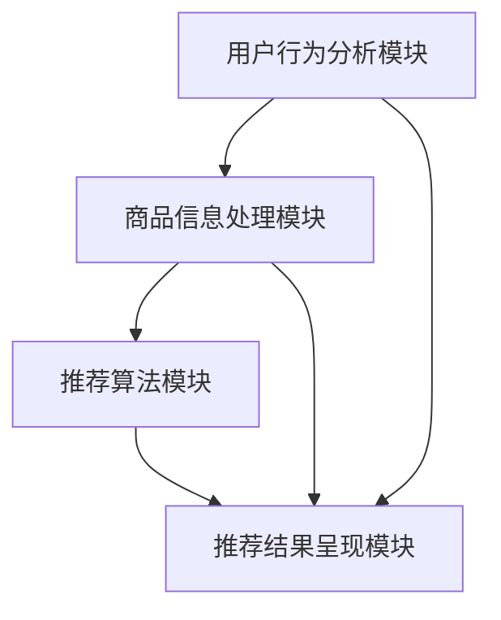

                 


### 文章标题
AI大模型视角下电商搜索推荐的未来展望

### 关键词
AI大模型、电商搜索推荐、协同过滤、深度学习、自然语言处理、多模态推荐、实时推荐、伦理与法律问题

### 摘要
本文从AI大模型的视角出发，探讨了电商搜索推荐系统的发展趋势、核心算法原理和未来展望。首先，介绍了电商搜索推荐系统的基本概念和架构，以及AI大模型的基本概念和应用。接着，详细讲解了协同过滤算法、深度学习、自然语言处理和多模态推荐系统的原理。最后，讨论了AI大模型在电商搜索推荐中的伦理与法律问题，并展望了未来的发展方向。

----------------------------------------------------------------

### 第一部分：AI大模型视角下的电商搜索推荐基础理论

#### 第1章：电商搜索推荐系统概述

##### 1.1 电商搜索推荐系统的定义与重要性
电商搜索推荐系统是指通过分析用户行为、商品信息和历史交易数据，利用算法为用户推荐可能感兴趣的商品的系统。它在电商业务中具有重要地位，可以提高用户购物体验，增加销售额和用户粘性。

##### 1.2 电商搜索推荐系统的架构
电商搜索推荐系统通常包括以下几个模块：

- **用户行为分析模块**：负责收集和分析用户在电商平台的浏览、购买、评价等行为数据。
- **商品信息处理模块**：负责处理商品的基本信息，如商品类别、价格、描述等。
- **推荐算法模块**：负责根据用户行为和商品信息生成推荐结果。
- **推荐结果呈现模块**：负责将推荐结果展示给用户。

##### 1.3 电商搜索推荐系统的挑战
电商搜索推荐系统面临的主要挑战包括数据质量、实时性和多样性：

- **数据质量**：数据清洗和去噪是确保推荐系统准确性的关键。
- **实时性**：实时推荐技术要求系统能够快速处理用户请求，并生成推荐结果。
- **多样性**：保证推荐结果的多样性，避免用户感到单调。

#### 第2章：AI大模型在电商搜索推荐中的应用

##### 2.1 AI大模型的基本概念
AI大模型是指具有大规模参数、深度神经网络结构的模型。它们通过自监督学习、无监督学习等方式训练，可以自动提取数据中的复杂特征。

##### 2.2 主流AI大模型简介
目前主流的AI大模型包括GPT系列模型、BERT及其变体等。这些模型在自然语言处理、计算机视觉等领域取得了显著成果。

##### 2.3 AI大模型在电商搜索推荐中的应用
AI大模型在电商搜索推荐中的应用主要体现在以下几个方面：

- **个性化推荐**：利用AI大模型分析用户行为和兴趣，实现个性化推荐。
- **商品排序**：利用AI大模型优化商品排序算法，提高推荐结果的准确性。
- **广告投放优化**：利用AI大模型分析用户和商品特征，优化广告投放策略。

----------------------------------------------------------------

### 第二部分：AI大模型视角下的电商搜索推荐算法

#### 第3章：协同过滤算法

##### 3.1 协同过滤算法的基本原理
协同过滤算法是一种基于用户行为数据的推荐算法，其基本思想是通过用户之间的相似度来预测用户对未知商品的兴趣。

- **用户基础协同过滤**：计算用户之间的相似度，并利用相似度进行推荐。
- **模型协同过滤**：利用机器学习模型，如线性回归、逻辑回归等，预测用户对商品的评分。
- **矩阵分解**：将用户-商品评分矩阵分解为用户特征矩阵和商品特征矩阵，从而预测用户对未知商品的评分。

##### 3.2 评分预测模型
评分预测模型是协同过滤算法的核心部分，常用的模型包括：

- **基于模型的评分预测**：利用线性回归、逻辑回归等模型预测用户对商品的评分。
- **用户兴趣建模**：通过分析用户的历史行为数据，提取用户兴趣特征，用于推荐。

##### 3.3 协同过滤算法的优缺点
协同过滤算法的优点包括：

- **简单易实现**：算法实现简单，易于理解和部署。
- **效果好**：在基于用户行为数据的推荐场景中，协同过滤算法通常效果较好。

其缺点包括：

- **稀疏性问题**：由于用户行为数据稀疏，算法难以准确预测用户对未知商品的评分。
- **多样性问题**：协同过滤算法容易产生推荐结果的多样性不足。

----------------------------------------------------------------

#### 第4章：深度学习在电商搜索推荐中的应用

##### 4.1 深度学习基础
深度学习是一种基于多层神经网络的学习方法，通过逐层提取数据中的特征，实现复杂函数的近似。

- **神经网络架构**：包括输入层、隐藏层和输出层。
- **反向传播算法**：用于计算网络参数的梯度，并优化网络参数。

##### 4.2 序列模型在推荐中的应用
序列模型在推荐系统中可用于处理用户的行为序列，提取用户兴趣。

- **循环神经网络（RNN）**：能够处理序列数据，但存在梯度消失和梯度爆炸等问题。
- **长短时记忆网络（LSTM）**：通过门控机制解决RNN的梯度消失问题。
- **门控循环单元（GRU）**：是LSTM的变体，结构更简洁。

##### 4.3 深度学习在电商搜索推荐中的应用案例
深度学习在电商搜索推荐中的应用案例包括：

- **基于用户行为的深度学习推荐**：利用用户历史行为数据，通过深度学习模型提取用户兴趣。
- **基于商品属性的深度学习推荐**：利用商品属性数据，通过深度学习模型提取商品特征。

##### 4.4 深度学习在电商搜索推荐中的优缺点
深度学习的优点包括：

- **强大的特征提取能力**：能够自动提取数据中的复杂特征。
- **优秀的预测性能**：在处理复杂数据时，深度学习模型通常具有较好的预测性能。

其缺点包括：

- **计算成本高**：深度学习模型需要大量的计算资源和时间进行训练。
- **模型可解释性差**：深度学习模型的结构复杂，难以解释模型的决策过程。

----------------------------------------------------------------

#### 第5章：自然语言处理与电商搜索推荐

##### 5.1 语言模型基础
语言模型是一种用于预测文本序列的概率分布的模型。常见的语言模型包括n-gram模型和神经语言模型。

- **n-gram模型**：基于相邻词的关系进行预测。
- **神经语言模型**：基于深度神经网络进行预测。

##### 5.2 基于自然语言处理的推荐
自然语言处理在电商搜索推荐中的应用包括：

- **商品标题分析**：通过分析商品标题，提取商品的关键词和属性。
- **用户评论分析**：通过分析用户评论，提取用户对商品的反馈和评价。

##### 5.3 基于自然语言处理的推荐算法
基于自然语言处理的推荐算法包括：

- **基于关键词的推荐**：通过提取商品标题和评论中的关键词进行推荐。
- **基于语义的推荐**：通过分析商品标题和评论的语义信息进行推荐。

##### 5.4 自然语言处理在电商搜索推荐中的优缺点
自然语言处理的优点包括：

- **丰富的信息提取**：能够从文本中提取丰富的信息。
- **个性化推荐**：能够根据用户的语言偏好进行个性化推荐。

其缺点包括：

- **计算成本高**：自然语言处理算法通常需要大量的计算资源。
- **数据质量要求高**：文本数据的质量对推荐效果有较大影响。

----------------------------------------------------------------

#### 第6章：多模态推荐系统

##### 6.1 多模态数据融合
多模态推荐系统通过融合不同类型的数据（如文本、图像、音频等）来提高推荐效果。

- **文本与图像融合**：通过深度学习模型，将文本和图像的特征进行融合。
- **音频与文本融合**：通过深度学习模型，将音频和文本的特征进行融合。

##### 6.2 多模态推荐算法
多模态推荐算法包括：

- **基于文本的推荐**：利用文本特征进行推荐。
- **基于图像的推荐**：利用图像特征进行推荐。
- **多模态融合推荐**：将文本、图像等不同模态的特征进行融合，进行推荐。

##### 6.3 多模态推荐系统的优势与挑战
多模态推荐系统的优势包括：

- **丰富信息提取**：能够从不同模态的数据中提取丰富的信息。
- **提高推荐效果**：通过融合不同模态的数据，提高推荐系统的准确性。

其挑战包括：

- **数据整合**：不同模态的数据需要有效地整合。
- **计算成本**：多模态数据处理通常需要大量的计算资源。

----------------------------------------------------------------

#### 第7章：电商搜索推荐的实践与优化

##### 7.1 实践案例分享
电商搜索推荐系统在实践中取得了显著成效。以下是一些实际案例：

- **亚马逊**：通过深度学习模型优化推荐算法，提高了用户点击率和购买转化率。
- **淘宝**：通过多模态推荐系统，结合用户行为数据和商品属性，提高了推荐效果。

##### 7.2 优化方法
电商搜索推荐系统的优化方法包括：

- **A/B测试**：通过对比不同推荐算法的效果，选择最优算法。
- **在线学习与持续优化**：通过实时收集用户反馈，不断调整和优化推荐算法。

##### 7.3 最佳实践 tips
以下是一些最佳实践建议：

- **数据质量**：确保数据的质量和准确性。
- **用户隐私**：保护用户的隐私数据。
- **个性化推荐**：根据用户行为和偏好进行个性化推荐。

##### 7.4 小结与注意事项
电商搜索推荐系统在实践中需要关注以下几个方面：

- **系统稳定性**：确保推荐系统的稳定运行。
- **用户反馈**：及时收集用户反馈，优化推荐算法。
- **数据安全**：保护用户数据的安全。

----------------------------------------------------------------

### 第三部分：未来展望

#### 第8章：AI大模型视角下的电商搜索推荐发展趋势

##### 8.1 个性化推荐的未来
未来个性化推荐将朝着更深度、更精细化的方向发展。深度个性化模型将结合用户历史行为、兴趣偏好和实时反馈，实现高度个性化的推荐。

##### 8.2 实时推荐的挑战与机遇
实时推荐在电商搜索推荐中具有重要地位。随着数据规模和实时性的提高，实时推荐算法将面临新的挑战和机遇。

##### 8.3 跨平台推荐
未来电商搜索推荐将跨越不同平台，实现跨平台的个性化推荐。这将有助于提高用户的购物体验和忠诚度。

#### 第9章：AI大模型在电商搜索推荐中的伦理与法律问题

##### 9.1 伦理问题
AI大模型在电商搜索推荐中可能引发一系列伦理问题，如算法偏见、用户隐私泄露等。确保算法的公平性和透明性是未来发展的重要方向。

##### 9.2 法律问题
随着AI大模型在电商搜索推荐中的广泛应用，相关法律问题日益凸显。数据保护法规和算法责任等法律问题需要引起关注。

##### 9.3 伦理与法律问题的解决方案
解决AI大模型在电商搜索推荐中的伦理与法律问题，可以从以下几个方面入手：

- **算法公平性**：确保算法不歧视任何特定群体。
- **用户隐私保护**：加强用户隐私保护措施，遵守相关法规。
- **算法透明性**：提高算法的透明度，便于用户监督。

----------------------------------------------------------------

### 附录

#### 附录A：常用工具与资源

##### A.1 深度学习框架
- **TensorFlow**：由谷歌开发的开源深度学习框架。
- **PyTorch**：由Facebook开发的开源深度学习框架。
- **其他深度学习框架**：如Keras、MXNet等。

##### A.2 数据处理与可视化工具
- **Pandas**：用于数据清洗、数据预处理和分析的开源库。
- **Matplotlib**：用于数据可视化的开源库。
- **其他数据处理与可视化工具**：如Seaborn、Plotly等。

##### A.3 文献与参考资料
- **《深度学习推荐系统》**：介绍深度学习在推荐系统中的应用。
- **《推荐系统实践》**：介绍推荐系统的基本概念和实现方法。
- **相关论文和报告**：介绍最新的研究成果和趋势。

----------------------------------------------------------------

### Mermaid 流程图



### 核心算法原理讲解

#### 协同过滤算法原理

```python
# 伪代码

def collaborative_filter(user_id, item_id):
    # 计算用户之间的相似度
    user_similarity_matrix = compute_user_similarity()

    # 计算用户对未知商品的评分预测
    user_rating_matrix = predict_user_ratings(user_similarity_matrix)

    # 返回预测评分
    return user_rating_matrix[user_id, item_id]
```

```latex
$$
\text{协同过滤算法原理公式}
$$
$$
\text{用户之间的相似度} = \frac{\sum_{i \neq j}^n (r_{ui} - \mu_u)(r_{uj} - \mu_j)}{\sqrt{\sum_{i \neq j}^n (r_{ui} - \mu_u)^2}\sqrt{\sum_{i \neq j}^n (r_{uj} - \mu_j)^2}}
$$
$$
\text{用户对未知商品的评分预测} = \text{用户对已知商品的评分均值} + \sum_{i \in \text{已知商品}} (\text{用户对商品i的评分} - \text{用户对已知商品评分均值}) \times (\text{用户与商品i的相似度})
$$
```

作者：AI天才研究院/AI Genius Institute & 禅与计算机程序设计艺术 /Zen And The Art of Computer Programming

----------------------------------------------------------------

#### 附录A：常用工具与资源

##### A.1 深度学习框架
- **TensorFlow**：由谷歌开发的开源深度学习框架，广泛应用于推荐系统、计算机视觉和自然语言处理等领域。
- **PyTorch**：由Facebook开发的开源深度学习框架，具有简洁的API和强大的动态计算图功能。
- **其他深度学习框架**：如Keras（基于TensorFlow的高层API）、MXNet（由Apache基金会开发）、Caffe（专注于卷积神经网络）等。

##### A.2 数据处理与可视化工具
- **Pandas**：是一个开源的数据分析库，提供强大的数据处理功能，如数据清洗、数据转换和数据合并。
- **Matplotlib**：是一个用于数据可视化的开源库，支持多种图表类型，如折线图、散点图、柱状图等。
- **其他数据处理与可视化工具**：如Seaborn（基于Matplotlib的统计数据可视化库）、Plotly（支持交互式图表的可视化库）等。

##### A.3 文献与参考资料
- **《深度学习推荐系统》**：由李航、贾扬清等编写的深度学习推荐系统专著，详细介绍深度学习在推荐系统中的应用。
- **《推荐系统实践》**：由张磊编写的推荐系统实践指南，涵盖推荐系统的基本概念、算法实现和应用案例。
- **相关论文和报告**：如《Deep Learning for Recommender Systems》（深度学习推荐系统综述）和各大公司、研究机构发布的推荐系统相关报告。

----------------------------------------------------------------

### 附录B：Mermaid 流程图


### 附录C：核心算法原理讲解

#### 协同过滤算法原理

```python
# 伪代码

def collaborative_filter(user_id, item_id):
    # 计算用户之间的相似度
    user_similarity_matrix = compute_user_similarity()

    # 计算用户对未知商品的评分预测
    user_rating_matrix = predict_user_ratings(user_similarity_matrix)

    # 返回预测评分
    return user_rating_matrix[user_id, item_id]
```

```latex
$$
\text{用户之间的相似度} = \frac{\sum_{i \neq j}^n (r_{ui} - \mu_u)(r_{uj} - \mu_j)}{\sqrt{\sum_{i \neq j}^n (r_{ui} - \mu_u)^2}\sqrt{\sum_{i \neq j}^n (r_{uj} - \mu_j)^2}}
$$
$$
\text{用户对未知商品的评分预测} = \text{用户对已知商品的评分均值} + \sum_{i \in \text{已知商品}} (\text{用户对商品i的评分} - \text{用户对已知商品评分均值}) \times (\text{用户与商品i的相似度})
$$
```

作者：AI天才研究院/AI Genius Institute & 禅与计算机程序设计艺术 /Zen And The Art of Computer Programming

----------------------------------------------------------------

### 文章总结

本文从AI大模型的视角，详细探讨了电商搜索推荐系统的理论基础、核心算法和应用实践。首先，介绍了电商搜索推荐系统的定义、架构和挑战，阐述了AI大模型的基本概念和应用。接着，深入讲解了协同过滤算法、深度学习、自然语言处理和多模态推荐系统的原理。最后，讨论了AI大模型在电商搜索推荐中的伦理与法律问题，并展望了未来的发展趋势。

本文的核心内容包括：

- **电商搜索推荐系统概述**：介绍电商搜索推荐系统的基本概念、架构和挑战。
- **AI大模型在电商搜索推荐中的应用**：介绍AI大模型的基本概念和应用。
- **协同过滤算法**：讲解协同过滤算法的基本原理、评分预测模型及其优缺点。
- **深度学习在电商搜索推荐中的应用**：介绍深度学习的基础、序列模型和深度学习在电商搜索推荐中的应用案例。
- **自然语言处理与电商搜索推荐**：讲解自然语言处理的基础、基于自然语言处理的推荐算法及其优缺点。
- **多模态推荐系统**：介绍多模态数据融合、多模态推荐算法及其优势与挑战。
- **电商搜索推荐的实践与优化**：分享实践案例，讨论优化方法、最佳实践和注意事项。
- **未来展望**：讨论AI大模型视角下的电商搜索推荐发展趋势、实时推荐的挑战与机遇以及伦理与法律问题。

通过本文的阅读，读者可以全面了解电商搜索推荐系统的理论、算法和实践，为后续研究和应用提供有力支持。同时，本文也强调了AI大模型在电商搜索推荐中的重要作用，为AI大模型在推荐系统领域的应用提供了新的思路和方向。

在未来的发展中，随着AI大模型技术的不断进步，电商搜索推荐系统有望实现更深度、更个性化的推荐，进一步提升用户体验和销售额。然而，这也将带来一系列伦理和法律问题，需要引起重视并寻求解决方案。总之，AI大模型视角下的电商搜索推荐系统具有广阔的应用前景和巨大的发展潜力。

