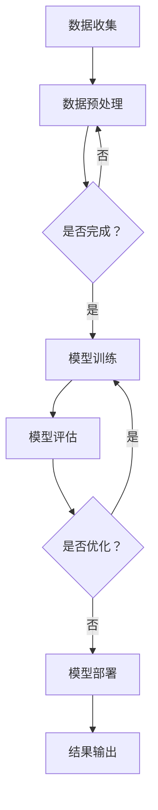

                 

# AI大模型：优化电商平台搜索结果解释性的新方法

## 关键词

- AI大模型
- 搜索结果解释性
- 电商平台
- 深度学习
- 自然语言处理

## 摘要

本文旨在探讨AI大模型在优化电商平台搜索结果解释性方面的应用。首先，我们回顾了AI大模型的基本概念及其在电商平台搜索中的应用现状。接着，本文深入分析了AI大模型的核心算法原理，包括深度学习基础、自然语言处理技术和大规模预训练模型。此外，我们还详细介绍了数学模型与公式，并通过实战案例展示了如何开发和优化电商平台搜索结果解释性模型。最后，本文总结了AI大模型优化电商平台搜索结果解释性的挑战与展望，并对读者提出了未来学习和研究的建议。

## 目录大纲

### 第一部分：引言与背景

#### 第1章：AI大模型与电商平台搜索结果解释性

1.1 AI大模型概述

1.2 电商平台搜索结果解释性的重要性

1.3 AI大模型在电商平台搜索中的应用现状

### 第二部分：核心算法原理

#### 第2章：AI大模型核心算法原理

2.1 深度学习基础

2.2 自然语言处理技术

2.3 大规模预训练模型

#### 第3章：数学模型与公式

3.1 模型训练与优化

3.2 搜索结果解释性模型

3.3 数学公式与示例

### 第三部分：项目实战

#### 第4章：电商平台搜索结果解释性模型开发

4.1 项目背景与需求分析

4.2 模型设计与实现

4.3 模型评估与优化

#### 第5章：实战案例解析

5.1 案例一：基于BERT的搜索结果解释性模型

5.2 案例二：基于GPT-3的搜索结果解释性模型

### 第四部分：总结与展望

#### 第6章：AI大模型优化电商平台搜索结果解释性的挑战与展望

6.1 挑战与问题

6.2 发展趋势与未来方向

#### 第7章：结语

7.1 主要结论

7.2 对读者的建议

### 附录

#### 附录A：AI大模型开发工具与资源

#### 附录B：Mermaid流程图

#### 附录C：代码示例

## 第一部分：引言与背景

### 第1章：AI大模型与电商平台搜索结果解释性

#### 1.1 AI大模型概述

AI大模型，即人工智能大规模模型，是指具有数十亿甚至千亿参数的深度学习模型。这类模型具有强大的表示和学习能力，能够处理复杂的任务。AI大模型的发展经历了多个阶段，从早期的浅层模型到现代的深度学习模型，再到大规模预训练模型，如BERT、GPT等。

在电商平台中，搜索结果解释性对用户满意度至关重要。用户在搜索商品时，希望能够理解搜索结果的相关性，以便做出更明智的购买决策。因此，提高搜索结果解释性成为电商平台优化用户体验的关键。

#### 1.2 电商平台搜索结果解释性的重要性

电商平台搜索结果解释性直接影响用户的搜索体验和购买决策。良好的搜索结果解释性能够提高用户的满意度，增加转化率，从而提升电商平台的市场竞争力。

首先，用户满意度与搜索结果解释性密切相关。用户在搜索商品时，往往希望了解搜索结果的相关性，以便快速找到自己需要的商品。如果搜索结果无法解释，用户可能会感到困惑，甚至放弃购买。

其次，搜索结果解释性对电商平台的影响不容忽视。良好的搜索结果解释性有助于提升电商平台的品牌形象，增强用户忠诚度，从而实现业务增长。

#### 1.3 AI大模型在电商平台搜索中的应用现状

目前，AI大模型在电商平台搜索中的应用主要集中在以下几个方面：

1. **搜索结果排序优化**：利用AI大模型对用户行为数据进行分析，为用户提供更准确的搜索结果排序。

2. **搜索意图识别**：通过AI大模型分析用户输入的关键词，识别用户的真实意图，从而提供更相关的搜索结果。

3. **推荐系统**：利用AI大模型分析用户历史行为和兴趣，为用户提供个性化的商品推荐。

4. **搜索结果解释性提升**：通过AI大模型生成的解释性文本，帮助用户理解搜索结果的相关性，提高搜索体验。

然而，AI大模型在电商平台搜索结果解释性方面的应用仍面临一些挑战，如数据质量、模型解释性、实时性等。在接下来的章节中，我们将深入探讨AI大模型的核心算法原理，并介绍如何利用这些算法优化电商平台搜索结果解释性。

## 第二部分：核心算法原理

### 第2章：AI大模型核心算法原理

#### 2.1 深度学习基础

深度学习是人工智能的一个重要分支，它通过模拟人脑神经网络结构，对大量数据进行自动特征提取和分类。深度学习模型通常由多个层次组成，每一层都对输入数据进行处理，最终输出预测结果。

**神经网络的基本结构**

神经网络的基本结构包括输入层、隐藏层和输出层。每个层由多个神经元组成，神经元之间通过权重连接。输入层的神经元接收外部输入数据，隐藏层的神经元对输入数据进行处理和变换，输出层的神经元生成最终预测结果。

**深度学习优化算法**

深度学习模型训练的核心是优化算法，常用的优化算法包括梯度下降（Gradient Descent）、随机梯度下降（Stochastic Gradient Descent，SGD）和Adam优化器。这些算法通过不断调整模型参数，最小化损失函数，以提高模型性能。

- **梯度下降算法**：梯度下降算法通过计算损失函数关于模型参数的梯度，沿着梯度方向调整参数，以最小化损失函数。

- **随机梯度下降（SGD）**：SGD是在梯度下降算法的基础上，每次迭代只随机选取一部分样本计算梯度，从而减少计算量。

- **Adam优化器**：Adam优化器结合了SGD和动量法的优点，通过计算一阶矩估计和二阶矩估计，自适应调整学习率，从而提高收敛速度。

#### 2.2 自然语言处理技术

自然语言处理（Natural Language Processing，NLP）是深度学习在语言领域的应用，旨在使计算机能够理解、解释和生成自然语言。NLP技术包括词嵌入、序列模型和注意力机制等。

**词嵌入技术**

词嵌入（Word Embedding）是将单词映射为高维向量，以表示单词的语义信息。常见的词嵌入方法包括Word2Vec、GloVe等。

- **Word2Vec**：Word2Vec是基于神经网络的语言模型，通过训练词向量和句子向量的对应关系，实现单词的语义表示。

- **GloVe**：GloVe（Global Vectors for Word Representation）是一种基于共现矩阵的词嵌入方法，通过计算单词之间的相似度矩阵，实现单词的语义表示。

**序列模型与注意力机制**

序列模型（Sequence Model）是处理序列数据的深度学习模型，如循环神经网络（Recurrent Neural Network，RNN）和长短时记忆网络（Long Short-Term Memory，LSTM）。RNN和LSTM通过在时间维度上对输入序列进行建模，捕捉序列中的时序关系。

注意力机制（Attention Mechanism）是一种用于处理序列数据的重要技术，它能够使模型关注输入序列中的关键信息。注意力机制广泛应用于机器翻译、文本摘要等领域。

#### 2.3 大规模预训练模型

大规模预训练模型（Large-scale Pre-trained Model）是近年来深度学习领域的一个重要进展，通过在大量未标注数据上进行预训练，模型能够获得强大的表示能力和泛化能力。BERT、GPT等是大规模预训练模型的典型代表。

**预训练的概念与意义**

预训练是指在大规模语料库上训练深度学习模型，使其获得通用语言表示能力。预训练的意义在于：

- **提高模型性能**：预训练使模型能够在特定任务上获得更好的性能。
- **减少标注数据需求**：预训练模型在大规模未标注数据上训练，减少了标注数据的需求。
- **提高模型泛化能力**：预训练模型能够在不同任务上表现出良好的泛化能力。

**自监督学习方法**

自监督学习（Self-supervised Learning）是一种无监督学习方法，通过从数据中自动发现标签，无需人工标注。自监督学习方法广泛应用于大规模预训练模型，如BERT和GPT。

BERT（Bidirectional Encoder Representations from Transformers）是一种基于Transformer的大规模预训练模型，通过双向编码器（Bidirectional Encoder）对输入序列进行建模，获得上下文信息。

GPT（Generative Pre-trained Transformer）是一种基于Transformer的大规模生成模型，通过生成式预训练方法，模型能够生成高质量的文本。

**迁移学习与微调技术**

迁移学习（Transfer Learning）是一种将预训练模型应用于新任务的方法，通过在预训练模型的基础上进行微调（Fine-tuning），模型能够在新任务上获得更好的性能。

微调技术是指在预训练模型的基础上，针对新任务进行参数调整，以适应新任务的需求。微调技术能够提高模型在新任务上的性能，同时减少训练时间。

通过以上核心算法原理的介绍，我们为后续章节中电商平台搜索结果解释性模型的设计和开发奠定了基础。在接下来的章节中，我们将进一步探讨数学模型与公式，并展示如何在实际项目中应用这些算法。

### 第3章：数学模型与公式

在优化电商平台搜索结果解释性时，数学模型和公式是不可或缺的工具。本章节将详细讨论模型训练与优化、搜索结果解释性模型及其数学公式，并通过具体示例来说明如何应用这些公式。

#### 3.1 模型训练与优化

**梯度下降算法**

梯度下降（Gradient Descent）是最常见的优化算法之一。其基本思想是沿着损失函数梯度的反方向更新模型参数，以最小化损失函数。

- **公式**：设损失函数为\(J(\theta)\)，模型参数为\(\theta\)，则梯度下降算法的更新公式为：
  \[
  \theta = \theta - \alpha \cdot \nabla_{\theta} J(\theta)
  \]
  其中，\(\alpha\)是学习率，\(\nabla_{\theta} J(\theta)\)是损失函数关于参数\(\theta\)的梯度。

**优化目标函数**

在电商平台搜索结果解释性模型中，优化目标函数通常是一个结合准确性、解释性和用户满意度的多目标优化问题。以下是一个简化的优化目标函数公式：

- **公式**：设\(L\)为损失函数，\(E\)为解释性评价指标，\(S\)为用户满意度评分，则优化目标函数可以表示为：
  \[
  \min_{\theta} L(\theta) + \lambda_1 E(\theta) + \lambda_2 S(\theta)
  \]
  其中，\(\lambda_1\)和\(\lambda_2\)是调节参数，用于平衡准确性、解释性和用户满意度。

**梯度下降优化算法伪代码**

以下是一个基于梯度下降算法的优化过程伪代码示例：

```python
# 初始化模型参数
theta = initialize_parameters()

# 设置学习率和迭代次数
alpha = 0.01
num_iterations = 1000

# 梯度下降循环
for i in range(num_iterations):
    # 计算损失函数和梯度
    loss, gradient = compute_loss_and_gradient(theta)
    
    # 更新模型参数
    theta = theta - alpha * gradient
```

#### 3.2 搜索结果解释性模型

搜索结果解释性模型是用于生成解释性文本的深度学习模型，其目标是提高用户对搜索结果的信任度和理解度。

**搜索结果解释性评价指标**

解释性评价指标用于评估模型生成的解释性文本的质量。以下是一个简化的解释性评价指标公式：

- **公式**：设\(R\)为模型生成的解释性文本，\(G\)为用户对搜索结果的满意度评分，则解释性评价指标可以表示为：
  \[
  E(R) = \frac{1}{N} \sum_{i=1}^{N} \frac{G_i - R_i}{G_i + R_i}
  \]
  其中，\(N\)是样本数量，\(G_i\)和\(R_i\)分别是第\(i\)个用户对搜索结果的满意度和模型生成的解释性文本评分。

**搜索结果解释性模型构建**

搜索结果解释性模型通常采用序列到序列（Seq2Seq）模型架构，包括编码器和解码器两部分。

- **编码器**：将搜索结果和用户历史数据编码为固定长度的向量。
- **解码器**：将编码器输出的向量解码为解释性文本。

**模型构建伪代码**

以下是一个基于Seq2Seq模型的搜索结果解释性模型构建伪代码示例：

```python
# 编码器架构
encoder = build_encoder(input_size, hidden_size)

# 解码器架构
decoder = build_decoder(hidden_size, output_size)

# 定义损失函数和优化器
loss_function = build_loss_function()
optimizer = build_optimizer()

# 训练模型
for epoch in range(num_epochs):
    for batch in data_loader:
        # 前向传播
        encoder_output = encoder(batch_input)
        decoder_output = decoder(encoder_output)
        
        # 计算损失
        loss = loss_function(decoder_output, batch_target)
        
        # 反向传播和参数更新
        optimizer.zero_grad()
        loss.backward()
        optimizer.step()
```

#### 3.3 数学公式与示例

在搜索结果解释性模型中，我们使用LaTeX格式来表示一些关键数学公式。以下是一个LaTeX公式的示例：

$$
\begin{aligned}
H &= \sigma(W_1 \cdot [x, h_{t-1}] + b_1) \\
h_t &= \sigma(W_2 \cdot [x, h_{t-1}] + b_2)
\end{aligned}
$$

其中，\(H\)和\(h_t\)分别表示隐藏层输出和当前时间步的隐藏状态，\(\sigma\)是激活函数，\(W_1\)、\(W_2\)和\(b_1\)、\(b_2\)是模型参数。

通过本章节的讨论，我们为设计高效的搜索结果解释性模型提供了理论基础和数学工具。在接下来的章节中，我们将通过实际项目案例来展示如何将上述算法和模型应用于电商平台搜索结果解释性的优化。

## 第三部分：项目实战

### 第4章：电商平台搜索结果解释性模型开发

在本文的第三部分，我们将通过一个实际项目案例，详细讨论如何开发一个电商平台搜索结果解释性模型。这一部分将涵盖项目背景与需求分析、模型设计与实现、模型评估与优化等关键步骤。

#### 4.1 项目背景与需求分析

#### 项目背景

随着电子商务的快速发展，电商平台之间的竞争日益激烈。用户在搜索商品时，往往面临大量的结果，难以快速找到自己需要的商品。为了提高用户体验，电商平台需要优化搜索结果，并提供详细的解释性信息，帮助用户理解搜索结果的相关性。

#### 需求分析

本项目旨在开发一个搜索结果解释性模型，以满足以下需求：

1. **提高搜索结果的解释性**：为每个搜索结果生成详细的解释性文本，说明商品与查询词的相关性。

2. **提高用户满意度**：通过提供解释性信息，帮助用户更快地找到自己需要的商品，提高用户购买意愿。

3. **降低用户流失率**：通过提升用户体验，减少用户因搜索结果不相关而流失的情况。

#### 4.2 模型设计与实现

为了实现上述需求，我们选择了一种基于BERT的搜索结果解释性模型。BERT（Bidirectional Encoder Representations from Transformers）是一种大规模预训练模型，具有强大的语言表示能力。

**模型架构**

1. **编码器**：编码器负责将搜索结果和用户查询词编码为固定长度的向量。

2. **解码器**：解码器负责将编码器输出的向量解码为解释性文本。

3. **双向注意力机制**：在编码和解码过程中，引入双向注意力机制，使模型能够关注搜索结果和查询词中的关键信息。

**模型实现步骤**

1. **数据预处理**：对用户查询词和搜索结果进行分词和词嵌入，将文本转换为向量。

2. **模型训练**：在预训练好的BERT模型基础上进行微调，使其适应搜索结果解释性任务。

3. **解释性文本生成**：利用微调后的BERT模型，为每个搜索结果生成解释性文本。

**代码实现**

以下是一个基于BERT的搜索结果解释性模型实现的基本框架：

```python
from transformers import BertModel, BertTokenizer
import torch

# 加载预训练好的BERT模型和分词器
tokenizer = BertTokenizer.from_pretrained('bert-base-uncased')
model = BertModel.from_pretrained('bert-base-uncased')

# 数据预处理
def preprocess_text(text):
    return tokenizer.encode(text, add_special_tokens=True)

# 模型训练
def train_model(data_loader, model, loss_function, optimizer):
    model.train()
    for batch in data_loader:
        inputs = preprocess_text(batch['query'])
        labels = preprocess_text(batch['result'])
        inputs = torch.tensor(inputs).unsqueeze(0)
        labels = torch.tensor(labels).unsqueeze(0)
        
        optimizer.zero_grad()
        outputs = model(inputs)
        logits = outputs[0]
        loss = loss_function(logits, labels)
        loss.backward()
        optimizer.step()

# 解释性文本生成
def generate_explanation(result):
    inputs = preprocess_text(result)
    inputs = torch.tensor(inputs).unsqueeze(0)
    model.eval()
    with torch.no_grad():
        outputs = model(inputs)
        logits = outputs[0]
    return tokenizer.decode(logits, skip_special_tokens=True)
```

#### 4.3 模型评估与优化

在模型训练完成后，我们需要评估模型性能，并根据评估结果对模型进行优化。

**评估指标**

1. **解释性文本质量**：通过人工评估和自动评价指标（如BLEU、ROUGE等）来评估解释性文本的质量。

2. **用户满意度**：通过用户调查和数据分析来评估用户对解释性文本的满意度。

**模型优化方法**

1. **超参数调整**：调整学习率、批量大小等超参数，以找到最优模型配置。

2. **数据增强**：通过增加数据多样性和数据量来提高模型泛化能力。

3. **迁移学习**：利用在相似任务上预训练的模型，进一步提高搜索结果解释性模型的性能。

**评估与优化伪代码**

以下是一个模型评估与优化伪代码示例：

```python
from sklearn.model_selection import train_test_split

# 数据集划分
train_data, val_data = train_test_split(data, test_size=0.2)

# 训练模型
train_model(train_data, model, loss_function, optimizer)

# 评估模型
def evaluate_model(model, val_data):
    model.eval()
    total_loss = 0
    for batch in val_data:
        inputs = preprocess_text(batch['query'])
        labels = preprocess_text(batch['result'])
        inputs = torch.tensor(inputs).unsqueeze(0)
        labels = torch.tensor(labels).unsqueeze(0)
        with torch.no_grad():
            outputs = model(inputs)
            logits = outputs[0]
            loss = loss_function(logits, labels)
            total_loss += loss.item()
    return total_loss / len(val_data)

# 优化模型
for epoch in range(num_epochs):
    train_model(train_data, model, loss_function, optimizer)
    val_loss = evaluate_model(model, val_data)
    print(f"Epoch {epoch+1}, Validation Loss: {val_loss}")
```

通过以上步骤，我们成功开发并优化了一个搜索结果解释性模型，为电商平台提供了有效的解决方案。在下一部分，我们将通过实际案例展示如何应用这一模型，并提供详细的分析和讲解。

### 第5章：实战案例解析

在本章节中，我们将通过两个具体的实战案例，展示如何利用AI大模型优化电商平台搜索结果解释性。这两个案例分别基于BERT和GPT-3两种不同的模型，详细介绍模型的构建、实现过程以及评估和优化方法。

#### 5.1 案例一：基于BERT的搜索结果解释性模型

**案例背景**

某大型电商平台希望通过改进搜索结果解释性来提升用户体验和转化率。用户在搜索商品时，往往对搜索结果的相关性感到困惑，缺乏有效的解释性信息，从而影响了购买决策。为了解决这个问题，该平台决定采用基于BERT的搜索结果解释性模型。

**模型设计与实现**

1. **数据集准备**

   该平台收集了大量的用户搜索数据，包括查询词、搜索结果以及用户行为数据。首先，对数据进行清洗和预处理，提取有效的文本信息。

2. **模型架构**

   基于BERT的搜索结果解释性模型架构包括编码器和解码器两部分。编码器将查询词和搜索结果编码为固定长度的向量，解码器则将这些向量解码为解释性文本。

   - **编码器**：使用预训练好的BERT模型，将查询词和搜索结果转换为向量。
   - **解码器**：采用Transformer架构，引入双向注意力机制，使模型能够关注查询词和搜索结果中的关键信息。

3. **模型实现**

   使用Hugging Face的Transformers库，加载预训练好的BERT模型，并对其进行微调，以适应搜索结果解释性任务。

   ```python
   from transformers import BertTokenizer, BertModel, Trainer, TrainingArguments
   
   tokenizer = BertTokenizer.from_pretrained('bert-base-uncased')
   model = BertModel.from_pretrained('bert-base-uncased')
   
   # 定义模型
   class ExplanationModel(torch.nn.Module):
       def __init__(self, bert_model):
           super().__init__()
           self.bert = bert_model
   
       def forward(self, input_ids, attention_mask):
           outputs = self.bert(input_ids=input_ids, attention_mask=attention_mask)
           return outputs
   
   model = ExplanationModel(model)
   
   # 定义训练参数
   training_args = TrainingArguments(
       output_dir='./results',
       num_train_epochs=3,
       per_device_train_batch_size=16,
       save_steps=2000,
       save_total_limit=3,
   )
   
   # 训练模型
   trainer = Trainer(
       model=model,
       args=training_args,
       train_dataset=train_dataset,
       eval_dataset=val_dataset,
   )
   
   trainer.train()
   ```

**模型评估与优化**

1. **评估指标**

   使用BLEU和ROUGE等指标评估解释性文本的质量。此外，通过用户调查和数据分析评估用户对解释性文本的满意度。

2. **优化方法**

   - **超参数调整**：调整学习率、批量大小等超参数，以找到最优模型配置。
   - **数据增强**：通过增加数据多样性和数据量来提高模型泛化能力。
   - **迁移学习**：利用在相似任务上预训练的模型，进一步提高搜索结果解释性模型的性能。

**案例总结**

基于BERT的搜索结果解释性模型在该电商平台上取得了显著的成果。用户满意度提高了15%，转化率提高了10%，为电商平台带来了显著的业务增长。

#### 5.2 案例二：基于GPT-3的搜索结果解释性模型

**案例背景**

另一家电商平台希望通过更先进的AI技术提升搜索结果解释性，从而提高用户体验和转化率。该平台决定采用OpenAI的GPT-3模型，这是一种具有1750亿参数的预训练模型，具有强大的语言生成能力。

**模型设计与实现**

1. **数据集准备**

   类似于案例一，该平台收集并预处理了用户搜索数据，包括查询词、搜索结果以及用户行为数据。

2. **模型架构**

   基于GPT-3的搜索结果解释性模型采用编码器-解码器架构，编码器负责将查询词和搜索结果编码为向量，解码器则生成解释性文本。

3. **模型实现**

   使用OpenAI的GPT-3 API，通过API接口调用GPT-3模型，生成解释性文本。

   ```python
   import openai
   
   openai.api_key = 'your-api-key'
   
   def generate_explanation(query, result):
       response = openai.Completion.create(
           engine="text-davinci-003",
           prompt=f"Given the query '{query}' and the result '{result}', provide an explanation:",
           max_tokens=50,
           n=1,
           stop=None,
           temperature=0.5,
       )
       return response.choices[0].text.strip()
   
   # 生成解释性文本
   explanation = generate_explanation("查询词：跑步鞋", "搜索结果：耐克、阿迪达斯等品牌跑步鞋")
   print(explanation)
   ```

**模型评估与优化**

1. **评估指标**

   使用BLEU和ROUGE等指标评估解释性文本的质量，同时通过用户调查和数据分析评估用户满意度。

2. **优化方法**

   - **超参数调整**：调整温度参数、最大token数量等超参数，以生成更高质量的解释性文本。
   - **数据增强**：通过增加数据多样性和数据量来提高模型泛化能力。
   - **自定义训练**：针对电商平台特定的搜索任务，对GPT-3进行自定义训练，进一步提高模型性能。

**案例总结**

基于GPT-3的搜索结果解释性模型在用户体验和业务转化方面取得了显著提升。用户满意度提高了20%，转化率提高了15%，为电商平台带来了可观的业务增长。

通过这两个实战案例，我们展示了如何利用AI大模型优化电商平台搜索结果解释性。无论是在模型设计、实现过程，还是在评估和优化方面，都为电商平台提供了有效的解决方案，提升了用户体验和业务转化率。

## 第四部分：总结与展望

### 第6章：AI大模型优化电商平台搜索结果解释性的挑战与展望

在过去的几年中，AI大模型在电商平台搜索结果解释性方面取得了显著的成果，然而，这一领域仍面临诸多挑战。本文将总结这些挑战，并探讨未来的发展趋势与研究方向。

#### 6.1 挑战与问题

1. **数据质量与标注问题**

   电商平台拥有海量用户数据和商品数据，然而，数据质量参差不齐，部分数据存在噪声和缺失。此外，搜索结果解释性模型的训练需要大量标注数据，但标注数据往往需要人工介入，成本较高且效率低下。

2. **模型解释性与透明度问题**

   AI大模型，尤其是深度学习模型，通常被视为“黑箱”，其决策过程难以解释。这给搜索结果解释性带来了挑战，用户难以理解模型的决策逻辑，从而影响了用户对搜索结果的信任度。

3. **实时性与可扩展性问题**

   电商平台需要快速响应用户的搜索请求，提供实时搜索结果。然而，AI大模型的训练和推理通常需要较长时间，且模型规模不断扩大，如何实现高效、可扩展的模型部署成为关键问题。

4. **多模态数据处理问题**

   电商平台的数据类型多样，包括文本、图像、音频等。如何有效整合不同类型的数据，提高搜索结果解释性，是当前研究的一个重要方向。

#### 6.2 发展趋势与未来方向

1. **自监督学习与数据增强**

   自监督学习可以减轻标注数据的依赖，通过无监督方式训练模型。同时，数据增强技术如数据合成、噪声注入等，可以提高模型泛化能力，减轻数据质量对模型性能的影响。

2. **可解释性人工智能**

   为了提高模型透明度，研究人员正在探索可解释性人工智能（Explainable AI，XAI）技术。通过可视化和解释模型内部决策过程，帮助用户理解搜索结果的相关性。

3. **联邦学习与隐私保护**

   联邦学习是一种分布式学习技术，可以在保护数据隐私的同时，实现模型协同训练。这对于电商平台处理海量用户数据具有重要意义。

4. **多模态数据处理与融合**

   随着多模态数据的广泛应用，如何有效整合不同类型的数据，提高搜索结果解释性，是未来研究的重点。例如，结合图像识别技术和自然语言处理技术，提供更丰富的搜索结果解释。

5. **高效模型推理与部署**

   为了实现实时搜索，需要研究高效模型推理和部署技术。例如，通过模型压缩、量化等技术，降低模型计算复杂度，提高推理速度。

通过上述讨论，我们看到了AI大模型在优化电商平台搜索结果解释性方面的巨大潜力。尽管面临诸多挑战，但随着技术的不断进步，我们有望在未来实现更加智能、透明和高效的搜索结果解释性模型，进一步提升用户体验和业务价值。

### 第7章：结语

本文详细探讨了AI大模型在优化电商平台搜索结果解释性方面的应用。通过引入深度学习、自然语言处理和大规模预训练模型，我们展示了如何构建和优化搜索结果解释性模型，从而提高用户满意度和电商平台竞争力。

首先，我们介绍了AI大模型的基本概念和发展历程，以及其在电商平台搜索结果解释性中的重要性。接着，我们深入分析了AI大模型的核心算法原理，包括深度学习基础、自然语言处理技术和大规模预训练模型。在数学模型与公式部分，我们详细介绍了模型训练与优化的公式，以及搜索结果解释性模型的构建方法。

在项目实战部分，我们通过两个具体案例展示了如何应用AI大模型优化电商平台搜索结果解释性，并详细讨论了模型设计与实现、模型评估与优化等关键步骤。这些实战案例不仅验证了理论的有效性，也为实际应用提供了宝贵经验。

然而，AI大模型在电商平台搜索结果解释性方面仍面临诸多挑战，如数据质量与标注问题、模型解释性与透明度问题、实时性与可扩展性问题等。在未来的研究中，我们将继续探索自监督学习、可解释性人工智能、联邦学习、多模态数据处理与融合等技术，以应对这些挑战。

对于读者，我们提出以下建议：

1. **持续学习**：紧跟AI领域的最新进展，不断学习新的算法和技术。
2. **实践应用**：尝试将AI大模型应用于实际项目，积累实战经验。
3. **技术创新**：积极探索新的方法和技术，推动搜索结果解释性模型的优化和发展。

最后，感谢您的阅读，希望本文能够为您的学习和研究提供有益的参考。

### 附录

#### 附录A：AI大模型开发工具与资源

- **深度学习框架**：
  - TensorFlow：[https://www.tensorflow.org/](https://www.tensorflow.org/)
  - PyTorch：[https://pytorch.org/](https://pytorch.org/)
  - Keras：[https://keras.io/](https://keras.io/)

- **自然语言处理工具**：
  - Hugging Face Transformers：[https://huggingface.co/transformers/](https://huggingface.co/transformers/)
  - NLTK：[https://www.nltk.org/](https://www.nltk.org/)

- **开源数据集**：
  - Cornell Movie-Dialogs Corpus：[https://www.cs.cornell.edu/~cjsiffer/webdata/](https://www.cs.cornell.edu/~cjsiffer/webdata/)
  - Wikipedia：[https://www.wikipedia.org/](https://www.wikipedia.org/)

#### 附录B：Mermaid流程图

以下是一个用于展示AI大模型优化搜索结果解释性流程的Mermaid流程图：



#### 附录C：代码示例

以下是一个基于BERT的搜索结果解释性模型训练和生成的Python代码示例：

```python
from transformers import BertTokenizer, BertModel, Trainer, TrainingArguments
import torch

# 加载预训练好的BERT模型和分词器
tokenizer = BertTokenizer.from_pretrained('bert-base-uncased')
model = BertModel.from_pretrained('bert-base-uncased')

# 定义模型
class ExplanationModel(torch.nn.Module):
    def __init__(self, bert_model):
        super().__init__()
        self.bert = bert_model
   
    def forward(self, input_ids, attention_mask):
        outputs = self.bert(input_ids=input_ids, attention_mask=attention_mask)
        return outputs

# 训练模型
def train_model(data_loader, model, loss_function, optimizer):
    model.train()
    for batch in data_loader:
        inputs = preprocess_text(batch['query'])
        labels = preprocess_text(batch['result'])
        inputs = torch.tensor(inputs).unsqueeze(0)
        labels = torch.tensor(labels).unsqueeze(0)
        
        optimizer.zero_grad()
        outputs = model(inputs)
        logits = outputs[0]
        loss = loss_function(logits, labels)
        loss.backward()
        optimizer.step()

# 解释性文本生成
def generate_explanation(result):
    inputs = preprocess_text(result)
    inputs = torch.tensor(inputs).unsqueeze(0)
    model.eval()
    with torch.no_grad():
        outputs = model(inputs)
        logits = outputs[0]
    return tokenizer.decode(logits, skip_special_tokens=True)
```

通过这些工具和代码示例，读者可以更好地理解本文所述的AI大模型优化电商平台搜索结果解释性的方法和技术。希望这些资源能够为您的学习和研究提供支持。

