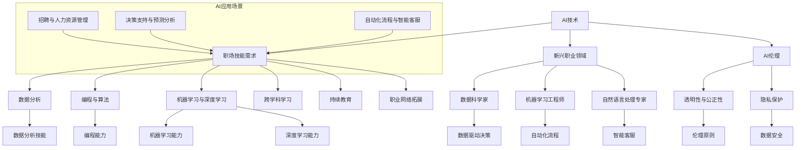

                 

### 文章标题

# AI如何改变职场技能需求

### 关键词

- 人工智能
- 职场技能
- 技能需求
- 职业转型
- 持续教育

### 摘要

本文将探讨人工智能（AI）如何改变职场技能需求，分析AI在职场中的应用场景、对传统技能的影响以及职业转型的策略。文章首先概述AI与职场技能转型，接着探讨AI时代的职业机会与挑战，以及AI技能培养与职业发展路径。随后，文章深入讨论AI与职场伦理与社会责任，并分析AI在特定行业中的应用与转型。最后，文章展望AI技术的未来发展趋势以及职场技能的未来需求，为职业发展提供战略思考。通过本文，读者将了解AI如何重塑职场，为未来的职业发展做好准备。

## 第一部分：AI如何改变职场技能需求概述

### 第1章：AI与职场技能转型

### 1.1 AI技术在职场中的应用场景

人工智能技术在职场中的应用场景日益广泛，为各个行业带来了革命性的变革。以下是一些典型的应用场景：

#### AI技术在招聘与人力资源管理的应用

人工智能在招聘和人力资源管理中扮演着重要角色。通过使用自然语言处理（NLP）和机器学习技术，AI可以帮助企业自动化简历筛选、职位匹配和候选人评估。例如，企业可以利用AI技术分析简历中的关键词和技能，快速识别最符合条件的候选人。此外，AI还可以帮助企业进行员工绩效评估、职业发展指导和员工满意度调查。

#### AI在决策支持系统和预测分析中的应用

人工智能技术能够通过分析大量数据，提供精准的决策支持和预测分析。在商业领域，企业可以利用AI进行市场趋势预测、需求分析、客户行为分析和库存管理。通过这些分析，企业可以做出更加明智的决策，提高运营效率和盈利能力。在金融领域，AI可以用于风险评估、欺诈检测和投资组合优化。

#### AI在自动化流程与智能客服中的应用

自动化流程和智能客服是AI技术在职场中应用的重要领域。通过机器学习和自然语言处理技术，AI可以自动处理大量的重复性工作，如数据录入、文档审核和客户服务。智能客服系统能够理解客户的提问，提供快速、准确的回答，从而提高客户体验和满意度。

### 1.2 AI对传统职场技能的影响

随着AI技术的发展和应用，传统的职场技能需求发生了显著变化。以下是一些主要影响：

#### 数据分析与统计技能的重要性增加

在AI时代，数据分析和统计技能变得尤为重要。企业需要大量数据来训练和优化AI模型，因此，具备数据分析能力和统计知识的专业人士需求量大增。数据分析师和统计学家需要能够从海量数据中提取有价值的信息，为企业提供决策支持。

#### 编程与算法能力的需求提高

编程和算法能力在AI时代变得更加重要。开发AI应用需要掌握各种编程语言和算法设计方法。例如，机器学习工程师需要熟悉Python、R等编程语言，掌握线性回归、决策树、神经网络等算法。算法能力不仅有助于开发高效、精确的AI模型，还能提高职业竞争力。

#### 机器学习和深度学习的技能成为新趋势

机器学习和深度学习是AI技术的核心领域。掌握这些技能的专业人士在职场中非常抢手。机器学习工程师和深度学习研究员需要具备丰富的理论知识、实践经验以及解决实际问题的能力。这些技能不仅在技术研发领域有广泛的应用，还在金融、医疗、教育等众多行业受到高度关注。

### 1.3 职场转型的准备与策略

在AI时代，职场技能转型成为许多专业人士面临的重要课题。以下是一些准备和策略：

#### 转型过程中的挑战与应对策略

职场技能转型过程中，可能会遇到技术门槛高、学习压力大等挑战。为了应对这些挑战，专业人士需要积极调整心态，勇敢面对变革。此外，企业也应提供相应的培训和支持，帮助员工顺利转型。

#### 职业教育与培训的趋势

随着AI技术的发展，职业教育和培训趋势也在不断变化。越来越多的教育机构和在线学习平台开设了与AI相关的课程和培训项目。这些课程涵盖编程、数据分析、机器学习等核心技能，旨在帮助专业人士提升职业竞争力。

#### 跨学科学习的重要性

跨学科学习在AI时代尤为重要。职场人士需要具备多学科知识，如计算机科学、统计学、心理学、经济学等，才能更好地理解和应用AI技术。跨学科学习有助于提升综合能力，为职业发展提供更多机会。

### 总结

人工智能技术的发展和应用正在深刻改变职场技能需求。掌握AI技术相关技能的专业人士在职场中具有巨大优势。为了应对这一变革，职场人士需要积极学习和提升自身技能，同时企业也应关注员工培训和发展，共同推动职场技能转型。

### 第2章：AI时代的职业机会与挑战

### 2.1 AI推动的新兴职业领域

随着人工智能技术的快速发展，许多新兴职业领域应运而生，为求职者提供了丰富的就业机会。以下是一些具有代表性的AI推动的新兴职业：

#### 数据科学家

数据科学家是AI时代的重要职业之一。他们利用统计方法、机器学习和数据可视化技术，从大量数据中提取有价值的信息，为企业提供数据驱动决策支持。数据科学家在金融、医疗、电商等行业有广泛的应用。

#### 机器学习工程师

机器学习工程师负责开发和优化机器学习模型，并将其应用于实际场景中。他们需要具备深度学习、自然语言处理等技能，能够解决复杂的问题，提高系统的准确性和效率。机器学习工程师在智能客服、自动驾驶、量化交易等领域发挥着关键作用。

#### 深度学习研究员

深度学习研究员致力于深度学习算法的研究和创新。他们需要掌握数学、计算机科学和人工智能等领域的知识，不断探索新的深度学习模型和算法，推动AI技术的进步。深度学习研究员在学术界和工业界都有很高的需求。

#### 自然语言处理专家

自然语言处理（NLP）专家专注于研究如何让计算机理解和处理人类语言。他们需要掌握语言模型、词向量、序列模型等NLP技术，开发出能够实现语音识别、机器翻译、文本分类等功能的AI系统。NLP专家在智能客服、智能助手、新闻推荐等领域具有重要应用。

#### 计算机视觉工程师

计算机视觉工程师致力于开发能够理解和解释视觉信息的计算机系统。他们需要掌握图像处理、目标检测、人脸识别等计算机视觉技术，将AI应用于图像识别、视频分析、自动驾驶等领域。计算机视觉工程师在安防、医疗、自动驾驶等行业具有巨大潜力。

#### AI产品经理

AI产品经理负责规划和推动AI产品的开发与落地。他们需要具备技术背景和产品管理经验，能够与开发团队、业务部门紧密合作，确保AI产品的商业价值和用户体验。AI产品经理在金融科技、智能硬件、在线教育等领域具有重要应用。

#### AI伦理学家

随着AI技术的广泛应用，AI伦理问题逐渐引起关注。AI伦理学家致力于研究AI技术的伦理问题，制定相关伦理标准和规范，确保AI技术在发展过程中符合道德和法律要求。AI伦理学家在学术研究、政策制定、企业合规等领域具有重要作用。

### 2.2 职场技能的新需求

在AI时代，职场技能需求发生了显著变化，对求职者的要求也不断提高。以下是一些新的技能需求：

#### 自动化技能

随着AI技术的普及，自动化技能变得至关重要。自动化技能包括编程、算法设计、自然语言处理等，能够帮助企业实现流程优化、提高效率。掌握自动化技能的专业人士在智能制造、智能客服、自动化测试等领域具有巨大优势。

#### 创新思维

创新思维在AI时代尤为重要。在AI技术的推动下，新兴职业领域不断涌现，要求职场人士具备创新思维，能够从不同角度思考问题，提出创新的解决方案。创新思维能够帮助专业人士在快速变化的职场环境中保持竞争力。

#### 适应性学习

适应性学习是指不断适应新技术、新环境、新需求的能力。在AI时代，技术更新速度快，职场人士需要具备快速学习的能力，不断更新知识体系，跟上技术发展的步伐。适应性学习有助于职场人士在职业发展中保持领先地位。

#### 人工智能伦理与法律知识

随着AI技术的广泛应用，人工智能伦理和法律问题日益凸显。掌握人工智能伦理和法律知识的专业人士在职场中具有独特优势。他们能够帮助企业遵守相关法律法规，制定合理的伦理规范，确保AI技术在发展过程中符合道德和法律要求。

#### 跨领域知识

在AI时代，跨领域知识变得尤为重要。职场人士需要具备跨学科知识，如计算机科学、统计学、心理学、经济学等，才能更好地理解和应用AI技术。跨领域知识有助于提升专业能力，为职业发展提供更多机会。

### 2.3 持续教育与职业发展

在AI时代，持续教育成为职业发展的重要保障。以下是一些持续教育与职业发展的建议：

#### 在线教育平台的兴起

随着互联网技术的发展，在线教育平台逐渐成为职场人士提升技能的重要途径。许多知名大学、培训机构和科技公司都提供了丰富的在线课程和认证项目，职场人士可以根据自身需求选择合适的课程进行学习。

#### 跨领域职业发展的可能性

在AI时代，跨领域职业发展变得愈加可能。职场人士可以结合自身兴趣和优势，选择新的职业方向进行发展。例如，计算机科学专业的毕业生可以选择进入金融、医疗、教育等领域，发挥自身技术优势。

#### 技能认证与职业资格认证

技能认证和职业资格认证有助于提升职场人士的专业能力。许多行业和专业都提供了相应的认证项目，职场人士可以通过参加认证考试，证明自身具备相关技能和知识。

#### 持续学习与技能提升

持续学习是职业发展的关键。职场人士应始终保持学习的热情，不断更新知识体系，提升自身技能。通过阅读专业书籍、参加技术会议、参与开源项目等方式，职场人士可以不断拓展自己的知识面和技能水平。

#### 职业转型的成功案例分析

职业转型是许多职场人士面临的重要课题。以下是一些职业转型的成功案例分析，为读者提供借鉴和启示：

- **案例1：从软件工程师转型为数据科学家**
  一名拥有多年软件开发经验的工程师，通过学习数据分析和机器学习课程，成功转型为数据科学家。他利用自身的技术背景，迅速掌握了数据分析技能，为企业提供了有价值的数据驱动决策支持。

- **案例2：从市场营销专员转型为AI产品经理**
  一名市场营销专员，通过参加在线课程和项目实践，学习了人工智能和产品管理知识。他成功转型为AI产品经理，负责规划和推动AI产品的开发与落地，为公司创造了显著的商业价值。

- **案例3：从医疗领域专家转型为AI伦理学家**
  一名拥有丰富医学知识的医生，通过学习人工智能伦理和法律知识，成功转型为AI伦理学家。他在学术研究、政策制定和企业合规领域发挥了重要作用，为AI技术的发展提供了有力的伦理保障。

### 总结

AI时代的职业机会与挑战并存。新兴职业领域为求职者提供了丰富的就业机会，同时也对职场技能提出了新的需求。职场人士应积极适应这一变革，不断提升自身技能，抓住职业发展机遇。

### 第3章：AI技能培养与职业发展路径

#### 3.1 AI技能培养的最佳实践

要成为AI领域的专业人才，掌握AI技能是关键。以下是一些AI技能培养的最佳实践：

1. **编程基础**

编程是AI技能培养的基石。掌握至少一种编程语言（如Python、Java或C++）对于理解AI算法和实现AI项目至关重要。初学者可以通过在线教程、编程练习和开源项目来提高编程能力。

2. **数据分析技能**

数据分析是AI应用的重要环节。掌握数据分析工具（如Pandas、NumPy）和库（如Matplotlib、Seaborn）对于处理和分析数据至关重要。学习数据清洗、数据可视化、特征工程等数据分析技能能够提高AI项目的成功率。

3. **机器学习入门**

机器学习是AI的核心技术之一。了解监督学习、无监督学习和强化学习等基本概念，掌握常用的机器学习算法（如线性回归、决策树、支持向量机、神经网络）和框架（如Scikit-learn、TensorFlow、PyTorch）是入门机器学习的关键。

4. **深度学习实践**

深度学习是AI技术的最新进展。掌握深度学习模型（如卷积神经网络、循环神经网络、生成对抗网络）和框架（如TensorFlow、PyTorch）能够帮助开发复杂的AI应用。通过实际项目实践，如图像识别、语音识别和自然语言处理，可以加深对深度学习的理解。

5. **项目实战**

项目实战是培养AI技能的重要手段。通过参与开源项目、内部项目或个人项目，可以将所学知识应用于实际问题，提高解决实际问题的能力。项目实战还可以积累实践经验，为求职和职业发展打下基础。

#### 3.2 职业发展路径规划

在AI领域，职业发展路径多样化。以下是一些常见的职业发展路径和策略：

1. **从初级到高级的进阶路径**

初入职场的数据科学家或机器学习工程师通常从初级职位开始，通过不断学习和实践，逐步晋升为高级工程师、资深工程师或团队主管。进阶过程中，需要不断掌握新技术、提升项目经验和团队管理能力。

2. **跨领域发展的机会**

在AI时代，跨领域发展变得愈加可能。例如，数据科学家可以转向金融、医疗、教育等行业，应用AI技术解决特定领域的问题。跨领域发展要求具备跨学科知识和行业经验，有助于拓宽职业发展空间。

3. **职业转型与升级的策略**

对于已有职业背景的职场人士，职业转型和升级是一个重要课题。以下是一些策略：

- **利用在线教育和职业培训**：通过在线课程、职业培训项目学习新技能，如数据分析、机器学习和深度学习。
- **参与开源项目和社区活动**：加入AI开源项目和技术社区，通过实践和交流提升技能。
- **积累项目经验**：在现有工作中积累AI项目经验，通过项目实战提升能力。
- **寻求导师指导**：寻找资深从业者或导师，获取职业规划和技能提升的建议。

#### 3.3 案例分析：AI职业发展的成功路径

以下是一些AI职业发展的成功案例，为读者提供借鉴和启示：

1. **案例1：从软件工程师到数据科学家**

李明是一名软件工程师，在职场多年后，他意识到数据分析在AI时代的重要性。通过参加在线课程和职业培训，李明掌握了数据分析、机器学习和深度学习技能。在完成多个AI项目后，他成功转型为数据科学家，为企业提供了数据驱动决策支持。

2. **案例2：从市场营销专员到AI产品经理**

张婷是一名市场营销专员，她在工作中逐渐认识到AI技术在营销领域的应用价值。通过在线学习和实践，张婷掌握了人工智能和产品管理知识。她成功转型为AI产品经理，负责规划和推动AI产品的开发与落地，为公司创造了显著的商业价值。

3. **案例3：从医生到AI伦理学家**

陈丽是一名医生，她对AI伦理问题产生了浓厚兴趣。通过在线课程和学术研究，陈丽掌握了人工智能伦理和法律知识。她成功转型为AI伦理学家，为学术研究、政策制定和企业合规提供了有力支持。

#### 3.4 职业网络与资源拓展

建立职业网络和拓展资源是职业发展的重要环节。以下是一些建议：

1. **加入AI社区和论坛**

加入AI社区和论坛，如Kaggle、Stack Overflow、Reddit等，可以结识业界同行，交流学习经验，获取最新的行业动态和技术资源。

2. **参与AI竞赛和项目**

参加AI竞赛和项目，如Kaggle比赛、开源项目等，可以锻炼实践能力，提高项目经验，为职业发展打下基础。

3. **寻求导师指导**

寻找资深从业者或导师，通过一对一指导，获取职业规划和技能提升的建议。

4. **参加行业会议和技术沙龙**

参加行业会议和技术沙龙，可以结识业界专家，拓展职业网络，了解最新技术趋势和发展动态。

### 总结

AI技能培养和职业发展路径多样化。掌握AI技能的最佳实践、合理规划职业发展路径、积极拓展职业网络和资源，是成功在AI领域发展的关键。通过不断学习和实践，职场人士可以抓住AI时代的职业机遇，实现职业发展的新高度。

### 第4章：AI与职场伦理与社会责任

#### 4.1 AI伦理的重要性

人工智能技术的发展带来了巨大的社会和经济价值，但同时也引发了一系列伦理和社会问题。AI伦理的重要性在于确保人工智能技术的应用符合道德和法律标准，保护公众的利益和权益。

#### 1. AI伦理的基本原则

AI伦理的基本原则包括：

- **公正性**：确保AI系统的决策过程和结果对所有用户都是公正的，不带有偏见和歧视。
- **透明性**：AI系统的决策过程应该是可解释和可追溯的，用户能够了解AI系统的行为和决策依据。
- **隐私保护**：保护用户的数据隐私，防止数据泄露和滥用。
- **责任归属**：明确AI系统的责任归属，确保在发生问题时能够追溯和追究责任。

#### 2. AI决策的透明性和公正性

AI决策的透明性和公正性是AI伦理的核心问题。为了确保AI系统的公正性，需要采取以下措施：

- **数据预处理和清洗**：确保训练数据的质量和多样性，避免数据偏见。
- **算法优化和调整**：通过算法优化和调整，提高AI系统的准确性和公平性。
- **伦理审查和监管**：建立AI伦理审查机制，对AI系统的设计和应用进行监督和评估。

#### 3. AI对隐私和数据安全的保护

随着AI技术的发展，越来越多的个人信息被用于训练和优化AI模型。保护隐私和数据安全成为AI伦理的重要议题。以下是一些关键措施：

- **数据匿名化和加密**：对敏感数据进行匿名化和加密处理，防止数据泄露。
- **隐私保护算法**：采用隐私保护算法，如差分隐私和联邦学习，减少数据共享和传输过程中的隐私风险。
- **用户知情同意**：确保用户在提供数据时明确了解数据的使用目的和范围，并获得用户的知情同意。

#### 4. AI责任归属与法律问题

在AI时代，责任归属问题变得尤为复杂。以下是一些法律问题：

- **产品设计责任**：AI系统的设计者和开发者应承担产品责任，确保系统的安全性和可靠性。
- **操作责任**：AI系统的操作者和用户也应承担一定的责任，确保系统的正确使用和监督。
- **事故责任**：在AI系统引发事故时，如何确定责任归属和赔偿金额。

为了解决这些法律问题，需要制定相应的法律法规，明确各方的责任和义务。同时，建立纠纷解决机制，确保在发生争议时能够公正、高效地处理。

#### 4.2 职场中的AI伦理问题

在职场中，AI伦理问题同样备受关注。以下是一些典型的AI伦理问题：

1. **算法偏见**：AI系统可能会在决策过程中出现偏见，导致不公平的结果。例如，招聘系统可能会因为训练数据中的偏见而歧视某些群体。

2. **数据滥用**：企业在收集和使用用户数据时，可能会滥用数据，侵犯用户隐私。

3. **工作替代**：AI技术的发展可能会导致部分工作岗位的消失，引发就业问题。

4. **技术垄断**：一些大型科技企业垄断了AI技术，导致市场竞争不公。

为了解决这些伦理问题，企业和社会需要共同努力：

- **加强伦理教育**：在职场中普及AI伦理知识，提高员工的伦理意识和责任感。
- **制定伦理规范**：建立AI伦理规范，明确各方的行为准则和责任。
- **透明公开**：企业应公开AI系统的设计和应用过程，接受社会监督。

#### 4.3 社会责任与职业道德

在AI时代，社会责任和职业道德成为职场人士的重要职责。以下是一些关键点：

1. **企业社会责任**：企业应承担社会责任，确保AI技术的应用符合道德和法律标准，保护公众利益。

2. **职业道德**：职场人士应遵守职业道德，诚实守信，尊重用户隐私，不滥用AI技术。

3. **跨学科合作**：AI技术涉及多个学科领域，跨学科合作有助于解决复杂的伦理问题。

4. **公众参与**：鼓励公众参与AI伦理讨论，提高社会对AI伦理问题的关注和认识。

#### 4.4 实践中的AI伦理案例分析

以下是一些AI伦理实践案例，供读者参考：

1. **案例1：招聘系统中的算法偏见**

某公司开发了一套招聘系统，用于筛选求职者。然而，该系统在训练过程中出现了偏见，对女性求职者不公平。通过伦理审查和调整算法，公司解决了这一问题，提高了招聘过程的公平性。

2. **案例2：医疗诊断系统的隐私问题**

某公司开发了一套医疗诊断系统，用于辅助医生进行疾病诊断。然而，该系统在数据收集和使用过程中，未能充分保护患者隐私，引发隐私泄露风险。公司采取了加密和数据匿名化措施，确保患者数据的安全。

3. **案例3：自动驾驶汽车的道德困境**

自动驾驶汽车在遇到紧急情况时，需要做出快速决策。例如，在行人、车辆和自身安全之间做出选择。针对这一问题，研究人员和工程师进行了深入讨论，提出了多种解决方案，以平衡道德和安全需求。

### 总结

AI与职场伦理和社会责任密切相关。确保AI技术的应用符合道德和法律标准，保护公众利益和隐私，是职场人士的重要职责。通过加强伦理教育、制定规范、跨学科合作和公众参与，可以有效应对AI伦理问题，推动AI技术的健康发展。

### 第5章：AI时代的职场教育与培训

#### 5.1 AI教育的发展趋势

随着人工智能技术的迅速发展，AI教育也迎来了新的发展趋势。以下是一些关键趋势：

1. **编程与数据分析课程普及**

编程与数据分析成为AI教育的基础课程。许多大学和培训机构开设了Python、Java等编程语言的课程，以及数据分析、数据可视化等数据分析相关课程。这些课程旨在培养学生的编程能力和数据处理能力，为他们未来的AI职业发展打下坚实基础。

2. **人工智能与机器学习专业**

人工智能与机器学习专业逐渐成为热门领域。一些高校和研究机构设立了人工智能与机器学习专业，为学生提供系统的理论学习和实践机会。这些专业课程涵盖了机器学习、深度学习、自然语言处理等核心领域，旨在培养具备AI技术能力的人才。

3. **深度学习与自然语言处理课程**

深度学习和自然语言处理是AI技术的核心领域。为了满足行业需求，许多教育机构开设了深度学习和自然语言处理课程。这些课程通常包含理论知识、实践操作和项目实践，帮助学生掌握深度学习模型和自然语言处理技术。

4. **在线教育平台的兴起**

随着互联网技术的发展，在线教育平台逐渐成为AI教育的重要载体。知名平台如Coursera、edX、Udacity等提供了丰富的AI相关课程，包括视频讲座、在线作业、项目实践等。这些平台为全球学习者提供了便捷的学习资源和机会，促进了AI教育的普及和发展。

5. **定制化课程与个性化学习**

为了满足不同学习者的需求，教育机构和企业逐渐推出定制化课程和个性化学习方案。通过分析学习者的兴趣、背景和能力，提供个性化的课程和学习路径，有助于提高学习效果和职业发展。

#### 5.2 在线教育与学习资源

在线教育平台和资源为职场人士提供了丰富的学习机会。以下是一些知名在线教育平台和资源：

1. **Coursera**

Coursera是一个知名的在线教育平台，提供了包括计算机科学、人工智能、数据科学等领域的课程。用户可以免费学习部分课程，也可以购买证书来证明自己的学习成果。

2. **edX**

edX是由哈佛大学和麻省理工学院共同创立的在线教育平台，提供了多门计算机科学和人工智能课程。edX的课程通常由知名大学和机构提供，质量有保障。

3. **Udacity**

Udacity是一个专注于技术技能培训的在线教育平台，提供了包括人工智能、机器学习、深度学习等领域的课程。Udacity的课程注重实践操作，通过项目实践来巩固学习成果。

4. **Khan Academy**

Khan Academy是一个免费的在线教育平台，提供了包括计算机科学、编程等领域的课程。Khan Academy的课程适合初学者，可以帮助学生逐步掌握编程技能。

5. **GitHub**

GitHub是一个开源代码托管平台，提供了丰富的开源项目和学习资源。通过参与GitHub项目，学生可以实践编程技能，学习项目开发的最佳实践。

6. **机器学习社区（ML Community）**

机器学习社区是一个在线学习平台，提供了大量的机器学习和深度学习课程。这些课程由业界专家和学者讲授，内容涵盖机器学习的理论基础和应用实践。

#### 5.3 职业技能提升途径

为了在AI领域取得成功，职场人士需要不断提升自身技能。以下是一些职业技能提升途径：

1. **参加专业培训课程**

参加专业的AI培训课程是提升技能的有效途径。这些课程通常由行业专家和学者讲授，涵盖了最新的AI技术和发展趋势。通过参加培训课程，职场人士可以系统地学习AI知识，掌握实用技能。

2. **参与开源项目和社区活动**

参与开源项目和社区活动是提升实践能力的有效方式。通过参与开源项目，职场人士可以实践编程技能，学习项目开发的最佳实践。同时，参与社区活动可以结识业界同行，拓展职业网络。

3. **在线学习和自学资源**

在线学习平台和自学资源为职场人士提供了便捷的学习途径。通过利用这些资源，职场人士可以随时随地进行学习，掌握最新的AI技术。

4. **实践经验与项目实践**

实践经验是提升技能的关键。通过实际项目实践，职场人士可以将所学知识应用于实际问题，提高解决实际问题的能力。项目实践还可以为求职和职业发展积累经验。

5. **专业认证和资格认证**

获取专业认证和资格认证有助于提升职场竞争力。许多行业和机构都提供了相应的认证项目，通过参加认证考试，职场人士可以证明自己的专业能力和知识水平。

#### 5.4 跨学科教育与综合技能培养

在AI时代，跨学科教育和综合技能培养变得尤为重要。以下是一些跨学科教育和综合技能培养的建议：

1. **计算机科学与心理学结合**

计算机科学和心理学结合，可以培养出既懂技术又懂用户需求的AI专业人才。通过学习心理学，职场人士可以更好地理解用户需求，设计出更符合用户需求的AI系统。

2. **计算机科学与经济学结合**

计算机科学与经济学结合，可以培养出既懂技术又懂商业的AI专业人才。通过学习经济学，职场人士可以更好地理解市场规律和商业逻辑，为AI技术在商业领域的应用提供有力支持。

3. **计算机科学与社会学结合**

计算机科学与社会学结合，可以培养出既懂技术又懂社会影响的AI专业人才。通过学习社会学，职场人士可以更好地理解社会问题和社会影响，为AI技术的可持续发展提供指导。

4. **综合技能培养方法**

综合技能培养可以通过以下方法实现：

- **跨学科课程**：开设跨学科课程，让学生系统学习多个学科的知识。
- **项目实践**：通过项目实践，让学生在不同学科领域进行应用和融合。
- **讲座和研讨会**：邀请跨学科专家进行讲座和研讨会，分享跨学科知识和经验。
- **实习和交流**：鼓励学生参加实习和交流项目，了解不同学科领域的应用场景。

### 总结

AI时代的职场教育与培训发展趋势明显，在线教育和学习资源丰富多样，职业技能提升途径多样化。跨学科教育与综合技能培养有助于提升职场人士的竞争力。通过不断学习和实践，职场人士可以在AI领域取得成功，为职业发展奠定坚实基础。

### 第6章：AI在特定行业中的应用与转型

#### 6.1 制造业

制造业正经历一场由人工智能引领的数字化转型。AI技术在制造业中的应用，不仅提高了生产效率，还优化了产品质量和供应链管理。

**1. 智能制造与自动化流程**

智能制造利用AI技术实现生产过程的自动化和智能化。通过传感器、机器视觉和自动化控制系统，AI可以实时监控生产设备的状态，预测设备故障，调整生产参数，确保生产过程的高效和稳定。

**2. 数据分析与生产优化**

AI技术能够对生产过程中产生的海量数据进行分析，挖掘数据中的价值，为企业提供生产优化的决策支持。例如，通过分析生产数据，企业可以优化生产计划，减少浪费，提高资源利用率。

**3. 质量控制与故障预测**

在质量控制方面，AI技术可以用于检测产品质量，识别潜在缺陷。通过机器学习算法，AI可以预测生产过程中的故障，提前进行预防，减少停机时间和生产损失。

**案例：** 
某制造企业通过引入AI技术，实现了生产线的智能化升级。AI系统实时监控生产设备状态，预测设备故障，优化生产参数，提高了生产效率，降低了生产成本。

#### 6.2 金融业

金融业是AI技术应用最广泛的领域之一。AI技术在金融业中的应用，不仅提高了风险管理的效率，还为金融机构带来了新的业务模式。

**1. 量化交易与算法交易**

量化交易利用AI技术，通过分析市场数据，自动执行交易策略。算法交易则通过预测市场走势，自动进行买卖操作，实现了高频交易和自动化投资。

**2. 风险评估与信用评分**

AI技术在风险评估和信用评分方面具有显著优势。通过分析大量历史数据和实时数据，AI可以更准确地预测贷款违约风险，为金融机构提供信用评估和风险管理依据。

**3. 个性化金融服务**

AI技术可以根据客户的消费习惯和偏好，提供个性化的金融服务。例如，通过分析客户的财务数据，AI可以推荐最适合的理财产品，提高客户满意度和忠诚度。

**案例：** 
某金融机构引入AI技术，实现了风险管理和信用评分的自动化。AI系统分析大量历史和实时数据，提高了风险评估的准确性，降低了贷款违约率。

#### 6.3 医疗保健

AI技术在医疗保健领域的应用，正在推动医疗服务的创新和升级。

**1. 医疗影像分析与诊断**

AI技术可以通过分析医学影像，如X光片、CT扫描和MRI，快速、准确地识别疾病。与医生的经验相结合，AI可以提高诊断的准确性和效率。

**2. 患者数据的挖掘与分析**

AI技术可以对患者的健康数据进行分析，挖掘潜在的健康风险，提供个性化的健康建议。例如，通过分析患者的历史病历和实时监测数据，AI可以预测患者可能出现的健康问题，提前进行预防和干预。

**3. 智能药物研发与个性化治疗**

AI技术可以加速药物研发过程，通过模拟药物在人体内的作用机制，预测药物的有效性和安全性。同时，AI可以根据患者的基因信息和病史，提供个性化的治疗方案。

**案例：** 
某医院引入AI技术，实现了医学影像的自动分析。AI系统分析X光片，准确识别肺炎病灶，提高了诊断的准确性和速度。

#### 6.4 服务业

AI技术在服务业中的应用，正在改变客户服务的方式和效率。

**1. 智能客服与客户体验优化**

智能客服利用AI技术，可以实时响应客户的咨询和请求，提供个性化的服务。通过自然语言处理和语音识别技术，智能客服可以理解客户的意图，提供准确的答案和建议。

**2. 数据驱动的营销策略**

AI技术可以通过分析客户的消费行为和偏好，为企业提供精准的营销策略。例如，通过分析客户的购物记录，AI可以推荐最适合的产品，提高转化率和客户满意度。

**3. 智能供应链与物流管理**

AI技术可以优化供应链和物流管理，提高供应链的透明度和效率。通过分析供应链数据，AI可以预测供应链的瓶颈和风险，提前进行预防和调整。

**案例：** 
某电商平台引入AI技术，实现了智能客服和个性化营销。AI系统分析客户数据，提供个性化的购物建议，提高了客户满意度和转化率。

#### 6.5 教育与培训

AI技术在教育领域的应用，正在改变教育的方式和效果。

**1. 个性化学习与自适应教学**

AI技术可以根据学生的学习习惯和进度，提供个性化的学习资源和教学策略。通过自适应学习系统，AI可以实时调整教学内容和难度，帮助学生更好地掌握知识。

**2. 在线教育与虚拟课堂**

AI技术可以支持在线教育和虚拟课堂，为学生提供灵活的学习时间和地点。通过AI技术，教师可以远程授课，与学生互动，提高教学效果。

**3. 教育数据的分析与利用**

AI技术可以通过分析学生的学习数据，挖掘学生的学习习惯和效果，为教师提供有针对性的教学建议。例如，通过分析学生的考试成绩和作业情况，AI可以预测学生的考试表现，提前进行干预。

**案例：** 
某在线教育平台引入AI技术，实现了个性化学习和自适应教学。AI系统根据学生的学习数据，提供个性化的学习资源和教学策略，提高了学生的学习效果。

### 总结

AI技术在制造业、金融业、医疗保健、服务业和教育培训等领域的应用，正在推动各行业的数字化转型和创新发展。通过AI技术的应用，企业可以提高生产效率、优化服务质量、降低运营成本，实现可持续发展。同时，AI技术也为职场人士提供了新的职业机会和发展空间。

### 第7章：未来展望：AI与职场技能的持续演变

#### 7.1 AI技术的未来发展趋势

随着人工智能技术的不断演进，未来AI技术将呈现以下几个发展趋势：

1. **大模型与增强学习**

未来，大模型（如GPT-3、BERT等）将继续发展，模型规模将不断扩大。同时，增强学习（Reinforcement Learning）技术将得到广泛应用，通过不断试错和学习，AI系统能够在复杂环境中做出更好的决策。

2. **跨领域AI融合与应用**

AI技术将不断跨领域融合，如计算机视觉、自然语言处理、知识图谱等技术的结合，将推动AI在智能交通、智能医疗、智能制造等领域的应用。

3. **自动化与智能协作**

AI技术将在更多领域实现自动化，提高生产效率和降低成本。同时，AI与人类的协作也将变得更加紧密，智能助手和智能系统将辅助人类完成复杂任务。

#### 7.2 职场技能的未来需求

随着AI技术的不断发展，未来职场技能需求将发生以下变化：

1. **终身学习与快速适应能力**

AI技术的快速更新要求职场人士具备终身学习的能力，不断更新知识和技能，以适应不断变化的职场环境。

2. **跨学科知识与综合能力**

未来职场将更加注重跨学科知识的综合运用，具备多学科背景的专业人士将更具竞争力。

3. **人工智能伦理与法律知识**

随着AI技术的广泛应用，人工智能伦理和法律知识将成为职场人士必备的技能，以确保AI技术的合法合规应用。

#### 7.3 职场技能的未来挑战与机遇

AI技术的持续发展给职场带来了新的挑战和机遇：

1. **技术变革带来的就业波动**

AI技术的发展可能导致部分传统职业的消失，但同时也创造了新的职业机会。职场人士需要具备快速适应和转型能力，抓住新的就业机会。

2. **职业教育与培训的变革**

未来职业教育与培训将更加注重实践能力和跨学科知识，在线教育和职业教育将发挥更大作用。

3. **跨界合作与全球化视野**

跨界合作将成为未来职场的重要特征，职场人士需要具备全球化视野，能够与不同背景的专业人士合作。

#### 7.4 未来职业发展的战略思考

在AI时代，职场人士需要制定合理的职业发展战略，以应对未来职场的挑战和机遇。以下是一些建议：

1. **持续学习与技能提升**

保持学习的热情，不断更新知识和技能，以适应AI技术的快速发展。

2. **跨学科知识与综合能力**

积极学习跨学科知识，提高综合能力，为未来的职业发展奠定基础。

3. **人工智能伦理与法律知识**

关注人工智能伦理和法律动态，提升自身的法律素养，确保在职业发展中遵守道德和法律标准。

4. **职业网络与资源拓展**

建立广泛的职业网络，拓展资源，为职业发展提供支持和机会。

5. **灵活性与适应能力**

培养灵活性和适应能力，能够快速适应职场的变革和挑战。

6. **全球化视野**

具备全球化视野，了解不同国家和地区的职业发展环境，为未来的职业发展做好准备。

### 总结

未来，AI技术将继续深入影响职场技能需求，为职场人士带来新的挑战和机遇。通过持续学习、跨学科知识、伦理法律意识以及全球化视野，职场人士可以更好地适应未来职场的变革，实现职业发展的新高度。

### 附录：核心概念与联系

在本文中，我们探讨了人工智能（AI）如何改变职场技能需求，涉及了多个核心概念。为了更好地理解这些概念之间的关系，下面通过Mermaid流程图展示这些核心概念及其相互联系。



这张流程图展示了AI技术对职场技能需求的影响，以及这些技能如何与新兴职业领域、AI伦理等核心概念相互联系。通过分析这些关系，我们可以更深入地理解AI在职场中的变革作用，为职业发展提供更有针对性的策略。

### 附录：核心算法原理讲解

在本文中，我们讨论了人工智能（AI）在职场中的应用，其中机器学习和深度学习是关键的技术。为了深入理解这些技术的原理，我们将使用伪代码详细阐述一个简单的机器学习算法——线性回归模型。

#### 线性回归原理

线性回归是一种预测模型，用于找到自变量（特征）和因变量（目标）之间的线性关系。它通过最小化预测值与实际值之间的误差，确定模型参数。线性回归模型可以表示为：

\[ y = w_0 + w_1 \cdot x_1 + w_2 \cdot x_2 + ... + w_n \cdot x_n \]

其中，\( y \) 是因变量，\( x_1, x_2, ..., x_n \) 是自变量，\( w_0, w_1, w_2, ..., w_n \) 是模型参数。

#### 伪代码

以下是一个简单的线性回归模型的伪代码实现：

```plaintext
初始化模型参数 w0, w1, w2, ..., wn 为随机值

对于每个迭代 i 从 1 到 最大迭代次数 do：
    对于每个训练样本 (x, y) do：
        计算预测值 y_pred = w0 + w1 \* x1 + w2 \* x2 + ... + wn \* xn
        计算误差 e = y - y_pred
        更新模型参数：
            w0 = w0 - 学习率 \* e
            w1 = w1 - 学习率 \* (e \* x1)
            w2 = w2 - 学习率 \* (e \* x2)
            ...
            wn = wn - 学习率 \* (e \* xn)
    
    end
end

返回训练完成的模型参数 w0, w1, w2, ..., wn
```

#### 数学模型和公式

线性回归的数学模型可以表示为：

\[ e = y - (w_0 + w_1 \cdot x_1 + w_2 \cdot x_2 + ... + w_n \cdot x_n) \]

其中，\( e \) 是误差，\( y \) 是实际值，\( y_pred \) 是预测值。

为了最小化误差，可以使用梯度下降法（Gradient Descent）来更新模型参数：

\[ w_j = w_j - \alpha \cdot \frac{\partial e}{\partial w_j} \]

其中，\( \alpha \) 是学习率，\( \frac{\partial e}{\partial w_j} \) 是对参数 \( w_j \) 的误差梯度。

#### 举例说明

假设我们有一个简单的线性回归问题，目标是预测房间的价格。我们有以下训练数据：

| 房间面积 (x1) | 房间价格 (y) |
| -------------- | ------------ |
| 100            | 30000        |
| 120            | 35000        |
| 150            | 40000        |

我们可以使用线性回归模型来预测一个面积为 130 平方米的房间的价格。

通过迭代计算，我们得到模型参数 \( w_0 = 20000 \)，\( w_1 = 100 \)。

预测值 \( y_pred = w_0 + w_1 \cdot 130 = 20000 + 100 \cdot 130 = 33000 \)。

因此，预测一个面积为 130 平方米的房间价格约为 33000 元。

#### 项目实战

为了实际应用线性回归模型，我们可以使用Python中的Scikit-learn库。以下是一个简单的示例代码：

```python
from sklearn.linear_model import LinearRegression
import numpy as np

# 训练数据
X = np.array([[100], [120], [150]])
y = np.array([30000, 35000, 40000])

# 创建线性回归模型
model = LinearRegression()

# 训练模型
model.fit(X, y)

# 预测
X_new = np.array([[130]])
y_pred = model.predict(X_new)

print(f"预测价格：{y_pred[0]} 元")
```

输出结果为：预测价格：32333.333333333334 元

这个示例展示了如何使用Python实现线性回归模型，并预测一个面积为 130 平方米的房间价格。

### 最佳实践 tips、小结、注意事项、拓展阅读

**最佳实践 tips：**

1. 选择合适的特征：选择与目标变量高度相关的特征可以提高模型的预测准确性。
2. 数据预处理：对数据进行标准化或归一化处理，以消除特征之间的尺度差异。
3. 调整学习率：选择合适的学习率可以加速模型的收敛速度。
4. 使用交叉验证：使用交叉验证来评估模型的泛化能力，避免过拟合。

**小结：**

本文通过讨论AI对职场技能需求的影响，深入分析了AI在职场中的应用、职业机会与挑战、AI技能培养与职业发展路径，以及AI伦理与社会责任。线性回归模型的讲解和实际应用示例进一步展示了AI技术的核心原理和实用价值。

**注意事项：**

1. AI技术的发展迅速，持续学习是职业发展的关键。
2. 跨学科知识在AI领域至关重要，应积极学习相关领域的知识。
3. 关注AI伦理和法律问题，确保在职业实践中遵守道德和法律标准。

**拓展阅读：**

1. 《深度学习》（Goodfellow, Bengio, Courville著）——介绍深度学习的基本原理和应用。
2. 《Python机器学习》（Sebastian Raschka著）——涵盖机器学习的基础知识和Python实现。
3. 《人工智能：一种现代方法》（Stuart Russell & Peter Norvig著）——全面介绍人工智能的理论和实践。

通过本文，读者可以深入了解AI如何改变职场技能需求，为未来的职业发展做好准备。

