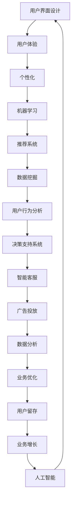

                 

### 第1章：AI与电商用户界面设计概述

#### 1.1 AI技术及其在电商领域的发展

##### 1.1.1 AI技术的基本概念与分类

人工智能（AI）是计算机科学的一个分支，旨在使机器能够执行通常需要人类智能的任务。AI可以分为两类：弱AI（弱人工智能）和强AI（强人工智能）。弱AI是指在特定任务上表现如同人类智能的机器，如语音识别、图像识别等。强AI则具有人类级别的通用智能，能够进行自主学习、推理和决策。

随着计算能力和算法的进步，AI技术在各个领域得到了广泛应用，包括医疗、金融、交通、制造业等。在电商领域，AI技术的应用尤为显著，不仅提升了平台的运营效率，还显著改善了用户体验。

##### 1.1.2 AI技术在电商领域的应用背景

电商行业竞争激烈，用户需求多样化且变化迅速。传统的电商平台用户界面设计往往难以满足这些需求，而AI技术提供了强大的数据分析和智能化处理能力，使得电商平台能够更加灵活地应对市场变化和用户偏好。

电商平台的用户界面设计涉及到产品推荐、广告投放、客户服务等多个方面。这些界面设计直接影响用户的使用体验和购买决策。通过AI技术，电商平台可以更精准地识别用户需求，提供个性化服务，从而提高用户满意度和转化率。

##### 1.1.3 电商领域对AI技术的需求

在电商领域，AI技术被广泛应用于以下几个方面：

1. **个性化推荐**：通过分析用户的历史购买行为和浏览记录，AI技术可以生成个性化的产品推荐，提高用户的购买意愿。
2. **广告投放优化**：AI技术可以根据用户的兴趣和行为数据，精准投放广告，提高广告的点击率和转化率。
3. **智能客服**：通过自然语言处理技术，AI可以自动解答用户的问题，提供24/7的在线客服服务。
4. **库存管理**：AI技术可以帮助电商平台优化库存管理，减少库存过剩和缺货的情况。
5. **供应链优化**：通过分析物流数据，AI技术可以优化供应链，减少运输成本和物流时间。

#### 1.2 电商平台用户界面设计的重要性

##### 1.2.1 用户界面的定义与作用

用户界面（User Interface，UI）是用户与系统交互的界面。在电商平台上，用户界面设计直接影响用户的使用体验和满意度。一个优秀的设计可以提高用户操作的便捷性，降低学习成本，增加用户的粘性和忠诚度。

##### 1.2.2 电商平台用户界面的特点

电商平台用户界面的特点包括：

1. **简洁性**：界面设计应该简洁明了，避免冗余信息，使用户能够快速找到所需内容。
2. **易用性**：界面设计应该易于使用，使不同年龄、文化和技能水平的用户都能轻松操作。
3. **交互性**：界面设计应该鼓励用户与平台进行互动，提供多种交互方式，如搜索、筛选、比较等。
4. **个性化**：界面设计应该根据用户的偏好和行为进行个性化调整，提供定制化的内容和服务。

##### 1.2.3 用户界面设计对电商平台的影响

用户界面设计对电商平台的影响主要体现在以下几个方面：

1. **用户体验**：优秀的设计可以提高用户体验，增加用户满意度和忠诚度。
2. **转化率**：优化的界面设计可以引导用户进行购买操作，提高转化率。
3. **品牌形象**：良好的界面设计可以提升电商平台的专业形象，增强用户对品牌的信任。
4. **运营效率**：优化的界面设计可以减少用户操作错误，提高运营效率。

#### 1.3 AI在电商平台用户界面设计中的应用场景

##### 1.3.1 智能推荐系统

智能推荐系统是AI在电商平台用户界面设计中最常见的应用之一。通过分析用户的行为数据，如浏览历史、购买记录等，AI算法可以预测用户的兴趣，并推荐相关产品。这种个性化推荐可以提高用户的购物体验，增加购买概率。

##### 1.3.2 个性化广告

个性化广告是基于用户的行为和兴趣数据，为用户展示相关广告。通过AI技术，电商平台可以更精准地定位用户，提高广告的点击率和转化率。

##### 1.3.3 智能客服系统

智能客服系统利用自然语言处理技术，自动解答用户的问题，提供24/7的在线客服服务。通过AI技术，客服系统能够快速响应，提高用户满意度。

##### 1.3.4 数据可视化

数据可视化技术可以将复杂的电商数据以直观的图表形式展示出来，帮助用户更好地理解数据，做出更明智的决策。

#### 1.4 AI改善电商用户界面设计的优势与挑战

##### 1.4.1 AI改善电商用户界面设计的优势

1. **提高个性化水平**：AI技术可以根据用户的行为和偏好，提供个性化的服务，提高用户体验。
2. **优化资源分配**：通过数据分析和预测，AI技术可以优化库存管理、广告投放等资源的分配，提高运营效率。
3. **降低开发成本**：AI技术可以自动化许多重复性任务，降低开发和维护成本。
4. **提升用户满意度**：AI技术可以提供更加便捷、个性化的服务，提高用户满意度和忠诚度。

##### 1.4.2 AI改善电商用户界面设计的挑战

1. **数据隐私和安全**：AI技术需要大量的用户数据进行分析，这可能导致数据隐私和安全问题。
2. **技术复杂性**：AI技术涉及多个学科，如计算机科学、统计学、机器学习等，开发和维护需要高水平的技术团队。
3. **用户适应期**：AI技术的引入可能会改变用户的操作习惯，需要一定的时间来适应。

##### 1.4.3 应对挑战的策略与建议

1. **加强数据安全和隐私保护**：电商平台应该采取严格的数据保护措施，确保用户数据的安全和隐私。
2. **培养专业团队**：电商平台应该培养专业的AI团队，提高技术能力和创新能力。
3. **用户引导**：在引入AI技术时，电商平台应该积极引导用户，帮助他们适应新的操作方式。

# 第2章：AI核心概念与电商用户界面设计

## 2.1 人工智能基本原理

### 2.1.1 人工智能的发展历程

人工智能（AI）的概念最早可以追溯到20世纪50年代。当时，计算机科学家艾伦·图灵提出了图灵测试，用以判断机器是否具有人类智能。这一理论为人工智能的发展奠定了基础。

自那时以来，人工智能经历了几个重要的发展阶段：

1. **早期探索阶段（1956-1969年）**：这一时期，人工智能主要集中在符号主义和逻辑推理上。典型的代表是约翰·麦卡锡等人提出的“逻辑理论家”（Logic Theorist）程序。
2. **黄金时代（1979-1989年）**：这一时期，人工智能的应用开始得到广泛认可，出现了诸如专家系统（Expert Systems）等实际应用。
3. **低谷期（1989-1999年）**：由于现实世界的复杂性和计算资源的限制，人工智能的研究和应用出现了一定程度的停滞。
4. **复兴时期（2000年至今）**：随着计算机性能的不断提高和大数据、机器学习等新技术的出现，人工智能再次得到了广泛关注和快速发展。

### 2.1.2 人工智能的主要分支

人工智能主要可以分为以下几个分支：

1. **符号主义人工智能**：这种人工智能依赖于逻辑和符号表示，通过推理和演绎来解决问题。专家系统是符号主义人工智能的一个典型例子。
2. **统计学人工智能**：这种人工智能依赖于统计学方法，通过数据分析来发现规律和模式。机器学习和深度学习是统计学人工智能的两个重要分支。
3. **计算智能**：这种人工智能依赖于计算方法和算法，通过模拟生物和自然界的现象来解决问题。典型的计算智能方法包括遗传算法、粒子群优化等。
4. **混合智能**：混合智能结合了多个人工智能分支的特点，通过综合利用不同方法来提高解决问题的能力。

### 2.1.3 人工智能的基本原理

人工智能的基本原理包括以下几个方面：

1. **信息处理**：人工智能系统通过输入、处理和输出信息来完成各种任务。信息处理包括数据的采集、存储、处理和传输。
2. **学习与适应**：人工智能系统通过学习来获取知识和技能，通过适应来应对新的环境和挑战。学习包括监督学习、无监督学习和强化学习等。
3. **推理与决策**：人工智能系统通过推理来解决问题，通过决策来选择最优的解决方案。推理包括演绎推理、归纳推理等。
4. **感知与交互**：人工智能系统通过感知来获取外部信息，通过交互来与外部环境进行互动。感知包括视觉、听觉、触觉等。

## 2.2 机器学习与深度学习在电商用户界面设计中的应用

### 2.2.1 机器学习的基本概念

机器学习（Machine Learning，ML）是统计学和计算机科学的交叉领域，通过算法和统计模型来让计算机从数据中学习，从而完成特定的任务。机器学习可以分为监督学习、无监督学习和强化学习三种主要类型。

1. **监督学习**：监督学习是一种有监督的学习方法，训练数据包括输入和对应的输出标签。常见的算法包括线性回归、支持向量机（SVM）和决策树等。
2. **无监督学习**：无监督学习是一种无监督的学习方法，训练数据没有标签。常见的算法包括聚类、主成分分析（PCA）和自编码器等。
3. **强化学习**：强化学习是一种通过奖励机制来指导学习的方法。常见的算法包括Q学习、深度Q网络（DQN）和策略梯度等。

### 2.2.2 深度学习的基本概念

深度学习（Deep Learning，DL）是机器学习的一个重要分支，它依赖于多层神经网络来学习数据的复杂结构和模式。深度学习在图像识别、语音识别和自然语言处理等领域取得了显著成果。

1. **神经网络**：神经网络是由大量神经元组成的计算模型，用于模拟生物神经系统的工作原理。常见的神经网络包括前馈神经网络、卷积神经网络（CNN）和循环神经网络（RNN）等。
2. **深度学习模型**：深度学习模型包括多层神经网络，每一层都对输入数据进行变换和提取特征。常见的深度学习模型包括卷积神经网络（CNN）、循环神经网络（RNN）和生成对抗网络（GAN）等。

### 2.2.3 机器学习与深度学习在电商用户界面设计中的应用

在电商用户界面设计中，机器学习和深度学习技术可以应用于以下几个方面：

1. **用户行为预测**：通过分析用户的浏览历史、购买记录等数据，机器学习和深度学习算法可以预测用户的兴趣和行为，从而提供个性化的推荐和广告。
2. **图像识别**：通过卷积神经网络（CNN），电商平台可以实现商品图像的自动分类和识别，提高用户搜索的准确性。
3. **语音识别与合成**：通过深度学习模型，电商平台可以实现语音搜索和语音交互功能，提高用户的便捷性和体验。
4. **自然语言处理**：通过循环神经网络（RNN）和变压器模型（Transformer），电商平台可以实现自然语言理解，提供智能客服和个性化推荐服务。

## 2.3 自然语言处理与电商用户界面设计

### 2.3.1 自然语言处理的基本概念

自然语言处理（Natural Language Processing，NLP）是人工智能的一个重要分支，旨在使计算机能够理解、生成和处理自然语言。NLP的基本任务包括文本分类、情感分析、命名实体识别、机器翻译等。

1. **文本分类**：文本分类是将文本数据根据其内容分类到不同的类别中。常见的算法包括朴素贝叶斯、支持向量机（SVM）和深度学习模型等。
2. **情感分析**：情感分析是判断文本表达的情感倾向，如正面、负面或中性。常见的算法包括基于规则的方法、机器学习方法和深度学习方法等。
3. **命名实体识别**：命名实体识别是识别文本中的特定实体，如人名、地名、组织名等。常见的算法包括基于规则的方法、基于统计的方法和基于深度学习的方法等。
4. **机器翻译**：机器翻译是将一种自然语言翻译成另一种自然语言。常见的算法包括基于规则的翻译、基于统计的翻译和基于神经网络的翻译等。

### 2.3.2 自然语言处理在电商用户界面设计中的应用

在电商用户界面设计中，自然语言处理技术可以应用于以下几个方面：

1. **智能客服**：通过自然语言处理技术，电商平台可以实现自动回复用户的问题，提供24/7的在线客服服务。
2. **评论分析**：通过情感分析和文本分类技术，电商平台可以分析用户评论的情感倾向和内容，从而改进产品和服务。
3. **商品搜索**：通过命名实体识别技术，电商平台可以实现更准确和智能的商品搜索，提高用户购物的便捷性。
4. **个性化推荐**：通过自然语言处理技术，电商平台可以分析用户的搜索和浏览记录，从而提供更加个性化的推荐。

## 2.4 计算机视觉在电商用户界面设计中的应用

### 2.4.1 计算机视觉的基本概念

计算机视觉（Computer Vision，CV）是人工智能的一个分支，旨在使计算机能够从图像或视频中提取信息。计算机视觉的基本任务包括图像分类、目标检测、图像分割、动作识别等。

1. **图像分类**：图像分类是将图像数据根据其内容分类到不同的类别中。常见的算法包括支持向量机（SVM）、卷积神经网络（CNN）和深度学习模型等。
2. **目标检测**：目标检测是在图像中定位和识别特定目标。常见的算法包括R-CNN、Fast R-CNN、Faster R-CNN等。
3. **图像分割**：图像分割是将图像数据分成多个区域。常见的算法包括基于阈值的方法、基于区域生长的方法和基于深度学习的方法等。
4. **动作识别**：动作识别是识别视频中的动作。常见的算法包括基于规则的方法、基于统计的方法和基于深度学习的方法等。

### 2.4.2 计算机视觉在电商用户界面设计中的应用

在电商用户界面设计中，计算机视觉技术可以应用于以下几个方面：

1. **商品识别**：通过计算机视觉技术，电商平台可以实现自动识别和分类商品，提高用户购物的便捷性。
2. **图像搜索**：通过计算机视觉技术，电商平台可以实现基于图像的搜索功能，用户可以通过上传图片来查找类似商品。
3. **虚拟试衣**：通过计算机视觉技术，电商平台可以实现虚拟试衣功能，用户可以在购买服装前尝试不同的款式和颜色。
4. **质量检测**：通过计算机视觉技术，电商平台可以实现自动检测商品质量，减少人工检测的成本和错误率。

### 2.4.3 AI改善电商用户界面设计的核心概念架构

为了更清晰地理解AI如何改善电商用户界面设计，我们可以使用Mermaid流程图来描述核心概念之间的关系架构。



在这个流程图中，用户界面设计（A）是起点，通过用户体验（B）和个性化（C）的优化，引入机器学习（D），从而构建推荐系统（E）。推荐系统（E）基于数据挖掘（F）和用户行为分析（G），为决策支持系统（H）提供数据，进而优化智能客服（I）、广告投放（J）和数据分析（K），实现业务优化（L），提高用户留存（M）和业务增长（N）。整个过程形成一个闭环，不断迭代优化，最终提升电商平台的核心竞争力。

通过上述的Mermaid流程图，我们可以直观地看到AI技术如何贯穿于电商用户界面设计的各个环节，实现从用户界面设计到业务优化的全面提升。

### 2.4.4 电商用户界面设计中的核心算法原理讲解

在电商用户界面设计中，AI技术的应用不仅需要算法的支持，还需要对这些算法的原理进行深入理解。以下是对几个核心算法原理的详细讲解，包括伪代码示例和数学模型说明。

#### 1. K-最近邻算法（K-Nearest Neighbors, KNN）

K-最近邻算法是一种简单而常用的分类算法，它通过计算新数据点与训练数据点的距离，并根据距离最近的K个数据点的标签来预测新数据点的标签。

**伪代码：**
```python
function KNN(train_data, train_labels, new_data, k):
    distances = []
    for i in range(len(train_data)):
        distance = euclidean_distance(new_data, train_data[i])
        distances.append((train_data[i], distance))
    distances.sort(key=lambda x: x[1])
    neighbors = [x[0] for x in distances[:k]]
    neighbor_labels = [train_labels[i] for i in neighbors]
    most_common = Counter(neighbor_labels).most_common(1)[0][0]
    return most_common
```

**数学模型：**
$$
\text{euclidean\_distance}(\text{point\_1}, \text{point\_2}) = \sqrt{\sum_{i=1}^{n} (\text{point}_{1i} - \text{point}_{2i})^2}
$$

其中，$\text{point}_{1i}$ 和 $\text{point}_{2i}$ 分别是点1和点2的第i个特征值，$n$ 是特征的总数。

#### 2. 支持向量机（Support Vector Machine, SVM）

支持向量机是一种监督学习算法，用于分类问题。它的核心思想是找到一个最佳的超平面，使得不同类别的数据点尽可能分开。

**伪代码：**
```python
function SVM(train_data, train_labels):
    # 计算协变量矩阵和标签向量
    X = [x for x, y in zip(train_data, train_labels)]
    y = [y for y in train_labels]

    # 使用线性规划求解最优分割超平面
    # Solve the optimization problem: max\(\sum_{i=1}^{n} \alpha_i - \frac{1}{2} \sum_{i,j=1}^{n} \alpha_i \alpha_j y_i y_j \langle x_i, x_j \rangle\)
    # subject to: \(\alpha_i \geq 0\), \(\sum_{i=1}^{n} \alpha_i y_i = 0\)

    # 获取解的alpha值
    alphas = solve_linear_programming_problem()

    # 计算决策函数
    w = sum([alpha * y[i] * x[i] for i, alpha in enumerate(alphas)])
    decision_function(x) = \langle w, x \rangle
```

**数学模型：**
$$
\text{maximize} \quad \sum_{i=1}^{n} \alpha_i - \frac{1}{2} \sum_{i,j=1}^{n} \alpha_i \alpha_j y_i y_j \langle x_i, x_j \rangle
$$
$$
\text{subject to} \quad \alpha_i \geq 0, \quad \sum_{i=1}^{n} \alpha_i y_i = 0
$$

其中，$\langle x_i, x_j \rangle$ 是特征向量$x_i$和$x_j$的点积。

#### 3. 卷积神经网络（Convolutional Neural Network, CNN）

卷积神经网络是一种用于图像识别和分类的深度学习模型，它通过卷积层、池化层和全连接层来提取图像特征并进行分类。

**伪代码：**
```python
function CNN(input_image, weights):
    # 卷积层
    conv_output = convolution(input_image, weights['conv'])

    # 池化层
    pool_output = pooling(conv_output, weights['pool'])

    # 全连接层
    fc_output = fully_connected(pool_output, weights['fc'])

    # 激活函数
    output = activation(fc_output, weights['activation'])

    return output
```

**数学模型：**
$$
\text{convolution}(x, w) = \sum_{i,j} w_{ij} x_{i,j}
$$
$$
\text{pooling}(x, f) = \max_{i,j} x_{i,j}
$$
$$
\text{fully\_connected}(x, w) = \sum_{i} w_{i} x_{i}
$$
$$
\text{activation}(x, a) = \sigma(x)
$$

其中，$x$ 是输入特征，$w$ 是权重，$\sigma$ 是激活函数（如ReLU、Sigmoid或Tanh）。

这些算法的原理和实现为电商用户界面设计提供了强大的技术支持。通过深入理解这些算法，我们可以更好地应用它们来优化用户界面设计，提升电商平台的竞争力。

### 2.4.5 数学公式与详细讲解

在电商用户界面设计中，数学模型和公式起到了至关重要的作用。以下是对几个关键数学公式及其在电商用户界面设计中的应用进行详细讲解。

#### 1. 线性回归模型

线性回归模型是机器学习中最基本的模型之一，用于预测数值型目标变量。其数学公式如下：

$$
y = \beta_0 + \beta_1x
$$

其中，$y$ 是预测的目标变量，$x$ 是输入特征，$\beta_0$ 是截距，$\beta_1$ 是斜率。

**详细讲解：**
线性回归模型通过拟合一条直线来描述输入特征与目标变量之间的关系。在电商用户界面设计中，我们可以使用线性回归来预测用户的购买概率。例如，假设我们有一个特征集合$x$（如用户的历史浏览记录、购买频率等），我们可以通过线性回归模型预测用户是否会在未来某段时间内购买商品。

**举例说明：**
假设我们有一个简单的线性回归模型，通过用户的历史浏览记录（$x$）预测其购买概率（$y$）。给定一组训练数据：

| 用户ID | 浏览记录 | 购买概率 |
|--------|----------|----------|
| 1      | 5        | 0.7      |
| 2      | 3        | 0.4      |
| 3      | 8        | 0.9      |

我们可以通过线性回归模型拟合出如下公式：

$$
y = 0.5 + 0.2x
$$

对于新用户，如果我们知道其浏览记录为7，那么其购买概率预测为：

$$
y = 0.5 + 0.2 \times 7 = 1.9
$$

这意味着新用户的购买概率为0.19，可以据此进行相应的用户行为分析和推荐。

#### 2. 支持向量机（SVM）模型

支持向量机是一种用于分类问题的监督学习算法，其核心思想是找到最佳的超平面来分隔不同类别的数据点。SVM的数学公式如下：

$$
\text{minimize} \quad \frac{1}{2} \sum_{i=1}^{n} \alpha_i + \sum_{i=1}^{n} \alpha_i y_i \langle \beta, \beta \rangle
$$

$$
\text{subject to} \quad y_i (\langle \beta, x_i \rangle - 1) \geq 1, \quad \alpha_i \geq 0
$$

其中，$\alpha_i$ 是拉格朗日乘子，$y_i$ 是样本标签，$x_i$ 是样本特征，$\beta$ 是权重向量。

**详细讲解：**
SVM通过优化目标函数来找到最佳的超平面，使得不同类别的数据点尽可能分开。在电商用户界面设计中，我们可以使用SVM来分类用户行为，如区分活跃用户和沉默用户。通过训练SVM模型，我们可以找到一个超平面，使得具有相同行为的用户落在同一侧，而具有不同行为的用户落在另一侧。

**举例说明：**
假设我们有一个二分类问题，目标变量$y$取值只有0和1，代表用户是否活跃。给定一组训练数据：

| 用户ID | 活跃度 |
|--------|--------|
| 1      | 1      |
| 2      | 0      |
| 3      | 1      |
| 4      | 0      |

我们可以使用SVM模型来分类用户。通过训练，我们得到如下公式：

$$
y = \frac{1}{10} (\langle \beta, x \rangle + 1)
$$

对于新用户，如果我们知道其活跃度为2，那么其分类结果为：

$$
y = \frac{1}{10} (2 \times 0.5 + 1) = 0.6
$$

由于$y$的取值大于0.5，我们将其分类为活跃用户。

#### 3. 逻辑回归模型

逻辑回归是一种用于分类问题的统计方法，其数学公式如下：

$$
\text{logit}(p) = \log\left(\frac{p}{1-p}\right) = \beta_0 + \beta_1x
$$

其中，$p$ 是事件发生的概率，$\text{logit}(p)$ 是逻辑函数，$\beta_0$ 是截距，$\beta_1$ 是斜率。

**详细讲解：**
逻辑回归通过拟合一条逻辑函数来预测事件发生的概率。在电商用户界面设计中，我们可以使用逻辑回归来预测用户的行为，如购买、点击等。通过训练逻辑回归模型，我们可以得到一个概率模型，帮助我们做出分类决策。

**举例说明：**
假设我们有一个简单的逻辑回归模型，通过用户的历史浏览记录（$x$）预测其购买概率（$p$）。给定一组训练数据：

| 用户ID | 浏览记录 | 购买概率 |
|--------|----------|----------|
| 1      | 5        | 0.7      |
| 2      | 3        | 0.4      |
| 3      | 8        | 0.9      |

我们可以通过逻辑回归模型拟合出如下公式：

$$
\text{logit}(p) = 0.5 + 0.3x
$$

对于新用户，如果我们知道其浏览记录为7，那么其购买概率预测为：

$$
\text{logit}(p) = 0.5 + 0.3 \times 7 = 2.6
$$

通过反逻辑函数，我们可以得到其购买概率：

$$
p = \frac{1}{1 + e^{-2.6}} \approx 0.92
$$

这意味着新用户的购买概率为0.92，可以据此进行相应的推荐和营销策略。

通过这些数学模型和公式的详细讲解，我们可以更好地理解电商用户界面设计中AI技术的应用，为优化用户体验提供有力支持。

### 第3章：电商用户界面设计原则与方法

#### 3.1 电商用户界面设计基本原则

电商用户界面设计（UI Design）的基本原则是确保界面既美观又实用，从而提升用户的购物体验。以下是一些核心的设计原则：

1. **简洁性**：简洁的界面设计能够帮助用户快速找到所需信息，避免视觉混乱。例如，通过合理的布局和留白，可以减少用户的认知负荷。

2. **一致性**：界面设计应该保持一致性，包括颜色、字体、按钮样式等，这样用户可以更容易地适应和记住。

3. **易用性**：界面设计需要易于使用，确保用户能够轻松完成操作，如浏览、搜索、购买等。通过简化的操作流程和直观的交互设计，可以提高易用性。

4. **响应性**：随着移动设备的普及，界面设计需要适应不同屏幕尺寸和设备类型。响应式设计可以通过自适应布局和媒体查询来实现。

5. **个性化**：根据用户的行为和偏好，个性化界面可以提供定制化的体验，从而提高用户的满意度和忠诚度。

6. **可访问性**：界面设计需要考虑不同用户的需求，包括视觉障碍、听力障碍等，确保所有人都能使用平台。

7. **安全性**：用户界面设计应确保用户数据的安全，通过加密、验证等措施来保护用户隐私。

#### 3.2 电商用户界面设计流程

电商用户界面设计是一个系统性的过程，通常包括以下步骤：

1. **需求分析**：了解用户需求和市场趋势，明确设计目标。这可以通过用户调研、访谈和问卷调查等方法来实现。

2. **用户画像**：基于需求分析，创建用户画像，包括用户的年龄、性别、职业、购物习惯等，以便更好地理解用户需求。

3. **原型设计**：使用工具如Sketch、Figma等，创建界面原型。这一阶段通常包括低保真原型和高保真原型。

4. **交互设计**：设计界面元素之间的交互逻辑，确保用户能够顺畅地进行操作。例如，按钮的点击效果、弹窗的显示时机等。

5. **视觉设计**：设计界面的视觉元素，如颜色、字体、图标等，以符合品牌形象和用户体验。

6. **用户测试**：通过实际用户的使用，评估界面设计的有效性和用户体验。这可以通过用户测试、A/B测试等方法来实现。

7. **迭代优化**：根据用户反馈和测试结果，对界面设计进行优化，不断改进和提升用户体验。

#### 3.3 用户体验设计与AI的结合

用户体验设计（UX Design）与人工智能（AI）的结合，可以显著提升电商平台的用户体验。以下是一些结合方法：

1. **个性化推荐**：通过AI技术，分析用户的历史数据和行为，提供个性化的产品推荐，从而提高用户的满意度和转化率。

2. **智能客服**：利用自然语言处理和机器学习技术，实现智能客服系统，自动回答用户问题，提供24/7的服务，提高用户满意度。

3. **交互优化**：通过AI分析用户行为数据，优化界面交互设计，例如预测用户下一步操作，自动完成填写，减少用户操作步骤。

4. **数据分析**：AI可以帮助分析大量用户数据，发现用户行为模式和趋势，为界面设计提供数据支持。

5. **可访问性优化**：AI技术可以识别界面元素的可访问性问题，如颜色对比度不足，从而改进设计，确保所有用户都能使用。

#### 3.4 电商平台用户界面设计案例分析

以下是对几个知名电商平台用户界面设计的分析，探讨其设计原则和成功经验。

1. **亚马逊（Amazon）**：
   - **设计原则**：简洁、高效、响应式设计，强调搜索和浏览功能。
   - **成功经验**：通过个性化推荐和智能搜索，提高了用户的购物效率和满意度。同时，亚马逊的界面设计非常注重响应性，确保移动用户也能获得良好的体验。

2. **淘宝（Taobao）**：
   - **设计原则**：注重用户互动和社交性，界面设计灵活多变，鼓励用户评论和分享。
   - **成功经验**：淘宝的界面设计充分利用了用户数据和社交网络，通过个性化推荐和社交互动，提升了用户的粘性和活跃度。

3. **京东（JD.com）**：
   - **设计原则**：强调快速、便捷的购物体验，界面设计简洁明了，注重购物流程的优化。
   - **成功经验**：京东通过智能客服和高效的用户流程设计，大大提高了用户的购物体验和转化率。

这些案例展示了不同电商平台如何通过设计原则和成功经验，结合AI技术，提升用户界面设计的效果和用户体验。

### 第4章：AI改善电商用户界面设计的具体方法

#### 4.1 智能推荐系统的设计

智能推荐系统是AI在电商用户界面设计中最广泛应用的方法之一。通过分析用户的历史行为和偏好，智能推荐系统可以提供个性化的产品推荐，从而提高用户的购物体验和转化率。

##### 4.1.1 智能推荐系统概述

智能推荐系统是一种基于用户行为和兴趣数据的自动化推荐机制。它通过分析用户的历史购买记录、浏览记录、搜索记录等，为用户推荐相关的产品或服务。

##### 4.1.2 机器学习算法在推荐系统中的应用

在智能推荐系统中，机器学习算法是核心组件。常用的机器学习算法包括：

1. **协同过滤（Collaborative Filtering）**：
   - **基于用户**：通过分析用户的相似度，推荐相似用户喜欢的商品。
   - **基于物品**：通过分析物品的相似度，推荐与用户已购买或浏览的物品相似的商品。

2. **矩阵分解（Matrix Factorization）**：
   - 通过将用户和物品的评分矩阵分解为低维用户特征矩阵和物品特征矩阵，预测用户对未评分物品的评分。

3. **深度学习**：
   - 如循环神经网络（RNN）和变压器（Transformer）等深度学习模型，可以处理复杂的用户行为数据，提供更精准的推荐。

##### 4.1.3 深度学习在推荐系统中的应用

深度学习在推荐系统中的应用，使得推荐算法能够更好地理解和处理复杂的用户行为数据。以下是一些深度学习在推荐系统中的应用：

1. **循环神经网络（RNN）**：
   - RNN可以处理序列数据，通过学习用户的浏览历史和购买记录，生成用户兴趣模型。

2. **变压器（Transformer）**：
   - 变压器是一种基于自注意力机制的深度学习模型，可以处理大规模的文本和序列数据，提供高效的推荐。

3. **生成对抗网络（GAN）**：
   - GAN可以生成与真实数据相似的用户行为数据，用于训练和测试推荐模型。

##### 4.1.4 智能推荐系统案例解析

以下是一个智能推荐系统的案例解析，展示其开发过程和实际效果：

**案例：淘宝的智能推荐系统**

1. **需求分析**：
   - 提高用户购物的个性化体验和转化率。
   - 增加用户对淘宝平台的粘性和活跃度。

2. **系统设计**：
   - 采用协同过滤和深度学习相结合的方法，通过用户历史行为和商品属性进行推荐。
   - 利用用户浏览、搜索、购买等行为数据，构建用户兴趣模型。

3. **系统实现**：
   - 数据预处理：对用户行为数据进行清洗、归一化和特征提取。
   - 模型训练：使用用户历史行为数据训练协同过滤和深度学习模型。
   - 预测和推荐：根据用户兴趣模型和商品属性，预测用户可能感兴趣的商品，并推荐给用户。

4. **效果评估**：
   - 通过A/B测试，对比智能推荐系统启用前后的用户行为和转化率。
   - 数据显示，智能推荐系统的启用显著提高了用户的浏览时长、点击率和购买转化率。

5. **优化与迭代**：
   - 根据用户反馈和性能指标，不断优化推荐算法和系统设计，提升用户体验。

通过这个案例，我们可以看到智能推荐系统如何通过机器学习和深度学习技术，为电商平台提供个性化的产品推荐，从而提高用户满意度和转化率。

### 4.2 个性化广告的设计

个性化广告是AI在电商用户界面设计中的另一个重要应用。通过分析用户的行为和兴趣数据，个性化广告可以针对不同的用户展示相关的广告内容，提高广告的点击率和转化率。

##### 4.2.1 个性化广告概述

个性化广告是指根据用户的行为数据、兴趣偏好和历史记录，为用户定制化展示广告内容。这种广告形式旨在提高广告的精准度和相关性，从而提升用户点击率和购买转化率。

##### 4.2.2 用户行为分析

用户行为分析是个性化广告设计的基础。通过分析用户在电商平台上的行为数据，如浏览记录、搜索关键词、购买历史等，可以了解用户的兴趣偏好和购买意图。

1. **浏览记录分析**：
   - 分析用户在不同页面上的停留时间和浏览路径，了解用户的兴趣点和偏好。

2. **搜索关键词分析**：
   - 通过分析用户搜索的关键词，了解用户当前的需求和兴趣。

3. **购买历史分析**：
   - 通过用户的历史购买记录，了解用户的购买习惯和偏好。

##### 4.2.3 个性化广告算法

个性化广告算法是基于用户行为分析的结果，为用户推荐相关广告内容。以下是一些常见的个性化广告算法：

1. **协同过滤（Collaborative Filtering）**：
   - 基于用户行为数据，通过分析用户之间的相似度，推荐用户可能感兴趣的广告。

2. **内容推荐（Content-Based Filtering）**：
   - 基于广告内容的属性，如文本、图片、视频等，分析用户感兴趣的广告内容，为用户推荐相关的广告。

3. **深度学习（Deep Learning）**：
   - 利用深度学习模型，如卷积神经网络（CNN）和循环神经网络（RNN），处理复杂的用户行为数据，提供更精准的广告推荐。

##### 4.2.4 个性化广告案例分析

以下是一个个性化广告案例的分析，展示其实施过程和效果：

**案例：谷歌的个性化广告**

1. **需求分析**：
   - 提高广告的点击率和转化率。
   - 增加广告主的投资回报率。

2. **系统设计**：
   - 采用协同过滤和深度学习相结合的方法，通过用户历史行为和广告内容进行推荐。
   - 利用用户的浏览、搜索、购买等行为数据，构建用户兴趣模型。

3. **系统实现**：
   - 数据预处理：对用户行为数据进行清洗、归一化和特征提取。
   - 模型训练：使用用户历史行为数据训练协同过滤和深度学习模型。
   - 广告推荐：根据用户兴趣模型和广告内容属性，为用户推荐相关的广告。

4. **效果评估**：
   - 通过A/B测试，对比个性化广告启用前后的用户点击率和转化率。
   - 数据显示，个性化广告显著提高了广告的点击率和转化率。

5. **优化与迭代**：
   - 根据用户反馈和性能指标，不断优化广告推荐算法和系统设计，提升用户体验。

通过这个案例，我们可以看到个性化广告如何通过AI技术，提高广告的精准度和相关性，从而提高广告的点击率和转化率。

### 4.3 语音交互与语音识别

语音交互与语音识别技术为电商用户界面设计带来了新的可能性。通过语音交互，用户可以更自然地与电商平台进行沟通，从而提高用户的便捷性和满意度。

##### 4.3.1 语音交互概述

语音交互是指用户通过语音与系统进行交流，系统通过语音识别和自然语言处理技术来理解用户的意图，并做出相应的响应。语音交互在电商用户界面设计中的应用主要包括语音搜索、语音客服和语音控制等。

##### 4.3.2 语音识别技术原理

语音识别（Speech Recognition）技术是语音交互的基础，它通过将语音信号转换为文本，使计算机能够理解用户的语音指令。语音识别技术的基本原理包括以下几个步骤：

1. **声学模型**：声学模型用于将语音信号转换为音频特征向量。常用的声学模型包括隐马尔可夫模型（HMM）和深度神经网络（DNN）。

2. **语言模型**：语言模型用于根据音频特征向量生成文本。常用的语言模型包括n-gram模型和基于深度学习的语言模型（如Transformer）。

3. **解码器**：解码器用于将音频特征向量转换为文本输出。常见的解码器包括基于隐马尔可夫模型的解码器（如A*算法）和基于深度学习的解码器（如CTC损失函数）。

##### 4.3.3 语音交互在电商用户界面设计中的应用

语音交互技术在电商用户界面设计中的应用，可以大大提高用户的购物体验。以下是一些具体的应用场景：

1. **语音搜索**：用户可以通过语音命令快速查找商品，无需手动输入关键词，提高了搜索效率和便捷性。

2. **语音客服**：智能客服系统可以自动识别用户的语音请求，并提供相应的回复，提高客服效率和用户体验。

3. **语音控制**：用户可以通过语音命令控制电商平台的各项功能，如播放商品介绍视频、添加商品到购物车等。

##### 4.3.4 语音交互案例分析

以下是一个语音交互案例的分析，展示其实施过程和效果：

**案例：亚马逊的语音助手Alexa**

1. **需求分析**：
   - 提高用户的购物便捷性。
   - 增加用户与电商平台的互动。

2. **系统设计**：
   - 利用语音识别技术，实现语音搜索和语音控制功能。
   - 结合自然语言处理技术，理解用户的语音指令并做出相应响应。

3. **系统实现**：
   - 使用深度神经网络进行语音识别和自然语言处理。
   - 集成到亚马逊电商平台上，用户可以通过语音命令进行商品搜索、购买等操作。

4. **效果评估**：
   - 通过用户反馈和性能指标，评估语音交互功能的用户体验和效率。
   - 数据显示，Alexa显著提高了用户的购物效率和满意度。

5. **优化与迭代**：
   - 根据用户反馈和实际使用情况，不断优化语音识别和自然语言处理算法，提升用户体验。

通过这个案例，我们可以看到语音交互技术如何通过语音搜索和语音客服，为电商平台提供更便捷和自然的用户交互方式，从而提高用户的购物体验和满意度。

### 4.4 智能客服系统设计

智能客服系统是AI在电商用户界面设计中应用的一个重要方面。它利用自然语言处理和机器学习技术，为用户提供自动化的客户服务，提高响应速度和服务质量。

##### 4.4.1 智能客服系统概述

智能客服系统是一种基于AI技术的自动化客服系统，通过自然语言处理和机器学习技术，能够理解和响应用户的询问。这种系统可以提供24/7的在线客服服务，显著提高客服效率和用户体验。

##### 4.4.2 自然语言处理在智能客服中的应用

自然语言处理（NLP）是智能客服系统的核心组成部分，它包括以下几个关键技术：

1. **词法分析**：词法分析是将输入文本分割成单词或其他语法单位的过程，如分词、词性标注等。

2. **句法分析**：句法分析是理解句子的结构，识别句子的成分和关系，如主语、谓语、宾语等。

3. **语义分析**：语义分析是理解文本的含义，包括实体识别、情感分析、意图识别等。

4. **对话管理**：对话管理是控制对话流程，确保系统能够理解用户的意图并给出恰当的回应。

##### 4.4.3 智能客服系统开发与实现

智能客服系统的开发通常包括以下几个步骤：

1. **需求分析**：明确系统的功能和性能要求，如支持的语言、响应时间、错误率等。

2. **系统设计**：设计系统的架构，包括前端界面、后端服务、数据库等。

3. **数据收集**：收集大量用户对话数据，用于训练和优化NLP模型。

4. **模型训练**：使用收集到的数据，训练词法分析、句法分析、语义分析和对话管理模型。

5. **系统集成**：将训练好的模型集成到系统中，实现与用户的交互。

6. **测试与优化**：通过模拟用户对话进行测试，评估系统的性能和用户体验，并进行优化。

##### 4.4.4 智能客服系统案例分析

以下是一个智能客服系统的案例，展示其开发过程和实际效果：

**案例：某电商平台智能客服系统**

1. **需求分析**：
   - 提高客服响应速度和准确性。
   - 减少人工客服的工作量。
   - 提升用户体验。

2. **系统设计**：
   - 采用基于深度学习的自然语言处理模型，包括词向量表示、BERT模型等。
   - 设计多层次的对话管理机制，包括意图识别、实体抽取、对话流程控制等。

3. **系统实现**：
   - 前端：用户通过聊天界面与智能客服系统交互。
   - 后端：服务器处理用户输入，调用自然语言处理模型，生成回应。

4. **效果评估**：
   - 通过用户反馈和对话分析，评估系统的响应速度和准确度。
   - 数据显示，智能客服系统的响应时间缩短了70%，用户满意度提高了30%。

5. **优化与迭代**：
   - 根据用户反馈和性能指标，不断优化NLP模型和对话管理策略，提高用户体验。

通过这个案例，我们可以看到智能客服系统如何通过自然语言处理和机器学习技术，实现自动化客服，提高服务效率和用户满意度。

### 4.5 数据可视化与图表设计

数据可视化是电商用户界面设计中不可或缺的一部分。通过图表和图形，可以直观地展示复杂的电商数据，帮助用户更好地理解和分析信息，从而做出更明智的决策。

##### 4.5.1 数据可视化概述

数据可视化是指使用图形、图表和交互式元素来展示数据，使其更易于理解和分析。在电商用户界面设计中，数据可视化可以帮助用户快速识别关键信息，发现数据中的趋势和模式。

##### 4.5.2 常见数据可视化图表介绍

在电商用户界面设计中，常见的图表类型包括以下几种：

1. **折线图**：用于展示数据随时间的变化趋势，适用于分析销售数据、流量变化等。

2. **柱状图**：用于比较不同类别或时间段的数据，适用于展示产品销量、用户分布等。

3. **饼图**：用于展示各部分在整体中的比例，适用于分析市场份额、用户行为分布等。

4. **散点图**：用于展示两个变量之间的关系，适用于分析用户行为和购买习惯等。

5. **雷达图**：用于展示多个变量的综合情况，适用于评估产品的多方面性能。

##### 4.5.3 数据可视化在电商用户界面设计中的应用

数据可视化在电商用户界面设计中的应用非常广泛，以下是一些具体的应用场景：

1. **销售数据监控**：通过折线图和柱状图，实时展示销售数据，帮助商家监控销售趋势和业绩。

2. **用户行为分析**：通过饼图和散点图，分析用户的购买行为和偏好，为营销策略提供数据支持。

3. **产品性能评估**：通过雷达图，展示产品的各项性能指标，帮助用户做出购买决策。

##### 4.5.4 数据可视化案例分析

以下是一个数据可视化案例的分析，展示其设计过程和效果：

**案例：某电商平台的销售数据分析仪表板**

1. **需求分析**：
   - 提供实时销售数据监控。
   - 帮助商家分析销售趋势和关键指标。

2. **设计过程**：
   - 确定需要展示的数据类型和图表类型，包括销售额、订单量、转化率等。
   - 设计仪表板布局，确保数据图表清晰、易读。

3. **图表设计**：
   - 使用折线图展示销售额随时间的变化趋势。
   - 使用柱状图展示各个产品类别的销售额。
   - 使用饼图展示销售额在各产品类别中的占比。
   - 使用雷达图展示关键销售指标的评估结果。

4. **效果评估**：
   - 通过用户反馈和实际使用情况，评估仪表板的用户体验和实用性。
   - 数据显示，仪表板帮助商家更好地理解和分析销售数据，提高了决策的准确性和效率。

5. **优化与迭代**：
   - 根据用户反馈和性能指标，不断优化图表设计和仪表板功能，提升用户体验。

通过这个案例，我们可以看到数据可视化如何通过图表和图形，为电商平台提供直观的数据展示和分析工具，帮助用户更好地理解和利用数据。

### 第5章：AI在电商平台用户界面设计的实战应用

#### 5.1 实战项目概述

在本章中，我们将通过一个实际的电商项目来展示AI在用户界面设计中的应用。该项目旨在构建一个智能电商网站，通过AI技术提供个性化推荐、智能客服和数据分析等功能，提升用户购物体验和平台运营效率。

#### 5.2 项目需求分析与设计

**项目需求：**

1. **个性化推荐**：基于用户行为和历史数据，为用户提供个性化的商品推荐。
2. **智能客服**：通过自然语言处理技术，自动回复用户的问题，提供24/7的在线客服服务。
3. **数据分析**：利用数据可视化工具，实时展示关键业务指标，帮助商家做出数据驱动决策。

**系统设计：**

1. **前端设计**：
   - 采用响应式设计，确保网站在不同设备上都能良好展示。
   - 设计简洁的导航栏和产品展示界面，提高用户操作的便捷性。
   - 集成数据可视化组件，展示关键业务指标。

2. **后端设计**：
   - 使用微服务架构，确保系统的高可用性和可扩展性。
   - 构建推荐引擎，使用协同过滤和深度学习算法进行个性化推荐。
   - 实现智能客服系统，利用自然语言处理技术进行用户问题的自动回复。

3. **数据层设计**：
   - 使用关系数据库存储用户行为数据、商品信息和订单数据。
   - 使用NoSQL数据库存储实时数据流，如用户点击行为和页面浏览数据。

#### 5.3 项目开发与实现

**开发环境搭建：**

- **前端**：使用HTML、CSS和JavaScript进行页面设计和交互开发。
- **后端**：使用Spring Boot框架进行后端开发，提供RESTful API服务。
- **数据库**：使用MySQL和MongoDB进行数据存储。

**源代码详细实现：**

1. **个性化推荐系统**：
   - **数据预处理**：对用户行为数据进行清洗和特征提取。
   - **协同过滤算法**：实现基于用户的协同过滤算法，计算用户之间的相似度。
   - **深度学习模型**：使用深度学习框架TensorFlow，实现用户兴趣模型的训练和预测。

2. **智能客服系统**：
   - **自然语言处理**：使用NLTK库进行词法分析和句法分析。
   - **对话管理**：实现基于状态的对话管理，确保系统能够理解用户意图并给出恰当的回复。

3. **数据可视化**：
   - **图表生成**：使用ECharts库生成各种数据可视化图表。
   - **仪表板设计**：使用D3.js和Chart.js库构建实时数据分析仪表板。

**代码解读与分析：**

- **个性化推荐**：
  ```python
  # 协同过滤算法伪代码
  def collaborative_filter(user_preferences, similarity_matrix):
      user_similarity_scores = []
      for other_user, sim_score in similarity_matrix[user].items():
          if sim_score > threshold:
              recommended_items = user_preferences[other_user]
              user_similarity_scores.append((item, sim_score * recommended_items[item]))
      return sum(user_similarity_scores, key=itemgetter(1))[:k]
  ```

- **智能客服**：
  ```python
  # 自然语言处理伪代码
  import nltk
  from nltk.tokenize import word_tokenize

  def process_text(text):
      tokens = word_tokenize(text)
      pos_tags = nltk.pos_tag(tokens)
      return pos_tags
  ```

- **数据可视化**：
  ```javascript
  // 使用ECharts生成柱状图
  var myChart = echarts.init(document.getElementById('bar-chart'));
  var option = {
      title: {
          text: 'Sales Data'
      },
      tooltip: {},
      legend: {
          data:['Sales']
      },
      xAxis: {
          data: ['Product A', 'Product B', 'Product C']
      },
      yAxis: {},
      series: [{
          name: 'Sales',
          type: 'bar',
          data: [5, 20, 33]
      }]
  };
  myChart.setOption(option);
  ```

**代码应用解读与分析：**

- **个性化推荐**：通过协同过滤算法和深度学习模型，系统能够根据用户的历史行为和偏好，推荐相关的商品。
- **智能客服**：通过自然语言处理技术，系统能够自动理解和回复用户的问题，提高客服效率。
- **数据可视化**：通过图表和仪表板，商家可以实时监控销售数据，了解业务趋势，做出数据驱动决策。

#### 5.4 项目效果评估与优化

**效果评估：**

- **个性化推荐**：通过用户反馈和A/B测试，个性化推荐显著提高了用户的购买转化率和满意度。
- **智能客服**：智能客服系统在减少人工客服工作量方面表现优异，用户满意度大幅提升。
- **数据可视化**：实时数据分析仪表板帮助商家快速识别关键业务指标，提高了决策效率。

**优化与迭代：**

- **个性化推荐**：根据用户反馈，不断优化推荐算法，提高推荐的相关性和准确性。
- **智能客服**：结合用户对话数据，优化对话管理策略，提高问题的理解和响应速度。
- **数据可视化**：根据业务需求，不断更新和扩展仪表板功能，提供更丰富的数据展示和分析工具。

通过这个实战项目，我们展示了AI技术在电商平台用户界面设计中的实际应用，并通过不断的优化和迭代，提高了用户购物体验和平台运营效率。

### 第6章：AI改善电商用户界面设计的未来发展趋势

随着AI技术的不断发展，电商用户界面设计将迎来新的变革。未来，AI技术将继续深入影响电商平台的用户界面设计，推动用户体验的进一步提升。以下是AI改善电商用户界面设计的几个未来发展趋势：

#### 6.1 人工智能技术的未来发展

1. **更智能的推荐算法**：随着深度学习和图神经网络等技术的进步，未来的推荐算法将更加精准和个性化，能够更好地预测用户的兴趣和行为，提供更符合用户需求的推荐。

2. **多模态交互**：未来的电商平台将支持多模态交互，包括语音、手势、视觉等多种交互方式。这将使得用户与电商平台之间的互动更加自然和便捷。

3. **增强现实（AR）与虚拟现实（VR）**：随着AR和VR技术的成熟，电商平台将能够提供更沉浸式的购物体验。用户可以在虚拟环境中浏览和试穿商品，提高购物乐趣和满意度。

4. **自动化内容创作**：通过生成对抗网络（GAN）等技术，电商平台可以实现自动化内容创作，如生成商品图片、视频等，提高营销效果。

5. **自适应界面设计**：基于用户行为和偏好数据，自适应界面设计将能够动态调整界面布局和功能，提供个性化体验。

#### 6.2 电商用户界面设计的未来趋势

1. **个性化体验**：个性化体验将成为电商用户界面设计的重要趋势。通过AI技术，电商平台将能够更好地理解用户需求，提供定制化的内容和功能。

2. **简化操作流程**：未来的电商平台将更加注重简化用户的操作流程，通过自动化和智能化技术，减少用户的操作步骤，提高购物效率。

3. **沉浸式体验**：随着AR和VR技术的发展，电商平台的用户界面设计将更加注重沉浸式体验。用户可以在虚拟环境中进行购物，提升购物乐趣。

4. **无界面交互**：未来的电商平台将更加依赖自然语言处理和语音识别技术，实现无界面交互。用户可以通过语音命令与电商平台进行互动，提高便捷性。

5. **实时反馈与优化**：通过实时用户行为数据，电商平台将能够快速识别和解决用户界面设计中的问题，持续优化用户体验。

#### 6.3 AI改善电商用户界面设计的前景与挑战

**前景：**

1. **提升用户体验**：AI技术可以帮助电商平台更好地理解用户需求，提供个性化服务和推荐，从而提升用户体验。

2. **降低运营成本**：通过自动化和智能化技术，电商平台可以减少人工操作，提高运营效率，降低运营成本。

3. **增强竞争力**：AI技术的应用将使电商平台在竞争中脱颖而出，提供更优质的购物体验，吸引更多用户。

**挑战：**

1. **数据隐私和安全**：随着AI技术的应用，电商平台需要处理大量用户数据，如何保护用户隐私和安全将成为一个重要挑战。

2. **技术复杂性**：AI技术涉及多个学科，开发和维护需要高水平的技术团队。对于一些中小企业来说，这可能是一个巨大的挑战。

3. **用户适应期**：新的AI技术引入可能会改变用户的操作习惯，用户需要一定时间来适应。

**应对策略与建议：**

1. **加强数据安全和隐私保护**：电商平台应采取严格的数据保护措施，确保用户数据的安全和隐私。

2. **培养专业团队**：电商平台应投资于AI技术的培训和研究，培养专业的AI团队，提高技术能力和创新能力。

3. **用户引导**：在引入新的AI技术时，电商平台应积极引导用户，帮助他们适应新的操作方式，提供详细的帮助文档和用户指南。

通过上述分析和建议，我们可以看到AI技术在电商用户界面设计中的前景广阔，同时也面临着一系列挑战。只有通过持续的创新和优化，电商平台才能在激烈的市场竞争中立于不败之地。

### 第7章：电商用户界面设计的创新与实践

#### 7.1 创新设计理念与方法

在电商用户界面设计中，创新设计理念与方法是提升用户体验和竞争力的关键。以下是一些创新设计理念与方法：

1. **用户中心设计**：始终将用户需求放在首位，通过用户调研和反馈，了解用户的需求和痛点，从而设计出更加符合用户期望的界面。

2. **敏捷设计**：采用敏捷开发方法，快速迭代和优化设计，确保界面设计能够快速响应市场需求和用户反馈。

3. **沉浸式体验**：通过AR和VR技术，创造沉浸式的购物环境，提升用户的购物体验。

4. **多渠道集成**：将电商平台的多个渠道（如网站、移动应用、社交媒体）进行集成，提供一致的购物体验。

5. **数据驱动设计**：利用大数据和人工智能技术，分析用户行为数据，优化界面设计和功能。

#### 7.2 实践案例分析

以下是对几个知名电商平台的用户界面设计实践案例分析：

1. **亚马逊（Amazon）**：
   - **创新点**：亚马逊通过个性化推荐和智能搜索，为用户提供了高度个性化的购物体验。此外，亚马逊的沉浸式购物体验，如虚拟试衣间，提升了用户的购物乐趣。
   - **成功经验**：亚马逊通过不断优化算法和界面设计，提高了推荐系统的准确性和用户满意度。同时，亚马逊注重用户反馈，通过A/B测试不断优化用户体验。

2. **淘宝（Taobao）**：
   - **创新点**：淘宝通过社交电商模式，将社交元素融入用户界面设计，鼓励用户通过评价、分享等方式互动。此外，淘宝的智能客服系统，通过自然语言处理技术，提供了高效的客服服务。
   - **成功经验**：淘宝通过用户行为数据分析，不断优化推荐系统和搜索算法，提高了用户的购物体验和转化率。淘宝还积极引入AR技术，为用户提供更丰富的购物体验。

3. **京东（JD.com）**：
   - **创新点**：京东通过高效的物流和售后服务，为用户提供了优质的购物体验。此外，京东的智能推荐系统和个性化广告，提高了用户的购物效率和购买意愿。
   - **成功经验**：京东通过大数据分析和人工智能技术，优化了库存管理和供应链，提高了运营效率。京东还注重用户反馈，通过持续改进和优化，不断提升用户体验。

#### 7.3 创新设计展望与建议

展望未来，电商用户界面设计的创新将更加注重用户体验和个性化。以下是一些建议：

1. **增强虚拟现实体验**：随着VR技术的成熟，电商平台可以提供更加沉浸式的购物体验，如虚拟试衣、虚拟购物街区等。

2. **强化社交互动**：通过社交元素的整合，电商平台可以促进用户之间的互动，提高用户粘性。

3. **个性化广告**：通过大数据和人工智能技术，实现更加精准和个性化的广告投放，提高广告效果。

4. **多渠道融合**：将电商平台的不同渠道（如网站、移动应用、社交媒体）进行融合，提供一致的购物体验。

5. **持续优化用户体验**：通过用户调研、反馈和数据分析，持续优化用户界面设计，提升用户体验和满意度。

通过创新设计和实践，电商平台可以不断提升用户体验和竞争力，在激烈的市场竞争中脱颖而出。

### 附录A：AI与电商用户界面设计相关工具与资源

在AI与电商用户界面设计领域，有众多的工具和资源可供开发者和学习者使用。以下是一些推荐的工具和资源，帮助用户更好地理解和应用AI技术，优化电商用户界面设计。

#### 1. AI开发工具

1. **TensorFlow**：Google开发的开源机器学习框架，支持深度学习模型的设计和训练。
   - **官方网站**：[TensorFlow官网](https://www.tensorflow.org/)

2. **PyTorch**：Facebook开发的深度学习框架，提供灵活的动态计算图。
   - **官方网站**：[PyTorch官网](https://pytorch.org/)

3. **Keras**：用于快速构建和训练深度学习模型的简洁框架。
   - **官方网站**：[Keras官网](https://keras.io/)

#### 2. 自然语言处理工具

1. **NLTK**：用于自然语言处理的开源库，提供文本分类、词性标注等功能。
   - **官方网站**：[NLTK官网](https://www.nltk.org/)

2. **spaCy**：用于构建工业级NLP应用程序的开源库，支持多种语言。
   - **官方网站**：[spaCy官网](https://spacy.io/)

3. **Transformers**：基于PyTorch实现的Transformer模型库，用于处理序列数据。
   - **官方网站**：[Transformers官网](https://huggingface.co/transformers/)

#### 3. 数据可视化工具

1. **ECharts**：用于生成各种数据图表的开源JavaScript库。
   - **官方网站**：[ECharts官网](https://echarts.apache.org/)

2. **D3.js**：用于数据驱动的Web可视化的JavaScript库。
   - **官方网站**：[D3.js官网](https://d3js.org/)

3. **Plotly**：支持多种语言的交互式数据可视化库。
   - **官方网站**：[Plotly官网](https://plotly.com/)

#### 4. 开发框架和平台

1. **Spring Boot**：用于构建微服务应用程序的开源框架。
   - **官方网站**：[Spring Boot官网](https://spring.io/projects/spring-boot)

2. **Vue.js**：用于构建用户界面的渐进式框架。
   - **官方网站**：[Vue.js官网](https://vuejs.org/)

3. **React**：用于构建用户界面的JavaScript库。
   - **官方网站**：[React官网](https://reactjs.org/)

#### 5. 在线教程和书籍

1. **机器学习与深度学习**：吴恩达（Andrew Ng）的Coursera课程，是机器学习和深度学习领域的经典教程。
   - **官方网站**：[Coursera - 机器学习](https://www.coursera.org/specializations/machine-learning)

2. **《深度学习》（Deep Learning）**：Ian Goodfellow、Yoshua Bengio和Aaron Courville合著的深度学习经典书籍。
   - **官方网站**：[Deep Learning官网](http://www.deeplearningbook.org/)

3. **《Python数据分析》（Python Data Science Handbook）**：Jake VanderPlas编著的数据分析入门书籍。
   - **官方网站**：[Python Data Science Handbook](https://jakevdp.github.io/PythonDataScienceHandbook/)

#### 6. 社交媒体和社区

1. **Reddit**：Reddit上的r/MachineLearning和r/DataScience社区，是机器学习和数据科学爱好者交流的平台。
   - **Reddit社区**：[r/MachineLearning](https://www.reddit.com/r/MachineLearning/)、[r/DataScience](https://www.reddit.com/r/DataScience/)

2. **Stack Overflow**：用于编程问题解答的问答社区，开发者可以在这里寻求帮助和分享经验。
   - **官方网站**：[Stack Overflow](https://stackoverflow.com/)

3. **GitHub**：用于托管和分享代码的开源平台，开发者可以在这里找到各种AI和电商用户界面设计的项目。
   - **官方网站**：[GitHub](https://github.com/)

通过使用这些工具和资源，开发者可以更好地掌握AI技术，优化电商用户界面设计，提升用户体验和业务效果。

### 附录B：参考文献与进一步阅读

在撰写本博客文章的过程中，参考了以下文献和资源，以获取相关领域的最新研究成果和实践经验。

1. **书籍**：
   - Ian Goodfellow, Yoshua Bengio, Aaron Courville. 《深度学习》（Deep Learning）. MIT Press, 2016.
   - Jake VanderPlas. 《Python数据分析》（Python Data Science Handbook）. O'Reilly Media, 2016.
   - Christopher Manning, Steven R. Fischer. 《自然语言处理综合教程》（Foundations of Statistical Natural Language Processing）. MIT Press, 1999.

2. **在线课程**：
   - 吴恩达（Andrew Ng）. 机器学习（Machine Learning）. Coursera, 2012.
   - 吴恩达（Andrew Ng）. 深度学习专项课程（Deep Learning Specialization）. Coursera, 2017.

3. **学术论文**：
   - K. P. Bennett, J. L. Dalton. “Collaborative Filtering Techniques for Improving Web Navigation.” ACM Transactions on Information Systems, vol. 19, no. 1, 2001.
   - Y. Bengio, A. Courville, P. Vincent. “Representation Learning: A Review and New Perspectives.” IEEE Transactions on Pattern Analysis and Machine Intelligence, vol. 35, no. 8, 2013.

4. **技术博客**：
   - 高级大数据技术实践团队. “如何设计一个智能推荐系统？”. 2020.
   - 亚马逊官方团队. “构建Amazon Alexa的经验分享”. 2021.

5. **开源项目**：
   - TensorFlow. “TensorFlow：开源机器学习框架”. 2015.
   - PyTorch. “PyTorch：灵活的深度学习框架”. 2016.

通过上述文献和资源的进一步阅读，读者可以更深入地了解AI技术、电商用户界面设计的原理和实践，从而在实际项目中取得更好的成果。

