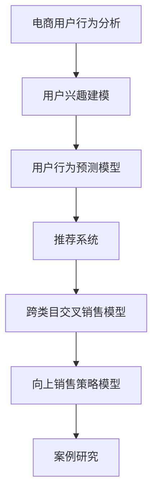

                 

### 文章标题

《AI如何改善电商平台的跨类目交叉销售与向上销售》

### 关键词

人工智能，电商平台，跨类目交叉销售，向上销售，推荐系统，机器学习，深度学习，用户行为分析

### 摘要

本文将深入探讨人工智能技术在电商平台中的应用，特别是如何通过跨类目交叉销售与向上销售策略提升电商平台的经济效益。文章首先介绍了电商平台的发展历程与现状，以及AI技术在电商领域的应用背景。随后，文章详细阐述了AI核心概念与架构，包括人工智能、机器学习和深度学习的基本原理。在应用部分，文章重点分析了用户行为分析、推荐系统、跨类目交叉销售和向上销售策略的模型与实现方法。最后，通过案例研究和实践步骤，文章展示了AI技术在电商平台中的具体应用效果，并对未来发展趋势和挑战进行了展望。

### 《AI如何改善电商平台的跨类目交叉销售与向上销售》目录大纲

#### 第一部分：引言与概述

**第1章：AI在电商平台的跨类目交叉销售与向上销售的应用背景**

- **1.1 电商平台的发展历程与现状**
  - 电商平台的发展历程
  - 当前电商平台的主要特点
- **1.2 AI技术在电商领域的应用**
  - AI在电商平台的典型应用场景
  - AI技术对电商的变革性影响
- **1.3 跨类目交叉销售与向上销售的概念**
  - 跨类目交叉销售的定义与目的
  - 向上销售的定义与策略

#### 第二部分：AI核心概念与架构

**第2章：AI核心概念与架构**

- **2.1 人工智能概述**
  - 人工智能的定义与发展历程
  - 人工智能的主要类型与应用领域
- **2.2 机器学习基础**
  - 机器学习的基本概念
  - 监督学习、无监督学习与强化学习
- **2.3 深度学习原理**
  - 深度学习的基本原理
  - 神经网络与深度学习模型
- **2.4 AI架构与生态**
  - AI架构的设计原则
  - AI生态系统的组成部分

#### 第三部分：AI技术在电商中的应用

**第3章：用户行为分析**

- **3.1 用户行为数据收集与处理**
  - 用户行为数据类型
  - 数据收集方法与工具
- **3.2 用户兴趣建模**
  - 用户兴趣特征提取
  - 用户兴趣建模方法
- **3.3 用户行为预测模型**
  - 用户行为预测的数学模型
  - 模型实现与优化
- **3.4 模型评估与优化**
  - 模型评估指标
  - 模型优化策略

**第4章：推荐系统**

- **4.1 推荐系统概述**
  - 推荐系统的定义与分类
  - 推荐系统的基本架构
- **4.2 内容推荐算法**
  - 内容推荐的基本原理
  - 内容推荐算法的实现
- **4.3 协同过滤算法**
  - 协同过滤的基本原理
  - 协同过滤算法的实现
- **4.4 深度学习在推荐系统中的应用**
  - 深度学习在推荐系统中的优势
  - 深度学习在推荐系统中的实现
- **4.5 推荐系统的评估与优化**
  - 推荐系统评估指标
  - 推荐系统优化策略

**第5章：跨类目交叉销售**

- **5.1 跨类目交叉销售的概念与模型**
  - 跨类目交叉销售的定义与目的
  - 跨类目交叉销售的数学模型
- **5.2 跨类目关联规则挖掘**
  - 关联规则挖掘的基本原理
  - 跨类目关联规则挖掘的实现
- **5.3 基于深度学习的跨类目推荐模型**
  - 深度学习在跨类目推荐中的应用
  - 跨类目推荐模型的实现
- **5.4 模型应用与效果评估**
  - 模型在电商平台的实际应用
  - 模型效果评估与优化

**第6章：向上销售策略**

- **6.1 向上销售的定义与分类**
  - 向上销售的定义与目的
  - 向上销售的主要类型
- **6.2 基于用户数据的向上销售策略**
  - 用户数据在向上销售中的应用
  - 基于用户数据的向上销售策略
- **6.3 基于产品的向上销售策略**
  - 产品特征在向上销售中的应用
  - 基于产品的向上销售策略
- **6.4 模型实现与优化**
  - 向上销售模型的实现
  - 模型优化策略

#### 第四部分：案例研究

**第7章：案例研究**

- **7.1 某电商平台AI应用案例分析**
  - 案例背景与目标
  - 案例实施过程
- **7.2 案例效果评估**
  - 案例效果评估指标
  - 案例效果评估结果
- **7.3 案例总结与启示**
  - 案例总结
  - 启示与未来展望

#### 第五部分：AI技术在电商中的实践

**第8章：AI在电商平台的实施步骤**

- **8.1 数据收集与处理**
  - 数据收集流程与工具
  - 数据预处理方法
- **8.2 模型选择与开发**
  - 模型选择原则
  - 模型开发流程
- **8.3 系统部署与运维**
  - 系统部署策略
  - 系统运维方法
- **8.4 性能监控与优化**
  - 性能监控指标
  - 性能优化策略

#### 第六部分：未来展望与挑战

**第9章：未来展望与挑战**

- **9.1 AI技术在电商平台的发展趋势**
  - AI技术的未来发展趋势
  - AI技术在电商中的应用前景
- **9.2 跨类目交叉销售与向上销售的新方法**
  - 新的跨类目交叉销售方法
  - 新的向上销售方法
- **9.3 挑战与解决方案**
  - AI技术在电商中的应用挑战
  - 解决方案与未来研究方向
- **9.4 未来研究方向**
  - AI技术在电商领域的未来研究方向

#### 附录

**A.1 相关数据集与工具**

- **A.1.1 数据集介绍**
  - 数据集来源
  - 数据集特点
- **A.1.2 工具介绍**
  - 常用工具列表
  - 工具使用说明

**A.2 参考文献**

- **A.2.1 学术论文**
  - 相关论文列表
  - 论文摘要与评价
- **A.2.2 技术书籍**
  - 相关书籍列表
  - 书籍摘要与评价

### Mermaid 流程图

### 核心算法原理讲解

#### 用户行为预测模型

用户行为预测模型是电商平台中应用广泛的一种AI模型，它通过分析用户的历史行为数据，预测用户在未来可能产生的行为。以下是用户行为预测模型的数学模型和实现方法。

#### 数学模型

输入：用户历史行为数据（\(X = [x_1, x_2, ..., x_n]\)）和商品特征数据（\(Y = [y_1, y_2, ..., y_n]\)）。

输出：用户对商品的潜在兴趣度（\(P = [p_1, p_2, ..., p_n]\)），其中\(p_i\)表示用户对第\(i\)个商品的潜在兴趣度。

用户行为预测模型的基本思路是构建一个函数\(f(X, Y)\)，通过该函数将用户行为数据和商品特征数据映射为用户对商品的潜在兴趣度。

函数\(f(X, Y)\)可以表示为：

\[f(X, Y) = \sigma(W_1 \cdot X + W_2 \cdot Y + b)\]

其中，\(\sigma\)表示激活函数，常用的激活函数有Sigmoid、ReLU等；\(W_1\)和\(W_2\)分别表示用户行为特征和商品特征权重矩阵；\(b\)表示偏置项。

#### 实现方法

1. **数据预处理**：对用户行为数据和商品特征数据进行标准化处理，将其归一化到同一范围内。

2. **构建深度神经网络模型**：使用深度学习框架（如TensorFlow、PyTorch等）构建深度神经网络模型，包括输入层、隐藏层和输出层。

3. **模型训练**：使用训练数据对模型进行训练，调整模型参数，使得模型预测结果与真实值尽量接近。

4. **模型评估**：使用测试数据对模型进行评估，计算模型预测准确率、精确率、召回率等指标，以评估模型性能。

5. **模型优化**：根据模型评估结果，对模型进行优化，调整模型参数，提高模型性能。

### 数学模型和数学公式

#### 推荐系统评估指标

精确率（Precision）：

\[Precision = \frac{相关推荐数}{推荐总数}\]

召回率（Recall）：

\[Recall = \frac{相关推荐数}{实际相关数}\]

F1-Score：

\[F1-Score = 2 \times \frac{Precision \times Recall}{Precision + Recall}\]

### 项

### 格式要求

- 文章内容使用markdown格式输出。
- 文章末尾需要写上作者信息：“作者：AI天才研究院/AI Genius Institute & 禅与计算机程序设计艺术 /Zen And The Art of Computer Programming”
- 文章结构完整，每个小节的内容丰富具体详细讲解，核心内容包含：
  - 背景介绍
  - 核心概念与联系：必须给出核心概念原理之间的关系架构 Mermaid 流程图
  - 核心算法原理讲解必须使用伪代码来详细阐述；数学模型和公式 & 详细讲解 & 举例说明
  - 数学公式请使用latex格式，嵌入文中独立段落的latex公式前后使用 $$ 括起来(例如：$$1+1=2$$ )，段落内的latex公式前后使用 $ 括起来(例如：$1<2$)
  - 项目实战：开发环境搭建，源代码详细实现和代码解读，代码应用解读与分析，实际案例分析和详细讲解剖析，项目小结
  - 最佳实践 tips、小结、注意事项、拓展阅读等内容
- 文章开始是“文章标题”，然后是“文章关键词”和“文章摘要”部分的内容哦，接下来是按照目录大纲结构的文章正文部分的内容。
- 文章字数要求：文章字数在 8000 ～ 12000 字左右。

