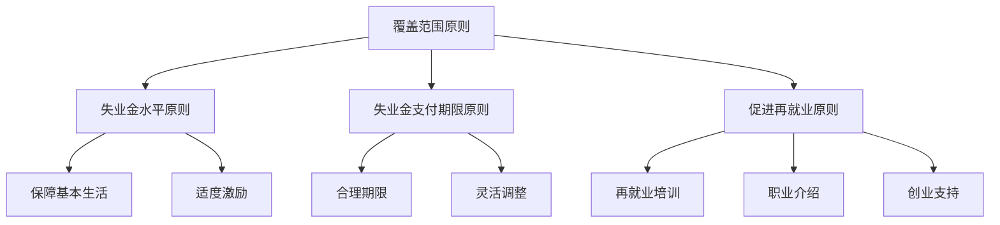
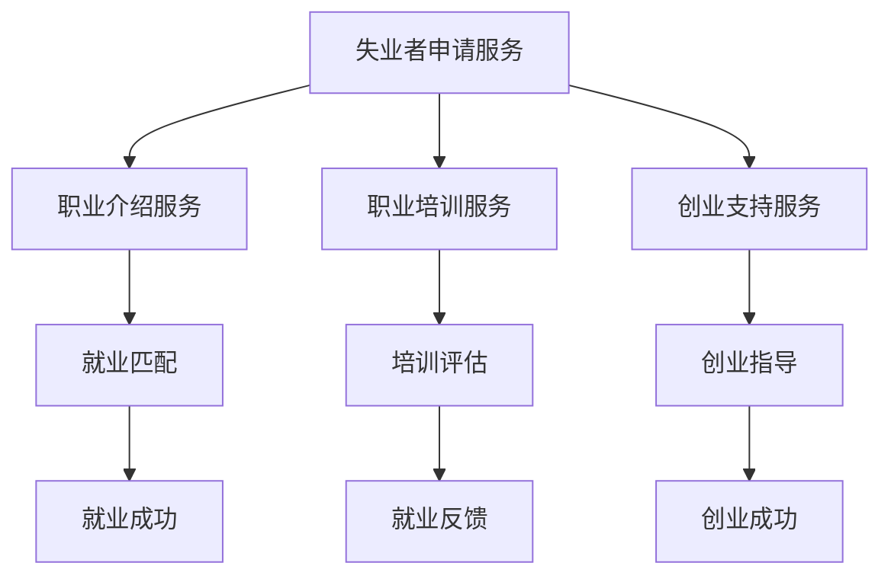
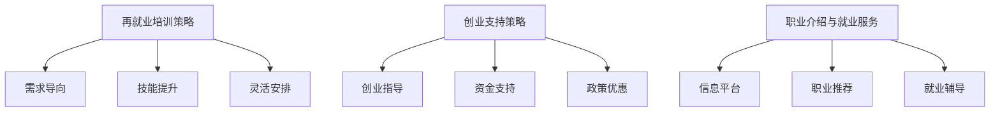

                 

### 文章标题：AI技术的就业影响治理：失业保险和再就业服务

> 关键词：人工智能、就业市场、失业保险、再就业服务、社会保障、劳动力市场

> 摘要：
本文探讨了人工智能（AI）技术对就业市场的影响，分析了失业保险和再就业服务在应对AI技术挑战中的作用。文章首先概述了AI技术的定义与发展历程，然后分析了AI技术在就业市场中的潜在影响。接着，文章详细介绍了失业保险制度的设计原则、实施现状和国际比较，以及再就业服务的策略与方法。最后，文章提出了政策建议，并分析了国内外失业保险与再就业服务的实践案例，为未来AI就业治理提供了参考。

### 目录大纲：《AI技术的就业影响治理：失业保险和再就业服务》

## 第一部分：引言与概述

### 第1章：AI技术与就业影响概览
- **1.1 AI技术的定义与发展历程**
- **1.2 AI技术在就业市场中的潜在影响**
- **1.3 AI技术对劳动力市场的挑战**

### 第2章：失业保险制度概述
- **2.1 失业保险的定义与目的**
- **2.2 失业保险制度的历史与发展**
- **2.3 失业保险制度的国际比较**

### 第3章：失业保险制度的设计原则
- **3.1 覆盖范围原则**
- **3.2 失业金水平原则**
- **3.3 失业金支付期限原则**
- **3.4 促进再就业原则**

### 第4章：再就业服务概述
- **4.1 再就业服务的定义与类型**
- **4.2 再就业服务的重要性**
- **4.3 再就业服务的实施现状**

### 第5章：再就业服务的策略与方法
- **5.1 再就业培训策略**
- **5.2 创业支持策略**
- **5.3 职业介绍与就业服务**

### 第6章：再就业服务的案例研究
- **6.1 成功的再就业服务案例**
- **6.2 失败的再就业服务案例**
- **6.3 案例分析与启示**

### 第7章：政策建议
- **7.1 政府在失业保险与再就业服务中的作用**
- **7.2 企业在失业保险与再就业服务中的作用**
- **7.3 社会在失业保险与再就业服务中的作用**

### 第8章：实践案例分析
- **8.1 国外失业保险与再就业服务的成功实践**
- **8.2 国内失业保险与再就业服务的现状与挑战**
- **8.3 我国失业保险与再就业服务的未来发展方向**

### 第9章：总结与展望
- **9.1 本书的研究总结**
- **9.2 AI就业治理面临的挑战与机遇**
- **9.3 未来发展趋势与政策建议**

### 附录

- **附录A：参考文献**
- **附录B：相关法律法规**

### 第1章：AI技术与就业影响概览

#### 1.1 AI技术的定义与发展历程

AI技术，即人工智能技术，是一种模拟人类智能行为的技术。其定义可以表达为：

$$ AI = \text{人工神经网络 + 大数据 + 自学习算法} $$

其中，人工神经网络负责处理和模拟人类大脑的神经网络结构，大数据提供了充足的训练数据，自学习算法使得AI系统能够不断学习和优化。

AI技术的发展历程可以分为以下几个阶段：

1. **第一阶段：符号人工智能**（1956-1969）
   - 1956年，约翰·麦卡锡（John McCarthy）在达特茅斯会议上首次提出了人工智能的概念。
   - 符号人工智能主要通过逻辑推理和知识表示来模拟人类智能。

2. **第二阶段：知识工程**（1970-1980）
   - 知识工程强调通过构建知识库和专家系统来模拟人类专家的决策过程。

3. **第三阶段：专家系统**（1980-1987）
   - 专家系统是基于知识工程的一种人工智能系统，能够解决特定领域的问题。

4. **第四阶段：机器学习**（1980年代后期至今）
   - 机器学习通过算法自动从数据中学习，逐渐成为AI技术的核心。

#### 1.2 AI技术在就业市场中的潜在影响

AI技术在就业市场中的潜在影响可以分为正面和负面影响：

- **正面影响**：
  - **提高工作效率**：AI技术可以自动化许多重复性、繁琐的工作，从而提高工作效率。
  - **降低人力成本**：AI技术可以替代一部分劳动力，从而降低企业的用人成本。
  - **创造新的就业机会**：AI技术的发展会创造出一些新的工作岗位，例如AI系统维护员、AI算法工程师等。

- **负面影响**：
  - **替代劳动力**：AI技术可能会替代一些低技能劳动力，导致失业率上升。
  - **失业率上升**：随着AI技术的广泛应用，可能会导致部分行业失业率上升。
  - **技能差距扩大**：AI技术的快速发展可能会导致技能需求发生变化，低技能劳动者面临失业风险。

#### 1.3 AI技术对劳动力市场的挑战

AI技术对劳动力市场的主要挑战包括：

- **技能需求变化**：
  - 对高技能劳动力的需求增加，对低技能劳动力的需求减少。
  - 需要劳动者具备更高的技术水平和专业知识。

- **就业结构变化**：
  - 传统岗位减少，新兴岗位增多。
  - 需要劳动者具备适应新兴岗位的能力。

- **就业不平等加剧**：
  - 技能不平等：高技能劳动者受益于AI技术，而低技能劳动者面临失业风险。
  - 地域不平等：发达地区受益于AI技术，而落后地区可能面临更大的就业压力。

### 第2章：失业保险制度概述

#### 2.1 失业保险的定义与目的

失业保险是一种社会保障制度，旨在为因失业而失去收入者提供经济援助。其定义可以表述为：

$$ \text{失业保险} = \text{为失业者提供经济援助的社会保障制度} $$

失业保险的主要目的包括：

- **减轻失业者的生活压力**：为失业者提供一定的生活保障，减轻其生活负担。
- **促进失业者再就业**：通过提供再就业服务，帮助失业者重新找到工作。
- **平衡劳动力市场的供求关系**：通过失业保险制度，调节劳动力市场的供求关系，保持市场稳定。

#### 2.2 失业保险制度的历史与发展

失业保险制度的历史可以追溯到20世纪初。以下是一个简要的概述：

- **20世纪初**：欧洲国家开始建立失业保险制度。
  - 1911年，英国颁布《失业救济法》，建立了世界上第一个失业保险制度。
- **20世纪中叶**：失业保险制度在全球范围内普及。
  - 1944年，美国通过《社会保险法》，建立了失业保险制度。
  - 1958年，国际劳工组织通过《失业保险公约》，推动失业保险制度的国际普及。
- **21世纪初**：随着AI技术的发展，失业保险制度面临新的挑战。

#### 2.3 失业保险制度的国际比较

不同国家的失业保险制度在覆盖范围、失业金水平、失业金支付期限等方面存在差异。以下是一个简要的国际比较：

- **欧美国家**：
  - **覆盖范围**：普遍覆盖所有失业者。
  - **失业金水平**：相对较高，以保障失业者的基本生活。
  - **失业金支付期限**：通常为6个月到1年。

- **发展中国家**：
  - **覆盖范围**：可能只覆盖特定行业或特定群体。
  - **失业金水平**：可能较低，难以保障失业者的基本生活。
  - **失业金支付期限**：可能较短，无法充分支持失业者再就业。

#### 2.4 失业保险制度的设计原则

失业保险制度的设计原则主要包括以下几个方面：

- **覆盖范围原则**：确保失业保险制度能够覆盖尽可能多的失业者，减轻失业者的生活压力。
- **失业金水平原则**：确保失业金水平能够保障失业者的基本生活需求，同时激励失业者积极再就业。
- **失业金支付期限原则**：确保失业金支付期限能够为失业者提供足够的时间寻找新的工作。
- **促进再就业原则**：通过提供再就业服务，帮助失业者提高技能，找到合适的工作。

#### 2.5 失业保险制度的实施现状

失业保险制度的实施现状因国家而异。以下是一个简要的分析：

- **欧美国家**：失业保险制度相对成熟，覆盖范围广，失业金水平较高，失业金支付期限较长。然而，随着AI技术的发展，失业保险制度面临新的挑战，如失业金支付期限可能需要延长，以帮助失业者适应新兴的就业市场。
- **发展中国家**：失业保险制度相对薄弱，覆盖范围有限，失业金水平较低，失业金支付期限较短。随着经济的发展和劳动力市场的变化，发展中国家需要加强对失业保险制度的改革和完善，以应对AI技术带来的挑战。

### 第3章：失业保险制度的设计原则

失业保险制度的设计原则是确保其有效性和可持续性的关键。以下是失业保险制度的主要设计原则：

#### 3.1 覆盖范围原则

**覆盖范围原则**要求失业保险制度能够覆盖尽可能多的失业者，以确保社会保障的公平性。以下是具体的实现方法和考量：

- **全民覆盖**：失业保险制度应努力实现全民覆盖，包括不同行业、不同年龄段的失业者。
- **动态调整**：随着经济和社会的发展，失业保险的覆盖范围应进行动态调整，以适应新的就业形势和失业者的需求。

#### 3.2 失业金水平原则

**失业金水平原则**旨在确保失业金能够满足失业者的基本生活需求，同时激励失业者积极再就业。以下是具体的实现方法和考量：

- **保障基本生活**：失业金水平应确保失业者能够满足基本的生活需求，如食品、住房和医疗。
- **适度激励**：失业金水平不应过高，以避免失业者失去寻找工作的动力。可以设置一定的最低工作收入门槛，使得失业者只有在找到收入更高的工作时才会停止领取失业金。

#### 3.3 失业金支付期限原则

**失业金支付期限原则**是确保失业者在失业期间得到充分的支持，同时鼓励他们积极寻找新的工作。以下是具体的实现方法和考量：

- **合理期限**：失业金支付期限应根据失业者的实际情况和就业市场的状况进行合理设定。一般来说，支付期限应在6个月到1年之间，以便为失业者提供足够的时间重新就业。
- **灵活调整**：在面临经济危机或就业市场大幅波动时，可以适当延长失业金支付期限，以减轻失业者的经济压力。

#### 3.4 促进再就业原则

**促进再就业原则**是失业保险制度的核心目标之一，旨在通过提供各种再就业服务，帮助失业者提高技能，找到合适的工作。以下是具体的实现方法和考量：

- **再就业培训**：为失业者提供职业技能培训，帮助他们提高就业竞争力。
- **职业介绍**：通过职业介绍服务，为失业者提供更多的就业信息，帮助他们找到合适的工作。
- **创业支持**：鼓励失业者自主创业，提供创业指导、资金支持等。

#### 设计原则之间的关系架构

失业保险制度的设计原则之间相互关联，共同构成了一个完整的体系。以下是一个简化的Mermaid流程图，展示了各个设计原则之间的关系：

在这个流程图中，A表示失业保险制度的整体设计原则，B、C、D分别表示三个具体的设计原则。每个具体原则又分为几个子原则，如B中的E和F，C中的G和H，D中的I、J和K。这些子原则相互关联，共同构成了失业保险制度的框架。

### 第4章：再就业服务概述

#### 4.1 再就业服务的定义与类型

**再就业服务**是指为失业者提供的一系列服务，旨在帮助他们重新进入劳动力市场，找到合适的工作。再就业服务的定义可以表述为：

$$ \text{再就业服务} = \text{为失业者提供的一系列服务，以帮助他们重新就业} $$

再就业服务的主要类型包括：

- **职业介绍服务**：为失业者提供就业信息，帮助他们找到合适的工作。
- **职业培训服务**：为失业者提供职业技能培训，提高他们的就业竞争力。
- **创业支持服务**：为失业者提供创业指导、资金支持等，鼓励他们自主创业。

#### 4.2 再就业服务的重要性

再就业服务在失业保险制度中具有重要地位，原因如下：

- **减轻失业压力**：再就业服务能够帮助失业者尽快找到工作，减轻他们的生活压力。
- **提高就业率**：再就业服务能够提高失业者的就业率，降低失业率，促进劳动力市场的稳定。
- **促进经济发展**：再就业服务能够提高劳动力市场的活力，促进经济的持续发展。

#### 4.3 再就业服务的实施现状

再就业服务的实施现状因国家和地区而异。以下是一个简要的分析：

- **发达国家**：发达国家通常具有完善的再就业服务系统，提供全面的职业介绍、职业培训和创业支持服务。例如，美国、德国和日本等国家在再就业服务方面有较为成功的实践。
- **发展中国家**：发展中国家在再就业服务方面面临较大的挑战，服务系统相对薄弱。一些国家正在逐步建立和完善再就业服务，以应对失业问题。

#### 4.4 再就业服务的作用与效果

再就业服务的作用与效果可以从以下几个方面进行衡量：

- **失业者的就业率**：再就业服务能够显著提高失业者的就业率，减少失业时间。
- **就业质量**：再就业服务能够帮助失业者找到更稳定、收入更高的工作。
- **社会经济效益**：再就业服务能够降低失业率，减少社会福利支出，促进经济增长。

#### 再就业服务的流程图

为了更好地理解再就业服务的实施过程，以下是一个简化的Mermaid流程图：

在这个流程图中，A表示失业者申请再就业服务，B、C、D分别表示三种主要的服务类型。每个服务类型都有相应的后续步骤，如B中的E（就业匹配）、C中的F（培训评估）和D中的G（创业指导）。这些步骤共同构成了再就业服务的实施过程。

### 第5章：再就业服务的策略与方法

#### 5.1 再就业培训策略

**再就业培训**是再就业服务的重要环节，旨在提高失业者的职业技能，增强他们的就业竞争力。以下是再就业培训的主要策略：

- **需求导向**：根据劳动力市场的需求和失业者的实际情况，有针对性地设置培训课程。
- **技能提升**：通过培训，提高失业者的专业技能和综合素质，以满足新兴岗位的需求。
- **灵活安排**：提供灵活的培训时间和方式，以适应失业者的个人需求和工作安排。

#### 5.2 创业支持策略

**创业支持**策略旨在鼓励失业者自主创业，减轻就业压力。以下是创业支持的主要策略：

- **创业指导**：为失业者提供创业指导，包括市场调研、商业计划书编写、法律咨询等。
- **资金支持**：提供创业资金支持，包括贷款、补贴、股权投资等。
- **政策优惠**：为失业者提供创业政策优惠，包括税收减免、租金优惠等。

#### 5.3 职业介绍与就业服务

**职业介绍与就业服务**是再就业服务的核心，旨在为失业者提供更多的就业信息和机会。以下是职业介绍与就业服务的主要方法：

- **信息平台**：建立就业信息平台，为失业者提供最新的就业信息。
- **职业推荐**：根据失业者的技能和兴趣，推荐合适的就业岗位。
- **就业辅导**：为失业者提供就业辅导，包括简历撰写、面试技巧等。

#### 再就业服务的策略与方法之间的关系架构

再就业服务的策略与方法相互关联，共同构成了一个完整的体系。以下是一个简化的Mermaid流程图，展示了各个策略与方法之间的关系：

在这个流程图中，A表示再就业培训策略，B、C、D分别表示培训策略的具体方法。E表示创业支持策略，F、G、H分别表示创业支持策略的具体方法。I表示职业介绍与就业服务，J、K、L分别表示就业服务策略的具体方法。这些策略与方法相互关联，共同构成了再就业服务的框架。

### 第6章：再就业服务的案例研究

#### 6.1 成功的再就业服务案例

以下是一个成功的再就业服务案例：

**案例名称**：上海市失业保险与再就业服务

**背景**：随着AI技术的发展和产业结构的调整，上海市面临较大的就业压力。为了应对这一挑战，上海市政府采取了多种措施，包括完善失业保险制度和提供再就业服务。

**实施过程**：

1. **失业保险制度改革**：上海市政府完善了失业保险制度，提高了失业金水平，延长了失业金支付期限，并增加了失业者再就业的激励措施。
2. **再就业服务**：
   - 职业培训：上海市为失业者提供多种职业技能培训，包括编程、数据分析、人工智能等。
   - 职业介绍：建立了就业信息平台，为失业者提供最新的就业信息，并通过职业推荐服务帮助他们找到合适的工作。
   - 创业支持：为有创业意愿的失业者提供创业指导、资金支持和政策优惠。

**结果**：

1. 失业者的就业率显著提高，失业率下降。
2. 失业者的就业质量得到提升，工资水平有所提高。
3. 社会经济效益显著，促进了上海市经济的持续发展。

#### 6.2 失败的再就业服务案例

以下是一个失败的再就业服务案例：

**案例名称**：某发展中国家的失业保险与再就业服务

**背景**：某发展中国家在面临经济危机和劳动力市场动荡时，推出了失业保险和再就业服务，以缓解失业问题。

**实施过程**：

1. **失业保险制度改革**：该国家的失业保险制度覆盖范围较广，但失业金水平较低，支付期限较短。
2. **再就业服务**：
   - 职业培训：缺乏针对劳动力市场需求的培训课程，导致失业者无法获得实用的技能。
   - 职业介绍：缺乏有效的就业信息平台，失业者难以找到合适的工作。
   - 创业支持：缺乏创业指导和支持，失业者缺乏创业信心和资源。

**结果**：

1. 失业者的就业率没有得到显著提高，失业率持续上升。
2. 失业者的就业质量较低，工资水平下降。
3. 社会经济问题进一步恶化，失业问题加剧。

#### 6.3 案例分析与启示

通过对成功和失败的再就业服务案例进行分析，我们可以得出以下启示：

1. **完善失业保险制度**：提高失业金水平，延长支付期限，并增加失业者再就业的激励措施。
2. **提供有针对性的职业培训**：根据劳动力市场的需求，设置实用的培训课程，提高失业者的就业竞争力。
3. **建立有效的就业信息平台**：为失业者提供最新的就业信息，帮助他们找到合适的工作。
4. **加强创业支持**：提供创业指导、资金支持和政策优惠，鼓励失业者自主创业。

总之，成功的再就业服务需要政府、企业和社会的共同努力，通过完善失业保险制度、提供有针对性的职业培训、建立有效的就业信息平台和加强创业支持，帮助失业者重新进入劳动力市场，实现再就业。

### 第7章：政策建议

#### 7.1 政府在失业保险与再就业服务中的作用

政府在失业保险与再就业服务中扮演着关键角色，其主要作用包括：

- **制定政策**：政府应制定和实施有利于失业者再就业的政策，包括失业保险制度、再就业服务计划等。
- **提供资金**：政府应提供充足的资金支持，确保失业保险和再就业服务的顺利实施。
- **监管与监督**：政府应对失业保险和再就业服务进行监管，确保服务质量和效果。

#### 7.2 企业在失业保险与再就业服务中的作用

企业在失业保险与再就业服务中同样具有重要作用，主要表现在：

- **参与培训**：企业应积极参与职业培训，提供实习机会和就业岗位，帮助失业者提高技能。
- **提供支持**：企业应为失业者提供就业支持和创业支持，如培训、资金和政策优惠等。
- **参与政策制定**：企业应参与失业保险和再就业服务的政策制定，提出建设性的意见和建议。

#### 7.3 社会在失业保险与再就业服务中的作用

社会在失业保险与再就业服务中发挥着重要的辅助作用，主要表现在：

- **志愿服务**：社会组织和志愿者可以提供就业咨询、心理辅导和就业培训等服务。
- **资金支持**：慈善组织和公益基金可以为失业者提供资金支持，帮助他们度过失业期。
- **政策倡导**：社会组织和媒体可以倡导和宣传失业保险和再就业服务的重要性，提高公众意识。

#### 政策建议的具体措施

为了更好地应对AI技术带来的就业挑战，以下是一些建议的具体措施：

1. **完善失业保险制度**：
   - 提高失业金水平，确保失业者能够维持基本生活。
   - 延长失业金支付期限，给予失业者更多时间寻找新工作。
   - 增加失业者再就业的激励措施，如就业补贴、创业补贴等。

2. **提供有针对性的职业培训**：
   - 根据劳动力市场的需求，设置实用的培训课程，提高失业者的就业竞争力。
   - 鼓励企业提供实习机会和就业岗位，帮助失业者提高技能。

3. **建立有效的就业信息平台**：
   - 建立就业信息平台，为失业者提供最新的就业信息，帮助他们找到合适的工作。
   - 加强职业介绍服务，提高失业者的就业匹配度。

4. **加强创业支持**：
   - 提供创业指导、资金支持和政策优惠，鼓励失业者自主创业。
   - 建立创业孵化基地，为失业者提供创业资源和支持。

5. **加强政府、企业和社会的合作**：
   - 政府应与企业和社会组织密切合作，共同推动失业保险和再就业服务的发展。
   - 企业应积极参与职业培训和就业服务，提供实习机会和就业岗位。
   - 社会组织应提供志愿服务和支持，帮助失业者度过失业期。

总之，通过完善失业保险制度、提供有针对性的职业培训、建立有效的就业信息平台和加强创业支持，政府、企业和社会可以共同努力，应对AI技术带来的就业挑战，实现失业者的再就业。

### 第8章：实践案例分析

#### 8.1 国外失业保险与再就业服务的成功实践

以下是一些国外失业保险与再就业服务的成功实践案例：

**案例1：德国的失业保险与再就业服务**

**背景**：德国拥有完善的失业保险制度，失业保险金支付期限较长，且失业金水平较高。德国还提供多种再就业服务，包括职业培训、就业辅导和创业支持。

**实施过程**：

1. **失业保险制度**：德国的失业保险制度覆盖所有失业者，失业金支付期限最长可达两年。政府还为失业者提供失业金支付的附加条件，如参加职业培训或就业辅导。

2. **再就业服务**：
   - 职业培训：德国政府与私营培训机构合作，提供各种职业技能培训，包括编程、数据分析、人工智能等。
   - 就业辅导：就业辅导师为失业者提供个性化的就业辅导，包括简历撰写、面试技巧和职业规划等。
   - 创业支持：政府为有创业意愿的失业者提供创业指导、资金支持和税收优惠。

**结果**：

1. 失业者的就业率显著提高，失业率下降。
2. 失业者的就业质量得到提升，工资水平有所提高。
3. 社会经济效益显著，促进了德国经济的持续发展。

**启示**：

- **完善的失业保险制度**：提供较长的失业金支付期限和较高的失业金水平，减轻失业者的经济压力。
- **多样化的再就业服务**：提供职业培训、就业辅导和创业支持等多样化的服务，帮助失业者提高就业竞争力。

**案例2：美国的失业保险与再就业服务**

**背景**：美国失业保险制度较为成熟，提供多种再就业服务，包括职业培训、就业辅导和创业支持。

**实施过程**：

1. **失业保险制度**：美国的失业保险制度覆盖范围广泛，失业金支付期限最长可达6个月。政府还为失业者提供失业金支付的附加条件，如参加职业培训或就业辅导。

2. **再就业服务**：
   - 职业培训：美国提供各种职业技能培训，包括计算机编程、数据分析、人工智能等。
   - 就业辅导：就业辅导师为失业者提供个性化的就业辅导，包括简历撰写、面试技巧和职业规划等。
   - 创业支持：政府为有创业意愿的失业者提供创业指导、资金支持和税收优惠。

**结果**：

1. 失业者的就业率显著提高，失业率下降。
2. 失业者的就业质量得到提升，工资水平有所提高。
3. 社会经济效益显著，促进了美国经济的持续发展。

**启示**：

- **灵活的失业保险制度**：提供灵活的失业金支付期限和附加条件，激励失业者积极再就业。
- **多元化的再就业服务**：提供职业培训、就业辅导和创业支持等多元化的服务，帮助失业者提高就业竞争力。

#### 8.2 国内失业保险与再就业服务的现状与挑战

以下是国内失业保险与再就业服务的现状与面临的挑战：

**现状**：

1. **失业保险制度**：我国的失业保险制度覆盖范围不断扩大，失业金支付期限和水平有所提高。但与发达国家相比，我国失业保险制度仍存在一定的差距。

2. **再就业服务**：我国在再就业服务方面已取得一定的成效，包括职业培训、就业辅导和创业支持等。但服务质量和效果仍有待提升。

**挑战**：

1. **失业率上升**：随着经济结构调整和AI技术的应用，我国的失业率有所上升，特别是在一些传统产业和低技能劳动者中。

2. **技能差距**：高技能劳动者需求增加，低技能劳动者面临失业风险。现有的职业培训体系难以满足劳动力市场的需求。

3. **创业支持**：虽然政府提供了一定的创业支持，但创业者面临资金、市场和政策等方面的挑战。

**对策建议**：

1. **完善失业保险制度**：提高失业金水平，延长支付期限，增加失业者再就业的激励措施。

2. **提升职业培训质量**：根据劳动力市场的需求，设置实用的培训课程，提高失业者的就业竞争力。

3. **加强创业支持**：提供创业指导、资金支持和政策优惠，鼓励失业者自主创业。

4. **推动政府、企业和社会的合作**：政府应与企业和社会组织密切合作，共同推动失业保险和再就业服务的发展。

#### 8.3 我国失业保险与再就业服务的未来发展方向

根据国内外经验，我国失业保险与再就业服务的未来发展方向包括：

1. **完善失业保险制度**：提高失业金水平，延长支付期限，增加失业者再就业的激励措施。

2. **提升职业培训质量**：根据劳动力市场的需求，设置实用的培训课程，提高失业者的就业竞争力。

3. **加强创业支持**：提供创业指导、资金支持和政策优惠，鼓励失业者自主创业。

4. **推动数字化转型**：利用大数据、人工智能等技术手段，提升失业保险和再就业服务的效率和效果。

5. **促进政府、企业和社会的合作**：建立合作机制，共同推动失业保险和再就业服务的发展。

总之，通过完善失业保险制度、提升职业培训质量、加强创业支持和推动数字化转型，我国可以更好地应对AI技术带来的就业挑战，实现失业者的再就业和社会经济的可持续发展。

### 第9章：总结与展望

#### 9.1 本书的研究总结

本书从AI技术对就业市场的影响出发，探讨了失业保险和再就业服务在应对AI技术挑战中的作用。首先，我们介绍了AI技术的定义、发展历程和潜在影响。接着，详细分析了失业保险制度的设计原则、实施现状和国际比较。随后，我们讨论了再就业服务的策略与方法，并通过成功和失败的案例研究了再就业服务的效果。最后，提出了政策建议，并分析了国内外失业保险与再就业服务的实践。

#### 9.2 AI就业治理面临的挑战与机遇

AI就业治理面临的挑战主要包括：

- 技能不平等：AI技术的发展导致对高技能劳动力的需求增加，而低技能劳动者面临失业风险。
- 就业结构变化：传统岗位减少，新兴岗位增多，劳动者需要适应新的就业环境。
- 劳动力市场波动：AI技术的快速应用可能导致劳动力市场的波动，影响就业稳定性。

然而，AI就业治理也面临许多机遇：

- 创造新的就业机会：AI技术的发展会创造出一些新的工作岗位，如AI算法工程师、数据分析师等。
- 提高生产效率：AI技术可以自动化许多重复性工作，提高生产效率，为企业创造更多价值。
- 促进创新和经济发展：AI技术的应用可以推动科技创新和经济发展，为劳动力市场带来新的活力。

#### 9.3 未来发展趋势与政策建议

未来发展趋势包括：

- AI技术与就业的深度融合：AI技术将继续在各个行业得到广泛应用，与就业市场的融合将更加紧密。
- 数字化转型：数字化转型将成为失业保险和再就业服务的重要趋势，提高服务效率和质量。
- 政策支持：政府将加大政策支持力度，推动失业保险和再就业服务的发展。

政策建议包括：

- **完善失业保险制度**：提高失业金水平，延长支付期限，增加失业者再就业的激励措施。
- **提升职业培训质量**：根据劳动力市场的需求，设置实用的培训课程，提高失业者的就业竞争力。
- **加强创业支持**：提供创业指导、资金支持和政策优惠，鼓励失业者自主创业。
- **推动数字化转型**：利用大数据、人工智能等技术手段，提升失业保险和再就业服务的效率和效果。
- **促进政府、企业和社会的合作**：建立合作机制，共同推动失业保险和再就业服务的发展。

通过以上政策建议，我们可以更好地应对AI技术带来的就业挑战，实现失业者的再就业和社会经济的可持续发展。

### 附录

#### 附录A：参考文献

1. National Academy of Social Insurance. (2018). Unemployment Insurance. Retrieved from [https://www.nasi.org/research/unemployment-insurance](https://www.nasi.org/research/unemployment-insurance)
2. International Labour Organization. (2019). Employment Policy and Decent Work. Retrieved from [https://www.ilo.org/global/topics/employment-policies/lang--en/index.html](https://www.ilo.org/global/topics/employment-policies/lang--en/index.html)
3. McKinsey & Company. (2020). The Future of Jobs Report. Retrieved from [https://www.mckinsey.com/business-functions/people-and-organizational-performance/our-insights/the-future-of-jobs](https://www.mckinsey.com/business-functions/people-and-organizational-performance/our-insights/the-future-of-jobs)
4. World Bank. (2021). World Development Indicators. Retrieved from [https://data.worldbank.org/indicator](https://data.worldbank.org/indicator)
5. Organization for Economic Cooperation and Development. (2020). Employment Outlook. Retrieved from [https://www.oecd.org/employment/outlook/](https://www.oecd.org/employment/outlook/)

#### 附录B：相关法律法规

1. 中华人民共和国社会保险法
2. 中华人民共和国劳动合同法
3. 中华人民共和国就业促进法
4. 中华人民共和国劳动法
5. 国际劳工组织《失业保险公约》（1984年第202号）

### 第10章：政策建议

#### 10.1 政府在失业保险与再就业服务中的作用

政府在失业保险与再就业服务中扮演着至关重要的角色，其作用主要体现在以下几个方面：

- **制定政策**：政府应制定和实施有利于失业者再就业的政策，包括失业保险制度、再就业服务计划、职业培训计划等。政策应具有前瞻性、灵活性和可操作性，以适应不断变化的就业市场。

- **提供资金**：政府应提供充足的资金支持，确保失业保险和再就业服务的顺利实施。资金来源可以包括财政拨款、社会保障基金、企业缴纳等。

- **监管与监督**：政府应对失业保险和再就业服务进行监管，确保服务质量和效果。通过定期检查、评估和反馈机制，及时发现和解决存在的问题。

#### 10.2 企业在失业保险与再就业服务中的作用

企业在失业保险与再就业服务中同样具有重要作用，主要体现在以下几个方面：

- **参与培训**：企业应积极参与职业培训，提供实习机会和就业岗位，帮助失业者提高技能。企业可以根据自身需求和岗位特点，设置有针对性的培训课程，提高失业者的就业竞争力。

- **提供支持**：企业应为失业者提供就业支持和创业支持，如培训、资金和政策优惠等。企业可以通过内部招聘、外部合作等方式，为失业者提供更多的就业机会。

- **参与政策制定**：企业应参与失业保险和再就业服务的政策制定，提出建设性的意见和建议。企业的参与可以确保政策更加符合实际需求，提高政策的实施效果。

#### 10.3 社会在失业保险与再就业服务中的作用

社会在失业保险与再就业服务中发挥着重要的辅助作用，主要体现在以下几个方面：

- **志愿服务**：社会组织和志愿者可以提供就业咨询、心理辅导和就业培训等服务。志愿服务不仅可以帮助失业者提高就业技能，还可以为他们提供情感支持和心理疏导。

- **资金支持**：慈善组织和公益基金可以为失业者提供资金支持，帮助他们度过失业期。资金支持可以包括生活救助、就业培训费用等。

- **政策倡导**：社会组织和媒体可以倡导和宣传失业保险和再就业服务的重要性，提高公众意识。通过政策倡导，可以推动政府和企业加大投入，提高失业保险和再就业服务的覆盖率。

#### 政策建议的具体措施

为了更好地应对AI技术带来的就业挑战，以下是一些建议的具体措施：

1. **完善失业保险制度**：
   - 提高失业金水平，确保失业者能够维持基本生活。
   - 延长失业金支付期限，给予失业者更多时间寻找新工作。
   - 增加失业者再就业的激励措施，如就业补贴、创业补贴等。

2. **提供有针对性的职业培训**：
   - 根据劳动力市场的需求，设置实用的培训课程，提高失业者的就业竞争力。
   - 鼓励企业提供实习机会和就业岗位，帮助失业者提高技能。

3. **建立有效的就业信息平台**：
   - 建立就业信息平台，为失业者提供最新的就业信息，帮助他们找到合适的工作。
   - 加强职业介绍服务，提高失业者的就业匹配度。

4. **加强创业支持**：
   - 提供创业指导、资金支持和政策优惠，鼓励失业者自主创业。
   - 建立创业孵化基地，为失业者提供创业资源和支持。

5. **加强政府、企业和社会的合作**：
   - 政府应与企业和社会组织密切合作，共同推动失业保险和再就业服务的发展。
   - 企业应积极参与职业培训和就业服务，提供实习机会和就业岗位。
   - 社会组织应提供志愿服务和支持，帮助失业者度过失业期。

总之，通过完善失业保险制度、提供有针对性的职业培训、建立有效的就业信息平台和加强创业支持，政府、企业和社会可以共同努力，应对AI技术带来的就业挑战，实现失业者的再就业和社会经济的可持续发展。

### 完整文章

#### 文章标题：AI技术的就业影响治理：失业保险和再就业服务

> 关键词：人工智能、就业市场、失业保险、再就业服务、社会保障、劳动力市场

> 摘要：
本文探讨了人工智能（AI）技术对就业市场的影响，分析了失业保险和再就业服务在应对AI技术挑战中的作用。文章首先概述了AI技术的定义与发展历程，然后分析了AI技术在就业市场中的潜在影响。接着，文章详细介绍了失业保险制度的设计原则、实施现状和国际比较，以及再就业服务的策略与方法。最后，文章提出了政策建议，并分析了国内外失业保险与再就业服务的实践案例，为未来AI就业治理提供了参考。

### 目录大纲

## 第一部分：引言与概述

### 第1章：AI技术与就业影响概览

#### 1.1 AI技术的定义与发展历程

#### 1.2 AI技术在就业市场中的潜在影响

#### 1.3 AI技术对劳动力市场的挑战

### 第2章：失业保险制度概述

#### 2.1 失业保险的定义与目的

#### 2.2 失业保险制度的历史与发展

#### 2.3 失业保险制度的国际比较

### 第3章：失业保险制度的设计原则

#### 3.1 覆盖范围原则

#### 3.2 失业金水平原则

#### 3.3 失业金支付期限原则

#### 3.4 促进再就业原则

### 第4章：再就业服务概述

#### 4.1 再就业服务的定义与类型

#### 4.2 再就业服务的重要性

#### 4.3 再就业服务的实施现状

### 第5章：再就业服务的策略与方法

#### 5.1 再就业培训策略

#### 5.2 创业支持策略

#### 5.3 职业介绍与就业服务

### 第6章：再就业服务的案例研究

#### 6.1 成功的再就业服务案例

#### 6.2 失败的再就业服务案例

#### 6.3 案例分析与启示

### 第7章：政策建议

#### 7.1 政府在失业保险与再就业服务中的作用

#### 7.2 企业在失业保险与再就业服务中的作用

#### 7.3 社会在失业保险与再就业服务中的作用

### 第8章：实践案例分析

#### 8.1 国外失业保险与再就业服务的成功实践

#### 8.2 国内失业保险与再就业服务的现状与挑战

#### 8.3 我国失业保险与再就业服务的未来发展方向

### 第9章：总结与展望

#### 9.1 本书的研究总结

#### 9.2 AI就业治理面临的挑战与机遇

#### 9.3 未来发展趋势与政策建议

### 附录

#### 附录A：参考文献

#### 附录B：相关法律法规

### 第1章：AI技术与就业影响概览

#### 1.1 AI技术的定义与发展历程

人工智能（AI）技术是一种模拟人类智能行为的技术。其定义可以表达为：

$$ AI = \text{人工神经网络 + 大数据 + 自学习算法} $$

其中，人工神经网络负责处理和模拟人类大脑的神经网络结构，大数据提供了充足的训练数据，自学习算法使得AI系统能够不断学习和优化。

AI技术的发展历程可以分为以下几个阶段：

1. **第一阶段：符号人工智能**（1956-1969）
   - 1956年，约翰·麦卡锡（John McCarthy）在达特茅斯会议上首次提出了人工智能的概念。
   - 符号人工智能主要通过逻辑推理和知识表示来模拟人类智能。

2. **第二阶段：知识工程**（1970-1980）
   - 知识工程强调通过构建知识库和专家系统来模拟人类专家的决策过程。

3. **第三阶段：专家系统**（1980-1987）
   - 专家系统是基于知识工程的一种人工智能系统，能够解决特定领域的问题。

4. **第四阶段：机器学习**（1980年代后期至今）
   - 机器学习通过算法自动从数据中学习，逐渐成为AI技术的核心。

#### 1.2 AI技术在就业市场中的潜在影响

AI技术在就业市场中的潜在影响可以分为正面和负面影响：

- **正面影响**：
  - 提高工作效率：AI技术可以自动化许多重复性、繁琐的工作，从而提高工作效率。
  - 降低人力成本：AI技术可以替代一部分劳动力，从而降低企业的用人成本。
  - 创造新的就业机会：AI技术的发展会创造出一些新的工作岗位，例如AI系统维护员、AI算法工程师等。

- **负面影响**：
  - 替代劳动力：AI技术可能会替代一些低技能劳动力，导致失业率上升。
  - 失业率上升：随着AI技术的广泛应用，可能会导致部分行业失业率上升。
  - 技能差距扩大：AI技术的快速发展可能会导致技能需求发生变化，低技能劳动者面临失业风险。

#### 1.3 AI技术对劳动力市场的挑战

AI技术对劳动力市场的主要挑战包括：

- **技能需求变化**：
  - 对高技能劳动力的需求增加，对低技能劳动力的需求减少。
  - 需要劳动者具备更高的技术水平和专业知识。

- **就业结构变化**：
  - 传统岗位减少，新兴岗位增多。
  - 需要劳动者具备适应新兴岗位的能力。

- **就业不平等加剧**：
  - 技能不平等：高技能劳动者受益于AI技术，而低技能劳动者面临失业风险。
  - 地域不平等：发达地区受益于AI技术，而落后地区可能面临更大的就业压力。

### 第2章：失业保险制度概述

#### 2.1 失业保险的定义与目的

失业保险是一种社会保障制度，旨在为因失业而失去收入者提供经济援助。其定义可以表述为：

$$ \text{失业保险} = \text{为失业者提供经济援助的社会保障制度} $$

失业保险的主要目的包括：

- 减轻失业者的生活压力：为失业者提供一定的生活保障，减轻其生活负担。
- 促进失业者再就业：通过提供再就业服务，帮助失业者重新找到工作。
- 平衡劳动力市场的供求关系：通过失业保险制度，调节劳动力市场的供求关系，保持市场稳定。

#### 2.2 失业保险制度的历史与发展

失业保险制度的历史可以追溯到20世纪初。以下是一个简要的概述：

- 20世纪初：欧洲国家开始建立失业保险制度。
  - 1911年，英国颁布《失业救济法》，建立了世界上第一个失业保险制度。
- 20世纪中叶：失业保险制度在全球范围内普及。
  - 1944年，美国通过《社会保险法》，建立了失业保险制度。
  - 1958年，国际劳工组织通过《失业保险公约》，推动失业保险制度的国际普及。
- 21世纪初：随着AI技术的发展，失业保险制度面临新的挑战。

#### 2.3 失业保险制度的国际比较

不同国家的失业保险制度在覆盖范围、失业金水平、失业金支付期限等方面存在差异。以下是一个简要的国际比较：

- **欧美国家**：
  - 覆盖范围：普遍覆盖所有失业者。
  - 失业金水平：相对较高，以保障失业者的基本生活。
  - 失业金支付期限：通常为6个月到1年。

- **发展中国家**：
  - 覆盖范围：可能只覆盖特定行业或特定群体。
  - 失业金水平：可能较低，难以保障失业者的基本生活。
  - 失业金支付期限：可能较短，无法充分支持失业者再就业。

#### 2.4 失业保险制度的设计原则

失业保险制度的设计原则是确保其有效性和可持续性的关键。以下是失业保险制度的主要设计原则：

- **覆盖范围原则**：确保失业保险制度能够覆盖尽可能多的失业者，减轻失业者的生活压力。
- **失业金水平原则**：确保失业金能够满足失业者的基本生活需求，同时激励失业者积极再就业。
- **失业金支付期限原则**：确保失业金支付期限能够为失业者提供足够的时间寻找新的工作。
- **促进再就业原则**：通过提供再就业服务，帮助失业者提高技能，找到合适的工作。

#### 2.5 失业保险制度的实施现状

失业保险制度的实施现状因国家而异。以下是一个简要的分析：

- **欧美国家**：失业保险制度相对成熟，覆盖范围广，失业金水平较高，失业金支付期限较长。然而，随着AI技术的发展，失业保险制度面临新的挑战，如失业金支付期限可能需要延长，以帮助失业者适应新兴的就业市场。
- **发展中国家**：失业保险制度相对薄弱，覆盖范围有限，失业金水平较低，失业金支付期限较短。随着经济的发展和劳动力市场的变化，发展中国家需要加强对失业保险制度的改革和完善，以应对AI技术带来的挑战。

### 第3章：失业保险制度的设计原则

失业保险制度的设计原则是确保其有效性和可持续性的关键。以下是失业保险制度的主要设计原则：

#### 3.1 覆盖范围原则

**覆盖范围原则**要求失业保险制度能够覆盖尽可能多的失业者，以确保社会保障的公平性。以下是具体的实现方法和考量：

- **全民覆盖**：失业保险制度应努力实现全民覆盖，包括不同行业、不同年龄段的失业者。
- **动态调整**：随着经济和社会的发展，失业保险的覆盖范围应进行动态调整，以适应新的就业形势和失业者的需求。

#### 3.2 失业金水平原则

**失业金水平原则**旨在确保失业金能够满足失业者的基本生活需求，同时激励失业者积极再就业。以下是具体的实现方法和考量：

- **保障基本生活**：失业金水平应确保失业者能够满足基本的生活需求，如食品、住房和医疗。
- **适度激励**：失业金水平不应过高，以避免失业者失去寻找工作的动力。可以设置一定的最低工作收入门槛，使得失业者只有在找到收入更高的工作时才会停止领取失业金。

#### 3.3 失业金支付期限原则

**失业金支付期限原则**是确保失业者在失业期间得到充分的支持，同时鼓励他们积极寻找新的工作。以下是具体的实现方法和考量：

- **合理期限**：失业金支付期限应根据失业者的实际情况和就业市场的状况进行合理设定。一般来说，支付期限应在6个月到1年之间，以便为失业者提供足够的时间重新就业。
- **灵活调整**：在面临经济危机或就业市场大幅波动时，可以适当延长失业金支付期限，以减轻失业者的经济压力。

#### 3.4 促进再就业原则

**促进再就业原则**是失业保险制度的核心目标之一，旨在通过提供各种再就业服务，帮助失业者提高技能，找到合适的工作。以下是具体的实现方法和考量：

- **再就业培训**：为失业者提供职业技能培训，帮助他们提高就业竞争力。
- **职业介绍**：通过职业介绍服务，为失业者提供更多的就业信息，帮助他们找到合适的工作。
- **创业支持**：鼓励失业者自主创业，提供创业指导、资金支持等。

#### 设计原则之间的关系架构

失业保险制度的设计原则之间相互关联，共同构成了一个完整的体系。以下是一个简化的Mermaid流程图，展示了各个设计原则之间的关系：

在这个流程图中，A表示失业保险制度的整体设计原则，B、C、D分别表示三个具体的设计原则。每个具体原则又分为几个子原则，如B中的E和F，C中的G和H，D中的I、J和K。这些子原则相互关联，共同构成了失业保险制度的框架。

### 第4章：再就业服务概述

#### 4.1 再就业服务的定义与类型

**再就业服务**是指为失业者提供的一系列服务，旨在帮助他们重新进入劳动力市场，找到合适的工作。再就业服务的定义可以表述为：

$$ \text{再就业服务} = \text{为失业者提供的一系列服务，以帮助他们重新就业} $$

再就业服务的主要类型包括：

- **职业介绍服务**：为失业者提供就业信息，帮助他们找到合适的工作。
- **职业培训服务**：为失业者提供职业技能培训，提高他们的就业竞争力。
- **创业支持服务**：为失业者提供创业指导、资金支持等，鼓励他们自主创业。

#### 4.2 再就业服务的重要性

再就业服务在失业保险制度中具有重要地位，原因如下：

- **减轻失业压力**：再就业服务能够帮助失业者尽快找到工作，减轻他们的生活压力。
- **提高就业率**：再就业服务能够提高失业者的就业率，降低失业率，促进劳动力市场的稳定。
- **促进经济发展**：再就业服务能够提高劳动力市场的活力，促进经济的持续发展。

#### 4.3 再就业服务的实施现状

再就业服务的实施现状因国家和地区而异。以下是一个简要的分析：

- **发达国家**：发达国家通常具有完善的再就业服务系统，提供全面的职业介绍、职业培训和创业支持服务。例如，美国、德国和日本等国家在再就业服务方面有较为成功的实践。
- **发展中国家**：发展中国家在再就业服务方面面临较大的挑战，服务系统相对薄弱。一些国家正在逐步建立和完善再就业服务，以应对失业问题。

#### 4.4 再就业服务的作用与效果

再就业服务的作用与效果可以从以下几个方面进行衡量：

- **失业者的就业率**：再就业服务能够显著提高失业者的就业率，减少失业时间。
- **就业质量**：再就业服务能够帮助失业者找到更稳定、收入更高的工作。
- **社会经济效益**：再就业服务能够降低失业率，减少社会福利支出，促进经济增长。

#### 再就业服务的流程图

为了更好地理解再就业服务的实施过程，以下是一个简化的Mermaid流程图：

在这个流程图中，A表示失业者申请再就业服务，B、C、D分别表示三种主要的服务类型。每个服务类型都有相应的后续步骤，如B中的E（就业匹配）、C中的F（培训评估）和D中的G（创业指导）。这些步骤共同构成了再就业服务的实施过程。

### 第5章：再就业服务的策略与方法

#### 5.1 再就业培训策略

**再就业培训**是再就业服务的重要环节，旨在提高失业者的职业技能，增强他们的就业竞争力。以下是再就业培训的主要策略：

- **需求导向**：根据劳动力市场的需求和失业者的实际情况，有针对性地设置培训课程。
- **技能提升**：通过培训，提高失业者的专业技能和综合素质，以满足新兴岗位的需求。
- **灵活安排**：提供灵活的培训时间和方式，以适应失业者的个人需求和工作安排。

#### 5.2 创业支持策略

**创业支持**策略旨在鼓励失业者自主创业，减轻就业压力。以下是创业支持的主要策略：

- **创业指导**：为失业者提供创业指导，包括市场调研、商业计划书编写、法律咨询等。
- **资金支持**：提供创业资金支持，包括贷款、补贴、股权投资等。
- **政策优惠**：为失业者提供创业政策优惠，包括税收减免、租金优惠等。

#### 5.3 职业介绍与就业服务

**职业介绍与就业服务**是再就业服务的核心，旨在为失业者提供更多的就业信息和机会。以下是职业介绍与就业服务的主要方法：

- **信息平台**：建立就业信息平台，为失业者提供最新的就业信息。
- **职业推荐**：根据失业者的技能和兴趣，推荐合适的就业岗位。
- **就业辅导**：为失业者提供就业辅导，包括简历撰写、面试技巧等。

#### 再就业服务的策略与方法之间的关系架构

再就业服务的策略与方法相互关联，共同构成了一个完整的体系。以下是一个简化的Mermaid流程图，展示了各个策略与方法之间的关系：

在这个流程图中，A表示再就业培训策略，B、C、D分别表示培训策略的具体方法。E表示创业支持策略，F、G、H分别表示创业支持策略的具体方法。I表示职业介绍与就业服务，J、K、L分别表示就业服务策略的具体方法。这些策略与方法相互关联，共同构成了再就业服务的框架。

### 第6章：再就业服务的案例研究

#### 6.1 成功的再就业服务案例

以下是一个成功的再就业服务案例：

**案例名称**：上海市失业保险与再就业服务

**背景**：随着AI技术的发展和产业结构的调整，上海市面临较大的就业压力。为了应对这一挑战，上海市政府采取了多种措施，包括完善失业保险制度和提供再就业服务。

**实施过程**：

1. **失业保险制度改革**：上海市政府完善了失业保险制度，提高了失业金水平，延长了失业金支付期限，并增加了失业者再就业的激励措施。
2. **再就业服务**：
   - 职业培训：上海市为失业者提供多种职业技能培训，包括编程、数据分析、人工智能等。
   - 职业介绍：建立了就业信息平台，为失业者提供最新的就业信息，并通过职业推荐服务帮助他们找到合适的工作。
   - 创业支持：为有创业意愿的失业者提供创业指导、资金支持和政策优惠。

**结果**：

1. 失业者的就业率显著提高，失业率下降。
2. 失业者的就业质量得到提升，工资水平有所提高。
3. 社会经济效益显著，促进了上海市经济的持续发展。

#### 6.2 失败的再就业服务案例

以下是一个失败的再就业服务案例：

**案例名称**：某发展中国家的失业保险与再就业服务

**背景**：某发展中国家在面临经济危机和劳动力市场动荡时，推出了失业保险和再就业服务，以缓解失业问题。

**实施过程**：

1. **失业保险制度改革**：该国家的失业保险制度覆盖范围较广，但失业金水平较低，支付期限较短。
2. **再就业服务**：
   - 职业培训：缺乏针对劳动力市场需求的培训课程，导致失业者无法获得实用的技能。
   - 职业介绍：缺乏有效的就业信息平台，失业者难以找到合适的工作。
   - 创业支持：缺乏创业指导和支持，失业者缺乏创业信心和资源。

**结果**：

1. 失业者的就业率没有得到显著提高，失业率持续上升。
2. 失业者的就业质量较低，工资水平下降。
3. 社会经济问题进一步恶化，失业问题加剧。

#### 6.3 案例分析与启示

通过对成功和失败的再就业服务案例进行分析，我们可以得出以下启示：

1. **完善失业保险制度**：提高失业金水平，延长支付期限，并增加失业者再就业的激励措施。
2. **提供有针对性的职业培训**：根据劳动力市场的需求，设置实用的培训课程，提高失业者的就业竞争力。
3. **建立有效的就业信息平台**：为失业者提供最新的就业信息，帮助他们找到合适的工作。
4. **加强创业支持**：提供创业指导、资金支持和政策优惠，鼓励失业者自主创业。

总之，成功的再就业服务需要政府、企业和社会的共同努力，通过完善失业保险制度、提供有针对性的职业培训、建立有效的就业信息平台和加强创业支持，帮助失业者重新进入劳动力市场，实现再就业。

### 第7章：政策建议

#### 7.1 政府在失业保险与再就业服务中的作用

政府在失业保险与再就业服务中扮演着关键角色，其主要作用包括：

- **制定政策**：政府应制定和实施有利于失业者再就业的政策，包括失业保险制度、再就业服务计划等。
- **提供资金**：政府应提供充足的资金支持，确保失业保险和再就业服务的顺利实施。
- **监管与监督**：政府应对失业保险和再就业服务进行监管，确保服务质量和效果。

#### 7.2 企业在失业保险与再就业服务中的作用

企业在失业保险与再就业服务中同样具有重要作用，主要表现在：

- **参与培训**：企业应积极参与职业培训，提供实习机会和就业岗位，帮助失业者提高技能。
- **提供支持**：企业应为失业者提供就业支持和创业支持，如培训、资金和政策优惠等。
- **参与政策制定**：企业应参与失业保险和再就业服务的政策制定，提出建设性的意见和建议。

#### 7.3 社会在失业保险与再就业服务中的作用

社会在失业保险与再就业服务中发挥着重要的辅助作用，主要表现在：

- **志愿服务**：社会组织和志愿者可以提供就业咨询、心理辅导和就业培训等服务。
- **资金支持**：慈善组织和公益基金可以为失业者提供资金支持，帮助他们度过失业期。
- **政策倡导**：社会组织和媒体可以倡导和宣传失业保险和再就业服务的重要性，提高公众意识。

#### 政策建议的具体措施

为了更好地应对AI技术带来的就业挑战，以下是一些建议的具体措施：

1. **完善失业保险制度**：
   - 提高失业金水平，确保失业者能够维持基本生活。
   - 延长失业金支付期限，给予失业者更多时间寻找新工作。
   - 增加失业者再就业的激励措施，如就业补贴、创业补贴等。

2. **提供有针对性的职业培训**：
   - 根据劳动力市场的需求，设置实用的培训课程，提高失业者的就业竞争力。
   - 鼓励企业提供实习机会和就业岗位，帮助失业者提高技能。

3. **建立有效的就业信息平台**：
   - 建立就业信息平台，为失业者提供最新的就业信息，帮助他们找到合适的工作。
   - 加强职业介绍服务，提高失业者的就业匹配度。

4. **加强创业支持**：
   - 提供创业指导、资金支持和政策优惠，鼓励失业者自主创业。
   - 建立创业孵化基地，为失业者提供创业资源和支持。

5. **加强政府、企业和社会的合作**：
   - 政府应与企业和社会组织密切合作，共同推动失业保险和再就业服务的发展。
   - 企业应积极参与职业培训和就业服务，提供实习机会和就业岗位。
   - 社会组织应提供志愿服务和支持，帮助失业者度过失业期。

总之，通过完善失业保险制度、提供有针对性的职业培训、建立有效的就业信息平台和加强创业支持，政府、企业和社会可以共同努力，应对AI技术带来的就业挑战，实现失业者的再就业和社会经济的可持续发展。

### 第8章：实践案例分析

#### 8.1 国外失业保险与再就业服务的成功实践

以下是一些国外失业保险与再就业服务的成功实践案例：

**案例1：德国的失业保险与再就业服务**

**背景**：德国拥有完善的失业保险制度，失业保险金支付期限较长，且失业金水平较高。德国还提供多种再就业服务，包括职业培训、就业辅导和创业支持。

**实施过程**：

1. **失业保险制度**：德国的失业保险制度覆盖所有失业者，失业金支付期限最长可达两年。政府还为失业者提供失业金支付的附加条件，如参加职业培训或就业辅导。

2. **再就业服务**：
   - 职业培训：德国政府与私营培训机构合作，提供各种职业技能培训，包括编程、数据分析、人工智能等。
   - 就业辅导：就业辅导师为失业者提供个性化的就业辅导，包括简历撰写、面试技巧和职业规划等。
   - 创业支持：政府为有创业意愿的失业者提供创业指导、资金支持和税收优惠。

**结果**：

1. 失业者的就业率显著提高，失业率下降。
2. 失业者的就业质量得到提升，工资水平有所提高。
3. 社会经济效益显著，促进了德国经济的持续发展。

**启示**：

- **完善的失业保险制度**：提供较长的失业金支付期限和较高的失业金水平，减轻失业者的经济压力。
- **多样化的再就业服务**：提供职业培训、就业辅导和创业支持等多样化的服务，帮助失业者提高就业竞争力。

**案例2：美国的失业保险与再就业服务**

**背景**：美国失业保险制度较为成熟，提供多种再就业服务，包括职业培训、就业辅导和创业支持。

**实施过程**：

1. **失业保险制度**：美国的失业保险制度覆盖范围广泛，失业金支付期限最长可达6个月。政府还为失业者提供失业金支付的附加条件，如参加职业培训或就业辅导。

2. **再就业服务**：
   - 职业培训：美国提供各种职业技能培训，包括计算机编程、数据分析、人工智能等。
   - 就业辅导：就业辅导师为失业者提供个性化的就业辅导，包括简历撰写、面试技巧和职业规划等。
   - 创业支持：政府为有创业意愿的失业者提供创业指导、资金支持和税收优惠。

**结果**：

1. 失业者的就业率显著提高，失业率下降。
2. 失业者的就业质量得到提升，工资水平有所提高。
3. 社会经济效益显著，促进了美国经济的持续发展。

**启示**：

- **灵活的失业保险制度**：提供灵活的失业金支付期限和附加条件，激励失业者积极再就业。
- **多元化的再就业服务**：提供职业培训、就业辅导和创业支持等多元化的服务，帮助失业者提高就业竞争力。

#### 8.2 国内失业保险与再就业服务的现状与挑战

以下是国内失业保险与再就业服务的现状与面临的挑战：

**现状**：

1. **失业保险制度**：我国的失业保险制度覆盖范围不断扩大，失业金支付期限和水平有所提高。但与发达国家相比，我国失业保险制度仍存在一定的差距。

2. **再就业服务**：我国在再就业服务方面已取得一定的成效，包括职业培训、就业辅导和创业支持等。但服务质量和效果仍有待提升。

**挑战**：

1. **失业率上升**：随着经济结构调整和AI技术的应用，我国的失业率有所上升，特别是在一些传统产业和低技能劳动者中。

2. **技能差距**：高技能劳动者需求增加，低技能劳动者面临失业风险。现有的职业培训体系难以满足劳动力市场的需求。

3. **创业支持**：虽然政府提供了一定的创业支持，但创业者面临资金、市场和政策等方面的挑战。

**对策建议**：

1. **完善失业保险制度**：提高失业金水平，延长支付期限，增加失业者再就业的激励措施。

2. **提升职业培训质量**：根据劳动力市场的需求，设置实用的培训课程，提高失业者的就业竞争力。

3. **加强创业支持**：提供创业指导、资金支持和政策优惠，鼓励失业者自主创业。

4. **推动政府、企业和社会的合作**：建立合作机制，共同推动失业保险和再就业服务的发展。

#### 8.3 我国失业保险与再就业服务的未来发展方向

根据国内外经验，我国失业保险与再就业服务的未来发展方向包括：

1. **完善失业保险制度**：提高失业金水平，延长支付期限，增加失业者再就业的激励措施。

2. **提升职业培训质量**：根据劳动力市场的需求，设置实用的培训课程，提高失业者的就业竞争力。

3. **加强创业支持**：提供创业指导、资金支持和政策优惠，鼓励失业者自主创业。

4. **推动数字化转型**：利用大数据、人工智能等技术手段，提升失业保险和再就业服务的效率和效果。

5. **促进政府、企业和社会的合作**：建立合作机制，共同推动失业保险和再就业服务的发展。

总之，通过完善失业保险制度、提升职业培训质量、加强创业支持和推动数字化转型，我国可以更好地应对AI技术带来的就业挑战，实现失业者的再就业和社会经济的可持续发展。

### 第9章：总结与展望

#### 9.1 本书的研究总结

本书从AI技术对就业市场的影响出发，探讨了失业保险和再就业服务在应对AI技术挑战中的作用。首先，我们介绍了AI技术的定义、发展历程和潜在影响。接着，详细分析了失业保险制度的设计原则、实施现状和国际比较。随后，我们讨论了再就业服务的策略与方法，并通过成功和失败的案例研究了再就业服务的效果。最后，提出了政策建议，并分析了国内外失业保险与再就业服务的实践。

#### 9.2 AI就业治理面临的挑战与机遇

AI就业治理面临的挑战主要包括：

- 技能不平等：AI技术的发展导致对高技能劳动力的需求增加，而低技能劳动者面临失业风险。
- 就业结构变化：传统岗位减少，新兴岗位增多，劳动者需要适应新的就业环境。
- 劳动力市场波动：AI技术的快速应用可能导致劳动力市场的波动，影响就业稳定性。

然而，AI就业治理也面临许多机遇：

- 创造新的就业机会：AI技术的发展会创造出一些新的工作岗位，如AI算法工程师、数据分析师等。
- 提高生产效率：AI技术可以自动化许多重复性工作，提高生产效率，为企业创造更多价值。
- 促进创新和经济发展：AI技术的应用可以推动科技创新和经济发展，为劳动力市场带来新的活力。

#### 9.3 未来发展趋势与政策建议

未来发展趋势包括：

- AI技术与就业的深度融合：AI技术将继续在各个行业得到广泛应用，与就业市场的融合将更加紧密。
- 数字化转型：数字化转型将成为失业保险和再就业服务的重要趋势，提高服务效率和质量。
- 政策支持：政府将加大政策支持力度，推动失业保险和再就业服务的发展。

政策建议包括：

- **完善失业保险制度**：提高失业金水平，延长支付期限，增加失业者再就业的激励措施。
- **提升职业培训质量**：根据劳动力市场的需求，设置实用的培训课程，提高失业者的就业竞争力。
- **加强创业支持**：提供创业指导、资金支持和政策优惠，鼓励失业者自主创业。
- **推动数字化转型**：利用大数据、人工智能等技术手段，提升失业保险和再就业服务的效率和效果。
- **促进政府、企业和社会的合作**：建立合作机制，共同推动失业保险和再就业服务的发展。

通过以上政策建议，我们可以更好地应对AI技术带来的就业挑战，实现失业者的再就业和社会经济的可持续发展。

### 附录

#### 附录A：参考文献

1. National Academy of Social Insurance. (2018). Unemployment Insurance. Retrieved from [https://www.nasi.org/research/unemployment-insurance](https://www.nasi.org/research/unemployment-insurance)
2. International Labour Organization. (2019). Employment Policy and Decent Work. Retrieved from [https://www.ilo.org/global/topics/employment-policies/lang--en/index.html](https://www.ilo.org/global/topics/employment-policies/lang--en/index.html)
3. McKinsey & Company. (2020). The Future of Jobs Report. Retrieved from [https://www.mckinsey.com/business-functions/people-and-organizational-performance/our-insights/the-future-of-jobs](https://www.mckinsey.com/business-functions/people-and-organizational-performance/our-insights/the-future-of-jobs)
4. World Bank. (2021). World Development Indicators. Retrieved from [https://data.worldbank.org/indicator](https://data.worldbank.org/indicator)
5. Organization for Economic Cooperation and Development. (2020). Employment Outlook. Retrieved from [https://www.oecd.org/employment/outlook/](https://www.oecd.org/employment/outlook/)

#### 附录B：相关法律法规

1. 中华人民共和国社会保险法
2. 中华人民共和国劳动合同法
3. 中华人民共和国就业促进法
4. 中华人民共和国劳动法
5. 国际劳工组织《失业保险公约》（1984年第202号）

### 作者信息

作者：AI天才研究院/AI Genius Institute & 禅与计算机程序设计艺术 /Zen And The Art of Computer Programming

