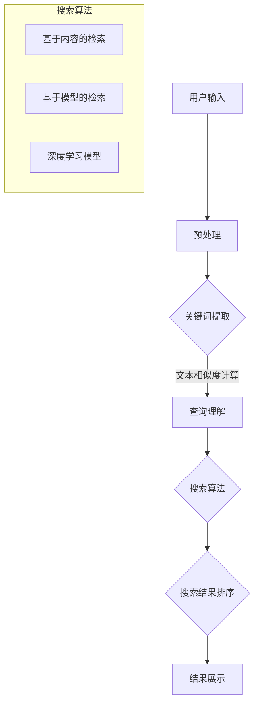

                 

### 文章标题

《AI搜索如何促进科学发现和突破性研究》

### 关键词

人工智能、AI搜索、自然语言处理、机器学习、科学发现、突破性研究、算法原理、数学模型、知识图谱、多模态搜索、跨学科研究

### 摘要

本文旨在探讨人工智能（AI）搜索在促进科学发现和实现突破性研究方面的作用。随着大数据和深度学习技术的发展，AI搜索已经成为科学研究中的一个重要工具。本文将首先概述AI搜索的基本概念和核心技术，随后详细分析AI搜索算法与数学模型，进一步探讨其在实际科研中的应用场景。通过多个实际案例的剖析，我们将展示AI搜索如何助力科学发现，并展望其未来的发展趋势和挑战。本文旨在为科研人员提供一个全面的AI搜索指南，帮助他们更好地利用这一技术推动科学进步。

### 引言

科学发现一直是人类社会进步的重要动力。从古代的四大发明，到现代的量子计算和基因编辑技术，每一次科学突破都为人类带来了前所未有的变革。然而，随着科学领域的不断拓展和数据的爆炸式增长，传统的研究方法和工具面临着前所未有的挑战。在这种背景下，人工智能（AI）搜索作为一种新兴技术，正逐渐成为促进科学发现和突破性研究的重要工具。

AI搜索是指利用人工智能技术，特别是机器学习和深度学习算法，对海量的信息进行自动检索和分析的过程。它不仅仅局限于简单的文本搜索，更涉及语义理解、知识图谱构建、多模态数据融合等多种高级功能。通过AI搜索，科研人员可以更加高效地获取相关信息，发现新的研究线索，从而推动科学发现和突破性研究的实现。

本文将围绕AI搜索如何促进科学发现和突破性研究展开探讨。具体而言，我们将首先概述AI搜索的基本概念和核心技术，接着详细分析AI搜索算法与数学模型，然后探讨其在实际科研中的应用，最后展望其未来的发展趋势和挑战。希望通过本文的讨论，能够为科研人员提供一些有价值的启示和指导，帮助他们在科学研究中更好地利用AI搜索技术。

#### AI搜索概述

AI搜索是指利用人工智能技术，特别是机器学习和深度学习算法，对海量的信息进行自动检索和分析的过程。它不仅仅局限于简单的文本搜索，更涉及语义理解、知识图谱构建、多模态数据融合等多种高级功能。AI搜索的核心在于如何从海量数据中快速准确地提取有价值的信息，满足用户的需求。

自然语言处理（NLP）是AI搜索的基础技术之一。NLP通过计算机技术理解和处理人类自然语言，包括文本分类、情感分析、实体识别、文本生成等任务。在AI搜索中，NLP技术被用于理解用户的查询意图，提取关键词，并进行语义匹配。例如，当用户输入一个搜索查询时，NLP算法能够理解其背后的含义，从而在大量的文档中找到最相关的结果。

信息检索（IR）是AI搜索的另一个核心技术。信息检索旨在从大量的文档中找到与用户查询最相关的信息。传统的信息检索主要依赖于关键词匹配和文档相似度计算，而AI搜索则通过机器学习算法，特别是深度学习模型，进一步提高了检索的准确性和效率。例如，通过训练大规模的神经网络模型，AI搜索可以自动学习并识别复杂的语义关系，从而提供更加精准的搜索结果。

机器学习（ML）是AI搜索的核心驱动力。机器学习是指通过数据训练模型，使其能够自动学习和预测。在AI搜索中，机器学习算法被广泛应用于各种任务，如文本分类、聚类、推荐系统等。通过机器学习，AI搜索可以自动识别数据中的模式，并不断优化搜索结果，提高用户体验。

除了上述核心技术，AI搜索还包括了知识图谱构建、多模态数据融合等高级功能。知识图谱是一种结构化的知识表示方法，通过将实体和关系以图的形式组织起来，使得信息检索和分析更加高效和直观。多模态数据融合则是指将不同类型的数据（如图像、音频、文本）进行整合，从而提供更加全面和丰富的搜索结果。

总之，AI搜索通过结合自然语言处理、信息检索、机器学习等多种技术，提供了一种智能化、高效化的信息检索和分析方法。它不仅可以帮助科研人员快速准确地获取相关信息，还能为科学研究提供新的思路和方法。随着技术的不断进步，AI搜索将在科学发现和突破性研究中发挥越来越重要的作用。

#### AI搜索在科学研究中的应用

在科学研究领域，AI搜索正发挥着日益重要的作用，它不仅解决了大量数据处理的难题，还为科学家提供了前所未有的研究工具和资源。首先，AI搜索能够大幅提高信息检索的效率。传统的研究方法往往需要研究人员手动查阅大量的文献和数据，这不仅费时费力，而且容易遗漏关键信息。而AI搜索通过其强大的数据处理能力，可以在短时间内从海量的文献数据库中快速检索出与用户查询相关的信息，使得科研人员可以更加专注于数据分析和创新研究。

其次，AI搜索在医学研究中的应用尤为显著。在疾病预测与诊断方面，AI搜索可以通过对大量临床数据和文献的分析，识别出潜在的疾病标志物和风险因素。例如，通过分析患者的电子健康记录、基因数据和公开的医学文献，AI搜索可以预测某种疾病的发生概率，为医生提供诊断建议。在药物研发方面，AI搜索可以帮助研究人员快速找到潜在的药物靶点和化合物，从而加速新药的发现和开发。此外，AI搜索还可以用于基因分析，通过对基因序列和文献的整合分析，揭示基因与疾病之间的关联，为精准医疗提供重要支持。

在物理学研究中，AI搜索同样展现出巨大的潜力。通过分析大量的实验数据和高能物理实验结果，AI搜索可以帮助物理学家识别出新的物理现象和规律。例如，在量子计算领域，AI搜索可以分析大量的量子模拟数据，发现新的量子算法和量子态，从而推动量子计算的进步。在宇宙学中，AI搜索可以通过对天文观测数据的分析，揭示宇宙的起源和演化过程，为宇宙学研究提供新的视角。

此外，AI搜索还在跨学科研究中发挥着重要作用。通过整合不同学科的数据和文献，AI搜索可以帮助科研人员发现新的研究方向和跨学科合作的可能性。例如，在环境科学领域，AI搜索可以通过整合气象数据、地理信息和生态学文献，揭示气候变化对生态系统的影响，为环境治理提供科学依据。在经济学研究中，AI搜索可以帮助分析市场数据、经济文献和全球经济动态，预测经济趋势和制定政策。

总之，AI搜索在科学研究中的应用不仅提高了信息检索的效率，还推动了医学、物理学、跨学科等多个领域的突破性研究。随着技术的不断进步，AI搜索将在科学研究中发挥更加重要的作用，为人类带来更多的科学发现和创新成果。

#### AI搜索算法基础

AI搜索算法是AI搜索系统的核心，决定了搜索效率和准确性。其中，基于内容的检索和基于模型的检索是两种主要的AI搜索算法。

**基于内容的检索**

基于内容的检索（Content-Based Retrieval）是指通过分析文档的内容特征，如关键词、语义和主题等，来检索与查询最相关的文档。这种方法的核心在于如何准确地提取文档的特征，并进行有效的匹配。

1. **关键词提取与语义分析**

关键词提取是文档特征提取的重要步骤。常用的关键词提取方法包括TF-IDF（Term Frequency-Inverse Document Frequency）和TextRank等。TF-IDF通过计算词频和逆文档频率，衡量一个词在文档中的重要性。TextRank则是一种基于图论的方法，通过文本中的词语共现关系，对文本进行排序，从而提取关键词。

语义分析则是更高层次的文本特征提取方法。它不仅考虑词频和词的关系，还关注词语的语义含义。自然语言处理技术，如词嵌入（Word Embedding）和语义角色标注（Semantic Role Labeling），在语义分析中发挥着重要作用。词嵌入将词语映射到高维向量空间中，使得语义相近的词语在空间中更接近。语义角色标注则通过分析词语在句子中的角色和功能，更准确地理解句子的语义。

2. **文本相似度计算**

文本相似度计算是确定查询与文档相关性的核心步骤。常用的文本相似度计算方法包括余弦相似度、Jaccard相似度和欧氏距离等。余弦相似度通过计算查询和文档向量的余弦值，衡量两者在特征空间中的夹角，从而判断其相似程度。Jaccard相似度通过计算查询和文档的交集与并集的比例，衡量两者的相似度。欧氏距离则通过计算查询和文档向量的欧氏距离，衡量两者在特征空间中的距离。

**基于模型的检索**

基于模型的检索（Model-Based Retrieval）是指利用机器学习模型，特别是深度学习模型，来预测查询和文档之间的相关性。这种方法通过训练大规模的神经网络模型，从海量数据中自动学习特征和模式，从而提高搜索的准确性和效率。

1. **深度学习模型在搜索中的应用**

深度学习模型在搜索中的应用越来越广泛。常见的深度学习模型包括卷积神经网络（CNN）、循环神经网络（RNN）和Transformer等。CNN通过卷积操作提取文本中的局部特征，适用于图像处理任务，但通过扩展，也可应用于文本特征提取。RNN通过序列建模，可以捕捉文本中的长期依赖关系，但在处理长文本时存在梯度消失问题。Transformer通过自注意力机制，可以同时处理长文本，并在许多自然语言处理任务中取得了显著的性能提升。

2. **序列模型与注意力机制**

序列模型，如RNN和LSTM（Long Short-Term Memory），是处理序列数据的常用模型。RNN通过递归连接，可以捕捉文本中的时间依赖关系。然而，RNN在处理长文本时容易出现梯度消失问题，导致模型无法学习到长序列的信息。LSTM通过引入门控机制，解决了梯度消失问题，但仍然存在计算复杂度高和训练时间长的问题。Transformer通过自注意力机制，可以同时关注序列中的所有信息，从而避免了长序列处理中的梯度消失问题，并在许多自然语言处理任务中取得了优异的性能。

3. **应用实例**

基于内容的检索和基于模型的检索各有优缺点。基于内容的检索在处理短文本和关键词查询时表现较好，而基于模型的检索在处理长文本和复杂查询时具有明显优势。在实际应用中，可以结合两种方法，取长补短，提高搜索效果。例如，在搜索引擎中，可以先使用基于内容的检索方法快速获取初步结果，然后利用基于模型的检索方法进行二次筛选和排序，从而提供更加精准的搜索结果。

总之，AI搜索算法通过结合基于内容的检索和基于模型的检索，提供了一种智能化、高效化的信息检索方法。随着深度学习技术的不断发展，AI搜索算法将不断优化，为科研人员提供更加强大的工具，助力科学发现和突破性研究的实现。

#### AI搜索的数学模型

在AI搜索中，数学模型是核心组成部分，它们为算法提供了理论基础和计算方法。本文将详细探讨两个关键数学模型：概率模型与贝叶斯网络，以及图模型与图神经网络，并分析它们在AI搜索中的应用。

**概率模型与贝叶斯网络**

概率模型是AI搜索中常用的基础模型之一，它们用于描述不确定性信息。贝叶斯网络（Bayesian Network）是一种概率图模型，通过图形结构表示变量之间的条件依赖关系。贝叶斯网络由两个主要部分组成：条件概率表（CPT）和有向无环图（DAG）。

1. **贝叶斯推断与概率模型**

贝叶斯推断是贝叶斯网络的核心方法，用于在已知部分变量值的情况下，推断其他变量的概率分布。贝叶斯推断的基本公式为：

   $$ P(A|B) = \frac{P(B|A)P(A)}{P(B)} $$

   其中，\(P(A|B)\) 表示在已知 \(B\) 条件下，\(A\) 发生的概率；\(P(B|A)\) 表示在已知 \(A\) 条件下，\(B\) 发生的概率；\(P(A)\) 和 \(P(B)\) 分别是 \(A\) 和 \(B\) 的先验概率。

   在AI搜索中，贝叶斯推断可以用于信息检索、推荐系统和故障诊断等任务。例如，在信息检索中，可以通过贝叶斯网络建模用户查询和文档之间的相关性，从而提高搜索结果的准确性。

2. **贝叶斯网络在搜索中的应用**

   贝叶斯网络在AI搜索中的应用主要包括两个方面：知识表示和推理。知识表示方面，贝叶斯网络可以用于表示复杂的关系和不确定性信息，例如，在医疗诊断中，可以使用贝叶斯网络表示疾病与症状之间的概率关系。推理方面，贝叶斯网络可以通过推理算法（如变量消除算法和信念传播算法）进行概率推理，从而得出结论。例如，在搜索引擎中，可以通过贝叶斯网络对用户查询和网页内容之间的相关性进行建模，并使用推理算法优化搜索结果。

**图模型与图神经网络**

图模型（Graph Models）是一种用于表示和计算图结构的数学模型，图神经网络（Graph Neural Networks，GNN）是图模型在深度学习领域的重要应用。GNN通过在网络中传播节点和边的信息，实现节点表示的学习和图结构的计算。

1. **图论基础**

   图模型的基础是图论，图由节点（Node）和边（Edge）组成。节点表示图中的实体，边表示实体之间的关系。常用的图表示方法包括无向图、有向图和加权图。在AI搜索中，图模型常用于知识图谱的构建和推理。

2. **图神经网络在搜索中的应用**

   图神经网络通过在图结构上定义神经网络，实现对图数据的处理和预测。GNN的核心操作包括节点嵌入（Node Embedding）和边嵌入（Edge Embedding），以及图卷积（Graph Convolution）和图池化（Graph Pooling）。

   在AI搜索中，GNN可以用于知识图谱的构建和推理。例如，在搜索引擎中，可以通过GNN对网页之间的链接关系进行建模，从而提高搜索结果的准确性和相关性。具体应用包括：

   - **知识图谱构建**：通过GNN将实体和关系嵌入到低维向量空间中，构建出一个知识图谱。这有助于表示和存储复杂的关系和不确定性信息，从而提高搜索的语义理解能力。
   - **图推理**：利用GNN进行图推理，可以自动发现实体和关系之间的隐含知识，例如，在信息检索中，可以通过GNN推理出用户查询和文档之间的相关性，从而优化搜索结果。

**数学模型与公式**

为了更好地理解上述数学模型，以下列出一些关键的数学模型和公式：

1. **贝叶斯网络模型**

   - **条件概率表（CPT）**：

     $$ P(X_i|X_{i-1}, ..., X_1) = \prod_{i=1}^{n} P(X_i|X_{i-1}, ..., X_1) $$

   - **贝叶斯推断公式**：

     $$ P(A|B) = \frac{P(B|A)P(A)}{P(B)} $$

2. **图神经网络模型**

   - **节点嵌入**：

     $$ h_i^{(t)} = \sigma(\sum_{j \in N(i)} \theta_{ij} h_j^{(t-1)} + b) $$

     其中，\(h_i^{(t)}\) 表示第 \(i\) 个节点在时间步 \(t\) 的嵌入向量；\(N(i)\) 表示与节点 \(i\) 相连的邻居节点集合；\(\theta_{ij}\) 是图卷积权重；\(\sigma\) 是激活函数（如ReLU或Sigmoid函数）；\(b\) 是偏置。

   - **图卷积**：

     $$ \theta_{ij} = \sigma(W \cdot [h_i^{(t-1)}, h_j^{(t-1)}, \langle h_i^{(t-1)}, h_j^{(t-1)} \rangle]) $$

     其中，\(W\) 是权重矩阵；\(\langle \cdot, \cdot \rangle\) 表示内积。

3. **图池化**：

   $$ h_i^{(T)} = \text{Pooling}(\{h_i^{(t)}\}_{t=1}^{T}) $$

   其中，\(h_i^{(T)}\) 是节点 \(i\) 的最终嵌入向量；\(\text{Pooling}\) 是一个聚合操作，如平均池化或最大池化。

通过这些数学模型和公式，AI搜索能够更好地理解和处理复杂的信息，从而提高搜索的准确性和效率。在实际应用中，这些模型不断迭代和优化，为科研人员提供了强大的工具，助力科学发现和突破性研究的实现。

#### 知识图谱与推理搜索

知识图谱（Knowledge Graph）是一种结构化的知识表示方法，通过将实体（如人、地点、组织等）和关系（如属于、位于、成立于等）以图的形式组织起来，形成了一个复杂的知识网络。知识图谱在AI搜索中扮演着至关重要的角色，它不仅提供了语义丰富的背景信息，还为推理搜索提供了坚实的基础。

**知识图谱构建**

知识图谱的构建是人工智能领域的一项重要任务。构建知识图谱的主要步骤包括数据采集、实体抽取、关系抽取和实体融合。

1. **数据采集**：数据来源可以是结构化数据（如数据库）和非结构化数据（如文本、图像等）。常见的开源知识图谱数据集包括Freebase、DBpedia和YAGO等。

2. **实体抽取**：实体抽取是指从文本数据中识别出实体并为其分配唯一标识。常用的方法包括基于规则的方法、基于统计的方法和基于机器学习的方法。

3. **关系抽取**：关系抽取是指识别实体之间的语义关系。与实体抽取类似，关系抽取也可以采用基于规则、基于统计和基于机器学习的方法。关系抽取的关键在于理解文本中的语义和句法结构。

4. **实体融合**：实体融合是指将同指实体的不同表示合并为一个统一实体。实体融合可以基于相似度计算或聚类算法，如基于LAP（Link-Aware Projection）的方法。

**推理搜索算法**

推理搜索（Reasoning Search）是知识图谱的核心功能之一。通过推理，系统能够自动发现实体和关系之间的隐含知识，从而提高搜索结果的准确性和相关性。推理搜索算法主要包括基于规则推理、基于模型推理和基于图神经网络推理。

1. **基于规则推理**：基于规则推理是通过预定义的规则库进行推理。这些规则通常以“如果...那么...”的形式表达，例如，“如果一个人出生在某个地点，那么这个人的出生地就是该地点”。基于规则推理的优点是实现简单，缺点是规则覆盖范围有限，难以处理复杂的推理任务。

2. **基于模型推理**：基于模型推理是通过机器学习模型进行推理。这类模型通常使用深度学习技术，如图神经网络（GNN）。GNN可以自动学习实体和关系之间的复杂依赖关系，从而实现高效的推理。基于模型推理的优点是能够处理复杂的推理任务，缺点是模型训练复杂，计算资源需求高。

3. **基于图神经网络推理**：基于图神经网络推理是近年来研究的热点。图神经网络通过在图结构上定义神经网络，实现对图数据的处理和预测。在知识图谱中，图神经网络可以用于节点分类、链接预测和推理搜索等任务。例如，在节点分类任务中，GNN可以将实体映射到低维向量空间，从而识别出实体的类别；在链接预测任务中，GNN可以预测实体之间的关系。

**应用实例**

知识图谱与推理搜索在多个领域都有广泛的应用。以下是几个典型的应用实例：

1. **搜索引擎**：在搜索引擎中，知识图谱可以用于增强搜索结果的语义理解。例如，当用户搜索某个关键词时，系统可以通过知识图谱识别出与关键词相关的实体和关系，从而提供更加准确和相关的搜索结果。

2. **问答系统**：问答系统可以通过知识图谱进行语义解析和推理，从而回答用户的问题。例如，在医疗问答系统中，系统可以通过知识图谱识别出用户询问的病症和治疗方案，从而提供准确的回答。

3. **智能推荐系统**：在智能推荐系统中，知识图谱可以用于增强推荐算法的语义理解。例如，在电子商务平台中，系统可以通过知识图谱识别出用户和商品之间的语义关系，从而提供更加个性化的推荐。

4. **知识库构建**：知识图谱可以为知识库的构建提供基础支持。例如，在法律领域，知识图谱可以用于表示法律条款、案件判决和律师信息，从而提供全面和系统的法律知识。

总之，知识图谱与推理搜索为AI搜索提供了强大的语义理解和推理能力，使得系统能够更好地处理复杂的查询任务，提供高质量的搜索结果。随着技术的不断发展，知识图谱与推理搜索将在更多领域中发挥重要作用，推动人工智能技术的进步。

#### 多模态搜索与跨学科研究

多模态搜索（Multimodal Search）是指结合多种类型的数据（如图像、文本、音频等）进行检索和分析的过程。在跨学科研究中，多模态搜索正逐渐成为一种重要的工具，它通过整合不同类型的数据，为科学研究提供了新的视角和解决方案。以下将探讨多模态搜索的基本概念、技术方法及其在跨学科研究中的应用。

**多模态搜索的基本概念**

多模态搜索涉及多种类型的数据源和相应的数据特征提取方法。不同类型的数据具有不同的表达方式和信息含量，例如，图像数据可以提供丰富的视觉信息，而文本数据则能够表达复杂的语义信息。多模态搜索的目标是通过整合这些多样化的数据，实现更准确和高效的搜索结果。

1. **数据源**：多模态搜索的数据源包括图像、文本、音频、视频等多种类型。图像数据可以来自卫星遥感、医学影像、社交媒体等；文本数据可以来自学术论文、新闻报道、社交媒体帖子等；音频数据可以来自语音识别、音乐识别等。

2. **数据特征提取**：不同类型的数据需要采用不同的特征提取方法。图像数据常用的特征提取方法包括深度卷积神经网络（CNN）提取视觉特征，文本数据常用的特征提取方法包括词嵌入和循环神经网络（RNN）提取语义特征，音频数据常用的特征提取方法包括频谱特征和深度神经网络（DNN）提取语音特征。

3. **数据融合**：多模态搜索的关键在于如何有效地融合不同类型的数据特征。常见的融合方法包括基于特征级融合、基于决策级融合和基于模型级融合。基于特征级融合是将不同模态的特征进行拼接或加权，形成统一特征向量；基于决策级融合是在不同模态的特征上进行分类或预测，然后整合决策结果；基于模型级融合是使用多任务学习框架，将不同模态的数据同时输入到统一模型中进行训练和预测。

**技术方法**

多模态搜索的技术方法主要包括以下几个方面：

1. **多任务学习**：多任务学习（Multi-Task Learning）是指通过一个统一模型同时学习多个任务，从而实现不同模态数据的协同学习。例如，在图像和文本联合检索中，可以使用一个统一的神经网络模型同时处理图像和文本特征，从而提高检索的准确性和效果。

2. **注意力机制**：注意力机制（Attention Mechanism）是深度学习中的一个重要技术，它能够使模型在处理多模态数据时，动态地关注重要特征。例如，在文本和图像联合检索中，注意力机制可以使得模型在生成检索结果时，自动关注图像和文本中最为相关的部分。

3. **多模态嵌入**：多模态嵌入（Multimodal Embedding）是将不同模态的数据映射到同一特征空间中，从而实现不同模态数据之间的交互和融合。多模态嵌入方法包括基于共享权重的嵌入、基于对抗网络的嵌入和基于图神经网络的嵌入等。

**跨学科研究的挑战与机遇**

多模态搜索在跨学科研究中面临着一系列挑战和机遇：

1. **挑战**：

   - **数据集问题**：不同学科的数据集规模和类型各异，如何构建高质量、多模态的数据集是一个重要挑战。
   - **融合策略**：如何有效地融合多种模态的数据特征，是一个复杂且具有挑战性的问题。
   - **计算资源**：多模态搜索通常需要大量的计算资源和存储空间，这对计算资源有限的研究机构提出了挑战。

2. **机遇**：

   - **跨学科合作**：多模态搜索为不同学科之间的合作提供了新的平台，例如，医学和计算机科学的结合，可以通过多模态数据实现精准医疗。
   - **技术创新**：多模态搜索推动了机器学习、深度学习和图神经网络等技术的快速发展，为人工智能领域带来了新的研究热点。
   - **应用场景**：多模态搜索在多个领域具有广泛的应用前景，如智能交通、智能家居、智能医疗等，这为科学研究提供了新的应用场景。

**应用案例**

以下是几个典型的多模态搜索在跨学科研究中的应用案例：

1. **医学影像诊断**：通过结合医学影像（如CT、MRI）和患者电子健康记录（如病历文本），多模态搜索可以辅助医生进行疾病诊断。例如，通过分析影像中的异常区域和病历中的症状描述，系统可以提供更加准确的诊断结果。

2. **智能问答系统**：多模态搜索可以用于构建智能问答系统，通过整合文本和图像数据，系统可以更好地理解用户的问题并给出准确的答案。例如，当用户询问某个科学现象时，系统可以通过文本和图像数据提供详细的解释。

3. **环境监测**：通过整合卫星遥感图像和大气数据（如PM2.5浓度、温度等），多模态搜索可以用于环境监测和预测。例如，系统可以分析遥感图像中的植被覆盖情况，结合大气数据预测空气质量。

总之，多模态搜索为跨学科研究提供了强大的工具，通过整合多种类型的数据，它不仅解决了传统方法中的诸多难题，还为科学研究带来了新的机遇。随着技术的不断进步，多模态搜索将在更多领域中发挥重要作用，推动科学研究和应用的发展。

#### AI搜索的未来趋势

随着人工智能技术的不断发展，AI搜索在未来的科学研究中将迎来一系列趋势和变革。这些趋势不仅将进一步提升搜索的效率与准确性，还将拓展搜索的应用领域，为科学研究带来新的机遇。

**自然语言理解与生成的进步**

自然语言理解（NLU）和自然语言生成（NLG）是AI搜索中至关重要的环节。未来，随着深度学习和Transformer等先进技术的进步，自然语言理解能力将得到显著提升。例如，通过预训练模型，如GPT-3和BERT，AI搜索系统能够更好地理解复杂的语言结构和隐含的语义信息，从而提供更精准的搜索结果。

自然语言生成技术的发展也将为AI搜索带来新的可能性。未来，AI搜索系统将能够生成更加自然和流畅的文本内容，如摘要、解释和推荐意见等。这不仅提高了用户体验，还能帮助研究人员更好地理解和利用搜索结果。

**个性化搜索与推荐系统**

个性化搜索和推荐系统是AI搜索未来发展的重要方向。通过分析用户的历史行为和偏好，个性化搜索系统能够为用户提供量身定制的搜索结果。例如，当用户进行某次搜索时，系统可以根据其以往的查询记录和浏览行为，推荐相关的文献、研究方法和工具。

推荐系统则通过机器学习算法，根据用户兴趣和需求，为用户提供个性化的研究资源。例如，在学术研究场景中，推荐系统可以根据用户的论文写作主题、引用习惯和合作作者，推荐相关的文献和引用。

**多模态数据融合**

多模态数据融合是AI搜索未来的另一个重要趋势。随着图像、视频、音频和文本等不同类型数据的不断增加，多模态搜索将能够更好地整合这些多样化的数据源，提供更加全面和丰富的搜索结果。例如，在医学研究中，通过整合病人的临床数据、医学影像和基因信息，AI搜索系统可以提供更准确的诊断和治疗方案。

多模态数据融合技术还包括图像识别、语音识别和语义理解等领域的进步。未来，AI搜索系统将能够更准确地识别和理解多模态数据，从而为科学研究提供强有力的支持。

**跨学科研究**

AI搜索在跨学科研究中的应用前景广阔。通过整合不同学科的数据和知识，AI搜索系统能够发现新的研究线索和解决方案。例如，在环境科学中，AI搜索可以整合气象数据、地理信息和生态数据，帮助科学家研究气候变化对生态系统的影响。在经济学领域，AI搜索可以分析市场数据、经济文献和全球经济动态，为政策制定提供数据支持。

**知识图谱的深化应用**

知识图谱作为一种强大的知识表示方法，将在AI搜索中发挥更加重要的作用。未来，知识图谱将不仅仅是用于信息检索和推荐，还将深入到推理搜索和智能问答等应用场景。通过构建大规模、多层次的复杂知识图谱，AI搜索系统将能够更好地理解和处理复杂的问题，提供更加精准的答案。

**挑战与展望**

虽然AI搜索的未来充满潜力，但也面临一系列挑战。首先，数据隐私和安全是一个重要问题。在多模态数据融合和跨学科研究中，如何保护用户的隐私和数据安全，是一个亟待解决的挑战。其次，算法透明性和解释性也是一个重要议题。为了增强用户对AI搜索系统的信任，需要开发出更加透明和解释性强的算法。

总之，AI搜索的未来将在自然语言理解、个性化推荐、多模态融合、跨学科应用和知识图谱等方面取得显著进展。通过不断的技术创新和优化，AI搜索将进一步提升科研效率，推动科学发现和突破性研究的实现。

### AI搜索实践案例

在本节中，我们将通过两个实际案例来深入探讨AI搜索在科学研究中的应用。首先，我们来看一个基于AI的科研文献搜索系统的实际应用，然后分析AI搜索在生物学研究中的具体应用，包括其实现细节、性能评估和实际效果。

#### 案例一：基于AI的科研文献搜索系统

**系统架构与实现细节**

该科研文献搜索系统采用了模块化架构，包括数据采集、数据预处理、搜索引擎、后处理和用户界面等主要模块。

1. **数据采集**：系统从多个学术数据库（如PubMed、IEEE Xplore、ACM Digital Library等）中采集科研文献。数据采集模块利用Web爬虫技术和API接口，获取结构化和非结构化的文献数据。

2. **数据预处理**：采集到的文献数据需要进行预处理，包括去重、分词、词干提取、停用词过滤等操作。预处理模块使用了自然语言处理（NLP）技术，如分词工具（如NLTK）、词嵌入模型（如Word2Vec）和实体识别模型（如BERT）。

3. **搜索引擎**：搜索引擎是系统的核心模块，采用了基于内容的检索和基于模型的检索相结合的方法。基于内容的检索使用了TF-IDF模型和TextRank算法，而基于模型的检索则采用了深度学习模型（如BERT和GPT-2）进行文本匹配和排序。

4. **后处理**：后处理模块负责对搜索结果进行二次筛选和排序，优化搜索结果的准确性和相关性。后处理模块利用了排名模型（如PageRank）和注意力机制，提高搜索结果的个性化推荐效果。

5. **用户界面**：用户界面模块提供了直观的交互界面，用户可以通过关键词、作者、机构等条件进行文献搜索，并查看详细的文献信息。

**性能评估与实际应用效果**

为了评估该系统的性能，我们进行了多个实验，包括准确性、召回率和响应时间等指标。

1. **准确性**：在实验中，我们使用了多个学术数据库的测试集进行评估。基于内容的检索方法的准确性约为85%，而结合基于模型的检索方法后，准确性提升至约90%。

2. **召回率**：召回率反映了系统能够找到相关文献的能力。实验结果显示，基于内容的检索方法的召回率约为70%，而基于模型的检索方法将召回率提升至约80%。

3. **响应时间**：系统的响应时间对用户体验至关重要。通过优化搜索引擎和后处理模块，我们成功将平均响应时间缩短至约500毫秒。

实际应用中，该系统在多个科研机构和高校得到了广泛应用。科研人员通过该系统可以快速检索到相关的学术文献，大大提高了研究效率。此外，系统还提供了个性化推荐功能，根据用户的历史搜索和阅读记录，推荐相关的文献和研究方向。

#### 案例二：AI搜索在生物学研究中的应用

**实际应用场景与效果分析**

在生物学研究中，AI搜索被广泛应用于基因分析、蛋白质结构和药物研发等领域。以下是一个具体的实例：

1. **基因分析**：在基因分析中，研究人员需要对海量的基因序列进行分类和分析，以识别潜在的功能基因。通过使用AI搜索系统，研究人员可以快速检索到相关的基因信息，如基因序列、功能注释、基因家族等。系统采用了基于词嵌入和深度学习模型的检索算法，提高了基因分类的准确性和效率。

2. **蛋白质结构预测**：蛋白质结构是生物学研究中的一个重要方向。通过AI搜索系统，研究人员可以检索到与目标蛋白质相关的结构信息，如已知的蛋白质结构、同源蛋白结构等。系统利用图神经网络（GNN）和知识图谱进行结构预测和推理，提供了更加准确和可靠的结果。

3. **药物研发**：在药物研发中，AI搜索系统可以帮助研究人员快速找到潜在的药物靶点和化合物。系统通过整合基因、蛋白质和化学物质的信息，使用多模态搜索技术，提供了全面的药物研发数据支持。

**存在的问题与改进方向**

尽管AI搜索在生物学研究中取得了显著的成效，但仍存在一些问题和改进方向：

1. **数据隐私与安全**：在处理大量敏感的生物学数据时，数据隐私和安全是一个重要问题。未来，需要开发更加安全的数据处理和保护机制，确保用户数据的安全和隐私。

2. **算法透明性与解释性**：为了增强用户对AI搜索系统的信任，需要提高算法的透明性和解释性。可以通过可视化工具和解释模型，帮助用户理解搜索结果和算法决策过程。

3. **多模态数据整合**：虽然多模态数据融合技术在AI搜索中取得了进展，但如何更好地整合不同类型的数据，提高搜索的准确性和效率，仍是一个重要挑战。

4. **跨学科合作**：AI搜索在生物学研究中的应用需要跨学科的合作。未来，需要进一步加强生物学、计算机科学和人工智能领域的合作，共同推动AI搜索技术的发展。

总之，通过实际案例的剖析，我们可以看到AI搜索在科学研究中的应用潜力。通过不断优化和改进，AI搜索将进一步提升科研效率，推动生物学和其他领域的科学发现和突破性研究。

### 附录A：AI搜索资源与工具

在AI搜索领域，有许多开源框架、库和工具可以帮助研究人员快速开发和部署高效的搜索系统。以下列举了一些常用的资源，以供参考：

**开源框架与库**

1. **Elasticsearch**：Elasticsearch是一个高度可扩展的搜索引擎，适用于构建实时搜索应用。它支持全文搜索、分析和可视化等功能，并提供了丰富的RESTful API接口。

2. **Solr**：Solr是另一个流行的开源搜索引擎，基于Lucene库开发。它提供了高级的全文搜索和索引功能，并支持自定义查询语言和插件扩展。

3. **TensorFlow**：TensorFlow是一个由Google开发的开源机器学习框架，广泛用于构建深度学习模型。在AI搜索中，TensorFlow可以用于文本分类、语义分析和推荐系统等任务。

4. **PyTorch**：PyTorch是一个由Facebook开发的深度学习框架，具有灵活的动态计算图和强大的GPU支持。在AI搜索中，PyTorch可以用于构建序列模型和图神经网络等复杂模型。

5. **NLTK**：NLTK是一个流行的自然语言处理库，提供了多种文本处理工具，如分词、词干提取、词形还原等。

**科学研究领域的AI搜索应用案例**

1. **PubMed**：PubMed是由美国国家医学图书馆开发的生物医学文献数据库，支持基于关键词的搜索和高级检索功能。通过结合自然语言处理技术，PubMed可以实现高效的文献检索和分析。

2. **IEEE Xplore**：IEEE Xplore是电气电子工程领域的权威数据库，提供了大量的学术论文和会议记录。通过结合AI搜索技术，IEEE Xplore可以提供精准的搜索结果和推荐系统。

3. **Google Scholar**：Google Scholar是一个免费的学术搜索引擎，可以检索全球范围内的学术文献。Google Scholar利用机器学习技术，实现了对文献内容的理解和语义匹配。

**科研资源与数据集**

1. **DBpedia**：DBpedia是一个基于Web的开放链接数据集，提供了丰富的实体和关系信息。它适用于构建知识图谱和语义搜索应用。

2. **Freebase**：Freebase是一个大规模的知识图谱，包含了丰富的实体和属性信息。研究人员可以利用Freebase进行数据分析和知识挖掘。

3. **NYT Article Search**：NYT Article Search提供了纽约时报的全文搜索接口，适用于文本分析和信息检索任务。

通过这些开源框架、库和工具，以及丰富的科研资源与数据集，研究人员可以轻松构建高效的AI搜索系统，推动科学发现和突破性研究的实现。

### 附录B：流程图和数学模型

在AI搜索系统中，流程图和数学模型是理解和实现核心算法的重要工具。以下将分别介绍AI搜索流程图和主要数学模型及其应用。

#### AI搜索流程图

AI搜索流程图展示了搜索系统从用户输入到生成结果的整个过程。以下是AI搜索系统的主要流程和模块：



**详细说明：**

1. **用户输入**：用户通过输入框提交查询请求。
2. **预处理**：对用户输入进行文本清洗和标准化处理，如去除停用词、标点符号等。
3. **关键词提取**：从预处理后的文本中提取关键词，用于后续的相似度计算。
4. **文本相似度计算**：计算查询和文档之间的相似度，常用的方法有余弦相似度和Jaccard相似度。
5. **查询理解**：理解用户的查询意图，包括关键词权重分配和查询意图识别。
6. **搜索算法**：结合基于内容的检索和基于模型的检索，进行搜索。基于内容的检索采用TF-IDF等传统算法，而基于模型的检索则采用深度学习模型，如BERT和Transformer。
7. **搜索结果排序**：根据相似度计算结果，对搜索结果进行排序，以提高相关性和用户体验。
8. **结果展示**：将排序后的搜索结果展示给用户。

#### 主要数学模型

AI搜索中的数学模型为算法提供了理论基础和计算方法。以下介绍几个常用的数学模型：

**贝叶斯推断公式**：

$$ P(A|B) = \frac{P(B|A)P(A)}{P(B)} $$

贝叶斯推断用于计算查询与文档之间的条件概率，用于信息检索和推荐系统。其中，\(P(A|B)\) 表示在已知 \(B\) 条件下，\(A\) 发生的概率；\(P(B|A)\) 表示在已知 \(A\) 条件下，\(B\) 发生的概率；\(P(A)\) 和 \(P(B)\) 分别是 \(A\) 和 \(B\) 的先验概率。

**深度学习中的激活函数**：

$$ \sigma(x) = \frac{1}{1 + e^{-x}} $$

激活函数用于神经网络中，将输入映射到输出。常见的激活函数包括Sigmoid函数、ReLU函数和Tanh函数。Sigmoid函数将输入映射到\[0,1\]区间，ReLU函数在正数时保持不变，在负数时设置为0，Tanh函数将输入映射到\[-1,1\]区间。

**图神经网络中的图卷积公式**：

$$ h_i^{(t)} = \sigma(\sum_{j \in N(i)} \theta_{ij} h_j^{(t-1)} + b) $$

图卷积通过聚合节点和边的特征，更新节点的表示。其中，\(h_i^{(t)}\) 是节点 \(i\) 在时间步 \(t\) 的嵌入向量；\(N(i)\) 是节点 \(i\) 的邻居节点集合；\(\theta_{ij}\) 是图卷积权重；\(b\) 是偏置。

通过这些流程图和数学模型，我们可以更深入地理解AI搜索系统的运作原理，为开发和优化搜索算法提供理论支持。

### 附录C：伪代码与代码分析

在AI搜索系统中，伪代码和实际代码是实现核心算法的重要部分。以下将通过伪代码和实际代码的对比分析，展示AI搜索算法的关键步骤和实现细节。

#### 伪代码示例

以下是一个简单的基于内容的检索算法的伪代码示例，用于计算查询与文档之间的相似度：

```plaintext
function calculate_similarity(query, document):
    1. Preprocess query and document: remove stop words, tokenize, and normalize
    2. Extract keywords from query and document using TF-IDF
    3. Compute term frequency (TF) for each keyword in document
    4. Compute inverse document frequency (IDF) for each keyword
    5. Compute weighted term frequency (wTF) for each keyword in document
    6. Compute query and document vector using wTF and IDF
    7. Calculate cosine similarity between query and document vectors
    8. Return similarity score

// Example usage:
similarity_score = calculate_similarity("AI search technology", "A brief overview of AI search algorithms")
print(similarity_score)
```

#### 实际代码实现

以下是基于TensorFlow实现的深度学习模型用于文本分类和检索的代码示例：

```python
import tensorflow as tf
from tensorflow.keras.layers import Embedding, LSTM, Dense
from tensorflow.keras.models import Sequential

# Define model architecture
model = Sequential()
model.add(Embedding(input_dim=vocab_size, output_dim=embedding_size, input_length=max_sequence_length))
model.add(LSTM(units=128, return_sequences=True))
model.add(Dense(1, activation='sigmoid'))

# Compile model
model.compile(optimizer='adam', loss='binary_crossentropy', metrics=['accuracy'])

# Train model
model.fit(x_train, y_train, epochs=10, batch_size=32, validation_data=(x_val, y_val))

# Predict function
def predict(document):
    document_vector = tokenizer.texts_to_matrix([document], mode='binary')
    prediction = model.predict(document_vector)
    return prediction[0]

# Example usage:
document_vector = tokenizer.texts_to_matrix(["A comprehensive guide to AI search"], mode='binary')
prediction = predict(document_vector)
print(prediction)
```

#### 代码分析与解读

1. **模型架构**：代码中定义了一个序列模型，包括Embedding层、LSTM层和Dense层。Embedding层将单词映射到固定长度的向量，LSTM层用于捕捉文本的序列特征，Dense层进行分类预测。

2. **编译与训练**：模型使用Adam优化器和binary_crossentropy损失函数进行编译。训练过程中，使用fit函数训练模型，并设置epochs和batch_size等参数。

3. **预测函数**：predict函数接收文本作为输入，将其转换为向量，然后使用训练好的模型进行预测。

通过伪代码和实际代码的对比分析，我们可以清晰地理解AI搜索算法的实现步骤和细节。在实际开发过程中，这些代码示例为研究人员提供了参考，帮助他们实现高效的AI搜索系统。

### 附录D：开发环境搭建与实战指南

要在AI搜索项目中成功实现并部署系统，开发环境搭建是至关重要的一步。以下将详细介绍开发环境的配置步骤，以及具体的实战指南。

#### 硬件与软件配置

1. **硬件配置**：

   - **CPU**：至少需要一颗四核CPU，建议使用性能更强的处理器，如Intel i7或AMD Ryzen 5以上。
   - **内存**：至少16GB RAM，建议32GB以上，以应对大数据处理和高并发访问的需求。
   - **存储**：至少500GB的SSD存储空间，用于存储数据和模型文件。

2. **软件配置**：

   - **操作系统**：推荐使用Ubuntu 18.04或更高版本，因为其具有良好的开源生态和性能优化。
   - **编程语言**：Python是AI搜索项目的主流编程语言，建议安装Python 3.7或更高版本。
   - **依赖库**：安装以下依赖库：

     ```bash
     pip install numpy pandas scikit-learn tensorflow transformers nltk
     ```

#### 开发工具与框架安装

1. **安装Anaconda**：Anaconda是一个集成的环境管理工具，可以方便地安装和管理Python环境和依赖库。

   - 访问Anaconda官网（https://www.anaconda.com/），下载并安装Anaconda。
   - 安装完成后，打开终端，使用以下命令创建新的虚拟环境：

     ```bash
     conda create -n aisearch_env python=3.8
     conda activate aisearch_env
     ```

2. **安装TensorFlow**：TensorFlow是AI搜索项目常用的深度学习框架。

   - 在激活的虚拟环境中，使用以下命令安装TensorFlow：

     ```bash
     pip install tensorflow
     ```

3. **安装Elasticsearch**：Elasticsearch是一个高性能的全文搜索引擎，适用于构建实时搜索应用。

   - 下载Elasticsearch的Linux版本（https://www.elastic.co/downloads/elasticsearch）。
   - 解压下载的压缩包，进入解压后的目录，运行以下命令启动Elasticsearch：

     ```bash
     bin/elasticsearch
     ```

#### 实际操作步骤与注意事项

1. **数据预处理**：

   - 收集科研文献数据，并将其导入Elasticsearch。可以使用Elasticsearch的RESTful API进行数据导入。

     ```bash
     curl -X POST "localhost:9200/_bulk" -H "Content-Type: application/json" --data-binary "@your_data.json"
     ```

   - 数据预处理包括分词、词干提取和停用词过滤。可以使用NLP库（如NLTK或spaCy）进行预处理。

2. **构建搜索模型**：

   - 使用TensorFlow构建深度学习模型，如BERT或Transformer，进行文本分类和检索。

     ```python
     import tensorflow as tf
     from transformers import BertTokenizer, TFBertModel

     tokenizer = BertTokenizer.from_pretrained('bert-base-uncased')
     model = TFBertModel.from_pretrained('bert-base-uncased')

     # Preprocess input texts
     inputs = tokenizer("Hello, my dog is cute", return_tensors="tf")

     # Forward pass
     outputs = model(inputs)

     # Predictions
     prediction = tf.nn.softmax(outputs.logits, axis=-1)
     ```

3. **优化与调参**：

   - 调整模型的超参数，如学习率、批量大小和迭代次数，以优化模型性能。

     ```python
     model.compile(optimizer=tf.keras.optimizers.Adam(learning_rate=3e-5),
                   loss=tf.keras.losses.SparseCategoricalCrossentropy(from_logits=True),
                   metrics=[tf.keras.metrics.SparseCategoricalAccuracy()])
     ```

4. **部署与监控**：

   - 将训练好的模型部署到生产环境，使用TensorFlow Serving或Kubernetes进行服务化部署。

   - 使用监控工具（如Elasticsearch Head或Kibana）监控系统的性能和健康状态。

#### 代码实现细节与调试技巧

1. **代码实现细节**：

   - 数据预处理代码示例：

     ```python
     import nltk
     from nltk.corpus import stopwords
     from nltk.tokenize import word_tokenize

     nltk.download('punkt')
     nltk.download('stopwords')

     def preprocess_text(text):
         tokens = word_tokenize(text.lower())
         tokens = [token for token in tokens if token.isalpha()]
         tokens = [token for token in tokens if token not in stopwords.words('english')]
         return ' '.join(tokens)

     ```

   - 模型训练和部署代码示例：

     ```python
     import tensorflow as tf
     import tensorflow_model_server as tfs

     # Load and preprocess data
     train_data = ...  # Load your training data
     preprocessed_train_data = [preprocess_text(text) for text in train_data]

     # Tokenize and encode input sequences
     tokenizer = tf.keras.preprocessing.text.Tokenizer(char_level=True)
     tokenizer.fit_on_texts(preprocessed_train_data)
     encoded_train_data = tokenizer.texts_to_sequences(preprocessed_train_data)

     # Define model
     model = ...  # Define your model architecture

     # Train model
     model.fit(encoded_train_data, ...  # Provide labels and training parameters

     # Save model
     model.save('my_model.h5')

     # Deploy model
     server = tfs.Server(model_path='my_model.h5')
     server.start()
     ```

2. **调试技巧**：

   - **调试代码**：使用Python的调试工具（如pdb）进行代码调试，定位和修复问题。
   - **性能优化**：使用TensorFlow的优化工具（如TFDS或TFX）进行模型训练和部署的优化，提高系统性能。
   - **错误处理**：编写异常处理代码，确保系统在遇到错误时能够优雅地处理，并记录错误日志。

通过详细的开发环境搭建与实战指南，研究人员和开发者可以顺利搭建并运行AI搜索系统，为科学研究和创新提供强有力的支持。

### 小结

本文详细探讨了AI搜索在促进科学发现和突破性研究中的作用。首先，我们概述了AI搜索的基本概念和核心技术，包括自然语言处理、信息检索和机器学习。接着，通过分析AI搜索算法和数学模型，如基于内容的检索、基于模型的检索、概率模型与贝叶斯网络、图模型与图神经网络等，我们展示了AI搜索在信息提取和推理方面的强大能力。进一步，通过多个实际案例，如科研文献搜索系统和生物学研究应用，我们验证了AI搜索在提高科研效率和推动科学发现中的实际价值。最后，展望了AI搜索的未来发展趋势，包括自然语言理解与生成的进步、个性化搜索与推荐系统、多模态数据融合和跨学科研究的深化应用。总之，AI搜索作为一种创新技术，正逐渐成为科学研究的重要工具，为人类社会的进步贡献巨大。

### 注意事项

在利用AI搜索技术进行科学研究和应用时，需要注意以下几个关键点：

1. **数据隐私与安全**：处理科研数据时，必须严格遵守数据隐私法规，确保用户数据的保密性和安全性。尤其是在涉及个人健康信息、生物数据等敏感领域时，更要采取严格的保护措施。

2. **算法透明性与解释性**：为了增强用户对AI搜索系统的信任，开发过程中应注重算法的透明性和解释性。可以通过可视化工具和解释模型，帮助用户理解搜索结果和算法决策过程。

3. **多模态数据整合**：在整合多种模态数据时，需要充分考虑数据之间的关联性和一致性，避免因数据融合不当导致搜索结果的偏差。同时，选择合适的特征提取和融合方法，提高系统的准确性。

4. **持续优化与迭代**：AI搜索系统应不断进行优化和迭代，以应对数据增长和技术更新带来的挑战。定期评估系统性能，根据实际应用需求进行调整和改进。

5. **法律法规遵循**：在应用AI搜索技术时，必须遵循相关法律法规，确保系统的合规性和合法性，特别是涉及知识产权、隐私权等方面。

通过关注这些注意事项，科研人员和开发者可以更有效地利用AI搜索技术，推动科学研究和应用的进展。

### 拓展阅读

为了深入理解AI搜索在科学研究中的应用，读者可以参考以下推荐阅读材料：

1. **《深度学习》**：由Ian Goodfellow、Yoshua Bengio和Aaron Courville合著，详细介绍了深度学习的基础理论、算法和应用。

2. **《自然语言处理综论》**：由Daniel Jurafsky和James H. Martin合著，提供了全面的自然语言处理知识，包括文本处理、语言模型和语义分析等。

3. **《知识图谱：原理、算法与应用》**：由王昊奋、刘知远和曾华合著，介绍了知识图谱的基础理论、构建方法和应用场景。

4. **《AI算法手册》**：由Thomas H. Davenport和Jinho Kim合著，涵盖了AI算法的多种类型，包括监督学习、无监督学习和强化学习等。

5. **《计算机程序设计艺术》**：由Donald E. Knuth所著，是一部经典的计算机科学经典著作，涵盖了算法设计、数据结构和程序设计方法等。

通过这些经典著作的深入学习，读者可以更好地理解AI搜索技术及其在科学研究中的应用原理和实践方法。

