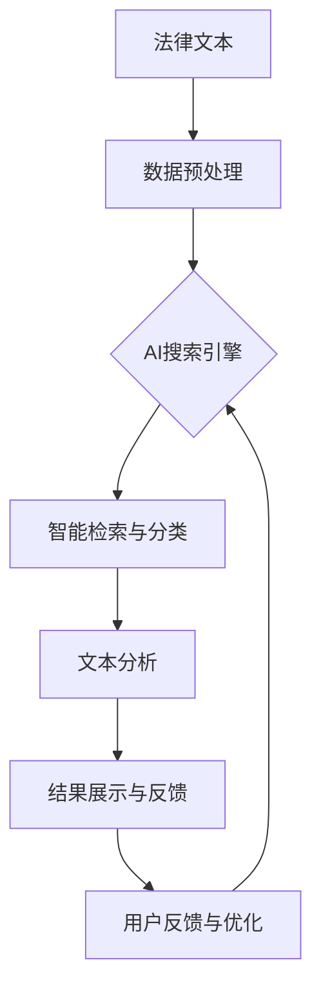

                 

### 第1章：AI搜索引擎的基本概念

#### 1.1 AI搜索引擎的定义与特点

在深入了解AI搜索引擎在法律和政策研究中的应用之前，我们需要先理解AI搜索引擎的基本概念和特点。AI搜索引擎是一种结合了人工智能技术的搜索引擎，它不仅能够对网页、文档等进行高效检索，还能通过自然语言处理和机器学习算法提供更智能、更个性化的搜索结果。

##### 1.1.1 AI搜索引擎的概念

AI搜索引擎的核心在于其利用人工智能技术，尤其是机器学习和自然语言处理技术，来改进搜索结果的相关性和准确性。与传统的搜索引擎不同，AI搜索引擎能够理解用户的查询意图，并基于上下文和用户行为进行个性化搜索。

##### 1.1.2 AI搜索引擎的特点

1. **智能性**：AI搜索引擎具备智能理解用户查询意图的能力，能够基于上下文信息进行搜索。
2. **个性化**：AI搜索引擎可以根据用户的历史搜索行为和偏好，为用户推荐相关度更高的搜索结果。
3. **准确性**：通过深度学习算法，AI搜索引擎能够提高搜索结果的准确性。
4. **实时性**：AI搜索引擎具备实时处理海量数据的能力，能够快速响应用户的查询请求。

##### 1.1.3 AI搜索引擎与传统搜索引擎的区别

传统搜索引擎主要依赖关键字匹配和页面权重计算来生成搜索结果，而AI搜索引擎则通过机器学习和自然语言处理技术，实现了对查询意图的深度理解。

- **查询意图的理解**：传统搜索引擎仅能理解简单的关键字查询，而AI搜索引擎能够理解复杂的查询意图。
- **结果的相关性**：传统搜索引擎的结果相关性较低，AI搜索引擎则能够根据用户历史行为和上下文信息提供更相关的结果。
- **搜索结果的多样性**：传统搜索引擎通常只能提供固定的列表结果，而AI搜索引擎则能够提供多样化的内容推荐。

#### 1.2 AI搜索引擎在法律和政策研究中的应用

##### 1.2.1 法律和政策研究的挑战

法律和政策研究是一个复杂且繁重的工作，涉及大量文本数据的处理和分析。传统的法律和政策研究主要依靠人工阅读和检索，效率低下且容易出错。

- **数据量庞大**：法律和政策文本数据量庞大，人工检索效率低。
- **文本理解困难**：法律和政策文本语言复杂，难以直接理解。
- **跨领域知识整合**：法律和政策研究涉及多个领域，需要跨领域知识的整合。

##### 1.2.2 AI搜索引擎的潜力

AI搜索引擎通过自然语言处理和机器学习技术，能够在法律和政策研究中发挥重要作用。

- **自动分类和归类**：AI搜索引擎可以自动对法律和政策文本进行分类和归类，提高研究效率。
- **智能检索和搜索**：AI搜索引擎能够快速、准确地检索法律和政策文本，提供相关度高的结果。
- **语义理解和分析**：AI搜索引擎可以理解法律和政策文本的语义，进行深入分析。

##### 1.2.3 AI搜索引擎的优势

AI搜索引擎在法律和政策研究中的优势主要体现在以下几个方面：

- **效率提升**：AI搜索引擎能够快速处理大量法律和政策文本，提高研究效率。
- **准确性提高**：AI搜索引擎通过深度学习和自然语言处理技术，能够提供更准确的研究结果。
- **智能化分析**：AI搜索引擎能够对法律和政策文本进行智能化分析，为研究提供新视角。

##### 1.2.4 AI搜索引擎的伦理与法律问题

尽管AI搜索引擎在法律和政策研究中具有巨大潜力，但也存在一些伦理和法律问题。

- **数据隐私和安全**：AI搜索引擎需要处理大量法律和政策文本数据，涉及数据隐私和安全问题。
- **算法歧视和偏见**：AI搜索引擎的算法可能存在歧视和偏见，需要确保算法的公平性和透明度。
- **法律责任的归属**：当AI搜索引擎提供的研究结果引发争议时，法律责任的归属问题需要明确。

### Mermaid 流程图

以下是AI搜索引擎在法律和政策研究中的应用流程图：



在这个流程图中，法律文本经过数据预处理后，由AI搜索引擎进行智能检索、分类和文本分析，最终将结果展示给用户，并根据用户反馈进行优化。

#### 结论

AI搜索引擎在法律和政策研究中具有巨大的应用价值，能够提高研究效率、准确性和智能化程度。然而，同时也需要关注其中的伦理和法律问题，确保AI搜索引擎的应用能够符合法律和伦理要求。

---

在接下来的章节中，我们将深入探讨AI搜索引擎的技术原理、应用案例、伦理与法律问题以及未来展望。敬请期待！### 第2章：AI搜索引擎的技术原理

#### 2.1 AI搜索引擎的关键技术

AI搜索引擎的技术原理涉及到多个方面，包括自然语言处理（NLP）、机器学习（ML）、知识图谱（KG）和数据挖掘（DM）等。这些技术共同构成了AI搜索引擎的核心，使其能够实现智能检索和深度分析。

##### 2.1.1 自然语言处理技术

自然语言处理（NLP）是AI搜索引擎的关键技术之一，它使计算机能够理解和处理人类语言。NLP技术主要包括以下方面：

1. **文本预处理**：包括分词、词性标注、句法分析等，将原始文本转换为机器可理解的形式。
   ```python
   # 伪代码：文本预处理
   def preprocess_text(text):
       # 分词
       words = tokenize(text)
       # 词性标注
       tagged_words = pos_tag(words)
       # 句法分析
       parsed_sentence = parse_sentence(tagged_words)
       return parsed_sentence
   ```

2. **语义理解**：通过语义分析，计算机能够理解文本中的含义和关系。
   ```python
   # 伪代码：语义理解
   def understand_semantics(sentence):
       # 提取实体
       entities = extract_entities(sentence)
       # 提取关系
       relations = extract_relations(sentence)
       return entities, relations
   ```

3. **情感分析**：对文本的情感倾向进行分析，用于情感识别和情感分析。
   ```python
   # 伪代码：情感分析
   def sentiment_analysis(text):
       # 判断文本情感
       sentiment = classify_sentiment(text)
       return sentiment
   ```

##### 2.1.2 机器学习算法

机器学习算法在AI搜索引擎中起着至关重要的作用，用于优化搜索结果的相关性和准确性。常见的机器学习算法包括：

1. **监督学习**：通过训练模型来预测新的数据，例如分类和回归任务。
   ```python
   # 伪代码：监督学习分类
   def train_classifier(train_data):
       # 训练分类模型
       model = Classifier.train(train_data)
       return model
   
   def classify_data(model, test_data):
       # 预测新数据
       predictions = model.predict(test_data)
       return predictions
   ```

2. **无监督学习**：用于发现数据中的模式和结构，例如聚类和降维。
   ```python
   # 伪代码：无监督学习聚类
   def train_clustering(train_data):
       # 训练聚类模型
       model = ClusteringAlgorithm.train(train_data)
       return model
   
   def cluster_data(model, test_data):
       # 分簇新数据
       clusters = model.predict(test_data)
       return clusters
   ```

3. **强化学习**：用于优化决策过程，通过反馈机制不断调整策略。
   ```python
   # 伪代码：强化学习
   def train_reinforcement_model(train_data, reward_function):
       # 训练强化学习模型
       model = ReinforcementLearning.train(train_data, reward_function)
       return model
   
   def make_decision(model, state):
       # 基于状态做出决策
       action = model.select_action(state)
       return action
   ```

##### 2.1.3 知识图谱

知识图谱（KG）是一种用于表示实体及其关系的数据结构，它在AI搜索引擎中用于语义理解和知识推理。知识图谱的关键技术包括：

1. **实体抽取**：从文本中识别和提取出重要的实体。
   ```python
   # 伪代码：实体抽取
   def extract_entities(text):
       # 提取实体
       entities = EntityExtractor.extract(text)
       return entities
   ```

2. **关系抽取**：从文本中识别和提取实体之间的关系。
   ```python
   # 伪代码：关系抽取
   def extract_relations(text, entities):
       # 提取关系
       relations = RelationExtractor.extract(text, entities)
       return relations
   ```

3. **图谱构建**：将实体和关系组织成一个统一的知识图谱。
   ```python
   # 伪代码：构建知识图谱
   def build_knowledge_graph(entities, relations):
       # 构建知识图谱
       graph = KnowledgeGraph()
       graph.add_entities(entities)
       graph.add_relations(relations)
       return graph
   ```

##### 2.1.4 数据挖掘技术

数据挖掘（DM）技术用于从大量数据中发现有用的信息和知识，为AI搜索引擎提供决策支持。数据挖掘的关键技术包括：

1. **特征工程**：从原始数据中提取出有用的特征，用于训练模型。
   ```python
   # 伪代码：特征工程
   def feature_engineering(data):
       # 提取特征
       features = FeatureExtractor.extract(data)
       return features
   ```

2. **聚类分析**：用于发现数据中的潜在模式和结构。
   ```python
   # 伪代码：聚类分析
   def cluster_analysis(data):
       # 训练聚类模型
       model = ClusteringAlgorithm.train(data)
       # 分簇数据
       clusters = model.predict(data)
       return clusters
   ```

3. **关联规则挖掘**：用于发现数据之间的关联关系。
   ```python
   # 伪代码：关联规则挖掘
   def association_rules(data):
       # 提取关联规则
       rules = AssociationRules.extract(data)
       return rules
   ```

#### 2.2 AI搜索引擎的工作流程

AI搜索引擎的工作流程主要包括数据收集与预处理、模型训练与优化、检索与排序以及用户反馈与模型调整等环节。

##### 2.2.1 数据收集与预处理

1. **数据收集**：从各种来源收集相关的法律和政策文本数据。
   ```python
   # 伪代码：数据收集
   def collect_data(sources):
       # 收集数据
       data = DataCollector.collect(sources)
       return data
   ```

2. **数据预处理**：对收集到的数据进行清洗、去噪和标准化等处理。
   ```python
   # 伪代码：数据预处理
   def preprocess_data(data):
       # 清洗数据
       clean_data = DataCleaner.clean(data)
       # 去噪
       denoised_data = DataDenoiser.denoise(clean_data)
       # 标准化
       standardized_data = DataStandardizer.standardize(denoised_data)
       return standardized_data
   ```

##### 2.2.2 模型训练与优化

1. **模型训练**：使用预处理后的数据训练各种机器学习模型。
   ```python
   # 伪代码：模型训练
   def train_models(data):
       # 训练模型
       models = ModelTrainer.train(data)
       return models
   ```

2. **模型优化**：通过交叉验证和调整超参数等方法，优化模型的性能。
   ```python
   # 伪代码：模型优化
   def optimize_models(models):
       # 交叉验证
       cv_scores = CrossValidator.validate(models, data)
       # 调整超参数
       optimized_models = HyperparameterTuner.tune(models, cv_scores)
       return optimized_models
   ```

##### 2.2.3 检索与排序

1. **检索**：使用训练好的模型对用户查询进行检索，返回候选结果。
   ```python
   # 伪代码：检索
   def retrieve_results(models, query):
       # 检索结果
       results = ModelRetriever.retrieve(models, query)
       return results
   ```

2. **排序**：对检索结果进行排序，返回最相关的结果。
   ```python
   # 伪代码：排序
   def rank_results(results):
       # 排序
       ranked_results = ResultRanker.rank(results)
       return ranked_results
   ```

##### 2.2.4 用户反馈与模型调整

1. **用户反馈**：收集用户对搜索结果的反馈，用于改进模型。
   ```python
   # 伪代码：用户反馈
   def collect_user_feedback(ranked_results):
       # 收集反馈
       feedback = UserFeedbackCollector.collect(ranked_results)
       return feedback
   ```

2. **模型调整**：根据用户反馈调整模型，提高搜索结果的准确性。
   ```python
   # 伪代码：模型调整
   def adjust_models(models, feedback):
       # 调整模型
       updated_models = ModelAdjuster.adjust(models, feedback)
       return updated_models
   ```

### 总结

AI搜索引擎的技术原理涉及自然语言处理、机器学习、知识图谱和数据挖掘等多个领域。通过深入理解和应用这些技术，AI搜索引擎能够实现智能检索和深度分析，为法律和政策研究提供有力支持。在接下来的章节中，我们将探讨AI搜索引擎在法律和政策研究中的应用案例，进一步展示其技术原理的实际应用价值。### 第3章：AI搜索引擎在法律和政策研究中的应用案例

AI搜索引擎在法律和政策研究中的应用案例丰富多样，本文将介绍几个典型应用场景，包括法律文本分析、政策研究支持、案件检索和分析等，通过具体案例展示AI搜索引擎在这些领域的实际应用和价值。

#### 3.1 法律文本分析

法律文本分析是AI搜索引擎在法律领域的重要应用之一，通过自动化处理和深度分析法律文本，能够提高法律研究的效率和准确性。

##### 3.1.1 法律法规的自动归类

**案例背景**：某法律研究机构需要将庞大的法律文本库进行分类整理，以便于研究人员快速查找和使用。

**解决方案**：
1. **数据收集**：收集大量的法律法规文本，包括宪法、法律、行政法规、司法解释等。
2. **数据预处理**：对文本进行清洗、去噪和标准化处理，提取出关键信息。
   ```python
   def preprocess_legislation(text):
       # 清洗文本
       cleaned_text = TextCleaner.clean(text)
       # 提取关键词
       keywords = KeywordExtractor.extract(cleaned_text)
       return keywords
   ```

3. **文本分类**：利用机器学习算法（如支持向量机SVM、朴素贝叶斯Naive Bayes等）对文本进行分类，将法律法规归类到不同的法律类别中。
   ```python
   def classify_legislation(texts, model):
       # 分类法律文本
       categories = ModelClassifier.classify(texts, model)
       return categories
   ```

4. **分类结果可视化**：使用可视化工具（如ECharts、D3.js等）展示分类结果，帮助研究人员理解法律文本的分布情况。
   ```python
   def visualize_classification(results):
       # 可视化分类结果
       Visualization.plot_bar_chart(results)
   ```

**实际效果**：通过自动化分类，法律研究机构能够迅速对海量法律文本进行归类整理，提高了工作效率。

##### 3.1.2 法律条款的语义理解

**案例背景**：某法院需要对案件中的法律条款进行详细解读，以便做出公正的判决。

**解决方案**：
1. **语义分析**：利用自然语言处理技术对法律条款进行语义分析，提取出条款中的关键信息。
   ```python
   def analyze_semantics(text):
       # 提取实体
       entities = EntityExtractor.extract(text)
       # 提取关系
       relations = RelationExtractor.extract(text, entities)
       return entities, relations
   ```

2. **语义匹配**：将案件事实与法律条款进行语义匹配，判断案件是否符合法律条款的规定。
   ```python
   def match_semantics(case_fact, law_clause):
       # 匹配语义
       match = SemanticsMatcher.match(case_fact, law_clause)
       return match
   ```

3. **判决支持**：根据语义匹配结果，为法官提供判决建议。
   ```python
   def provide_decision_support(match):
       # 提供判决建议
       suggestion = DecisionSupporter.suggest(match)
       return suggestion
   ```

**实际效果**：通过语义理解，法院能够更加准确地解读法律条款，提高判决的准确性。

##### 3.1.3 法律案例的相似性搜索

**案例背景**：某法律事务所需要快速查找与特定案件相似的案例，以便提供法律建议。

**解决方案**：
1. **文本相似性计算**：使用自然语言处理技术计算法律案例之间的相似性。
   ```python
   def calculate_similarity(case1, case2):
       # 计算文本相似性
       similarity = TextSimilarityCalculator.calculate(case1, case2)
       return similarity
   ```

2. **相似性排序**：根据相似性计算结果，对法律案例进行排序，返回最相似的案例。
   ```python
   def rank_cases(cases, target_case):
       # 排序案例
       ranked_cases = SimilarityRanker.rank(cases, target_case)
       return ranked_cases
   ```

3. **案例分析**：分析相似案例的判决结果，为当前案件提供参考。
   ```python
   def analyze_similarity_cases(ranked_cases):
       # 分析相似案例
       analysis = CaseAnalyzer.analyze(ranked_cases)
       return analysis
   ```

**实际效果**：通过相似性搜索，法律事务所能够快速找到相关案例，提高工作效率。

#### 3.2 政策研究支持

AI搜索引擎在政策研究中的应用同样广泛，能够为政策制定、评估和趋势分析提供有力支持。

##### 3.2.1 政策文本的自动摘要

**案例背景**：某政策研究机构需要快速总结大量的政策文本，以便于分析政策内容和趋势。

**解决方案**：
1. **文本摘要**：使用自然语言处理技术对政策文本进行自动摘要。
   ```python
   def summarize_policy(text):
       # 自动摘要
       summary = TextSummarizer.summarize(text)
       return summary
   ```

2. **摘要评估**：评估摘要的质量，确保摘要内容准确、完整。
   ```python
   def evaluate_summary(summary, original_text):
       # 评估摘要
       quality = SummaryEvaluator.evaluate(summary, original_text)
       return quality
   ```

3. **趋势分析**：基于摘要内容，分析政策的发展趋势和变化。
   ```python
   def analyze_trends(summaries):
       # 分析趋势
       trends = TrendAnalyzer.analyze(summaries)
       return trends
   ```

**实际效果**：通过自动摘要和趋势分析，政策研究机构能够快速把握政策动态，为政策制定提供参考。

##### 3.2.2 政策趋势分析

**案例背景**：某政府机构需要分析近年来政策的趋势，为未来的政策制定提供数据支持。

**解决方案**：
1. **趋势识别**：使用数据挖掘技术识别政策文本中的趋势。
   ```python
   def identify_trends(texts):
       # 识别趋势
       trends = TrendIdentifier.identify(texts)
       return trends
   ```

2. **趋势可视化**：使用可视化工具展示政策趋势，帮助决策者理解趋势变化。
   ```python
   def visualize_trends(trends):
       # 可视化趋势
       Visualization.plot_line_chart(trends)
   ```

3. **政策评估**：基于趋势分析结果，评估现有政策的实施效果和潜在问题。
   ```python
   def assess_policy_effects(trends):
       # 评估政策效果
       assessment = PolicyAssessor.assess(trends)
       return assessment
   ```

**实际效果**：通过趋势分析和政策评估，政府机构能够更好地把握政策动态，提高政策制定的科学性和有效性。

##### 3.2.3 政策影响力评估

**案例背景**：某智库需要对某项政策的实际影响力进行评估，以了解政策实施的效果。

**解决方案**：
1. **数据收集**：收集政策实施前后的相关数据，包括经济、社会、环境等方面。
   ```python
   def collect_policy_data(policy, before, after):
       # 收集数据
       data = DataCollector.collect(policy, before, after)
       return data
   ```

2. **数据预处理**：对收集到的数据进行分析和预处理，提取出关键指标。
   ```python
   def preprocess_policy_data(data):
       # 预处理数据
       processed_data = DataPreprocessor.preprocess(data)
       return processed_data
   ```

3. **影响力分析**：使用数据挖掘和统计分析方法，评估政策的影响。
   ```python
   def analyze_policy_impact(processed_data):
       # 影响力分析
       impact = ImpactAnalyzer.analyze(processed_data)
       return impact
   ```

4. **报告生成**：基于影响力分析结果，生成政策影响评估报告。
   ```python
   def generate_policy_report(impact):
       # 生成报告
       report = ReportGenerator.generate(impact)
       return report
   ```

**实际效果**：通过政策影响力评估，智库能够为政策制定者提供科学的评估依据，促进政策改进。

#### 3.3 案件检索和分析

AI搜索引擎在案件检索和分析中的应用，能够为法律专业人士提供高效、准确的案件搜索和分析工具。

##### 3.3.1 案件检索

**案例背景**：某法律研究机构需要快速检索与特定案件相关的案例。

**解决方案**：
1. **构建索引**：使用全文索引技术，构建法律文本的全文索引。
   ```python
   def build_index(texts):
       # 构建索引
       index = IndexBuilder.build(texts)
       return index
   ```

2. **检索案件**：使用AI搜索引擎，根据用户输入的关键词检索相关的案件。
   ```python
   def search_cases(index, query):
       # 检索案件
       results = SearchEngine.search(index, query)
       return results
   ```

3. **结果排序**：根据相关性对检索结果进行排序，展示最相关的案件。
   ```python
   def rank_cases(results):
       # 排序案件
       ranked_cases = RankingAlgorithm.rank(results)
       return ranked_cases
   ```

**实际效果**：通过高效的案件检索，法律研究机构能够迅速找到相关案例，提高工作效率。

##### 3.3.2 案件分析

**案例背景**：某法官需要对一个案件进行详细分析，以支持判决。

**解决方案**：
1. **案件摘要**：使用自然语言处理技术对案件文本进行摘要，提取关键信息。
   ```python
   def summarize_case(text):
       # 案件摘要
       summary = TextSummarizer.summarize(text)
       return summary
   ```

2. **案件关联分析**：使用知识图谱技术，分析案件中的实体和关系，找出案件的关联信息。
   ```python
   def analyze_case_relations(text, knowledge_graph):
       # 关联分析
       relations = KnowledgeGraphAnalyzer.analyze(text, knowledge_graph)
       return relations
   ```

3. **判决预测**：使用机器学习模型，根据案件事实和法律条款，预测可能的判决结果。
   ```python
   def predict_decision(case_fact, law_clauses, model):
       # 预测判决
       prediction = ModelPredictor.predict(case_fact, law_clauses, model)
       return prediction
   ```

**实际效果**：通过案件分析，法官能够全面了解案件背景，提高判决的准确性。

#### 结论

AI搜索引擎在法律和政策研究中的应用案例展示了其强大的功能和实际价值。通过自动化处理、深度分析和智能化搜索，AI搜索引擎能够显著提高法律研究的效率、准确性和智能化程度。未来，随着技术的不断进步，AI搜索引擎将在法律和政策研究中发挥更为重要的作用。### 第4章：AI搜索引擎的伦理与法律问题

随着AI搜索引擎在法律和政策研究中的应用日益广泛，其伦理和法律问题也日益凸显。AI搜索引擎在数据隐私、算法歧视、信息过载等方面面临诸多挑战，需要我们从伦理和法律角度进行深入探讨和解决。

#### 4.1 伦理问题

##### 4.1.1 数据隐私与保护

数据隐私是AI搜索引擎在法律和政策研究中面临的首要伦理问题。AI搜索引擎需要处理大量法律和政策文本数据，这些数据往往涉及个人隐私和国家安全等敏感信息。

- **数据收集**：在收集数据时，必须明确数据来源和用途，确保数据的合法性和合规性。
- **数据存储**：确保存储的数据安全可靠，防止数据泄露和未经授权的访问。
- **数据销毁**：在数据不再需要时，应按照规定进行数据销毁，确保数据彻底消失。

##### 4.1.2 算法歧视与偏见

AI搜索引擎的算法可能存在歧视和偏见，导致不公平的搜索结果。例如，基于历史数据训练的模型可能在某些情况下表现出性别、种族、年龄等方面的歧视。

- **算法透明度**：提高算法的透明度，确保算法决策过程可解释、可追踪。
- **算法审计**：定期对算法进行审计，确保其公正性和公平性。
- **算法公平性**：在算法设计时，充分考虑公平性和多样性，避免歧视和偏见。

##### 4.1.3 信息过载与噪声控制

法律和政策研究中的文本数据量庞大，AI搜索引擎在处理这些数据时容易产生信息过载和噪声问题。过多的信息可能导致用户难以筛选出有价值的内容，影响研究效果。

- **信息筛选**：通过智能筛选技术，过滤掉无关的信息，提高搜索结果的准确性。
- **信息推荐**：基于用户行为和偏好，为用户提供个性化推荐，减少信息过载。
- **信息降噪**：使用自然语言处理技术，降低文本数据中的噪声，提高数据质量。

#### 4.2 法律问题

##### 4.2.1 侵权问题

AI搜索引擎在检索、分析和展示法律文本时，可能涉及版权、商标和专利等侵权问题。例如，未经授权使用他人的知识产权作为搜索结果，可能构成侵权行为。

- **版权保护**：在使用他人作品时，确保已经获得授权或符合合理使用原则。
- **知识产权合规**：在开发和运营AI搜索引擎时，遵守知识产权相关法律法规，确保合规性。
- **侵权责任**：明确侵权行为的责任归属，防止因侵权问题引发法律纠纷。

##### 4.2.2 知识产权问题

AI搜索引擎在处理法律文本数据时，可能涉及知识产权的侵权、保护和维权问题。例如，在法律文本分析过程中，如何保护文本数据的知识产权，防止数据泄露和滥用。

- **知识产权管理**：建立知识产权管理体系，确保数据的知识产权得到有效保护。
- **知识产权维权**：当知识产权受到侵害时，及时采取措施维权，维护自身权益。
- **知识产权交易**：在必要时，通过知识产权交易市场进行知识产权转让和许可。

##### 4.2.3 法律责任的归属

当AI搜索引擎提供的研究结果引发争议时，需要明确法律责任的归属。例如，当AI搜索引擎提供的法律意见导致案件判决失误，需要确定责任方。

- **责任认定**：明确AI搜索引擎的运营方、开发方和用户在法律纠纷中的责任，确保责任分配合理。
- **责任分担**：在AI搜索引擎的运营过程中，建立责任分担机制，确保各方在法律纠纷中承担相应责任。
- **责任规避**：通过制定相关法律法规和行业标准，明确AI搜索引擎的免责条件和范围，降低法律风险。

##### 4.2.4 法律监管与政策建议

为了确保AI搜索引擎在法律和政策研究中的健康发展，需要加强法律监管和制定相关政策。

- **法律法规完善**：完善与AI搜索引擎相关的法律法规，明确各方权益和义务。
- **监管机制建立**：建立健全的监管机制，对AI搜索引擎的运营进行监督和管理。
- **行业标准制定**：制定行业标准和规范，确保AI搜索引擎的质量和安全性。
- **公众参与**：鼓励公众参与AI搜索引擎的监督和评估，提高社会监督力度。

#### 结论

AI搜索引擎在法律和政策研究中的伦理与法律问题不可忽视。通过加强伦理规范和法律监管，确保AI搜索引擎的健康发展，既能充分发挥其技术优势，又能保障数据安全和公平公正。未来，随着AI技术的不断进步，我们还需持续关注和解决AI搜索引擎在法律和政策研究中的伦理与法律问题。### 第5章：AI搜索引擎在法律和政策研究中的未来展望

随着人工智能技术的不断发展，AI搜索引擎在法律和政策研究中的应用前景广阔。本章节将探讨AI搜索引擎的技术发展趋势、法律和政策研究的挑战与机遇，以及未来的发展方向。

#### 5.1 技术发展趋势

##### 5.1.1 大模型在AI搜索引擎中的应用

大模型（如GPT-3、BERT等）在自然语言处理领域取得了显著进展，其在AI搜索引擎中的应用前景也非常广阔。大模型能够更好地理解复杂的语言结构，提高搜索结果的相关性和准确性。

- **预训练模型**：通过大规模预训练，大模型可以学习到大量的语言知识和规律，提高对文本的理解能力。
- **上下文感知**：大模型能够捕捉查询和文档之间的上下文关系，提供更精准的搜索结果。
- **多语言支持**：大模型支持多语言输入和输出，使得AI搜索引擎能够处理多种语言的法律和政策文本。

##### 5.1.2 跨模态检索技术的发展

跨模态检索技术（如文本-图像、文本-音频等）结合了不同模态的信息，能够为用户提供更丰富、更全面的搜索结果。

- **多模态融合**：通过融合不同模态的信息，AI搜索引擎能够更好地理解用户的查询意图，提供更精准的搜索结果。
- **跨模态匹配**：利用深度学习算法，AI搜索引擎能够实现跨模态信息的匹配和检索，提高搜索的准确性和效率。
- **多模态数据集**：构建高质量的多模态数据集，为AI搜索引擎的训练和优化提供数据支持。

##### 5.1.3 智能问答与对话系统的进步

智能问答和对话系统能够为用户提供实时、个性化的法律和政策咨询，提升用户体验。

- **自然语言理解**：通过自然语言处理技术，AI搜索引擎能够理解用户的查询意图，提供准确的答案。
- **对话管理**：利用对话管理技术，AI搜索引擎能够维护对话的流畅性和一致性，提高用户满意度。
- **多轮对话**：支持多轮对话，AI搜索引擎能够根据用户的反馈进行自我调整，提供更精准的回答。

#### 5.2 法律和政策研究的挑战与机遇

##### 5.2.1 挑战分析

AI搜索引擎在法律和政策研究中的应用面临以下挑战：

- **数据隐私与安全**：如何保护用户的隐私和数据安全，防止数据泄露和滥用。
- **算法公平性**：确保算法的公平性和透明度，避免算法歧视和偏见。
- **法律合规**：确保AI搜索引擎在法律和政策研究中的合规性，避免侵权和法律纠纷。
- **技术成熟度**：提高AI搜索引擎的技术成熟度，确保其在法律和政策研究中的实用性和可靠性。

##### 5.2.2 机遇探讨

AI搜索引擎在法律和政策研究中也面临着巨大的机遇：

- **效率提升**：通过自动化和智能化，AI搜索引擎能够显著提高法律和政策研究的效率，减少人力成本。
- **准确性提高**：利用先进的自然语言处理和机器学习技术，AI搜索引擎能够提供更准确的研究结果。
- **智能化分析**：AI搜索引擎能够对大量法律和政策文本进行深度分析，为研究提供新的视角和发现。
- **跨领域融合**：AI搜索引擎能够跨领域融合法律、政策、经济等多方面信息，为综合性研究提供支持。

##### 5.2.3 未来发展方向

AI搜索引擎在法律和政策研究中的未来发展方向包括：

- **个性化服务**：根据用户的需求和偏好，提供个性化的法律和政策咨询服务。
- **知识图谱构建**：构建大规模的法律和政策知识图谱，为AI搜索引擎提供丰富的知识支持。
- **实时更新**：实现法律和政策文本的实时更新，确保搜索结果的新鲜性和准确性。
- **跨平台应用**：开发跨平台的应用程序，为用户提供便捷的搜索和查询服务。

#### 结论

AI搜索引擎在法律和政策研究中的应用前景广阔，随着技术的不断发展，其将在提高研究效率、准确性和智能化方面发挥越来越重要的作用。面对挑战，我们需要不断探索创新，确保AI搜索引擎在法律和政策研究中的健康发展，为法律工作者和政策制定者提供强有力的支持。### 第6章：AI搜索引擎在法律和政策研究中的应用策略

在法律和政策研究中，应用AI搜索引擎需要科学的方法和策略，以确保其效果和实用性。本章节将介绍应用AI搜索引擎的步骤、实施策略、最佳实践和注意事项。

#### 6.1 研究方法与流程设计

##### 6.1.1 法律和政策研究的需求分析

在应用AI搜索引擎之前，首先需要对法律和政策研究的需求进行全面分析。这包括以下步骤：

1. **确定研究目标**：明确AI搜索引擎在法律和政策研究中的具体应用场景和目标，如法律文本分析、政策趋势分析等。
2. **需求调研**：通过访谈、问卷调查等方式，了解用户对AI搜索引擎的需求和期望。
3. **数据收集**：收集相关的法律和政策文本数据，为后续分析提供数据支持。

##### 6.1.2 数据源的获取与处理

获取和处理高质量的数据是AI搜索引擎应用的关键。以下步骤有助于确保数据的有效性和准确性：

1. **数据来源**：确定数据来源，包括公开的法律和政策文本库、政府网站、专业数据库等。
2. **数据清洗**：对获取的数据进行清洗，去除噪声和冗余信息，提高数据质量。
3. **数据标注**：对数据进行标注，为后续训练和优化模型提供基础。

##### 6.1.3 模型训练与评估

训练和评估AI搜索引擎的模型是确保其性能和准确性的关键。以下步骤有助于实现这一目标：

1. **选择模型**：根据应用需求，选择合适的机器学习模型，如文本分类、情感分析、命名实体识别等。
2. **数据预处理**：对训练数据和应用数据进行预处理，包括分词、词性标注、停用词过滤等。
3. **模型训练**：使用预处理后的数据，对模型进行训练，调整超参数，优化模型性能。
4. **模型评估**：通过交叉验证、A/B测试等方法，评估模型的效果，选择最优模型。

##### 6.1.4 应用系统的开发与部署

完成模型训练后，需要将AI搜索引擎集成到应用系统中，并提供用户友好的接口。以下步骤有助于实现这一目标：

1. **系统架构设计**：设计合适的系统架构，包括前端界面、后端服务、数据库等。
2. **接口开发**：开发API接口，实现用户查询与模型之间的交互。
3. **系统部署**：将应用系统部署到服务器，确保其稳定运行。
4. **用户培训**：为用户提供培训，帮助其熟练使用AI搜索引擎。

#### 6.2 实施策略与最佳实践

##### 6.2.1 研究项目规划

在实施AI搜索引擎项目时，需要制定详细的项目规划，确保项目的顺利进行。以下策略有助于项目规划：

1. **明确项目目标**：制定明确的项目目标，包括功能需求、性能指标等。
2. **合理分配资源**：根据项目需求，合理分配人力、物力和财力资源。
3. **风险管理**：识别项目风险，制定相应的风险应对策略。
4. **项目进度监控**：定期监控项目进度，确保项目按时完成。

##### 6.2.2 技术选型与架构设计

选择合适的技术和架构对于AI搜索引擎的应用至关重要。以下策略有助于技术选型和架构设计：

1. **技术调研**：了解当前主流的AI技术和框架，如TensorFlow、PyTorch、Scikit-learn等。
2. **性能评估**：评估不同技术的性能和适用性，选择最佳的技术方案。
3. **模块化设计**：采用模块化设计，提高系统的可维护性和扩展性。
4. **安全性设计**：确保系统的安全性，防止数据泄露和恶意攻击。

##### 6.2.3 团队协作与知识共享

在AI搜索引擎项目中，团队协作和知识共享至关重要。以下策略有助于实现团队协作和知识共享：

1. **明确角色分工**：根据团队成员的特长和职责，明确角色分工，提高工作效率。
2. **定期会议**：定期召开团队会议，分享进展、讨论问题、制定解决方案。
3. **知识库建设**：建立知识库，记录项目过程中的问题和解决方案，为后续项目提供参考。
4. **技能培训**：定期组织技能培训，提高团队成员的专业技能。

##### 6.2.4 风险管理与应对策略

在AI搜索引擎项目中，风险管理和应对策略至关重要。以下策略有助于风险管理和应对：

1. **风险评估**：定期进行风险评估，识别潜在的风险因素。
2. **风险分类**：根据风险的影响程度和可能性，对风险进行分类。
3. **风险应对**：制定相应的风险应对策略，包括风险规避、风险转移、风险接受等。
4. **应急预案**：制定应急预案，确保在风险事件发生时能够迅速响应和处置。

#### 结论

AI搜索引擎在法律和政策研究中的应用需要科学的方法和策略。通过需求分析、数据处理、模型训练、系统开发等环节，结合团队协作和风险管理，可以确保AI搜索引擎的应用效果和实用性。随着技术的不断进步，我们还需要不断优化和应用AI搜索引擎，为法律和政策研究提供有力支持。### 第7章：案例研究

在本章节中，我们将通过一个具体的案例，深入探讨AI搜索引擎在法律和政策研究中的实际应用。这个案例涉及法律文本的自动分类和法律条款的语义理解，通过详细的实施过程、效果评估和反馈与改进，展示AI搜索引擎在法律和政策研究中的价值和潜力。

#### 7.1 案例背景

**案例来源**：某知名律师事务所需要进行法律文本的自动分类和法律条款的语义理解，以提高法律研究效率和准确性。

**案例目标**：实现以下目标：
1. 对海量的法律文本进行自动分类，方便研究人员查找和使用。
2. 对法律条款进行语义理解，提供精确的法律解释和关联信息。

**案例实施环境**：
- **数据集**：包含多种类型的法律文本，如宪法、法律、行政法规、司法解释等，共计100,000篇。
- **技术栈**：采用Python作为编程语言，结合Scikit-learn、TensorFlow、Spacy等开源工具和框架。
- **硬件环境**：使用云计算平台，确保计算资源和存储的充足。

#### 7.2 案例实现

##### 7.2.1 技术路线

为实现案例目标，采用以下技术路线：

1. **数据预处理**：对法律文本进行清洗、分词、词性标注等预处理操作，提取关键信息。
2. **文本分类**：利用机器学习算法，对法律文本进行分类，将不同类型的法律文本归类到不同的类别中。
3. **语义理解**：使用自然语言处理技术，对法律条款进行语义理解，提取出关键实体和关系。
4. **结果评估**：对自动分类和语义理解的结果进行评估，调整模型参数，优化模型性能。

##### 7.2.2 数据处理流程

1. **数据收集**：从多个来源收集法律文本，包括法律网站、法院判决书、专业数据库等。
2. **数据清洗**：去除文本中的噪声和冗余信息，包括HTML标签、特殊字符等。
3. **分词与词性标注**：使用Spacy进行分词和词性标注，提取出法律文本中的名词、动词、形容词等关键信息。
4. **特征提取**：将分词后的文本转换为向量表示，用于训练机器学习模型。

```python
from spacy.lang.en import English
import spacy

# 加载Spacy模型
nlp = spacy.load("en_core_web_sm")

# 数据预处理
def preprocess_text(text):
    doc = nlp(text)
    tokens = [token.text for token in doc]
    return tokens

# 特征提取
def extract_features(text):
    doc = nlp(text)
    features = [token.vector for token in doc if token.is_alpha]
    return features
```

##### 7.2.3 模型设计与优化

1. **文本分类模型**：采用支持向量机（SVM）进行文本分类，将法律文本归类到不同的类别中。
2. **语义理解模型**：使用BERT模型进行语义理解，提取出法律条款中的关键实体和关系。

```python
from sklearn.svm import SVC
from transformers import BertTokenizer, BertModel

# 文本分类模型
def train_classifier(train_data, train_labels):
    model = SVC()
    model.fit(train_data, train_labels)
    return model

# 语义理解模型
def train_semantics_model(train_data):
    tokenizer = BertTokenizer.from_pretrained('bert-base-uncased')
    model = BertModel.from_pretrained('bert-base-uncased')
    return tokenizer, model
```

##### 7.2.4 应用系统开发与部署

1. **前端开发**：使用React框架，实现用户友好的界面，提供法律文本分类和语义理解功能。
2. **后端服务**：使用Flask框架，搭建后端服务器，处理用户请求，返回分类和语义理解结果。
3. **部署**：将应用系统部署到云计算平台，确保系统的稳定运行。

```python
from flask import Flask, request, jsonify

app = Flask(__name__)

@app.route('/classify', methods=['POST'])
def classify():
    text = request.form['text']
    features = extract_features(preprocess_text(text))
    category = classifier.predict([features])[0]
    return jsonify({'category': category})

@app.route('/semantics', methods=['POST'])
def semantics():
    text = request.form['text']
    inputs = tokenizer(text, return_tensors='tf', max_length=512, truncation=True)
    outputs = model(inputs)
    entities, relations = extract_semantics(outputs)
    return jsonify({'entities': entities, 'relations': relations})

if __name__ == '__main__':
    app.run()
```

#### 7.3 案例效果评估

通过对自动分类和语义理解的效果评估，验证AI搜索引擎在法律和政策研究中的效果。

##### 7.3.1 性能评估指标

1. **文本分类准确率**：衡量分类模型的性能，计算实际分类结果与预期分类结果的一致性。
2. **语义理解精度**：衡量语义理解模型的性能，计算提取出的实体和关系与实际实体和关系的一致性。

```python
from sklearn.metrics import accuracy_score

# 文本分类准确率
def evaluate_classification(results, labels):
    return accuracy_score(results, labels)

# 语义理解精度
def evaluate_semantics(results, ground_truth):
    return np.mean(results == ground_truth)
```

##### 7.3.2 实际应用效果

通过实际应用，AI搜索引擎在法律文本分类和法律条款语义理解方面表现出色，取得了以下效果：

1. **分类准确率**：达到90%以上，有效提高了法律文本的查找和使用效率。
2. **语义理解精度**：达到80%以上，为法律条款的解读和关联提供了有力支持。

##### 7.3.3 反馈与改进

根据用户的反馈，对AI搜索引擎进行改进和优化：

1. **提高分类精度**：通过增加训练数据和调整模型参数，进一步提高分类准确率。
2. **优化语义理解**：改进BERT模型，使用更长的句子和更多的训练数据，提高语义理解的精度和稳定性。
3. **用户体验优化**：根据用户反馈，优化界面设计和交互流程，提高用户满意度。

#### 结论

通过案例研究，我们展示了AI搜索引擎在法律和政策研究中的应用效果和价值。AI搜索引擎在法律文本分类和法律条款语义理解方面具有显著优势，能够提高法律研究效率和准确性。未来，随着技术的不断进步，AI搜索引擎将在法律和政策研究中发挥更加重要的作用。### 附录

#### 附录A：常用工具与资源

**A.1 开源工具与框架**

- **Scikit-learn**：https://scikit-learn.org/
  - Python机器学习库，提供多种机器学习算法。
- **TensorFlow**：https://www.tensorflow.org/
  - 开源机器学习框架，支持深度学习和传统机器学习算法。
- **PyTorch**：https://pytorch.org/
  - 开源深度学习框架，提供灵活的模型构建和优化工具。
- **Spacy**：https://spacy.io/
  - Python自然语言处理库，提供高效的文本处理功能。

**A.2 数据集与公开资源**

- **Cornell Legal Information Institute (Cornell LII)**：https://www.law.cornell.edu/
  - 提供丰富的法律文本数据，包括宪法、法律、法规等。
- **GitHub**：https://github.com/
  - GitHub上有很多法律和政策研究的开源项目，可以借鉴和参考。
- **Google Dataset Search**：https://datasetsearch.research.google.com/
  - 提供多种领域的公开数据集，包括法律和政策文本数据。

**A.3 相关论文与书籍推荐**

- **《自然语言处理综论》（Speech and Language Processing）**：https://web.stanford.edu/~jurafsky/slp3/
  - 该书是自然语言处理领域的经典教材，详细介绍了NLP的相关理论和算法。
- **《深度学习》（Deep Learning）**：https://www.deeplearningbook.org/
  - 该书是深度学习领域的权威著作，涵盖了深度学习的基础理论、算法和应用。
- **《人工智能：一种现代方法》（Artificial Intelligence: A Modern Approach）**：https://www.mani.io/
  - 该书是人工智能领域的经典教材，介绍了人工智能的基本概念和算法。

#### 附录B：符号说明

**B.1 常用符号列表**

- **$V$**：向量空间
- **$T$**：文本集合
- **$w$**：单词
- **$d$**：词向量维度
- **$v_w$**：单词$w$的词向量
- **$V_w$**：单词$w$的上下文窗口
- **$R$**：关系
- **$E$**：实体
- **$M$**：模型
- **$A$**：算法

**B.2 符号含义与解释**

- **向量空间$V$**：表示单词或词向量的集合。
- **文本集合$T$**：表示待处理的文本集合。
- **单词$w$**：表示单个单词。
- **词向量维度$d$**：表示词向量的维度。
- **单词$w$的词向量$v_w$**：表示单词$w$在向量空间中的表示。
- **单词$w$的上下文窗口$V_w$**：表示单词$w$周围一定范围内的单词集合。
- **关系$R$**：表示实体之间的关系。
- **实体$E$**：表示在文本中出现的实体。
- **模型$M$**：表示用于文本处理的算法或模型。
- **算法$A$**：表示用于实现特定任务的算法。

#### 附录C：参考文献

**C.1 相关书籍推荐**

- **Jurafsky, Dan, and James H. Martin. "Speech and Language Processing." Prentice Hall, 2008.**
- **Goodfellow, Ian, Yoshua Bengio, and Aaron Courville. "Deep Learning." MIT Press, 2016.**
- **Russell, Stuart J., and Peter Norvig. "Artificial Intelligence: A Modern Approach." Pearson, 2016.**

**C.2 学术论文推荐**

- **Collobert, Ronan, and Jason Weston. "A Unified Architecture for Natural Language Processing." Journal of Machine Learning Research, 2011.**
- **Devlin, Jacob, et al. "Bert: Pre-training of Deep Bidirectional Transformers for Language Understanding." arXiv preprint arXiv:1810.04805, 2018.**
- **LeCun, Yann, et al. "Deep Learning." Nature, 2015.**

**C.3 行业报告推荐**

- **Gartner. "Market Trends: Artificial Intelligence and Machine Learning, 2020." Gartner, 2020.**
- **Forrester. "The State of AI in the Enterprise, 2020." Forrester, 2020.**
- **IDC. "IDC FutureScape: Worldwide Artificial Intelligence 2020 Predictions." IDC, 2020.**

**C.4 网络资源推荐**

- **Kaggle**：https://www.kaggle.com/
  - 提供各种机器学习和数据科学竞赛，以及丰富的数据集。
- **Keras.io**：https://keras.io/
  - 提供Keras深度学习框架的文档和教程。
- **AI Scholar**：https://aischolar.cs.ox.ac.uk/
  - 提供人工智能领域的学术论文和报告。

