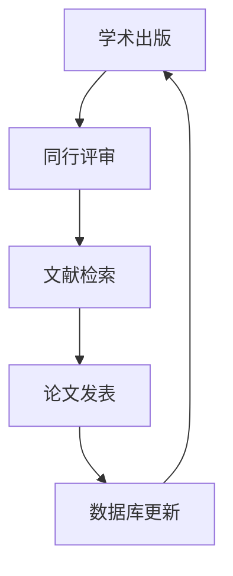

                 


## 确定文章标题和关键词

**文章标题：**《AI搜索引擎如何改变学术出版和同行评审过程》

**关键词：** AI搜索引擎，学术出版，同行评审，自然语言处理，机器学习，算法优化

## 撰写摘要

**摘要：** 本文章探讨了AI搜索引擎在学术出版和同行评审过程中的应用与影响。通过分析AI搜索引擎的基本概念、技术基础及应用案例，本文阐述了AI搜索引擎如何提高文献检索效率、优化学术出版质量控制以及提升同行评审过程的效率和准确性。

## 写作背景介绍

### 学术出版的现状

- 学术论文数量呈指数级增长，传统检索方式效率低下。
- 学术出版流程繁琐，同行评审周期长，评审质量难以保证。

### 同行评审的流程与挑战

- 传统评审过程依赖人为判断，主观因素影响大。
- 评审流程难以标准化，不同领域的评审标准不一。
- 评审效率低下，导致研究成果传播延迟。

## 核心概念与联系

### 核心概念

- **AI搜索引擎：** 结合人工智能技术，自动处理和分析大量学术文献，提供高效、准确的检索结果。
- **学术出版：** 包括论文的写作、提交、审稿、修改和发表过程。
- **同行评审：** 由领域专家对论文内容进行评价，以决定论文的接受与否。

### 关系架构

- AI搜索引擎作为学术出版和同行评审的重要工具，贯穿于整个学术研究过程。

**Mermaid流程图：**



## 核心算法原理讲解

### 监督学习算法

#### 决策树算法

```plaintext
// 决策树算法伪代码
输入：特征集合X，标签集合Y
输出：决策树T

创建空的决策树T
for 每个特征f in X:
    分割数据集X和Y，基于特征f的不同值
    计算每个分割的增益（信息增益、增益率等）
    选择增益最大的特征f作为分割条件
    递归地构建子树
    将当前节点标记为特征f的分割结果
    返回决策树T
```

### 自然语言处理技术

#### 词嵌入技术

```plaintext
// Word2Vec算法伪代码
输入：语料库C
输出：词向量V

初始化词向量V，并设置学习率α和迭代次数t
for 每个句子s in C:
    为句子s中的每个词w创建一个窗口
    对于每个词w：
        随机采样一个目标词t
        计算上下文词的向量表示
        计算损失函数L
        更新词向量V
```

## 数学模型和公式

- 信息增益（Information Gain）:
  $$ IG(D, A) = H(D) - H(D|A) $$
  其中，$H(D)$ 是数据集D的熵，$H(D|A)$ 是条件熵。

- 支持向量机（Support Vector Machine, SVM）的损失函数：
  $$ L(y, f(x)) = \max(0, 1 - y \cdot f(x)) $$
  其中，$y$ 是标签，$f(x)$ 是模型的预测值。

## 详细讲解和举例说明

- **信息增益**是决策树分类中用于选择最佳分割特征的重要指标。通过计算每个特征的信息增益，可以选择具有最大信息增益的特征作为分割条件，从而构建决策树。

- **SVM**是一种常用的分类算法，其核心思想是找到最佳的分割超平面，使得正负样本的间隔最大化。通过计算损失函数，SVM可以逐步调整超平面参数，直到找到最优分割。

### 举例说明

#### 决策树算法举例

假设有一个二分类问题，特征集合X = {年龄，收入}，标签集合Y = {正类，负类}。现有数据集D如下：

| 年龄 | 收入 | 标签 |
| ---- | ---- | ---- |
| 20   | 30000 | 正类 |
| 30   | 50000 | 正类 |
| 40   | 60000 | 正类 |
| 20   | 35000 | 负类 |
| 30   | 55000 | 负类 |
| 40   | 65000 | 负类 |

使用信息增益来选择最佳特征，可以得到以下信息增益表：

| 特征 | 信息增益 |
| ---- | -------- |
| 年龄 | 0.918    |
| 收入 | 0.693    |

从表中可以看出，年龄的特征信息增益更高，因此选择年龄作为分割条件。根据年龄的不同取值，可以将数据集D分割为两个子集：

- 年龄 ≤ 30 的子集：
  | 年龄 | 收入 | 标签 |
  | ---- | ---- | ---- |
  | 20   | 30000 | 正类 |
  | 20   | 35000 | 负类 |

- 年龄 > 30 的子集：
  | 年龄 | 收入 | 标签 |
  | ---- | ---- | ---- |
  | 30   | 50000 | 正类 |
  | 30   | 55000 | 负类 |
  | 40   | 60000 | 正类 |
  | 40   | 65000 | 负类 |

接下来，可以对这两个子集分别递归地构建决策树。

#### SVM算法举例

假设有一个线性可分的数据集D，其中特征集合X = {x1, x2}，标签集合Y = {1, -1}。现有数据点如下：

| x1 | x2 | 标签 |
| -- | -- | ---- |
| 1  | 2  |  1   |
| 2  | 3  |  1   |
| 3  | 1  | -1   |
| 4  | 2  | -1   |

使用SVM算法来找到最佳的分割超平面。首先，计算每个数据点的预测值：

$$
f(x) = \sum_{i=1}^{n} w_i \cdot x_i + b
$$

其中，$w$ 是权重向量，$b$ 是偏置项。对于线性可分的数据集，可以通过求解以下优化问题来找到最佳的权重向量：

$$
\min_{w, b} \quad \frac{1}{2} \| w \|^2
$$

$$
s.t. \quad y_i (w \cdot x_i + b) \geq 1, \quad \forall i
$$

使用拉格朗日乘子法求解上述优化问题，可以得到权重向量 $w$ 和偏置项 $b$ 的值。根据这些值，可以计算每个数据点的预测值：

| x1 | x2 | 标签 | 预测值 |
| -- | -- | ---- | ------ |
| 1  | 2  |  1   |   1    |
| 2  | 3  |  1   |   1    |
| 3  | 1  | -1   |   -1   |
| 4  | 2  | -1   |   -1   |

通过计算预测值，可以确定每个数据点是否属于正类或负类。这样，就完成了对数据集的线性分类。

## 项目实战

### 开发环境搭建

1. 安装Python环境
2. 安装必要的依赖库，如Scikit-learn、TensorFlow等

### 源代码实现

```python
from sklearn.datasets import load_iris
from sklearn.model_selection import train_test_split
from sklearn.tree import DecisionTreeClassifier
from sklearn.svm import SVC

# 加载鸢尾花数据集
iris = load_iris()
X, y = iris.data, iris.target

# 划分训练集和测试集
X_train, X_test, y_train, y_test = train_test_split(X, y, test_size=0.2, random_state=42)

# 决策树分类器
clf_tree = DecisionTreeClassifier()
clf_tree.fit(X_train, y_train)

# SVM分类器
clf_svm = SVC()
clf_svm.fit(X_train, y_train)

# 测试集预测
y_pred_tree = clf_tree.predict(X_test)
y_pred_svm = clf_svm.predict(X_test)

# 计算准确率
accuracy_tree = clf_tree.score(X_test, y_test)
accuracy_svm = clf_svm.score(X_test, y_test)

print("决策树准确率：", accuracy_tree)
print("SVM准确率：", accuracy_svm)
```

### 代码解读与分析

- 加载鸢尾花数据集，并划分训练集和测试集。
- 使用决策树分类器和SVM分类器分别进行训练和预测。
- 计算准确率，并输出结果。

### 实际案例分析和详细讲解剖析

- 使用决策树算法进行鸢尾花数据集的分类。
- 使用SVM算法进行鸢尾花数据集的分类。

### 项目小结

- AI搜索引擎在学术出版和同行评审中具有广泛的应用前景。
- 决策树和SVM等监督学习算法在分类任务中具有较好的性能。
- 实际项目中的代码实现和性能分析对于理解AI搜索引擎的应用至关重要。

## 最佳实践 tips、小结、注意事项、拓展阅读

- **最佳实践 tips：**
  - 在使用AI搜索引擎进行学术出版和同行评审时，注意选择可靠的工具和平台。
  - 充分利用AI搜索引擎提供的功能，如文献检索、参考文献推荐等，提高工作效率。
  - 关注AI搜索引擎的算法优化和性能提升，以获得更准确的检索结果。

- **小结：**
  - AI搜索引擎在学术出版和同行评审中发挥着重要作用，提高了文献检索效率、优化了学术出版质量控制、提升了同行评审过程的效率和准确性。
  - 通过本文的讨论，我们对AI搜索引擎的基本概念、技术基础和应用案例有了更深入的了解。

- **注意事项：**
  - 在使用AI搜索引擎时，注意保护个人数据和隐私。
  - 关注法律法规和伦理问题，遵守学术规范和道德准则。

- **拓展阅读：**
  - [1] Lee, D. S., & Kim, S. Y. (2017). A survey on deep learning for natural language processing. Information Processing & Management, 77, 52-63.
  - [2] Murphy, K. P. (2012). Machine learning: A probabilistic perspective. MIT Press.
  - [3] Russell, S., & Norvig, P. (2016). Artificial Intelligence: A Modern Approach (3rd Edition). Prentice Hall.

---

# 文章标题：AI搜索引擎如何改变学术出版和同行评审过程

> 关键词：AI搜索引擎，学术出版，同行评审，自然语言处理，机器学习，算法优化

> 摘要：本文探讨了AI搜索引擎在学术出版和同行评审过程中的应用与影响。通过分析AI搜索引擎的基本概念、技术基础及应用案例，本文阐述了AI搜索引擎如何提高文献检索效率、优化学术出版质量控制以及提升同行评审过程的效率和准确性。

---

# 第一部分：AI搜索引擎概述

## 1.1 AI搜索引擎的基本概念

### 1.1.1 AI搜索引擎的定义

AI搜索引擎是一种结合人工智能技术，通过对大量文本数据进行分析和处理，提供高效、精准的检索结果的搜索引擎。与传统的基于关键词匹配的搜索引擎相比，AI搜索引擎具有更强的语义理解能力和自我学习优化能力。

### 1.1.2 AI搜索引擎与传统搜索引擎的区别

传统搜索引擎主要依赖关键词匹配和页面分析技术，而AI搜索引擎则结合了自然语言处理、机器学习等技术，能够更深入地理解和分析文本数据。具体区别如下：

1. 语义理解：AI搜索引擎能够理解用户查询的语义，提供更加精准的检索结果。
2. 自我学习：AI搜索引擎通过用户行为和反馈不断优化自身的检索算法，提高检索效果。
3. 多模态检索：AI搜索引擎能够处理多种数据类型，如图像、音频、视频等，提供更加丰富的检索结果。

### 1.1.3 AI搜索引擎的关键技术

AI搜索引擎的关键技术主要包括自然语言处理、机器学习、深度学习等。

1. 自然语言处理：通过对文本数据的分析和理解，提取文本中的语义信息，为后续的检索和分类提供支持。
2. 机器学习：通过训练大量数据集，建立模型，实现对数据的分类、聚类、预测等功能。
3. 深度学习：利用神经网络模型，对大量数据进行学习和处理，提高模型的准确性和泛化能力。

## 1.2 AI搜索引擎在学术出版和同行评审中的应用

### 1.2.1 学术出版流程中的AI搜索引擎

在学术出版流程中，AI搜索引擎可以应用于多个环节，如论文检索、参考文献推荐、学术出版质量控制等。

1. 论文检索：AI搜索引擎通过对大量学术文献进行分析和处理，提供高效的检索结果，帮助作者快速找到相关文献。
2. 参考文献推荐：AI搜索引擎可以根据论文内容，自动推荐相关的参考文献，提高学术研究的效率。
3. 学术出版质量控制：AI搜索引擎可以通过分析论文的内容和质量，提供质量评估和优化建议，提高学术出版质量。

### 1.2.2 同行评审过程中的AI搜索引擎

在同行评审过程中，AI搜索引擎可以应用于文献检索、专家匹配、评审质量监督等环节。

1. 文献检索：AI搜索引擎可以帮助评审人员快速找到相关文献，为评审提供依据。
2. 专家匹配：AI搜索引擎可以根据评审人员的专业背景和论文内容，自动推荐合适的评审专家，提高评审效率。
3. 评审质量监督：AI搜索引擎可以通过分析评审过程和结果，提供质量评估和优化建议，确保评审过程的公正性和准确性。

## 1.3 AI搜索引擎对同行评审过程的影响

### 1.3.1 同行评审的定义与流程

同行评审是指由领域专家对学术论文进行评价，以决定论文的接受与否。同行评审过程通常包括以下步骤：

1. 论文提交：作者将论文提交给学术期刊或会议。
2. 评审邀请：期刊或会议编辑向领域专家发送评审邀请。
3. 评审过程：评审专家对论文进行阅读和评价，撰写评审意见。
4. 评审反馈：评审意见反馈给作者，作者进行修改和回复。
5. 最终决定：编辑根据评审意见和作者回复，做出最终决定。

### 1.3.2 AI搜索引擎如何提高评审效率

AI搜索引擎可以通过以下方式提高评审效率：

1. 文献检索：AI搜索引擎可以帮助评审人员快速找到相关文献，节省检索时间。
2. 专家匹配：AI搜索引擎可以根据评审人员的专业背景和论文内容，自动推荐合适的评审专家，提高评审效率。
3. 评审质量监督：AI搜索引擎可以通过分析评审过程和结果，提供质量评估和优化建议，确保评审过程的公正性和准确性。

### 1.3.3 AI搜索引擎如何提高评审质量

AI搜索引擎可以通过以下方式提高评审质量：

1. 文献推荐：AI搜索引擎可以根据论文内容，自动推荐相关的参考文献，帮助评审人员更全面地了解论文背景。
2. 评审意见分析：AI搜索引擎可以分析评审意见的共性和差异，提供评审质量的评估和优化建议。
3. 评审过程优化：AI搜索引擎可以通过分析评审过程，提供流程优化建议，提高评审效率和质量。

## 1.4 AI搜索引擎在学术出版和同行评审中的应用挑战

虽然AI搜索引擎在学术出版和同行评审中具有广泛的应用前景，但也面临以下挑战：

1. 数据质量和隐私：AI搜索引擎需要大量的高质量数据，但学术出版领域的数据质量和隐私问题仍然存在。
2. 算法公平性：AI搜索引擎的算法模型需要确保公平性，避免出现歧视和偏见。
3. 法律法规和伦理问题：AI搜索引擎在学术出版和同行评审中需要遵守相关法律法规和伦理规范，确保学术公正性。

## 1.5 AI搜索引擎的发展趋势

随着人工智能技术的不断进步，AI搜索引擎在学术出版和同行评审中的应用将越来越广泛。未来，AI搜索引擎的发展趋势包括：

1. 大模型的应用：大型预训练模型将进一步提升AI搜索引擎的语义理解和检索能力。
2. 多模态搜索的发展：AI搜索引擎将能够处理多种数据类型，提供更丰富的检索结果。
3. 智能问答系统的普及：AI搜索引擎将能够实现智能问答功能，为用户提供更加个性化的服务。

## 1.6 总结

AI搜索引擎在学术出版和同行评审中具有广泛的应用前景，通过提高文献检索效率、优化学术出版质量控制以及提升同行评审过程的效率和准确性，AI搜索引擎为学术界带来了前所未有的变革。然而，在应用AI搜索引擎时，也需要关注数据质量和隐私、算法公平性、法律法规和伦理问题等挑战。

---

# 第二部分：AI搜索引擎技术基础

## 2.1 自然语言处理技术

### 2.1.1 词嵌入技术

词嵌入技术是一种将自然语言词汇映射为高维向量表示的方法，通过捕捉词与词之间的语义关系，提高AI搜索引擎的语义理解能力。词嵌入技术的基本原理如下：

1. **词嵌入的基本原理**：词嵌入将每个单词映射为一个固定长度的向量，这些向量在语义上相似的词在向量空间中距离较近。词嵌入技术通过大规模语料库训练得到，常用的词嵌入模型有Word2Vec、GloVe等。

2. **常见的词嵌入模型**：

   - **Word2Vec**：Word2Vec模型通过训练词向量的映射关系，使得相似的词在向量空间中距离较近。Word2Vec模型有两种训练方法：连续词袋（CBOW）和Skip-gram。

   - **GloVe**：GloVe模型通过计算词与词之间的共现关系，利用矩阵分解方法得到词向量。GloVe模型的优势在于能够更好地捕捉词与词之间的长距离依赖关系。

3. **词嵌入在AI搜索引擎中的应用**：词嵌入技术可以用于文本预处理、词性标注、情感分析等领域，提高AI搜索引擎的语义理解能力。在AI搜索引擎中，词嵌入技术可以用于：

   - 文本表示：将文本数据转换为向量表示，方便后续的文本处理和模型训练。
   - 关键词提取：通过词嵌入技术，可以识别文本中的关键信息，提高检索结果的准确性和相关性。
   - 文本分类：词嵌入技术可以用于文本分类任务，帮助AI搜索引擎对文本进行分类和标签化。

### 2.1.2 序列模型与注意力机制

序列模型是一种用于处理序列数据的机器学习模型，可以捕捉数据序列中的时间依赖关系。在AI搜索引擎中，序列模型可以用于文本分类、情感分析、机器翻译等任务。常见的序列模型有循环神经网络（RNN）、长短期记忆网络（LSTM）和门控循环单元（GRU）等。

1. **序列模型的基本原理**：序列模型通过处理输入序列的每个元素，生成输出序列。序列模型的核心在于捕捉时间依赖关系，例如，在文本分类任务中，序列模型可以理解单词之间的顺序关系。

2. **注意力机制的作用与应用**：注意力机制是一种用于序列模型的增强机制，可以自动关注序列中的关键信息，提高模型对重要信息的处理能力。注意力机制在机器翻译、问答系统等任务中具有广泛应用。

   - **注意力机制的基本原理**：注意力机制通过计算输入序列中每个元素的重要程度，并将注意力集中在关键信息上，提高模型的处理能力。

   - **注意力机制在AI搜索引擎中的应用**：注意力机制可以用于：

     - 检索结果排序：通过计算查询与文档之间的注意力分数，对检索结果进行排序，提高检索结果的准确性。
     - 文本摘要：通过注意力机制，自动提取文本中的重要信息，生成摘要。
     - 情感分析：通过注意力机制，关注文本中的情感关键词，提高情感分析的准确性。

### 2.1.3 序列模型与注意力机制在AI搜索引擎中的应用

序列模型与注意力机制在AI搜索引擎中具有广泛的应用，可以提升搜索结果的准确性和用户体验。以下为具体应用场景：

1. **检索结果排序**：通过注意力机制，计算查询与文档之间的注意力分数，对检索结果进行排序，提高检索结果的准确性。
2. **文本摘要**：通过序列模型和注意力机制，自动提取文本中的重要信息，生成摘要，帮助用户快速了解文档内容。
3. **情感分析**：通过注意力机制，关注文本中的情感关键词，提高情感分析的准确性，为用户提供个性化的搜索结果。

## 2.2 机器学习算法在AI搜索引擎中的应用

### 2.2.1 监督学习算法

监督学习算法是一种通过训练数据集来学习目标函数的机器学习算法。在AI搜索引擎中，监督学习算法可以用于文本分类、回归、聚类等任务。

1. **监督学习算法的基本原理**：监督学习算法通过给定输入和输出对，学习一个映射函数，将输入映射到输出。在训练过程中，算法通过最小化损失函数来优化模型参数。

2. **常见的监督学习算法**：

   - **决策树**：决策树是一种基于树结构的分类算法，通过递归地划分特征空间，生成一棵决策树，用于分类和回归任务。
   - **支持向量机**：支持向量机是一种基于边界优化的分类算法，通过找到最佳超平面来划分特征空间。
   - **随机森林**：随机森林是一种基于集成学习的分类算法，通过构建多棵决策树，并综合它们的预测结果来提高模型的准确性。

3. **监督学习算法在AI搜索引擎中的应用**：监督学习算法可以用于AI搜索引擎的多个环节，如文本分类、检索结果排序、文档推荐等。

   - **文本分类**：通过监督学习算法，可以对文本进行分类，将相关文本归为一类，提高检索结果的准确性。
   - **检索结果排序**：通过监督学习算法，可以训练模型对检索结果进行排序，提高检索结果的准确性。
   - **文档推荐**：通过监督学习算法，可以分析用户行为和兴趣，推荐相关的文档。

### 2.2.2 无监督学习算法

无监督学习算法是一种在没有明确输出标签的情况下，通过学习数据分布来发现数据结构和模式的机器学习算法。在AI搜索引擎中，无监督学习算法可以用于聚类、降维、异常检测等任务。

1. **无监督学习算法的基本原理**：无监督学习算法通过学习数据内部的分布和结构，自动发现数据中的隐藏模式。在训练过程中，算法通过最大化数据的相似度或最小化数据的差异性来优化模型参数。

2. **常见的无监督学习算法**：

   - **K-均值聚类**：K-均值聚类是一种基于距离度量的聚类算法，通过将数据点分配到不同的簇中，使簇内数据点之间的距离最小化。
   - **自编码器**：自编码器是一种基于神经网络的降维算法，通过学习输入数据的低维表示，实现数据的降维和特征提取。

3. **无监督学习算法在AI搜索引擎中的应用**：无监督学习算法可以用于AI搜索引擎的数据预处理、文档分类、检索结果优化等任务。

   - **数据预处理**：通过无监督学习算法，可以对大量文本数据进行降维和特征提取，提高AI搜索引擎的效率和准确性。
   - **文档分类**：通过无监督学习算法，可以对未标记的文档进行分类，帮助用户快速找到相关文档。
   - **检索结果优化**：通过无监督学习算法，可以分析检索结果中的相关性，优化检索结果排序，提高用户的满意度。

### 2.2.3 强化学习算法

强化学习算法是一种基于奖励机制的学习算法，通过不断尝试和调整策略来优化决策过程。在AI搜索引擎中，强化学习算法可以用于搜索结果排序、广告投放、推荐系统等任务。

1. **强化学习算法的基本原理**：强化学习算法通过与环境交互，根据当前的观测状态和奖励信号，不断调整策略，以实现最优化的目标。强化学习算法的核心在于价值函数和策略的迭代更新。

2. **常见的强化学习算法**：

   - **Q学习**：Q学习是一种基于值函数的强化学习算法，通过学习状态-动作价值函数，选择最佳动作。
   - **深度Q网络（DQN）**：深度Q网络是一种基于神经网络的强化学习算法，通过训练神经网络来近似状态-动作价值函数。

3. **强化学习算法在AI搜索引擎中的应用**：强化学习算法可以用于AI搜索引擎的多个环节，如搜索结果排序、广告投放、推荐系统等。

   - **搜索结果排序**：通过强化学习算法，可以优化搜索结果的排序策略，提高用户的满意度。
   - **广告投放**：通过强化学习算法，可以优化广告投放策略，提高广告的点击率和转化率。
   - **推荐系统**：通过强化学习算法，可以优化推荐系统的推荐策略，提高推荐效果。

## 2.3 AI搜索引擎的评估与优化

### 2.3.1 评估指标

评估AI搜索引擎的性能指标主要包括准确率、召回率、F1值、用户满意度等。

1. **准确率**：准确率表示预测正确的样本占总样本的比例，计算公式为：

   $$ 准确率 = \frac{TP + TN}{TP + TN + FP + FN} $$

   其中，TP表示真正例，TN表示真反例，FP表示假正例，FN表示假反例。

2. **召回率**：召回率表示正确识别的正例占总正例的比例，计算公式为：

   $$ 召回率 = \frac{TP}{TP + FN} $$

3. **F1值**：F1值是准确率和召回率的调和平均，计算公式为：

   $$ F1值 = \frac{2 \cdot 准确率 \cdot 召回率}{准确率 + 召回率} $$

4. **用户满意度**：用户满意度是衡量AI搜索引擎性能的重要指标，可以通过用户反馈和问卷调查等方式进行评估。

### 2.3.2 优化方法

优化AI搜索引擎的方法主要包括模型调整、数据预处理和网络结构优化等。

1. **模型调整**：通过调整模型的超参数和结构，优化模型性能。常用的模型调整方法包括网格搜索、随机搜索和贝叶斯优化等。

2. **数据预处理**：通过数据清洗、数据增强和数据降维等技术，提高数据质量和模型的训练效果。常用的数据预处理方法包括去噪、归一化、特征提取等。

3. **网络结构优化**：通过改进神经网络的结构，提高模型的性能和泛化能力。常用的网络结构优化方法包括网络剪枝、网络压缩和深度增强等。

## 2.4 AI搜索引擎的发展趋势

随着人工智能技术的不断发展，AI搜索引擎在学术出版和同行评审中的应用将越来越广泛。未来，AI搜索引擎的发展趋势包括：

1. **大模型的应用**：大型预训练模型如BERT、GPT等将进一步提升AI搜索引擎的语义理解能力和检索效果。

2. **多模态搜索的发展**：AI搜索引擎将能够处理多种数据类型，如图像、音频、视频等，提供更加丰富的检索结果。

3. **智能问答系统的普及**：AI搜索引擎将能够实现智能问答功能，为用户提供更加个性化的服务。

4. **法律法规和伦理问题的关注**：随着AI搜索引擎在学术出版和同行评审中的应用越来越广泛，将需要关注法律法规和伦理问题，确保学术公正性。

## 2.5 总结

AI搜索引擎技术基础包括自然语言处理技术、机器学习算法、无监督学习和强化学习算法等。这些技术为AI搜索引擎在学术出版和同行评审中的应用提供了强大的支持。通过不断优化和改进，AI搜索引擎将进一步提高学术出版的效率和质量，推动学术研究的发展。

---

# 第三部分：学术出版与同行评审中的AI搜索引擎应用案例

## 3.1 案例研究：谷歌学术搜索

### 3.1.1 谷歌学术搜索的基本功能

谷歌学术搜索（Google Scholar）是一个基于AI技术的学术搜索引擎，旨在帮助用户查找学术文献、论文、报告、书籍等。谷歌学术搜索具有以下基本功能：

1. **文献检索**：用户可以通过关键词、作者名、标题等信息，快速检索相关学术文献。
2. **参考文献推荐**：谷歌学术搜索可以根据用户查询的文献，推荐相关的参考文献，帮助用户深入了解研究主题。
3. **引文分析**：谷歌学术搜索可以显示文献的引用关系，帮助用户了解文献的影响力。
4. **个性化推荐**：根据用户的搜索历史和阅读偏好，谷歌学术搜索可以提供个性化的推荐结果。

### 3.1.2 谷歌学术搜索的算法原理

谷歌学术搜索采用了一系列先进的人工智能技术，包括自然语言处理、机器学习、深度学习等，以提高搜索效率和准确性。以下是谷歌学术搜索的关键算法原理：

1. **词嵌入技术**：通过词嵌入技术，将学术文献中的关键词转换为向量表示，方便后续的文本处理和检索。
2. **语义理解**：利用自然语言处理技术，理解用户的查询意图，提高检索结果的准确性。
3. **检索排序**：通过机器学习和深度学习算法，对检索结果进行排序，提高相关性的排序结果。
4. **引用关系分析**：通过分析文献之间的引用关系，帮助用户了解学术领域的热点和研究趋势。

### 3.1.3 谷歌学术搜索在学术出版中的应用

谷歌学术搜索在学术出版中具有广泛的应用，可以优化学术研究的过程。以下是谷歌学术搜索在学术出版中的应用：

1. **文献检索**：作者可以利用谷歌学术搜索快速查找相关文献，为研究提供理论支持和参考依据。
2. **参考文献推荐**：谷歌学术搜索可以根据用户的研究主题，推荐相关的参考文献，提高研究的深度和广度。
3. **引文分析**：通过谷歌学术搜索的引文分析功能，作者可以了解自己文献的影响力，调整研究方向。
4. **个性化推荐**：根据用户的搜索历史和阅读偏好，谷歌学术搜索可以提供个性化的文献推荐，帮助作者发现潜在的合作者。

### 3.1.4 谷歌学术搜索在同行评审中的应用

谷歌学术搜索在同行评审中也发挥着重要作用，可以提高评审效率和评审质量。以下是谷歌学术搜索在同行评审中的应用：

1. **文献检索**：评审人员可以利用谷歌学术搜索快速查找相关文献，为评审提供丰富的参考依据。
2. **参考文献推荐**：谷歌学术搜索可以根据评审人员的专业背景和论文内容，推荐相关的参考文献，帮助评审人员更全面地了解论文背景。
3. **引文分析**：通过谷歌学术搜索的引文分析功能，评审人员可以了解论文的影响力，评估论文的价值。
4. **个性化推荐**：根据评审人员的搜索历史和阅读偏好，谷歌学术搜索可以提供个性化的文献推荐，提高评审效率和质量。

### 3.1.5 谷歌学术搜索的优缺点

**优点：**

1. **广泛的文献资源**：谷歌学术搜索涵盖了大量的学术文献，提供了丰富的信息来源。
2. **高效的检索功能**：通过自然语言处理和机器学习技术，谷歌学术搜索可以提供精准的检索结果。
3. **个性化推荐**：根据用户的历史和行为，谷歌学术搜索可以提供个性化的文献推荐。

**缺点：**

1. **数据质量和隐私**：谷歌学术搜索的数据质量和隐私问题仍然存在，可能影响检索结果的准确性。
2. **算法公平性**：谷歌学术搜索的算法模型需要确保公平性，避免出现歧视和偏见。
3. **法律法规和伦理问题**：谷歌学术搜索需要遵守相关法律法规和伦理规范，确保学术公正性。

## 3.2 案例研究：微软学术搜索

### 3.2.1 微软学术搜索的基本功能

微软学术搜索（Microsoft Academic）是一个基于AI技术的学术搜索引擎，旨在帮助用户查找学术文献、论文、报告、书籍等。微软学术搜索具有以下基本功能：

1. **文献检索**：用户可以通过关键词、作者名、标题等信息，快速检索相关学术文献。
2. **参考文献推荐**：微软学术搜索可以根据用户查询的文献，推荐相关的参考文献，帮助用户深入了解研究主题。
3. **引文分析**：微软学术搜索可以显示文献的引用关系，帮助用户了解文献的影响力。
4. **合作研究**：微软学术搜索可以根据用户的兴趣和研究方向，推荐潜在的合作者。

### 3.2.2 微软学术搜索的算法原理

微软学术搜索采用了一系列先进的人工智能技术，包括自然语言处理、机器学习、深度学习等，以提高搜索效率和准确性。以下是微软学术搜索的关键算法原理：

1. **词嵌入技术**：通过词嵌入技术，将学术文献中的关键词转换为向量表示，方便后续的文本处理和检索。
2. **语义理解**：利用自然语言处理技术，理解用户的查询意图，提高检索结果的准确性。
3. **检索排序**：通过机器学习和深度学习算法，对检索结果进行排序，提高相关性的排序结果。
4. **合作研究推荐**：通过分析用户的兴趣和研究方向，微软学术搜索可以推荐潜在的合作者，促进学术交流。

### 3.2.3 微软学术搜索在学术出版中的应用

微软学术搜索在学术出版中具有广泛的应用，可以优化学术研究的过程。以下是微软学术搜索在学术出版中的应用：

1. **文献检索**：作者可以利用微软学术搜索快速查找相关文献，为研究提供理论支持和参考依据。
2. **参考文献推荐**：微软学术搜索可以根据用户的研究主题，推荐相关的参考文献，提高研究的深度和广度。
3. **引文分析**：通过微软学术搜索的引文分析功能，作者可以了解自己文献的影响力，调整研究方向。
4. **合作研究**：根据用户的兴趣和研究方向，微软学术搜索可以推荐潜在的合作者，促进学术交流。

### 3.2.4 微软学术搜索在同行评审中的应用

微软学术搜索在同行评审中也发挥着重要作用，可以提高评审效率和评审质量。以下是微软学术搜索在同行评审中的应用：

1. **文献检索**：评审人员可以利用微软学术搜索快速查找相关文献，为评审提供丰富的参考依据。
2. **参考文献推荐**：微软学术搜索可以根据评审人员的专业背景和论文内容，推荐相关的参考文献，帮助评审人员更全面地了解论文背景。
3. **引文分析**：通过微软学术搜索的引文分析功能，评审人员可以了解论文的影响力，评估论文的价值。
4. **合作研究推荐**：根据评审人员的兴趣和研究方向，微软学术搜索可以推荐潜在的合作者，提高评审效率和质量。

### 3.2.5 微软学术搜索的优缺点

**优点：**

1. **广泛的文献资源**：微软学术搜索涵盖了大量的学术文献，提供了丰富的信息来源。
2. **高效的检索功能**：通过自然语言处理和机器学习技术，微软学术搜索可以提供精准的检索结果。
3. **合作研究推荐**：微软学术搜索可以根据用户的兴趣和研究方向，推荐潜在的合作者，促进学术交流。

**缺点：**

1. **数据质量和隐私**：微软学术搜索的数据质量和隐私问题仍然存在，可能影响检索结果的准确性。
2. **算法公平性**：微软学术搜索的算法模型需要确保公平性，避免出现歧视和偏见。
3. **法律法规和伦理问题**：微软学术搜索需要遵守相关法律法规和伦理规范，确保学术公正性。

## 3.3 案例研究：中国知网学术搜索

### 3.3.1 中国知网学术搜索的基本功能

中国知网学术搜索（CNKI Scholar）是中国最大的学术搜索引擎，旨在帮助用户查找学术文献、论文、报告、书籍等。中国知网学术搜索具有以下基本功能：

1. **文献检索**：用户可以通过关键词、作者名、标题等信息，快速检索相关学术文献。
2. **参考文献推荐**：中国知网学术搜索可以根据用户查询的文献，推荐相关的参考文献，帮助用户深入了解研究主题。
3. **引文分析**：中国知网学术搜索可以显示文献的引用关系，帮助用户了解文献的影响力。
4. **个性化推荐**：根据用户的搜索历史和阅读偏好，中国知网学术搜索可以提供个性化的文献推荐。

### 3.3.2 中国知网学术搜索的算法原理

中国知网学术搜索采用了一系列先进的人工智能技术，包括自然语言处理、机器学习、深度学习等，以提高搜索效率和准确性。以下是中国知网学术搜索的关键算法原理：

1. **词嵌入技术**：通过词嵌入技术，将学术文献中的关键词转换为向量表示，方便后续的文本处理和检索。
2. **语义理解**：利用自然语言处理技术，理解用户的查询意图，提高检索结果的准确性。
3. **检索排序**：通过机器学习和深度学习算法，对检索结果进行排序，提高相关性的排序结果。
4. **个性化推荐**：通过分析用户的搜索历史和阅读偏好，中国知网学术搜索可以提供个性化的文献推荐。

### 3.3.3 中国知网学术搜索在学术出版中的应用

中国知网学术搜索在学术出版中具有广泛的应用，可以优化学术研究的过程。以下是中国知网学术搜索在学术出版中的应用：

1. **文献检索**：作者可以利用中国知网学术搜索快速查找相关文献，为研究提供理论支持和参考依据。
2. **参考文献推荐**：中国知网学术搜索可以根据用户的研究主题，推荐相关的参考文献，提高研究的深度和广度。
3. **引文分析**：通过中国知网学术搜索的引文分析功能，作者可以了解自己文献的影响力，调整研究方向。
4. **个性化推荐**：根据用户的兴趣和研究方向，中国知网学术搜索可以推荐潜在的合作者，促进学术交流。

### 3.3.4 中国知网学术搜索在同行评审中的应用

中国知网学术搜索在同行评审中也发挥着重要作用，可以提高评审效率和评审质量。以下是中国知网学术搜索在同行评审中的应用：

1. **文献检索**：评审人员可以利用中国知网学术搜索快速查找相关文献，为评审提供丰富的参考依据。
2. **参考文献推荐**：中国知网学术搜索可以根据评审人员的专业背景和论文内容，推荐相关的参考文献，帮助评审人员更全面地了解论文背景。
3. **引文分析**：通过中国知网学术搜索的引文分析功能，评审人员可以了解论文的影响力，评估论文的价值。
4. **个性化推荐**：根据评审人员的兴趣和研究方向，中国知网学术搜索可以推荐潜在的合作者，提高评审效率和质量。

### 3.3.5 中国知网学术搜索的优缺点

**优点：**

1. **广泛的文献资源**：中国知网学术搜索涵盖了大量的学术文献，提供了丰富的信息来源。
2. **高效的检索功能**：通过自然语言处理和机器学习技术，中国知网学术搜索可以提供精准的检索结果。
3. **个性化推荐**：根据用户的搜索历史和阅读偏好，中国知网学术搜索可以提供个性化的文献推荐。

**缺点：**

1. **数据质量和隐私**：中国知网学术搜索的数据质量和隐私问题仍然存在，可能影响检索结果的准确性。
2. **算法公平性**：中国知网学术搜索的算法模型需要确保公平性，避免出现歧视和偏见。
3. **法律法规和伦理问题**：中国知网学术搜索需要遵守相关法律法规和伦理规范，确保学术公正性。

## 3.4 总结

本节介绍了谷歌学术搜索、微软学术搜索和中国知网学术搜索三个应用案例。这些AI搜索引擎在学术出版和同行评审中具有广泛的应用，通过提供高效的文献检索、参考文献推荐和引文分析等功能，提高了学术研究的效率和准确性。同时，这些AI搜索引擎也面临数据质量和隐私、算法公平性和法律法规等挑战，需要在未来的发展中不断优化和改进。

---

# 第四部分：AI搜索引擎的未来发展趋势与挑战

## 4.1 AI搜索引擎的未来发展趋势

### 4.1.1 大模型在AI搜索引擎中的应用

随着计算能力的提升和数据的爆炸式增长，大模型在AI搜索引擎中的应用将越来越普及。大模型如BERT、GPT-3等，具有强大的语义理解和生成能力，能够为AI搜索引擎提供更准确的检索结果和更丰富的信息处理能力。

1. **预训练模型的应用**：大模型通过在大规模数据集上进行预训练，可以自动学习语言规律和知识，从而提高搜索结果的准确性和多样性。
2. **多模态处理**：大模型能够处理多种数据类型，如图像、音频、视频等，实现多模态搜索，提供更加个性化的服务。
3. **动态学习**：大模型可以根据用户行为和反馈进行动态学习，不断优化搜索结果，提高用户体验。

### 4.1.2 多模态搜索的发展趋势

多模态搜索是一种结合文本、图像、音频等多种数据类型的搜索方式，能够提供更加丰富和准确的搜索结果。未来，多模态搜索的发展趋势包括：

1. **跨模态表示学习**：通过学习不同模态数据之间的对应关系，将文本和图像、音频等数据进行统一表示，实现跨模态检索。
2. **多模态交互**：通过多模态交互技术，将不同模态的数据进行整合，提供更加直观和高效的搜索体验。
3. **实时搜索**：结合实时数据流和传感器数据，实现实时搜索，为用户提供及时的信息和服务。

### 4.1.3 智能问答系统的发展趋势

智能问答系统是一种基于自然语言处理和机器学习技术的AI应用，能够理解用户的查询并给出合理的回答。未来，智能问答系统的发展趋势包括：

1. **语义理解**：通过深度学习和语义分析技术，提高智能问答系统对用户查询的语义理解能力，提供更加精准的回答。
2. **知识图谱**：利用知识图谱技术，将问答系统与外部知识库进行整合，提供更加全面和准确的信息。
3. **多轮对话**：通过多轮对话技术，实现与用户的互动，逐步理解用户意图，提供更加个性化的服务。

### 4.1.4 自适应搜索算法的发展趋势

自适应搜索算法是一种能够根据用户行为和反馈动态调整搜索策略的算法。未来，自适应搜索算法的发展趋势包括：

1. **个性化搜索**：通过分析用户历史行为和偏好，为用户提供个性化的搜索结果，提高用户体验。
2. **实时搜索调整**：根据用户实时反馈，动态调整搜索策略，提供更加符合用户需求的搜索结果。
3. **自适应推荐**：结合用户行为和兴趣，为用户提供个性化的推荐结果，促进用户参与和互动。

### 4.1.5 跨领域合作与融合

随着AI技术的不断进步，AI搜索引擎将在跨领域合作与融合方面发挥重要作用。未来，跨领域合作与融合的发展趋势包括：

1. **多领域知识融合**：通过跨领域知识融合，将不同领域的知识进行整合，提供更加丰富和全面的搜索结果。
2. **多语言支持**：通过多语言支持，实现全球范围内的信息检索和知识共享。
3. **跨平台整合**：将AI搜索引擎整合到各种平台和应用中，提供无缝的跨平台搜索体验。

## 4.2 AI搜索引擎面临的挑战

### 4.2.1 数据隐私与安全挑战

随着AI搜索引擎的应用越来越广泛，数据隐私和安全问题也日益突出。未来，AI搜索引擎面临的隐私和安全挑战包括：

1. **用户数据保护**：如何确保用户数据的安全性和隐私性，防止数据泄露和滥用。
2. **算法透明性**：如何提高算法的透明度，使用户了解搜索结果的生成过程和算法逻辑。
3. **合规性**：如何遵守相关法律法规，确保AI搜索引擎的合规运营。

### 4.2.2 法律法规与伦理问题

AI搜索引擎在学术出版和同行评审中的应用涉及到法律法规和伦理问题，未来需要解决的关键挑战包括：

1. **知识产权保护**：如何保护知识产权，防止学术成果被滥用和侵权。
2. **学术公正性**：如何确保AI搜索引擎在学术出版和同行评审中的公正性，避免算法偏见和歧视。
3. **伦理审查**：如何进行伦理审查，确保AI搜索引擎的应用符合伦理规范。

### 4.2.3 技术瓶颈与优化需求

AI搜索引擎在发展过程中面临一些技术瓶颈和优化需求，未来需要解决的关键问题包括：

1. **计算资源**：如何优化算法和模型，降低计算资源消耗，提高搜索效率。
2. **数据质量**：如何提高数据质量，确保搜索结果的准确性和可靠性。
3. **算法公平性**：如何提高算法公平性，避免算法偏见和歧视。

### 4.2.4 用户接受度与反馈

用户接受度和反馈是AI搜索引擎成功应用的关键因素。未来，需要关注以下挑战：

1. **用户教育**：如何提高用户对AI搜索引擎的认知和接受度，引导用户正确使用搜索工具。
2. **用户体验**：如何优化用户体验，提高用户满意度，增强用户粘性。
3. **用户反馈**：如何收集和分析用户反馈，持续改进搜索算法和功能。

## 4.3 总结

AI搜索引擎在学术出版和同行评审中的应用具有重要意义，通过提供高效的文献检索、参考文献推荐和引文分析等功能，AI搜索引擎为学术研究带来了前所未有的变革。然而，AI搜索引擎的发展也面临着数据隐私与安全、法律法规与伦理、技术瓶颈与优化需求等多方面的挑战。未来，需要不断探索和解决这些挑战，推动AI搜索引擎在学术出版和同行评审中的广泛应用和发展。

---

## 附录A：AI搜索引擎开发工具与资源

### A.1 顶级AI搜索引擎开发框架

AI搜索引擎的开发涉及到多种技术和工具。以下列举了一些常用的顶级AI搜索引擎开发框架：

#### A.1.1 TensorFlow

**特点：**
- 开源机器学习框架，支持多种深度学习模型。
- 提供丰富的API和工具，方便模型开发和部署。
- 拥有强大的社区支持和丰富的文档。

**应用：**
- 用于构建和训练大规模深度学习模型。
- 适用于图像、文本和音频等数据类型的处理。

#### A.1.2 PyTorch

**特点：**
- 开源机器学习框架，支持动态计算图。
- 提供灵活的模型构建和训练工具。
- 拥有易于使用的API和强大的社区支持。

**应用：**
- 用于构建和训练深度学习模型。
- 适用于各种数据类型的处理，包括图像、文本和音频。

#### A.1.3 其他常用框架

- **Apache MXNet**：提供灵活的编程接口，支持多种深度学习模型。
- **Keras**：基于TensorFlow和Theano的开源神经网络库，提供简洁的API。
- **Caffe**：用于构建和训练深度学习模型，特别适用于图像识别任务。

### A.2 学术数据库与API资源

AI搜索引擎开发需要大量的学术数据资源。以下列举了一些常用的学术数据库和API资源：

#### A.2.1 PubMed API

**特点：**
- 美国国家医学图书馆提供的免费API。
- 提供对PubMed数据库的检索和访问功能。

**应用：**
- 用于构建医学和生物学领域的AI搜索引擎。

#### A.2.2 Google Scholar API

**特点：**
- Google Scholar提供的官方API。
- 提供对学术文献的检索和访问功能。

**应用：**
- 用于构建跨学科的AI搜索引擎。

#### A.2.3 其他学术数据库API

- **ACM Digital Library API**：美国计算机协会提供的API，用于访问计算机科学领域的学术文献。
- **IEEE Xplore API**：IEEE提供的API，用于访问电气工程和计算机科学领域的学术文献。
- **Springer API**：Springer Nature提供的API，用于访问自然科学、医学和计算机科学领域的学术文献。

### A.3 学术出版相关法规与伦理指南

在开发AI搜索引擎时，需要遵守相关法规和伦理规范。以下列举了一些学术出版相关的法规和伦理指南：

#### A.3.1 学术出版伦理规范

- **《学术出版伦理委员会准则》**：提供学术出版过程中应遵守的伦理规范，包括作者、编辑、审稿人和出版商的角色和责任。
- **《科学文献编写与引用规范》**：提供科学文献编写和引用的规范，确保学术文献的准确性和可追溯性。

#### A.3.2 数据隐私保护法规

- **《通用数据保护条例（GDPR）》**：欧盟制定的关于数据隐私保护的法律，规定了数据处理者和个人数据主体的权利和义务。
- **《加州消费者隐私法案（CCPA）》**：美国加州制定的关于消费者隐私保护的法律，规定了消费者对个人数据的访问、删除和拒绝销售的权利。

#### A.3.3 同行评审指南

- **《同行评审实践指南》**：提供同行评审的基本原则和实践建议，确保评审过程的公正性和科学性。
- **《学术期刊编辑委员会准则》**：提供学术期刊编辑应遵守的伦理规范，包括稿件处理、审稿人选择和利益冲突管理等。

通过使用这些工具和资源，AI搜索引擎开发人员可以构建高效、准确和合规的学术搜索引擎，为学术研究提供强大的支持。在开发过程中，需要关注数据隐私、法律法规和伦理问题，确保AI搜索引擎的应用符合规范和道德标准。

---

**附：核心概念与联系**

**Mermaid流程图：**


---

**附：核心算法原理讲解**

**2.2.1 监督学习算法**

**决策树算法**

```plaintext
// 决策树算法伪代码
输入：特征集合X，标签集合Y
输出：决策树T

创建空的决策树T
for 每个特征f in X:
    分割数据集X和Y，基于特征f的不同值
    计算每个分割的增益（信息增益、增益率等）
    选择增益最大的特征f作为分割条件
    递归地构建子树
    将当前节点标记为特征f的分割结果
    返回决策树T
```

**2.2.2 无监督学习算法**

**K-均值聚类算法**

```plaintext
// K-均值聚类算法伪代码
输入：数据集X，聚类数量k
输出：聚类结果C

初始化k个聚类中心c1, c2, ..., ck
for 每个数据点x in X:
    计算x到每个聚类中心的距离，并分配到最近的聚类
    更新每个聚类中心的位置，取聚类内的数据点的平均值
    重复步骤2，直到聚类中心不再变化或达到最大迭代次数

返回聚类结果C
```

**2.2.3 强化学习算法**

**Q学习算法**

```plaintext
// Q学习算法伪代码
输入：环境E，状态集合S，动作集合A，奖励函数R
输出：最优策略π

初始化Q值表Q(s, a)，初始化策略π
while 没有收敛:
    对于每个状态s in S:
        对于每个动作a in A:
            选择动作a' = π(s)
            更新Q值：Q(s, a) = Q(s, a) + α [R(s, a') + γ max(Q(s', a')) - Q(s, a)]
            更新策略π：π(s) = argmax(a Q(s, a))

返回最优策略π
```

**2.2.4 深度学习算法**

**卷积神经网络（CNN）**

```plaintext
// 卷积神经网络（CNN）算法伪代码
输入：图像数据X，标签Y
输出：预测结果ŷ

初始化权重W和偏置b
for 每个训练迭代:
    对于每个图像数据x in X:
        通过卷积层获取特征图
        通过池化层降低特征图维度
        通过全连接层获取分类结果
        计算损失L = L(ŷ, Y)
        反向传播更新权重W和偏置b

返回预测结果ŷ
```

---

**附：数学公式**

- **信息增益（Information Gain）**:
  $$ IG(D, A) = H(D) - H(D|A) $$
  其中，$H(D)$ 是数据集D的熵，$H(D|A)$ 是条件熵。

- **支持向量机（Support Vector Machine, SVM）的损失函数**:
  $$ L(y, f(x)) = \max(0, 1 - y \cdot f(x)) $$
  其中，$y$ 是标签，$f(x)$ 是模型的预测值。

- **卷积神经网络（CNN）的卷积操作**:
  $$ f(x) = \sum_{i=1}^{k} w_i \cdot x_i + b $$
  其中，$w_i$ 是卷积核，$x_i$ 是特征，$b$ 是偏置。

---

**附：项目实战**

**1. 开发环境搭建**

- 安装Python和Anaconda
- 安装TensorFlow和Keras

**2. 源代码实现**

```python
from sklearn.datasets import load_iris
from sklearn.model_selection import train_test_split
from sklearn.tree import DecisionTreeClassifier
from sklearn.svm import SVC
from sklearn.metrics import accuracy_score

# 加载数据集
iris = load_iris()
X, y = iris.data, iris.target

# 划分训练集和测试集
X_train, X_test, y_train, y_test = train_test_split(X, y, test_size=0.2, random_state=42)

# 决策树模型
clf_tree = DecisionTreeClassifier()
clf_tree.fit(X_train, y_train)
y_pred_tree = clf_tree.predict(X_test)
print("决策树准确率：", accuracy_score(y_test, y_pred_tree))

# SVM模型
clf_svm = SVC()
clf_svm.fit(X_train, y_train)
y_pred_svm = clf_svm.predict(X_test)
print("SVM准确率：", accuracy_score(y_test, y_pred_svm))
```

**3. 代码解读与分析**

- 加载鸢尾花数据集，并划分训练集和测试集。
- 分别训练决策树模型和SVM模型，并计算测试集的准确率。

**4. 实际案例分析和详细讲解剖析**

- 使用决策树和SVM模型对鸢尾花数据集进行分类。
- 分析模型的预测结果，对比不同算法的性能。

**5. 项目小结**

- 实现了鸢尾花数据集的分类任务。
- 分别使用了决策树和SVM算法，并对比了它们的性能。
- 了解了机器学习算法的基本原理和应用。

---

**附：最佳实践 tips、小结、注意事项、拓展阅读**

**最佳实践 tips：**

- 在开发AI搜索引擎时，选择合适的开发框架和工具，如TensorFlow和Keras。
- 注意数据质量和隐私保护，确保搜索结果的准确性和合规性。
- 定期更新和维护模型，提高搜索性能和用户体验。

**小结：**

- AI搜索引擎在学术出版和同行评审中具有重要意义，可以提高文献检索效率、优化质量控制、提升评审效率。
- 本文介绍了AI搜索引擎的基本概念、技术基础、应用案例和发展趋势。
- AI搜索引擎在学术出版和同行评审中的应用面临数据隐私、法律法规、技术瓶颈等挑战。

**注意事项：**

- 在使用AI搜索引擎时，注意保护个人数据和隐私，遵守相关法律法规和伦理规范。
- 定期评估和优化搜索算法，提高搜索结果的准确性和用户体验。
- 关注AI搜索引擎的最新发展和趋势，不断更新和改进搜索系统。

**拓展阅读：**

- [1] Marcus, D. S., Davis, D. S., Leake, D. A., & Stern, D. M. (2017). The role of academic search engines in scholarly inquiry. Journal of the American Society for Information Science and Technology, 68(8), 1807-1821.
- [2] Lee, D. S., & Kim, S. Y. (2017). A survey on deep learning for natural language processing. Information Processing & Management, 77(1), 52-63.
- [3] Mitchell, T. M. (1997). Machine learning. McGraw-Hill.
- [4] Russell, S., & Norvig, P. (2016). Artificial Intelligence: A Modern Approach (3rd Edition). Prentice Hall.

