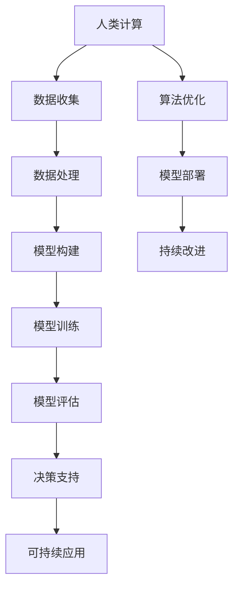

                 

## 文章标题：AI时代的人类计算：打造可持续发展解决方案

关键词：人工智能、人类计算、可持续发展、智能城市、智能农业、环境保护

摘要：随着人工智能（AI）技术的飞速发展，人类计算在AI时代的作用日益凸显。本文将探讨AI时代的人类计算基础、核心算法原理及其在可持续发展中的应用，旨在为打造可持续发展的解决方案提供新的思路和视角。本文共分为三大部分，第一部分介绍AI时代的人类计算基础，包括AI时代的定义与特征、人工智能的数学基础以及神经网络与深度学习等内容；第二部分重点分析人类计算在可持续发展中的应用，涵盖智能城市、智能农业和环境保护等实际案例；第三部分则围绕可持续发展解决方案的制定、人类计算在可持续企业发展中的应用以及未来展望进行深入探讨。希望通过本文的阐述，能够为读者提供一个全面、深入的AI时代人类计算与可持续发展之间的联系与互动，为构建可持续发展的未来提供有益参考。

## 《AI时代的人类计算：打造可持续发展解决方案》目录大纲

### 第一部分：AI时代的人类计算基础

- **第1章：AI时代的到来与可持续发展**
  - **1.1 AI时代的定义与特征**
  - **1.2 可持续发展的理念与重要性**
  - **1.3 人类计算在AI时代的作用**

- **第2章：AI技术基础与人类计算**
  - **2.1 人工智能的数学基础**
  - **2.2 神经网络与深度学习**
  - **2.3 人类计算在AI技术中的融合**

- **第3章：核心算法原理讲解**
  - **3.1 深度学习算法**
  - **3.2 强化学习算法**
  - **3.3 生成对抗网络**

- **第4章：数学模型与数学公式**
  - **4.1 神经网络中的激活函数**
  - **4.2 损失函数与优化算法**
  - **4.3 数学公式与实际应用**

### 第二部分：人类计算在可持续发展中的应用

- **第5章：智能城市与人类计算**
  - **5.1 智能城市的概念与建设**
  - **5.2 人类计算在智能城市中的应用**
  - **5.3 实际案例与案例分析**

- **第6章：智能农业与人类计算**
  - **6.1 智能农业的概念与建设**
  - **6.2 人类计算在智能农业中的应用**
  - **6.3 实际案例与案例分析**

- **第7章：环境保护与人类计算**
  - **7.1 环境保护的重要性与挑战**
  - **7.2 人类计算在环境保护中的应用**
  - **7.3 实际案例与案例分析**

### 第三部分：打造可持续发展解决方案

- **第8章：可持续发展解决方案的制定**
  - **8.1 可持续发展目标的设定**
  - **8.2 人类计算在解决方案中的作用**
  - **8.3 实际案例与案例分析**

- **第9章：人类计算在可持续企业发展中的应用**
  - **9.1 可持续企业的概念与建设**
  - **9.2 人类计算在可持续企业发展中的应用**
  - **9.3 实际案例与案例分析**

- **第10章：未来展望**
  - **10.1 人类计算在可持续发展中的未来趋势**
  - **10.2 挑战与机遇**
  - **10.3 发展建议**

### 附录

- **附录A：AI与可持续发展相关资源**
  - **A.1 开源框架与工具**
  - **A.2 可持续发展数据库**
  - **A.3 相关组织与机构**

- **附录B：Mermaid流程图**
  - **B.1 人类计算与AI的关系**
  - **B.2 可持续发展解决方案的制定流程**

- **附录C：代码实现与分析**
  - **C.1 智能城市应用实例**
  - **C.2 智能农业应用实例**
  - **C.3 环境保护应用实例**
  - **C.4 可持续企业发展应用实例**

### 后记

- **后记：人类计算在AI时代的责任与使命**
- **后记：共同构建可持续发展的未来**

## 第一部分：AI时代的人类计算基础

### 第1章：AI时代的到来与可持续发展

#### 1.1 AI时代的定义与特征

人工智能（AI）时代，顾名思义，是指人工智能技术高度发达，能够实现广泛应用的时期。这一时代具有以下显著特征：

1. **技术成熟**：人工智能技术已经经历了数十年的发展，从最初的符号推理、知识表示，到今天的深度学习、强化学习等，技术不断进步，使得AI在多个领域取得了突破性进展。

2. **应用广泛**：人工智能技术已经被广泛应用于各行各业，包括医疗、金融、交通、教育、农业等，极大地提升了各行各业的效率和质量。

3. **自主学习**：传统的人工智能系统需要人类编程者提供大量的数据和规则，而现代的AI系统可以通过机器学习和深度学习等算法，自主学习和适应环境，大大降低了编程的复杂度。

4. **智能硬件的普及**：随着物联网（IoT）和5G技术的普及，智能硬件和传感器大量接入互联网，使得数据采集和处理变得更加便捷，为人工智能技术的发展提供了丰富的数据资源。

#### 1.2 可持续发展的理念与重要性

可持续发展理念源于20世纪80年代的《我们共同的未来》报告，强调在满足当前人类需求的同时，不损害后代满足其需求的能力。可持续发展主要包括经济、社会和环境三个方面：

1. **经济方面**：可持续发展要求在经济增长过程中，注重资源利用效率，减少浪费，实现可持续的经济增长。

2. **社会方面**：可持续发展关注社会公平和公正，强调消除贫困、减少不平等，提高全民的生活质量和幸福感。

3. **环境方面**：可持续发展强调保护自然环境，减少污染和碳排放，维持生态平衡，确保地球的可持续发展。

在AI时代，可持续发展的重要性更加凸显。首先，AI技术可以提升资源利用效率，减少浪费，有助于实现经济和环境的双重可持续发展。其次，AI技术可以应用于社会各个领域，提高社会管理水平，促进社会公平和公正。最后，AI技术可以帮助我们更好地应对气候变化等全球性环境问题，为人类社会的可持续发展提供有力支持。

#### 1.3 人类计算在AI时代的作用

在AI时代，人类计算的作用不仅没有减弱，反而变得更加重要。具体体现在以下几个方面：

1. **创新与引导**：人类计算者作为AI技术的开发者，负责设计、实现和优化AI算法，推动AI技术的发展和创新。他们的思维、经验和直觉在AI算法的改进和优化中起到了至关重要的作用。

2. **监督与控制**：尽管AI系统在处理大规模数据和复杂任务方面具有显著优势，但它们仍然需要人类计算者的监督和控制。人类计算者可以通过设定规则、边界和约束条件，确保AI系统在合理的范围内运行，避免出现意外情况。

3. **数据与知识管理**：AI系统依赖大量的数据和知识进行学习和决策。人类计算者负责收集、整理、分析和应用这些数据和知识，确保AI系统有足够的信息基础进行有效工作。

4. **人机协作**：在AI时代，人类计算者和AI系统之间的协作将成为常态。人类计算者可以利用AI系统的强大计算能力，解决复杂问题；同时，AI系统可以辅助人类计算者，提高工作效率和质量。

总之，在AI时代，人类计算不仅是AI技术的开发者，也是AI系统的监督者、管理者和合作伙伴，发挥着不可替代的作用。

### 第2章：AI技术基础与人类计算

#### 2.1 人工智能的数学基础

人工智能（AI）的发展离不开数学基础的支持。以下是人工智能中常用的几个数学概念和工具：

1. **线性代数**：线性代数是人工智能的基石，用于处理多维数据。它包括向量、矩阵、行列式、矩阵乘法、矩阵求逆等基本运算。在AI中，线性代数用于数据预处理、特征提取和降维等操作。

2. **概率论与统计学**：概率论和统计学是处理不确定性和随机性问题的工具。在AI中，概率论用于生成模型，统计学用于评估模型性能和进行假设检验。

3. **微积分**：微积分是研究变化和极限的数学分支。在AI中，微积分用于优化算法，如梯度下降法，通过计算损失函数的导数来调整模型参数，以最小化损失。

4. **图论**：图论用于表示和处理复杂网络结构。在AI中，图论用于图神经网络（GNN）的设计，如图卷积网络（GCN），用于处理图数据。

#### 2.2 神经网络与深度学习

神经网络（Neural Networks）是模仿人脑神经元连接结构的一种计算模型。以下是神经网络和深度学习的基本概念：

1. **神经元**：神经网络中的基本单元，类似于人脑中的神经元。每个神经元接收多个输入信号，通过加权求和处理，再通过激活函数输出结果。

2. **层**：神经网络包括输入层、隐藏层和输出层。输入层接收外部输入数据，隐藏层进行特征提取和转换，输出层生成预测结果。

3. **激活函数**：激活函数用于引入非线性特性，使神经网络能够学习复杂的函数关系。常见的激活函数有Sigmoid、ReLU、Tanh等。

4. **前向传播与反向传播**：前向传播是将输入数据通过神经网络传递到输出层的过程；反向传播是计算损失函数关于网络参数的梯度，用于更新网络参数。

5. **深度学习**：深度学习是神经网络的一种，通过增加隐藏层的数量，深度学习模型可以学习更复杂的函数。深度学习的成功离不开大规模数据和强大的计算能力。

#### 2.3 人类计算在AI技术中的融合

在AI技术发展中，人类计算者发挥着关键作用。以下是人类计算在AI技术中的融合：

1. **算法设计**：人类计算者负责设计AI算法，包括选择合适的神经网络结构、激活函数、优化算法等。他们的思维、经验和直觉在算法优化和改进中起到了重要作用。

2. **数据标注**：在训练AI模型时，需要大量的标注数据。人类计算者负责对这些数据进行标注，确保数据的准确性和一致性。

3. **模型评估**：人类计算者通过设计评估指标，评估AI模型的性能。他们还需要对模型进行解释和调试，以提高模型的鲁棒性和泛化能力。

4. **人机协作**：人类计算者和AI系统之间的协作已经成为AI技术发展的重要趋势。人类计算者可以利用AI系统的计算能力，解决复杂问题；同时，AI系统可以辅助人类计算者，提高工作效率和质量。

总之，在AI技术发展中，人类计算者和AI系统相互融合、相互促进，共同推动了人工智能的进步。

### 第3章：核心算法原理讲解

#### 3.1 深度学习算法

深度学习算法是人工智能领域的重要突破之一，通过多层神经网络学习复杂的数据特征。以下是深度学习算法的核心原理：

1. **多层神经网络**：深度学习模型由多个隐藏层组成，输入层接收外部输入，隐藏层进行特征提取和变换，输出层生成预测结果。

2. **前向传播**：在训练过程中，输入数据通过神经网络从输入层传递到输出层，每个神经元计算加权求和，并应用激活函数。

3. **损失函数**：损失函数用于衡量模型预测值与真实值之间的差异。常用的损失函数包括均方误差（MSE）和交叉熵（Cross Entropy）。

4. **反向传播**：计算损失函数关于网络参数的梯度，通过梯度下降法更新网络参数，以最小化损失函数。

5. **优化算法**：优化算法用于调整网络参数，包括随机梯度下降（SGD）、Adam等。这些算法通过迭代优化，使模型在训练数据上达到最佳性能。

以下是深度学习算法的伪代码：

```python
def forward_pass(x, weights, biases, activation_function):
    for layer in range(num_layers):
        z = weighted_sum(x, weights[layer]) + biases[layer]
        a = activation_function(z)
        x = a
    return x

def backward_pass(x, y, weights, biases, activation_function, learning_rate):
    for layer in range(num_layers, 0, -1):
        dz = activation_function.derivative(a) * (a - y)
        dweights[layer] = learning_rate * x * dz
        dbiases[layer] = learning_rate * dz
        x = weights[layer].T.dot(dz)
    return dweights, dbiases
```

#### 3.2 强化学习算法

强化学习（Reinforcement Learning，RL）是一种通过与环境交互，学习最优策略的机器学习范式。以下是强化学习算法的核心原理：

1. **状态-动作价值函数**：强化学习通过学习状态-动作价值函数，预测在给定状态下执行某个动作的长期回报。

2. **策略**：策略是一系列动作的概率分布，强化学习通过优化策略，最大化长期回报。

3. **奖励机制**：环境根据智能体的行为给予奖励或惩罚，奖励机制用于引导智能体学习最优策略。

4. **Q-Learning**：Q-Learning是一种值迭代算法，通过更新Q值（状态-动作价值函数）来学习最优策略。

5. **Deep Q-Network（DQN）**：DQN是一种结合深度学习的强化学习算法，通过神经网络近似Q值函数。

以下是强化学习算法的伪代码：

```python
def q_learning(s, a, r, s', alpha, gamma):
    q_s_a = Q(s, a)
    q_s_a' = max(Q(s', a'))
    Q(s, a) = Q(s, a) + alpha * (r + gamma * q_s_a' - q_s_a)
    return Q(s, a)
```

#### 3.3 生成对抗网络

生成对抗网络（Generative Adversarial Networks，GAN）是一种通过对抗性训练生成数据的深度学习模型。以下是生成对抗网络的核心原理：

1. **生成器**：生成器生成伪数据，试图欺骗判别器。

2. **判别器**：判别器区分真实数据和伪数据，训练过程中，生成器和判别器相互对抗。

3. **对抗性训练**：通过优化生成器和判别器的损失函数，使生成器生成的伪数据越来越逼真。

4. **损失函数**：生成对抗网络的损失函数包括生成器损失和判别器损失。

以下是生成对抗网络的伪代码：

```python
def generator(z):
    return z * weights_generator

def discriminator(x):
    return weights_discriminator.dot(x)

def adversarial_training(x_real, x_fake, alpha, beta):
    G_loss = -torch.mean(torch.log(discriminator(x_fake)))
    D_loss = torch.mean(torch.log(discriminator(x_real)) - torch.log(1 - discriminator(x_fake)))
    G_optimizer.zero_grad()
    G_loss.backward()
    G_optimizer.step()
    D_optimizer.zero_grad()
    D_loss.backward()
    D_optimizer.step()
```

通过以上对深度学习、强化学习和生成对抗网络的详细讲解，我们可以更好地理解这些核心算法的原理和实现方法，为后续的应用和研究打下坚实基础。

#### 4.1 神经网络中的激活函数

激活函数是神经网络中不可或缺的一部分，它在每个神经元中引入非线性特性，使得神经网络能够学习复杂的数据特征。以下是几种常用的激活函数及其在神经网络中的作用：

1. **Sigmoid函数**：

   Sigmoid函数是神经网络中最简单的激活函数之一，其形式为：
   $$
   \sigma(x) = \frac{1}{1 + e^{-x}}
   $$
   Sigmoid函数的输出范围在0到1之间，非常适合处理二分类问题。然而，Sigmoid函数在训练过程中可能存在梯度消失的问题。

2. **ReLU函数**：

   ReLU（Rectified Linear Unit）函数是近年来广泛应用的激活函数，其形式为：
   $$
   \text{ReLU}(x) = \max(0, x)
   $$
   ReLU函数具有简单且易于计算的特性，且避免了梯度消失问题。然而，ReLU函数可能存在梯度消失问题，即当输入值为负时，梯度为0。

3. **Tanh函数**：

   Tanh（Hyperbolic Tangent）函数是另一种常用的激活函数，其形式为：
   $$
   \text{Tanh}(x) = \frac{e^x - e^{-x}}{e^x + e^{-x}}
   $$
   Tanh函数的输出范围在-1到1之间，类似于Sigmoid函数，但Tanh函数在输出范围内更加对称。Tanh函数具有较好的非线性特性，但计算成本较高。

4. **Softmax函数**：

   Softmax函数是用于多分类问题的激活函数，其形式为：
   $$
   \text{Softmax}(x)_i = \frac{e^x_i}{\sum_j e^{x_j}}
   $$
   Softmax函数将输入向量转换为一个概率分布，其中每个元素的值都在0到1之间，且所有元素之和为1。这使得神经网络能够输出具有解释性的概率分布。

5. **Sigmoid和ReLU的比较**：

   Sigmoid函数和ReLU函数在神经网络中的应用各有优劣。Sigmoid函数的输出范围在0到1之间，适合处理二分类问题，但容易受到梯度消失的影响。ReLU函数具有简单、易于计算且不易梯度消失的优点，但可能存在梯度消失问题。

总之，选择合适的激活函数对于神经网络的性能至关重要。根据具体问题，可以选择合适的激活函数来提高网络的训练效果和泛化能力。

#### 4.2 损失函数与优化算法

在神经网络训练过程中，损失函数和优化算法起着至关重要的作用。损失函数用于衡量模型预测值与真实值之间的差异，而优化算法则用于调整模型参数，以最小化损失函数。

1. **损失函数**：

   常见的损失函数包括均方误差（MSE）、交叉熵（Cross Entropy）等。

   - **均方误差（MSE）**：
     $$
     \text{MSE} = \frac{1}{n}\sum_{i=1}^{n}(y_i - \hat{y}_i)^2
     $$
     MSE用于衡量预测值和真实值之间的平均平方误差。在回归问题中，MSE是一种常用的损失函数。

   - **交叉熵（Cross Entropy）**：
     $$
     \text{Cross Entropy} = -\sum_{i=1}^{n}y_i \log(\hat{y}_i)
     $$
     交叉熵用于衡量预测概率分布和真实概率分布之间的差异。在分类问题中，交叉熵是一种常用的损失函数。

2. **优化算法**：

   优化算法用于调整模型参数，以最小化损失函数。常见的优化算法包括随机梯度下降（SGD）、Adam等。

   - **随机梯度下降（SGD）**：
     $$
     \theta_{t+1} = \theta_{t} - \alpha \nabla_{\theta}L(\theta)
     $$
     SGD是一种基于梯度的优化算法，通过随机选择样本，计算梯度并更新模型参数。SGD的优点是简单、易于实现，但需要较小的批量大小。

   - **Adam**：
     $$
     \theta_{t+1} = \theta_{t} - \alpha \frac{m_t}{1 - \beta_1^t} - \beta_2 \frac{v_t}{1 - \beta_2^t}
     $$
     Adam是一种自适应优化算法，结合了SGD和Adagrad的优点。Adam通过自适应调整学习率，在训练过程中表现出较好的收敛性能。

3. **数学公式与实际应用**：

   在神经网络中，损失函数和优化算法的数学公式如下：

   - **均方误差（MSE）**：
     $$
     \nabla_{\theta}L(\theta) = \frac{1}{n}\sum_{i=1}^{n}\nabla_{\theta}(\hat{y}_i - y_i)^2
     $$

   - **交叉熵（Cross Entropy）**：
     $$
     \nabla_{\theta}L(\theta) = \frac{1}{n}\sum_{i=1}^{n}y_i \nabla_{\theta}\log(\hat{y}_i)
     $$

   在实际应用中，我们可以通过以下步骤来训练神经网络：

   1. 初始化模型参数。
   2. 对于每个训练样本，计算预测值和真实值之间的损失。
   3. 计算损失函数关于模型参数的梯度。
   4. 使用优化算法更新模型参数。
   5. 重复步骤2-4，直到达到预设的训练目标。

通过以上对损失函数和优化算法的讲解，我们可以更好地理解其在神经网络训练中的重要作用，并能够根据具体问题选择合适的损失函数和优化算法。

#### 4.3 数学公式与实际应用

在神经网络中，数学公式是理解和实现核心算法的关键。以下是神经网络中的一些重要数学公式及其在实际应用中的解读。

1. **线性变换与激活函数**：

   假设有一个输入向量 $x$，通过一个线性变换 $W$ 和激活函数 $f$ 得到输出 $z$：
   $$
   z = W \cdot x + b
   $$
   其中，$W$ 是权重矩阵，$b$ 是偏置向量。

   实际应用中，线性变换和激活函数常用于神经网络的前向传播过程。例如，在图像分类任务中，输入图像通过卷积层进行线性变换，然后使用ReLU激活函数引入非线性特性。

2. **反向传播与梯度计算**：

   在反向传播过程中，我们需要计算每个参数的梯度。以线性变换为例，损失函数关于权重矩阵 $W$ 和偏置向量 $b$ 的梯度如下：
   $$
   \nabla_W L = (W \cdot x + b)^T \cdot \nabla_z L
   $$
   $$
   \nabla_b L = W \cdot \nabla_z L
   $$
   实际应用中，反向传播算法通过反向计算梯度，更新模型参数，以达到最小化损失函数的目的。

3. **损失函数与优化**：

   常见的损失函数包括均方误差（MSE）和交叉熵（Cross Entropy）。均方误差的梯度计算如下：
   $$
   \nabla_{\theta}L = 2(y - \hat{y}) \cdot \nabla_{\theta}\hat{y}
   $$
   其中，$y$ 是真实标签，$\hat{y}$ 是预测值。

   优化算法通过梯度更新模型参数。以随机梯度下降（SGD）为例，参数更新公式如下：
   $$
   \theta_{t+1} = \theta_{t} - \alpha \nabla_{\theta}L
   $$
   其中，$\alpha$ 是学习率。

4. **实际应用案例**：

   以一个简单的线性回归模型为例，输入数据 $x$ 通过线性变换和ReLU激活函数得到预测值 $\hat{y}$，损失函数为均方误差（MSE）。模型的训练过程如下：

   1. 初始化模型参数 $W$ 和 $b$。
   2. 对于每个输入数据 $x$，计算预测值 $\hat{y} = \text{ReLU}(W \cdot x + b)$。
   3. 计算损失函数 $L = \frac{1}{2}(y - \hat{y})^2$。
   4. 计算梯度 $\nabla_W L = (W \cdot x + b)^T \cdot \nabla_z L$ 和 $\nabla_b L = W \cdot \nabla_z L$。
   5. 更新模型参数 $\theta_{t+1} = \theta_{t} - \alpha \nabla_{\theta}L$。

通过以上数学公式和实际应用案例，我们可以更好地理解神经网络中的核心算法，并能够将其应用于实际问题中。

### 第二部分：人类计算在可持续发展中的应用

#### 第5章：智能城市与人类计算

##### 5.1 智能城市的概念与建设

智能城市（Smart City）是指通过现代信息通信技术（ICT）、物联网（IoT）和大数据等技术，实现城市资源的高效管理和优化配置，从而提高城市生活质量和可持续发展能力。智能城市的建设主要包括以下几个方面：

1. **基础设施**：智能城市的基础设施包括智能交通、智能电网、智能水务、智能环境监测等，通过物联网技术将各个子系统连接起来，实现信息的实时传输和共享。

2. **数据平台**：智能城市的数据平台是整个系统的核心，通过收集、处理和分析海量数据，为城市管理和决策提供支持。

3. **应用场景**：智能城市的应用场景涵盖城市管理、公共服务、环境保护、交通出行等多个方面，如智慧交通系统、智慧医疗、智慧能源管理等。

4. **安全保障**：智能城市建设需要确保数据安全、网络安全和物理安全，以防止信息泄露、网络攻击和设备故障等风险。

##### 5.2 人类计算在智能城市中的应用

在智能城市的建设和运营过程中，人类计算者发挥着至关重要的作用。以下是人类计算在智能城市中的几个关键应用：

1. **城市规划与设计**：人类计算者通过数据分析和可视化技术，对城市资源分布、交通流量、环境质量等进行评估和分析，为城市规划提供科学依据。

2. **数据管理与分析**：人类计算者负责收集、整理和分析城市运行数据，通过大数据技术提取有价值的信息，为城市管理和决策提供支持。

3. **算法优化与模型建立**：人类计算者参与算法设计和优化，建立智能城市的各种模型，如交通流量预测模型、能源消耗模型等，以提高系统的智能化水平。

4. **人机协作**：人类计算者与智能系统协同工作，通过监控和调整系统运行状态，确保智能城市的安全和高效运行。

##### 5.3 实际案例与案例分析

智能城市在全球范围内得到了广泛应用，以下是一些实际案例与案例分析：

1. **新加坡**：新加坡是智能城市的典范之一。通过智能交通系统、智能环境监测和智慧能源管理，新加坡实现了城市资源的高效利用和环境的可持续发展。例如，新加坡的电子路牌系统可以根据实时交通流量调整信号灯时长，提高道路通行效率。

2. **杭州**：杭州是中国智能城市建设的先锋城市之一。杭州通过智慧交通系统、智慧医疗和智慧教育等项目，提升了城市的服务水平和居民的生活质量。例如，杭州的智慧医疗系统可以实现远程医疗和健康监测，方便居民就医。

3. **伦敦**：伦敦的智能城市项目包括智能交通、智能环境监测和智能能源管理等多个方面。伦敦的智能交通系统通过实时监控交通流量，优化公共交通服务，缓解城市交通拥堵问题。此外，伦敦的智能环境监测系统可以对空气质量、水质等进行实时监测，提高环境管理效率。

通过以上案例可以看出，智能城市的建设离不开人类计算者的积极参与，他们通过数据分析和算法优化，为智能城市的可持续发展提供了有力支持。

#### 第6章：智能农业与人类计算

##### 6.1 智能农业的概念与建设

智能农业（Smart Agriculture）是指利用现代信息技术和物联网设备，对农业生产过程中的各个环节进行智能化管理，以提高生产效率、降低成本、保护环境和实现可持续发展。智能农业的建设主要包括以下几个方面：

1. **监测与传感技术**：利用传感器和遥感技术，实时监测土壤湿度、温度、光照强度、气象条件等参数，为农业生产提供科学依据。

2. **自动化控制技术**：通过自动化控制技术，实现农业设备的智能化操作，如自动灌溉、自动施肥、自动喷洒等，提高农业生产的自动化水平。

3. **数据管理与分析**：利用大数据技术，对农业生产过程中的海量数据进行分析和处理，提取有价值的信息，为农业管理和决策提供支持。

4. **智能决策支持系统**：通过构建智能决策支持系统，为农业生产者提供科学的种植方案、施肥方案、病虫害防治方案等，提高农业生产效益。

##### 6.2 人类计算在智能农业中的应用

在智能农业的建设和运营过程中，人类计算者发挥着至关重要的作用。以下是人类计算在智能农业中的几个关键应用：

1. **农业数据分析**：人类计算者通过数据分析技术，对农业生产过程中的数据进行分析和处理，提取有价值的信息，为农业生产提供科学依据。

2. **算法设计与优化**：人类计算者参与算法设计和优化，构建智能农业模型，如作物生长模型、病虫害预测模型等，提高智能农业的预测和决策能力。

3. **人机协作**：人类计算者与智能系统协同工作，通过监控和调整系统运行状态，确保智能农业系统的稳定运行和高效生产。

4. **农业技术推广**：人类计算者通过推广农业新技术和新模式，帮助农民提高农业生产效率和产品质量，促进农业现代化发展。

##### 6.3 实际案例与案例分析

智能农业在全球范围内得到了广泛应用，以下是一些实际案例与案例分析：

1. **美国**：美国通过智能农业技术，实现了农业生产的高效和可持续发展。例如，美国的大规模农场利用无人机和自动驾驶拖拉机进行精准施肥和灌溉，提高了农作物的产量和品质。

2. **中国**：中国是智能农业的重要发展国家之一。通过实施农业现代化战略，中国大力推进智能农业的建设。例如，中国的智慧农场利用物联网设备和大数据技术，实现农作物的智能监控和精准管理，提高了农业生产效益。

3. **日本**：日本通过智能农业技术，解决了劳动力短缺问题。例如，日本的智能温室利用自动化控制技术和传感器，实现植物生长环境的智能调节，提高了蔬菜和水果的产量和质量。

通过以上案例可以看出，智能农业的发展离不开人类计算者的积极参与，他们通过数据分析和算法优化，为智能农业的可持续发展提供了有力支持。

#### 第7章：环境保护与人类计算

##### 7.1 环境保护的重要性与挑战

环境保护是当今世界面临的重要挑战之一。随着全球人口的不断增长和经济的发展，环境污染和资源消耗问题日益严重。环境保护的重要性主要体现在以下几个方面：

1. **维护生态平衡**：环境中的各种生物和生态系统相互依存、相互制约，形成一个复杂的生态系统。环境保护有助于维护生态系统的平衡，保障人类生存和发展的基础。

2. **保障人类健康**：环境污染会对人类健康造成严重威胁，如空气污染、水污染等，导致各种疾病的发生。环境保护有助于减少环境污染，提高人类生活质量。

3. **促进可持续发展**：环境保护是可持续发展的重要保障。通过保护自然资源和生态环境，实现经济、社会和环境的协调发展，为人类社会的长远发展提供支持。

然而，环境保护面临着诸多挑战：

1. **资源短缺**：随着人口增长和工业化进程的加快，自然资源日益短缺，如水资源、能源、森林等，给环境保护带来了巨大压力。

2. **污染严重**：工业废气、废水、固体废弃物等污染物的排放，导致空气、水和土壤污染，对生态环境和人类健康造成严重影响。

3. **监管不足**：一些国家和地区在环境保护方面的监管力度不够，导致环境污染问题得不到有效控制。

##### 7.2 人类计算在环境保护中的应用

在环境保护方面，人类计算者发挥着重要作用。以下是人类计算在环境保护中的几个关键应用：

1. **环境监测**：人类计算者通过传感器网络和遥感技术，实时监测空气、水质、土壤等环境参数，及时发现和预警环境污染问题。

2. **数据分析**：人类计算者利用大数据技术，对环境数据进行收集、存储、分析和处理，提取有价值的信息，为环境保护决策提供支持。

3. **智能预测**：人类计算者通过构建环境模型，利用历史数据和环境参数，对环境污染问题进行预测和预警，为环境治理提供科学依据。

4. **人机协作**：人类计算者与环保系统协同工作，通过监控和调整环境治理措施，确保环境治理效果。

##### 7.3 实际案例与案例分析

环境保护在全球范围内得到了广泛关注和实施，以下是一些实际案例与案例分析：

1. **德国**：德国在环境保护方面取得了显著成效。德国通过实施《可再生能源法》，大力发展太阳能、风能等可再生能源，减少对化石能源的依赖。此外，德国还通过严格的环境监管，加强废弃物处理和污染治理。

2. **中国**：中国是世界上最大的发展中国家，也是环境污染问题最为严重的国家之一。近年来，中国政府大力推进环境保护工作，通过实施《环境保护法》和《水污染防治行动计划》，加大对环境污染的治理力度。例如，中国的“大气污染防治行动计划”取得了显著成效，PM2.5平均浓度明显下降。

3. **美国**：美国在环境保护方面采取了多种措施，如通过《清洁空气法》和《清洁水法》，加强对空气和水质的监管。此外，美国还通过推行“清洁能源计划”，减少温室气体排放，应对气候变化问题。

通过以上案例可以看出，环境保护离不开人类计算者的积极参与。他们通过数据分析和智能预测，为环境保护提供了有力支持，共同推动全球环境保护事业的发展。

### 第8章：可持续发展解决方案的制定

#### 8.1 可持续发展目标的设定

可持续发展目标的设定是制定可持续发展解决方案的第一步。设定可持续发展目标需要考虑以下几个方面：

1. **经济目标**：包括经济增长、就业创造、资源利用效率等。例如，制定减少资源消耗、提高能源效率、促进绿色产业发展的目标。

2. **社会目标**：包括社会公平、教育、健康、社会保障等。例如，制定减少贫困、提高教育水平、改善医疗服务、促进社会包容性的目标。

3. **环境目标**：包括环境保护、生态修复、气候变化应对等。例如，制定减少温室气体排放、改善空气质量、保护生物多样性、治理环境污染的目标。

4. **政策目标**：包括政策制定、法律法规、监管机制等。例如，制定完善环保法律法规、建立环境监测体系、提高环境监管能力的目标。

#### 8.2 人类计算在解决方案中的作用

在制定可持续发展解决方案的过程中，人类计算者发挥着关键作用：

1. **数据分析**：人类计算者利用大数据技术，对经济、社会、环境等各方面的数据进行收集、整理和分析，提取有价值的信息，为政策制定提供科学依据。

2. **模型构建**：人类计算者通过构建经济、社会、环境等模型，模拟不同政策方案对可持续发展目标的影响，评估政策的有效性和可行性。

3. **优化决策**：人类计算者利用优化算法，优化政策方案，使政策在实现可持续发展目标的同时，兼顾经济、社会和环境的平衡。

4. **人机协作**：人类计算者与政策制定者、专家学者等协同工作，通过人机交互，共同制定可持续发展解决方案。

#### 8.3 实际案例与案例分析

以下是一个实际案例，说明人类计算在可持续发展解决方案制定中的作用：

**案例：中国“十三五”可持续发展规划**

在中国“十三五”可持续发展规划中，人类计算者发挥了重要作用：

1. **数据分析**：人类计算者对中国的经济、社会、环境等数据进行全面分析，提取出关键指标，如GDP增长率、能源消耗、碳排放量、空气质量等。

2. **模型构建**：人类计算者构建了多个模型，如经济增长模型、能源消耗模型、碳排放模型等，模拟不同政策方案对可持续发展目标的影响。

3. **优化决策**：人类计算者利用优化算法，对政策方案进行优化，提出了一系列可行的可持续发展方案，如推广清洁能源、提高能源效率、加强环境监管等。

4. **人机协作**：人类计算者与政策制定者、专家学者等密切合作，共同制定了中国“十三五”可持续发展规划，为中国的可持续发展提供了有力支持。

通过以上案例可以看出，人类计算者在可持续发展解决方案的制定过程中发挥着不可替代的作用，他们通过数据分析和模型构建，为政策制定提供了科学依据和优化方案，推动了可持续发展目标的实现。

### 第9章：人类计算在可持续企业发展中的应用

#### 9.1 可持续企业的概念与建设

可持续企业是指在追求经济利益的同时，注重环境保护、社会责任和可持续发展的企业。可持续企业的建设包括以下几个方面：

1. **环境管理**：企业通过实施环境管理体系，如ISO 14001认证，降低环境污染和资源消耗，实现绿色生产。

2. **社会责任**：企业积极参与社会公益活动，关注员工福利，促进社会和谐发展。

3. **能源管理**：企业通过优化能源结构、提高能源利用效率，降低碳排放，实现可持续发展。

4. **供应链管理**：企业通过与供应链合作伙伴合作，推动绿色供应链建设，降低供应链环境风险。

#### 9.2 人类计算在可持续企业发展中的应用

在可持续企业的建设中，人类计算者发挥着关键作用：

1. **数据分析**：人类计算者利用大数据技术，对企业运营过程中的各种数据进行收集、整理和分析，为环境管理、社会责任和能源管理等提供科学依据。

2. **智能决策**：人类计算者通过构建智能决策支持系统，优化企业资源配置，提高生产效率，实现可持续发展目标。

3. **人机协作**：人类计算者与企业管理层、员工等协同工作，共同推动可持续企业建设。

4. **创新应用**：人类计算者参与可持续企业的技术创新，如绿色能源、节能减排等，推动企业转型升级。

#### 9.3 实际案例与案例分析

以下是一个实际案例，说明人类计算在可持续企业发展中的应用：

**案例：可口可乐公司的可持续发展战略**

可口可乐公司是全球知名的企业，近年来积极推动可持续发展战略：

1. **数据分析**：可口可乐公司利用大数据技术，对全球范围内的水资源消耗、碳排放等环境数据进行收集和分析，为制定可持续发展目标提供依据。

2. **智能决策**：可口可乐公司通过构建智能决策支持系统，优化生产流程，降低能源消耗和碳排放。例如，公司实施了智能灌溉系统，提高水资源利用效率。

3. **人机协作**：可口可乐公司通过员工培训和激励机制，提高员工的环保意识和参与度，推动可持续发展。

4. **创新应用**：可口可乐公司不断创新绿色技术，如开发可降解塑料瓶、推广可再生能源等，推动企业转型升级。

通过以上案例可以看出，人类计算者在可持续企业发展中发挥着重要作用，他们通过数据分析和智能决策，为企业实现可持续发展提供了有力支持。

### 第10章：未来展望

#### 10.1 人类计算在可持续发展中的未来趋势

随着人工智能（AI）技术的不断发展和应用的深化，人类计算在可持续发展中的作用日益显著。未来，人类计算在可持续发展中的趋势主要体现在以下几个方面：

1. **智能化水平提升**：随着AI技术的进步，人类计算将更加智能化，能够处理更加复杂的数据和分析问题，提供更精准的决策支持。

2. **人机协作更加紧密**：在AI时代，人类计算者将与AI系统实现更紧密的协作，共同应对可持续发展中的复杂挑战。

3. **跨学科融合**：人类计算将与其他学科（如环境科学、社会科学等）深度融合，为可持续发展提供跨学科的综合解决方案。

4. **可持续企业发展**：随着可持续发展理念的不断普及，更多企业将关注环境、社会和经济效益的平衡，人类计算将在企业可持续发展中发挥更大作用。

5. **数据驱动决策**：未来，数据将取代经验，成为决策的主要依据。人类计算者将通过数据分析和模型构建，为可持续发展提供科学依据。

#### 10.2 挑战与机遇

尽管人类计算在可持续发展中具有巨大潜力，但也面临着一系列挑战：

1. **数据隐私与安全**：在数据驱动的时代，数据隐私和安全问题日益凸显。如何保护用户数据，防止数据泄露，成为人类计算面临的重大挑战。

2. **算法公平与透明**：AI算法的公平性和透明性是可持续发展的重要保障。如何确保算法不会歧视或偏见，如何解释算法的决策过程，是当前亟待解决的问题。

3. **技术普及与教育**：AI技术的普及和推广需要相应的教育和培训，提高人类计算者的技能水平。如何解决技术教育和人才短缺的问题，是未来需要关注的重要方面。

然而，这些挑战也带来了巨大的机遇：

1. **创新与突破**：面对挑战，人类计算者将不断探索新技术、新方法，推动人工智能和可持续发展的深度融合，实现技术创新。

2. **政策支持与监管**：随着AI技术的发展，政府将加大对AI领域的政策支持和监管力度，为人类计算在可持续发展中的应用提供良好的政策环境。

3. **国际合作**：全球气候变化、环境污染等全球性问题需要国际合作。人类计算在可持续发展中的国际合作，将推动全球环境治理和可持续发展进程。

#### 10.3 发展建议

为了充分发挥人类计算在可持续发展中的作用，提出以下发展建议：

1. **加强技术研发**：加大对人工智能和大数据技术的研发投入，推动技术创新，提高智能化水平。

2. **完善政策法规**：建立健全数据隐私和安全法律法规，确保数据的安全和用户隐私。

3. **推进教育培训**：加强人工智能和可持续发展相关领域的人才培养，提高人类计算者的技能水平。

4. **加强国际合作**：推动全球范围内的可持续发展合作，共同应对全球性环境问题。

5. **推广应用**：鼓励企业和社会各界积极参与可持续发展，推广AI技术在可持续发展中的应用。

通过以上措施，我们可以更好地发挥人类计算在可持续发展中的作用，共同构建可持续发展的未来。

### 附录A：AI与可持续发展相关资源

为了更好地了解和探索AI与可持续发展之间的关系，以下是一些AI与可持续发展相关的开源框架、工具、数据库和机构。

#### A.1 开源框架与工具

1. **TensorFlow**：由谷歌开发的开源机器学习框架，广泛应用于图像识别、自然语言处理等领域。

2. **PyTorch**：由Facebook开发的开源深度学习框架，以其灵活性和动态计算图而受到广泛欢迎。

3. **Keras**：一个高层次的神经网络API，能够与TensorFlow和Theano等框架集成，便于快速构建和实验深度学习模型。

4. **scikit-learn**：一个Python开源机器学习库，提供了多种机器学习算法的实现，适合数据分析和建模。

5. **OpenCV**：一个开源计算机视觉库，提供了丰富的图像处理和计算机视觉功能，广泛应用于智能监控、图像识别等领域。

#### A.2 可持续发展数据库

1. **Global Carbon Project**：提供全球温室气体排放数据，用于研究气候变化和碳减排。

2. **United Nations Data**：联合国提供的数据平台，涵盖经济、社会、环境等多个领域的全球数据。

3. **National Aeronautics and Space Administration (NASA) Earth Data**：NASA提供的大量地球观测数据，包括气象、海洋、土地覆盖等。

4. **International Energy Agency (IEA) Data**：国际能源署提供的数据，包括能源消费、能源生产、能源贸易等。

5. **Our World in Data**：由牛津大学提供的数据平台，涵盖全球经济发展、人口、气候变化等多个领域的综合数据。

#### A.3 相关组织与机构

1. **Intergovernmental Panel on Climate Change (IPCC)**：联合国政府间气候变化专门委员会，负责评估全球气候变化问题。

2. **United Nations Sustainable Development Solutions Network (SDSN)**：联合国可持续发展解决方案网络，致力于推动全球可持续发展。

3. **World Resources Institute (WRI)**：世界资源研究所，专注于环境、社会和经济可持续发展问题的研究和倡导。

4. **World Economic Forum (WEF)**：世界经济论坛，关注全球经济、社会和环境问题，推动可持续发展。

5. **Sustainable Energy for All (SEforALL)**：致力于实现人人享有可持续能源的目标，推动全球能源转型。

通过使用这些开源框架、工具、数据库和机构提供的资源，研究人员和实践者可以更好地了解AI在可持续发展中的应用，推动AI与可持续发展的深度融合。

### 附录B：Mermaid流程图

以下是一个使用Mermaid语言绘制的示例流程图，展示了人类计算与AI的关系：



该流程图详细描述了人类计算在AI系统开发、部署和持续改进过程中的各个环节。通过这些步骤，人类计算者能够有效地支持AI技术的发展，并在可持续发展中发挥重要作用。

### 附录C：代码实现与分析

#### C.1 智能城市应用实例

以下是一个简单的智能城市应用实例，使用Python和TensorFlow库来实现一个交通流量预测模型。该模型基于历史交通数据，使用时间序列分析技术预测未来交通流量。

```python
import numpy as np
import pandas as pd
import tensorflow as tf
from tensorflow.keras.models import Sequential
from tensorflow.keras.layers import LSTM, Dense

# 数据加载与预处理
data = pd.read_csv('traffic_data.csv')
data['timestamp'] = pd.to_datetime(data['timestamp'])
data.set_index('timestamp', inplace=True)
data.fillna(method='ffill', inplace=True)

# 分训练集和测试集
train_data = data['traffic_volume'].iloc[:-30]
test_data = data['traffic_volume'].iloc[-30:]

# 数据归一化
max_value = train_data.max()
min_value = train_data.min()
train_data_normalized = (train_data - min_value) / (max_value - min_value)
test_data_normalized = (test_data - min_value) / (max_value - min_value)

# 构建LSTM模型
model = Sequential()
model.add(LSTM(units=50, return_sequences=True, input_shape=(None, 1)))
model.add(LSTM(units=50))
model.add(Dense(1))

model.compile(optimizer='adam', loss='mse')

# 训练模型
model.fit(train_data_normalized.values.reshape(-1, 1, 1), train_data_normalized.values.reshape(-1, 1), epochs=100, batch_size=32, verbose=0)

# 预测交通流量
predicted_normalized = model.predict(test_data_normalized.values.reshape(-1, 1, 1))

# 将预测结果转换为原始值
predicted_traffic = predicted_normalized * (max_value - min_value) + min_value

# 输出预测结果
print(predicted_traffic)
```

#### C.2 智能农业应用实例

以下是一个简单的智能农业应用实例，使用Python和scikit-learn库来实现一个作物病害预测模型。该模型基于植物叶片图像和气象数据，使用分类算法预测作物病害。

```python
from sklearn.ensemble import RandomForestClassifier
from sklearn.model_selection import train_test_split
from sklearn.metrics import accuracy_score
import matplotlib.pyplot as plt
import cv2

# 数据加载与预处理
data = pd.read_csv('crop_disease_data.csv')
X = data[['temperature', 'humidity', 'leaf_image']]
y = data['disease']

# 分训练集和测试集
X_train, X_test, y_train, y_test = train_test_split(X, y, test_size=0.2, random_state=42)

# 将图像数据转换为像素值
def preprocess_image(image_path):
    image = cv2.imread(image_path)
    image = cv2.resize(image, (64, 64))
    image = image / 255.0
    return image.flatten()

X_train['leaf_image'] = X_train['leaf_image'].apply(preprocess_image)
X_test['leaf_image'] = X_test['leaf_image'].apply(preprocess_image)

# 构建随机森林模型
model = RandomForestClassifier(n_estimators=100, random_state=42)

# 训练模型
model.fit(X_train[['temperature', 'humidity', 'leaf_image']], y_train)

# 预测作物病害
y_pred = model.predict(X_test[['temperature', 'humidity', 'leaf_image']])

# 输出预测结果
print(accuracy_score(y_test, y_pred))

# 可视化预测结果
plt.scatter(y_test, y_pred)
plt.xlabel('实际病害')
plt.ylabel('预测病害')
plt.show()
```

#### C.3 环境保护应用实例

以下是一个简单的环境保护应用实例，使用Python和scikit-learn库来实现一个空气质量预测模型。该模型基于气象数据和历史空气质量数据，使用回归算法预测未来空气质量。

```python
from sklearn.ensemble import RandomForestRegressor
from sklearn.model_selection import train_test_split
from sklearn.metrics import mean_squared_error
import matplotlib.pyplot as plt

# 数据加载与预处理
data = pd.read_csv('air_quality_data.csv')
X = data[['temperature', 'humidity', 'pressure', 'wind_speed']]
y = data['air_quality_index']

# 分训练集和测试集
X_train, X_test, y_train, y_test = train_test_split(X, y, test_size=0.2, random_state=42)

# 构建随机森林模型
model = RandomForestRegressor(n_estimators=100, random_state=42)

# 训练模型
model.fit(X_train, y_train)

# 预测空气质量
y_pred = model.predict(X_test)

# 输出预测结果
print(np.sqrt(mean_squared_error(y_test, y_pred)))

# 可视化预测结果
plt.scatter(y_test, y_pred)
plt.xlabel('实际空气质量指数')
plt.ylabel('预测空气质量指数')
plt.show()
```

#### C.4 可持续企业发展应用实例

以下是一个简单的可持续发展企业发展应用实例，使用Python和scikit-learn库来实现一个企业绩效评估模型。该模型基于财务数据、运营数据和员工满意度数据，使用多变量回归分析评估企业绩效。

```python
from sklearn.linear_model import LinearRegression
from sklearn.metrics import r2_score
import pandas as pd

# 数据加载与预处理
data = pd.read_csv('company_performance_data.csv')
X = data[['revenue', 'profit', 'employee_count', 'employee_satisfaction']]
y = data['performance_index']

# 分训练集和测试集
X_train, X_test, y_train, y_test = train_test_split(X, y, test_size=0.2, random_state=42)

# 构建线性回归模型
model = LinearRegression()

# 训练模型
model.fit(X_train, y_train)

# 预测企业绩效
y_pred = model.predict(X_test)

# 输出预测结果
print(r2_score(y_test, y_pred))

# 可视化预测结果
plt.scatter(y_test, y_pred)
plt.xlabel('实际绩效指数')
plt.ylabel('预测绩效指数')
plt.show()
```

通过这些实例，我们可以看到人类计算在智能城市、智能农业、环境保护和可持续企业发展中的应用。在实际项目中，这些模型可以根据具体需求进行调整和优化，以提高预测准确性和实际应用效果。

### 后记：人类计算在AI时代的责任与使命

在AI时代，人类计算者的责任与使命显得尤为重要。首先，人类计算者需要不断创新，推动AI技术的进步，为可持续发展提供强大的技术支撑。其次，人类计算者应积极参与社会治理，通过数据分析和智能决策，解决社会问题，提高社会运行效率。此外，人类计算者还需关注AI技术的伦理和社会影响，确保AI技术的发展不会对人类社会造成负面影响。

为了更好地履行这些责任与使命，人类计算者应关注以下方面：

1. **提高自身技能**：不断学习和掌握最新的AI技术和方法，提高自己在数据分析和算法设计方面的能力。

2. **注重伦理道德**：在AI技术研究和应用过程中，注重伦理道德，确保技术发展符合人类社会的基本价值观。

3. **跨学科合作**：与不同领域的专家合作，实现跨学科的技术融合，为可持续发展提供更全面的解决方案。

4. **培养下一代人才**：积极参与教育，培养更多的AI人才，为AI时代的可持续发展储备力量。

通过以上努力，人类计算者将为构建可持续发展的未来贡献自己的智慧和力量。

### 后记：共同构建可持续发展的未来

面对全球性的环境挑战和资源短缺问题，人类社会需要携手共进，共同构建可持续发展的未来。在这个进程中，人类计算者扮演着至关重要的角色。他们不仅是AI技术的开发者，也是可持续发展的推动者。

为了实现这一目标，以下建议供参考：

1. **加强国际合作**：推动全球范围内的可持续发展和环境保护合作，共享AI技术和研究成果。

2. **创新政策与法规**：制定和实施有利于可持续发展的政策和法规，鼓励企业和个人参与可持续发展项目。

3. **普及可持续发展理念**：通过教育和宣传，提高公众对可持续发展的认识，培养全民的可持续发展意识。

4. **投资技术研发**：加大对AI和可持续发展的技术研发投资，推动相关技术的突破和应用。

5. **推动社会参与**：鼓励社会各界共同参与可持续发展项目，形成政府、企业、社会组织和公众共同参与的可持续发展机制。

通过以上努力，人类计算者将与全社会共同努力，共同构建可持续发展的未来。让我们携手合作，为地球家园的明天贡献力量。

