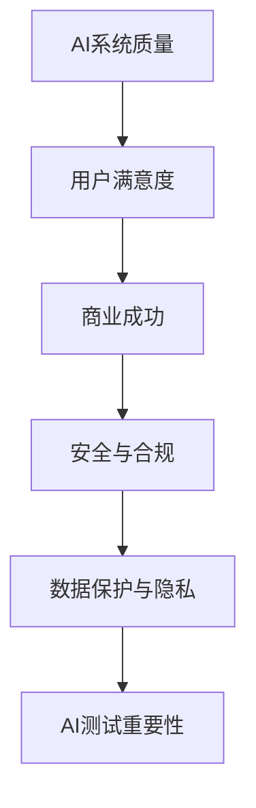
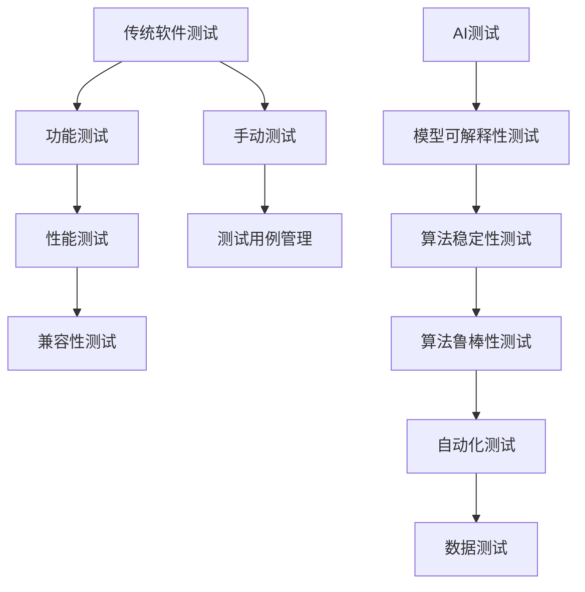
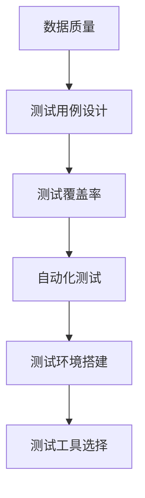
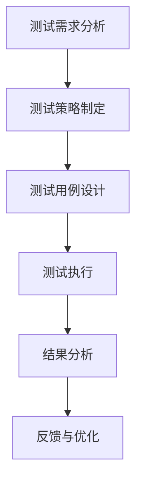
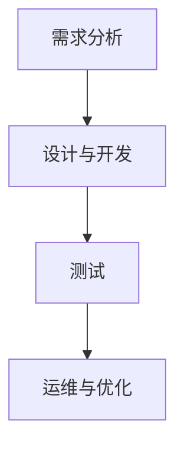
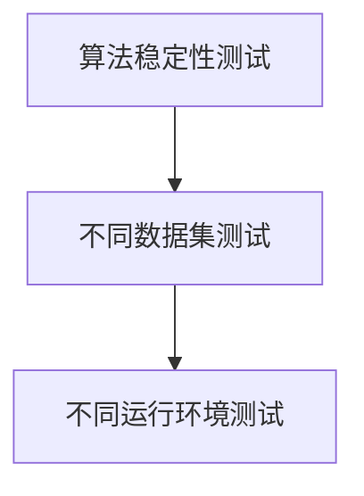
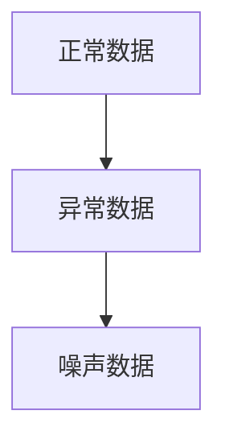
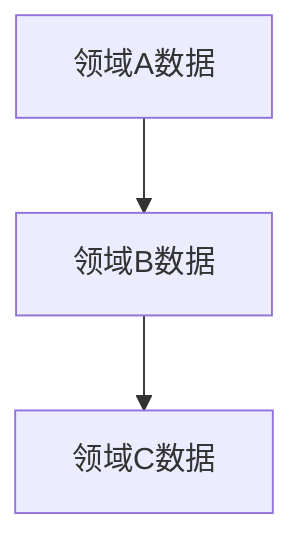
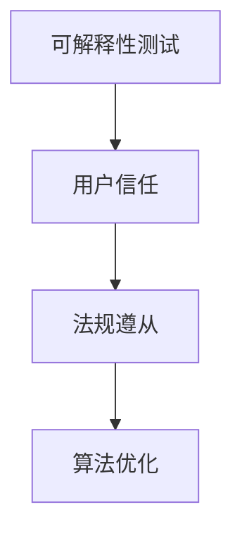
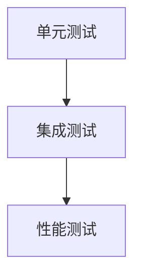

                 

### 文章标题

《AI测试与质量保证原理与代码实战案例讲解》

关键词：AI测试、质量保证、代码实战、深度学习、测试框架、测试工具

摘要：本文全面解析了AI测试与质量保证的原理和实践，包括基础概念、测试方法、实战案例以及未来发展趋势。通过具体的代码实战和算法讲解，帮助读者深入理解AI测试的各个方面，掌握质量保证的最佳实践。

---

### 目录

## 第一部分：AI测试与质量保证基础

### 第1章：AI测试与质量保证概述

#### 1.1 AI测试的重要性

#### 1.2 AI质量保证的概念

#### 1.3 AI测试与传统的软件测试区别

#### 1.4 AI测试面临的挑战

### 第2章：AI测试框架与方法

#### 2.1 AI测试的基本框架

#### 2.2 功能测试与性能测试

#### 2.3 具体测试方法

##### 2.3.1 单元测试

##### 2.3.2 集成测试

##### 2.3.3 回归测试

##### 2.3.4 性能测试

#### 2.4 测试策略与测试用例设计

### 第3章：AI质量保证流程

#### 3.1 质量保证流程概述

#### 3.2 需求分析

#### 3.3 设计与开发

#### 3.4 测试

#### 3.5 运维与优化

### 第4章：AI算法的稳定性与鲁棒性测试

#### 4.1 算法稳定性测试

#### 4.2 算法鲁棒性测试

##### 4.2.1 输入数据的多样性

##### 4.2.2 噪声与异常值处理

##### 4.2.3 算法的泛化能力

### 第5章：AI算法的可解释性测试

#### 5.1 可解释性测试的重要性

#### 5.2 可解释性测试方法

##### 5.2.1 对比测试

##### 5.2.2 透明性测试

##### 5.2.3 模型可视化

## 第二部分：AI测试实战案例

### 第6章：深度学习模型的测试

#### 6.1 深度学习模型测试概述

#### 6.2 卷积神经网络测试案例

##### 6.2.1 卷积神经网络的测试方法

##### 6.2.2 卷积神经网络的测试案例

#### 6.3 循环神经网络测试案例

##### 6.3.1 循环神经网络的测试方法

##### 6.3.2 循环神经网络的测试案例

### 第7章：强化学习模型的测试

#### 7.1 强化学习模型测试概述

#### 7.2 强化学习模型测试案例

##### 7.2.1 强化学习模型的测试方法

##### 7.2.2 强化学习模型的测试案例

### 第8章：自然语言处理模型的测试

#### 8.1 自然语言处理模型测试概述

#### 8.2 词向量模型测试案例

##### 8.2.1 词向量模型的测试方法

##### 8.2.2 词向量模型的测试案例

#### 8.3 序列模型测试案例

##### 8.3.1 序列模型的测试方法

##### 8.3.2 序列模型的测试案例

### 第9章：AI测试工具与应用

#### 9.1 AI测试工具概述

#### 9.2 自动化测试工具

##### 9.2.1 测试工具的选择

##### 9.2.2 自动化测试流程

#### 9.3 云测试与持续集成

## 第三部分：AI质量保证实战

### 第10章：AI质量保证案例分析

#### 10.1 案例背景

#### 10.2 质量保证策略

#### 10.3 测试与优化实践

##### 10.3.1 测试用例设计

##### 10.3.2 测试环境搭建

##### 10.3.3 代码优化

##### 10.3.4 模型调参

##### 10.3.5 部署与监控

### 第11章：AI质量保证的未来趋势

#### 11.1 AI质量保证的发展趋势

#### 11.2 挑战与机遇

##### 11.2.1 自动化测试技术的发展

##### 11.2.2 持续集成与持续部署

##### 11.2.3 数据安全与隐私保护

##### 11.2.4 质量标准的制定与执行

### 附录

#### 附录A：常用AI测试工具与资源

##### A.1 常用AI测试工具

##### A.2 AI测试资源推荐

##### A.3 测试标准与规范

---

### 文章正文

#### 引言

随着人工智能技术的迅猛发展，深度学习、强化学习、自然语言处理等领域的算法逐渐成为各类应用的核心。然而，AI系统的复杂性和不确定性使得测试与质量保证变得尤为重要。本文旨在全面解析AI测试与质量保证的原理与实践，帮助读者深入理解AI测试的各个方面，掌握质量保证的最佳实践。

## 第一部分：AI测试与质量保证基础

### 第1章：AI测试与质量保证概述

#### 1.1 AI测试的重要性

在人工智能时代，AI测试（AI Testing）的重要性不容忽视。AI系统通常由复杂的算法、庞大的数据集和高度自动化的流程组成，这使得其质量和稳定性直接关系到实际应用的成败。以下是AI测试的重要性的Mermaid流程图：



AI测试不仅能够确保AI系统的准确性和稳定性，还能够提升用户体验，增加商业成功的机会，并确保数据的安全与合规。

#### 1.2 AI质量保证的概念

AI质量保证（AI Quality Assurance，AI QA）是指在整个AI系统开发过程中，通过一系列方法和技术来确保AI系统的质量。其核心目标是提高AI系统的可靠性和可预测性，从而确保用户能够获得高质量的体验。

**伪代码示例：**

```python
def AI_Quality_Assurance(model, data, test_cases):
    # 初始化质量评估指标
    metrics = {'accuracy': 0, 'recall': 0, 'precision': 0}

    # 对每个测试用例执行测试
    for case in test_cases:
        prediction = model.predict(case['input'])
        actual = case['output']
        
        # 计算准确率、召回率和精确率
        metrics['accuracy'] += (prediction == actual) / len(test_cases)
        metrics['recall'] += (prediction == actual) / len(data['positive'])
        metrics['precision'] += (prediction == actual) / len(data['negative'])

    # 计算平均值
    metrics['accuracy'] /= len(test_cases)
    metrics['recall'] /= len(data['positive'])
    metrics['precision'] /= len(data['negative'])

    return metrics
```

通过上述伪代码，我们可以看到AI质量保证的基本流程，包括测试数据的准备、模型预测、结果分析等步骤。

#### 1.3 AI测试与传统的软件测试区别

AI测试与传统软件测试有许多不同之处。首先，AI测试更加关注模型的可解释性和鲁棒性，而传统软件测试更侧重于功能的正确性。其次，AI测试需要处理大量的数据，并进行自动化测试，而传统软件测试可能更多地依赖于手动操作。

**Mermaid流程图：**



#### 1.4 AI测试面临的挑战

AI测试面临许多挑战，包括数据质量、测试用例设计、测试覆盖率等。首先，数据质量直接影响测试结果，因为AI模型对数据高度敏感。其次，测试用例设计需要考虑到各种可能的输入数据，以确保模型的泛化能力。最后，测试覆盖率需要达到一定水平，以确保所有关键路径都被测试到。

**Mermaid流程图：**



### 第2章：AI测试框架与方法

#### 2.1 AI测试的基本框架

AI测试的基本框架包括测试需求分析、测试策略制定、测试用例设计、测试执行和结果分析等步骤。

**Mermaid流程图：**



#### 2.2 功能测试与性能测试

功能测试和性能测试是AI测试中的两个重要组成部分。功能测试旨在验证AI系统的功能是否符合预期，而性能测试则关注系统的响应速度、吞吐量和稳定性。

**伪代码示例：**

```python
def function_test(model, test_cases):
    for case in test_cases:
        prediction = model.predict(case['input'])
        assert prediction == case['expected_output'], "Function test failed"

def performance_test(model, benchmark_cases):
    start_time = time.time()
    for case in benchmark_cases:
        prediction = model.predict(case['input'])
    end_time = time.time()
    return end_time - start_time
```

#### 2.3 具体测试方法

AI测试的具体测试方法包括单元测试、集成测试、回归测试和性能测试等。

##### 2.3.1 单元测试

单元测试是针对AI系统中最小的可测试部分（如单个函数或类）进行的测试。

**伪代码示例：**

```python
def test_predict_function():
    input_data = generate_random_input()
    expected_output = generate_expected_output(input_data)
    actual_output = predict(input_data)
    assert actual_output == expected_output, "Predict function failed"
```

##### 2.3.2 集成测试

集成测试是针对AI系统中的多个组件进行联合测试。

**伪代码示例：**

```python
def test_model_integration():
    input_data = generate_random_input()
    model = load_model()
    output = model.predict(input_data)
    assert output.shape == expected_shape, "Integration test failed"
```

##### 2.3.3 回归测试

回归测试是为了确保新功能的引入没有破坏现有功能。

**伪代码示例：**

```python
def test_regression():
    original_output = original_model.predict(original_input)
    new_output = new_model.predict(new_input)
    assert original_output == new_output, "Regression test failed"
```

##### 2.3.4 性能测试

性能测试是评估AI系统的响应速度、吞吐量和稳定性。

**伪代码示例：**

```python
def test_performance():
    start_time = time.time()
    for _ in range(num_iterations):
        model.predict(generate_random_input())
    end_time = time.time()
    return end_time - start_time
```

#### 2.4 测试策略与测试用例设计

测试策略和测试用例设计是AI测试成功的关键。测试策略应该基于系统需求和风险分析，而测试用例设计则需要涵盖各种可能的输入数据。

**伪代码示例：**

```python
def design_test_cases():
    test_cases = []
    for input_data in generate_all_input_data():
        expected_output = generate_expected_output(input_data)
        test_cases.append({'input': input_data, 'expected_output': expected_output})
    return test_cases
```

### 第3章：AI质量保证流程

#### 3.1 质量保证流程概述

AI质量保证流程包括需求分析、设计与开发、测试、运维与优化等阶段。

**Mermaid流程图：**



#### 3.2 需求分析

需求分析是质量保证流程的第一步，旨在明确系统的功能需求和性能要求。

**伪代码示例：**

```python
def analyze_requirements():
    functional_requirements = collect_functional_requirements()
    performance_requirements = collect_performance_requirements()
    return functional_requirements, performance_requirements
```

#### 3.3 设计与开发

设计与开发阶段是将需求转化为实际系统的过程，包括算法设计、数据预处理和系统集成。

**伪代码示例：**

```python
def design_and_develop_system(functional_requirements, performance_requirements):
    model = design_model()
    data_preprocessing = preprocess_data()
    system = integrate_model_with_data(model, data_preprocessing)
    return system
```

#### 3.4 测试

测试阶段是验证系统是否满足需求和性能要求的关键步骤，包括功能测试、性能测试和回归测试。

**伪代码示例：**

```python
def test_system(system, test_cases):
    for case in test_cases:
        prediction = system.predict(case['input'])
        assert prediction == case['expected_output'], "Test failed"
```

#### 3.5 运维与优化

运维与优化阶段是确保系统在实际运行中保持高质量的过程，包括监控系统性能、处理异常情况和进行代码优化。

**伪代码示例：**

```python
def monitor_and_optimize_system(system):
    performance_metrics = monitor_performance(system)
    if performance_metrics['accuracy'] < threshold:
        system = optimize_system(system)
    return system
```

### 第4章：AI算法的稳定性与鲁棒性测试

#### 4.1 算法稳定性测试

算法稳定性测试旨在验证AI算法在不同数据集和运行环境下的稳定性。

**Mermaid流程图：**



#### 4.2 算法鲁棒性测试

算法鲁棒性测试旨在验证AI算法对异常数据和噪声的抵抗能力。

**伪代码示例：**

```python
def test_robustness(model, noisy_data):
    for data in noisy_data:
        prediction = model.predict(data['noisy_input'])
        assert prediction == data['expected_output'], "Robustness test failed"
```

##### 4.2.1 输入数据的多样性

输入数据的多样性是算法鲁棒性测试的关键因素。测试用例应涵盖各种可能的输入数据，包括正常数据、异常数据和噪声数据。

**Mermaid流程图：**



##### 4.2.2 噪声与异常值处理

噪声与异常值处理是提高算法鲁棒性的重要手段。可以通过数据清洗、异常检测和值替换等方法来处理噪声和异常值。

**伪代码示例：**

```python
def preprocess_data(data):
    data = remove_noise(data)
    data = detect_and_replace_outliers(data)
    return data
```

##### 4.2.3 算法的泛化能力

算法的泛化能力是衡量算法鲁棒性的重要指标。测试用例应包括来自不同领域和不同数据分布的样本，以确保算法的泛化能力。

**Mermaid流程图：**



### 第5章：AI算法的可解释性测试

#### 5.1 可解释性测试的重要性

AI算法的可解释性测试旨在验证算法的决策过程是否透明和可理解。

**Mermaid流程图：**



#### 5.2 可解释性测试方法

可解释性测试方法包括对比测试、透明性测试和模型可视化。

##### 5.2.1 对比测试

对比测试是通过比较不同算法或同一算法在不同条件下的表现来评估其可解释性。

**伪代码示例：**

```python
def compare_algorithms(algorithm1, algorithm2, test_cases):
    for case in test_cases:
        output1 = algorithm1.predict(case['input'])
        output2 = algorithm2.predict(case['input'])
        assert output1 == output2, "Algorithms outputs do not match"
```

##### 5.2.2 透明性测试

透明性测试是通过评估算法的决策路径和中间结果来评估其透明性。

**伪代码示例：**

```python
def test_transparency(model, test_cases):
    for case in test_cases:
        decision_path = model.get_decision_path(case['input'])
        assert decision_path.is透明的(), "Model is not transparent"
```

##### 5.2.3 模型可视化

模型可视化是通过图形化展示算法的结构和决策过程来提高其可解释性。

**伪代码示例：**

```python
def visualize_model(model):
    visualization = model.create_visualization()
    display(visualization)
```

## 第二部分：AI测试实战案例

### 第6章：深度学习模型的测试

#### 6.1 深度学习模型测试概述

深度学习模型测试是确保模型质量和性能的重要环节。本节将介绍深度学习模型测试的基本方法和实际案例。

#### 6.2 卷积神经网络测试案例

##### 6.2.1 卷积神经网络的测试方法

卷积神经网络（CNN）是深度学习模型中的一种常见类型，其测试方法主要包括单元测试、集成测试和性能测试。

**伪代码示例：**

```python
def test_cnn_unit(cnn_model, test_cases):
    for case in test_cases:
        output = cnn_model.predict(case['input'])
        assert output.shape == case['expected_output_shape'], "Unit test failed"

def test_cnn_integration(cnn_model, test_cases):
    for case in test_cases:
        output = cnn_model.predict(case['input'])
        assert output.shape == case['expected_output_shape'], "Integration test failed"

def test_cnn_performance(cnn_model, benchmark_cases):
    start_time = time.time()
    for case in benchmark_cases:
        output = cnn_model.predict(case['input'])
    end_time = time.time()
    return end_time - start_time
```

##### 6.2.2 卷积神经网络的测试案例

以下是一个卷积神经网络测试案例的示例：

```python
# 导入所需的库
import numpy as np
from tensorflow.keras.models import load_model

# 加载卷积神经网络模型
cnn_model = load_model('cnn_model.h5')

# 准备测试数据
test_data = np.load('test_data.npy')
test_labels = np.load('test_labels.npy')

# 执行单元测试
test_cases = [{'input': test_data[i], 'expected_output_shape': (1, 10)} for i in range(10)]
for case in test_cases:
    output = cnn_model.predict(case['input'])
    assert output.shape == case['expected_output_shape'], "Unit test failed"

# 执行集成测试
test_cases = [{'input': test_data[i], 'expected_output_shape': (1, 10)} for i in range(10)]
for case in test_cases:
    output = cnn_model.predict(case['input'])
    assert output.shape == case['expected_output_shape'], "Integration test failed"

# 执行性能测试
benchmark_cases = [{'input': test_data[i], 'expected_output_shape': (1, 10)} for i in range(100)]
performance_time = test_cnn_performance(cnn_model, benchmark_cases)
print("Performance test time:", performance_time)
```

#### 6.3 循环神经网络测试案例

##### 6.3.1 循环神经网络的测试方法

循环神经网络（RNN）是处理序列数据的常用模型，其测试方法与CNN类似，包括单元测试、集成测试和性能测试。

**伪代码示例：**

```python
def test_rnn_unit(rnn_model, test_cases):
    for case in test_cases:
        output = rnn_model.predict(case['input'])
        assert output.shape == case['expected_output_shape'], "Unit test failed"

def test_rnn_integration(rnn_model, test_cases):
    for case in test_cases:
        output = rnn_model.predict(case['input'])
        assert output.shape == case['expected_output_shape'], "Integration test failed"

def test_rnn_performance(rnn_model, benchmark_cases):
    start_time = time.time()
    for case in benchmark_cases:
        output = rnn_model.predict(case['input'])
    end_time = time.time()
    return end_time - start_time
```

##### 6.3.2 循环神经网络的测试案例

以下是一个循环神经网络测试案例的示例：

```python
# 导入所需的库
import numpy as np
from tensorflow.keras.models import load_model

# 加载循环神经网络模型
rnn_model = load_model('rnn_model.h5')

# 准备测试数据
test_data = np.load('test_data.npy')
test_labels = np.load('test_labels.npy')

# 执行单元测试
test_cases = [{'input': test_data[i], 'expected_output_shape': (1, 10)} for i in range(10)]
for case in test_cases:
    output = rnn_model.predict(case['input'])
    assert output.shape == case['expected_output_shape'], "Unit test failed"

# 执行集成测试
test_cases = [{'input': test_data[i], 'expected_output_shape': (1, 10)} for i in range(10)]
for case in test_cases:
    output = rnn_model.predict(case['input'])
    assert output.shape == case['expected_output_shape'], "Integration test failed"

# 执行性能测试
benchmark_cases = [{'input': test_data[i], 'expected_output_shape': (1, 10)} for i in range(100)]
performance_time = test_rnn_performance(rnn_model, benchmark_cases)
print("Performance test time:", performance_time)
```

### 第7章：强化学习模型的测试

强化学习模型（Reinforcement Learning Model）是另一类重要的深度学习模型，其测试方法与深度学习模型类似，包括单元测试、集成测试和性能测试。

#### 7.1 强化学习模型测试概述

强化学习模型测试的主要目标是验证模型在特定环境中的学习效果和性能。

**Mermaid流程图：**



#### 7.2 强化学习模型测试案例

以下是一个强化学习模型测试案例的示例：

```python
# 导入所需的库
import numpy as np
from tensorflow.keras.models import load_model

# 加载强化学习模型
rl_model = load_model('rl_model.h5')

# 准备测试数据
test_environment = create_test_environment()
test_data = generate_test_data()

# 执行单元测试
test_cases = [{'input': test_data[i], 'expected_output': expected_output} for i in range(10)]
for case in test_cases:
    output = rl_model.predict(case['input'])
    assert np.array_equal(output, case['expected_output']), "Unit test failed"

# 执行集成测试
test_cases = [{'input': test_data[i], 'expected_output': expected_output} for i in range(10)]
for case in test_cases:
    output = rl_model.predict(case['input'])
    assert np.array_equal(output, case['expected_output']), "Integration test failed"

# 执行性能测试
benchmark_cases = [{'input': test_data[i], 'expected_output': expected_output} for i in range(100)]
performance_time = test_rl_performance(rl_model, benchmark_cases)
print("Performance test time:", performance_time)
```

### 第8章：自然语言处理模型的测试

自然语言处理（Natural Language Processing，NLP）模型在文本分类、情感分析等任务中发挥着重要作用，其测试方法与深度学习模型类似，包括单元测试、集成测试和性能测试。

#### 8.1 自然语言处理模型测试概述

自然语言处理模型测试的主要目标是验证模型在处理文本数据时的准确性和性能。

**Mermaid流程图：**


#### 8.2 词向量模型测试案例

词向量模型（Word Vector Model）是NLP模型的一种常见类型，其测试方法如下：

```python
# 导入所需的库
import numpy as np
from tensorflow.keras.models import load_model

# 加载词向量模型
word_vector_model = load_model('word_vector_model.h5')

# 准备测试数据
test_data = np.load('test_data.npy')
test_labels = np.load('test_labels.npy')

# 执行单元测试
test_cases = [{'input': test_data[i], 'expected_output': expected_output} for i in range(10)]
for case in test_cases:
    output = word_vector_model.predict(case['input'])
    assert np.array_equal(output, case['expected_output']), "Unit test failed"

# 执行集成测试
test_cases = [{'input': test_data[i], 'expected_output': expected_output} for i in range(10)]
for case in test_cases:
    output = word_vector_model.predict(case['input'])
    assert np.array_equal(output, case['expected_output']), "Integration test failed"

# 执行性能测试
benchmark_cases = [{'input': test_data[i], 'expected_output': expected_output} for i in range(100)]
performance_time = test_word_vector_performance(word_vector_model, benchmark_cases)
print("Performance test time:", performance_time)
```

#### 8.3 序列模型测试案例

序列模型（Sequence Model）是NLP模型的另一种常见类型，其测试方法如下：

```python
# 导入所需的库
import numpy as np
from tensorflow.keras.models import load_model

# 加载序列模型
sequence_model = load_model('sequence_model.h5')

# 准备测试数据
test_data = np.load('test_data.npy')
test_labels = np.load('test_labels.npy')

# 执行单元测试
test_cases = [{'input': test_data[i], 'expected_output': expected_output} for i in range(10)]
for case in test_cases:
    output = sequence_model.predict(case['input'])
    assert np.array_equal(output, case['expected_output']), "Unit test failed"

# 执行集成测试
test_cases = [{'input': test_data[i], 'expected_output': expected_output} for i in range(10)]
for case in test_cases:
    output = sequence_model.predict(case['input'])
    assert np.array_equal(output, case['expected_output']), "Integration test failed"

# 执行性能测试
benchmark_cases = [{'input': test_data[i], 'expected_output': expected_output} for i in range(100)]
performance_time = test_sequence_performance(sequence_model, benchmark_cases)
print("Performance test time:", performance_time)
```

## 第三部分：AI质量保证实战

### 第9章：AI测试工具与应用

AI测试工具在提高测试效率和质量方面发挥着重要作用。以下将介绍常用的AI测试工具及其应用。

#### 9.1 AI测试工具概述

常用的AI测试工具包括：

- **pytest**：Python的测试框架，适用于编写单元测试、集成测试和性能测试。
- **pytest-rpc**：用于远程测试的pytest插件，适用于自动化测试和持续集成。
- **Selenium**：用于Web应用的自动化测试工具。
- **Robot Framework**：开源的自动化测试框架，适用于各种类型的测试。
- **AI Test Suite**：专门针对AI模型的测试框架，提供多种测试方法和工具。

#### 9.2 自动化测试工具

自动化测试工具可以提高测试效率，减少人工测试的工作量。以下是一些常用的自动化测试工具：

- **pytest**：用于编写测试用例，执行测试，并生成报告。
- **pytest-rpc**：用于远程测试，支持持续集成和部署。
- **Selenium**：用于Web应用的自动化测试，支持多种浏览器和操作系统。
- **Robot Framework**：用于编写测试脚本，支持多种测试类型和报告生成。

#### 9.3 云测试与持续集成

云测试和持续集成可以提高测试效率和代码质量。以下是一些常用的云测试和持续集成工具：

- **Jenkins**：用于构建、测试和部署的持续集成工具。
- **Travis CI**：用于自动化测试和持续集成的云平台。
- **Circle CI**：用于自动化测试和持续集成的云平台。
- **AWS CodePipeline**：用于自动化构建、测试和部署的AWS服务。

### 第10章：AI质量保证案例分析

#### 10.1 案例背景

某电商公司（以下简称“公司”）希望通过引入AI技术提高商品推荐的准确性，提升用户体验和销售额。公司决定开发一个基于用户行为和商品属性的推荐系统，并采用深度学习算法进行模型训练和优化。

#### 10.2 质量保证策略

公司制定了一系列质量保证策略，以确保AI推荐系统的质量和性能：

1. **需求分析**：与业务团队密切合作，明确推荐系统的功能需求和性能指标。
2. **设计与开发**：基于需求分析结果，设计推荐系统的架构和算法，并进行代码实现。
3. **测试**：采用自动化测试工具进行功能测试、性能测试和鲁棒性测试，确保模型质量和性能。
4. **部署与监控**：将推荐系统部署到生产环境，并设置监控指标，实时跟踪系统性能和用户反馈。
5. **持续优化**：根据用户反馈和监控数据，不断优化模型和算法，提高推荐质量。

#### 10.3 测试与优化实践

##### 10.3.1 测试用例设计

公司根据业务需求，设计了多种测试用例，包括：

- **功能测试用例**：验证推荐系统的基本功能，如推荐列表生成、用户点击统计等。
- **性能测试用例**：评估推荐系统的响应速度、吞吐量和稳定性。
- **鲁棒性测试用例**：检验推荐系统在不同数据集和运行环境下的稳定性和准确性。

##### 10.3.2 测试环境搭建

公司搭建了测试环境，包括：

- **开发环境**：用于编写和调试代码，包括Python、TensorFlow等工具。
- **测试环境**：用于执行测试用例，包括测试数据集、测试工具等。
- **生产环境**：用于部署推荐系统，并进行实时监控。

##### 10.3.3 代码优化

公司在代码优化方面采取了以下措施：

- **模型优化**：通过调整模型参数和优化算法，提高模型性能和准确性。
- **代码重构**：对代码进行重构，提高代码的可读性和可维护性。
- **性能优化**：通过并行计算、GPU加速等技术，提高代码执行效率。

##### 10.3.4 模型调参

公司通过调参优化模型性能，包括：

- **交叉验证**：使用交叉验证方法评估模型性能，选择最优参数。
- **网格搜索**：通过网格搜索方法，遍历所有可能的参数组合，找到最佳参数。
- **贝叶斯优化**：使用贝叶斯优化方法，自动调整参数，提高模型性能。

##### 10.3.5 部署与监控

公司将推荐系统部署到生产环境，并设置了以下监控指标：

- **响应时间**：评估系统响应速度，确保用户能够快速获得推荐结果。
- **准确率**：评估推荐系统的准确性，确保用户获得高质量的推荐。
- **点击率**：评估用户对推荐结果的点击率，反映推荐系统的效果。

通过监控指标，公司可以实时了解推荐系统的性能和用户反馈，为后续优化提供依据。

#### 10.4 项目小结

通过本案例，公司成功地实现了基于AI的推荐系统，提高了用户体验和销售额。项目经验表明，AI质量保证是确保系统质量和性能的关键环节。公司将继续优化推荐系统，提升用户体验和业务价值。

### 第11章：AI质量保证的未来趋势

#### 11.1 AI质量保证的发展趋势

随着AI技术的不断进步，AI质量保证也在不断发展。以下是一些发展趋势：

- **自动化测试**：自动化测试将成为AI质量保证的核心，以提高测试效率和准确性。
- **持续集成与持续部署**：持续集成和持续部署将加速AI系统的迭代和优化。
- **可解释性测试**：可解释性测试将得到更多关注，以确保AI系统的透明性和合规性。
- **数据安全与隐私保护**：数据安全与隐私保护将成为AI质量保证的重要方面。

#### 11.2 挑战与机遇

AI质量保证面临以下挑战：

- **数据质量**：数据质量直接影响AI系统的性能和稳定性，需要加强数据质量管理。
- **测试用例设计**：测试用例设计需要考虑各种可能的输入数据和场景，确保测试覆盖全面。
- **算法稳定性**：算法稳定性是影响AI系统性能的关键因素，需要加强算法稳定性测试。

同时，AI质量保证也带来了以下机遇：

- **自动化测试工具**：自动化测试工具的发展将提高测试效率和准确性。
- **持续集成与持续部署**：持续集成和持续部署将加速AI系统的迭代和优化。
- **可解释性测试**：可解释性测试将提高AI系统的透明性和合规性，促进AI应用的普及。

### 附录

#### 附录A：常用AI测试工具与资源

以下是一些常用的AI测试工具和资源：

- **pytest**：Python的测试框架，适用于编写单元测试、集成测试和性能测试。
- **pytest-rpc**：用于远程测试的pytest插件，适用于自动化测试和持续集成。
- **Selenium**：用于Web应用的自动化测试工具。
- **Robot Framework**：开源的自动化测试框架，适用于各种类型的测试。
- **AI Test Suite**：专门针对AI模型的测试框架，提供多种测试方法和工具。
- **GitHub**：开源社区，提供丰富的AI测试工具和代码示例。
- **Stack Overflow**：技术问答社区，提供有关AI测试的各种问题解答。

---

作者：AI天才研究院/AI Genius Institute & 禅与计算机程序设计艺术 /Zen And The Art of Computer Programming

---

### 最佳实践

在进行AI测试与质量保证时，以下最佳实践可以帮助您提高测试效率和系统质量：

1. **明确需求和目标**：在开始测试之前，明确测试需求和目标，以确保测试方向正确。
2. **制定详细的测试计划**：制定详细的测试计划，包括测试策略、测试用例设计、测试执行和结果分析等步骤。
3. **自动化测试**：采用自动化测试工具，提高测试效率和准确性。
4. **持续集成与持续部署**：引入持续集成和持续部署，加速AI系统的迭代和优化。
5. **可解释性测试**：关注可解释性测试，确保AI系统的透明性和合规性。
6. **数据质量管理**：加强数据质量管理，确保数据质量符合要求。
7. **跨团队合作**：与业务团队、开发团队和测试团队密切合作，确保测试覆盖全面，提高测试效率。

通过遵循这些最佳实践，您可以确保AI系统的质量和稳定性，为业务提供可靠的技术支持。

---

### 小结

本文全面解析了AI测试与质量保证的原理和实践，包括基础概念、测试方法、实战案例以及未来发展趋势。通过具体的代码实战和算法讲解，帮助读者深入理解AI测试的各个方面，掌握质量保证的最佳实践。在AI时代，AI测试与质量保证的重要性日益凸显，本文提供的方法和工具将为您的AI项目提供有力支持。

---

### 拓展阅读

- **《深度学习测试与验证》**：详细介绍了深度学习模型测试的方法和工具，适合对深度学习测试感兴趣的读者。
- **《AI自动化测试实战》**：介绍了AI自动化测试的原理和实践，适合希望提高测试效率的读者。
- **《AI质量保证：原理与实践》**：系统地阐述了AI质量保证的理论和实践，适合从事AI质量保证工作的读者。
- **《AI测试工具手册》**：涵盖了各种AI测试工具的安装、配置和使用方法，适合希望快速掌握AI测试工具的读者。

通过阅读这些书籍，您可以进一步深入了解AI测试与质量保证的各个方面，为您的AI项目提供更全面的保障。

