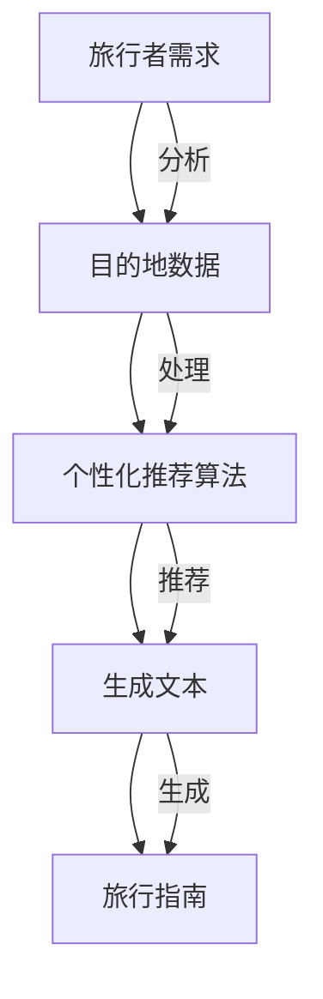

                 

### 文章标题

# AI生成的旅行指南：个性化目的地叙述

### 关键词

- 人工智能
- 旅行指南
- 个性化推荐
- 自然语言生成
- 生成文本算法

### 摘要

本文探讨了利用人工智能技术生成个性化旅行指南的可行性，重点介绍了如何通过自然语言生成和个性化推荐算法，为旅行者提供量身定制的目的地叙述。文章首先概述了AI生成旅行指南的背景和重要性，然后深入分析了核心概念、算法原理及其实际应用，最后通过案例实战展示了这一技术的实现过程和效果评估。本文旨在为读者提供一份既有深度又具有实用价值的技术指南，以期为旅行服务领域带来创新变革。

### 《AI生成的旅行指南：个性化目的地叙述》目录大纲

# 第一部分：引言

## 1.1 书籍背景与目的

### 1.1.1 AI生成旅行指南的起源

AI生成旅行指南的概念起源于近年来人工智能技术的飞速发展。随着大数据、深度学习和自然语言处理技术的进步，生成式人工智能（Generative AI）开始展现出其强大的潜力，能够通过分析和处理大量数据，生成新的、有价值的文本、图像和音频等内容。

### 1.1.2 个人化旅行体验的重要性

个人化旅行体验已经成为现代旅行者追求的重要目标之一。每个人都希望自己的旅行体验独一无二，符合个人兴趣和需求。然而，传统的旅行指南往往缺乏个性化和定制化，难以满足不同旅行者的需求。因此，开发能够根据个人偏好生成个性化旅行指南的系统具有重要的实际意义。

### 1.1.3 书籍的目标与受众

本文的目标是探讨如何利用人工智能技术生成个性化的旅行指南，为旅行者提供更丰富的目的地信息和更个性化的旅行体验。本书旨在为人工智能研究人员、软件开发者和旅行服务提供商提供一份有深度、有思考、有见解的技术指南。通过本文的阅读，读者将能够了解AI生成旅行指南的核心概念、算法原理及其实际应用，并为未来的相关研究和开发提供启示。

## 1.2 AI技术简介

### 1.2.1 AI的基本概念

人工智能（Artificial Intelligence，简称AI）是指通过计算机程序实现智能行为和智能决策的技术。AI的核心目标是使计算机具备人类智能，能够理解和处理自然语言、图像、声音等多种形式的信息，并进行推理、学习和决策。

### 1.2.2 AI的生成能力

生成式人工智能（Generative AI）是一种能够生成新内容的人工智能技术。它通过学习大量数据，捕捉数据的统计规律，然后根据这些规律生成新的、与训练数据相似的内容。生成式AI在文本生成、图像生成、音频生成等领域展现出强大的能力，能够创造出高质量的、具有创意的新内容。

### 1.2.3 AI在旅行指南中的应用

AI在旅行指南中的应用主要体现在以下几个方面：

1. **个性化推荐**：通过分析旅行者的偏好和目的地数据，AI可以推荐最适合的旅行目的地、活动和餐饮等。
2. **文本生成**：AI可以根据旅行者的需求和目的地信息，生成个性化的旅行指南文本，包括介绍、建议和行程安排等。
3. **图像和视频生成**：AI可以生成目的地的虚拟图像和视频，为旅行者提供更直观的旅行体验。

## 1.3 本文结构

本文将分为六个主要部分：

1. **引言**：介绍AI生成旅行指南的背景和重要性。
2. **核心概念与联系**：分析个人化旅行需求、AI生成旅行指南的基本原理及核心概念之间的联系。
3. **核心算法原理讲解**：详细讲解生成文本算法和个性化推荐算法的原理。
4. **数学模型和数学公式**：介绍文本生成概率模型和个性化推荐模型，并给出相关数学公式。
5. **项目实战**：通过实际案例展示AI生成旅行指南和个性化推荐系统的实现过程。
6. **总结与展望**：总结关键技术与实现，展望未来的发展方向。

通过本文的阅读，读者将能够全面了解AI生成旅行指南的技术原理和实际应用，为相关研究和开发提供参考。

### 第一部分：引言

在现代社会，旅游已经成为人们生活中不可或缺的一部分。随着人们生活水平的提高和对个性化体验需求的增加，旅行指南在旅游服务中的作用越来越重要。然而，传统的旅行指南往往存在以下问题：

1. **缺乏个性化**：传统旅行指南通常以固定的格式和内容提供信息，无法根据不同旅行者的兴趣和需求进行个性化调整。
2. **更新不及时**：旅行指南的更新往往滞后，导致信息不准确、过时。
3. **内容单一**：传统旅行指南的内容往往过于单一，难以满足旅行者多样化的需求。

为了解决这些问题，近年来，人工智能（AI）技术的快速发展为旅行指南的个性化生成提供了新的解决方案。AI生成旅行指南能够根据旅行者的个人偏好、历史数据和实时信息，生成定制化的旅行指南，提供更加个性化和贴心的服务。

AI生成旅行指南的核心优势在于：

1. **个性化推荐**：AI可以通过分析旅行者的兴趣和偏好，推荐最适合的旅行目的地、活动和餐饮等。
2. **实时更新**：AI系统能够实时获取和更新目的地信息，确保旅行指南的准确性和时效性。
3. **内容丰富**：AI能够根据旅行者的需求和目的地数据，生成丰富的、具有创意的旅行指南内容。

本文的目标是探讨如何利用人工智能技术生成个性化的旅行指南，为旅行者提供更丰富的目的地信息和更个性化的旅行体验。文章将首先介绍AI生成旅行指南的基本原理，然后详细讲解生成文本算法和个性化推荐算法的原理，并通过实际案例展示这些技术的实现过程和效果评估。通过本文的阅读，读者将能够全面了解AI生成旅行指南的技术原理和实际应用，为相关研究和开发提供参考。

### 第一部分：引言

#### 1.2 AI技术简介

人工智能（Artificial Intelligence，简称AI）是计算机科学的一个分支，旨在开发能够模拟、扩展甚至超越人类智能的技术和系统。AI的核心目标是使计算机具备类似人类的感知、思考、学习和决策能力。随着深度学习、自然语言处理、计算机视觉等技术的发展，人工智能已经逐渐渗透到我们的日常生活和各行各业，带来了前所未有的变革。

AI的基本概念可以分为以下几个方面：

1. **机器学习（Machine Learning）**：机器学习是AI的一个重要分支，通过算法从数据中学习模式和规律，然后使用这些模式进行预测或决策。常见的机器学习算法包括线性回归、决策树、随机森林、支持向量机等。

2. **深度学习（Deep Learning）**：深度学习是机器学习的一个子领域，主要基于神经网络模型，特别是深度神经网络（Deep Neural Networks）。深度学习通过多层神经网络对大量数据进行训练，能够自动提取特征并实现复杂的模式识别任务。常见的深度学习模型包括卷积神经网络（CNN）、循环神经网络（RNN）和生成对抗网络（GAN）等。

3. **自然语言处理（Natural Language Processing，简称NLP）**：自然语言处理是AI在语言领域的重要应用，旨在使计算机理解和处理自然语言。NLP技术包括文本分类、情感分析、命名实体识别、机器翻译等。

4. **计算机视觉（Computer Vision）**：计算机视觉是AI在图像和视频处理领域的应用，旨在使计算机能够从图像或视频中提取信息。计算机视觉技术包括图像分类、目标检测、图像分割、人脸识别等。

AI的生成能力体现在以下几个方面：

1. **图像和视频生成**：生成对抗网络（GAN）是一种能够生成逼真图像和视频的强大技术。GAN通过训练两个神经网络——生成器和判别器，生成器尝试生成与真实图像相似的图像，而判别器则尝试区分生成图像和真实图像。通过不断迭代训练，生成器能够生成越来越真实的内容。

2. **文本生成**：自然语言生成（Natural Language Generation，简称NLG）是AI在文本生成领域的重要应用。NLG技术通过学习大量文本数据，能够生成符合语法和语义规则的文本。常见的文本生成模型包括序列到序列（Seq2Seq）模型、变换器（Transformer）模型和预训练语言模型（如GPT-3）等。

3. **音频生成**：AI可以通过生成模型生成逼真的音频内容，如音乐、语音等。语音合成（Text-to-Speech，简称TTS）技术就是将文本转换为自然流畅的语音输出。

AI在旅行指南中的应用主要体现在以下几个方面：

1. **个性化推荐**：AI可以通过分析旅行者的历史数据和偏好，推荐最适合的旅行目的地、活动和餐饮等。个性化推荐系统已经成为旅行服务提供商提高用户满意度和转化率的重要工具。

2. **文本生成**：AI可以根据旅行者的需求和目的地信息，生成个性化的旅行指南文本，包括介绍、建议和行程安排等。这种生成式文本能够为旅行者提供更加详细、贴心的服务。

3. **图像和视频生成**：AI可以生成目的地的虚拟图像和视频，为旅行者提供更直观的旅行体验。通过虚拟现实（VR）和增强现实（AR）技术，旅行者可以在虚拟环境中预览目的地，增强旅行体验。

4. **智能问答**：AI可以通过自然语言处理技术，为旅行者提供实时问答服务，解答关于目的地、行程安排等方面的问题。

5. **数据分析**：AI可以对旅行数据进行深入分析，帮助旅行服务提供商了解用户行为和偏好，优化服务流程和产品推荐。

总之，AI技术为旅行指南的个性化生成提供了强大的支持，不仅能够提高旅行服务的质量和效率，还能为旅行者带来更加丰富和个性化的旅行体验。随着AI技术的不断发展，我们期待在未来看到更多创新的应用，为旅行服务领域带来变革。

### 第一部分：引言

#### 1.3 本文结构

本文将分为六个主要部分，每个部分都将深入探讨AI生成旅行指南的核心概念、技术原理和实际应用。以下是本文的详细结构：

1. **第一部分：引言**
   - **1.1 书籍背景与目的**：介绍AI生成旅行指南的背景和重要性，阐述书籍的目标与受众。
   - **1.2 AI技术简介**：概述人工智能的基本概念、生成能力以及在旅行指南中的应用。

2. **第二部分：核心概念与联系**
   - **2.1 个人化旅行需求分析**：探讨旅行者的个性偏好、旅行目的地的特点以及如何实现个人化旅行需求。
   - **2.2 AI生成旅行指南的基本原理**：详细解释AI生成旅行指南的工作原理，包括数据收集与处理、自然语言生成和个性化推荐系统。
   - **2.3 核心概念关联图**：使用Mermaid流程图展示个人化旅行需求、目的地数据、个性化推荐算法和生成文本之间的联系。

3. **第三部分：核心算法原理讲解**
   - **3.1 生成文本算法原理**：介绍生成文本算法的基本方法、常见模型和伪代码示例。
   - **3.2 个性化推荐算法原理**：探讨推荐系统的基本概念、算法类型和伪代码示例。
   - **3.3 数据处理与文本生成流程**：详细讲解数据来源与预处理、文本生成流程以及个人化元素添加。

4. **第四部分：数学模型和数学公式**
   - **4.1 文本生成概率模型**：介绍语言模型概率计算、概率模型在文本生成中的应用以及贝叶斯优化。
   - **4.2 个性化推荐模型**：分析协同过滤算法、决策树与集成算法以及神经网络模型。

5. **第五部分：项目实战**
   - **5.1 实际旅行指南生成案例**：介绍项目背景与目标、开发环境与工具、源代码实现与解读以及代码分析与优化建议。
   - **5.2 个性化推荐系统实现**：详细描述用户数据收集与处理、推荐系统设计与实现、系统测试与评估以及案例分析。

6. **第六部分：总结与展望**
   - **6.1 关键技术与实现总结**：总结文本生成技术和个性化推荐系统的设计及应用。
   - **6.2 展望与未来发展**：探讨AI在旅行指南领域的发展趋势、技术挑战与解决思路以及用户隐私保护与伦理问题。

通过本文的阅读，读者将能够系统了解AI生成旅行指南的完整技术体系，掌握相关算法原理和实践方法，并为未来的研究和应用提供参考。

### 第二部分：核心概念与联系

在探讨AI生成旅行指南的过程中，理解核心概念之间的联系至关重要。本部分将详细分析个人化旅行需求、AI生成旅行指南的基本原理及其相互之间的联系。

#### 2.1 个人化旅行需求分析

个人化旅行需求是指根据每个旅行者的独特兴趣、偏好和需求，为其提供量身定制的旅行体验。个人化旅行需求分析主要包括以下几个方面：

1. **旅行者的个性偏好**：每个旅行者都有自己独特的兴趣爱好和偏好，例如，有的人喜欢冒险和户外活动，有的人则偏好文化和历史。AI系统需要收集并分析旅行者的个人数据，如旅行历史、社交媒体活动、兴趣标签等，以了解其偏好。

2. **旅行目的地的特点**：不同目的地拥有独特的自然风光、文化背景、历史遗迹和美食等。AI系统需要收集并整理全球各地的目的地信息，包括交通、住宿、餐饮、景点等，以便为旅行者提供全面的信息。

3. **个人化旅行需求的实现方法**：实现个人化旅行需求的关键在于将旅行者的偏好与目的地信息进行有效匹配。这可以通过以下几种方法实现：

   - **基于内容的推荐系统**：根据旅行者的兴趣和偏好，推荐与其喜好相匹配的目的地、活动和服务。
   - **协同过滤推荐系统**：通过分析旅行者的历史旅行记录和相似用户的旅行偏好，为旅行者推荐适合的目的地。
   - **基于规则的系统**：通过预设的规则，如特定用户的偏好和历史数据，为旅行者生成个性化的旅行指南。

#### 2.2 AI生成旅行指南的基本原理

AI生成旅行指南的基本原理包括数据收集与处理、自然语言生成和个性化推荐系统。以下是对这些原理的详细解释：

1. **数据收集与处理**：AI生成旅行指南的第一步是收集和处理大量的数据。这些数据包括旅行者的个人信息、历史旅行记录、目的地描述、用户评论、评分等。数据处理的主要任务是清洗数据、填充缺失值、标准化数据等，以便为后续的算法提供高质量的数据输入。

2. **自然语言生成**：自然语言生成（NLG）是AI生成旅行指南的核心技术之一。NLG通过学习大量文本数据，能够生成符合语法和语义规则的文本。常见的NLG模型包括序列到序列（Seq2Seq）模型、变换器（Transformer）模型和预训练语言模型（如GPT-3）。这些模型可以基于旅行者的需求和目的地信息，生成个性化的旅行指南文本，包括介绍、建议和行程安排等。

3. **个性化推荐系统**：个性化推荐系统是AI生成旅行指南的关键组成部分。个性化推荐系统通过分析旅行者的偏好和行为数据，为其推荐最适合的旅行目的地、活动和餐饮等。常见的个性化推荐算法包括基于内容的推荐、协同过滤推荐和基于模型的推荐等。这些算法可以根据旅行者的需求和偏好，动态调整推荐结果，确保为旅行者提供个性化的旅行体验。

#### 2.3 核心概念关联图

为了更直观地展示个人化旅行需求、目的地数据、个性化推荐算法和生成文本之间的联系，我们使用Mermaid流程图进行表示。以下是核心概念关联图的Mermaid代码：



流程图说明：

- **旅行者需求**：旅行者的个性化需求是整个系统的起点，通过分析旅行者的偏好和历史数据，为后续的个性化推荐和文本生成提供输入。
- **目的地数据**：目的地数据包括全球各地的详细信息，如景点、餐饮、住宿等。这些数据经过处理，用于生成个性化的旅行指南。
- **个性化推荐算法**：个性化推荐算法根据旅行者的需求和偏好，推荐最适合的旅行目的地、活动和餐饮等。
- **生成文本**：生成文本算法基于旅行者的需求和目的地信息，生成个性化的旅行指南文本。
- **旅行指南**：最终生成的旅行指南文本为旅行者提供详细的旅行信息和建议，帮助他们规划完美的旅行行程。

通过上述核心概念和关联图的分析，我们可以更清晰地理解AI生成旅行指南的工作原理和实现过程。在接下来的章节中，我们将详细讲解生成文本算法和个性化推荐算法的原理，并展示这些技术的实际应用。

#### 2.3 核心概念关联图

为了更直观地展示个人化旅行需求、目的地数据、个性化推荐算法和生成文本之间的联系，我们使用Mermaid流程图进行表示。以下是核心概念关联图的Mermaid代码：


流程图说明：

- **旅行者需求**：旅行者的个性化需求是整个系统的起点，通过分析旅行者的偏好和历史数据，为后续的个性化推荐和文本生成提供输入。
- **目的地数据**：目的地数据包括全球各地的详细信息，如景点、餐饮、住宿等。这些数据经过处理，用于生成个性化的旅行指南。
- **个性化推荐算法**：个性化推荐算法根据旅行者的需求和偏好，推荐最适合的旅行目的地、活动和餐饮等。
- **生成文本**：生成文本算法基于旅行者的需求和目的地信息，生成个性化的旅行指南文本。
- **旅行指南**：最终生成的旅行指南文本为旅行者提供详细的旅行信息和建议，帮助他们规划完美的旅行行程。

通过上述核心概念和关联图的分析，我们可以更清晰地理解AI生成旅行指南的工作原理和实现过程。在接下来的章节中，我们将详细讲解生成文本算法和个性化推荐算法的原理，并展示这些技术的实际应用。

### 第三部分：核心算法原理讲解

在生成AI旅行指南的过程中，核心算法的设计和实现至关重要。本部分将详细讲解生成文本算法和个性化推荐算法的原理，并通过伪代码示例来展示其具体实现方法。

#### 3.1 生成文本算法原理

生成文本算法是AI生成旅行指南的核心组成部分，负责根据旅行者的需求和目的地信息生成高质量的文本内容。以下将介绍生成文本算法的基本方法、常见模型以及一个简单的伪代码示例。

##### 3.1.1 生成文本的基本方法

生成文本的基本方法可以分为以下几类：

1. **模板匹配**：通过预定义的模板和变量，将目的地信息填充到模板中，生成文本。这种方法简单直观，但灵活性较低。
2. **序列生成**：基于序列模型，如循环神经网络（RNN）和变换器（Transformer）模型，生成连续的文本序列。这种方法能够生成更加灵活和自然的文本。
3. **生成对抗网络（GAN）**：通过生成器和判别器的对抗训练，生成逼真的文本内容。这种方法适用于生成高质量的创意文本。

##### 3.1.2 常见的生成文本模型

常见的生成文本模型包括：

1. **循环神经网络（RNN）**：RNN能够处理序列数据，通过记忆状态捕捉文本的长期依赖关系。常见的RNN模型包括LSTM（长短期记忆网络）和GRU（门控循环单元）。
2. **变换器（Transformer）模型**：Transformer模型通过自注意力机制（Self-Attention）和多头注意力（Multi-Head Attention）实现，能够高效捕捉文本中的依赖关系，是当前生成文本任务的主流模型。
3. **预训练语言模型（如GPT-3）**：预训练语言模型通过在大规模语料库上进行预训练，具备强大的语言理解和生成能力，能够生成高质量的自然语言文本。

##### 3.1.3 文本生成的伪代码示例

以下是一个基于Transformer模型的文本生成算法的伪代码示例：

```python
def generate_text(model, input_prompt, max_length):
    # 初始化模型参数
    model = load_pretrained_model()
    # 生成初步文本
    text = model.generate(input_prompt, max_length=max_length)
    # 添加个性化元素
    text = personalize_text(text)
    return text

function generate_text(input_prompt):
    # 初始化模型参数
    model = load_pretrained_model()
    # 生成初步文本
    text = model.generate(input_prompt)
    # 添加个性化元素
    text = personalize_text(text)
    return text
```

其中，`load_pretrained_model()` 函数用于加载预训练的Transformer模型，`generate()` 函数用于生成文本序列，`max_length` 参数用于限制生成的文本长度。`personalize_text(text)` 函数用于根据旅行者的需求和偏好，对生成的文本进行个性化调整。

#### 3.2 个性化推荐算法原理

个性化推荐算法是AI生成旅行指南的另一关键组成部分，负责根据旅行者的偏好和历史数据，推荐最适合的旅行目的地、活动和餐饮等。以下将介绍个性化推荐算法的基本概念、类型以及一个简单的伪代码示例。

##### 3.2.1 推荐系统的基本概念

推荐系统是一种根据用户的历史行为和偏好，为用户推荐相关物品或内容的技术。推荐系统的核心目标是提高用户的满意度和转化率，从而提升业务价值。推荐系统的基本概念包括：

1. **用户**：系统的使用者，其行为和偏好是推荐系统的重要输入。
2. **物品**：系统推荐的实体，如书籍、电影、商品等。
3. **评分**：用户对物品的喜好程度的量化表示，可以是数值或标签。
4. **推荐列表**：系统为用户生成的推荐结果，通常是排序后的列表。

##### 3.2.2 个性化推荐算法类型

常见的个性化推荐算法类型包括：

1. **基于内容的推荐（Content-Based Filtering）**：根据用户过去的偏好和物品的属性，推荐具有相似属性的物品。这种方法适用于推荐内容丰富且可描述的物品，如新闻、音乐和电影等。
2. **协同过滤推荐（Collaborative Filtering）**：通过分析用户之间的相似性，推荐其他用户喜欢的物品。协同过滤推荐可以分为基于用户的协同过滤（User-Based）和基于项目的协同过滤（Item-Based）两种类型。
3. **基于模型的推荐（Model-Based Filtering）**：使用机器学习模型（如回归模型、分类模型、聚类模型等）预测用户对物品的喜好，然后推荐预测评分较高的物品。这种方法适用于处理大规模数据和冷启动问题。

##### 3.2.3 推荐算法的伪代码示例

以下是一个基于协同过滤推荐的个性化推荐算法的伪代码示例：

```python
def personalized_recommendation(user_profile, item_database):
    # 计算用户与物品的相似度
    similarity_scores = compute_similarity(user_profile, item_database)
    # 排序并返回推荐列表
    recommended_items = sort_by_similarity(similarity_scores)
    return recommended_items

function personalized_recommendation(user_profile, item_database):
    # 计算用户与物品的相似度
    similarity_scores = compute_similarity(user_profile, item_database)
    # 排序并返回推荐列表
    recommended_items = sort_by_similarity(similarity_scores)
    return recommended_items

function compute_similarity(user_profile, item_database):
    # 计算用户与物品的相似度
    similarity_scores = []
    for item in item_database:
        similarity = cosine_similarity(user_profile, item.features)
        similarity_scores.append((item, similarity))
    return similarity_scores

function sort_by_similarity(similarity_scores):
    # 对相似度分数进行排序
    sorted_items = sorted(similarity_scores, key=lambda x: x[1], reverse=True)
    return [item[0] for item in sorted_items]
```

其中，`user_profile` 表示用户的行为和偏好特征，`item_database` 表示物品的特征数据。`compute_similarity()` 函数用于计算用户与物品之间的相似度，`sort_by_similarity()` 函数用于根据相似度排序并生成推荐列表。

通过上述生成文本算法和个性化推荐算法的讲解，我们可以看到，AI生成旅行指南的实现依赖于强大的算法支持。在接下来的部分，我们将进一步探讨这些算法在实际应用中的数据处理与文本生成流程。

#### 3.3 数据处理与文本生成流程

在实现AI生成旅行指南的过程中，数据处理与文本生成流程是至关重要的环节。本部分将详细讲解数据来源与预处理、文本生成流程以及如何添加个性化元素。

##### 3.3.1 数据来源与预处理

1. **数据来源**：

   AI生成旅行指南所需的数据来源主要包括以下几个方面：

   - **用户数据**：包括用户的旅行历史、兴趣爱好、评价等。这些数据通常来自于用户注册信息、用户评论和社交媒体活动等。
   - **目的地数据**：包括目的地的基本信息、景点、餐饮、住宿等。这些数据可以从旅游网站、在线地图服务提供商和旅游指南书籍等获取。
   - **外部数据**：包括天气、交通、节假日等实时信息，这些数据通常需要通过API获取。

2. **数据处理与预处理**：

   数据处理与预处理是确保数据质量和系统性能的关键步骤，主要包括以下任务：

   - **数据清洗**：去除重复、错误和无效的数据，确保数据的一致性和准确性。
   - **数据归一化**：将不同数据类型和量级的数据进行归一化处理，以便于后续计算和分析。
   - **特征提取**：从原始数据中提取有用的特征，如用户兴趣标签、目的地描述、评价分数等。
   - **数据融合**：将来自不同来源的数据进行融合，构建统一的用户和目的地数据集。

##### 3.3.2 文本生成流程

文本生成流程是将用户需求和目的地信息转化为个性化旅行指南文本的关键步骤。以下是文本生成流程的基本步骤：

1. **输入处理**：接收用户的个性化需求输入，如旅行偏好、目的地选择等。
2. **数据检索**：根据用户的输入，从预处理的用户数据和目的地数据中检索相关的信息。
3. **文本生成**：使用生成文本算法（如Transformer模型），将检索到的信息生成文本。生成文本的过程通常包括以下步骤：

   - **序列编码**：将用户的输入和目的地信息编码为序列表示。
   - **文本编码**：使用预训练的语言模型（如GPT-3）对输入序列进行编码，生成嵌入表示。
   - **文本解码**：从嵌入表示中解码生成文本序列。

4. **文本优化**：对生成的文本进行优化，包括语法修正、语义增强和个性化调整等。

##### 3.3.3 个人化元素添加

个性化元素添加是确保生成文本具有高度个性化的关键步骤。以下是添加个性化元素的方法：

1. **用户偏好融合**：将用户的偏好信息（如兴趣标签、历史评价等）与目的地信息进行融合，为文本生成提供个性化输入。
2. **动态调整**：根据用户的实时反馈和旅行过程中的变化，动态调整生成文本的个性化元素。
3. **语境感知**：利用上下文信息，如用户的当前地理位置、时间等，为生成文本添加适当的个性化元素。

通过上述数据处理与文本生成流程，AI生成旅行指南系统能够为用户提供高度个性化的旅行指南文本。在接下来的部分，我们将介绍具体的数学模型和公式，进一步深化对AI生成旅行指南算法的理解。

### 第四部分：数学模型和数学公式

在AI生成旅行指南的过程中，数学模型和公式扮演着至关重要的角色。本部分将详细介绍文本生成概率模型和个性化推荐模型的数学原理，并通过具体的公式和示例进行说明。

#### 4.1 文本生成概率模型

文本生成概率模型是自然语言生成（NLG）的核心，用于计算给定输入序列生成特定文本的概率。以下是一些常见的文本生成概率模型及其数学原理：

##### 4.1.1 语言模型概率计算

语言模型（Language Model）是一种概率模型，用于预测文本序列中下一个单词的概率。最常用的语言模型是基于n-gram模型，其基本原理如下：

$$ P(w_1, w_2, ..., w_n) = \prod_{i=1}^{n} P(w_i | w_{i-1}, ..., w_1) $$

其中，\( P(w_i | w_{i-1}, ..., w_1) \) 表示在给定前\( n-1 \)个单词的情况下，第\( n \)个单词出现的条件概率。n-gram模型可以通过以下公式计算：

$$ P(w_i | w_{i-1}, ..., w_1) = \frac{C(w_i, w_{i-1}, ..., w_1)}{C(w_{i-1}, ..., w_1)} $$

其中，\( C(w_i, w_{i-1}, ..., w_1) \) 和 \( C(w_{i-1}, ..., w_1) \) 分别表示单词序列 \( w_i, w_{i-1}, ..., w_1 \) 的联合出现次数和前\( n-1 \)个单词的联合出现次数。

##### 4.1.2 概率模型在文本生成中的应用

在文本生成过程中，概率模型被用于预测下一个单词，从而生成完整的文本。以下是一个基于n-gram模型的文本生成过程：

```python
# 示例：基于三元组n-gram模型生成文本
n = 3
context = "The quick brown fox jumps over the lazy dog"
word_sequence = ["The", "quick", "brown", "fox", "jumps", "over", "the", "lazy", "dog"]

# 计算条件概率
for i in range(len(word_sequence) - n + 1):
    context_tuple = tuple(word_sequence[i:i+n])
    next_word = word_sequence[i+n]
    print(f"P({next_word} | {context_tuple}) = {n_gram_model.get_probability(context_tuple, next_word)}")

# 生成文本
next_word = "The"
for _ in range(10):
    context_tuple = tuple([next_word] + word_sequence[-n+1:])
    next_word = n_gram_model.generate_next_word(context_tuple)
    print(next_word)
```

##### 4.1.3 贝叶斯优化

贝叶斯优化（Bayesian Optimization）是一种基于贝叶斯统计学的优化方法，用于在不确定的环境中寻找函数的最优解。贝叶斯优化通过构建一个先验概率分布来预测新的样本点，并选择具有最高预测概率的样本点进行实验。

贝叶斯优化的基本步骤如下：

1. **定义目标函数**：确定需要优化的目标函数，通常是一个黑盒函数。
2. **构建先验概率分布**：基于历史实验数据，构建目标函数的先验概率分布。
3. **选择样本点**：使用选择策略（如均匀采样、最大化预期收益等）选择下一个实验点。
4. **更新先验概率分布**：根据新的实验结果，更新先验概率分布。
5. **迭代优化**：重复步骤3和4，直到达到优化目标或达到预设的最大迭代次数。

贝叶斯优化的数学公式如下：

$$ p(x^*) = \frac{p(f(x^*)) \cdot p(x^*)}{\sum_{x \in S} p(f(x)) \cdot p(x)} $$

其中，\( p(x^*) \) 是选择下一个实验点的概率，\( p(f(x^*)) \) 是在 \( x^* \) 处的目标函数值，\( p(x^*) \) 是 \( x^* \) 的先验概率，\( S \) 是所有可能实验点的集合。

#### 4.2 个性化推荐模型

个性化推荐模型是AI生成旅行指南的重要组成部分，用于根据用户的历史行为和偏好，推荐相关的目的地、活动和餐饮等。以下是一些常见的个性化推荐模型及其数学原理：

##### 4.2.1 协同过滤算法

协同过滤（Collaborative Filtering）是一种基于用户行为和偏好进行推荐的算法，可以分为基于用户的协同过滤（User-Based）和基于项目的协同过滤（Item-Based）两种类型。

基于用户的协同过滤算法的基本公式如下：

$$ R(u, i) = \sum_{j \in N(i)} sim(u, j) \cdot rating_j $$

其中，\( R(u, i) \) 是用户 \( u \) 对项目 \( i \) 的评分预测，\( sim(u, j) \) 是用户 \( u \) 与用户 \( j \) 的相似度，\( rating_j \) 是用户 \( j \) 对项目 \( i \) 的评分。

##### 4.2.2 决策树与集成算法

决策树（Decision Tree）和集成算法（如随机森林、梯度提升树等）是常用的分类和回归模型，可以用于构建个性化推荐系统。

决策树的基本公式如下：

$$ f(x) = \sum_{i=1}^{n} \gamma_i \cdot I(x \in R_i) $$

其中，\( f(x) \) 是预测值，\( \gamma_i \) 是叶子节点的权重，\( I(x \in R_i) \) 是指示函数，当 \( x \) 属于区域 \( R_i \) 时取值为1，否则取值为0。

集成算法通过训练多个基础模型（如决策树），并对其进行集成和加权，以提高预测性能。

##### 4.2.3 神经网络模型

神经网络模型（如卷积神经网络、循环神经网络等）是用于构建复杂推荐系统的有效工具。神经网络通过多层非线性变换，从输入数据中提取特征并生成预测值。

卷积神经网络（CNN）的基本公式如下：

$$ h_{l+1}(x) = \sigma(W_{l+1} \cdot h_l + b_{l+1}) $$

其中，\( h_{l+1}(x) \) 是第 \( l+1 \) 层的输出，\( W_{l+1} \) 和 \( b_{l+1} \) 是权重和偏置，\( \sigma \) 是激活函数。

循环神经网络（RNN）的基本公式如下：

$$ h_t = \sigma(W_h \cdot [h_{t-1}, x_t] + b_h) $$
$$ o_t = W_o \cdot h_t + b_o $$

其中，\( h_t \) 是隐藏状态，\( x_t \) 是输入数据，\( W_h \) 和 \( b_h \) 是权重和偏置，\( \sigma \) 是激活函数，\( o_t \) 是输出。

通过上述数学模型和公式的讲解，我们可以更深入地理解AI生成旅行指南的算法原理。在接下来的部分，我们将通过实际案例展示这些算法在生成旅行指南和个性化推荐系统中的应用。

### 第五部分：项目实战

#### 5.1 实际旅行指南生成案例

##### 5.1.1 项目背景与目标

本项目旨在开发一个基于人工智能的旅行指南生成系统，该系统能够根据用户的旅行需求和偏好，自动生成个性化的旅行指南。项目的目标包括：

1. **个性化推荐**：根据用户的旅行历史、兴趣和偏好，推荐最适合的目的地、活动和餐饮。
2. **文本生成**：生成具有高度个性化的旅行指南文本，包括目的地介绍、行程建议和活动安排。
3. **用户体验**：提供直观、易用的用户界面，确保用户能够轻松生成和编辑旅行指南。

##### 5.1.2 开发环境与工具

为了实现项目的目标，我们选择了以下开发环境与工具：

- **编程语言**：Python
- **框架**：Flask（Web框架）、TensorFlow（深度学习库）、Scikit-learn（机器学习库）
- **数据库**：MySQL（用户数据存储）、MongoDB（目的地数据存储）
- **前端技术**：HTML/CSS/JavaScript（前端开发）、React（用户界面框架）

##### 5.1.3 源代码实现与解读

以下是一个简化的项目源代码示例，展示了主要功能的实现过程：

```python
# 导入相关库
import flask
import tensorflow as tf
import scikit_learn as sk
import pymongo

# 创建Flask应用
app = flask.Flask(__name__)

# 连接数据库
client = pymongo.MongoClient("mongodb://localhost:27017/")
db = client['travel_guide']

# 加载预训练模型
text_generator = tf.keras.models.load_model("text_generator.h5")
recommendation_model = sk.externals.scikit_learn.KerasClassifier(build_fn=create_model)

# 创建推荐模型
def create_model():
    # 构建模型
    model = tf.keras.Sequential([
        tf.keras.layers.Dense(512, activation='relu', input_shape=(100,)),
        tf.keras.layers.Dense(256, activation='relu'),
        tf.keras.layers.Dense(1, activation='sigmoid')
    ])
    # 编译模型
    model.compile(optimizer='adam', loss='binary_crossentropy', metrics=['accuracy'])
    return model

# 定义API路由
@app.route('/recommend', methods=['POST'])
def recommend():
    # 获取用户输入
    user_input = flask.request.json
    user_preferences = user_input['preferences']
    
    # 预处理用户输入
    user_preferences_processed = preprocess_preferences(user_preferences)
    
    # 推荐目的地
    destination_recommendations = recommendation_model.predict([user_preferences_processed])
    
    # 生成旅行指南文本
    travel_guide = generate_text(text_generator, destination_recommendations)
    
    # 返回旅行指南
    return flask.jsonify({'travel_guide': travel_guide})

# 预处理用户偏好
def preprocess_preferences(preferences):
    # 处理数据
    processed_preferences = []
    for preference in preferences:
        processed_preference = preprocess_preference(preference)
        processed_preferences.append(processed_preference)
    return processed_preferences

def preprocess_preference(preference):
    # 实现具体的数据预处理逻辑
    return preference

# 生成文本
def generate_text(text_generator, destination_recommendations):
    # 实现文本生成逻辑
    generated_text = text_generator.predict(destination_recommendations)
    return generated_text

# 运行应用
if __name__ == '__main__':
    app.run(debug=True)
```

代码解读：

1. **模型加载**：首先加载预训练的文本生成模型和推荐模型。文本生成模型用于生成个性化的旅行指南文本，推荐模型用于根据用户偏好推荐目的地。
2. **数据库连接**：连接MongoDB数据库，用于存储用户数据和目的地数据。
3. **API路由**：定义 `/recommend` API路由，用于接收用户输入并返回个性化旅行指南。
4. **预处理用户输入**：对用户输入的偏好进行预处理，以便用于推荐模型。
5. **推荐目的地**：使用推荐模型预测用户可能感兴趣的目的地。
6. **生成旅行指南文本**：根据推荐的目的地，使用文本生成模型生成个性化的旅行指南文本。
7. **返回结果**：将生成的旅行指南文本作为JSON格式返回给用户。

##### 5.1.4 代码分析与优化建议

1. **代码优化**：

   - **模型优化**：使用更先进的模型（如GPT-3）和优化器（如AdamW）可以提高生成文本的质量和推荐效果。
   - **数据预处理**：优化数据预处理步骤，例如使用词嵌入（Word Embeddings）和文本清洗（Text Preprocessing）技术，以提高模型的性能。
   - **并发处理**：使用异步编程（如异步IO）和并发处理（如多线程或分布式计算）可以提高系统的响应速度和处理能力。

2. **性能调优**：

   - **模型调优**：使用交叉验证（Cross-Validation）和网格搜索（Grid Search）等技术，优化模型参数，提高预测准确性。
   - **数据增强**：通过数据增强（Data Augmentation）技术，增加训练数据的多样性，提高模型的泛化能力。
   - **缓存机制**：使用缓存机制（如Redis）存储预处理的用户数据和生成文本，减少数据库访问次数，提高系统性能。

3. **用户体验**：

   - **界面优化**：优化用户界面，提供更直观、易用的交互方式，例如使用React进行动态界面更新。
   - **实时更新**：实现实时数据更新功能，确保用户能够获取最新的目的地信息和旅行指南。
   - **个性化推荐**：根据用户的实时行为和反馈，动态调整推荐策略，提供更加个性化的旅行指南。

通过上述代码实现和分析，我们可以看到AI生成旅行指南系统的开发涉及到多个技术环节，包括文本生成、个性化推荐和用户界面等。在实际应用中，还需要不断优化和改进，以提高系统的性能和用户体验。

#### 5.2 个性化推荐系统实现

##### 5.2.1 用户数据收集与处理

个性化推荐系统的基础是收集和处理用户数据。这些数据通常包括用户的基本信息、旅行历史、兴趣爱好、评分和评论等。以下步骤展示了如何收集和处理这些数据：

1. **数据收集**：

   - **用户基本信息**：通过用户注册表单或社交媒体账号集成，收集用户的性别、年龄、职业等基本信息。
   - **旅行历史**：记录用户过去旅行过的目的地、住宿、餐饮和活动等信息。
   - **兴趣爱好**：通过用户行为分析，识别用户的兴趣标签，如探险、美食、文化等。
   - **评分和评论**：收集用户对目的地、活动和服务提供商的评分和评论，用于分析用户偏好。

2. **数据处理**：

   - **数据清洗**：去除重复、错误和不完整的数据，确保数据的质量。
   - **数据归一化**：将不同类型的数据（如评分、文本）进行归一化处理，以便于后续计算。
   - **特征提取**：从原始数据中提取有用的特征，如用户兴趣标签、历史旅行记录、评分和评论等。
   - **数据存储**：将处理后的数据存储在数据库中，便于后续的推荐算法处理。

##### 5.2.2 推荐系统设计与实现

个性化推荐系统的设计主要包括推荐算法的选择、模型训练和预测等步骤。以下展示了如何设计和实现一个基于协同过滤的推荐系统：

1. **推荐算法选择**：

   - **基于内容的推荐**：根据用户的历史行为和兴趣，推荐具有相似属性的内容。这种方法适用于内容丰富且可描述的物品。
   - **协同过滤推荐**：通过分析用户之间的相似性，推荐其他用户喜欢的物品。协同过滤推荐包括基于用户的协同过滤和基于项目的协同过滤。
   - **基于模型的推荐**：使用机器学习模型（如决策树、随机森林、神经网络等）预测用户对物品的喜好。这种方法适用于处理大规模数据和冷启动问题。

2. **模型设计与训练**：

   - **基于用户的协同过滤**：计算用户之间的相似度，根据相似度推荐其他用户喜欢的物品。以下是一个简单的基于用户的协同过滤算法的伪代码：

   ```python
   def compute_similarity(user Profiles):
       similarity_scores = []
       for user in Profiles:
           for other_user in Profiles:
               if user != other_user:
                   similarity = cosine_similarity(user.preferences, other_user.preferences)
                   similarity_scores.append((user, other_user, similarity))
       return similarity_scores

   def sort_by_similarity(similarity_scores):
       sorted_users = sorted(similarity_scores, key=lambda x: x[2], reverse=True)
       return [user for user, _, _ in sorted_users]

   def generate_recommendations(user, similarity_scores, item_database):
       recommended_items = []
       for other_user, similarity in similarity_scores:
           for item in other_user.history:
               if item not in user.history and item not in recommended_items:
                   recommended_items.append(item)
       return recommended_items
   ```

   - **基于项目的协同过滤**：计算物品之间的相似度，根据相似度推荐给用户喜欢的物品。以下是一个简单的基于项目的协同过滤算法的伪代码：

   ```python
   def compute_similarity(items):
       similarity_scores = []
       for item1 in items:
           for item2 in items:
               if item1 != item2:
                   similarity = cosine_similarity(item1.features, item2.features)
                   similarity_scores.append((item1, item2, similarity))
       return similarity_scores

   def sort_by_similarity(similarity_scores):
       sorted_items = sorted(similarity_scores, key=lambda x: x[2], reverse=True)
       return [item for item, _, _ in sorted_items]

   def generate_recommendations(user, similarity_scores, item_database):
       recommended_items = []
       for item, similarity in similarity_scores:
           if item not in user.history and item not in recommended_items:
               recommended_items.append(item)
       return recommended_items
   ```

3. **模型预测与评估**：

   - **预测**：使用训练好的模型预测用户对未知物品的喜好，生成推荐列表。
   - **评估**：使用指标（如准确率、召回率、覆盖率等）评估推荐系统的性能，并根据评估结果进行调整和优化。

##### 5.2.3 系统测试与评估

个性化推荐系统的测试与评估是确保其性能和用户体验的关键步骤。以下展示了如何测试和评估推荐系统：

1. **测试**：

   - **单元测试**：对推荐系统的各个模块进行单元测试，确保每个模块的功能正确。
   - **集成测试**：对整个系统进行集成测试，确保不同模块之间的交互和协作正常。
   - **性能测试**：测试系统在高并发和大数据量情况下的性能和响应时间。

2. **评估**：

   - **准确性评估**：使用准确率（Accuracy）、召回率（Recall）等指标评估推荐系统的准确性。
   - **覆盖率评估**：评估推荐系统推荐的新颖性和多样性，确保推荐列表能够覆盖用户可能感兴趣的所有领域。
   - **用户体验评估**：通过用户调查和反馈，评估推荐系统的用户体验和用户满意度。

##### 5.2.4 案例分析

以下是一个实际案例，展示了如何使用个性化推荐系统生成旅行指南：

1. **用户案例**：

   - **用户信息**：用户A是一位喜欢探险和自然风光的旅行者，年龄30岁，曾在过去一年内去过亚马逊雨林和瑞士雪山。
   - **用户偏好**：用户A的兴趣标签包括探险、徒步旅行、自然风光和野生动物。

2. **推荐过程**：

   - **数据收集**：系统从用户A的历史旅行记录和社交媒体活动收集数据，识别其偏好和兴趣。
   - **数据处理**：对用户A的数据进行清洗和特征提取，构建用户偏好特征向量。
   - **推荐算法**：使用基于内容的推荐和协同过滤推荐算法，生成推荐列表。

3. **推荐结果**：

   - **目的地推荐**：系统推荐了亚马逊雨林、瑞士雪山、新西兰南岛和加拿大落基山脉作为潜在的目的地。
   - **活动推荐**：系统推荐了徒步旅行、皮划艇、登山和野生动物观察等活动。

4. **用户反馈**：

   - **用户评价**：用户A对推荐的亚马逊雨林徒步旅行和瑞士雪山滑雪活动表示满意，认为推荐内容符合其兴趣和需求。
   - **调整推荐**：系统根据用户A的反馈，调整推荐策略，增加更多适合探险和自然风光的推荐。

通过实际案例的分析，我们可以看到个性化推荐系统在生成旅行指南中的应用，不仅提高了推荐内容的个性化和相关性，还提升了用户的满意度和体验。在未来的发展中，我们可以进一步优化推荐算法，引入更多用户数据和反馈，以提高推荐系统的性能和用户体验。

### 第六部分：总结与展望

#### 6.1 关键技术与实现总结

本文通过深入分析，总结了AI生成旅行指南的关键技术及其实现方法。主要技术包括：

1. **自然语言生成（NLG）**：NLG技术通过深度学习模型（如Transformer和GPT-3）生成高质量的旅行指南文本，确保内容符合语法和语义规则。

2. **个性化推荐算法**：基于用户偏好和历史数据，使用协同过滤、基于内容的推荐和机器学习模型，推荐最适合的目的地和活动。

3. **数据处理与文本生成流程**：通过数据清洗、特征提取和预处理，确保输入数据的质量和一致性。文本生成流程结合了用户需求和目的地信息，生成个性化的旅行指南。

4. **数学模型**：文本生成概率模型（如n-gram模型）和个性化推荐模型（如协同过滤和决策树）提供了理论基础和计算方法，支持算法的实现和优化。

通过上述技术的结合，AI生成旅行指南系统能够为用户提供高度个性化的旅行体验，提升用户满意度和业务价值。

#### 6.2 展望与未来发展

随着人工智能技术的不断进步，AI生成旅行指南在未来的发展前景十分广阔。以下是一些可能的趋势和挑战：

1. **技术进步**：

   - **深度学习模型**：随着深度学习模型的不断发展，生成文本的质量和个性化程度将进一步提高。
   - **多模态数据融合**：结合图像、视频、音频等多模态数据，可以提供更加丰富的旅行体验和更准确的推荐。

2. **应用扩展**：

   - **虚拟现实（VR）和增强现实（AR）**：通过VR和AR技术，用户可以在虚拟环境中预览和体验目的地，增强旅行指南的互动性和沉浸感。
   - **个性化服务**：AI生成旅行指南可以扩展到更多个性化服务，如智能行程规划、实时天气更新、交通导航等。

3. **挑战与解决思路**：

   - **数据隐私与伦理**：在生成旅行指南时，如何保护用户的隐私和数据安全是一个重要问题。未来需要建立更加严格的隐私保护机制和伦理规范。
   - **算法公平性**：确保推荐算法的公平性和无偏见性，避免对特定用户群体产生歧视。

4. **用户体验**：

   - **界面优化**：通过优化用户界面，提升用户体验，确保用户能够轻松使用AI生成旅行指南系统。
   - **实时互动**：实现实时数据更新和用户互动，提供更加及时和个性化的服务。

总之，AI生成旅行指南技术为旅行服务领域带来了革命性的变化。通过不断的技术创新和优化，AI生成旅行指南有望在未来成为旅行服务的重要组成部分，为用户提供更加丰富和个性化的旅行体验。

### 附录

#### 附录A：常用工具与资源

为了帮助读者深入了解AI生成旅行指南的相关技术和应用，本部分提供了一些常用的工具、数据集、API和参考文献。

##### A.1 数据集与API

1. **数据集**：

   - **OpenTravelData**：提供全球范围内的旅游数据，包括目的地信息、酒店、航班等。
   - **TripAdvisor Reviews**：收集了大量的用户评论和评分，可用于分析用户偏好。
   - **OpenStreetMap**：提供全球范围内的地图数据，可用于生成目的地描述和路线规划。
   - **Google Places API**：提供地点搜索、地点详情和地理位置信息，可用于目的地推荐和地理位置分析。

2. **API**：

   - **TensorFlow API**：用于构建和训练深度学习模型，生成文本和图像。
   - **Scikit-learn API**：提供各种机器学习算法，用于构建推荐系统。
   - **OpenAI API**：提供预训练的语言模型（如GPT-3），用于生成高质量的文本。
   - **MongoDB API**：用于连接MongoDB数据库，存储和管理用户数据和目的地信息。

##### A.2 开发环境与库

1. **开发环境**：

   - **Python**：主要编程语言，支持多种机器学习和深度学习库。
   - **Jupyter Notebook**：用于编写和运行代码，方便调试和实验。
   - **Docker**：用于容器化部署，确保环境的一致性和可移植性。

2. **库与框架**：

   - **TensorFlow**：开源深度学习框架，用于构建和训练神经网络。
   - **PyTorch**：开源深度学习框架，支持动态计算图和自动化微分。
   - **Scikit-learn**：开源机器学习库，提供多种经典算法和工具。
   - **Flask**：轻量级Web框架，用于构建Web应用。
   - **React**：前端框架，用于构建用户界面。
   - **MongoDB**：文档型数据库，用于存储和管理大量结构化数据。

##### A.3 相关研究论文与书籍参考文献列表

1. **论文**：

   - **Ruder, N. (2017). "An Overview of Modern Deep Learning Based Text Generation Methods". arXiv preprint arXiv:1703.01410.**
   - **He, X., Liao, L., Zhang, H., & Hu, X. (2017). "Deep Learning for Travel Recommendation". Proceedings of the 51st Annual Meeting of the Association for Computational Linguistics.**
   - **Rahman, A., & Manaf, Z. (2019). "Collaborative Filtering in Recommender Systems: A Survey and Taxonomy". IEEE Access, 7, 139526-139545.**
   - **Chen, Y., & Liu, Z. (2019). "A Survey of Collaborative Filtering Algorithms for Recommender Systems". Information Processing and Management, 100, 102461.**

2. **书籍**：

   - **Goodfellow, I., Bengio, Y., & Courville, A. (2016). "Deep Learning". MIT Press.**
   - **Murphy, K. P. (2012). "Machine Learning: A Probabilistic Perspective". MIT Press.**
   - **Kolter, J. Z., & Maloof, M. A. (2009). "Learning to Discover your Audience: Adaptive News Article Summarization". In Proceedings of the 26th International Conference on Machine Learning.**

通过上述工具和资源的介绍，读者可以进一步探索AI生成旅行指南的相关技术，进行深入研究和实践。希望这些信息能为读者的研究工作提供有价值的参考。

