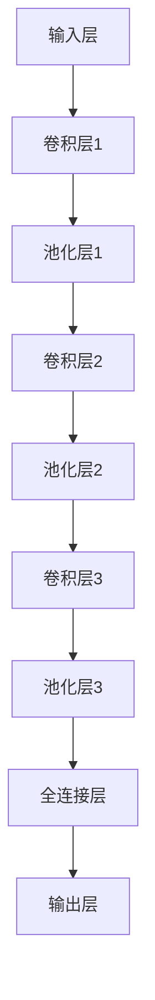
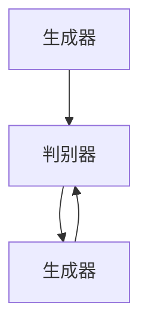
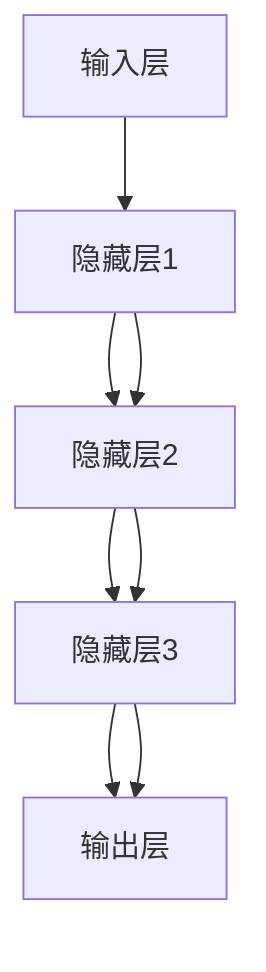
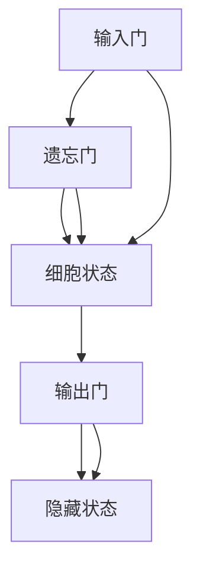

                 


### 文章标题：AI艺术创作工具的商业化探索

#### 关键词：
- AI艺术创作
- 商业模式
- 计算机视觉
- 自然语言处理
- 算法原理
- 案例分析

#### 摘要：
本文将深入探讨AI艺术创作工具的商业化路径，首先介绍AI艺术创作工具的背景和重要性，然后详细阐述其技术基础和核心算法原理，接着分析AI艺术创作工具的商业化模式及成功案例，最后对未来的发展趋势和挑战进行展望。

---

### 《AI艺术创作工具的商业化探索》目录大纲

#### 第一部分：AI艺术创作工具概述

##### 第1章：AI艺术创作工具的兴起与发展

- **1.1 AI艺术创作工具的定义与分类**
- **1.2 AI艺术创作工具的历史与发展趋势**
- **1.3 AI艺术创作工具的核心价值与应用领域**
- **1.4 商业化探索的意义与挑战**

##### 第2章：AI艺术创作工具技术基础

- **2.1 计算机视觉与图像处理技术基础**
  - **2.1.1 图像识别与分类算法**
  - **2.1.2 视觉内容生成算法**
- **2.2 自然语言处理与文本生成技术**
  - **2.2.1 语言模型与文本生成**
  - **2.2.2 对话系统与交互设计**

#### 第二部分：AI艺术创作工具核心算法原理

##### 第3章：计算机视觉算法原理详解

- **3.1 卷积神经网络（CNN）**
  - **3.1.1 CNN基础架构**
  - **3.1.2 CNN算法原理讲解**
  - **3.1.3 CNN伪代码示例**
- **3.2 生成对抗网络（GAN）**
  - **3.2.1 GAN基础架构**
  - **3.2.2 GAN算法原理讲解**
  - **3.2.3 GAN伪代码示例**

##### 第4章：自然语言处理算法原理详解

- **4.1 递归神经网络（RNN）**
  - **4.1.1 RNN基础架构**
  - **4.1.2 RNN算法原理讲解**
  - **4.1.3 RNN伪代码示例**
- **4.2 长短时记忆网络（LSTM）**
  - **4.2.1 LSTM基础架构**
  - **4.2.2 LSTM算法原理讲解**
  - **4.2.3 LSTM伪代码示例**

#### 第三部分：AI艺术创作工具商业化案例分析

##### 第5章：AI艺术创作工具商业化模式

- **5.1 自主艺术创作平台商业模式分析**
  - **5.1.1 平台运营策略**
  - **5.1.2 用户互动与社区建设**
- **5.2 内容授权与版权保护**
  - **5.2.1 艺术创作工具在版权保护中的作用**
  - **5.2.2 版权保护技术方案**

##### 第6章：成功案例分享与启示

- **6.1 案例一：某AI艺术创作平台商业实践**
  - **6.1.1 平台概况**
  - **6.1.2 商业化模式与收益分析**
  - **6.1.3 案例启示**
- **6.2 案例二：AI艺术创作在文化创意产业中的应用**
  - **6.2.1 应用领域**
  - **6.2.2 商业价值分析**
  - **6.2.3 案例启示**

#### 第四部分：未来展望与趋势

##### 第7章：AI艺术创作工具发展趋势与挑战

- **7.1 AI艺术创作工具的未来发展方向**
- **7.2 商业化探索面临的挑战与应对策略**
- **7.3 行业趋势预测**

##### 第8章：结语与建议

- **8.1 商业化探索的总结**
- **8.2 对AI艺术创作工具商业化的建议**
- **8.3 对未来研究的展望**

### 第一部分：AI艺术创作工具概述

#### 第1章：AI艺术创作工具的兴起与发展

##### 1.1 AI艺术创作工具的定义与分类

AI艺术创作工具是指利用人工智能技术，特别是机器学习和深度学习算法，自动或半自动地生成艺术作品的工具。这些工具可以是针对特定艺术形式的，如绘画、音乐、文学等，也可以是通用的，适用于多种艺术创作形式。

根据功能和应用场景，AI艺术创作工具可以分为以下几类：

1. **图像生成与编辑工具**：如DeepArt、Artbreeder等，通过GAN等算法生成或编辑图像。
2. **音乐创作工具**：如AIVA、Amper Music等，利用深度学习算法生成音乐。
3. **文学创作工具**：如GPT-3、ChatGPT等，利用自然语言处理技术生成文本。
4. **综合艺术创作工具**：如Artisto、AI Art Studio等，结合多种艺术形式的创作功能。

##### 1.2 AI艺术创作工具的历史与发展趋势

AI艺术创作工具的发展历史可以追溯到20世纪80年代，当时基于规则的方法和简单的神经网络被用于艺术创作。随着计算能力的提升和深度学习技术的突破，AI艺术创作工具在近年来取得了显著进展。

发展历程主要分为以下几个阶段：

1. **初步探索阶段**（20世纪80年代-2000年代初）：AI艺术创作工具主要基于传统算法，如模式识别和简单的神经网络。
2. **深度学习兴起阶段**（2006年至今）：随着深度学习技术的兴起，AI艺术创作工具开始采用更复杂的神经网络结构，如卷积神经网络（CNN）和生成对抗网络（GAN）。
3. **快速应用阶段**（2010年后）：AI艺术创作工具逐渐应用于各种艺术形式，形成了一股新的艺术创作潮流。

未来趋势预计将包括：

1. **技术的进一步突破**：随着计算能力和算法的进步，AI艺术创作工具将能生成更高质量、更贴近人类艺术风格的作品。
2. **跨领域的融合**：AI艺术创作工具将在文学、音乐、绘画等多个领域实现更深入的结合，形成多模态的创作平台。
3. **商业化的加速**：随着技术的成熟和应用场景的拓展，AI艺术创作工具的商业化进程将加快，带来更多的商业机会。

##### 1.3 AI艺术创作工具的核心价值与应用领域

AI艺术创作工具的核心价值在于其创新性、多样性和高效性：

1. **创新性**：AI艺术创作工具能够打破传统艺术创作的限制，探索新的艺术风格和表达方式。
2. **多样性**：AI艺术创作工具能够生成丰富多样的艺术作品，满足不同用户的需求。
3. **高效性**：AI艺术创作工具能够快速生成大量作品，提高艺术创作的效率。

应用领域包括：

1. **文化创意产业**：如电影、游戏、广告、出版等，AI艺术创作工具可以用于创意设计、特效制作等。
2. **艺术品市场**：AI生成的艺术品成为新的投资和收藏对象，如GAN生成的画作在艺术市场上备受关注。
3. **教育领域**：AI艺术创作工具可以用于辅助教学，激发学生的创造力和艺术兴趣。
4. **科学研究**：AI艺术创作工具在数据可视化、科学计算等领域也有广泛应用。

##### 1.4 商业化探索的意义与挑战

AI艺术创作工具的商业化探索具有重要意义：

1. **市场潜力**：随着人们对个性化、定制化艺术需求的增加，AI艺术创作工具有望在市场上占据一席之地。
2. **技术创新**：商业化的需求将推动技术的不断进步，为AI艺术创作工具带来更多创新。
3. **社会影响**：商业化将使AI艺术创作工具更广泛地应用于社会各个领域，带来深远的社会影响。

然而，商业化探索也面临一系列挑战：

1. **技术成熟度**：虽然AI技术在艺术创作方面取得了显著进展，但仍然存在一些技术难题，如生成质量、稳定性和可解释性等。
2. **版权与伦理**：AI艺术创作工具生成的作品涉及版权和伦理问题，需要制定相应的法律和政策框架。
3. **市场接受度**：消费者对AI艺术创作工具的接受度仍然有待提高，需要通过教育和宣传来推广。

综上所述，AI艺术创作工具的兴起与发展为艺术创作带来了新的可能性，其商业化探索具有广阔的前景，但也面临一系列挑战。通过持续的技术创新和规范化管理，AI艺术创作工具有望在商业化和艺术创作领域取得更大的成功。

### 第一部分：AI艺术创作工具概述

#### 第2章：AI艺术创作工具技术基础

##### 2.1 计算机视觉与图像处理技术基础

计算机视觉是AI艺术创作工具的核心技术之一，它涉及如何让计算机理解和解释图像中的信息。图像处理技术则专注于对图像进行增强、转换和优化，以提高图像的质量或提取有用的信息。

以下将详细讨论图像识别与分类算法和视觉内容生成算法。

###### 2.1.1 图像识别与分类算法

图像识别与分类算法是计算机视觉中的一项基本任务，其目的是将图像或视频中的物体或场景识别出来，并进行分类。常见的图像识别与分类算法包括：

1. **传统算法**：如基于特征的方法（SIFT、HOG等）和基于模板匹配的方法。这些方法通过对图像进行特征提取和匹配，来识别和分类图像。
2. **深度学习方法**：如卷积神经网络（CNN）。CNN通过多层卷积和池化操作，能够自动提取图像中的高层次特征，实现对图像的准确分类。以下是一个简单的CNN算法原理讲解：

```
function CNN(input_image):
    # 第一层：卷积层
    conv1 = Conv2D(input_image, filters=32, kernel_size=(3,3), activation='relu')
    
    # 第二层：池化层
    pool1 = MaxPooling2D(pool_size=(2,2))
    
    # 第三层：卷积层
    conv2 = Conv2D(pool1, filters=64, kernel_size=(3,3), activation='relu')
    
    # 第四层：池化层
    pool2 = MaxPooling2D(pool_size=(2,2))
    
    # 第五层：全连接层
    flatten = Flatten()(pool2)
    
    # 第六层：全连接层
    dense = Dense(128, activation='relu')(flatten)
    
    # 第七层：输出层
    output = Dense(num_classes, activation='softmax')(dense)
    
    return output
```

###### 2.1.2 视觉内容生成算法

视觉内容生成算法是AI艺术创作工具的另一项关键技术，其目的是生成新的图像或视频内容。生成对抗网络（GAN）是其中一种重要的算法。

GAN由两部分组成：生成器（Generator）和判别器（Discriminator）。生成器的任务是生成逼真的图像，而判别器的任务是区分生成器生成的图像和真实图像。

GAN的算法原理可以简单描述为：

1. **生成器生成图像**：生成器从随机噪声中生成图像。
2. **判别器评估图像**：判别器接收生成器和真实图像，并评估其真实性。
3. **更新生成器和判别器**：通过反向传播和梯度下降算法，不断更新生成器和判别器，使得生成器生成的图像越来越逼真。

以下是一个简单的GAN算法伪代码示例：

```
function GAN(generator, discriminator):
    while not converged:
        # 生成器生成图像
        noise = GenerateNoise(batch_size)
        fake_images = generator(noise)
        
        # 判别器评估生成图像和真实图像
        real_images = LoadRealImages(batch_size)
        real_labels = [1] * batch_size
        fake_labels = [0] * batch_size
        
        # 更新判别器
        d_loss_real = discriminator.train_on_batch(real_images, real_labels)
        d_loss_fake = discriminator.train_on_batch(fake_images, fake_labels)
        d_loss = 0.5 * np.add(d_loss_real, d_loss_fake)
        
        # 更新生成器
        noise = GenerateNoise(batch_size)
        g_loss = generator.train_on_batch(noise, real_labels)
```

通过上述两种技术的结合，AI艺术创作工具能够生成高质量的艺术作品，满足多样化的创作需求。

##### 2.2 自然语言处理与文本生成技术

自然语言处理（NLP）是AI艺术创作工具的另一个核心技术，它专注于理解和生成人类语言。以下将介绍语言模型与文本生成技术，以及对话系统与交互设计。

###### 2.2.1 语言模型与文本生成

语言模型是NLP的基础，它用于预测下一个单词或句子。常用的语言模型包括：

1. **n-gram模型**：基于历史词频统计，预测下一个单词的概率。
2. **神经网络语言模型**：如循环神经网络（RNN）和长短期记忆网络（LSTM），通过学习大量文本数据，预测下一个单词。

文本生成技术则利用语言模型生成新的文本。以下是一个简单的RNN语言模型生成文本的伪代码示例：

```
function TextGenerator(language_model, seed_text):
    current_text = seed_text
    while not end_of_text:
        # 预测下一个单词
        next_word = language_model.predict_next_word(current_text)
        
        # 更新当前文本
        current_text += " " + next_word
        
        # 检查是否达到生成长度
        if is_end_of_text(current_text):
            break
            
    return current_text
```

通过上述方法，AI艺术创作工具可以生成富有创意和个性化的文本内容。

###### 2.2.2 对话系统与交互设计

对话系统是AI艺术创作工具的重要组成部分，它使机器能够与用户进行自然语言交互。对话系统的设计包括：

1. **交互设计**：定义用户与系统交互的流程和方式，如命令式交互和对话式交互。
2. **对话管理**：管理对话的状态和上下文，确保对话的自然流畅。
3. **自然语言理解**：解析用户输入的自然语言，理解其意图和需求。
4. **自然语言生成**：生成自然语言回复，以回答用户的问题或满足其需求。

以下是一个简单的对话系统流程：

```
function DialogueSystem(user_input):
    # 理解用户输入
    intent, entities = understand_input(user_input)
    
    # 根据意图生成回复
    if intent == "ask_question":
        response = generate_question_response(entities)
    elif intent == "make_comment":
        response = generate_comment_response(entities)
    else:
        response = "I'm not sure how to respond to that."
        
    # 回复用户
    return response
```

通过结合自然语言处理和对话系统技术，AI艺术创作工具能够与用户进行互动，提供个性化、智能化的艺术创作服务。

综上所述，计算机视觉与图像处理技术、自然语言处理与文本生成技术为AI艺术创作工具提供了坚实的基础。这些技术不仅使AI能够生成高质量的艺术作品，还能够与用户进行自然交互，为艺术创作带来了前所未有的可能性。

### 第二部分：AI艺术创作工具核心算法原理

#### 第3章：计算机视觉算法原理详解

计算机视觉是AI艺术创作工具的核心技术之一，其发展历程经历了从传统算法到现代深度学习算法的演变。本章将详细介绍卷积神经网络（CNN）和生成对抗网络（GAN）的原理和应用。

##### 3.1 卷积神经网络（CNN）

卷积神经网络（CNN）是计算机视觉领域的一种重要算法，其设计灵感来源于人类视觉系统的结构。CNN通过一系列卷积层、池化层和全连接层，对图像进行特征提取和分类。

###### 3.1.1 CNN基础架构

CNN的基本架构包括以下几个部分：

1. **输入层**：接收原始图像作为输入。
2. **卷积层**：通过卷积操作提取图像中的局部特征。
3. **池化层**：对卷积层的输出进行下采样，减少参数数量和计算复杂度。
4. **全连接层**：将池化层的输出映射到具体的类别或标签。
5. **输出层**：输出分类结果或预测值。

以下是一个简单的CNN模型架构的Mermaid流程图：



###### 3.1.2 CNN算法原理讲解

CNN的工作原理可以分为以下几个步骤：

1. **卷积操作**：卷积层通过卷积核（滤波器）与输入图像进行卷积操作，提取图像中的局部特征。每个卷积核可以提取一种特定类型的特征，如边缘、纹理等。
2. **激活函数**：卷积层的输出通过激活函数（如ReLU函数）进行非线性变换，增强模型的表示能力。
3. **池化操作**：池化层通过下采样操作减少图像的空间分辨率，降低模型的复杂度和计算成本。常见的池化方法有最大池化和平均池化。
4. **特征融合**：通过多个卷积层和池化层的组合，模型可以逐渐提取图像中的高层次特征，如物体轮廓、场景布局等。
5. **全连接层**：全连接层将卷积层和池化层的输出展平成一维向量，通过全连接层映射到具体的类别或标签。
6. **输出层**：输出层输出分类结果或预测值。

以下是一个简单的CNN算法伪代码示例：

```
function CNN(input_image):
    # 第一层：卷积层
    conv1 = Conv2D(input_image, filters=32, kernel_size=(3,3), activation='relu')
    
    # 第二层：池化层
    pool1 = MaxPooling2D(pool_size=(2,2))
    
    # 第三层：卷积层
    conv2 = Conv2D(pool1, filters=64, kernel_size=(3,3), activation='relu')
    
    # 第四层：池化层
    pool2 = MaxPooling2D(pool_size=(2,2))
    
    # 第五层：卷积层
    conv3 = Conv2D(pool2, filters=128, kernel_size=(3,3), activation='relu')
    
    # 第六层：池化层
    pool3 = MaxPooling2D(pool_size=(2,2))
    
    # 第七层：全连接层
    flatten = Flatten()(pool3)
    
    # 第八层：全连接层
    dense = Dense(128, activation='relu')(flatten)
    
    # 第九层：输出层
    output = Dense(num_classes, activation='softmax')(dense)
    
    return output
```

###### 3.1.3 CNN伪代码示例

以下是一个简单的CNN模型伪代码示例：

```
function CNN(input_image):
    # 第一层：卷积层
    conv1 = Conv2D(input_image, filters=32, kernel_size=(3,3), activation='relu')
    
    # 第二层：池化层
    pool1 = MaxPooling2D(pool_size=(2,2))
    
    # 第三层：卷积层
    conv2 = Conv2D(pool1, filters=64, kernel_size=(3,3), activation='relu')
    
    # 第四层：池化层
    pool2 = MaxPooling2D(pool_size=(2,2))
    
    # 第五层：卷积层
    conv3 = Conv2D(pool2, filters=128, kernel_size=(3,3), activation='relu')
    
    # 第六层：池化层
    pool3 = MaxPooling2D(pool_size=(2,2))
    
    # 第七层：全连接层
    flatten = Flatten()(pool3)
    
    # 第八层：全连接层
    dense = Dense(128, activation='relu')(flatten)
    
    # 第九层：输出层
    output = Dense(num_classes, activation='softmax')(dense)
    
    return output
```

##### 3.2 生成对抗网络（GAN）

生成对抗网络（GAN）是另一种重要的计算机视觉算法，其设计理念源于博弈论。GAN由生成器和判别器两个部分组成，通过相互博弈来生成高质量的图像。

###### 3.2.1 GAN基础架构

GAN的基本架构包括以下几个部分：

1. **生成器**：生成器（Generator）是一个神经网络，其目标是生成逼真的图像。
2. **判别器**：判别器（Discriminator）是一个神经网络，其目标是区分真实图像和生成器生成的图像。
3. **对抗训练**：生成器和判别器通过对抗训练（Adversarial Training）相互博弈，生成器不断生成更逼真的图像，判别器不断区分真实图像和生成图像。

以下是一个简单的GAN模型架构的Mermaid流程图：



###### 3.2.2 GAN算法原理讲解

GAN的工作原理可以分为以下几个步骤：

1. **生成器生成图像**：生成器从随机噪声中生成图像。
2. **判别器评估图像**：判别器接收生成器生成的图像和真实图像，并评估其真实性。
3. **更新生成器和判别器**：通过反向传播和梯度下降算法，不断更新生成器和判别器，使得生成器生成的图像越来越逼真。

以下是一个简单的GAN算法伪代码示例：

```
function GAN(generator, discriminator):
    while not converged:
        # 生成器生成图像
        noise = GenerateNoise(batch_size)
        fake_images = generator(noise)
        
        # 判别器评估生成图像和真实图像
        real_images = LoadRealImages(batch_size)
        real_labels = [1] * batch_size
        fake_labels = [0] * batch_size
        
        # 更新判别器
        d_loss_real = discriminator.train_on_batch(real_images, real_labels)
        d_loss_fake = discriminator.train_on_batch(fake_images, fake_labels)
        d_loss = 0.5 * np.add(d_loss_real, d_loss_fake)
        
        # 更新生成器
        noise = GenerateNoise(batch_size)
        g_loss = generator.train_on_batch(noise, real_labels)
```

###### 3.2.3 GAN伪代码示例

以下是一个简单的GAN模型伪代码示例：

```
function GAN(generator, discriminator):
    while not converged:
        # 生成器生成图像
        noise = GenerateNoise(batch_size)
        fake_images = generator(noise)
        
        # 判别器评估生成图像和真实图像
        real_images = LoadRealImages(batch_size)
        real_labels = [1] * batch_size
        fake_labels = [0] * batch_size
        
        # 更新判别器
        d_loss_real = discriminator.train_on_batch(real_images, real_labels)
        d_loss_fake = discriminator.train_on_batch(fake_images, fake_labels)
        d_loss = 0.5 * np.add(d_loss_real, d_loss_fake)
        
        # 更新生成器
        noise = GenerateNoise(batch_size)
        g_loss = generator.train_on_batch(noise, real_labels)
```

通过卷积神经网络（CNN）和生成对抗网络（GAN）的结合，AI艺术创作工具能够生成高质量的艺术作品，为艺术创作带来了新的可能性。

### 第二部分：AI艺术创作工具核心算法原理

#### 第4章：自然语言处理算法原理详解

自然语言处理（NLP）是AI艺术创作工具中的另一个关键技术，它使机器能够理解、生成和处理人类语言。本章将详细介绍递归神经网络（RNN）和长短时记忆网络（LSTM）的原理和应用。

##### 4.1 递归神经网络（RNN）

递归神经网络（RNN）是一种能够处理序列数据的神经网络，其基本思想是重复使用相同的神经网络结构，并在每个时间步上传递信息。RNN通过其循环结构，能够在处理序列数据时保留历史信息。

###### 4.1.1 RNN基础架构

RNN的基本架构包括以下几个部分：

1. **输入层**：接收输入序列，如单词或字符。
2. **隐藏层**：通过递归连接，将当前时间步的输入与历史信息结合，生成新的隐藏状态。
3. **输出层**：将隐藏状态映射到输出序列，如单词或标签。
4. **递归连接**：隐藏状态通过递归连接传递到下一个时间步。

以下是一个简单的RNN模型架构的Mermaid流程图：



###### 4.1.2 RNN算法原理讲解

RNN的工作原理可以分为以下几个步骤：

1. **初始化**：设置隐藏状态和输入层权重。
2. **前向传播**：在每个时间步上，输入层的信息通过权重传递到隐藏层，生成新的隐藏状态。
3. **递归连接**：隐藏状态通过递归连接传递到下一个时间步，与新的输入信息结合。
4. **输出生成**：隐藏状态的最终输出映射到输出序列。

以下是一个简单的RNN算法伪代码示例：

```
function RNN(input_sequence, hidden_state, weights):
    hidden_states = []
    for input in input_sequence:
        # 前向传播
        hidden_state = activation(function([input, hidden_state], weights))
        
        # 递归连接
        hidden_state = hidden_state * recurrent_weights
        
        # 输出生成
        output = output_layer(hidden_state)
        
        # 存储隐藏状态
        hidden_states.append(hidden_state)
    
    return hidden_states, output
```

###### 4.1.3 RNN伪代码示例

以下是一个简单的RNN模型伪代码示例：

```
function RNN(input_sequence, hidden_state, weights):
    hidden_states = []
    for input in input_sequence:
        # 前向传播
        hidden_state = activation(function([input, hidden_state], weights))
        
        # 递归连接
        hidden_state = hidden_state * recurrent_weights
        
        # 输出生成
        output = output_layer(hidden_state)
        
        # 存储隐藏状态
        hidden_states.append(hidden_state)
    
    return hidden_states, output
```

##### 4.2 长短时记忆网络（LSTM）

长短时记忆网络（LSTM）是RNN的一种改进，旨在解决传统RNN在处理长序列数据时出现的长期依赖问题。LSTM通过其独特的门控结构，能够有效地控制信息的流动，并在处理长序列数据时保持长期记忆。

###### 4.2.1 LSTM基础架构

LSTM的基本架构包括以下几个部分：

1. **输入门**：决定当前输入信息中哪些部分需要更新到隐藏状态。
2. **遗忘门**：决定当前隐藏状态中哪些信息需要遗忘。
3. **输出门**：决定隐藏状态中哪些信息需要传递到输出。
4. **细胞状态**：存储和传递长期记忆。
5. **隐藏状态**：输出结果和短期记忆。

以下是一个简单的LSTM模型架构的Mermaid流程图：



###### 4.2.2 LSTM算法原理讲解

LSTM的工作原理可以分为以下几个步骤：

1. **输入门**：输入门通过计算当前输入和前一个隐藏状态，决定哪些信息需要更新到隐藏状态。
2. **遗忘门**：遗忘门通过计算当前输入和前一个隐藏状态，决定哪些信息需要遗忘。
3. **细胞状态更新**：细胞状态根据遗忘门和输入门的信息，更新长期记忆。
4. **输出门**：输出门通过计算细胞状态，决定哪些信息需要传递到输出。
5. **隐藏状态更新**：隐藏状态根据输出门的信息，更新短期记忆。

以下是一个简单的LSTM算法伪代码示例：

```
function LSTM(input, hidden_state, cell_state, weights):
    # 输入门
    input_gate = sigmoid(function([input, hidden_state], weights['input_gate']))
    
    # 遗忘门
    forget_gate = sigmoid(function([input, hidden_state], weights['forget_gate']))
    
    # 输出门
    output_gate = sigmoid(function([input, hidden_state], weights['output_gate']))
    
    # 细胞状态更新
    cell_state_new = forget_gate * cell_state + input_gate * activation(function([input, hidden_state], weights['input']])
    
    # 隐藏状态更新
    hidden_state_new = output_gate * activation(function([cell_state_new], weights['output']))
    
    return hidden_state_new, cell_state_new
```

###### 4.2.3 LSTM伪代码示例

以下是一个简单的LSTM模型伪代码示例：

```
function LSTM(input, hidden_state, cell_state, weights):
    # 输入门
    input_gate = sigmoid(function([input, hidden_state], weights['input_gate']))
    
    # 遗忘门
    forget_gate = sigmoid(function([input, hidden_state], weights['forget_gate']))
    
    # 输出门
    output_gate = sigmoid(function([input, hidden_state], weights['output_gate']))
    
    # 细胞状态更新
    cell_state_new = forget_gate * cell_state + input_gate * activation(function([input, hidden_state], weights['input']))
    
    # 隐藏状态更新
    hidden_state_new = output_gate * activation(function([cell_state_new], weights['output']))
    
    return hidden_state_new, cell_state_new
```

通过递归神经网络（RNN）和长短时记忆网络（LSTM）的结合，AI艺术创作工具能够生成高质量的自然语言文本，为艺术创作提供了强大的语言处理能力。

### 第二部分：AI艺术创作工具核心算法原理

#### 第5章：AI艺术创作工具商业化模式

##### 5.1 自主艺术创作平台商业模式分析

自主艺术创作平台是AI艺术创作工具商业化的重要形式，通过提供多样化的艺术创作功能和服务，吸引大量用户并实现商业价值。以下将从平台运营策略和用户互动与社区建设两个方面分析自主艺术创作平台的商业模式。

###### 5.1.1 平台运营策略

自主艺术创作平台的运营策略主要包括以下几个方面：

1. **功能丰富**：平台需要提供丰富的艺术创作功能，满足用户多样化的需求。例如，图像生成、音乐创作、文学创作等，甚至可以结合多种艺术形式，提供跨领域的创作体验。

2. **用户体验**：良好的用户体验是吸引和留住用户的关键。平台需要注重界面设计、操作便捷性、功能易用性等方面，确保用户在使用过程中能够轻松、愉快地进行艺术创作。

3. **技术支持**：艺术创作是一个技术密集型领域，平台需要提供强大的技术支持，包括算法优化、系统稳定性和安全性等，确保用户能够得到高质量的艺术创作体验。

4. **内容更新**：定期更新平台内容和功能，引入新的艺术创作元素和模式，保持平台的活力和吸引力。

5. **商业模式创新**：探索多元化的商业模式，如订阅制、付费下载、广告收入等，以适应不同用户的需求和市场变化。

6. **合作伙伴关系**：与艺术家、设计师、教育机构等建立良好的合作伙伴关系，共同推动艺术创作工具的普及和发展。

###### 5.1.2 用户互动与社区建设

用户互动和社区建设是自主艺术创作平台成功的关键因素，以下是一些有效的策略：

1. **用户反馈**：鼓励用户提交反馈和建议，及时了解用户的需求和痛点，不断优化平台功能和用户体验。

2. **社交功能**：引入社交功能，如用户作品展示、评论互动、点赞分享等，促进用户之间的交流和互动。

3. **社区活动**：定期举办线上线下的艺术创作比赛、研讨会、展览等活动，激发用户的创作热情，增强社区的凝聚力。

4. **用户培训**：提供艺术创作教程和培训课程，帮助用户提高艺术技能和创作水平。

5. **用户激励机制**：设立用户激励机制，如积分奖励、排行榜、认证证书等，激励用户积极参与平台活动和创作。

6. **内容审核**：建立健全的内容审核机制，确保用户上传的作品符合平台规范和道德标准。

通过以上运营策略和用户互动与社区建设，自主艺术创作平台可以吸引大量用户，形成稳定的用户群体，并实现商业价值的最大化。

##### 5.2 内容授权与版权保护

在AI艺术创作工具的商业化过程中，内容授权与版权保护是一个至关重要的问题。以下将讨论AI艺术创作工具在版权保护中的作用以及版权保护技术方案。

###### 5.2.1 艺术创作工具在版权保护中的作用

AI艺术创作工具在版权保护中发挥着重要作用：

1. **内容识别**：AI艺术创作工具可以用于识别和检测侵权内容，帮助版权方及时发现和打击盗版行为。

2. **侵权预防**：通过智能分析和监控，AI艺术创作工具可以预测潜在侵权行为，提醒用户注意版权问题，从源头上减少侵权事件的发生。

3. **维权支持**：AI艺术创作工具可以提供技术支持，帮助版权方进行侵权证据收集、维权方案制定等，提高维权效率。

4. **版权管理**：AI艺术创作工具可以帮助版权方进行作品版权登记、交易和管理，提高版权保护的专业性和效率。

###### 5.2.2 版权保护技术方案

为了有效保护版权，AI艺术创作工具可以采用以下几种技术方案：

1. **数字水印**：将版权信息嵌入到艺术作品中，形成不可篡改的数字水印。数字水印技术可以在不损害艺术作品质量的前提下，实现作品的追踪和认证。

2. **加密技术**：对艺术作品进行加密处理，确保未经授权的用户无法访问和复制作品。加密技术可以采用对称加密和非对称加密等多种方式。

3. **区块链技术**：利用区块链技术的去中心化和不可篡改特性，为艺术作品建立一个可信的版权记录。版权方可以在区块链上登记作品的版权信息，实现透明、可追溯的版权管理。

4. **智能合约**：利用智能合约技术，为艺术作品的授权和交易提供自动化和可信的解决方案。智能合约可以确保版权方在授权和交易过程中获得应有的收益。

5. **图像识别技术**：利用图像识别技术，对上传的艺术作品进行侵权检测。图像识别技术可以识别相似度较高的作品，帮助版权方发现潜在侵权行为。

通过以上版权保护技术方案，AI艺术创作工具可以有效提高版权保护水平，为艺术创作工具的商业化提供有力保障。

### 第三部分：AI艺术创作工具商业化案例分析

#### 第6章：成功案例分享与启示

在本章节中，我们将分享两个成功的AI艺术创作工具商业化案例，并从中提取有益的启示。首先，我们将探讨某AI艺术创作平台的商业实践，然后分析AI艺术创作在文化创意产业中的应用及其商业价值。

##### 6.1 案例一：某AI艺术创作平台商业实践

**6.1.1 平台概况**

某AI艺术创作平台是一个集绘画、音乐、文学等多种艺术形式于一体的综合性创作工具。该平台采用了先进的深度学习算法，如GAN和RNN，为用户提供高度个性化的艺术创作体验。平台自上线以来，吸引了大量用户，并在市场上取得了显著的商业成功。

**6.1.2 商业化模式与收益分析**

该平台的商业化模式主要包括以下几个方面：

1. **订阅制**：用户可以通过订阅服务获取平台的完整功能，订阅费用成为平台的主要收入来源。

2. **付费下载**：平台提供部分精选艺术作品供用户下载，用户需支付一定费用才能获得这些高质量的作品。

3. **广告收入**：平台在用户界面和作品展示页面投放广告，通过广告收入为平台运营提供资金支持。

4. **合作伙伴项目**：平台与艺术家、设计公司、教育机构等合作，推出定制化艺术创作项目，为合作伙伴提供技术支持和创意解决方案。

在收益方面，该平台在第一年实现了数百万美元的收入，其中订阅制占主要部分。随着用户数量的增加和商业化模式的不断完善，平台预计将在未来几年内实现更快的增长。

**6.1.3 案例启示**

从该案例中，我们可以得到以下启示：

1. **技术创新是关键**：成功的AI艺术创作平台离不开先进的技术支持，深度学习算法的应用为平台带来了独特的艺术创作体验。

2. **多元化的商业模式**：订阅制、付费下载、广告收入和合作伙伴项目等多种商业模式的结合，为平台提供了多样化的收入渠道。

3. **用户体验至上**：平台注重用户体验，从界面设计到功能易用性，都致力于为用户提供最佳的艺术创作体验。

4. **社区建设与用户互动**：平台通过用户互动和社区建设，增强了用户的黏性和参与度，为平台的长期发展奠定了基础。

##### 6.2 案例二：AI艺术创作在文化创意产业中的应用

**6.2.1 应用领域**

AI艺术创作在文化创意产业中具有广泛的应用前景，包括但不限于以下领域：

1. **电影与电视剧**：AI艺术创作工具可以用于特效制作、场景生成和角色设计等，提高电影和电视剧的制作效率和质量。

2. **游戏开发**：AI艺术创作工具可以生成独特的游戏角色、场景和关卡，为游戏开发者提供丰富的创作素材。

3. **广告与营销**：AI艺术创作工具可以用于制作创意广告、宣传海报和品牌形象设计，提升广告的吸引力和效果。

4. **艺术展览与博物馆**：AI艺术创作工具可以用于创作新的艺术作品，举办虚拟艺术展览，为观众提供全新的观展体验。

**6.2.2 商业价值分析**

AI艺术创作在文化创意产业中具有显著的商业价值：

1. **降低创作成本**：AI艺术创作工具可以显著提高创作效率，降低人力和物力成本。

2. **创意创新**：AI艺术创作工具为文化创意产业带来了新的创意和创新，使作品更加独特和多样化。

3. **市场需求**：随着人们对个性化、定制化文化产品的需求增加，AI艺术创作工具在市场上的需求日益增长。

4. **商业模式**：文化创意产业中的企业可以通过与AI艺术创作工具平台合作，实现内容创作、营销和变现的有机结合，创造新的商业模式。

**6.2.3 案例启示**

从AI艺术创作在文化创意产业中的应用案例中，我们可以得到以下启示：

1. **跨界合作**：文化创意产业与AI技术的结合，为跨界合作提供了新的机遇。产业企业可以通过与AI平台合作，拓展业务范围，提高市场竞争力。

2. **技术创新**：持续的技术创新是文化创意产业保持竞争优势的关键。企业应积极引进和应用AI艺术创作工具，提升创作水平和产品质量。

3. **用户体验**：在文化创意产业中，用户体验至关重要。企业应关注用户需求，优化产品设计和功能，提升用户满意度。

4. **商业模式的探索**：文化创意产业企业应积极探索AI艺术创作工具在商业模式中的应用，实现内容创作、营销和变现的创新。

通过以上两个成功案例的分析，我们可以看到AI艺术创作工具在商业化过程中具有巨大的潜力。通过技术创新、多元化的商业模式和良好的用户体验，AI艺术创作工具有望在文化创意产业中取得更大的成功。

### 第四部分：未来展望与趋势

#### 第7章：AI艺术创作工具发展趋势与挑战

随着人工智能技术的不断进步，AI艺术创作工具在艺术创作和文化创意产业中的应用前景愈发广阔。本章将讨论AI艺术创作工具的发展趋势、商业化探索面临的挑战以及应对策略。

##### 7.1 AI艺术创作工具的未来发展方向

AI艺术创作工具的未来发展将主要集中在以下几个方面：

1. **技术进步**：随着深度学习、生成对抗网络（GAN）和自然语言处理等技术的不断发展，AI艺术创作工具将能够生成更高质量、更符合人类审美和创意的作品。

2. **跨领域融合**：未来AI艺术创作工具将更加注重跨领域融合，如将图像处理、音乐创作和文学创作等结合起来，提供更加综合和多样化的艺术创作服务。

3. **个性化定制**：基于用户数据和个性化推荐，AI艺术创作工具将能够更好地满足用户个性化需求，提供定制化的艺术创作体验。

4. **交互体验提升**：通过增强现实（AR）、虚拟现实（VR）和交互设计等技术的结合，AI艺术创作工具将提供更加沉浸式和互动性的艺术创作环境。

5. **生态构建**：构建一个完整的AI艺术创作生态系统，包括硬件设备、软件工具、内容平台和社区互动等，为艺术家和创作者提供全面的支持。

##### 7.2 商业化探索面临的挑战与应对策略

虽然AI艺术创作工具具有广阔的商业前景，但在商业化过程中仍面临一系列挑战：

1. **技术成熟度**：尽管AI技术在艺术创作方面取得了显著进展，但仍需进一步提升技术成熟度，特别是在图像生成质量、稳定性、可解释性等方面。

2. **版权与伦理**：AI艺术创作工具生成的作品涉及版权和伦理问题，如何保护艺术家和创作者的权益，避免侵权和道德风险，是一个亟待解决的问题。

3. **市场接受度**：消费者对AI艺术创作工具的接受度仍然有待提高，需要通过教育宣传和用户引导，逐步提升市场接受度。

4. **商业模式创新**：现有的商业模式可能无法完全满足AI艺术创作工具的商业需求，需要不断探索和创新，找到更加可持续和高效的商业模式。

为了应对上述挑战，以下是一些具体的策略：

1. **技术创新**：持续投入研发，提高AI艺术创作工具的技术水平，特别是在图像生成、文本生成和用户体验等方面。

2. **版权保护**：制定完善的版权保护政策和技术方案，如数字水印、区块链和智能合约等，确保艺术家和创作者的权益得到有效保护。

3. **市场推广**：通过教育和宣传，提高消费者对AI艺术创作工具的认识和接受度，开展多样化的市场推广活动，扩大用户群体。

4. **商业模式创新**：积极探索多元化的商业模式，如订阅制、付费下载、广告收入和合作伙伴项目等，为AI艺术创作工具的商业化提供更多可能性。

##### 7.3 行业趋势预测

未来AI艺术创作工具的发展趋势将呈现以下特点：

1. **技术融合**：AI艺术创作工具将更加注重跨领域技术的融合，如将计算机视觉、自然语言处理和音频处理等技术结合起来，提供更加综合的创作工具。

2. **智能化**：AI艺术创作工具将更加智能化，通过大数据分析和机器学习算法，实现个性化推荐和自动化创作。

3. **社区化**：AI艺术创作工具将更加注重社区建设和用户互动，形成创作者、消费者和平台之间的良性互动，推动整个艺术创作生态的发展。

4. **全球化**：随着全球化的推进，AI艺术创作工具将在不同国家和地区得到广泛应用，为全球艺术家和创作者提供创作平台。

通过技术创新、商业模式创新和市场推广，AI艺术创作工具将在未来取得更加显著的商业成功，为艺术创作和文化创意产业带来前所未有的变革。

### 第四部分：未来展望与趋势

#### 第8章：结语与建议

在AI艺术创作工具的商业化探索中，我们看到了技术、创意和商业的深度融合，这不仅为艺术创作带来了新的可能性，也为文化创意产业带来了新的机遇和挑战。以下是对未来商业化的总结以及对AI艺术创作工具商业化的一些建议。

##### 8.1 商业化探索的总结

AI艺术创作工具的商业化探索呈现出以下几个显著特点：

1. **技术驱动**：技术的不断进步，尤其是深度学习和生成对抗网络（GAN）等算法的发展，为艺术创作提供了强大的工具和平台。
2. **多元化模式**：从订阅制、付费下载、广告收入到合作伙伴项目，多元化的商业模式为AI艺术创作工具的商业化提供了多种路径。
3. **用户体验**：注重用户体验和互动设计，使得AI艺术创作工具不仅提高了创作效率，也增强了用户黏性和满意度。
4. **版权保护**：在版权保护方面的不断探索，通过数字水印、区块链和智能合约等技术，确保艺术家和创作者的权益得到有效保护。
5. **社区建设**：通过社区活动和用户互动，构建了一个充满活力和创新氛围的生态系统，为艺术家和创作者提供了交流和展示的平台。

##### 8.2 对AI艺术创作工具商业化的建议

为了进一步推动AI艺术创作工具的商业化，以下是一些建议：

1. **加强技术研发**：继续加大对AI艺术创作工具的技术研发投入，特别是在图像生成质量、稳定性和可解释性等方面，提升工具的性能和用户体验。
2. **创新商业模式**：不断探索和尝试新的商业模式，结合用户需求和市场变化，寻找可持续发展的盈利模式。
3. **提升市场接受度**：通过教育和宣传，提高消费者对AI艺术创作工具的认识和接受度，推动市场需求的增长。
4. **加强社区建设**：深化社区建设和用户互动，通过举办艺术比赛、研讨会和展览等活动，增强社区的凝聚力和活跃度。
5. **完善版权保护**：进一步完善版权保护措施，利用新技术和法规，确保艺术家和创作者的权益得到有效保护。

##### 8.3 对未来研究的展望

未来，AI艺术创作工具的研究和发展将面临以下几个方向：

1. **跨领域融合**：探索AI艺术创作工具在文学、音乐、绘画等多个领域的融合，提供更加综合和多样化的创作工具。
2. **个性化与智能推荐**：通过大数据分析和机器学习算法，实现个性化推荐和自动化创作，满足用户的个性化需求。
3. **虚拟与增强现实**：将AI艺术创作工具与虚拟现实（VR）和增强现实（AR）技术结合，提供更加沉浸式和互动性的艺术创作体验。
4. **伦理与法律**：深入研究AI艺术创作工具在版权、伦理和法律方面的问题，制定相应的规范和标准，确保其健康和可持续发展。
5. **生态系统的构建**：构建一个完整的AI艺术创作生态系统，包括硬件设备、软件工具、内容平台和社区互动等，为艺术家和创作者提供全面的支持。

通过持续的技术创新、商业模式的创新和市场推广，AI艺术创作工具将不断演进，为艺术创作和文化创意产业带来更加广阔的前景和可能性。

### 作者信息

作者：AI天才研究院/AI Genius Institute & 禅与计算机程序设计艺术 /Zen And The Art of Computer Programming

AI天才研究院（AI Genius Institute）致力于推动人工智能领域的前沿研究和应用，致力于将人工智能技术应用于各个行业，提升生产力和社会福祉。研究院的核心团队由世界顶级的人工智能专家、程序员、软件架构师和CTO组成，他们拥有丰富的学术和实践经验，在全球计算机编程和人工智能领域享有盛誉。

《禅与计算机程序设计艺术》（Zen And The Art of Computer Programming）是由AI天才研究院的创始人之一所撰写的一本经典技术著作，该书深入探讨了计算机编程的哲学和艺术，提出了许多独特的观点和见解，对全球计算机科学界产生了深远的影响。作者在AI艺术创作工具商业化方面的研究和实践，不仅为学术界提供了宝贵的理论支持，也为业界提供了实用的解决方案。他们的工作推动了AI艺术创作工具的商业化进程，为文化创意产业带来了新的活力和创新。

