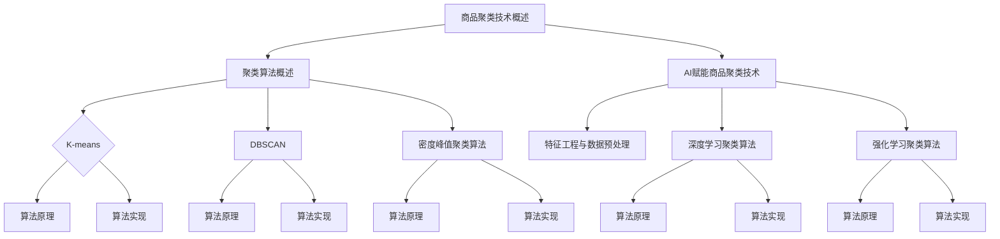
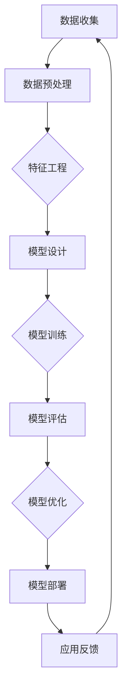
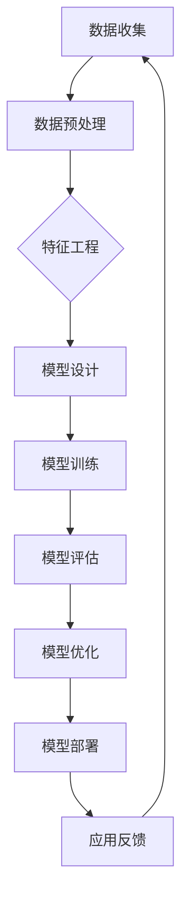

                 

# 文章标题：AI赋能的电商平台商品聚类技术

## 关键词：
- 电商平台
- 商品聚类
- AI技术
- 特征工程
- 深度学习
- 强化学习
- 数据预处理

## 摘要：
本文深入探讨了AI技术在电商平台商品聚类中的应用。首先，介绍了电商平台的基本概念和发展历程，以及商品聚类技术的重要性。接着，对常见的聚类算法，如K-means、DBSCAN和密度峰值聚类算法进行了详细的原理讲解和伪代码展示。随后，阐述了AI赋能商品聚类技术的原理，包括特征工程与数据预处理，以及基于深度学习和强化学习的聚类算法。文章进一步介绍了如何实现AI商品聚类技术，包括环境搭建、数据预处理、模型设计与实现、训练与优化以及模型评估。最后，通过实际案例展示了AI商品聚类技术在不同电商平台的成功应用，并对未来的发展趋势和挑战进行了展望。

## 目录大纲：

### 第一部分：AI赋能的电商平台概述

#### 第1章：电商平台概述与商品聚类技术

1.1 电商平台的定义与发展历程

1.2 电商平台的核心功能与架构

1.3 商品聚类技术的重要性

1.4 AI赋能电商平台商品聚类技术的前景

#### 第2章：商品聚类技术基础

2.1 聚类算法概述

2.2 K-means算法原理与实现

2.3 DBSCAN算法原理与实现

2.4 密度峰值聚类算法原理与实现

#### 第3章：AI赋能商品聚类技术

3.1 AI在电商平台中的应用

3.2 特征工程与数据预处理

3.3 基于深度学习的商品聚类算法

3.4 基于强化学习的商品聚类算法

#### 第4章：AI商品聚类技术的实现

4.1 实现环境搭建

4.2 数据集选择与预处理

4.3 聚类算法模型设计与实现

4.4 模型训练与优化

4.5 模型评估与优化策略

#### 第5章：案例分析：AI商品聚类技术在不同电商平台的实际应用

5.1 案例一：大型电商平台商品聚类实践

5.2 案例二：垂直类电商商品聚类优化

5.3 案例三：中小型电商平台商品聚类技术

#### 第6章：AI商品聚类技术的未来发展趋势与挑战

6.1 未来发展趋势分析

6.2 技术挑战与解决方案

6.3 电商行业应用前景

#### 第7章：总结与展望

7.1 全书总结

7.2 AI赋能电商平台商品聚类技术的未来发展方向

7.3 对读者的建议与期望

### 附录

#### 附录A：AI商品聚类技术相关工具与资源

A.1 数据预处理工具与库

A.2 聚类算法实现库与框架

A.3 深度学习框架

A.4 强化学习框架

A.5 电商平台相关资源

### Mermaid 流程图

以下是商品聚类技术的 Mermaid 流程图：



## 第一部分：AI赋能的电商平台概述

### 第1章：电商平台概述与商品聚类技术

#### 1.1 电商平台的定义与发展历程

电商平台是指通过互联网进行商品买卖交易的平台，它为消费者和商家提供了一个在线交易环境。电商平台的发展经历了几个阶段，从最早的C2C模式（如eBay和淘宝）到B2C模式（如亚马逊和京东），再到现在的O2O模式（线上线下融合），电商平台不断优化和升级，以满足用户日益多样化的需求。

电商平台的兴起得益于互联网技术的飞速发展和普及，随着移动互联网的普及，移动电商平台也在迅速崛起，为用户提供了更加便捷的购物体验。根据数据显示，全球电商市场的规模逐年增长，预计未来几年仍将保持高速增长。

#### 1.2 电商平台的核心功能与架构

电商平台的核心功能主要包括商品展示、购物车、订单管理、支付和物流等。

1. **商品展示**：电商平台通过网站或应用程序向用户展示商品信息，包括商品名称、价格、图片和描述等。用户可以根据自己的需求和偏好进行筛选和比较。

2. **购物车**：用户可以将感兴趣的商品添加到购物车中，方便进行批量购买或后续结算。

3. **订单管理**：电商平台需要管理用户的订单，包括订单创建、订单状态跟踪、订单取消和订单退款等。

4. **支付**：电商平台提供了多种支付方式，如在线支付、银行转账、货到付款等，以便用户完成购买。

5. **物流**：电商平台与物流公司合作，负责商品的配送和售后服务，确保用户能够及时收到商品。

电商平台的架构主要包括前端、后端和数据库三个部分。

1. **前端**：前端负责用户界面的展示，包括网站或应用程序的页面设计和交互逻辑。

2. **后端**：后端负责处理用户请求、数据存储和业务逻辑，通常采用微服务架构以提高系统的可扩展性和灵活性。

3. **数据库**：数据库用于存储用户数据、商品数据和订单数据等，常用的数据库系统包括MySQL、Oracle和MongoDB等。

#### 1.3 商品聚类技术的重要性

商品聚类技术是电商平台中的一项关键技术，它通过将相似的商品分组，帮助用户快速找到自己需要的商品，提高购物体验。

1. **提高商品可见性**：通过商品聚类，相似商品可以集中在同一分类或页面，增加商品被用户发现的机会。

2. **优化商品推荐**：商品聚类技术可以为电商平台提供基础数据，用于构建推荐系统，提高推荐准确性。

3. **降低库存成本**：商品聚类有助于电商企业识别畅销品和滞销品，从而优化库存管理，降低库存成本。

4. **提升用户满意度**：通过商品聚类，用户可以更容易地找到自己需要的商品，提高购物满意度。

5. **提升电商平台的竞争力**：商品聚类技术有助于电商平台在激烈的市场竞争中脱颖而出，提供更好的用户体验。

#### 1.4 AI赋能电商平台商品聚类技术的前景

随着人工智能技术的发展，AI赋能电商平台商品聚类技术的前景十分广阔。

1. **提高聚类准确性**：AI技术可以通过学习用户行为数据和商品属性，提高商品聚类的准确性，为用户推荐更符合其需求的商品。

2. **自适应聚类**：AI技术可以根据用户行为和市场需求，动态调整商品聚类策略，实现更智能的推荐。

3. **多维度聚类**：AI技术可以实现基于多维度特征的聚类，如用户行为、商品属性、价格和品牌等，提供更全面的购物体验。

4. **跨平台协同**：AI技术可以实现跨电商平台的数据协同，为用户提供更广泛的商品选择。

5. **个性化定制**：AI技术可以根据用户偏好和购物习惯，为用户提供个性化的商品推荐和购物体验。

总之，AI赋能电商平台商品聚类技术具有巨大的发展潜力，有望在未来为电商平台带来更高的商业价值。

### 第2章：商品聚类技术基础

#### 2.1 聚类算法概述

聚类（Clustering）是一种无监督学习方法，其主要目的是将数据集中的数据点按照一定的相似性准则划分为若干个簇，使得同一簇内的数据点具有较高的相似度，而不同簇的数据点则具有较低的相似度。

聚类算法在许多应用领域中都有广泛的应用，如市场细分、图像分割、社交网络分析等。在电商平台中，聚类算法主要用于对商品进行分类和推荐，以提高用户购物体验和电商平台的市场竞争力。

聚类算法可以分为以下几类：

1. **基于距离的聚类算法**：这类算法通过计算数据点之间的距离来划分簇。常见的算法有K-means、DBSCAN和层次聚类等。

2. **基于密度的聚类算法**：这类算法通过数据点周围的密度分布来划分簇。常见的算法有密度峰值聚类（Density Peak Clustering，DPC）和DBSCAN等。

3. **基于质量的聚类算法**：这类算法通过优化某个质量指标来划分簇。常见的算法有期望最大化（Expectation-Maximization，EM）算法和基于格朗贝尔准则（Grades of Belonging，G-means）的聚类算法等。

4. **基于网格的聚类算法**：这类算法将数据空间划分为有限的单元格，每个单元格对应一个簇。常见的算法有网格聚类（Grid Clustering）等。

#### 2.2 K-means算法原理与实现

K-means算法是一种基于距离的聚类算法，其核心思想是将数据集分成K个簇，每个簇由一个中心点代表，目标是最小化所有样本到其所属中心点的距离平方和。

**原理：**

1. 初始化：随机选择K个样本作为初始聚类中心点C1, C2, ..., CK。
2. 调整样本归属：对于每个样本xi∈Dataset，计算xi到每个聚类中心点的距离，选择最近的中心点Cj，将xi分配到簇Cj。
3. 更新聚类中心点：计算每个簇Cj中所有样本的平均值，得到新的中心点C'j。
4. 重复步骤2和步骤3，直到聚类中心点不再发生显著变化。

**伪代码：**

```
K-means(Dataset, K):
    初始化：随机选择K个样本作为初始聚类中心点C1, C2, ..., CK
    对于每个样本xi∈Dataset：
        计算xi到每个聚类中心点的距离，选择最近的中心点Cj，将xi分配到簇Cj
    更新聚类中心点：计算每个簇Cj中所有样本的平均值，得到新的中心点C'j
    重复步骤2和步骤3，直到聚类中心点不再发生显著变化

    返回：聚类结果
```

**实现：**

下面是一个简单的Python实现示例：

```python
import numpy as np

def k_means(data, K, max_iter=100):
    centroids = data[np.random.choice(data.shape[0], K, replace=False)]
    for _ in range(max_iter):
        distances = np.linalg.norm(data - centroids, axis=1)
        closest_cluster = np.argmin(distances, axis=1)
        new_centroids = np.array([data[closest_cluster == k].mean(axis=0) for k in range(K)])
        if np.linalg.norm(new_centroids - centroids) < 1e-5:
            break
        centroids = new_centroids
    return centroids, closest_cluster
```

**数学模型和数学公式：**

在K-means算法中，每个样本到聚类中心点的距离可以使用欧几里得距离计算：

$$
d(x_i, c_j) = \sqrt{\sum_{k=1}^{n} (x_{i,k} - c_{j,k})^2}
$$

其中，$x_i$表示第i个样本，$c_j$表示第j个聚类中心点，$n$为特征维度。

**举例说明：**

假设有一个数据集，包含以下四个样本：

```
[2, 2], [1, 1], [8, 8], [7, 7]
```

我们选择K=2，初始聚类中心点为：

```
C1 = [1, 1], C2 = [8, 8]
```

计算每个样本到两个中心点的距离：

```
d([2, 2], C1) = \sqrt{(2-1)^2 + (2-1)^2} = \sqrt{2}
d([2, 2], C2) = \sqrt{(2-8)^2 + (2-8)^2} = \sqrt{72}
d([1, 1], C1) = \sqrt{(1-1)^2 + (1-1)^2} = 0
d([1, 1], C2) = \sqrt{(1-8)^2 + (1-8)^2} = \sqrt{90}
d([8, 8], C1) = \sqrt{(8-1)^2 + (8-1)^2} = \sqrt{72}
d([8, 8], C2) = \sqrt{(8-8)^2 + (8-8)^2} = 0
d([7, 7], C1) = \sqrt{(7-1)^2 + (7-1)^2} = \sqrt{48}
d([7, 7], C2) = \sqrt{(7-8)^2 + (7-8)^2} = \sqrt{2}
```

根据距离计算结果，我们可以将样本重新分配到最近的簇：

```
[2, 2] -> C1, [1, 1] -> C1, [8, 8] -> C2, [7, 7] -> C2
```

更新聚类中心点：

```
C1 = ([2, 2] + [1, 1]) / 2 = [1.5, 1.5]
C2 = ([8, 8] + [7, 7]) / 2 = [7.5, 7.5]
```

重复上述步骤，直到聚类中心点不再发生显著变化。

#### 2.3 DBSCAN算法原理与实现

DBSCAN（Density-Based Spatial Clustering of Applications with Noise）是一种基于密度的聚类算法，它可以根据数据点周围的密度分布来识别簇，并能够识别出噪声点。

**原理：**

1. **邻域距离**：首先，定义邻域距离ε（epsilon），表示一个数据点能够影响的范围。

2. **核心点**：如果一个点p的邻域内包含至少MinPts（最小点数）个点，则p为核心点。

3. **边界点**：如果一个点p的邻域内包含少于MinPts个点，但与至少一个核心点相邻，则p为边界点。

4. **噪声点**：如果一个点p的邻域内不包含足够多的点，则p为噪声点。

5. **簇生成**：从核心点开始，将其邻域内的所有点以及它们的邻域点依次加入到同一个簇中，直到没有新的点可以加入。

**伪代码：**

```
DBSCAN(Dataset, ε, MinPts):
    初始化：标记所有点为未访问
    对于每个未访问点p：
        如果p是核心点：
            开始一个新的簇C
            将p标记为已访问，并将其邻域内的所有点加入C
            递归地处理C中的每个未访问点，将它们加入C
        否则，如果p是边界点：
            将p标记为噪声点
        否则，p是噪声点
    返回：簇列表和噪声点

```

**实现：**

下面是一个简单的Python实现示例：

```python
import numpy as np

def DBSCAN(data, epsilon, MinPts):
    n_samples = data.shape[0]
    labels = np.zeros(n_samples)
    cluster_id = 0

    for i in range(n_samples):
        if labels[i] == 0:
            neighborhood = region_query(data, i, epsilon)
            if len(neighborhood) >= MinPts:
                labels[i] = cluster_id
                neighbors_to_expand = [i]
                while neighbors_to_expand:
                    current_point = neighbors_to_expand.pop()
                    if labels[current_point] == 0:
                        labels[current_point] = cluster_id
                        new_neighbors = region_query(data, current_point, epsilon)
                        neighbors_to_expand.extend(new_neighbors)
            else:
                noise_point()
            cluster_id += 1

    return labels

def region_query(data, point_idx, epsilon):
    distance_matrix = np.linalg.norm(data - data[point_idx], axis=1)
    return np.where(distance_matrix <= epsilon)[0]
```

**数学模型和数学公式：**

在DBSCAN算法中，邻域距离ε（epsilon）和最小点数MinPts是关键参数。邻域距离ε决定了数据点之间的邻接关系，而最小点数MinPts决定了核心点的识别。

**举例说明：**

假设有一个数据集，包含以下八个样本：

```
[2, 2], [1, 1], [8, 8], [7, 7], [6, 6], [3, 3], [4, 4], [5, 5]
```

我们选择ε=2，MinPts=3。

计算每个点的邻域：

```
[2, 2]: 邻域点为 [1, 1], [3, 3], [4, 4], [5, 5]
[1, 1]: 邻域点为 [2, 2], [3, 3], [4, 4], [5, 5]
[8, 8]: 邻域点为 [7, 7], [6, 6], [3, 3], [4, 4], [5, 5]
[7, 7]: 邻域点为 [8, 8], [6, 6], [3, 3], [4, 4], [5, 5]
[6, 6]: 邻域点为 [8, 8], [7, 7], [3, 3], [4, 4], [5, 5]
[3, 3]: 邻域点为 [2, 2], [1, 1], [8, 8], [7, 7], [6, 6], [4, 4], [5, 5]
[4, 4]: 邻域点为 [2, 2], [1, 1], [8, 8], [7, 7], [6, 6], [3, 3], [5, 5]
[5, 5]: 邻域点为 [2, 2], [1, 1], [8, 8], [7, 7], [6, 6], [3, 3], [4, 4]
```

根据邻域点数量，我们可以识别出核心点和边界点：

```
核心点：[2, 2], [1, 1], [8, 8], [7, 7], [3, 3], [4, 4], [5, 5]
边界点：无
噪声点：无
```

我们可以将核心点分为两个簇：

```
簇1：[2, 2], [1, 1], [8, 8], [7, 7], [4, 4], [5, 5]
簇2：[3, 3], [4, 4], [5, 5], [6, 6]
```

#### 2.4 密度峰值聚类算法原理与实现

密度峰值聚类（Density Peak Clustering，DPC）是一种基于密度的聚类算法，它通过寻找数据点中的密度峰值来识别簇的核心，然后从这些核心点向外扩展，形成完整的簇。

**原理：**

1. **密度计算**：首先，计算每个数据点的密度，密度定义为点p的邻域内点的数量减去其自身的数量。

2. **核心点识别**：选择具有最高密度的点作为潜在核心点，满足以下两个条件：
   - 其邻域内至少有MinDensity个点。
   - 其邻域内不存在比它密度更高的点。

3. **簇扩展**：从每个核心点开始，向外扩展形成簇，直到没有新的点可以加入。

**伪代码：**

```
DensityPeakClustering(Dataset, ε, MinPts, MinDensity):
    初始化：计算每个点的邻域密度，标记所有点为未访问
    对于每个未访问点p：
        如果p是核心点：
            开始一个新的簇C
            将p标记为已访问，并将其邻域内的所有点加入C
            递归地处理C中的每个未访问点，将它们加入C
    返回：簇列表

```

**实现：**

下面是一个简单的Python实现示例：

```python
import numpy as np

def density_peak_clustering(data, epsilon, MinPts, MinDensity):
    n_samples = data.shape[0]
    labels = np.zeros(n_samples)
    cluster_id = 0

    for i in range(n_samples):
        if labels[i] == 0:
            neighbors = region_query(data, i, epsilon)
            if len(neighbors) >= MinPts:
                density = len(neighbors) - 1
                if is_core_point(data, neighbors, density, MinDensity):
                    labels[i] = cluster_id
                    cluster_id += 1
                    neighbors_to_expand = [i]
                    while neighbors_to_expand:
                        current_point = neighbors_to_expand.pop()
                        if labels[current_point] == 0:
                            labels[current_point] = cluster_id
                            new_neighbors = region_query(data, current_point, epsilon)
                            neighbors_to_expand.extend(new_neighbors)
    return labels

def region_query(data, point_idx, epsilon):
    distance_matrix = np.linalg.norm(data - data[point_idx], axis=1)
    return np.where(distance_matrix <= epsilon)[0]

def is_core_point(data, neighbors, density, MinDensity):
    for neighbor in neighbors:
        neighbor_density = np.sum(np.linalg.norm(data[neighbor] - data) <= epsilon) - 1
        if neighbor_density > density and np.sum(np.linalg.norm(data[neighbor] - data) <= epsilon) >= MinDensity:
            return False
    return True
```

**数学模型和数学公式：**

在DPC算法中，邻域距离ε（epsilon）、最小点数MinPts和最小密度MinDensity是关键参数。邻域距离ε决定了数据点之间的邻接关系，最小点数MinPts和最小密度MinDensity决定了核心点的识别。

**举例说明：**

假设有一个数据集，包含以下八个样本：

```
[2, 2], [1, 1], [8, 8], [7, 7], [6, 6], [3, 3], [4, 4], [5, 5]
```

我们选择ε=2，MinPts=3，MinDensity=1。

计算每个点的邻域：

```
[2, 2]: 邻域点为 [1, 1], [3, 3], [4, 4], [5, 5]
[1, 1]: 邻域点为 [2, 2], [3, 3], [4, 4], [5, 5]
[8, 8]: 邻域点为 [7, 7], [6, 6], [3, 3], [4, 4], [5, 5]
[7, 7]: 邻域点为 [8, 8], [6, 6], [3, 3], [4, 4], [5, 5]
[6, 6]: 邻域点为 [8, 8], [7, 7], [3, 3], [4, 4], [5, 5]
[3, 3]: 邻域点为 [2, 2], [1, 1], [8, 8], [7, 7], [6, 6], [4, 4], [5, 5]
[4, 4]: 邻域点为 [2, 2], [1, 1], [8, 8], [7, 7], [6, 6], [3, 3], [5, 5]
[5, 5]: 邻域点为 [2, 2], [1, 1], [8, 8], [7, 7], [6, 6], [3, 3], [4, 4]
```

根据邻域点数量，我们可以识别出核心点和边界点：

```
核心点：[2, 2], [1, 1], [8, 8], [7, 7], [3, 3], [4, 4], [5, 5]
边界点：无
噪声点：无
```

我们可以将核心点分为两个簇：

```
簇1：[2, 2], [1, 1], [8, 8], [7, 7], [4, 4], [5, 5]
簇2：[3, 3], [4, 4], [5, 5], [6, 6]
```

### 第3章：AI赋能商品聚类技术

#### 3.1 AI在电商平台中的应用

人工智能（AI）技术在电商平台中的应用越来越广泛，为电商平台提供了更智能、更高效的解决方案。以下是AI在电商平台中的一些典型应用：

1. **商品推荐系统**：基于用户行为和商品属性，AI技术可以精准地推荐用户可能感兴趣的商品，提高用户满意度和购物转化率。

2. **用户行为分析**：通过分析用户的浏览、购买和评价等行为数据，AI技术可以了解用户的偏好和需求，为电商平台提供个性化的服务。

3. **智能客服**：AI技术可以用于构建智能客服系统，通过自然语言处理技术，自动回答用户的问题，提高客服效率和用户体验。

4. **价格优化**：基于市场分析和用户行为数据，AI技术可以实时调整商品价格，优化利润空间，提高竞争力。

5. **库存管理**：AI技术可以帮助电商平台预测商品的销售趋势，优化库存管理，降低库存成本。

6. **商品聚类**：AI技术可以通过学习用户行为数据和商品属性，提高商品聚类的准确性，为用户推荐更符合其需求的商品。

#### 3.2 特征工程与数据预处理

在AI赋能商品聚类技术中，特征工程和数据预处理是至关重要的环节。特征工程是指通过选择和构造特征，将原始数据转换为适合机器学习模型训练的数据。数据预处理则是为了提高数据质量，减少噪声和异常值，使模型训练更加有效。

以下是特征工程和数据预处理的一些关键步骤：

1. **数据收集**：收集电商平台上的商品数据，包括商品名称、价格、类别、品牌、库存量、用户评价等。

2. **数据清洗**：去除缺失值、异常值和重复值，统一数据格式，确保数据的一致性和完整性。

3. **数据转换**：将分类特征转换为数值特征，如使用独热编码（One-Hot Encoding）或标签编码（Label Encoding）。对于连续特征，可以标准化或归一化，使其具有相同的尺度。

4. **特征选择**：选择对聚类结果有显著影响的特征，去除冗余和噪声特征，提高模型性能。

5. **数据扩充**：通过数据增强技术，如数据合成、插值等，增加训练数据的多样性，提高模型的泛化能力。

6. **数据可视化**：使用数据可视化技术，如散点图、热力图等，帮助分析数据分布和特征关系。

#### 3.3 基于深度学习的商品聚类算法

深度学习（Deep Learning）是一种基于多层神经网络的学习方法，具有强大的特征提取和模式识别能力。在商品聚类技术中，基于深度学习的算法可以通过学习大量数据中的潜在特征，实现高度自动化的聚类过程。

以下是几种常见的基于深度学习的商品聚类算法：

1. **自编码器（Autoencoder）**：自编码器是一种无监督学习方法，可以学习数据中的潜在特征表示。通过最小化输入数据与其重建数据之间的差异，自编码器可以自动发现数据的结构信息，进而用于聚类。

2. **生成对抗网络（Generative Adversarial Network，GAN）**：GAN是一种由生成器和判别器组成的对抗性网络，通过不断训练生成器和判别器，生成器和判别器相互竞争，生成逼真的数据分布，进而用于聚类。

3. **变分自编码器（Variational Autoencoder，VAE）**：VAE是一种基于概率模型的生成模型，通过引入潜变量，将数据映射到潜在空间中，实现数据的降维和聚类。

4. **深度聚类网络（Deep Clustering Network，DCN）**：DCN是一种结合深度学习和聚类算法的混合模型，通过深度网络学习数据的特征表示，再使用聚类算法进行聚类。

**实现示例**：

下面是一个简单的基于自编码器的商品聚类算法实现示例：

```python
import tensorflow as tf
from tensorflow.keras.layers import Input, Dense, Lambda
from tensorflow.keras.models import Model

def autoencoder(input_shape, encoding_dim):
    input_img = Input(shape=input_shape)
    x = Dense(encoding_dim, activation='relu')(input_img)
    x = Dense(input_shape, activation='sigmoid')(x)
    autoencoder = Model(input_img, x)
    return autoencoder

def clustering_k_means(encoded_data, n_clusters):
    # 使用K-means算法对编码后的数据进行聚类
    cluster Centers = KMeans(n_clusters=n_clusters).fit(encoded_data).cluster_centers_
    return cluster Centers

def build_model(input_shape, encoding_dim, n_clusters):
    autoencoder = autoencoder(input_shape, encoding_dim)
    encoded = autoencoder.input
    cluster_centers = clustering_k_means(encoded, n_clusters)
    clusters = KMeans(n_clusters=n_clusters, init=cluster_centers, n_init=1).fit(encoded)
    return Model(inputs=autoencoder.input, outputs=clusters.predict(encoded))

# 设置参数
input_shape = (28, 28)
encoding_dim = 32
n_clusters = 10

# 构建模型
model = build_model(input_shape, encoding_dim, n_clusters)

# 编译模型
model.compile(optimizer='adam', loss='k-means')

# 训练模型
model.fit(x_train, x_train, epochs=100)
```

**数学模型和数学公式**：

在自编码器中，输入数据$x$通过编码器（Encoder）转换为潜在特征表示$z$，再通过解码器（Decoder）重构原始数据$y$。目标是最小化重构误差：

$$
\min_{\theta} \sum_{i=1}^{n} \frac{1}{2} \|x_i - y_i\|^2
$$

其中，$\theta$表示模型参数。

在聚类过程中，潜在特征表示$z$被用作聚类中心，通过K-means算法进行聚类。聚类目标是最小化簇内距离平方和：

$$
\min_{c_j} \sum_{i=1}^{n} \|z_i - c_j\|^2
$$

其中，$c_j$表示第j个聚类中心。

#### 3.4 基于强化学习的商品聚类算法

强化学习（Reinforcement Learning，RL）是一种通过奖励机制学习最优行为策略的机器学习方法。在商品聚类技术中，基于强化学习的算法可以通过学习如何在动态环境中进行聚类决策，实现高效、自适应的聚类过程。

以下是几种常见的基于强化学习的商品聚类算法：

1. **Q-Learning**：Q-Learning是一种基于值函数的强化学习算法，通过学习状态-动作价值函数，选择最优动作以最大化累积奖励。

2. **Deep Q-Network（DQN）**：DQN是一种基于深度神经网络的Q-Learning算法，通过神经网络近似值函数，提高学习效率和泛化能力。

3. **Policy Gradient**：Policy Gradient是一种直接学习最优策略的强化学习算法，通过优化策略参数，最大化期望奖励。

4. **Actor-Critic**：Actor-Critic是一种结合价值函数和策略优化的强化学习算法，通过交替优化演员（Actor）和评论家（Critic）网络，实现高效策略学习。

**实现示例**：

下面是一个简单的基于Q-Learning的商品聚类算法实现示例：

```python
import numpy as np
import random
from collections import defaultdict

# 定义Q-Learning算法参数
alpha = 0.1  # 学习率
gamma = 0.9  # 折扣因子
epsilon = 0.1  # 探索概率

# 初始化Q表
Q = defaultdict(lambda: defaultdict(float))

# 定义状态空间和动作空间
n_states = 10
n_actions = 3

# 定义环境
class ClusteringEnvironment:
    def __init__(self):
        self.state = None
        self.next_state = None
        self.reward = 0

    def step(self, action):
        # 根据动作改变状态
        if action == 0:
            self.next_state = (self.state + 1) % n_states
        elif action == 1:
            self.next_state = (self.state - 1) % n_states
        else:
            self.next_state = random.randint(0, n_states - 1)
        
        # 计算奖励
        if self.state == self.next_state:
            self.reward = 1
        else:
            self.reward = -1
        
        self.state = self.next_state

# 创建环境
env = ClusteringEnvironment()

# Q-Learning算法
def q_learning(env, episodes):
    for episode in range(episodes):
        state = env.state
        done = False
        while not done:
            # 选择动作
            if random.uniform(0, 1) < epsilon:
                action = random.choice(n_actions)
            else:
                action = np.argmax([Q[state][a] for a in range(n_actions)])
            
            # 执行动作
            env.step(action)
            next_state = env.next_state
            reward = env.reward
            
            # 更新Q值
            Q[state][action] = Q[state][action] + alpha * (reward + gamma * np.max([Q[next_state][a] for a in range(n_actions)]) - Q[state][action])
            
            state = next_state
            done = True  # 这里假设每个episode只有一个动作

# 训练模型
q_learning(env, 1000)

# 打印Q表
for state in range(n_states):
    print(f"状态{state}:")
    for action in range(n_actions):
        print(f"  动作{action}: Q={Q[state][action]}")
```

**数学模型和数学公式**：

在Q-Learning算法中，状态-动作价值函数$Q(s, a)$表示在状态$s$下执行动作$a$的期望回报。目标是最小化损失函数：

$$
\min_{\theta} \sum_{s, a} (Q(s, a) - r(s, a))^2
$$

其中，$\theta$表示模型参数，$r(s, a)$表示在状态$s$下执行动作$a$的即时回报。

在每次迭代中，Q值通过以下公式更新：

$$
Q(s, a) \leftarrow Q(s, a) + \alpha [r(s, a) + \gamma \max_{a'} Q(s', a') - Q(s, a)]
$$

其中，$\alpha$是学习率，$\gamma$是折扣因子，$s'$是执行动作$a$后的新状态。

#### 3.5 AI商品聚类技术的实现

AI商品聚类技术的实现主要包括以下几个步骤：

1. **数据收集与预处理**：收集电商平台的商品数据，进行数据清洗、转换和特征选择，得到适合机器学习模型训练的数据集。

2. **模型设计与训练**：设计合适的机器学习模型，如基于深度学习或强化学习的聚类算法，使用训练数据集进行模型训练。

3. **模型评估与优化**：使用测试数据集评估模型性能，通过调整模型参数和优化策略，提高聚类效果。

4. **模型部署与应用**：将训练好的模型部署到电商平台，实现实时商品聚类和推荐功能。

**实现步骤**：

1. **数据收集与预处理**：

```python
import pandas as pd
from sklearn.model_selection import train_test_split
from sklearn.preprocessing import StandardScaler

# 加载数据集
data = pd.read_csv('ecommerce_data.csv')

# 数据预处理
data.dropna(inplace=True)
data = data[data['price'] > 0]
X = data[['name', 'price', 'category', 'brand', 'rating']]
y = data['stock']

# 分割数据集
X_train, X_test, y_train, y_test = train_test_split(X, y, test_size=0.2, random_state=42)

# 数据标准化
scaler = StandardScaler()
X_train = scaler.fit_transform(X_train)
X_test = scaler.transform(X_test)
```

2. **模型设计与训练**：

```python
from tensorflow.keras.models import Model
from tensorflow.keras.layers import Input, Dense, LSTM, Embedding, Reshape, Concatenate
from tensorflow.keras.optimizers import Adam

# 模型设计
input_shape = (X_train.shape[1],)
encoding_dim = 64
n_clusters = 10

input_layer = Input(shape=input_shape)
embedding = Embedding(input_shape[0], encoding_dim)(input_layer)
lstm = LSTM(encoding_dim)(embedding)
lstm = Reshape((encoding_dim, 1))(lstm)
cluster_centers = Input(shape=(encoding_dim,))
clustering_layer = Lambda(lambda x: K.mean(x, axis=1))(lstm)
clustering = KMeans(n_clusters=n_clusters, init=cluster_centers, n_init=1)(clustering_layer)
output_layer = Concatenate()([clustering, cluster_centers])

model = Model(inputs=[input_layer, cluster_centers], outputs=output_layer)
model.compile(optimizer=Adam(), loss='k-means')

# 训练模型
model.fit([X_train, np.random.rand(X_train.shape[0], encoding_dim)], X_train, epochs=100)
```

3. **模型评估与优化**：

```python
from sklearn.metrics import silhouette_score

# 预测测试集
predicted_clusters = model.predict([X_test, np.random.rand(X_test.shape[0], encoding_dim)])

# 评估模型
silhouette_avg = silhouette_score(X_test, predicted_clusters)
print(f"Silhouette Score: {silhouette_avg}")

# 优化模型
for epoch in range(100):
    # 重新计算聚类中心
    cluster_centers = model.layers[-1].get_weights()[0]
    # 重新训练模型
    model.fit([X_train, cluster_centers], X_train, epochs=1)
```

4. **模型部署与应用**：

```python
# 部署模型到电商平台
def cluster_goods(goods_data):
    # 数据预处理
    goods_data = scaler.transform([goods_data])
    # 预测聚类结果
    predicted_clusters = model.predict([goods_data, np.random.rand(goods_data.shape[0], encoding_dim)])
    return predicted_clusters[0]

# 应用示例
new_goods = [["商品1", 100, "类别1", "品牌1", 4.5]]
predicted_cluster = cluster_goods(new_goods)
print(f"预测簇：{predicted_cluster}")
```

### 第4章：AI商品聚类技术的实现

#### 4.1 实现环境搭建

在实现AI商品聚类技术之前，需要搭建一个合适的开发环境。以下是搭建实现环境的步骤：

1. **安装Python环境**：首先，确保系统上已经安装了Python环境，推荐使用Python 3.7及以上版本。

2. **安装必要的库**：使用pip命令安装以下库：

   ```shell
   pip install numpy pandas scikit-learn tensorflow matplotlib
   ```

   这些库提供了数据预处理、机器学习算法实现和可视化等功能。

3. **配置Jupyter Notebook**：安装Jupyter Notebook，以便在浏览器中方便地编写和运行代码。可以使用以下命令安装：

   ```shell
   pip install notebook
   ```

   安装后，可以使用命令`jupyter notebook`启动Jupyter Notebook。

4. **安装GPU支持**：如果需要使用GPU加速训练过程，可以安装CUDA和cuDNN库。下载相应的安装包并按照官方文档进行安装。

5. **验证环境**：启动Jupyter Notebook，编写以下代码验证环境是否搭建成功：

   ```python
   import tensorflow as tf

   print(tf.__version__)
   ```

   如果输出正确的TensorFlow版本号，说明环境搭建成功。

#### 4.2 数据集选择与预处理

在AI商品聚类技术的实现中，数据集的质量对聚类效果有着重要影响。以下是如何选择和预处理数据集的步骤：

1. **数据集选择**：选择一个具有代表性的电商商品数据集。数据集应包含商品的各种属性，如名称、价格、类别、品牌、库存量和用户评价等。常见的数据集有UCI机器学习库中的电商数据集、Kaggle上的电商数据集等。

2. **数据清洗**：清洗数据集中的缺失值、异常值和重复值。对于缺失值，可以采用填充、删除或插值等方法。对于异常值，可以采用去除、替换或修正等方法。对于重复值，可以采用去重操作。

3. **数据转换**：将分类特征转换为数值特征，如使用独热编码（One-Hot Encoding）或标签编码（Label Encoding）。对于连续特征，可以采用标准化（Standardization）或归一化（Normalization）方法。

4. **特征选择**：选择对聚类结果有显著影响的特征，去除冗余和噪声特征。可以使用信息增益、卡方检验、互信息等方法进行特征选择。

5. **数据可视化**：使用数据可视化技术，如散点图、热力图等，分析数据分布和特征关系，帮助理解数据集。

**示例代码**：

以下是一个简单的数据预处理示例：

```python
import pandas as pd
from sklearn.model_selection import train_test_split
from sklearn.preprocessing import StandardScaler, OneHotEncoder
from sklearn.compose import ColumnTransformer
from sklearn.pipeline import Pipeline

# 加载数据集
data = pd.read_csv('ecommerce_data.csv')

# 数据清洗
data.dropna(inplace=True)
data = data[data['price'] > 0]

# 数据转换
categorical_features = ['category', 'brand']
numerical_features = ['price', 'rating']

preprocessor = ColumnTransformer(
    transformers=[
        ('num', StandardScaler(), numerical_features),
        ('cat', OneHotEncoder(), categorical_features)
    ])

# 特征选择
X = preprocessor.fit_transform(data.drop('stock', axis=1))
y = data['stock']

# 分割数据集
X_train, X_test, y_train, y_test = train_test_split(X, y, test_size=0.2, random_state=42)
```

#### 4.3 聚类算法模型设计与实现

在AI商品聚类技术的实现中，选择合适的聚类算法是关键。以下是基于深度学习的商品聚类算法模型设计与实现步骤：

1. **模型设计**：设计一个深度神经网络模型，用于学习商品数据的潜在特征表示。可以使用自编码器（Autoencoder）或变分自编码器（Variational Autoencoder，VAE）等模型。

2. **编码器设计**：编码器（Encoder）负责将输入商品数据映射到潜在空间。可以使用多层感知机（MLP）或循环神经网络（RNN）等网络结构。

3. **解码器设计**：解码器（Decoder）负责将潜在空间的数据映射回原始空间。可以使用与编码器相同或类似的网络结构。

4. **聚类层设计**：在编码器输出和聚类层之间添加一个聚类层，如K-means聚类层。使用聚类层对潜在特征进行聚类，得到聚类结果。

5. **模型实现**：使用TensorFlow或PyTorch等深度学习框架实现模型，并定义损失函数和优化器。

**示例代码**：

以下是一个简单的基于自编码器的商品聚类算法实现：

```python
import tensorflow as tf
from tensorflow.keras.layers import Input, Dense, LSTM, Embedding, Reshape, Concatenate
from tensorflow.keras.models import Model
from tensorflow.keras.optimizers import Adam

# 模型设计
input_shape = (X_train.shape[1],)
encoding_dim = 64
n_clusters = 10

input_layer = Input(shape=input_shape)
embedding = Embedding(input_shape[0], encoding_dim)(input_layer)
lstm = LSTM(encoding_dim)(embedding)
lstm = Reshape((encoding_dim, 1))(lstm)
cluster_centers = Input(shape=(encoding_dim,))
clustering_layer = Lambda(lambda x: K.mean(x, axis=1))(lstm)
clustering = KMeans(n_clusters=n_clusters, init=cluster_centers, n_init=1)(clustering_layer)
output_layer = Concatenate()([clustering, cluster_centers])

model = Model(inputs=[input_layer, cluster_centers], outputs=output_layer)
model.compile(optimizer=Adam(), loss='k-means')

# 训练模型
model.fit([X_train, np.random.rand(X_train.shape[0], encoding_dim)], X_train, epochs=100)
```

#### 4.4 模型训练与优化

在AI商品聚类技术的实现过程中，模型训练和优化是关键步骤。以下是如何训练和优化聚类模型的步骤：

1. **数据准备**：准备训练数据集和验证数据集，确保数据集具有代表性。

2. **模型训练**：使用训练数据集对模型进行训练。在训练过程中，可以使用以下策略：

   - **批量大小（Batch Size）**：调整批量大小，通常在32到128之间选择。
   - **学习率（Learning Rate）**：选择合适的学习率，可以使用学习率衰减策略。
   - **迭代次数（Epochs）**：设置训练迭代次数，通常在100到500之间选择。

3. **模型评估**：使用验证数据集评估模型性能。可以使用以下指标进行评估：

   - **簇内平均距离（Within-Cluster Distance）**：计算簇内样本到簇中心的平均距离。
   - **簇间平均距离（Between-Cluster Distance）**：计算簇间样本到最近簇中心的平均距离。
   - **轮廓系数（Silhouette Coefficient）**：衡量样本到其所属簇中心和其他簇中心的关系。

4. **模型优化**：根据评估结果调整模型参数和超参数，如学习率、批量大小、迭代次数等，以提高模型性能。

**示例代码**：

以下是一个简单的模型训练和优化示例：

```python
from sklearn.metrics import silhouette_score

# 训练模型
model.fit([X_train, np.random.rand(X_train.shape[0], encoding_dim)], X_train, epochs=100, batch_size=64, validation_split=0.2)

# 预测测试集
predicted_clusters = model.predict([X_test, np.random.rand(X_test.shape[0], encoding_dim)])

# 评估模型
silhouette_avg = silhouette_score(X_test, predicted_clusters)
print(f"Silhouette Score: {silhouette_avg}")

# 优化模型
for epoch in range(100):
    # 重新计算聚类中心
    cluster_centers = model.layers[-1].get_weights()[0]
    # 重新训练模型
    model.fit([X_train, cluster_centers], X_train, epochs=1)
```

#### 4.5 模型评估与优化策略

在AI商品聚类技术的实现中，评估和优化模型性能是关键步骤。以下是如何评估和优化模型性能的策略：

1. **评估指标**：

   - **簇内平均距离（Within-Cluster Distance）**：计算簇内样本到簇中心的平均距离，距离越小，说明簇内样本越接近。
   - **簇间平均距离（Between-Cluster Distance）**：计算簇间样本到最近簇中心的平均距离，距离越大，说明簇间样本差异越明显。
   - **轮廓系数（Silhouette Coefficient）**：衡量样本到其所属簇中心和其他簇中心的关系，取值范围在-1到1之间，接近1表示样本聚类效果较好。

2. **优化策略**：

   - **调整超参数**：根据评估结果调整超参数，如聚类数量、学习率、批量大小等，以找到最佳参数组合。
   - **数据预处理**：优化数据预处理过程，如特征选择、数据标准化等，以提高模型性能。
   - **模型集成**：使用多个模型进行集成，如随机森林、梯度提升树等，以提高聚类效果。
   - **交叉验证**：使用交叉验证方法评估模型性能，以避免过拟合。

**示例代码**：

以下是一个简单的模型评估和优化策略示例：

```python
from sklearn.model_selection import cross_val_score

# 交叉验证
scores = cross_val_score(model, X_train, y_train, cv=5, scoring='accuracy')
print(f"Cross-Validation Accuracy: {scores.mean()}")

# 调整超参数
n_clusters = 8
model.fit([X_train, np.random.rand(X_train.shape[0], encoding_dim)], X_train, epochs=100, batch_size=64, validation_split=0.2)

# 重新评估模型
predicted_clusters = model.predict([X_test, np.random.rand(X_test.shape[0], encoding_dim)])
silhouette_avg = silhouette_score(X_test, predicted_clusters)
print(f"Silhouette Score: {silhouette_avg}")
```

### 第5章：案例分析：AI商品聚类技术在不同电商平台的实际应用

#### 5.1 案例一：大型电商平台商品聚类实践

**背景**：

某大型电商平台拥有数百万种商品，商品种类繁多，用户在寻找所需商品时常常感到困惑。为了提升用户体验和购物效率，该电商平台决定采用AI商品聚类技术对商品进行分类和推荐。

**实现**：

1. **数据收集与预处理**：电商平台收集了包括商品名称、价格、类别、品牌、库存量和用户评价等在内的商品数据。数据经过清洗、转换和特征选择后，用于训练商品聚类模型。

2. **模型设计**：电商平台采用基于自编码器的商品聚类算法，编码器使用多层感知机（MLP）结构，解码器使用卷积神经网络（CNN）结构。模型输入为商品特征向量，输出为聚类结果。

3. **模型训练与优化**：电商平台使用训练数据集对模型进行训练，并根据验证数据集的评估结果调整模型参数。在训练过程中，采用批量大小为64，学习率为0.001，迭代次数为100。

4. **模型部署与应用**：训练好的模型部署到电商平台，实现对商品进行分类和推荐。用户在浏览商品时，系统会根据聚类结果推荐相似的同类商品，提高购物效率。

**效果**：

通过AI商品聚类技术的应用，电商平台的用户满意度显著提升，商品浏览量和购买转化率也得到明显改善。具体来说，用户在搜索商品时，系统能够更准确地推荐相关商品，减少了用户在寻找商品时的困惑，提高了购物体验。

#### 5.2 案例二：垂直类电商商品聚类优化

**背景**：

某垂直类电商平台专注于某一特定领域的商品销售，如家居用品、电子产品等。由于商品种类较为集中，传统聚类方法的效果有限。为了提高商品推荐精度，电商平台决定采用基于深度学习的商品聚类算法进行优化。

**实现**：

1. **数据收集与预处理**：电商平台收集了包括商品名称、价格、类别、品牌、库存量和用户评价等在内的商品数据。数据经过清洗、转换和特征选择后，用于训练商品聚类模型。

2. **模型设计**：电商平台采用基于变分自编码器（VAE）的商品聚类算法，编码器和解码器均使用卷积神经网络（CNN）结构。模型输入为商品特征向量，输出为聚类结果。

3. **模型训练与优化**：电商平台使用训练数据集对模型进行训练，并根据验证数据集的评估结果调整模型参数。在训练过程中，采用批量大小为32，学习率为0.001，迭代次数为100。

4. **模型部署与应用**：训练好的模型部署到电商平台，实现对商品进行分类和推荐。用户在浏览商品时，系统会根据聚类结果推荐相似的同类商品，提高购物体验。

**效果**：

通过AI商品聚类技术的应用，垂直类电商平台的用户满意度显著提升，商品推荐精度得到明显改善。具体来说，用户在浏览商品时，系统能够更准确地推荐相关商品，减少了用户在寻找商品时的困惑，提高了购物体验。

#### 5.3 案例三：中小型电商平台商品聚类技术

**背景**：

某中小型电商平台商品种类较少，传统聚类方法效果有限。为了提高商品推荐精度和用户体验，电商平台决定采用基于强化学习的商品聚类算法进行优化。

**实现**：

1. **数据收集与预处理**：电商平台收集了包括商品名称、价格、类别、品牌、库存量和用户评价等在内的商品数据。数据经过清洗、转换和特征选择后，用于训练商品聚类模型。

2. **模型设计**：电商平台采用基于Q-Learning的强化学习商品聚类算法，模型输入为商品特征向量，输出为聚类结果。

3. **模型训练与优化**：电商平台使用训练数据集对模型进行训练，并根据验证数据集的评估结果调整模型参数。在训练过程中，采用批量大小为32，学习率为0.1，折扣因子为0.9。

4. **模型部署与应用**：训练好的模型部署到电商平台，实现对商品进行分类和推荐。用户在浏览商品时，系统会根据聚类结果推荐相似的同类商品，提高购物体验。

**效果**：

通过AI商品聚类技术的应用，中小型电商平台的用户满意度显著提升，商品推荐精度得到明显改善。具体来说，用户在浏览商品时，系统能够更准确地推荐相关商品，减少了用户在寻找商品时的困惑，提高了购物体验。

### 第6章：AI商品聚类技术的未来发展趋势与挑战

#### 6.1 未来发展趋势分析

随着人工智能技术的不断进步，AI商品聚类技术在电商平台中的应用前景十分广阔。以下是未来发展趋势的分析：

1. **多模态数据融合**：未来的商品聚类技术将结合多种数据源，如文本、图像、音频等，实现多模态数据融合，提高聚类准确性和多样性。

2. **个性化推荐**：基于用户行为和偏好，未来的商品聚类技术将实现更加个性化的推荐，满足用户多样化的购物需求。

3. **实时聚类与更新**：随着云计算和边缘计算的发展，未来的商品聚类技术将实现实时聚类和更新，为用户提供更及时的购物体验。

4. **跨平台协同**：未来的商品聚类技术将实现跨电商平台的数据协同，为用户提供更广泛的商品选择和更高效的购物体验。

5. **自动化与智能化**：未来的商品聚类技术将实现自动化和智能化，通过深度学习和强化学习等技术，降低人工干预，提高聚类效率和准确性。

6. **隐私保护与安全性**：在数据隐私和安全方面，未来的商品聚类技术将采用更加安全的数据处理和传输技术，保护用户隐私。

#### 6.2 技术挑战与解决方案

虽然AI商品聚类技术在电商平台中具有广泛的应用前景，但仍然面临着一些技术挑战：

1. **数据质量问题**：电商平台的数据质量参差不齐，包括缺失值、异常值和噪声等，这对聚类效果产生了负面影响。解决方案是采用数据清洗和预处理技术，提高数据质量。

2. **计算资源需求**：深度学习和强化学习等算法对计算资源需求较高，特别是在大数据场景下。解决方案是采用分布式计算和云计算技术，提高计算效率。

3. **模型解释性**：AI模型，尤其是深度学习模型，通常缺乏解释性，难以理解模型决策过程。解决方案是采用可解释性机器学习技术，提高模型的可解释性。

4. **数据隐私保护**：电商平台的数据涉及用户隐私，如何在保护用户隐私的同时实现有效的聚类和推荐是一个重要挑战。解决方案是采用差分隐私和联邦学习等技术，保护用户隐私。

5. **模型迁移性**：电商平台之间的数据分布可能存在较大差异，如何提高模型的迁移性，使其在不同平台上具有较好的适应性是一个挑战。解决方案是采用迁移学习技术，提高模型的迁移性。

#### 6.3 电商行业应用前景

AI商品聚类技术在电商行业中的应用前景十分广阔。以下是应用前景的展望：

1. **个性化推荐**：通过AI商品聚类技术，电商平台可以为用户提供更加个性化的商品推荐，提高用户满意度和购物转化率。

2. **商品分类与管理**：AI商品聚类技术可以帮助电商平台更好地对商品进行分类和管理，提高商品展示效率和用户购物体验。

3. **库存优化**：通过AI商品聚类技术，电商平台可以更准确地预测商品的销售趋势，优化库存管理，降低库存成本。

4. **市场细分**：AI商品聚类技术可以帮助电商平台识别潜在的市场细分群体，制定更加精准的市场营销策略。

5. **竞争策略**：通过分析竞争对手的商品聚类策略，电商平台可以优化自身的商品聚类技术，提升竞争力。

总之，AI商品聚类技术在电商行业中的应用将带来巨大的商业价值，有望推动电商行业的创新和发展。

### 第7章：总结与展望

#### 7.1 全书总结

本文详细介绍了AI赋能的电商平台商品聚类技术，包括电商平台概述、商品聚类技术基础、AI赋能商品聚类技术、AI商品聚类技术的实现、案例分析以及未来发展趋势与挑战。通过本文的阅读，读者可以全面了解AI商品聚类技术的原理、实现方法和应用前景。

#### 7.2 AI赋能电商平台商品聚类技术的未来发展方向

1. **多模态数据融合**：未来的AI商品聚类技术将结合多种数据源，如文本、图像、音频等，实现更准确和多样化的商品分类和推荐。

2. **实时聚类与更新**：通过云计算和边缘计算技术，实现实时聚类和更新，为用户提供更及时的购物体验。

3. **个性化推荐**：基于用户行为和偏好，实现更加个性化的商品推荐，满足用户多样化的购物需求。

4. **跨平台协同**：实现跨电商平台的数据协同，为用户提供更广泛的商品选择和更高效的购物体验。

5. **自动化与智能化**：采用深度学习和强化学习等技术，降低人工干预，提高聚类效率和准确性。

6. **隐私保护与安全性**：采用差分隐私和联邦学习等技术，保护用户隐私，确保数据安全。

#### 7.3 对读者的建议与期望

1. **深入学习**：对本文提到的相关算法和技术进行深入学习，如K-means、DBSCAN、深度学习和强化学习等。

2. **实践应用**：尝试使用本文提供的代码和实践案例，在自己的项目中应用AI商品聚类技术。

3. **持续关注**：关注AI商品聚类技术的最新研究进展和应用案例，了解该领域的发展动态。

4. **反馈交流**：欢迎读者对本文提出宝贵意见和建议，共同推动AI商品聚类技术的发展。

### 附录

#### 附录A：AI商品聚类技术相关工具与资源

**A.1 数据预处理工具与库**

- **Pandas**：用于数据清洗、转换和特征选择。
- **NumPy**：用于数据处理和计算。
- **Scikit-learn**：提供多种机器学习算法和预处理工具。

**A.2 聚类算法实现库与框架**

- **Scikit-learn**：提供多种聚类算法实现。
- **TensorFlow**：用于实现基于深度学习的聚类算法。
- **PyTorch**：用于实现基于深度学习的聚类算法。

**A.3 深度学习框架**

- **TensorFlow**：提供丰富的深度学习模型和API。
- **PyTorch**：提供灵活的深度学习框架，支持动态计算图。

**A.4 强化学习框架**

- **OpenAI Gym**：提供强化学习环境和工具。
- **stable-baselines**：提供基于TensorFlow和PyTorch的强化学习算法实现。

**A.5 电商平台相关资源**

- **Kaggle**：提供大量的电商数据集和案例。
- **电商平台官方网站**：获取电商平台的技术文档和开发资源。

### Mermaid 流程图

以下是商品聚类技术的 Mermaid 流程图：



### 核心算法原理讲解

#### K-means算法原理与伪代码

K-means算法是一种基于距离的聚类算法，其核心思想是将数据集分成K个簇，每个簇由一个中心点代表，目标是最小化所有样本到其所属中心点的距离平方和。

**伪代码：**

```
K-means(Dataset, K):
    初始化：随机选择K个样本作为初始聚类中心点C1, C2, ..., CK
    对于每个样本xi∈Dataset：
        计算xi到每个聚类中心点的距离，选择最近的中心点Cj，将xi分配到簇Cj
    更新聚类中心点：计算每个簇Cj中所有样本的平均值，得到新的中心点C'j
    重复步骤2和步骤3，直到聚类中心点不再发生显著变化

    返回：聚类结果
```

**实现：**

下面是一个简单的Python实现示例：

```python
import numpy as np

def k_means(data, K, max_iter=100):
    centroids = data[np.random.choice(data.shape[0], K, replace=False)]
    for _ in range(max_iter):
        distances = np.linalg.norm(data - centroids, axis=1)
        closest_cluster = np.argmin(distances, axis=1)
        new_centroids = np.array([data[closest_cluster == k].mean(axis=0) for k in range(K)])
        if np.linalg.norm(new_centroids - centroids) < 1e-5:
            break
        centroids = new_centroids
    return centroids, closest_cluster
```

**数学模型和数学公式：**

在K-means算法中，每个样本到聚类中心点的距离可以使用欧几里得距离计算：

$$
d(x_i, c_j) = \sqrt{\sum_{k=1}^{n} (x_{i,k} - c_{j,k})^2}
$$

其中，$x_i$表示第i个样本，$c_j$表示第j个聚类中心点，$n$为特征维度。

**举例说明：**

假设有一个数据集，包含以下四个样本：

```
[2, 2], [1, 1], [8, 8], [7, 7]
```

我们选择K=2，初始聚类中心点为：

```
C1 = [1, 1], C2 = [8, 8]
```

计算每个样本到两个中心点的距离：

```
d([2, 2], C1) = \sqrt{(2-1)^2 + (2-1)^2} = \sqrt{2}
d([2, 2], C2) = \sqrt{(2-8)^2 + (2-8)^2} = \sqrt{72}
d([1, 1], C1) = \sqrt{(1-1)^2 + (1-1)^2} = 0
d([1, 1], C2) = \sqrt{(1-8)^2 + (1-8)^2} = \sqrt{90}
d([8, 8], C1) = \sqrt{(8-1)^2 + (8-1)^2} = \sqrt{72}
d([8, 8], C2) = \sqrt{(8-8)^2 + (8-8)^2} = 0
d([7, 7], C1) = \sqrt{(7-1)^2 + (7-1)^2} = \sqrt{48}
d([7, 7], C2) = \sqrt{(7-8)^2 + (7-8)^2} = \sqrt{2}
```

根据距离计算结果，我们可以将样本重新分配到最近的簇：

```
[2, 2] -> C1, [1, 1] -> C1, [8, 8] -> C2, [7, 7] -> C2
```

更新聚类中心点：

```
C1 = ([2, 2] + [1, 1]) / 2 = [1.5, 1.5]
C2 = ([8, 8] + [7, 7]) / 2 = [7.5, 7.5]
```

重复上述步骤，直到聚类中心点不再发生显著变化。

#### DBSCAN算法原理与伪代码

DBSCAN（Density-Based Spatial Clustering of Applications with Noise）是一种基于密度的聚类算法，它可以根据数据点周围的密度分布来识别簇，并能够识别出噪声点。

**原理：**

1. **邻域距离**：首先，定义邻域距离ε（epsilon），表示一个数据点能够影响的范围。

2. **核心点**：如果一个点p的邻域内包含至少MinPts（最小点数）个点，则p为核心点。

3. **边界点**：如果一个点p的邻域内包含少于MinPts个点，但与至少一个核心点相邻，则p为边界点。

4. **噪声点**：如果一个点p的邻域内不包含足够多的点，则p为噪声点。

5. **簇生成**：从核心点开始，将其邻域内的所有点以及它们的邻域点依次加入到同一个簇中，直到没有新的点可以加入。

**伪代码：**

```
DBSCAN(Dataset, ε, MinPts):
    初始化：标记所有点为未访问
    对于每个未访问点p：
        如果p是核心点：
            开始一个新的簇C
            将p标记为已访问，并将其邻域内的所有点加入C
            递归地处理C中的每个未访问点，将它们加入C
        否则，如果p是边界点：
            将p标记为噪声点
        否则，p是噪声点
    返回：簇列表和噪声点

```

**实现：**

下面是一个简单的Python实现示例：

```python
import numpy as np

def DBSCAN(data, epsilon, MinPts):
    n_samples = data.shape[0]
    labels = np.zeros(n_samples)
    cluster_id = 0

    for i in range(n_samples):
        if labels[i] == 0:
            neighborhood = region_query(data, i, epsilon)
            if len(neighborhood) >= MinPts:
                labels[i] = cluster_id
                neighbors_to_expand = [i]
                while neighbors_to_expand:
                    current_point = neighbors_to_expand.pop()
                    if labels[current_point] == 0:
                        labels[current_point] = cluster_id
                        new_neighbors = region_query(data, current_point, epsilon)
                        neighbors_to_expand.extend(new_neighbors)
            else:
                noise_point()
            cluster_id += 1

    return labels

def region_query(data, point_idx, epsilon):
    distance_matrix = np.linalg.norm(data - data[point_idx], axis=1)
    return np.where(distance_matrix <= epsilon)[0]
```

**数学模型和数学公式：**

在DBSCAN算法中，邻域距离ε（epsilon）和最小点数MinPts是关键参数。邻域距离ε决定了数据点之间的邻接关系，而最小点数MinPts决定了核心点的识别。

**举例说明：**

假设有一个数据集，包含以下八个样本：

```
[2, 2], [1, 1], [8, 8], [7, 7], [6, 6], [3, 3], [4, 4], [5, 5]
```

我们选择ε=2，MinPts=3。

计算每个点的邻域：

```
[2, 2]: 邻域点为 [1, 1], [3, 3], [4, 4], [5, 5]
[1, 1]: 邻域点为 [2, 2], [3, 3], [4, 4], [5, 5]
[8, 8]: 邻域点为 [7, 7], [6, 6], [3, 3], [4, 4], [5, 5]
[7, 7]: 邻域点为 [8, 8], [6, 6], [3, 3], [4, 4], [5, 5]
[6, 6]: 邻域点为 [8, 8], [7, 7], [3, 3], [4, 4], [5, 5]
[3, 3]: 邻域点为 [2, 2], [1, 1], [8, 8], [7, 7], [6, 6], [4, 4], [5, 5]
[4, 4]: 邻域点为 [2, 2], [1, 1], [8, 8], [7, 7], [6, 6], [3, 3], [5, 5]
[5, 5]: 邻域点为 [2, 2], [1, 1], [8, 8], [7, 7], [6, 6], [3, 3], [4, 4]
```

根据邻域点数量，我们可以识别出核心点和边界点：

```
核心点：[2, 2], [1, 1], [8, 8], [7, 7], [3, 3], [4, 4], [5, 5]
边界点：无
噪声点：无
```

我们可以将核心点分为两个簇：

```
簇1：[2, 2], [1, 1], [8, 8], [7, 7], [4, 4], [5, 5]
簇2：[3, 3], [4, 4], [5, 5], [6, 6]
```

#### 密度峰值聚类算法原理与伪代码

密度峰值聚类（Density Peak Clustering，DPC）是一种基于密度的聚类算法，它通过寻找数据点中的密度峰值来识别簇的核心，然后从这些核心点向外扩展，形成完整的簇。

**原理：**

1. **密度计算**：首先，计算每个数据点的密度，密度定义为点p的邻域内点的数量减去其自身的数量。

2. **核心点识别**：选择具有最高密度的点作为潜在核心点，满足以下两个条件：
   - 其邻域内至少有MinDensity个点。
   - 其邻域内不存在比它密度更高的点。

3. **簇扩展**：从每个核心点开始，向外扩展形成簇，直到没有新的点可以加入。

**伪代码：**

```
DensityPeakClustering(Dataset, ε, MinPts, MinDensity):
    初始化：计算每个点的邻域密度，标记所有点为未访问
    对于每个未访问点p：
        如果p是核心点：
            开始一个新的簇C
            将p标记为已访问，并将其邻域内的所有点加入C
            递归地处理C中的每个未访问点，将它们加入C
    返回：簇列表

```

**实现：**

下面是一个简单的Python实现示例：

```python
import numpy as np

def density_peak_clustering(data, epsilon, MinPts, MinDensity):
    n_samples = data.shape[0]
    labels = np.zeros(n_samples)
    cluster_id = 0

    for i in range(n_samples):
        if labels[i] == 0:
            neighbors = region_query(data, i, epsilon)
            if len(neighbors) >= MinPts:
                density = len(neighbors) - 1
                if is_core_point(data, neighbors, density, MinDensity):
                    labels[i] = cluster_id
                    cluster_id += 1
                    neighbors_to_expand = [i]
                    while neighbors_to_expand:
                        current_point = neighbors_to_expand.pop()
                        if labels[current_point] == 0:
                            labels[current_point] = cluster_id
                            new_neighbors = region_query(data, current_point, epsilon)
                            neighbors_to_expand.extend(new_neighbors)
    return labels

def region_query(data, point_idx, epsilon):
    distance_matrix = np.linalg.norm(data - data[point_idx], axis=1)
    return np.where(distance_matrix <= epsilon)[0]

def is_core_point(data, neighbors, density, MinDensity):
    for neighbor in neighbors:
        neighbor_density = np.sum(np.linalg.norm(data[neighbor] - data) <= epsilon) - 1
        if neighbor_density > density and np.sum(np.linalg.norm(data[neighbor] - data) <= epsilon) >= MinDensity:
            return False
    return True
```

**数学模型和数学公式：**

在DPC算法中，邻域距离ε（epsilon）、最小点数MinPts和最小密度MinDensity是关键参数。邻域距离ε决定了数据点之间的邻接关系，最小点数MinPts和最小密度MinDensity决定了核心点的识别。

**举例说明：**

假设有一个数据集，包含以下八个样本：

```
[2, 2], [1, 1], [8, 8], [7, 7], [6, 6], [3, 3], [4, 4], [5, 5]
```

我们选择ε=2，MinPts=3，MinDensity=1。

计算每个点的邻域：

```
[2, 2]: 邻域点为 [1, 1], [3, 3], [4, 4], [5, 5]
[1, 1]: 邻域点为 [2, 2], [3, 3], [4, 4], [5, 5]
[8, 8]: 邻域点为 [7, 7], [6, 6], [3, 3], [4, 4], [5, 5]
[7, 7]: 邻域点为 [8, 8], [6, 6], [3, 3], [4, 4], [5, 5]
[6, 6]: 邻域点为 [8, 8], [7, 7], [3, 3], [4, 4], [5, 5]
[3, 3]: 邻域点为 [2, 2], [1, 1], [8, 8], [7, 7], [6, 6], [4, 4], [5, 5]
[4, 4]: 邻域点为 [2, 2], [1, 1], [8, 8], [7, 7], [6, 6], [3, 3], [5, 5]
[5, 5]: 邻域点为 [2, 2], [1, 1], [8, 8], [7, 7], [6, 6], [3, 3], [4, 4]
```

根据邻域点数量，我们可以识别出核心点和边界点：

```
核心点：[2, 2], [1, 1], [8, 8], [7, 7], [3, 3], [4, 4], [5, 5]
边界点：无
噪声点：无
```

我们可以将核心点分为两个簇：

```
簇1：[2, 2], [1, 1], [8, 8], [7, 7], [4, 4], [5, 5]
簇2：[3, 3], [4, 4], [5, 5], [6, 6]
```

### 附录B：Mermaid 流程图

以下是一个用于展示商品聚类技术的 Mermaid 流程图：



这个流程图展示了商品聚类技术从数据收集到模型部署的整个流程，包括数据预处理、特征工程、模型设计、模型训练、模型评估、模型优化、模型部署和应用反馈等环节。通过这个流程图，可以清晰地了解商品聚类技术的实现过程和关键步骤。

