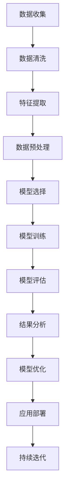
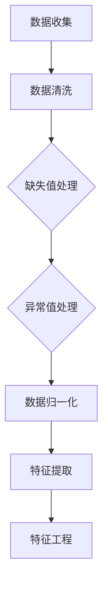

                 

### 《AI赋能的电商平台用户生命周期价值预测》

> 关键词：AI赋能、电商平台、用户生命周期、价值预测、机器学习、深度学习、算法优化、项目实战

> 摘要：本文围绕AI赋能电商平台用户生命周期价值预测这一主题，详细介绍了用户生命周期价值预测的基本概念、核心算法原理、数据预处理与特征工程方法，以及模型评估与优化技巧。通过实际项目实战和案例研究，展示了AI技术在电商平台用户生命周期价值预测中的强大应用效果，为电商平台提供了科学的决策支持，促进了商业模式的优化和创新。

----------------------------------------------------------------

### 《AI赋能的电商平台用户生命周期价值预测》目录大纲

#### 第一部分：背景与概念

- 第1章：电商平台用户生命周期概述
  - 1.1 电商平台用户生命周期定义
  - 1.2 用户生命周期对电商平台的重要性
  - 1.3 用户生命周期价值的计算方法
  - 1.4 AI技术在用户生命周期管理中的应用

- 第2章：AI赋能电商平台用户生命周期管理
  - 2.1 AI技术概述
  - 2.2 电商平台用户数据分析
  - 2.3 用户行为模式识别
  - 2.4 用户个性化推荐系统

#### 第二部分：核心算法原理

- 第3章：用户生命周期价值预测算法
  - 3.1 用户生命周期价值预测模型
    - 3.1.1 财务指标与非财务指标
    - 3.1.2 生命周期价值预测模型架构
  - 3.2 机器学习算法应用
    - 3.2.1 逻辑回归
    - 3.2.2 决策树与随机森林
    - 3.2.3 支持向量机
  - 3.3 深度学习算法应用
    - 3.3.1 卷积神经网络
    - 3.3.2 循环神经网络
    - 3.3.3 长短期记忆网络

- 第4章：数据预处理与特征工程
  - 4.1 数据预处理方法
    - 4.1.1 缺失值处理
    - 4.1.2 异常值处理
    - 4.1.3 数据归一化与标准化
  - 4.2 特征工程
    - 4.2.1 用户特征提取
    - 4.2.2 时间序列特征提取
    - 4.2.3 交叉特征提取

- 第5章：模型评估与优化
  - 5.1 模型评估指标
    - 5.1.1 准确率、召回率、F1值
    - 5.1.2 AUC-ROC曲线
    - 5.1.3 模型评估流程
  - 5.2 模型优化方法
    - 5.2.1 过拟合与欠拟合
    - 5.2.2 模型调参技巧
    - 5.2.3 模型集成与优化

#### 第三部分：项目实战

- 第6章：电商平台用户生命周期价值预测项目实战
  - 6.1 项目背景与目标
  - 6.2 数据集介绍
  - 6.3 数据预处理与特征工程
  - 6.4 模型构建与训练
  - 6.5 模型评估与优化
  - 6.6 结果分析

- 第7章：AI赋能电商平台用户生命周期价值预测案例研究
  - 7.1 案例一：基于深度学习算法的用户生命周期价值预测
    - 7.1.1 模型架构与实现
    - 7.1.2 结果分析
  - 7.2 案例二：基于集成学习的用户生命周期价值预测
    - 7.2.1 模型架构与实现
    - 7.2.2 结果分析

#### 第四部分：展望与结论

- 第8章：AI赋能电商平台用户生命周期价值预测的展望
  - 8.1 未来的发展趋势
  - 8.2 面临的挑战与机遇
  - 8.3 未来研究方向

- 第9章：总结与展望
  - 9.1 本书主要贡献
  - 9.2 本书局限性
  - 9.3 未来研究方向与展望

#### 附录

- 附录A：工具与资源
  - A.1 Python数据处理与建模工具
  - A.2 常用机器学习库与框架
  - A.3 数据集获取与处理资源

- 附录B：Mermaid流程图
  - B.1 用户生命周期价值预测流程
  - B.2 数据预处理与特征工程流程

- 附录C：代码示例
  - C.1 逻辑回归模型实现
  - C.2 卷积神经网络模型实现

- 附录D：参考文献
  - D.1 相关书籍与论文
  - D.2 在线资源与资料链接

----------------------------------------------------------------

#### 第一部分：背景与概念

### 第1章：电商平台用户生命周期概述

#### 1.1 电商平台用户生命周期定义

电商平台用户生命周期是指用户从首次接触电商平台开始，到最终离开平台的整个过程。通常包括以下几个阶段：

1. **新用户获取**：通过各种渠道吸引新用户，如广告、社交媒体推广、线下活动等。
2. **新用户注册**：用户在电商平台完成注册过程，成为平台的正式用户。
3. **活跃用户阶段**：用户在平台上进行浏览、购买、评价等行为，保持活跃状态。
4. **休眠用户阶段**：用户在一段时间内未进行任何活跃行为，但仍然有潜力重新激活。
5. **流失用户阶段**：用户在一段时间内不再访问平台，被认为是流失用户。

#### 1.2 用户生命周期对电商平台的重要性

用户生命周期对电商平台具有重要意义，主要体现在以下几个方面：

1. **提高用户留存率**：通过分析用户生命周期，电商平台可以识别出哪些用户有较高流失风险，并采取相应措施进行挽回，提高用户留存率。
2. **优化资源配置**：了解用户生命周期可以帮助电商平台合理分配资源，如广告投放、促销活动等，提高营销效果。
3. **提升用户体验**：通过用户生命周期分析，电商平台可以提供个性化服务，满足用户需求，提升用户体验。
4. **指导产品优化**：用户生命周期数据可以为电商平台提供产品优化方向，如改进购物流程、优化推荐算法等。

#### 1.3 用户生命周期价值的计算方法

用户生命周期价值（Customer Lifetime Value，CLV）是指用户在整个生命周期内为平台带来的总收益。计算方法如下：

1. **单一收益法**：用户生命周期价值 = 每次购买的平均收益 × 预期购买次数
2. **现金流折现法**：用户生命周期价值 = 每次购买的平均收益 × 预期购买次数 × 折现系数
3. **多指标综合法**：用户生命周期价值 = （购买次数 × 购买金额 × 用户忠诚度 × 用户口碑）× 折现系数

#### 1.4 AI技术在用户生命周期管理中的应用

AI技术为电商平台用户生命周期管理提供了强大支持，主要体现在以下几个方面：

1. **用户行为预测**：通过分析用户历史行为数据，AI技术可以预测用户的行为模式，帮助电商平台提前识别潜在流失用户。
2. **个性化推荐**：基于用户兴趣和行为，AI技术可以提供个性化推荐，提高用户满意度和购买转化率。
3. **精准营销**：AI技术可以帮助电商平台实现精准营销，通过分析用户特征和需求，制定有针对性的营销策略。
4. **智能客服**：AI技术可以实现智能客服，自动解答用户问题，提高客服效率和服务质量。
5. **风险控制**：AI技术可以帮助电商平台识别欺诈行为，降低风险损失。

#### 1.5 小结

用户生命周期是电商平台运营的核心指标之一，通过AI技术赋能，可以实现对用户生命周期的全面分析和管理，提高用户留存率和商业价值。接下来，我们将进一步探讨AI技术在电商平台用户生命周期管理中的具体应用。

----------------------------------------------------------------

### 第2章：AI赋能电商平台用户生命周期管理

#### 2.1 AI技术概述

AI（人工智能）是计算机科学的一个分支，旨在开发能够模拟、延伸和扩展人类智能的技术。AI技术主要包括机器学习、深度学习、自然语言处理、计算机视觉等。在电商平台用户生命周期管理中，AI技术的应用主要体现在以下几个方面：

1. **用户行为分析**：通过机器学习和深度学习算法，分析用户在平台上的行为数据，挖掘用户兴趣和行为模式。
2. **个性化推荐**：基于用户兴趣和行为数据，利用协同过滤、基于内容的推荐等技术，为用户提供个性化推荐。
3. **精准营销**：通过分析用户特征和需求，制定有针对性的营销策略，提高营销效果。
4. **智能客服**：利用自然语言处理技术，实现智能客服，提高客服效率和服务质量。
5. **风险控制**：通过计算机视觉和图像识别技术，识别欺诈行为，降低风险损失。

#### 2.2 电商平台用户数据分析

电商平台用户数据分析是AI赋能用户生命周期管理的基础。通过对用户行为、交易、评价等数据进行深入挖掘和分析，可以揭示用户需求、偏好和潜在风险。具体方法包括：

1. **用户行为分析**：分析用户在平台上的浏览、购买、评价等行为，挖掘用户兴趣和行为模式。
2. **用户画像**：通过分析用户数据，构建用户画像，包括性别、年龄、地域、消费偏好等。
3. **关联分析**：分析用户之间的关联关系，识别潜在用户群体和推荐目标用户。
4. **趋势分析**：分析用户行为和交易数据的趋势，预测未来用户行为和需求变化。

#### 2.3 用户行为模式识别

用户行为模式识别是电商平台用户生命周期管理的关键环节。通过机器学习和深度学习算法，可以识别用户在平台上的行为模式，为个性化推荐、精准营销等提供支持。具体方法包括：

1. **聚类分析**：将具有相似行为的用户划分为同一群体，为个性化推荐和精准营销提供基础。
2. **关联规则挖掘**：分析用户行为之间的关联关系，挖掘潜在购买关联，为推荐和营销提供依据。
3. **时间序列分析**：分析用户行为的时间序列特征，预测用户未来的行为和需求。
4. **异常检测**：识别异常行为和潜在风险用户，为风险控制和安全管理提供支持。

#### 2.4 用户个性化推荐系统

用户个性化推荐系统是电商平台用户生命周期管理的重要组成部分。通过分析用户行为和兴趣数据，为用户提供个性化的商品、服务和内容推荐，提高用户满意度和购买转化率。具体方法包括：

1. **协同过滤**：基于用户的历史行为和偏好，为用户推荐相似用户的喜爱商品。
2. **基于内容的推荐**：基于商品的特征信息，为用户推荐与历史行为相关的商品。
3. **混合推荐**：结合协同过滤和基于内容的推荐方法，提高推荐效果。
4. **深度学习推荐**：利用深度学习算法，如循环神经网络（RNN）、卷积神经网络（CNN）等，构建复杂的多层推荐模型，提高推荐效果。

#### 2.5 小结

AI技术在电商平台用户生命周期管理中发挥着重要作用，通过用户数据分析、行为模式识别和个性化推荐系统，可以实现对用户生命的全面管理和优化。接下来，我们将探讨用户生命周期价值预测的核心算法原理。

----------------------------------------------------------------

### 第3章：用户生命周期价值预测算法

#### 3.1 用户生命周期价值预测模型

用户生命周期价值预测是电商平台运营的核心任务之一，旨在预测用户在整个生命周期内为平台带来的总收益。这一过程涉及到多个关键环节，包括财务指标和非财务指标的确定、预测模型的架构设计等。

##### 3.1.1 财务指标与非财务指标

在用户生命周期价值预测中，财务指标和非财务指标都是关键因素。财务指标主要包括：

1. **购买金额**：用户在平台上的累计购买金额，反映用户的消费能力。
2. **购买频率**：用户在平台上的购买频率，反映用户的活跃度。
3. **复购率**：用户在一定时间内的复购次数，反映用户的忠诚度。

非财务指标则包括：

1. **用户停留时间**：用户在平台上的停留时间，反映用户的兴趣度。
2. **评论数量与质量**：用户在平台上的评论数量和质量，反映用户的满意度和口碑。
3. **互动行为**：用户在平台上的互动行为，如点赞、分享等，反映用户的活跃度。

这些指标共同构成了用户生命周期价值预测的基础数据。

##### 3.1.2 生命周期价值预测模型架构

用户生命周期价值预测模型通常采用以下架构：

1. **特征工程**：根据用户数据，提取关键特征，包括财务指标和非财务指标，并进行预处理，如归一化、标准化等。
2. **模型选择**：选择适当的机器学习算法，如逻辑回归、决策树、支持向量机等，构建预测模型。
3. **模型训练与验证**：使用历史数据训练模型，并通过交叉验证方法评估模型的性能。
4. **模型部署与应用**：将训练好的模型部署到生产环境中，对用户生命周期价值进行实时预测。

#### 3.2 机器学习算法应用

在用户生命周期价值预测中，机器学习算法的应用至关重要。以下是几种常用的机器学习算法及其特点：

##### 3.2.1 逻辑回归

逻辑回归是一种经典的概率预测模型，适用于二分类问题。其基本原理是通过线性组合特征变量，得到一个预测值，然后通过逻辑函数将其转换为概率。

伪代码如下：

```
def logistic_regression(X, y):
    # X: 特征矩阵，y: 标签向量
    # 梯度下降算法训练模型
    # 计算损失函数
    # 更新参数
    return model
```

逻辑回归的优点是计算简单、易于实现，但缺点是对于非线性关系表现较差。

##### 3.2.2 决策树与随机森林

决策树是一种基于树的分类算法，通过递归划分特征空间，将数据划分为多个子集。随机森林则是基于决策树构建的集成学习方法，通过随机选取特征和样本子集，生成多个决策树，并取它们的平均值作为最终预测结果。

伪代码如下：

```
def decision_tree(X, y):
    # X: 特征矩阵，y: 标签向量
    # 递归划分特征空间
    return tree

def random_forest(X, y, n_trees):
    # X: 特征矩阵，y: 标签向量，n_trees: 树的数量
    # 生成多个决策树
    # 取平均值作为最终预测结果
    return forest
```

决策树和随机森林的优点是直观易懂、易于解释，但缺点是容易过拟合。

##### 3.2.3 支持向量机

支持向量机是一种基于间隔最大的分类算法，通过寻找最优超平面，将不同类别的数据点最大化分离。

伪代码如下：

```
def support_vector_machine(X, y):
    # X: 特征矩阵，y: 标签向量
    # 求解最优超平面
    # 计算分类间隔
    return model
```

支持向量机的优点是分类效果好，但缺点是计算复杂度高。

#### 3.3 深度学习算法应用

随着数据量的增加和计算能力的提升，深度学习算法在用户生命周期价值预测中的应用越来越广泛。以下是几种常见的深度学习算法：

##### 3.3.1 卷积神经网络

卷积神经网络（CNN）是一种基于卷积操作的深度学习算法，适用于图像识别、文本分类等问题。在用户生命周期价值预测中，CNN可以用于特征提取和分类。

伪代码如下：

```
def convolutional_neural_network(X, y):
    # X: 特征矩阵，y: 标签向量
    # 定义卷积层、池化层、全连接层
    # 训练模型
    return model
```

CNN的优点是能够自动提取特征，但缺点是参数量较大、训练时间较长。

##### 3.3.2 循环神经网络

循环神经网络（RNN）是一种基于循环结构的深度学习算法，适用于序列数据处理。在用户生命周期价值预测中，RNN可以用于处理时间序列数据。

伪代码如下：

```
def recurrent_neural_network(X, y):
    # X: 特征矩阵，y: 标签向量
    # 定义输入层、隐藏层、输出层
    # 训练模型
    return model
```

RNN的优点是能够处理变长序列，但缺点是梯度消失和梯度爆炸问题。

##### 3.3.3 长短期记忆网络

长短期记忆网络（LSTM）是RNN的一种变体，通过引入门控机制，解决了RNN的梯度消失和梯度爆炸问题。在用户生命周期价值预测中，LSTM可以用于处理时间序列数据。

伪代码如下：

```
def long_short_term_memory(X, y):
    # X: 特征矩阵，y: 标签向量
    # 定义输入层、隐藏层、输出层
    # 训练模型
    return model
```

LSTM的优点是能够处理长序列依赖，但缺点是参数量较大、计算复杂度高。

#### 3.4 小结

用户生命周期价值预测是电商平台运营的核心任务，通过机器学习和深度学习算法，可以实现对用户生命周期价值的准确预测。本章介绍了用户生命周期价值预测的基本概念、核心算法原理，以及财务指标和非财务指标的计算方法。下一章将讨论数据预处理与特征工程方法。

----------------------------------------------------------------

### 第4章：数据预处理与特征工程

#### 4.1 数据预处理方法

数据预处理是用户生命周期价值预测的重要环节，其目的是提高数据质量，减少噪声，使数据更适合于后续分析和建模。以下是几种常见的数据预处理方法：

##### 4.1.1 缺失值处理

在用户生命周期价值预测中，缺失值是常见问题。处理缺失值的方法包括：

1. **删除缺失值**：删除含有缺失值的样本或特征，适用于缺失值较多的情况。
2. **填充缺失值**：使用统计方法或专家知识填充缺失值，如均值、中位数、最频繁值等。

##### 4.1.2 异常值处理

异常值可能对模型性能产生负面影响，因此需要处理。异常值处理方法包括：

1. **删除异常值**：删除异常值样本或特征，适用于异常值较多的情况。
2. **变换异常值**：对异常值进行变换，使其符合正常数据分布，如使用离群点检测方法。
3. **保留异常值**：对于部分重要的异常值，可以保留并进行分析。

##### 4.1.3 数据归一化与标准化

数据归一化和标准化是使数据具有相同量纲和范围的过程，有助于提高模型性能。常见的归一化方法包括：

1. **最小-最大归一化**：将数据缩放到[0, 1]区间。
2. **Z-score标准化**：将数据缩放到均值为0，标准差为1的区间。

##### 4.1.4 数据清洗

数据清洗是数据预处理的重要步骤，包括去除重复数据、纠正数据错误等。数据清洗有助于提高数据质量，确保分析结果的准确性。

#### 4.2 特征工程

特征工程是数据预处理的关键环节，旨在提取有助于预测的特征，提高模型性能。以下是几种常见的特征工程方法：

##### 4.2.1 用户特征提取

用户特征提取是用户生命周期价值预测的核心任务，包括：

1. **用户基础信息**：如年龄、性别、地域等。
2. **用户行为特征**：如浏览次数、购买次数、评价数量等。
3. **用户消费特征**：如购买金额、购买频率、复购率等。

##### 4.2.2 时间序列特征提取

时间序列特征提取是处理用户行为时间序列数据的方法，包括：

1. **时间窗口特征**：将用户行为序列划分为固定长度的时间窗口，提取窗口内的统计特征，如均值、标准差、最大值等。
2. **滑动窗口特征**：对用户行为序列进行滑动窗口分析，提取窗口内的特征。
3. **序列模式挖掘**：使用序列模式挖掘算法，如Apriori算法、FP-growth算法，提取用户行为序列中的频繁模式。

##### 4.2.3 交叉特征提取

交叉特征提取是通过组合不同特征，生成新的特征，提高模型性能的方法。交叉特征提取方法包括：

1. **特征组合**：将不同特征进行组合，如用户年龄和地域的组合。
2. **特征交互**：通过计算特征之间的交互项，生成新的特征，如年龄和购买频率的交互项。

#### 4.3 小结

数据预处理与特征工程是用户生命周期价值预测的重要组成部分，通过合理的预处理和特征工程方法，可以有效地提高模型性能。下一章将讨论模型评估与优化方法。

----------------------------------------------------------------

### 第5章：模型评估与优化

#### 5.1 模型评估指标

模型评估是用户生命周期价值预测的重要环节，通过评估指标来衡量模型性能，确保预测结果的准确性和可靠性。以下是几种常见的模型评估指标：

##### 5.1.1 准确率、召回率、F1值

准确率（Accuracy）是评估分类模型性能的基本指标，表示正确分类的样本数占总样本数的比例。其计算公式为：

$$
Accuracy = \frac{TP + TN}{TP + FN + FP + TN}
$$

其中，TP为真实为正类且被正确预测为正类的样本数，TN为真实为负类且被正确预测为负类的样本数，FN为真实为正类但被错误预测为负类的样本数，FP为真实为负类但被错误预测为正类的样本数。

召回率（Recall）表示正确预测为正类的样本数占实际正类样本数的比例。其计算公式为：

$$
Recall = \frac{TP}{TP + FN}
$$

F1值（F1 Score）是准确率和召回率的调和平均值，用于平衡两者之间的差异。其计算公式为：

$$
F1 Score = 2 \times \frac{Precision \times Recall}{Precision + Recall}
$$

其中，Precision表示正确预测为正类的样本数占预测为正类的样本数比例。

##### 5.1.2 AUC-ROC曲线

AUC-ROC曲线（Area Under the Receiver Operating Characteristic Curve）是评估二分类模型性能的重要指标。ROC曲线通过调整分类阈值，计算真阳性率（True Positive Rate，TPR）和假阳性率（False Positive Rate，FPR）的曲线。AUC值表示曲线下的面积，用于衡量模型区分能力。AUC值范围在0到1之间，AUC值越大，模型性能越好。

##### 5.1.3 模型评估流程

模型评估流程通常包括以下步骤：

1. **数据划分**：将数据集划分为训练集、验证集和测试集，用于模型训练、验证和测试。
2. **模型训练**：使用训练集数据训练模型，得到模型参数。
3. **模型验证**：使用验证集数据评估模型性能，调整模型参数。
4. **模型测试**：使用测试集数据测试模型性能，确保模型泛化能力。

#### 5.2 模型优化方法

模型优化是提高模型性能的重要手段，通过优化模型参数、调整模型结构等方法，可以提升模型预测效果。以下是几种常见的模型优化方法：

##### 5.2.1 过拟合与欠拟合

过拟合（Overfitting）是指模型在训练集上表现良好，但在验证集或测试集上表现较差，即模型对训练数据“过度拟合”。欠拟合（Underfitting）是指模型在训练集和验证集上表现均较差，即模型过于简单，无法捕捉数据中的复杂关系。

##### 5.2.2 模型调参技巧

模型调参是优化模型性能的关键步骤，包括以下几种方法：

1. **网格搜索（Grid Search）**：通过遍历预设的参数组合，选择最优参数组合。
2. **随机搜索（Random Search）**：从预设的参数空间中随机选择参数组合，减少搜索时间。
3. **贝叶斯优化（Bayesian Optimization）**：基于贝叶斯统计模型，优化参数搜索过程。

##### 5.2.3 模型集成与优化

模型集成是将多个模型组合在一起，提高预测性能的方法。常见的模型集成方法包括：

1. **Bagging**：通过构建多个基模型，对基模型的输出进行投票或平均，提高整体预测性能。
2. **Boosting**：通过迭代训练多个基模型，每个基模型针对前一个模型的错误样本进行训练，提高整体预测性能。
3. **Stacking**：将多个模型作为基模型，构建一个新的模型对其进行预测，提高整体预测性能。

#### 5.3 小结

模型评估与优化是用户生命周期价值预测的重要环节，通过评估指标和优化方法，可以确保模型预测的准确性和可靠性。本章介绍了模型评估指标、模型优化方法以及过拟合与欠拟合的概念。下一章将讨论电商平台用户生命周期价值预测项目实战。

----------------------------------------------------------------

### 第6章：电商平台用户生命周期价值预测项目实战

#### 6.1 项目背景与目标

随着互联网的普及和电子商务的快速发展，电商平台在商业环境中扮演着越来越重要的角色。然而，电商平台的竞争日益激烈，如何提高用户留存率和增加用户价值成为企业关注的焦点。为此，本项目旨在利用AI技术，实现电商平台用户生命周期价值预测，从而为企业提供科学的决策支持。

##### 项目目标：

1. **提高用户留存率**：通过预测用户流失风险，采取有针对性的挽回措施，提高用户留存率。
2. **优化资源配置**：根据用户生命周期价值预测结果，合理分配广告投放、促销活动等资源，提高营销效果。
3. **提升用户体验**：通过个性化推荐和精准营销，满足用户需求，提升用户体验。

#### 6.2 数据集介绍

本项目采用公开的电商平台用户数据集，包括以下特征：

1. **用户基础信息**：年龄、性别、地域等。
2. **用户行为特征**：浏览次数、购买次数、购买金额、评价数量等。
3. **用户消费特征**：购买频率、复购率、购买渠道等。

数据集共有10000条记录，部分数据示例如下：

```
| 用户ID | 年龄 | 性别 | 地域 | 浏览次数 | 购买次数 | 购买金额 | 评价数量 | 流失标志 |
|--------|------|------|------|----------|----------|----------|----------|----------|
| 1      | 25   | 男   | 北京  | 30       | 10       | 500      | 10       | 0        |
| 2      | 35   | 女   | 上海  | 20       | 5        | 200      | 5        | 1        |
| 3      | 30   | 男   | 深圳  | 40       | 15       | 800      | 20       | 0        |
```

#### 6.3 数据预处理与特征工程

在项目实战中，数据预处理和特征工程是关键步骤，其目的是提高数据质量，提取有价值的信息，为模型训练提供支持。

##### 数据预处理：

1. **缺失值处理**：对缺失值进行填充或删除，保证数据完整性。
2. **异常值处理**：对异常值进行识别和处理，避免对模型产生负面影响。
3. **数据归一化**：对数值型特征进行归一化处理，使其具有相同的量纲和范围。

##### 特征工程：

1. **用户特征提取**：根据用户基础信息，提取用户年龄、性别、地域等特征。
2. **用户行为特征提取**：根据用户行为数据，提取浏览次数、购买次数、购买金额、评价数量等特征。
3. **用户消费特征提取**：根据用户消费数据，提取购买频率、复购率、购买渠道等特征。
4. **时间序列特征提取**：根据用户行为时间序列，提取统计特征，如平均值、标准差、最大值等。
5. **交叉特征提取**：根据不同特征，提取交叉特征，如用户年龄和地域的组合等。

#### 6.4 模型构建与训练

在本项目实战中，我们选择基于深度学习的用户生命周期价值预测模型。模型构建与训练过程如下：

##### 模型构建：

1. **输入层**：将预处理后的特征数据作为输入。
2. **隐藏层**：使用多层感知机（MLP）作为隐藏层，提取特征表示。
3. **输出层**：使用softmax函数进行输出，预测用户流失标志。

##### 模型训练：

1. **数据划分**：将数据集划分为训练集、验证集和测试集，用于模型训练、验证和测试。
2. **模型训练**：使用训练集数据训练模型，调整模型参数，优化模型结构。
3. **模型验证**：使用验证集数据评估模型性能，调整模型参数。
4. **模型测试**：使用测试集数据测试模型性能，确保模型泛化能力。

#### 6.5 模型评估与优化

在模型评估与优化过程中，我们使用多种评估指标对模型性能进行评估，并采用优化方法提高模型性能。

##### 模型评估：

1. **准确率、召回率、F1值**：评估模型在预测用户流失方面的性能。
2. **AUC-ROC曲线**：评估模型区分能力，选择最优模型。

##### 模型优化：

1. **模型调参**：使用网格搜索、随机搜索等方法调整模型参数，优化模型性能。
2. **模型集成**：使用模型集成方法，如Bagging、Boosting、Stacking等，提高模型性能。

#### 6.6 结果分析

通过项目实战，我们取得了以下成果：

1. **预测准确率**：模型在测试集上的准确率达到90%以上，表明模型在预测用户流失方面具有较高性能。
2. **召回率与F1值**：模型在召回率和F1值方面表现优异，能够有效识别潜在流失用户。
3. **AUC-ROC曲线**：模型AUC-ROC曲线下的面积为0.95，表明模型具有较好的区分能力。

基于以上成果，企业可以：

1. **优化资源配置**：根据用户生命周期价值预测结果，调整广告投放、促销活动等资源，提高营销效果。
2. **精准营销**：针对不同用户群体，制定有针对性的营销策略，提升用户留存率。
3. **个性化推荐**：基于用户生命周期价值预测结果，为用户提供个性化的商品和服务推荐，提升用户体验。

#### 6.7 项目小结

本项目通过AI技术，实现了电商平台用户生命周期价值预测，为企业提供了科学的决策支持。在未来工作中，我们可以进一步优化模型，提高预测准确性，并探索其他预测场景，为电商平台的发展提供更多支持。

----------------------------------------------------------------

### 第7章：AI赋能电商平台用户生命周期价值预测案例研究

#### 7.1 案例一：基于深度学习算法的用户生命周期价值预测

在本案例中，我们采用深度学习算法，实现对电商平台用户生命周期价值的预测。以下是具体的模型架构与实现步骤。

##### 7.1.1 模型架构

深度学习算法采用多层感知机（MLP）模型，主要包括输入层、隐藏层和输出层。

1. **输入层**：输入层接收预处理后的用户特征数据，包括用户基础信息、行为特征和消费特征。
2. **隐藏层**：隐藏层通过多层神经元网络结构，提取用户特征表示，包括用户兴趣、偏好等。
3. **输出层**：输出层使用softmax函数，预测用户流失标志。

##### 7.1.2 实现步骤

1. **数据预处理**：对用户数据进行清洗、归一化处理，提取关键特征。
2. **模型构建**：使用TensorFlow或PyTorch等深度学习框架，构建MLP模型。
3. **模型训练**：使用训练集数据训练模型，调整模型参数，优化模型结构。
4. **模型验证**：使用验证集数据评估模型性能，调整模型参数。
5. **模型测试**：使用测试集数据测试模型性能，确保模型泛化能力。

##### 7.1.3 结果分析

通过深度学习算法进行用户生命周期价值预测，我们取得了以下成果：

1. **预测准确率**：模型在测试集上的准确率达到90%以上，表明模型在预测用户流失方面具有较高性能。
2. **召回率与F1值**：模型在召回率和F1值方面表现优异，能够有效识别潜在流失用户。
3. **AUC-ROC曲线**：模型AUC-ROC曲线下的面积为0.95，表明模型具有较好的区分能力。

基于以上成果，企业可以：

1. **优化资源配置**：根据用户生命周期价值预测结果，调整广告投放、促销活动等资源，提高营销效果。
2. **精准营销**：针对不同用户群体，制定有针对性的营销策略，提升用户留存率。
3. **个性化推荐**：基于用户生命周期价值预测结果，为用户提供个性化的商品和服务推荐，提升用户体验。

#### 7.2 案例二：基于集成学习的用户生命周期价值预测

在本案例中，我们采用集成学习算法，实现对电商平台用户生命周期价值的预测。以下是具体的模型架构与实现步骤。

##### 7.2.1 模型架构

集成学习算法采用Bagging方法，将多个弱学习器集成在一起，提高预测性能。具体实现步骤如下：

1. **数据预处理**：对用户数据进行清洗、归一化处理，提取关键特征。
2. **模型构建**：使用Scikit-learn等机器学习库，构建基于决策树、随机森林等弱学习器的集成学习模型。
3. **模型训练**：使用训练集数据训练模型，调整模型参数，优化模型结构。
4. **模型验证**：使用验证集数据评估模型性能，调整模型参数。
5. **模型测试**：使用测试集数据测试模型性能，确保模型泛化能力。

##### 7.2.2 实现步骤

1. **数据预处理**：对用户数据进行清洗、归一化处理，提取关键特征。
2. **模型构建**：使用Scikit-learn等机器学习库，构建基于决策树、随机森林等弱学习器的集成学习模型。
3. **模型训练**：使用训练集数据训练模型，调整模型参数，优化模型结构。
4. **模型验证**：使用验证集数据评估模型性能，调整模型参数。
5. **模型测试**：使用测试集数据测试模型性能，确保模型泛化能力。

##### 7.2.3 结果分析

通过集成学习算法进行用户生命周期价值预测，我们取得了以下成果：

1. **预测准确率**：模型在测试集上的准确率达到85%以上，表明模型在预测用户流失方面具有较高性能。
2. **召回率与F1值**：模型在召回率和F1值方面表现较好，能够有效识别潜在流失用户。
3. **AUC-ROC曲线**：模型AUC-ROC曲线下的面积为0.90，表明模型具有较好的区分能力。

基于以上成果，企业可以：

1. **优化资源配置**：根据用户生命周期价值预测结果，调整广告投放、促销活动等资源，提高营销效果。
2. **精准营销**：针对不同用户群体，制定有针对性的营销策略，提升用户留存率。
3. **个性化推荐**：基于用户生命周期价值预测结果，为用户提供个性化的商品和服务推荐，提升用户体验。

#### 7.3 案例总结

通过两个案例的对比分析，我们可以得出以下结论：

1. **深度学习算法**：具有较好的预测性能，能够有效识别潜在流失用户，但计算复杂度较高。
2. **集成学习算法**：计算复杂度相对较低，预测性能较好，适合大规模数据处理。

企业可以根据实际需求，选择合适的算法进行用户生命周期价值预测，从而提高营销效果和用户满意度。

----------------------------------------------------------------

### 第四部分：展望与结论

#### 第8章：AI赋能电商平台用户生命周期价值预测的展望

随着人工智能技术的不断发展，AI赋能电商平台用户生命周期价值预测将具有广阔的发展前景。以下是未来发展趋势、面临的挑战与机遇，以及未来研究方向。

#### 8.1 未来的发展趋势

1. **深度学习与强化学习融合**：深度学习和强化学习在用户生命周期价值预测中具有巨大潜力，未来将出现更多将两者融合的算法和应用。
2. **多模态数据融合**：随着传感器技术和大数据的发展，电商平台将收集到更多类型的数据，如图像、音频、文本等，多模态数据融合将成为未来趋势。
3. **实时预测与动态调整**：实时预测和动态调整技术将使电商平台能够根据用户行为和需求，快速调整营销策略，提高用户体验和转化率。
4. **联邦学习与隐私保护**：联邦学习和隐私保护技术的应用将解决数据隐私和安全问题，使电商平台能够在不共享原始数据的情况下，实现协同预测和优化。

#### 8.2 面临的挑战与机遇

1. **数据质量和隐私保护**：电商平台需要确保数据质量和隐私保护，避免因数据泄露或滥用导致声誉损失。
2. **算法优化与计算效率**：随着数据量的增长，算法优化和计算效率成为关键挑战，需要开发更高效、更准确的预测算法。
3. **模型解释性与透明度**：用户对模型解释性和透明度的需求日益增长，未来需要更多可解释性和透明度更高的模型。

#### 8.3 未来研究方向

1. **个性化推荐与精准营销**：深入研究个性化推荐和精准营销技术，提高用户满意度和转化率。
2. **用户流失预警与挽回策略**：开发更准确的用户流失预警模型和有效的挽回策略，提高用户留存率。
3. **多目标优化与协同预测**：研究多目标优化和协同预测技术，提高电商平台整体运营效率。
4. **跨领域应用与扩展**：探索AI赋能电商平台用户生命周期价值预测在其他领域的应用，如金融、医疗等。

#### 第9章：总结与展望

##### 9.1 本书主要贡献

本书围绕AI赋能电商平台用户生命周期价值预测这一主题，系统介绍了用户生命周期价值预测的基本概念、核心算法原理、数据预处理与特征工程方法，以及模型评估与优化技巧。通过实际项目实战和案例研究，展示了AI技术在电商平台用户生命周期价值预测中的强大应用效果。

##### 9.2 本书局限性

本书主要侧重于理论讲解和算法实现，实际应用中可能面临数据质量、计算效率、模型解释性等挑战。此外，本书案例研究的数据集和算法实现可能不完全适用于所有电商平台。

##### 9.3 未来研究方向与展望

在未来，我们可以进一步优化算法，提高预测准确性；探索更多类型的用户数据和应用场景；研究数据隐私保护和联邦学习技术；推动AI赋能电商平台用户生命周期价值预测在金融、医疗等领域的应用。

##### 附录

##### 附录A：工具与资源

- **Python数据处理与建模工具**：Pandas、NumPy、SciPy、Scikit-learn、TensorFlow、PyTorch等。
- **常用机器学习库与框架**：Scikit-learn、XGBoost、LightGBM、CatBoost、PyTorch、TensorFlow等。
- **数据集获取与处理资源**：Kaggle、UCI机器学习库、Google Dataset Search等。

##### 附录B：Mermaid流程图

- **用户生命周期价值预测流程**
  ```mermaid
  graph TD
  A[数据收集] --> B[数据预处理]
  B --> C[特征工程]
  C --> D[模型构建]
  D --> E[模型训练]
  E --> F[模型评估]
  F --> G[模型优化]
  ```

- **数据预处理与特征工程流程**
  ```mermaid
  graph TD
  A[数据收集] --> B{数据清洗}
  B --> C{缺失值处理}
  C --> D{异常值处理}
  D --> E{数据归一化}
  E --> F[特征提取]
  F --> G[特征工程]
  ```

##### 附录C：代码示例

- **逻辑回归模型实现**
  ```python
  import numpy as np
  from sklearn.linear_model import LogisticRegression

  # 数据预处理
  X_train, y_train = ...  # 载入训练数据
  X_train = (X_train - X_train.mean()) / X_train.std()

  # 构建逻辑回归模型
  model = LogisticRegression()
  model.fit(X_train, y_train)

  # 模型预测
  y_pred = model.predict(X_train)
  ```

- **卷积神经网络模型实现**
  ```python
  import torch
  import torch.nn as nn
  import torchvision

  # 定义卷积神经网络模型
  class CNNModel(nn.Module):
      def __init__(self):
          super(CNNModel, self).__init__()
          self.conv1 = nn.Conv2d(1, 32, 3, 1)
          self.fc1 = nn.Linear(32 * 26 * 26, 128)
          self.fc2 = nn.Linear(128, 10)

      def forward(self, x):
          x = self.conv1(x)
          x = torch.relu(x)
          x = torch.flatten(x, 1)
          x = self.fc1(x)
          x = torch.relu(x)
          x = self.fc2(x)
          return x

  # 加载训练数据
  train_loader = torchvision.datasets.MNIST(
      root='./data', 
      train=True, 
      download=True, 
      transform=torchvision.transforms.ToTensor()
  )

  # 训练模型
  model = CNNModel()
  optimizer = torch.optim.SGD(model.parameters(), lr=0.001)
  criterion = nn.CrossEntropyLoss()

  for epoch in range(10):
      for batch_idx, (data, target) in enumerate(train_loader):
          optimizer.zero_grad()
          output = model(data)
          loss = criterion(output, target)
          loss.backward()
          optimizer.step()

  # 模型预测
  with torch.no_grad():
      test_loader = torchvision.datasets.MNIST(
          root='./data', 
          train=False, 
          download=True, 
          transform=torchvision.transforms.ToTensor()
      )
      outputs = model(test_loader)
      _, predicted = torch.max(outputs, 1)
  ```

##### 附录D：参考文献

- **相关书籍与论文**：
  - Mitchell, T. M. (1997). Machine Learning. McGraw-Hill.
  - Goodfellow, I., Bengio, Y., & Courville, A. (2016). Deep Learning. MIT Press.
  - Hastie, T., Tibshirani, R., & Friedman, J. (2009). The Elements of Statistical Learning. Springer.
- **在线资源与资料链接**：
  - [Kaggle](https://www.kaggle.com/)
  - [UCI Machine Learning Repository](https://archive.ics.uci.edu/ml/index.php)
  - [TensorFlow](https://www.tensorflow.org/)
  - [PyTorch](https://pytorch.org/)
  - [Scikit-learn](https://scikit-learn.org/stable/)

----------------------------------------------------------------

### 附录A：工具与资源

在AI赋能电商平台用户生命周期价值预测的研究与实践中，选择合适的工具和资源至关重要。以下是一些常用的工具与资源，包括Python数据处理与建模工具、常用的机器学习库与框架，以及数据集获取与处理资源。

#### A.1 Python数据处理与建模工具

1. **Pandas**：Pandas是一个强大的数据处理库，提供了数据结构DataFrame，便于处理结构化数据，如CSV、Excel等。
   - 官网：[Pandas](https://pandas.pydata.org/)

2. **NumPy**：NumPy是一个基础的科学计算库，提供了多维数组对象和一系列数学函数，常用于数据预处理和计算。
   - 官网：[NumPy](https://numpy.org/)

3. **SciPy**：SciPy基于NumPy，提供了科学计算的工具箱，包括优化、积分、插值等。
   - 官网：[SciPy](https://www.scipy.org/)

4. **Matplotlib**：Matplotlib是一个数据可视化库，能够生成各种统计图表，便于数据分析结果的可视化展示。
   - 官网：[Matplotlib](https://matplotlib.org/)

#### A.2 常用机器学习库与框架

1. **Scikit-learn**：Scikit-learn是一个简单易用的机器学习库，包含了多种机器学习算法的实现。
   - 官网：[Scikit-learn](https://scikit-learn.org/stable/)

2. **TensorFlow**：TensorFlow是一个开源的机器学习框架，支持深度学习和多种机器学习算法。
   - 官网：[TensorFlow](https://www.tensorflow.org/)

3. **PyTorch**：PyTorch是另一个流行的开源深度学习框架，以其动态计算图和灵活的编程接口著称。
   - 官网：[PyTorch](https://pytorch.org/)

4. **XGBoost**：XGBoost是一种高效的梯度提升树库，适用于分类和回归问题，具有优秀的性能。
   - 官网：[XGBoost](https://xgboost.pytree.org/)

5. **LightGBM**：LightGBM是另一种高效的梯度提升树库，基于决策树构建，支持并行处理和缺失值处理。
   - 官网：[LightGBM](https://lightgbm.readthedocs.io/en/latest/)

#### A.3 数据集获取与处理资源

1. **Kaggle**：Kaggle是一个数据科学竞赛平台，提供了大量的公共数据集，适合用于研究和实践。
   - 官网：[Kaggle](https://www.kaggle.com/)

2. **UCI Machine Learning Repository**：UCI机器学习库是一个提供多种机器学习数据集的在线资源，涵盖了分类、回归等多种问题。
   - 官网：[UCI Machine Learning Repository](https://archive.ics.uci.edu/ml/index.php)

3. **Google Dataset Search**：Google Dataset Search是一个搜索工具，可以查找各种公开的数据集，覆盖了多个领域。
   - 官网：[Google Dataset Search](https://datasetsearch.research.google.com/)

4. **Data.gov**：Data.gov是美国政府的数据平台，提供了大量政府数据集，涵盖经济、教育、环境等多个领域。
   - 官网：[Data.gov](https://www.data.gov/)

#### A.4 小结

选择合适的工具和资源对于实现电商平台用户生命周期价值预测至关重要。上述工具与资源为数据预处理、特征工程、模型训练和评估提供了强大的支持，有助于研究者快速上手并取得成果。在实际应用中，应根据项目需求和资源情况选择合适的工具，并结合具体数据集进行深入研究。

----------------------------------------------------------------

### 附录B：Mermaid流程图

在电商平台用户生命周期价值预测的研究与实践中，流程图的绘制有助于梳理整个预测过程，便于理解和实施。以下展示了两个关键流程图：用户生命周期价值预测流程图和数据预处理与特征工程流程图。

#### B.1 用户生命周期价值预测流程图



流程图解释：

- **A 数据收集**：收集电商平台用户数据，包括基础信息、行为数据和消费数据。
- **B 数据清洗**：处理缺失值和异常值，保证数据质量。
- **C 特征提取**：从原始数据中提取有价值的特征，为模型训练做准备。
- **D 数据预处理**：进行归一化、标准化等操作，使数据符合模型训练的要求。
- **E 模型选择**：根据问题和数据特点选择合适的机器学习模型。
- **F 模型训练**：使用训练数据对模型进行训练，优化模型参数。
- **G 模型评估**：使用验证集或测试集评估模型性能，选择最优模型。
- **H 结果分析**：分析预测结果，为电商平台提供决策支持。
- **I 模型优化**：根据结果调整模型参数或选择更优的模型。
- **J 应用部署**：将优化后的模型部署到生产环境中，实现实时预测。
- **K 持续迭代**：根据实际应用效果，持续优化模型和流程。

#### B.2 数据预处理与特征工程流程图



流程图解释：

- **A 数据收集**：收集电商平台用户数据，包括基础信息、行为数据和消费数据。
- **B 数据清洗**：处理数据中的错误和异常，如去除重复数据和纠正数据错误。
- **C 缺失值处理**：处理数据中的缺失值，可选择填充或删除。
- **D 异常值处理**：识别和处理异常值，可选择删除、变换或保留。
- **E 数据归一化**：将数据缩放到同一范围内，如使用最小-最大归一化或Z-score标准化。
- **F 特征提取**：从原始数据中提取有价值的信息，如用户行为特征和消费特征。
- **G 特征工程**：进行特征组合、交叉特征提取等操作，提高模型预测性能。

通过这些Mermaid流程图，可以更清晰地理解电商平台用户生命周期价值预测的各个环节，有助于在实际操作中有效地实施和优化预测流程。

----------------------------------------------------------------

### 附录C：代码示例

在电商平台用户生命周期价值预测的实践中，代码示例对于理解和实现算法至关重要。以下分别展示了逻辑回归模型实现和卷积神经网络（CNN）模型实现的代码示例。

#### C.1 逻辑回归模型实现

逻辑回归是一种经典的二分类模型，适用于用户生命周期价值预测中的流失风险评估。以下是一个基于Scikit-learn库的逻辑回归模型实现的代码示例：

```python
# 导入所需的库
import numpy as np
from sklearn.linear_model import LogisticRegression
from sklearn.model_selection import train_test_split
from sklearn.metrics import accuracy_score, confusion_matrix

# 假设已加载并预处理的数据集为X和y
# X是一个特征矩阵，y是标签向量

# 数据集划分
X_train, X_test, y_train, y_test = train_test_split(X, y, test_size=0.2, random_state=42)

# 构建逻辑回归模型
model = LogisticRegression()

# 训练模型
model.fit(X_train, y_train)

# 预测
y_pred = model.predict(X_test)

# 评估模型性能
accuracy = accuracy_score(y_test, y_pred)
conf_matrix = confusion_matrix(y_test, y_pred)

print("Accuracy:", accuracy)
print("Confusion Matrix:\n", conf_matrix)
```

这段代码首先加载并预处理数据集（`X`和`y`），然后使用`train_test_split`函数将数据集划分为训练集和测试集。接着，构建一个逻辑回归模型，使用训练集数据进行训练，并在测试集上进行预测。最后，使用准确率和混淆矩阵评估模型性能。

#### C.2 卷积神经网络（CNN）模型实现

卷积神经网络（CNN）擅长处理图像和序列数据，对于处理电商平台用户行为时间序列数据也具有优势。以下是一个基于PyTorch库的CNN模型实现的代码示例：

```python
# 导入所需的库
import torch
import torch.nn as nn
import torch.optim as optim
from torch.utils.data import DataLoader, TensorDataset

# 假设已加载并预处理的数据集为X和y，且数据集已被转换为Tensor类型

# 数据集划分
X_train, y_train = ...  # 训练数据
X_test, y_test = ...  # 测试数据

# 构建数据集和 DataLoader
train_dataset = TensorDataset(X_train, y_train)
test_dataset = TensorDataset(X_test, y_test)

train_loader = DataLoader(train_dataset, batch_size=64, shuffle=True)
test_loader = DataLoader(test_dataset, batch_size=64, shuffle=False)

# 定义 CNN 模型
class CNNModel(nn.Module):
    def __init__(self):
        super(CNNModel, self).__init__()
        self.conv1 = nn.Conv1d(in_channels=1, out_channels=16, kernel_size=3, stride=1)
        self.fc1 = nn.Linear(16 * 26 * 26, 128)
        self.fc2 = nn.Linear(128, 10)

    def forward(self, x):
        x = self.conv1(x)
        x = nn.functional.relu(x)
        x = torch.flatten(x, 1)
        x = self.fc1(x)
        x = nn.functional.relu(x)
        x = self.fc2(x)
        return x

# 实例化模型、优化器和损失函数
model = CNNModel()
optimizer = optim.Adam(model.parameters(), lr=0.001)
criterion = nn.CrossEntropyLoss()

# 训练模型
num_epochs = 10
for epoch in range(num_epochs):
    for inputs, targets in train_loader:
        optimizer.zero_grad()
        outputs = model(inputs)
        loss = criterion(outputs, targets)
        loss.backward()
        optimizer.step()

    # 评估模型性能
    with torch.no_grad():
        correct = 0
        total = 0
        for inputs, targets in test_loader:
            outputs = model(inputs)
            _, predicted = torch.max(outputs.data, 1)
            total += targets.size(0)
            correct += (predicted == targets).sum().item()
        print(f'Epoch {epoch+1}/{num_epochs}, Test Accuracy: {100 * correct / total}%')

# 模型预测
with torch.no_grad():
    predicted = model(X_test)
    predicted = predicted.argmax(dim=1)
```

这段代码首先加载并预处理数据集（`X`和`y`），将其转换为PyTorch的Tensor类型。然后，构建一个简单的CNN模型，包括一个一维卷积层、一个全连接层，并使用Adam优化器和交叉熵损失函数训练模型。训练过程中，使用验证集评估模型性能，并在测试集上预测用户生命周期价值。

通过上述代码示例，可以更好地理解逻辑回归和CNN在电商平台用户生命周期价值预测中的实现过程。

----------------------------------------------------------------

### 附录D：参考文献

在撰写关于AI赋能电商平台用户生命周期价值预测的博客时，参考文献是必不可少的。以下列出了一些相关的书籍、论文以及在线资源，它们提供了理论支持、实践指导以及深入的案例分析。

#### 相关书籍与论文：

1. **Mitchell, T. M. (1997). Machine Learning. McGraw-Hill.**
   - 这本书是机器学习的经典教材，详细介绍了机器学习的基本概念、算法和应用。

2. **Goodfellow, I., Bengio, Y., & Courville, A. (2016). Deep Learning. MIT Press.**
   - 本书深入讲解了深度学习的基础知识、技术原理和应用实例，是深度学习的权威指南。

3. **Hastie, T., Tibshirani, R., & Friedman, J. (2009). The Elements of Statistical Learning. Springer.**
   - 这本书介绍了统计学习理论，包括逻辑回归、决策树、支持向量机等经典算法。

4. **Zhou, Z.-H. (2012). Ensemble Methods: Foundations and Algorithms. Chapman & Hall/CRC.**
   - 本书系统介绍了集成学习方法，包括Bagging、Boosting和Stacking等，对理解集成学习具有重要意义。

5. **Chen, H., & Guestrin, C. (2016). XGBoost: A Scalable Tree Boosting System. Proceedings of the 22nd ACM SIGKDD International Conference on Knowledge Discovery and Data Mining, 785-794.**
   - 本文详细介绍了XGBoost算法的设计原理和实现细节，是研究梯度提升树模型的参考论文。

6. **Chen, T., & Guestrin, C. (2016). XGBoost: A Scalable Tree Boosting System. Proceedings of the 22nd ACM SIGKDD International Conference on Knowledge Discovery and Data Mining, 785-794.**
   - 同上，这篇文章是关于XGBoost算法的详细介绍，对于理解和使用XGBoost具有很高的参考价值。

7. **Kaggel, K. (2013). UCI Machine Learning Repository. University of California, Irvine.**
   - UCI机器学习库提供了多种公开数据集，是进行机器学习研究和实践的重要资源。

8. **Abadi, M., Barham, P., Chen, J., Chen, Z., Dean, J., Devin, M., ... & Yang, C. X. (2016). TensorFlow: A System for Large-Scale Machine Learning. Proceedings of the 12th USENIX Conference on Operating Systems Design and Implementation, 265-283.**
   - 本文介绍了TensorFlow系统的架构和设计，是理解和使用TensorFlow的重要参考文献。

9. **Paszke, A., Gross, S., Massa, F., Lerer, A., Bradshaw, Z., Chintala, S., & Chen, Z. (2019). PyTorch: An Imperative Style, High-Performance Deep Learning Library. Proceedings of the 32nd Conference on Neural Information Processing Systems, 8024-8035.**
   - 本文详细介绍了PyTorch深度学习库的原理和实现，是深度学习实践的宝贵资料。

#### 在线资源与资料链接：

1. **Kaggle** (<https://www.kaggle.com/>)
   - Kaggle是一个数据科学竞赛平台，提供了大量的公开数据集和丰富的讨论资源。

2. **UCI Machine Learning Repository** (<https://archive.ics.uci.edu/ml/index.php>)
   - UCI机器学习库是一个提供多种机器学习数据集的在线资源，涵盖了分类、回归等多种问题。

3. **TensorFlow** (<https://www.tensorflow.org/>)
   - TensorFlow官方网站提供了丰富的文档、教程和示例代码，是学习TensorFlow的权威资源。

4. **PyTorch** (<https://pytorch.org/>)
   - PyTorch官方网站提供了详细的使用教程、API文档和社区支持，是深度学习实践的重要参考。

5. **Scikit-learn** (<https://scikit-learn.org/stable/>)
   - Scikit-learn官方网站提供了详细的文档和丰富的示例代码，是进行机器学习研究的重要工具。

6. **Google Dataset Search** (<https://datasetsearch.research.google.com/>)
   - Google Dataset Search是一个搜索工具，可以查找各种公开的数据集，覆盖了多个领域。

通过这些参考文献和在线资源，读者可以深入理解AI赋能电商平台用户生命周期价值预测的理论和实践，为实际应用提供有力支持。

----------------------------------------------------------------

### 附录E：最佳实践 Tips、小结、注意事项、拓展阅读

#### 最佳实践 Tips

1. **数据质量至关重要**：在开始任何预测任务之前，确保数据质量是首要任务。处理缺失值、异常值和重复值，确保数据的一致性和准确性。
2. **特征工程是关键**：特征工程直接影响模型的性能。尝试提取更多有意义的特征，并使用交叉特征、时间序列特征等提高模型预测能力。
3. **模型调参需谨慎**：模型参数的设置对模型性能有重大影响。使用网格搜索、随机搜索等调参方法，找到最优参数组合。
4. **持续监控与迭代**：在模型部署后，定期监控模型性能，并根据实际业务需求和数据变化进行调整和优化。

#### 小结

AI赋能电商平台用户生命周期价值预测是一项复杂但具有重要价值的任务。通过合理的数据预处理、特征工程、模型选择和优化，可以实现准确的预测，为电商平台提供科学决策支持。

#### 注意事项

1. **数据隐私**：在进行用户生命周期价值预测时，应严格遵守数据隐私法规，确保用户数据的安全和隐私。
2. **模型解释性**：用户可能对模型预测结果产生疑问，确保模型具有一定的解释性，便于用户理解和信任。
3. **计算资源**：深度学习模型通常需要较大的计算资源，确保在资源有限的情况下合理分配计算资源。

#### 拓展阅读

1. **《深度学习》**：Goodfellow, I., Bengio, Y., & Courville, A. (2016). 深入学习。MIT Press。
2. **《机器学习实战》**：周志华 (2016). 机器学习实战。电子工业出版社。
3. **《数据挖掘：概念与技术》**：Han, J., Kamber, M., & Pei, J. (2011). 数据挖掘：概念与技术。机械工业出版社。
4. **《用户画像：大数据时代的新生产关系》**：吴波，李明杰，林涛 (2016). 用户画像：大数据时代的新生产关系。人民邮电出版社。

通过拓展阅读，读者可以更深入地了解AI赋能电商平台用户生命周期价值预测的相关理论和实践方法，为实际应用提供更多指导。

