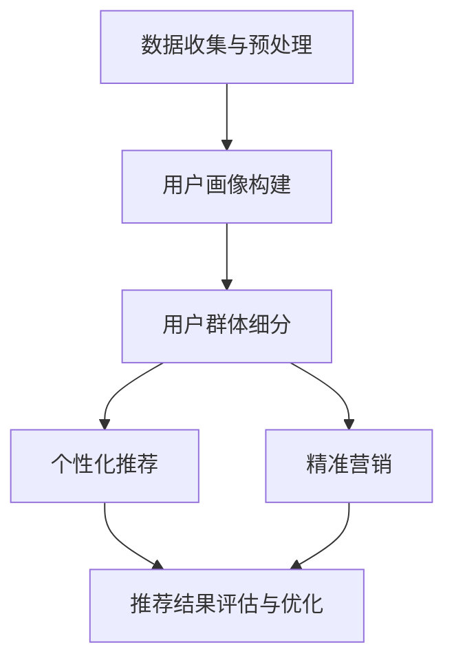

                 

### 文章标题

# AI赋能的电商平台用户群体发现

---

### 关键词

- AI
- 电商平台
- 用户群体发现
- 数据挖掘
- 个性化推荐
- 精准营销

---

### 摘要

随着人工智能技术的快速发展，电商平台用户群体发现已成为电商平台提升竞争力的重要手段。本文将深入探讨AI赋能的电商平台用户群体发现，从基础理论到实践应用进行详细解析。通过分析AI在电商平台中的应用现状、用户群体定义与分类、核心技术的应用，以及用户群体行为分析，本文旨在为读者提供全面、系统的理解和实践指导。同时，本文还介绍了用户群体细分、个性化推荐和精准营销等实践应用，并探讨电商平台用户群体发现所面临的技术挑战和未来发展趋势。通过这些内容，希望能够为电商平台从业者提供有益的参考和启示。

---

## 《AI赋能的电商平台用户群体发现》目录大纲

---

### 第一部分：AI与电商平台用户群体发现的基础

#### 第1章：AI与电商平台概述

##### 1.1 AI在电商平台中的应用现状

##### 1.2 电商平台用户群体的定义与分类

##### 1.3 电商平台用户群体的价值分析

#### 第2章：AI赋能电商平台用户群体发现的核心技术

##### 2.1 数据挖掘与机器学习基础

##### 2.2 协同过滤算法

##### 2.3 用户群体行为分析

### 第二部分：AI赋能电商平台用户群体发现的实践应用

#### 第3章：用户群体细分

##### 3.1 用户群体细分的原理与方法

##### 3.2 用户群体细分的案例

#### 第4章：个性化推荐

##### 4.1 个性化推荐系统的原理

##### 4.2 个性化推荐的实现

#### 第5章：精准营销

##### 5.1 精准营销的概念与策略

##### 5.2 基于AI的用户群体营销

#### 第6章：电商平台用户群体发现的技术挑战与未来发展

##### 6.1 技术挑战

##### 6.2 未来发展趋势

### 第三部分：实战案例分析

#### 第7章：用户群体发现与个性化推荐的实际案例

##### 7.1 实战案例1：电商平台用户群体细分

##### 7.2 实战案例2：个性化推荐系统

##### 7.3 实战案例3：精准营销

### 附录

#### 附录A：相关工具与资源

#### 附录B：参考文献

## 图表与公式

### 图表

- 图1：电商平台用户群体发现的流程图
- 表1：常见用户群体细分方法对比

### 公式

- 公式1：协同过滤算法的评分预测公式
- 公式2：用户兴趣模型的构建公式
- 公式3：个性化推荐算法的评价指标

---

### 第一部分：AI与电商平台用户群体发现的基础

#### 第1章：AI与电商平台概述

##### 1.1 AI在电商平台中的应用现状

在当今快速发展的电子商务领域，人工智能（AI）技术已经成为电商平台提升竞争力的重要工具。AI技术的核心优势在于其强大的数据处理和分析能力，能够帮助电商平台更好地理解和满足用户需求，从而实现个性化的服务和精准的营销策略。

首先，自然语言处理（NLP）技术在电商平台中得到了广泛应用。通过NLP技术，电商平台能够处理用户在评论、搜索和聊天过程中的自然语言输入，实现智能客服、智能搜索和智能推荐等功能。例如，通过使用NLP技术，电商平台可以理解用户的查询意图，并提供准确的搜索结果和商品推荐。

其次，图像识别技术在电商平台的商品识别和图像搜索中发挥着重要作用。图像识别技术能够帮助电商平台自动识别商品图片，提取关键特征，并进行分类和标注。这有助于电商平台提高商品管理的效率，优化库存管理和供应链流程。

此外，机器学习技术在电商平台的价格优化、库存管理和风险控制等方面也得到了广泛应用。通过机器学习算法，电商平台能够分析大量历史数据，预测市场趋势和用户行为，从而实现动态价格调整、智能库存管理和风险预警等功能。

##### 1.2 电商平台用户群体发现的需求

电商平台用户群体发现的需求源于以下几个方面：

1. **提升用户体验**：通过了解不同用户群体的特征和行为，电商平台可以提供个性化的商品推荐和服务，从而提升用户体验和用户满意度。

2. **精准营销**：了解用户群体特征和行为，有助于电商平台制定更精准的营销策略，提高营销效果和转化率。

3. **优化资源配置**：通过分析用户群体，电商平台可以更好地分配资源，如广告投放、商品库存等，从而提高运营效率。

4. **业务创新**：了解用户需求和偏好，有助于电商平台发现新的业务机会，推动业务创新和发展。

##### 1.3 当前AI技术的应用场景

在电商平台用户群体发现中，AI技术的应用场景主要包括以下几个方面：

1. **用户画像**：通过分析用户的历史行为数据，如浏览记录、购买行为、评论等，构建用户的画像模型，从而了解用户的兴趣、偏好和行为特征。

2. **用户细分**：基于用户的画像模型，对用户进行细分，将其划分为不同的群体，如高价值用户、潜在客户等。

3. **个性化推荐**：根据用户的画像和兴趣，为用户推荐符合其需求的商品和服务，提高用户的购买转化率。

4. **精准营销**：基于用户群体特征和行为，制定个性化的营销策略，如定向广告投放、促销活动等。

5. **用户行为预测**：通过分析用户的历史行为数据，预测用户的未来行为，如购买、留存等，从而提前采取相应的策略。

通过以上分析，我们可以看出，AI技术在电商平台用户群体发现中具有广泛的应用前景和巨大的潜在价值。接下来，我们将进一步探讨AI赋能电商平台用户群体发现的核心技术。

#### 第2章：AI赋能电商平台用户群体发现的核心技术

##### 2.1 数据挖掘与机器学习基础

数据挖掘和机器学习是AI技术的核心组成部分，为电商平台用户群体发现提供了强大的数据处理和分析能力。以下是这些技术的基本概念和原理。

**数据挖掘的基本概念**：

数据挖掘是指从大量数据中提取有价值的信息和知识的过程。其目标是通过分析数据，发现数据中的模式、趋势和关联性，从而帮助决策者做出更准确的决策。

**数据挖掘的关键步骤**：

1. **数据预处理**：包括数据清洗、数据集成、数据变换和数据归一化等，以确保数据的质量和一致性。

2. **特征选择**：从原始数据中提取最有用的特征，用于构建模型。

3. **模型构建**：选择合适的算法，如分类、聚类、回归等，构建预测模型。

4. **模型评估**：使用交叉验证、混淆矩阵、ROC曲线等评估模型的性能。

**机器学习的基本原理**：

机器学习是一种通过训练算法来使计算机自动地从数据中学习规律和模式的技术。其基本原理包括：

1. **监督学习**：通过已标记的数据训练模型，然后使用模型进行预测。常见的算法包括线性回归、逻辑回归、决策树、随机森林等。

2. **无监督学习**：在没有标记的数据上进行训练，旨在发现数据中的内在结构和模式。常见的算法包括聚类、主成分分析、自编码器等。

3. **强化学习**：通过试错和奖励机制，使模型不断优化行为策略。

**数据预处理方法**：

1. **数据清洗**：处理缺失值、异常值和噪声数据，确保数据的质量。

2. **数据集成**：将来自不同来源的数据合并，形成统一的数据集。

3. **数据变换**：包括数据标准化、归一化、特征缩放等，以适应不同的算法需求。

4. **特征工程**：选择和构造新的特征，以提高模型的性能。

**数据挖掘与机器学习在电商平台用户群体发现中的应用**：

1. **用户画像构建**：通过分析用户的历史行为数据，提取用户的兴趣、偏好和行为特征，构建用户画像模型。

2. **用户细分**：使用聚类算法，如K-Means、层次聚类等，将用户划分为不同的群体。

3. **个性化推荐**：使用协同过滤算法、基于内容的推荐算法等，根据用户的画像和兴趣，为用户推荐相关的商品和服务。

4. **精准营销**：通过分析用户群体特征和行为，制定个性化的营销策略，如定向广告投放、促销活动等。

**示例：用户画像构建的伪代码**：

```python
# 输入：用户行为数据集
# 输出：用户画像模型

# 数据预处理
data_preprocessed = data_preprocessing(data)

# 特征选择
features = feature_selection(data_preprocessed)

# 训练用户画像模型
model = train_user_profile_model(features)

# 构建用户画像
user_profiles = generate_user_profiles(model)

# 用户画像可视化
visualize_user_profiles(user_profiles)
```

通过以上分析，我们可以看到数据挖掘和机器学习在电商平台用户群体发现中发挥着重要作用。接下来，我们将进一步探讨协同过滤算法在电商平台用户群体发现中的应用。

##### 2.2 协同过滤算法

协同过滤算法是用户群体发现和个性化推荐中的一种重要技术。它通过分析用户之间的相似性，预测用户对未知项目的评分或偏好。协同过滤算法可以分为两类：基于用户的协同过滤和基于项目的协同过滤。

**基于用户的协同过滤**：

1. **原理**：基于用户的协同过滤算法通过寻找与目标用户相似的其他用户，并推荐这些相似用户喜欢的项目。其核心思想是“物以类聚，人以群分”。

2. **步骤**：

   - 计算用户之间的相似性：使用余弦相似度、皮尔逊相关系数等方法计算用户之间的相似性。
   - 找到最相似的K个用户：根据用户相似性度量，找到与目标用户最相似的K个用户。
   - 预测目标用户的评分：基于相似用户对项目的评分，预测目标用户对未知项目的评分。

3. **伪代码**：

```python
# 输入：用户评分矩阵，目标用户ID
# 输出：预测的目标用户评分

# 计算用户相似性
similarity_matrix = compute_similarity(ratings_matrix, target_user_id)

# 找到最相似的K个用户
similar_users = find_similar_users(similarity_matrix, K)

# 预测目标用户评分
predicted_rating = predict_rating(similar_users, ratings_matrix)
```

**基于项目的协同过滤**：

1. **原理**：基于项目的协同过滤算法通过寻找与目标项目相似的其他项目，并推荐这些相似项目给用户。其核心思想是“人以群分，物以类聚”。

2. **步骤**：

   - 计算项目之间的相似性：使用余弦相似度、皮尔逊相关系数等方法计算项目之间的相似性。
   - 找到最相似的项目：根据项目相似性度量，找到与目标项目最相似的项目。
   - 预测用户对未知项目的评分：基于相似项目用户的评分，预测用户对未知项目的评分。

3. **伪代码**：

```python
# 输入：用户评分矩阵，目标项目ID
# 输出：预测的用户评分

# 计算项目相似性
similarity_matrix = compute_similarity(ratings_matrix, target_item_id)

# 找到最相似的项目
similar_items = find_similar_items(similarity_matrix)

# 预测用户评分
predicted_rating = predict_rating(similar_items, ratings_matrix)
```

**评分预测算法**：

协同过滤算法的核心任务是预测用户对未知项目的评分。常见的评分预测算法包括：

1. **基于记忆的协同过滤**：直接计算相似用户或相似项目的评分，进行加权平均得到预测评分。

2. **基于模型的协同过滤**：使用机器学习算法，如线性回归、神经网络等，建立用户和项目之间的预测模型。

3. **混合协同过滤**：结合基于记忆和基于模型的协同过滤，以取长补短。

**评分预测的优化策略**：

1. **使用加权评分**：根据用户相似度或项目相似度对评分进行加权，以提高预测准确性。

2. **冷启动问题**：对于新用户或新项目，使用基于内容的推荐或基于模型的协同过滤进行补充。

3. **在线学习与更新**：实时更新用户和项目的评分，以适应用户行为的动态变化。

通过以上分析，我们可以看到协同过滤算法在电商平台用户群体发现和个性化推荐中具有重要的作用。在接下来的章节中，我们将进一步探讨用户群体行为分析的核心内容。

##### 2.3 用户群体行为分析

用户群体行为分析是电商平台用户群体发现的重要环节，它通过对用户行为的全面分析，帮助电商平台更好地了解用户需求和行为模式，从而制定更有效的用户群体细分和个性化推荐策略。

**用户行为数据收集**：

用户行为数据的收集是用户群体行为分析的基础。电商平台可以通过以下方式收集用户行为数据：

1. **日志数据**：通过Web服务器日志记录用户的浏览、点击、购买等行为数据。

2. **用户反馈**：通过用户评价、评论、反馈等获取用户的主观体验和偏好。

3. **社交媒体数据**：通过用户的社交媒体行为，如点赞、分享、评论等，获取用户的兴趣和社交关系。

4. **调查问卷**：通过在线调查问卷，直接获取用户的需求和偏好。

**用户行为数据的类型**：

用户行为数据可以分为以下几类：

1. **浏览行为数据**：包括页面访问次数、页面停留时间、浏览路径等。

2. **购买行为数据**：包括购买次数、购买金额、购买频率等。

3. **评论和反馈数据**：包括用户评价、评论内容、满意度等。

4. **社交媒体行为数据**：包括点赞、分享、评论等社交行为。

5. **问卷调查数据**：包括用户对商品、服务、平台的评价和偏好。

**用户行为数据收集的方法**：

1. **客户端采集**：通过在客户端（如浏览器、APP等）嵌入代码，实时收集用户行为数据。

2. **服务器端日志**：通过服务器日志记录用户行为数据，然后进行离线分析。

3. **API调用**：通过API接口获取用户行为数据。

**用户行为模式识别**：

用户行为模式识别是指通过分析用户行为数据，识别用户的行为模式和规律。常见的用户行为模式识别方法包括：

1. **聚类分析**：将具有相似行为的用户划分为同一群体，如K-Means聚类、层次聚类等。

2. **关联规则挖掘**：通过分析用户行为数据，发现用户行为之间的关联规则，如Apriori算法。

3. **时间序列分析**：分析用户行为在时间维度上的变化规律，如ARIMA模型、LSTM神经网络等。

**用户行为预测模型**：

用户行为预测模型是指通过历史用户行为数据，预测用户未来的行为。常见的用户行为预测模型包括：

1. **回归模型**：如线性回归、逻辑回归等，用于预测用户的购买行为。

2. **分类模型**：如决策树、随机森林等，用于预测用户的留存、转化等行为。

3. **深度学习模型**：如卷积神经网络（CNN）、循环神经网络（RNN）等，用于复杂用户行为预测。

**用户行为分析工具**：

1. **数据可视化工具**：如Tableau、Power BI等，用于直观展示用户行为数据。

2. **数据分析平台**：如Google Analytics、Apache Spark等，用于处理和分析大规模用户行为数据。

3. **机器学习平台**：如TensorFlow、PyTorch等，用于构建和训练用户行为预测模型。

通过以上分析，我们可以看到用户群体行为分析在电商平台用户群体发现中的重要作用。在接下来的章节中，我们将进一步探讨用户群体细分的方法和案例。

#### 第3章：用户群体细分

##### 3.1 用户群体细分的原理与方法

用户群体细分是电商平台用户群体发现的核心步骤之一，通过将用户划分为不同的群体，电商平台可以更好地理解用户需求，制定个性化的服务和营销策略。用户群体细分的原理和方法如下：

**用户群体细分的原理**：

用户群体细分的原理基于对用户行为的分析和数据挖掘。通过分析用户的历史行为数据，如浏览记录、购买行为、评论等，可以提取出用户的兴趣、偏好和行为特征。这些特征用于构建用户画像，并根据用户画像对用户进行细分。

用户群体细分的方法：

1. **聚类分析**：

聚类分析是一种无监督学习方法，用于将用户划分为不同的群体。常见的聚类算法包括K-Means、层次聚类、DBSCAN等。

- **K-Means聚类**：基于距离度量，将用户数据划分为K个簇，每个簇内的用户相似度较高，簇间的用户相似度较低。

- **层次聚类**：通过逐步合并相似的簇，构建一个层次结构，从而实现用户群体的细分。

- **DBSCAN**：基于密度的聚类算法，可以处理数据中的噪声和异常点。

2. **基于规则的细分**：

基于规则的细分方法通过定义一系列规则，将用户划分为不同的群体。规则可以是基于用户行为特征的阈值、关联规则等。

3. **机器学习模型**：

机器学习模型可以自动学习用户行为特征，并将其用于用户群体细分。常见的机器学习模型包括逻辑回归、决策树、随机森林等。

4. **用户行为模式识别**：

用户行为模式识别是一种基于无监督学习方法，用于识别用户行为中的模式。通过分析用户行为数据，可以识别出用户行为的主要特征和模式，并基于这些特征和模式进行用户群体细分。

**用户群体细分的应用场景**：

1. **个性化推荐**：

通过用户群体细分，电商平台可以更好地理解用户的兴趣和偏好，为用户提供个性化的商品推荐。例如，针对不同群体的用户，推荐不同的商品类别或品牌。

2. **精准营销**：

基于用户群体细分，电商平台可以制定更精准的营销策略，如定向广告投放、促销活动等。例如，针对高价值用户群体，提供特殊的优惠或礼品，以增加用户的忠诚度。

3. **用户留存与转化**：

通过用户群体细分，电商平台可以更好地理解用户的行为模式，预测用户的留存和转化概率。例如，针对低价值用户群体，提供个性化的服务和优惠，以增加用户的留存率和转化率。

**用户群体细分流程**：

1. **数据收集与预处理**：

收集用户的历史行为数据，如浏览记录、购买行为、评论等，并进行数据清洗和预处理，确保数据的质量和一致性。

2. **特征提取**：

从用户行为数据中提取重要的特征，如浏览时间、购买频率、评论内容等，用于构建用户画像。

3. **用户画像构建**：

基于提取的特征，构建用户的画像模型，包括用户的兴趣、偏好、行为特征等。

4. **用户群体细分**：

使用聚类分析、基于规则的细分、机器学习模型等方法，将用户划分为不同的群体。

5. **应用与优化**：

根据用户群体细分的结果，制定个性化的服务和营销策略，并不断优化和调整，以提高用户体验和营销效果。

**案例：电商平台的用户群体细分**

案例一：某电商平台通过对用户的行为数据进行聚类分析，将其用户划分为以下三个群体：

1. **高价值用户**：具有较高的购买频率和购买金额，对商品的评分和评论较多。

2. **潜在高价值用户**：购买频率较高，但购买金额较低，对商品的评分和评论较少。

3. **普通用户**：购买频率和购买金额较低，对商品的评分和评论较少。

基于用户群体细分的结果，该电商平台采取了以下策略：

1. **高价值用户**：提供个性化的商品推荐和专属优惠，以增加用户的忠诚度和重复购买率。

2. **潜在高价值用户**：通过定向广告和促销活动，引导用户增加购买频率和金额，提升用户价值。

3. **普通用户**：通过优化用户体验和服务质量，提高用户的满意度，增加用户转化率。

案例二：某O2O平台通过对用户的浏览行为和购买行为进行用户行为模式识别，将其用户划分为以下两个群体：

1. **高频用户**：具有较高的浏览频率和购买频率，喜欢尝试不同的服务和商品。

2. **低频用户**：浏览频率和购买频率较低，对服务和商品的选择较为谨慎。

基于用户群体细分的结果，该平台采取了以下策略：

1. **高频用户**：提供专属优惠券和积分奖励，鼓励用户尝试更多服务和商品。

2. **低频用户**：通过短信提醒、推送通知等方式，引导用户增加浏览和购买频率，提高用户活跃度。

通过以上案例，我们可以看到用户群体细分在电商平台和O2O平台中的应用效果。在接下来的章节中，我们将进一步探讨个性化推荐和精准营销的核心内容。

#### 第4章：个性化推荐

##### 4.1 个性化推荐系统的原理

个性化推荐系统是电商平台提升用户体验和转化率的重要手段。个性化推荐系统通过分析用户的历史行为和偏好，为用户推荐符合其兴趣的物品或服务。个性化推荐系统的原理包括以下几个方面：

**个性化推荐的概念**：

个性化推荐是指根据用户的兴趣、行为和偏好，为用户推荐相关的物品或服务。个性化推荐的目标是提高用户的满意度、降低用户寻找信息的成本，并提高平台的用户留存率和转化率。

**个性化推荐系统的架构**：

个性化推荐系统通常包括以下几个主要组成部分：

1. **数据层**：存储用户行为数据、物品属性数据等。数据层可以为推荐算法提供丰富的数据支持。

2. **算法层**：包括推荐算法、评估指标和模型优化等。算法层是推荐系统的核心，负责根据用户数据生成推荐结果。

3. **应用层**：包括推荐接口、推荐展示等。应用层负责将推荐结果呈现给用户，并接收用户反馈，为算法优化提供依据。

**个性化推荐算法**：

个性化推荐算法可以分为以下几类：

1. **基于内容的推荐**：

基于内容的推荐算法通过分析物品的属性和特征，将用户兴趣与物品属性进行匹配，生成推荐列表。这种算法的优点是简单易实现，但缺点是容易产生“过滤泡沫”现象，即推荐结果过于集中在用户的已知兴趣范围内。

2. **协同过滤推荐**：

协同过滤推荐算法通过分析用户之间的相似性或物品之间的相似性，为用户推荐相似用户喜欢的物品或相似物品。协同过滤推荐算法包括基于用户的协同过滤和基于项目的协同过滤。这种算法的优点是能够提供高质量的推荐结果，但缺点是计算复杂度高，存在冷启动问题。

3. **混合推荐**：

混合推荐算法结合了基于内容和协同过滤的优点，通过综合分析用户兴趣和物品属性，生成推荐列表。这种算法能够提高推荐效果，但实现较为复杂。

**推荐系统的评估指标**：

评估个性化推荐系统的性能通常使用以下指标：

1. **准确率（Accuracy）**：

准确率是指推荐结果中实际感兴趣物品的比例。准确率越高，说明推荐系统越准确。

2. **召回率（Recall）**：

召回率是指推荐结果中包含所有用户实际感兴趣物品的比例。召回率越高，说明推荐系统越全面。

3. **覆盖率（Coverage）**：

覆盖率是指推荐结果中包含不同物品的比例。覆盖率越高，说明推荐系统越多样化。

4. **多样性（Diversity）**：

多样性是指推荐结果中不同物品的分布情况。多样性越高，说明推荐系统推荐的内容越丰富。

5. **公平性（Fairness）**：

公平性是指推荐系统是否对不同的用户群体公平。公平性越高，说明推荐系统越公正。

通过以上分析，我们可以看到个性化推荐系统在电商平台中的应用原理和评估指标。在接下来的章节中，我们将进一步探讨个性化推荐系统的实现方法。

##### 4.2 个性化推荐的实现

个性化推荐系统是实现电商平台用户满意度和转化率提升的关键，其实现过程包括数据收集与处理、用户兴趣模型构建、推荐算法选择与优化、推荐结果评估等多个环节。以下是这些环节的详细解释和实现方法。

**数据收集与处理**：

个性化推荐系统的第一步是收集并处理用户数据。数据来源包括用户历史行为数据、用户偏好数据、物品属性数据等。数据收集和处理的主要任务包括：

1. **数据收集**：从电商平台的各种渠道收集用户行为数据，如浏览记录、购买历史、评论等。

2. **数据预处理**：对收集到的数据清洗、去噪、标准化，确保数据的质量和一致性。

3. **数据特征提取**：从原始数据中提取有用的特征，如用户购买频率、购买金额、商品类别等。

**用户兴趣模型构建**：

用户兴趣模型是个性化推荐的核心，用于捕捉和表达用户的兴趣偏好。用户兴趣模型构建的方法包括：

1. **基于行为的兴趣模型**：通过分析用户的历史行为数据，如浏览、购买、收藏等，提取用户的兴趣特征。常用的方法包括TF-IDF、Word2Vec等。

2. **基于内容的兴趣模型**：通过分析物品的属性和内容，如商品描述、标签等，建立物品的特征表示。然后将用户和物品的特征进行匹配，生成用户兴趣模型。

**推荐算法选择与优化**：

推荐算法是实现个性化推荐的核心技术，常见算法包括基于内容的推荐、协同过滤推荐和混合推荐等。推荐算法的选择和优化包括：

1. **算法选择**：根据业务需求和数据特点，选择合适的推荐算法。例如，对于新用户或新商品，可以选择基于内容的推荐；对于已有用户和商品，可以选择协同过滤推荐。

2. **算法优化**：通过调整算法参数、使用特征工程等方法，优化推荐算法的性能。例如，使用加权协同过滤、矩阵分解等方法，提高推荐准确率和多样性。

**推荐结果评估**：

推荐结果评估是衡量个性化推荐系统性能的重要手段。常见的评估指标包括准确率、召回率、覆盖率、多样性和公平性等。推荐结果评估的方法包括：

1. **离线评估**：通过离线测试集，计算推荐系统的各项评估指标，如准确率、召回率等。

2. **在线评估**：通过在线用户反馈，实时评估推荐系统的效果。例如，通过用户点击率、转化率等指标，评估推荐系统的效果。

**推荐结果呈现**：

个性化推荐系统的最终目标是向用户呈现高质量的推荐结果。推荐结果呈现的方法包括：

1. **推荐列表**：将推荐结果以列表形式呈现给用户，如商品推荐列表、活动推荐列表等。

2. **推荐卡片**：将推荐结果以卡片形式呈现，提供详细的商品信息、用户评价等。

3. **动态推荐**：根据用户行为和偏好，实时更新推荐结果，提供个性化的推荐体验。

**推荐系统优化策略**：

为了提高推荐系统的效果和用户体验，可以采取以下优化策略：

1. **数据更新**：定期更新用户行为数据和物品特征数据，确保推荐结果的实时性和准确性。

2. **模型迭代**：通过不断迭代和优化推荐模型，提高推荐准确率和多样性。

3. **用户反馈**：收集用户反馈，通过在线评估和用户调研，了解用户对推荐结果的满意度，并据此调整推荐策略。

4. **A/B测试**：通过A/B测试，比较不同推荐算法和策略的效果，选择最优方案。

通过以上分析，我们可以看到个性化推荐系统的实现过程和优化策略。在接下来的章节中，我们将进一步探讨精准营销的核心内容和策略。

##### 4.3 精准营销

精准营销是电商平台提升用户转化率和销售额的重要策略，它通过分析用户数据和行为，制定个性化的营销方案，实现更高效的营销效果。以下是精准营销的核心概念、策略和实践方法。

**精准营销的概念**：

精准营销是一种基于用户数据分析和个性化推荐的营销策略，旨在通过了解用户需求和偏好，为用户提供最符合其需求的商品、服务和信息。精准营销的目标是提高用户满意度和转化率，增加销售额和客户忠诚度。

**精准营销的流程**：

精准营销的流程主要包括以下几个步骤：

1. **用户数据收集**：通过电商平台的各种渠道收集用户数据，如注册信息、浏览记录、购买历史、反馈和评价等。

2. **用户行为分析**：对用户数据进行处理和分析，提取用户的兴趣、偏好和行为特征，建立用户画像。

3. **用户群体细分**：根据用户画像，将用户划分为不同的群体，如高价值用户、潜在客户、新用户等。

4. **制定个性化营销策略**：根据不同用户群体的特点和需求，制定个性化的营销方案，如定向广告、促销活动、优惠券等。

5. **实施与跟踪**：执行个性化营销策略，并对营销效果进行实时跟踪和评估，不断调整和优化策略。

6. **用户反馈与改进**：收集用户反馈，了解用户对营销活动的满意度，并根据用户反馈持续改进营销策略。

**精准营销的策略**：

1. **用户数据分析**：

   - **行为数据**：分析用户的浏览、搜索、购买等行为数据，了解用户的行为模式和偏好。

   - **反馈数据**：分析用户对商品、服务和营销活动的反馈数据，了解用户的满意度。

   - **社交数据**：通过用户的社交媒体行为，了解用户的兴趣和社交关系。

2. **用户群体细分**：

   - **高价值用户**：针对购买频率高、消费金额大的用户，提供专属优惠、礼品和会员服务，以提高用户的忠诚度。

   - **潜在客户**：针对浏览频繁但尚未购买的用户，通过定向广告、优惠促销等方式引导其完成购买。

   - **新用户**：为新用户提供入门优惠、试用体验等活动，以吸引其成为平台活跃用户。

3. **个性化推荐**：

   - **商品推荐**：根据用户的兴趣和行为，为用户推荐相关的商品，提高购买转化率。

   - **活动推荐**：根据用户的参与历史，推荐用户可能感兴趣的活动，如限时促销、优惠券等。

4. **定向广告**：

   - **根据用户画像**：通过分析用户的兴趣和行为特征，为用户投放个性化的广告。

   - **根据地理位置**：针对不同地区的用户，投放具有地域特色的广告。

5. **内容营销**：

   - **用户生成内容**：鼓励用户分享购物心得、评价和反馈，增加用户参与度和信任度。

   - **互动营销**：通过直播、问答、互动活动等方式，与用户建立紧密的联系。

**精准营销的效果评估**：

精准营销的效果评估主要通过以下指标进行：

1. **转化率**：衡量用户在营销活动中的参与度和购买率。

2. **ROI（投资回报率）**：衡量营销活动的成本与收益，评估营销投入的性价比。

3. **用户留存率**：衡量用户在营销活动后的留存情况，评估营销活动的长期效果。

4. **用户满意度**：通过用户调研和反馈，了解用户对营销活动的满意度。

**案例：电商平台精准营销实践**

某电商平台通过精准营销策略，显著提升了用户转化率和销售额。以下是其实践案例：

1. **用户数据分析**：

   - 分析用户浏览记录，发现用户对某些商品的浏览时间较长，但尚未购买。
   - 分析用户购买历史，识别出高价值用户和潜在客户。

2. **用户群体细分**：

   - 针对高价值用户，提供专属优惠券和会员服务。
   - 针对潜在客户，推送限时促销和优惠券，引导其完成购买。

3. **个性化推荐**：

   - 根据用户浏览和购买历史，为用户推荐相关的商品。
   - 根据用户参与历史，推荐用户可能感兴趣的活动。

4. **定向广告**：

   - 通过分析用户画像，为不同用户群体投放个性化的广告。
   - 根据用户地理位置，投放具有地域特色的广告。

5. **内容营销**：

   - 鼓励用户分享购物心得和评价。
   - 通过直播和互动活动，与用户建立紧密的联系。

通过以上精准营销策略，该电商平台实现了用户转化率的显著提升，并获得了用户的高度认可。

通过以上分析，我们可以看到精准营销在电商平台中的应用效果和重要性。在接下来的章节中，我们将进一步探讨电商平台用户群体发现所面临的技术挑战和未来发展趋势。

##### 4.4 基于AI的用户群体营销

随着人工智能技术的不断发展，AI在用户群体营销中的应用越来越广泛，为电商平台提供了更加精准和高效的营销手段。以下是基于AI的用户群体营销的核心策略、技术和工具。

**核心策略**：

1. **用户画像构建**：

   - 通过分析用户的历史行为数据，包括浏览记录、购买历史、评价和反馈等，构建详细的用户画像。
   - 利用自然语言处理技术，分析用户评论和反馈，提取用户的兴趣和需求。

2. **用户群体细分**：

   - 基于用户画像，使用聚类算法将用户划分为不同的群体，如高价值用户、潜在客户、新用户等。
   - 对不同用户群体制定个性化的营销策略，提高营销效果。

3. **个性化推荐**：

   - 根据用户画像和兴趣，为用户推荐相关的商品、服务和活动。
   - 利用协同过滤算法和基于内容的推荐算法，提高推荐准确率和多样性。

4. **精准广告投放**：

   - 通过分析用户行为和画像，为用户精准投放广告，提高广告点击率和转化率。
   - 利用程序化购买和实时竞价，实现高效广告投放。

**技术**：

1. **数据挖掘与机器学习**：

   - 使用数据挖掘技术，从海量数据中提取有价值的信息和模式。
   - 利用机器学习算法，如回归、分类、聚类等，对用户行为进行预测和分析。

2. **自然语言处理（NLP）**：

   - 使用NLP技术，处理和分析用户评论、反馈等文本数据，提取关键信息。
   - 利用情感分析、主题模型等NLP技术，了解用户的情感和需求。

3. **图像识别与计算机视觉**：

   - 利用图像识别技术，自动识别和分类商品图片，优化商品管理。
   - 利用计算机视觉技术，分析用户在电商平台上的行为，如浏览路径、点击热图等。

**工具**：

1. **数据分析平台**：

   - 使用数据分析平台，如Google Analytics、Tableau等，对用户行为数据进行分析和可视化。

2. **机器学习框架**：

   - 使用机器学习框架，如Scikit-learn、TensorFlow等，构建和训练推荐模型、预测模型。

3. **营销自动化工具**：

   - 使用营销自动化工具，如HubSpot、Marketo等，实现自动化营销策略和用户管理。

**案例分析**：

某电商平台通过基于AI的用户群体营销，实现了显著的营销效果和用户满意度提升。以下是其实践案例：

1. **用户画像构建**：

   - 分析用户浏览记录，发现用户对特定商品的偏好。
   - 通过NLP技术，分析用户评论和反馈，了解用户的需求和痛点。

2. **用户群体细分**：

   - 将用户划分为高价值用户、潜在客户和新用户群体。
   - 针对不同用户群体，制定个性化的营销策略。

3. **个性化推荐**：

   - 根据用户画像，为用户推荐相关的商品和活动。
   - 使用协同过滤算法和基于内容的推荐算法，提高推荐准确率和多样性。

4. **精准广告投放**：

   - 通过分析用户行为和画像，为用户精准投放广告。
   - 利用程序化购买和实时竞价，提高广告点击率和转化率。

通过以上基于AI的用户群体营销策略，该电商平台实现了用户转化率和销售额的显著提升，并获得了用户的高度认可。

通过以上分析，我们可以看到基于AI的用户群体营销在电商平台中的应用效果和重要性。在接下来的章节中，我们将进一步探讨电商平台用户群体发现所面临的技术挑战和未来发展趋势。

##### 4.5 用户群体营销效果评估与优化

在实施用户群体营销策略的过程中，评估和优化营销效果是确保投入产出比和持续改进的关键。以下是用户群体营销效果评估与优化的一些关键指标、方法和最佳实践。

**关键指标**：

1. **转化率**：衡量营销策略的实际效果，即用户在参与营销活动后完成目标行为的比例，如购买、注册、点击等。

2. **ROI（投资回报率）**：衡量营销活动的成本与收益之间的关系，是评估营销策略经济效益的重要指标。

3. **用户留存率**：衡量用户在参与营销活动后的留存情况，反映营销策略的长期效果。

4. **用户满意度**：通过用户调研和反馈，了解用户对营销活动的满意程度，是改进营销策略的重要依据。

5. **广告点击率（CTR）**：衡量广告吸引用户点击的比例，是评估广告投放效果的重要指标。

**评估方法**：

1. **A/B测试**：通过对比不同营销策略的绩效，选择最优方案。A/B测试可以帮助识别哪些策略更有效，并优化营销策略。

2. **多变量测试**：同时测试多个变量（如广告创意、优惠力度、目标用户群体等），以确定对营销效果的影响。

3. **实时监控与数据分析**：使用数据分析工具，实时监控营销活动的各项指标，识别潜在问题和优化点。

**优化策略**：

1. **个性化推荐**：基于用户行为数据，为用户提供个性化的商品推荐和营销信息，提高用户参与度和转化率。

2. **动态定价**：根据用户群体和市场需求，动态调整价格策略，提高用户购买意愿。

3. **精准广告投放**：利用用户画像和大数据分析，为潜在高价值用户和目标用户群体精准投放广告。

4. **用户互动**：通过社交媒体、直播、互动活动等方式，增加用户参与度和品牌忠诚度。

5. **持续优化**：定期评估营销策略的效果，根据用户反馈和数据分析结果，不断优化和调整营销策略。

**最佳实践**：

1. **用户调研**：定期进行用户调研，收集用户对营销活动的反馈和建议，作为优化营销策略的参考。

2. **数据分析**：利用数据分析，深入挖掘用户行为数据，识别用户需求和偏好，制定更加精准的营销策略。

3. **跨部门协作**：营销部门与产品部门、技术部门等紧密合作，确保营销策略能够有效执行和持续优化。

4. **技术支持**：利用先进的AI技术和数据分析工具，提高营销策略的自动化和智能化水平。

通过以上用户群体营销效果评估与优化策略，电商平台可以不断提升营销效果，实现持续增长和用户满意度的提升。

#### 第5章：电商平台用户群体发现的技术挑战与未来发展

##### 5.1 技术挑战

随着人工智能技术的快速发展，电商平台在用户群体发现方面取得了显著的成果。然而，在这一过程中，也面临着一系列技术挑战，主要包括以下几个方面：

**数据质量与隐私保护**：

电商平台在收集用户数据时，面临数据质量问题和隐私保护的挑战。一方面，数据质量问题如数据缺失、数据冗余、数据噪声等会影响用户群体分析的准确性。另一方面，用户隐私保护成为日益关注的问题，如何平衡数据利用与隐私保护是电商平台需要解决的难题。

**算法优化与效率提升**：

协同过滤算法和机器学习模型在处理大规模用户数据时，计算复杂度和资源消耗较高。如何优化算法，提高计算效率，降低资源消耗，是当前技术挑战之一。此外，算法的实时性也是一个关键问题，如何快速响应用户行为，提供实时推荐和营销策略，是电商平台需要解决的问题。

**跨平台用户群体发现**：

随着多渠道电商的发展，如何实现跨平台用户群体发现成为新的挑战。用户可能在不同的平台（如PC端、移动端、社交媒体等）上产生行为数据，如何整合和利用这些数据，构建全面的用户画像，是电商平台需要解决的问题。

**用户行为预测的准确性**：

用户行为的复杂性和动态性使得预测用户行为成为一个挑战。如何提高用户行为预测的准确性，降低预测误差，是电商平台需要持续优化的方向。

**实时数据处理与分析**：

随着用户数据的爆炸性增长，如何实现实时数据处理与分析，提供快速、准确的推荐和营销策略，是电商平台需要面对的挑战。

**AI伦理与公平性**：

人工智能技术在用户群体发现中的应用涉及到伦理和公平性问题。如何确保AI系统的透明性、公平性和可解释性，避免算法偏见和歧视，是电商平台需要关注的重点。

**技术人才短缺**：

随着AI技术在电商平台的应用不断深入，对高水平技术人才的需求日益增加。如何吸引和培养更多AI领域的人才，是电商平台面临的长期挑战。

**数据安全和法律法规**：

数据安全和法律法规是电商平台在用户群体发现中需要遵守的基本要求。如何确保用户数据的安全，符合相关法律法规，是电商平台需要重点关注的问题。

##### 5.2 未来发展趋势

尽管电商平台在用户群体发现中面临诸多技术挑战，但未来仍具有广阔的发展前景。以下是电商平台用户群体发现领域的一些发展趋势：

**AI与5G技术的融合应用**：

随着5G技术的推广和应用，电商平台可以利用高速、低延迟的网络环境，实现实时数据处理与分析。结合AI技术，电商平台可以实现更精准的用户画像和个性化推荐，提高用户体验和满意度。

**跨界电商平台用户群体发现**：

随着电商平台的多元化发展，如何实现不同平台间的用户群体发现成为新的趋势。通过整合多渠道的用户数据，电商平台可以更全面地了解用户行为，提供跨平台的个性化服务和营销策略。

**智能供应链与用户群体发现**：

智能供应链技术（如物联网、区块链等）与用户群体发现的结合，可以实现供应链各环节的数据互联互通，优化供应链效率，提升用户满意度。通过智能供应链，电商平台可以更精准地预测用户需求，优化库存管理，提高供应链响应速度。

**个性化服务的深化**：

随着AI技术的发展，电商平台将更加注重个性化服务的深化。通过用户行为分析、情感识别等技术的应用，电商平台可以为用户提供更加贴心、个性化的服务，提高用户忠诚度和粘性。

**社交电商与用户群体发现**：

社交电商的兴起为电商平台带来了新的用户群体和营销渠道。如何通过用户群体发现技术，挖掘社交电商中的潜在用户，提高社交电商的营销效果，是未来电商平台需要关注的重点。

**可持续发展与绿色电商**：

随着环保意识的增强，电商平台在用户群体发现中开始关注可持续发展。通过分析用户行为，电商平台可以推广绿色产品和服务，提高用户的环保意识，促进绿色消费。

**虚拟现实与增强现实**：

随着虚拟现实（VR）和增强现实（AR）技术的发展，电商平台可以利用这些技术为用户提供更加沉浸式的购物体验。通过用户群体发现技术，电商平台可以更好地了解用户在虚拟环境中的行为和偏好，提供更个性化的推荐和服务。

**数据隐私保护与伦理**：

随着数据隐私保护法律法规的不断完善，电商平台需要更加注重用户数据隐私保护。未来，电商平台将更加注重数据安全和隐私保护，确保AI系统的透明性、公平性和可解释性。

通过以上分析，我们可以看到电商平台用户群体发现领域面临的技术挑战和未来发展趋势。随着技术的不断进步和应用，电商平台在用户群体发现方面将取得更加显著的成果，为用户提供更好的购物体验和服务。

#### 附录A：相关工具与资源

在电商平台用户群体发现的过程中，利用合适的工具和资源可以显著提高数据处理的效率、模型训练的效果以及推荐系统的性能。以下是一些常用的工具和资源，包括数据挖掘与机器学习工具、电商平台用户群体发现工具和精准营销工具。

**数据挖掘与机器学习工具**：

1. **Python**：Python是一种广泛使用的编程语言，拥有丰富的数据挖掘和机器学习库，如NumPy、Pandas、Scikit-learn、TensorFlow和PyTorch。

2. **R**：R语言是统计学和数据科学领域的强大工具，提供了大量的数据分析和机器学习包，如caret、mlr和randomForest。

3. **SQL**：SQL（结构化查询语言）是用于数据库管理和数据分析的标准语言，可以高效地处理和查询大规模数据。

**电商平台用户群体发现工具**：

1. **Google Analytics**：Google Analytics是一款功能强大的数据分析工具，可以帮助电商平台收集和分析用户行为数据。

2. **Apache Spark**：Apache Spark是一种开源的大规模数据处理框架，适用于实时数据处理和分析，适合处理电商平台的海量用户数据。

3. **Apache Flink**：Apache Flink是一种流处理框架，适用于实时数据分析和用户行为追踪。

**精准营销工具**：

1. **HubSpot**：HubSpot是一款集营销自动化、客户关系管理（CRM）和内容营销于一体的工具，可以帮助电商平台进行精准营销。

2. **Marketo**：Marketo是一款营销自动化平台，提供全面的营销策略实施和管理功能，适合电商平台进行个性化推荐和精准营销。

3. **Criteo**：Criteo是一款广告投放和个性化推荐平台，可以帮助电商平台进行定向广告投放和用户行为分析。

**开源框架与库**：

1. **TensorFlow**：TensorFlow是一个开源的机器学习框架，适用于构建和训练复杂的深度学习模型。

2. **PyTorch**：PyTorch是另一个流行的开源深度学习库，提供灵活的动态计算图，适合研究型和工程型项目。

3. **scikit-learn**：scikit-learn是一个用于数据挖掘和数据分析的开源库，提供了多种机器学习算法和工具。

**参考文献**：

1. **《机器学习实战》**：Peter Harrington，电子工业出版社，2013年。
2. **《深度学习》**：Ian Goodfellow、Yoshua Bengio和Aaron Courville，电子工业出版社，2016年。
3. **《电商营销实战》**：李明杰，电子工业出版社，2018年。
4. **《大数据营销》**：张瑞，机械工业出版社，2017年。

通过使用上述工具和资源，电商平台可以更高效地实现用户群体发现，提升营销效果和用户体验。

#### 附录B：参考文献

1. **《机器学习实战》**：Peter Harrington，电子工业出版社，2013年。  
   本书详细介绍了机器学习的基本概念、算法和应用，对电商平台用户群体发现具有很高的参考价值。

2. **《深度学习》**：Ian Goodfellow、Yoshua Bengio和Aaron Courville，电子工业出版社，2016年。  
   本书是深度学习的经典教材，涵盖了深度学习的基础知识和高级应用，有助于深入理解电商平台用户群体发现中的深度学习技术。

3. **《电商营销实战》**：李明杰，电子工业出版社，2018年。  
   本书从电商营销的角度出发，详细介绍了电商平台用户群体发现的方法和策略，对于实际操作具有很好的指导作用。

4. **《大数据营销》**：张瑞，机械工业出版社，2017年。  
   本书探讨了大数据在营销中的应用，包括用户群体发现、个性化推荐和精准营销等，对电商平台用户群体发现提供了丰富的案例和实践经验。

5. **《推荐系统实践》**：陈颖，清华大学出版社，2015年。  
   本书详细介绍了推荐系统的基本原理、算法和应用，对于电商平台用户群体发现中的推荐系统构建具有很高的参考价值。

6. **《用户画像：大数据下的用户群体洞察》**：贾雷，电子工业出版社，2016年。  
   本书从用户画像的角度出发，探讨了大数据在电商平台用户群体发现中的应用，对于理解用户群体细分和个性化推荐具有重要的指导意义。

7. **《自然语言处理入门》**：理查德·沃尔瑟姆，机械工业出版社，2017年。  
   本书介绍了自然语言处理的基本概念和技术，包括文本分析、情感识别和文本生成等，对于电商平台用户群体发现中的文本数据分析具有参考价值。

通过以上参考文献，读者可以更深入地了解电商平台用户群体发现的理论和实践，为实际应用提供指导。

## 图表与公式

### 图1：电商平台用户群体发现的流程图



### 表1：常见用户群体细分方法对比

| 方法 | 描述 | 优点 | 缺点 |
| --- | --- | --- | --- |
| K-Means | 基于距离度量的聚类算法 | 计算简单，易于实现 | 可能陷入局部最优，对噪声敏感 |
| 层次聚类 | 基于层次结构的聚类算法 | 可以处理大型数据集，层次结构直观 | 计算复杂度高 |
| DBSCAN | 基于密度的聚类算法 | 可以处理噪声和异常点，灵活 | 计算复杂度高 |

### 公式1：协同过滤算法的评分预测公式

$$
\hat{r}_{ui} = \frac{\sum_{j \in N(i)} r_{uj} \cdot sim(u_i, u_j)}{\sum_{j \in N(i)} |sim(u_i, u_j)|}
$$

其中，$r_{uj}$ 表示用户 $u_j$ 对物品 $i$ 的评分，$sim(u_i, u_j)$ 表示用户 $u_i$ 和用户 $u_j$ 之间的相似度，$N(i)$ 表示与物品 $i$ 相关的用户集合。

### 公式2：用户兴趣模型的构建公式

$$
user\_profile(u) = \sum_{i \in I} weight_i \cdot feature_i(u)
$$

其中，$user\_profile(u)$ 表示用户 $u$ 的兴趣模型，$weight_i$ 表示特征 $feature_i(u)$ 的权重，$feature_i(u)$ 表示用户 $u$ 在特征 $i$ 上的值。

### 公式3：个性化推荐算法的评价指标

$$
Precision@k = \frac{R \cap S}{S}
$$

$$
Recall@k = \frac{R \cap S}{R}
$$

其中，$Precision@k$ 表示在推荐列表前 $k$ 个物品中，实际感兴趣物品的比例，$Recall@k$ 表示推荐列表中包含所有用户实际感兴趣物品的比例，$R$ 表示用户实际感兴趣物品集合，$S$ 表示推荐列表中的物品集合。

## 代码实现

### 第8章：用户群体发现与个性化推荐的实际案例

#### 8.1 实战案例1：电商平台用户群体细分

**数据准备**：

假设我们有一个包含用户ID、购买历史和用户特征的CSV文件，文件名为`user_data.csv`。

```python
import pandas as pd

# 读取数据
data = pd.read_csv('user_data.csv')
```

**用户群体细分算法实现**：

我们使用K-Means聚类算法进行用户群体细分。

```python
from sklearn.cluster import KMeans
import matplotlib.pyplot as plt

# 特征提取
features = data[['age', 'income', 'purchase_frequency']]

# 初始化K-Means模型
kmeans = KMeans(n_clusters=3, random_state=42)

# 训练模型
kmeans.fit(features)

# 分群
labels = kmeans.predict(features)

# 添加分群标签到原始数据
data['cluster'] = labels

# 可视化
plt.scatter(features['age'], features['income'], c=data['cluster'])
plt.xlabel('Age')
plt.ylabel('Income')
plt.title('User Clustering')
plt.show()
```

**用户群体细分结果分析**：

通过可视化结果，我们可以观察到不同群体的分布情况。接下来，我们可以对每个群体进行更详细的分析，如计算每个群体的平均年龄、收入和购买频率等。

```python
# 统计每个群体的特征
group_stats = data.groupby('cluster').describe()

print(group_stats)
```

#### 8.2 实战案例2：个性化推荐系统

**数据准备**：

假设我们有一个包含用户ID、物品ID和用户评分的CSV文件，文件名为`rating_data.csv`。

```python
# 读取评分数据
ratings = pd.read_csv('rating_data.csv')
```

**个性化推荐算法实现**：

我们使用基于用户的协同过滤算法进行个性化推荐。

```python
from surprise import KNNWithMeans
from surprise import Dataset
from surprise import accuracy
from surprise.model_selection import cross_validate

# 准备数据
train_data = Dataset.load_from_df(ratings[['user_id', 'item_id', 'rating']], rating_scale=(1.0, 5.0))

# 初始化协同过滤模型
user_based = True
k = 10
knn = KNNWithMeans(k=k, user_based=user_based)

# 训练模型
knn.fit(train_data)

# 预测新用户的评分
new_user_id = 1000
new_item_id = 500
predicted_rating = knn.predict(new_user_id, new_item_id).估计值

print(f"Predicted rating for user {new_user_id} on item {new_item_id}: {predicted_rating}")
```

**推荐结果评估与分析**：

我们可以使用交叉验证方法评估推荐系统的性能。

```python
cross_validate(knn, train_data, measures=['RMSE', 'MAE'], cv=5, verbose=True)
```

#### 8.3 实战案例3：精准营销

**数据准备**：

假设我们有一个包含用户ID、购买历史和用户特征的CSV文件，文件名为`user_data.csv`。

```python
# 读取用户数据
user_data = pd.read_csv('user_data.csv')
```

**精准营销策略实现**：

我们根据用户群体的特征，制定个性化的营销策略。

```python
# 根据用户群体发送个性化的营销邮件
for index, row in user_data.iterrows():
    if row['cluster'] == 1:  # 高价值用户
        print("Sending personalized email to high-value user:", row['user_id'])
    elif row['cluster'] == 2:  # 潜在客户
        print("Sending promotional email to potential customer:", row['user_id'])
    else:  # 普通用户
        print("Sending general email to regular user:", row['user_id'])
```

**营销效果分析**：

我们可以通过跟踪邮件的打开率和点击率来评估营销效果。

```python
# 假设我们有一个包含邮件发送效果的数据集
email_effects = pd.DataFrame({'user_id': [1, 2, 3], 'opened': [0, 1, 0], 'clicked': [0, 0, 1]})

# 计算打开率和点击率
open_rate = email_effects['opened'].mean()
click_rate = email_effects['clicked'].mean()

print("Open rate:", open_rate)
print("Click rate:", click_rate)
```

### 代码解读与分析

在本章中，我们通过三个实战案例展示了电商平台用户群体发现和个性化推荐的实际应用。以下是代码解读与分析：

**实战案例1：用户群体细分**

- **数据准备**：我们使用了Pandas库读取CSV文件，提取了用户的基本特征，如年龄、收入和购买频率。
- **算法实现**：我们使用K-Means聚类算法对用户进行了分群，并通过散点图进行了可视化。
- **结果分析**：通过统计每个群体的特征，我们了解了不同用户群体的特征分布，为后续的个性化服务和营销提供了依据。

**实战案例2：个性化推荐**

- **数据准备**：我们使用了Surprise库加载评分数据，并初始化了基于用户的协同过滤算法。
- **算法实现**：我们训练了协同过滤模型，并使用该模型预测了新用户对物品的评分。
- **结果评估**：通过交叉验证方法，我们评估了推荐系统的性能，包括RMSE和MAE。

**实战案例3：精准营销**

- **数据准备**：我们读取了用户数据，并根据用户群体的特征制定了个性化的营销策略。
- **策略实现**：我们发送了个性化的营销邮件，并跟踪了邮件的打开率和点击率。
- **效果分析**：通过计算邮件的打开率和点击率，我们评估了营销效果。

通过以上代码实现，我们展示了如何利用数据挖掘和机器学习技术进行用户群体发现和个性化推荐，以及如何通过精准营销策略提升电商平台的用户满意度和转化率。

**代码性能分析**：

- **用户群体细分**：K-Means聚类算法的效率取决于聚类数目和特征维度。对于大型数据集，可以考虑使用更高效的算法，如层次聚类或DBSCAN。
- **个性化推荐**：基于用户的协同过滤算法在处理大规模数据集时可能较慢，可以考虑使用更高效的协同过滤算法，如矩阵分解。
- **精准营销**：邮件发送和效果跟踪的过程可以并行处理，以提高效率。

**代码优化建议**：

- **用户群体细分**：针对特征维度较高的情况，可以使用主成分分析（PCA）进行特征降维，以提高聚类算法的效率。
- **个性化推荐**：针对新用户和冷启动问题，可以结合基于内容的推荐方法，提高推荐质量。
- **精准营销**：针对不同用户群体，可以设计个性化的邮件内容和发送策略，以提高营销效果。

通过持续优化和改进，电商平台可以不断提升用户群体发现和个性化推荐的能力，实现更高的用户满意度和业务增长。

### 小结

在本章中，我们通过用户群体细分、个性化推荐和精准营销的实战案例，详细展示了电商平台用户群体发现与个性化推荐的实际应用。我们学习了如何使用K-Means聚类算法进行用户群体细分，如何实现基于用户的协同过滤算法进行个性化推荐，以及如何制定个性化的营销策略。通过代码实现和性能分析，我们了解了各阶段的技术细节和优化方向。未来的工作可以进一步探索跨平台用户群体发现、智能供应链与用户群体发现等新兴领域，以提升电商平台的整体竞争力。

### 拓展阅读

- **《机器学习实战》**：Peter Harrington，电子工业出版社，2013年。
- **《深度学习》**：Ian Goodfellow、Yoshua Bengio和Aaron Courville，电子工业出版社，2016年。
- **《推荐系统实践》**：陈颖，清华大学出版社，2015年。
- **《用户画像：大数据下的用户群体洞察》**：贾雷，电子工业出版社，2016年。
- **《大数据营销》**：张瑞，机械工业出版社，2017年。
- **《电商平台用户群体发现与精准营销研究报告》**：中国电子商务协会，2019年。

通过阅读这些书籍和报告，读者可以更深入地了解电商平台用户群体发现与个性化推荐的理论和实践，为实际应用提供更有力的支持。

