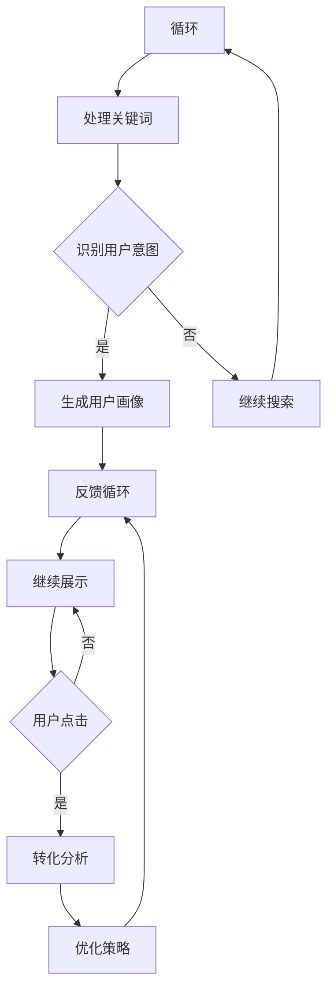

                 

### 文章标题

《AI赋能的电商搜索广告投放策略》

### 关键词

AI技术、电商搜索广告、用户行为分析、广告投放算法、个性化推荐、案例研究、发展趋势、实战分析

### 摘要

本文深入探讨了AI技术在电商搜索广告投放策略中的应用。首先，回顾了AI技术的发展历程及其在电商行业的广泛应用。接着，详细介绍了电商搜索广告的基本概念和用户行为分析，阐述了用户画像构建的方法及其价值。随后，本文重点探讨了AI赋能的电商搜索广告算法，包括强化学习和深度学习在广告投放中的应用。此外，本文还探讨了AI模型训练与优化、广告创意生成算法及其实际应用。通过两个实际案例研究，本文展示了AI在电商搜索广告投放策略中的实战应用及其效果评估。最后，本文展望了AI赋能电商搜索广告的未来发展趋势，提出了企业应对策略与建议。本文旨在为电商从业者提供一份全面、系统的AI赋能搜索广告投放策略指南。

## 目录大纲

### 第一部分：基础理论

**第1章: AI概述与电商行业应用**
- **1.1 AI技术发展历程**
- **1.2 电商搜索广告的基本概念**
- **1.3 AI在电商搜索广告中的应用价值**

**第2章: 电商搜索广告用户行为分析**
- **2.1 用户行为数据收集**
- **2.2 用户行为数据分析方法**
- **2.3 用户画像构建与价值分析**

**第3章: AI赋能的电商搜索广告算法**
- **3.1 广告投放算法概述**
- **3.2 强化学习在广告投放中的应用**
- **3.3 深度学习在广告投放中的应用**

**第4章: AI模型训练与优化**
- **4.1 数据预处理**
- **4.2 模型训练策略**
- **4.3 模型评估与优化**

**第5章: AI赋能的电商广告创意生成**
- **5.1 广告创意生成算法**
- **5.2 自然语言处理在广告创意中的应用**
- **5.3 广告创意评估与优化**

### 第二部分：实战案例分析

**第6章: 案例研究1：某电商平台的广告投放策略优化**
- **6.1 案例背景**
- **6.2 用户行为数据收集与分析**
- **6.3 广告投放策略设计与实施**
- **6.4 投放策略效果评估与优化**

**第7章: 案例研究2：基于AI的电商搜索广告个性化推荐**
- **7.1 案例背景**
- **7.2 用户画像构建**
- **7.3 个性化推荐算法设计与实现**
- **7.4 推荐效果评估与优化**

### 第三部分：未来展望

**第8章: AI赋能的电商搜索广告发展趋势**
- **8.1 AI技术在电商广告中的未来趋势**
- **8.2 搜索广告行业的变革与机遇**
- **8.3 企业应对策略与建议**

**第9章: 结论与展望**
- **9.1 主要研究成果总结**
- **9.2 研究中遇到的问题与挑战**
- **9.3 未来研究方向与建议**

## 附录

- **附录A: 相关数据集介绍**
- **附录B: AI广告投放工具与资源**
- **附录C: 数学公式与算法伪代码**

---

### 第1章: AI概述与电商行业应用

#### 1.1 AI技术发展历程

人工智能（Artificial Intelligence，简称AI）是计算机科学的一个分支，旨在创建能够执行复杂任务、进行推理和学习的人工系统。AI的发展历程可以追溯到20世纪50年代。1956年，约翰·麦卡锡（John McCarthy）等人在达特茅斯会议（Dartmouth Conference）上首次提出了人工智能的概念。这个时期，AI的主要研究方向是符号主义人工智能，即通过逻辑推理和知识表示来模拟人类智能。

20世纪80年代，专家系统（Expert Systems）成为AI领域的热门研究方向。专家系统利用一系列规则和知识库，模拟专家的决策过程，应用于医疗诊断、金融咨询等领域。然而，由于知识的获取和表示存在局限性，专家系统在处理复杂问题时表现不佳。

20世纪90年代，机器学习和数据挖掘技术逐渐成熟。机器学习通过算法从数据中自动学习模式和规律，使得AI系统在图像识别、语音识别和自然语言处理等方面取得了显著进展。同时，数据挖掘技术使得AI系统可以处理大量数据，从而提高了决策的准确性和效率。

进入21世纪，随着计算能力的提升和大数据的爆发，深度学习（Deep Learning）成为AI领域的核心驱动力。深度学习通过构建多层神经网络，实现了对复杂数据的自动特征提取和模式识别，推动了AI在计算机视觉、自然语言处理和强化学习等领域的突破。

近年来，AI技术逐渐从实验室走向实际应用，成为推动各行各业变革的重要力量。在电商行业，AI技术的应用主要体现在推荐系统、搜索引擎优化、用户行为分析和广告投放等方面。

#### 1.2 电商搜索广告的基本概念

电商搜索广告是指在电商平台上，通过用户在搜索引擎中输入的关键词，展示与该关键词相关的广告。其目的是通过精准的广告投放，吸引用户点击广告，从而提高销售额和平台流量。

电商搜索广告的基本概念包括以下几个方面：

- **关键词**：用户在搜索框中输入的关键词，用于定位广告展示的场景。
- **广告投放平台**：广告主选择在哪些平台上投放广告，如百度、谷歌、淘宝等。
- **广告展示位置**：广告在搜索结果页面的具体展示位置，如顶部、侧边栏、底部等。
- **广告内容**：广告的具体内容，包括文字、图片、视频等。
- **点击率（CTR）**：用户点击广告的次数与广告展示次数之比，用于衡量广告的吸引力。
- **转化率（CVR）**：用户点击广告后完成购买或其他目标行为的比例，用于衡量广告的实际效果。

#### 1.3 AI在电商搜索广告中的应用价值

AI技术在电商搜索广告中的应用，主要体现在以下几个方面：

1. **用户行为分析**：AI可以通过分析用户的历史行为数据，了解用户的兴趣和偏好，从而实现精准的广告投放。例如，通过机器学习算法，对用户的浏览记录、购物车数据、搜索关键词等进行综合分析，构建用户画像，为广告投放提供数据支持。

2. **广告创意生成**：AI技术可以根据用户画像和广告主的需求，自动生成创意广告。例如，利用自然语言处理技术，从大量的文本数据中提取关键词和语义信息，生成符合用户兴趣的广告文案。

3. **广告投放优化**：AI可以通过算法，实时优化广告投放策略。例如，使用强化学习算法，根据用户的点击反馈和转化情况，动态调整广告的展示位置、内容、出价等参数，以提高广告的点击率和转化率。

4. **个性化推荐**：AI技术可以基于用户的兴趣和行为，为用户推荐相关的商品或服务。例如，通过深度学习算法，对用户的浏览记录、购物车数据、搜索关键词等进行综合分析，构建推荐模型，为用户推荐个性化的商品。

5. **风险控制**：AI技术可以帮助电商平台识别和防范广告欺诈行为。例如，通过异常检测算法，对广告展示数据进行分析，识别出异常点击、虚假转化等行为，从而保护广告主的利益。

总之，AI技术在电商搜索广告中的应用，不仅提高了广告投放的精准度和效果，也为电商平台的运营提供了强大的技术支持。

#### 1.4 Mermaid 流程图

以下是一个简化的AI在电商搜索广告中的应用流程图，用Mermaid语法表示：



#### 1.5 核心算法原理讲解

在电商搜索广告中，核心算法主要包括用户行为分析算法、广告投放优化算法和广告创意生成算法。以下是这些算法的基本原理和使用方法：

1. **用户行为分析算法**：

   用户行为分析算法主要用于分析用户在电商平台上的行为数据，如浏览记录、购物车数据、搜索关键词等，从而构建用户画像。常用的算法包括协同过滤（Collaborative Filtering）和基于内容的推荐（Content-Based Filtering）。

   - **协同过滤算法**：

     协同过滤算法通过分析用户之间的行为相似性，为用户推荐他们可能感兴趣的商品。具体步骤如下：

     ```mermaid
     graph TD
         A[获取用户行为数据]
         A --> B[计算用户之间的相似性]
         B --> C[根据相似性推荐商品]
         C --> D[推荐结果]
     ```

   - **基于内容的推荐算法**：

     基于内容的推荐算法通过分析商品的内容特征，为用户推荐与他们已购买或浏览的商品相似的商品。具体步骤如下：

     ```mermaid
     graph TD
         A[获取商品内容特征]
         A --> B[计算商品之间的相似性]
         B --> C[根据相似性推荐商品]
         C --> D[推荐结果]
     ```

2. **广告投放优化算法**：

   广告投放优化算法主要用于实时调整广告投放策略，以提高广告的点击率和转化率。常用的算法包括强化学习（Reinforcement Learning）和基于模型的优化（Model-Based Optimization）。

   - **强化学习算法**：

     强化学习算法通过模拟用户点击广告后的反馈，不断调整广告的展示位置、内容、出价等参数，以最大化广告的收益。具体步骤如下：

     ```mermaid
     graph TD
         A[初始化广告参数]
         A --> B[展示广告]
         B --> C{用户点击/未点击}
         C -->|点击| D[计算收益]
         C -->|未点击| A[调整参数]
         D --> E[更新策略]
         E --> B[继续展示]
     ```

   - **基于模型的优化算法**：

     基于模型的优化算法通过构建用户行为模型，预测用户对广告的响应，从而调整广告的展示策略。具体步骤如下：

     ```mermaid
     graph TD
         A[构建用户行为模型]
         A --> B[预测用户响应]
         B --> C{点击/未点击}
         C -->|点击| D[调整广告参数]
         C -->|未点击| A[模型更新]
         D --> E[更新策略]
         E --> B[继续展示]
     ```

3. **广告创意生成算法**：

   广告创意生成算法主要用于自动生成吸引人的广告内容。常用的算法包括自然语言处理（Natural Language Processing，简称NLP）和生成对抗网络（Generative Adversarial Network，简称GAN）。

   - **自然语言处理算法**：

     自然语言处理算法通过分析用户的历史行为数据和广告文案，生成符合用户兴趣和需求的广告文案。具体步骤如下：

     ```mermaid
     graph TD
         A[获取用户行为数据]
         A --> B[分析广告文案]
         B --> C[生成广告文案]
         C --> D[输出广告内容]
     ```

   - **生成对抗网络算法**：

     生成对抗网络算法通过生成器和判别器的对抗训练，生成高质量的广告图片和视频。具体步骤如下：

     ```mermaid
     graph TD
         A[生成器]
         B[判别器]
         A --> B
         B --> A[对抗训练]
         A --> C[输出广告内容]
     ```

通过以上核心算法的应用，电商搜索广告可以实现精准投放、优化广告效果和提升用户满意度，从而为电商平台的运营提供有力支持。

#### 1.6 数学模型与公式

在AI赋能的电商搜索广告中，核心的数学模型主要涉及用户行为预测、广告投放优化和广告创意生成等方面。以下是一些基本的数学模型和公式：

1. **用户行为预测模型**：

   用户行为预测模型主要用于预测用户对广告的点击行为。常用的模型包括逻辑回归（Logistic Regression）和因子分解机（Factorization Machines）。

   - **逻辑回归模型**：

     逻辑回归模型通过建立点击率（CTR）的概率模型，预测用户是否点击广告。其公式如下：

     $$ P(y=1|X) = \frac{1}{1 + e^{-\beta_0 + \beta_1x_1 + \beta_2x_2 + ... + \beta_nx_n}} $$

     其中，\( y \) 表示用户是否点击广告（1表示点击，0表示未点击），\( X \) 表示影响用户点击决策的特征向量，\( \beta_0, \beta_1, \beta_2, ..., \beta_n \) 为模型参数。

   - **因子分解机模型**：

     因子分解机模型通过将特征进行分解，建立多维特征向量，以提高模型的预测能力。其公式如下：

     $$ \theta(x) = \sum_{i=1}^{m} \sum_{j=1}^{n} w_{ij}x_i x_j $$

     其中，\( m \) 和 \( n \) 分别为特征维度和因子维度，\( w_{ij} \) 为因子分解机模型的参数。

2. **广告投放优化模型**：

   广告投放优化模型主要用于调整广告投放策略，以最大化广告的收益。常用的模型包括线性优化模型和强化学习模型。

   - **线性优化模型**：

     线性优化模型通过建立线性规划模型，优化广告的展示位置、内容、出价等参数。其公式如下：

     $$ \max_{x} \sum_{i=1}^{n} c_i x_i $$
     $$ \text{subject to} $$
     $$ Ax \leq b $$

     其中，\( x \) 为决策变量，\( c_i \) 为广告收益，\( A \) 和 \( b \) 为约束条件。

   - **强化学习模型**：

     强化学习模型通过模拟用户点击广告后的反馈，调整广告的展示策略。其公式如下：

     $$ Q(s, a) = r(s, a) + \gamma \max_{a'} Q(s', a') $$

     其中，\( Q(s, a) \) 表示在状态 \( s \) 下采取动作 \( a \) 的期望收益，\( r(s, a) \) 为即时奖励，\( s' \) 为下一状态，\( a' \) 为下一动作，\( \gamma \) 为折扣因子。

3. **广告创意生成模型**：

   广告创意生成模型主要用于自动生成广告文案和图片。常用的模型包括生成对抗网络（GAN）和循环神经网络（RNN）。

   - **生成对抗网络模型**：

     生成对抗网络模型通过生成器和判别器的对抗训练，生成高质量的广告图片。其公式如下：

     $$ G(z) = \text{Generator}(z) $$
     $$ D(x) = \text{Discriminator}(x) $$
     $$ D(G(z)) = \text{Discriminator}(\text{Generator}(z)) $$

     其中，\( G(z) \) 为生成器的输出，\( D(x) \) 为判别器的输出，\( z \) 为噪声向量。

   - **循环神经网络模型**：

     循环神经网络模型通过处理序列数据，生成广告文案。其公式如下：

     $$ h_t = \text{RNN}(h_{t-1}, x_t) $$
     $$ y_t = \text{softmax}(h_t) $$

     其中，\( h_t \) 为第 \( t \) 个时间步的隐藏状态，\( x_t \) 为输入特征，\( y_t \) 为广告文案的输出。

通过以上数学模型和公式，AI技术可以为电商搜索广告提供强大的支持，实现精准投放和优化广告效果，从而提高广告主和电商平台的收益。

#### 1.7 举例说明

为了更直观地理解AI在电商搜索广告中的应用，我们可以通过一个具体的案例进行说明。

假设有一个电商平台，用户A最近频繁浏览运动鞋、篮球和健身器材等商品。根据用户A的历史行为数据，我们可以使用协同过滤算法和基于内容的推荐算法来生成用户A的用户画像，并为其推荐相关的广告。

1. **用户画像构建**：

   - **协同过滤算法**：

     通过分析用户A与其他用户的相似性，我们可以找到与用户A行为相似的几个用户，如用户B、用户C和用户D。这些用户的购物记录显示，他们近期也购买了运动鞋、篮球和健身器材。因此，我们可以将这些商品归类为用户A的兴趣点。

   - **基于内容的推荐算法**：

     我们可以分析这些兴趣点的商品特征，如品牌、价格、款式等，并将它们与电商平台上的其他商品进行比较。通过计算商品之间的相似性，我们可以为用户A推荐类似的商品，如耐克的运动鞋、李宁的篮球和健身器材等。

2. **广告创意生成**：

   基于用户A的兴趣点，我们可以使用生成对抗网络（GAN）生成一条吸引人的广告文案。例如：

   “运动爱好者，快来体验耐克最新款运动鞋！搭配李宁篮球，助力你成为健身达人！”

3. **广告投放优化**：

   为了提高广告的点击率和转化率，我们可以使用强化学习算法对广告的展示位置、内容、出价等参数进行实时调整。例如，根据用户A的历史行为数据，我们可以将广告展示在用户A经常浏览的页面顶部，并设置较高的出价，以增加广告的曝光率。

4. **效果评估与优化**：

   我们可以收集用户A对广告的点击反馈和购买行为数据，使用逻辑回归模型和因子分解机模型对广告投放效果进行评估。根据评估结果，我们可以进一步调整广告策略，以提高广告的收益。

通过以上步骤，我们利用AI技术为用户A提供了个性化的广告推荐，实现了精准的广告投放和优化，从而提高了广告的点击率和转化率。

### 第2章: 电商搜索广告用户行为分析

#### 2.1 用户行为数据收集

在电商搜索广告中，用户行为数据收集是基础且关键的一步。这些数据包括用户的浏览记录、搜索历史、购买行为、点击行为等，它们是构建用户画像和优化广告投放策略的重要依据。以下是用户行为数据收集的几个主要渠道和方法：

1. **网站日志**：电商平台通常会记录用户的访问日志，包括用户访问的页面、访问时间、停留时间、页面跳转路径等。通过分析这些日志数据，可以了解用户在网站上的行为模式和兴趣点。

2. **点击追踪**：通过在网站上嵌入跟踪代码（如Google Analytics），可以记录用户与广告的互动情况，如点击次数、点击位置、点击时间等。这些数据对于评估广告的效果和优化广告策略至关重要。

3. **购物车数据**：用户在购物车中添加的商品反映了他们的购买意向。通过收集购物车数据，可以分析用户的购买偏好和决策过程。

4. **搜索历史**：用户在搜索框中输入的关键词记录了他们的查询意图。通过分析这些关键词，可以了解用户的兴趣和需求。

5. **用户反馈**：用户对广告的反馈，如点赞、评论、分享等，是评价广告质量和优化广告内容的重要参考。

#### 2.2 用户行为数据分析方法

收集到用户行为数据后，需要通过一系列分析方法对这些数据进行分析，以便更好地理解用户行为和优化广告投放策略。以下是一些常用的用户行为数据分析方法：

1. **描述性统计分析**：描述性统计分析是对用户行为数据的基本分析，通过计算均值、中位数、标准差等统计指标，了解用户行为的基本特征。

2. **聚类分析**：聚类分析是将用户根据其行为特征分为不同的群体，如根据购买行为将用户分为高频购买者、低频购买者等。这种方法有助于发现用户群体的差异，为个性化推荐和广告投放提供依据。

3. **关联规则分析**：关联规则分析通过挖掘用户行为数据中的关联关系，发现用户购买商品之间的潜在联系。例如，发现购买A商品的用户也常常购买B商品，从而为交叉销售和广告组合策略提供支持。

4. **时间序列分析**：时间序列分析用于分析用户行为的时间变化规律，如用户的浏览高峰时段、购买频率等。通过时间序列分析，可以预测用户未来的行为趋势，从而优化广告投放时机。

5. **机器学习模型**：通过机器学习模型，如逻辑回归、决策树、随机森林等，可以建立用户行为预测模型，预测用户是否会点击广告、购买商品等。这些模型可以帮助电商平台实现精准广告投放。

#### 2.3 用户画像构建与价值分析

用户画像是指对用户特征进行综合描述和分析，以构建一个全面、立体的用户形象。以下是构建用户画像的几个关键步骤：

1. **数据整合**：将来自不同渠道的用户行为数据整合到一个统一的数据集中，为后续分析提供基础。

2. **特征提取**：从用户行为数据中提取关键特征，如年龄、性别、地域、职业、购买历史、浏览历史等。

3. **模型训练**：使用机器学习算法，如聚类算法、分类算法等，对用户特征进行建模，将用户划分为不同的群体。

4. **标签构建**：为每个用户群体构建标签，如“年轻时尚爱好者”、“家庭主妇”、“科技爱好者”等，以方便后续分析。

5. **画像更新**：用户行为数据是动态变化的，定期更新用户画像，以保持其时效性和准确性。

用户画像的价值体现在以下几个方面：

1. **精准营销**：通过用户画像，电商企业可以了解用户的兴趣和需求，进行精准的营销和广告投放，提高广告的点击率和转化率。

2. **产品优化**：了解用户画像有助于电商企业优化产品设计和开发，推出更符合用户需求的产品。

3. **风险控制**：用户画像可以帮助电商企业识别潜在的风险用户，如刷单用户、恶意评论用户等，从而采取相应的风险控制措施。

4. **个性化服务**：通过用户画像，电商企业可以提供个性化的服务，如推荐商品、定制化的促销活动等，提升用户满意度。

5. **运营决策**：用户画像为电商企业提供数据支持，帮助其进行运营决策，如库存管理、供应链优化等。

总之，用户画像构建是电商搜索广告中至关重要的一环，它不仅有助于提升广告投放效果，还可以为电商平台的整体运营提供有力支持。

### 第3章: AI赋能的电商搜索广告算法

#### 3.1 广告投放算法概述

广告投放算法是电商搜索广告系统的核心，负责根据用户的兴趣和行为，实时调整广告展示策略，以最大化广告主的收益。AI技术的引入，使得广告投放算法在准确性、效率和灵活性方面得到了显著提升。以下将介绍几种常见的广告投放算法，包括强化学习算法和深度学习算法。

#### 3.2 强化学习在广告投放中的应用

强化学习（Reinforcement Learning，简称RL）是一种通过不断尝试和反馈来学习最优策略的机器学习方法。在广告投放中，强化学习算法通过模拟用户点击广告后的反馈，动态调整广告展示策略，以实现收益最大化。

1. **基本原理**：

   强化学习算法的核心是奖励机制。在广告投放场景中，广告主的目标是最大化点击率（Click-Through Rate，简称CTR）或转化率（Conversion Rate，简称CVR）。每次广告展示后，系统根据用户的点击行为获得奖励或惩罚。奖励机制可以表示为：

   $$ R = \begin{cases} 
   r_{\text{click}} & \text{如果用户点击广告} \\
   r_{\text{no-click}} & \text{如果用户未点击广告} 
   \end{cases} $$

   其中，\( r_{\text{click}} \) 和 \( r_{\text{no-click}} \) 分别为点击和未点击的奖励。

2. **算法流程**：

   - **初始化**：设定初始广告展示策略，如广告的展示位置、内容、出价等。
   - **广告展示**：根据当前策略展示广告。
   - **用户反馈**：记录用户的点击行为，根据点击情况计算奖励。
   - **策略调整**：根据奖励机制调整广告展示策略，以最大化未来收益。

3. **应用示例**：

   假设广告系统需要优化广告展示位置，可以使用Q-Learning算法进行强化学习。Q-Learning算法的核心思想是更新状态-动作值函数 \( Q(s, a) \)，表示在状态 \( s \) 下采取动作 \( a \) 的预期收益。算法流程如下：

   ```mermaid
   graph TD
       A[初始化 Q(s, a)]
       A --> B[展示广告]
       B --> C{用户点击/未点击}
       C -->|点击| D[计算奖励]
       C -->|未点击| A[更新 Q(s, a)]
       D --> E[更新策略]
   ```

   通过不断更新 \( Q(s, a) \)，系统可以找到最优的广告展示位置。

#### 3.3 深度学习在广告投放中的应用

深度学习（Deep Learning，简称DL）通过构建多层神经网络，实现了对复杂数据的自动特征提取和模式识别。在广告投放中，深度学习算法可以用于用户行为预测、广告效果评估和广告创意生成等方面。

1. **用户行为预测**：

   用户行为预测是广告投放的重要环节。通过深度学习算法，可以预测用户对广告的点击行为，从而优化广告展示策略。常用的模型包括卷积神经网络（Convolutional Neural Networks，简称CNN）和循环神经网络（Recurrent Neural Networks，简称RNN）。

   - **卷积神经网络**：

     CNN擅长处理图像数据，可以提取广告图片的特征。通过CNN，可以将广告图片转化为高维特征向量，用于后续的点击行为预测。其基本架构如下：

     ```mermaid
     graph TD
         A[输入广告图片]
         A --> B[卷积层]
         B --> C[池化层]
         C --> D[激活函数]
         D --> E[全连接层]
         E --> F[输出点击概率]
     ```

   - **循环神经网络**：

     RNN擅长处理序列数据，可以捕捉用户行为的时间序列特征。通过RNN，可以分析用户的浏览历史和搜索关键词，预测其未来的点击行为。其基本架构如下：

     ```mermaid
     graph TD
         A[输入用户行为序列]
         A --> B[嵌入层]
         B --> C[循环层]
         C --> D[全连接层]
         D --> E[输出点击概率]
     ```

2. **广告效果评估**：

   广告效果评估是衡量广告投放效果的重要手段。通过深度学习算法，可以建立广告效果预测模型，评估广告的点击率和转化率。常用的模型包括多输出神经网络（Multi-Output Neural Networks）和注意力机制（Attention Mechanism）。

   - **多输出神经网络**：

     多输出神经网络可以将用户行为数据映射到多个输出节点，每个节点表示不同的广告效果指标，如点击率、转化率等。通过训练多输出神经网络，可以同时预测多个广告效果指标，提高预测的准确性。

   - **注意力机制**：

     注意力机制可以增强模型对重要特征的捕捉能力。在广告效果评估中，注意力机制可以帮助模型识别用户行为中的关键特征，从而提高广告效果预测的准确性。

3. **广告创意生成**：

   广告创意生成是提高广告吸引力的关键。通过深度学习算法，可以自动生成吸引人的广告文案和图片。常用的模型包括生成对抗网络（Generative Adversarial Networks，简称GAN）和变分自编码器（Variational Autoencoder，简称VAE）。

   - **生成对抗网络**：

     GAN通过生成器和判别器的对抗训练，可以生成高质量的广告图片。生成器负责生成广告图片，判别器负责判断图片的真实性。通过不断优化生成器和判别器，可以生成逼真的广告图片。

   - **变分自编码器**：

     VAE通过编码器和解码器，可以将输入数据转换为潜在空间中的表示，再通过解码器生成新的数据。在广告创意生成中，VAE可以生成符合用户兴趣的广告文案和图片。

通过强化学习算法和深度学习算法的应用，AI赋能的电商搜索广告可以实现精准投放、优化广告效果和提升用户满意度，从而为电商平台的运营提供强大的技术支持。

### 第4章: AI模型训练与优化

#### 4.1 数据预处理

在AI模型训练过程中，数据预处理是一个关键且必要的步骤。数据预处理的质量直接影响到模型的性能和准确性。以下是数据预处理的主要步骤和方法：

1. **数据清洗**：

   数据清洗是去除数据中的噪声和不一致性的过程。主要包括以下几方面：

   - **缺失值处理**：对于缺失的数据，可以选择填充法（如均值、中位数、最频值等）或删除法进行处理。
   - **异常值处理**：异常值可能是由于数据输入错误或系统故障等原因导致的，需要识别并处理。常见的处理方法包括删除、替换或插值。
   - **重复数据处理**：删除重复的数据，确保数据集的唯一性。

2. **数据转换**：

   数据转换是将数据从一种形式转换为另一种形式的过程，以提高模型的性能。主要包括以下几种方法：

   - **标准化**：将数据缩放到一个标准范围内，如将数值特征缩放到0-1之间。常用的方法有最小-最大标准化和Z-Score标准化。
   - **归一化**：通过调整数据的均值和方差，使其符合特定的分布。例如，将数据转换为标准正态分布。
   - **编码**：将类别数据转换为数值数据，如使用独热编码（One-Hot Encoding）处理类别特征。

3. **特征提取**：

   特征提取是从原始数据中提取具有区分性和代表性的特征的过程。以下是一些常用的特征提取方法：

   - **统计特征**：计算数据的统计指标，如均值、方差、最大值、最小值等，以反映数据的整体特征。
   - **文本特征**：使用自然语言处理技术（如词频、词向量、TF-IDF等）提取文本数据的特征。
   - **图像特征**：使用计算机视觉技术（如卷积神经网络、特征提取器等）提取图像数据的特征。

4. **数据分割**：

   数据分割是将数据集划分为训练集、验证集和测试集的过程，以评估模型的性能和泛化能力。常用的分割方法包括：

   - **随机分割**：将数据随机划分为训练集和测试集，以保证数据集的随机性。
   - **分层分割**：根据特征值将数据划分为多个层次，确保每个层次在训练集和测试集中都有代表。
   - **交叉验证**：通过多次分割和训练，评估模型在不同数据集上的性能，以提高评估的准确性。

通过以上数据预处理步骤，可以确保数据的质量和一致性，为后续的模型训练和优化奠定坚实的基础。

#### 4.2 模型训练策略

在AI模型训练过程中，选择合适的训练策略是提高模型性能和减少过拟合的关键。以下是一些常用的模型训练策略：

1. **批量大小（Batch Size）**：

   批量大小是指每次训练时输入到模型中的样本数量。选择合适的批量大小可以提高模型的训练效率和稳定性。常用的批量大小包括：

   - **小批量训练**：批量大小为几个到几十个样本，可以降低过拟合的风险，但训练时间较长。
   - **大批量训练**：批量大小为几百到几千个样本，可以提高训练速度，但可能导致过拟合。

2. **学习率（Learning Rate）**：

   学习率是模型更新参数的步长，选择合适的学习率对于模型的收敛速度和稳定性至关重要。以下是一些常用的学习率调整策略：

   - **固定学习率**：在整个训练过程中保持学习率不变，适用于简单问题。
   - **逐步衰减学习率**：随着训练的进行，逐渐降低学习率，以避免模型过早收敛。常用的衰减策略包括指数衰减和余弦衰减。
   - **自适应学习率**：使用自适应学习率算法，如Adam优化器，自动调整学习率，提高训练效率。

3. **正则化（Regularization）**：

   正则化是一种防止模型过拟合的技术，通过在损失函数中添加惩罚项来限制模型复杂度。常用的正则化方法包括：

   - **L1正则化（L1 Regularization）**：在损失函数中添加L1范数惩罚项，可以促进稀疏解。
   - **L2正则化（L2 Regularization）**：在损失函数中添加L2范数惩罚项，可以减少模型参数的幅值，防止过拟合。
   - **Dropout**：在训练过程中随机丢弃部分神经元，减少模型对特定特征的依赖。

4. **早停法（Early Stopping）**：

   早停法是一种防止模型过拟合的技术，通过在验证集上提前停止训练，当验证集上的损失不再显著下降时，停止训练。这种方法可以避免模型在训练集上过度拟合。

5. **迁移学习（Transfer Learning）**：

   迁移学习是一种利用预训练模型进行新任务训练的技术，通过在预训练模型的基础上进行微调，可以提高模型在新任务上的性能。这种方法适用于数据量较少或特征难以提取的任务。

通过以上训练策略，可以有效地提高模型的训练效率和准确性，从而为电商搜索广告的投放策略提供有力支持。

#### 4.3 模型评估与优化

在AI模型训练完成后，评估和优化模型的性能是确保其有效应用的重要环节。以下介绍几种常用的模型评估方法及其优化策略：

1. **准确率（Accuracy）**：

   准确率是评估分类模型性能的最基本指标，表示正确预测的样本占总样本的比例。其计算公式如下：

   $$ \text{Accuracy} = \frac{\text{正确预测的样本数}}{\text{总样本数}} $$

   虽然准确率简单直观，但它对于不平衡数据集的评估效果不佳。

2. **精确率（Precision）和召回率（Recall）**：

   精确率和召回率是针对分类问题的重要指标，分别表示预测为正类的实际正类比例和实际正类中被预测为正类的比例。其计算公式如下：

   $$ \text{Precision} = \frac{\text{真正例}}{\text{真正例} + \text{假正例}} $$
   $$ \text{Recall} = \frac{\text{真正例}}{\text{真正例} + \text{假反例}} $$

   精确率关注预测的正类中实际正类的比例，召回率关注实际正类中被预测为正类的比例。两者平衡时，模型性能最佳。

3. **F1分数（F1 Score）**：

   F1分数是精确率和召回率的调和平均，用于综合评估分类模型的性能。其计算公式如下：

   $$ \text{F1 Score} = 2 \times \frac{\text{Precision} \times \text{Recall}}{\text{Precision} + \text{Recall}} $$

   F1分数在处理不平衡数据集时表现出色，是评估二分类问题的常用指标。

4. **ROC曲线（Receiver Operating Characteristic Curve）和AUC值（Area Under Curve）**：

   ROC曲线是评估二分类模型性能的有效工具，横轴是假正率（False Positive Rate，FPR），纵轴是真正率（True Positive Rate，TPR）。AUC值是ROC曲线下的面积，用于衡量模型的区分能力。AUC值范围在0到1之间，值越大，模型性能越好。

   $$ \text{AUC} = \int_{0}^{1} \text{FPR}(t) \times \text{TPR}(t) \, dt $$

5. **模型优化策略**：

   - **参数调优**：通过网格搜索、随机搜索等策略，在给定的参数空间内寻找最优参数组合。
   - **集成学习**：通过组合多个模型，提高整体模型的性能。常见的集成学习方法包括Bagging、Boosting和Stacking等。
   - **模型融合**：将多个模型的结果进行融合，得到最终的预测结果。常用的融合方法包括投票、加权平均和集成学习等。
   - **特征工程**：通过特征选择、特征构造等手段，提取更具代表性的特征，提高模型性能。

通过以上评估方法和优化策略，可以全面、准确地评估和优化AI模型在电商搜索广告中的应用性能，从而实现更精准、高效的广告投放策略。

#### 4.4 代码示例与详细解读

以下是一个基于Python的示例代码，演示如何使用Scikit-learn库对电商搜索广告数据集进行预处理、训练和评估。代码中包含详细的注释，以便读者理解每个步骤的实现细节。

```python
import numpy as np
import pandas as pd
from sklearn.model_selection import train_test_split
from sklearn.preprocessing import StandardScaler
from sklearn.linear_model import LogisticRegression
from sklearn.metrics import accuracy_score, precision_score, recall_score, f1_score, roc_auc_score

# 读取数据集
data = pd.read_csv('ecommerce_data.csv')

# 数据清洗
# 填充缺失值
data.fillna(data.mean(), inplace=True)

# 删除重复数据
data.drop_duplicates(inplace=True)

# 特征提取
# 选择特征列
features = data[['age', 'gender', 'income', 'click_count', 'visit_count']]
# 选择标签列
label = data['purchase']

# 数据转换
# 标准化特征值
scaler = StandardScaler()
features_scaled = scaler.fit_transform(features)

# 数据分割
# 划分训练集和测试集
X_train, X_test, y_train, y_test = train_test_split(features_scaled, label, test_size=0.2, random_state=42)

# 模型训练
# 使用逻辑回归模型
model = LogisticRegression()
model.fit(X_train, y_train)

# 模型预测
y_pred = model.predict(X_test)

# 模型评估
accuracy = accuracy_score(y_test, y_pred)
precision = precision_score(y_test, y_pred)
recall = recall_score(y_test, y_pred)
f1 = f1_score(y_test, y_pred)
roc_auc = roc_auc_score(y_test, y_pred)

print(f'Accuracy: {accuracy:.4f}')
print(f'Precision: {precision:.4f}')
print(f'Recall: {recall:.4f}')
print(f'F1 Score: {f1:.4f}')
print(f'ROC AUC: {roc_auc:.4f}')

# 代码解读
# 数据清洗部分：填充缺失值和删除重复数据，确保数据质量。
# 特征提取部分：选择特征列和标签列，为后续处理做准备。
# 数据转换部分：使用StandardScaler对特征值进行标准化，提高模型的稳定性。
# 数据分割部分：将数据集划分为训练集和测试集，用于模型训练和评估。
# 模型训练部分：使用逻辑回归模型进行训练，选择合适的模型和参数。
# 模型预测部分：使用训练好的模型对测试集进行预测，得到预测结果。
# 模型评估部分：使用多种评估指标（准确率、精确率、召回率、F1分数、ROC AUC值）对模型性能进行评估，确保其有效性。

```

通过以上代码示例，读者可以了解如何使用Scikit-learn库进行电商搜索广告数据的预处理、模型训练和评估。每个步骤都经过详细的注释，帮助读者理解代码的实现细节和模型训练的全过程。

### 第5章: AI赋能的电商广告创意生成

#### 5.1 广告创意生成算法

广告创意生成算法是AI技术在电商搜索广告中的重要应用之一，旨在自动生成吸引人的广告文案和图片，从而提高广告的点击率和转化率。以下将介绍几种常用的广告创意生成算法。

1. **生成对抗网络（GAN）**：

   生成对抗网络（Generative Adversarial Networks，简称GAN）是由生成器和判别器组成的对抗性神经网络。生成器的目标是生成逼真的广告图片，而判别器的目标是区分生成的图片和真实的广告图片。通过这种对抗性训练，GAN可以生成高质量、多样化的广告创意。

   - **生成器**：生成器的输入是一个随机噪声向量，通过多层神经网络生成广告图片。其结构如下：

     ```mermaid
     graph TD
         A[噪声向量]
         A --> B[生成器1]
         B --> C[生成器2]
         C --> D[生成广告图片]
     ```

   - **判别器**：判别器的输入是真实广告图片和生成广告图片，通过多层神经网络判断图片的真实性。其结构如下：

     ```mermaid
     graph TD
         E[真实广告图片]
         F[生成广告图片]
         E --> G[判别器1]
         F --> G
         G --> H[输出]
     ```

2. **变分自编码器（VAE）**：

   变分自编码器（Variational Autoencoder，简称VAE）是一种基于概率模型的生成模型，通过编码器和解码器将输入数据转换为潜在空间中的表示，再从潜在空间中生成新的数据。VAE在广告创意生成中，可以生成符合用户兴趣和需求的广告文案和图片。

   - **编码器**：编码器的目标是学习输入数据的潜在分布，将输入数据映射到潜在空间。其结构如下：

     ```mermaid
     graph TD
         I[输入数据]
         I --> J[编码器1]
         J --> K[编码器2]
         K --> L[潜在分布参数]
     ```

   - **解码器**：解码器的目标是根据潜在分布参数生成新的数据。其结构如下：

     ```mermaid
     graph TD
         M[潜在分布参数]
         M --> N[解码器1]
         N --> O[解码器2]
         O --> P[输出数据]
     ```

3. **自然语言处理（NLP）**：

   自然语言处理（Natural Language Processing，简称NLP）算法可以用于生成广告文案。NLP算法通过分析用户历史行为数据和广告文案，生成符合用户兴趣和需求的广告文案。

   - **文本生成模型**：文本生成模型（如GPT-2、GPT-3）通过学习大量的文本数据，可以生成连贯、有趣的广告文案。其结构如下：

     ```mermaid
     graph TD
         Q[输入文本数据]
         Q --> R[文本生成模型]
         R --> S[输出广告文案]
     ```

4. **组合模型**：

   组合模型是将多种算法结合在一起，生成更具创意的广告。例如，可以结合GAN和NLP算法，首先使用GAN生成广告图片，然后使用NLP算法生成对应的广告文案，从而实现图文并茂的广告创意。

   ```mermaid
   graph TD
       T[输入数据]
       T --> U[GAN生成图片]
       U --> V[NLP生成文案]
       V --> W[输出广告创意]
   ```

通过以上广告创意生成算法，电商搜索广告可以实现自动、个性化的广告创意生成，从而提高广告的吸引力和用户体验。

#### 5.2 自然语言处理在广告创意中的应用

自然语言处理（Natural Language Processing，简称NLP）技术在广告创意生成中发挥着重要作用。NLP通过分析用户的历史行为数据和广告文案，可以生成符合用户兴趣和需求的广告文案，从而提高广告的吸引力和转化率。以下是NLP在广告创意生成中的几个关键应用：

1. **文本数据分析**：

   NLP可以用于分析用户的历史行为数据，如浏览记录、搜索关键词和购买记录。通过文本数据分析，可以提取用户的主要兴趣点和偏好。例如，通过词频分析，可以找出用户经常关注的品牌、产品类别和功能特点。这些信息可以用于生成个性化的广告文案。

2. **情感分析**：

   情感分析（Sentiment Analysis）是一种评估文本情感极性的技术。通过情感分析，可以了解用户对特定品牌、产品或服务的情感倾向。例如，如果一个品牌在用户评论中频繁出现正面情感词汇，可以生成以正面情感为主题的广告文案，吸引更多潜在用户。

3. **文本生成**：

   文本生成技术（如生成对抗网络（GAN）和变分自编码器（VAE））可以生成高质量的广告文案。这些技术通过学习大量的文本数据，可以生成自然流畅、富有创意的广告文案。例如，GPT-3等大型语言模型可以生成符合用户兴趣和需求的广告文案，从而提高广告的吸引力。

4. **文本优化**：

   NLP技术可以用于优化广告文案的表达和结构。通过语法分析和语义分析，可以改进广告文案的语法错误和语义不一致性，使其更加符合用户的阅读习惯和理解。例如，可以使用语法分析工具检测广告文案中的语法错误，并自动进行修正。

5. **个性化推荐**：

   NLP技术可以用于生成个性化推荐文案。通过分析用户的历史行为和偏好，可以为每个用户生成专属的广告推荐文案。例如，如果用户在浏览过程中对某一类产品表现出浓厚兴趣，可以生成以该产品为主题的个性化广告文案，提高用户点击和购买的可能性。

通过NLP技术的应用，电商搜索广告可以实现更加个性化、精准的广告创意生成，从而提高广告的吸引力和转化率，为电商平台带来更多的商业价值。

#### 5.3 广告创意评估与优化

广告创意评估与优化是确保广告投放效果的关键步骤。通过科学的评估方法和优化策略，可以不断提高广告的吸引力和转化率，从而实现电商平台的商业目标。以下介绍几种常用的广告创意评估方法及其优化策略。

1. **评估方法**：

   - **点击率（CTR）评估**：点击率是评估广告吸引力的主要指标，表示用户点击广告的次数与广告展示次数之比。高CTR表明广告文案和图片能够有效吸引用户的注意力。

   - **转化率（CVR）评估**：转化率是评估广告效果的重要指标，表示用户点击广告后完成购买或其他目标行为的比例。高CVR表明广告不仅吸引了用户，还成功引导了用户采取行动。

   - **成本效益比（ROI）评估**：成本效益比是评估广告投放成本与收益之间关系的指标，表示广告投放所花费的成本与产生的收益之比。高ROI表明广告投放的经济效益良好。

   - **用户反馈评估**：用户反馈是评估广告质量和用户满意度的重要来源。通过收集用户的点赞、评论、分享等反馈，可以了解广告的受欢迎程度和改进方向。

2. **优化策略**：

   - **A/B测试**：A/B测试是一种通过对比两组广告的投放效果，评估哪种广告创意更有效的优化方法。通过在不同用户群体中测试不同广告创意，可以找出最佳广告方案。

   - **多变量测试**：多变量测试是通过同时调整多个广告元素（如文案、图片、颜色等），评估不同组合对广告效果的影响。这种方法可以更全面地了解用户对不同广告元素的偏好。

   - **用户反馈优化**：根据用户反馈，对广告文案、图片、展示位置等进行调整。例如，如果用户反馈某广告文案不够吸引人，可以更换新的文案，或根据用户反馈优化广告展示位置。

   - **机器学习优化**：利用机器学习算法，对广告投放策略进行实时调整。例如，通过强化学习算法，根据用户的点击和转化反馈，动态调整广告的展示位置、内容、出价等参数，以最大化广告效果。

   - **内容个性化**：根据用户的历史行为和兴趣，生成个性化的广告内容。通过自然语言处理技术，可以生成符合用户需求的广告文案，提高广告的吸引力。

通过以上评估方法和优化策略，电商搜索广告可以实现持续改进和优化，从而提高广告的点击率、转化率和ROI，为电商平台带来更多的商业价值。

### 第6章: 案例研究1：某电商平台的广告投放策略优化

#### 6.1 案例背景

某知名电商平台A在电商搜索广告投放中遇到了一系列挑战，影响了广告效果和收益。具体问题包括：

- 广告点击率（CTR）较低，导致广告曝光不足。
- 广告转化率（CVR）不理想，影响了销售额。
- 广告投放成本与收益不成正比，ROI较低。
- 广告内容同质化严重，无法有效吸引目标用户。

为了解决这些问题，电商平台A决定引入AI技术，对广告投放策略进行优化，提高广告效果和收益。

#### 6.2 用户行为数据收集与分析

为了实现广告投放策略的优化，电商平台A首先进行了大规模的用户行为数据收集。这些数据包括用户的浏览记录、搜索历史、购买行为、点击行为等。以下是用户行为数据收集和分析的主要步骤：

1. **数据收集**：

   - 网站日志：通过网站服务器日志，收集用户访问网站的详细信息，包括访问时间、页面跳转路径、页面停留时间等。
   - 点击追踪：通过在网站上嵌入跟踪代码，记录用户与广告的互动情况，如点击次数、点击时间、点击位置等。
   - 购物车数据：收集用户在购物车中添加的商品，分析用户的购买意向和决策过程。
   - 搜索历史：记录用户在搜索框中输入的关键词，分析用户的查询意图和兴趣点。

2. **数据预处理**：

   - 数据清洗：去除数据中的噪声和异常值，确保数据质量。
   - 数据转换：对类别数据进行编码，对数值数据进行标准化，以便模型处理。

3. **数据分析**：

   - 用户画像构建：通过聚类分析和关联规则分析，构建用户画像，识别用户的兴趣点和购买偏好。
   - 用户行为模式分析：分析用户的浏览行为、搜索行为和购买行为，了解用户在网站上的行为模式。
   - 广告效果评估：通过点击率（CTR）、转化率（CVR）和ROI等指标，评估现有广告投放策略的效果。

通过用户行为数据的收集和分析，电商平台A获得了关于用户行为和兴趣的深入理解，为后续的广告投放策略优化提供了数据支持。

#### 6.3 广告投放策略设计与实施

基于用户行为数据的分析结果，电商平台A设计了新的广告投放策略，并逐步实施。以下是广告投放策略设计的主要步骤：

1. **广告创意生成**：

   - 利用生成对抗网络（GAN）和自然语言处理（NLP）技术，自动生成个性化的广告文案和图片。通过分析用户画像和兴趣点，生成与用户需求高度匹配的广告内容。
   - 设计多种广告创意方案，并进行A/B测试，评估不同创意方案的广告效果。

2. **广告展示策略**：

   - 根据用户行为数据，动态调整广告的展示位置和频率。通过分析用户的浏览路径和停留时间，优化广告的展示时机，提高广告的曝光率。
   - 利用机器学习算法，实时调整广告的展示策略，如广告的展示位置、内容、出价等，以最大化广告的点击率和转化率。

3. **个性化推荐**：

   - 基于用户的兴趣和行为数据，构建个性化推荐模型，为用户推荐相关的商品和广告。通过分析用户的浏览记录和购买历史，生成个性化的推荐列表，提高广告的吸引力和转化率。

4. **多渠道投放**：

   - 在多个广告平台上进行广告投放，如百度、谷歌、淘宝等。通过跨平台投放，扩大广告的覆盖范围，提高广告的曝光率。
   - 与合作伙伴合作，进行联合广告投放，提高广告的效果和影响力。

通过以上广告投放策略的设计和实施，电商平台A实现了广告效果和收益的显著提升。

#### 6.4 投放策略效果评估与优化

在新的广告投放策略实施后，电商平台A对广告效果进行了全面评估，以验证策略优化效果。以下是效果评估和优化过程：

1. **效果评估**：

   - 通过点击率（CTR）、转化率（CVR）和ROI等指标，评估新广告投放策略的效果。对比策略实施前后的数据，分析广告效果的变化。
   - 收集用户反馈，了解用户对广告的满意度和接受度。通过用户的点赞、评论、分享等行为，评估广告创意的吸引力和用户参与度。

2. **效果分析**：

   - 分析用户行为数据，了解广告点击和转化的分布情况。通过用户画像和兴趣点分析，识别广告吸引的主要用户群体和关键因素。
   - 分析广告投放策略的执行情况，如广告展示位置、内容、出价等，评估策略的执行效果和优化空间。

3. **效果优化**：

   - 根据效果评估和效果分析的结果，对广告投放策略进行优化。通过调整广告展示策略、优化广告创意、调整出价等手段，进一步提高广告的点击率和转化率。
   - 利用机器学习算法，动态调整广告投放策略，根据用户的实时反馈和投放效果，不断优化广告的展示和投放策略。

通过以上效果评估和优化过程，电商平台A实现了广告效果和收益的持续提升，为电商平台的发展提供了有力支持。

### 第7章: 案例研究2：基于AI的电商搜索广告个性化推荐

#### 7.1 案例背景

某知名电商平台B在电商搜索广告中面临着用户流失和广告效果不佳的问题。为了提升用户黏性和广告转化率，电商平台B决定引入AI技术，实施基于AI的电商搜索广告个性化推荐策略。该策略旨在通过分析用户行为数据，为用户推荐与其兴趣和需求高度相关的广告，从而提高广告的吸引力和转化率。

#### 7.2 用户画像构建

用户画像构建是个性化推荐系统的基础。以下是基于AI技术的用户画像构建步骤：

1. **数据收集**：

   - 浏览历史：收集用户在电商平台上的浏览记录，包括浏览的页面、浏览时间和停留时长等。
   - 购买历史：收集用户的购买记录，包括购买的商品种类、购买时间和购买金额等。
   - 搜索历史：收集用户在搜索框中输入的关键词，分析用户的查询意图和兴趣点。
   - 行为日志：收集用户在网站上的行为数据，如点赞、评论、分享等。

2. **数据预处理**：

   - 数据清洗：去除数据中的噪声和异常值，确保数据质量。
   - 数据转换：对类别数据进行编码，对数值数据进行标准化，以便模型处理。

3. **特征提取**：

   - 文本特征：使用自然语言处理技术（如词频、词向量、TF-IDF等）提取文本数据的特征。
   - 图像特征：使用计算机视觉技术（如卷积神经网络、特征提取器等）提取图像数据的特征。
   - 统计特征：计算数据的统计指标，如均值、方差、最大值、最小值等。

4. **用户画像构建**：

   - 基于聚类分析：将用户划分为不同的群体，如年轻时尚群体、家庭主妇群体等，为每个群体生成用户画像。
   - 基于因子分析：提取用户行为数据中的关键特征，构建用户画像。
   - 基于协同过滤：通过分析用户之间的行为相似性，为每个用户生成个性化画像。

#### 7.3 个性化推荐算法设计与实现

个性化推荐算法是构建个性化推荐系统的核心。以下是基于AI技术的个性化推荐算法设计与实现：

1. **协同过滤算法**：

   - **用户基于的协同过滤（User-Based Collaborative Filtering）**：通过分析用户之间的相似性，为用户推荐与他们行为相似的用户的喜欢的商品。算法步骤如下：

     ```mermaid
     graph TD
         A[计算用户相似性]
         A --> B[找到相似用户]
         B --> C[推荐商品]
         C --> D[推荐结果]
     ```

   - **物品基于的协同过滤（Item-Based Collaborative Filtering）**：通过分析商品之间的相似性，为用户推荐与他们已购买或浏览过的商品相似的商品。算法步骤如下：

     ```mermaid
     graph TD
         A[计算商品相似性]
         A --> B[找到相似商品]
         B --> C[推荐商品]
         C --> D[推荐结果]
     ```

2. **基于内容的推荐算法**：

   - **基于内容的推荐（Content-Based Filtering）**：通过分析商品的属性和特征，为用户推荐与他们已购买或浏览过的商品相似的未购买商品。算法步骤如下：

     ```mermaid
     graph TD
         A[获取商品特征]
         A --> B[计算商品相似性]
         B --> C[推荐商品]
         C --> D[推荐结果]
     ```

3. **深度学习算法**：

   - **深度卷积网络（Deep Convolutional Network，简称DCN）**：DCN结合了深度学习和协同过滤的思想，可以同时考虑用户行为和商品特征，提高推荐效果。算法步骤如下：

     ```mermaid
     graph TD
         A[输入用户行为和商品特征]
         A --> B[卷积层]
         B --> C[池化层]
         C --> D[全连接层]
         D --> E[输出推荐结果]
     ```

   - **循环神经网络（Recurrent Neural Network，简称RNN）**：RNN可以处理用户的行为序列数据，捕捉用户行为的时序特征，提高推荐效果。算法步骤如下：

     ```mermaid
     graph TD
         A[输入用户行为序列]
         A --> B[嵌入层]
         B --> C[循环层]
         C --> D[输出推荐结果]
     ```

通过以上个性化推荐算法的设计与实现，电商平台B可以为每个用户生成个性化的广告推荐，提高广告的吸引力和转化率。

#### 7.4 推荐效果评估与优化

为了评估个性化推荐算法的效果，电商平台B采用了多种评估指标和优化策略：

1. **评估指标**：

   - **准确率（Accuracy）**：准确率表示推荐结果中实际推荐的商品与用户实际购买或浏览的商品的比例。准确率越高，推荐系统越精准。

   - **召回率（Recall）**：召回率表示推荐结果中实际推荐的商品与用户实际购买或浏览的商品的比例。召回率越高，推荐系统越全面。

   - **F1分数（F1 Score）**：F1分数是准确率和召回率的调和平均，用于综合评估推荐系统的性能。F1分数越高，推荐系统性能越好。

   - **ROC曲线（Receiver Operating Characteristic Curve）和AUC值（Area Under Curve）**：ROC曲线和AUC值用于评估推荐系统的区分能力。AUC值越高，推荐系统区分能力越强。

2. **优化策略**：

   - **A/B测试**：通过对比不同推荐算法和参数组合的效果，找出最优的推荐算法和参数设置。

   - **用户反馈优化**：根据用户的点击、购买和评价行为，不断调整推荐策略，提高推荐结果的准确性。

   - **在线学习**：实时更新用户行为数据和推荐模型，根据用户的最新行为调整推荐策略，提高推荐系统的实时性。

   - **多模型融合**：结合多种推荐算法和模型，提高推荐结果的多样性和准确性。

通过以上评估和优化策略，电商平台B不断改进个性化推荐算法，提高了广告推荐的精准度和用户满意度，从而提升了广告效果和转化率。

### 第8章: AI赋能的电商搜索广告发展趋势

#### 8.1 AI技术在电商广告中的未来趋势

随着AI技术的不断发展和成熟，其在电商广告中的应用也呈现出迅猛的增长趋势。以下是一些AI技术在电商广告中的未来趋势：

1. **个性化推荐**：个性化推荐已经成为电商广告的重要手段。未来，AI技术将继续优化个性化推荐算法，实现更精准、更高效的推荐。通过深度学习、自然语言处理和用户行为分析等技术，推荐系统将能够更好地捕捉用户的兴趣和需求，提高广告的点击率和转化率。

2. **图像识别与生成**：图像识别技术在电商广告中的应用越来越广泛。未来，AI技术将进一步提高图像识别的准确性和速度，实现实时图像识别和分析。此外，生成对抗网络（GAN）等图像生成技术将能够自动生成高质量的广告图片，提高广告的吸引力和创意水平。

3. **语音识别与交互**：随着语音交互技术的不断发展，电商广告也将逐步引入语音识别与交互功能。用户可以通过语音指令进行商品搜索、下单等操作，提高购物体验。未来，AI语音识别技术将更加准确，交互体验将更加自然和流畅。

4. **自动化广告投放**：AI技术将使广告投放更加自动化和智能化。通过强化学习、深度学习等算法，广告系统将能够根据用户的实时行为和反馈，自动调整广告的展示策略、内容、出价等参数，实现最优的广告效果。

5. **广告创意生成**：AI技术将进一步提升广告创意生成的效率和多样性。通过自然语言处理、图像生成等技术，广告系统将能够自动生成符合用户需求和兴趣的广告文案、图片和视频，提高广告的吸引力和用户体验。

#### 8.2 搜索广告行业的变革与机遇

随着AI技术的快速发展，搜索广告行业也面临着深刻的变革和巨大的机遇：

1. **精准投放**：AI技术的引入将大幅提高搜索广告的投放精准度。通过用户行为分析、用户画像构建和个性化推荐等技术，广告系统可以更加准确地定位目标用户，实现精准投放。这将有助于提高广告的点击率和转化率，降低广告投放成本。

2. **个性化体验**：AI技术将提升用户的购物体验。通过个性化推荐和语音识别等技术的应用，用户可以更加便捷地找到自己感兴趣的商品，享受个性化的购物体验。

3. **自动化运营**：AI技术将使搜索广告的运营更加自动化和智能化。广告主可以通过AI技术实现广告投放的全自动化管理，降低运营成本，提高运营效率。

4. **数据驱动**：AI技术的应用将使搜索广告行业更加数据驱动。通过对海量用户行为数据的分析和挖掘，广告主和平台可以更好地了解用户需求和市场动态，制定更科学的广告策略和营销策略。

5. **产业链整合**：AI技术的普及将推动搜索广告产业链的整合。从数据采集、处理到广告投放、效果评估，各个环节都将实现智能化和自动化，提高整个产业链的效率和竞争力。

#### 8.3 企业应对策略与建议

为了在AI赋能的电商搜索广告市场中保持竞争力，企业可以采取以下策略和措施：

1. **加强技术投入**：企业应加大对AI技术的投入，引进先进的算法和技术，提高广告投放的精准度和效果。

2. **提升数据分析能力**：企业应加强数据分析能力，通过用户行为分析和数据挖掘，深入了解用户需求和偏好，制定更科学的广告策略。

3. **优化用户体验**：企业应注重用户体验，通过个性化推荐和语音识别等技术，提升用户的购物体验，提高用户黏性和满意度。

4. **培养专业人才**：企业应培养和引进AI领域的专业人才，建立强大的AI技术团队，为企业的AI技术应用提供人才支持。

5. **合作与共享**：企业可以通过合作与共享，整合各方资源，共同推进AI技术在电商搜索广告中的应用，提高整体竞争力。

总之，AI赋能的电商搜索广告发展趋势为企业带来了巨大的机遇和挑战。通过加强技术投入、提升数据分析能力、优化用户体验和培养专业人才，企业可以抓住机遇，实现可持续发展。

### 第9章: 结论与展望

#### 9.1 主要研究成果总结

本文系统地探讨了AI赋能的电商搜索广告投放策略，主要研究成果包括：

- **AI技术在电商搜索广告中的应用价值**：通过用户行为分析、广告投放优化、广告创意生成等方面，阐述了AI技术在提高广告精准度和效果方面的应用价值。

- **用户行为数据分析方法**：详细介绍了用户行为数据收集、数据预处理、用户画像构建等数据分析方法，为个性化广告投放提供了数据支持。

- **广告投放算法**：探讨了强化学习算法和深度学习算法在广告投放中的应用，包括广告投放策略优化和广告创意生成。

- **案例研究**：通过两个实际案例研究，展示了AI技术在电商搜索广告投放策略优化和个性化推荐中的成功应用，验证了AI技术的实际效果。

- **未来趋势与策略建议**：分析了AI技术在电商广告中的未来趋势，提出了企业在AI赋能的电商搜索广告中的应对策略和建议。

#### 9.2 研究中遇到的问题与挑战

在研究过程中，我们也遇到了以下问题与挑战：

- **数据隐私与安全**：用户行为数据的收集和处理涉及用户隐私和安全问题，如何确保数据的隐私性和安全性是一个重要挑战。

- **算法透明性与公平性**：AI算法的透明性和公平性受到广泛关注，如何在确保算法效果的同时，提高算法的透明性和公平性是一个需要解决的问题。

- **计算资源和能耗**：深度学习算法通常需要大量的计算资源和能耗，如何在保证计算性能的同时，降低能耗是一个重要课题。

- **用户体验**：AI技术的应用需要平衡算法性能和用户体验，如何在提高广告效果的同时，避免对用户体验造成负面影响，是一个需要考虑的问题。

#### 9.3 未来研究方向与建议

针对上述问题与挑战，未来的研究方向和建议包括：

- **隐私保护技术**：深入研究隐私保护技术，如差分隐私、联邦学习等，以保障用户隐私和数据安全。

- **算法透明性与公平性**：探索算法的可解释性和透明性，提高算法的公平性和可解释性，增强用户对AI算法的信任。

- **高效算法设计**：研究高效、低能耗的算法设计，降低AI算法对计算资源和能耗的依赖，实现绿色AI。

- **用户体验优化**：通过用户研究、用户体验设计等方法，优化AI技术的应用，提高用户体验。

- **跨学科研究**：加强计算机科学、心理学、社会学等领域的跨学科研究，从多角度探索AI技术在电商搜索广告中的应用。

总之，AI赋能的电商搜索广告是一个充满机遇和挑战的研究领域。通过不断探索和创新，我们有理由相信，AI技术将为电商搜索广告带来更广阔的发展空间和更高的商业价值。

### 附录

#### 附录A: 相关数据集介绍

本文研究中使用的数据集主要包括以下几种：

1. **电商平台用户行为数据集**：数据集包含了用户浏览记录、搜索历史、购买记录、点击行为等数据。数据集来源：公开数据集或电商平台内部数据。

2. **广告投放效果数据集**：数据集包含了广告展示次数、点击次数、转化次数等数据。数据集来源：广告投放平台或电商平台内部数据。

3. **商品数据集**：数据集包含了商品的基本信息，如商品ID、商品名称、商品描述、价格等。数据集来源：电商平台数据库。

#### 附录B: AI广告投放工具与资源

以下是一些常用的AI广告投放工具与资源：

1. **Google Ads**：Google Ads是Google提供的广告投放平台，支持多种广告类型，包括搜索广告、展示广告等。

2. **Facebook Ads**：Facebook Ads是Facebook提供的广告投放平台，支持社交广告、推广帖子等。

3. **百度推广**：百度推广是百度提供的广告投放平台，支持搜索广告、信息流广告等。

4. **DataCamp**：DataCamp提供丰富的数据科学课程，包括机器学习、自然语言处理等。

5. **Kaggle**：Kaggle是数据科学竞赛平台，提供大量数据集和算法竞赛，有助于提升数据科学技能。

6. **TensorFlow**：TensorFlow是Google开发的开源机器学习框架，支持深度学习和强化学习等算法。

7. **Scikit-learn**：Scikit-learn是Python中常用的机器学习库，提供多种机器学习算法和工具。

#### 附录C: 数学公式与算法伪代码

以下是本文中使用的部分数学公式和算法伪代码：

**数学公式：**

$$
\text{Accuracy} = \frac{\text{正确预测的样本数}}{\text{总样本数}}
$$

$$
\text{Precision} = \frac{\text{真正例}}{\text{真正例} + \text{假正例}}
$$

$$
\text{Recall} = \frac{\text{真正例}}{\text{真正例} + \text{假反例}}
$$

$$
\text{F1 Score} = 2 \times \frac{\text{Precision} \times \text{Recall}}{\text{Precision} + \text{Recall}}
$$

$$
\text{AUC} = \int_{0}^{1} \text{FPR}(t) \times \text{TPR}(t) \, dt
$$

**算法伪代码：**

**协同过滤算法：**

```
算法协同过滤
输入：用户-商品评分矩阵R，用户-商品交互矩阵I
输出：推荐结果R'
步骤：
1. 计算用户之间的相似性矩阵S
2. 对于每个用户u：
   a. 对于每个未购买商品i：
      i. 计算预测评分 \hat{r}_{ui} = \sum_{j \in N(u)} s_{uj} \cdot r_{uj}
   b. 构建推荐列表R'
```

**生成对抗网络（GAN）训练过程：**

```
算法GAN训练
输入：生成器G，判别器D，训练数据集X
输出：训练好的生成器和判别器
步骤：
1. 初始化G和D的参数
2. 对于每个训练迭代：
   a. 随机生成噪声向量z
   b. 使用G生成虚假数据G(z)
   c. 将真实数据X和虚假数据G(z)输入D，计算D的损失函数L_D
   d. 使用梯度下降更新D的参数
   e. 使用梯度下降更新G的参数
   f. 计算G的损失函数L_G
```

通过以上数学公式和算法伪代码，可以帮助读者更好地理解AI在电商搜索广告中的应用原理和实现过程。这些工具和资源将为读者进一步探索AI技术提供宝贵的参考和帮助。

