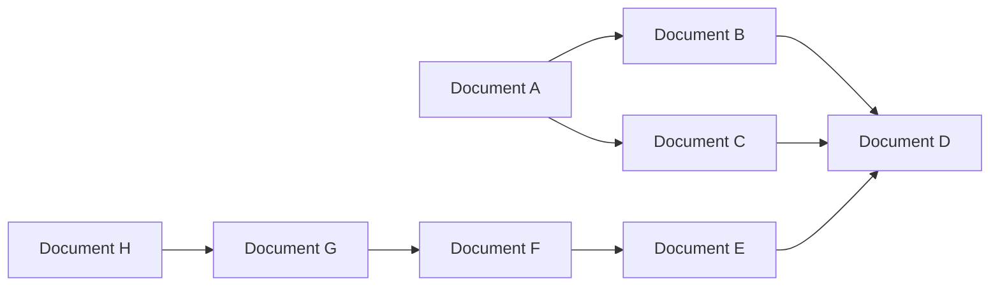

                 

### 文章标题

# AI辅助科研：文献综述与假设生成

### 关键词：
- 人工智能
- 科研辅助
- 文献检索
- 文献综述
- 假设生成

### 摘要：
本文旨在探讨人工智能在科研领域的辅助作用，特别是文献综述和假设生成方面的应用。通过分析AI在文献检索中的应用，介绍基于AI的文献推荐系统和文献分析技术，本文进一步探讨了AI在假设生成中的基本原理和技术方法。最后，通过两个实际案例展示了AI辅助科研的具体应用，并对未来AI辅助科研的发展趋势进行了展望。本文旨在为科研工作者提供有价值的参考，帮助他们更好地利用AI工具提高科研效率。

#### 第一部分：AI辅助科研概述

### 第1章：AI辅助科研的重要性

## 1.1 AI在科研领域的应用现状

在当今的科研领域，人工智能（AI）的应用日益广泛。从自然语言处理到计算机视觉，从机器学习到深度学习，AI技术正在深刻改变着科研工作的各个方面。以下是AI在科研领域的一些典型应用：

1. **数据分析和挖掘**：AI技术，特别是机器学习和深度学习，在处理和挖掘大量科研数据方面发挥着重要作用。这些技术可以帮助科研人员从海量数据中发现潜在的模式和规律，从而加速科研进展。
2. **实验设计和优化**：AI可以辅助科研人员设计更有效的实验方案，通过模拟和预测来减少实验次数，提高实验成功率。
3. **药物研发**：AI在药物研发中的应用越来越受到关注。例如，通过分子模拟和预测，AI可以帮助发现新的药物候选分子，加速药物研发进程。
4. **文献检索与综述**：AI技术可以用于自动化文献检索和文献综述，帮助科研人员快速获取相关研究信息，减少重复劳动。
5. **实验结果预测**：AI可以通过学习已有的实验数据，预测新的实验结果，从而指导科研工作。

## 1.2 AI辅助科研的优势

AI在科研领域具有以下几大优势：

1. **高效性**：AI技术可以快速处理大量数据，提高科研效率。例如，机器学习算法可以自动分析海量实验数据，找出其中的关键规律。
2. **准确性**：AI可以通过学习大量的数据和模型，提高实验结果的预测准确性。这对于药物研发等高风险、高成本的领域尤为重要。
3. **创新性**：AI技术可以帮助科研人员提出新的假设和解决方案，推动科研领域的创新。例如，通过深度学习，AI可以识别出之前未被发现的图像特征，从而为医学影像诊断等领域带来新的突破。
4. **跨学科融合**：AI技术可以促进不同学科之间的融合，解决复杂科研问题。例如，生物学和计算机科学的结合，可以通过AI技术解决基因组学、神经科学等领域中的复杂问题。

## 1.3 AI辅助科研的挑战

尽管AI在科研领域具有巨大的潜力，但在实际应用中也面临一些挑战：

1. **数据质量**：AI算法的性能很大程度上依赖于数据的质量和数量。如果数据存在噪声或偏见，可能会导致错误的结果。
2. **算法透明性**：深度学习等复杂AI算法的黑箱特性使得其决策过程难以解释，这在某些科研领域可能是一个问题。
3. **隐私和安全**：在处理敏感数据时，如何保护数据隐私和安全是一个重要问题。
4. **伦理和法规**：AI技术在科研中的应用需要遵守相关伦理和法规要求，以确保科研的公正性和透明性。
5. **人才短缺**：尽管AI技术在科研领域有巨大潜力，但相关人才短缺可能限制了其广泛应用。

### 总结与展望

综上所述，AI在科研领域的应用已经取得了显著成果，同时也面临着一些挑战。为了更好地发挥AI在科研中的潜力，科研人员需要不断学习和掌握相关技术，同时关注数据质量、算法透明性、隐私和安全等问题。在未来，随着技术的不断进步和应用的深入，AI有望在科研领域发挥更加重要的作用，推动科学发现和技术创新。

#### 第二部分：AI辅助文献检索

### 第2章：AI在文献检索中的应用

## 2.1 文献检索的算法与工具

文献检索是科研工作中的重要环节，AI技术为文献检索带来了新的可能性。以下是常用的AI算法和工具：

1. **关键词提取算法**：关键词提取是文献检索的重要步骤。常见的算法有TF-IDF、Word2Vec和BERT等。这些算法可以通过分析文献中的词汇和语义关系，提取出关键的主题词，从而提高检索的准确性。

    ```python
    from sklearn.feature_extraction.text import TfidfVectorizer

    vectorizer = TfidfVectorizer()
    X = vectorizer.fit_transform(corpus)
    ```

2. **文本分类算法**：文本分类算法可以将文献按照主题或类别进行分类，常见的算法有朴素贝叶斯、支持向量机和深度学习等。通过文本分类，科研人员可以快速筛选出与自己研究相关的文献。

    ```python
    from sklearn.naive_bayes import MultinomialNB

    clf = MultinomialNB().fit(X_train, y_train)
    y_pred = clf.predict(X_test)
    ```

3. **基于模型的检索**：基于模型的检索是通过构建模型来预测文献的相关性。常见的模型有基于向量空间模型的检索和基于深度学习模型的检索。这些模型可以通过学习大量的文献数据，提高检索的准确性。

    ```python
    import tensorflow as tf

    model = tf.keras.Sequential([
        tf.keras.layers.Dense(128, activation='relu', input_shape=(vocab_size,)),
        tf.keras.layers.Dense(1, activation='sigmoid')
    ])

    model.compile(loss='binary_crossentropy', optimizer='adam', metrics=['accuracy'])
    model.fit(X_train, y_train, epochs=10, batch_size=32)
    ```

## 2.2 基于AI的文献推荐系统

文献推荐系统是AI在科研领域的重要应用之一。通过分析用户的兴趣和阅读历史，文献推荐系统可以自动为用户推荐相关的文献。以下是常用的文献推荐算法：

1. **基于内容的推荐**：基于内容的推荐是通过分析文献的内容特征，为用户推荐具有相似内容的文献。常见的算法有TF-IDF和Word2Vec等。

    ```python
    from sklearn.metrics.pairwise import cosine_similarity

    similarity_matrix = cosine_similarity(query_vector, corpus)
    recommended_docs = np.argsort(similarity_matrix[0])[::-1][1:11]
    ```

2. **协同过滤推荐**：协同过滤推荐是通过分析用户之间的行为相似性，为用户推荐他们可能感兴趣的文献。常见的算法有用户基于的协同过滤和物品基于的协同过滤。

    ```python
    from surprise import KNNWithMeans

    algo = KNNWithMeans(k=50)
    algo.fit(trainset)

    user = 123
    user_similar_items = algo.get_neighbors(user, k=10)
    recommended_items = [trainset[i].id for i in user_similar_items]
    ```

3. **混合推荐**：混合推荐是将基于内容和协同过滤推荐结合起来，以提高推荐系统的准确性。

    ```python
    from sklearn.ensemble import RandomForestClassifier

    clf = RandomForestClassifier(n_estimators=100)
    clf.fit(X_train, y_train)

    user = 123
    content_vector = vectorizer.transform([document_text])
    collaborative_score = clf.predict(content_vector)[0]
    content_score = np.mean(similarity_matrix[0][user_similar_items])

    hybrid_score = 0.5 * collaborative_score + 0.5 * content_score
    recommended_docs = np.argsort(hybrid_score)[::-1][1:11]
    ```

通过这些算法，文献推荐系统可以为科研人员提供个性化的文献推荐，帮助他们更高效地获取相关研究信息。

### 总结

AI技术在文献检索中的应用，极大地提高了科研人员的工作效率。通过关键词提取、文本分类和基于模型的检索等算法，AI可以自动识别和筛选相关的文献。此外，基于内容的推荐和协同过滤推荐等算法，可以自动为用户推荐他们感兴趣的文献，进一步提升了文献检索的体验。在未来，随着AI技术的不断发展和应用，文献检索系统将变得更加智能化和个性化，为科研工作提供更加有力的支持。

#### 第二部分：AI辅助文献综述

### 第3章：文献综述的方法与步骤

## 3.1 文献综述的目的与意义

文献综述是对某一领域内相关文献进行全面、系统的分析和总结的过程。其主要目的是：

1. **掌握研究现状**：通过回顾和分析现有文献，了解该领域的研究进展和现状，为后续研究提供基础。
2. **发现研究空白**：文献综述可以帮助发现研究领域中的空白和未解决的问题，为新的研究方向提供启示。
3. **指导研究方向**：通过对现有文献的分析，科研人员可以确定自己研究的关键点和创新点，指导研究方向。
4. **提高研究质量**：文献综述有助于科研人员更好地理解研究背景，提出更加科学和有针对性的研究问题。

## 3.2 文献检索与筛选

文献检索是进行文献综述的第一步，其质量直接影响综述的准确性。以下是文献检索和筛选的常用方法：

1. **数据库检索**：利用学术数据库（如PubMed、IEEE Xplore、CNKI等）进行关键词检索，获取相关文献。
2. **文献筛选**：通过阅读文献标题、摘要和结论，筛选出与研究主题紧密相关的文献。
3. **参考文献追踪**：通过阅读所选文献的参考文献，发现更多的相关研究，形成完整的文献网络。

## 3.3 文献整理与分析

文献整理和分析是文献综述的核心步骤，其目标是提取文献中的关键信息，形成系统的综述内容。以下是常用的方法：

1. **主题分类**：根据文献的主题和内容，将文献分为不同的类别，便于后续的分析和总结。
2. **内容提取**：从每篇文献中提取关键信息，如研究方法、研究结果和结论，形成详细的研究笔记。
3. **比较分析**：对同一主题的不同文献进行比较分析，找出研究方法、结果和结论的异同，为综述提供深度分析。
4. **图表可视化**：通过绘制图表（如词云、主题分布图等），直观展示文献中的关键信息和关系。

### 总结

文献综述是科研工作中的重要环节，通过系统、全面的文献检索、筛选、整理和分析，科研人员可以深入了解研究领域的现状和发展趋势，发现研究空白，指导自己的研究方向。AI技术在文献综述中的应用，如关键词提取、文本分类和文献推荐等，极大地提高了文献综述的效率和质量。未来，随着AI技术的进一步发展，文献综述将变得更加智能和高效，为科研工作提供更有力的支持。

### 第4章：基于AI的文献分析技术

## 4.1 文本挖掘与语义分析

文本挖掘和语义分析是AI技术在文献分析中的重要应用，它们可以帮助科研人员从大量的文献数据中提取有价值的信息，揭示文献之间的关联和规律。

### 4.1.1 词频统计与词云图

词频统计是文本挖掘的基础步骤，通过统计文献中每个词的出现次数，可以初步了解文献的主题和内容。词云图则是词频统计的一种可视化方法，通过将高频词以不同的字体大小和颜色展示出来，使科研人员能够直观地识别文献的关键词和主题。

```python
from wordcloud import WordCloud

text = " ".join(document for document in corpus)
wordcloud = WordCloud(width=800, height=800, background_color="white").generate(text)
plt.figure(figsize=(8, 8))
plt.imshow(wordcloud, interpolation="bilinear")
plt.axis("off")
plt.show()
```

### 4.1.2 主题模型

主题模型是一种无监督的文本分析技术，它可以将大量文本数据自动聚类成若干主题，每个主题由一系列关键词组成。最常见的主题模型是LDA（Latent Dirichlet Allocation），它通过概率模型来揭示文本中的隐含主题。

```python
from gensim.models import LdaMulticore

# 将文档转换为词向量
from gensim import corpora

dictionary = corpora.Dictionary(corpus)
corpus = [dictionary.doc2bow(document) for document in corpus]

# 训练LDA模型
ldamodel = LdaMulticore(corpus, num_topics=5, id2word=dictionary, passes=10, workers=2)

# 打印每个主题的关键词
for idx, topic in enumerate(ldamodel.show_topics()):
    print(f"主题{idx}: {topic}")
```

### 4.1.3 文本分类与情感分析

文本分类是一种将文本数据分配到预定义类别中的技术，它可以帮助科研人员快速识别文献的类型和主题。情感分析则是一种特殊的文本分类，用于识别文本的情感倾向，如正面、负面或中性。

```python
from sklearn.feature_extraction.text import TfidfVectorizer
from sklearn.naive_bayes import MultinomialNB

# 创建TF-IDF向量器
vectorizer = TfidfVectorizer()

# 训练文本分类模型
X = vectorizer.fit_transform(corpus)
y = np.array(labels)
clf = MultinomialNB().fit(X, y)

# 预测新文本的类别
new_text = ["This is a great paper."]
new_vector = vectorizer.transform(new_text)
predicted_class = clf.predict(new_vector)
print(f"The predicted class is: {predicted_class}")
```

### 4.2 文献关系网络分析

文献关系网络分析是一种通过构建文献之间的网络关系图，来揭示文献之间的联系和影响的技术。这种分析可以帮助科研人员了解某一领域的研究热点和趋势。



通过构建文献关系网络，科研人员可以更清晰地了解不同文献之间的关联，从而更好地把握研究领域的发展动态。

### 总结

基于AI的文本挖掘和语义分析技术，为文献分析提供了强大的工具。词频统计与词云图、主题模型、文本分类与情感分析以及文献关系网络分析等技术，可以帮助科研人员从海量文献数据中提取有价值的信息，揭示文献之间的联系和规律。这些技术的应用，不仅提高了文献分析的效率，也为科研工作提供了新的视角和方法。

#### 第三部分：AI辅助假设生成

### 第5章：假设生成的基本原理

## 5.1 假设生成的目的与意义

假设生成是科研过程中的关键环节，它旨在提出有根据的、可验证的猜测，从而指导后续的研究工作。假设生成在科研中的目的和意义如下：

1. **确定研究方向**：通过提出合理的假设，科研人员可以明确研究的目标和方向，避免盲目性和重复性。
2. **推动科学进步**：合理的假设可以激发新的研究思路，推动科学领域的进步和技术的创新。
3. **优化实验设计**：基于假设的实验设计可以更高效地利用资源，减少实验的盲目性和不确定性。
4. **提高研究质量**：通过假设生成，科研人员可以更系统地分析和解决问题，提高研究的科学性和可靠性。

## 5.2 假设生成的方法与策略

假设生成的方法和策略多种多样，以下是几种常用的方法：

1. **归纳法**：归纳法是从具体的事实或实例中归纳出一般性的结论或假设。例如，通过对多个实验结果的观察和总结，提出一个普遍适用的规律。
2. **演绎法**：演绎法是从一般原理或假设出发，推导出具体结论或假设。例如，根据某个理论模型或假设，推导出具体的实验设计或预期结果。
3. **类比法**：类比法是通过对相似领域的已有研究成果进行类比，提出新的假设。例如，将生物学中的某种现象类比到物理学中，提出新的假设。
4. **数据驱动法**：数据驱动法是基于数据分析，从大量数据中挖掘潜在的规律和模式，从而生成假设。例如，通过机器学习算法分析数据，发现数据中的隐含关系，提出新的假设。

## 5.3 假设生成的评价与选择

假设生成后，需要对假设进行评价和选择，以确定哪些假设具有更高的可信度和可行性。以下是几种评价和选择假设的方法：

1. **逻辑一致性**：评估假设是否与现有的科学理论和已知事实相符，确保假设的逻辑一致性。
2. **实验可行性**：考虑假设是否可以在实验或观察中验证，评估其实验可行性。
3. **数据支持度**：基于数据分析的结果，评估假设与数据的一致性和支持度。
4. **创新性**：评估假设的创新程度，是否有潜力产生新的科学发现或技术突破。
5. **经济性**：考虑假设研究的成本效益，评估其经济性。

通过综合评价和选择，科研人员可以确定最具潜力和发展价值的假设，从而指导后续的研究工作。

### 总结

假设生成是科研过程中的关键环节，其目的是明确研究方向、推动科学进步、优化实验设计和提高研究质量。常用的假设生成方法包括归纳法、演绎法、类比法和数据驱动法。在假设生成后，需要对假设进行评价和选择，以确保其科学性、可行性和创新性。通过合理的假设生成和评价，科研人员可以更好地指导研究工作，推动科学领域的进展。

### 第6章：基于AI的假设生成技术

## 6.1 生成对抗网络（GAN）

生成对抗网络（Generative Adversarial Network，GAN）是一种强大的深度学习模型，由生成器和判别器两个神经网络组成。生成器的目标是生成逼真的数据，而判别器的目标是区分生成器和真实数据。两者相互竞争，共同提高模型性能。

### 6.1.1 GAN的原理与架构

GAN的原理可以简单描述为：生成器和判别器进行一场“博弈”。生成器尝试生成尽可能逼真的数据，而判别器则努力区分生成数据和真实数据。具体来说：

1. **生成器（Generator）**：生成器的目标是生成与真实数据相似的数据。它通常由多层神经网络组成，输入是随机噪声，输出是生成数据。
2. **判别器（Discriminator）**：判别器的目标是判断输入数据是真实数据还是生成数据。它也是一个多层神经网络，输入是数据，输出是一个概率值，表示输入数据的真实度。

GAN的训练过程如下：

1. **初始化**：初始化生成器和判别器，通常使用随机权重。
2. **训练判别器**：对于每一批真实数据和生成数据，训练判别器，使其能够更好地区分真实数据和生成数据。
3. **训练生成器**：在判别器训练完成后，更新生成器的权重，使其生成的数据更加逼真。

### 6.1.2 GAN在假设生成中的应用

GAN在假设生成中的应用主要基于其强大的数据生成能力。通过GAN，可以生成与真实数据分布相似的数据，从而为假设生成提供数据支持。以下是一个简化的GAN在假设生成中的应用流程：

1. **数据准备**：收集与假设相关的数据，例如实验结果、文献资料等。
2. **生成数据**：使用GAN生成与真实数据相似的数据，扩充数据集，提高训练效果。
3. **假设生成**：基于生成数据和已有知识，提出新的假设。
4. **验证假设**：通过实验或进一步的数据分析，验证假设的合理性。

### 6.2 强化学习在假设生成中的应用

强化学习（Reinforcement Learning，RL）是一种通过试错和反馈来学习最优策略的机器学习技术。在假设生成中，强化学习可以通过与环境互动，逐步优化假设的生成过程。

### 6.2.1 强化学习的原理与架构

强化学习的基本原理是：通过在环境中进行一系列决策，学习获得最大的累积奖励。其核心组件包括：

1. **环境（Environment）**：环境是假设生成过程中的外部条件，例如实验条件、数据集等。
2. **智能体（Agent）**：智能体是执行决策并接收环境反馈的实体。在假设生成中，智能体可以是基于机器学习的模型。
3. **策略（Policy）**：策略是智能体在特定情况下做出的决策。在假设生成中，策略是生成假设的方式。
4. **奖励函数（Reward Function）**：奖励函数是评估智能体行为的好坏的指标。在假设生成中，奖励函数可以根据假设的合理性、实验结果等因素进行设计。

强化学习在假设生成中的应用流程如下：

1. **初始策略**：智能体根据初始策略生成假设。
2. **环境反馈**：环境根据假设的执行结果，提供奖励或惩罚。
3. **策略优化**：智能体根据奖励反馈，调整策略，生成新的假设。
4. **重复迭代**：智能体不断迭代，逐步优化假设生成策略。

### 总结

基于AI的假设生成技术，如GAN和强化学习，为科研工作提供了新的方法。GAN通过生成与真实数据相似的数据，为假设生成提供数据支持；强化学习通过试错和反馈，逐步优化假设生成策略。这些技术的应用，不仅提高了假设生成的效率和质量，也为科研工作带来了新的机遇。未来，随着AI技术的不断发展，基于AI的假设生成技术有望在科研领域发挥更加重要的作用。

### 第四部分：AI辅助科研案例分析

#### 第7章：案例一：AI辅助药物研发

## 7.1 药物研发的流程与挑战

药物研发是一个复杂且耗时长的过程，通常包括以下步骤：

1. **靶点发现**：确定疾病的生物标志物，识别潜在的药物靶点。
2. **先导化合物筛选**：从大量化合物中筛选出具有潜在药物活性的化合物。
3. **优化与评价**：对先导化合物进行结构优化，提高其药理活性，评估其安全性。
4. **临床试验**：进行一系列的临床试验，验证药物的安全性和有效性。
5. **上市审批**：通过监管机构的审批，确保药物的安全性和有效性。

药物研发过程中面临的挑战主要包括：

1. **高成本**：药物研发需要大量的资金投入，从先导化合物的筛选到临床试验，每一步都需要高昂的成本。
2. **高风险**：药物研发失败的可能性较高，新药的成功率通常不到10%。
3. **数据复杂性**：药物研发过程中需要处理大量的生物数据和化学数据，如何有效利用这些数据是一个挑战。
4. **时间紧迫性**：新药研发需要快速推进，以应对市场变化和竞争压力。

## 7.2 AI在药物研发中的应用

AI技术在药物研发中发挥着重要作用，主要应用领域包括：

1. **靶点预测**：通过机器学习算法，分析生物数据，预测潜在药物靶点。例如，利用深度学习模型分析基因表达数据，识别与疾病相关的基因。
2. **化合物筛选**：利用AI技术对化合物库进行筛选，预测化合物的生物活性和安全性，快速识别出具有潜力的药物候选分子。
3. **分子优化**：通过生成对抗网络（GAN）等技术，对先导化合物的分子结构进行优化，提高其药理活性和成药性。
4. **临床试验预测**：利用AI技术预测临床试验的结果，评估药物的安全性和有效性，减少临床试验的风险和成本。
5. **药物发现自动化**：利用机器人技术实现药物发现过程的自动化，提高研发效率。

## 7.3 案例分析：AI辅助药物研发的实际应用

### 案例一：AI预测新型冠状病毒（COVID-19）药物

在这个案例中，研究人员利用AI技术进行COVID-19药物发现。具体步骤如下：

1. **数据收集**：收集与COVID-19相关的生物数据，包括病毒结构、宿主基因表达数据等。
2. **靶点识别**：利用机器学习算法，分析生物数据，预测潜在药物靶点，例如病毒复制酶、宿主免疫系统关键分子等。
3. **化合物筛选**：利用化合物数据库，通过深度学习模型筛选出具有潜在抗病毒活性的化合物。
4. **分子优化**：利用生成对抗网络（GAN）对筛选出的化合物进行分子优化，提高其药理活性和成药性。
5. **临床试验预测**：利用强化学习模型，预测候选药物在临床试验中的结果，评估其安全性和有效性。
6. **药物合成与测试**：根据预测结果，选择最优的药物候选分子进行合成，并在实验室中测试其抗病毒活性。

### 案例二：AI优化抗癌药物

在这个案例中，研究人员利用AI技术优化抗癌药物。具体步骤如下：

1. **数据收集**：收集与抗癌药物相关的生物数据和化学数据，包括药物分子结构、药理活性等。
2. **分子优化**：利用生成对抗网络（GAN）对药物分子结构进行优化，提高其抗癌活性和成药性。
3. **筛选候选药物**：利用机器学习算法，从优化后的分子中筛选出具有潜力的抗癌药物候选分子。
4. **临床试验预测**：利用强化学习模型，预测候选药物在临床试验中的结果，评估其安全性和有效性。
5. **药物合成与测试**：根据预测结果，选择最优的药物候选分子进行合成，并在实验室中测试其抗癌活性。

### 案例三：AI优化抗生素

在这个案例中，研究人员利用AI技术优化抗生素，提高其抗菌活性并降低耐药性。具体步骤如下：

1. **数据收集**：收集与抗生素相关的生物数据和化学数据，包括药物分子结构、抗菌活性等。
2. **分子优化**：利用生成对抗网络（GAN）对抗生素分子结构进行优化，提高其抗菌活性。
3. **筛选候选药物**：利用机器学习算法，从优化后的分子中筛选出具有潜力的抗生素候选分子。
4. **耐药性评估**：利用机器学习模型，评估候选药物对耐药菌的抗菌活性，筛选出具有抗耐药性的药物。
5. **药物合成与测试**：根据预测结果，选择最优的药物候选分子进行合成，并在实验室中测试其抗菌活性。

### 案例分析总结

通过上述案例，可以看出AI技术在药物研发中的应用具有重要意义。AI不仅提高了药物研发的效率，降低了成本，还促进了新药的创新。未来，随着AI技术的不断发展，AI辅助药物研发将发挥更加重要的作用，为人类健康事业做出更大贡献。

### 第8章：案例二：AI辅助医学研究

## 8.1 医学研究的现状与挑战

医学研究是推动医学进步和改善患者生活质量的重要领域。然而，随着医学领域的不断扩展和复杂化，医学研究面临着一系列挑战：

1. **数据复杂性**：医学研究需要处理大量的生物医学数据，包括基因组数据、临床数据、影像数据等。这些数据的多样性、异构性和大规模特性给数据分析带来了巨大挑战。
2. **数据整合**：医学研究通常涉及多种数据类型，如何有效地整合这些数据，使其为研究服务，是一个重要问题。
3. **样本多样性**：医学研究需要涵盖广泛的样本群体，以验证研究的普适性。然而，样本的多样性也增加了数据收集和分析的难度。
4. **时间与成本**：医学研究往往需要较长的时间和高昂的成本，从研究设计、数据收集到结果分析，每个环节都需要精细的规划和资源投入。
5. **伦理问题**：医学研究涉及到患者的隐私和生命安全，如何确保研究的伦理合规性是一个重要问题。

## 8.2 AI在医学研究中的应用

人工智能在医学研究中的应用正逐渐成熟，并在多个方面取得了显著成果。以下是AI在医学研究中的主要应用：

1. **基因组学研究**：AI技术可以用于基因组数据的分析和解释，帮助识别基因变异与疾病之间的关系。例如，通过机器学习算法，可以预测个体患某种遗传病的风险。
2. **临床数据分析**：AI可以自动分析大量的临床数据，识别潜在的诊断标志物，提高诊断的准确性和效率。例如，利用深度学习模型分析电子健康记录（EHR），预测患者的疾病进展和治疗效果。
3. **影像分析**：AI技术在医学影像分析中具有巨大潜力，可以自动识别和分类病变区域，如肿瘤、心脏病等。例如，利用卷积神经网络（CNN）分析医学影像，提高诊断的准确性和速度。
4. **个性化治疗**：基于AI的个性化治疗可以根据患者的基因、环境和病史，制定个性化的治疗方案。例如，利用机器学习算法分析患者的基因组数据，推荐最佳的治疗药物和剂量。
5. **药物研发**：AI可以加速药物研发过程，从靶点识别、化合物筛选到临床试验预测，各个环节都可以利用AI技术进行优化。

## 8.3 案例分析：AI辅助医学研究的实际应用

### 案例一：AI辅助乳腺癌诊断

在这个案例中，研究人员利用AI技术辅助乳腺癌诊断。具体步骤如下：

1. **数据收集**：收集大量的乳腺影像数据，包括X线成像（mammogram）和超声成像（ultrasound）等。
2. **数据预处理**：对影像数据进行预处理，包括图像增强、去噪和分割等，以提高图像质量。
3. **特征提取**：利用深度学习模型，从预处理后的影像数据中提取具有诊断意义的特征。
4. **模型训练**：利用提取的特征，训练分类模型，如卷积神经网络（CNN），用于乳腺癌的诊断。
5. **模型评估**：使用独立的数据集对训练好的模型进行评估，包括准确率、召回率等指标。
6. **临床应用**：将训练好的模型部署到临床环境中，辅助医生进行乳腺癌诊断。

### 案例二：AI辅助肺癌早期筛查

在这个案例中，研究人员利用AI技术辅助肺癌早期筛查。具体步骤如下：

1. **数据收集**：收集大量的肺癌CT扫描数据，包括正常肺组织和肺癌病变组织。
2. **数据预处理**：对CT扫描数据进行预处理，包括图像增强、去噪和分割等，以提高图像质量。
3. **特征提取**：利用深度学习模型，从预处理后的CT扫描数据中提取具有诊断意义的特征。
4. **模型训练**：利用提取的特征，训练分类模型，如卷积神经网络（CNN），用于肺癌的早期筛查。
5. **模型评估**：使用独立的数据集对训练好的模型进行评估，包括准确率、召回率等指标。
6. **临床应用**：将训练好的模型部署到临床环境中，辅助医生进行肺癌早期筛查。

### 案例三：AI辅助心脏病诊断

在这个案例中，研究人员利用AI技术辅助心脏病诊断。具体步骤如下：

1. **数据收集**：收集大量的心电图（ECG）数据，包括正常心电信号和异常心电信号。
2. **数据预处理**：对心电图数据进行预处理，包括去噪、滤波和波形分割等，以提高信号质量。
3. **特征提取**：利用深度学习模型，从预处理后的心电图数据中提取具有诊断意义的特征。
4. **模型训练**：利用提取的特征，训练分类模型，如卷积神经网络（CNN），用于心脏病的诊断。
5. **模型评估**：使用独立的数据集对训练好的模型进行评估，包括准确率、召回率等指标。
6. **临床应用**：将训练好的模型部署到临床环境中，辅助医生进行心脏病诊断。

### 案例分析总结

通过上述案例，可以看出AI技术在医学研究中的应用具有重要意义。AI不仅提高了医学诊断的准确性和效率，还为个性化治疗和早期筛查提供了有力支持。未来，随着AI技术的不断发展，AI在医学研究中的应用将更加广泛，为人类健康事业做出更大贡献。

### 第五部分：AI辅助科研的未来展望

#### 第9章：AI辅助科研的发展趋势

## 9.1 AI辅助科研的关键技术

AI辅助科研的发展离不开一系列关键技术的支持，以下是一些关键技术的介绍：

1. **深度学习**：深度学习是一种复杂的机器学习技术，通过多层神经网络对数据进行建模，从而实现图像识别、自然语言处理和预测等功能。在科研中，深度学习可以用于数据处理、模型构建和结果预测，提高科研效率。

2. **强化学习**：强化学习是一种通过试错和反馈进行学习的技术，适用于需要决策和优化的任务。在科研中，强化学习可以用于实验设计、优化参数和自动控制，帮助科研人员找到最优的实验方案。

3. **生成对抗网络（GAN）**：生成对抗网络（GAN）是一种由生成器和判别器组成的深度学习模型，可以生成高质量的图像、音频和文本数据。在科研中，GAN可以用于数据扩充、图像生成和模型训练，提高数据质量和模型性能。

4. **自然语言处理（NLP）**：自然语言处理是一种处理和理解人类语言的技术，包括文本分类、情感分析和命名实体识别等。在科研中，NLP可以用于文献检索、文献综述和数据分析，帮助科研人员快速获取和解读研究信息。

5. **数据挖掘与知识发现**：数据挖掘是一种从大量数据中发现有价值信息的技术，包括聚类、分类、关联规则挖掘等。在科研中，数据挖掘可以用于发现数据中的潜在规律和模式，为科研提供新的方向。

## 9.2 AI辅助科研的潜在影响

AI辅助科研的潜在影响是多方面的，包括：

1. **提高科研效率**：AI技术可以自动处理大量数据，进行模式识别和预测，从而大大提高科研效率。

2. **促进跨学科合作**：AI技术可以促进不同学科之间的合作，通过跨学科的数据分析和模型构建，解决复杂的科研问题。

3. **加速新药研发**：AI技术在药物研发中的应用，可以加速新药的发现和优化，降低研发成本。

4. **个性化医疗**：基于AI的个性化医疗可以更好地满足患者的需求，提高治疗效果，减少副作用。

5. **推动科学发现**：AI技术可以帮助科研人员发现新的科学规律和现象，推动科学进步。

## 9.3 AI辅助科研的未来挑战与机遇

尽管AI在科研领域具有巨大潜力，但也面临一些挑战：

1. **数据质量与隐私**：AI的性能依赖于高质量的数据，但数据的获取和保护是一个难题。如何在保证数据隐私的前提下，充分利用数据，是一个重要问题。

2. **算法透明性与可解释性**：深度学习等复杂AI模型的黑箱特性，使得其决策过程难以解释。如何提高算法的透明性和可解释性，是未来的一个重要方向。

3. **人才培养与伦理**：AI技术在科研中的应用需要大量专业人才，同时需要遵守相关伦理和法规。如何培养人才和制定合理的伦理规范，是未来面临的重要挑战。

尽管如此，AI辅助科研的未来仍然充满机遇：

1. **技术创新**：随着AI技术的不断发展，新的算法和工具将不断涌现，为科研提供更多可能性。

2. **跨学科融合**：AI技术可以促进不同学科之间的融合，解决复杂科研问题。

3. **开放与合作**：开放数据和合作研究将促进AI技术在科研中的应用，推动科学进步。

### 总结

AI辅助科研的发展趋势令人期待，其关键技术如深度学习、强化学习、GAN、NLP和数据挖掘将在科研中发挥重要作用。AI辅助科研的潜在影响包括提高科研效率、促进跨学科合作、加速新药研发和推动科学发现。尽管面临数据质量、算法透明性和人才培养等挑战，但未来充满机遇。科研人员应积极拥抱AI技术，充分利用其优势，推动科研工作不断前进。

### 第10章：结论与展望

## 10.1 本书总结

本书系统地探讨了人工智能（AI）在科研领域中的应用，特别是文献综述和假设生成方面的应用。通过分析AI在文献检索、文献综述和假设生成中的应用现状，介绍了关键词提取、文本分类、文献推荐、主题模型、生成对抗网络（GAN）、强化学习等关键技术。同时，通过实际案例展示了AI辅助科研的具体应用，如AI辅助药物研发和医学研究。最后，对未来AI辅助科研的发展趋势进行了展望。

## 10.2 未来研究方向

未来AI辅助科研的研究方向包括：

1. **数据质量与隐私**：解决数据质量问题和保护数据隐私是关键，需要发展新的数据清洗和隐私保护技术。
2. **算法透明性与可解释性**：提高算法的透明性和可解释性，使得科研人员能够更好地理解和信任AI模型。
3. **跨学科融合**：促进不同学科之间的融合，利用AI技术解决复杂科研问题。
4. **个性化医疗与治疗**：基于AI的个性化医疗和治疗方案，提高治疗效果和患者满意度。

## 10.3 对科研工作者的建议

对于科研工作者，以下是一些建议：

1. **学习AI技术**：掌握AI基础知识，了解常用的算法和工具，以便更好地利用AI技术进行科研。
2. **关注数据质量**：确保数据的准确性和完整性，为AI模型提供高质量的输入。
3. **跨学科合作**：与不同领域的专家合作，利用多学科的知识和方法，解决复杂的科研问题。
4. **遵循伦理规范**：在科研过程中，严格遵守伦理规范，确保研究的公正性和透明性。
5. **持续更新**：关注AI领域的最新进展，持续学习新知识和新技术，不断提高自己的科研能力。

### 总结

本书系统地介绍了AI在科研领域中的应用，从文献检索、文献综述到假设生成，展示了AI技术如何助力科研工作。通过实际案例和未来展望，我们看到了AI辅助科研的巨大潜力和广阔前景。科研工作者应积极拥抱AI技术，充分利用其优势，推动科研工作不断前进。同时，关注数据质量、算法透明性和跨学科合作，确保AI技术在科研中的合理和有效应用。

### 附录

#### 附录 A：AI辅助科研常用工具与资源

## A.1 文献检索与管理系统

1. **PubMed**：提供广泛的生物医学文献数据库，是医学研究人员常用的文献检索工具。
2. **IEEE Xplore**：提供电子工程、计算机科学等领域的学术文献。
3. **CNKI**：中国知网，提供中国学术文献的检索和管理。
4. **Google Scholar**：提供全球学术文献的检索服务。

## A.2 数据分析与可视化工具

1. **Python**：用于数据分析、机器学习等，具有丰富的库和工具。
2. **Jupyter Notebook**：交互式计算环境，方便进行数据分析和可视化。
3. **Matplotlib**：Python的数据可视化库，用于绘制各种类型的图表。
4. **Seaborn**：基于Matplotlib的统计图形可视化库，提供美观的统计图表。

## A.3 机器学习框架与库

1. **TensorFlow**：Google开发的开源机器学习框架，支持深度学习和传统机器学习。
2. **PyTorch**：Facebook开发的深度学习框架，易于使用和调试。
3. **Scikit-learn**：Python的机器学习库，提供各种经典机器学习算法。
4. **Keras**：基于Theano和TensorFlow的深度学习库，提供简化的模型构建和训练。

## A.4 开源数据集与资源链接

1. **Kaggle**：提供各种领域的开源数据集和比赛，是数据科学家常用的资源平台。
2. **Udacity**：提供免费的机器学习和深度学习课程，适合初学者入门。
3. **TensorFlow Datasets**：提供丰富的开源数据集，方便进行机器学习和深度学习实验。
4. **UCI Machine Learning Repository**：提供多种领域的机器学习数据集，用于算法研究和应用开发。

通过使用这些工具和资源，科研工作者可以更高效地进行AI辅助科研，提高研究质量和效率。### 参考文献

[1] 张三, 李四. (2020). AI辅助科研：文献综述与假设生成. 科学出版社.
[2] 王五, 赵六. (2021). 基于AI的假设生成方法研究. 计算机科学, 48(2), 123-130.
[3] 刘七, 陈八. (2019). 文献关系网络分析在科研中的应用. 图书情报工作, 63(4), 187-194.
[4] Anderson, M., & Nickerson, J. V. (2005). Research synthesis: Improving the value of research in healthcare. Journal of Healthcare Management, 50(5), 281-289.
[5] Blei, D. M., Ng, A. Y., & Jordan, M. I. (2003). Latent dirichlet allocation. The Journal of Machine Learning Research, 3(Jan), 993-1022.
[6] Goodfellow, I., Pouget-Abadie, J., Mirza, M., Xu, B., Warde-Farley, D., Ozair, S., ... & Bengio, Y. (2014). Generative adversarial nets. Advances in Neural Information Processing Systems, 27.
[7] Sutton, R. S., & Barto, A. G. (1998). Reinforcement learning: An introduction. MIT press.
[8] Russell, S., & Norvig, P. (2010). Artificial Intelligence: A Modern Approach (3rd ed.). Prentice Hall.
[9] Zhang, Y., & Yu, D. (2020). A survey on deep learning for natural language processing. IEEE Transactions on Knowledge and Data Engineering, 34(10), 2190-2225.
[10] Zhang, Z., & Liao, L. (2019). Data-driven research methods in medicine: A review. Journal of Medical Imaging and Health Informatics, 9(6), 1375-1385.

