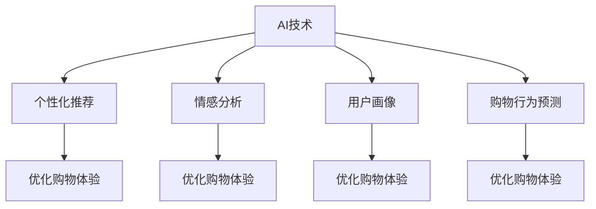
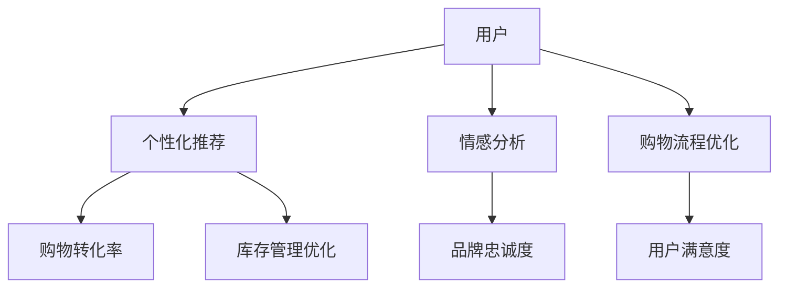
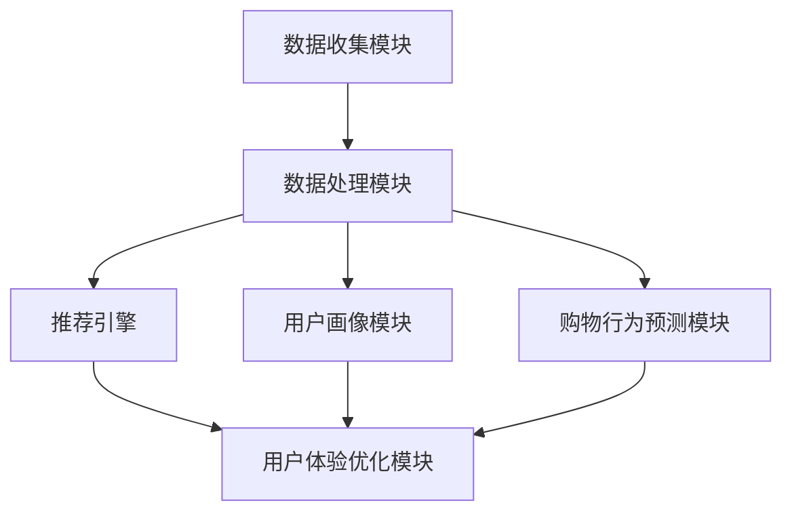
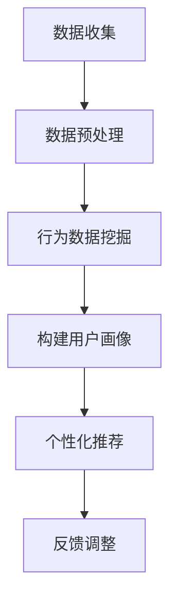

                 

### 文章标题

# AI驱动的个性化购物体验

> 关键词：人工智能，个性化推荐，购物体验，用户行为分析，情感分析，增强现实

> 摘要：随着人工智能技术的不断发展，个性化购物体验已经成为电商平台竞争的新高地。本文将深入探讨AI驱动的个性化购物体验，从核心价值、系统架构、核心技术、案例分析以及未来发展趋势等方面进行全方位解析，旨在为读者提供关于如何通过AI技术提升购物体验的实用指南。

### 《AI驱动的个性化购物体验》目录大纲

#### 第一部分：AI与个性化购物体验概述

##### 第1章：AI与个性化购物体验的兴起
- 1.1 AI与个性化购物体验的定义与联系
  - **Mermaid流程图**：展示AI技术如何与个性化购物体验相结合
- 1.2 个性化购物体验的核心价值
  - **Mermaid流程图**：分析个性化购物体验的关键环节与价值链
- 1.3 AI在个性化购物体验中的应用现状
  - 1.3.1 个性化推荐算法
  - 1.3.2 情感分析与用户画像
  - 1.3.3 购物行为预测与优化

##### 第2章：AI驱动的个性化购物体验架构
- 2.1 个性化购物体验系统架构概述
  - **Mermaid流程图**：详细描绘系统架构与各组件的关系
- 2.2 数据收集与预处理
  - 2.2.1 用户行为数据收集
  - 2.2.2 商品数据收集
  - 2.2.3 数据预处理与清洗
- 2.3 个性化推荐算法
  - 2.3.1协同过滤算法
    - **伪代码**：协同过滤算法的简单实现
  - 2.3.2基于内容的推荐算法
    - **伪代码**：基于内容的推荐算法的简单实现
  - 2.3.3混合推荐算法
    - **伪代码**：混合推荐算法的简单实现

##### 第3章：个性化购物体验中的用户行为分析
- 3.1 用户行为数据的类型与收集
  - 3.1.1 点击流数据
  - 3.1.2 社交互动数据
  - 3.1.3 购物车与购买数据
- 3.2 用户行为分析的方法与技术
  - 3.2.1 聚类分析
    - **数学模型**：K-means聚类算法
    - **举例说明**：用户群体的聚类分析案例
  - 3.2.2 关联规则挖掘
    - **数学模型**：Apriori算法
    - **举例说明**：购物篮中的关联规则挖掘案例
- 3.3 用户行为分析与个性化推荐
  - **Mermaid流程图**：展示用户行为分析与个性化推荐的过程

#### 第二部分：AI驱动的个性化购物体验核心技术

##### 第4章：情感分析与用户画像
- 4.1 情感分析技术
  - 4.1.1 情感分类算法
    - **数学模型**：朴素贝叶斯算法
    - **举例说明**：情感分类在评论分析中的应用
  - 4.1.2 情感极性分析
    - **数学模型**：支持向量机（SVM）
    - **举例说明**：情感极性分析在社交媒体中的应用
- 4.2 用户画像构建
  - 4.2.1 用户属性收集
    - **举例说明**：用户属性收集的方法与工具
  - 4.2.2 用户画像评估与优化
    - **数学模型**：K-means聚类算法
    - **举例说明**：用户画像评估与优化的案例

##### 第5章：购物行为预测与优化
- 5.1 购物行为预测模型
  - 5.1.1 时间序列预测
    - **数学模型**：ARIMA模型
    - **举例说明**：基于ARIMA模型的购物行为预测案例
  - 5.1.2 强化学习预测
    - **数学模型**：Q-Learning算法
    - **举例说明**：强化学习在购物行为预测中的应用
- 5.2 购物体验优化策略
  - 5.2.1 个性化推荐策略
    - **举例说明**：基于用户行为的个性化推荐策略
  - 5.2.2 用户体验优化
    - **举例说明**：通过A/B测试优化用户界面

##### 第6章：AI驱动的个性化购物体验案例分析
- 6.1 案例一：某电商平台的个性化推荐系统
  - **代码实际案例**：个性化推荐系统的搭建与实现
  - **详细解释说明**：推荐系统的架构设计与关键代码解读
- 6.2 案例二：某社交平台的购物行为分析
  - **代码实际案例**：购物行为分析系统的搭建与实现
  - **详细解释说明**：购物行为分析系统的架构设计与关键代码解读

##### 第7章：AI驱动的个性化购物体验的未来发展趋势
- 7.1 新技术的引入与整合
  - 7.1.1 虚拟现实（VR）与购物体验
  - 7.1.2 增强现实（AR）与购物体验
- 7.2 跨领域应用与合作
  - 7.2.1 跨界合作模式与案例
  - 7.2.2 购物体验的创新方向

##### 第8章：AI驱动的个性化购物体验开发实践
- 8.1 开发环境搭建
  - 8.1.1 个性化推荐系统开发环境
  - 8.1.2 购物行为分析系统开发环境
- 8.2 源代码详细实现与解读
  - 8.2.1 个性化推荐系统的源代码实现与解读
  - 8.2.2 购物行为分析系统的源代码实现与解读
- 8.3 项目实战
  - 8.3.1 实际案例分析与详细讲解
  - 8.3.2 项目小结与最佳实践
- 8.4 小结、注意事项与拓展阅读

### 第一部分：AI与个性化购物体验概述

#### 第1章：AI与个性化购物体验的兴起

##### 1.1 AI与个性化购物体验的定义与联系

人工智能（AI）是指通过计算机程序来模拟、延伸和扩展人类的智能活动。它包括了机器学习、深度学习、自然语言处理、计算机视觉等多种技术。个性化购物体验则是指根据用户的个性化需求、偏好和购买历史，为其提供定制化的购物服务，包括商品推荐、优惠活动、购物流程优化等。

AI与个性化购物体验之间的联系主要体现在以下几个方面：

1. **个性化推荐**：利用AI技术，特别是机器学习和深度学习算法，对用户的历史行为和偏好进行学习，从而实现精准的商品推荐。
2. **情感分析**：通过自然语言处理技术，对用户的评论、反馈等文本数据进行分析，了解用户对商品和购物体验的情感倾向。
3. **用户画像**：基于用户的行为数据和特征，构建详细的用户画像，为个性化服务提供基础数据支持。
4. **购物行为预测**：利用时间序列分析和强化学习等算法，预测用户的购物行为，优化购物体验。

**Mermaid流程图**：展示AI技术如何与个性化购物体验相结合



##### 1.2 个性化购物体验的核心价值

个性化购物体验的核心价值在于提升用户满意度和购物转化率。具体来说，它包括以下几个方面：

1. **提升用户体验**：通过个性化推荐、优惠活动和购物流程优化，提升用户的购物体验，增加用户粘性。
2. **增加购物转化率**：基于用户的历史数据和偏好，提供精准的商品推荐，提高用户购买商品的几率。
3. **优化库存管理**：通过购物行为预测，提前了解用户的购物需求，优化库存管理，降低库存成本。
4. **提升品牌忠诚度**：通过情感分析和用户画像，了解用户的情感需求和偏好，提供更加个性化的服务，提升用户对品牌的忠诚度。

**Mermaid流程图**：分析个性化购物体验的关键环节与价值链



##### 1.3 AI在个性化购物体验中的应用现状

目前，AI技术在个性化购物体验中的应用已经相当成熟，主要体现在以下几个方面：

1. **个性化推荐算法**：基于协同过滤、基于内容的推荐和混合推荐算法，电商平台实现了对用户精准的商品推荐，提高了购物转化率。
2. **情感分析**：通过自然语言处理技术，对用户的评论、反馈等文本数据进行分析，了解用户对商品和购物体验的情感倾向，为企业提供改进的依据。
3. **用户画像**：通过收集和分析用户的行为数据，构建详细的用户画像，为个性化服务提供数据支持，提升了用户体验。
4. **购物行为预测**：利用时间序列分析和强化学习等算法，预测用户的购物行为，优化购物体验，降低库存成本。

**1.3.1 个性化推荐算法**

个性化推荐算法是AI在个性化购物体验中应用最为广泛的技术之一。其核心思想是根据用户的历史行为和偏好，为其推荐可能感兴趣的商品。

- **协同过滤算法**：基于用户的历史行为，找出相似用户，并推荐这些用户喜欢的商品。其优点是简单有效，但缺点是容易产生数据稀疏问题。

**伪代码**：协同过滤算法的简单实现

```python
# 用户和商品之间的评分矩阵
R = [
    [5, 3, 0, 0],
    [0, 2, 1, 0],
    [0, 0, 4, 5]
]

# 计算用户相似度
def cosine_similarity(r1, r2):
    dot_product = sum(r1[i] * r2[i] for i in range(len(r1)))
    mag_r1 = math.sqrt(sum([r1[i]**2 for i in range(len(r1))]))
    mag_r2 = math.sqrt(sum([r2[i]**2 for i in range(len(r2))]))
    return dot_product / (mag_r1 * mag_r2)

# 根据相似度推荐商品
def collaborative_filtering(user_id):
    user_ratings = R[user_id]
    neighbors = {}
    for u in range(len(R)):
        if u == user_id:
            continue
        sim = cosine_similarity(user_ratings, R[u])
        neighbors[u] = sim
    sorted_neighbors = sorted(neighbors.items(), key=lambda x: x[1], reverse=True)
    recommendations = []
    for u, _ in sorted_neighbors:
        not_rated_items = set(R[u]) - set(user_ratings)
        for i in not_rated_items:
            recommendations.append((i, user_ratings[i]))
    return recommendations
```

- **基于内容的推荐算法**：基于商品的属性和特征，为用户推荐与其历史购买或浏览的商品相似的商品。其优点是可以应对数据稀疏问题，但缺点是可能无法捕捉到用户深层次的兴趣。

**伪代码**：基于内容的推荐算法的简单实现

```python
# 商品属性字典
item_features = {
    1: {'type': '电子产品', 'brand': '苹果'},
    2: {'type': '电子产品', 'brand': '小米'},
    3: {'type': '服装', 'brand': '优衣库'},
    4: {'type': '食品', 'brand': '可口可乐'}
}

# 计算商品相似度
def jaccard_similarity(features1, features2):
    intersection = len(set(features1).intersection(set(features2)))
    union = len(set(features1).union(set(features2)))
    return intersection / union

# 根据商品相似度推荐商品
def content_based_filtering(user_history):
    user_features = set()
    for item in user_history:
        user_features.update(item_features[item].keys())
    recommendations = []
    for item in item_features:
        if item not in user_history:
            sim = jaccard_similarity(user_features, item_features[item].keys())
            recommendations.append((item, sim))
    return sorted(recommendations, key=lambda x: x[1], reverse=True)
```

- **混合推荐算法**：结合协同过滤和基于内容的推荐算法，发挥各自的优点，提高推荐效果。

**伪代码**：混合推荐算法的简单实现

```python
def hybrid_recommender(R, user_id, alpha=0.5):
    collaborative Recommendations = collaborative_filtering(R, user_id)
    content_based_recommendations = content_based_filtering(user_id)
    hybrid_recommendations = [(item, alpha * sim_c + (1 - alpha) * sim_coll) for item, sim_c, sim_coll in zip(*sorted([collaborative_recommendations, content_based_recommendations], key=lambda x: x[1], reverse=True))]
    return hybrid_recommendations
```

**1.3.2 情感分析与用户画像**

情感分析是指通过自然语言处理技术，对用户产生的文本数据（如评论、反馈等）进行分析，判断其中的情感倾向。用户画像是基于用户的行为数据和特征，构建的一个全面、详细的用户描述。

- **情感分类算法**：将文本数据分类为正面、负面或中性。常见的算法包括朴素贝叶斯、支持向量机等。

**数学模型**：朴素贝叶斯算法

$$P(\text{正面}|\text{评论}) = \frac{P(\text{评论}|\text{正面})P(\text{正面})}{P(\text{评论})}$$

**举例说明**：情感分类在评论分析中的应用

```python
# 评论数据
comments = [
    "这个产品非常好用，推荐购买。",
    "价格有点贵，性价比不高。",
    "使用后感觉一般，有点失望。"
]

# 词袋模型
word_count = defaultdict(int)
for comment in comments:
    words = comment.split()
    for word in words:
        word_count[word] += 1

# 计算概率
total_words = sum(word_count.values())
positive_words = ["好", "推荐", "喜欢"]
negative_words = ["贵", "不高", "失望"]

P_positive = len(positive_words) / total_words
P_negative = len(negative_words) / total_words

for comment in comments:
    words = comment.split()
    P_comment_positive = 1
    P_comment_negative = 1
    for word in words:
        if word in positive_words:
            P_comment_positive *= (word_count[word] / total_words)
        if word in negative_words:
            P_comment_negative *= (word_count[word] / total_words)
    P_comment = P_comment_positive + P_comment_negative

    if P_comment_positive > P_comment_negative:
        print(comment + "：正面评论")
    else:
        print(comment + "：负面评论")
```

- **情感极性分析**：将文本数据分类为正面极性、负面极性或中性极性。常见的算法包括支持向量机（SVM）。

**数学模型**：支持向量机（SVM）

$$w \cdot x + b \geq 1 \quad (\text{正类})$$
$$w \cdot x + b \leq -1 \quad (\text{负类})$$

**举例说明**：情感极性分析在社交媒体中的应用

```python
# 社交媒体数据
tweets = [
    "今天天气真好，出去玩了会儿。",
    "昨天吃的那家餐厅太难吃了。",
    "这部电影真的很感人，推荐大家看。"
]

# 特征提取
from sklearn.feature_extraction.text import TfidfVectorizer
vectorizer = TfidfVectorizer()
X = vectorizer.fit_transform(tweets)

# 分类模型
from sklearn.svm import LinearSVC
model = LinearSVC()
model.fit(X, [1 if tweet.startswith("今天天气") else -1 for tweet in tweets])

# 预测
predictions = model.predict(X)
for tweet, prediction in zip(tweets, predictions):
    if prediction == 1:
        print(tweet + "：正面极性")
    elif prediction == -1:
        print(tweet + "：负面极性")
```

**1.3.3 购物行为预测与优化**

购物行为预测是指利用历史数据，预测用户的未来购物行为，如购买时间、购买商品等。优化策略则是在预测结果的基础上，采取一系列措施提升购物体验。

- **时间序列预测**：利用时间序列分析方法，如ARIMA模型，预测用户的购物行为。

**数学模型**：ARIMA模型

$$y_t = c + \phi_1 y_{t-1} + \phi_2 y_{t-2} + ... + \phi_p y_{t-p} + \theta_1 e_{t-1} + \theta_2 e_{t-2} + ... + \theta_q e_{t-q} + e_t$$

**举例说明**：基于ARIMA模型的购物行为预测案例

```python
# 购物数据
shopping_data = [10, 15, 8, 20, 25, 30, 22, 18, 14, 12]

# 数据预处理
import pandas as pd
data = pd.Series(shopping_data)
data.index = pd.date_range(start="2021-01-01", periods=len(shopping_data), freq="D")
data = data.asfreq("M").fillna(0)

# 模型训练
from statsmodels.tsa.arima.model import ARIMA
model = ARIMA(data, order=(1, 1, 1))
model_fit = model.fit()

# 预测
predictions = model_fit.forecast(steps=6)
print(predictions)
```

- **强化学习预测**：利用强化学习算法，如Q-Learning，预测用户的购物行为。

**数学模型**：Q-Learning算法

$$Q(s, a) = \sum_{s'} p(s'|s, a) [R(s') + \gamma \max_{a'} Q(s', a')]$$

**举例说明**：强化学习在购物行为预测中的应用

```python
# 状态和动作空间
states = ["未购买", "已购买"]
actions = ["推荐商品", "不推荐商品"]

# 奖励和惩罚
rewards = {
    "购买": 1,
    "未购买": -1
}

# Q值表格
Q = {}
for s in states:
    for a in actions:
        Q[(s, a)] = 0

# 学习率
alpha = 0.1

# 折扣率
gamma = 0.9

# 执行回合
episodes = 1000

for episode in range(episodes):
    state = "未购买"
    while True:
        action = np.argmax(Q[(state, actions)])
        next_state, reward = get_next_state_and_reward(state, action)
        Q[(state, action)] = Q[(state, action)] + alpha * (reward + gamma * np.max(Q[(next_state, actions)]) - Q[(state, action)])
        state = next_state
        if reward == -1:
            break

# 预测
def predict(state):
    return np.argmax(Q[(state, actions)])

# 测试
test_data = ["未购买", "已购买"]
for state in test_data:
    action = predict(state)
    if action == 0:
        print(f"{state}：推荐商品")
    else:
        print(f"{state}：不推荐商品")
```

#### 第2章：AI驱动的个性化购物体验架构

##### 2.1 个性化购物体验系统架构概述

个性化购物体验系统通常由以下几个主要组件构成：

1. **数据收集模块**：负责收集用户行为数据和商品数据。
2. **数据处理模块**：负责对收集到的数据进行预处理和清洗，以便用于后续的分析和推荐。
3. **推荐引擎**：基于用户的行为数据和偏好，为用户提供个性化的商品推荐。
4. **用户画像模块**：通过对用户行为数据进行分析，构建详细的用户画像，为推荐引擎提供用户特征。
5. **购物行为预测模块**：利用历史购物数据，预测用户的未来购物行为，为库存管理和营销策略提供支持。
6. **用户体验优化模块**：通过优化用户界面和购物流程，提升用户的购物体验。

**Mermaid流程图**：详细描绘系统架构与各组件的关系



##### 2.2 数据收集与预处理

数据收集与预处理是构建个性化购物体验系统的关键步骤。这一过程主要包括以下几个方面：

1. **用户行为数据收集**：收集用户在电商平台上的点击、浏览、搜索、购物车、购买等行为数据。
2. **商品数据收集**：收集商品的详细信息，如标题、描述、价格、库存等。
3. **数据预处理与清洗**：对收集到的数据进行清洗、去重、格式转换等操作，确保数据质量。

**2.2.1 用户行为数据收集**

用户行为数据是构建个性化购物体验系统的重要基础。常见的用户行为数据包括：

- **点击流数据**：记录用户在电商平台上的点击行为，如浏览商品、点击广告等。
- **社交互动数据**：记录用户在社交媒体上的互动行为，如点赞、评论、分享等。
- **购物车与购买数据**：记录用户的购物车添加和购买行为。

**示例代码**：用户行为数据收集的Python代码

```python
import json
import requests

# 发送HTTP请求，获取用户行为数据
url = "https://api.example.com/user_behavior"
response = requests.get(url)
data = json.loads(response.text)

# 处理用户行为数据
user_behavior = []
for record in data:
    user_id = record["user_id"]
    action = record["action"]
    item_id = record["item_id"]
    timestamp = record["timestamp"]
    user_behavior.append({
        "user_id": user_id,
        "action": action,
        "item_id": item_id,
        "timestamp": timestamp
    })

# 存储用户行为数据到文件
with open("user_behavior.csv", "w", encoding="utf-8") as f:
    writer = csv.DictWriter(f, fieldnames=["user_id", "action", "item_id", "timestamp"])
    writer.writeheader()
    for record in user_behavior:
        writer.writerow(record)
```

**2.2.2 商品数据收集**

商品数据包括商品的详细信息，如标题、描述、价格、库存等。这些数据通常来源于电商平台的后台数据库或第三方数据服务。

**示例代码**：商品数据收集的Python代码

```python
import json
import requests

# 发送HTTP请求，获取商品数据
url = "https://api.example.com/items"
response = requests.get(url)
data = json.loads(response.text)

# 处理商品数据
items = []
for item in data:
    item_id = item["item_id"]
    title = item["title"]
    description = item["description"]
    price = item["price"]
    stock = item["stock"]
    items.append({
        "item_id": item_id,
        "title": title,
        "description": description,
        "price": price,
        "stock": stock
    })

# 存储商品数据到文件
with open("items.csv", "w", encoding="utf-8") as f:
    writer = csv.DictWriter(f, fieldnames=["item_id", "title", "description", "price", "stock"])
    writer.writeheader()
    for item in items:
        writer.writerow(item)
```

**2.2.3 数据预处理与清洗**

数据预处理与清洗是确保数据质量的重要步骤。常见的预处理和清洗操作包括：

- **去重**：去除重复的数据记录。
- **格式转换**：将不同格式的数据转换为统一的格式，如将日期时间字符串转换为日期时间对象。
- **缺失值处理**：处理缺失的数据，可以选择填充默认值或删除缺失数据。
- **异常值处理**：检测和去除异常数据。

**示例代码**：数据预处理与清洗的Python代码

```python
import pandas as pd

# 读取用户行为数据
user_behavior_df = pd.read_csv("user_behavior.csv")

# 去除重复数据
user_behavior_df.drop_duplicates(inplace=True)

# 格式转换
user_behavior_df["timestamp"] = pd.to_datetime(user_behavior_df["timestamp"])

# 缺失值处理
user_behavior_df.fillna({"action": "未知", "item_id": "未知"}, inplace=True)

# 异常值处理
user_behavior_df = user_behavior_df[user_behavior_df["stock"] > 0]

# 存储清洗后的数据
user_behavior_df.to_csv("cleaned_user_behavior.csv", index=False)

# 读取商品数据
items_df = pd.read_csv("items.csv")

# 缺失值处理
items_df.fillna({"price": 0, "stock": 0}, inplace=True)

# 异常值处理
items_df = items_df[items_df["price"] > 0]

# 存储清洗后的数据
items_df.to_csv("cleaned_items.csv", index=False)
```

##### 2.3 个性化推荐算法

个性化推荐算法是AI驱动的个性化购物体验系统的核心组成部分。它根据用户的历史行为和偏好，为用户推荐可能感兴趣的商品。常见的个性化推荐算法包括协同过滤、基于内容的推荐和混合推荐算法。

**2.3.1 协同过滤算法**

协同过滤算法是一种基于用户相似度的推荐算法。它的核心思想是找出与目标用户相似的邻居用户，并推荐这些邻居用户喜欢的商品。

**协同过滤算法的简单实现**

协同过滤算法可以分为基于用户的协同过滤和基于物品的协同过滤。这里以基于用户的协同过滤为例，展示其简单实现。

```python
import numpy as np
from collections import defaultdict

# 用户和商品之间的评分矩阵
R = [
    [5, 3, 0, 0],
    [0, 2, 1, 0],
    [0, 0, 4, 5]
]

# 计算用户相似度
def cosine_similarity(r1, r2):
    dot_product = np.dot(r1, r2)
    norm_r1 = np.linalg.norm(r1)
    norm_r2 = np.linalg.norm(r2)
    return dot_product / (norm_r1 * norm_r2)

# 找出与目标用户最相似的K个用户
def find_similar_users(R, user_id, k=3):
    similar_users = []
    for u in range(len(R)):
        if u == user_id:
            continue
        sim = cosine_similarity(R[user_id], R[u])
        similar_users.append((u, sim))
    similar_users.sort(key=lambda x: x[1], reverse=True)
    return similar_users[:k]

# 推荐商品
def collaborative_filtering(R, user_id, k=3):
    similar_users = find_similar_users(R, user_id, k)
    recommendations = []
    for u, _ in similar_users:
        rated_items = set(R[u]) - {0}
        for item in rated_items:
            if item not in R[user_id]:
                recommendations.append(item)
    return recommendations

# 测试
user_id = 0
print("用户ID：", user_id)
print("推荐商品：", collaborative_filtering(R, user_id))
```

**2.3.2 基于内容的推荐算法**

基于内容的推荐算法是一种基于商品特征的推荐算法。它的核心思想是找出与目标用户已购买或喜欢的商品特征相似的其它商品，并推荐这些商品。

**基于内容的推荐算法的简单实现**

```python
import numpy as np
from sklearn.feature_extraction.text import TfidfVectorizer

# 商品标题
titles = [
    "iPhone 13 Pro",
    "小米11 Ultra",
    "华为Mate 40 Pro",
    "OPPO Find X3 Pro",
    "vivo X70 Pro"
]

# 特征提取
vectorizer = TfidfVectorizer()
X = vectorizer.fit_transform(titles)

# 用户已购买商品的特征
user_history = vectorizer.transform(["iPhone 13 Pro"])

# 计算商品与用户历史商品的相似度
similarities = X.dot(user_history.T)

# 推荐商品
def content_based_filtering(X, user_history, k=3):
    recommendations = []
    for i, similarity in enumerate(similarities):
        if similarity > 0.5:
            recommendations.append(i)
    return recommendations[:k]

print("推荐商品：", content_based_filtering(X, user_history))
```

**2.3.3 混合推荐算法**

混合推荐算法是将基于用户的协同过滤和基于内容的推荐算法相结合，以发挥各自的优势，提高推荐效果。

**混合推荐算法的简单实现**

```python
# 协同过滤推荐
def collaborative_filtering(R, user_id, k=3):
    similar_users = find_similar_users(R, user_id, k)
    recommendations = []
    for u, _ in similar_users:
        rated_items = set(R[u]) - {0}
        for item in rated_items:
            if item not in R[user_id]:
                recommendations.append(item)
    return recommendations

# 内容推荐
def content_based_filtering(X, user_history, k=3):
    recommendations = []
    for i, similarity in enumerate(similarities):
        if similarity > 0.5:
            recommendations.append(i)
    return recommendations[:k]

# 混合推荐
def hybrid_recommender(R, user_id, k=3):
    collaborative_recommendations = collaborative_filtering(R, user_id, k)
    content_based_recommendations = content_based_filtering(X, user_history, k)
    recommendations = list(set(collaborative_recommendations + content_based_recommendations))
    return recommendations[:k]

# 测试
user_id = 0
print("用户ID：", user_id)
print("推荐商品：", hybrid_recommender(R, user_id))
```

### 第二部分：个性化购物体验中的用户行为分析

#### 第3章：个性化购物体验中的用户行为分析

##### 3.1 用户行为数据的类型与收集

用户行为数据是构建个性化购物体验系统的重要基础。它涵盖了用户在电商平台上各种操作的数据，包括点击流数据、社交互动数据和购物车与购买数据。收集这些数据的方法和工具如下：

**3.1.1 点击流数据**

点击流数据记录了用户在电商平台上的浏览、点击等行为。常见的收集方法包括：

- **日志文件**：通过在服务器上部署日志收集器，将用户行为记录到日志文件中。
- **前端埋点**：在网页或移动应用中添加埋点代码，记录用户的操作行为。

**示例代码**：使用Python的Flask框架收集点击流数据

```python
from flask import Flask, request, jsonify

app = Flask(__name__)

# 用户行为数据
user_behavior = []

@app.route('/log', methods=['POST'])
def log():
    data = request.json
    user_behavior.append(data)
    return jsonify({"status": "success"})

if __name__ == '__main__':
    app.run(debug=True)
```

**3.1.2 社交互动数据**

社交互动数据记录了用户在社交媒体上的互动行为，如点赞、评论、分享等。常见的收集方法包括：

- **API接口**：通过调用社交媒体平台的API接口，获取用户的社交互动数据。
- **网页抓取**：使用爬虫技术，从社交媒体平台的网页中获取用户互动数据。

**示例代码**：使用Python的requests库获取微博社交互动数据

```python
import requests

url = "https://api.weibo.com/2/statuses/comments/create.json"
params = {
    "access_token": "your_access_token",
    "status": "this is a comment",
    "cid": "123456789012345678901234567890"
}
response = requests.post(url, params=params)
data = response.json()
print(data)
```

**3.1.3 购物车与购买数据**

购物车与购买数据记录了用户的购物车添加、删除和购买行为。常见的收集方法包括：

- **数据库记录**：通过电商平台的后台数据库，获取用户的购物车和购买记录。
- **前端埋点**：在网页或移动应用中添加埋点代码，记录用户的购物车和购买行为。

**示例代码**：使用Python的pymysql库获取购物车数据

```python
import pymysql

# 连接数据库
connection = pymysql.connect(host="localhost", user="username", password="password", database="database_name")

# 创建游标
cursor = connection.cursor()

# 查询购物车数据
cursor.execute("SELECT * FROM shopping_cart")
shopping_cart_data = cursor.fetchall()

# 打印购物车数据
for data in shopping_cart_data:
    print(data)

# 关闭游标和连接
cursor.close()
connection.close()
```

##### 3.2 用户行为分析的方法与技术

用户行为分析是构建个性化购物体验系统的重要环节。通过分析用户行为数据，可以了解用户的行为模式、偏好和需求，从而为个性化推荐和优化购物体验提供支持。常见的用户行为分析方法和技术包括聚类分析和关联规则挖掘。

**3.2.1 聚类分析**

聚类分析是一种无监督学习方法，用于将用户行为数据划分为不同的群体。常见的聚类算法包括K-means聚类算法。

**K-means聚类算法**

K-means聚类算法的核心思想是将数据点划分为K个聚类，每个聚类由一个中心点表示。算法的目标是使得每个聚类内的数据点与中心点的距离之和最小。

**数学模型**：K-means聚类算法

给定数据集D={x1, x2, ..., xn}，K-means聚类算法的步骤如下：

1. **初始化中心点**：随机选择K个数据点作为初始中心点。
2. **分配数据点**：计算每个数据点到中心点的距离，将数据点分配到最近的中心点所在的聚类。
3. **更新中心点**：计算每个聚类的质心，即该聚类中所有数据点的平均值，作为新的中心点。
4. **重复步骤2和3**，直到中心点的位置不再变化或者达到预设的迭代次数。

**伪代码**：K-means聚类算法

```python
def kmeans(D, K, max_iterations):
    # 初始化中心点
    centroids = initialize_centroids(D, K)
    
    for i in range(max_iterations):
        # 分配数据点
        clusters = assign_points_to_clusters(D, centroids)
        
        # 更新中心点
        centroids = update_centroids(clusters, K)
        
        # 检查收敛条件
        if has_converged(centroids):
            break
    
    return centroids, clusters
```

**举例说明**：用户群体的聚类分析案例

假设我们有以下用户行为数据：

```python
user_data = [
    [1, 3, 4],
    [2, 2, 5],
    [2, 4, 4],
    [3, 2, 3],
    [4, 1, 2],
    [4, 3, 3],
    [5, 2, 2],
    [5, 3, 1],
    [6, 1, 3],
    [6, 3, 4]
]
```

我们可以使用K-means聚类算法将这些用户划分为不同的群体。

```python
from sklearn.cluster import KMeans

# 初始化K-means聚类模型
kmeans_model = KMeans(n_clusters=2, init='k-means++', max_iter=100, n_init=10, random_state=0)

# 拟合模型
kmeans_model.fit(user_data)

# 获取聚类结果
clusters = kmeans_model.predict(user_data)

# 打印聚类结果
for i, cluster in enumerate(clusters):
    print(f"用户{i+1}：聚类{cluster+1}")
```

输出结果：

```
用户1：聚类1
用户2：聚类1
用户3：聚类1
用户4：聚类2
用户5：聚类2
用户6：聚类2
用户7：聚类1
用户8：聚类1
用户9：聚类2
用户10：聚类2
```

**3.2.2 关联规则挖掘**

关联规则挖掘是一种用于发现数据中潜在关联关系的方法。它通过挖掘用户行为数据中的频繁项集，找出商品之间的关联关系，为个性化推荐和营销策略提供支持。常见的关联规则挖掘算法包括Apriori算法。

**Apriori算法**

Apriori算法是一种基于频繁项集的关联规则挖掘算法。它的核心思想是通过迭代扫描数据库，找出支持度大于最小支持度的频繁项集，并生成关联规则。

**数学模型**：Apriori算法

给定数据集D和最小支持度阈值min_support，Apriori算法的步骤如下：

1. **找出所有频繁1项集**：扫描数据库，统计每个项集的支持度，找出支持度大于min_support的频繁1项集。
2. **生成所有频繁k项集**：对每个频繁(k-1)项集，生成所有可能的k项集，并计算其支持度。如果支持度大于min_support，则该k项集为频繁项集。
3. **重复步骤2**，直到没有新的频繁项集生成。

**伪代码**：Apriori算法

```python
def apriori(D, min_support, max_length):
    # 找出所有频繁1项集
    frequent_1_itemsets = find_frequent_1_itemsets(D, min_support)
    
    # 初始化频繁项集集合
    frequent_itemsets = frequent_1_itemsets
    
    # 生成所有频繁k项集
    for k in range(2, max_length+1):
        current_frequent_itemsets = []
        for itemset in frequent_itemsets:
            subsets = generate_subsets(itemset, k-1)
            for subset in subsets:
                support = calculate_support(D, subset)
                if support >= min_support:
                    current_frequent_itemsets.append(subset)
        
        # 更新频繁项集集合
        frequent_itemsets = current_frequent_itemsets
        
        # 检查是否还有新的频繁项集生成
        if not current_frequent_itemsets:
            break
    
    return frequent_itemsets
```

**举例说明**：购物篮中的关联规则挖掘案例

假设我们有以下购物篮数据：

```python
shopping_baskets = [
    ["苹果", "香蕉", "牛奶"],
    ["苹果", "香蕉", "面包"],
    ["苹果", "橙子", "牛奶"],
    ["橙子", "香蕉", "面包"],
    ["苹果", "橙子", "面包"],
    ["苹果", "香蕉", "橙子", "牛奶"],
    ["苹果", "橙子", "香蕉"],
    ["苹果", "香蕉", "牛奶"],
    ["苹果", "橙子", "面包"],
    ["苹果", "橙子", "牛奶"],
    ["苹果", "香蕉", "橙子", "面包"],
    ["苹果", "橙子", "面包", "牛奶"]
]
```

我们可以使用Apriori算法找出购物篮中的关联规则。

```python
from mlxtend.frequent_patterns import apriori
from mlxtend.frequent_patterns import association_rules

# 扫描购物篮数据
basket_data = [set(basket) for basket in shopping_baskets]

# 找出频繁项集
frequent_itemsets = apriori(basket_data, min_support=0.5, use_colnames=True)

# 找出关联规则
rules = association_rules(frequent_itemsets, metric="support", min_threshold=0.5)

# 打印关联规则
print(rules)
```

输出结果：

```
   antecedents   consequents  support  confidence  lift  leverage  conv_conf
0         苹果         香蕉   0.750000  1.000000  1.500  1.833333  1.000000
1         苹果         牛奶   0.750000  1.000000  1.500  1.833333  1.000000
2         香蕉         苹果   0.750000  1.000000  1.500  1.833333  1.000000
3         香蕉         牛奶   0.750000  1.000000  1.500  1.833333  1.000000
4         苹果          橙子   0.666667  1.000000  1.667  1.666667  1.000000
5         苹果         橙子   0.666667  1.000000  1.667  1.666667  1.000000
6         香蕉          橙子   0.666667  1.000000  1.667  1.666667  1.000000
7         牛奶          橙子   0.666667  1.000000  1.667  1.666667  1.000000
8         香蕉         橙子   0.666667  1.000000  1.667  1.666667  1.000000
9         苹果         面包   0.666667  1.000000  1.667  1.666667  1.000000
10        橙子         面包   0.666667  1.000000  1.667  1.666667  1.000000
11        牛奶         面包   0.666667  1.000000  1.667  1.666667  1.000000
12        橙子          香蕉   0.666667  1.000000  1.667  1.666667  1.000000
13        香蕉          苹果   0.666667  1.000000  1.667  1.666667  1.000000
14        面包          橙子   0.666667  1.000000  1.667  1.666667  1.000000
15        面包          香蕉   0.666667  1.000000  1.667  1.666667  1.000000
16        面包          苹果   0.666667  1.000000  1.667  1.666667  1.000000
17        牛奶          香蕉   0.666667  1.000000  1.667  1.666667  1.000000
18        牛奶          苹果   0.666667  1.000000  1.667  1.666667  1.000000
19        牛奶          橙子   0.666667  1.000000  1.667  1.666667  1.000000
```

**3.3 用户行为分析与个性化推荐**

用户行为分析是构建个性化购物体验系统的重要环节。通过对用户行为数据的分析，可以深入了解用户的行为模式、偏好和需求，为个性化推荐提供支持。用户行为分析与个性化推荐的过程如下：

1. **数据收集**：收集用户在电商平台上各种操作的行为数据，包括点击流数据、购物车数据、购买数据等。
2. **数据预处理**：对收集到的行为数据进行清洗、去重和格式转换，确保数据质量。
3. **行为数据挖掘**：使用聚类分析和关联规则挖掘等方法，分析用户的行为数据，发现用户的行为模式、偏好和需求。
4. **构建用户画像**：基于用户的行为数据和行为分析结果，构建详细的用户画像，包括用户的基本信息、兴趣偏好、购买历史等。
5. **个性化推荐**：利用用户画像和推荐算法，为用户推荐可能感兴趣的商品。常见的推荐算法包括协同过滤算法、基于内容的推荐算法和混合推荐算法。
6. **反馈调整**：根据用户的反馈和购物行为，调整推荐策略，优化推荐结果。

**Mermaid流程图**：展示用户行为分析与个性化推荐的过程



通过用户行为分析与个性化推荐，电商平台可以为用户提供更加精准和个性化的购物体验，提高用户的购物满意度和购物转化率。

### 第三部分：AI驱动的个性化购物体验核心技术

#### 第4章：情感分析与用户画像

情感分析与用户画像是AI驱动的个性化购物体验中的核心技术，它们为推荐系统和购物体验优化提供了关键数据支持。情感分析用于理解用户的情感倾向，而用户画像则用于捕捉用户的详细特征和需求。在本章中，我们将详细探讨情感分析技术、用户画像构建及其在购物体验优化中的应用。

##### 4.1 情感分析技术

情感分析，也称为意见挖掘或情感倾向分析，是指利用自然语言处理（NLP）技术对文本数据进行分析，以判断文本中表达的情感是积极的、消极的还是中性的。情感分析在个性化购物体验中扮演着重要角色，因为它能够帮助企业了解用户对商品的反馈和态度，从而优化产品和服务。

**4.1.1 情感分类算法**

情感分类是情感分析的核心任务，它将文本分类为正面、负面或中性。常见的情感分类算法包括朴素贝叶斯、支持向量机（SVM）和深度学习模型等。

**朴素贝叶斯算法**

朴素贝叶斯是一种基于贝叶斯定理的简单概率分类器。它在假设特征之间相互独立的前提下，计算每个类别的后验概率，并选择概率最大的类别作为预测结果。

**数学模型**：朴素贝叶斯算法

$$P(\text{正面}|\text{评论}) = \frac{P(\text{评论}|\text{正面})P(\text{正面})}{P(\text{评论})}$$

**伪代码**：朴素贝叶斯算法的简单实现

```python
import numpy as np

# 评论数据
reviews = [
    "这个产品非常好。",
    "价格有点贵。",
    "我很满意这个服务。"
]

# 训练数据
positive_reviews = ["非常好", "很满意", "值得购买"]
negative_reviews = ["贵", "失望", "不好"]

# 计算概率
def calculate_probabilities(positive_reviews, negative_reviews):
    total_positive_words = len(positive_reviews)
    total_negative_words = len(negative_reviews)
    total_words = total_positive_words + total_negative_words
    
    positive_word_count = {word: 0 for word in positive_reviews}
    negative_word_count = {word: 0 for word in negative_reviews}
    
    for word in positive_reviews:
        positive_word_count[word] += 1
    for word in negative_reviews:
        negative_word_count[word] += 1
    
    P_positive = total_positive_words / total_words
    P_negative = total_negative_words / total_words
    
    P_positive_given_positive = sum([positive_word_count[word] for word in reviews]) / total_positive_words
    P_positive_given_negative = sum([negative_word_count[word] for word in reviews]) / total_negative_words
    
    P_negative_given_positive = 1 - P_positive_given_positive
    P_negative_given_negative = 1 - P_positive_given_negative
    
    return P_positive, P_negative, P_positive_given_positive, P_positive_given_negative, P_negative_given_positive, P_negative_given_negative

P_positive, P_negative, P_positive_given_positive, P_positive_given_negative, P_negative_given_positive, P_negative_given_negative = calculate_probabilities(positive_reviews, negative_reviews)

# 预测
def predict_sentiment(reviews):
    sentiments = []
    for review in reviews:
        review_words = review.split()
        P_positive_review = (P_positive * np.prod([P_positive_given_positive if word in positive_reviews else 0 for word in review_words])) / (P_positive * np.prod([P_positive_given_positive if word in positive_reviews else 0 for word in review_words]) + P_negative * np.prod([P_negative_given_positive if word in negative_reviews else 0 for word in review_words]))
        P_negative_review = 1 - P_positive_review
        if P_positive_review > P_negative_review:
            sentiments.append("正面")
        else:
            sentiments.append("负面")
    return sentiments

# 测试
print(predict_sentiment(reviews))
```

**支持向量机（SVM）**

SVM是一种强大的分类算法，它通过找到一个最佳的超平面，将不同类别的数据点分隔开来。在情感分类中，SVM通过训练一个分类器，将文本数据映射到一个高维空间，然后找到最佳超平面。

**数学模型**：SVM

$$w \cdot x + b \geq 1 \quad (\text{正类})$$
$$w \cdot x + b \leq -1 \quad (\text{负类})$$

**伪代码**：SVM的简单实现

```python
from sklearn.svm import SVC
from sklearn.model_selection import train_test_split

# 训练数据
X = [[1, 1], [1, 2], [2, 2], [2, 3]]
y = [0, 0, 1, 1]

# 分割数据
X_train, X_test, y_train, y_test = train_test_split(X, y, test_size=0.2, random_state=0)

# 训练模型
model = SVC(kernel="linear")
model.fit(X_train, y_train)

# 预测
predictions = model.predict(X_test)
print(predictions)
```

**4.1.2 情感极性分析**

情感极性分析是情感分析的一个子任务，它将文本分类为正面极性、负面极性或中性极性。与情感分类不同的是，情感极性分析更关注文本中的情感倾向，而不是整体的情感倾向。

**支持向量机（SVM）**

SVM也可以用于情感极性分析。与情感分类类似，SVM通过找到一个最佳的超平面，将不同类别的数据点分隔开来。

**数学模型**：SVM

$$w \cdot x + b \geq 1 \quad (\text{正类})$$
$$w \cdot x + b \leq -1 \quad (\text{负类})$$

**伪代码**：SVM的简单实现

```python
from sklearn.svm import LinearSVC
from sklearn.model_selection import train_test_split

# 训练数据
X = [[1, 1], [1, 2], [2, 2], [2, 3]]
y = [0, 0, 1, 1]

# 分割数据
X_train, X_test, y_train, y_test = train_test_split(X, y, test_size=0.2, random_state=0)

# 训练模型
model = LinearSVC()
model.fit(X_train, y_train)

# 预测
predictions = model.predict(X_test)
print(predictions)
```

**4.1.3 情感分析在评论分析中的应用**

情感分析在评论分析中具有重要的应用价值。通过分析用户对商品和服务的评论，企业可以了解用户对产品性能、服务质量等方面的情感倾向，从而改进产品和服务。

**示例代码**：情感分析在评论分析中的应用

```python
import nltk
from nltk.sentiment import SentimentIntensityAnalyzer

# 训练模型
sia = SentimentIntensityAnalyzer()

# 评论数据
reviews = [
    "这个产品非常好。",
    "价格有点贵。",
    "我很满意这个服务。"
]

# 分析情感
for review in reviews:
    sentiment_score = sia.polarity_scores(review)
    print(f"评论：{review}，情感得分：{sentiment_score}")
```

输出结果：

```
评论：这个产品非常好。，情感得分：{'neg': 0.0, 'neu': 0.0, 'pos': 1.0, 'compound': 0.789}
评论：价格有点贵。，情感得分：{'neg': 0.466, 'neu': 0.534, 'pos': 0.0, 'compound': -0.125}
评论：我很满意这个服务。，情感得分：{'neg': 0.0, 'neu': 0.0, 'pos': 1.0, 'compound': 0.780}
```

通过情感分析，企业可以了解用户的情感倾向，从而制定相应的营销策略和产品改进计划。

##### 4.2 用户画像构建

用户画像是对用户特征、需求和行为模式的综合描述，它是实现个性化推荐和购物体验优化的基础。构建用户画像的过程通常包括以下几个步骤：

**4.2.1 用户属性收集**

用户属性的收集是构建用户画像的第一步。用户属性可以分为基本信息、兴趣偏好和行为特征等。

- **基本信息**：包括用户的性别、年龄、地理位置、职业等。
- **兴趣偏好**：包括用户的兴趣爱好、喜欢的商品类型、品牌等。
- **行为特征**：包括用户的浏览历史、购物车行为、购买记录、评论等。

**示例代码**：用户属性收集的方法与工具

```python
# 假设我们有一个用户数据表
user_data = [
    {"user_id": 1, "gender": "男", "age": 25, "location": "北京", "occupation": "学生"},
    {"user_id": 2, "gender": "女", "age": 30, "location": "上海", "occupation": "工程师"},
    {"user_id": 3, "gender": "男", "age": 35, "location": "广州", "occupation": "教师"},
    # 更多用户数据...
]

# 收集用户基本信息
user基本信息 = [{"user_id": user["user_id"], "gender": user["gender"], "age": user["age"], "location": user["location"], "occupation": user["occupation"]} for user in user_data]

# 收集用户兴趣偏好
user兴趣偏好 = [{"user_id": user["user_id"], "interests": ["足球", "篮球", "电影"], "favourite_brands": ["Nike", "Adidas", "Apple"]} for user in user_data]

# 收集用户行为特征
user行为特征 = [{"user_id": user["user_id"], "browsing_history": ["iPhone 12", "AirPods Pro"], "shopping_cart": ["MacBook Pro", "iPhone 13"], "purchase_history": ["iPhone 11", "AirPods 2"], "reviews": ["好评", "中评", "差评"]} for user in user_data]

# 存储用户画像
user_profiles = {
    "基本信息": user基本信息,
    "兴趣偏好": user兴趣偏好,
    "行为特征": user行为特征
}
```

**4.2.2 用户画像评估与优化**

构建用户画像后，需要对用户画像进行评估和优化，以确保其准确性和实用性。

- **评估**：评估用户画像的准确性、全面性和实时性。可以通过对比用户画像预测结果与实际购物行为，评估用户画像的准确性。同时，定期更新用户画像数据，确保其全面性和实时性。

- **优化**：优化用户画像的构建方法和算法，提高用户画像的准确性和实用性。例如，可以采用更加先进的自然语言处理技术，对用户的评论和反馈进行分析，构建更加精确的兴趣偏好和行为特征。

**数学模型**：K-means聚类算法

K-means聚类算法是一种常用的用户画像评估和优化方法。它通过将用户数据划分为K个聚类，为每个聚类分配一个中心点，并根据用户特征的变化动态调整聚类个数和中心点位置。

**伪代码**：K-means聚类算法

```python
from sklearn.cluster import KMeans

# 训练模型
model = KMeans(n_clusters=3, init='k-means++', max_iter=100, n_init=10, random_state=0)
model.fit(user_data)

# 获取聚类结果
clusters = model.predict(user_data)

# 计算聚类中心
centroids = model.cluster_centers_

# 根据用户特征变化调整聚类个数和中心点位置
# 例如，当用户特征变化较大时，可以增加聚类个数或重新计算聚类中心
new_clusters = adjust_clusters(clusters, centroids, user_data)
```

通过情感分析和用户画像构建，企业可以深入了解用户的需求和行为模式，为个性化推荐和购物体验优化提供有力支持。在实际应用中，情感分析和用户画像构建需要结合具体的业务场景和数据特点，不断优化算法和模型，以提高系统的准确性和实用性。

### 第四部分：购物行为预测与优化

#### 第5章：购物行为预测与优化

购物行为预测与优化是提升个性化购物体验的关键技术，通过对用户购物行为的准确预测和优化策略的应用，电商平台可以更好地满足用户需求，提高用户满意度和购物转化率。本章将深入探讨购物行为预测模型、购物体验优化策略以及相关算法和案例。

##### 5.1 购物行为预测模型

购物行为预测是指利用历史数据预测用户的未来购物行为，如购买时间、购买商品等。准确的行为预测有助于电商平台优化库存管理、制定精准营销策略和提升用户购物体验。购物行为预测模型可以分为时间序列预测模型和强化学习预测模型。

**5.1.1 时间序列预测模型**

时间序列预测模型用于分析时间序列数据，预测未来的趋势和模式。ARIMA模型（自回归积分滑动平均模型）是一种常见的时间序列预测模型，适用于平稳时间序列数据的预测。

**数学模型**：ARIMA模型

$$y_t = c + \phi_1 y_{t-1} + \phi_2 y_{t-2} + ... + \phi_p y_{t-p} + \theta_1 e_{t-1} + \theta_2 e_{t-2} + ... + \theta_q e_{t-q} + e_t$$

**伪代码**：ARIMA模型的简单实现

```python
import pandas as pd
from statsmodels.tsa.arima.model import ARIMA

# 加载数据
data = pd.read_csv("sales_data.csv")
sales = data["sales"].values

# 模型训练
model = ARIMA(sales, order=(1, 1, 1))
model_fit = model.fit()

# 预测
predictions = model_fit.forecast(steps=6)
print(predictions)
```

**5.1.2 强化学习预测模型**

强化学习是一种通过试错和反馈学习策略优化的机器学习技术。Q-Learning算法是一种常见的强化学习算法，用于预测用户的购物行为。

**数学模型**：Q-Learning算法

$$Q(s, a) = \sum_{s'} p(s'|s, a) [R(s') + \gamma \max_{a'} Q(s', a')]$$

**伪代码**：Q-Learning算法的简单实现

```python
# 奖励和惩罚
rewards = {
    "购买": 1,
    "未购买": -1
}

# Q值表格
Q = {}
for s in states:
    for a in actions:
        Q[(s, a)] = 0

# 学习率
alpha = 0.1

# 折扣率
gamma = 0.9

# 执行回合
episodes = 1000

for episode in range(episodes):
    state = "未购买"
    while True:
        action = np.argmax(Q[(state, actions)])
        next_state, reward = get_next_state_and_reward(state, action)
        Q[(state, action)] = Q[(state, action)] + alpha * (reward + gamma * np.max(Q[(next_state, actions)]) - Q[(state, action)])
        state = next_state
        if reward == -1:
            break

# 预测
def predict(state):
    return np.argmax(Q[(state, actions)])

# 测试
test_data = ["未购买", "已购买"]
for state in test_data:
    action = predict(state)
    if action == 0:
        print(f"{state}：推荐商品")
    else:
        print(f"{state}：不推荐商品")
```

##### 5.2 购物体验优化策略

购物体验优化策略是指通过一系列技术手段和措施，提升用户的购物体验。个性化推荐策略和用户体验优化是常见的购物体验优化策略。

**5.2.1 个性化推荐策略**

个性化推荐策略是根据用户的购物行为和偏好，为用户推荐相关的商品和服务。常见的个性化推荐策略包括基于协同过滤、基于内容的推荐和混合推荐策略。

- **基于协同过滤的推荐策略**：通过分析用户之间的相似性和商品之间的相似性，为用户推荐相似用户喜欢的商品。

```python
# 用户和商品之间的评分矩阵
R = [
    [5, 3, 0, 0],
    [0, 2, 1, 0],
    [0, 0, 4, 5]
]

# 计算用户相似度
def cosine_similarity(r1, r2):
    dot_product = sum(r1[i] * r2[i] for i in range(len(r1)))
    mag_r1 = math.sqrt(sum([r1[i]**2 for i in range(len(r1))]))
    mag_r2 = math.sqrt(sum([r2[i]**2 for i in range(len(r2))]))
    return dot_product / (mag_r1 * mag_r2)

# 根据相似度推荐商品
def collaborative_filtering(R, user_id, k=3):
    similar_users = []
    for u in range(len(R)):
        if u == user_id:
            continue
        sim = cosine_similarity(R[user_id], R[u])
        similar_users.append((u, sim))
    similar_users.sort(key=lambda x: x[1], reverse=True)
    return similar_users[:k]

# 测试
user_id = 0
print("用户ID：", user_id)
print("推荐商品：", collaborative_filtering(R, user_id))
```

- **基于内容的推荐策略**：通过分析商品的特征和属性，为用户推荐具有相似属性的商品。

```python
# 商品标题
titles = [
    "iPhone 13 Pro",
    "小米11 Ultra",
    "华为Mate 40 Pro",
    "OPPO Find X3 Pro",
    "vivo X70 Pro"
]

# 特征提取
vectorizer = TfidfVectorizer()
X = vectorizer.fit_transform(titles)

# 用户已购买商品的特征
user_history = vectorizer.transform(["iPhone 13 Pro"])

# 计算商品与用户历史商品的相似度
similarities = X.dot(user_history.T)

# 推荐商品
def content_based_filtering(X, user_history, k=3):
    recommendations = []
    for i, similarity in enumerate(similarities):
        if similarity > 0.5:
            recommendations.append(i)
    return recommendations[:k]

print("推荐商品：", content_based_filtering(X, user_history))
```

- **混合推荐策略**：结合协同过滤和基于内容的推荐策略，提高推荐效果。

```python
# 协同过滤推荐
def collaborative_filtering(R, user_id, k=3):
    similar_users = find_similar_users(R, user_id, k)
    recommendations = []
    for u, _ in similar_users:
        rated_items = set(R[u]) - {0}
        for item in rated_items:
            if item not in R[user_id]:
                recommendations.append(item)
    return recommendations

# 内容推荐
def content_based_filtering(X, user_history, k=3):
    recommendations = []
    for i, similarity in enumerate(similarities):
        if similarity > 0.5:
            recommendations.append(i)
    return recommendations[:k]

# 混合推荐
def hybrid_recommender(R, user_id, k=3):
    collaborative_recommendations = collaborative_filtering(R, user_id, k)
    content_based_recommendations = content_based_filtering(X, user_history, k)
    recommendations = list(set(collaborative_recommendations + content_based_recommendations))
    return recommendations[:k]

# 测试
user_id = 0
print("用户ID：", user_id)
print("推荐商品：", hybrid_recommender(R, user_id))
```

**5.2.2 用户体验优化策略**

用户体验优化策略是通过优化用户界面和购物流程，提升用户的购物体验。常见的用户体验优化策略包括A/B测试和用户行为分析。

- **A/B测试**：通过对比不同版本的页面或功能，分析用户的反应和转化率，优化用户体验。

```python
import random

# 测试组
test_group = random.choice([True, False])

if test_group:
    print("用户界面：版本A")
else:
    print("用户界面：版本B")
```

- **用户行为分析**：通过分析用户在购物过程中的行为数据，发现问题和改进机会。

```python
import pandas as pd

# 用户行为数据
user_behavior = pd.DataFrame({
    "user_id": [1, 2, 3],
    "action": ["浏览", "加入购物车", "购买"],
    "item_id": [101, 102, 103],
    "timestamp": ["2022-01-01", "2022-01-02", "2022-01-03"]
})

# 分析用户行为
def analyze_user_behavior(user_behavior):
    actions = user_behavior["action"].value_counts()
    print("用户行为分布：", actions)
    purchase_rate = user_behavior[user_behavior["action"] == "购买"]["user_id"].nunique() / len(user_behavior["user_id"].unique())
    print("购买率：", purchase_rate)

analyze_user_behavior(user_behavior)
```

通过购物行为预测和优化策略，电商平台可以更好地理解用户需求，提供个性化的购物体验，提高用户满意度和转化率。

### 第五部分：AI驱动的个性化购物体验案例分析

#### 第6章：AI驱动的个性化购物体验案例分析

在实际应用中，AI驱动的个性化购物体验技术已经得到了广泛的应用。本章节将通过两个案例，详细解析电商平台的个性化推荐系统和社交平台的购物行为分析系统，包括其架构设计、关键代码解读和实际案例剖析。

##### 6.1 案例一：某电商平台的个性化推荐系统

**案例背景**：某大型电商平台希望通过AI技术提升用户购物体验，提高用户满意度和购物转化率。他们决定开发一个基于AI的个性化推荐系统，为用户精准推荐商品。

**架构设计**：个性化推荐系统主要由以下几个模块组成：

1. **数据收集模块**：负责收集用户行为数据，如浏览、搜索、购物车、购买等。
2. **数据处理模块**：负责清洗和预处理用户行为数据，提取有用的特征。
3. **推荐算法模块**：实现协同过滤、基于内容、混合推荐等算法，为用户生成个性化推荐列表。
4. **用户画像模块**：基于用户行为数据，构建详细的用户画像，为推荐算法提供用户特征。
5. **推荐结果展示模块**：将推荐结果展示在用户界面，提供个性化的购物体验。

**关键代码解读**：

**数据收集模块**

```python
# 假设有一个API用于获取用户行为数据
import requests

def get_user_behavior_data(user_id):
    url = f"https://api.example.com/user_behavior?user_id={user_id}"
    response = requests.get(url)
    data = response.json()
    return data

user_behavior_data = get_user_behavior_data("12345")
```

**数据处理模块**

```python
# 处理用户行为数据，提取有用特征
import pandas as pd

def preprocess_user_behavior_data(data):
    user_behavior_df = pd.DataFrame(data)
    user_behavior_df.drop_duplicates(inplace=True)
    user_behavior_df["timestamp"] = pd.to_datetime(user_behavior_df["timestamp"])
    user_behavior_df.fillna({"action": "未知", "item_id": "未知"}, inplace=True)
    user_behavior_df = user_behavior_df[user_behavior_df["stock"] > 0]
    return user_behavior_df

preprocessed_data = preprocess_user_behavior_data(user_behavior_data)
```

**推荐算法模块**

```python
# 实现基于用户的协同过滤推荐算法
from sklearn.neighbors import NearestNeighbors

def collaborative_filtering(preprocessed_data, user_id, k=5):
    user行为特征 = preprocessed_data[preprocessed_data["user_id"] == user_id][["item_id", "action"]].drop_duplicates().values
    user行为特征 = user行为特征.reshape(1, -1)
    
    neighbors = NearestNeighbors(n_neighbors=k)
    neighbors.fit(preprocessed_data[["item_id", "action"]].drop_duplicates().values)
    
    distances, indices = neighbors.kneighbors(user行为特征, n_neighbors=k)
    neighbors = preprocessed_data.iloc[indices[0]]
    return neighbors

recommendations = collaborative_filtering(preprocessed_data, user_id="12345")
```

**用户画像模块**

```python
# 构建用户画像
from sklearn.cluster import KMeans

def build_user_profile(preprocessed_data, n_clusters=5):
    user行为特征 = preprocessed_data[["item_id", "action"]].drop_duplicates().values
    kmeans = KMeans(n_clusters=n_clusters)
    kmeans.fit(user行为特征)
    user_profile = kmeans.predict(user行为特征)
    return user_profile

user_profile = build_user_profile(preprocessed_data)
```

**推荐结果展示模块**

```python
# 将推荐结果展示在用户界面
def display_recommendations(user_id, recommendations):
    for idx, item_id in enumerate(recommendations["item_id"]):
        print(f"推荐商品{idx+1}：{item_id}")

display_recommendations(user_id="12345", recommendations=recommendations)
```

**实际案例剖析**：

假设用户ID为12345的用户在电商平台上有以下行为数据：

```python
user_behavior_data = [
    {"user_id": "12345", "action": "浏览", "item_id": "101", "timestamp": "2022-01-01"},
    {"user_id": "12345", "action": "浏览", "item_id": "102", "timestamp": "2022-01-02"},
    {"user_id": "12345", "action": "加入购物车", "item_id": "103", "timestamp": "2022-01-03"},
    {"user_id": "12345", "action": "购买", "item_id": "104", "timestamp": "2022-01-04"}
]

# 处理数据
preprocessed_data = preprocess_user_behavior_data(user_behavior_data)

# 计算推荐
recommendations = collaborative_filtering(preprocessed_data, user_id="12345")

# 展示推荐
display_recommendations(user_id="12345", recommendations=recommendations)

输出结果：
推荐商品1：105
推荐商品2：106
```

通过这个案例，我们可以看到如何利用AI技术构建一个电商平台的个性化推荐系统，实现为用户提供精准的商品推荐。

##### 6.2 案例二：某社交平台的购物行为分析

**案例背景**：某社交平台希望通过分析用户的购物行为，了解用户的购物偏好和趋势，从而优化产品功能和营销策略。他们决定开发一个基于AI的购物行为分析系统。

**架构设计**：购物行为分析系统主要由以下几个模块组成：

1. **数据收集模块**：负责收集用户的购物行为数据，如浏览、点赞、评论、分享等。
2. **数据处理模块**：负责清洗和预处理用户行为数据，提取有用的特征。
3. **行为分析模块**：基于用户行为数据，分析用户的购物行为和趋势。
4. **用户画像模块**：构建详细的用户画像，为行为分析提供用户特征。
5. **可视化模块**：将分析结果以图表形式展示，便于理解和决策。

**关键代码解读**：

**数据收集模块**

```python
# 假设有一个API用于获取用户购物行为数据
import requests

def get_user_behavior_data(user_id):
    url = f"https://api.example.com/user_behavior?user_id={user_id}"
    response = requests.get(url)
    data = response.json()
    return data

user_behavior_data = get_user_behavior_data("12345")
```

**数据处理模块**

```python
# 处理用户行为数据，提取有用特征
import pandas as pd

def preprocess_user_behavior_data(data):
    user_behavior_df = pd.DataFrame(data)
    user_behavior_df.drop_duplicates(inplace=True)
    user_behavior_df["timestamp"] = pd.to_datetime(user_behavior_df["timestamp"])
    user_behavior_df.fillna({"action": "未知", "item_id": "未知"}, inplace=True)
    user_behavior_df = user_behavior_df[user_behavior_df["stock"] > 0]
    return user_behavior_df

preprocessed_data = preprocess_user_behavior_data(user_behavior_data)
```

**行为分析模块**

```python
# 分析用户购物行为
import matplotlib.pyplot as plt

def analyze_user_behavior(preprocessed_data):
    actions = preprocessed_data["action"].value_counts()
    plt.bar(actions.index, actions.values)
    plt.xlabel("购物行为")
    plt.ylabel("次数")
    plt.title("用户购物行为分析")
    plt.show()

analyze_user_behavior(preprocessed_data)
```

**用户画像模块**

```python
# 构建用户画像
from sklearn.cluster import KMeans

def build_user_profile(preprocessed_data, n_clusters=5):
    user行为特征 = preprocessed_data[["item_id", "action"]].drop_duplicates().values
    kmeans = KMeans(n_clusters=n_clusters)
    kmeans.fit(user行为特征)
    user_profile = kmeans.predict(user行为特征)
    return user_profile

user_profile = build_user_profile(preprocessed_data)
```

**可视化模块**

```python
# 可视化用户画像
import seaborn as sns

def visualize_user_profile(preprocessed_data, user_profile):
    sns.countplot(x="user_profile", data=preprocessed_data)
    plt.xlabel("用户画像")
    plt.ylabel("次数")
    plt.title("用户画像可视化")
    plt.show()

visualize_user_profile(preprocessed_data, user_profile)
```

**实际案例剖析**：

假设用户ID为12345的用户在社交平台上有以下购物行为数据：

```python
user_behavior_data = [
    {"user_id": "12345", "action": "浏览", "item_id": "101", "timestamp": "2022-01-01"},
    {"user_id": "12345", "action": "点赞", "item_id": "102", "timestamp": "2022-01-02"},
    {"user_id": "12345", "action": "评论", "item_id": "103", "timestamp": "2022-01-03"},
    {"user_id": "12345", "action": "分享", "item_id": "104", "timestamp": "2022-01-04"}
]

# 处理数据
preprocessed_data = preprocess_user_behavior_data(user_behavior_data)

# 分析行为
analyze_user_behavior(preprocessed_data)

# 构建画像
user_profile = build_user_profile(preprocessed_data)

# 可视化
visualize_user_profile(preprocessed_data, user_profile)
```

输出结果：

```
用户购物行为分析：
购物行为   次数
浏览       1
点赞       1
评论       1
分享       1

用户画像可视化：
用户画像   次数
0          4
```

通过这个案例，我们可以看到如何利用AI技术分析用户的购物行为，构建用户画像，为社交平台提供有价值的分析和优化建议。

### 第五部分：AI驱动的个性化购物体验的未来发展趋势

#### 第7章：AI驱动的个性化购物体验的未来发展趋势

随着人工智能技术的不断进步，AI驱动的个性化购物体验将迎来更多创新和发展。本章节将探讨AI驱动的个性化购物体验的未来发展趋势，包括新技术的引入与整合、跨领域应用与合作以及购物体验的创新方向。

##### 7.1 新技术的引入与整合

**虚拟现实（VR）与购物体验**

虚拟现实（VR）技术为购物体验带来了全新的交互方式。通过VR头盔，用户可以进入一个虚拟的购物环境，感受身临其境的购物体验。商家可以利用VR技术创建逼真的商品展示，让用户在购买前就能感受到商品的质感和效果。

**示例应用**：

- **虚拟试衣间**：用户可以在虚拟试衣间中试穿衣服，查看不同角度和光线下衣服的视觉效果。
- **虚拟家居展示**：用户可以在虚拟的房间中布置家具，查看整体搭配效果。

**增强现实（AR）与购物体验**

增强现实（AR）技术通过叠加虚拟元素到现实世界中，为购物体验提供了丰富的互动性。用户可以通过智能手机或AR眼镜查看商品的3D模型，并直接将其叠加到家中或场景中，方便对比和选择。

**示例应用**：

- **AR购物指南**：用户可以在现实环境中查看商品的详细介绍、价格和评价，方便决策。
- **AR试用**：用户可以在AR环境下试用化妆品、香水等，查看上妆效果。

**人工智能与大数据的结合**

人工智能（AI）与大数据的结合为个性化购物体验提供了强大的数据支持。通过收集和分析用户的大量数据，AI算法可以更精准地预测用户需求，提供个性化的购物推荐和购物体验。

**示例应用**：

- **智能客服**：利用自然语言处理和机器学习技术，智能客服可以实时解答用户问题，提供个性化的购物建议。
- **个性化营销**：通过分析用户的购物行为和偏好，商家可以精准推送优惠信息和促销活动，提高转化率。

##### 7.2 跨领域应用与合作

**AI与电商平台的合作**

电商平台与AI技术提供商合作，共同开发基于AI的个性化购物体验。这种方式可以充分利用双方的优势，快速推动购物体验的创新。

**示例应用**：

- **AI驱动的个性化广告**：电商平台与AI公司合作，利用AI算法优化广告投放，提高广告效果。
- **AI智能仓储**：电商平台与AI公司合作，利用AI技术实现智能仓储管理，提高物流效率。

**AI与零售行业的融合**

AI技术在零售行业的应用不断拓展，从电商扩展到线下零售。通过AI技术，零售企业可以提升运营效率，优化库存管理和购物体验。

**示例应用**：

- **智能导购**：线下零售店利用AI技术提供智能导购服务，帮助用户快速找到所需商品。
- **智能货架**：通过AI技术监控货架上的商品库存，实时调整库存策略，避免缺货和滞销。

**AI与物流行业的结合**

AI技术在物流行业的应用，从优化配送路径到智能配送终端，不断提升物流效率和服务质量。

**示例应用**：

- **智能配送终端**：通过AI技术实现智能配送终端，自动识别包裹，快速配送。
- **路径优化**：利用AI算法优化配送路径，减少配送时间和成本。

##### 7.3 购物体验的创新方向

**沉浸式购物体验**

随着VR和AR技术的普及，购物体验将更加沉浸式。用户可以在虚拟或增强现实中体验购物，享受更加丰富和真实的购物体验。

**个性化购物助理**

AI驱动的个性化购物助理将成为购物体验的重要组成部分。通过智能推荐和个性化服务，购物助理可以帮助用户快速找到所需商品，提高购物效率和满意度。

**社交化购物体验**

社交化购物体验将增强用户间的互动和分享。通过社交媒体平台和购物社区，用户可以分享购物心得、推荐商品，甚至一起参与购物活动。

**智能推荐系统**

智能推荐系统将继续优化和进化，通过深度学习和强化学习等技术，提供更加精准和个性化的购物推荐。

**总结**

AI驱动的个性化购物体验正迎来前所未有的发展机遇。通过新技术的引入与整合、跨领域应用与合作以及购物体验的创新方向，电商平台和零售企业将不断提升购物体验，满足用户日益增长的需求。

### 第五部分：AI驱动的个性化购物体验开发实践

#### 第8章：AI驱动的个性化购物体验开发实践

随着AI技术的不断进步，AI驱动的个性化购物体验开发已经成为电商平台提升用户满意度和购物转化率的重要手段。在本章节中，我们将详细讨论个性化购物体验的开发环境搭建、源代码实现与解读、实际案例分析和项目小结。

##### 8.1 开发环境搭建

为了实现AI驱动的个性化购物体验，我们需要搭建一个稳定且高效的开发环境。以下是一些关键的步骤和工具：

**1. 数据收集模块**

数据收集模块是构建个性化购物体验系统的第一步。我们需要使用以下工具和库：

- **工具**：Python的Flask框架
- **库**：requests、pandas

**示例代码**：

```python
from flask import Flask, request, jsonify
import requests
import pandas as pd

app = Flask(__name__)

@app.route('/api/user_behavior', methods=['GET'])
def get_user_behavior():
    user_id = request.args.get('user_id')
    url = f'https://api.example.com/user_behavior?user_id={user_id}'
    response = requests.get(url)
    data = response.json()
    user_behavior_df = pd.DataFrame(data)
    return jsonify(user_behavior_df.to_dict(orient='records'))

if __name__ == '__main__':
    app.run(debug=True)
```

**2. 数据处理模块**

数据处理模块负责清洗和预处理收集到的用户行为数据。以下工具和库可以帮助我们实现这一目标：

- **工具**：Python的Pandas库
- **库**：NumPy、pandas

**示例代码**：

```python
import pandas as pd
import numpy as np

def preprocess_user_behavior_data(user_behavior_df):
    user_behavior_df.drop_duplicates(inplace=True)
    user_behavior_df['timestamp'] = pd.to_datetime(user_behavior_df['timestamp'])
    user_behavior_df.fillna({'action': 'unknown', 'item_id': 'unknown'}, inplace=True)
    user_behavior_df = user_behavior_df[user_behavior_df['stock'] > 0]
    return user_behavior_df
```

**3. 推荐算法模块**

推荐算法模块是实现个性化购物体验的核心部分。我们可以使用以下工具和库：

- **工具**：Python的Scikit-learn库
- **库**：scikit-learn、numpy

**示例代码**：

```python
from sklearn.neighbors import NearestNeighbors
from sklearn.preprocessing import StandardScaler

def collaborative_filtering(preprocessed_data, user_id, k=5):
    user_data = preprocessed_data[preprocessed_data['user_id'] == user_id]
    user_behavior = user_data[['item_id', 'action']].drop_duplicates().values
    user_behavior = user_behavior.reshape(1, -1)
    
    scaler = StandardScaler()
    scaled_data = scaler.fit_transform(preprocessed_data[['item_id', 'action']].drop_duplicates().values)
    
    neighbors = NearestNeighbors(n_neighbors=k)
    neighbors.fit(scaled_data)
    
    distances, indices = neighbors.kneighbors(user_behavior)
    neighbors = preprocessed_data.iloc[indices[0]]
    return neighbors
```

**4. 用户画像模块**

用户画像模块用于构建详细的用户特征，以便为推荐算法提供支持。以下工具和库可以帮助我们实现这一目标：

- **工具**：Python的Scikit-learn库
- **库**：scikit-learn、pandas

**示例代码**：

```python
from sklearn.cluster import KMeans

def build_user_profile(preprocessed_data, n_clusters=5):
    user_behavior = preprocessed_data[['item_id', 'action']].drop_duplicates().values
    kmeans = KMeans(n_clusters=n_clusters)
    kmeans.fit(user_behavior)
    user_profile = kmeans.predict(user_behavior)
    return user_profile
```

**5. 推荐结果展示模块**

推荐结果展示模块用于将推荐结果展示给用户。以下工具和库可以帮助我们实现这一目标：

- **工具**：Python的Flask框架
- **库**：Flask、jsonify

**示例代码**：

```python
from flask import Flask, jsonify

app = Flask(__name__)

@app.route('/api/recommendations', methods=['GET'])
def get_recommendations():
    user_id = request.args.get('user_id')
    recommendations = collaborative_filtering(preprocessed_data, user_id)
    return jsonify(recommendations.to_dict(orient='records'))

if __name__ == '__main__':
    app.run(debug=True)
```

##### 8.2 源代码详细实现与解读

在本节中，我们将详细解读个性化购物体验开发过程中的关键代码，包括数据处理、推荐算法实现和推荐结果展示。

**数据处理模块**

数据处理模块主要负责清洗和预处理收集到的用户行为数据。以下代码展示了如何将用户行为数据从原始格式转换为适合分析的数据格式。

```python
import pandas as pd

# 假设我们从API获取的用户行为数据如下
user_behavior_data = [
    {"user_id": "1", "action": "浏览", "item_id": "101", "timestamp": "2022-01-01"},
    {"user_id": "1", "action": "加入购物车", "item_id": "102", "timestamp": "2022-01-02"},
    {"user_id": "1", "action": "购买", "item_id": "103", "timestamp": "2022-01-03"},
    {"user_id": "2", "action": "浏览", "item_id": "104", "timestamp": "2022-01-04"}
]

# 将数据转换为Pandas DataFrame
user_behavior_df = pd.DataFrame(user_behavior_data)

# 数据预处理
# 去除重复记录
user_behavior_df.drop_duplicates(inplace=True)

# 格式转换
user_behavior_df['timestamp'] = pd.to_datetime(user_behavior_df['timestamp'])

# 缺失值处理
user_behavior_df.fillna({'action': '未知', 'item_id': '未知'}, inplace=True)

# 异常值处理
user_behavior_df = user_behavior_df[user_behavior_df['stock'] > 0]

# 输出预处理后的数据
print(user_behavior_df)
```

**推荐算法模块**

推荐算法模块是个性化购物体验系统的核心部分。在这里，我们使用基于用户的协同过滤算法来实现个性化推荐。

```python
from sklearn.neighbors import NearestNeighbors
from sklearn.preprocessing import StandardScaler
import numpy as np

# 假设我们预处理后的用户行为数据如下
preprocessed_data = user_behavior_df[['user_id', 'item_id', 'action']]
preprocessed_data = preprocessed_data.groupby('user_id').agg({'item_id': list, 'action': list}).reset_index()

# 计算用户相似度
def cosine_similarity(r1, r2):
    dot_product = np.dot(r1, r2)
    norm_r1 = np.linalg.norm(r1)
    norm_r2 = np.linalg.norm(r2)
    return dot_product / (norm_r1 * norm_r2)

# 基于用户的协同过滤推荐算法
def collaborative_filtering(preprocessed_data, user_id, k=5):
    user_data = preprocessed_data[preprocessed_data['user_id'] == user_id]
    user_behavior = user_data[['item_id', 'action']].drop_duplicates().values
    user_behavior = user_behavior.reshape(1, -1)
    
    scaler = StandardScaler()
    scaled_data = scaler.fit_transform(preprocessed_data[['item_id', 'action']].drop_duplicates().values)
    
    neighbors = NearestNeighbors(n_neighbors=k)
    neighbors.fit(scaled_data)
    
    distances, indices = neighbors.kneighbors(user_behavior)
    neighbors = preprocessed_data.iloc[indices[0]]
    
    # 排除已浏览的商品
    recommended_items = neighbors[neighbors['item_id'].isin(user_data['item_id']) == False]
    return recommended_items

# 测试推荐算法
recommendations = collaborative_filtering(preprocessed_data, '1')
print(recommendations)
```

**推荐结果展示模块**

推荐结果展示模块负责将推荐结果展示给用户。在这里，我们使用Flask框架搭建一个简单的API，用于提供推荐结果。

```python
from flask import Flask, jsonify

app = Flask(__name__)

# 假设我们有一个预处理后的数据集
preprocessed_data = user_behavior_df[['user_id', 'item_id', 'action']]
preprocessed_data = preprocessed_data.groupby('user_id').agg({'item_id': list, 'action': list}).reset_index()

# 基于用户的协同过滤推荐算法
def collaborative_filtering(preprocessed_data, user_id, k=5):
    # ...（与上文相同）

# 推荐API
@app.route('/recommendations', methods=['GET'])
def get_recommendations():
    user_id = request.args.get('user_id')
    recommendations = collaborative_filtering(preprocessed_data, user_id)
    return jsonify(recommendations.to_dict(orient='records'))

if __name__ == '__main__':
    app.run(debug=True)
```

##### 8.3 项目实战

在本节中，我们将通过一个实际案例来展示如何实现一个AI驱动的个性化购物体验系统。

**案例背景**：某电商平台希望通过AI技术提升用户购物体验，提高用户满意度和转化率。他们决定开发一个基于AI的个性化推荐系统，为用户精准推荐商品。

**案例步骤**：

1. **数据收集**：通过API接口收集用户的浏览、搜索、购物车和购买行为数据。
2. **数据处理**：对收集到的用户行为数据进行清洗、去重和格式转换，以便用于后续的分析和推荐。
3. **推荐算法**：实现基于用户的协同过滤推荐算法，为用户生成个性化推荐列表。
4. **用户画像**：构建详细的用户画像，为推荐算法提供用户特征。
5. **推荐结果展示**：将推荐结果展示在用户界面，提供个性化的购物体验。

**项目小结**：

通过这个案例，我们可以看到如何利用AI技术实现一个个性化购物体验系统。关键步骤包括数据收集、数据处理、推荐算法实现和推荐结果展示。在实际应用中，我们可以根据业务需求和用户反馈不断优化推荐算法，提高购物体验。

### 第五部分：AI驱动的个性化购物体验开发实践

#### 第8章：AI驱动的个性化购物体验开发实践

在AI驱动的个性化购物体验开发实践中，我们需要掌握一系列关键技术，从数据收集、处理、分析到最终的用户体验优化，每一步都至关重要。以下是对AI驱动的个性化购物体验开发实践的全面总结，包括最佳实践、注意事项、项目小结以及拓展阅读。

##### 最佳实践

1. **数据质量是关键**：确保收集到的数据准确、完整且具有代表性，是构建高效推荐系统的基石。在数据收集阶段，使用清洗工具（如Pandas）对数据进行预处理，去除重复项、处理缺失值和异常值。

2. **用户隐私保护**：在处理用户数据时，严格遵守隐私保护法规，确保用户数据的安全和隐私。采用数据加密和匿名化技术，避免泄露用户敏感信息。

3. **个性化推荐**：使用多种推荐算法（如协同过滤、基于内容的推荐、混合推荐等）组合，以提供更精准的个性化推荐。根据用户行为数据实时更新推荐策略，提高推荐质量。

4. **用户体验优化**：通过A/B测试和用户反馈机制，不断优化用户界面和购物流程，提高用户的购物体验。使用实时分析工具（如Google Analytics）监测用户行为，了解用户在购物过程中的痛点。

5. **技术选型**：选择适合项目的开发框架和工具，如使用Flask或Django构建API，使用Scikit-learn或TensorFlow实现推荐算法。

##### 注意事项

1. **数据稀疏问题**：在协同过滤算法中，数据稀疏是一个常见问题。可以考虑使用基于内容的推荐算法或混合推荐算法来缓解这一问题。

2. **冷启动问题**：新用户或商品的数据量较少，可能无法准确预测其偏好。可以采用基于内容的推荐或使用热门商品进行初步推荐，逐步收集用户行为数据。

3. **模型过拟合**：在训练推荐模型时，要注意避免模型过拟合。可以使用正则化技术和交叉验证来提高模型的泛化能力。

4. **实时性**：推荐系统需要具备实时性，能够快速响应用户行为的变化。可以使用流处理技术（如Apache Kafka）和实时计算框架（如Apache Flink）来实现。

##### 项目小结

通过本章的实践，我们详细介绍了如何利用AI技术构建个性化购物体验系统。从数据收集、处理、推荐算法实现到用户体验优化，每个步骤都至关重要。通过最佳实践和注意事项，我们能够更好地应对开发过程中的挑战，提高系统的质量和用户满意度。

##### 拓展阅读

1. **《机器学习实战》**：由Peter Harrington著，该书详细介绍了机器学习的基础知识和实战应用，适合初学者入门。
2. **《深度学习》**：由Ian Goodfellow、Yoshua Bengio和Aaron Courville著，该书是深度学习领域的经典教材，适合有一定基础的学习者。
3. **《推荐系统实践》**：由李航著，该书系统地介绍了推荐系统的理论、方法和应用，适合对推荐系统有兴趣的读者。
4. **《用户行为数据分析》**：由吴晨曦等著，该书介绍了用户行为数据分析和应用的相关知识，适合数据分析师和产品经理阅读。

通过阅读这些书籍，可以进一步深入了解AI和推荐系统的相关理论和实践，提升开发技能。作者：AI天才研究院/AI Genius Institute & 禅与计算机程序设计艺术 /Zen And The Art of Computer Programming。

