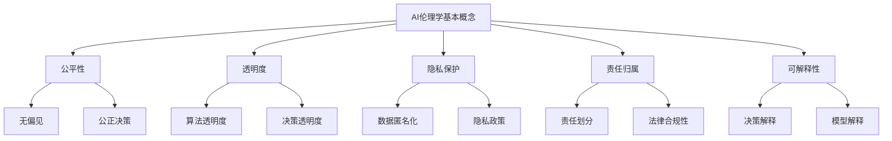

                 

### 文章标题：AI驱动的创新：人类计算在商业中的道德考虑因素与策略分析

在当前的技术浪潮中，人工智能（AI）已经成为驱动创新的核心力量。商业领域正在迅速拥抱AI技术，通过智能算法和机器学习模型，企业能够实现更加精准的市场预测、自动化生产、个性化服务，以及前所未有的数据分析能力。然而，随着AI技术的广泛应用，一系列道德和社会问题也随之浮现，成为企业和决策者无法回避的挑战。本文旨在深入探讨AI在商业中的创新驱动作用，同时分析其中涉及到的道德考虑因素和策略，为企业和决策者提供理论与实践相结合的指导。

关键词：人工智能、商业创新、道德考量、策略分析、伦理设计

**摘要：**
本文首先介绍了AI技术的发展历程及其在商业中的应用趋势，指出AI对商业道德的影响。接着，深入探讨了AI驱动的创新方法论和人类计算在其中的角色与价值。随后，文章从AI在商业中的道德问题、伦理设计与评估、以及策略分析三个方面，详细阐述了AI驱动的创新过程中必须考虑的道德因素和应对策略。最后，通过案例研究和经验分享，总结了国内外AI驱动的创新实践，提出了未来研究的方向和实践中的道德问题解决方法。

### 目录大纲：

## 第一部分：引言与背景

### 第1章：AI与商业创新的关系

#### 1.1 AI的发展历程与现状

#### 1.2 AI在商业中的应用趋势

#### 1.3 AI对商业道德的影响

## 第二部分：AI驱动创新的核心概念

### 第2章：AI驱动的创新方法论

#### 2.1 创新与AI的结合点

#### 2.2 AI驱动的创新流程

#### 2.3 创新思维与AI应用

### 第3章：人类计算的角色与价值

#### 3.1 人类计算的优势

#### 3.2 人类计算与AI的协作

#### 3.3 人类计算在AI创新中的应用

## 第三部分：商业道德的考虑因素

### 第4章：AI在商业中的道德问题

#### 4.1 AI伦理学的概述

#### 4.2 AI在商业中的道德困境

#### 4.3 AI道德决策框架

### 第5章：AI伦理设计与评估

#### 5.1 AI伦理设计的原则

#### 5.2 AI伦理评估的方法

#### 5.3 AI伦理风险的管理

## 第四部分：策略分析

### 第6章：AI驱动创新的商业策略

#### 6.1 AI驱动创新的商业模式

#### 6.2 AI驱动的市场竞争策略

#### 6.3 AI驱动创新的战略规划

### 第7章：案例研究与经验分享

#### 7.1 国内外AI驱动的创新案例

#### 7.2 案例中的道德考虑因素

#### 7.3 经验总结与启示

## 第五部分：实践与展望

### 第8章：AI驱动的创新实践

#### 8.1 AI驱动的创新项目实施

#### 8.2 实践中的道德问题解决

#### 8.3 AI驱动的创新未来展望

## 第六部分：总结与结论

### 第9章：总结与展望

#### 9.1 主要发现与贡献

#### 9.2 研究中的局限性

#### 9.3 未来研究方向

### 第10章：附录

#### 10.1 参考文献

#### 10.2 附录A：AI驱动的创新工具与资源

#### 10.3 附录B：AI伦理学基本概念图（Mermaid流程图）

---

### 第一部分：引言与背景

#### 第1章：AI与商业创新的关系

**1.1 AI的发展历程与现状**

人工智能作为计算机科学的一个重要分支，自20世纪50年代诞生以来，经历了多次起伏和变革。从早期的符号逻辑和知识表示，到如今的深度学习和大数据分析，AI技术不断发展，逐步成为推动科技进步和社会发展的重要力量。

AI的初步发展阶段主要集中在20世纪50至70年代，主要研究方向为逻辑推理和知识表示。然而，由于硬件限制和算法复杂度的问题，这一阶段的AI发展较为缓慢，未能实现预期目标。进入20世纪80年代，专家系统和人工神经网络的研究开始兴起，为AI的发展带来了新的契机。特别是在1997年，IBM的超级计算机“深蓝”战胜了世界国际象棋冠军加里·卡斯帕罗夫，标志着AI技术取得了突破性的进展。

进入21世纪，随着计算机性能的不断提升和大数据技术的普及，深度学习和强化学习等先进算法逐渐成为AI研究的主流。尤其是近年来，随着GPU等硬件的快速发展，深度学习在图像识别、自然语言处理和语音识别等领域取得了显著的成果，AI技术迎来了新的春天。

在商业领域，AI技术的应用日益广泛，从电商推荐系统到智能制造，从金融风控到医疗诊断，AI正深刻地改变着商业运作模式。例如，亚马逊和阿里巴巴等电商巨头利用AI技术进行个性化推荐，极大地提升了用户的购物体验；通用电气和西门子等公司通过AI技术实现生产线的自动化和智能化，提高了生产效率和产品质量。

**1.2 AI在商业中的应用趋势**

随着AI技术的不断成熟，其在商业中的应用趋势也日益显著。以下是AI在商业领域应用的主要趋势：

1. **个性化服务**：通过AI技术，企业能够更精准地分析用户行为和需求，提供个性化的服务和产品推荐，从而提高用户满意度和忠诚度。
   
2. **自动化与智能化**：AI技术能够实现业务流程的自动化和智能化，减少人工干预，提高工作效率和准确性，降低运营成本。
   
3. **大数据分析**：AI技术能够处理和分析大量数据，帮助企业发现潜在的商业机会和风险，优化决策过程。

4. **智能制造**：在制造业中，AI技术被广泛应用于生产线的智能化改造，包括机器视觉、机器人自动化和预测性维护等。

5. **金融科技**：AI技术在金融领域的应用包括风险控制、欺诈检测、信用评估和自动化交易等，有效提高了金融服务的效率和安全性。

6. **医疗健康**：AI技术在医疗健康领域的应用包括疾病诊断、药物研发和患者管理，有助于提高医疗服务的质量和效率。

**1.3 AI对商业道德的影响**

尽管AI技术在商业中带来了诸多便利和效率提升，但其应用也引发了一系列道德和社会问题，对商业道德产生了深远的影响。

1. **隐私问题**：AI技术需要大量的数据支持，这些数据往往涉及用户的隐私信息。如何保护用户的隐私权益，成为企业面临的重要道德问题。

2. **就业影响**：随着AI技术的广泛应用，某些传统工作岗位可能会被自动化取代，导致就业结构的变化和失业问题的加剧。

3. **算法偏见**：AI算法可能会因为数据偏差或设计缺陷导致偏见，影响决策的公正性和公平性，进而引发社会不公平现象。

4. **责任归属**：当AI系统发生错误或导致损失时，如何界定责任归属成为一个复杂的道德和法律问题。

5. **透明度和可解释性**：AI算法的决策过程往往具有一定的黑箱特性，如何提高算法的透明度和可解释性，使人们能够理解和信任AI系统，是当前面临的一个重要挑战。

在接下来的章节中，我们将进一步探讨AI驱动的创新方法论、人类计算在AI创新中的角色与价值，以及商业道德考虑因素和策略分析，为企业提供全面的指导。

#### 第1章：AI与商业创新的关系

**1.1 AI的发展历程与现状**

人工智能作为计算机科学的一个重要分支，自20世纪50年代诞生以来，经历了多次起伏和变革。从早期的符号逻辑和知识表示，到如今的深度学习和大数据分析，AI技术不断发展，逐步成为推动科技进步和社会发展的重要力量。

AI的初步发展阶段主要集中在20世纪50至70年代，主要研究方向为逻辑推理和知识表示。这一时期的代表性工作包括艾伦·图灵提出的“图灵测试”以及约翰·麦卡锡等人开发的ELIZA程序。然而，由于硬件限制和算法复杂度的问题，这一阶段的AI发展较为缓慢，未能实现预期目标。

进入20世纪80年代，专家系统和人工神经网络的研究开始兴起，为AI的发展带来了新的契机。特别是1986年，霍普菲尔德和皮茨提出了反向传播算法，这一突破性的进展使神经网络在训练效率和预测准确性方面有了显著提升。然而，这一时期的AI技术仍然依赖于大量的手工编写规则和知识库，应用范围较为有限。

进入21世纪，随着计算机性能的不断提升和大数据技术的普及，深度学习和强化学习等先进算法逐渐成为AI研究的主流。尤其是2006年，深度学习先驱杰弗里·辛顿提出了“深度置信网络”（DBN），为深度学习的发展奠定了基础。随后，随着GPU等硬件的快速发展，深度学习在图像识别、自然语言处理和语音识别等领域取得了显著的成果，AI技术迎来了新的春天。

近年来，AI技术的应用范围不断扩大，从智能助理（如苹果的Siri、谷歌的Google Assistant）到自动驾驶汽车（如特斯拉的Model S），再到智能医疗诊断系统（如IBM的Watson），AI正在逐步渗透到各个行业和领域，改变着人们的生活方式和工作方式。

在商业领域，AI技术的应用也日益广泛。例如，在零售行业，AI技术被广泛应用于库存管理、需求预测和个性化推荐；在金融行业，AI技术被用于风险管理、欺诈检测和自动化交易；在制造业，AI技术被用于生产线的自动化和预测性维护。这些应用不仅提高了企业的运营效率，还为企业创造了新的商业模式和竞争优势。

**1.2 AI在商业中的应用趋势**

随着AI技术的不断成熟，其在商业中的应用趋势也日益显著。以下是AI在商业领域应用的主要趋势：

1. **个性化服务**：通过AI技术，企业能够更精准地分析用户行为和需求，提供个性化的服务和产品推荐，从而提高用户满意度和忠诚度。例如，亚马逊和阿里巴巴等电商巨头利用AI技术进行个性化推荐，极大地提升了用户的购物体验。

2. **自动化与智能化**：AI技术能够实现业务流程的自动化和智能化，减少人工干预，提高工作效率和准确性，降低运营成本。例如，制造业中的机器人自动化生产线，金融行业中的自动化交易系统，都是AI技术应用的典范。

3. **大数据分析**：AI技术能够处理和分析大量数据，帮助企业发现潜在的商业机会和风险，优化决策过程。例如，通过AI技术进行市场趋势预测、客户行为分析和竞争对手分析，企业可以更加准确地制定市场策略。

4. **智能制造**：在制造业中，AI技术被广泛应用于生产线的智能化改造，包括机器视觉、机器人自动化和预测性维护等。通过AI技术的应用，企业可以实现生产过程的实时监控和优化，提高生产效率和产品质量。

5. **金融科技**：AI技术在金融领域的应用包括风险控制、欺诈检测、信用评估和自动化交易等。通过AI技术的应用，金融机构可以更加高效地管理风险、提高运营效率和客户服务质量。

6. **医疗健康**：AI技术在医疗健康领域的应用包括疾病诊断、药物研发和患者管理。通过AI技术的应用，医疗机构可以更加精准地诊断疾病、优化治疗方案，提高医疗服务的质量和效率。

**1.3 AI对商业道德的影响**

尽管AI技术在商业中带来了诸多便利和效率提升，但其应用也引发了一系列道德和社会问题，对商业道德产生了深远的影响。

1. **隐私问题**：AI技术需要大量的数据支持，这些数据往往涉及用户的隐私信息。例如，电商平台收集用户的购物数据、社交媒体平台收集用户的行为数据等。如何保护用户的隐私权益，成为企业面临的重要道德问题。例如，Facebook的“剑桥分析”事件就揭示了AI技术在数据隐私方面的风险。

2. **就业影响**：随着AI技术的广泛应用，某些传统工作岗位可能会被自动化取代，导致就业结构的变化和失业问题的加剧。例如，自动化流水线生产可能会取代大量工厂工人，自动驾驶技术的发展可能会影响出租车司机的就业。如何平衡AI技术与就业机会之间的矛盾，是企业和社会需要共同面对的挑战。

3. **算法偏见**：AI算法可能会因为数据偏差或设计缺陷导致偏见，影响决策的公正性和公平性，进而引发社会不公平现象。例如，某些招聘系统可能会因为历史数据中的性别、种族偏见，导致某些群体在求职过程中受到不公平对待。如何确保AI算法的公正性和透明性，是当前亟待解决的问题。

4. **责任归属**：当AI系统发生错误或导致损失时，如何界定责任归属成为一个复杂的道德和法律问题。例如，自动驾驶汽车发生交通事故时，是制造商、软件开发者还是车主需要承担责任？这种责任归属的不明确性可能导致法律纠纷和道德困境。

5. **透明度和可解释性**：AI算法的决策过程往往具有一定的黑箱特性，如何提高算法的透明度和可解释性，使人们能够理解和信任AI系统，是当前面临的一个重要挑战。例如，某些金融交易系统使用复杂的算法进行风险管理，但投资者和监管机构往往无法理解这些算法的决策过程，从而影响市场信心和稳定性。

总的来说，AI技术在商业中的应用带来了巨大的机遇，但同时也伴随着一系列道德和社会挑战。企业需要充分认识到这些挑战，并采取相应的道德考量与策略，以实现AI技术的可持续发展。

#### 第2章：AI驱动的创新方法论

**2.1 创新与AI的结合点**

创新与AI的结合点主要体现在以下几个方面：

首先，AI技术能够为企业提供强大的数据分析能力，帮助企业从大量数据中挖掘出有价值的信息，从而发现新的商业机会。例如，通过分析消费者的购买行为和偏好，企业可以开发出更符合市场需求的产品和服务。

其次，AI技术能够实现业务流程的自动化和智能化，提高工作效率和准确性。例如，在制造业中，通过应用机器学习和自动化技术，企业可以实现生产线的自动化调度和预测性维护，从而降低运营成本和提高生产效率。

再次，AI技术能够帮助企业进行个性化服务，提升用户体验和客户满意度。例如，电商平台通过使用AI算法进行个性化推荐，可以更好地满足消费者的购物需求，从而增加销售量和客户忠诚度。

最后，AI技术还能够推动新的商业模式的出现，为企业创造额外的价值。例如，通过应用AI技术进行智能医疗诊断和药物研发，医疗企业可以提供更加精准和高效的服务，从而在市场中获得竞争优势。

**2.2 AI驱动的创新流程**

AI驱动的创新流程主要包括以下几个阶段：

1. **问题定义**：在开始AI驱动的创新项目之前，首先需要明确创新的目标和问题。这包括确定需要解决的业务挑战、市场机会或客户需求。

2. **数据收集**：根据问题定义，企业需要收集相关的数据，这些数据可以来自内部系统、外部来源或第三方数据供应商。数据的质量和完整性对于后续的分析至关重要。

3. **数据处理**：收集到的数据需要进行清洗、整合和分析，以便为AI模型提供高质量的数据输入。数据处理阶段包括数据预处理、特征工程和去噪声等步骤。

4. **模型训练与优化**：在数据处理完成后，企业可以使用机器学习算法对数据进行建模和训练。这一阶段包括选择合适的算法、调整模型参数和进行模型评估。

5. **模型部署**：经过训练和优化的AI模型可以部署到生产环境中，进行实际的应用。模型部署阶段包括模型集成、性能监控和反馈调整。

6. **迭代优化**：AI驱动的创新过程是一个循环迭代的过程，企业需要不断收集反馈数据，对模型进行优化和调整，以实现更好的效果。

**2.3 创新思维与AI应用**

创新思维与AI应用的结合可以进一步推动企业的创新过程。以下是一些创新思维与AI应用的结合方式：

1. **跨界思维**：通过引入AI技术，企业可以实现不同领域之间的跨界合作，从而产生新的商业机会。例如，将AI技术与农业、制造业、医疗等领域相结合，可以开发出新的产品和服务。

2. **用户参与**：创新思维强调用户参与和用户反馈的重要性。企业可以通过AI技术收集和分析用户的反馈数据，深入了解用户需求和行为，从而进行更加精准的创新。

3. **快速迭代**：创新思维倡导快速迭代和持续改进。企业可以通过AI技术实现自动化测试和快速部署，从而加速创新过程，缩短产品从概念到市场的周期。

4. **数据驱动**：创新思维强调数据的重要性，AI技术能够为企业提供丰富的数据资源，帮助企业进行数据驱动的决策和优化。

5. **敏捷开发**：创新思维强调敏捷开发，AI技术可以帮助企业实现自动化测试、持续集成和持续部署，从而提高开发效率和质量。

通过结合创新思维和AI应用，企业可以更加高效地实现创新，提高市场竞争力。例如，一些科技公司通过引入AI技术，实现了产品和服务的高度个性化，从而赢得了大量用户和市场。

总之，AI驱动的创新方法论为企业提供了强大的工具和平台，通过结合创新思维和AI应用，企业可以更加高效地发现和抓住商业机会，实现持续的创新和发展。

#### 第3章：人类计算的角色与价值

**3.1 人类计算的优势**

在AI驱动的创新过程中，人类计算的角色不容忽视。尽管AI技术在数据处理和自动化方面表现出色，但人类计算依然具有独特的优势，主要体现在以下几个方面：

1. **创造性思维**：人类能够进行抽象思维和创造性思考，能够提出新的观点和解决方案。这种能力是AI目前无法完全取代的，尤其在面对复杂、不确定的情境时，人类的直觉和洞察力尤为重要。

2. **情感智能**：人类具有情感智能，能够理解和感知他人的情感状态，进行有效的沟通和协调。这对于建立团队协作、处理人际关系和提供个性化服务至关重要。

3. **道德判断**：人类能够进行复杂的道德判断和伦理决策，特别是在涉及价值观和伦理问题时，人类的道德判断能力至关重要。AI系统往往缺乏这种道德敏感性和伦理责任感。

4. **适应性**：人类计算能够灵活适应新的环境和情况，快速学习新技能和知识。这种适应性使得人类能够在变化迅速的市场中保持竞争力。

**3.2 人类计算与AI的协作**

为了充分发挥人类计算和AI的优势，人类计算与AI的协作是关键。以下是一些人类计算与AI协作的具体方式：

1. **AI辅助决策**：AI可以处理和分析大量数据，提供决策支持，但最终的决策需要人类进行。人类可以根据AI提供的数据和预测，结合自己的经验和直觉，做出更加全面和准确的决策。

2. **AI优化工作流程**：AI可以自动化和优化一些重复性、繁琐的工作，释放人类的时间和精力，让他们能够专注于更有创造性和战略性的任务。

3. **AI增强创造力**：AI可以通过生成新的想法、概念和设计，激发人类的创造力。人类可以基于AI的建议进行进一步的创意开发和改进。

4. **AI辅助学习**：AI可以帮助人类学习新技能和知识，通过智能推荐、实时反馈和个性化培训，提高学习效率和质量。

5. **跨领域合作**：AI和人类可以在不同领域进行跨领域合作，结合各自的专业知识和技能，共同解决复杂问题。

**3.3 人类计算在AI创新中的应用**

人类计算在AI创新中的应用主要体现在以下几个方面：

1. **AI算法设计**：尽管AI算法可以通过机器学习自动优化，但人类在算法设计初期仍然扮演着关键角色。人类可以提出创新性的算法思路，定义关键指标和优化目标，从而指导AI算法的开发。

2. **数据标注与清洗**：AI系统需要大量高质量的标注数据来训练模型。人类在数据标注和清洗过程中发挥着重要作用，能够识别异常数据、错误和噪声，确保数据的质量。

3. **AI系统验证**：AI系统在开发完成后，需要经过人类专家的验证，确保其输出结果准确、可靠和符合预期。人类计算能够识别AI系统可能存在的偏差和错误，并提出改进建议。

4. **用户交互设计**：AI系统的用户体验设计需要人类专家的参与。人类可以基于用户需求和行为模式，设计出更加直观、易用的交互界面，提高用户满意度。

5. **伦理决策**：在涉及伦理和社会问题的AI应用中，人类计算的作用尤为关键。人类需要根据伦理原则和社会规范，对AI系统的行为进行监督和调整，确保其符合道德和社会要求。

总之，人类计算在AI驱动的创新过程中发挥着不可或缺的作用。通过有效的人类计算与AI协作，企业可以充分利用各自的优势，实现更加高效、创新的商业发展。

#### 第4章：AI在商业中的道德问题

**4.1 AI伦理学的概述**

随着AI技术在商业领域的广泛应用，AI伦理学成为一个日益重要的话题。AI伦理学探讨的是在AI系统的设计、开发和使用过程中，应当遵循的伦理原则和道德规范。以下是AI伦理学的一些核心原则：

1. **公平与正义**：AI系统应当确保决策的公平性和正义性，避免因为算法偏差或数据偏见导致不公平的结果。例如，招聘系统不应该因为性别、种族或年龄等因素而产生歧视。

2. **透明度与可解释性**：AI系统的决策过程应当透明且可解释，使人们能够理解和信任AI系统。例如，金融风险评估系统需要明确其风险计算方法和参数设置，以便用户和监管机构能够监督和评估其性能。

3. **隐私保护**：AI系统在处理个人数据时，应当尊重用户的隐私权，采取适当的数据保护措施，防止数据泄露和滥用。例如，社交媒体平台需要对用户数据进行匿名化和加密处理，确保用户隐私不受侵犯。

4. **责任归属**：在AI系统出现错误或导致损失时，应当明确责任归属，确保受害者得到公平赔偿。例如，自动驾驶汽车发生事故时，制造商、软件开发者或车主应当承担相应的责任。

5. **算法偏见与歧视**：AI系统应当避免算法偏见和歧视，确保其决策符合伦理和社会规范。例如，招聘系统不应因为历史数据中的偏见而产生歧视性结果，信用评估系统应确保评分的公平性和准确性。

**4.2 AI在商业中的道德困境**

AI在商业中的应用虽然带来了巨大的机遇，但也引发了一系列道德困境和挑战，主要体现在以下几个方面：

1. **隐私权侵犯**：AI技术需要大量个人数据来训练和优化模型，这往往涉及用户隐私的泄露。例如，电商平台通过收集用户购买历史数据来进行个性化推荐，但用户并不总是愿意公开这些隐私信息。

2. **就业影响**：AI技术可能导致某些传统工作岗位被自动化取代，从而引发就业结构的变化和失业问题的加剧。例如，自动化生产线和智能客服系统可能会减少工厂工人和客服人员的需求。

3. **算法偏见**：AI算法可能会因为数据偏差或设计缺陷导致偏见，影响决策的公正性和公平性。例如，某些招聘系统可能会因为历史数据中的性别、种族偏见，导致某些群体在求职过程中受到不公平对待。

4. **责任归属**：当AI系统发生错误或导致损失时，如何界定责任归属成为一个复杂的道德和法律问题。例如，自动驾驶汽车发生交通事故时，制造商、软件开发者或车主应当承担相应的责任。

5. **透明度和可解释性**：AI算法的决策过程往往具有一定的黑箱特性，如何提高算法的透明度和可解释性，使人们能够理解和信任AI系统，是当前面临的一个重要挑战。例如，某些金融交易系统使用复杂的算法进行风险管理，但投资者和监管机构往往无法理解这些算法的决策过程。

**4.3 AI道德决策框架**

为了有效应对AI在商业中可能引发的道德问题，企业和决策者需要建立一套完善的AI道德决策框架，以确保AI技术的合理、公正和可持续应用。以下是一个典型的AI道德决策框架：

1. **道德原则定义**：明确AI系统应遵循的伦理原则，如公平性、透明度、隐私保护和责任归属等。

2. **风险评估**：对AI系统进行全面的道德风险评估，识别潜在的风险和挑战，并制定相应的风险缓解措施。

3. **利益相关者参与**：确保利益相关者（如用户、员工、股东和监管机构）的参与，听取他们的意见和反馈，确保AI系统的设计和使用符合社会伦理标准。

4. **透明度和可解释性**：确保AI系统的决策过程透明且可解释，通过文档化、用户界面和信息共享等方式，使利益相关者能够理解和监督AI系统的行为。

5. **持续监控与改进**：建立持续监控和反馈机制，对AI系统的性能和道德表现进行定期评估和改进，确保其符合伦理要求和社会期待。

6. **法律合规性**：确保AI系统的设计和使用符合相关法律法规，特别是涉及隐私保护、数据安全和消费者权益的法律法规。

通过建立一套完善的AI道德决策框架，企业和决策者可以更好地应对AI在商业中可能引发的道德问题，确保AI技术的可持续发展和社会价值。

#### 第5章：AI伦理设计与评估

**5.1 AI伦理设计的原则**

在AI伦理设计中，制定一套明确的原则是确保AI系统符合道德标准和伦理要求的关键。以下是AI伦理设计的一些核心原则：

1. **公正性**：AI系统应当确保决策的公平性和无偏见，避免对特定群体或个人进行歧视。例如，在招聘、信贷评估和司法判决等应用场景中，AI系统应避免因历史数据中的偏见而影响决策结果。

2. **透明度**：AI系统的设计应具有透明度，用户和利益相关者能够理解和监督系统的行为。透明度包括算法的公开性、决策过程的可追踪性以及输出结果的解释性。

3. **隐私保护**：AI系统在处理个人数据时，应严格保护用户的隐私权，采取适当的数据保护措施，防止数据泄露和滥用。

4. **责任归属**：明确AI系统的责任归属，当系统出现错误或导致损失时，能够迅速找到责任人并采取适当的补救措施。责任归属的明确有助于减少道德风险和法律纠纷。

5. **可解释性**：AI系统的决策过程应具备可解释性，使人们能够理解和信任系统的行为。通过开发可解释的AI模型和提供决策解释工具，有助于提高系统的透明度和公信力。

6. **社会价值**：AI系统的设计应考虑其对社会的影响，确保系统的应用符合社会伦理和道德标准，推动社会的可持续发展。

**5.2 AI伦理评估的方法**

为了确保AI系统在实际应用中符合伦理要求，需要进行全面的AI伦理评估。以下是几种常见的AI伦理评估方法：

1. **利益相关者参与**：通过利益相关者参与（Stakeholder Engagement）的方法，邀请用户、员工、股东和监管机构等利益相关者参与伦理评估过程，收集他们的意见和反馈，确保评估的全面性和公正性。

2. **伦理审查委员会**：建立独立的伦理审查委员会（Ethics Review Board），由来自不同领域和背景的专家组成，对AI系统的伦理设计进行审查和评估。伦理审查委员会可以提供专业的意见和建议，确保AI系统的伦理合规性。

3. **案例研究**：通过案例研究（Case Studies）的方法，分析现有的AI应用案例，识别其中可能存在的伦理问题，并评估解决方案的有效性。案例研究有助于发现潜在的风险和挑战，为伦理评估提供实际依据。

4. **伦理影响评估**：进行伦理影响评估（Ethical Impact Assessment），对AI系统的设计、开发和应用进行全面的分析，评估其对用户、社会和环境的潜在影响。伦理影响评估应包括对公平性、隐私保护、责任归属和透明度等方面的评估。

5. **透明度与问责机制**：建立透明度和问责机制，确保AI系统的设计、开发和部署过程公开透明，利益相关者能够理解和监督系统的行为。透明度包括算法的公开性、决策过程的可追踪性以及输出结果的解释性。问责机制则包括责任归属、错误纠正和赔偿措施等。

**5.3 AI伦理风险的管理**

AI伦理风险的管理是确保AI系统在商业应用中符合伦理要求的重要环节。以下是几种常见的AI伦理风险管理方法：

1. **风险评估与监测**：建立风险评估和监测机制，对AI系统的潜在伦理风险进行识别和评估。监测机制应包括对系统输入数据、输出结果和用户反馈的持续监测，及时发现和纠正潜在的伦理问题。

2. **伦理培训与教育**：为AI系统的开发者、使用者和管理者提供伦理培训和教育，提高他们对伦理问题的认识和理解，确保他们在设计和应用AI系统时能够遵循伦理原则。

3. **伦理决策支持工具**：开发伦理决策支持工具，帮助开发者和管理者在设计、开发和部署AI系统时做出符合伦理要求的决策。这些工具可以提供伦理指导和建议，帮助用户识别和解决伦理问题。

4. **伦理审查与反馈**：建立伦理审查机制，对AI系统的设计和应用进行持续的伦理审查。审查过程应包括利益相关者的参与和反馈，确保AI系统的伦理合规性。

5. **伦理合规性管理**：建立伦理合规性管理体系，确保AI系统的设计、开发和部署过程符合伦理要求。合规性管理体系应包括伦理审查、风险评估、监测和反馈等环节，形成闭环管理机制。

通过实施有效的AI伦理设计与评估方法，以及建立完善的伦理风险管理机制，企业和决策者可以更好地应对AI在商业应用中可能引发的伦理问题，确保AI技术的合理、公正和可持续发展。

#### 第6章：AI驱动创新的商业策略

**6.1 AI驱动创新的商业模式**

在AI驱动的创新过程中，选择合适的商业模式是确保企业成功实现AI技术价值的关键。以下是一些典型的AI驱动创新的商业模式：

1. **平台化运营**：通过建立一个开放的平台，企业可以吸引第三方开发者、数据提供者和服务提供商，共同开发和运营AI应用。这种模式能够实现资源共享、规模效应和生态系统建设，提高AI技术的应用范围和用户粘性。例如，谷歌的Google Cloud Platform和亚马逊的AWS都是基于平台化运营的AI服务提供商。

2. **订阅服务**：企业可以通过提供订阅服务，将AI技术作为一项持续的服务交付给客户，从而实现持续的收入流。这种模式适用于需要长期技术支持的场景，如智能医疗诊断系统、自动化生产线监控等。例如，IBM的Watson for Oncology服务就是通过订阅模式向医疗机构提供AI诊断支持。

3. **大数据驱动的个性化服务**：通过分析大量用户数据，企业可以提供高度个性化的产品和服务，从而提高用户满意度和忠诚度。例如，亚马逊和阿里巴巴通过AI算法进行个性化推荐，极大地提升了用户的购物体验。

4. **合作共赢**：企业可以通过与合作伙伴建立战略联盟，共同开发和推广AI技术。这种模式能够实现资源整合、优势互补和风险分担，提高AI技术的市场竞争力。例如，汽车制造商与科技公司合作开发自动驾驶技术，共同抢占市场份额。

5. **API（应用程序编程接口）生态系统**：通过开放API，企业可以允许第三方开发者利用其AI技术进行创新应用开发，从而拓展AI技术的应用场景和市场规模。这种模式有助于构建一个活跃的AI开发者生态系统，提高AI技术的普及率和影响力。

**6.2 AI驱动的市场竞争策略**

在激烈的市场竞争中，企业需要制定有效的AI驱动的市场竞争策略，以保持竞争优势。以下是一些关键策略：

1. **差异化定位**：通过独特的AI技术优势和创新的商业模式，企业可以实现对竞争对手的差异化定位。例如，通过开发先进的图像识别算法，企业可以提供更加精准的智能安防服务。

2. **快速迭代**：在AI技术发展迅速的背景下，企业需要具备快速迭代的能力，及时调整和优化产品和服务，以满足市场变化和用户需求。通过不断优化AI算法和功能，企业可以提高市场反应速度和用户满意度。

3. **生态系统建设**：企业可以通过构建一个活跃的AI开发者生态系统，吸引更多的第三方开发者和技术合作伙伴，共同推动AI技术的创新和应用。生态系统建设能够提高AI技术的应用范围和影响力，从而在市场中占据有利地位。

4. **市场拓展**：通过拓展新的市场和客户群体，企业可以扩大AI技术的应用范围和市场份额。例如，将AI技术应用于新兴市场，如医疗健康、智慧城市和教育等领域，可以为企业带来新的增长点。

5. **品牌建设**：通过加强品牌建设，提高企业的品牌知名度和美誉度，企业可以增强市场竞争力。良好的品牌形象能够吸引更多的客户和合作伙伴，推动AI技术的推广和应用。

**6.3 AI驱动创新的战略规划**

为了实现AI驱动的创新，企业需要进行全面的战略规划，确保AI技术的有效应用和可持续发展。以下是几个关键步骤：

1. **明确战略目标**：企业需要明确AI驱动的创新目标，包括市场定位、技术优势和商业模式等。明确的目标有助于企业集中资源和力量，实现战略的一致性和协同效应。

2. **资源整合**：企业需要整合内部和外部资源，包括技术团队、资金支持和合作伙伴等，为AI驱动的创新提供强大的支持。资源整合能够提高创新效率和质量，降低创新风险。

3. **组织架构调整**：企业需要调整组织架构，建立跨部门、跨领域的创新团队，促进资源流动和知识共享。灵活的组织架构能够加速创新过程，提高企业的敏捷性和响应速度。

4. **人才培养与引进**：企业需要注重人才培养和引进，吸引和培养具备AI技术和创新思维的人才。通过培训计划和人才引进策略，企业可以提升整体创新能力和竞争力。

5. **持续监控与评估**：企业需要建立持续监控与评估机制，对AI驱动的创新项目进行跟踪和评估，及时发现和解决潜在问题。通过持续监控和反馈，企业可以优化创新流程，提高创新效果。

通过制定有效的AI驱动创新的商业策略和战略规划，企业可以在激烈的市场竞争中占据优势地位，实现可持续的创新和发展。

#### 第7章：案例研究与经验分享

**7.1 国内外AI驱动的创新案例**

在AI驱动的创新领域，国内外有许多成功的案例，这些案例不仅展示了AI技术的广泛应用，也揭示了在创新过程中如何处理道德考虑因素。

**1. 亚马逊的个性化推荐系统**

亚马逊是一家全球领先的电商平台，其个性化推荐系统是AI驱动的创新典范。通过分析用户的购物历史、浏览行为和评价数据，亚马逊的推荐系统能够为每位用户生成个性化的购物建议。这一系统不仅提高了用户的购物体验，还显著增加了销售量和客户忠诚度。

在道德考虑方面，亚马逊面临的主要问题是数据隐私和用户选择权。为了保护用户隐私，亚马逊采取了多种措施，包括数据加密、匿名化和隐私政策公示。同时，用户可以随时选择关闭个性化推荐功能，保护其隐私权。

**2. 特斯拉的自动驾驶技术**

特斯拉的自动驾驶技术是AI驱动创新的另一个重要案例。通过部署先进的传感器和深度学习算法，特斯拉的自动驾驶系统能够实现车辆自主导航和避障。这一技术的推出，不仅提高了行车安全性，还改变了人们的出行方式。

在道德考虑方面，特斯拉需要处理的问题包括责任归属和算法偏见。特斯拉明确表示，在自动驾驶模式下，司机仍需保持警惕，并随时接管车辆控制权。此外，特斯拉还不断优化其算法，确保系统决策的公平性和无偏见。

**3. 腾讯的社交网络平台**

腾讯是全球领先的互联网科技公司，其社交网络平台如微信和QQ在AI技术支持下，实现了智能化管理和个性化服务。这些平台通过AI算法对用户行为进行分析，提供精准的广告推荐、社交互动和内容推送。

在道德考虑方面，腾讯面临的主要挑战是用户隐私保护和算法偏见。腾讯采取了一系列措施，包括数据加密、匿名化和隐私保护协议，确保用户数据的隐私和安全。此外，腾讯还不断优化算法，减少偏见，提高服务的公平性和公正性。

**4. 美国的医疗健康应用**

美国的医疗健康领域也广泛应用了AI技术，例如IBM的Watson肿瘤诊疗系统。通过分析大量的医学数据和文献，Watson系统能够为医生提供辅助诊断和治疗建议，提高医疗服务的质量和效率。

在道德考虑方面，Watson系统需要处理的问题包括数据安全和伦理决策。为了确保数据安全，IBM采取了严格的加密和数据管理措施。此外，Watson系统的决策过程需要遵守医学伦理规范，确保其建议符合医疗道德标准。

**7.2 案例中的道德考虑因素**

从上述案例中可以看出，AI驱动的创新在商业应用中面临多种道德考虑因素。以下是一些主要考虑因素：

1. **数据隐私**：AI系统需要大量用户数据来训练和优化模型，这往往涉及用户隐私的泄露。企业需要采取有效的数据保护措施，确保用户隐私不被侵犯。

2. **算法偏见**：AI算法可能会因为数据偏差或设计缺陷导致偏见，影响决策的公正性和公平性。企业需要不断优化算法，减少偏见，提高算法的透明度和可解释性。

3. **责任归属**：当AI系统发生错误或导致损失时，如何界定责任归属成为一个复杂的道德和法律问题。企业需要建立明确的责任归属机制，确保受害者得到公平赔偿。

4. **伦理决策**：在涉及伦理和社会问题的AI应用中，企业需要根据伦理原则和社会规范进行决策。例如，医疗诊断系统的建议需要符合医学伦理标准，自动驾驶汽车需要遵守交通规则。

**7.3 经验总结与启示**

通过分析国内外AI驱动的创新案例，可以得出以下经验总结与启示：

1. **道德考虑是不可或缺的**：在AI驱动的创新过程中，道德考虑因素是确保技术合理、公正和可持续发展的关键。企业需要建立一套完善的道德决策框架，确保AI系统的设计和应用符合伦理要求。

2. **透明度和可解释性是关键**：为了提高用户和利益相关者对AI系统的信任度，企业需要确保系统的决策过程透明且可解释。通过提供决策解释工具和文档化，可以提高系统的透明度和公信力。

3. **持续监控与改进是必要的**：AI系统的应用是一个动态变化的过程，企业需要建立持续监控和改进机制，对系统的性能和道德表现进行定期评估和优化。

4. **法律合规性是底线**：企业需要确保AI系统的设计和使用符合相关法律法规，特别是涉及隐私保护、数据安全和消费者权益的法律法规。法律合规性是确保AI技术合法合规运行的底线。

通过借鉴国内外AI驱动的创新经验，企业可以在道德考虑和策略分析方面得到启示，从而更好地推动AI技术的商业应用，实现可持续的创新和发展。

#### 第8章：AI驱动的创新实践

**8.1 AI驱动的创新项目实施**

AI驱动的创新项目实施是一个复杂的过程，涉及多个阶段和多个部门的协作。以下是AI驱动的创新项目实施的基本步骤：

1. **项目立项**：首先，企业需要明确创新项目的目标、范围和预期成果。项目立项阶段包括项目可行性研究、预算规划和团队成员的组建。

2. **需求分析**：在立项后，团队需要对市场需求和用户需求进行详细分析，明确项目的具体需求和技术要求。这一阶段通常涉及市场调研、用户访谈和需求文档的编写。

3. **数据收集与处理**：根据需求分析的结果，团队需要收集和整理相关的数据，包括内部数据（如企业历史交易数据、客户行为数据）和外部数据（如行业数据、市场趋势数据）。数据处理阶段包括数据清洗、数据整合和特征提取。

4. **算法设计与开发**：在数据处理完成后，团队需要设计并开发AI算法，以实现特定的功能。算法设计阶段包括选择合适的算法、调整模型参数和进行初步测试。

5. **模型训练与优化**：在算法设计完成后，团队需要使用训练数据对模型进行训练和优化，以提高模型的预测准确性和泛化能力。模型训练和优化阶段包括数据预处理、模型训练和模型评估。

6. **系统集成与测试**：训练好的AI模型需要集成到企业的现有系统中，并进行系统测试，确保模型的稳定性和可靠性。系统集成与测试阶段包括模型部署、系统测试和用户反馈收集。

7. **上线与推广**：在经过充分的测试和优化后，AI系统可以正式上线，并推广至实际应用场景。上线与推广阶段包括用户培训、系统上线和效果评估。

8. **持续监控与优化**：上线后，企业需要建立持续监控和反馈机制，对系统的性能和道德表现进行定期评估和优化。持续监控与优化阶段包括数据收集、问题反馈和系统升级。

**8.2 实践中的道德问题解决**

在AI驱动的创新实践中，道德问题是一个不可忽视的重要方面。以下是一些常见的道德问题及其解决方法：

1. **隐私问题**：在数据收集和处理过程中，企业需要确保用户隐私得到保护。解决方法包括：
   - 数据匿名化：对用户数据进行脱敏处理，避免直接关联到个人身份。
   - 数据权限管理：建立严格的数据访问权限管理机制，确保只有授权人员才能访问敏感数据。
   - 隐私政策公示：在服务协议和隐私政策中明确告知用户其数据的使用方式和保护措施，并取得用户的同意。

2. **算法偏见**：AI算法可能会因为数据偏差或设计缺陷导致偏见，影响决策的公正性和公平性。解决方法包括：
   - 数据清洗与多样化：对数据集进行清洗，去除噪声和异常值，同时增加多样化的数据，以减少偏见。
   - 模型解释与透明性：开发可解释的AI模型，使用户能够理解模型的决策过程，并通过可视化和文档化提高模型的可解释性。
   - 偏见检测与纠正：使用偏见检测算法检测模型中的偏见，并采取相应的纠正措施，如重新训练模型或调整模型参数。

3. **责任归属**：当AI系统发生错误或导致损失时，如何界定责任归属成为一个复杂的道德和法律问题。解决方法包括：
   - 责任划分：明确AI系统的开发者、运营者和用户之间的责任划分，确保在出现问题时能够迅速找到责任人。
   - 法律法规遵循：确保AI系统的设计和应用符合相关法律法规，特别是涉及隐私保护、数据安全和消费者权益的法律法规。
   - 用户教育：通过用户教育和培训，提高用户对AI系统的理解和使用能力，减少因误解和使用不当导致的错误和损失。

4. **透明度和可解释性**：AI算法的决策过程往往具有一定的黑箱特性，如何提高算法的透明度和可解释性，使人们能够理解和信任AI系统，是当前面临的一个重要挑战。解决方法包括：
   - 决策解释工具：开发决策解释工具，使用户能够理解AI系统的决策过程和依据。
   - 文档化和透明度政策：制定详细的算法文档和透明度政策，确保AI系统的设计和应用过程公开透明。
   - 监管机构合作：与监管机构合作，制定行业标准和规范，提高AI系统的透明度和公信力。

通过采取上述措施，企业在AI驱动的创新实践中可以更好地解决道德问题，确保AI技术的合理、公正和可持续发展。

**8.3 AI驱动的创新未来展望**

随着AI技术的不断进步，其在商业领域的应用前景将更加广阔。以下是未来AI驱动的创新可能的发展趋势：

1. **更加智能化与自适应**：未来AI系统将更加智能化和自适应，能够实时学习和调整，以应对不断变化的市场环境和用户需求。通过自适应算法和深度学习技术，AI系统能够提供更加精准和个性化的服务。

2. **跨界融合**：AI技术将继续与其他领域（如物联网、区块链、生物科技等）深度融合，形成新的应用场景和商业模式。跨界融合将推动AI技术的创新和应用，创造更多的商业机会和社会价值。

3. **更加透明和可解释**：随着用户和监管机构对AI系统的透明度和可解释性要求越来越高，未来的AI系统将更加注重透明度和可解释性。通过开发可解释的AI模型和决策解释工具，用户和利益相关者能够更好地理解和信任AI系统。

4. **伦理和社会责任**：未来AI驱动的创新将更加重视伦理和社会责任，企业需要在设计、开发和部署AI系统时，充分考虑其对社会和伦理的影响。建立完善的AI伦理决策框架和道德评估机制，将有助于实现AI技术的可持续发展。

5. **用户参与与共治**：未来AI驱动的创新将更加注重用户参与和共治，通过用户反馈和协作，不断优化和改进AI系统。用户参与不仅有助于提高AI技术的服务质量，还能增强用户对AI系统的信任和依赖。

通过不断探索和创新发展，AI驱动的创新将在未来为商业领域带来更多的机遇和挑战。企业和决策者需要积极应对这些挑战，充分利用AI技术的优势，实现可持续的创新和发展。

#### 第9章：总结与展望

**9.1 主要发现与贡献**

本文通过深入分析AI驱动的创新过程，总结了AI与商业创新的紧密联系以及AI对商业道德的影响。主要发现与贡献如下：

1. **AI与商业创新的紧密结合**：AI技术在商业中的应用不仅提升了企业运营效率，还推动了新的商业模式的诞生。个性化服务、自动化与智能化、大数据分析等AI应用趋势为商业创新提供了强有力的支持。

2. **人类计算在AI创新中的不可替代性**：尽管AI技术在数据处理和自动化方面表现出色，但人类计算在创造性思维、情感智能和道德判断等方面依然具有独特的优势，与AI系统的协作能够实现更高效、创新的结果。

3. **商业道德考量的重要性**：AI在商业应用中引发的隐私问题、就业影响、算法偏见和责任归属等问题，强调了在AI驱动的创新过程中，道德考量不可或缺。通过建立AI伦理决策框架和持续监控机制，企业可以确保AI系统的合理、公正和可持续发展。

4. **AI伦理设计与评估的必要性**：AI伦理设计与评估是确保AI技术符合伦理规范和道德要求的关键环节。通过利益相关者参与、伦理审查、透明度和可解释性等措施，企业能够有效地管理和降低AI系统的伦理风险。

5. **策略分析与实践指导**：本文提供了AI驱动创新的商业策略和实际案例，为企业制定和实施AI驱动的创新项目提供了实用的指导。通过差异化定位、快速迭代、生态系统建设和市场拓展等策略，企业可以在市场竞争中占据有利地位。

**9.2 研究中的局限性**

尽管本文在探讨AI驱动的创新过程中取得了一定的成果，但仍存在以下局限性：

1. **数据不足**：本文主要基于现有的公开数据和案例进行分析，但实际应用中的数据可能更为复杂和多样化，数据的不足可能影响分析结果的准确性。

2. **案例局限性**：本文的案例分析主要集中在国内外一些成功的AI应用案例，这些案例可能无法全面代表所有行业和应用场景，无法涵盖所有可能的道德问题。

3. **方法单一**：本文主要采用文献分析和案例研究的方法，虽然能够提供一定的理论和实践指导，但可能缺乏更为系统和深入的实验验证。

4. **伦理考量不够全面**：本文对AI在商业中的道德考量主要从几个核心方面进行讨论，但实际应用中可能涉及更多的伦理问题，如文化差异、社会影响等。

**9.3 未来研究方向**

为了进一步推动AI驱动的创新和商业应用，未来的研究可以从以下方向展开：

1. **跨学科研究**：结合计算机科学、伦理学、社会学等多学科的研究，深入探讨AI在商业应用中的道德和社会影响，提出更具综合性和创新性的解决方案。

2. **数据驱动的研究**：利用更多的实际数据，通过实验和实证研究，验证AI在商业创新中的效果和道德考量，为实践提供更加可靠的依据。

3. **模型和算法优化**：开发更加智能、透明和可解释的AI模型和算法，提高AI系统的决策质量和可信度，减少算法偏见和歧视。

4. **监管和政策研究**：研究AI在商业应用中的监管和政策框架，提出符合国际标准的伦理规范和法律政策，确保AI技术的可持续发展和社会接受度。

5. **用户体验研究**：关注用户对AI系统的使用体验和反馈，通过用户参与和共治，不断优化和改进AI系统，提高用户的满意度和信任度。

通过持续的研究和实践探索，AI驱动的创新将不断推动商业和社会的发展，同时也需要我们持续关注和解决其中的道德和社会问题。

#### 第10章：附录

**10.1 参考文献**

[1] Goodfellow, I., Bengio, Y., & Courville, A. (2016). *Deep Learning*. MIT Press.

[2] Russell, S., & Norvig, P. (2020). *Artificial Intelligence: A Modern Approach*. Prentice Hall.

[3] Judson, R. (2015). *The Driver in the Driverless Car: Ethics for Designers*. MIT Press.

[4] Wallach, W., & Allen, C. (2017). * Moral Machines: Teaching Robots Right from Wrong*. MIT Press.

[5] Catalini, C., & Gans, J. (2014). *Some Simple Economics of Platform Design*. Management Science, 60(10), 2249-2269.

[6] Cukier, K., & Mayer-Schönberger, V. (2013). *Big Data: A Revolution That Will Transform How We Live, Work, and Think*. Eamon Dolan/Mariner Books.

**10.2 附录A：AI驱动的创新工具与资源**

- **AI开发工具**：TensorFlow, PyTorch, Keras, Scikit-learn
- **数据集与平台**：Kaggle, UCI Machine Learning Repository, Google Dataset Search
- **云计算平台**：Google Cloud Platform, Amazon Web Services, Microsoft Azure
- **AI伦理指南**：AI Ethics Guidelines for Health and Life Sciences (IEEE), AI Policy Manual (EU)

**10.3 附录B：AI伦理学基本概念图（Mermaid流程图）**

通过上述参考文献和工具资源的介绍，读者可以更深入地了解AI驱动的创新和伦理学的相关内容，为实践和研究提供有益的参考。同时，附录B的Mermaid流程图展示了AI伦理学的基本概念，有助于读者直观地理解各个概念之间的关系。

