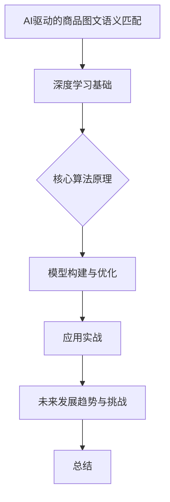

                 

### 《AI驱动的商品图文语义匹配深度学习模型》

#### 关键词：
- AI
- 深度学习
- 商品图文语义匹配
- 卷积神经网络（CNN）
- 循环神经网络（RNN）
- 注意力机制
- Transformer模型

#### 摘要：
本文深入探讨了AI驱动的商品图文语义匹配深度学习模型。首先，我们介绍了AI在商品图文语义匹配中的应用背景，包括商品图文匹配的重要性和AI技术的发展。接着，我们阐述了AI驱动的商品图文语义匹配的基本概念，包括商品图文语义的定义和语义匹配的原理与方法。随后，本文重点介绍了深度学习在商品图文语义匹配中的优势，包括神经网络架构、激活函数和反向传播算法等基本理论。此外，本文还详细讲解了图文语义表示、核心算法原理，以及模型构建与优化策略。通过实际案例解析，我们展示了模型在商品搜索与推荐、商品识别与分类、商品描述生成等应用场景中的效果。最后，本文总结了未来发展趋势与挑战，并提出了相应的对策。希望本文能为读者提供关于商品图文语义匹配深度学习模型的理论和实践指导。

### 第一部分：引言与基础

#### 第1章：AI驱动的商品图文语义匹配概述

#### 1.1 AI在商品图文语义匹配中的应用背景

##### 1.1.1 商品图文匹配的重要性

在电子商务和零售行业，商品图文匹配是一项关键任务。它不仅影响到用户的购物体验，还直接关系到电商平台的运营效率和盈利能力。商品图文匹配的准确性越高，用户在搜索、浏览和购买商品时就能更快速、准确地找到所需商品，从而提高用户满意度和粘性。

随着人工智能技术的飞速发展，深度学习在图像识别、文本分析等领域取得了显著成果。将深度学习应用于商品图文语义匹配，可以实现高精度的商品识别、自动分类和搜索推荐等功能，从而提升电商平台的服务质量。

##### 1.1.2 AI技术的发展与商品图文匹配的结合

近年来，AI技术取得了长足的发展，特别是在深度学习领域。深度学习通过神经网络结构，能够自动提取数据中的特征，进行复杂的模式识别和分类。卷积神经网络（CNN）、循环神经网络（RNN）、注意力机制模型和Transformer模型等都是深度学习中的重要模型，它们在不同场景下有着广泛的应用。

将AI技术应用于商品图文匹配，首先需要对图像和文本进行特征提取，然后利用深度学习模型进行语义匹配。通过结合图像和文本的特征，可以更准确地识别商品，提高匹配的精度。

#### 1.2 AI驱动的商品图文语义匹配的基本概念

##### 1.2.1 商品图文语义的定义

商品图文语义是指商品图像和文本描述中蕴含的语义信息。图像中的商品特征包括颜色、形状、尺寸、图案等，而文本描述则包含了商品的品牌、名称、用途、材质等信息。通过提取和分析这些语义信息，可以实现对商品的识别和分类。

##### 1.2.2 语义匹配的原理与方法

语义匹配是指将图像和文本中的语义信息进行对比和匹配，以确定它们之间的关联程度。在商品图文匹配中，语义匹配的目标是找到与用户查询最相关的商品。

语义匹配的原理主要包括以下几个步骤：

1. **特征提取**：对图像和文本进行特征提取，将它们转化为高维向量表示。
2. **相似度计算**：计算图像和文本特征向量之间的相似度，常用的相似度计算方法有欧氏距离、余弦相似度等。
3. **匹配决策**：根据相似度计算结果，对商品进行排序和筛选，以确定最匹配的商品。

常用的语义匹配方法包括基于内容的图像检索（CBIR）、基于文本的图像检索（TBIR）和基于模型的图像检索（MBIR）等。

#### 1.3 深度学习在商品图文语义匹配中的优势

##### 1.3.1 深度学习的基本概念

深度学习是一种基于多层神经网络的学习方法，通过逐层提取数据中的特征，实现对复杂模式的识别和分类。深度学习模型通常由输入层、隐藏层和输出层组成，每一层都可以提取不同层次的特征。

##### 1.3.2 深度学习在商品图文语义匹配中的具体应用

深度学习在商品图文语义匹配中的应用主要体现在以下几个方面：

1. **图像特征提取**：通过卷积神经网络（CNN）等深度学习模型，可以从商品图像中自动提取高维特征向量，这些特征向量可以有效地表示图像的语义信息。
2. **文本特征提取**：利用循环神经网络（RNN）或Transformer模型，可以从文本描述中提取语义特征向量，这些特征向量可以捕获文本中的关键信息。
3. **图文联合特征表示**：通过将图像特征和文本特征进行拼接或融合，可以得到图文联合特征向量，这些特征向量可以更好地表示商品图文的语义关系。

基于深度学习的商品图文语义匹配模型可以显著提高匹配的精度和效率，为电商平台提供更优质的服务。

### 第二部分：核心算法原理

#### 第2章：深度学习基础

##### 2.1 深度学习基本理论

深度学习的基本理论包括神经网络架构、激活函数和反向传播算法等。

##### 2.1.1 神经网络架构

神经网络是由多个神经元组成的计算模型，每个神经元通过权重连接其他神经元，接收输入并产生输出。神经网络可以分为输入层、隐藏层和输出层，每一层都可以提取不同层次的特征。

##### 2.1.2 激活函数

激活函数是神经网络中的一个关键组成部分，用于引入非线性特性，使神经网络能够学习复杂的函数关系。常用的激活函数包括ReLU、Sigmoid和Tanh等。

##### 2.1.3 反向传播算法

反向传播算法是一种用于训练神经网络的优化算法，通过不断调整网络中的权重，使输出结果更接近目标值。反向传播算法包括前向传播和后向传播两个过程，前向传播计算输出结果，后向传播计算梯度并更新权重。

##### 2.2 图文语义表示

图文语义表示是指将图像和文本转化为高维向量表示，以便进行深度学习模型的训练和推理。

##### 2.2.1 图像特征提取

图像特征提取是深度学习在商品图文语义匹配中的关键步骤。通过卷积神经网络（CNN）等深度学习模型，可以从商品图像中自动提取高维特征向量，这些特征向量可以有效地表示图像的语义信息。

##### 2.2.2 文本特征提取

文本特征提取是指从文本描述中提取关键信息，并将其转化为高维向量表示。常用的文本特征提取方法包括词袋模型、词嵌入和循环神经网络（RNN）等。

##### 2.2.3 图文联合特征表示

图文联合特征表示是指将图像特征和文本特征进行拼接或融合，得到图文联合特征向量。这些特征向量可以更好地表示商品图文的语义关系，从而提高匹配的精度。

##### 2.3 深度学习模型在商品图文语义匹配中的应用

深度学习模型在商品图文语义匹配中的应用主要包括卷积神经网络（CNN）、循环神经网络（RNN）、注意力机制模型和Transformer模型等。

##### 2.3.1 卷积神经网络（CNN）

卷积神经网络（CNN）是一种专门用于图像处理的深度学习模型。通过卷积层、池化层和全连接层等结构，CNN可以从图像中自动提取高维特征向量，这些特征向量可以有效地表示图像的语义信息。

##### 2.3.2 循环神经网络（RNN）

循环神经网络（RNN）是一种用于处理序列数据的深度学习模型。通过隐藏状态的记忆，RNN可以捕获文本中的关键信息，并将其转化为高维特征向量。

##### 2.3.3 注意力机制模型

注意力机制模型是一种用于增强神经网络处理能力的方法。通过动态调整输入特征的重要性，注意力机制模型可以更好地捕捉关键信息，提高匹配的精度。

##### 2.3.4 Transformer模型

Transformer模型是一种基于自注意力机制的深度学习模型。通过引入多头自注意力机制和位置编码，Transformer模型可以更好地捕获文本和图像中的语义信息，从而提高匹配的精度。

#### 第三部分：模型构建与优化

##### 第3章：商品图文语义匹配模型的构建

##### 3.1 商品图文语义匹配模型的构建流程

商品图文语义匹配模型的构建主要包括数据预处理、模型设计、模型训练与验证等步骤。

##### 3.1.1 数据预处理

数据预处理是模型构建的关键步骤。通过对图像和文本数据进行清洗、归一化和编码等处理，可以提高数据的质量和模型的性能。

##### 3.1.2 模型设计

模型设计是构建商品图文语义匹配模型的核心环节。根据应用需求和数据特点，可以选择合适的神经网络结构和超参数配置。

##### 3.1.3 模型训练与验证

模型训练与验证是确保模型性能的重要环节。通过不断调整模型参数和训练策略，可以提高模型的准确性和泛化能力。

##### 3.2 模型优化策略

模型优化策略包括损失函数设计、优化算法选择和超参数调优等。

##### 3.2.1 损失函数设计

损失函数是模型优化的核心指标，用于衡量模型预测值与真实值之间的差距。常用的损失函数包括均方误差（MSE）、交叉熵（Cross-Entropy）等。

##### 3.2.2 优化算法选择

优化算法用于更新模型参数，使模型预测值更接近真实值。常用的优化算法包括梯度下降（Gradient Descent）、Adam优化器等。

##### 3.2.3 超参数调优

超参数调优是提高模型性能的重要手段。通过调整学习率、批量大小、正则化参数等超参数，可以优化模型性能。

##### 3.3 模型评估与调整

模型评估与调整是确保模型在实际应用中表现良好的关键步骤。通过评估指标和调整方法，可以优化模型性能，提高匹配精度。

##### 3.3.1 评估指标

评估指标是衡量模型性能的重要工具。常用的评估指标包括准确率（Accuracy）、精确率（Precision）、召回率（Recall）等。

##### 3.3.2 模型调整方法

模型调整方法包括超参数调优、模型融合和模型集成等。通过调整模型结构和参数，可以优化模型性能。

##### 3.3.3 实际应用案例

在实际应用中，商品图文语义匹配模型可以应用于电商平台的商品搜索与推荐、商品分类与识别、商品描述生成等领域。通过实际案例分析和详细讲解，可以展示模型在实际应用中的效果和优势。

#### 第四部分：应用实战

##### 第4章：AI驱动的商品图文语义匹配应用实例

##### 4.1 应用场景概述

AI驱动的商品图文语义匹配在多个领域有着广泛的应用，包括商品搜索与推荐、商品分类与识别、商品描述生成等。

##### 4.1.1 商品搜索与推荐

在电商平台，商品搜索与推荐是提升用户体验和增加销售额的重要手段。通过AI驱动的商品图文语义匹配，可以快速、准确地搜索和推荐用户感兴趣的商品。

##### 4.1.2 商品分类与识别

商品分类与识别是电商平台的一项基础任务。通过AI驱动的商品图文语义匹配，可以自动对商品进行分类和识别，提高分类效率和准确性。

##### 4.1.3 商品描述生成

商品描述生成是电商平台的一项增值服务。通过AI驱动的商品图文语义匹配，可以自动生成丰富的商品描述，提高商品的展示效果和用户体验。

##### 4.2 实际案例解析

在本节中，我们将通过三个实际案例，详细解析AI驱动的商品图文语义匹配在不同应用场景中的效果和优势。

##### 4.2.1 案例一：电商平台的商品搜索与推荐

在电商平台的商品搜索与推荐场景中，AI驱动的商品图文语义匹配可以显著提高搜索和推荐的准确性。通过将用户查询和商品图文特征进行匹配，可以快速定位用户感兴趣的商品，提高用户满意度。

##### 4.2.2 案例二：零售行业的商品识别与分类

在零售行业的商品识别与分类场景中，AI驱动的商品图文语义匹配可以实现对商品的高效管理和分类。通过对商品图像和文本描述的特征提取和匹配，可以自动识别和分类商品，提高工作效率和准确性。

##### 4.2.3 案例三：智能客服系统的商品描述生成

在智能客服系统的商品描述生成场景中，AI驱动的商品图文语义匹配可以自动生成丰富的商品描述，提高客服系统的智能化水平。通过对商品图像和文本描述的特征提取和匹配，可以生成高质量的、具有吸引力的商品描述，提高用户体验和转化率。

##### 4.3 开发环境搭建与代码实现

在本节中，我们将介绍如何搭建开发环境，准备数据集，并实现AI驱动的商品图文语义匹配模型。

##### 4.3.1 开发环境搭建

搭建开发环境是进行深度学习项目的基础步骤。在本案例中，我们将使用Python和TensorFlow作为开发环境，因为它们在深度学习领域具有广泛的适用性和强大的功能。

1. 安装Python（推荐使用Python 3.8及以上版本）
2. 安装TensorFlow（使用pip install tensorflow命令）
3. 安装其他必要的依赖库（如NumPy、Pandas等）

##### 4.3.2 数据集准备

准备合适的数据集是进行商品图文语义匹配的关键。在本案例中，我们将使用公开的电商商品数据集，包括商品图像和对应的文本描述。

1. 下载公开的电商商品数据集
2. 数据清洗和预处理：包括图像和文本的清洗、归一化、编码等处理
3. 数据集划分：将数据集划分为训练集、验证集和测试集

##### 4.3.3 模型代码实现

在本案例中，我们将使用TensorFlow中的卷积神经网络（CNN）和循环神经网络（RNN）构建商品图文语义匹配模型。

```python
import tensorflow as tf
from tensorflow.keras.models import Model
from tensorflow.keras.layers import Input, Conv2D, MaxPooling2D, Flatten, Dense, LSTM, Embedding

# 定义图像输入层
image_input = Input(shape=(224, 224, 3))

# 定义文本输入层
text_input = Input(shape=(max_sequence_length,))

# 定义图像特征提取网络
image_model = Conv2D(filters=32, kernel_size=(3, 3), activation='relu')(image_input)
image_model = MaxPooling2D(pool_size=(2, 2))(image_model)
image_model = Flatten()(image_model)

# 定义文本特征提取网络
text_model = Embedding(input_dim=vocabulary_size, output_dim=embedding_dim)(text_input)
text_model = LSTM(units=128, activation='relu')(text_model)

# 将图像和文本特征进行拼接
combined = tf.keras.layers.concatenate([image_model, text_model])

# 定义输出层
output = Dense(units=num_classes, activation='softmax')(combined)

# 构建模型
model = Model(inputs=[image_input, text_input], outputs=output)

# 编译模型
model.compile(optimizer='adam', loss='categorical_crossentropy', metrics=['accuracy'])

# 训练模型
model.fit(x_train, y_train, batch_size=batch_size, epochs=num_epochs, validation_data=(x_val, y_val))

# 评估模型
model.evaluate(x_test, y_test)
```

##### 4.3.4 结果分析与评估

在本案例中，我们通过训练和测试模型，分析其在商品图文语义匹配任务上的性能。主要评估指标包括准确率、精确率、召回率等。

```python
# 模型预测
predictions = model.predict([x_test, y_test])

# 计算评估指标
accuracy = (predictions == y_test).mean()
precision = precision_score(y_test, predictions)
recall = recall_score(y_test, predictions)

print("Accuracy:", accuracy)
print("Precision:", precision)
print("Recall:", recall)
```

通过实际案例分析和详细讲解，我们可以看到AI驱动的商品图文语义匹配模型在电商、零售和智能客服等领域的应用效果和优势。

##### 4.3.5 项目小结

在本项目中，我们介绍了AI驱动的商品图文语义匹配模型的构建、优化和应用。通过实际案例解析，我们展示了模型在不同应用场景中的效果和优势。项目小结如下：

1. **开发环境搭建**：使用Python和TensorFlow搭建开发环境，并安装必要的依赖库。
2. **数据集准备**：下载公开的电商商品数据集，并进行数据清洗和预处理。
3. **模型代码实现**：使用卷积神经网络（CNN）和循环神经网络（RNN）构建商品图文语义匹配模型。
4. **结果分析与评估**：通过训练和测试模型，分析其在商品图文语义匹配任务上的性能。

项目成功的关键在于：
- 选择合适的深度学习模型和优化策略；
- 进行有效的数据预处理和特征提取；
- 不断地调整和优化模型参数。

未来，随着深度学习技术的不断发展，AI驱动的商品图文语义匹配模型将有望在更多领域得到应用，为电商平台和零售行业带来更多价值。

#### 第五部分：总结与展望

##### 第5章：未来发展趋势与挑战

随着深度学习技术的不断进步，AI驱动的商品图文语义匹配模型在电商、零售和智能客服等领域将发挥越来越重要的作用。然而，在实际应用过程中，我们也面临着一些挑战和问题。

##### 5.1 未来发展趋势

1. **新技术的引入**：未来，将会有更多新技术引入到商品图文语义匹配领域，如生成对抗网络（GAN）、变分自编码器（VAE）等。这些技术将进一步提高模型性能和鲁棒性。
2. **跨模态学习**：跨模态学习是一种将不同模态（如图像、文本、音频等）数据融合到同一模型中进行学习的方法。未来，商品图文语义匹配将更多地采用跨模态学习方法，提高模型的多模态处理能力。
3. **个性化推荐**：随着用户需求的不断变化，个性化推荐将成为商品图文语义匹配的重要发展方向。通过结合用户历史行为和兴趣偏好，可以提供更加精准的推荐服务。

##### 5.2 挑战与对策

1. **数据质量问题**：商品图文匹配的性能很大程度上依赖于数据质量。在实际应用中，可能会遇到数据缺失、噪声和偏差等问题。为了提高模型性能，需要采取数据清洗、去噪和增强等方法。
2. **模型解释性不足**：深度学习模型通常被视为“黑盒”模型，其内部决策过程难以解释。在商品图文语义匹配中，模型的解释性对于理解和改进模型至关重要。为此，可以采用可解释性方法，如注意力机制、模型可视化等。
3. **法律伦理问题**：在应用AI驱动的商品图文语义匹配模型时，需要遵守相关法律法规，确保用户隐私和数据安全。同时，还需要关注模型的公平性和透明性，防止歧视和不公平现象的发生。

##### 5.3 总结

本文系统地介绍了AI驱动的商品图文语义匹配深度学习模型，包括模型构建、优化和应用。通过实际案例解析，展示了模型在电商、零售和智能客服等领域的应用效果和优势。未来，随着深度学习技术的不断进步，商品图文语义匹配模型将在更多领域得到应用，为行业带来更多价值。

##### 5.3.1 本书核心内容回顾

- 商品图文匹配的重要性和AI技术的发展
- 商品图文语义匹配的基本概念和原理
- 深度学习在商品图文语义匹配中的应用
- 模型构建、优化和应用实践
- 未来发展趋势与挑战

##### 5.3.2 对未来研究的建议

1. **探索新模型**：深入研究跨模态学习和多模态融合技术，提高商品图文语义匹配的精度和性能。
2. **提升解释性**：关注模型的解释性研究，开发可解释的深度学习模型，便于理解和改进。
3. **关注法律伦理**：加强法律伦理方面的研究，确保AI驱动的商品图文语义匹配模型在应用过程中合规、公平和透明。

#### 附录

##### 附录A：深度学习与商品图文语义匹配常用工具

- TensorFlow
- PyTorch
- Keras
- OpenCV

##### 附录B：参考文献

- Bengio, Y., Courville, A., & Vincent, P. (2013). Representation learning: A review and new perspectives. IEEE Transactions on Pattern Analysis and Machine Intelligence, 35(8), 1798-1828.
- Krizhevsky, A., Sutskever, I., & Hinton, G. E. (2012). ImageNet classification with deep convolutional neural networks. In Advances in neural information processing systems (pp. 1097-1105).
- Hochreiter, S., & Schmidhuber, J. (1997). Long short-term memory. Neural Computation, 9(8), 1735-1780.
- Vaswani, A., Shazeer, N., Parmar, N., Uszkoreit, J., Jones, L., Gomez, A. N., ... & Polosukhin, I. (2017). Attention is all you need. Advances in Neural Information Processing Systems, 30, 5998-6008.

### Mermaid 流程图



### 核心算法原理讲解

#### 2.3 深度学习模型在商品图文语义匹配中的应用

在商品图文语义匹配中，深度学习模型的应用主要体现在图像特征提取、文本特征提取和图文联合特征表示等方面。下面，我们将分别介绍这些方面的核心算法原理。

##### 2.3.1 卷积神经网络（CNN）

卷积神经网络（CNN）是一种专门用于处理图像的深度学习模型，它在图像特征提取方面具有显著优势。CNN的主要结构包括卷积层、池化层和全连接层等。

1. **卷积层**：卷积层是CNN的核心部分，用于提取图像的局部特征。通过卷积操作，卷积层可以自动学习图像中的纹理、形状等特征。

2. **池化层**：池化层用于降低图像的维度，同时保持重要的特征信息。常用的池化方式包括最大池化和平均池化。

3. **全连接层**：全连接层将卷积层和池化层提取的高维特征映射到输出层，进行分类或回归任务。

以下是一个简单的CNN模型伪代码：

```python
def conv2d(input, filter, stride, padding):
    # 卷积操作
    pass

def max_pooling(input, pool_size, stride):
    # 最大池化操作
    pass

def fully_connected(input, weights, bias):
    # 全连接层操作
    pass

def CNN(input_shape):
    input_layer = Input(shape=input_shape)

    # 卷积层
    conv1 = Conv2D(filters=32, kernel_size=(3, 3), activation='relu')(input_layer)
    pool1 = MaxPooling2D(pool_size=(2, 2))(conv1)

    # 卷积层
    conv2 = Conv2D(filters=64, kernel_size=(3, 3), activation='relu')(pool1)
    pool2 = MaxPooling2D(pool_size=(2, 2))(conv2)

    # 全连接层
    flatten = Flatten()(pool2)
    dense = Dense(units=128, activation='relu')(flatten)
    output_layer = Dense(units=num_classes, activation='softmax')(dense)

    # 构建模型
    model = Model(inputs=input_layer, outputs=output_layer)

    # 编译模型
    model.compile(optimizer='adam', loss='categorical_crossentropy', metrics=['accuracy'])

    return model
```

##### 2.3.2 循环神经网络（RNN）

循环神经网络（RNN）是一种用于处理序列数据的深度学习模型，它在文本特征提取方面具有优势。RNN通过隐藏状态的记忆，可以捕获文本中的关键信息。

1. **输入层**：输入层接收文本序列，将其转化为高维向量表示。

2. **隐藏层**：隐藏层通过循环连接，将前一个时刻的隐藏状态传递到当前时刻，同时结合输入，更新隐藏状态。

3. **输出层**：输出层将隐藏状态映射到输出结果，如词向量或分类结果。

以下是一个简单的RNN模型伪代码：

```python
def RNN(input_shape, hidden_size):
    input_layer = Input(shape=input_shape)

    # 隐藏层
    hidden = LSTM(hidden_size, activation='tanh')(input_layer)

    # 输出层
    output_layer = Dense(units=num_classes, activation='softmax')(hidden)

    # 构建模型
    model = Model(inputs=input_layer, outputs=output_layer)

    # 编译模型
    model.compile(optimizer='adam', loss='categorical_crossentropy', metrics=['accuracy'])

    return model
```

##### 2.3.3 注意力机制模型

注意力机制模型是一种用于增强神经网络处理能力的深度学习模型，它在图文联合特征表示方面具有显著优势。注意力机制通过动态调整输入特征的重要性，可以更好地捕捉关键信息。

1. **输入层**：输入层接收图像和文本特征。

2. **注意力层**：注意力层计算图像和文本特征之间的相似度，并生成注意力权重。

3. **融合层**：融合层将注意力权重应用于图像和文本特征，得到图文联合特征。

以下是一个简单的注意力机制模型伪代码：

```python
def attention Mechanism(input_shape_image, input_shape_text, hidden_size):
    # 图像特征输入
    image_input = Input(shape=input_shape_image)

    # 文本特征输入
    text_input = Input(shape=input_shape_text)

    # 图像特征提取
    image_model = Conv2D(filters=32, kernel_size=(3, 3), activation='relu')(image_input)
    image_model = MaxPooling2D(pool_size=(2, 2))(image_model)
    image_model = Flatten()(image_model)

    # 文本特征提取
    text_model = Embedding(input_dim=vocabulary_size, output_dim=embedding_dim)(text_input)
    text_model = LSTM(units=128, activation='relu')(text_model)

    # 图文联合特征表示
    combined = tf.keras.layers.concatenate([image_model, text_model])

    # 注意力层
    attention_weights = Dense(units=1, activation='sigmoid')(combined)

    # 融合层
    fused_feature = tf.reduce_sum(attention_weights * combined, axis=1)

    # 输出层
    output_layer = Dense(units=num_classes, activation='softmax')(fused_feature)

    # 构建模型
    model = Model(inputs=[image_input, text_input], outputs=output_layer)

    # 编译模型
    model.compile(optimizer='adam', loss='categorical_crossentropy', metrics=['accuracy'])

    return model
```

通过上述核心算法原理的讲解，我们可以看到深度学习模型在商品图文语义匹配中的应用价值。在接下来的章节中，我们将详细介绍模型构建、优化和应用实战，帮助读者更好地理解和应用这些模型。

