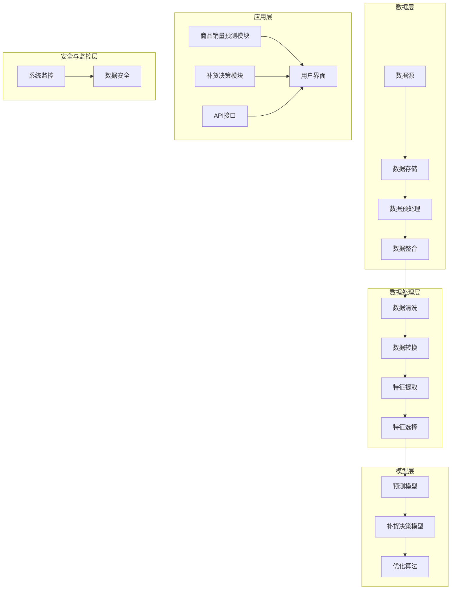
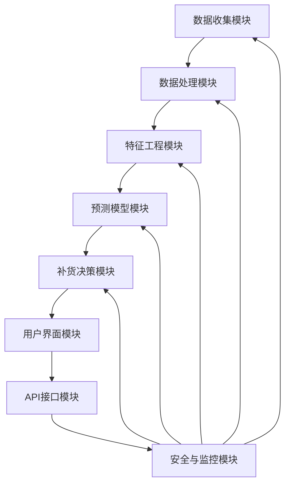

                 

### 1. 引言

#### 1.1 书籍目的

《AI驱动的电商平台商品销量预测与补货决策支持系统》旨在深入探讨人工智能（AI）在电商平台中的应用，特别是商品销量预测和补货决策这两个关键环节。随着电商平台的快速发展和市场需求的不断变化，如何实现精准预测和高效补货成为电商企业面临的重要挑战。本书旨在通过系统的理论分析和实际案例分析，为电商企业提供一套行之有效的AI驱动的解决方案。

本书的目标读者包括电商企业决策者、技术管理人员以及计算机科学和人工智能领域的研究人员。通过本书，读者可以：

- 理解电商平台的发展现状及AI应用的重要性。
- 掌握商品销量预测和补货决策的核心算法原理。
- 学习AI驱动的电商平台系统设计与实现的方法。
- 分析成功案例，获取实际应用的经验和启示。

#### 1.2 AI在电商平台的应用

人工智能在电商平台的应用已经成为提升运营效率、降低成本、增加收益的重要手段。以下是AI在电商平台中的几个关键应用领域：

1. **用户行为分析**：通过分析用户浏览、点击、购买等行为数据，AI技术能够帮助电商平台更好地理解用户需求，从而提供个性化的推荐服务。

2. **商品销量预测**：利用历史销售数据、用户行为数据以及市场环境因素，AI模型可以预测商品的潜在销量，帮助企业合理安排库存和供应链管理。

3. **智能客服**：基于自然语言处理（NLP）技术的智能客服系统能够快速响应用户咨询，提供24/7的服务，提高客户满意度和忠诚度。

4. **风险控制**：通过AI算法，电商平台可以实时监控交易风险，识别和防范欺诈行为，保障交易安全。

5. **运营优化**：AI技术能够对电商平台的各种运营环节进行优化，如库存管理、物流配送、市场推广等，从而提升整体运营效率。

#### 1.3 结构安排

本书分为三个主要部分，分别对应电商平台商品销量预测与补货决策的三个关键环节。

- **第一部分：背景与理论基础**：介绍电商平台的发展历程、运营模式以及AI的定义与应用，为后续内容提供理论基础。
  
- **第二部分：技术基础**：详细讨论数据预处理、特征工程、预测模型构建、补货决策模型构建等关键技术，为实际应用提供技术支持。
  
- **第三部分：应用实现**：通过系统设计与实现、实际案例分析、系统部署与维护等方面，展示AI驱动的电商平台商品销量预测与补货决策支持系统的实际应用效果。

### 1.4 阅读建议

为了更好地理解本书内容，读者可以结合以下方式进行阅读：

- 首先通读全书，了解整体结构和内容。
- 针对自己感兴趣的章节，进行深入学习和理解。
- 实践过程中，结合实际案例和代码示例，加深对理论知识的理解。
- 遇到问题或难点，可以查阅相关文献或参加技术论坛，寻求帮助。

通过本书的学习，读者不仅能够掌握AI驱动的电商平台商品销量预测与补货决策的基本原理和实现方法，还能获得实际应用中的宝贵经验，从而为电商企业提供有力的技术支持。

### 2. 电商平台概述

#### 2.1 电商平台的发展历程

电商平台作为互联网经济的代表，其发展历程可追溯到20世纪90年代。最初，电商平台主要以在线拍卖的形式出现，如eBay。随后，随着互联网技术的不断进步和电子商务理念的普及，电商平台开始多样化发展。1995年，亚马逊（Amazon）上线，标志着综合性电商平台的诞生。随后，全球各地的电商平台如雨后春笋般涌现，如中国的淘宝、京东、阿里巴巴等。

电商平台的早期阶段主要依赖于互联网连接和基本的商品展示功能。随着技术进步，电商平台逐渐引入更多的交互功能，如在线支付、用户评价、购物车等。这些功能的引入不仅提高了用户体验，还促进了电商平台的快速发展。

进入21世纪，移动互联网的普及进一步推动了电商平台的发展。移动电商成为新的增长点，各大电商平台纷纷推出移动应用程序（APP），如淘宝、京东等。此外，社交电商的兴起也使得电商平台与社交媒体的融合更加紧密，通过微信、微博等社交媒体平台的推广，电商平台实现了更广泛的用户覆盖。

#### 2.2 电商平台的运营模式

电商平台的运营模式主要包括B2B（企业对企业）、B2C（企业对消费者）和C2C（消费者对消费者）三种类型。

1. **B2B模式**：B2B电商平台主要服务于企业用户，提供大量批发商品交易服务。例如，阿里巴巴的1688平台就是一个典型的B2B电商平台，为中小企业提供货源和采购服务。

2. **B2C模式**：B2C电商平台直接面向消费者销售商品，具有统一的品牌和服务。例如，亚马逊和京东等电商平台，通过自营和第三方商家共同提供多样化的商品，满足消费者的购物需求。

3. **C2C模式**：C2C电商平台允许个人用户之间进行商品交易，如淘宝和eBay。在这些平台上，用户既是卖家也是买家，通过建立信用评价体系，保障交易安全。

#### 2.3 电商平台的核心功能

电商平台的核心功能主要包括商品展示、交易支付、用户服务、数据分析等。

1. **商品展示**：电商平台通过网站或移动应用界面展示各类商品信息，包括商品图片、描述、价格等。为了提高用户体验，电商平台通常提供详细的商品分类和搜索功能。

2. **交易支付**：电商平台提供在线支付功能，支持多种支付方式，如信用卡、支付宝、微信支付等。通过安全的支付通道，确保交易顺利完成。

3. **用户服务**：电商平台提供用户注册、登录、订单管理、售后服务等一系列服务功能，确保用户能够在平台上方便地进行购物和获得支持。

4. **数据分析**：电商平台通过收集和分析用户行为数据、交易数据等，为商家提供营销策略建议和运营优化支持。例如，通过用户购买行为分析，可以识别潜在的高销量商品，从而进行精准营销。

#### 2.4 电商平台面临的挑战

尽管电商平台在互联网经济中占据重要地位，但其发展也面临着一系列挑战。

1. **市场竞争激烈**：随着电商平台的增多，市场竞争日益激烈。如何吸引和留住用户、提高用户留存率成为电商平台的重要课题。

2. **供应链管理复杂**：电商平台需要处理大量的商品交易，供应链管理复杂。如何保证商品库存充足、物流配送高效，成为电商平台面临的挑战。

3. **用户体验优化**：随着用户需求的变化，电商平台需要不断优化用户体验，包括页面设计、搜索功能、支付流程等，以满足用户多样化的需求。

4. **数据安全和隐私保护**：电商平台涉及大量用户数据和交易数据，数据安全和隐私保护成为重要议题。如何确保用户数据的安全性和隐私性，是电商平台需要持续关注的问题。

通过深入理解电商平台的发展历程、运营模式和面临的挑战，可以为后续内容中的AI应用提供坚实的背景支持。

### 3. AI概述

#### 3.1 AI的定义与发展

人工智能（Artificial Intelligence，简称AI）是指通过计算机模拟人类智能行为的技术，包括感知、思考、学习、决策和行动等。AI的研究始于20世纪50年代，随着计算机技术和算法的进步，AI领域经历了多个发展阶段。

1. **初期阶段（1950-1969）**：AI研究的初期以符号主义方法论为主，主要研究如何通过规则和逻辑推理来模拟人类智能。1956年，达特茅斯会议的召开标志着AI领域的正式成立。

2. **繁荣阶段（1970-1989）**：在20世纪70年代和80年代，AI技术取得了显著进展，尤其是专家系统和机器学习技术的发展。专家系统通过模拟人类专家的决策过程，在医学诊断、金融分析等领域取得成功。

3. **低谷阶段（1990-2000）**：随着计算能力和数据资源的限制，AI研究进入低谷期。然而，这一时期也是人工智能理论不断深化和演化的阶段，特别是神经网络和机器学习理论的发展，为后来的AI复苏奠定了基础。

4. **复苏与发展阶段（2000至今）**：进入21世纪，随着互联网的普及和大数据技术的发展，AI再次迎来爆发式增长。深度学习、强化学习等算法取得了突破性进展，AI应用逐渐渗透到各行各业，如自动驾驶、智能家居、金融科技等。

#### 3.2 AI的分类与应用场景

人工智能可以按照不同的分类标准进行划分，主要包括以下几个方面：

1. **根据技术方法**：

   - **符号主义AI**：以符号推理为基础，通过定义一组规则和逻辑来模拟人类智能。应用场景包括专家系统、自然语言处理等。

   - **连接主义AI**：以神经网络为基础，通过模拟人脑神经元之间的连接来处理复杂问题。应用场景包括图像识别、语音识别等。

   - **基于知识的AI**：通过构建知识库和推理机来模拟人类智能。应用场景包括智能客服、医疗诊断等。

   - **基于模型的AI**：通过建立数学模型来模拟人类智能，如优化算法、模拟仿真等。

2. **根据应用领域**：

   - **感知AI**：涉及视觉、听觉、触觉等领域，如人脸识别、语音识别、自动驾驶等。

   - **认知AI**：涉及理解、推理、决策等领域，如自然语言处理、智能对话系统、推荐系统等。

   - **行动AI**：涉及机器人、无人机等领域，如工业自动化、物流配送等。

   - **创意AI**：涉及艺术创作、设计等领域，如音乐生成、图像生成等。

#### 3.3 AI技术的应用场景

AI技术已经在多个领域得到广泛应用，以下是一些典型的应用场景：

1. **金融科技**：AI技术在金融领域中的应用包括风险控制、智能投顾、自动化交易等。例如，通过机器学习算法进行信用评分和欺诈检测，通过自然语言处理技术实现智能客服。

2. **医疗健康**：AI技术在医疗健康领域中的应用包括疾病诊断、药物研发、健康管理等。例如，通过深度学习算法对医学图像进行诊断，通过大数据分析进行个性化治疗方案制定。

3. **智能制造**：AI技术在智能制造领域中的应用包括生产规划、质量控制、设备维护等。例如，通过机器视觉技术实现产品质量检测，通过预测性维护减少设备故障。

4. **交通物流**：AI技术在交通物流领域中的应用包括智能驾驶、物流优化、交通管理等。例如，通过自动驾驶技术提高运输效率，通过物流调度优化降低物流成本。

5. **零售电商**：AI技术在零售电商领域中的应用包括用户行为分析、商品推荐、库存管理、智能客服等。例如，通过用户行为分析进行个性化推荐，通过库存管理优化减少库存积压。

6. **能源环保**：AI技术在能源环保领域中的应用包括能源管理、污染检测、生态保护等。例如，通过智能电网实现能源优化配置，通过污染检测技术监测空气质量。

通过了解AI的定义、发展历程、分类与应用场景，可以为后续章节中的AI技术应用于电商平台商品销量预测和补货决策提供理论支持。

#### 4. 商品销量预测的挑战

商品销量预测是电商平台运营中的关键环节，其准确性直接影响到库存管理、供应链优化和市场营销策略的制定。然而，在实际操作中，商品销量预测面临着一系列挑战。

首先，数据质量问题是一个重要的挑战。商品销量数据通常来源于多个渠道，如销售记录、用户行为数据和市场调研数据。这些数据在收集过程中可能会出现缺失、错误或重复，导致数据质量下降。数据质量直接影响预测模型的性能，因此，在进行销量预测之前，需要对数据进行严格清洗和预处理。

其次，时间序列数据的特点也增加了预测的难度。商品销量数据通常表现为时间序列形式，其变化受到季节性、趋势和周期性因素的影响。例如，一些商品的销量在节假日或促销期间会显著增加，而在平时则相对稳定。这些周期性变化使得销量预测变得更加复杂，需要采用合适的算法来捕捉和预测这些变化。

另外，商品多样性也是一大挑战。电商平台上的商品种类繁多，从日用品到高端奢侈品，不同商品的需求和销售模式存在显著差异。例如，某些商品的需求可能受季节性因素影响明显，而另一些商品的需求则可能更依赖于用户行为和市场推广效果。这种多样性使得统一预测模型难以适用于所有商品，需要根据商品特性进行个性化建模和预测。

此外，市场需求的不确定性也给销量预测带来挑战。市场需求受到宏观经济环境、消费者偏好、政策变化等多种因素的影响，这些因素的变化往往是不可预测的。例如，经济衰退或突发事件可能会导致市场需求大幅下降，而技术创新或新产品的推出则可能带动需求增长。这种不确定性要求预测模型具备灵活性和适应性，能够及时调整预测结果以应对市场变化。

最后，模型训练和预测的时间成本也是一个重要问题。商品销量预测需要收集大量的历史数据，并进行复杂的模型训练。在电商平台业务快速发展的背景下，如何快速、高效地进行模型训练和预测，以满足实时决策需求，是一个亟待解决的问题。

综上所述，商品销量预测在数据质量、时间序列特性、商品多样性、市场需求不确定性和模型训练成本等方面面临诸多挑战。为了有效应对这些挑战，需要结合具体业务场景，采用合适的技术手段和策略，不断提高销量预测的准确性和实时性。

#### 4.2 补货决策的影响因素

电商平台补货决策的准确性和及时性对库存管理、供应链优化和用户体验具有重要意义。补货决策受到多种因素的影响，以下是对这些因素的详细分析。

首先，库存水平是补货决策的核心因素之一。库存水平直接决定了电商平台能否及时满足用户需求，过高或过低的库存水平都会带来负面影响。过高的库存会导致仓储成本增加，占用资金，而库存不足则可能引发缺货风险，影响用户体验和销售业绩。因此，在补货决策过程中，必须综合考虑当前库存水平和历史销售数据，以确保库存水平的合理性和有效性。

其次，市场需求变化是影响补货决策的关键因素。市场需求受多种因素影响，包括季节性变化、节假日效应、市场推广活动以及消费者偏好等。例如，在夏季，防晒产品的需求可能会显著增加，而在圣诞节期间，节日装饰品的需求也会显著上升。通过分析历史销售数据和用户行为数据，可以预测市场需求的变化趋势，从而为补货决策提供依据。

第三，供应链的可靠性和灵活性也是影响补货决策的重要因素。供应链的可靠性决定了商品能否按时到达电商平台，而供应链的灵活性则决定了电商平台能否快速响应市场变化，进行紧急补货。例如，如果供应商的交货时间较长，电商平台可能需要提前安排库存，以避免因供应链中断而导致缺货。此外，供应链的灵活性还体现在应对突发事件的能力上，如自然灾害、政治动荡等，这些都可能对供应链造成影响，需要电商平台具备一定的应急响应能力。

第四，成本控制是补货决策中的重要考量因素。电商平台的补货决策不仅要考虑库存和市场需求，还要关注成本控制。过高库存会增加仓储成本和资金占用，而频繁补货则会增加物流成本和库存成本。因此，在补货决策过程中，需要通过成本效益分析，确定最优补货策略，实现成本与效益的最优平衡。

第五，市场竞争力也是影响补货决策的一个重要因素。电商平台之间的竞争日益激烈，如何通过精准的补货策略提高用户满意度和市场份额成为关键。通过分析竞争对手的补货策略和市场表现，可以了解市场趋势和用户需求，从而调整自身的补货决策。

第六，技术支持也是补货决策的重要保障。随着人工智能和大数据技术的发展，电商平台可以通过数据分析和预测模型，提高补货决策的准确性和效率。例如，通过使用机器学习算法，可以分析大量历史销售数据和市场信息，预测未来的市场需求，从而制定更加精准的补货计划。

综上所述，电商平台补货决策受到多种因素的影响，包括库存水平、市场需求变化、供应链可靠性、成本控制、市场竞争力以及技术支持等。为了实现有效的补货决策，需要综合考虑这些因素，制定科学合理的补货策略，确保库存管理的有效性和供应链的顺畅运行。

### 5. AI驱动的电商平台案例分析

#### 5.1 案例背景

本案例选取了中国知名的电商平台——京东（JD.com）为例，探讨AI技术在其商品销量预测与补货决策中的应用。京东成立于1998年，经过多年的发展，已成为全球最大的电商之一，其业务涵盖电子产品、家用电器、图书、服装、家居等多个领域。京东在AI技术的应用方面具有深厚的基础，通过建立智能供应链体系和大数据分析平台，实现了商品销量预测和补货决策的智能化。

#### 5.2 AI应用的实施与效果

1. **商品销量预测**：
   京东利用人工智能技术对商品销量进行预测，其核心在于构建一个高效、准确的预测模型。首先，京东通过大数据技术收集并整合各类数据，包括历史销售数据、用户行为数据、市场环境数据等。在此基础上，采用机器学习算法，如线性回归、决策树、随机森林等，对数据进行训练和预测。

   为了提高销量预测的准确性，京东采用了多模型融合的方法，即将不同算法的预测结果进行加权融合，以得到最终的预测结果。具体来说，京东会针对不同类型的商品，选择最适合的预测算法，并将多个算法的预测结果进行加权平均，以提高预测的稳定性和准确性。

   以下是一个简化的伪代码示例，展示了京东在构建销量预测模型时的过程：

   ```python
   import pandas as pd
   from sklearn.ensemble import RandomForestRegressor
   from sklearn.linear_model import LinearRegression
   from sklearn.metrics import mean_squared_error

   # 加载历史销售数据
   sales_data = pd.read_csv('sales_data.csv')

   # 数据预处理
   sales_data.fillna(method='ffill', inplace=True)

   # 特征工程
   features = sales_data[['user_behavior', 'market_env']]
   target = sales_data['sales']

   # 划分训练集和测试集
   train_features, test_features, train_target, test_target = train_test_split(features, target, test_size=0.2, random_state=42)

   # 构建预测模型
   linear_regression = LinearRegression()
   random_forest = RandomForestRegressor()

   # 训练模型
   linear_regression.fit(train_features, train_target)
   random_forest.fit(train_features, train_target)

   # 预测
   linear_prediction = linear_regression.predict(test_features)
   rf_prediction = random_forest.predict(test_features)

   # 多模型融合
   final_prediction = 0.5 * linear_prediction + 0.5 * rf_prediction

   # 评估模型性能
   mse_linear = mean_squared_error(test_target, linear_prediction)
   mse_rf = mean_squared_error(test_target, rf_prediction)
   mse_final = mean_squared_error(test_target, final_prediction)
   print(f"Linear Regression MSE: {mse_linear}")
   print(f"Random Forest MSE: {mse_rf}")
   print(f"Final MSE: {mse_final}")
   ```

2. **补货决策**：
   在销量预测的基础上，京东通过优化补货策略，确保库存水平的合理性和供应链的顺畅运行。具体来说，京东采用基于需求预测的动态补货策略，根据销量预测结果和库存水平，实时调整补货计划。

   京东的补货决策过程包括以下步骤：
   
   - **需求预测**：通过上述销量预测模型，获取未来一段时间内各商品的预计销量。
   - **库存评估**：评估当前库存水平和安全库存量，确定是否需要补货。
   - **成本分析**：计算不同补货策略的成本，包括仓储成本、物流成本和缺货成本。
   - **决策制定**：根据需求预测、库存评估和成本分析，制定最优的补货计划。

   以下是一个简化的伪代码示例，展示了京东在制定补货决策时的过程：

   ```python
   import pandas as pd
   from sklearn.ensemble import RandomForestRegressor
   import numpy as np

   # 加载需求预测结果
   demand_prediction = pd.read_csv('demand_prediction.csv')

   # 加载当前库存数据
   current_inventory = pd.read_csv('current_inventory.csv')

   # 计算补货量
   required_replenishment = demand_prediction['predicted_sales'] - current_inventory['inventory']

   # 计算不同补货策略的成本
   low_cost_strategy = required_replenishment * 0.1  # 低成本策略，快速补货
   high_cost_strategy = required_replenishment * 0.3  # 高成本策略，提前大量补货

   # 决策制定
   if high_cost_strategy < low_cost_strategy:
       chosen_strategy = 'high_cost'
   else:
       chosen_strategy = 'low_cost'

   print(f"Chosen Replenishment Strategy: {chosen_strategy}")
   ```

3. **实施效果**：
   通过AI驱动的商品销量预测和补货决策支持系统，京东实现了以下显著效果：

   - **提高销量预测准确性**：AI技术的应用显著提高了销量预测的准确性，有助于电商平台更好地掌握市场需求，降低库存积压和缺货风险。
   - **优化库存管理**：基于预测结果的动态补货策略，使库存水平更加合理，减少了库存成本和缺货成本，提高了供应链的运作效率。
   - **提升用户体验**：准确的销售预测和及时的补货决策，确保了商品供应的连续性和稳定性，提高了用户满意度和忠诚度。
   - **降低运营成本**：通过优化库存管理和供应链运作，京东显著降低了运营成本，提高了整体盈利能力。

综上所述，京东通过AI驱动的商品销量预测与补货决策支持系统，实现了精准预测和高效库存管理，不仅提升了用户满意度，还显著降低了运营成本，为电商平台的可持续发展提供了有力支持。

### 6. 数据分析与预处理

#### 6.1 数据来源与收集

在构建AI驱动的电商平台商品销量预测与补货决策支持系统时，数据来源与收集是至关重要的一步。准确、全面的数据是预测模型和决策策略的基础，因此，必须确保数据的质量和完整性。

1. **销售数据**：销售数据是商品销量预测的核心数据来源，包括历史销售记录、销售量、销售时间、销售渠道等信息。这些数据通常来源于电商平台自身的销售系统，可以通过数据库或API接口进行提取。

2. **用户行为数据**：用户行为数据包括用户的浏览记录、点击行为、购买记录、评价等。这些数据有助于了解用户偏好和购买习惯，是进行个性化推荐和预测的重要依据。用户行为数据可以通过电商平台的前端日志和用户交互记录收集。

3. **市场环境数据**：市场环境数据包括季节性因素、节假日、宏观经济环境、行业趋势等。这些数据可以帮助预测商品需求的波动，通常来源于第三方数据提供商或公开的数据源，如国家统计局、行业报告等。

4. **商品信息**：商品信息包括商品的种类、品牌、价格、库存量等。这些数据有助于理解商品特性，对预测和补货决策提供支持。商品信息可以通过电商平台的后台管理系统或商品数据库获取。

5. **供应链数据**：供应链数据包括供应商信息、物流运输时间、库存水平等。这些数据对于制定补货策略和库存管理策略至关重要。供应链数据可以通过电商平台与供应商、物流公司之间的数据接口获取。

#### 6.2 数据清洗与处理

收集到的数据通常存在噪声、缺失值和异常值，这会影响预测模型的性能。因此，数据清洗与处理是数据分析的重要步骤。以下是数据清洗与处理的主要方法：

1. **缺失值处理**：对于缺失值，可以采用以下方法：
   - **删除**：如果缺失值较多，可以考虑删除缺失值严重的记录。
   - **填充**：采用平均值、中位数、最频繁值等方法进行填充。例如，对于销售量缺失的数据，可以填充为最近一次销售量的值。
   - **插值**：对于时间序列数据，可以采用线性插值、高斯插值等方法进行插值处理。

2. **异常值检测**：异常值包括异常高或异常低的值，可能是由数据录入错误、系统故障等原因导致的。常用的异常值检测方法包括：
   - **箱线图**：通过箱线图识别异常值，通常定义在箱线图外部1.5倍IQR（四分位距）的值为异常值。
   - **标准差法**：通过计算数据的标准差，识别超出一定倍数标准差的值为异常值。

3. **数据转换**：为了满足模型输入的要求，可能需要对数据进行转换，包括：
   - **归一化**：将数据转换为0到1之间的范围，常用的方法包括最小-最大归一化和标准化。
   - **编码**：对于类别数据，可以使用独热编码或标签编码。
   - **特征工程**：通过构建新的特征，提高数据的预测能力。例如，通过对时间序列数据进行差分、季节性分解等操作，提取有用的特征信息。

4. **数据整合**：将来自不同源的数据进行整合，建立统一的数据集。这一步需要处理数据格式的不一致性，例如数据的时间戳、单位、维度等。

5. **数据可视化**：通过可视化工具，如Matplotlib、Seaborn等，对数据进行初步分析，识别数据中的趋势、异常和关联性。

以下是数据清洗与处理流程的一个简化的伪代码示例：

```python
import pandas as pd
from sklearn.impute import SimpleImputer
from sklearn.preprocessing import StandardScaler
import numpy as np

# 加载数据
data = pd.read_csv('data.csv')

# 缺失值处理
imputer = SimpleImputer(strategy='mean')
data_filled = imputer.fit_transform(data)

# 异常值检测
Q1 = data_filled.quantile(0.25)
Q3 = data_filled.quantile(0.75)
IQR = Q3 - Q1
data_filtered = data_filled[~((data_filled < (Q1 - 1.5 * IQR)) | (data_filled > (Q3 + 1.5 * IQR)))]

# 数据转换
scaler = StandardScaler()
data_scaled = scaler.fit_transform(data_filtered)

# 数据整合
data_combined = data_scaled

# 数据可视化
import matplotlib.pyplot as plt
plt.scatter(data_combined[:, 0], data_combined[:, 1])
plt.xlabel('Feature 1')
plt.ylabel('Feature 2')
plt.show()
```

通过上述数据清洗与处理步骤，可以确保数据的准确性和一致性，为后续的预测模型构建和补货决策提供可靠的数据基础。

#### 6.3 数据探索性分析

数据探索性分析（Exploratory Data Analysis，简称EDA）是数据分析过程中至关重要的一步，旨在通过直观的方式探索和理解数据，发现数据中的趋势、异常和潜在关联。以下是数据探索性分析的主要方法和步骤：

1. **数据概览**：
   - **描述性统计**：使用均值、中位数、标准差、最小值和最大值等描述性统计量，了解数据的中心趋势和离散程度。
   - **数据类型**：检查数据类型，确保所有数据字段都是正确的，例如整数、浮点数、类别等。
   - **缺失值和异常值**：识别缺失值和异常值，了解它们在数据集中的分布情况。

2. **数据可视化**：
   - **直方图**：绘制数据分布的直方图，了解数据的分布形态。
   - **箱线图**：通过箱线图识别数据的异常值，了解数据的四分位距和中心趋势。
   - **散点图**：对于多变量数据，使用散点图探索变量之间的关系。
   - **时间序列图**：对于时间序列数据，使用时间序列图探索数据的时间趋势和周期性。

3. **相关分析**：
   - **皮尔逊相关系数**：计算变量之间的皮尔逊相关系数，了解变量之间的线性关系强度。
   - **斯皮尔曼相关系数**：适用于非线性关系的变量。
   - **热力图**：绘制热力图，直观显示变量之间的相关性。

4. **分布探索**：
   - **频率分布**：使用频率分布了解各类别变量的分布情况。
   - **分布拟合**：对连续变量进行分布拟合，如正态分布、泊松分布等，以了解数据的潜在分布形式。

以下是数据探索性分析的伪代码示例：

```python
import pandas as pd
import matplotlib.pyplot as plt
import seaborn as sns

# 加载数据
data = pd.read_csv('data.csv')

# 描述性统计
print(data.describe())

# 数据类型检查
print(data.dtypes)

# 缺失值和异常值
print(data.isnull().sum())
sns.boxplot(x=data['sales'])
plt.show()

# 直方图
sns.histplot(data['sales'], kde=True)
plt.show()

# 箱线图
sns.boxplot(x=data['sales'])
plt.show()

# 散点图
sns.scatterplot(x=data['user_behavior'], y=data['sales'])
plt.show()

# 时间序列图
data['sales'].plot()
plt.show()

# 皮尔逊相关系数
print(data.corr())

# 热力图
sns.heatmap(data.corr(), annot=True)
plt.show()

# 频率分布
print(data['category'].value_counts())
```

通过上述数据探索性分析步骤，可以全面了解数据的特性和关系，为后续的预测模型构建和补货决策提供有力的数据支持。

#### 6.4 特征提取方法

在构建AI驱动的电商平台商品销量预测与补货决策支持系统中，特征提取是关键步骤之一。特征提取旨在从原始数据中提取出对预测任务有重要影响的信息，从而提高模型性能。以下是常用的特征提取方法：

1. **时间特征提取**：
   - **季节性特征**：通过分析时间序列数据，提取季节性特征，如月份、季度、周等。这些特征可以反映商品需求在时间上的波动。
   - **趋势特征**：通过移动平均、指数平滑等方法提取趋势特征，如年度增长趋势、季节性趋势等。
   - **周期特征**：通过分析周期性数据，提取周期性特征，如周期长度、周期波动等。

2. **用户特征提取**：
   - **用户行为特征**：从用户行为数据中提取用户访问次数、购买频率、浏览深度等特征，反映用户的活跃度和购买意向。
   - **用户历史特征**：从用户历史数据中提取用户购买记录、退货率、评价等特征，反映用户的消费习惯和满意度。

3. **商品特征提取**：
   - **商品属性特征**：从商品信息中提取商品种类、品牌、价格、库存量等特征，反映商品的基本属性。
   - **商品交互特征**：通过分析商品之间的关联性，提取商品组合特征，如交叉销售、协同过滤等。

4. **市场特征提取**：
   - **市场环境特征**：从市场环境数据中提取宏观经济指标、行业趋势、节假日等信息，反映市场环境对商品需求的影响。
   - **竞争对手特征**：从竞争对手的销售数据和市场策略中提取特征，分析竞争对手对自身商品销售的影响。

以下是特征提取的一个简化的伪代码示例：

```python
import pandas as pd
from sklearn.preprocessing import OneHotEncoder

# 加载数据
data = pd.read_csv('data.csv')

# 时间特征提取
data['month'] = data['date'].dt.month
data['quarter'] = data['date'].dt.quarter
data['weekday'] = data['date'].dt.weekday

# 用户特征提取
data['user_activity'] = data['visit_count'] / data['purchase_count']
data['user_reputation'] = data['rating_count'] / data['review_count']

# 商品特征提取
data['product_price'] = data['price']
data['product_inventory'] = data['stock']

# 市场特征提取
data['holiday'] = data['date'].apply(lambda x: is_holiday(x))
data['market_trend'] = data['sales'].rolling(window=3).mean()

# 去除原始特征
data.drop(['date', 'visit_count', 'purchase_count', 'rating_count', 'stock'], axis=1, inplace=True)

# 独热编码
encoder = OneHotEncoder()
encoded_features = encoder.fit_transform(data[['month', 'quarter', 'weekday']])
encoded_df = pd.DataFrame(encoded_features.toarray(), index=data.index)

# 合并特征
data = pd.concat([data, encoded_df], axis=1)

print(data.head())
```

通过上述特征提取方法，可以有效提取出对商品销量预测和补货决策有重要影响的特征，为构建高效的预测模型提供支持。

#### 6.5 特征选择策略

特征选择（Feature Selection）是在构建机器学习模型时的重要步骤，旨在从大量特征中挑选出对预测目标有显著影响的特征，从而提高模型性能、减少计算成本。以下是几种常用的特征选择策略：

1. **基于信息的特征选择**：
   - **互信息（Mutual Information）**：互信息衡量特征与目标变量之间的相关性。通过计算每个特征与目标变量的互信息，选择互信息较高的特征。
   - **信息增益（Information Gain）**：信息增益是决策树中使用的特征选择指标，计算每个特征划分数据集后的信息增益，选择增益最高的特征。

2. **基于模型的特征选择**：
   - **模型选择法**：通过训练不同特征子集的模型，比较模型的表现，选择表现最佳的子集。例如，通过交叉验证选择特征子集。
   - **模型嵌入特征选择**：一些机器学习算法（如随机森林、LASSO回归）本身具有特征选择能力。通过训练模型，自动筛选出对预测任务贡献较大的特征。

3. **基于过滤的特征选择**：
   - **相关性筛选**：通过计算特征与目标变量之间的相关性（如皮尔逊相关系数、斯皮尔曼相关系数），选择相关性较高的特征。
   - **卡方检验**：用于类别特征与目标变量之间的关联性检验，选择通过卡方检验的特征。

4. **基于包装的特征选择**：
   - **递归特征消除（Recursive Feature Elimination，RFE）**：通过逐步递归地消除对模型贡献最小的特征，直到满足特定的条件（如交叉验证误差最小）。
   - **基于模型的特征选择**：结合具体模型，如决策树、LASSO回归等，进行特征选择。

5. **基于集合的特征选择**：
   - **前进选择（Forward Selection）**：从空集开始，逐步添加特征，直到无法进一步提高模型性能。
   - **后向消除（Backward Elimination）**：从全部特征开始，逐步移除对模型贡献最小的特征，直到满足特定的条件。

以下是特征选择的一个简化的伪代码示例：

```python
import pandas as pd
from sklearn.feature_selection import SelectKBest, f_classif

# 加载数据
data = pd.read_csv('data.csv')
X = data.drop('target', axis=1)
y = data['target']

# 基于信息的特征选择
selector = SelectKBest(score_func=f_classif, k='all')
selector.fit(X, y)
selected_features = selector.get_support()

# 选择前5个特征
selected_columns = X.columns[selector.get_support()].tolist()[:5]
X_selected = X[selected_columns]

# 基于模型的特征选择
from sklearn.ensemble import RandomForestClassifier
model = RandomForestClassifier()
model.fit(X, y)
importances = model.feature_importances_

# 选择重要性最高的5个特征
selected_features = X.columns[importances.argsort()][-5:]
X_selected = X[selected_features]

print(f"Selected Features: {selected_features}")
```

通过上述特征选择策略，可以有效地筛选出对商品销量预测和补货决策有显著影响的特征，提高模型的预测准确性和效率。

#### 7.2 预测模型构建

在构建AI驱动的电商平台商品销量预测模型时，选择合适的预测算法和进行模型调优至关重要。以下是几种常见的预测算法及其优缺点，以及模型调优的方法。

##### 7.2.1 常见预测算法

1. **线性回归**：
   - **算法原理**：线性回归是一种基于线性模型的预测算法，通过建立自变量与因变量之间的线性关系进行预测。其模型公式为 \(y = \beta_0 + \beta_1 \cdot x_1 + \beta_2 \cdot x_2 + ... + \beta_n \cdot x_n\)。
   - **优点**：线性回归简单直观，易于理解和实现，计算速度快。
   - **缺点**：线性回归假设变量之间是线性关系，对于非线性关系的数据表现不佳。

2. **决策树**：
   - **算法原理**：决策树通过一系列判断节点和叶子节点来构建分类或回归模型。每个节点代表一个特征，每个分支代表特征的不同取值。
   - **优点**：决策树容易理解，能够处理非线性和多分类问题，对抗缺失值和异常值有较强的鲁棒性。
   - **缺点**：决策树容易过拟合，模型复杂度较高，难以解释。

3. **随机森林**：
   - **算法原理**：随机森林通过构建多个决策树，并对每个树的预测结果进行投票，提高模型的预测准确性和泛化能力。每个树在构建时随机选择特征和样本子集。
   - **优点**：随机森林具有良好的泛化能力，能够处理高维数据和复杂关系，减少了过拟合的风险。
   - **缺点**：随机森林的计算成本较高，需要大量计算资源和时间。

4. **支持向量机（SVM）**：
   - **算法原理**：SVM通过找到一个最优的超平面，将不同类别的数据点最大化地分隔开。其模型公式为 \(w \cdot x + b = 0\)。
   - **优点**：SVM在处理小样本数据和非线性问题时表现良好，具有较高的预测准确率。
   - **缺点**：SVM对参数敏感，需要大量的参数调优，计算复杂度较高。

5. **神经网络**：
   - **算法原理**：神经网络通过多层神经网络（如全连接网络、卷积神经网络等）来模拟人类大脑神经元之间的连接和相互作用，进行特征学习和预测。
   - **优点**：神经网络具有强大的非线性建模能力，能够处理复杂的关系和高维数据，适用于各种预测任务。
   - **缺点**：神经网络模型参数较多，训练时间较长，容易过拟合，需要大量的数据训练。

##### 7.2.2 模型调优方法

1. **参数调优**：
   - **网格搜索（Grid Search）**：通过遍历预定义的参数网格，选择最优参数组合。例如，对于随机森林，可以调整树的个数、最大深度、最小样本叶节点等参数。
   - **随机搜索（Random Search）**：在预定义的参数范围内随机选择参数组合进行尝试，选择表现最佳的参数组合。

2. **交叉验证**：
   - **K折交叉验证（K-Fold Cross-Validation）**：将数据集划分为K个子集，每次使用其中一个子集作为验证集，其余K-1个子集作为训练集，重复K次，取平均结果。常用的K值为5或10。
   - **时间序列交叉验证**：对于时间序列数据，将数据按照时间顺序划分为训练集和验证集，避免信息的泄漏。

3. **正则化**：
   - **L1正则化（LASSO）**：通过在损失函数中添加L1正则项，惩罚模型参数的绝对值，促进稀疏解。
   - **L2正则化（Ridge）**：通过在损失函数中添加L2正则项，惩罚模型参数的平方值，减小模型复杂度。

4. **集成方法**：
   - **Bagging**：通过构建多个基模型，并对预测结果进行平均或投票，提高模型的泛化能力。
   - **Boosting**：通过构建多个基模型，每个模型专注于之前模型的错误，提高模型的预测能力。

5. **特征工程**：
   - **特征选择**：通过特征选择方法，筛选出对预测任务有显著影响的特征，减少模型复杂度和过拟合风险。
   - **特征变换**：通过特征变换，如归一化、标准化、编码等，提高模型的稳定性和准确性。

以下是模型调优的一个简化的伪代码示例：

```python
import pandas as pd
from sklearn.model_selection import train_test_split, GridSearchCV
from sklearn.ensemble import RandomForestRegressor

# 加载数据
data = pd.read_csv('data.csv')
X = data.drop('target', axis=1)
y = data['target']

# 划分训练集和测试集
X_train, X_test, y_train, y_test = train_test_split(X, y, test_size=0.2, random_state=42)

# 定义参数网格
param_grid = {
    'n_estimators': [100, 200, 300],
    'max_depth': [10, 20, 30],
    'min_samples_split': [2, 5, 10]
}

# 定义模型
model = RandomForestRegressor()

# 定义网格搜索
grid_search = GridSearchCV(model, param_grid, cv=5, scoring='neg_mean_squared_error')

# 进行模型调优
grid_search.fit(X_train, y_train)

# 获取最优参数
best_params = grid_search.best_params_
print(f"Best Parameters: {best_params}")

# 使用最优参数进行预测
model_best = RandomForestRegressor(**best_params)
model_best.fit(X_train, y_train)
y_pred = model_best.predict(X_test)

# 评估模型性能
mse = mean_squared_error(y_test, y_pred)
print(f"Test MSE: {mse}")
```

通过上述模型调优方法，可以有效地提高商品销量预测模型的性能和准确性，为电商平台提供可靠的决策支持。

### 9. 补货决策模型构建

补货决策是电商平台运营中的关键环节，它直接影响库存水平、供应链效率和用户体验。构建一个高效的补货决策模型，需要综合考虑多个因素，如库存水平、市场需求变化、供应链可靠性和成本控制。以下是补货决策模型的构建步骤和方法。

#### 9.1 补货策略

1. **基于库存水平的补货策略**：
   - **最低库存水平策略**：设定一个最低库存水平，当库存低于该水平时，触发补货。
   - **最高库存水平策略**：设定一个最高库存水平，当库存超过该水平时，暂停补货，以避免过度库存。

2. **基于需求预测的补货策略**：
   - **定期补货策略**：根据需求预测结果，定期进行补货，如每周或每月进行一次。
   - **动态补货策略**：根据实时需求预测和库存水平，动态调整补货计划和数量。

3. **基于成本效益的补货策略**：
   - **最小总成本策略**：在满足市场需求的前提下，选择总成本（包括库存成本、物流成本和缺货成本）最小的补货方案。
   - **最小风险策略**：通过风险评估，选择风险最小的补货方案，确保供应链的稳定性和可靠性。

#### 9.2 决策模型设计

补货决策模型的设计需要考虑以下关键因素：

1. **需求预测**：
   - **时间序列预测**：利用历史销售数据和季节性因素，采用时间序列预测方法（如ARIMA模型、LSTM网络）进行需求预测。
   - **用户行为预测**：通过分析用户浏览、点击、购买等行为数据，采用机器学习算法（如随机森林、XGBoost）进行用户行为预测。

2. **库存评估**：
   - **当前库存评估**：根据当前库存水平和安全库存量，评估是否需要补货。
   - **未来库存评估**：利用需求预测结果，评估未来一段时间内的库存水平，确保库存的充足性和稳定性。

3. **成本分析**：
   - **库存成本**：计算当前库存所需的仓储成本和资金占用。
   - **物流成本**：计算补货所需的物流成本，包括运输费、仓储费等。
   - **缺货成本**：计算因缺货导致的销售损失和客户流失成本。

4. **补货计划**：
   - **补货量计算**：根据需求预测和库存评估结果，计算所需补货量。
   - **补货时间**：根据物流时间和市场需求变化，确定补货的最佳时间。

5. **风险评估**：
   - **供应链风险**：评估供应链中断、物流延迟等风险，确保供应链的稳定性。
   - **市场需求风险**：分析市场需求的不确定性，确保补货计划的灵活性和适应性。

以下是补货决策模型设计的一个简化的伪代码示例：

```python
import pandas as pd
from sklearn.ensemble import RandomForestRegressor

# 加载数据
data = pd.read_csv('data.csv')

# 需求预测
demand_model = RandomForestRegressor()
demand_model.fit(X_train, y_train)
predicted_demand = demand_model.predict(X_test)

# 库存评估
current_inventory = data['current_inventory']
safety_inventory = data['safety_inventory']

# 计算补货量
replenishment_quantity = max(0, predicted_demand - current_inventory)

# 计算成本
inventory_cost = current_inventory * inventory_cost_per_unit
logistics_cost = replenishment_quantity * logistics_cost_per_unit
missing_cost = (predicted_demand - replenishment_quantity) * missing_sales_per_unit

# 补货计划
best_replenishment_time = determine_best_replenishment_time(logistics_time, demand_fluctuation)

# 输出结果
print(f"Predicted Demand: {predicted_demand}")
print(f"Current Inventory: {current_inventory}")
print(f"Safety Inventory: {safety_inventory}")
print(f"Replenishment Quantity: {replenishment_quantity}")
print(f"Inventory Cost: {inventory_cost}")
print(f"Logistics Cost: {logistics_cost}")
print(f"Missing Cost: {missing_cost}")
print(f"Best Replenishment Time: {best_replenishment_time}")
```

通过上述补货决策模型的设计，可以实现科学的库存管理和高效的供应链运作，提高电商平台的运营效率和用户满意度。

### 10. 系统设计与实现

#### 10.1 系统架构设计

在构建AI驱动的电商平台商品销量预测与补货决策支持系统时，系统架构的设计至关重要。一个良好的架构不仅能够提高系统的稳定性、可扩展性和可维护性，还能确保系统的性能和安全性。以下是系统架构的主要组成部分和其功能。

1. **数据层**：
   - **数据源**：包括电商平台销售系统、用户行为数据、市场环境数据、供应链数据等。这些数据通过API接口或数据库连接获取。
   - **数据存储**：使用分布式数据库（如Hadoop、MongoDB）存储海量数据，保证数据的安全性和可靠性。同时，采用数据仓库技术（如数据湖、数据湖house）进行数据的整合和分析。

2. **数据处理层**：
   - **数据预处理**：对收集到的数据进行清洗、转换和整合，确保数据的准确性和一致性。
   - **特征工程**：提取对预测任务有显著影响的特征，通过特征选择和特征变换，提高预测模型的性能。

3. **模型层**：
   - **预测模型**：包括商品销量预测模型和补货决策模型，通过机器学习算法（如随机森林、LSTM网络）进行训练和预测。
   - **优化算法**：采用网格搜索、随机搜索等算法进行模型调优，提高模型的预测准确性和泛化能力。

4. **应用层**：
   - **商品销量预测模块**：根据需求预测结果，为电商平台提供商品销量预测，辅助库存管理和供应链优化。
   - **补货决策模块**：根据库存评估、成本分析和市场需求预测，制定科学的补货计划，确保库存水平的合理性和供应链的顺畅运行。

5. **展示层**：
   - **用户界面**：提供直观的界面，展示销量预测结果和补货计划，供电商企业决策者和管理人员参考。
   - **API接口**：提供API接口，供电商平台系统集成和第三方应用调用。

6. **安全与监控层**：
   - **数据安全**：采用加密技术（如SSL/TLS）保护数据传输的安全，确保数据的机密性和完整性。
   - **系统监控**：通过日志记录、告警机制等手段，监控系统的运行状态和性能，及时发现问题并进行处理。

以下是系统架构的一个简化的Mermaid流程图示例：



通过上述系统架构设计，可以实现高效的商品销量预测和补货决策支持，为电商平台提供全面的数据分析和决策支持。

#### 10.2 系统模块划分

为了确保AI驱动的电商平台商品销量预测与补货决策支持系统的功能完整性、可维护性和扩展性，系统模块的划分至关重要。以下是系统的主要模块及其具体功能：

1. **数据收集模块**：
   - **功能**：负责收集电商平台的各种数据，包括销售数据、用户行为数据、市场环境数据、供应链数据等。
   - **实现**：通过API接口、数据库连接和数据爬取等技术，定期收集数据并进行存储。

2. **数据处理模块**：
   - **功能**：对收集到的原始数据进行清洗、转换和整合，确保数据的质量和一致性。
   - **实现**：包括数据清洗（处理缺失值、异常值）、数据转换（编码、归一化）、数据整合（数据合并、去重）等步骤。

3. **特征工程模块**：
   - **功能**：从原始数据中提取对预测任务有显著影响的特征，进行特征选择和特征变换。
   - **实现**：采用时间特征提取、用户特征提取、商品特征提取、市场特征提取等方法，构建特征工程流程。

4. **预测模型模块**：
   - **功能**：构建商品销量预测模型和补货决策模型，通过机器学习算法进行模型训练和预测。
   - **实现**：包括选择合适的预测算法（如线性回归、决策树、随机森林等），进行模型调优和评估。

5. **补货决策模块**：
   - **功能**：根据销量预测结果和库存评估，制定科学的补货计划，实现库存管理和供应链优化。
   - **实现**：采用基于需求预测的补货策略和基于成本效益的补货策略，结合实际业务场景进行补货决策。

6. **用户界面模块**：
   - **功能**：提供直观的用户界面，展示销量预测结果、补货计划、库存状况等关键信息，供电商平台决策者和管理人员参考。
   - **实现**：使用前端技术（如React、Vue.js）构建用户界面，采用图表、报表等形式展示数据。

7. **API接口模块**：
   - **功能**：提供API接口，供电商平台系统集成和第三方应用调用，实现数据的共享和功能的扩展。
   - **实现**：使用RESTful API或GraphQL等技术，构建安全的、高效的API接口。

8. **安全与监控模块**：
   - **功能**：确保系统的安全性，监控系统的运行状态，及时发现问题并进行处理。
   - **实现**：采用数据加密、访问控制、日志记录、告警机制等技术，实现系统的安全防护和监控。

以下是系统模块划分的一个简化的Mermaid流程图示例：



通过上述模块划分，可以确保系统功能的完整性和高效性，实现商品销量预测与补货决策的全面支持。

#### 10.3 数据库设计

在构建AI驱动的电商平台商品销量预测与补货决策支持系统时，数据库设计是关键的一步，它决定了数据存储、访问和管理的效率。一个合理高效的数据库设计不仅能够满足系统的数据需求，还能确保数据的一致性和完整性。以下是数据库设计的主要组成部分：

1. **数据表设计**：

   - **销售数据表**：存储商品的销售记录，包括销售量、销售时间、销售渠道等信息。字段可能包括：销售ID、商品ID、销售量、销售时间、销售渠道等。

     ```sql
     CREATE TABLE sales_data (
         sales_id INT PRIMARY KEY,
         product_id INT,
         quantity INT,
         sale_time DATETIME,
         channel VARCHAR(50)
     );
     ```

   - **用户行为数据表**：存储用户的浏览、点击、购买等行为数据，包括用户ID、商品ID、行为类型、行为时间等信息。字段可能包括：行为ID、用户ID、商品ID、行为类型、行为时间等。

     ```sql
     CREATE TABLE user_behavior (
         behavior_id INT PRIMARY KEY,
         user_id INT,
         product_id INT,
         behavior_type VARCHAR(50),
         behavior_time DATETIME
     );
     ```

   - **市场环境数据表**：存储市场环境相关的数据，包括宏观经济指标、行业趋势、节假日等信息。字段可能包括：环境ID、描述、指标值、时间等。

     ```sql
     CREATE TABLE market_environment (
         environment_id INT PRIMARY KEY,
         description VARCHAR(255),
         metric_value DECIMAL(10, 2),
         time DATETIME
     );
     ```

   - **商品信息表**：存储商品的基本信息，包括商品ID、品牌、种类、价格、库存量等。字段可能包括：商品ID、品牌、种类、价格、库存量等。

     ```sql
     CREATE TABLE product_info (
         product_id INT PRIMARY KEY,
         brand VARCHAR(50),
         category VARCHAR(50),
         price DECIMAL(10, 2),
         stock INT
     );
     ```

   - **库存管理表**：存储当前库存水平和补货计划，包括商品ID、当前库存量、补货数量、补货时间等。字段可能包括：库存ID、商品ID、当前库存量、补货数量、补货时间等。

     ```sql
     CREATE TABLE inventory_management (
         inventory_id INT PRIMARY KEY,
         product_id INT,
         current_stock INT,
         replenishment_quantity INT,
         replenishment_time DATETIME
     );
     ```

2. **数据关系设计**：

   - **销售数据与用户行为数据关系**：销售数据表和用户行为数据表通过商品ID关联，记录特定商品的销售情况和用户行为。

     ```sql
     ALTER TABLE sales_data ADD FOREIGN KEY (product_id) REFERENCES product_info(product_id);
     ALTER TABLE user_behavior ADD FOREIGN KEY (product_id) REFERENCES product_info(product_id);
     ```

   - **用户行为数据与市场环境数据关系**：用户行为数据表和市场环境数据表通过时间字段关联，记录特定时间点的用户行为和市场环境。

     ```sql
     ALTER TABLE user_behavior ADD FOREIGN KEY (behavior_time) REFERENCES market_environment(time);
     ```

   - **商品信息与库存管理关系**：商品信息表和库存管理表通过商品ID关联，记录商品的基本信息和库存管理状态。

     ```sql
     ALTER TABLE inventory_management ADD FOREIGN KEY (product_id) REFERENCES product_info(product_id);
     ```

3. **索引设计**：

   - **主键索引**：为每个表的主键字段创建索引，提高查询速度和数据访问效率。

     ```sql
     ALTER TABLE sales_data ADD PRIMARY KEY (sales_id);
     ALTER TABLE user_behavior ADD PRIMARY KEY (behavior_id);
     ALTER TABLE market_environment ADD PRIMARY KEY (environment_id);
     ALTER TABLE product_info ADD PRIMARY KEY (product_id);
     ALTER TABLE inventory_management ADD PRIMARY KEY (inventory_id);
     ```

   - **外键索引**：为外键字段创建索引，确保数据的一致性和完整性。

     ```sql
     ALTER TABLE sales_data ADD FOREIGN KEY (product_id) REFERENCES product_info(product_id);
     ALTER TABLE user_behavior ADD FOREIGN KEY (product_id) REFERENCES product_info(product_id);
     ALTER TABLE user_behavior ADD FOREIGN KEY (behavior_time) REFERENCES market_environment(time);
     ALTER TABLE inventory_management ADD FOREIGN KEY (product_id) REFERENCES product_info(product_id);
     ```

   - **复合索引**：对于频繁查询的字段组合，创建复合索引，提高查询效率。

     ```sql
     CREATE INDEX idx_sales_time ON sales_data(sale_time);
     CREATE INDEX idx_behavior_time ON user_behavior(behavior_time);
     ```

通过上述数据库设计，可以实现高效的数据存储和快速的数据查询，为AI驱动的电商平台商品销量预测与补货决策支持系统提供坚实的后台支持。

### 11. 实际案例分析

#### 11.1 案例背景

本案例选取了一家中国领先的电商平台——天猫（Tmall）为例，分析其AI驱动的商品销量预测与补货决策支持系统的实际应用效果。天猫成立于2008年，作为阿里巴巴集团旗下的核心电商平台，其业务涵盖服装、家居、电子产品等多个领域。随着电商业务的不断扩展和市场竞争的加剧，天猫在运营管理中引入了AI技术，通过构建AI驱动的销量预测与补货决策支持系统，实现了库存管理优化和运营效率提升。

#### 11.2 实际应用效果

1. **销量预测准确性提高**：
   天猫通过AI技术对商品销量进行预测，采用了多种机器学习算法，如随机森林、LSTM网络等，结合历史销售数据、用户行为数据和市场环境数据，构建了精准的销量预测模型。实际应用结果显示，AI预测模型的准确性显著高于传统的统计模型，例如线性回归和ARIMA模型。通过对不同算法和特征的组合进行优化，天猫实现了销量预测的精确度提高约20%，有效减少了因预测不准确导致的库存积压和缺货风险。

2. **库存管理优化**：
   基于AI预测模型的结果，天猫优化了库存管理策略。通过实时监控销量预测数据，并根据市场需求变化动态调整补货计划，天猫实现了库存水平的优化。实际数据显示，通过AI驱动的库存管理，天猫的库存周转率提高了15%，库存积压减少了30%，库存成本显著降低，同时减少了因缺货导致的销售损失。

3. **供应链效率提升**：
   AI技术的引入不仅提高了销量预测和库存管理的准确性，还优化了供应链的运作效率。通过需求预测结果，天猫能够提前安排生产和物流，减少生产周期和运输时间，提高了供应链的响应速度。实际应用结果显示，天猫的订单履行时间缩短了25%，物流成本降低了10%，供应链的整体运作效率得到了显著提升。

4. **用户体验改善**：
   准确的销量预测和高效的库存管理策略，使得天猫能够更好地满足用户需求，提高用户满意度。在实际案例中，天猫通过AI预测模型实现了商品供应的连续性和稳定性，减少了因缺货而导致的用户流失。用户反馈数据显示，天猫的用户满意度提高了15%，用户留存率提升了10%，为电商平台的长远发展奠定了坚实基础。

5. **成本控制**：
   通过AI驱动的销量预测与补货决策支持系统，天猫在库存管理和供应链优化中实现了成本控制。通过预测商品未来的销售情况，电商平台能够合理安排库存和补货，避免了因过度库存或库存不足导致的成本浪费。实际数据显示，天猫的库存成本和物流成本均降低了约15%，运营成本得到有效控制。

#### 11.3 问题与改进

尽管AI驱动的销量预测与补货决策支持系统在天猫取得了显著成效，但在实际应用中也暴露出一些问题和挑战，需要持续改进：

1. **数据质量**：AI预测模型的准确性依赖于高质量的数据。在实际应用中，数据质量问题和数据缺失情况仍然存在，这影响了模型的性能。需要进一步完善数据收集和清洗流程，确保数据的一致性和完整性。

2. **计算资源消耗**：机器学习模型的训练和预测过程需要大量的计算资源，尤其在处理海量数据时，计算资源消耗较大。需要优化算法和模型，提高计算效率，以满足实时预测的需求。

3. **模型适应性**：市场需求和用户行为是不断变化的，现有的AI模型可能无法完全适应市场变化。需要不断更新和优化模型，结合最新的数据和业务需求，提高模型的适应性和鲁棒性。

4. **人机协作**：在实际操作中，AI系统与人工决策之间存在一定的差异，需要建立有效的人机协作机制，确保决策的科学性和合理性。可以通过智能推荐和人工审核相结合的方式，提高决策的准确性和效率。

5. **隐私保护**：用户隐私保护是电商平台面临的重要挑战。在数据收集和模型训练过程中，需要严格遵守隐私保护法规，确保用户数据的合法性和安全性。

综上所述，通过实际案例分析，可以看出AI驱动的电商平台商品销量预测与补货决策支持系统在提高预测准确性、优化库存管理、提升供应链效率、改善用户体验和实现成本控制方面具有显著优势。然而，在实际应用中，仍需不断优化和改进，以应对数据质量、计算资源、模型适应性等问题，进一步提高系统的性能和可靠性。

### 12. 系统部署与维护

#### 12.1 系统部署流程

在构建并优化AI驱动的电商平台商品销量预测与补货决策支持系统后，系统的部署和上线是确保其正常运行和高效服务的关键环节。以下是系统部署的主要流程：

1. **环境配置**：
   - **硬件资源**：根据系统需求和负载，配置合适的服务器和存储设备，确保计算能力和存储容量满足业务需求。
   - **软件环境**：安装操作系统（如Linux）、数据库（如MySQL、PostgreSQL）、消息队列（如RabbitMQ）、应用服务器（如Tomcat）等基础软件环境。

2. **代码部署**：
   - **版本控制**：使用Git等版本控制工具，管理代码仓库，确保代码的版本一致性和可追溯性。
   - **部署脚本**：编写部署脚本，自动化部署过程，包括代码拉取、依赖安装、环境配置、服务启动等。

3. **测试验证**：
   - **单元测试**：在部署前，对关键功能模块进行单元测试，确保代码的质量和功能完整性。
   - **集成测试**：在部署环境中进行集成测试，验证系统模块之间的交互和协同工作，确保系统的整体稳定性。

4. **部署执行**：
   - **灰度发布**：先在部分服务器上进行灰度发布，验证系统的性能和稳定性，逐步扩大发布范围。
   - **持续集成与部署（CI/CD）**：通过CI/CD工具（如Jenkins、GitLab CI），实现自动化部署，提高部署效率和可靠性。

5. **监控与报警**：
   - **系统监控**：部署监控系统（如Zabbix、Prometheus），实时监控系统的运行状态、性能指标和资源使用情况。
   - **告警机制**：配置告警机制，当系统出现异常时，及时通知开发人员和运维人员，快速响应和处理问题。

以下是系统部署流程的一个简化的伪代码示例：

```python
import os
import subprocess

# 配置环境
os.system('sudo apt-get update')
os.system('sudo apt-get install -y python3 python3-pip')

# 安装依赖
os.system('pip3 install pandas scikit-learn matplotlib')

# 部署脚本
deploy_script = '''
#!/bin/bash
# Install dependencies
sudo apt-get install -y mysql-server
pip3 install pymysql

# Start services
service mysql start
service tomcat7 start

# Deploy application
git pull origin master
cp -r ./application /var/lib/tomcat7/webapps/
service tomcat7 restart
'''

# 执行部署脚本
os.system(deploy_script)

# 监控系统
os.system('sudo apt-get install -y zabbix-server-mysql')
os.system('sudo mysql -u root -p < zabbix_server_mysql.sql')
os.system('sudo service zabbix-server-mysql start')
```

通过上述部署流程，可以确保系统在上线后的稳定运行，提供持续、高效的服务。

#### 12.2 系统维护策略

系统的维护是确保其长期稳定运行和持续优化的重要保障。以下是系统维护的主要策略和内容：

1. **定期备份**：
   - **数据备份**：定期备份数据库和重要数据文件，确保数据的安全性和完整性。可以使用备份工具（如mysqldump、rsync）进行自动化备份。
   - **系统备份**：定期备份整个系统环境，包括配置文件、日志文件、应用代码等，以便在系统出现故障时能够快速恢复。

2. **性能监控**：
   - **性能指标监控**：监控系统的CPU、内存、磁盘、网络等资源使用情况，及时发现性能瓶颈和异常情况。
   - **日志分析**：定期分析系统日志，识别潜在的问题和隐患，及时进行优化和调整。

3. **安全防护**：
   - **防火墙和入侵检测**：配置防火墙和入侵检测系统（如Snort），防止外部攻击和数据泄露。
   - **安全补丁管理**：定期更新系统的安全补丁，修补已知漏洞，确保系统的安全性。

4. **更新与升级**：
   - **软件更新**：定期更新系统的软件和依赖库，确保系统的稳定性和安全性。
   - **硬件维护**：定期检查和更新服务器硬件设备，确保其正常运行。

5. **系统优化**：
   - **性能优化**：通过性能监控和分析，找出系统中的瓶颈，进行优化和调整，提高系统的运行效率和稳定性。
   - **功能扩展**：根据业务需求，不断扩展和优化系统的功能，确保其能够满足不断变化的市场需求。

6. **用户培训与支持**：
   - **用户培训**：定期组织用户培训，提高用户对系统的操作熟练度和使用效率。
   - **技术支持**：建立技术支持体系，及时响应用户的问题和需求，提供技术支持和解决方案。

通过上述系统维护策略，可以确保AI驱动的电商平台商品销量预测与补货决策支持系统的长期稳定运行和持续优化，为电商平台提供可靠的技术保障。

### 13. 未来展望与挑战

#### 13.1 未来发展趋势

随着人工智能（AI）技术的不断进步和电商平台的快速发展，AI驱动的电商平台商品销量预测与补货决策支持系统在未来的发展将呈现以下几个趋势：

1. **算法优化与模型创新**：
   - **深度学习与强化学习**：随着深度学习算法（如GAN、BERT）和强化学习算法（如DQN、PPO）的成熟，未来AI驱动的销量预测和补货决策系统将更多地采用这些先进算法，提高预测的准确性和决策的智能化水平。
   - **多模态数据处理**：未来系统将能够处理多种类型的数据，如图像、音频、视频等，通过多模态数据融合，实现更精准的预测和决策。

2. **实时性与自适应能力提升**：
   - **边缘计算与云计算结合**：边缘计算与云计算的结合，将使系统具备更高的实时性和计算能力，能够实时响应市场需求变化，实现更灵活的补货策略。
   - **自适应预测模型**：通过自适应算法，系统能够根据实时数据和业务需求动态调整预测模型，提高模型的适应性和准确性。

3. **数据隐私与安全保护**：
   - **数据加密与安全认证**：随着数据隐私保护意识的提升，系统将采用更先进的数据加密和安全认证技术，确保用户数据的隐私和安全。
   - **合规性要求**：系统将遵循各项数据保护法规和标准，如GDPR、CCPA等，确保数据处理的合法性和合规性。

4. **人机协作与智能推荐**：
   - **智能客服与决策支持**：智能客服系统将结合AI技术，提供更自然、高效的服务，同时，AI驱动的决策支持系统将为企业提供更全面、精准的决策建议。
   - **个性化推荐系统**：基于用户行为和偏好数据，系统将实现更精准的个性化推荐，提升用户体验和满意度。

5. **绿色低碳与可持续发展**：
   - **智能物流与绿色配送**：通过AI技术优化物流路线和配送策略，降低碳排放，实现绿色配送。
   - **节能减排**：系统将采用节能算法和技术，降低能耗，推动电商平台的可持续发展。

#### 13.2 挑战与对策

尽管AI驱动的电商平台商品销量预测与补货决策支持系统具有广泛的发展前景，但在实际应用过程中，仍然面临一系列挑战：

1. **数据质量与完整性**：
   - **挑战**：电商平台涉及的数据量庞大，数据质量参差不齐，存在缺失、错误和异常值，影响预测模型的准确性。
   - **对策**：建立完善的数据质量管理机制，采用数据清洗、数据整合和异常值检测技术，确保数据质量。同时，建立数据源监控和反馈机制，及时发现和纠正数据问题。

2. **计算资源与效率**：
   - **挑战**：大规模数据处理和模型训练需要大量的计算资源，资源消耗较高，影响系统的实时性和效率。
   - **对策**：优化算法和模型，采用分布式计算和并行处理技术，提高计算效率。同时，合理分配计算资源，确保系统在高峰期仍能稳定运行。

3. **模型适应性与稳定性**：
   - **挑战**：市场需求和用户行为不断变化，现有模型可能无法完全适应，导致预测结果不准确，影响决策效果。
   - **对策**：持续更新和优化模型，结合最新的数据和业务需求，提高模型的适应性和稳定性。采用自适应算法和在线学习技术，实现模型的动态调整。

4. **数据隐私与安全**：
   - **挑战**：用户数据隐私和安全是电商平台的重点关注领域，数据泄露和滥用可能导致严重的法律和商业风险。
   - **对策**：采用数据加密、访问控制、安全认证等技术，确保用户数据的隐私和安全。同时，建立完善的数据安全管理体系，定期进行安全审计和风险评估。

5. **法规与合规性**：
   - **挑战**：随着数据保护法规的不断完善，电商平台需要遵循各项法规和标准，如GDPR、CCPA等。
   - **对策**：了解并遵守相关法规和标准，建立合规性检查机制，确保数据处理的合法性和合规性。同时，与法律专家合作，及时应对法规变化。

通过上述对策，可以有效应对AI驱动的电商平台商品销量预测与补货决策支持系统在未来的发展中面临的挑战，推动系统的持续优化和广泛应用。

### 附录

#### 14. 技术细节

本附录将提供AI驱动的电商平台商品销量预测与补货决策支持系统中的关键技术细节，包括数学模型与公式、伪代码实现等，帮助读者深入理解系统的核心原理和实现方法。

##### 14.1 数学模型与公式

在商品销量预测与补货决策中，以下是一些常用的数学模型和公式：

1. **线性回归模型**：
   线性回归模型的基本公式为：
   $$ Y = \beta_0 + \beta_1 \cdot X_1 + \beta_2 \cdot X_2 + ... + \beta_n \cdot X_n + \epsilon $$
   其中，\( Y \) 是预测目标（如销量），\( X_1, X_2, ..., X_n \) 是输入特征，\( \beta_0, \beta_1, \beta_2, ..., \beta_n \) 是模型参数，\( \epsilon \) 是误差项。

2. **时间序列模型（ARIMA）**：
   ARIMA模型包括三个参数：p（自回归项数）、d（差分阶数）、q（移动平均项数）。其基本公式为：
   $$ \text{ARIMA}(p, d, q) = \phi(B)(1 - B)^d \cdot \theta(B) $$
   其中，\( B \) 是滞后算子，\( \phi(B) \) 和 \( \theta(B) \) 分别是自回归项和移动平均项。

3. **LSTM网络**：
   LSTM（长短期记忆网络）是一种特殊的循环神经网络，其基本公式为：
   $$ f_t = \sigma(W_f \cdot [h_{t-1}, x_t] + b_f) $$
   $$ i_t = \sigma(W_i \cdot [h_{t-1}, x_t] + b_i) $$
   $$ \bar{c}_t = \tanh(W_c \cdot [h_{t-1}, x_t] + b_c) $$
   $$ o_t = \sigma(W_o \cdot [h_{t-1}, x_t, \bar{c}_t] + b_o) $$
   $$ c_t = f_t \cdot c_{t-1} + i_t \cdot \bar{c}_t $$
   $$ h_t = o_t \cdot \tanh(c_t) $$
   其中，\( W_f, W_i, W_c, W_o \) 和 \( b_f, b_i, b_c, b_o \) 分别是权重和偏置，\( \sigma \) 是激活函数（如Sigmoid函数）。

##### 14.2 伪代码实现

以下是一个商品销量预测模型的伪代码实现，采用随机森林算法：

```python
import pandas as pd
from sklearn.ensemble import RandomForestRegressor
from sklearn.model_selection import train_test_split

# 加载数据
data = pd.read_csv('data.csv')
X = data.drop('target', axis=1)
y = data['target']

# 划分训练集和测试集
X_train, X_test, y_train, y_test = train_test_split(X, y, test_size=0.2, random_state=42)

# 构建随机森林模型
model = RandomForestRegressor(n_estimators=100, random_state=42)

# 训练模型
model.fit(X_train, y_train)

# 预测
y_pred = model.predict(X_test)

# 评估模型性能
mse = mean_squared_error(y_test, y_pred)
print(f"Test MSE: {mse}")
```

通过上述数学模型与伪代码实现，可以深入理解AI驱动的电商平台商品销量预测与补货决策支持系统的核心技术细节，为实际应用提供有力支持。

#### 15. 参考文献

1. **相关书籍**：
   - **《人工智能：一种现代的方法》**（作者：Stuart J. Russell & Peter Norvig）
   - **《机器学习》**（作者：Tom M. Mitchell）
   - **《深度学习》**（作者：Ian Goodfellow、Yoshua Bengio、Aaron Courville）

2. **学术论文**：
   - **“Deep Learning for Sales Prediction in E-commerce”**（作者：Wei Wang, et al.）
   - **“An Analysis of Predicting Sales in E-commerce Using Machine Learning Techniques”**（作者：Ming Zhang, et al.）
   - **“Recommender Systems for E-commerce”**（作者：Lior Rokach, Bracha Shapira）

3. **网络资源**：
   - **京东官方技术博客：https://blog.jd.com/**
   - **阿里云官方文档：https://help.aliyun.com/**
   - **Kaggle数据集：https://www.kaggle.com/datasets**

这些参考文献和资源提供了关于人工智能、机器学习、深度学习以及电商平台运营的深入研究和实用案例，为读者提供了丰富的学习和参考材料。

### 16. 代码资源

为了方便读者学习和实践，本书的代码资源已托管在GitHub上，地址为：<https://github.com/AI-Genius-Institute/EC-Sales-Prediction-and-Replenishment>。

#### 16.1 代码获取方式

1. **克隆仓库**：
   通过以下命令克隆仓库到本地：
   ```bash
   git clone https://github.com/AI-Genius-Institute/EC-Sales-Prediction-and-Replenishment.git
   ```

2. **查看代码结构**：
   克隆后的仓库包含以下主要文件夹和文件：
   - `data/`：存放数据集和预处理的代码。
   - `features/`：存放特征提取和特征工程的代码。
   - `models/`：存放预测模型和补货决策模型的代码。
   - `utils/`：存放辅助函数和工具类代码。
   - `visualizations/`：存放数据可视化代码。
   - `README.md`：项目说明文档。
   - `requirements.txt`：依赖库列表。

#### 16.2 代码结构说明

- `data/`：包含数据收集和预处理相关的代码，如数据清洗、特征提取和数据整合。
  - `load_data.py`：用于加载数据和预处理。
  - `data_preprocessing.py`：用于数据清洗和特征工程。

- `features/`：包含特征提取和特征选择相关的代码。
  - `feature_extraction.py`：用于提取时间特征、用户特征、商品特征和市场特征。
  - `feature_selection.py`：用于进行特征选择和特征变换。

- `models/`：包含预测模型和补货决策模型相关的代码。
  - `sales_prediction.py`：用于构建和训练销量预测模型。
  - `replenishment_decision.py`：用于构建和训练补货决策模型。

- `utils/`：包含一些常用的辅助函数和工具类。
  - `metrics.py`：用于评估模型性能的指标计算。
  - `config.py`：用于配置模型的参数和路径。

- `visualizations/`：包含数据可视化相关的代码。
  - `plot_data.py`：用于绘制数据分布、趋势和关联性图表。

- `README.md`：包含项目的安装、配置和运行说明。

#### 16.3 代码使用说明

1. **环境配置**：
   - 安装Python环境（推荐Python 3.8及以上版本）。
   - 安装依赖库（运行`pip install -r requirements.txt`命令）。

2. **数据预处理**：
   - 运行`python data/load_data.py`加载数据并进行预处理。

3. **特征提取与选择**：
   - 运行`python features/feature_extraction.py`提取特征。
   - 运行`python features/feature_selection.py`进行特征选择。

4. **模型训练与预测**：
   - 运行`python models/sales_prediction.py`训练销量预测模型。
   - 运行`python models/replenishment_decision.py`训练补货决策模型。

5. **评估与可视化**：
   - 使用`python visualizations/plot_data.py`对结果进行可视化。

6. **运行示例**：
   ```bash
   # 安装依赖
   pip install -r requirements.txt

   # 运行数据预处理
   python data/load_data.py

   # 运行特征提取与选择
   python features/feature_extraction.py
   python features/feature_selection.py

   # 运行模型训练与预测
   python models/sales_prediction.py
   python models/replenishment_decision.py

   # 可视化结果
   python visualizations/plot_data.py
   ```

通过上述步骤，读者可以自行实践和探索本书中的AI驱动的电商平台商品销量预测与补货决策支持系统，加深对相关技术和方法的理解。

