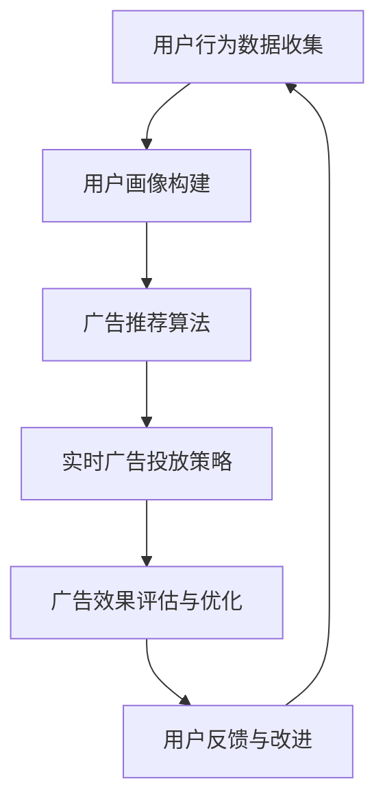

                 


### 《AI驱动的电商平台实时个性化广告投放》

> 关键词：人工智能，电商广告，个性化推荐，实时投放，机器学习，深度学习，用户行为分析，广告效果评估

> 摘要：本文探讨了人工智能技术在电商平台实时个性化广告投放中的应用，通过分析用户行为数据，构建用户画像，采用推荐算法实现个性化广告投放，并介绍了广告投放的实时策略与性能优化。文章结合实际案例，详细阐述了项目的实施过程与效果评估，为电商平台提供了一套可行的AI驱动的广告投放解决方案。

---

### 目录大纲

# 《AI驱动的电商平台实时个性化广告投放》目录大纲

## 第一部分：AI与电商广告概述

### 第1章 AI与电商广告概述

#### 1.1 AI与电商广告的结合

- 1.1.1 电商广告的现状与挑战
- 1.1.2 AI技术在电商广告中的应用
- 1.1.3 实时个性化广告投放的意义

### 第2章 人工智能的基本概念

#### 2.1 人工智能的演进

- 2.1.1 人工智能的历史与发展
- 2.1.2 机器学习与深度学习基础
- 2.1.3 自然语言处理与图像识别

### 第3章 电商平台广告系统架构

#### 3.1 电商平台广告系统架构设计

- 3.1.1 广告系统的基本组成部分
- 3.1.2 广告投放流程
- 3.1.3 数据流与信息流管理

## 第二部分：AI驱动下的个性化广告技术

### 第4章 用户行为分析与用户画像构建

#### 4.1 用户行为分析

- 4.1.1 用户行为数据收集
- 4.1.2 用户行为模式挖掘
- 4.1.3 用户兴趣模型构建

### 第5章 实时个性化广告推荐算法

#### 5.1 广告推荐系统概述

- 5.1.1 广告推荐系统的目标
- 5.1.2 广告推荐算法的分类
- 5.1.3 常用的广告推荐算法

### 第6章 实时广告投放策略与优化

#### 6.1 实时广告投放策略

- 6.1.1 广告投放的实时性要求
- 6.1.2 广告竞价策略
- 6.1.3 广告投放效果评估

### 第7章 模型部署与性能监控

#### 7.1 模型部署与上线

- 7.1.1 模型部署流程
- 7.1.2 模型服务化
- 7.1.3 模型持续集成与部署

#### 7.2 广告系统性能监控

- 7.2.1 性能监控指标
- 7.2.2 性能优化策略
- 7.2.3 异常处理与故障排查

## 第三部分：实战案例与项目经验

### 第8章 AI驱动的电商平台广告案例研究

#### 8.1 案例背景与目标

- 8.1.1 案例背景
- 8.1.2 项目目标
- 8.1.3 技术挑战

### 第9章 项目实施与效果评估

#### 9.1 项目实施过程

- 9.1.1 需求分析与设计
- 9.1.2 数据采集与处理
- 9.1.3 模型开发与训练

#### 9.2 效果评估与优化

- 9.2.1 广告投放效果评估
- 9.2.2 用户反馈与改进
- 9.2.3 持续优化策略

## 附录

### 附录 A：技术栈与工具

#### A.1 开发环境搭建

- A.1.1 数据预处理工具
- A.1.2 模型训练框架
- A.1.3 模型部署与运维

### 附录 B：参考文献与拓展阅读

- B.1 相关书籍
- B.2 学术论文
- B.3 在线资源与社区

---

### 核心概念与联系

#### AI驱动下的个性化广告投放流程



---

### 核心算法原理讲解

#### 广告推荐算法伪代码

```python
# 广告推荐算法伪代码

# 输入：用户画像 U，广告集合 Ads，历史交互数据 History
# 输出：推荐广告列表 RecommendedAds

function RecommendAds(U, Ads, History):
    1. 计算用户 U 与广告 Ads 的相关性 Score
    2. 对每个广告 Ads，计算 Score 并排序
    3. 从排序后的广告中取出 Top-N 广告作为推荐列表
    4. 返回 RecommendedAds

# 相关性计算伪代码
function CalculateScore(U, Ads):
    1. 初始化 Score 为 0
    2. 对每个广告 Ads：
        3. 如果 Ads 在 History 中出现次数大于阈值 Threshold：
            4. Score += 用户 U 对 Ads 的兴趣度 Interest
    5. 返回 Score
```

---

### 数学模型和数学公式讲解

#### 交叉熵损失函数

$$
\text{CrossEntropyLoss} = -\frac{1}{N}\sum_{i=1}^{N} y_i \log(p_i)
$$

其中，$N$ 是样本数量，$y_i$ 是真实标签，$p_i$ 是预测概率。

#### 线性回归模型

$$
y = \beta_0 + \beta_1x
$$

其中，$y$ 是预测值，$x$ 是输入特征，$\beta_0$ 是截距，$\beta_1$ 是斜率。

---

通过以上框架的搭建，我们可以看到，本文将深入探讨AI驱动的电商平台实时个性化广告投放，从理论基础到实际应用，再到项目实战，全面解析这一前沿技术。接下来，我们将逐步展开每一个章节，深入挖掘其中的技术细节和实践经验。让我们一步一步地走进AI驱动的电商平台广告世界，探索个性化广告投放的奥秘。

