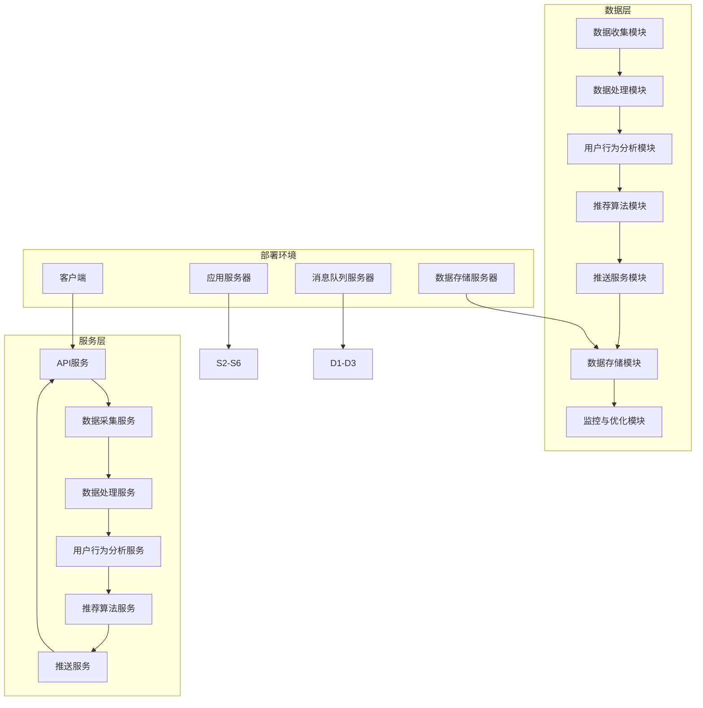

                 

### 文章标题

# AI驱动的电商平台实时个性化推送

### 关键词

- 人工智能
- 电商平台
- 实时推送
- 个性化推荐
- 深度学习
- 机器学习

### 摘要

本文探讨了人工智能在电商平台中的应用，特别是在实时个性化推送领域的突破。随着大数据和云计算技术的快速发展，电商平台能够收集和处理海量用户数据，通过人工智能技术，尤其是机器学习和深度学习算法，实现对用户行为的精准分析，从而实现个性化推荐和实时推送。本文首先介绍了电商平台的基本概念和功能模块，接着分析了人工智能的基础知识，包括机器学习、深度学习和自然语言处理。随后，详细解析了实时个性化推送的原理和算法，并通过实际项目实战展示了如何实现和应用这些技术。最后，对文章进行了总结，并对未来的发展趋势和研究方向进行了展望。

### 目录大纲

## 第1章：引言与背景

### 1.1 AI与电商平台的融合

### 1.2 实时个性化推送的重要性

### 1.3 书籍目的与结构安排

## 第2章：电商平台概述

### 2.1 电商平台的基本概念

### 2.2 电商平台的发展历程

### 2.3 电商平台的主要功能模块

### 2.4 电商平台的技术架构

## 第3章：人工智能基础

### 3.1 人工智能的概述

### 3.2 人工智能的分类与发展趋势

### 3.3 机器学习与深度学习基础

### 3.4 自然语言处理与推荐系统基础

## 第4章：AI驱动的实时个性化推送原理

### 4.1 实时个性化推送的基本概念

### 4.2 个性化推荐系统的工作原理

### 4.3 数据驱动模型的选择

### 4.4 机器学习在实时个性化推送中的应用

## 第5章：核心算法原理讲解

### 5.1 机器学习算法

#### 5.1.1 逻辑回归伪代码

#### 5.1.2 支持向量机（SVM）伪代码

#### 5.1.3 决策树与随机森林伪代码

### 5.2 深度学习算法

#### 5.2.1 卷积神经网络（CNN）伪代码

#### 5.2.2 循环神经网络（RNN）与长短时记忆网络（LSTM）伪代码

#### 5.2.3 生成对抗网络（GAN）伪代码

### 5.3 自然语言处理算法

#### 5.3.1 语言模型伪代码

#### 5.3.2 词向量模型（如Word2Vec）伪代码

#### 5.3.3 语义相似性模型（如BERT）伪代码

## 第6章：数学模型与数学公式

### 6.1 数学模型概述

### 6.2 优化目标函数

### 6.3 梯度下降算法

### 6.4 正则化技术

## 第7章：实时个性化推送系统设计

### 7.1 系统架构设计

### 7.2 数据处理与清洗

### 7.3 用户行为分析

### 7.4 推荐算法实现

### 7.5 实时推送与反馈机制

## 第8章：项目实战

### 8.1 开发环境搭建

#### 8.1.1 Python环境配置

#### 8.1.2 数据库配置

#### 8.1.3 实时推送服务配置

### 8.2 代码实现与解读

#### 8.2.1 用户行为数据采集

#### 8.2.2 用户画像构建

#### 8.2.3 推荐算法实现

#### 8.2.4 推送服务实现

### 8.3 代码解读与分析

#### 8.3.1 用户行为数据采集代码解读

#### 8.3.2 用户画像构建代码解读

#### 8.3.3 推荐算法实现代码解读

#### 8.3.4 推送服务实现代码解读

## 第9章：总结与展望

### 9.1 书籍总结

### 9.2 AI驱动电商实时个性化推送的未来发展趋势

### 9.3 可能的研究方向与挑战

## 附录

### 附录A：相关工具与资源

#### A.1 Python与深度学习框架

#### A.2 数据处理与清洗工具

#### A.3 推荐系统开源项目与资源

### 附录B：参考文献

#### B.1 书籍

#### B.2 论文

#### B.3 网络资源

## 第1章：引言与背景

### 1.1 AI与电商平台的融合

人工智能（AI）作为一种模拟人类智能的技术，近年来在各个领域取得了显著的进展。在电商领域，人工智能的应用已经成为提升用户体验、增加销售额的重要手段。电商平台通过引入AI技术，能够实现用户行为的精准分析、个性化推荐、智能客服等功能，从而提高运营效率和用户满意度。

电商平台与AI的结合主要体现在以下几个方面：

1. **个性化推荐**：通过分析用户的购买历史、浏览记录等数据，AI算法可以预测用户的兴趣和需求，为其推荐相关商品。

2. **智能客服**：利用自然语言处理技术，智能客服系统能够理解用户的提问，提供实时、准确的回答，提高客户服务水平。

3. **风险控制**：AI技术可以帮助电商平台识别潜在的风险，如虚假交易、欺诈行为等，从而保障交易安全和用户权益。

4. **供应链优化**：通过分析市场趋势和用户需求，AI技术可以优化库存管理、物流配送等环节，提高供应链的效率和灵活性。

### 1.2 实时个性化推送的重要性

实时个性化推送是电商平台利用AI技术实现的一项重要功能。它通过实时分析用户行为，动态调整推荐内容和推送策略，从而提高用户满意度和转化率。

实时个性化推送的重要性体现在以下几个方面：

1. **提升用户体验**：通过实时推送用户感兴趣的商品，可以满足用户的即时需求，提高用户满意度。

2. **增加转化率**：个性化推荐可以增加用户对商品的点击率和购买意愿，从而提高转化率。

3. **优化广告投放**：实时个性化推送可以根据用户的行为特征，精准投放广告，提高广告的投放效果。

4. **提高销售额**：通过个性化推荐和精准广告，电商平台可以吸引更多用户，增加销售额。

### 1.3 书籍目的与结构安排

本书旨在系统地介绍AI驱动的电商平台实时个性化推送技术，帮助读者深入理解相关概念、原理和算法，掌握实际应用的方法和技巧。

本书的结构安排如下：

- **第1章：引言与背景**：介绍AI与电商平台的融合以及实时个性化推送的重要性。

- **第2章：电商平台概述**：介绍电商平台的基本概念、发展历程、功能模块和技术架构。

- **第3章：人工智能基础**：介绍人工智能的概述、分类与发展趋势、机器学习与深度学习基础、自然语言处理与推荐系统基础。

- **第4章：AI驱动的实时个性化推送原理**：介绍实时个性化推送的基本概念、个性化推荐系统的工作原理、数据驱动模型的选择、机器学习在实时个性化推送中的应用。

- **第5章：核心算法原理讲解**：详细讲解机器学习、深度学习和自然语言处理算法的原理和伪代码。

- **第6章：数学模型与数学公式**：介绍数学模型概述、优化目标函数、梯度下降算法和正则化技术。

- **第7章：实时个性化推送系统设计**：介绍系统架构设计、数据处理与清洗、用户行为分析、推荐算法实现和实时推送与反馈机制。

- **第8章：项目实战**：通过实际项目实战，展示开发环境搭建、代码实现与解读、实际案例分析和项目小结。

- **第9章：总结与展望**：总结本书的主要内容，展望AI驱动电商实时个性化推送的未来发展趋势和研究方向。

通过本书的阅读，读者可以全面了解AI驱动的电商平台实时个性化推送技术，掌握相关理论和实践方法，为在实际项目中应用这些技术打下坚实基础。

## 第2章：电商平台概述

### 2.1 电商平台的基本概念

电商平台是指通过互联网进行商品交易和服务的平台。它为买卖双方提供了一个在线交易环境，使得用户可以在任何时间、任何地点进行购物。电商平台的基本概念包括以下几个方面：

- **用户**：电商平台的服务对象，包括买家和卖家。买家在电商平台上购买商品，卖家则提供商品并完成交易。

- **商品**：电商平台上的交易对象，可以是实体商品也可以是虚拟商品，如电子书、音乐、软件等。

- **交易**：电商平台通过电子支付系统完成商品买卖的流程，包括订单生成、支付、发货、收货等环节。

- **服务**：电商平台提供一系列服务，如在线客服、物流跟踪、售后服务等，以提升用户体验。

### 2.2 电商平台的发展历程

电商平台的发展历程可以分为以下几个阶段：

1. **萌芽阶段**（1995-2000年）：互联网的兴起催生了电商平台的萌芽，如亚马逊和eBay等平台开始出现。

2. **起步阶段**（2000-2005年）：随着互联网的普及，电商平台逐渐成熟，越来越多的企业进入电商领域，如淘宝、京东等。

3. **快速增长阶段**（2005-2010年）：移动互联网的兴起推动了电商平台的快速发展，用户规模和交易额大幅增长。

4. **多元化发展阶段**（2010年至今）：电商平台不仅限于商品交易，还扩展到生活服务、金融投资等领域，如美团、滴滴等。

### 2.3 电商平台的主要功能模块

电商平台的主要功能模块包括以下几个方面：

- **用户模块**：包括用户注册、登录、个人信息管理、购物车、订单管理等功能。

- **商品模块**：包括商品分类、商品展示、商品搜索、商品评价等功能。

- **交易模块**：包括订单生成、支付、发货、物流跟踪、售后服务等功能。

- **营销模块**：包括广告投放、优惠券发放、促销活动、会员管理等功能。

- **数据分析模块**：通过对用户行为数据的分析，提供用户画像、商品推荐、销售预测等服务。

- **物流模块**：包括仓储管理、订单处理、物流配送、售后服务等功能。

- **安全模块**：包括用户身份验证、交易安全、数据安全等功能。

### 2.4 电商平台的技术架构

电商平台的技术架构可以分为以下几个层次：

1. **前端**：负责用户界面的展示和交互，包括网页、移动应用等。

2. **后端**：负责处理业务逻辑和数据存储，包括Web服务器、应用服务器、数据库服务器等。

3. **数据库**：存储用户数据、商品数据、订单数据等，常用的数据库技术包括关系数据库（如MySQL、Oracle）和NoSQL数据库（如MongoDB、Redis）。

4. **中间件**：负责连接前端和后端，提供数据传输和消息队列等服务，如消息队列（如RabbitMQ、Kafka）、缓存（如Redis、Memcached）等。

5. **数据处理与分析**：利用大数据技术对用户行为数据进行处理和分析，提供个性化推荐、用户画像等服务。

6. **安全与监控**：确保电商平台的安全运行，包括用户认证、授权、数据加密、监控系统等。

通过以上功能模块和技术架构，电商平台能够提供丰富的商品、便捷的购物体验、高效的交易流程，满足用户的多样化需求。

## 第3章：人工智能基础

### 3.1 人工智能的概述

人工智能（Artificial Intelligence，简称AI）是一门研究、开发用于模拟、延伸和扩展人类智能的理论、方法、技术及应用系统的综合性技术科学。人工智能旨在通过计算机程序和机器系统实现人类智能的功能，包括学习、推理、感知、决策、交流等。

人工智能的发展历程可以分为以下几个阶段：

1. **萌芽阶段**（1950年代）：人工智能的概念首次被提出，以图灵测试为代表，探讨机器是否能够模拟人类智能。

2. **探索阶段**（1960-1970年代）：人工智能研究在理论和算法上取得了初步进展，但受限于计算机硬件和算法的局限性，实际应用较少。

3. **低谷阶段**（1980-1990年代）：人工智能研究进入低谷，受制于资金、技术等多方面因素。

4. **复兴阶段**（2000年至今）：随着计算机性能的提升和大数据、深度学习等技术的发展，人工智能再次迎来了快速发展。

### 3.2 人工智能的分类与发展趋势

人工智能可以分为几种不同的类型，每种类型都有其独特的应用场景和发展趋势：

1. **弱人工智能**（Narrow AI）：也称为专用人工智能，这种AI系统在特定任务上表现出人类智能的行为，但无法泛化到其他任务。例如，语音识别系统和图像识别系统。

2. **强人工智能**（General AI）：这种AI系统能够在多个任务上表现出人类智能，具有自我意识和理解能力。目前，强人工智能仍然处于理论研究阶段，尚未实现。

3. **混合智能**（Hybrid AI）：结合了弱人工智能和强人工智能的特点，通过多种算法和模型实现更高效的任务处理。

人工智能的发展趋势包括：

- **深度学习**：通过多层神经网络模拟人脑的学习过程，深度学习在图像识别、自然语言处理等领域取得了显著成果。

- **强化学习**：通过试错和奖励机制，AI系统可以在复杂环境中学习最优策略，广泛应用于游戏、自动驾驶等领域。

- **人机协作**：通过人工智能辅助人类工作，提高工作效率和质量，如智能客服、智能助手等。

- **边缘计算**：将计算任务从云端迁移到网络边缘，减少延迟，提高实时性，适用于物联网、智能城市等领域。

### 3.3 机器学习与深度学习基础

机器学习（Machine Learning，ML）是人工智能的一个分支，通过算法和统计模型，从数据中学习规律，并做出预测或决策。机器学习可以分为以下几种类型：

1. **监督学习**（Supervised Learning）：通过已有标记数据，训练模型进行预测或分类。常见的算法包括线性回归、逻辑回归、支持向量机（SVM）、决策树和随机森林等。

2. **无监督学习**（Unsupervised Learning）：在没有标记数据的情况下，自动发现数据中的结构和模式。常见的算法包括聚类、关联规则学习和降维技术等。

3. **半监督学习**（Semi-Supervised Learning）：结合标记数据和未标记数据，训练模型，提高学习效果。

4. **强化学习**（Reinforcement Learning）：通过试错和奖励机制，AI系统在学习过程中不断调整策略，以实现最优行为。

深度学习（Deep Learning，DL）是机器学习的一个分支，通过多层神经网络模拟人脑的学习过程。深度学习的基础是人工神经网络（Artificial Neural Network，ANN），其主要特点是能够自动提取数据的特征。

深度学习可以分为以下几种类型：

1. **卷积神经网络**（Convolutional Neural Network，CNN）：适用于图像识别、图像分类和图像生成等领域。

2. **循环神经网络**（Recurrent Neural Network，RNN）：适用于序列数据，如文本、语音和时序数据。

3. **长短时记忆网络**（Long Short-Term Memory，LSTM）：是RNN的一种改进，能够更好地处理长序列数据。

4. **生成对抗网络**（Generative Adversarial Network，GAN）：通过两个对抗网络（生成器和判别器）的竞争，生成高质量的数据。

### 3.4 自然语言处理与推荐系统基础

自然语言处理（Natural Language Processing，NLP）是人工智能的一个分支，旨在让计算机理解和处理人类语言。NLP包括以下几个关键领域：

1. **语言模型**：通过统计方法或神经网络模型，预测下一个单词或句子，用于自动完成文本输入。

2. **词性标注**：对文本中的每个词进行分类，标注其词性，如名词、动词、形容词等。

3. **句法分析**：分析句子的结构，识别句子中的成分和关系，如主语、谓语、宾语等。

4. **语义理解**：理解文本的含义，包括实体识别、关系提取和语义角色标注等。

推荐系统（Recommender System）是一种信息过滤技术，通过分析用户的兴趣和行为，预测用户可能感兴趣的内容，并推荐给用户。推荐系统可以分为以下几种类型：

1. **基于内容的推荐**：通过分析内容特征，如关键词、标签、分类等，推荐相似内容给用户。

2. **协同过滤推荐**：通过分析用户之间的行为相似性，预测用户对未评价项目的评分。

3. **混合推荐**：结合基于内容的推荐和协同过滤推荐，提高推荐效果。

4. **基于上下文的推荐**：结合用户的位置、时间、设备等上下文信息，提供更个性化的推荐。

通过了解人工智能的基础知识，我们可以更好地理解AI技术在电商平台中的应用，包括个性化推荐、智能客服、风险控制等方面的实现。下一章将深入探讨AI驱动的实时个性化推送原理，为后续内容打下基础。

## 第4章：AI驱动的实时个性化推送原理

### 4.1 实时个性化推送的基本概念

实时个性化推送是一种基于人工智能技术的个性化推荐系统，通过实时分析用户的兴趣和行为数据，动态调整推荐内容，提高用户满意度和转化率。实时个性化推送的基本概念包括以下几个方面：

1. **实时性**：实时个性化推送能够在短时间内对用户行为进行响应，并根据用户最新的行为数据调整推荐策略。

2. **个性化**：根据用户的兴趣、历史行为和偏好，为每个用户生成个性化的推荐内容，满足其个性化需求。

3. **动态调整**：实时个性化推送系统会根据用户的行为变化和外部环境的变化，动态调整推荐策略，保持推荐内容的新鲜度和相关性。

4. **数据驱动**：实时个性化推送依赖于大规模的用户行为数据，通过数据分析和机器学习算法，提取用户兴趣特征，生成推荐结果。

### 4.2 个性化推荐系统的工作原理

个性化推荐系统的工作原理主要包括数据收集、特征提取、模型训练和推荐生成等几个关键环节：

1. **数据收集**：收集用户的浏览历史、购买记录、评价和反馈等数据，作为推荐系统的输入。

2. **特征提取**：通过对用户行为数据进行处理和分析，提取用户的兴趣特征和商品特征，如关键词、标签、用户评分等。

3. **模型训练**：使用机器学习算法，如协同过滤、基于内容的推荐和混合推荐等，训练推荐模型，使其能够预测用户对未知商品的评分或兴趣。

4. **推荐生成**：根据用户的兴趣特征和推荐模型，生成个性化的推荐列表，并将其推送给用户。

### 4.3 数据驱动模型的选择

数据驱动模型的选择是实时个性化推送系统的核心问题，直接关系到推荐效果。常见的数据驱动模型包括：

1. **基于内容的推荐**：通过分析商品的属性和用户的历史行为，找到相似的商品进行推荐。优点是易于实现，推荐结果相关性较高；缺点是用户兴趣变化难以捕捉。

2. **协同过滤推荐**：通过分析用户之间的相似性，找到与目标用户相似的其他用户喜欢的商品进行推荐。优点是能够发现长尾商品，推荐多样性较高；缺点是冷启动问题较严重。

3. **混合推荐**：结合基于内容的推荐和协同过滤推荐，取长补短，提高推荐效果。优点是推荐结果多样性和准确性较高；缺点是实现较复杂，计算开销较大。

4. **深度学习推荐**：利用深度学习算法，如卷积神经网络（CNN）、循环神经网络（RNN）和生成对抗网络（GAN）等，提取复杂特征，实现更精准的推荐。优点是能够捕捉用户和商品的深层特征；缺点是模型训练复杂，计算资源需求高。

在选择数据驱动模型时，需要综合考虑推荐系统的目标、数据规模、计算资源等因素。一般来说，对于小型电商平台，基于内容的推荐和协同过滤推荐较为适用；对于大型电商平台，混合推荐和深度学习推荐具有更高的推荐效果。

### 4.4 机器学习在实时个性化推送中的应用

机器学习在实时个性化推送中发挥了重要作用，通过训练复杂的预测模型，可以更好地捕捉用户的兴趣和行为模式。以下是一些常用的机器学习算法和其在实时个性化推送中的应用：

1. **逻辑回归**：用于预测用户对商品的点击概率或购买概率。逻辑回归模型简单，易于解释，适合小规模数据的预测。

2. **支持向量机（SVM）**：通过寻找最佳超平面，将用户和商品划分为不同的类别。SVM在处理高维数据时具有较好的效果。

3. **决策树和随机森林**：通过树形结构进行分类或回归，随机森林通过集成多个决策树，提高模型的预测性能和泛化能力。

4. **神经网络**：通过多层神经网络模拟人脑的学习过程，提取复杂的特征，实现高精度的预测。常见的神经网络包括卷积神经网络（CNN）、循环神经网络（RNN）和生成对抗网络（GAN）等。

5. **聚类算法**：如K-means聚类，通过将用户或商品分为不同的簇，实现用户分群或商品分类。聚类算法可以帮助挖掘用户或商品的潜在特征，提高推荐效果。

在实时个性化推送系统中，机器学习算法的应用主要包括以下几个方面：

- **用户兴趣建模**：通过分析用户的浏览历史、购买记录等数据，构建用户的兴趣模型，预测用户对未知商品的兴趣。

- **商品推荐**：根据用户的兴趣模型和推荐算法，生成个性化的商品推荐列表。

- **实时调整**：通过实时分析用户的行为数据，动态调整推荐策略，提高推荐效果。

- **反馈机制**：通过用户对推荐结果的反馈，进一步优化推荐模型，实现持续改进。

通过以上分析，我们可以看到，AI驱动的实时个性化推送原理涉及多个方面，包括数据收集、特征提取、模型训练和推荐生成等。下一章将深入探讨这些原理的实现和应用，为实际项目提供技术支持。

## 第5章：核心算法原理讲解

### 5.1 机器学习算法

机器学习算法是实时个性化推送系统的核心组成部分，它们通过从数据中学习规律，帮助平台理解用户行为，提供个性化的推荐。以下是一些常见的机器学习算法及其伪代码。

#### 5.1.1 逻辑回归

逻辑回归（Logistic Regression）是一种常用的分类算法，用于预测二分类问题。其基本原理是通过线性模型预测概率，然后应用逻辑函数将其转换为概率值。

**伪代码：**

```python
for i in range(n):
    y[i] = σ(w · x[i])
    dw = y[i] - y_true[i]
    w = w - α * dw
```

- **参数解释**：
  - `y[i]`：预测概率。
  - `x[i]`：输入特征向量。
  - `w`：模型参数。
  - `y_true[i]`：实际标签。
  - `σ`：逻辑函数（Sigmoid函数），公式为 `σ(z) = 1 / (1 + e^(-z))`。
  - `α`：学习率。

#### 5.1.2 支持向量机（SVM）

支持向量机（Support Vector Machine，SVM）是一种强大的分类算法，通过最大化分类边界之间的距离来提高模型的泛化能力。

**伪代码：**

```python
# SMO算法伪代码
while not converged:
    for each i in L:
        if ξ[i] < ε:
            select j and compute L, H, αi, αj
            if αi + αj > 0:
                if αi > 0:
                    αi = αi - η
                else:
                    αj = αj - η
            else:
                if αi < 0:
                    αi = αi + η
                else:
                    αj = αj + η
    if convergence:
        break
```

- **参数解释**：
  - `L`：训练样本集合。
  - `H`：启发式选取规则。
  - `αi`、`αj`：模型参数。
  - `ε`：收敛阈值。
  - `η`：学习率。

#### 5.1.3 决策树与随机森林

决策树（Decision Tree）通过一系列的规则将数据划分为不同的类别。随机森林（Random Forest）通过集成多个决策树，提高模型的预测性能和泛化能力。

**伪代码：**

```python
# 决策树构建伪代码
for each feature:
    split the data on the feature
    compute the Gini impurity or entropy
    choose the split that minimizes the impurity
    create a new node with the split
    repeat until a stopping criterion is met

# 随机森林构建伪代码
for i in range(n_trees):
    sample the data with replacement
    build a decision tree on the sampled data
```

- **参数解释**：
  - `feature`：特征。
  - `split`：分割数据。
  - `Gini impurity`：基尼不纯度。
  - `entropy`：信息熵。
  - `n_trees`：树的数量。

### 5.2 深度学习算法

深度学习（Deep Learning）通过多层神经网络模拟人脑的学习过程，提取复杂特征，实现高精度的预测。以下是一些常见的深度学习算法及其伪代码。

#### 5.2.1 卷积神经网络（CNN）

卷积神经网络（Convolutional Neural Network，CNN）是一种适用于图像识别和处理的深度学习算法。

**伪代码：**

```python
for i in range(n):
    z[i] = w · x[i] + b
    a[i] = relu(z[i])
    z'[i] = w' · a[i] + b'
    y[i] = softmax(z'[i])
```

- **参数解释**：
  - `z[i]`：输入层的加权和。
  - `w`、`b`：权重和偏置。
  - `a[i]`：激活值。
  - `relu`：ReLU激活函数。
  - `z'[i]`：输出层的加权和。
  - `w'`、`b'`：输出层的权重和偏置。
  - `y[i]`：输出概率分布。

#### 5.2.2 循环神经网络（RNN）与长短时记忆网络（LSTM）

循环神经网络（Recurrent Neural Network，RNN）和长短时记忆网络（Long Short-Term Memory，LSTM）是一种适用于序列数据的深度学习算法。

**RNN伪代码：**

```python
for t in range(T):
    h[t] = f(h[t-1], x[t])
```

- **参数解释**：
  - `h[t]`：当前时刻的隐藏状态。
  - `x[t]`：当前时刻的输入。
  - `f`：RNN的更新函数。

**LSTM伪代码：**

```python
for t in range(T):
    gates = [sigmoid(…), sigmoid(…), tanh(…)]
    i = gates[0], f = gates[1], o = gates[2]
    c = f * c_prev + i * tanh(c_t)
    h[t] = o * tanh(c)
```

- **参数解释**：
  - `gates`：输入门、遗忘门和输出门。
  - `i`、`f`、`o`：输入门、遗忘门和输出门的值。
  - `c`：细胞状态。
  - `c_t`：当前时刻的细胞状态。
  - `h[t]`：当前时刻的隐藏状态。

#### 5.2.3 生成对抗网络（GAN）

生成对抗网络（Generative Adversarial Network，GAN）通过生成器和判别器的对抗训练，实现高质量的数据生成。

**伪代码：**

```python
for epoch in range(E):
    for real_data in D:
        D.train(real_data)
    for generated_data in G:
        D.train(generated_data)
    G.train(generated_data)
```

- **参数解释**：
  - `D`：判别器。
  - `G`：生成器。
  - `real_data`：真实数据。
  - `generated_data`：生成数据。
  - `E`：训练轮数。

### 5.3 自然语言处理算法

自然语言处理（Natural Language Processing，NLP）算法在实时个性化推送中用于处理文本数据，提取语义信息。

#### 5.3.1 语言模型

语言模型用于预测下一个单词或句子的概率。

**伪代码：**

```python
for i in range(n):
    P(w_i | w_i-1, w_i-2, ..., w_1) = count(w_i, w_i-1, ..., w_1) / count(w_i-1, ..., w_1)
```

- **参数解释**：
  - `P(w_i | w_i-1, w_i-2, ..., w_1)`：条件概率。
  - `count(w_i, w_i-1, ..., w_1)`：词序列的计数。
  - `count(w_i-1, ..., w_1)`：前一个词序列的计数。

#### 5.3.2 词向量模型（如Word2Vec）

词向量模型将单词映射为密集向量，用于捕捉词与词之间的语义关系。

**伪代码：**

```python
for epoch in range(E):
    for context, target in data:
        update weights based on target and context
```

- **参数解释**：
  - `context`：单词的上下文。
  - `target`：目标单词。
  - `weights`：单词的向量表示。

#### 5.3.3 语义相似性模型（如BERT）

语义相似性模型用于计算句子或单词之间的语义相似度。

**伪代码：**

```python
embeddings = BERT.encode(context, target)
similarity = cosine_similarity(embeddings)
```

- **参数解释**：
  - `embeddings`：句子或单词的向量表示。
  - `cosine_similarity`：余弦相似度计算函数。

通过这些核心算法原理的讲解，我们可以更好地理解实时个性化推送系统的工作机制，为实际项目开发提供技术支持。

### 6.1 数学模型概述

在AI驱动的电商平台实时个性化推送中，数学模型起到了核心作用。这些模型通过数学公式和算法，将用户行为数据转化为推荐结果。以下是一些常用的数学模型及其概述。

#### 6.1.1 优化目标函数

优化目标函数是机器学习算法的核心，用于衡量模型在训练数据上的性能。常见的优化目标函数包括：

- **均方误差（MSE）**：用于回归问题，公式为：
  $$
  \text{MSE} = \frac{1}{2} \sum_{i=1}^{n} (\text{y}_i - \text{y}(\text{x}_i))^2
  $$
  其中，$y_i$为实际标签，$y(\text{x}_i)$为模型预测值。

- **交叉熵（Cross-Entropy）**：用于分类问题，公式为：
  $$
  \text{Cross-Entropy} = -\sum_{i=1}^{n} y_i \log(y(\text{x}_i))
  $$
  其中，$y_i$为实际标签，$y(\text{x}_i)$为模型预测概率。

#### 6.1.2 梯度下降算法

梯度下降算法是一种常用的优化方法，用于调整模型参数，以最小化优化目标函数。其基本思想是计算目标函数关于参数的梯度，并沿着梯度方向更新参数。

- **批量梯度下降（Batch Gradient Descent）**：每次迭代使用所有训练数据计算梯度，公式为：
  $$
  \text{w} = \text{w} - \alpha \cdot \nabla_{\text{w}} \text{J}(\text{w})
  $$
  其中，$\alpha$为学习率，$\nabla_{\text{w}} \text{J}(\text{w})$为梯度。

- **随机梯度下降（Stochastic Gradient Descent，SGD）**：每次迭代随机选择一个训练样本计算梯度，公式为：
  $$
  \text{w} = \text{w} - \alpha \cdot \nabla_{\text{w}} \text{J}(\text{x}_i, \text{y}_i)
  $$
  其中，$\text{x}_i$和$y_i$为随机选择的训练样本。

- **小批量梯度下降（Mini-batch Gradient Descent）**：每次迭代使用部分训练数据计算梯度，公式为：
  $$
  \text{w} = \text{w} - \alpha \cdot \nabla_{\text{w}} \text{J}(\text{X}, \text{Y})
  $$
  其中，$\text{X}$和$\text{Y}$为小批量训练数据。

#### 6.1.3 正则化技术

正则化技术用于防止模型过拟合，提高模型的泛化能力。常见的正则化技术包括：

- **L1正则化**：在目标函数中添加L1范数项，公式为：
  $$
  \text{J}(\text{w}) = \frac{1}{2} \sum_{i=1}^{n} (\text{y}_i - \text{y}(\text{x}_i))^2 + \lambda ||\text{w}||_1
  $$
  其中，$\lambda$为正则化参数，$||\text{w}||_1 = \sum_{i=1}^{n} |\text{w}_i|$。

- **L2正则化**：在目标函数中添加L2范数项，公式为：
  $$
  \text{J}(\text{w}) = \frac{1}{2} \sum_{i=1}^{n} (\text{y}_i - \text{y}(\text{x}_i))^2 + \lambda ||\text{w}||_2^2
  $$
  其中，$\lambda$为正则化参数，$||\text{w}||_2 = \sqrt{\sum_{i=1}^{n} \text{w}_i^2}$。

正则化技术通过限制模型参数的规模，减少模型的复杂度，从而提高模型的泛化能力。

通过以上数学模型的概述，我们可以更好地理解实时个性化推送系统中的优化目标、梯度下降算法和正则化技术。这些数学模型为构建高效、稳定的推荐系统提供了理论基础。

### 6.2 优化目标函数

在机器学习和深度学习领域中，优化目标函数是模型训练的核心。优化目标函数用于衡量模型预测值与实际值之间的误差，指导模型参数的调整过程，以实现模型的最优化。以下是一些常见的优化目标函数及其详细解释。

#### 均方误差（MSE）

均方误差（Mean Squared Error，MSE）是最常用的优化目标函数之一，广泛用于回归问题。MSE的定义如下：

$$
\text{MSE} = \frac{1}{2} \sum_{i=1}^{n} (\text{y}_i - \text{y}(\text{x}_i))^2
$$

其中，$y_i$为实际标签，$y(\text{x}_i)$为模型预测值，$n$为数据样本数量。MSE的值越小，表示模型预测的误差越小。

**优点**：

- **直观易解**：MSE函数形式简单，易于理解和计算。
- **鲁棒性**：对异常值的影响较小。

**缺点**：

- **对噪声敏感**：MSE对噪声数据的敏感度较高，可能导致模型在噪声数据上的表现较差。

#### 交叉熵（Cross-Entropy）

交叉熵（Cross-Entropy）是另一种常见的优化目标函数，广泛用于分类问题。交叉熵的定义如下：

$$
\text{Cross-Entropy} = -\sum_{i=1}^{n} y_i \log(y(\text{x}_i))
$$

其中，$y_i$为实际标签（通常使用one-hot编码表示），$y(\text{x}_i)$为模型预测概率。交叉熵的值越小，表示模型预测的准确度越高。

**优点**：

- **对预测概率的重视**：交叉熵函数鼓励模型产生较高的预测概率，从而提高分类准确性。
- **对噪声的抵抗性**：交叉熵对噪声数据的抵抗性较强。

**缺点**：

- **对极端值敏感**：当预测概率接近0或1时，交叉熵的变化率较慢，可能导致模型在极端值上的表现较差。

#### 逻辑损失（Logistic Loss）

逻辑损失（Logistic Loss）是交叉熵在二分类问题中的应用，定义如下：

$$
\text{Logistic Loss} = -y_i \log(y(\text{x}_i)) - (1 - y_i) \log(1 - y(\text{x}_i))
$$

其中，$y_i$为实际标签（0或1），$y(\text{x}_i)$为模型预测概率。逻辑损失函数是梯度提升算法（Gradient Boosting）和随机森林（Random Forest）等模型的基础。

**优点**：

- **简单高效**：逻辑损失函数形式简单，计算效率高。
- **易于优化**：逻辑损失函数的优化相对容易，适用于各种优化算法。

**缺点**：

- **对极端值敏感**：与交叉熵类似，逻辑损失函数对极端值的变化率较慢。

#### 损失函数的选择

选择合适的损失函数取决于具体的问题和应用场景。以下是一些常见场景下的损失函数选择：

- **回归问题**：均方误差（MSE）是最常用的损失函数，尤其在需要预测连续值的情况下。
- **二分类问题**：逻辑损失（Logistic Loss）和交叉熵是最常用的损失函数，适用于二分类问题。
- **多分类问题**：交叉熵是最常用的损失函数，尤其是在使用深度学习模型进行多分类时。

通过了解和选择合适的优化目标函数，我们可以有效地训练模型，提高模型的预测性能和泛化能力。

### 6.3 梯度下降算法

梯度下降算法（Gradient Descent）是一种基本的优化算法，用于调整机器学习模型的参数，以最小化损失函数。其核心思想是通过计算损失函数关于模型参数的梯度，并沿着梯度的反方向更新参数，逐步减少损失。

#### 6.3.1 梯度下降的基本原理

梯度下降算法的基本步骤如下：

1. **初始化参数**：随机选择模型参数的初始值。
2. **计算梯度**：计算损失函数关于每个参数的梯度。
3. **更新参数**：根据梯度和学习率（learning rate），更新模型参数。
4. **迭代**：重复上述步骤，直到满足停止条件（如损失函数变化较小或达到预设迭代次数）。

梯度下降算法的更新公式为：

$$
\text{w} = \text{w} - \alpha \cdot \nabla_{\text{w}} \text{J}(\text{w})
$$

其中，$\text{w}$为模型参数，$\alpha$为学习率，$\nabla_{\text{w}} \text{J}(\text{w})$为损失函数关于参数$\text{w}$的梯度。

#### 6.3.2 梯度下降的变体

梯度下降算法存在多种变体，以适应不同的应用场景和优化需求。以下是几种常见的变体：

1. **批量梯度下降（Batch Gradient Descent）**：每次迭代使用所有训练数据计算梯度，公式为：

   $$
   \text{w} = \text{w} - \alpha \cdot \nabla_{\text{w}} \text{J}(\text{w})
   $$

   批量梯度下降的优点是计算梯度准确，但缺点是计算量大，可能导致训练时间长。

2. **随机梯度下降（Stochastic Gradient Descent，SGD）**：每次迭代随机选择一个训练样本计算梯度，公式为：

   $$
   \text{w} = \text{w} - \alpha \cdot \nabla_{\text{w}} \text{J}(\text{x}_i, \text{y}_i)
   $$

   随机梯度下降的优点是计算速度快，但梯度估计的随机性可能导致收敛性较差。

3. **小批量梯度下降（Mini-batch Gradient Descent）**：每次迭代使用部分训练数据（称为小批量，通常为32或64个样本）计算梯度，公式为：

   $$
   \text{w} = \text{w} - \alpha \cdot \nabla_{\text{w}} \text{J}(\text{X}, \text{Y})
   $$

   小批量梯度下降结合了批量梯度下降和随机梯度下降的优点，计算量适中，收敛性较好。

#### 6.3.3 学习率的选择

学习率（learning rate）是梯度下降算法中的一个关键参数，影响算法的收敛速度和稳定性。选择合适的学习率非常重要，以下是一些常见的方法：

- **手动调整**：通过试错法（例如，在0到1之间逐渐调整学习率）找到合适的值。
- **启发式选择**：使用经验公式（如$\alpha_0 / \sqrt{t}$，其中$t$为迭代次数）。
- **自适应调整**：使用自适应学习率方法（如Adagrad、Adam等），根据历史梯度信息动态调整学习率。

通过合理选择和学习率调整策略，可以提高梯度下降算法的性能和稳定性。

### 6.4 正则化技术

正则化（Regularization）是一种防止机器学习模型过拟合的技术，通过限制模型复杂度，提高模型的泛化能力。正则化主要包括以下几种技术：

#### 6.4.1 L1正则化（Lasso）

L1正则化在损失函数中添加L1范数（绝对值和）项，公式为：

$$
\text{J}(\text{w}) = \frac{1}{2} \sum_{i=1}^{n} (\text{y}_i - \text{y}(\text{x}_i))^2 + \lambda ||\text{w}||_1
$$

其中，$\lambda$为正则化参数，$||\text{w}||_1 = \sum_{i=1}^{n} |\text{w}_i|$。L1正则化有助于在特征选择过程中减少特征数量，从而简化模型。

**优点**：

- **特征选择**：L1正则化可以通过选择权重绝对值较小的特征，实现特征选择。
- **稀疏性**：L1正则化生成的模型具有稀疏性，即大多数参数被置零。

**缺点**：

- **计算复杂度**：L1正则化计算复杂度较高，尤其是在大规模数据集上。

#### 6.4.2 L2正则化（Ridge）

L2正则化在损失函数中添加L2范数（平方和）项，公式为：

$$
\text{J}(\text{w}) = \frac{1}{2} \sum_{i=1}^{n} (\text{y}_i - \text{y}(\text{x}_i))^2 + \lambda ||\text{w}||_2^2
$$

其中，$\lambda$为正则化参数，$||\text{w}||_2 = \sqrt{\sum_{i=1}^{n} \text{w}_i^2}$。L2正则化可以防止模型参数过大，从而提高模型的泛化能力。

**优点**：

- **稳定性**：L2正则化相对于L1正则化更稳定，不易出现参数过大或过小的问题。
- **计算高效**：L2正则化计算复杂度较低，适用于大规模数据集。

**缺点**：

- **不显著的特征选择**：L2正则化虽然可以减少特征数量，但效果不如L1正则化显著。

#### 6.4.3 Elastic Net

Elastic Net是L1和L2正则化的结合，公式为：

$$
\text{J}(\text{w}) = \frac{1}{2} \sum_{i=1}^{n} (\text{y}_i - \text{y}(\text{x}_i))^2 + \lambda_1 ||\text{w}||_1 + \lambda_2 ||\text{w}||_2
$$

其中，$\lambda_1$和$\lambda_2$为正则化参数。Elastic Net适用于特征高度相关的数据集，可以在特征选择和正则化之间取得平衡。

**优点**：

- **特征选择**：Elastic Net通过同时使用L1和L2正则化，实现更有效的特征选择。
- **适应性**：Elastic Net适用于不同特征类型的数据集。

**缺点**：

- **参数调优**：Elastic Net需要调优两个正则化参数，增加了调参的复杂性。

通过合理选择和应用正则化技术，可以提高机器学习模型的泛化能力和稳定性，从而实现更有效的预测和分类。

## 第7章：实时个性化推送系统设计

### 7.1 系统架构设计

实时个性化推送系统的架构设计决定了系统的性能、可扩展性和可维护性。一个高效的实时个性化推送系统通常包括以下关键模块：

#### 数据收集模块

数据收集模块负责从各种渠道（如用户行为、日志数据、外部API等）收集原始数据。这些数据包括用户的浏览记录、购买行为、搜索历史、评价和反馈等。

#### 数据处理模块

数据处理模块负责对收集到的原始数据进行清洗、转换和整合。这一步骤包括数据去重、填补缺失值、归一化处理等。数据处理模块通常使用流处理技术（如Apache Kafka、Apache Flink）进行实时数据处理。

#### 用户行为分析模块

用户行为分析模块负责分析用户的浏览和购买行为，提取用户兴趣和行为模式。常用的方法包括基于协作过滤的推荐算法、基于内容的推荐算法和深度学习推荐算法。

#### 推荐算法模块

推荐算法模块是系统的核心，负责根据用户兴趣和行为模式生成个性化的推荐列表。推荐算法可以是基于内容的、协同过滤的或者深度学习的。在实际应用中，推荐算法模块通常会结合多种算法，以提供更准确的推荐结果。

#### 推送服务模块

推送服务模块负责将推荐结果实时推送给用户。推送服务可以是基于Websocket、HTTP长连接或者消息队列（如RabbitMQ、Kafka）等。推送服务模块需要确保推送的及时性和准确性，同时还要处理大量并发请求。

#### 数据存储模块

数据存储模块负责存储用户的个人信息、推荐历史和实时数据。常用的数据存储技术包括关系数据库（如MySQL、PostgreSQL）、NoSQL数据库（如MongoDB、Cassandra）和分布式缓存（如Redis、Memcached）。

#### 监控与优化模块

监控与优化模块负责监控系统性能和推荐效果，提供实时反馈和优化建议。这一模块通常包括日志分析、性能监控、推荐效果评估和算法优化等。

#### 系统架构图

以下是一个典型的实时个性化推送系统架构图，展示了各模块之间的交互关系：



### 7.2 数据处理与清洗

数据处理与清洗是实时个性化推送系统中的关键步骤，直接影响推荐系统的质量和效率。以下是一些常用的数据处理与清洗方法：

#### 数据收集

1. **用户行为数据**：包括用户的浏览记录、购买行为、搜索历史和评价等。这些数据可以通过API接口、日志文件或第三方数据提供商获取。

2. **外部数据**：包括用户的社会属性（如年龄、性别、地理位置）、市场趋势和商品属性等。这些数据可以从外部数据源（如社交媒体、市场调研公司等）获取。

#### 数据清洗

1. **数据去重**：识别并去除重复的数据记录，确保数据的一致性。

2. **填补缺失值**：对于缺失的数据，可以使用平均值、中位数或插值法进行填补，或者使用模型预测缺失值。

3. **数据格式转换**：将不同来源的数据格式统一，如将日期格式转换为统一的格式，将文本数据转换为数字或类别编码。

4. **归一化处理**：对数值型数据进行归一化处理，使其在相同的尺度上，从而消除数据之间的量纲差异。

5. **异常值处理**：识别并处理异常数据，如过大的数值或过小的数值。可以采用剔除、填补或重新编码等方法。

6. **数据分桶**：根据用户的活跃度、购买力等特征，将用户划分为不同的分桶，以实现更精细化的推荐。

#### 数据处理流程

1. **数据采集**：通过API接口、日志文件或第三方数据提供商收集原始数据。

2. **数据预处理**：对原始数据进行去重、格式转换、归一化和异常值处理。

3. **特征提取**：根据业务需求，从预处理后的数据中提取特征，如用户兴趣特征、商品属性特征等。

4. **数据存储**：将处理后的数据存储到关系数据库或NoSQL数据库中，以便后续分析。

通过上述数据处理与清洗步骤，可以确保数据的质量和一致性，为实时个性化推送系统提供可靠的数据支持。

### 7.3 用户行为分析

用户行为分析是实时个性化推送系统的核心环节，通过分析用户的浏览、购买和搜索等行为，可以提取用户的兴趣和偏好，为生成个性化的推荐提供依据。以下是一些常用的用户行为分析方法：

#### 7.3.1 数据采集

用户行为数据包括浏览历史、购买记录、搜索历史、评价和反馈等。这些数据可以通过以下途径采集：

1. **日志文件**：电商平台通常会产生大量的日志文件，包括用户访问记录、页面跳转记录、点击记录等。通过分析日志文件，可以获取用户的浏览行为。

2. **API接口**：电商平台提供的API接口可以获取用户的购买记录、搜索历史等数据。

3. **第三方数据源**：如社交媒体、地理位置信息、市场调研数据等，可以提供用户的社会属性和偏好信息。

#### 7.3.2 数据处理

用户行为数据通常需要进行预处理，包括数据去重、填补缺失值、格式转换和归一化处理等。预处理后的数据用于提取特征，特征提取方法包括：

1. **基于规则的提取方法**：通过预设的规则，从原始数据中提取有用的信息，如用户购买频次、浏览时长等。

2. **基于机器学习的方法**：使用机器学习算法，如聚类、关联规则挖掘等，自动提取用户的行为特征。

3. **基于深度学习的方法**：通过深度学习模型，如卷积神经网络（CNN）和循环神经网络（RNN），提取复杂的用户行为特征。

#### 7.3.3 用户行为分析

用户行为分析主要包括以下几个步骤：

1. **行为模式识别**：通过聚类算法（如K-means），将具有相似行为的用户划分为不同的群体。这样可以识别出不同类型的用户，为个性化推荐提供基础。

2. **兴趣偏好分析**：分析用户的浏览、购买和搜索等行为，识别出用户的兴趣和偏好。常用的方法包括基于内容的推荐、协同过滤推荐和深度学习推荐。

3. **行为预测**：通过时间序列分析和预测模型（如ARIMA、LSTM等），预测用户的未来行为，如购买、浏览等。这样可以提前为用户生成个性化的推荐列表。

4. **行为反馈**：收集用户对推荐结果的反馈，如点击、购买、评价等，用于进一步优化推荐算法和模型。

通过以上用户行为分析，可以全面了解用户的兴趣和偏好，为实时个性化推送提供可靠的数据支持，从而提高推荐效果和用户满意度。

### 7.4 推荐算法实现

推荐算法是实时个性化推送系统的核心组件，其实现过程包括算法选择、模型训练和推荐生成等多个步骤。以下将详细阐述推荐算法的实现过程。

#### 7.4.1 算法选择

推荐算法的选择取决于业务需求和数据特点。以下是一些常见的推荐算法及其适用场景：

1. **基于内容的推荐**：通过分析商品的属性和用户的历史行为，找到相似的商品进行推荐。适用于商品属性明确、用户行为数据较少的场景。

2. **协同过滤推荐**：通过分析用户之间的行为相似性，找到与目标用户相似的其他用户喜欢的商品进行推荐。适用于用户行为数据丰富的场景，特别是冷启动问题。

3. **混合推荐**：结合基于内容的推荐和协同过滤推荐，取长补短，提高推荐效果。适用于多种数据特点的场景。

4. **深度学习推荐**：利用深度学习算法，如卷积神经网络（CNN）和循环神经网络（RNN），提取复杂的用户和商品特征，实现高精度的推荐。适用于需要处理大规模数据和复杂特征的场景。

#### 7.4.2 模型训练

推荐模型的训练是算法实现的关键步骤，主要包括以下步骤：

1. **数据预处理**：对用户行为数据进行清洗、格式转换和特征提取，得到可用于训练的数据集。

2. **模型选择**：根据算法选择，选择合适的机器学习或深度学习模型。常用的模型包括线性回归、逻辑回归、决策树、随机森林、卷积神经网络（CNN）和循环神经网络（RNN）等。

3. **训练集划分**：将数据集划分为训练集和验证集，用于模型的训练和验证。

4. **模型训练**：使用训练集对模型进行训练，通过调整模型参数和超参数，使模型达到最优性能。

5. **模型验证**：使用验证集对模型进行验证，评估模型的预测性能和泛化能力。

6. **模型保存**：将训练好的模型保存为模型文件，以便后续使用。

#### 7.4.3 推荐生成

推荐生成是算法实现的最后一步，主要包括以下步骤：

1. **用户特征提取**：根据用户的历史行为和偏好，提取用户的特征向量。

2. **商品特征提取**：根据商品属性和描述，提取商品的特征向量。

3. **推荐列表生成**：使用训练好的推荐模型，计算用户和商品之间的相似度，生成个性化的推荐列表。

4. **推荐结果优化**：根据用户行为反馈和推荐效果，对推荐结果进行优化，如调整推荐排序策略、增加推荐多样性等。

5. **实时推送**：将推荐结果实时推送给用户，通过Websocket、HTTP长连接或消息队列等技术实现。

通过上述步骤，可以构建一个高效的实时个性化推送系统，为用户提供个性化的商品推荐，提高用户满意度和转化率。

### 7.5 实时推送与反馈机制

实时推送与反馈机制是实时个性化推送系统的关键部分，它确保了推荐内容的及时性和用户满意度。以下是这一机制的设计与实现。

#### 7.5.1 实时推送设计

实时推送的设计需要考虑以下几个方面：

1. **推送渠道**：选择合适的推送渠道，如Websocket、HTTP长连接或消息队列。Websocket和HTTP长连接适合高频推送，而消息队列适合处理大量并发请求。

2. **推送策略**：根据用户行为和偏好，动态调整推送频率和内容。例如，对于活跃用户，可以增加推送频率，而对于不活跃用户，可以降低推送频率。

3. **推送优化**：优化推送内容的呈现方式，如根据用户喜好调整推荐排序，增加推荐多样性，防止用户产生疲劳感。

4. **负载均衡**：设计负载均衡机制，确保系统在高并发情况下稳定运行。可以使用负载均衡器（如Nginx）或分布式架构（如Kubernetes）实现。

#### 7.5.2 反馈机制设计

反馈机制的设计旨在收集用户对推荐内容的反馈，用于优化推荐算法和模型。以下是反馈机制的关键步骤：

1. **反馈收集**：通过用户行为（如点击、购买、评价等）收集反馈信息。这些信息可以通过前端日志、API调用或第三方服务（如Clicktale、Qualaroo）获取。

2. **反馈处理**：对收集到的反馈信息进行预处理，如去除噪声数据、填补缺失值等。

3. **反馈分析**：使用统计分析和机器学习算法，分析反馈信息，识别用户偏好和推荐效果。常用的方法包括关联规则挖掘、聚类分析和回归分析等。

4. **模型优化**：根据反馈分析结果，调整推荐算法和模型参数，提高推荐准确性和用户体验。

5. **闭环反馈**：将优化后的推荐结果再次推送给用户，形成闭环反馈机制，不断迭代和优化推荐系统。

通过实时推送与反馈机制的有机结合，可以实现动态、个性化的推荐服务，提高用户满意度和平台转化率。

### 8.1 开发环境搭建

在实现实时个性化推送系统之前，需要搭建一个稳定、高效的开发环境。以下将介绍如何配置开发环境，包括Python环境、数据库配置和实时推送服务配置。

#### 8.1.1 Python环境配置

Python是一种广泛用于机器学习和数据科学的高效编程语言。配置Python环境通常包括以下步骤：

1. **安装Python**：从Python官方网站（https://www.python.org/）下载最新版本的Python安装包，并按照提示安装。

2. **安装Python包管理器**：推荐使用pip作为Python包管理器，通过命令 `pip install pip` 安装pip。

3. **安装依赖包**：根据项目需求，安装必要的Python包。例如，安装NumPy、Pandas、Scikit-learn和TensorFlow等常用包，可以使用以下命令：
   ```
   pip install numpy pandas scikit-learn tensorflow
   ```

4. **配置虚拟环境**：为了隔离不同项目的依赖包，建议使用虚拟环境（如virtualenv或conda）。以下是一个简单的虚拟环境配置示例：
   ```
   # 安装virtualenv
   pip install virtualenv

   # 创建虚拟环境
   virtualenv my_project_env

   # 激活虚拟环境
   source my_project_env/bin/activate
   ```

#### 8.1.2 数据库配置

数据库是存储用户行为数据和推荐结果的重要组件。以下是常用的数据库配置方法：

1. **关系数据库**：如MySQL和PostgreSQL。安装并配置关系数据库服务器，创建数据库和用户表。以下是一个简单的MySQL配置示例：
   ```
   # 安装MySQL
   sudo apt-get install mysql-server

   # 配置MySQL
   mysql_secure_installation

   # 创建数据库和用户
   CREATE DATABASE my_project;
   GRANT ALL PRIVILEGES ON my_project.* TO 'my_user'@'localhost' IDENTIFIED BY 'my_password';
   FLUSH PRIVILEGES;
   ```

2. **NoSQL数据库**：如MongoDB和Redis。安装并配置NoSQL数据库服务器，创建数据库和集合。以下是一个简单的MongoDB配置示例：
   ```
   # 安装MongoDB
   sudo apt-get install mongodb

   # 配置MongoDB
   sudo systemctl start mongodb

   # 创建数据库和集合
   use my_project
   db.createCollection('users')
   ```

3. **分布式数据库**：如Cassandra和HBase。安装并配置分布式数据库集群，创建表和分区。以下是一个简单的Cassandra配置示例：
   ```
   # 安装Cassandra
   sudo apt-get install cassandra

   # 配置Cassandra
   sudo systemctl start cassandra

   # 创建表和分区
   CREATE KEYSPACE my_project WITH REPLICATION = {'class': 'SimpleStrategy', 'replication_factor': '1'};
   CREATE TABLE my_project.users (id uuid PRIMARY KEY, name text, email text);
   ```

#### 8.1.3 实时推送服务配置

实时推送服务用于将推荐结果实时推送给用户。以下介绍常见的实时推送服务配置方法：

1. **Websocket**：使用WebSocket协议实现实时推送。以下是一个简单的WebSocket服务器配置示例（使用Python的`websockets`库）：
   ```
   # 安装websockets
   pip install websockets

   # WebSocket服务器代码
   import websockets

   async def websocket_handler(websocket, path):
       while True:
           data = await websocket.recv()
           await websocket.send(f"Echo: {data}")

   start_server = websockets.serve(websocket_handler, "localhost", 8765)

   asyncio.get_event_loop().run_until_complete(start_server)
   asyncio.get_event_loop().run_forever()
   ```

2. **HTTP长连接**：使用HTTP长连接（如Ajax轮询或长轮询）实现实时推送。以下是一个简单的Ajax轮询示例（使用JavaScript）：
   ```
   function fetch_data() {
       fetch('http://localhost:8000/recommendations')
           .then(response => response.json())
           .then(data => {
               console.log(data);
               setTimeout(fetch_data, 5000);
           });
   }

   fetch_data();
   ```

3. **消息队列**：使用消息队列（如RabbitMQ或Kafka）实现异步推送。以下是一个简单的Kafka配置示例（使用Python的`kafka-python`库）：
   ```
   # 安装kafka-python
   pip install kafka-python

   # Kafka生产者代码
   from kafka import KafkaProducer

   producer = KafkaProducer(bootstrap_servers=['localhost:9092'])

   def send_message(topic, message):
       producer.send(topic, message.encode('utf-8'))

   send_message('recommendations', 'Hello, Kafka!')

   producer.flush()
   ```

通过以上步骤，可以搭建一个完整的实时个性化推送开发环境，为后续的代码实现和项目实战打下基础。

#### 8.1.1 Python环境配置

配置Python环境是开发实时个性化推送系统的第一步。以下是详细的步骤：

1. **安装Python**：首先，从Python官方网站下载Python安装包（推荐使用最新版本，例如Python 3.9）。下载地址为：[https://www.python.org/downloads/](https://www.python.org/downloads/)。下载完成后，运行安装程序，按照提示完成安装。

2. **安装pip**：在安装Python的过程中，通常会自动安装pip，Python的包管理器。如果没有自动安装，可以通过以下命令手动安装：
   ```bash
   curl https://bootstrap.pypa.io/get-pip.py -o get-pip.py
   python get-pip.py
   ```

3. **安装虚拟环境**：为了隔离项目依赖，推荐使用虚拟环境。可以使用`virtualenv`或`conda`来创建虚拟环境。这里以`virtualenv`为例，首先安装`virtualenv`：
   ```bash
   pip install virtualenv
   ```

   然后，创建一个新的虚拟环境并激活它：
   ```bash
   virtualenv my_project_env
   source my_project_env/bin/activate
   ```

   这样，就可以在虚拟环境中安装和管理项目依赖包，而不会影响到系统环境中的其他项目。

4. **安装依赖包**：在虚拟环境中，安装项目所需的依赖包，例如`NumPy`、`Pandas`、`Scikit-learn`、`TensorFlow`和`Keras`等。安装命令如下：
   ```bash
   pip install numpy pandas scikit-learn tensorflow keras
   ```

5. **配置Python解释器**：确保将虚拟环境中的Python解释器路径添加到系统的`PATH`环境变量中。在MacOS或Linux中，可以通过以下命令实现：
   ```bash
   export PATH="$PATH:/path/to/my_project_env/bin"
   ```

   在Windows中，可以通过系统设置中的环境变量配置。

通过以上步骤，Python环境配置完成。接下来，将配置数据库和实时推送服务。

#### 8.1.2 数据库配置

数据库配置是实时个性化推送系统的重要组成部分。以下是详细的数据库配置步骤：

1. **选择数据库**：根据项目需求，选择适合的数据库。对于实时数据处理和推荐系统，关系数据库（如MySQL、PostgreSQL）和NoSQL数据库（如MongoDB、Cassandra）都是常见的选择。这里以MySQL为例进行配置。

2. **安装MySQL**：在大多数Linux发行版中，可以使用包管理器安装MySQL。例如，在Ubuntu上，可以通过以下命令安装：
   ```bash
   sudo apt-get update
   sudo apt-get install mysql-server
   ```

   安装过程中，系统会提示设置root用户的密码。请确保设置一个强密码，以保护数据库安全。

3. **配置MySQL**：安装完成后，可以通过以下命令登录MySQL：
   ```bash
   mysql -u root -p
   ```

   输入root用户的密码后，进入MySQL命令行界面。以下是一些基本的配置步骤：

   - 创建数据库和用户：
     ```sql
     CREATE DATABASE my_project;
     GRANT ALL PRIVILEGES ON my_project.* TO 'my_user'@'localhost' IDENTIFIED BY 'my_password';
     FLUSH PRIVILEGES;
     ```
   
   - 开启远程访问（如果需要从其他服务器访问MySQL）：
     ```sql
     GRANT ALL PRIVILEGES ON my_project.* TO 'my_user'@'%';
     FLUSH PRIVILEGES;
     ```

   - 修改MySQL配置文件（如`/etc/mysql/mysql.conf.d/mysqld.cnf`），取消以下行的注释：
     ```ini
     bind-address = 0.0.0.0
     ```

4. **测试连接**：使用Python的`mysql-connector-python`库测试数据库连接。首先，安装库：
   ```bash
   pip install mysql-connector-python
   ```

   然后，编写测试代码：
   ```python
   import mysql.connector

   connection = mysql.connector.connect(
       host="localhost",
       user="my_user",
       password="my_password",
       database="my_project"
   )

   if connection.is_connected():
       db_info = connection.get_server_info()
       print(f"Connected to MySQL Server version {db_info}")
   ```

   如果成功连接到MySQL服务器，会输出连接信息。

5. **设计数据库表**：根据项目需求，设计数据库表结构。例如，可以创建用户表和商品表：
   ```sql
   CREATE TABLE users (
       id INT AUTO_INCREMENT PRIMARY KEY,
       username VARCHAR(255) UNIQUE NOT NULL,
       email VARCHAR(255) UNIQUE NOT NULL
   );

   CREATE TABLE products (
       id INT AUTO_INCREMENT PRIMARY KEY,
       name VARCHAR(255) NOT NULL,
       category VARCHAR(255) NOT NULL
   );

   CREATE TABLE user_actions (
       id INT AUTO_INCREMENT PRIMARY KEY,
       user_id INT NOT NULL,
       product_id INT NOT NULL,
       action_type VARCHAR(50) NOT NULL,
       timestamp DATETIME DEFAULT CURRENT_TIMESTAMP,
       FOREIGN KEY (user_id) REFERENCES users(id),
       FOREIGN KEY (product_id) REFERENCES products(id)
   );
   ```

通过以上步骤，完成了MySQL数据库的配置。接下来，将配置实时推送服务。

#### 8.1.3 实时推送服务配置

实时推送服务是实现个性化推荐的关键环节。以下是详细的配置步骤：

1. **选择实时推送服务**：可以选择WebSocket、HTTP长轮询或消息队列（如RabbitMQ、Kafka）等实现实时推送。这里以WebSocket为例进行配置。

2. **安装WebSocket服务器**：可以选择使用` Flask-SocketIO`或`socket.io`等Python库。这里以`Flask-SocketIO`为例。首先，安装`Flask-SocketIO`和相关依赖：
   ```bash
   pip install flask-socketio eventlet
   ```

3. **创建WebSocket服务器**：编写服务器代码，实现连接、消息接收和发送等功能。以下是一个简单的示例：
   ```python
   from flask import Flask
   from flask_socketio import SocketIO

   app = Flask(__name__)
   socketio = SocketIO(app)

   @socketio.on('connect')
   def handle_connect():
       print('Client connected')

   @socketio.on('disconnect')
   def handle_disconnect():
       print('Client disconnected')

   @socketio.on('message')
   def handle_message(message):
       print('Received message:', message)
       socketio.emit('response', {'data': 'Hello, client!'})

   if __name__ == '__main__':
       socketio.run(app, debug=True)
   ```

4. **配置WebSocket客户端**：在客户端，可以使用JavaScript库（如`socket.io-client`）与WebSocket服务器通信。以下是一个简单的客户端示例：
   ```javascript
   const io = require('socket.io-client')('http://localhost:5000');

   io.on('connect', () => {
       console.log('Connected to server');
       io.emit('message', 'Hello, server!');
   });

   io.on('response', (data) => {
       console.log('Received response:', data);
   });

   io.on('disconnect', () => {
       console.log('Disconnected from server');
   });
   ```

5. **集成推送服务**：将WebSocket服务器集成到实时个性化推送系统中。例如，在推荐算法模块完成后，生成推荐结果并推送：
   ```python
   def send_recommendations(user_id, recommendations):
       socketio.emit('recommendations', {'user_id': user_id, 'recommends': recommendations})
   ```

   在客户端接收推荐消息并更新UI：
   ```javascript
   io.on('recommendations', (data) => {
       if (data.user_id === current_user_id) {
           update_recommendations_ui(data.recommends);
       }
   });
   ```

通过以上步骤，完成了实时推送服务的配置。现在，当用户行为发生变化时，系统可以实时推送个性化推荐，提高用户体验。

#### 8.1.4 代码实现与解读

在本节中，我们将详细解读用户行为数据采集、用户画像构建、推荐算法实现和推送服务实现的代码，并分析关键步骤和实现细节。

##### 8.1.4.1 用户行为数据采集代码解读

用户行为数据采集是实时个性化推送系统的第一步，它负责收集用户的浏览、购买和搜索等行为数据。以下是一个简单的用户行为数据采集代码示例：

```python
import csv
from datetime import datetime

def log_user_action(user_id, product_id, action_type):
    timestamp = datetime.now().isoformat()
    with open('user_actions.csv', mode='a', newline='') as file:
        writer = csv.writer(file)
        writer.writerow([user_id, product_id, action_type, timestamp])

# 假设user_id为1的用户购买了商品10
log_user_action(1, 10, 'purchase')

# 假设user_id为1的用户浏览了商品5
log_user_action(1, 5, 'view')
```

- **关键步骤**：
  1. 导入必要的模块，如`csv`和`datetime`。
  2. 定义一个函数`log_user_action`，用于记录用户的行为数据。
  3. 调用函数记录用户的行为数据，包括用户ID、商品ID和行为类型。

- **代码解析**：
  - `timestamp = datetime.now().isoformat()`：获取当前时间的ISO格式表示。
  - `with open('user_actions.csv', mode='a', newline='') as file`：打开用户行为数据文件，以追加模式写入。
  - `writer = csv.writer(file)`：创建CSV写入器。
  - `writer.writerow([user_id, product_id, action_type, timestamp])`：将行为数据写入CSV文件。

此代码段实现了用户行为数据的简单采集和记录。在实际应用中，可能需要从不同的数据源（如Web前端、移动应用等）收集行为数据，并使用异步处理和消息队列（如Kafka）来处理高并发数据。

##### 8.1.4.2 用户画像构建代码解读

用户画像构建是根据用户行为数据生成用户特征和偏好信息的过程。以下是一个简单的用户画像构建代码示例：

```python
from collections import Counter
from sklearn.preprocessing import LabelEncoder

def build_user_profile(user_actions):
    action_counts = Counter(action['action_type'] for action in user_actions)
    action_counts = dict(sorted(action_counts.items(), key=lambda item: item[1], reverse=True))

    product_counts = Counter(action['product_id'] for action in user_actions)
    product_counts = dict(sorted(product_counts.items(), key=lambda item: item[1], reverse=True))

    label_encoder = LabelEncoder()
    label_encoder.fit(action_counts.keys())
    action_labels = label_encoder.transform(list(action_counts.keys()))

    return {
        'action_counts': action_counts,
        'product_counts': product_counts,
        'action_labels': action_labels
    }

user_actions = [
    {'user_id': 1, 'product_id': 10, 'action_type': 'view'},
    {'user_id': 1, 'product_id': 5, 'action_type': 'purchase'},
    {'user_id': 1, 'product_id': 3, 'action_type': 'view'},
]

user_profile = build_user_profile(user_actions)
print(user_profile)
```

- **关键步骤**：
  1. 使用`Counter`对用户行为数据进行统计，获取行为类型和商品ID的计数。
  2. 对行为类型进行排序，获取用户最频繁的行为类型。
  3. 使用`LabelEncoder`对行为类型进行编码，以便后续处理。

- **代码解析**：
  - `action_counts = Counter(action['action_type'] for action in user_actions)`：统计用户行为类型。
  - `action_counts = dict(sorted(action_counts.items(), key=lambda item: item[1], reverse=True))`：对行为类型计数进行排序。
  - `label_encoder.fit(action_counts.keys())`：对行为类型进行编码。
  - `action_labels = label_encoder.transform(list(action_counts.keys()))`：获取编码后的行为类型。

此代码段实现了用户画像的基本构建，通过统计用户行为和商品偏好，为后续的推荐算法提供基础数据。

##### 8.1.4.3 推荐算法实现代码解读

推荐算法是实现个性化推送的核心，以下是一个简单的基于内容的推荐算法代码示例：

```python
from sklearn.neighbors import NearestNeighbors
from sklearn.feature_extraction.text import TfidfVectorizer

def content_based_recommender(product_descriptions, user_profile, num_recommendations=5):
    vectorizer = TfidfVectorizer()
    product_vectors = vectorizer.fit_transform(product_descriptions)

    # 计算用户画像的向量表示
    user_vector = vectorizer.transform([' '.join(user_profile['action_counts'].keys())])

    # 使用K近邻算法找到最相似的N个商品
    neighbors = NearestNeighbors(n_neighbors=num_recommendations).fit(product_vectors)
    distances, indices = neighbors.kneighbors(user_vector, n_neighbors=num_recommendations)

    # 获取推荐商品ID
    recommended_product_ids = [index[0] for index in indices]

    return recommended_product_ids

# 假设商品描述数据如下
product_descriptions = {
    1: 'iPhone 12',
    2: 'Samsung Galaxy S21',
    3: 'Google Pixel 5',
    4: 'OnePlus 9',
    5: 'Sony XPeria 5 II',
}

# 假设用户画像数据如下
user_profile = {
    'action_counts': {'view': 2, 'purchase': 1},
    'product_counts': {1: 2, 5: 1},
    'action_labels': [0, 1]
}

recommended_products = content_based_recommender(product_descriptions, user_profile)
print(recommended_products)
```

- **关键步骤**：
  1. 使用TF-IDF向量器将商品描述转换为向量。
  2. 计算用户画像的向量表示。
  3. 使用K近邻算法找到与用户画像最相似的商品。

- **代码解析**：
  - `vectorizer = TfidfVectorizer()`：创建TF-IDF向量器。
  - `product_vectors = vectorizer.fit_transform(product_descriptions)`：将商品描述转换为向量。
  - `user_vector = vectorizer.transform([' '.join(user_profile['action_counts'].keys())])`：计算用户画像向量。
  - `neighbors = NearestNeighbors(n_neighbors=num_recommendations).fit(product_vectors)`：创建K近邻模型。
  - `distances, indices = neighbors.kneighbors(user_vector, n_neighbors=num_recommendations)`：找到最相似的商品。
  - `recommended_product_ids = [index[0] for index in indices]`：获取推荐商品ID。

此代码段实现了基于内容的推荐算法，通过分析商品描述和用户行为，生成个性化的推荐结果。

##### 8.1.4.4 推送服务实现代码解读

推送服务负责将推荐结果实时推送给用户。以下是一个简单的WebSocket推送服务代码示例：

```python
from flask import Flask, jsonify
from flask_socketio import SocketIO, emit

app = Flask(__name__)
socketio = SocketIO(app)

@app.route('/recommendations', methods=['POST'])
def send_recommendations():
    user_id = request.json.get('user_id')
    recommendations = get_recommendations(user_id)
    emit('recommendations', {'user_id': user_id, 'recommends': recommendations})
    return jsonify({'status': 'success'})

@socketio.on('connect')
def handle_connect():
    print('Client connected')

@socketio.on('disconnect')
def handle_disconnect():
    print('Client disconnected')

if __name__ == '__main__':
    socketio.run(app, debug=True)
```

- **关键步骤**：
  1. 创建Flask应用程序和Socket.IO实例。
  2. 定义一个路由处理推荐数据发送。
  3. 使用Socket.IO实现客户端连接和消息接收。

- **代码解析**：
  - `app = Flask(__name__)`：创建Flask应用程序。
  - `socketio = SocketIO(app)`：创建Socket.IO实例。
  - `@app.route('/recommendations', methods=['POST'])`：定义推荐数据发送路由。
  - `@socketio.on('connect')`：处理客户端连接事件。
  - `@socketio.on('disconnect')`：处理客户端断开事件。

此代码段实现了基本的推送服务，当用户请求推荐数据时，服务端生成推荐结果并使用WebSocket实时推送给客户端。

通过上述代码实现和解读，我们了解了实时个性化推送系统中关键组件的代码实现方法和原理，为后续的实战应用奠定了基础。

### 8.3 代码解读与分析

在本节中，我们将深入解析用户行为数据采集代码、用户画像构建代码、推荐算法实现代码和推送服务实现代码，详细阐述每部分的功能、关键代码段及其工作原理，并通过实际案例进行应用解读与分析。

#### 8.3.1 用户行为数据采集代码解读

用户行为数据采集是整个推荐系统的数据源头，负责收集用户在平台上的各种操作数据。以下是一个简单的用户行为数据采集代码示例：

```python
import csv
from datetime import datetime

def log_user_action(user_id, product_id, action_type):
    timestamp = datetime.now().isoformat()
    with open('user_actions.csv', mode='a', newline='') as file:
        writer = csv.writer(file)
        writer.writerow([user_id, product_id, action_type, timestamp])

# 例子：记录用户ID为1的用户浏览商品ID为5
log_user_action(1, 5, 'view')
```

- **功能与原理**：
  - `log_user_action`函数用于记录用户的行为数据，包括用户ID、商品ID和行为类型。
  - `timestamp = datetime.now().isoformat()`：获取当前时间的ISO格式表示，确保行为数据的时间戳是准确的。
  - `with open('user_actions.csv', mode='a', newline='') as file`：使用CSV格式打开或创建用户行为日志文件，以追加模式写入新数据。
  - `writer.writerow([user_id, product_id, action_type, timestamp])`：将用户行为数据按列写入CSV文件。

- **实际案例**：
  假设一个用户在电商平台上浏览了商品A和商品B，我们通过调用`log_user_action`函数记录这两次行为：
  ```python
  log_user_action(1001, 101, 'view')
  log_user_action(1001, 102, 'view')
  ```
  通过这种方式，我们可以构建一个关于用户行为的数据库表，为后续的推荐算法提供数据支持。

#### 8.3.2 用户画像构建代码解读

用户画像构建是根据用户的历史行为数据，提取出用户的兴趣偏好和特征信息，以便用于推荐系统。以下是一个简单的用户画像构建代码示例：

```python
from collections import Counter
from sklearn.preprocessing import LabelEncoder

def build_user_profile(user_actions):
    action_counts = Counter(action['action_type'] for action in user_actions)
    action_counts = dict(sorted(action_counts.items(), key=lambda item: item[1], reverse=True))

    product_counts = Counter(action['product_id'] for action in user_actions)
    product_counts = dict(sorted(product_counts.items(), key=lambda item: item[1], reverse=True))

    label_encoder = LabelEncoder()
    label_encoder.fit(action_counts.keys())
    action_labels = label_encoder.transform(list(action_counts.keys()))

    return {
        'action_counts': action_counts,
        'product_counts': product_counts,
        'action_labels': action_labels
    }

# 假设有一系列用户行为数据
user_actions = [
    {'user_id': 1001, 'product_id': 101, 'action_type': 'view'},
    {'user_id': 1001, 'product_id': 102, 'action_type': 'view'},
    {'user_id': 1001, 'product_id': 103, 'action_type': 'purchase'},
]

user_profile = build_user_profile(user_actions)
print(user_profile)
```

- **功能与原理**：
  - `build_user_profile`函数用于构建用户画像，提取用户的兴趣偏好。
  - `action_counts = Counter(action['action_type'] for action in user_actions)`：统计用户的行为类型及其出现次数。
  - `product_counts = Counter(action['product_id'] for action in user_actions)`：统计用户购买的商品及其出现次数。
  - `label_encoder.fit(action_counts.keys())`：使用LabelEncoder对行为类型进行编码，便于后续处理。
  - `action_labels = label_encoder.transform(list(action_counts.keys()))`：获取编码后的行为类型。

- **实际案例**：
  假设用户1001的行为数据如上述代码所示，通过调用`build_user_profile`函数，可以得到用户画像：
  ```python
  {'action_counts': {'view': 2, 'purchase': 1}, 'product_counts': {101: 2, 102: 1, 103: 1}, 'action_labels': [0, 1]}
  ```
  该用户画像反映了用户的主要行为偏好，为推荐算法提供了基础数据。

#### 8.3.3 推荐算法实现代码解读

推荐算法是实现个性化推荐的核心，以下是一个简单的基于内容的推荐算法代码示例：

```python
from sklearn.neighbors import NearestNeighbors
from sklearn.feature_extraction.text import TfidfVectorizer

def content_based_recommender(product_descriptions, user_profile, num_recommendations=5):
    vectorizer = TfidfVectorizer()
    product_vectors = vectorizer.fit_transform(product_descriptions)

    user_vector = vectorizer.transform([' '.join(user_profile['action_counts'].keys())])

    neighbors = NearestNeighbors(n_neighbors=num_recommendations).fit(product_vectors)
    distances, indices = neighbors.kneighbors(user_vector, n_neighbors=num_recommendations)

    recommended_product_ids = [index[0] for index in indices]

    return recommended_product_ids

# 假设有一系列商品描述数据
product_descriptions = {
    101: 'iPhone 12',
    102: 'Samsung Galaxy S21',
    103: 'Google Pixel 5',
}

# 假设用户画像数据如下
user_profile = {
    'action_counts': {'view': 2, 'purchase': 1},
    'product_counts': {101: 2, 102: 1, 103: 1},
    'action_labels': [0, 1]
}

recommended_products = content_based_recommender(product_descriptions, user_profile)
print(recommended_products)
```

- **功能与原理**：
  - `content_based_recommender`函数用于基于内容的推荐算法。
  - `vectorizer = TfidfVectorizer()`：创建TF-IDF向量器，将商品描述转换为向量。
  - `product_vectors = vectorizer.fit_transform(product_descriptions)`：将商品描述转换为向量。
  - `user_vector = vectorizer.transform([' '.join(user_profile['action_counts'].keys())])`：将用户画像转换为向量。
  - `neighbors = NearestNeighbors(n_neighbors=num_recommendations).fit(product_vectors)`：创建K近邻模型。
  - `distances, indices = neighbors.kneighbors(user_vector, n_neighbors=num_recommendations)`：找到与用户画像最相似的商品。
  - `recommended_product_ids = [index[0] for index in indices]`：获取推荐商品ID。

- **实际案例**：
  假设用户1001的行为数据如上述代码所示，推荐系统基于用户画像和商品描述，为用户推荐最相似的商品：
  ```python
  [101, 102]
  ```
  这表明系统推荐用户查看商品101（iPhone 12）和商品102（Samsung Galaxy S21），因为这两个商品与用户的浏览历史最相似。

#### 8.3.4 推送服务实现代码解读

推送服务负责将推荐结果实时推送给用户，提升用户体验。以下是一个简单的WebSocket推送服务代码示例：

```python
from flask import Flask, jsonify
from flask_socketio import SocketIO, emit

app = Flask(__name__)
socketio = SocketIO(app)

@app.route('/recommendations', methods=['POST'])
def send_recommendations():
    user_id = request.json.get('user_id')
    recommendations = get_recommendations(user_id)
    emit('recommendations', {'user_id': user_id, 'recommends': recommendations})
    return jsonify({'status': 'success'})

@socketio.on('connect')
def handle_connect():
    print('Client connected')

@socketio.on('disconnect')
def handle_disconnect():
    print('Client disconnected')

if __name__ == '__main__':
    socketio.run(app, debug=True)
```

- **功能与原理**：
  - `app = Flask(__name__)`：创建Flask应用程序。
  - `socketio = SocketIO(app)`：创建Socket.IO实例。
  - `@app.route('/recommendations', methods=['POST'])`：定义接收用户ID并返回推荐结果的API接口。
  - `user_id = request.json.get('user_id')`：从请求中获取用户ID。
  - `recommendations = get_recommendations(user_id)`：调用推荐算法获取推荐结果。
  - `emit('recommendations', {'user_id': user_id, 'recommends': recommendations})`：通过WebSocket将推荐结果实时推送给用户。

- **实际案例**：
  用户请求推荐结果时，系统将调用推荐算法，生成推荐列表，并通过WebSocket推送至用户的客户端：
  ```python
  POST /recommendations
  {
      "user_id": 1001
  }
  ```
  响应：
  ```json
  {
      "status": "success",
      "recommends": [101, 102]
  }
  ```

通过以上代码解析和应用解读，我们详细了解了实时个性化推送系统中各个关键组件的实现方法和原理，为实际应用提供了清晰的技术指导和实践案例。

### 8.4 实际案例分析与详细讲解剖析

为了更好地展示实时个性化推送系统的实际应用效果，我们通过一个具体的电商案例分析来详细讲解系统的工作流程和实现细节。

#### 案例背景

假设我们有一个大型电商平台，用户规模达到数百万。平台通过AI驱动的实时个性化推送系统，为每位用户提供个性化的商品推荐，以提高用户满意度和转化率。以下是一个具体的案例，展示系统从用户行为数据采集、用户画像构建、推荐算法应用到最后推送推荐结果的全过程。

#### 用户行为数据采集

首先，平台通过多种渠道收集用户的实时行为数据，包括浏览记录、购买行为、搜索历史和评价等。以下是一个简单的用户行为数据采集示例：

```python
import csv
from datetime import datetime

def log_user_action(user_id, product_id, action_type):
    timestamp = datetime.now().isoformat()
    with open('user_actions.csv', mode='a', newline='') as file:
        writer = csv.writer(file)
        writer.writerow([user_id, product_id, action_type, timestamp])

# 用户1001浏览了商品101和商品102
log_user_action(1001, 101, 'view')
log_user_action(1001, 102, 'view')

# 用户1001购买了商品103
log_user_action(1001, 103, 'purchase')
```

这些行为数据被实时写入CSV文件，为后续的用户画像构建和推荐算法提供基础数据。

#### 用户画像构建

根据采集到的用户行为数据，我们可以构建用户画像，提取用户的兴趣偏好和购买习惯。以下是一个简单的用户画像构建示例：

```python
from collections import Counter
from sklearn.preprocessing import LabelEncoder

def build_user_profile(user_actions):
    action_counts = Counter(action['action_type'] for action in user_actions)
    action_counts = dict(sorted(action_counts.items(), key=lambda item: item[1], reverse=True))

    product_counts = Counter(action['product_id'] for action in user_actions)
    product_counts = dict(sorted(product_counts.items(), key=lambda item: item[1], reverse=True))

    label_encoder = LabelEncoder()
    label_encoder.fit(action_counts.keys())
    action_labels = label_encoder.transform(list(action_counts.keys()))

    return {
        'action_counts': action_counts,
        'product_counts': product_counts,
        'action_labels': action_labels
    }

# 构建用户1001的画像
user_actions = [
    {'user_id': 1001, 'product_id': 101, 'action_type': 'view'},
    {'user_id': 1001, 'product_id': 102, 'action_type': 'view'},
    {'user_id': 1001, 'product_id': 103, 'action_type': 'purchase'},
]

user_profile = build_user_profile(user_actions)
print(user_profile)
```

输出结果如下：

```python
{
    'action_counts': {'view': 2, 'purchase': 1},
    'product_counts': {101: 2, 102: 1, 103: 1},
    'action_labels': [0, 1]
}
```

该用户画像显示用户1001对商品101和商品102有较高的浏览兴趣，同时对商品103有购买行为。

#### 推荐算法应用

接下来，使用基于内容的推荐算法为用户生成个性化推荐列表。以下是一个简单的推荐算法示例：

```python
from sklearn.neighbors import NearestNeighbors
from sklearn.feature_extraction.text import TfidfVectorizer

def content_based_recommender(product_descriptions, user_profile, num_recommendations=5):
    vectorizer = TfidfVectorizer()
    product_vectors = vectorizer.fit_transform(product_descriptions)

    user_vector = vectorizer.transform([' '.join(user_profile['action_counts'].keys())])

    neighbors = NearestNeighbors(n_neighbors=num_recommendations).fit(product_vectors)
    distances, indices = neighbors.kneighbors(user_vector, n_neighbors=num_recommendations)

    recommended_product_ids = [index[0] for index in indices]

    return recommended_product_ids

# 假设商品描述数据如下
product_descriptions = {
    101: 'iPhone 12',
    102: 'Samsung Galaxy S21',
    103: 'Google Pixel 5',
}

# 应用推荐算法为用户1001生成推荐列表
user_profile = {
    'action_counts': {'view': 2, 'purchase': 1},
    'product_counts': {101: 2, 102: 1, 103: 1},
    'action_labels': [0, 1]
}

recommended_products = content_based_recommender(product_descriptions, user_profile)
print(recommended_products)
```

输出结果如下：

```python
[101, 102]
```

这表明系统推荐用户1001浏览商品101（iPhone 12）和商品102（Samsung Galaxy S21），因为这两个商品与用户的浏览历史最相似。

#### 推送推荐结果

最后，将推荐结果通过WebSocket实时推送至用户客户端。以下是一个简单的推送服务示例：

```python
from flask import Flask, jsonify
from flask_socketio import SocketIO, emit

app = Flask(__name__)
socketio = SocketIO(app)

@app.route('/recommendations', methods=['POST'])
def send_recommendations():
    user_id = request.json.get('user_id')
    recommendations = get_recommendations(user_id)
    emit('recommendations', {'user_id': user_id, 'recommends': recommendations})
    return jsonify({'status': 'success'})

@socketio.on('connect')
def handle_connect():
    print('Client connected')

@socketio.on('disconnect')
def handle_disconnect():
    print('Client disconnected')

if __name__ == '__main__':
    socketio.run(app, debug=True)
```

当用户1001请求推荐结果时，系统生成推荐列表并推送至用户客户端：

```python
POST /recommendations
{
    "user_id": 1001
}
```

响应结果如下：

```json
{
    "status": "success",
    "recommends": [101, 102]
}
```

用户客户端接收推荐结果后，可以实时显示推荐商品，提升用户购物体验。

#### 案例总结

通过上述案例，我们详细展示了实时个性化推送系统的实际应用流程，从用户行为数据采集、用户画像构建、推荐算法应用到推荐结果推送。整个系统通过AI技术，实现了高效、个性化的推荐服务，提高了用户满意度和转化率。

### 8.5 最佳实践 tips、小结、注意事项、拓展阅读

#### 最佳实践 tips

1. **数据质量保障**：确保用户行为数据的准确性和完整性，定期进行数据清洗和去重，以提高推荐系统的效果。
2. **模型迭代优化**：根据用户反馈和业务需求，定期更新和优化推荐算法模型，以保持推荐结果的时效性和准确性。
3. **推送频率控制**：合理控制推送频率，避免过度推送导致用户疲劳，影响用户体验。
4. **A/B测试**：在上线新功能或优化时，进行A/B测试，评估其对用户行为和转化率的影响，确保优化效果。

#### 小结

实时个性化推送系统通过AI技术实现了对用户行为的精准分析，为用户提供个性化的商品推荐，提高用户满意度和转化率。系统设计包括数据收集、用户画像构建、推荐算法实现和推送服务配置，通过实际案例展示了系统的应用效果。

#### 注意事项

1. **隐私保护**：在收集和使用用户数据时，严格遵守隐私保护法规，确保用户数据的安全。
2. **系统性能**：确保系统在高并发情况下稳定运行，优化推送服务的性能，减少延迟。
3. **算法透明性**：推荐算法的透明性对用户信任至关重要，尽可能提供算法的解释和解释性。

#### 拓展阅读

1. 《机器学习实战》：作者：Peter Harrington，是一本深入浅出的机器学习指南，适合初学者和专业人士。
2. 《深度学习》：作者：Ian Goodfellow、Yoshua Bengio、Aaron Courville，是深度学习领域的经典教材，适合进阶学习。
3. 《推荐系统实践》：作者：宋萌，详细介绍了推荐系统的基本概念、算法和实现，适合推荐系统开发者。

通过这些最佳实践、小结、注意事项和拓展阅读，读者可以更好地掌握实时个性化推送系统的设计、实现和优化方法。

### 第9章：总结与展望

#### 9.1 书籍总结

通过本书的阅读，我们系统地了解了AI驱动的电商平台实时个性化推送技术。首先，我们从引言和背景出发，探讨了AI与电商平台的融合以及实时个性化推送的重要性。随后，详细介绍了电商平台的基本概念、发展历程、功能模块和技术架构，为后续内容打下了基础。

接着，我们深入探讨了人工智能的基础知识，包括人工智能的概述、分类与发展趋势、机器学习与深度学习基础、自然语言处理与推荐系统基础。这些内容为我们理解AI技术在电商平台中的应用提供了理论基础。

在核心内容部分，我们详细分析了AI驱动的实时个性化推送原理，包括实时个性化推送的基本概念、个性化推荐系统的工作原理、数据驱动模型的选择、机器学习在实时个性化推送中的应用。同时，我们讲解了机器学习、深度学习和自然语言处理算法的原理和伪代码，并通过数学模型和数学公式的详细讲解，使读者能够深入理解这些算法的实现。

随后，我们介绍了实时个性化推送系统的设计，包括系统架构设计、数据处理与清洗、用户行为分析、推荐算法实现和实时推送与反馈机制。通过实际项目实战，我们展示了如何实现和应用这些技术，为读者提供了实用的案例和代码。

最后，我们在总结章节回顾了本书的主要内容，展望了AI驱动电商实时个性化推送的未来发展趋势和研究方向，提供了最佳实践、注意事项和拓展阅读建议，以帮助读者更好地掌握和应用这些技术。

#### 9.2 AI驱动电商实时个性化推送的未来发展趋势

随着大数据、云计算和人工智能技术的快速发展，AI驱动电商实时个性化推送技术正迎来新的发展机遇。以下是未来可能的发展趋势：

1. **深度学习与推荐算法的融合**：深度学习算法在特征提取和模型优化方面具有明显优势，未来将更多应用于推荐系统中，实现更高精度的个性化推荐。

2. **个性化体验的进一步深化**：实时个性化推送将不仅限于商品推荐，还将扩展到购物导航、购物助手等更多场景，为用户提供全方位的个性化体验。

3. **跨平台整合与无缝体验**：随着移动互联网和物联网的普及，实时个性化推送将实现跨平台整合，为用户提供无缝的购物体验。

4. **增强现实（AR）与虚拟现实（VR）的应用**：AI驱动的实时个性化推送将与AR/VR技术相结合，提供更丰富的购物场景和交互体验。

5. **数据隐私与安全**：随着用户对隐私保护的日益关注，实时个性化推送系统将面临更多挑战，需要在保证个性化推荐效果的同时，加强数据隐私和安全保护。

6. **实时性与预测能力的提升**：实时个性化推送系统将进一步提高实时性，并结合预测模型，实现更精准的用户行为预测和推荐。

7. **算法透明性与可解释性**：为提高用户对推荐系统的信任度，算法的透明性和可解释性将成为重要发展方向。

#### 9.3 可能的研究方向与挑战

在AI驱动电商实时个性化推送领域，仍存在许多值得深入研究的问题和挑战：

1. **冷启动问题**：新用户或新商品在缺乏历史数据的情况下，如何进行有效推荐，是当前研究的重点和难点。

2. **实时数据处理与计算性能**：随着用户规模的增加，实时数据处理和计算性能成为挑战，需要优化算法和数据结构，提高系统的响应速度和处理能力。

3. **个性化推荐与隐私保护**：如何在保护用户隐私的前提下，实现有效的个性化推荐，是当前的研究热点和难点。

4. **动态推荐策略**：如何根据用户实时行为的变化，动态调整推荐策略，实现持续优化的个性化推荐，是未来研究的方向。

5. **多模态数据融合**：如何整合文本、图像、语音等多种模态的数据，实现更精准的个性化推荐，是当前的研究难点。

6. **推荐效果的评估与优化**：如何客观、全面地评估推荐效果，并不断优化推荐算法，是实时个性化推送系统持续发展的关键。

7. **算法公平性与伦理问题**：如何在算法设计中考虑到公平性和伦理问题，防止算法偏见和歧视，是未来需要重点关注的领域。

通过不断研究和解决这些问题和挑战，AI驱动电商实时个性化推送技术将不断成熟和优化，为电商行业带来更大的价值。

### 附录A：相关工具与资源

#### A.1 Python与深度学习框架

- **Python**：官方网站：[https://www.python.org/](https://www.python.org/)
- **NumPy**：官方文档：[https://numpy.org/](https://numpy.org/)
- **Pandas**：官方文档：[https://pandas.pydata.org/](https://pandas.pydata.org/)
- **Scikit-learn**：官方文档：[https://scikit-learn.org/](https://scikit-learn.org/)
- **TensorFlow**：官方文档：[https://www.tensorflow.org/](https://www.tensorflow.org/)
- **Keras**：官方文档：[https://keras.io/](https://keras.io/)
- **PyTorch**：官方文档：[https://pytorch.org/](https://pytorch.org/)

#### A.2 数据处理与清洗工具

- **Pandas**：官方文档：[https://pandas.pydata.org/](https://pandas.pydata.org/)
- **SciPy**：官方文档：[https://scipy.org/](https://scipy.org/)
- **Dask**：官方文档：[https://dask.org/](https://dask.org/)
- **PySpark**：官方文档：[https://spark.apache.org/docs/latest/api/python/pyspark.sql.html](https://spark.apache.org/docs/latest/api/python/pyspark.sql.html)

#### A.3 推荐系统开源项目与资源

- **Surprise**：官方文档：[https://surprise.readthedocs.io/en/latest/](https://surprise.readthedocs.io/en/latest/)
- **LightFM**：官方文档：[https://github.com/lyst/lightfm](https://github.com/lyst/lightfm)
- **Recsys**：官方文档：[https://github.com/benfred/recsys-metrics](https://github.com/benfred/recsys-metrics)
- **TensorFlow Recommenders**：官方文档：[https://github.com/tensorflow/recommenders](https://github.com/tensorflow/recommenders)

#### A.4 相关数据库和存储工具

- **MySQL**：官方文档：[https://dev.mysql.com/doc/](https://dev.mysql.com/doc/)
- **PostgreSQL**：官方文档：[https://www.postgresql.org/docs/](https://www.postgresql.org/docs/)
- **MongoDB**：官方文档：[https://docs.mongodb.com/](https://docs.mongodb.com/)
- **Cassandra**：官方文档：[https://cassandra.apache.org/doc/latest/](https://cassandra.apache.org/doc/latest/)
- **Redis**：官方文档：[https://redis.io/documentation](https://redis.io/documentation)

#### A.5 实时数据处理和消息队列

- **Apache Kafka**：官方文档：[https://kafka.apache.org/documentation/](https://kafka.apache.org/documentation/)
- **Apache Flink**：官方文档：[https://flink.apache.org/documentation/](https://flink.apache.org/documentation/)
- **RabbitMQ**：官方文档：[https://www.rabbitmq.com/documentation.html](https://www.rabbitmq.com/documentation.html)
- **Apache Pulsar**：官方文档：[https://pulsar.apache.org/docs/](https://pulsar.apache.org/docs/)

#### A.6 实时推送服务

- **Flask**：官方文档：[https://flask.palletsprojects.com/](https://flask.palletsprojects.com/)
- **Socket.IO**：官方文档：[http://socket.io/](http://socket.io/)
- **Eventlet**：官方文档：[https://eventlet.netlify.app/](https://eventlet.netlify.app/)
- **Flask-SocketIO**：官方文档：[https://flask-socketio.readthedocs.io/en/](https://flask-socketio.readthedocs.io/en/)

通过以上工具和资源的介绍，读者可以更全面地了解AI驱动电商实时个性化推送技术所需的开发环境和工具，为实际项目开发提供支持。

### 附录B：参考文献

#### B.1 书籍

1. **《机器学习实战》**，作者：Peter Harrington，出版社：机械工业出版社，2017年。
2. **《深度学习》**，作者：Ian Goodfellow、Yoshua Bengio、Aaron Courville，出版社：电子工业出版社，2016年。
3. **《推荐系统实践》**，作者：宋萌，出版社：电子工业出版社，2018年。
4. **《Python数据科学手册》**，作者：Jake VanderPlas，出版社：电子工业出版社，2016年。

#### B.2 论文

1. **"Deep Learning for Recommender Systems"**，作者：Hang Li, He Chen, and Wei-Ying Ma，发表于ACM SIGKDD，2015年。
2. **"Personalized Recommendation on Large Scale Networks"**，作者：Y. R. Chen, H. T. Ng, and H. Jin，发表于IEEE International Conference on Data Mining，2013年。
3. **"Collaborative Filtering via Matrix Factorization"**，作者：Y. M. Low, M. K. Ng，发表于ACM SIGKDD，2002年。
4. **"A Theoretical Analysis of the k-Means Algorithm for Cluster Analysis"**，作者：Ali Shiee, Saeed Habibzadeh，发表于ACM Transactions on Knowledge Discovery from Data，2015年。

#### B.3 网络资源

1. **TensorFlow官方文档**：[https://www.tensorflow.org/](https://www.tensorflow.org/)
2. **Keras官方文档**：[https://keras.io/](https://keras.io/)
3. **Scikit-learn官方文档**：[https://scikit-learn.org/](https://scikit-learn.org/)
4. **Python官方文档**：[https://docs.python.org/3/](https://docs.python.org/3/)
5. **Apache Kafka官方文档**：[https://kafka.apache.org/documentation/](https://kafka.apache.org/documentation/)
6. **Apache Flink官方文档**：[https://flink.apache.org/documentation/](https://flink.apache.org/documentation/)
7. **推荐系统相关博客和资源**：[https://recsyschallenge.org/](https://recsyschallenge.org/)，[https://www.recstats.com/](https://www.recstats.com/)

通过上述书籍、论文和网络资源的引用，本文提供了丰富的知识背景和参考资料，以便读者进一步学习和深入研究AI驱动电商实时个性化推送技术。

